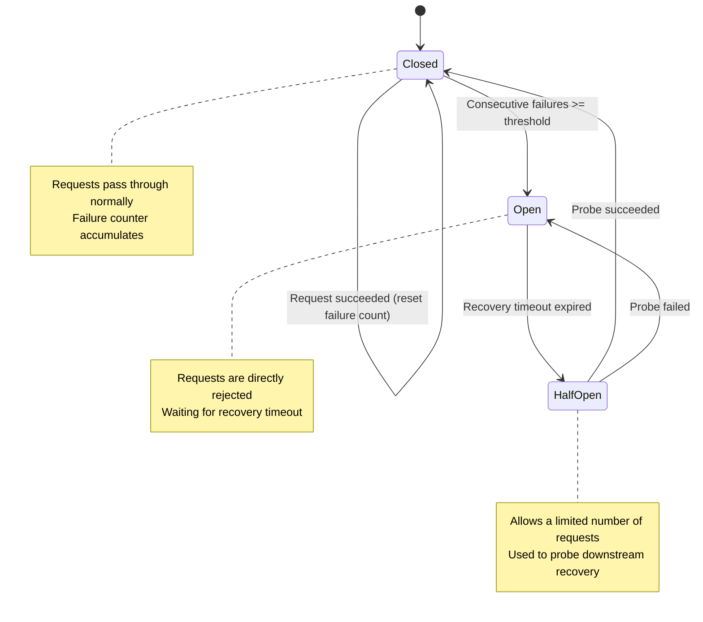

# Orchestration and Fault Tolerance

In 1978, American computer scientist Leslie Lamport posed a question in his paper "[Time, Clocks, and the Ordering of Events in a Distributed System](https://dl.acm.org/doi/10.1145/359545.359563)": a group of independent computer nodes, with no shared clock, where network messages may be delayed or lost -- how can they agree on the order of events? Lamport answered with logical clocks and causal ordering. That paper laid the theoretical foundation for distributed coordination. More than four decades later, its ideas still permeate the underlying design of database replication protocols, microservice governance, and message queues.

The coordination problem facing multi-agent systems is, at its core, the same one Lamport confronted. Except the nodes have evolved from deterministic computer processes into LLM-driven Agents that give uncertain answers, drift off course mid-reasoning, and output prose when they should be calling a tool. This raises the difficulty of orchestration to another level, requiring simultaneous handling of both classic distributed systems challenges and the non-determinism introduced by LLMs.

In 2007, Michael Nygard systematically cataloged production-grade fault tolerance patterns in his book "[Release It!](https://pragprog.com/titles/mnee2/release-it-second-edition/)" -- circuit breakers, timeout backoff, bulkhead isolation, steady-state maintenance. These lessons, originally distilled for service-oriented architectures, have been inherited almost intact by multi-agent systems. Orchestration and fault tolerance are two sides of the same engineering coin: orchestration defines the normal path, fault tolerance decides what to do when things go wrong.

## Foundations of Orchestration

**Static Orchestration** and **Dynamic Orchestration** represent two different design philosophies. Static Orchestration determines the complete execution flow before runtime and strictly follows the plan during execution. It is typically expressed as a Directed Acyclic Graph (DAG) or a finite state machine. In a DAG, each node represents an Agent task; in a finite state machine, each node represents an execution state. Edges represent dependencies or state transition conditions. The predictability of static orchestration is a significant advantage in scenarios requiring compliance auditing or reproducible results: the same input always produces the same flow structure, and problems can be easily traced back to a specific node. However, the real world does not always follow a predetermined script -- a tool interface may suddenly become unavailable, or an Agent may return an unexpected format, leaving the static flow stuck and unable to handle unanticipated situations.

Dynamic Orchestration delegates control to runtime reasoning. The orchestrator itself is an Agent that determines what to do next and which execution Agent to assign based on the current state. This approach is flexible and can navigate edge cases that predefined flows cannot cover, but it is also harder to audit since the complete execution trace cannot be known in advance.

In practice, the more common approach is hybrid orchestration, which uses a static workflow to define the broad framework -- specifying which phases must be passed through and which checkpoints must be triggered -- while letting the orchestrator dynamically decide each step within that framework. This is akin to driving with GPS navigation: the general route is determined before departure, but the actual turn at each intersection and whether to avoid congestion are decided by the driver based on real-time traffic conditions. The framework ensures no critical step is missed, while dynamic decisions provide resilience in the face of unexpected situations.

## Orchestration Patterns

There is more than one way to organize tasks. The choice of orchestration pattern depends on the intrinsic structure of the task -- whether dependencies between steps are linear or branching, whether intermediate decision points require dynamic judgment, and whether the complexity is self-similar across different levels of granularity. The four patterns below cover orchestration needs from simple to complex.

### Pipeline Orchestration

**Pipeline Orchestration** is the most intuitive pattern. It organizes tasks into a linear pipeline where each Agent specializes in one stage, and the output of the upstream stage serves as the input to the downstream stage. This pattern is naturally suited to tasks with clear sequential phases and well-defined responsibilities. Consider a content production pipeline: the Research Agent collects materials and compiles a structured summary, passes it to the Writing Agent who drafts the content, then to the Review Agent who fact-checks and polishes the wording, and finally to the Publishing Agent who formats and releases it. Each Agent only needs to focus on what it does best. The output format of the previous Agent is the input contract for the next. The advantage of pipelines lies in their clear structure and well-defined boundaries of responsibility -- any problem in a given stage can be quickly identified.

The throughput of pipeline orchestration is limited by the slowest stage -- the bottleneck effect familiar from assembly lines. If the reviewer is three times slower than the writer, the entire pipeline's output is held up at the review stage, and the writing Agent spends most of its time idle. Failure propagation is also a serious limitation: if any single stage fails, all subsequent stages have nothing to do. Adding a buffering mechanism (such as a message queue or intermediate cache) or degradation strategy at each pipeline junction would address this, but it would complicate what was once a simple pipeline structure.

### Fan-Out / Fan-In Orchestration

**Fan-Out / Fan-In** splits a task into multiple parallel sub-tasks, distributes them to several Agents for simultaneous execution, and then aggregates the results after all (or some) of them complete. This pattern directly addresses the throughput bottleneck of pipelines. The primary decision in the fan-out phase is "how many pieces to split the task into" and "who to assign them to." Splitting too finely means the overhead of orchestration coordination exceeds the time saved by parallel execution. Splitting too coarsely limits parallelism and wastes available Agent resources. The challenge in the fan-in phase is typically how to handle partial failures. Nine out of ten Agents have completed and one has timed out -- should you keep waiting, or proceed with the results from the nine? The answer depends on the nature of the task. If the task requires complete information for a critical decision, you must wait for all results. If it is a multi-option comparison, picking a few alternatives from the completed results is already sufficient for decision-making, and waiting for the slow one would only drag down overall response time.

A classic variant of fan-out/fan-in is **Map-Reduce**. This pattern was introduced by Google engineers Jeffrey Dean and Sanjay Ghemawat in their 2004 paper "[MapReduce: Simplified Data Processing on Large Clusters](https://dl.acm.org/doi/10.1145/1327452.1327492)". Originally designed for large-scale data processing, its three-stage structure of "decomposition, parallel processing, aggregation" (reinterpreted here from the perspective of Agent collaboration; the original MapReduce includes three core phases: Map, Shuffle, and Reduce) aligns perfectly with multi-agent collaboration scenarios. In an Agent system, the Map phase decomposes a complex task into multiple sub-tasks distributed to parallel Agents, and the Reduce phase uses a summarizing Agent to integrate, deduplicate, and resolve conflicts among the results from all parties. Map-Reduce is especially useful for tasks requiring multi-perspective analysis and multi-source information fusion -- for example, using multiple search strategies to retrieve answers to the same question and then merging and deduplicating, or having several Agents review the same contract from different dimensions such as legal, financial, and technical.

### Conditional Routing Orchestration

**Conditional Routing** allows the orchestrator to dynamically select the subsequent path based on intermediate results, using conditional judgments rather than a fixed flow to control direction. A typical conditional routing scenario is an automated code review pipeline. After code submission, a static analysis Agent first scans for code style issues. If it passes, a testing Agent runs unit tests. If the tests pass, a merge Agent automatically merges into the main branch. If any step fails, the submission is routed to an issue reporting Agent, which generates detailed fix recommendations and sends them to the submitter. Each step is a conditional decision node, and the entire flow forms a binary decision tree.

The difficulty of conditional routing lies not in implementing the conditional judgments themselves, but in the fact that the judgments can be wrong. When the decision logic depends on the reasoning output of an LLM, the risk of misjudgment is a real concern. For example, if an Agent incorrectly determines that a test suite with a 98% pass rate has failed, the flow will proceed down the wrong branch, triggering an unnecessary cycle of code fixes. Mitigating this requires adding additional validation at decision points -- for instance, verifying borderline results through multiple sampling, or introducing a human confirmation step for high-impact branching decisions. Another concern is workflow combinatorial explosion. Each additional conditional node doubles the number of possible execution paths. When the number of paths grows to several dozen, test coverage becomes impossible and debugging becomes a nightmare. A practical principle in conditional routing design is to keep the total number of paths within a maintainable range -- better to have a few broad branches than dozens of narrow ones, unless you have a comprehensive tracing system that automatically records the execution trajectory of every path.

### Recursive Orchestration

**Recursive Orchestration** allows the orchestrator to further decompose and orchestrate a sub-task, creating nested layers of orchestration. This pattern is suitable for tasks whose complexity exhibits self-similar structure at different levels of granularity. A large project is decomposed into modules, each module into sub-tasks, and sub-tasks may need further decomposition. In a codebase-level refactoring task, a top-level orchestrator might divide the work by directory into several module-level orchestrators, each of which then divides its work by file into several file-level Agents.

Recursive orchestration requires attention to the termination condition. Two signals can help determine when to stop drilling down and hand the task to a single Agent for direct execution. One is the granularity signal: when the task granularity is small enough to be completed by a single Agent in one reasoning pass, the orchestration cost of further decomposition exceeds the benefit of parallel execution. The other is the depth signal: set a hard maximum recursion depth as a fuse to prevent the orchestrator from drilling infinitely into an exceptionally difficult sub-problem. This situation is more common in practice than one might expect -- LLMs can sometimes fixate on a detail they do not understand, breaking the task into ever-finer pieces without getting any of them right.

The implementation challenge of recursive orchestration is primarily at the engineering level. Multi-layer nested execution cannot be clearly expressed in a flat flowchart. Debugging requires tracing execution trajectories across multiple layers, and figuring out which orchestrator is waiting for which Agent's result becomes a troubleshooting problem in itself. A deeper issue lies in the "orchestration tower" formed by nested structures: the top-level orchestrator is waiting for a mid-level orchestrator to return results, the mid-level orchestrator is waiting for lower-level Agents to complete, and those lower-level Agents are themselves queuing and retrying due to LLM API rate limits. In this scenario, the entire call chain is spinning its wheels, and to the user the system appears frozen with no indication of where the blockage is.

## Fault Tolerance Mechanisms

Orchestration solves the problem of how the system operates under normal conditions; fault tolerance answers what to do when something goes wrong. Multi-agent systems have a broader failure surface than traditional distributed systems. The non-determinism of LLM outputs, combined with the inherent uncertainty of distributed systems, means the complexity of troubleshooting is multiplicative, not additive.

### Timeout and Retry

**Timeout** is the first line of defense in fault tolerance, and also the most easily underestimated. Its principle is simple: set a maximum wait time for each operation, and treat exceeding it as a failure. But determining the right timeout value is far from easy. Set it too short, and the probability of misclassifying normal operations as failures rises sharply, triggering unnecessary retries that can overwhelm an already fragile system, creating a vicious cycle. Set it too long, and the impact of a failure spreads -- users wait idly at the screen while downstream resources are held up by ineffective operations. A practical approach is to use graded timeouts based on operation type: tool calls typically should not exceed 30 seconds, a single Agent reasoning pass can be set to 5 minutes, and the overall end-to-end task timeout can be set to 1 hour. The benefit of graded timeouts is that lower-level operations expose failures faster, allowing them to be cut off at the source before propagating upward.

**Retry** is the most basic recovery mechanism after a timeout. It operates on the assumption that failures are transient -- an API is temporarily rate-limited, the network experiences a brief glitch, or a tool happens to be restarting. Retry strategies have evolved from simple to sophisticated. The simplest fixed-interval retry has a fatal flaw in concurrent scenarios: a large number of requests may fail simultaneously for the same reason, retry simultaneously, and fail simultaneously again, creating a "thundering herd" effect. Exponential Backoff increases the wait interval between retries exponentially, giving the downstream system time to recover. Going further, adding random Jitter to the backoff interval spreads a batch of simultaneously failing retries across the timeline, avoiding the awkward situation where retries synchronize even with backoff.

However, retry is not a panacea. Deterministic errors (such as malformed parameters) will never succeed no matter how many times they are retried -- continuing to retry only wastes time and API quota. Operations with side effects (such as sending an email or processing a payment) can lead to duplicate execution if retried. This means retry must be combined with idempotency design, a topic that will be explored further in the consistency section.

### Degradation and Fallback

When the primary approach has definitively failed and retry cannot resolve the issue, **Degradation** becomes the necessary fault tolerance strategy. Degradation sacrifices partial quality for availability, allowing the system to return a result that is at least "usable" rather than failing completely. Degradation can be implemented at multiple levels. At the tool level, when the preferred search API is unavailable, the system automatically switches to a backup search engine -- the results may be slightly less relevant, but the overall query task is not interrupted. At the Agent level, when a specialized legal text Agent is unavailable, a general-purpose Agent is scheduled as a temporary replacement -- the legal analysis may not be as deep, but it can at least produce a usable preliminary assessment. At the task level, when a full task cannot be completed, partial results are delivered -- for instance, if a ten-page report is requested but only eight pages are completed, delivering those eight pages is far better than delivering nothing.

**Fallback** is the end of the degradation chain. When all automated recovery methods are exhausted, a predefined alternative behavior is executed -- such as returning cached results, giving a default response, or escalating the task to a human. There is an easily overlooked detail in fallback design: when escalating to a human, context must be included -- what the original task was, which steps were completed, which steps failed, and why. A fallback ticket without context forces the reviewer to reconstruct the entire execution scenario from scratch, which is itself a secondary waste.

An important principle in designing degradation and fallback is that every critical operation should have at least one backup path. The quality of the backup path can be lower than the primary path, but it must not be absent entirely. A fault tolerance plan with no backup path is not fault tolerance -- it is wishful thinking.

### Checkpoint and Recovery

Retry and degradation address what to do when a single operation fails. **Checkpoint** addresses how to recover when an entire flow crashes. It saves a complete snapshot of the system state at critical points, so that after a failure, the system can resume from the most recent snapshot rather than starting over from scratch. The contents saved in a checkpoint include the output results of completed tasks, the progress information of tasks still in execution, and the state of the workflow itself (which nodes are completed, which are running, and which are still waiting for upstream dependencies). The granularity of checkpointing involves a trade-off. Task-level checkpoints (saving after each Agent completes) are the most fine-grained, minimizing rework, but they also incur the highest I/O overhead. Phase-level checkpoints (saving after each orchestration phase) strike a balance between overhead and recovery efficiency. Global checkpoints (a single snapshot of the entire workflow) have the lowest overhead but require significant rework to recover to the failure point.

There is more than one recovery strategy. Restarting from the most recent checkpoint is the most common approach, skipping completed tasks and continuing from the breakpoint. In some scenarios, a full re-execution is actually the safer choice, because the state saved in a checkpoint may itself be inconsistent -- for example, if an Agent had written only half a file when the checkpoint was taken, that half-finished artifact becomes a potential source of bugs after recovery. The checkpoint pattern has a notable variation in multi-agent collaboration: the checkpoint not only saves task progress, but also the shared context between Agents. If an Agent resumes execution after a failure, it needs to know at which node it was interrupted, what the other Agents have done, and what the current focus of discussion is. Without this context, a recovered Agent is like someone arriving late to a meeting -- it needs extra time to catch up on what happened before.

### Circuit Breaker Pattern

The **Circuit Breaker** is one of the fault tolerance patterns systematically described by Michael Nygard in "[Release It!](https://pragprog.com/titles/mnee2/release-it-second-edition/)". Its design intent is to prevent fault propagation. When a downstream component is found to be persistently failing, requests to it are actively stopped, reserving resources for healthy components and giving the failing component time to recover. The name comes from the physical circuit breaker that automatically trips when current overloads to protect the circuit from damage.

The circuit breaker has three states with clear transition logic. In the **Closed** state, the circuit breaker operates normally -- requests pass through, and the failure count is accumulated. When the consecutive failure count reaches a preset threshold, the circuit breaker trips to the **Open** state, after which all requests are directly rejected without being sent to the downstream component, avoiding wasted resources on operations that are known to fail. After the Open state persists for a recovery timeout period, the circuit breaker enters the **Half-Open** state, allowing a limited number of probe requests through to test whether the downstream component has recovered. If a probe succeeds, the circuit breaker closes and returns to normal. If a probe fails again, the circuit breaker reopens and continues waiting.

*Figure: Circuit Breaker State Machine*

In Agent systems, typical scenarios for the circuit breaker include: when a tool continuously returns errors, an LLM API is persistently rate-limited, or a specialized Agent keeps returning abnormal states (such as timeout, format errors, or resource exhaustion), the circuit breaker automatically opens, and the orchestrator switches to an alternative plan or degradation path.

## Consistency and Idempotency

In scenarios with multiple Agents executing in parallel, retry, degradation, and checkpoint recovery can all introduce ambiguity in state, requiring additional correctness guarantees -- the most typical of which are consistency and idempotency.

### Idempotency of Operations

**Idempotency** means that performing an operation once has the same effect as performing it multiple times. In fault-tolerant systems, this property is not a nice-to-have but a baseline for correctness. As long as a system has a retry mechanism, idempotency must be incorporated into the design; otherwise, retry itself becomes a source of bugs.

Idempotent operations are actually quite common in a programmer's daily work. Reading data is naturally idempotent -- reading ten times shows the same content as reading once. Setting a field to a fixed value is also idempotent -- setting it to `5` produces the same result no matter how many times it is executed. But the operation "increment a counter by one" is not idempotent. This is why distributed counting typically requires a unique key combined with application-level deduplication for idempotent increments (for example, using Redis's `HINCRBY` command combined with `SETNX` for request deduplication), rather than a simple `count += 1`.

In Agent systems, non-idempotent operations are everywhere. Sending a notification email, appending a log entry, creating a database record -- if these operations are executed twice due to retry, the user will receive two identical emails and the log will contain duplicate entries. The standard approach to making non-idempotent operations idempotent is to introduce a unique request identifier (Idempotency Key). Each tool invocation by an Agent carries a globally unique ID. The server executes the operation and records the ID upon first receipt. Subsequent retry requests carrying the same ID directly return the cached result without repeating the execution. This approach is implemented in the APIs of Stripe and OpenAI, and the tool invocation layer of Agent systems can readily adopt it.

### Result Consistency

When multiple Agents execute in parallel, their intermediate results may conflict with each other. **Consistency** describes the ability of a system to keep its state satisfying specific constraints under concurrent operations. In distributed systems, consistency is a precisely defined concept. Strong consistency requires that all operations appear to happen atomically in a single global order, as if only one replica were serving requests, at the cost of expensive coordination overhead. Eventual consistency relaxes this requirement, allowing temporary inconsistency while guaranteeing that as long as no new writes occur, all replicas will eventually converge to the same state. This concept was classically articulated by Amazon CTO Werner Vogels in his 2008 article "[Eventually Consistent](https://dl.acm.org/doi/10.1145/1435417.1435432)", which redefined the correctness standard for large-scale internet systems.

Agent systems typically choose eventual consistency, because achieving strong consistency usually requires consensus protocols (such as Raft/Paxos) or distributed transaction protocols (such as two-phase commit), whose latency and complexity far outweigh their benefits in multi-agent collaboration. The granularity of Agent tasks is typically much coarser than that of database transactions -- an Agent may take tens of seconds to complete a single reasoning pass, and locking shared state during this time would mean all other Agents are idle, which is clearly impractical. When conflicts do arise, several common resolution strategies exist. Timestamp precedence is the simplest -- the later write overwrites the earlier one. Source precedence is more meaningful in certain scenarios -- for instance, a legal review Agent's judgment on a contract clause should override a general-purpose Agent's assessment of the same issue. Merge strategy uses a summarizing Agent to synthesize conflicting results from multiple parties into a compatible version, which is most suitable when multiple perspectives need to be preserved.

### Compensating Transaction

Some operations are inherently non-atomic to roll back. An already-sent email cannot be unsent. Once a triggered GitHub webhook has been successfully processed by the receiver, its side effects cannot be atomically undone. **Compensating Transaction** is the approach for such situations: when completed steps cannot be rolled back, a semantically opposite operation is executed to neutralize their effects. There is a fundamental difference between a compensating transaction and a database transaction rollback. A database rollback is automatic and atomic -- like pressing an undo button, all traces of intermediate states disappear. A compensating transaction, by contrast, is manual and semantic -- it does not erase what happened, but offsets the impact of what happened. A sent email cannot vanish from the recipient's inbox, but you can send a follow-up correction notice saying "please disregard the previous email."

Designing compensating transactions requires following several principles. For every operation with external side effects (sending a notification, creating a ticket, modifying data in an external system), its compensating action should be considered at the time of writing the code. The compensating operation itself must also be idempotent, because the request to send the compensation may also be retried due to network issues. If two consecutive "please disregard the previous email" correction notices reach the same recipient, the non-idempotent compensation itself becomes an operation that needs further compensation, creating infinite recursion.

## Summary

Orchestration and fault tolerance are two sides of the same engineering problem. Orchestration plans how the normal path flows; fault tolerance decides how to respond when anomalies occur. In multi-agent systems, the non-determinism of LLMs, combined with the inherent uncertainty of distributed systems, amplifies the complexity of troubleshooting exponentially. From pipelines, fan-out, to recursion, the choice of orchestration pattern depends on the intrinsic structure of the task. Timeout and retry, degradation and fallback, checkpoint and recovery, and the circuit breaker pattern form a progressively layered defense.

## Exercises

1. Suppose you need to design a multi-agent system for code review, with the following flow: code submission → static analysis → unit test → (automatically merge on success / generate fix suggestions on failure). Draw a DAG diagram of this flow, determine whether it contains a fan-out/fan-in structure, and identify which nodes are suitable as checkpoints.

   

   
Reference Answer

   The flow DAG contains the following nodes: code submission → static analysis → unit test (on success, enter the automatic merge node; on failure, enter the fix suggestion generation node). The overall structure is linear with a conditional branch. There is no fan-out/fan-in structure, because the two downstream nodes of the conditional branch do not execute in parallel -- at runtime, only one path is followed. However, a checkpoint can be introduced after static analysis completes, since it is the first quality gate in the entire flow. At this point, saving the original submission content, static analysis results, and workflow state has low cost, and if any subsequent step fails, recovery can start from the static analysis completion point without re-scanning.

   Suitable checkpoint nodes include: (1) after static analysis completes (save analysis results and original code), (2) after unit tests complete (save test report), (3) after merge or report generation completes (save final state).

   

2. In a fan-out/fan-in orchestration, the orchestrator fans the task out to five Agents for parallel execution, and one of the Agents times out without responding. Propose two handling strategies and analyze their respective applicable scenarios and risks.

   

   
Reference Answer

   **Strategy 1: Wait for All Results**. Continue waiting for the timed-out Agent until it responds. Alternatively, abandon the current Agent and retry: launch a new Agent to re-execute the sub-task, which is a variation of Strategy 1 but carries the additional risk of duplicate computation. This approach is suitable for scenarios where complete information is needed for decision-making (such as financial auditing requiring reconciliation of all accounts). The risk is that the timeout may persist for a long time, making overall latency uncontrollable.

   **Strategy 2: Proceed with Partial Results**. Ignore the missing sub-task result and aggregate the results from the four Agents. Suitable for scenarios with information redundancy, such as multi-option comparison (e.g., asking five Agents to each propose a design plan, where four plans already provide sufficient diversity). The risk is that the missing sub-task may have happened to contain critical information.

   A compromise strategy is to use two-level timeouts: after a short timeout, first produce a preliminary output using the available results; after a long timeout, supplement the missing sub-task results and generate a revised version.

   

