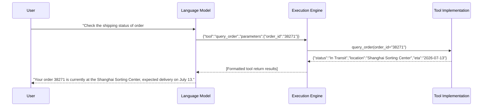
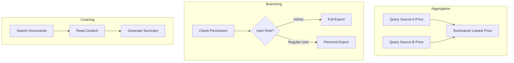

# Tool Use

In early 2023, the Meta AI team released the Toolformer model, demonstrating that language models can autonomously learn to use tools through self-supervised learning without extensive human annotation. In June of the same year, OpenAI officially introduced Function Calling in GPT-4, moving tool use from academic experiments to engineering products. Since then, tool use has evolved from research exploration to practical engineering, becoming essential infrastructure for building LLM applications.

## Fundamentals of Tool Calling

Imagine you are building a customer service Agent, and a user types "Check the shipping status of order 38271." The language model itself can only generate descriptive text about how to check logistics, guide the user through the process, or fabricate a shipping status entirely. It cannot actually access your order database because it has no database connection, no SQL execution permissions, and cannot even make network requests. In the [previous article](llm-to-agent.md), we discussed in detail the capability boundaries of LLMs, where the primary limitation is that the model can only passively generate text and cannot actively interact with the external world. Tool calling is the mechanism designed to address this limitation, equipping the model with "hands and feet" to reach real data and real operations beyond text.

From an engineering perspective, the essence of tool calling is structured output. The model does not actually learn to invoke a tool; rather, it learns to generate structured data conforming to a predefined Schema under specific prompt formats. Below is a simplified example showing the different outputs for the same user request in normal mode versus tool calling mode:

- Normal mode: `Sure, let me check the shipping status of order 38271 for you. Your order may be in transit...` (fabricated content)
- Tool calling mode: `{"tool": "query_order", "parameters": {"order_id": "38271"}}` (structured instruction)

The second output is no longer text meant for human reading, but an instruction meant for machine parsing. After receiving this JSON object, the execution engine calls the `query_order` function, returns the real order data to the model, and the model then generates the final response based on actual data. The entire process forms a complete call chain, as illustrated in the diagram below:



*Figure: Complete sequence flow of tool calling*

In this flow, the model does not directly execute any operation; it is only responsible for deciding which tool to call and what parameters to pass. The actual execution is handled by the execution engine and tool implementation. The model's role remains what it does best: understanding user intent and generating correct instructions.

### Tool Description

The model learns about available tools, what each tool can do, and what parameters are needed through **Tool Descriptions**. Tool descriptions are structured information about available tools that should be injected into the prompt. They serve as the bridge connecting the model's reasoning capability with external functionality, and their quality directly determines the accuracy of the model's tool selection and parameter filling. A good tool description typically includes three elements: a functional summary (a one-sentence description of what the tool does), parameter specifications (each parameter's type, meaning, value range, and whether it is required), and usage scenarios (when this tool should be selected). A vague description might look like:

```
Tool: get_weather
Parameters: location
```

This kind of description contains numerous fatal ambiguities. For instance, `location` could be a city name, postal code, geographic coordinates, IP address, or even a landmark name. The model has no way to determine what format value to pass and can easily fill in the wrong type of parameter due to the lack of constraints. In contrast, a well-designed tool description eliminates these ambiguities:

```json
{
  "name": "get_weather",
  "description": "Queries real-time weather information for a specified city, returning temperature, humidity, wind speed, and weather conditions. Suitable for scenarios where users ask 'How's the weather today?' or 'Will it rain in Beijing?'. Not suitable for weather forecasts or historical weather data queries.",
  "parameters": {
    "type": "object",
    "properties": {
      "city": {
        "type": "string",
        "description": "Full city name in English, such as 'Beijing' or 'Shanghai'. Do not use abbreviations, postal codes, or non-English names."
      },
      "unit": {
        "type": "string",
        "enum": ["celsius", "fahrenheit"],
        "description": "Temperature unit, defaults to celsius. Only pass fahrenheit when the user explicitly requests Fahrenheit.",
        "default": "celsius"
      }
    },
    "required": ["city"]
  }
}
```

This version adds several layers of critical information compared to the former. The `description` clearly states the tool's scope and limitations, preventing the model from incorrectly selecting this tool when it should use another (such as a weather forecast API). The `city` parameter specifies format requirements for city names, using examples to exclude ambiguous inputs like English names or postal codes. The `unit` parameter uses `enum` to restrict valid values and `default` to set a default, providing a reference for the execution engine and application-layer code even when the model does not pass this parameter. The `required` array marks `city` as mandatory, allowing the system to intercept errors early rather than passing them to the tool.

Engineering practice for tool descriptions also requires consistency in naming conventions. If one weather tool is called `get_weather` but a stock tool is called `stock_query`, the inconsistency in verb position increases the model's selection burden. Projects should uniformly adopt either a "verb + noun" pattern (such as `query_weather`, `query_stock`) or a "noun + verb" pattern (such as `weather_query`, `stock_query`), maintaining consistency across all tool descriptions.

### Tool Selection

After receiving a user request along with the tool list, the model needs to select the most appropriate tool from the available options. This process happens implicitly, without an explicit intermediate step of "comparing the pros and cons of each tool." Based on the semantic match between user intent and tool descriptions, the model directly outputs the selected tool name and parameters. The main factors affecting selection accuracy are the number of tools, their distinctiveness, and the clarity of user intent. The more tools available, the harder it is for the model to make the correct choice from numerous candidates, much like a restaurant menu with 50 pages makes it easier to order the wrong dish than one with just 5 pages. Lack of distinctiveness between functionally similar tools is another common pitfall. For instance, if the descriptions of `web_search` and `net_fetch` are too similar, the model will struggle to determine which one to use. The clarity of user intent also matters significantly -- "check the weather for me" is much easier for the model to handle correctly than "look something up for me," because the latter does not provide enough information to narrow down the tool options.

Grouping tools by functional domain is an effective dimensionality reduction technique. Tools are first categorized by business domain (such as order management, user management, data analysis), and the model first selects a functional domain before choosing a specific tool within that domain. This is equivalent to splitting a large menu into several sub-menus. Clearly specifying applicable and inapplicable scenarios in tool descriptions significantly improves distinctiveness. For example, the description for `web_search` could note that it is suitable for searching public web content but not for network downloads. Additionally, providing complete examples of one or two tool uses in the system prompt can help the model better understand tool selection logic through In-Context Learning.

## Protocol Design for Tool Calling

While the mainstream function calling formats currently differ in their details, they all revolve around the same fundamental elements: a tool name (a string identifying the target function), a parameters object (a set of key-value pairs defining the inputs for the call), and a call identifier (used to pair the call with its return result). OpenAI's Function Calling, introduced in 2023, was the first widely adopted function calling format, using JSON Schema to describe tool parameter structures, with the model's call instruction output being a JSON object containing `name` and `arguments` fields. Anthropic's Tool Use protocol follows a similar design, also using JSON Schema for parameter structure descriptions with native support for nested objects and arrays. Open-source models like Llama and Qwen also have their own tool calling formats built into their Chat Templates. Although the syntax varies across these designs, the underlying philosophy is consistent.

Format differences pose practical challenges for multi-model engineering. If your Agent needs to support both GPT and Llama models simultaneously, you must handle two different tool calling formats. A common approach has been to establish a unified **Canonical Tool Representation** within the system, converting tool formats from different models at both the input and output ends, thereby isolating the impact of format differences on higher-level business logic. As the Agent ecosystem expands, this approach has been standardized and productized on a broader scale.

In November 2024, Anthropic open-sourced the **Model Context Protocol (MCP)**, an open standard for connecting AI systems with external tools and data sources. The MCP protocol consists of three components. The MCP Server is the provider of tools and data, exposing three types of capabilities:
- Tools: Callable functions, such as querying a database or sending an email.
- Resources: Readable static data, such as file contents or API documentation.
- Prompts: Reusable prompt templates, such as a "generate weekly report" script framework.

The MCP Client resides on the AI application side, connecting to the Server and passing the backend's tool list to the LLM, which then decides when to call which tool. The transport layer supports two modes: STDIO (local process communication, suitable for personal development environments) and Streamable HTTP (remote service communication, suitable for team-shared production services).

The design philosophy of MCP is consistent with that of a canonical tool representation -- both aim to define a universal format that all participants agree upon, eliminating fragmented integration methods. However, they operate at different levels. A canonical tool representation at the application layer addresses the problem of how a single Agent can interface with multiple different LLM providers, converting both OpenAI's Function Calling format and Anthropic's Tool Use format into a unified internal format. MCP, on the other hand, addresses the problem of how a single tool can be used by multiple different AI applications. Before MCP, if you wanted Claude Desktop, Cursor, and your custom Agent project all to access your database, you would need to write separate integration code for each client, creating an integration matrix of N tool sources times M AI applications. MCP defines a standard tool description format (`name` + `description` + `inputSchema`) and communication protocol (such as JSON-RPC 2.0). Tool providers only need to implement a single MCP Server, and any MCP client can discover and call the tools within it. This is analogous to how the USB interface standardized device connections -- peripheral manufacturers no longer need to design different interfaces for different computers, and computer manufacturers no longer need to write different drivers for each peripheral.

## Constrained Decoding

The tool calling we have discussed so far assumes that the model has already generated complete and correct tool call commands with parameters. However, model generation is inherently stochastic. While we can inspect and correct generation results after the fact, this is a post-hoc validation that can catch errors but cannot prevent them from occurring. If the model deviates from the tool's defined Schema while generating parameters -- for instance, generating `"kelvin"` for a `unit` parameter that only accepts `"celsius"` and `"fahrenheit"` -- the parser can only report an error and ask the model to regenerate, wasting an entire inference cycle.

**Constrained Decoding** does not validate after generation; instead, it restricts the model to only output tokens that conform to the Schema during the generation process. This is equivalent to adding a filter to the model's output, where each step of token selection is constrained to a valid range, eliminating format errors at the source. Its working principle relies on the fundamental way language models generate text. At each step of token generation, the model computes a probability distribution over the entire vocabulary and then samples from it. Constrained decoding inserts a masking operation before this sampling step, forcibly setting the probabilities of tokens that do not conform to the current Schema constraints to zero, thereby ensuring that the sampling result always falls within the valid range. For example, when the output needs to be a JSON string, the first character under constrained decoding can only be a left curly brace `{`, and the probabilities of all other tokens in the vocabulary are set to zero.

Different vendors and open-source projects implement this mechanism in various ways. OpenAI's Structured Outputs, introduced in 2024, is a productized implementation of constrained decoding. It guarantees at the API level that model output strictly conforms to the provided JSON Schema, eliminating the need for developers to write their own parsing and retry logic. In the open-source ecosystem, the llama.cpp project uses GBNF grammar (GGML BNF) to define output grammar constraints. Any output format that can be described as a context-free grammar can be constrained using GBNF. This covers a broader scope than JSON Schema and offers finer granularity, directly controlling token-level generation. Open-source libraries like Outlines adopt a similar approach, compiling JSON Schema into a finite-state automaton and using the automaton's state at each inference step to determine which tokens are valid.

Constrained decoding and post-hoc validation are not substitutes for each other. Constrained decoding provides format guarantees during the generation phase, preventing the model from producing format errors. However, for semantic-level errors -- such as the model passing `"Mars"` as the `city` parameter -- constrained decoding cannot detect them because `"Mars"` is a valid `string` type and is not within an `enum` constraint. Such semantic errors still require post-hoc business-level validation by the parser. In practice, constrained decoding handles format correctness while post-hoc validation handles semantic correctness, together forming a comprehensive quality assurance system for parameters.

## Advanced Tool Calling Patterns

In practice, complex user requirements may involve the coordination of multiple tools, dynamic tool expansion, or even require the model to create new tools when none are suitable. These higher-level capabilities represent the progression from being able to use tools to using them well.

### Tool Composition and Chained Calls

The capability of a single tool is limited. Querying weather requires one tool, booking a restaurant requires another, and "book a restaurant with indoor seating for me on a rainy day" requires two tools to work together. This is the problem that tool composition addresses. In tool composition, the chaining pattern is the most common, where the output of Tool A serves directly as the input of Tool B, forming a linear call chain. For example, first use a file search tool to find the path of a relevant document, then use a file reading tool to retrieve the document content. The branching pattern selects different subsequent tools at a decision point based on the current result. For instance, first check the user's permissions; if they are an admin, call the full data export tool; if a regular user, call only the personal data export tool. The aggregation pattern merges the return results from multiple tools, such as querying product prices from multiple data sources simultaneously and returning the lowest price after summarization.



*Figure: Three tool composition patterns*

A point worth discussing here is the ownership of orchestration rights, that is, who decides the call sequence and branching direction. Model autonomous decision-making (where the LLM dynamically decides which tool to call next based on reasoning results) offers the most flexibility, but flexibility also means poor predictability -- the model may switch back and forth between tools, wasting tokens and increasing latency. Predefined workflows (defining the tool call sequence in advance using a directed acyclic graph) are the most reliable, but rigid flows cannot handle edge cases unforeseen during workflow design. In engineering practice, these two modes are typically combined to leverage the strengths of each. The framework defines the main task flow (such as "search, read, generate report"), while within each node, the model autonomously determines specific tool parameters and retry strategies (such as "whether to re-search with different keywords if search results are insufficient").

### Tool Learning and Tool Creation

Tool learning and tool creation represent two directions in the evolution of tool calling: horizontal expansion (improving the efficiency of existing tool use through accumulated experience) and vertical advancement (expanding capability boundaries by creating new tools).

**Tool Learning** refers to the model gradually improving its efficiency and accuracy in using tools through accumulated experience of tool use. The term "learning" might sound like the model is improving on its own, but in reality, current large language models do not permanently learn from using a particular tool because they lack an online learning mechanism. In practice, tool learning is achieved through external memory. Historical records of successful and failed tool calls are stored in a memory system, and in subsequent similar scenarios, relevant experiences are retrieved and injected into the prompt as reference examples, simulating the effect of learning from experience through in-context learning.

**Tool Creation** is a higher-order capability compared to tool use. It requires the model not only to correctly select and use existing tools but also to recognize when a task requires a tool that does not yet exist and to design that tool. For example, when faced with a complex data processing task, an Agent might find that no existing tool can complete the required data transformation in one step, so it writes a data processing script and then uses that script to complete the subsequent steps. The implementation of tool creation depends on the combination of the model's programming ability, deep understanding of task requirements, and a secure code execution environment.

## Chapter Summary

Tool calling transforms language models from text generators that can only talk into actors that can interact with the external world. Its essence is structured output -- under appropriate prompt guidance, the model generates instructions that can be parsed by machines, and the execution engine then carries out the actual operations. Whether it is the wording of tool descriptions or the choice of protocol format, whether it is the masking mechanism of constrained decoding or the orchestration strategy for multi-tool coordination, every step is about finding the engineering sweet spot between precision and flexibility.

## Exercises

1. What is the essence of tool calling? How does it differ from ordinary text generation?
   <details>
   <summary>Reference Answer</summary>

   The essence of tool calling is structured output. What the model learns is not how to actually execute a tool, but how to generate structured data (typically a JSON object) conforming to a predefined Schema, guided by a specific prompt format, rather than free-form natural language text. The difference from ordinary text generation lies in the objective: ordinary text generation pursues fluency and naturalness, targeting human readability. Tool calling pursues precise parsing, targeting machine execution. An extra comma could cause JSON parsing to fail, so the requirements for format correctness are far higher than for ordinary text.

   </details>

2. Read the discussion on LLM capability boundaries in the [previous article](llm-to-agent.md), and combine it with the knowledge of tool calling from this article to analyze why tool calling is a necessary foundation for building Agents.
   <details>
   <summary>Reference Answer</summary>

   LLMs have three core capability boundaries: they cannot actively interact with the external world (they can only generate text), their knowledge is limited to training data (they cannot access real-time information), and their context window is finite (they cannot retain all historical information). Tool calling directly addresses the first limitation, using a structured output mechanism to enable the model to generate machine-executable instructions, thereby indirectly querying databases, calling APIs, and manipulating file systems. For the issue of knowledge timeliness, tool calling enables the model to access real-time external data sources (such as search engines and databases), extending static knowledge into dynamic knowledge. For the limitation of context windows, tool calling provides an external memory capability -- the model does not have to fit all information into the context but can write information to external storage through tools and read it back through tools when needed. Therefore, tool calling is not an optional component of Agents but the key qualitative leap that transforms Agents from being able to talk to being able to act.

   </details>
