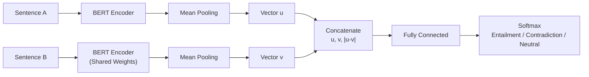
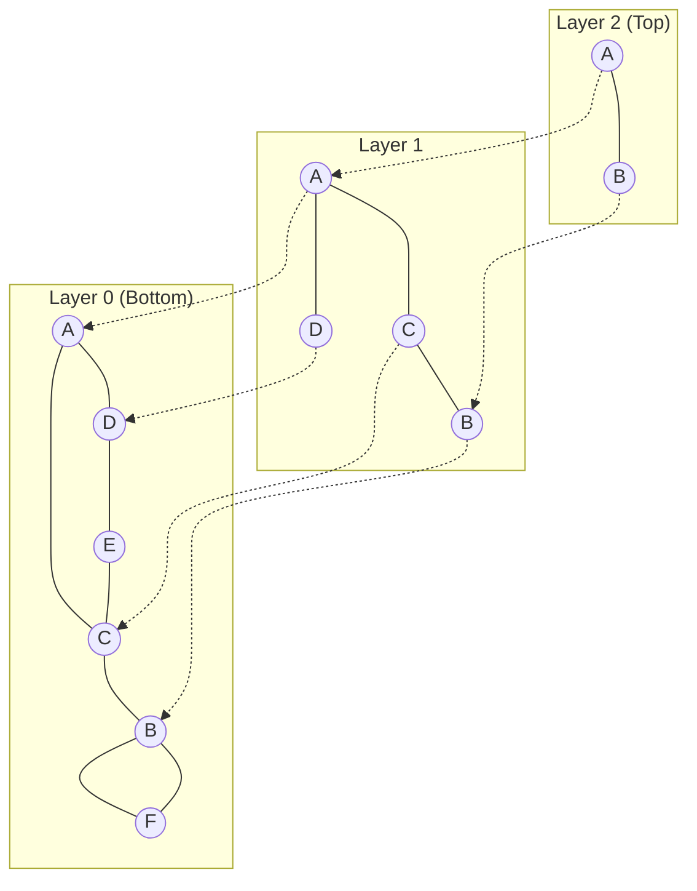
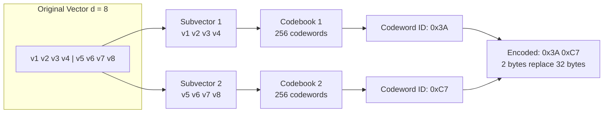

# Embedding and Vector Retrieval

Language models learn patterns and knowledge from vast amounts of text, storing this knowledge in their model parameters. This process of knowledge internalization means that everything a model knows comes from its training data -- it has no knowledge of events that occurred after the training cutoff, it has never read an organization's private documents, and it may not have encountered niche knowledge from specialized domains during training. Since a model cannot memorize everything, when a user asks a question beyond its known scope, the system should first retrieve relevant information from an external knowledge base, then feed this information along with the question to the language model, allowing the model to generate an answer based on the retrieved material. This is the fundamental idea behind **Retrieval-Augmented Generation** (RAG).

RAG decomposes the problem into two tasks: generation and retrieval. Generation is handled by the language model, which we have already covered in great detail in previous chapters. Retrieval is the subject of this chapter -- we will discuss how to represent the semantics of text using vectors, and how to quickly find content most relevant to a query among a massive collection of documents.

## Evolution of Embedding Models

The idea of converting text into vectors for retrieval dates back to the 1970s. The SMART information retrieval system, developed under the leadership of American computer scientist Gerard Salton at Cornell University, first introduced the **Vector Space Model** (VSM). The core idea of this model still appears in textbooks fifty years later. It represents documents as sparse vectors weighted by [Term Frequency - Inverse Document Frequency](https://en.wikipedia.org/wiki/Tf%E2%80%93idf) (TF-IDF), and computes the similarity between a query and a document as the [cosine similarity](../../maths/linear/vectors.md#inner-product-and-projection) of the two vectors. From today's perspective, this approach is essentially keyword matching, but it was revolutionary at the time because it was the first to frame retrieval as a geometric computation problem.

In 1990, Scott Deerwester et al. published a paper titled "[Indexing by Latent Semantic Analysis](https://doi.org/10.1002/(SICI)1097-4571(199009)41:6<391::AID-ASI1>3.0.CO;2-9)" in JASIS, proposing Latent Semantic Indexing (LSI). LSI discovered that after reducing the dimensionality of the term-frequency matrix via [singular value decomposition](../../statistical-learning/unsupervised-learning/dimensionality-reduction.md#singular-value-decomposition), semantic relationships between synonyms and near-synonyms could be captured in a low-dimensional space. The words "apple" and "orange" are completely different on the surface, but in LSI's low-dimensional space, their vectors end up very close together. This marked an important step in moving retrieval systems from literal keyword matching toward semantic understanding.

The true paradigm shift occurred in 2013. During his time at Google, Czech computer scientist Tomas Mikolov published the paper "[Efficient Estimation of Word Representations in Vector Space](https://arxiv.org/abs/1301.3781)", proposing the Word2Vec model. Word vectors obtained through simple neural network training encoded rich semantic relationships. Subtracting the vector for "king" from "man" and adding "woman" produced a vector closest to "queen." The era of [Word Embedding](../../deep-learning/sequence-models/word-embedding.md) had begun.

In 2018, BERT pushed context-aware word representations to new heights. Nils Reimers and Iryna Gurevych from the Technical University of Darmstadt, Germany, built on BERT to propose Sentence-BERT, which used a Siamese network architecture and contrastive learning to transform BERT into an efficient sentence embedding model, achieving search speeds thousands of times faster than the original BERT.

From VSM to Sentence-BERT, and to today's more powerful embedding models such as BGE and E5, this evolutionary trajectory has enabled computers to understand the intrinsic meaning of text rather than just its literal form. When embedding models can map semantically similar content to nearby locations in vector space, retrieval is no longer about keyword matching but about finding semantically related information. This is an essential prerequisite for the birth of Retrieval-Augmented Generation systems.

## From Word Embeddings to Text Embeddings

The [Language Models and Tokenization](../../language-models/architecture-basics/language-model-tokenization.md) chapter introduced the basic principles of word embeddings. Models like Word2Vec and GloVe map each word to a dense vector, ensuring that semantically similar words are close to each other in vector space. However, in practical retrieval scenarios, what we typically need to encode are sentences, paragraphs, or even entire documents rather than individual words. How to obtain text-level embeddings from word-level embeddings is the first problem that text retrieval must solve.

### Bag-of-Words Aggregation

The simplest approach is to average the embedding vectors of all words in a text to produce the text's embedding vector. Taking the arithmetic mean of all word vectors across each dimension yields a vector representing the "center" of the text. Suppose a text contains $n$ words, each with an embedding vector $\mathbf{e}_{w_i}$; then the text embedding $\mathbf{e}_{doc}$ is:

$$\mathbf{e}_{doc} = \frac{1}{n}\sum_{i=1}^{n} \mathbf{e}_{w_i}$$

If a text frequently includes words like "stock", "rise", and "P/E ratio", the vectors for these words will have large values in the financial semantic dimension, and after averaging, the entire text vector will be pulled in a financial direction. However, bag-of-words aggregation has a fatal flaw: it completely loses word order information. "Dog bites man" and "Man bites dog" consist of exactly the same words, so their average word vectors are identical, yet their meanings are entirely different. In practice, bag-of-words aggregation is typically used together with TF-IDF weights, giving key terms (such as proper nouns and rare words) more influence in the averaging process, but the loss of word order information remains irreparable. This approach is suitable for rapid prototype validation where precision is not critical, but it struggles to meet the demands of serious semantic retrieval.

### Sentence Embedding Models

To obtain higher-quality text embeddings, the model needs to see the full context during encoding. Since the advent of [BERT](../../language-models/architecture-basics/transformer-architecture.md#encoder-only-path-bert) in 2018, many researchers have attempted to directly use BERT's `[CLS]` vector as a sentence representation. After all, BERT is trained to use `[CLS]` for sentence-level semantic classification during pretraining.

#### Sentence-BERT

Unfortunately, directly using BERT's `[CLS]` vector for sentence similarity computation yields poor results. Research has shown that un fine-tuned BERT embeddings suffer from severe anisotropy -- all sentence vectors tend to cluster within a narrow conical region in high-dimensional space. This means that the cosine similarity between any two sentences is consistently high (typically between 0.6 and 0.9), making it difficult to distinguish between semantically similar and dissimilar sentences.

Sentence-BERT was designed specifically to address this issue. While the original BERT lacks discriminative power for sentence-level semantics, Sentence-BERT employs a Siamese Network structure for targeted fine-tuning. A Siamese Network duplicates the same encoder into two forward paths, each receiving one input and producing its own vector, which are then brought together at the top for comparison. Both paths share the same set of weights -- physically there is only one model copy, but the computational graph topology forms a symmetric dual-branch structure, hence the name "Siamese." Sentence-BERT passes two sentences through the same BERT encoder, then through a Mean Pooling layer that takes the arithmetic mean of all token vectors in each sentence across each dimension, converting variable-length sequences into fixed-dimensional vectors $\mathbf{u}$ and $\mathbf{v}$. These two vectors, along with their element-wise difference $|\mathbf{u} - \mathbf{v}|$, are then concatenated and fed into a fully connected classifier to predict their semantic relationship (entailment, contradiction, or neutral). This process is shown in the following diagram.


*Figure: Sentence-BERT workflow*

After training on natural language inference datasets (SNLI, Multi-NLI), Sentence-BERT's output sentence vectors significantly outperform the original BERT on cosine similarity tasks. More importantly, the Siamese network architecture allows the two sentences to be encoded independently during inference. Sentence vectors can be precomputed and stored in an index, so retrieval only requires encoding the query vector. Compared to BERT's approach of pairing the query with each candidate for input, this achieves a speedup of several thousand times.

#### BGE and E5 Series

Sentence-BERT demonstrated the decisive role of contrastive learning fine-tuning in sentence embedding quality. Subsequent developments have primarily focused on two directions: the quality of training data and the precision of training objectives. The BGE and E5 model families are representative of these efforts:

- The BGE (BAAI General Embedding) series, released by the Beijing Academy of Artificial Intelligence (BAAI), made its main contribution by introducing Hard Negative Mining for retrieval scenarios. During training, BGE first retrieves documents from a large-scale corpus that are related to the query but not exact matches, using them as candidate negatives. It then uses the current version of the model to select the hardest-to-distinguish negatives for training. This strategy of using the model's own ability to challenge itself allows BGE to learn finer semantic boundaries, achieving leading results on the MTEB (Massive Text Embedding Benchmark) leaderboard.

- The E5 (EmbEddings from bidirEctional Encoder rEpresentations) series, proposed by Microsoft, emphasizes the importance of how "query-document" pairs are constructed. Traditional retrieval directly compares the similarity of two passages, but in real retrieval scenarios, the distributions of queries and documents are quite different (queries tend to be shorter and more colloquial). E5 explicitly distinguishes between the query side and the document side during training, using the `query: ` prefix for queries and the `passage: ` prefix for documents, teaching the model two different encoding modes.

### Contrastive Learning

Whether it is Sentence-BERT, BGE, or E5, their training is built upon the **Contrastive Learning** paradigm. The goal of this paradigm is to bring semantically similar samples closer together in vector space while pushing semantically dissimilar samples further apart. The core loss function that achieves this goal is InfoNCE (Information Noise-Contrastive Estimation), whose mathematical formulation is:

$$\mathcal{L} = -\log \frac{\exp(sim(\mathbf{q}, \mathbf{k}_+)/\tau)}{\sum_{j=1}^{N} \exp(sim(\mathbf{q}, \mathbf{k}_j)/\tau)}$$

From the structure of the formula, it can be seen that InfoNCE is essentially a Softmax function with a temperature parameter $\tau$. In the formula, $\mathbf{q}$ is the query vector, which can be understood as the embedding representation of a question. $\mathbf{k}$ represents all $N$ candidate vectors in the batch, including 1 positive sample (denoted as $\mathbf{k}_+$) and $N-1$ negative samples. The function $sim(\mathbf{q}, \mathbf{k})$ is the similarity score between the query and a candidate, typically computed using cosine similarity.

The temperature parameter $\tau$ controls the smoothness of the distribution. A smaller $\tau$ produces a sharper Softmax distribution, imposing heavier penalties on hard negatives (samples that are marginally related to the query but not the correct answer), leading to finer-grained semantic distinctions. A larger $\tau$ produces a smoother distribution, allowing for some ambiguity. In models like BGE, $\tau$ is typically set between 0.01 and 0.05, and using a small temperature value in combination with hard negative mining significantly improves retrieval accuracy.

The quality of positive and negative sample construction directly determines the effectiveness of the embedding model. A simpler approach is In-Batch Negatives, which treats the positive samples of other queries in the same batch as negative samples for the current query, incurring no additional computational cost. A higher-quality approach is Hard Negative Mining, which selects documents that are related to the query but do not match from large-scale retrieval results as negatives, forcing the model to distinguish plausible but incorrect semantic relationships. BGE's pretraining pipeline invests significant computational resources in hard negative mining, which is a key reason for its sustained leading position on the MTEB leaderboard.

### Sparse Embedding and Hybrid Search

**Dense Embedding** maps text to low-dimensional continuous vectors (typically 128 to 1536 dimensions), where every dimension is a real number, and all dimensions collectively encode the semantic information of the text. This representation gets its name from the fact that the vectors contain almost no zero values -- information is densely distributed across the entire vector space. In contrast, **Sparse Embedding** produces vectors where most dimensions are zero, and only a few dimensions carry non-zero weights.

The semantic expressiveness of dense embeddings is unquestionable, but they have a natural weakness in exact match scenarios. For example, when a user searches for "PyTorch 2.0 release notes," a dense embedding might return "TensorFlow latest version update" because both belong to the "deep learning framework update" region in semantic space. However, what the user clearly needs is content about PyTorch 2.0, verbatim. Sparse embedding fills this gap. Instead of compressing text into a low-dimensional dense vector, it retains a vocabulary-sized dimensionality (where the vocabulary here is not the BPE, WordPiece, or other [tokenization algorithm](../../language-models/architecture-basics/language-model-tokenization.md#tokenization-algorithms) vocabularies, but rather the aggregate vocabulary formed by all distinct terms appearing in the documents, typically ranging from tens of thousands to hundreds of thousands of dimensions), with each dimension corresponding to the weight of a specific word. The non-zero dimensions in a sparse embedding directly indicate which words appear in the text and how important they are.

BM25 is the representative algorithm for sparse retrieval. Its full name is Best Match 25, implemented by the Okapi information retrieval system and proposed by Stephen Robertson and Karen Sparck Jones of City, University of London, in the 1990s. Its predecessor can be traced back to Sparck Jones's 1972 concept of IDF (Inverse Document Frequency). Jones's pioneering contributions to information retrieval earned her the ACL Lifetime Achievement Award in 2004. BM25 is an improved version of TF-IDF, introducing document length normalization and term frequency saturation control, making the scoring system more intuitive for practical retrieval: a word appearing once in a document is important, appearing twice is more important, but appearing a thousand times is not one hundred times more important than appearing ten times.

The meaning of inverse document frequency is that if a word appears in almost every document, its ability to distinguish between documents should be weaker. Let $IDF(t)$ denote the inverse document frequency, $f(t, d)$ the actual frequency of term $t$ in document $d$, $|d|$ the length of the current document, and $avgdl$ the average length across all documents. The BM25 score is then computed as:

$$BM25(q, d) = \sum_{t \in q} IDF(t) \cdot \frac{f(t, d) \cdot (k_1 + 1)}{f(t, d) + k_1 \cdot (1 - b + b \cdot |d| / avgdl)}$$

The BM25 formula has two control parameters. The parameter $k_1$ controls the saturation rate of term frequency, typically set between 1.2 and 2.0. When $k_1 = 0$, term frequency has no effect and BM25 degenerates into IDF ranking. When $k_1$ is very large, term frequency approaches linear growth. The parameter $b$ controls the strength of document length normalization, ranging from $[0, 1]$, typically set to 0.75. When $b = 0$, document length is completely ignored; when $b = 1$, it is fully normalized to the average length.

BM25 still has no true replacement in exact match scenarios. For retrieving proper nouns, product codes, and technical terminology, sparse retrieval is almost always superior, as semantic ambiguity in such scenarios only introduces noise. How to gain some degree of semantic generalization ability while maintaining the efficiency of sparse indexing is the direction of modern BM25 upgrades. The following table compares the advantages and disadvantages of dense and sparse embeddings across various dimensions:

| Feature | Dense Embedding | Sparse Embedding |
|:-------:|:---------------:|:----------------:|
| Dimension | 128 to 1536 | Tens of thousands to hundreds of thousands (vocabulary level) |
| Semantic Generalization | Strong, captures synonyms and paraphrases | Weak, mainly relies on lexical matching |
| Exact Match | Weak, prone to missing proper nouns and numbers | Strong, naturally supports word-level matching |
| Interpretability | Poor, dimension meanings are uninterpretable | Good, dimensions directly correspond to words |
| Storage Cost | Low, small vector dimensions | High, requires sparse storage structures |

Practical retrieval systems rarely choose exclusively between dense and sparse approaches. Instead, they adopt a Hybrid Search strategy, where dense retrieval handles semantic generalization and sparse retrieval handles exact matching. The retrieval results from both approaches are combined through weighted fusion to produce the final ranking. This combination of "semantic understanding + word-level verification" is a key guarantee of retrieval accuracy in modern RAG systems.

## Vector Indexing

The most straightforward vector retrieval method is to compute the distance between the query vector and every vector in the database one by one, sort the results, and return the top $k$ results. This brute-force search (Flat Index) approach is perfectly adequate for small data volumes. For up to ten thousand vectors, brute-force search on 128-dimensional vectors typically completes within a few milliseconds. However, when the data scale grows to millions, tens of millions, or even hundreds of millions, each query requires $n \times d$ floating-point operations. For 100 million 768-dimensional vectors, a single query involves approximately 76.8 billion floating-point operations, which takes hundreds of milliseconds even on a GPU -- far exceeding the latency tolerance of interactive retrieval.

Faced with the computational demands of data scaling, the research community proposed **Approximate Nearest Neighbor** (ANN) algorithms. ANN makes a certain compromise on retrieval accuracy -- instead of requiring the "most similar" results, it only requires "sufficiently close" results. Trading a tiny loss in accuracy (typically less than 1% recall drop) for an order-of-magnitude speedup is the practical engineering tradeoff in large-scale vector retrieval. We will now introduce three core ANN indexing techniques: Inverted File Index (IVF) for narrowing the search scope, Hierarchical Navigable Small World (HNSW) for efficient navigation, and Product Quantization (PQ) for compressed storage.

### Inverted File Index

The **Inverted File Index** (IVF) is a concept borrowed from traditional search engines. Traditional inverted indexes map words to documents, while IVF maps regions to vectors. First, all vectors in the database are clustered into $k$ clusters using [K-Means](../../statistical-learning/unsupervised-learning/clustering.md#k-means-mathematical-principle), where each cluster's centroid defines a Voronoi region (the set of all points in space that are closest to that centroid). An inverted list is then maintained for each centroid, storing the IDs of all vectors belonging to that region. During a query, instead of scanning the entire database, we first find the $n_{probe}$ centroids closest to the query vector, then perform an exact search only within the inverted lists corresponding to these centroids. This effectively partitions the entire vector space into $k$ districts. When a query arrives, search tasks are dispatched only to the districts most likely to contain the answer, ignoring all other districts. The search scope is reduced from $n$ to approximately $n/k \times n_{probe}$.

IVF has two key parameters that require a tradeoff between recall and latency. $k$ is the number of clusters (i.e., the number of inverted lists). A larger $k$ means each list is shorter, making searches faster, but it also increases the computational cost of finding the nearest centroids. The rule of thumb is $k = \sqrt{n}$; for 1 million vectors, set $k \approx 1000$. $n_{probe}$ is the number of centroids to probe during a query. A larger $n_{probe}$ increases recall but slows down the search; the rule of thumb is $n_{probe} = \sqrt{k}$.

While Voronoi partitioning brings efficiency, it also introduces a boundary problem. For a vector located near the boundary between two regions, its true nearest neighbors may fall into an adjacent region. If $n_{probe}$ is too small and that adjacent region is not probed, the true nearest neighbor is missed. To address this, practical systems often employ residual encoding. Instead of storing the original vector, the residual (vector minus its centroid) is stored. The residual distribution is more concentrated than the original vector's distribution, reducing accuracy loss near boundary regions.

### Graph Index

If the Inverted File Index performs explicit partitioning of vector space, the **Graph Index** (Hierarchical Navigable Small World, HNSW) lets vectors weave a network among themselves, using graph adjacency relationships to guide the search. HNSW uses the same greedy search logic for both construction and querying. During construction, a new vector is treated as a query vector to search for its nearest neighbors on the existing graph, and connections are then established. During querying, the same approach is used to navigate the completed graph. HNSW builds upon the more basic NSW (Navigable Small World) algorithm. Its construction process inserts vectors one by one. For each new vector insertion, it acts as a query vector performing greedy search on the partially built graph. Starting from a random entry point, each step jumps to a neighbor of the current node that is closer to the query vector, stopping when no closer node can be found. The new node is then connected to the nearest neighbors found during this search. In other words, the graph grows as it is searched. Already-inserted nodes form the graph, and new nodes use this graph to find their position before weaving themselves in, providing additional connection paths for subsequent insertions. The search phase is identical but does not modify the graph structure.

The problem with NSW is that search efficiency is highly dependent on the graph structure. If there are not enough long-range connections, the search easily gets trapped in local optima. It is like a navigation strategy that "only chooses the station with the shortest straight-line distance to the destination" -- navigating from Beijing to Shanghai, you would reach Tianjin and then have no land route forward, unable to proceed further. HNSW's solution introduces a hierarchical structure to the graph. Lower layers contain all nodes with dense connections, responsible for precise local search. Higher layers retain only a subset of nodes with sparse connections, responsible for long-range jumps across regions, as shown in the following diagram:


*Figure: Hierarchical layer structure*

The probability that a node is assigned to layer $l$ is $P(l) = (1/M)^l \cdot (1 - 1/M)$, where $M$ is the maximum number of connections per node. This means that the vast majority of nodes exist only in the bottommost layer, while a very small number of nodes ascend to higher layers. This corresponds exactly to the structure of a highway network -- most intersections appear only on local roads, while a few serve as highway entrances and exits. The search begins at the top-layer entry point, performs greedy search at that layer to find the nearest node, then descends to the next layer and continues greedy search from the node where the previous layer ended, descending layer by layer until reaching the bottom. This pyramid-like strategy of progressively narrowing the search scope reduces the search complexity to $O(\log n)$.

### Product Quantization

While the Inverted File Index and Graph Index address how to search, **Product Quantization** (PQ) addresses how to store. At the billion-scale level, even 128-dimensional FP32 vectors require dozens of gigabytes of storage, exceeding the memory capacity of a single machine. PQ aims to dramatically compress vector storage (typically by a factor of 10 to 30) while maintaining search accuracy as much as possible.

The essence of quantization is to use a finite set of representative values (called "codewords," with the complete set of codewords forming a "codebook") to approximately represent infinite continuous values. Vector Quantization (VQ) applies K-Means clustering to all database vectors, replacing each vector with the ID of its nearest codeword. The problem with this approach is that the codebook size grows exponentially with dimensionality. Suppose we uniformly partition a one-dimensional space, dividing each dimension into $k$ segments. A one-dimensional space needs $k$ codewords, a two-dimensional space needs $k^2$ (imagine a $k \times k$ grid), and a three-dimensional space needs $k^3$. Generalizing to $d$ dimensions, we need $k^d$ codewords. Even with the coarsest $k = 2$ (only two segments per dimension), a 768-dimensional space would require $2^{768} \approx 10^{231}$ codewords -- far exceeding the number of atoms in the observable universe (approximately $10^{80}$). To achieve practical approximation accuracy, $k$ must be at least several dozen or even hundreds, making this number even more astronomical. The cleverness of PQ lies in decomposing the high-dimensional space into a combination of low-dimensional subspaces. A $d$-dimensional vector is split into $m$ subvectors of $d/m$ dimensions each, and K-Means clustering is performed independently on each subspace. Each subspace only needs 256 codewords (addressable with 8-bit indices). The original vector is then represented as a concatenation of $m$ 8-bit codeword IDs:



The compression effect of PQ can be intuitively calculated. Assuming the original vector occupies $d \times 4$ bytes (FP32 precision), after PQ encoding it requires only $m \times 1$ byte (8 bits per subspace). The compression ratio is $4d/m$. When $d = 768$ and $m = 96$, the compression ratio is 32x, and the storage requirement drops from 3 KB to 96 bytes.

During search, **Asymmetric Distance Computation** (ADC) is used. The query vector remains in its original FP32 precision while only the database vectors are compressed. First, the distance between each subvector of the query and all 256 codewords in the corresponding subspace codebook is precomputed (forming an $m \times 256$ lookup table). Then, for each database vector, the distance is obtained by looking up and summing the distances of the corresponding codewords. The entire process never requires decompressing the PQ encoding back to the original vector; distance computation is a pure integer index operation, which is highly efficient on CPUs.

## Code Practice: Building a Vector Retrieval System

The previous sections explained the working principles of text embeddings and vector indexing from a theoretical perspective. With the theory established, we need to connect these concepts through hands-on code. The following code demonstrates a complete vector retrieval pipeline: generating simulated text embeddings, then building Flat (brute-force) and IVF (inverted file) indexes, and comparing their differences in recall and latency. The code uses the nearest neighbor search module from SciKit-Learn to implement these index structures.

```python runnable
import numpy as np
from sklearn.neighbors import NearestNeighbors
from sklearn.cluster import MiniBatchKMeans
import time
import matplotlib.pyplot as plt

# Global random seed for reproducibility
np.random.seed(42)

# Simulated embedding dataset
d = 128          # Embedding dimension (simulating a 128-dim lightweight model)
nb = 50000       # Number of database vectors
nq = 200         # Number of query vectors
k = 10           # Number of top-K results to return

# Generate normalized simulated vectors (cosine similarity scenario)
xb = np.random.random((nb, d)).astype('float32')
xb = xb / np.linalg.norm(xb, axis=1, keepdims=True)
xq = np.random.random((nq, d)).astype('float32')
xq = xq / np.linalg.norm(xq, axis=1, keepdims=True)

print(f"Dataset: {nb} vectors, dimension {d}")
print(f"Query set: {nq} queries, returning top {k} results\n")

# ============================================================
# 1. Flat index (brute-force search, 100% recall, used as baseline)
# ============================================================
# metric='cosine' uses cosine distance; vectors are normalized, cosine distance = 1 - dot product
nn_flat = NearestNeighbors(n_neighbors=k, algorithm='brute', metric='cosine')
nn_flat.fit(xb)

t0 = time.time()
distances_flat, I_flat = nn_flat.kneighbors(xq)
flat_time = (time.time() - t0) * 1000 / nq  # Average query time

print(f"[Flat]  Average query time: {flat_time:.3f} ms")

# ============================================================
# 2. IVF index (Inverted File Index, manually implemented via K-Means)
# ============================================================
nlist = int(np.sqrt(nb))  # Number of clusters, rule of thumb k = sqrt(n)
kmeans = MiniBatchKMeans(n_clusters=nlist, random_state=42, batch_size=1024)
cluster_labels = kmeans.fit_predict(xb)
centroids = kmeans.cluster_centers_.astype('float32')
centroids = centroids / np.linalg.norm(centroids, axis=1, keepdims=True)  # Normalize centroids to use dot product for cosine distance

# Build inverted list for each cluster: store IDs of vectors belonging to that cluster
inverted_lists = {i: np.where(cluster_labels == i)[0] for i in range(nlist)}

# Recall and latency comparison under different nprobe values
nprobe_list = [1, 2, 5, 10, 20, 50, 100]
ivf_recalls = []
ivf_times = []

for nprobe in nprobe_list:
    t0 = time.time()
    I_ivf = np.full((nq, k), -1, dtype=np.int64)

    # Compute cosine distances from each query to all centroids in batch (cosine distance = 1 - dot product after normalization)
    centroid_dists = 1.0 - xq @ centroids.T
    nearest_centroids = np.argpartition(centroid_dists, nprobe, axis=1)[:, :nprobe]

    for i in range(nq):
        # Collect candidate vector IDs from the nprobe nearest clusters
        cand_ids = np.concatenate([inverted_lists[c] for c in nearest_centroids[i]])
        # Search within candidates using dot product (higher dot product = more similar after normalization)
        sims = xb[cand_ids] @ xq[i]
        n_select = min(k, len(sims))
        if n_select == 0:
            continue
        top_k = np.argpartition(-sims, n_select - 1)[:n_select]
        top_k = top_k[np.argsort(-sims[top_k])]
        I_ivf[i, :n_select] = cand_ids[top_k]

    t_search = (time.time() - t0) * 1000 / nq

    # Recall = intersection ratio of IVF results to Flat baseline results
    recall = np.mean([
        len(set(I_ivf[i]) & set(I_flat[i])) / k
        for i in range(nq)
    ])
    ivf_recalls.append(recall)
    ivf_times.append(t_search)

print(f"[IVF]  nlist={nlist}")
for npb, rec, t in zip(nprobe_list, ivf_recalls, ivf_times):
    print(f"  nprobe={npb:3d}: recall={rec:.4f}, latency={t:.3f} ms")

# ============================================================
# Visualization: recall-latency tradeoff curve
# ============================================================
fig, ax = plt.subplots(figsize=(10, 6))

ax.plot(ivf_times, ivf_recalls, 'o-', color='#2E86AB', linewidth=2,
        markersize=6, label='IVF (increasing nprobe)')

# Annotate Flat baseline
ax.axhline(y=1.0, color='gray', linestyle='--', alpha=0.5, linewidth=1)
ax.text(flat_time + 0.02, 0.997, f'Flat: {flat_time:.2f}ms, recall=1.0',
        fontsize=9, color='gray')

ax.set_xlabel('Average latency per query (ms)', fontsize=12)
ax.set_ylabel('Recall@10', fontsize=12)
ax.set_title('Vector Index: Recall vs. Latency Tradeoff', fontsize=14)
ax.legend(fontsize=11, loc='lower right')
ax.grid(True, alpha=0.3)
ax.set_xlim(0, max(ivf_times) * 1.15)
ax.set_ylim(0.2, 1.02)

plt.tight_layout()
plt.show()
```

Several patterns can be observed from the output. The Flat index provides 100% recall and serves as the accuracy upper bound for other approximation methods. IVF exhibits a clear "recall-latency" tradeoff curve. Increasing the `nprobe` parameter raises both recall and latency, and you need to find an appropriate balance between the two based on your business scenario. Additionally, the recall growth rate of IVF is not linear -- when `nprobe` is small, each additional probe brings a significant recall improvement, but as recall approaches 1.0, the marginal gains diminish.

## Index Selection and Application Scenarios

Using a single indexing technique in isolation often only covers the needs of a specific scale. Real-world production systems typically combine multiple techniques to complement each other's strengths and weaknesses:

| Combination | Structure | Core Advantage | Use Case |
|:-----------:|:---------:|:--------------:|:--------:|
| IVF-PQ | IVF clustering + PQ compression | Dual compression of search scope and storage | Billion-scale data, memory-constrained |
| HNSW-PQ | HNSW graph + PQ compression | High recall + low storage | Tens of millions of data, high precision required |
| IVF-HNSW | IVF bucketing + intra-bucket HNSW | Suitable for distributed deployment | Ultra-large-scale sharded retrieval |

From an engineering perspective, no single index excels in all scenarios. The following table provides recommended choices based on three dimensions: data scale, memory budget, and latency requirements:

| Data Scale | Memory Budget | Latency Requirement | Recommended Index | Notes |
|:----------:|:-------------:|:-------------------:|:-----------------:|:-----:|
| < 1M | Ample | < 1ms | Flat | Brute-force search most reliable |
| 1M - 10M | Ample | < 5ms | IVF or HNSW | HNSW offers higher precision |
| 10M - 100M | Limited | < 10ms | IVF-PQ | PQ compression essential |
| > 100M | Limited | < 20ms | IVF-HNSW-PQ | Multi-layer sharding + compression |

In practice, different business scenarios have different priorities for retrieval. RAG question-answering systems have extremely high requirements for recall, as missing a key document could lead to incorrect answers. In practice, HNSW or IVF-PQ is typically used, with larger `efSearch` or `nprobe` parameters. Recommendation systems focus more on latency, where responses in the hundreds of milliseconds directly impact user experience; they typically choose lightweight IVF indexes and accept a small drop in recall. In image-based search scenarios, image embeddings tend to have high dimensionality (e.g., 2048-dimensional ResNet features), making PQ compression especially valuable for storage savings. Deduplication and copyright detection tasks require 100% exact matching, making sparse indexes (BM25) or Flat indexes more suitable than approximate indexes, since no false negatives are allowed.

## Chapter Summary

This chapter provided a comprehensive introduction to the fundamental principles of vector semantic retrieval. At the representation level, starting from the simple approach of bag-of-words aggregation, we saw how sentence embedding models encode semantics into vector space through contrastive learning. At the retrieval level, IVF uses clustering to narrow the search scope, HNSW uses hierarchical graphs for efficient navigation, and PQ uses subspace quantization for compressed storage -- the combination of these three techniques forms the engineering standard for billion-scale retrieval. The significance of these principles goes beyond building a vector retrieval engine. In RAG systems, retrieval quality directly affects the accuracy of the final generated answers, and the selection of embedding models along with the tuning of index parameters are prerequisite steps for building high-quality RAG applications.

## Exercises

1. Plot the recall-latency tradeoff curve for IVF under different $n_{probe}$ values, and find the minimum parameter value needed to achieve 95% recall on your dataset.

   <details>
   <summary>Solution</summary>

   Refer to the visualization code in the Code Practice section. Under typical configuration (128 dimensions, 50,000 vectors), IVF requires approximately `nprobe=50` to achieve 95% recall. This value varies depending on data distribution and embedding dimensionality, so in practice you should benchmark on your own dataset.
   </details>

2. Using an IVF-PQ index on 1 million vectors, compare the compression ratio and recall loss under different values of $m$ (number of subvectors). Pay attention to the difference in recall when $m$ is small (larger subspaces) versus when $m$ is large (smaller subspaces), and think about the underlying reasons.

   <details>
   <summary>Solution</summary>

   When $m$ is small, each subspace has higher dimensionality, and K-Means clustering struggles to adequately cover all patterns in the subspace with only 256 codewords, leading to increased quantization error and decreased recall. When $m$ is large (approaching $d$), each subspace has very low dimensionality (even just 1 dimension), improving quantization precision but reducing the compression ratio. In practice, a compromise between compression ratio and recall must be found, typically around $m = d/8$ (i.e., representing every 8 dimensions with one 8-bit codeword).
   </details>
