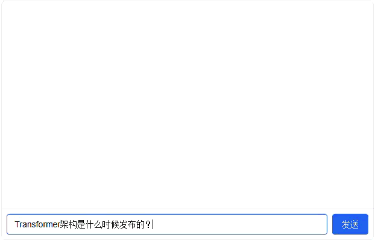

# Engineering Lab: Building a Knowledge Base Q&A System

In this engineering lab, we will build a complete knowledge base Q&A system together, covering the full pipeline from document parsing, vector index construction, hybrid retrieval to RAG generation. This lab uses real embedding models to generate semantic vectors for documents. The knowledge base directly uses the Markdown documents from the DMLA project itself, allowing us to verify retrieval and generation quality on real documents.

## Experiment Preparation

Before starting the experiment, please ensure the following preparations are complete:

1. Download the [BGE-small-zh-v1.5](https://modelscope.cn/models/BAAI/bge-small-zh-v1.5) embedding model and the [Qwen3.5-0.8B-Instruct](https://modelscope.cn/models/Qwen/Qwen3.5-0.8B) language model.
2. Clone the [DMLA documentation project](https://github.com/fenixsoft/dmla) as the knowledge base.

```bash
# Select "Download Model" -> Select "BGE-small-zh-v1.5"
dmla model

# If using Docker sandbox, you need to clone manually since there is no GIT tool in the sandbox
# If using Native sandbox and GIT is already installed on this machine, the verification code will complete the cloning automatically
git clone --depth=1 https://github.com/fenixsoft/dmla.git
```

The data source for the knowledge base is the documentation directory of this project. The code below clones the DMLA repository from GitHub (shallow clone to save time), then scans all Markdown files under the `docs/` directory, filtering out non-content pages such as directory pages and message boards, to form the knowledge base document set. Note that if you are using the Docker sandbox, since GIT is not deployed in the image, you need to manually clone the project under `DATA_DIR` using the command above.

```python runnable gpuonly
import os
import subprocess

# Knowledge base storage path (DATA_DIR is automatically injected by the kernel)
KB_DIR = os.path.join(DATA_DIR, 'datasets', 'rag-knowledge-base')
DOCS_DIR = os.path.join(KB_DIR, 'docs')

# Check if already cloned to avoid re-downloading
if not os.path.exists(os.path.join(KB_DIR, '.git')):
    print("Cloning DMLA documentation repository (shallow clone)...")
    result = subprocess.run(
        ['git', 'clone', '--depth=1',
         'https://github.com/fenixsoft/dmla.git', KB_DIR],
        capture_output=True, text=True
    )
    if result.returncode != 0:
        print(f"Clone failed: {result.stderr}")
        print("Please check your network connection and try again.")
        raise RuntimeError("Repository clone failed")
    print("Clone complete.")
else:
    print("Knowledge base already exists, skipping clone.")

# Scan Markdown files under docs/
# Filter out non-content pages
EXCLUDE_FILES = {
    'README.md', 'boards.md', 'contents.md', 'todo.md', 'test.md',
    'settings-preview.md', 'rag-experiment.md'
}

doc_files = []
total_size = 0
for root, dirs, files in os.walk(DOCS_DIR):
    # Skip assets directory
    dirs[:] = [d for d in dirs if not d.startswith('.') and d != 'assets']
    for fname in files:
        if fname.endswith('.md') and fname not in EXCLUDE_FILES:
            fpath = os.path.join(root, fname)
            size = os.path.getsize(fpath)
            total_size += size
            relpath = os.path.relpath(fpath, DOCS_DIR)
            doc_files.append((relpath, size))

print(f"Found {len(doc_files)} documents")
print(f"Total size: {total_size / 1024:.0f} KB")

# Group statistics by directory
from collections import defaultdict
dir_counts = defaultdict(lambda: [0, 0])  # [count, total_size]
for path, size in doc_files:
    top_dir = path.split('/')[0]
    dir_counts[top_dir][0] += 1
    dir_counts[top_dir][1] += size

print("\nDocument distribution by directory:")
for d in sorted(dir_counts.keys()):
    count, size = dir_counts[d]
    bar = '█' * min(count, 30)
    print(f"  {d:<30s} {bar} ({count} files, {size/1024:.0f} KB)")

print(f"\nKnowledge base path: {DOCS_DIR}")
# Verify required models are downloaded
print("\n--- Model Check ---")
models_to_check = {
    "BGE Embedding Model": os.path.join(DATA_DIR, "models", "pretrained", "bge-small-zh-v1.5"),
    "Qwen3.5-0.8B-Instruct": os.path.join(DATA_DIR, "models", "llm", "qwen3.5-0.8b-instruct"),
}
all_ready = True
for name, mpath in models_to_check.items():
    if os.path.isdir(mpath):
        has_config = os.path.exists(os.path.join(mpath, "config.json"))
        has_model = (os.path.exists(os.path.join(mpath, "model.safetensors")) or
                     os.path.exists(os.path.join(mpath, "pytorch_model.bin")))
        if has_config and has_model:
            size_mb = sum(
                os.path.getsize(os.path.join(mpath, f))
                for f in os.listdir(mpath)
                if os.path.isfile(os.path.join(mpath, f))
            ) / (1024 * 1024)
            print(f"  [OK] {name}: {mpath} ({size_mb:.0f} MB)")
        else:
            print(f"  [FAIL] {name}: Model files incomplete")
            all_ready = False
    else:
        print(f"  [FAIL] {name}: Not found, please run dmla data to download")
        all_ready = False

if all_ready:
    print("\nAll models ready. You may proceed with the experiment.")
else:
    print("\nSome models are missing. Please download them first before continuing.")
```

## Stage 1: Document Parsing and Text Splitting

Document parsing is the first step in building a knowledge base. The knowledge base documents in this lab are written in Markdown format, where headings starting with `#` define the chapter structure of each document. The parser needs to extract text while preserving section information, providing metadata support for tracing retrieval results back to their sources.

Text splitting strategy directly impacts retrieval quality. If the chunk size is too coarse, the retrieved results will contain a large amount of content irrelevant to the query, increasing the LLM's reading burden and inference cost. If the chunk size is too fine, the semantic coherence within paragraphs is disrupted, potentially cutting off complete reasoning chains. The engineering decisions in this stage revolve around the following two points:

- **Split by section boundaries rather than fixed length**. Fixed-length splitting, although simple, often truncates in the middle of sentences or formulas, breaking semantic integrity. Section boundaries are natural break points defined by the document author, and content within the same section is highly semantically related. This lab uses Markdown headings as split boundaries, treating the text under each heading as an independent document chunk.

- **Preserve metadata for citation tracing**. Each document chunk carries its source filename, section title, and position index within the chunk sequence. During RAG generation, this metadata is injected into the prompt, allowing the LLM to annotate information sources in its answers. Without metadata-backed citation tracing, one can only offer vague statements like "according to available information" rather than pinpointing specific sections.

```python runnable gpuonly extract-class="Chunk,MarkdownChunker"
import re
import os
from dataclasses import dataclass, field

@dataclass
class Chunk:
    """Document chunk data structure"""
    chunk_id: str          # Unique identifier
    text: str              # Chunk text
    source: str            # Relative path of the source file
    section: str           # Section title
    chunk_index: int       # Chunk index within the document
    char_count: int = 0    # Character count

    def __post_init__(self):
        self.char_count = len(self.text)

class MarkdownChunker:
    """Markdown document parser and splitter

    Splits documents into chunks using Markdown headings (lines starting with #)
    as boundaries. Each chunk contains all text under a heading level.
    Preserves metadata such as source and section.
    """

    def __init__(self, min_chunk_size: int = 100, max_chunk_size: int = 3000):
        self.min_chunk_size = min_chunk_size
        self.max_chunk_size = max_chunk_size

    def parse_file(self, filepath: str) -> list[Chunk]:
        """Parse a single Markdown file"""
        with open(filepath, 'r', encoding='utf-8') as f:
            content = f.read()

        source = os.path.basename(filepath)
        return self._parse_content(content, source)

    def parse_directory(self, dirpath: str,
                        exclude_files: set = None) -> list[Chunk]:
        """Parse all Markdown files in a directory"""
        if exclude_files is None:
            exclude_files = set()

        all_chunks = []
        file_count = 0
        for fname in sorted(os.listdir(dirpath)):
            if not fname.endswith('.md') or fname in exclude_files:
                continue
            fpath = os.path.join(dirpath, fname)
            if not os.path.isfile(fpath):
                continue
            chunks = self.parse_file(fpath)
            all_chunks.extend(chunks)
            file_count += 1

        # Recursively process subdirectories
        for sub in sorted(os.listdir(dirpath)):
            subpath = os.path.join(dirpath, sub)
            if os.path.isdir(subpath) and not sub.startswith('.') and sub != 'assets':
                sub_chunks = self.parse_directory(subpath, exclude_files)
                all_chunks.extend(sub_chunks)

        return all_chunks

    def _parse_content(self, content: str, source: str) -> list[Chunk]:
        """Split document content by heading boundaries"""
        chunks = []
        lines = content.split('\n')
        current_section = ''     # Current section title
        current_lines = []       # Text lines in the current chunk
        block_index = 0          # Absolute chunk index within the document
        seen_h1 = False          # Whether the document's top-level heading has been seen
        in_code_block = False    # Whether inside a code block

        for line in lines:
            # Track code block boundaries (# inside code blocks are not headings)
            if line.strip()[:3] == chr(96) * 3:
                in_code_block = not in_code_block
                current_lines.append(line)
                continue

            heading = re.match(r'^(#{1,4})\s+(.+)', line)

            if heading and not in_code_block and seen_h1:
                # Encountered a new heading: save the current chunk
                text = '\n'.join(current_lines).strip()
                if len(text) >= self.min_chunk_size:
                    chunks.append(Chunk(
                        chunk_id=f"{source}#{block_index}",
                        text=text,
                        source=source,
                        section=current_section or 'Introduction',
                        chunk_index=block_index,
                    ))
                    block_index += 1

                current_section = heading.group(2)
                current_lines = []
            elif heading and not in_code_block and not seen_h1:
                # Document top-level heading: record section but don't save preceding content
                seen_h1 = True
                current_section = heading.group(2)
            else:
                current_lines.append(line)

        # Save the last chunk
        if current_lines:
            text = '\n'.join(current_lines).strip()
            if len(text) >= self.min_chunk_size:
                chunks.append(Chunk(
                    chunk_id=f"{source}#{block_index}",
                    text=text,
                    source=source,
                    section=current_section or 'Introduction',
                    chunk_index=block_index,
                ))

        return chunks

# --- Run parsing ---
KB_DIR = os.path.join(DATA_DIR, 'datasets', 'rag-knowledge-base')
DOCS_DIR = os.path.join(KB_DIR, 'docs')

EXCLUDE = {'README.md', 'boards.md', 'contents.md', 'todo.md',
           'test.md', 'settings-preview.md', 'rag-experiment.md'}

chunker = MarkdownChunker(min_chunk_size=100)
all_chunks = chunker.parse_directory(DOCS_DIR, exclude_files=EXCLUDE)

print(f"Total: {len(all_chunks)} document chunks\n")

# Statistics
source_counts = {}
total_chars = 0
for c in all_chunks:
    source_counts[c.source] = source_counts.get(c.source, 0) + 1
    total_chars += c.char_count

avg_chars = total_chars / len(all_chunks) if all_chunks else 0
print(f"Total characters: {total_chars:,}")
print(f"Average per chunk: {avg_chars:.0f} characters")

# Chunk counts by directory
dir_block_counts = {}
for c in all_chunks:
    top_dir = c.source.split('.')[0] if '.' in c.source else c.source
    # Try to extract a more specific topic
    parts = c.source.replace('.md', '').split('-')
    tag = parts[0] if parts else 'other'
    dir_block_counts[tag] = dir_block_counts.get(tag, 0) + 1

print("\nChunk distribution by topic (top 10):")
for tag, count in sorted(dir_block_counts.items(),
                         key=lambda x: -x[1])[:10]:
    bar = '█' * min(count, 40)
    print(f"  {tag:<20s} {bar} ({count})")
```

## Stage 2: Embedding Generation and Vector Indexing

With document chunks ready, we need to convert them into vector representations and build an index to support fast retrieval. This stage involves selecting an embedding model and a vector index structure. The choice of embedding model requires a trade-off between precision and efficiency. Models with larger parameter counts (e.g., BGE-large, about 1.3 GB) produce higher-quality vectors but have slower encoding speed and larger memory footprint. Models with smaller parameter counts (e.g., BGE-small, about 100 MB) encode an order of magnitude faster, with limited precision loss in most retrieval scenarios. This lab uses `BAAI/bge-small-zh-v1.5` as the embedding model, which maintains a good ranking on the MTEB Chinese leaderboard while being lightweight enough for demonstration scenarios. For the vector index structure, this lab uses SciKit-Learn's NearestNeighbors with cosine distance for brute-force retrieval (Flat Index). The document set produces at most a few thousand chunks, so brute-force retrieval handles this scale without any issue. However, when the knowledge base scales to tens of thousands of documents or more, you would need to switch to IVF or HNSW indices to reduce retrieval latency. The upgrade path for index structures is discussed in detail in the [Embedding and Vector Indexing](embedding-and-indexing.md) chapter of this series.

Additionally, due to a specific requirement of the BGE model, queries and documents use different prefix prompts. Add `"为这个句子生成表示以用于检索相关文章："` (generate representation for this sentence to retrieve relevant articles) before queries, and leave the prefix empty for documents. This design comes from BGE's training process, where the query side and document side were explicitly distinguished, teaching the model two different encoding modes. If the same prefix is used for both queries and documents, retrieval precision will noticeably decrease.

The code in this stage will be called automatically in Stage 4, so manual execution is not needed.

```python runnable gpuonly extract-class="EmbeddingIndexer"
from __future__ import annotations
import os
import numpy as np
import os; os.environ.setdefault('HF_HUB_OFFLINE', '1')
import torch
from transformers import AutoTokenizer, AutoModel, AutoConfig, BertConfig
from sklearn.neighbors import NearestNeighbors

class EmbeddingIndexer:
    """Embedding generation and vector indexing

    Uses the BGE-small-zh model to convert text into semantic vectors,
    and builds a searchable vector index via scikit-learn NearestNeighbors.
    """

    def __init__(self, model_name: str = None,
                 device: str = None):
        if device is None:
            device = "cuda" if torch.cuda.is_available() else "cpu"
        self.device = device

        print(f"Loading embedding model {model_name} (device: {device})...")
        import json as _json
        with open(os.path.join(model_name, 'config.json')) as _f: _cfg = _json.load(_f)
        self.tokenizer = AutoTokenizer.from_pretrained(model_name, local_files_only=True)
        self.model = AutoModel.from_config(BertConfig.from_dict(_cfg)).to(device)
        state_dict = torch.load(os.path.join(model_name, 'pytorch_model.bin'),
                               map_location=device, weights_only=True)
        self.model.load_state_dict(state_dict, strict=False)
        self.model.eval()

        self.embeddings = None    # numpy array [N, dim]
        self.chunks = None        # Corresponding document chunk list
        self.nn_index = None      # sklearn NearestNeighbors

    def _mean_pooling(self, hidden_states, attention_mask):
        """Mean pooling over token-level hidden states to obtain sentence vectors"""
        mask_expanded = attention_mask.unsqueeze(-1).expand(
            hidden_states.size()).float()
        masked = hidden_states * mask_expanded
        summed = masked.sum(dim=1)
        counts = mask_expanded.sum(dim=1).clamp(min=1e-9)
        return summed / counts

    def _normalize(self, vecs):
        """L2 normalization"""
        norms = np.linalg.norm(vecs, axis=1, keepdims=True)
        return vecs / np.maximum(norms, 1e-12)

    def encode(self, texts: list[str], is_query: bool = False,
               batch_size: int = 16) -> np.ndarray:
        """Encode a list of texts into vectors

        Args:
            texts: List of texts
            is_query: Whether these are queries (BGE model requires special prefix for queries)
            batch_size: Batch size
        """
        if is_query:
            texts = [f"为这个句子生成表示以用于检索相关文章：{t}" for t in texts]

        all_vecs = []
        for i in range(0, len(texts), batch_size):
            batch = texts[i:i + batch_size]
            inputs = self.tokenizer(
                batch, padding=True, truncation=True,
                max_length=512, return_tensors="pt"
            ).to(self.device)

            with torch.no_grad():
                outputs = self.model(**inputs)
                vecs = self._mean_pooling(outputs.last_hidden_state,
                                          inputs['attention_mask'])
            vecs = vecs.cpu().numpy()
            all_vecs.append(vecs)

        result = np.concatenate(all_vecs, axis=0)
        return self._normalize(result)

    def build_index(self, chunks: list[Chunk]):
        """Generate embeddings for document chunks and build the vector index"""
        self.chunks = chunks
        texts = [c.text for c in chunks]

        print(f"Generating embeddings for {len(texts)} document chunks...")
        self.embeddings = self.encode(texts, is_query=False)

        self.nn_index = NearestNeighbors(
            n_neighbors=min(20, len(chunks)),
            metric='cosine'
        )
        self.nn_index.fit(self.embeddings)

        print(f"Embedding dimension: {self.embeddings.shape[1]}")
        print(f"Index construction complete, {len(chunks)} vectors total")

    def search(self, query: str, top_k: int = 5) -> list[tuple[Chunk, float]]:
        """Vector search: return top_k most relevant document chunks"""
        if self.nn_index is None:
            raise RuntimeError("Index not built. Please call build_index() first.")

        query_vec = self.encode([query], is_query=True)
        distances, indices = self.nn_index.kneighbors(query_vec)

        results = []
        for dist, idx in zip(distances[0], indices[0]):
            score = 1.0 - dist   # Convert cosine distance to cosine similarity
            results.append((self.chunks[idx], float(score)))

        return results
```

## Stage 3: Sparse Retrieval and Hybrid Retrieval

Vector retrieval excels at capturing semantic similarity but struggles with exact term matching. Sparse retrieval fills this gap through exact keyword matching, while hybrid retrieval fuses the results from both approaches. This lab implements a simplified BM25 retriever, using character-level [Bigram](../../language-models/architecture-basics/language-model-tokenization.md#n-gram-language-models) tokenization for Chinese and whitespace-split tokenization for English, handling mixed Chinese-English scenarios. RRF fusion merges the dense and sparse retrieval results into a single ranking. The elegance of RRF lies in relying only on rank positions rather than raw scores, naturally avoiding the problem of different scoring scales between the two retrieval methods. The formula is $RRF(d) = \sum_{r \in R} 1/(k + rank_r(d))$, where $k=60$ is an empirical constant and $R$ is the set of all retrieval pathways. Documents ranked higher receive higher RRF scores.

```python runnable gpuonly extract-class="SimpleBM25,HybridRetriever"
from __future__ import annotations
import re
import numpy as np
from collections import defaultdict

# ============================================================
# Sparse Retriever (BM25 Implementation)
# ============================================================

class SimpleBM25:
    """Simplified BM25 sparse retrieval implementation

    Counts term frequency and computes IDF for each document, supporting
    Chinese bigram and English whitespace-split tokenization.
    Uses the standard BM25 formula:
    score(d, q) = sum(IDF(t) * tf*(k1+1) / (tf + k1*(1-b+b*dl/avgdl)))
    """

    def __init__(self, k1: float = 1.5, b: float = 0.75):
        self.k1 = k1
        self.b = b
        self.corpus = []
        self.doc_stats = []   # [{term: tf}, ...]
        self.idf = {}         # {term: idf}
        self.avgdl = 0
        self.N = 0

    def _tokenize(self, text: str) -> list[str]:
        """Tokenization: Chinese bigram + English/numeric words"""
        tokens = []
        parts = re.split(r'([a-zA-Z0-9_]+)', text)
        for part in parts:
            if re.match(r'^[a-zA-Z0-9_]+$', part):
                if len(part) > 0:
                    tokens.append(part.lower())
            else:
                clean = re.sub(r'\s+', '', part)
                for i in range(len(clean) - 1):
                    tokens.append(clean[i:i+2])
        return tokens

    def fit(self, documents: list[str]):
        """Build BM25 index"""
        self.corpus = documents
        self.N = len(documents)
        doc_lengths = []

        for doc in documents:
            tokens = self._tokenize(doc)
            doc_lengths.append(len(tokens))
            tf = defaultdict(int)
            for t in tokens:
                tf[t] += 1
            self.doc_stats.append(dict(tf))

        self.avgdl = np.mean(doc_lengths) if doc_lengths else 1

        for term in set().union(*[d.keys() for d in self.doc_stats]):
            df = sum(1 for d in self.doc_stats if term in d)
            self.idf[term] = np.log((self.N - df + 0.5) / (df + 0.5) + 1)

    def search(self, query: str, top_k: int = 5) -> list[tuple[int, float]]:
        """Search and return (doc_index, score) list"""
        q_tokens = self._tokenize(query)
        scores = np.zeros(self.N)

        for term in q_tokens:
            if term not in self.idf:
                continue
            idf = self.idf[term]
            for i, stats in enumerate(self.doc_stats):
                if term not in stats:
                    continue
                tf = stats[term]
                dl = sum(stats.values())
                numerator = tf * (self.k1 + 1)
                denominator = tf + self.k1 * (1 - self.b + self.b * dl / self.avgdl)
                scores[i] += idf * numerator / denominator

        top_indices = np.argsort(-scores)[:top_k]
        return [(int(i), float(scores[i])) for i in top_indices if scores[i] > 0]

# ============================================================
# Hybrid Retriever
# ============================================================

class HybridRetriever:
    """Hybrid retrieval engine: dense vector + sparse BM25, RRF fusion"""

    def __init__(self, dense_indexer: EmbeddingIndexer):
        self.dense = dense_indexer
        self.bm25 = None
        self.chunks = None

    def build(self, chunks: list[Chunk]):
        """Build dense index and sparse index"""
        self.chunks = chunks

        # Dense index
        self.dense.build_index(chunks)

        # Sparse index
        self.bm25 = SimpleBM25()
        self.bm25.fit([c.text for c in chunks])
        print(f"BM25 index construction complete, vocabulary size: {len(self.bm25.idf)}")

    def search(self, query: str, top_k: int = 5,
               strategy: str = "hybrid") -> list[dict]:
        """Unified retrieval interface

        Args:
            query: Query text
            top_k: Number of results to return
            strategy: 'dense' | 'sparse' | 'hybrid'
        """
        if strategy == "dense":
            return self._dense_search(query, top_k)
        elif strategy == "sparse":
            return self._sparse_search(query, top_k)
        else:
            return self._hybrid_search(query, top_k)

    def _dense_search(self, query: str, top_k: int) -> list[dict]:
        results = self.dense.search(query, top_k=top_k)
        return [{"chunk": c, "score": s, "source": "dense"}
                for c, s in results]

    def _sparse_search(self, query: str, top_k: int) -> list[dict]:
        results = self.bm25.search(query, top_k=top_k)
        output = []
        for idx, score in results:
            output.append({
                "chunk": self.chunks[idx],
                "score": score,
                "source": "sparse"
            })
        return output

    def _hybrid_search(self, query: str, top_k: int,
                       k_rrf: int = 60) -> list[dict]:
        """RRF fusion: dense + sparse"""
        pool_size = max(top_k * 3, 10)
        dense_results = self.dense.search(query, top_k=pool_size)
        sparse_results = self.bm25.search(query, top_k=pool_size)

        rrf_scores = {}
        chunk_map = {}

        for rank, (chunk, _) in enumerate(dense_results):
            rrf_scores[chunk.chunk_id] = 1.0 / (k_rrf + rank + 1)
            chunk_map[chunk.chunk_id] = chunk

        for rank, (idx, _) in enumerate(sparse_results):
            chunk = self.chunks[idx]
            rrf_scores[chunk.chunk_id] = (
                rrf_scores.get(chunk.chunk_id, 0)
                + 1.0 / (k_rrf + rank + 1))
            chunk_map[chunk.chunk_id] = chunk

        ranked = sorted(rrf_scores.items(), key=lambda x: -x[1])[:top_k]
        return [{"chunk": chunk_map[cid], "score": s, "source": "hybrid"}
                for cid, s in ranked]

# --- Build index ---
from shared.vector_retrieval_rag import (MarkdownChunker, EmbeddingIndexer,
                                          HybridRetriever)

KB_DIR = os.path.join(DATA_DIR, 'datasets', 'rag-knowledge-base')
DOCS_DIR = os.path.join(KB_DIR, 'docs')
EXCLUDE = {'README.md', 'boards.md', 'contents.md', 'todo.md',
           'test.md', 'settings-preview.md', 'rag-experiment.md'}

BGE_MODEL_PATH = os.path.join(DATA_DIR, "models", "pretrained", "bge-small-zh-v1.5")

chunker = MarkdownChunker(min_chunk_size=100)
all_chunks = chunker.parse_directory(DOCS_DIR, exclude_files=EXCLUDE)
print(f"Document chunks: {len(all_chunks)}")

indexer = EmbeddingIndexer(model_name=BGE_MODEL_PATH)
retriever = HybridRetriever(indexer)
retriever.build(all_chunks)
```

## Stage 4: RAG Conversational Inference

The previous three stages completed all preparatory work from document parsing to hybrid retrieval. In this stage, we load the Qwen3.5-0.8B-Instruct model, connect retrieval and generation into a pipeline, and build a functional RAG Q&A system for conversation. The complete flow of a RAG conversation round is: after the user inputs a question, the system first retrieves the most relevant content from document chunks via hybrid retrieval, splices this content together with citation markers into an augmented prompt, and then feeds it to the Qwen model to generate an answer with source annotations. For generation parameters, `temperature=0.7` and `top_p=0.9` strike a moderate balance between creativity and determinism. Unlike creative writing, RAG scenarios require answers to be faithful to the retrieved documents, so the temperature should not be too high. `repetition_penalty=1.15` prevents the model from getting stuck in repetitive loops when citing document content.

After running the code block below, the model will be loaded into the sandbox. Once loading is complete, you can enter questions in the dialog below to experience the RAG Q&A system. When finished, click the Stop button to terminate the inference process.

```python runnable gpuonly mode=chat
import os, re, json
import numpy as np
import torch
from collections import defaultdict
from dataclasses import dataclass, field
from transformers import AutoTokenizer, AutoModel, AutoConfig, BertConfig, AutoModelForCausalLM

# ================================================================
# Reuse variables from previous stages if still in scope, otherwise rebuild
# ================================================================

KB_DIR = os.path.join(DATA_DIR, 'datasets', 'rag-knowledge-base')
DOCS_DIR = os.path.join(KB_DIR, 'docs')
EXCLUDE = {'README.md', 'boards.md', 'contents.md', 'todo.md',
           'test.md', 'settings-preview.md', 'rag-experiment.md'}

# Check if retriever is already in scope
if 'retriever' not in globals():
    print("Rebuilding knowledge base index...")

    # ---- Document chunk data structure ----
    @dataclass
    class Chunk:
        chunk_id: str
        text: str
        source: str
        section: str
        chunk_index: int
        char_count: int = 0
        def __post_init__(self):
            self.char_count = len(self.text)

    # ---- Document parser ----
    class MarkdownChunker:
        def __init__(self, min_chunk_size=100):
            self.min_chunk_size = min_chunk_size

        def parse_directory(self, dirpath, exclude_files=None):
            if exclude_files is None:
                exclude_files = set()
            all_chunks = []
            for fname in sorted(os.listdir(dirpath)):
                if not fname.endswith('.md') or fname in exclude_files:
                    continue
                fpath = os.path.join(dirpath, fname)
                if not os.path.isfile(fpath):
                    continue
                chunks = self._parse_file(fpath)
                all_chunks.extend(chunks)
            for sub in sorted(os.listdir(dirpath)):
                subpath = os.path.join(dirpath, sub)
                if os.path.isdir(subpath) and not sub.startswith('.') and sub != 'assets':
                    all_chunks.extend(self.parse_directory(subpath, exclude_files))
            return all_chunks

        def _parse_file(self, filepath):
            with open(filepath, 'r', encoding='utf-8') as f:
                content = f.read()
            source = os.path.basename(filepath)
            lines = content.split('\n')
            current_section, current_lines = '', []
            chunks, block_idx, seen_h1, in_code = [], 0, False, False
            for line in lines:
                if line.strip()[:3] == chr(96) * 3:
                    in_code = not in_code
                    current_lines.append(line)
                    continue
                heading = re.match(r'^(#{1,4})\s+(.+)', line)
                if heading and not in_code and seen_h1:
                    text = '\n'.join(current_lines).strip()
                    if len(text) >= self.min_chunk_size:
                        chunks.append(Chunk(
                            chunk_id=f"{source}#{block_idx}", text=text,
                            source=source, section=current_section or 'Introduction',
                            chunk_index=block_idx))
                        block_idx += 1
                    current_section = heading.group(2)
                    current_lines = []
                elif heading and not in_code and not seen_h1:
                    seen_h1 = True
                    current_section = heading.group(2)
                else:
                    current_lines.append(line)
            if current_lines:
                text = '\n'.join(current_lines).strip()
                if len(text) >= self.min_chunk_size:
                    chunks.append(Chunk(
                        chunk_id=f"{source}#{block_idx}", text=text,
                        source=source, section=current_section or 'Introduction',
                        chunk_index=block_idx))
            return chunks

    # ---- Embedding indexer ----
    class EmbeddingIndexer:
        def __init__(self, model_name=None, device=None):
            if device is None:
                device = "cuda" if torch.cuda.is_available() else "cpu"
            self.device = device
            print(f"Loading embedding model {model_name} (device: {device})...")
            import json as _json
            with open(os.path.join(model_name, 'config.json')) as _f: _cfg = _json.load(_f)
            self.tokenizer = AutoTokenizer.from_pretrained(model_name, local_files_only=True)
            self.model = AutoModel.from_config(BertConfig.from_dict(_cfg)).to(device)
            state_dict = torch.load(os.path.join(model_name, 'pytorch_model.bin'),
                                   map_location=device, weights_only=True)
            self.model.load_state_dict(state_dict, strict=False)
            self.model.eval()
            self.embeddings = None
            self.chunks = None

        def _mean_pooling(self, hidden_states, attention_mask):
            mask = attention_mask.unsqueeze(-1).expand(hidden_states.size()).float()
            return (hidden_states * mask).sum(1) / mask.sum(1).clamp(min=1e-9)

        def _normalize(self, vecs):
            return vecs / np.maximum(np.linalg.norm(vecs, axis=1, keepdims=True), 1e-12)

        def encode(self, texts, is_query=False, batch_size=16):
            if is_query:
                texts = [f"为这个句子生成表示以用于检索相关文章：{t}" for t in texts]
            all_vecs = []
            for i in range(0, len(texts), batch_size):
                batch = texts[i:i+batch_size]
                inputs = self.tokenizer(batch, padding=True, truncation=True,
                                        max_length=512, return_tensors="pt").to(self.device)
                with torch.no_grad():
                    outputs = self.model(**inputs)
                    vecs = self._mean_pooling(outputs.last_hidden_state, inputs['attention_mask'])
                all_vecs.append(vecs.cpu().numpy())
            return self._normalize(np.concatenate(all_vecs, axis=0))

        def build_index(self, chunks):
            self.chunks = chunks
            texts = [c.text for c in chunks]
            print(f"Generating embeddings for {len(texts)} document chunks...")
            self.embeddings = self.encode(texts, is_query=False)
            from sklearn.neighbors import NearestNeighbors
            self.nn_index = NearestNeighbors(
                n_neighbors=min(20, len(chunks)), metric='cosine')
            self.nn_index.fit(self.embeddings)
            print(f"Embedding dimension: {self.embeddings.shape[1]}, index ready")

        def search(self, query, top_k=5):
            q_vec = self.encode([query], is_query=True)
            distances, indices = self.nn_index.kneighbors(q_vec)
            return [(self.chunks[idx], float(1.0 - d))
                    for d, idx in zip(distances[0], indices[0])]

    # ---- BM25 sparse retriever ----
    class SimpleBM25:
        def __init__(self, k1=1.5, b=0.75):
            self.k1, self.b = k1, b
            self.doc_stats, self.idf, self.avgdl, self.N = [], {}, 0, 0

        def _tokenize(self, text):
            tokens = []
            for part in re.split(r'([a-zA-Z0-9_]+)', text):
                if re.match(r'^[a-zA-Z0-9_]+$', part):
                    if part:
                        tokens.append(part.lower())
                else:
                    clean = re.sub(r'\s+', '', part)
                    for i in range(len(clean) - 1):
                        tokens.append(clean[i:i+2])
            return tokens

        def fit(self, documents):
            self.N = len(documents)
            doc_lengths = []
            for doc in documents:
                tokens = self._tokenize(doc)
                doc_lengths.append(len(tokens))
                tf = defaultdict(int)
                for t in tokens:
                    tf[t] += 1
                self.doc_stats.append(dict(tf))
            self.avgdl = np.mean(doc_lengths) if doc_lengths else 1
            for term in set().union(*[d.keys() for d in self.doc_stats]):
                df = sum(1 for d in self.doc_stats if term in d)
                self.idf[term] = np.log((self.N - df + 0.5) / (df + 0.5) + 1)

        def search(self, query, top_k=5):
            q_tokens = self._tokenize(query)
            scores = np.zeros(self.N)
            for term in q_tokens:
                if term not in self.idf:
                    continue
                idf = self.idf[term]
                for i, stats in enumerate(self.doc_stats):
                    if term not in stats:
                        continue
                    tf = stats[term]
                    dl = sum(stats.values())
                    scores[i] += idf * tf * (self.k1+1) / (tf + self.k1*(1-self.b+self.b*dl/self.avgdl))
            top = np.argsort(-scores)[:top_k]
            return [(int(i), float(scores[i])) for i in top if scores[i] > 0]

    # ---- Hybrid retriever ----
    class HybridRetriever:
        def __init__(self, dense_indexer):
            self.dense = dense_indexer
            self.bm25 = None
            self.chunks = None

        def build(self, chunks):
            self.chunks = chunks
            self.dense.build_index(chunks)
            self.bm25 = SimpleBM25()
            self.bm25.fit([c.text for c in chunks])
            print(f"BM25 index construction complete, vocabulary: {len(self.bm25.idf)}")

        def search(self, query, top_k=5, strategy="hybrid"):
            if strategy == "dense":
                return [{"chunk": c, "score": s, "source": "dense"}
                        for c, s in self.dense.search(query, top_k=top_k)]
            elif strategy == "sparse":
                return [{"chunk": self.chunks[idx], "score": s, "source": "sparse"}
                        for idx, s in self.bm25.search(query, top_k=top_k)]
            else:
                pool = max(top_k * 3, 10)
                dense_r = self.dense.search(query, top_k=pool)
                sparse_r = self.bm25.search(query, top_k=pool)
                rrf, cmap = {}, {}
                for rank, (chunk, _) in enumerate(dense_r):
                    rrf[chunk.chunk_id] = 1.0 / (60 + rank + 1)
                    cmap[chunk.chunk_id] = chunk
                for rank, (idx, _) in enumerate(sparse_r):
                    c = self.chunks[idx]
                    rrf[c.chunk_id] = rrf.get(c.chunk_id, 0) + 1.0 / (60 + rank + 1)
                    cmap[c.chunk_id] = c
                ranked = sorted(rrf.items(), key=lambda x: -x[1])[:top_k]
                return [{"chunk": cmap[cid], "score": s, "source": "hybrid"}
                        for cid, s in ranked]

    # ---- Execute rebuild ----
    chunker = MarkdownChunker(min_chunk_size=100)
    all_chunks = chunker.parse_directory(DOCS_DIR, exclude_files=EXCLUDE)
    print(f"Total document chunks: {len(all_chunks)}")

    BGE_MODEL_PATH = os.path.join(DATA_DIR, "models", "pretrained", "bge-small-zh-v1.5")
    indexer = EmbeddingIndexer(model_name=BGE_MODEL_PATH)
    retriever = HybridRetriever(indexer)
    retriever.build(all_chunks)

else:
    print(f"Reusing existing retrieval engine ({len(retriever.chunks)} document chunks)")

# ================================================================
# Load Qwen3.5-0.8B-Instruct model
# ================================================================

MODEL_PATH = os.path.join(DATA_DIR, 'models', 'llm', 'qwen3.5-0.8b-instruct')
device = torch.device('cuda' if torch.cuda.is_available() else 'cpu')

print(f"Loading Qwen3.5-0.8B-Instruct (device: {device})...")
qwen_tokenizer = AutoTokenizer.from_pretrained(MODEL_PATH, local_files_only=True)
qwen_model = AutoModelForCausalLM.from_pretrained(
    MODEL_PATH,
    dtype=torch.bfloat16 if device.type == 'cuda' else torch.float32,
    device_map="auto" if device.type == 'cuda' else None,
    local_files_only=True,
)
if device.type == 'cpu':
    qwen_model = qwen_model.to(device)
qwen_model.eval()

param_count = sum(p.numel() for p in qwen_model.parameters()) / 1e6
print(f"Qwen model parameter count: {param_count:.0f}M")
print("RAG conversation service is ready")

# ================================================================
# RAG conversation function
# ================================================================

def chat(user_message, history=None):
    """RAG conversation: retrieve -> build prompt -> LLM generate"""

    # 1. Hybrid retrieval
    hits = retriever.search(user_message, top_k=5, strategy="hybrid")

    # 2. Build context
    n = len(hits)
    if n > 2:
        ordered = []
        front, back, toggle = 0, n - 1, True
        while front <= back:
            ordered.append(hits[front] if toggle else hits[back])
            if toggle:
                front += 1
            else:
                back -= 1
            toggle = not toggle
        hits = ordered

    context_parts = []
    total_chars = 0
    max_ctx = 3000

    for i, hit in enumerate(hits):
        c = hit["chunk"]
        ref = f"[Source{i+1}] ({c.source} / {c.section})\n{c.text}"
        if total_chars + len(ref) > max_ctx:
            if total_chars == 0:
                ref_short = ref[:max_ctx]
                context_parts.append(ref_short)
            break
        context_parts.append(ref)
        total_chars += len(ref)

    context = "\n\n---\n\n".join(context_parts)

    # 3. Build prompt
    prompt = (
        "Answer the question based on the following reference materials. "
        "Use the [SourceN] marker (N is a number, no spaces) when citing references. "
        "If the reference materials do not contain sufficient information, "
        "state clearly: 'Cannot answer based on the available information.'\n\n"
        f"---\nReference Materials:\n{context}\n---\n\n"
        f"Question: {user_message}"
    )

    # 4. Qwen generation
    messages = [{"role": "user", "content": prompt}]
    text = qwen_tokenizer.apply_chat_template(
        messages, tokenize=False, add_generation_prompt=True)
    inputs = qwen_tokenizer(text, return_tensors="pt", truncation=True,
                            max_length=4096).to(qwen_model.device)

    with torch.no_grad():
        generated_ids = qwen_model.generate(
            inputs=inputs["input_ids"],
            attention_mask=inputs["attention_mask"],
            max_new_tokens=512,
            temperature=0.7,
            top_p=0.9,
            top_k=50,
            do_sample=True,
            pad_token_id=qwen_tokenizer.pad_token_id,
            eos_token_id=qwen_tokenizer.eos_token_id,
            repetition_penalty=1.15,
        )

    response = qwen_tokenizer.decode(
        generated_ids[0][len(inputs["input_ids"][0]):],
        skip_special_tokens=True
    )

    # Attach citation sources
    sources = []
    for i, hit in enumerate(hits):
        c = hit["chunk"]
        sources.append(f"[Source{i+1}] {c.source} / {c.section}")
    return response.strip() + "\n\n---\n" + "\n".join(sources)
```

::: details After running the code above, click here for conversation
<ChatDemo />
:::


## Lab Summary

This lab built a complete knowledge base Q&A system using approximately 90 Markdown documents from the DMLA tutorial itself as the knowledge base, with Qwen3.5-0.8B-Instruct as the generation model, covering the full pipeline from document processing to real LLM conversation. After the RAG service starts, you can engage in conversational inference with the model. A sample execution result is shown below:


