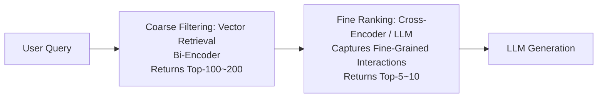

# Retrieval Quality Evaluation and Optimization

In 1966, Cyril Cleverdon, a librarian at the Cranfield College of Aeronautics in the UK, designed a test set containing queries, documents, and human-annotated relevance judgments. Cleverdon used it to systematically compare the retrieval effectiveness of different indexing methods (author indexing, title indexing, controlled vocabulary, etc.). This project, later known as the Cranfield Experiments, established the basic paradigm for information retrieval evaluation: using standardized query sets, document collections, and relevance judgments to measure retrieval quality, rather than relying on user feedback collected anew for each evaluation. More than half a century later, from web search to RAG systems, our evaluation of retrieval quality still follows the fundamental approach established by Cleverdon: "establish ground truth first, then measure the gap."

Earlier we studied [model evaluation](../../language-models/frontier/evaluation-safety.md). The biggest difference between retrieval evaluation and model evaluation (such as classification accuracy, cross-entropy loss) is that the "correct answer" in retrieval is often ambiguous. Judging whether a document is relevant to a user query is inherently subjective; the same query may require completely different documents in different contexts. This means that the design of retrieval evaluation metrics must consider not only mathematical rigor but also annotation cost and practicality. Understanding this premise is essential to grasp why there are so many metrics in the retrieval field, and what trade-offs each metric makes between accuracy, annotation cost, and actual business needs.

## Retrieval Evaluation Metrics

Retrieval evaluation metrics can be roughly divided into two levels: set-level metrics focus on whether the relevant documents have been found and whether the retrieved ones are correct, while ranking-level metrics further consider whether the order of the found documents matches their relevance ranking. Each level has its own application scenarios, but the underlying design logic is shared. Let us start with set-level metrics.

### Set-Level Metrics: Recall and Precision

**Recall** and **Precision** are the two most fundamental metrics in retrieval evaluation. Their design intention follows the same lineage as the confusion matrix in classification problems (which divides results into four quadrants: true positive, true negative, false positive, false negative). Viewing the retrieved documents as a "predicted as relevant" classification and the unretrieved documents as a "predicted as not relevant" classification, retrieval evaluation essentially computes recall and precision as in a classification problem. Taking a RAG scenario as an example, suppose a user queries "What types of positional encoding are there in the Transformer architecture?" and the knowledge base contains 10 relevant documents. The retrieval system returns Top-5 results, of which 3 are indeed relevant and the other 2 are about attention mechanisms (not relevant). At this point, recall and precision are:

$$Recall@5 = \frac{|\text{Relevant Documents} \cap \text{Top-5 Results}|}{|\text{Relevant Documents}|} = \frac{3}{10} = 0.3$$

$$Precision@5 = \frac{|\text{Relevant Documents} \cap \text{Top-5 Results}|}{5} = \frac{3}{5} = 0.6$$

Recall of 30% means that 70% of the relevant documents were not retrieved. In RAG scenarios, low recall means key information is missing, and the model lacks the necessary basis during generation -- typical symptoms include responses containing "I do not know," "no relevant information," or irrelevant answers. Precision of 60% means that 2 out of the 5 returned documents are irrelevant. These irrelevant documents not only waste token quota in the context window but may also interfere with the LLM's judgment. Typical symptoms include responses that appear fluent on the surface but deviate from facts in detail, as the model is misled by information in irrelevant documents.

There is a natural tension between recall and precision. If the number of returned results Top-K is expanded from 5 to 20, recall will likely increase because more relevant documents are covered. However, precision will decrease due to more noise being introduced. This is not a simple one-improves-the-other-degrades relationship, but rather a fundamental tension between coverage and signal purity in the retrieval system. When a single numerical value is needed for comprehensive measurement, the F1 score takes the harmonic mean of the two. The harmonic mean is biased toward the smaller value -- if recall is high but precision is low, F1 will also be pulled down, thus preventing opportunistic behavior of optimizing only one metric:

$$F1 = \frac{2 \times Precision \times Recall}{Precision + Recall}$$

### Ranking-Level Metrics: MRR, MAP, and NDCG

Set-level metrics only care about whether documents are retrieved, completely ignoring ranking positions. In reality, documents ranked higher have a far greater impact on RAG generation than those ranked lower. Research shows that LLMs are more sensitive to the beginning of the context, consistent with the "[Lost in the Middle](https://arxiv.org/abs/2307.03172)" phenomenon -- the model tends to focus on information at the beginning and end of the prompt, while the middle portion is easily overlooked. Ranking-level metrics address this limitation: they not only measure what was found but also evaluate whether more relevant results are ranked higher.

**Mean Reciprocal Rank (MRR)** is the simplest ranking metric; it only cares about the position of the first relevant document. Let $rank_i$ be the rank position of the first relevant document for the $i$-th query -- the smaller the number, the higher the rank. $Q$ is the number of queries. The mathematical expression of MRR is:

$$MRR = \frac{1}{|Q|} \sum_{i=1}^{|Q|} \frac{1}{rank_i}$$

Suppose there are three queries, and the first relevant documents are ranked at position 1, position 3, and position 5, respectively. The MRR result is:

$$MRR = \frac{1}{3} \left( \frac{1}{1} + \frac{1}{3} + \frac{1}{5} \right) \approx 0.51$$

MRR is suitable for scenarios where the user needs only one correct answer (such as "What is the capital of France?" in a QA system). If the first relevant result is ranked 1st, it scores full marks; if ranked 3rd, it only scores 1/3. However, if the user queries "What are the advantages of Transformers?" and the results contain 5 relevant documents, MRR completely ignores the positions of the 2nd through 5th relevant documents.

**Mean Average Precision (MAP)** addresses this limitation of MRR by considering the positions of all relevant documents. MAP computes the precision at each position where a relevant document appears, then takes the average. For example, suppose a query has 3 relevant documents, and they appear at positions 1, 4, and 7 in the retrieval results. The Average Precision (AP) is computed as:

- Position 1: found the 1st relevant document, precision $= 1/1 = 1.0$
- Position 4: found the 2nd relevant document, precision $= 2/4 = 0.5$
- Position 7: found the 3rd relevant document, precision $= 3/7 \approx 0.43$

Therefore, the average precision is $(1.0 + 0.5 + 0.43) / 3 \approx 0.64$, expressed mathematically as:

$$AP = \frac{1}{|\text{Relevant Documents}|} \sum_{k=1}^{n} P(k) \times rel(k)$$

Where $P(k)$ is the precision of the top $k$ results, i.e., the number of relevant documents found divided by $k$ up to position $k$. $rel(k)$ is an indicator function that equals 1 if the document at position $k$ is relevant and 0 otherwise, ensuring that precision is only recorded at positions where relevant documents appear. The denominator is the total number of relevant documents, and the sum of precision values across multiple positions is averaged. The overall meaning of the formula is: the earlier relevant documents appear, the higher the precision at each position, and thus the higher the average precision. AP measures the average precision of multiple documents for a single query, while MAP averages the AP across multiple queries, measuring the ranking position accuracy across all relevant documents in multiple queries.

**Normalized Discounted Cumulative Gain (NDCG)** further supports multi-level relevance annotation. MRR and MAP both assume binary relevance (relevant / not relevant). In practice, some results are highly relevant, some are partially relevant, and some are completely irrelevant. NDCG allows annotators to assign multi-level grades such as 0-4 or 0-3, and uses a discount factor to progressively reduce the weight of documents ranked lower.

Let $rel_i$ be the relevance grade of the document ranked at position $i$. First, the grade is exponentially amplified using $2^{rel_i} - 1$ -- a document with grade 3 contributes 7 units, while a document with grade 1 contributes only 1 unit, thus amplifying grade differences exponentially. Then, $\frac{1}{\log_2(i+1)}$ serves as the discount factor: divide by 1 for position 1, by 2 for position 3, and by 6.6 for position 100, modeling the natural pattern of decreasing user attention from top to bottom. The mathematical expression of DCG is:

$$DCG@k = \sum_{i=1}^{k} \frac{2^{rel_i} - 1}{\log_2(i + 1)}$$

Using three documents as an example, suppose their relevance annotations are 3 (highly relevant), 2 (relevant), and 0 (not relevant), ranked at positions 1, 2, and 3:

$$DCG@3 = \frac{2^{3} - 1}{\log_2(1 + 1)} + \frac{2^{2} - 1}{\log_2(2 + 1)} + \frac{2^{0} - 1}{\log_2(3 + 1)} = 7 + \frac{3}{1.58} + 0 = 8.89$$

Since DCG itself is not normalized, DCG values from different queries cannot be directly compared. By dividing DCG by the DCG of the ideal ranking (called IDCG), we obtain the comparable NDCG:

$$NDCG@k = \frac{DCG@k}{IDCG@k}$$

In the three-document example above, the ideal ranking places relevant documents first (3, 2, 0), so $IDCG@3 = (7/1) + (3/1.58) + (0/2) = 8.90$. If the actual ranking is (2, 0, 3), then $DCG = 3/1 + 0 + 7/2 = 6.5$, and $NDCG \approx 0.73$. The closer NDCG is to 1, the closer the ranking is to the ideal.

## Re-ranking

The [vector retrieval](embedding-and-indexing.md) pipeline discussed earlier (query encoded into a vector by an embedding model, searched in an approximate index, similarity computed via a bi-encoder, and Top-K candidates returned) is collectively referred to as **first-stage retrieval** in RAG. First-stage retrieval is subject to two constraints. First, the index structure uses approximation algorithms -- cluster-based inverted indexes (IVF) only search the vicinity of a few cluster centers, while graph indexes traverse the graph structure through greedy search. Neither can guarantee finding the global optimum, inherently compromising recall. Second, the bi-encoder architecture independently encodes the query and document into vectors before computing similarity -- the "Apple" (the company) in the query and the "Apple" (the fruit) in the document may be difficult to distinguish during first-stage retrieval because the bi-encoder cannot see each other's content during encoding for disambiguation. The combination of these two constraints means that relevant documents outside Top-K in the first-stage results may be missed, while irrelevant documents within Top-K are difficult to filter out.

The goal of re-ranking is to use a more precise model to reorder a small set of candidate documents, achieving a two-stage architecture of "coarse filtering + fine ranking." In the coarse filtering stage, approximate indexes and bi-encoders retrieve 100-200 candidate documents in milliseconds. In the fine ranking stage, a model capable of capturing query-document interactions selects the best 5-10 from these candidates.

*Figure: Two-stage "coarse filtering + fine ranking" architecture*

The vector retrieval we discussed earlier all uses bi-encoders: feeding the query and document separately into the encoder, each outputting a vector, and then determining similarity based on the dot product of these two vectors. The advantage of this "compute separately" approach is that document vectors can be precomputed in advance, requiring only a single encoding of the query at retrieval time, which is very fast. The disadvantage is that when encoding the query, the model has no knowledge of the document content, and when encoding the document, it does not know the query intent. The only intersection point between the two independent encoding paths is the final dot product operation, making it nearly impossible to capture semantic differences such as whether "Apple" in the query refers to the company while "Apple" in the document refers to the fruit.

A **cross-encoder** concatenates the query and document into a single sequence and feeds it into the encoder, directly outputting a relevance score. A typical concatenation format is `[CLS] Query [SEP] Document [SEP]`. The encoder (typically a BERT-family pretrained model) allows every token in the query and document to interact with each other through self-attention layers. The model can thus easily determine whether "Apple" in the query and document refers to the company or the fruit. Similarly, whether query terms appear in the document, whether the context of their appearance aligns with the same semantics, and whether the core topic of the query matches the document -- these are interaction patterns that the bi-encoder architecture struggles to capture precisely, but the cross-encoder handles with ease.

Of course, the cost of the cross-encoder is also evident. Each query requires concatenating the query with every candidate document and re-encoding from scratch, with no possibility of precomputation. This is precisely why cross-encoders are only used in the fine ranking stage, where the candidate set is typically kept within 100-200 documents. At this scale, the latency of cross-encoders remains acceptable.

Although cross-encoders are accurate, they require fine-tuning for specific domains and cannot reach their full potential without annotated data. LLM-based re-ranking bypasses all training requirements entirely by leveraging the instruction-following capabilities of large language models. Given a prompt containing the query and a list of candidate documents, the LLM is asked to rank them by relevance. The prompt typically includes ranking instructions and an output format (e.g., "Rank the following documents by relevance to the query and output the ranked list of document IDs"). This approach offers strong generalization -- it works without any domain-specific annotated data, and LLMs, with their extensive pretraining knowledge, often achieve better semantic understanding than an un fine-tuned cross-encoder. However, latency and computational cost severely limit the use cases of LLM-based re-ranking. Ranking 20 candidate documents may take seconds and consume tens of thousands of tokens in API costs. It is only suitable for scenarios with very small candidate sets (typically an order of magnitude smaller than cross-encoders) where precision is paramount, or as an alternative to cross-encoders when annotated data is unavailable. Currently, one mainstream industrial implementation is RankGPT, which uses a sliding window strategy to enable LLMs to handle slightly larger candidate sets.

## Retrieval Architecture Design

The two-stage architecture (coarse filtering + fine ranking) is the standard design for retrieval systems. The goal of the coarse filtering stage is high recall -- it is better to retrieve some irrelevant documents than to miss key ones. Therefore, coarse filtering uses bi-encoders (with precomputed document vectors) combined with approximate indexes to return Top-100-200 from a massive document collection in milliseconds. The goal of the fine ranking stage is high precision, selecting the 5-10 documents best suited to support generation from the 200 candidates. The fine ranking stage uses cross-encoders for pairwise scoring. Since the candidate set is small, accuracy is high while latency remains controllable. The two stages form a natural funnel structure: coarse filtering casts a wide net, and fine ranking makes precise selections. This architecture is simple, has clear optimization directions, and is the choice of the vast majority of RAG systems.

When the document scale exceeds hundreds of millions, a two-stage architecture may not suffice. Although 200 candidates do not incur high latency for cross-encoders, if a large number of clearly irrelevant documents are mixed into those 200, computational resources for fine ranking are wasted. A three-stage architecture inserts a lightweight ranker between coarse filtering and fine ranking as an intermediate pruning stage. The coarse filtering stage returns Top-500-1000, the intermediate pruning stage (typically using a distilled version of a lightweight cross-encoder or a weighted fusion of multiple similarity scores) compresses this to 100-200, and then the fine ranking stage uses a full cross-encoder to further narrow down to 10-20. Each additional stage increases latency but correspondingly improves quality. The final number of stages depends on the computational budget and the business's tolerance for latency. Beyond architectural design, there are several engineering details in implementation that should not be overlooked:

- **Parallelism**: Dense retrieval (vector similarity) and sparse retrieval (e.g., BM25) commonly used in the coarse filtering stage are two completely independent retrieval pipelines with no data dependencies between them. They are naturally suited for parallel execution -- both retrieval paths are initiated simultaneously, and results are merged and deduplicated.
- **Caching strategies**: Query caching can be designed (identical queries directly return cached results; hit rate depends on query distribution concentration), document encoding caching (both dense vectors and sparse inverted indexes can be precomputed and persisted), and re-ranking caching (cross-encoder scores for high-frequency queries and candidate documents can be cached to avoid repeated inference).
- **Incremental updates**: Sparse indexes naturally support incremental updates. Dense indexes depend on the chosen index structure -- HNSW supports pointwise insertion, while IVF may require periodic rebuilding when cluster centers drift.

It is worth noting that the architectures discussed above are all batch-processing-oriented designs. In real production systems, issues such as cold start, query fluctuations, index update frequency, and GPU resource scheduling are often more challenging to handle than the retrieval algorithms themselves. These engineering concerns are beyond the scope of this discussion but should be taken into account before deployment.

## End-to-End RAG Evaluation

A RAG system ultimately delivers a textual response generated for the user, not a Top-K document list. Sometimes retrieval metrics look good, but the quality of the generated response is poor. For example, the system may have retrieved the correct documents, but due to the LLM's limited context integration capability, or because key information is buried in lengthy middle paragraphs, the model overlooks it. End-to-end evaluation no longer focuses solely on retrieval scores but on the final output quality of the entire RAG pipeline -- for example, whether the response is faithful to the retrieved documents and whether it completely covers the user's question. End-to-end evaluation generally unfolds across three dimensions: faithfulness, relevance, and completeness.

- **Faithfulness** checks whether every statement in the generated response can be supported by evidence in the retrieved documents. For example, a user asks "Tell me about the Transformer architecture." The document records that "The Transformer was published in 2017," but the model's response says "The Transformer was first published in Google's paper '[Attention Is All You Need](https://arxiv.org/abs/1706.03762).'" This statement is unfaithful because information such as "Google" and "the paper '[Attention Is All You Need](https://arxiv.org/abs/1706.03762)'" is not present in the documents -- it is content the model added on its own. A lack of faithfulness does not necessarily mean the response is bad; whether the model is allowed to expand beyond the documents should be determined by the specific business requirements of the system.
- **Relevance** judges whether the response directly addresses the user's question. Even if the response is entirely faithful to the documents, if the retrieved documents are irrelevant to the query (a precision issue), the generated response will naturally be off-topic. For instance, if the user asks "When was the Transformer architecture proposed?" and the response goes on at length about the content of the paper "[Attention Is All You Need](https://arxiv.org/abs/1706.03762)" without giving the year 2017, that clearly violates relevance.
- **Completeness** assesses whether the response covers all aspects of the question. For example, if the user asks "What types of positional encoding are there?" and the response only mentions sinusoidal positional encoding while omitting learnable encoding and relative positional encoding, completeness is compromised.

The cost of manually annotating all three dimensions is extremely high. A test set of 200 queries would require individually judging each of the 200 responses for faithfulness, relevance, and completeness. Frameworks such as RAGAS automate this process through the LLM-as-Judge paradigm, using a large language model to play the role of a judge, scoring according to predefined criteria (e.g., whether every sentence in the response can be supported by the context). LLM-as-Judge has achieved reasonably high agreement with human annotation, typically above 0.7, making it a viable alternative for rapid iteration. However, it is important to note that LLM judges themselves have biases -- they tend to score their own "kind" (responses generated by other LLMs) higher. Therefore, key scenarios still require manual spot-checking for calibration.

## Chapter Summary

Retrieval quality directly determines the success or failure of a RAG system. From the Cranfield Experiments paradigm to modern two-stage retrieval architectures, over half a century of accumulation has formed a complete evaluation system spanning from set-level to ranking-level metrics and from retrieval metrics to end-to-end generation. Understanding the tension between recall and precision, the division of labor between coarse filtering and fine ranking, and the different impact patterns of retrieval noise versus insufficient retrieval is a prerequisite for designing reliable RAG systems. Evaluation is not about assigning a score; it is about precisely identifying the weaknesses of the system, so you know what to optimize next.

## Exercises

1. Use a cross-encoder to re-rank the Top-20 results from a bi-encoder's retrieval. Compare the NDCG@5 before and after re-ranking. Analyze two cases each where the cross-encoder successfully corrected results and where it failed to do so, and summarize the types of queries that cross-encoders excel at and struggle with.

   

   
Reference Answer

   Core implementation approach: first use the `sentence-transformers` bi-encoder model to retrieve Top-20, then use a cross-encoder to score each pair of these 20 documents and re-rank them. Cross-encoders excel at queries requiring fine-grained semantic interaction (such as ambiguous queries, complex reasoning queries, etc.) where semantics require fine-grained interaction to disambiguate, but offer limited improvement on short queries where the bi-encoder already performs well. Query types that require external knowledge (not present in the existing knowledge base) cannot be solved regardless of which retriever is used, as this limitation stems from knowledge base coverage rather than model selection.

   

2. Using the RAGAS framework, incrementally increase the retrieval count $k$ from 1 to 10. Observe the trend in end-to-end RAG generation quality (using faithfulness, relevance, and context recall as evaluation metrics). Determine the optimal $k$ value and explain why both too small and too large a $k$ can harm generation quality.

   

   
Reference Answer

   When $k$ is too small, contextual information is insufficient. Faithfulness is usually high (fewer retrieved documents are highly relevant to the query, making the model less susceptible to irrelevant content), but completeness is poor (missing key information). As $k$ increases, completeness improves, but the added noise causes relevance to decline. The optimal $k$ is typically between 3 and 7, depending on the knowledge base size and embedding model accuracy. RAGAS supports end-to-end metrics such as `metrics = ["faithfulness", "answer_relevancy", "context_recall"]`. Faithfulness and context_recall can be automatically computed via LLM-as-Judge, while answer_relevancy is obtained by having the LLM generate follow-up questions and then computing embedding similarity -- it is not a pure LLM-as-Judge approach.

   

