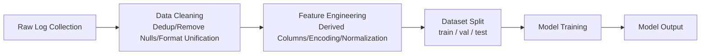
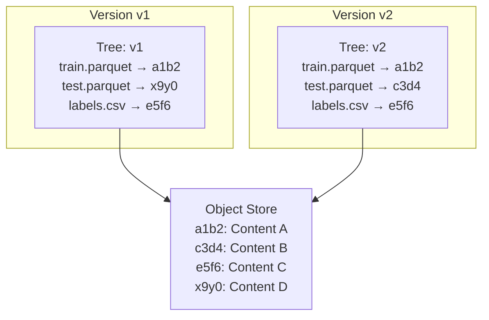
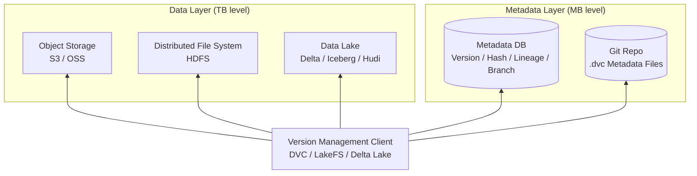

# Data Versioning

Imagine you are training an image classification model. After two weeks of hyperparameter tuning, the model achieves 93% accuracy on the test set, a 2-percentage-point improvement over the previous run. You are eager to reproduce this result, only to find a file named `dataset_v3_final_fixed_revised.csv` sitting in your training data directory, with no recollection of how it differs from the `dataset_v3_final_fixed.csv` you used last week. In machine learning engineering, code has Git guarding every change, but data — an input just as important as code — often exists in only one state: "the latest version."

As early as the early 2000s, the data warehousing field began exploring data lineage tracking: where data comes from, what transformations it undergoes, and where it ultimately flows. This concept truly entered the awareness of machine learning practitioners in 2017, when DVC (Data Version Control) released its first version. Its creator, Dmitry Petrov, had worked as a data scientist at Microsoft and experienced firsthand the chaos caused by data disorganization. He once wrote in a blog post that everyone on the team was running experiments with different versions of data, and no one could say which version corresponded to which model. DVC was designed to manage data the way Git manages code, using Git's commit history to weave a complete lineage connecting data, code, and models.

In 2019, Databricks open-sourced Delta Lake, providing ACID transactions, time travel, and incremental query capabilities on top of cheap object storage. In 2020, the Israeli startup Treeverse released LakeFS, bringing Git's branching and merging semantics to data lakes. Today, data versioning has become a standard component of MLOps practice, making data as traceable, comparable, and reproducible as code. But these three words conceal engineering challenges far greater than those of managing code versions. When datasets are tens of gigabytes or larger, changes happen at the file level rather than the line level, and a single feature engineering operation can alter millions of records, traditional version control methods break down entirely.

## Data Versions

If you are a software engineer, Git's workflow is likely etched into your muscle memory. You are accustomed to inspecting every line of code change, switching between branches freely, and using `git blame` to trace the origin of each line. This experience is so smooth that when you first encounter the need for data versioning, your instinctive reaction might be: why not just `git add dataset_v3_final_fixed.csv`?

The reality is that code is typically measured in kilobytes to megabytes, while a training set can be gigabytes or even terabytes, stored in formats like Parquet columnar files, TFRecord binary files, image directory trees, or HDF5 arrays. With these formats, you cannot expect `diff` to find meaningful differences between two 50 GB Parquet files — it is like trying to dissect a whale with a scalpel. A further complication is that code changes are line-granular, while data changes occur simultaneously at three granularities: the record level (which rows were added, deleted, or which field values were modified), the file level (which images were added or audio files deleted), and the most subtle but also most important semantic level (whether feature distributions have drifted, or whether label ratios have shifted from balanced to skewed). Clearly, data versioning is more complex than code versioning and requires a more targeted set of engineering methods to support it.

### From Raw Data to Model

In a real-world machine learning pipeline, data typically undergoes a long chain of transformations before reaching model training. Raw logs are collected from external systems, cleaned to remove invalid records, processed through feature engineering to generate derived columns, and then split into training, validation, and test sets according to some strategy. Each step's output is the next step's input, forming an end-to-end chain. In data engineering, this chain is called data lineage, which records the complete path of data from its source to its consumer.

*Figure: Machine Learning Data Pipeline*

The diagram above shows a simplified machine learning data pipeline. Now suppose you do two things simultaneously in one experimental iteration: adjust the normalization logic in feature engineering and add several more convolutional layers to the model. The result is a 2% improvement in accuracy for the new experiment. Now you want to know: does this 2% improvement come from the new normalization logic or from the deeper network design? If the normalization was done in place, the old data has been overwritten, and you cannot go back to the previous experiment's data for comparison. Therefore, without data versioning, every experimental conclusion is built on old data that can no longer be traced. Data versioning is precisely the foundation for constructing data lineage. It assigns referenceable version identifiers to each node in the pipeline, turning "which version of the data was this model trained on?" into an answerable question rather than an archaeological dig through logs and history.

### Immutable vs. Mutable Data

Whether data needs versioning, how it should be managed, and how it should be stored all depend on what type of asset you consider the data to be. Raw data — from production system logs, sensor readings or third-party annotations — should never be modified once generated. It records an objective fact at a specific moment in time, much like a committed commit in Git; modifying it would be rewriting history. For this type of immutable data, the most natural storage strategy is [content-addressable storage](#content-addressable-storage), using the hash of the data content (e.g., SHA-256) as the storage identifier — identical content is automatically deduplicated, and different content creates a new version.

In contrast, derived data produced through cleaning, transformation, or feature engineering is mutable. Feature columns may be added or removed, label values may be batch-corrected, and dataset split strategies may be adjusted. Each change should record three pieces of information: the reason for the change (why), what was changed (what), and the scope of impact (which downstream tasks are affected). For this type of mutable data, the purely immutable model of content addressing is too rigid. A more suitable approach is to combine [full snapshots](#full-snapshot-strategy) with [incremental log tracking](#incremental-tracking-strategy), balancing storage cost and recovery efficiency.

Distinguishing between immutable and mutable data not only determines the choice of storage strategy but also shapes team collaboration norms: raw data should be locked and protected, while every change to derived data should leave an audit trail. These norms form the fundamental principles underlying all subsequent version management operations.

### Full Snapshot Strategy

The most intuitive approach to data versioning is to save a complete copy of the dataset with every modification. This is called the **Full Snapshot** strategy. Version v1 is one full copy of the dataset, version v2 is another full copy, and so on. When you need to restore a historical version, you simply read the corresponding snapshot directly, with no replay operations needed.

The advantages of this strategy are low implementation cost (you can even start with manual copying, no specialized tools required) and constant recovery time (reading one complete file takes the same time regardless of version history length). If your dataset is only a few hundred megabytes and changes once a month, full snapshots are perfectly adequate and may even be the optimal choice. When the data volume is small enough, simplicity itself is valuable. The problem with full snapshots is the high storage cost, which grows linearly with the number of versions. Suppose your training dataset is 10 GB and changes weekly. Over a year, that is 520 GB of storage overhead, even though more than 98% of the data blocks may never have changed. For terabyte-scale datasets with daily changes, this growth curve is unsustainable. Some engineering measures can mitigate this issue: for instance, using columnar storage formats (like Parquet or ORC) combined with compression algorithms (like Snappy or Zstd) can reduce a single copy's size to 20% to 40% of the original. But this only lowers the cost per snapshot; the slope of linear growth remains unchanged.

### Incremental Tracking Strategy

**Incremental Tracking** is borrowed from the database domain. Instead of saving the entire dataset every time, it records only the changes since the previous version. In the context of data versioning, incremental tracking needs to record three types of change operations: which records were added (INSERT), which were deleted (DELETE), and which fields were modified along with their before-and-after values (UPDATE). These operations are written into a delta log, forming a chronological sequence of changes. To restore a specific version, you start from the most recent full snapshot and replay all incremental operations between the snapshot and the target version in order.

This strategy optimizes storage cost from being proportional to the number of versions to being proportional to the volume of changes. If you add 1,000 records, the storage cost is the size of those 1,000 records, not a copy of the entire dataset. However, recovery time becomes proportional to the version span. If there are 100 incremental versions between the most recent full snapshot and the current version, you need to replay 100 change logs. To balance this trade-off, practice typically employs a checkpoint strategy: after accumulating N incremental versions (e.g., N = 10 or N = 20, depending on write frequency and storage budget), a full snapshot is automatically generated as a new baseline. This way, restoring any version requires replaying at most N-1 increments, providing a controllable compromise between storage cost and recovery speed. Choosing the value of N is essentially deciding how much additional storage cost you are willing to pay for faster recovery.

### Content-Addressable Storage

Full snapshots and incremental tracking balance storage cost against recovery efficiency. **Content-Addressable Storage** answers a more fundamental question: how should data be stored? It uses a hash of the data content as the data's identifier and storage key, rather than using filenames or paths. The same content always produces the same hash, so identical content is automatically deduplicated and never stored twice.

Git's object storage model is a prime example of content-addressable storage. When you `git add` a file, Git computes the SHA-1 hash of the file content, compresses it, and stores it in `.git/objects` directory using that hash as the filename. If two different filenames point to identical file content, Git does not store two copies — they share the same blob object. The directory structure is organized by tree objects, each recording "filename → blob hash" mappings. A commit is simply a pointer to a tree object, along with the author, timestamp, and commit message. Translating this model to data versioning uses exactly the same idea, as shown in the following example:

*Figure: Shared Files Between Two Versions*

In the diagram above, versions v1 and v2 share two data files (`train.parquet` and `labels.csv` remained unchanged, so their hashes are identical). Only the content of `test.parquet` changed. Therefore, at the object storage level, v2 only needs to store one new copy of the `test.parquet` content; the other files are automatically reused. During dataset version iteration, more than 90% of data blocks typically remain unchanged, so content-addressable storage can reduce storage costs by an order of magnitude.

For large files (e.g., gigabytes in size), whole-file deduplication may still waste space. Most of the file content remains unchanged, but a small change causes the entire file's hash to change. The solution is to split the file into chunks — either at fixed sizes (e.g., 4 MB) or based on content-defined chunking (e.g., the Rabin fingerprint algorithm) — and compute a hash for each chunk independently. This way, only the chunks that actually changed need to be re-stored, while unchanged chunks are automatically reused.

## Branching and Merging

Git users are already accustomed to the concept of branching: create a branch from the main line, experiment freely on it, merge it back on success, or discard it on failure, keeping the main line always in a releasable state. Branching in data versioning follows the exact same philosophy, except the object of operation shifts from source code to datasets. In machine learning workflows, data branches have several typical use cases.

The most common is the feature experiment branch. Suppose the main branch dataset is already stable and used for production model training, but you have a new feature engineering idea — for example, creating a cross-product of two numerical features to generate a derived column, or trying a new encoding scheme for a categorical feature. You are not sure whether this idea will work, and modifying the main branch data in place could disrupt other ongoing experiments. The correct approach is to create an experiment branch from the main branch, perform the feature transformation on the new branch, train an experimental model with it, and then compare against the baseline model trained on the main branch data. If accuracy improves, merge the branch changes back into the main branch; if not, simply delete the branch without leaving a trace.

Another scenario is the data fix branch. After running in production for a while, you may receive user feedback. For example, in a sentiment classification dataset, 500 comments labeled as "positive" should actually be "negative." You do not want to modify the main dataset record by record, as this would affect all historical experimental results based on that dataset. A safer approach is to create a fix branch from the main branch, perform batch corrections on the branch, verify correctness, merge back into the main branch, and tag it with a new version.

A more complex scenario is multi-tenant branching. Different business lines share the same base dataset (e.g., user behavior logs), but each needs to maintain business-specific extended fields. By creating independent branches for each business line, updates to the base data can be synchronously propagated one-way to each tenant branch, while the extended fields of different tenants do not interfere with each other.

All data branches in these scenarios should have a clear lifecycle. Short-term experiment branches should be cleaned up promptly after the experiment is complete. Long-lived branches (such as multi-tenant branches) need regular synchronization from the main branch to prevent excessive divergence. A branch system without lifecycle management will eventually degenerate into a "branch graveyard" that no one can understand.

### Data Merge

When merging code, Git's merge algorithm can handle most cases automatically. If two branches modify different files, or modify different lines of the same file, Git can merge directly. Human intervention to resolve conflicts is only needed when both branches modify the same line of the same file. This line-by-line comparison strategy works in the code world because code changes are line-granular. Data merging does not have this convenience, because data changes occur not only at the row granularity but also at the field granularity and across cross-field semantic constraints. A natural extension of the line-by-line strategy to data is the Three-Way Merge: take the base version (the common ancestor of the branches), the current version of branch A, and the current version of branch B, and perform a three-way comparison. Records that have not changed in any of the three versions are kept as-is. Records changed in only one branch are automatically set to that branch's modification. Records changed in both branches are flagged as conflicts requiring human intervention.

But the problem is that data changes are not limited to the row granularity. Even if a three-way merge finds no syntactic conflict, semantic conflicts may still arise. For example, consider a user profile table in the dataset with two fields: `age` and `birth_year`. Branch A changes the user's `age` from 30 to 25, while branch B changes `birth_year` from 1995 to 1985. At the syntactic level, the two branches modified different fields, so the three-way merge can automatically handle this without conflict, resulting in `age` = 25 and `birth_year` = 1985. But at the semantic level, since the current year is 2026, a 25-year-old cannot have been born in 1985. Syntactically there is no conflict, yet semantically the result is contradictory.

Syntactic conflicts are easy to detect; semantic conflicts require domain knowledge. This is the fundamental difficulty of data merging. Data merging typically employs three strategies: **Field-Level Merge** (finest granularity) reports a conflict only when both branches modify the same field of the same record. Its advantage is fewer conflicts, but its disadvantage is that it cannot detect cross-field semantic contradictions. **Record-Level Merge** (coarsest granularity) reports a conflict whenever both branches touch the same record. Its advantage is that it never misses semantic issues within a record (though cross-record semantic conflicts may still exist), but its disadvantage is that many harmless changes are also flagged as conflicts. **Semantic-Validation Merge** runs a set of predefined validation rules (e.g., "birth year must equal current year minus age") after the automatic merge, flagging only those records that violate the rules. This is currently the most ideal approach, but also the most expensive to implement. Handling semantic conflicts is a frontier topic in data management today.

### Data Tagging and Release Management

In Git, a tag is a semantic alias for a specific commit. Calling it `v2.0.0` is much easier to understand and communicate than calling it `a1b2c3d`. Tags in data versioning play the same role, and are arguably even more critical. A data tag not only represents a specific data snapshot but also serves as a key anchor for tracing back to the model version trained with that data.

A typical release management workflow goes as follows: the data team completes a new round of data cleaning and feature engineering changes on the `dev` branch, verifies the results, and merges them into the `staging` branch. In the staging environment, the model team uses the data from this branch to train a validation model and checks whether the evaluation metrics are stable (e.g., AUC has not unexpectedly dropped compared to the previous version). If the validation passes, a semantic tag (e.g., `v2.1-production`) is applied on the staging branch, and the change is published to the `production` branch. From then on, any model training task that specifies `data_version=v2.1-production` can precisely retrieve that version of the data.

Data versions corresponding to published tags must be locked and prohibited from any modification. This constraint is not optional; it is a prerequisite for experimental reproducibility. Imagine reporting in a paper that your model achieved 93% accuracy on the v2.1 dataset, only to have someone later modify the data content associated with v2.1, making it impossible for anyone to reproduce your result. The immutability of data tags follows the same principle as Git tags: what has been published is history and must not be changed.

A further step is to explicitly associate data tags with model versions. Record `training_data_tag: v2.1-production` in the model metadata, and record `used_by_models: [model-v3.0, model-v3.1]` in the data metadata. This builds a bidirectional traceability chain between data versions and model versions. When a model exhibits anomalies in production, you can trace back along this chain to the data version it used and check whether the root cause lies in the data.

## Engineering Practices

The previous sections explained the fundamentals of data versioning, branching, and merging. This section introduces several practical engineering practices in data versioning.

### Metadata-Data Separation

When data volumes grow from gigabytes to terabytes, it becomes extremely inefficient to move actual data for every version operation. Copying 10 TB of data over the network can take tens of minutes or even hours. We should separate version management metadata from the data itself at the architectural level.

The metadata layer is "thin." It contains version numbers, content hashes, change logs, lineage relationships, branch structures, and other information. Its size is typically on the order of megabytes, and it can be stored in a relational database (like PostgreSQL) or managed directly with a Git repository (this is exactly what [DVC](https://dvc.org/) does — `.dvc` files are plain-text metadata pointers committed alongside the code in Git). The data layer is "fat." It stores the actual data files or tables in object storage (like S3, Alibaba Cloud OSS) or distributed file systems (like HDFS).

The benefits of this separation pervade the entire machine learning pipeline. Version comparison operations no longer require scanning the data itself — simply comparing hashes in the metadata reveals whether a file has changed, completing the check in milliseconds. Creating a new branch no longer copies data — only a new version pointer is created in the metadata, while the data itself remains untouched. If you need to clone a 50 TB dataset for another team, only the metadata files (a few megabytes) are transmitted; the data itself is accessed through shared object storage, requiring no copying at all. This is why, in DVC, the data itself and the metadata follow completely different storage paths: `dvc push` and `dvc pull` upload/download the data cache to/from remote storage, while `git push` and `git pull` synchronize the .dvc metadata files.

### Storage Backend Selection

In real-world engineering, the storage backend for data versioning can be divided into two layers. The bottom layer is the basic storage capability provided by object storage (i.e., "dumb storage" that only provides simple PUT/GET operations without awareness of table structures or transaction semantics) — such as submitting files, reading files, addressing by path, etc. The top layer is the advanced table management capability built on top of object storage by data lake formats — such as ACID transactions, time travel, and incremental queries.

Raw object storage (e.g., AWS S3 or Alibaba Cloud OSS) already natively supports simple version control. When bucket versioning is enabled, each overwrite write automatically retains the historical version, and you can restore to any historical state at any time using the version ID. This approach is sufficient for scenarios with a small number of files and low change frequency, but it only provides the most basic version control — it has neither incremental diff capability (you can only see that two files are different, but not which records changed) nor transaction support (in scenarios where multiple files are updated simultaneously, there is no consistency guarantee that either all succeed or all fail). To compensate for these shortcomings, data lake formats build an additional abstraction layer on top of object storage. The three mainstream data lake formats each have their own focus:

| Feature | Delta Lake | Apache Iceberg | Apache Hudi |
|:-------:|:----------:|:-------------:|:----------:|
| Core Mechanism | Transaction Log | Snapshot Isolation | Incremental Pull |
| Write Mode | Batch-first, streaming support | Batch write, streaming via Append | Both batch and streaming as first-class citizens |
| Time Travel | Replay via transaction log to any version | Query by snapshot ID or timestamp | Query by commit time |
| Incremental Query | Supported (diff two versions) | Supported (via snapshot diff) | Native support (design core) |
| Ecosystem Compatibility | Deeply tied to Spark, Trino/Presto support | Multi-engine first-class (Spark/Flink/Trino/Hive) | Deep integration with Kafka/Spark/Flink |

Which format to choose depends on your workload characteristics. If your pipeline is primarily Spark batch processing and you value operational simplicity and deep integration with the Databricks ecosystem, Delta Lake is a natural choice. If your organization uses multiple compute engines (Spark, Flink, Trino) and wants to avoid vendor lock-in, Iceberg's neutral architecture is a better fit. If your scenario involves continuous streaming data writes with downstream consumers needing efficient incremental pull (e.g., real-time feature engineering), Hudi's incremental pull design is the most suitable.

### Pipeline Integration

All the theory and tools must ultimately be embedded into a concrete machine learning pipeline to deliver value. The integration of data versioning with ML pipelines should follow the principle of automating all versioning operations that can be automated, leaving humans to make only decisions.

At the pipeline entry point, the system should automatically record the version identifier (hash or tag) of the current input data and write it into the experiment metadata. This means that when you start a training task, you do not need to manually specify `--data-version=v2.1`; the pipeline automatically reads the latest tag from the data store and records it in MLflow's run parameters or TensorBoard's log directory. At the pipeline exit point, if this run produces new derived data — for instance, the feature engineering step modified the preprocessing logic — the system should automatically commit a new version and link it with the input version and code version, forming an inseparable triplet of (input data version, code commit, output data version).

The end goal of this automation chain is to guarantee that the same code plus the same data version yields reproducible experimental results. If a training result cannot be reproduced, you can immediately triage: either the code changed (check Git commit), the data changed (check data version hash), or the environment changed (check Docker image tag). At least one of these three must be the issue.

Going a step further, data version changes can serve as triggers for CI/CD pipelines. When a new data tag is applied on the staging branch (meaning the data team has completed a round of changes and verified them), the CI/CD system can automatically trigger downstream tasks: retraining the validation model, running evaluation scripts, comparing performance metrics between old and new versions, and automatically blocking the release if metric regression exceeds a threshold. In this way, data versioning is no longer just a storage and recording tool — it becomes an active execution component of the machine learning system's quality assurance framework.

## Summary

The fundamental goal of data versioning is to make data in machine learning systems as traceable, comparable, and reproducible as code. This chapter started from the essential differences between data and code and decomposed the three levels of challenges in data versioning.

- At the data level, the choice of storage strategy depends on data volume and change characteristics. Full snapshots are simple and reliable, but their cost grows linearly with the number of versions. Incremental tracking ties storage cost to the volume of changes rather than the number of versions. Content-addressable storage automatically eliminates redundancy at the low level through hash-based deduplication. These three approaches are not mutually exclusive; mature solutions in practice often use content-addressable storage as the core, supplemented by checkpoint snapshots.

- At the collaboration level, data branching and merging bring Git's workflow into the data world. Data branches provide isolation for feature experiments, annotation fixes, and multi-tenant scenarios, but data merging is far more complex than code merging. Syntactic conflicts can be automatically resolved through three-way merging, while semantic contradictions require domain knowledge and validation rules. Data tagging and release management enforce the hard constraint that published data must never be modified.

- At the engineering level, the separation of metadata and data allows terabyte-scale version operations to complete in milliseconds. Data lake formats (Delta Lake, Iceberg, Hudi) build transaction, time travel, and incremental query capabilities on top of object storage. Embedding version management into the entry and exit points of ML pipelines means that every model training result can be traced back to a precise data snapshot — this is the material foundation of experimental reproducibility.

This chapter focused on concepts and architecture, emphasizing the "why" and "what" of data versioning. For specific tool selection and operational practices — such as how to introduce DVC into a project, how to configure a Delta Lake production cluster, or how to design data branch naming and merge conventions — readers should consult the relevant tool documentation and practice hands-on.

## Exercises

1. Suppose you have a 50 GB training dataset that changes weekly, with each change involving approximately 5% of the data records (additions, deletions, or modifications). Estimate the annual storage costs of the full snapshot strategy and the incremental tracking strategy respectively (assuming no checkpoints), and discuss how you would design a checkpoint strategy in practice to balance storage cost and recovery speed.

   

   
Reference Answer

   
   **Full Snapshot**: 50 GB × 52 weeks = 2.6 TB. Regardless of how much data actually changes, a complete copy must be stored each time.

   **Incremental Tracking**: The incremental portion is 50 GB × 5% × 52 = 130 GB. Incremental tracking still requires an initial base version (50 GB), totaling approximately 180 GB, with only the change records stored each subsequent week.
   
   This comparison highlights the enormous storage advantage of incremental tracking on large datasets. However, in practice, a purely incremental approach leads to excessive recovery times: recovering the 52nd week's data requires replaying 52 incremental logs. A sensible checkpoint strategy is to generate a full snapshot every 4 weeks (i.e., checkpoint interval N = 4 weeks), so that any version recovery requires replaying at most 3 incremental logs. Over a year, this yields 13 full snapshots (650 GB) plus 52 incremental logs (130 GB), totaling 780 GB — a 70% storage savings compared to pure full snapshots.
   

2. The core assumption of content-addressable storage is that identical content produces identical hashes. If two team members independently generate the same dataset's feature files on their respective machines (content completely identical but filenames and creation times differ), how would content-addressable storage handle this? Under what circumstances would this assumption fail?

   

   
Reference Answer

   
   Content-addressable storage identifies files by computing a hash (e.g., SHA-256) of the file content, independent of metadata such as filename, creation time, or path. Therefore, even if two files have different names and creation times, as long as their content is identical, they produce the same hash and only one copy is stored in object storage. The "filename → hash" mappings in the two version snapshots will point to the same object storage entry.

   This assumption fails in the following cases:
   - Hash collision: SHA-256 still has an extremely low probability of collision. In security-sensitive scenarios, hash algorithms with lower collision probability should be used (e.g., SHA-512 or BLAKE3)
   - Serialization non-determinism: Saving the same DataFrame twice with `pandas.to_parquet()` may produce different binary content due to differing internal metadata (e.g., timestamps, version numbers), resulting in different hashes. The solution is to canonicalize the data before computing the hash, such as re-serializing Parquet files into a canonical form, or computing the hash over the logical content rather than the physical file
   

