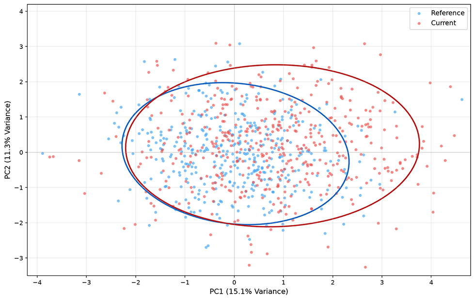
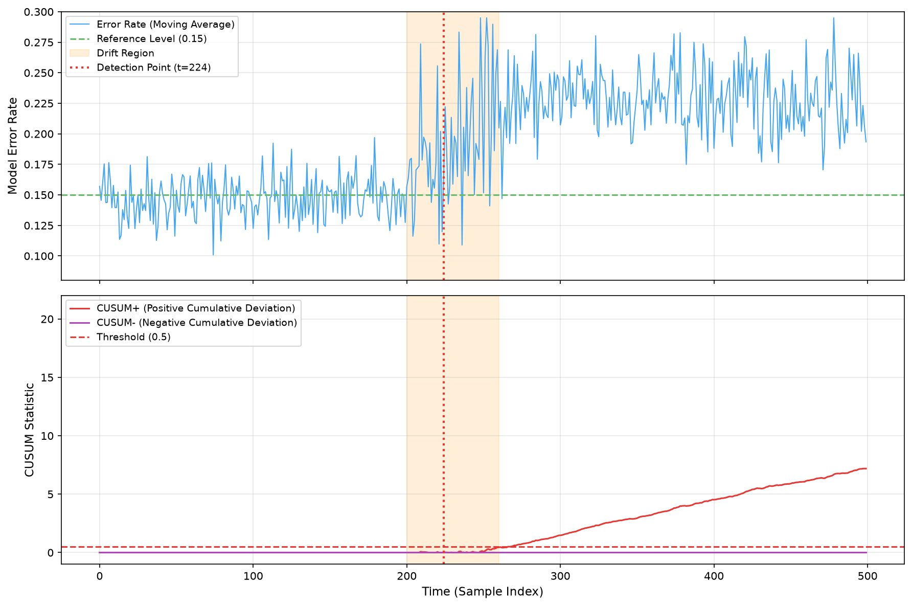

# Drift Detection

**Drift** refers to the inconsistency between the data distribution at model training time and the data distribution after deployment. In 1986, two computer scientists at UC Irvine, Jeffrey C. Schlimmer and Richard H. Granger, published a paper at the AAAI conference titled [_Beyond Incremental Processing: Tracking Concept Drift_](https://aaai.org/papers/00502-aaai86-084-beyond-incremental-processing-tracking-concept-drift/). They designed a concept generator called STAGGER that used three discrete attributes (size, color, shape) to simulate abrupt concept changes, attempting to make the learning system discover on its own that the rules had changed. The contribution of this paper lies not only in proposing an experimental benchmark that remains widely cited to this day, but also in defining the concept of drift, which has become one of the primary concerns in machine learning operations over the following decades.

A decade later, in 1996, Gerhard Widmer and Miroslav Kubat published _[Learning in the Presence of Concept Drift and Hidden Contexts](https://link.springer.com/article/10.1007/BF00116900)_. This paper introduced the FLORA family of adaptive learning algorithms, which for the first time systematically distinguished different forms of concept drift and connected drift detection with model adaptation strategies. From then on, drift detection gradually became an engineering challenge that machine learning systems in production must address.

## Inevitability of Drift

Machine learning models typically cannot account for drift during design and training. They are built on an elegant but fragile assumption: that the distribution of training data is the same as the distribution of future data. In the real world, this assumption almost never truly holds. Seasons change consumer behavior, policy adjustments affect market trends, unexpected events overturn historical patterns -- the data generation process is inherently non-stationary.

Drift manifests in different forms along the time dimension. Some drifts are gradual and subtle, such as consumer preferences evolving over years with cultural shifts -- styles popular a few years ago may be unwanted today. This kind of change is imperceptible in the short term but has significant cumulative effects. Others are abrupt and dramatic, like the sudden transformation of online shopping behavior during the early stages of the 2020 pandemic, which caused all models trained on historical data to fail simultaneously. There are also periodic fluctuations, such as e-commerce promotional cycles or seasonal electricity usage patterns. While these differ significantly from normal conditions, the pattern of change is itself predictable.

Drift is not a defect; it is the natural projection of the real world into data. The question drift detection seeks to answer is: has the distribution changed? How much has it changed? What type of drift is it? Is action required? These questions sound simple, but in a production environment influenced by high-dimensional feature spaces, massive data streams, and delayed label feedback, each one is far from easy to answer.

### Drift and Model Degradation

A paradox of drift in machine learning is that the better a model fits the training data, the more fragile it may be when faced with distribution shifts. Generalization ability has its limits. A model fitted to a specific distribution is like a student who has memorized an old exam bank -- when the same subject is tested with new material, they are at a loss. This is the dilemma that static machine learning models must confront in a dynamic physical world. In the previous chapter, we discussed model degradation. Drift scenarios can easily lead to a mental shortcut, where one assumes that data drift necessarily causes model performance to degrade. But the relationship between the two is far more complex than intuition suggests. If the distribution of a certain feature shifts significantly, but that feature contributes negligibly to the model's decisions, the decision boundary may remain unchanged, and the model's actual performance will not be affected. Conversely, model degradation may not be caused by drift at all. A format change in a feature pipeline field, or a label definition silently altered by an upstream system, can both cause a cliff-like drop in prediction quality, even while the feature distribution appears perfectly normal.

In summary, drift detection and [model performance monitoring](model-performance-monitoring.md) form a complementary rather than substitutive relationship. Drift detection plays the role of an early warning system. Like a seismograph sensing subtle shifts in the data layer, it sends out signals before model performance metrics (which require delayed ground-truth labels to compute) deteriorate. But this is a warning, not a diagnosis. A drift signal simply tells you that something has changed. Whether that change requires intervention, and how to intervene, must be determined in the context of the business and subsequent diagnostics.

### Types of Drift

The chain from drift to degradation varies by the type of drift. Before deciding whether and how to address model degradation, it is essential to first clarify what is drifting. The academic community typically distinguishes three granularities of drift from the perspective of conditional probability: covariate shift, concept drift, and label shift. For covariate shift, the model's input enters unfamiliar territory, and prediction bias accumulates gradually. For concept drift, the conditional probability distribution itself has changed within a familiar region. Both ultimately manifest as a decline in performance metrics.

- **Covariate Shift** describes a change in the marginal distribution of the input features $X$, i.e., $P(X) \neq P_{ref}(X)$. This is the most intuitive and easiest type of drift to detect. For example, your model predicts loan default, and applicants in the training data were concentrated in the 30-50 age range, but recently the system connected to a student loan channel, and a large influx of applicants around age 20 appears. This is a classic case of covariate shift.

   Covariate shift is the most frequent alarm raised by drift detection systems, and it most easily triggers "cry wolf" fatigue. The reason covariate shift is easy to detect is fundamentally that it requires no labels at all -- as long as feature data is available, the reference distribution and current distribution can be directly compared. However, this also means covariate shift is easy to detect but hard to interpret. The type of covariate shift most likely to exhaust the operations team is statistically significant yet business-irrelevant distribution changes. For example, the distribution of "interest tags" that users fill in during registration may change due to a front-end UI revamp, but the model generally does not rely on this feature for decision-making. If alarms are raised indiscriminately for all feature drifts without distinction, operations staff will soon be overwhelmed by false positives, missing truly critical signals. An effective tool for accurately assessing covariate shift is to establish a feature importance map -- only the drift of features that the model truly depends on deserves attention.

- **Concept Drift** describes a change in the conditional probability of the output label given the same input, i.e., $P(Y|X) \neq P_{ref}(Y|X)$. In plain terms, the same input now yields a different result. This is the most dangerous type of drift because it directly undermines the model's decision-making foundation. Detecting it requires label data, which is often delayed. During an economic crisis, the probability of default corresponding to the same income level and debt profile may rise across the board, rendering the old risk model inaccurate. This is a real example of concept drift.

   If covariate shift is "crying wolf," concept drift is the wolf itself -- and it often enters the sheep pen before you even see it. The fundamental difficulty in detecting concept drift is [label delay](model-performance-monitoring.md#label-delay-issue). To know whether $P(Y|X)$ has changed, you need labels from enough new samples to estimate the conditional probability, but labels often take days or even weeks to be collected. By the time concept drift is confirmed, the model may have been running on incorrect assumptions for a long time. This is also why, in practice, concept drift detection often degrades into a supplementary tool for model performance monitoring. Rather than trying to directly detect changes in $P(Y|X)$, it is more practical to monitor the upward trend in model prediction error, using performance degradation as a proxy signal for concept drift.

- **Label Shift** describes a change in the marginal distribution of the output label, i.e., $P(Y) \neq P_{ref}(Y)$. For example, in a spam filtering model, a sudden surge in phishing emails changes the positive-to-negative sample ratio from 1:9 to 3:7. Label shift does not change the correspondence between input and output itself, but it undermines the model's probability calibration. A prediction confidence of 0.8 may no longer imply an 80% true probability.

   Label shift has the lowest detection threshold among the three types of drift. It only requires counting the change in the positive-to-negative sample ratio, without complex distribution comparisons. Suppose your fraud detection model had a 1% fraud rate in the training set, but the actual fraud rate over the past month has risen to 3%. This is a typical case of label shift. There is a subtle coupling between label shift and covariate shift. In many cases, label shift is a consequence of covariate shift. If the proportion of a certain type of high-risk user (a specific age group, specific occupation characteristics) suddenly increases, the label distribution will naturally change as well. However, they can also occur independently. In the spam filtering scenario, fraudsters may batch-replace their email templates, causing the input features to remain almost unchanged while the total volume of spam doubles. Distinguishing whether label shift is a side effect of covariate shift, or an independent change in label distribution while the input distribution remains unchanged, determines the subsequent model update strategy. The former requires resampling or weighted training, while the latter may require adjusting the classification threshold or recalibrating probabilities.

   The most direct damage label shift inflicts on a model is the destruction of probability calibration. A model trained with a 1% prior fraud rate produces an output of 0.8 that corresponds to a specific posterior probability. When the prior rate becomes 3%, the same 0.8 no longer implies the same confidence -- the model's prediction score scale has shifted. Fortunately, correcting label shift is a relatively mature technique. Through importance weighting or Bayesian correction, probability calibration can be completed without retraining the model.

The three types of drift can be summarized in one sentence: covariate shift means "the appearance of the problem has changed," concept drift means "the answer to the problem has changed," and label shift means "the proportion of answers has changed." In production environments, they often do not occur in isolation. A sudden market event may simultaneously cause a surge in a certain type of user (covariate shift), a change in their consumption preferences (concept drift), and an overall decline in conversion rates (label shift). Several types of drift intertwine along the timeline, making root cause analysis extremely difficult.

## Statistical Detection Methods

Transforming intuitive judgments about drift into quantifiable, automatable detection processes requires statistical tools, collectively referred to as statistical detection methods. The core problem they address is determining whether two distributions differ significantly across a large number of features, high-dimensional spaces, and streaming data. Statistical detection methods can be divided into three categories: univariate methods that compare each feature individually, multivariate methods that also consider relationships between features, and time-series methods specifically designed for streaming data. Each category has its own applicable scenarios, detailed below.

### Univariate Drift Detection

Univariate methods calculate, for each feature, the degree of difference between the reference distribution and the current distribution, raising an alarm when a preset threshold is exceeded. The advantage of such methods is their computational simplicity and interpretable results. The disadvantage is their limited perspective. Univariate methods can only capture changes in the marginal distribution of individual features and cannot detect drift in correlations between features. Even if every feature appears normal, the joint distribution may have changed significantly, and univariate methods are powerless in this regard. Imagine a simplified credit scenario: the distributions of income and debt-to-income ratio each drift by 5%, neither of which looks severe on its own. But if the correlation between these two features has flipped (originally high-income individuals had low debt ratios, now high-income individuals also have high debt ratios), the model's decision boundary may be completely invalidated. This type of correlation change does not appear in any univariate drift statistic. Typical representatives of univariate methods are the [KS test](model-performance-monitoring.md#statistical-test-methods) (Kolmogorov-Smirnov Test) and the [PSI](model-performance-monitoring.md#statistical-test-methods) (Population Stability Index), both introduced in model performance monitoring.

Beyond the KS test and PSI, univariate methods also include the **Chi-Square Test**, specifically designed for discrete or binned categorical features. It compares the observed and expected frequencies of each category between the reference data and the current data. The squared differences are normalized and summed to produce the chi-square statistic. The larger the chi-square value, the less likely the two distributions come from the same population. Additionally, the **Wasserstein Distance** (also known as Earth Mover's Distance) measures distribution divergence by calculating the minimum cost required to transform one distribution into another. It is particularly sensitive to shifts in the distribution and is well-suited for capturing patterns where the entire distribution slides in a certain direction.

### Multivariate Drift Detection

Multivariate drift detection attempts to compensate for the blind spots of univariate methods, at the cost of increased computational complexity and reduced interpretability. The most direct challenge comes from the curse of dimensionality in high-dimensional spaces. As the number of feature dimensions increases, the sample size required to describe the joint distribution grows exponentially. In practice, with hundreds of dimensions, directly comparing joint distributions is nearly impossible.

**Multivariate methods based on dimensionality reduction** map high-dimensional data to a low-dimensional space before comparing distributions. The most common dimensionality reduction technique is [PCA](../../statistical-learning/unsupervised-learning/dimensionality-reduction.md) (Principal Component Analysis). A PCA transformation matrix is first fitted on reference data, then both reference and new data are projected onto the first few principal components. In the low-dimensional space, univariate methods can be applied, or the overlapping area of scatter plots can be directly compared. An [autoencoder](../../deep-learning/generative-models/vae.md#autoencoder-principles) can be viewed as a nonlinear extension of PCA, learning compressed representations through neural networks and achieving stronger capability in capturing complex nonlinear relationships. The intuition behind dimensionality reduction methods is that if the high-dimensional structure of the data has changed substantially, this change will also be reflected in the low-dimensional representation.

The following figure shows an example of distribution comparison after PCA dimensionality reduction. Blue scatter points represent the projection of reference data onto the first two principal components, orange points represent current data, and the ellipses indicate the 95% confidence regions of each distribution. The positional offset and shape change of the ellipses intuitively reflect multivariate drift.

*Figure: Distribution comparison after PCA dimensionality reduction*

**Multivariate methods based on classifiers** circumvent the challenge of directly modeling high-dimensional distributions with an elegant approach. They label reference data as class 0 and new data as class 1, then train a binary classifier to distinguish between them. If the classifier can easily separate the two classes (AUC close to 1), the distributions differ significantly. If the classifier cannot distinguish them at all (AUC close to 0.5), the two distributions are highly overlapping in feature space. The elegance of this method lies in its ability to leverage any classifier's capacity to automatically learn interactions between features, without needing to manually specify which joint distributions to compare.

**MMD** (Maximum Mean Discrepancy) is a classic application of [kernel methods](../../statistical-learning/support-vector-machines/kernel-methods.md) in drift detection. It maps two distributions into a Reproducing Kernel Hilbert Space (RKHS) and compares whether their mean embeddings in that space are identical. Roughly speaking, the data is transformed into a higher-dimensional space via a kernel function, and the farther apart the centers of mass of the two distributions are in this space, the more severe the drift. MMD has a useful mathematical property: when using a characteristic kernel (such as the Gaussian kernel), MMD equals zero if and only if the two distributions are identical. This makes MMD a rigorous multivariate drift detection metric.

Multivariate methods offer stronger detection capability but also come with higher cost. They can provide early warnings for joint distribution changes that are difficult to capture in individual features. However, when an alarm sounds, explaining "where exactly did the drift occur" is much harder than with univariate methods. In practice, a common approach is to use multivariate methods as a top-level sentinel. Once an alarm is triggered, features are investigated one by one to identify the specific source of drift.

### Time-Series Drift Detection

The univariate and multivariate methods described above assume that data is collected independently and identically distributed (i.i.d.), comparing statistics between two batches to determine drift. However, in streaming data scenarios (real-time model predictions, sensor data streams, transaction flows), data arrives one point at a time, and drift can occur at any moment. Online judgment must be made without having the complete current distribution.

**ADWIN** (ADaptive WINdowing) is a representative of adaptive window methods, proposed in 2007 by Spanish computer scientists Albert Bifet and Ricard Gavalda. ADWIN maintains a time window of variable length, constantly attempting to split the window into two sub-windows and comparing the means of the two segments. If the mean difference of a split exceeds a threshold, a drift is detected at that cut point. All old data before the cut point is then discarded, and the window shrinks. If no split reveals a significant difference, the window continues to grow. This adaptive mechanism allows ADWIN to operate without a preset window size, accumulating more historical information during stable periods to improve estimation accuracy, and rapidly discarding outdated data during change periods to reduce detection latency.

**CUSUM** (CUmulative SUM) is another classic time-series drift detection method frequently used in industry. It was originally proposed in 1954 by British statistician Ewan Page for change detection in quality control. Its working mechanism resembles a water level monitor: when observed values consistently exceed the target value, the positive cumulative sum increases. When the cumulative sum exceeds a preset threshold, an alarm is triggered. CUSUM is particularly sensitive to sustained small shifts, whereas batch methods like KS or PSI may require larger shifts to detect.

The following figure shows an example of time-series drift detection, illustrating model error rate over time. The green dashed line represents the reference level, and the orange region indicates the interval where drift occurs. Below, the corresponding CUSUM positive and negative cumulative statistics are shown, with the red dashed line representing the preset threshold. When CUSUM exceeds the threshold, a drift alarm is triggered.

*Figure: Time-series drift detection illustration*

A key engineering trade-off in time-series detection methods is between latency and accuracy. The choice of window parameters directly affects detection performance. If the window is set too large, detection latency is high, and the alarm may only be raised after drift has already significantly harmed the business. If the window is set too small, short-term noise is easily mistaken for drift, and frequent false alarms also exhaust the operations team. In practice, parameters are typically set based on business tolerance. For high-risk scenarios (such as fraud detection), more false alarms are accepted in exchange for a lower miss rate. For low-risk scenarios (such as content recommendation), slightly longer detection latency can be tolerated in exchange for fewer false positives.

The choice between online detection and offline detection depends on the data scenario and infrastructure. Online detection processes streaming data one point at a time, suitable for production environments requiring real-time response, but requires detection algorithms with low computational complexity and deterministic latency. Offline detection processes data periodically in batches, suitable for next-day (T+1) batch data analysis and periodic model health checks, and can use computationally intensive but more accurate multivariate methods. Many mature machine learning platforms run both modes simultaneously, having offline detection handle in-depth diagnostics while online detection handles real-time warnings.

## Application Scenarios

Different drift detection methods are suited to different business scenarios and infrastructure conditions. The following table compares the characteristics of the three categories across multiple dimensions:

| Feature | Univariate Detection | Multivariate Detection | Time-Series Detection |
|:-------:|:-------------------:|:---------------------:|:--------------------:|
| Computational Complexity | Low, supports parallel processing of many features | Medium to high, dimensionality reduction / kernel methods have overhead | Low to medium, primarily window maintenance |
| Interpretability | High, each feature reports independently | Low, requires additional analysis to locate root cause | Medium, knows the detection time point |
| Sensitivity to Correlation Changes | Cannot capture | Can capture | Indirectly captured (through changes in statistics) |
| Online Processing Capability | Strong, supports incremental bin count updates | Weak, typically requires batch data | Strong, specifically designed for streaming |
| Typical Tools | KS, PSI, Chi-Square Test | MMD, Classifier-based methods, PCA | ADWIN, CUSUM, Page-Hinkley |

Univariate detection is suitable as the foundational layer of drift monitoring, performing daily screening of all active features. Financial industry risk model monitoring (monthly PSI reports) and internet industry data quality monitoring (hourly KS checks) are both typical application scenarios for univariate methods. Multivariate detection is more suitable as a tool for in-depth diagnostics, coming into play when univariate methods cannot explain performance degradation or when more sensitive drift warnings are needed. For example, a recommendation system triggers model retraining when detecting a global shift in user behavior distribution. Time-series detection is naturally suited for real-time inference scenarios, such as online ad click-through rate prediction, streaming anomaly detection, and transaction anti-fraud, where requirements for detection latency far outweigh those for interpretability.

In a practical MLOps system, the three categories are typically deployed in layers. Time-series detection acts as a real-time sentinel, monitoring the input feature stream at the data pipeline entry point. Univariate detection periodically (e.g., daily or weekly) produces drift reports for each feature. Multivariate detection performs deep analysis when performance monitoring alarms trigger, or when the first two categories cannot explain changes in business metrics.

## Chapter Summary

The real value of drift detection is not that it can tell you the distribution has changed, but that it transforms the age-old question of "when will the model fail" into measurable engineering metrics. This problem has existed since the birth of machine learning, but in the past could only be vaguely sensed. Without drift detection, the state of a deployed model is essentially a black box. Operations teams can only realize something is wrong when business metrics decline or user complaints pour in. Post-hoc debugging often takes days or even weeks. Drift detection turns this process from reactive firefighting into proactive early warning.

At a deeper level, drift detection represents a threshold that machine learning systems must cross when evolving from laboratory prototypes to industrial-grade products. A model in the lab only needs to prove it is better than a baseline on a fixed test set. A model in production needs to prove it remains reliable in a constantly changing world. The foundation of this reliability is not a more complex network architecture or larger training data, but a monitoring system. This system can detect and alert in a timely manner when the model begins to deviate from its design assumptions. Drift detection is the most central component of this system.

Drift itself is not a flaw. A recommendation model that shows no reaction to seasonal changes is a failed model, because it has failed to capture effective signals from the real world. The purpose of drift detection is to distinguish between two types of change: one is pattern migration that the model should learn but has not -- this type of drift drives model updates and iteration. The other is pseudo-drift caused by data quality anomalies or pipeline failures -- this type of drift signals operational incidents. The ability to distinguish between these two is what separates a mature MLOps team from a junior team that can only tinker with laboratory products.

## Exercises

1. Suppose you maintain a spam filtering model. One day you notice that the proportion of emails predicted as spam has suddenly risen from 15% to 40%, but the distribution of all input features appears to be roughly the same as last week. What type of drift is this? How would you confirm your judgment?

   

   
Reference Answer

   This is a typical manifestation of label shift: the input feature distribution $P(X)$ is largely unchanged, but the output label distribution $P(Y)$ has changed significantly. To confirm this judgment, first directly calculate the positive-to-negative sample ratio of recent actual labels (if delayed label feedback is available) and compare it with the training set. If labels have not yet arrived, you can indirectly infer changes in label distribution through the histogram of model prediction scores. Additionally, you should rule out the possibility of upstream feature pipeline changes, confirming that the "unchanged feature distribution" is not due to a change in data collection methods.

   If label shift is confirmed, probability calibration can be corrected through importance weighting or adjusting the classification threshold, without necessarily retraining the model.

   

2. Both the KS test and PSI are univariate drift detection methods, but their computation methods are fundamentally different. Explain under what circumstances the KS test can detect drift that PSI cannot. Conversely, under what circumstances can PSI detect drift that the KS test cannot?

   

   
Reference Answer

   **KS can detect but PSI cannot**: When the distribution has shifted within a small range without crossing bin boundaries. PSI relies on bin counts. If the feature distribution has only shifted within a single bin (the mean has moved from the left side of the bin to the right, but samples still fall in the same bin), PSI is insensitive to this change. The KS test, on the other hand, directly compares the continuous empirical CDF and can capture distribution differences at any position.

   **PSI can detect but KS cannot**: When subtle changes in the tail account for a very small proportion of the total sample. The KS test takes the maximum vertical distance between the two CDFs. Because the CDF is a cumulative function, even if the tail undergoes an order-of-magnitude relative change, as long as the absolute proportion is very small, the impact on the CDF curve shape is negligible. In such cases, the maximum CDF difference still appears in the central region of the distribution -- hence KS misses it. PSI, on the other hand, directly computes log ratios for each bin and sums them with weights. If a tail bin's proportion changes from 0.1% to 1% (a massive relative change), this bin's contribution to PSI is amplified by the $\ln(p_{\text{cur}}/p_{\text{ref}})$ term (the single-bin contribution is approximately $\ln(10) \times 0.009 \approx 0.021$). Meanwhile, the KS test's CDF difference at the tail is only 0.009, which may not exceed the significance threshold, so it goes undetected by KS but is detected by PSI.

   In practice, the two are often used together: the KS test captures shape changes and positional shifts in the overall distribution, while PSI captures changes in bin proportions, especially tail changes.

   

