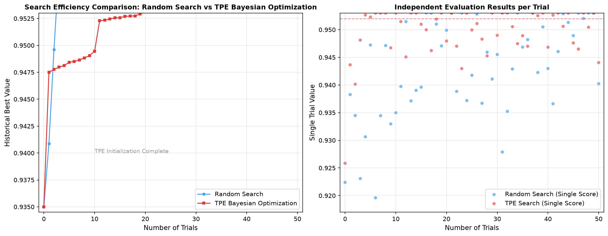
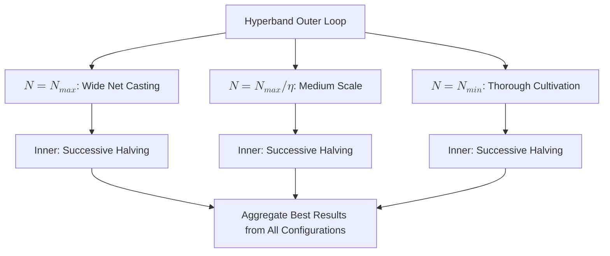

# Hyperparameter Optimization

The effectiveness of machine learning model training depends not only on the model architecture and training data but also heavily on a set of **hyperparameters** determined before training begins. If the learning rate is set too high, training fails to converge; if set too low, convergence is too slow. Regularization strength that is too weak leads to overfitting, while too strong leads to underfitting. The number of network layers, batch size, dropout rate, and so on — the combinatorial space of these parameters grows exponentially. **Hyperparameter Optimization** (HPO) systematizes this search process, finding better parameter combinations with fewer trials.

In 2012, James Bergstra and Yoshua Bengio from the University of Montreal published *[Random Search for Hyper-Parameter Optimization](https://www.jmlr.org/papers/v13/bergstra12a.html)* in the Journal of Machine Learning Research (JMLR), using theory and experiments to demonstrate that, given the same computational budget, random search typically outperforms the then-widely-used grid search. That same year, the paper *[Practical Bayesian Optimization of Machine Learning Algorithms](https://papers.neurips.cc/paper/4522-practical-bayesian-optimization-of-machine-learning-algorithms)* presented at NIPS brought Bayesian optimization to the machine learning field, showcasing its tremendous potential in hyperparameter search.

Over the following decade, automated hyperparameter optimization entered a period of rapid development. In 2017, Hyperband introduced ideas from the multi-armed bandit problem to hyperparameter search, dramatically improving search efficiency through adaptive resource allocation. In 2019, the Optuna framework brought a Define-by-Run API design to hyperparameter optimization, making the definition of dynamic search spaces unprecedentedly concise. These advances transformed hyperparameter search from a craft that required experienced engineers to tune by intuition into an engineering task that could be systematized and automated.

## Challenges in Model Tuning

Before diving into specific algorithms, let us first analyze why hyperparameter search is difficult and challenging. Tuning is a high-difficulty optimization problem wrapped in multiple unfavorable factors.

The first challenge is the search space itself. A ResNet-50 for image classification involves around 10 to 20 hyperparameters, such as learning rate, weight decay coefficient, dropout rate, batch size, optimizer choice, and the scaling factor for the number of channels in each layer. Each parameter has its own range of values, and their Cartesian product forms a vast high-dimensional space where blind search can almost never land on a good parameter combination by luck.

The second challenge is search cost. Unlike traditional optimization problems that can be computed in milliseconds, each trial in hyperparameter search means training an entire model from scratch. Training a ResNet-50 on ImageNet takes hours or even days, and for large-scale language model pretraining, the cost of a single evaluation can be tens of thousands of dollars. This forces us to complete the search within a limited number of trials (at most a few tens to a few hundred). On the other hand, tuning deals with a complete black box — there is no analytical expression relating hyperparameters to model performance, and we cannot find the optimal direction by taking gradients like we can with differentiable functions. All we know about this black box is that inputting a set of hyperparameters produces a validation set metric, making the optimization problem inherently harder than those with gradient information. The noise in the evaluation process further complicates matters. Even with exactly the same hyperparameters, different random seeds (affecting parameter initialization, data shuffling order, dropout masks, etc.) can produce different evaluation results.

Finally, how to define what is "good" is itself an uncertain question. In production, we rarely care about a single metric like model accuracy alone. Latency, parameter count, memory footprint, energy consumption — these are all objectives that need to be traded off, and they often conflict with each other. Larger models achieve higher accuracy but are slower for inference; aggressive quantization reduces model size but sacrifices accuracy. Finding a balance among multiple conflicting objectives is an unavoidable challenge in engineering deployment.

## Automated Hyperparameter Optimization

In the past, tuning mainly relied on engineers' experience and intuition. An experienced deep learning engineer, seeing the training loss curve oscillating violently, would judge that the learning rate might be too high; seeing the validation loss first decrease and then increase, they would recognize that the model was beginning to overfit and needed stronger regularization. This experience-based tuning approach has indeed solved many problems, but the industry has long joked about tuning as "practicing traditional Chinese medicine" (relying on accumulated experience) or "alchemy" (doing your best and leaving the rest to luck). Experience is scarce and cannot be quickly acquired by newcomers. Intuition can be wrong, and even seasoned practitioners can easily fall into local optima. All these issues indicate that human-dependent tuning is a technique rather than a science, and cannot be scaled or engineered.

### Designing the Search Space

The starting point for any automated hyperparameter optimization method is defining the search space. A well-designed search space can dramatically narrow the search range, while a carelessly defined space will cause the optimizer to waste valuable evaluation budget on irrelevant regions. From the perspective of parameter types, hyperparameters fall into three categories: continuous parameters, discrete parameters, and conditional parameters. Continuous parameters, such as learning rate (typically searched in log space with a range like `[1e-5, 1e-1]`), dropout rate (`[0.0, 0.5]`), and weight decay coefficient, take values within a continuous interval. Discrete parameters, such as batch size (`{16, 32, 64, 128}`), optimizer type (`{SGD, Adam, AdamW}`), and activation function choice, can only be selected from a finite set of values. Conditional parameters are those that exist only when another parameter takes a specific value. For instance, `beta1` and `beta2` parameters exist only when the Adam optimizer is chosen, while the `momentum` parameter exists only when SGD is selected. The presence of conditional parameters means the search space is not a simple rectangle but a conditional tree, adding extra complexity to search algorithm design.

Prior knowledge is crucial for search space design. A good practice is to narrow parameter ranges based on domain experience. For example, the search range for learning rate is typically set in log space between `[1e-5, 1e-1]` rather than blindly searching in linear space `[0, 1000]`, because in practice almost no model converges well with a learning rate greater than 1. Similarly, limiting the dropout rate to `[0, 0.5]` rather than `[0, 1)` prevents the search from wasting time in the inefficient region of "randomly dropping more than half of the neurons." This prior knowledge essentially encodes human experience as search constraints, allowing the algorithm to concentrate resources in regions that are more likely to yield good results.

Modern tuning frameworks (such as Optuna, Ray Tune, and Hyperopt) all provide unified interfaces for defining search spaces. Taking Optuna as an example, users declare each parameter's name, type, and range through APIs such as `trial.suggest_float()`, `trial.suggest_int()`, and `trial.suggest_categorical()`, while the framework handles connecting the search algorithm to the parameter space. This Define-by-Run API design makes expressing conditional parameters particularly natural — users simply declare parameters dynamically within if-else branches, and the framework automatically handles the conditional dependencies.

### Basic Search Strategies

Having understood the search space, the next question is determining the order in which to explore it. Different answers to this question lead to different search strategies. We start with the simplest strategies and gradually understand the motivation behind each evolution.

#### Grid Search

**Grid Search** is the oldest and most intuitive hyperparameter optimization method. It is essentially an exhaustive strategy: predefine a set of candidate values for each hyperparameter, then evaluate all possible combinations. Grid search is simple enough that any engineer can understand and implement it without knowledge of probability theory or optimization theory. It is naturally parallelizable — all combinations are independent of each other and can be distributed across multiple machines for evaluation simultaneously. It uniformly covers the entire search space on the predefined grid of candidate values, with no regions left unexplored. However, grid search's fatal flaw is its inability to cope with the vast hyperparameter search space, easily falling victim to the Curse of Dimensionality. Grid search is only a viable option when the number of hyperparameters is small (typically no more than 4) and each parameter's candidate values form a limited discrete set.

#### Random Search

**Random Search** is another straightforward hyperparameter optimization method. To address the problem of the enormous search space making exhaustive search infeasible, random search randomly samples a set of parameters from the search space in each trial, evaluates them, and repeats until the budget is exhausted. In 2012, Bergstra and Bengio theoretically proved that, given the same computational budget, random search outperforms grid search. The reason is that not all hyperparameters have equal importance — only a subset of hyperparameters significantly affects results, and random search explores those truly important parameter dimensions more efficiently. Suppose 10 hyperparameters each have 5 candidate values, but only 2 are truly important. Grid search, even after traversing all \(5^{10}\) combinations, would only try 5 different values for each important parameter. Random search, with just 100 trials, can try approximately 100 completely different values for each important parameter, naturally allocating more exploration resources to the important dimensions in a probabilistic manner. However, each random search sample is independent and does not consider previous trial results. It cannot learn from history that "combinations with a learning rate around 1e-3 seem to work better"; instead, it blindly samples as if it were the first time every time. This limitation is precisely what more advanced methods like Bayesian optimization aim to address.

#### Semi-Random Strategies

Both grid search and random search share a common assumption: each trial uses the same amount of resources (e.g., training to convergence for the full number of epochs). In practice, however, this assumption is inefficient. Imagine you have 100 candidate parameter sets, many of which perform poorly within the first few epochs of training. You do not need to wait for all 100 epochs to determine that such combinations are not worth pursuing — the first few epochs suffice. If we could save the computational resources allocated to clearly inferior combinations and concentrate them on promising ones, search efficiency could be greatly improved. This intuition is formalized as the **Successive Halving** (SH) search strategy. The name "Successive Halving" comes from the algorithm eliminating the worse half of the candidate parameters at each step. SH works like a multi-round elimination tournament:

1. Evaluate all N candidate parameter sets with a small amount of resources (e.g., 1 epoch).
2. Sort by validation set performance and eliminate the worse half.
3. Double the resource allocation for the remaining parameter sets (e.g., from 1 epoch to 2 epochs).
4. Repeat the elimination and resource doubling process until only one parameter set remains or resources are exhausted.

The core logic of SH is to transfer resources from doomed combinations to promising ones. Early elimination of inferior combinations means not wasting the full training budget on them, while the surviving combinations receive increasingly more resources for more accurate evaluation. SH itself introduces a hyperparameter that requires user selection: the initial number of parameter sets N. The choice of N faces the classic Exploration-Exploitation Trade-off. If N is set too large, each group initially receives very few resources (since the total budget is fixed), and good parameters may be mistakenly eliminated due to random noise over a small number of epochs. If N is set too small, search coverage is insufficient, and the region containing the optimal parameters may be entirely missed. This problem is not unique to SH, but it highlights the inherent tension in parameter search — a choice must be made between "breadth of exploration" and "depth of evaluation," and the optimal choice is not known a priori. This challenge gave rise to the next-generation Hyperband algorithm, which we will discuss in detail in the [Advanced Search Strategies](#advanced-search-strategies) section on how to balance exploration and exploitation.

## Bayesian Optimization

**Bayesian Optimization** (BO) was proposed to address the problem that random search does not remember or learn. Each random search sample is an independent random process. Bayesian optimization, on the other hand, leverages the results of completed historical trials to build a probabilistic model of the mapping between hyperparameters and model performance, and then uses this model to decide the next evaluation point.

### Basic Framework

The theoretical foundation of Bayesian optimization can be traced back to the work of Harold J. Kushner and Jonas Mockus in the 1960s-1970s. Its widespread application in machine learning began with the 2012 NIPS paper *[Practical Bayesian Optimization of Machine Learning Algorithms](https://papers.neurips.cc/paper/4522-practical-bayesian-optimization-of-machine-learning-algorithms)* by Jasper Snoek, Hugo Larochelle, and Ryan P. Adams. This paper demonstrated that Bayesian optimization can find near-optimal hyperparameters within a very small number of trials, opening up an important research direction in the HPO field.

Bayesian optimization models hyperparameter search as a sequential decision problem. At each step, the algorithm predicts, given all completed trial results so far, which hyperparameter combination should be selected next to best improve upon the currently known optimal result. To answer this question, Bayesian optimization designs two components: a **Surrogate Model** and an **Acquisition Function**. The surrogate model acts like a map of the algorithm's search objective function, inferring the mean performance and uncertainty at each location in the search space based on observed data points. The acquisition function acts as navigation, deciding where to explore next based on the map. The entire Bayesian optimization iterative process forms a closed loop:


*Figure: The iterative process of Bayesian optimization*

With each new evaluation completed, the data becomes richer, the surrogate model becomes more accurate, and the next decision becomes wiser. This "the more you search, the smarter it gets" characteristic is the fundamental difference between Bayesian optimization and the random search that preceded it.

### Surrogate Model

The task of the surrogate model is to approximate the black-box objective function \(f(x)\) that we cannot directly compute. Its input is a set of hyperparameters \(x\), and its output is the corresponding validation performance. It must be able to provide predicted values for unknown regions ("what score would this parameter combination roughly achieve") while also giving the uncertainty of that prediction ("how confident are we in this estimate"). The second capability is particularly critical because it directly determines whether the acquisition function can make reasonable decisions between exploration and exploitation.

The most classic surrogate model in Bayesian optimization is the Gaussian Process (GP). A Gaussian process can be understood as a probability distribution over functions. Rather than directly guessing a fixed functional form for \(f(x)\), it assigns a joint Gaussian distribution to any set of inputs \(x_1, x_2, ..., x_n\). Given observed data points \(D = \{(x_i, y_i)\}\), the Gaussian process infers function values and uncertainties at unobserved regions through a [kernel function](../../statistical-learning/support-vector-machines/kernel-methods.md#common-kernel-functions) (typically the Matérn kernel or the squared exponential kernel) that models the similarity between different input points.

The advantage of Gaussian processes is that they provide smooth function approximations in continuous space, which is consistent with the actual shape of most hyperparameter-performance curves (similar parameter combinations tend to produce similar performance). Furthermore, Gaussian processes naturally output prediction uncertainty — for regions far from observed data points, the prediction variance automatically increases. This property perfectly meets the needs of the acquisition function. However, Gaussian processes are computationally expensive, with a complexity of \(O(n^3)\), where \(n\) is the number of historical observations. This cubic complexity arises from the covariance matrix inversion involved in Gaussian process inference. When the number of observations exceeds a few hundred, the computational cost becomes prohibitive. Additionally, Gaussian processes in their standard form struggle with categorical variables (such as discrete choices of optimizer type) and high-dimensional spaces (performance typically degrades significantly beyond 20 dimensions).

To address these limitations, researchers have proposed various alternative surrogate models. The most influential among them is the Tree-structured Parzen Estimator (TPE), proposed by Bergstra et al. in their 2011 NIPS paper *[Algorithms for Hyper-Parameter Optimization](https://papers.nips.cc/paper/4443-algorithms-for-hyper-parameter-optimization)*, which later became the core algorithm of the Hyperopt framework. TPE adopts a completely different modeling strategy from Gaussian processes. It divides observed parameters into two groups based on performance: a "good" group (observations with validation loss below a threshold \(y^*\)) and a "bad" group (the remaining observations), then separately models the parameter distributions of these two groups using kernel density estimation: \(l(x) = p(x | y < y^*)\) and \(g(x) = p(x | y \ge y^*)\).

The starting point of TPE is to select the \(x\) that maximizes \(l(x)/g(x)\) as the next evaluation point, where \(l(x)\) is the probability density of the good group parameters and \(g(x)\) is the probability density of the bad group parameters. This ratio measures how much more likely a parameter \(x\) belongs to the good group than to the bad group. A high ratio means that in past trials, this parameter region has produced good parameters far more frequently than bad ones, and therefore intuitively holds the most promise for improvement. TPE has far lower computational complexity than Gaussian processes, naturally supports conditional parameter spaces (through tree-structured modeling), and performs exceptionally well in practical HPO tasks, making it the default sampler for frameworks such as Optuna.

Beyond TPE, surrogate models based on [Random Forests](../../statistical-learning/decision-tree-ensemble/random-forest.md) (SMAC) and neural networks (such as Bayesian Neural Networks and Deep Ensembles) have also demonstrated their respective advantages in different application scenarios. SMAC handles categorical parameters particularly naturally (random forests natively support discrete features), while neural network surrogate models excel in high-dimensional search spaces.

### Acquisition Function

With the predicted mean and uncertainty provided by the surrogate model, the next evaluation point can be selected based on this information. This decision is made by the Acquisition Function. The acquisition function is an auxiliary function \(a(x)\) defined over the search space, quantifying "the value of evaluating here" at each location. Each step of Bayesian optimization selects the parameter combination that maximizes \(a(x)\).

The design of the acquisition function faces a classic Exploration-Exploitation Trade-off. Exploitation means going to regions where the surrogate model predicts a high mean (where good results are most likely). Exploration means going to regions where the surrogate model predicts high uncertainty (where unexpected good discoveries might be hidden, but also where efforts might be in vain). A good acquisition function must strike a balance between the two. Three classic acquisition functions handle this trade-off in different ways:

- **Expected Improvement** (EI) is the most widely used acquisition function in practice. Its strategy is to explicitly select the point with the largest "expected improvement" among all candidate points.
- **Probability of Improvement** (PI) is a simplified version of EI that only cares about whether improvement occurs, not how much. The problem with PI is that it may overly favor safe choices that require minimal improvement to surpass the historical best, while neglecting opportunities that, though having a low probability of improvement, would yield substantial gains if realized. Therefore, PI is less commonly used than EI in practice.
- **Upper Confidence Bound** (UCB) handles the exploration-exploitation trade-off in a more sophisticated way. We previously encountered UCB in the context of [Monte Carlo Tree Search](../../language-models/reasoning/test-time-compute.md#tree-search). In the current context, its implication is that whether a region has a high predicted mean (likely good) or high uncertainty (potentially hiding a surprise), we should investigate it. The balance between the two is controlled by a decaying parameter \(\kappa\): a larger \(\kappa\) at the beginning encourages broad exploration, and as the search progresses, \(\kappa\) gradually decreases, allowing the algorithm to converge to the known good region.

### Engineering Challenges

Although Bayesian optimization is elegant in theory and performs well in experimental settings, a series of real-world issues can gradually dilute its theoretical advantages when deployed in practice. The most obvious issue is parallelization. Standard Bayesian optimization is inherently sequential — each step requires waiting for the previous evaluation to complete before updating the surrogate model and generating the next recommended parameters. But in an actual GPU cluster where multiple GPUs can train simultaneously, serial execution means severe underutilization of computing resources. To address this, researchers have proposed various parallelization strategies. Constant Liar is one of the simplest: before obtaining the true evaluation result, the algorithm assumes the evaluation of the unknown point equals some constant (such as the historical mean), thereby "tricking" the surrogate model into generating diverse recommended points. When K evaluation points need to be suggested simultaneously, the algorithm first generates the first suggested point through the normal process, assumes its evaluation result equals the historical mean, updates the surrogate model, then generates the second suggested point, and repeats K times to produce diverse recommendations. More sophisticated strategies directly optimize a batch version of the acquisition function, outputting K non-repeating candidate points at once.

Behind parallelization lies another dimension of efficiency. In the standard Bayesian optimization framework, each evaluation is at Full Fidelity — training from scratch to convergence using the full training budget. But as we discussed in Successive Halving, many parameter combinations reveal their clear inferiority early in training, making it a pure waste to spend the full budget on them. Introducing Multi-Fidelity ideas into Bayesian optimization means that the surrogate model needs to simultaneously model the relationship between parameters \(x\), fidelity level \(z\) (e.g., number of epochs), and performance \(f(x, z)\), while the acquisition function makes decisions over the joint space \((x, z)\), thus deciding both "what to evaluate" and "how much resource to invest" when recommending evaluation points. BOHB (Bayesian Optimization and Hyperband) is a representative method of this fusion.

Stepping beyond efficiency, the section on [Challenges in Model Tuning](#challenges-in-model-tuning) mentioned that defining what is "good" is uncertain, because model accuracy, inference latency, model size, memory footprint, and training energy consumption are all objectives that must be traded off and often conflict with each other. The task of multi-objective Bayesian optimization is to find the Pareto Front — the set of parameter combinations where no single objective can be improved without sacrificing another. There is no absolute superiority or inferiority among these parameters; engineers can select the configuration best suited to the current scenario based on business needs. Common approaches include aggregating multiple objectives into a scalar (e.g., weighted sum) or directly using Expected Hypervolume Improvement as the acquisition function.

## Code Practice: Bayesian Optimization vs Random Search

The preceding sections have theoretically discussed the pros and cons of various search strategies. Theory is important, but only by implementing it yourself can you truly understand what "leveraging historical information" really means. The code below constructs a complete HPO comparison experiment, comparing the search efficiency of random search and a simplified TPE Bayesian optimization under the same search space and trial budget.

The experiment uses Scikit-Learn's MLPClassifier as the target model, searching for optimal hyperparameter combinations (hidden layer size, initial learning rate, and regularization strength) on a synthetic binary classification dataset. Both search strategies have an equal budget of 50 trials. To intuitively demonstrate the "the more you search, the smarter it gets" characteristic of Bayesian optimization, the code plots the historical best values of both methods against the number of trials as a comparison chart.

```python runnable
import numpy as np
from sklearn.neural_network import MLPClassifier
from sklearn.datasets import make_classification
from sklearn.model_selection import cross_val_score
from scipy.stats import norm
import matplotlib.pyplot as plt
import warnings
from sklearn.exceptions import ConvergenceWarning
from dmla_progress import ProgressReporter

# Ignore ConvergenceWarning from MLPClassifier not converging within max_iter (demo focuses on search strategy comparison)
warnings.filterwarnings('ignore', category=ConvergenceWarning)

# Generate a binary classification dataset (1000 samples, 20 features, with noise)
X, y = make_classification(
    n_samples=1000, n_features=20, n_informative=10,
    n_redundant=5, random_state=42
)

def evaluate(params):
    """
    Evaluate the performance of a set of hyperparameters, returning the mean accuracy of 5-fold cross-validation.

    Search space:
    - hidden_size: number of hidden layer neurons, range [16, 256]
    - learning_rate: initial learning rate, log space [1e-4, 1e-1]
    - alpha: L2 regularization strength, log space [1e-5, 1e-1]
    """
    hidden_size = int(params['hidden_size'])
    learning_rate = params['learning_rate']
    alpha = params['alpha']

    model = MLPClassifier(
        hidden_layer_sizes=(hidden_size,),
        learning_rate_init=learning_rate,
        alpha=alpha,
        max_iter=500, random_state=42
    )
    scores = cross_val_score(model, X, y, cv=5, scoring='accuracy')
    return scores.mean()


# ========== Random Search ==========

def random_search(n_trials=50):
    """
    Random search: independently sample a set of parameters from the search space in each trial.
    This is the most basic HPO baseline method — it does not consider any historical information.
    """
    history = []
    best_score = 0.0
    best_params = None

    progress = ProgressReporter(total_steps=n_trials, description="Random Search Hyperparameters")

    for i in range(n_trials):
        # Uniformly sample in log space (since learning rate and regularization strength span multiple orders of magnitude)
        params = {
            'hidden_size': np.random.randint(16, 257),
            'learning_rate': 10 ** np.random.uniform(-4, -1),
            'alpha': 10 ** np.random.uniform(-5, -1),
        }
        score = evaluate(params)
        history.append(score)

        if score > best_score:
            best_score = score
            best_params = params

        progress.update(
            step=i + 1,
            message=f"Trial {i+1}/{n_trials}, accuracy: {score:.4f}, best: {best_score:.4f}"
        )

    progress.complete(
        message=f"Random search complete, best accuracy: {best_score:.4f}",
        extra_data={"best_score": float(best_score)}
    )

    return best_params, best_score, history


# ========== Simplified TPE Bayesian Optimization ==========

def tpe_bayesian_search(n_trials=50):
    """
    Simplified TPE Bayesian optimization.

    Core idea (corresponding to the TPE section in the article):
    1. Train two density estimates with evaluated parameters — good parameter group l(x) and bad parameter group g(x)
    2. The next evaluation point selects the parameter maximizing l(x)/g(x)
    3. Essentially uses historical information to guide the search direction, rather than blind sampling
    """
    # Store all evaluated parameters and scores
    observed_params = []
    observed_scores = []

    best_score = 0.0
    best_params = None
    history = []

    progress = ProgressReporter(total_steps=n_trials, description="TPE Bayesian Optimization Search")

    # Initial phase: randomly sample 10 points to establish initial observations
    init_trials = 10
    for i in range(init_trials):
        params = {
            'hidden_size': np.random.randint(16, 257),
            'learning_rate': 10 ** np.random.uniform(-4, -1),
            'alpha': 10 ** np.random.uniform(-5, -1),
        }
        score = evaluate(params)
        observed_params.append(params)
        observed_scores.append(score)
        history.append(score)

        if score > best_score:
            best_score = score
            best_params = params

        progress.update(
            step=i + 1,
            message=f"Initialization {i+1}/{init_trials}, accuracy: {score:.4f}"
        )

    # Bayesian optimization main loop
    for i in range(init_trials, n_trials):
        # Determine the threshold for "good/bad" split: top 25% quantile of historical scores
        threshold = np.percentile(observed_scores, 75)

        good_params = [observed_params[i] for i in range(len(observed_params))
                       if observed_scores[i] >= threshold]
        bad_params = [observed_params[i] for i in range(len(observed_params))
                      if observed_scores[i] < threshold]

        # Candidate sampling: randomly generate 1000 candidate parameters, score with l(x)/g(x), select the best
        n_candidates = 1000
        candidates = []
        for _ in range(n_candidates):
            cand = {
                'hidden_size': np.random.randint(16, 257),
                'learning_rate': 10 ** np.random.uniform(-4, -1),
                'alpha': 10 ** np.random.uniform(-5, -1),
            }
            # Compute approximate l(x)/g(x)
            # Simplified version of kernel density estimation: distance between candidate point and good/bad parameter groups
            l_score = tpe_kernel_score(cand, good_params)
            g_score = tpe_kernel_score(cand, bad_params)
            # l(x)/g(x) is better when larger (high probability of belonging to good group, low probability of belonging to bad group)
            ratio = l_score / (g_score + 1e-10)
            candidates.append((ratio, cand))

        # Select the candidate with the largest l(x)/g(x)
        candidates.sort(key=lambda x: x[0], reverse=True)
        best_candidate = candidates[0][1]

        score = evaluate(best_candidate)
        observed_params.append(best_candidate)
        observed_scores.append(score)
        history.append(score)

        if score > best_score:
            best_score = score
            best_params = best_candidate

        progress.update(
            step=i + 1,
            message=f"TPE search {i+1}/{n_trials}, accuracy: {score:.4f}, best: {best_score:.4f}"
        )

    progress.complete(
        message=f"TPE search complete, best accuracy: {best_score:.4f}",
        extra_data={"best_score": float(best_score)}
    )

    return best_params, best_score, history


def tpe_kernel_score(candidate, observed_group):
    """
    Simplified TPE density scoring function.

    Uses a Gaussian kernel independently for each parameter dimension, then sums them as an approximation
    of the group density. This corresponds to the simplified form of TPE kernel density estimation described in the article.
    """
    if len(observed_group) == 0:
        return 1e-10

    # Normalize parameters to [0, 1] for comparability across dimensions
    score = 0.0
    param_keys = ['hidden_size', 'learning_rate', 'alpha']

    for key in param_keys:
        cand_val = normalize(candidate[key], key)
        for obs in observed_group:
            obs_val = normalize(obs[key], key)
            # Gaussian kernel: exp(-0.5 * (x - μ)² / h²), bandwidth h=0.1
            score += np.exp(-0.5 * ((cand_val - obs_val) / 0.1) ** 2)

    return score


def normalize(value, key):
    """Normalize parameter value to [0, 1] range"""
    ranges = {
        'hidden_size': (16, 256),
        'learning_rate': (-4, -1),   # log10 space
        'alpha': (-5, -1),           # log10 space
    }
    lo, hi = ranges[key]
    if key != 'hidden_size':
        value = np.log10(value)
    return (value - lo) / (hi - lo)


# ========== Run Comparison Experiment ==========

print("Running random search (50 trials)...")
rs_params, rs_score, rs_history = random_search(n_trials=50)
print(f"Random search best accuracy: {rs_score:.4f}")
print(f"Random search best parameters: {rs_params}")

print("\nRunning TPE Bayesian search (50 trials)...")
tpe_params, tpe_score, tpe_history = tpe_bayesian_search(n_trials=50)
print(f"TPE search best accuracy: {tpe_score:.4f}")
print(f"TPE search best parameters: {tpe_params}")

# ========== Visualize Search Results ==========

fig, axes = plt.subplots(1, 2, figsize=(14, 5))

# Left: historical best accuracy over number of trials
ax1 = axes[0]
rs_cummax = np.maximum.accumulate(rs_history)
tpe_cummax = np.maximum.accumulate(tpe_history)

# The first 10 TPE trials use random initialization; TPE-guided search begins from the 11th trial
ax1.plot(range(1, 51), rs_cummax, 'o-', color='#3498db', markersize=3,
         linewidth=1.2, label='Random Search', alpha=0.8)
ax1.plot(range(1, 51), tpe_cummax, 'o-', color='#e74c3c', markersize=3,
         linewidth=1.2, label='TPE Bayesian Optimization', alpha=0.8)
ax1.axvline(x=10, color='gray', linestyle='--', alpha=0.5, linewidth=0.8)
ax1.text(10.5, ax1.get_ylim()[0] + 0.002, 'TPE Initialization Complete',
         fontsize=8, color='gray')
ax1.set_xlabel('Number of Trials')
ax1.set_ylabel('Historical Best Accuracy')
ax1.set_title('Search Efficiency Comparison: Random Search vs TPE Bayesian Optimization')
ax1.legend(loc='lower right')
ax1.grid(True, alpha=0.3)

# Right: scatter plot of individual trial scores
ax2 = axes[1]
ax2.scatter(range(1, 51), rs_history, c='#3498db', s=20, alpha=0.5,
            label='Random Search (trial score)')
ax2.scatter(range(1, 51), tpe_history, c='#e74c3c', s=20, alpha=0.5,
            label='TPE Search (trial score)')
ax2.axhline(y=rs_score, color='#3498db', linestyle='--', alpha=0.7,
            linewidth=0.8)
ax2.axhline(y=tpe_score, color='#e74c3c', linestyle='--', alpha=0.7,
            linewidth=0.8)
ax2.set_xlabel('Number of Trials')
ax2.set_ylabel('Trial Accuracy')
ax2.set_title('Individual Evaluation Results per Trial')
ax2.legend(loc='lower right')
ax2.grid(True, alpha=0.3)

plt.tight_layout()
plt.show()

print(f"\nFinal comparison:")
print(f"  Random search best accuracy:     {rs_score:.4f}")
print(f"  TPE search best accuracy:        {tpe_score:.4f}")
print(f"  Absolute improvement:            {tpe_score - rs_score:.4f}")
```

The cumulative best curve on the left shows that after the initialization phase (first 10 random samples), TPE search is significantly more efficient than random search — its historical best value rises faster, demonstrating that leveraging historical information does indeed guide the search direction. The scatter distribution on the right shows that TPE's later sampling points are more concentrated in high-score regions rather than uniformly scattered across the entire space — this is precisely the effect of the \(l(x)/g(x)\) ratio focusing sampling on promising parameter regions.



*Figure: Running results*

It is worth noting that since the experiment uses a simplified TPE implementation and a relatively small-scale dataset, the final gap between the two methods is not very large. In real large-scale tuning tasks (with more hyperparameters and higher evaluation costs), the advantage of Bayesian optimization would be significantly more pronounced.

## Advanced Search Strategies

Basic search strategies and Bayesian optimization provide the theoretical and practical foundations for hyperparameter search, but HPO research has not stopped there. The three advanced strategies introduced in this section further push the boundaries of automated tuning from the perspectives of resource efficiency, search robustness, and knowledge reuse.

### Multi-Fidelity Methods

In the discussion of Successive Halving, we left unresolved the problem of how to choose the initial number of parameter sets N. If N is too large, each group receives too few resources, and good parameters may be wrongly eliminated due to noise; if N is too small, search coverage is insufficient. The 2017 paper *[Hyperband: A Novel Bandit-Based Approach to Hyperparameter Optimization](https://www.jmlr.org/papers/v18/16-558.html)* proposed the Hyperband algorithm, elegantly solving the N selection problem with a dual-loop structure.

The idea behind Hyperband is that since we do not know the optimal N in advance, we traverse from a large N (emphasizing exploration breadth) to a smaller N (emphasizing evaluation depth) through a unified budget allocation scheme, trying different values of N. It designs two nested loops: the outer loop traverses different N values from large to small, with each N value corresponding to a complete Successive Halving inner loop. In configurations with a large N, there are many initial candidates but very few resources per group, which amounts to casting a wide net with minimal resources. In configurations with a small N, there are fewer initial candidates but ample resources per group, which amounts to cultivation with thorough resources. The workflow of the Hyperband algorithm is shown in the diagram below, where \(\eta\) is the elimination rate (typically \(\eta=3\)), \(N_{max}\) and \(N_{min}\) correspond to the maximum and minimum initial numbers of candidate parameters, and the algorithm ultimately returns the best-performing parameter combination among all configurations.


*Figure: Hyperband algorithm inner and outer loops*

Hyperband automatically balances the weights of exploration and exploitation without requiring the user to manually set N, while keeping computational complexity within a controllable range. The analytical framework of [Multi-Armed Bandit](https://en.wikipedia.org/wiki/Multi-armed_bandit) problems provides theoretical guarantees for Hyperband. Each candidate parameter set is treated as an "arm," and pulling the arm means allocating computing resources to evaluate it. The algorithm's goal is to find the best arm under the total budget constraint.

Building on Hyperband, researchers have proposed several important variants. **BOHB** (Bayesian Optimization and Hyperband) replaces Hyperband's random sampling with TPE-based Bayesian optimization sampling. In each round of Successive Halving within Hyperband, new candidate parameters are no longer randomly sampled but carefully selected by the Bayesian optimization acquisition function. This combination gives BOHB both the resource efficiency of Hyperband and the historical information utilization of Bayesian optimization, typically outperforming either pure Hyperband or pure Bayesian optimization in practice. **ASHA** (Asynchronous Successive Halving Algorithm) addresses the parallelization problem. Standard Successive Halving is synchronous — each round of elimination must wait for all evaluations in that round to complete. In a cluster with dozens of GPUs, this synchronous waiting leads to resource idling (fast evaluations must wait for slow ones to finish). ASHA allows immediate decisions on elimination and promotion as soon as each evaluation completes, eliminating the concept of rounds. This asynchronous design greatly improves cluster utilization and search throughput.

### Swarm Intelligence and Evolutionary Methods

Bayesian optimization relies on the smoothness assumption that similar hyperparameter combinations produce similar performance. This assumption is reasonable in most scenarios, but when the search space contains steep cliffs, conditional branches, or discontinuous regions, surrogate models based on Gaussian processes can mislead the search direction. Evolutionary Methods provide a complementary solution for such scenarios.

Genetic Algorithms model hyperparameter optimization as a biological evolution process. A set of hyperparameters is called an individual, parameter values are encoded as genes, and multiple individuals form a population. The search process simulates natural selection. In each generation, the best-performing individuals are selected as parents, and their genes are combined through Crossover operations to produce offspring. Crossover involves selecting two well-performing parent individuals from the population and combining their genes according to certain rules to generate new offspring. Offspring genes undergo random mutation with a certain probability to maintain population diversity and avoid premature convergence. The advantage of genetic algorithms is that they make no assumptions about the shape of the search space — they do not require smoothness, continuity, and can even handle completely discrete spaces. When the choice of one hyperparameter leads to completely different performance regimes (e.g., switching the optimizer from SGD to Adam may require a very different learning rate), evolutionary methods may be more robust than Bayesian optimization based on smoothness assumptions.

Evolution Strategy (ES) is a simplified variant of genetic algorithms, primarily used for continuous parameter spaces. It abandons the crossover operation and relies solely on mutation and selection. In each generation, multiple mutated offspring are generated from the current best individual, evaluated, and the best is retained for further mutation. The simplicity of ES makes it easy to implement and debug in practice, particularly suitable for scenarios where the search space dimensionality is not too high. The constraint of evolutionary generations and population size is the evaluation cost — each generation requires evaluating all individuals in the entire population. Assuming a population size between 20 and 100, running for 10 generations easily results in hundreds to thousands of total evaluations. For expensive deep learning training, this may exceed the computational budget. Therefore, evolutionary methods are best suited for models with relatively low evaluation costs (such as small networks, traditional machine learning models) or scenarios requiring handling of highly discontinuous search spaces.

### Meta-Learning and Transfer Learning

In all the methods discussed so far, each new tuning task starts from scratch. But in practice, we are often not training a model for the first time — we may have already done a great deal of tuning for similar models on similar datasets. The reason an experienced deep learning engineer can "guess" decent initial parameters is precisely that they have extracted patterns from past tuning experience. Meta-Learning attempts to endow algorithms with this cross-task learning ability. Its core idea is to let algorithms learn from experiences across multiple tasks how to adapt more quickly to new tasks.

In the meta-learning framework, historical tuning tasks form a meta-dataset. Each meta-data point records the characteristics of a complete tuning task (dataset size, feature dimensionality, model family, task type, etc.) and the final optimal hyperparameters found or the search trajectory. When a new tuning task arrives, the algorithm uses this meta-dataset to recommend initial hyperparameters, narrow the search space range, or even directly predict which parameter configurations are more likely to succeed.

Learning Curve Extrapolation is an early stopping method that leverages historical knowledge, and can be viewed as a lightweight variant within the meta-learning framework. The early performance trend of a parameter combination often indicates its ultimate performance. If a parameter combination's validation loss has been consistently decreasing at a stable rate over the first few epochs, it is likely to continue improving to a good level. Conversely, if a combination's loss oscillates violently or its decrease plateaus, continuing to train for the full number of epochs is of little value. By learning from historically completed full learning curves, an algorithm can build a prediction model that infers final performance from partial learning curves, thereby terminating poor trials early without complete training.

Transfer learning can also be incorporated into the perspective of hyperparameter optimization. If you have completed an exhaustive hyperparameter search for ResNet-50 on ImageNet, the results of that previous search constitute valuable knowledge when tuning ResNet-101 on a similar dataset. ResNet-50 and ResNet-101 share the same network design philosophy, differing only in the number of layers, so the optimal hyperparameters of the former often serve as a good starting point for the latter. Using the optimal parameters or parameter importance rankings found on the previous task as a prior for the new task — for example, in Bayesian optimization, using the posterior Gaussian process from a previous task as the prior Gaussian process for the new task — can significantly accelerate the search. This is known as Warm-Starting Bayesian optimization.

The large-scale application of meta-learning and transfer learning in HPO relies on public tuning benchmark datasets. Projects such as [OpenML](https://www.openml.org/) and [HPO-Bench](https://www.automl.org/hpo-overview/hpo-benchmarks/hpobench/) have recorded extensive tuning trial results across various models and datasets, providing training data for meta-learning algorithms. The accumulation of these benchmark datasets is shifting automated tuning from independent search per task toward a form of swarm intelligence with shared experience.

## Summary

The significance of automated hyperparameter optimization goes far beyond finding a better set of parameters. Its most direct effect is reducing the dependence on experienced tuning engineers. Cultivating an experienced deep learning engineer takes years, yet the number of models needed by enterprises far exceeds the supply of such experts. When Bayesian optimization or Hyperband takes over the search process, junior engineers and even non-technical personnel can obtain tuning results approaching expert level. This is essentially transforming scarce personal experience into transmissible algorithmic capability.

Of course, automated tuning has its boundaries. Algorithms cannot replace a deep understanding of the problem — a well-designed search space still requires domain knowledge. Algorithms also cannot define what is "good" — when multiple objectives such as accuracy, latency, and energy consumption conflict, the final choice remains with the engineer. The true value of automated tuning is not to replace human judgment, but to free human effort from repetitive trial and error, redirecting it toward areas that require more creativity. Letting machines do what machines are good at (large-scale exploration and pattern recognition) and letting humans do what humans are good at (posing questions and defining directions) — perhaps this is the deepest insight that automated tuning offers us.

## Exercises

1. Why does random search generally outperform grid search in most cases? Explain using the key insight of Bergstra and Bengio.
   <details>
   <summary>Reference Answer</summary>

   The core reason is that not all hyperparameters are equally important. In real scenarios, only a few hyperparameters typically have a decisive impact on performance. Grid search samples uniformly across the grid formed by all hyperparameters, wasting a large amount of computational resources on permutations of unimportant parameters. In contrast, random search independently samples each parameter each time, allowing important parameters to receive more different trial values within the limited number of trials. For example, with 10 hyperparameters each having 5 values, grid search requires \(5^{10}\) trials but only tries 5 different values for the important parameters, while random search can try 100 different values for the important parameters with only 100 trials.

   </details>
