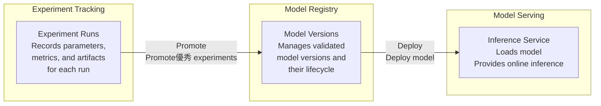
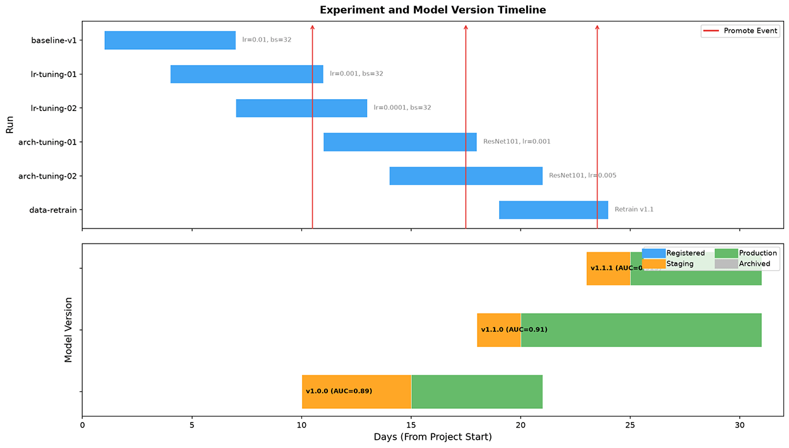
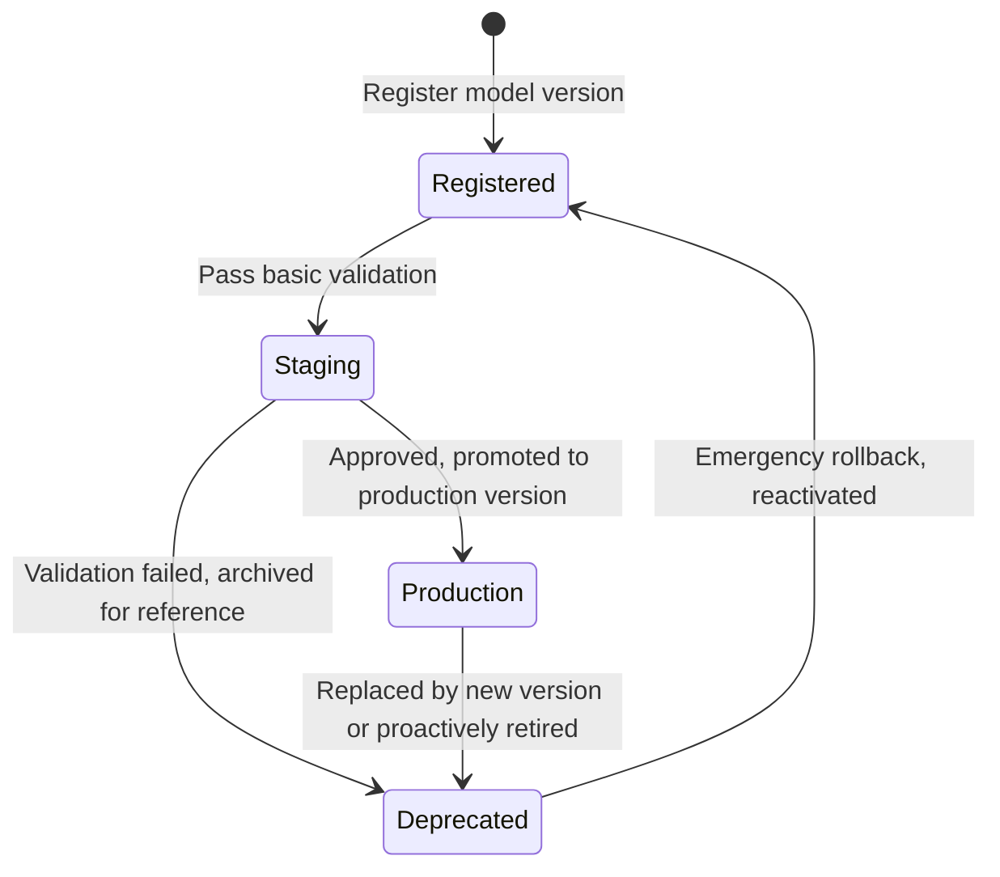
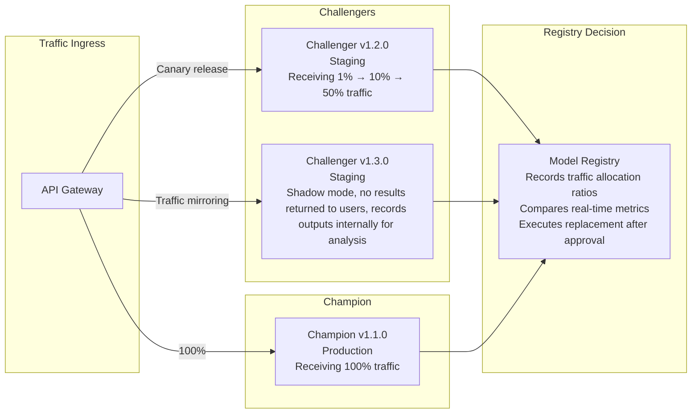

# Experiment Tracking and Model Registry

In 2015, Google's paper "[Hidden Technical Debt in Machine Learning Systems](https://papers.nips.cc/paper/5656-hidden-technical-debt-in-machine-learning-systems)" described that in a real-world machine learning system, model training code accounts for only 5% of the total codebase, while the remaining 95% consists of what they called "glue code" — data pipelines, feature extraction, model deployment, monitoring, and alerting infrastructure. This paper later became the foundational work of the MLOps practice area.

Three years later, in 2018, the Databricks team launched the MLflow project, which for the first time unified experiment tracking, model registry, and model deployment into a single open-source platform. That same year, Weights & Biases was founded, bringing the core functionality of experiment tracking to the cloud. These two events marked the transition of machine learning engineering from an internal practice at industry giants like Google into general-purpose tools accessible to ordinary teams. Today, experiment tracking and model management have become standard infrastructure for any serious machine learning team.

The question experiment tracking addresses is "how was the model trained?" Adjusting a hyperparameter, changing a feature combination, trying a new preprocessing scheme — all require experimental validation. After hundreds of experiments over several weeks, without systematic recording, you cannot even answer what parameters were used for that AUC 0.92 model from last week. The question model registry addresses is "is the model well-trained and ready for deployment?" Experiments are merely the means; the model is the deliverable. A model's complete lifecycle from the lab bench to the production environment goes through multiple stages: validation, approval, deployment, monitoring, and retirement. Without a model registry, model files are just `.pth` files scattered across directories — no one knows which version is running in production, and there is no way to trace back when problems arise.

Experiment tracking records the run information for each training session, making the process traceable, comparable, and reproducible. Model registry manages validated model versions, controlling lifecycle transitions from development to production. This chapter follows this chain, first discussing how to track experiments, then how to manage models, and finally the engineering衔接 between the two.

## From Experiment to Production

In a typical machine learning development workflow, a model goes from idea to production through three stages — experimentation, registration, and deployment — each supported by different systems.

- **Experimentation stage**: Researchers try dozens of parameter combinations, model architectures, and data processing schemes in notebooks or training scripts. Each run produces a set of metrics and a model weight file. The output of this stage is a large number of candidate models, most of which will be discarded due to subpar metrics. But without systematic recording, even if you find a good model with AUC 0.92, you may not be able to reproduce it because you cannot remember which version of data, which random seed, or which dependency versions were used.

- **Registration stage**: Out of hundreds or thousands of experimental runs, only the few that pass validation are promoted to the model registry. Here, the model receives a formal identity: a unique name, a semantic version number, and a complete metadata archive (training data version, code version, hyperparameters, evaluation metrics). The registry only admits models that have "graduated successfully"; failed experiments remain permanently in the experiment tracking system.

- **Deployment stage**: Registered models, after approval, are loaded into inference services to provide external access. Deployment is not the endpoint — a model may coexist with a new version through blue-green deployment, gradually receive traffic via canary release, or be rolled back to a previous version if performance degrades.

The data flow across these three stages forms a clear unidirectional pipeline:

*Figure: Unidirectional pipeline of the model lifecycle*

In this pipeline, experiment tracking and model registry each have their distinct roles. Experiment tracking focuses on the process, including failed attempts. Knowing what does not work is often as important as knowing what works. Failed experiments record valuable lessons such as "setting the learning rate to 0.1 causes non-convergence" or "this feature combination actually lowers AUC." Model registry focuses on results — it only manages model versions that have passed the validation threshold and are worthy of deployment, controlling version metadata, state transitions, and deployment approvals. Its core question is which model version can go live, and which version is currently running in production.

The link between the two is the Promote operation. When you discover a well-performing Run in the experiment tracking system, executing a Promote triggers a series of automated steps: extracting the Run's hyperparameters and metrics as model version metadata, migrating model weights from the experimental artifact storage to the registry's weight storage, creating a new version in the registry, and establishing bidirectional association links. This operation ensures that every registered model can be traced back to its complete training process. When a problem arises with a model in production, you can trace it all the way back to the original experiment Run and review the complete training logs and parameter configuration.

## Experiment Tracking

In teams without an experiment tracking system, experiment management is typically "notebook-driven." Researchers use Excel, Notion, or even paper notebooks to record the parameters and results of each experiment, with information scattered across different people's different tools. Model files are scattered across various directories on the experiment server with names like `model_v2_final_final.pth` and `model_v3_best_this_one.pth`, with version semantics entirely guessable from filenames. The parameter configuration of the ultimately selected model may only exist in the terminal output of that single run — once the terminal window closes, it is lost forever. For an engineering-minded experimental team, the minimum standard for a complete record of a single experiment is that, given this record, another team member should be able to precisely reproduce the experiment's results in the same environment. Meeting this standard requires covering the following dimensions of information:

- **Code version** is the starting point for traceability. The few lines of change shown by `git diff` in the terminal may be precisely the source of model performance differences.
- **Data version** was discussed in a [full chapter](data-versioning.md). Which versions of the training, validation, and test sets were used, how the data was split, and preprocessing parameters (normalization mean and variance, image cropping size) must all be precisely recorded.
- **Hyperparameters** (learning rate, batch size, number of epochs, optimizer type) are tunable variables that directly affect model performance — this is what most teams think to record first.
- **Model configuration** (network architecture, number of layers, hidden dimensions, activation functions) determines the model's structural capacity.
- **Training environment** (Python version, dependency versions, GPU model, CUDA version, distribution strategy) is often the biggest source of reproduction failures. The same PyTorch code may produce different numerical results on different CUDA versions due to subtle differences in floating-point operations.

In addition to the input-side parameters and configurations, output-side metrics and artifacts are also typically recorded. Metrics include time-series data for Loss and Accuracy during training (at step or epoch granularity), as well as aggregate metrics on the validation and test sets (best Loss, final F1-Score, etc.). Output artifacts include model weight files, training logs, and visualization charts. We will discuss the modeling of this data in detail later.

It is clear that a single experiment involves such a wealth of information that the experiment tracking system needs a clear metadata model to organize it. Mainstream experiment tracking systems typically adopt a three-layer metadata model: parameters and configuration layer, metrics layer, and artifacts and output layer.

- **Parameters and Configuration Layer**: Parameters and configurations have a natural hierarchical relationship. Global parameters (project name, experiment objective) sit at the top, followed by model parameters (architecture type, number of layers, hidden dimensions), then training parameters (learning rate, batch size, optimizer), and at the bottom, data parameters (dataset version, preprocessing configuration). This hierarchy supports parameter inheritance and overrides — for example, a set of experiments sharing the same data configuration and model architecture, differing only in learning rate and batch size. Instead of repeating all parameters each time, you only declare the delta from the baseline configuration, and the system automatically merges the complete parameter snapshot.

- **Metrics Layer**: Process metrics are recorded at step or epoch granularity, each offering different trade-offs between precision and storage cost. Step-level metrics are recorded every N steps (e.g., recording the current batch Loss every 100 steps), providing the finest-grained view of training dynamics at the cost of high storage. Suppose a training task has 10,000 steps and records three floating-point values — Loss, Accuracy, and Learning Rate — per step. Running 100 experiments would produce 3 million time-series data points. Epoch-level metrics record validation set metrics at the end of each epoch, which is the most commonly used granularity for experiment comparison, with moderate storage requirements. In addition, aggregate metrics and custom metrics serve as supplements — aggregate metrics retain only the final best or final value, suitable for quick retrieval and sorting, but lose the dynamic information of the training process. Business-specific custom metrics reflect the business impact and meaning of parameters, such as Click-Through Rate (CTR) for recommendation systems, Normalized Discounted Cumulative Gain (NDCG) for search systems, and BLEU scores for dialogue systems. The computation logic for these metrics is often more complex than standard metrics.

- **Artifacts and Output Layer**: The storage strategy for artifacts is determined by file size. Model weight files, often hundreds of MB to several GB, are best stored in object storage, with only the storage path and checksum hash retained in the experiment record. Training logs, exception stack traces, and warning messages are typically small in size and can be stored directly in a database for easy searching. Visual artifacts such as training curves, confusion matrices, and feature importance charts can be stored in object storage or a dedicated chart service. All artifacts are linked by experiment ID, ensuring that from the experiment record page you can navigate to all related files with a single click.

The facilities across these three layers should operate automatically, not be driven by humans. From an engineering perspective, the reliability of an experiment tracking system is directly determined by its degree of automation. Taking metric collection as an example, the training script should call the tracking SDK, such as using `log_params()` to record hyperparameters and `log_metrics()` to record metrics. Training frameworks themselves also provide general-purpose auto-logging mechanisms, such as PyTorch Lightning's `on_train_epoch_end` callback or Keras's `Callback` base class, which automatically write Loss and validation metrics to the tracking system at the end of each epoch.

## Model Registry

Models that successfully emerge from the experimentation stage are promoted to the model registry, where each model version gains a unique identity, a complete history, and a clear lifecycle state. Every registered model receives a unique name and version number. Names typically follow a hierarchical convention `<domain>/<task>/<architecture>`, such as `recommendation/click-prediction/dcn-v2`. This naming convention expresses both business ownership (click prediction under the recommendation system) and technical information (DCN-v2 architecture), allowing team members to search for models by domain and task in the model catalog.

Similar to software semantic versioning, model version numbers typically follow a three-part semantic format `Major.Minor.Patch`, but the specific meaning needs to be adapted to the scenario. `Major` versions generally correspond to architecture-level changes, such as switching from ResNet-50 to ResNet-101, which may imply incompatible inference interfaces. `Minor` versions generally correspond to hyperparameter adjustments, training strategy optimizations, or feature changes — the model architecture remains the same, but performance may differ significantly. `Patch` versions generally correspond to data retraining under the same configuration — possibly retraining with fresh data using the exact same parameters and code; the model structure is unchanged, but the weight values differ, and performance metrics may change due to the new data distribution. Each version must be associated with one or more experiment Runs, preserving a complete record of the training process.

Version creation can be triggered in several ways. The most straightforward is manual promotion — a researcher sees a Run with passing metrics in the experiment tracking system and actively promotes it to a registered version. A more engineering-oriented approach is metric-based auto-triggering: the training script automatically compares against preset metric thresholds on the validation set at the end of training; if the new model outperforms the registered champion version, a new version is created automatically. There are also periodic retraining scenarios — for example, training a model from the latest data every Monday at midnight and registering it automatically, ensuring the model continuously learns from new data. New versions inherit the metadata template (feature list, inference interface definition) from the previous version by default, and users only need to override the changed parts, reducing repetitive configuration work. Arranging experiment Runs and model versions along a unified timeline provides a clear view of the mapping from experiment to registry. In the diagram below, the upper part shows the lifecycle of experiment Runs and the target versions for promotion, while the lower part shows the state transition stages of model versions. The two timelines are aligned, making it easy to see the timing of each promotion.

*Figure: Experiment and model version timeline*

In practice, tags are also used to assign more specific semantic roles to versions. For example, the `baseline` tag identifies the initial baseline model, against which all subsequent improvements are measured. The `champion` tag identifies the version currently serving in production — the only version receiving full production traffic. The `challenger` tag identifies candidate replacement versions undergoing evaluation in the staging environment. The `deprecated` tag identifies versions that have been retired but whose records are preserved. In addition to tags, free-text version descriptions can document the motivation for changes and expected effects, such as "increasing embedding dimension from 64 to 128, expected AUC improvement of 1%." With naming, versioning, and tags in place, search and discovery naturally have a data foundation — finding all recommendation-related models by task, sorting by validation AUC in descending order to find the historical best, filtering by status to find versions awaiting approval in staging, or browsing models registered in the last month.

## Model Lifecycle

From registration to retirement, a model must go through strictly defined state transitions, each with clear triggering conditions and permission constraints requiring different levels of authorization. Transitioning from Registered to Staging can typically be performed directly by developers, as this merely sends the model to the testing environment and does not involve production traffic. Transitioning from Staging to Production requires approval from the team lead or platform administrator. Transitioning from Production to Deprecated also requires approval, as retiring a production model may impact online services.

*Figure: Model lifecycle state machine*

The Champion-Challenger pattern is the typical automated operations model for promotion from Staging to Production. The Champion is the sole production version, handling all production traffic. Challengers are one or more candidate versions simultaneously undergoing evaluation in the staging environment. Evaluation is not a one-time offline comparison but is conducted through traffic mirroring or gradual traffic shifting in near-real environments. These evaluations form the factual basis for administrator approval decisions and typically include:

- **Functional validation** ensures the model can be loaded and infer correctly, e.g., the output format strictly conforms to the model signature definition.
- **Performance validation** checks whether offline metrics meet preset thresholds, e.g., whether validation AUC improvement exceeds 0.5%, or whether online P99 latency is below 50ms.
- **Fairness validation** checks whether model performance differences across subgroups (by gender, age, region) are within acceptable ranges.
- **Safety validation** ensures the model has basic robustness against adversarial examples and that outputs do not leak sensitive information.
- **Compatibility validation** ensures the new version's feature dependencies and inference interface are compatible with existing services, requiring no additional upstream changes.
- ...

A Challenger starts with 1% of traffic, and after confirming no metric degradation, gradually ramps up to 10%, 50%, and eventually fully replaces the Champion. During this gradual process, if the Challenger shows increased latency or metric decline at any traffic stage, traffic can be immediately rolled back, limiting the impact to the minimum. After the new Champion goes live, the old Champion is not immediately archived but is retained for a period (e.g., 7 to 30 days) as a safety net for rollback. If problems with the new model surface only in production, traffic can be instantly switched back to the old version. The timeline view below shows the complete decision process from traffic allocation and metric comparison to final replacement.

*Figure: Traffic allocation architecture of the Champion-Challenger pattern*

Model deployment strategies directly inherit practices from traditional software engineering — blue-green deployment, canary release, and shadow deployment remain effective risk control measures. In blue-green deployment, both the old and new versions are online simultaneously; the registry maintains two versions (one marked as Active/Blue and one as Standby/Green), with traffic switched at the gateway level for instant rollback. In canary release, the registry records traffic allocation ratios, the deployment system routes requests to different versions according to the ratio, and the monitoring system observes metric differences in real time. In shadow deployment, the new version receives a full mirror of production traffic but does not return results to users; it is marked as Shadow in the registry and used solely for comparing the new model's behavior under real traffic. Regardless of the strategy, the registry maintains a complete list of historical Production versions, supporting one-click rollback of any version to production.

Finally, every model eventually reaches the end of its life and is retired — this is a normal part of the lifecycle. Retirement may occur because model performance continues to decline due to data distribution drift and retraining cannot recover it, because business requirements change and the model's predictions are no longer needed, because regulatory or compliance requirements force a model offline, or because a technology stack migration renders the model's format unsupported by the current inference engine. Archived models should be hidden from routine queries and search results, but complete metadata and approval records should be permanently retained for auditing and issue tracing. Model weights after retirement should also be kept for a retention window, then moved to cold storage afterward to reduce costs.

## Chapter Summary

Experiment tracking and model management are the two pillars of MLOps infrastructure. Experiment tracking makes the training process transparent — the parameters, metrics, environment, and artifacts of every run are recorded in a structured way, enabling comparison, search, and group analysis across experiments, and allowing any historical result to be reproduced. Model registry standardizes artifact management — each model version has a unique identity and a complete lifecycle state machine, from registration to Staging to Production to archiving, with clear triggering conditions and access control at every step. The two systems are linked through the Promote operation, forming a complete asset pipeline from the lab bench to the production environment, ensuring that any model in production can be traced back to its training process.

## Exercises

1. In an experiment tracking system, why must experiment records be immutable? What problems would arise if recorded hyperparameter values could be modified after the fact?

   

   
Reference Answer

   Immutability is the cornerstone of experiment tracking system reliability. If recorded hyperparameter values could be modified, three serious problems would arise: First, experiment comparison becomes meaningless. You might be "comparing" the parameters of two Runs, but one of them was modified after the fact, making the comparison untrustworthy. Second, reproducibility is destroyed. You cannot determine whether the recorded parameter values are the ones actually used during training or values modified later, making precise reproduction impossible. Third, collaborative trust collapses. Team members cannot trust each other's experiment records, because anyone could modify parameters after the fact to "make the results look better."

   In practice, experiment tracking systems typically allow appending comments and tags (subjective additions) but do not allow modifying already-recorded parameter and metric values (objective facts). If a wrong parameter value needs to be "corrected," the right approach is to create a new Run and note the reason for correction, rather than modifying the old Run.
   

2. Suppose you have a recommendation model that automatically retrains every hour and registers a new version. Design a Champion-Challenger process for this scenario. What conditions must the new version satisfy to automatically replace the production model? How can service continuity be ensured during the replacement?

   

   
Reference Answer

   The automated Champion replacement process can be designed as follows. First, after registration, the new version enters the Staging state and automatically triggers offline evaluation with two validation rules: first, compare the new version's AUC against the current Champion on the most recent 24-hour validation set, requiring the new version to not be lower than the Champion (preventing degradation); second, confirm that no anomalies such as Loss NaN or gradient explosion occurred during training. Upon passing validation, the deployment system uses a canary release strategy: the new version first receives 5% of traffic, with P99 latency and error rate observed for 10 minutes. If no anomalies occur, traffic is expanded to 50%, observed for another 10 minutes, and finally expanded to 100% to complete the replacement. If metric degradation occurs at any stage, traffic is automatically rolled back to the old Champion.

   The key to maintaining uninterrupted online service is blue-green deployment: both the old and new versions are online simultaneously, with two Production-state versions coexisting in the registry (the old version as the current production version and the new version as the pending replacement). Traffic switching is performed at the gateway level without requiring service restarts. The old Champion is retained for 24 hours after replacement as a safety net for emergency rollback, and is automatically archived after 24 hours. For approval, in high-frequency automated replacement scenarios, an auto-approval strategy is recommended: as long as all validation items pass without degradation, the system automatically completes promotion, and the approval record is automatically generated (`approved_by: "auto-pipeline"`), eliminating the latency of manual approval.
   

