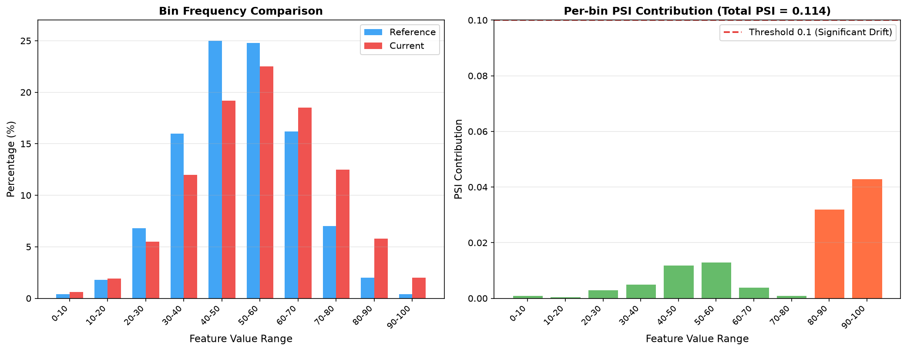
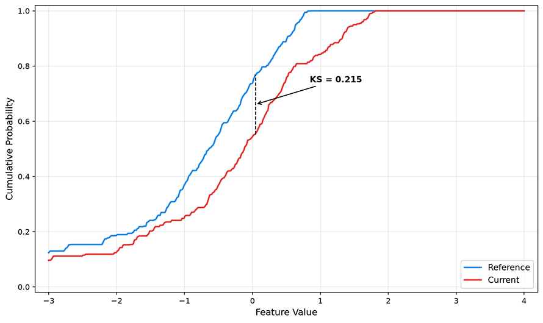
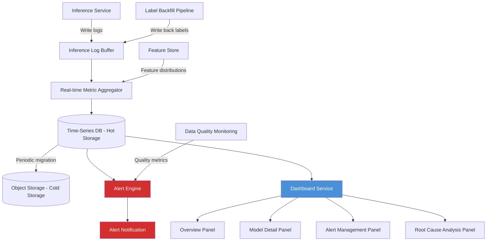

# Model Performance Monitoring

In 2015, Google researcher D. Sculley published a paper at NIPS titled "[Hidden Technical Debt in Machine Learning Systems](https://papers.nips.cc/paper/5656-hidden-technical-debt-in-machine-learning-systems)." This paper proposed no new algorithms and did not break any benchmark records, yet it struck a lasting and widespread chord in the industry. Sculley observed that machine learning systems carry a type of technical debt that traditional software engineering never faced. The correctness of a traditional system depends on code logic — as long as the code does not change, the behavior does not change. The correctness of a machine learning system, however, depends on both code and data. Data drifts over time, and the model's behavior changes accordingly. In other words, once a model is deployed to production, its performance may continuously degrade even if not a single line of code is changed.

This insight gave rise to an independent subfield within MLOps — model performance monitoring. Its goal is not to verify how good the model was at training time, but to continuously track how good it still is. A recommendation model with an AUC of 0.95 at deployment may have quietly degraded to 0.85 three months later, not because of code defects, but because user behavior changed, the upstream data pipeline changed its format, or the data sampled during training no longer represents the current real-world distribution. What model performance monitoring aims to do is issue warnings before these degradations turn into business incidents.

## Training vs. Production Performance Discrepancy

There is a systematic gap between training performance and production performance. This gap is not an engineering flaw but is inherent to the nature of machine learning systems. During training, a model learns on a fixed dataset, where the validation and test sets are all partitioned from the same batch of historical data. They share the same collection conditions, the same feature engineering pipeline, and the same time window. The model scoring high in this closed environment only proves that it has learned the patterns in the historical data — it does not guarantee that these patterns still hold in the future. Production data is generated in real time and changes continuously. The time-lag effect of data means that training data is always a snapshot of the past, while production data is the stream of the present. A recommendation model trained on user behavior data from six months ago, faced with current user preference changes, is like navigating a city with last year's map: the main roads are still there, but the shops, traffic conditions, and popular spots may have completely changed.

Feature computation consistency and the feedback loop effect further widen the gap between training and production performance. Training pipelines and inference pipelines are often two separate code implementations. Batch feature engineering is done with Spark during training, while features are computed in real time by online services during inference. Any subtle difference between the two — such as floating-point precision trade-offs, default missing value filling strategies, or unsynchronized category encoding mapping tables — can cause the model to see different inputs, and these problems are completely invisible during offline evaluation. The feedback loop effect refers to the phenomenon where the model's predictions after deployment influence user behavior, which in turn becomes the data for the next round of training. A recommendation system recommends a product to a user, and the user clicks on it out of curiosity. This click is recorded as a positive sample and used for subsequent training, causing the model to learn that the product is popular and continue to promote it heavily. Once this cycle forms, the model's prediction distribution gradually deviates from the true demand distribution, and performance degradation is amplified in a self-reinforcing feedback loop.

### Label Delay Problem

Performance evaluation of classification and regression models depends on ground-truth labels. To know the model's [AUC](../../deep-learning/neural-network-structure/activation-loss-functions.md#classification-loss) or [MAE](../../deep-learning/neural-network-structure/activation-loss-functions.md#regression-loss), you need to compare predictions against actual outcomes. However, in production, ground-truth labels often do not arrive immediately after inference is complete — they have their own temporal rhythm. Take a credit scoring model as an example. A bank approves a loan in January, and the model gives a default probability of 8%. The loan's repayment deadline is December, meaning it takes a full twelve months to obtain the ground-truth label of "did the borrower default." During those twelve months, the model has processed thousands of new loan applications. If the model's performance degrades during this period, and the problem is only discovered when labels arrive, the loans issued based on erroneous scores have already turned into real bad-debt losses. Similar delays are common across various scenarios. In recommendation systems, a user's click on recommended content may occur hours or even days later. In advertising systems, conversions can span weeks. In medical diagnosis, confirmed results may take months or longer. Performance evaluation has an inherent time lag, but the window within which performance degradation can be tolerated is limited. Waiting until labels arrive to act may mean the system has been operating in a degraded state for a long time.

There are typically three strategies for dealing with label delays. The first is to use proxy metrics in place of ground-truth labels — for example, inferring whether the model has degraded indirectly from changes in prediction confidence or predicted class distribution. These metrics can be computed in real time without requiring true labels. The second is to use partial labels for fast evaluation. When a small portion of labels arrives early (such as early signs of default on credit card repayments), they can serve as an approximation of the ground-truth labels. The third is to estimate the label distribution using statistical methods — the input distribution tests used in [drift detection](drift-detection.md) also follow this line of thinking.

### Monitoring Granularity and Cost

In summary, the performance gap between model training and production stems from changes in the input feature distribution caused by the temporal effect of data flows, changes in model output behavior caused by feature computation consistency and feedback loops, and the fact that label delays make it difficult to detect performance degradation in a timely manner. These are the signals that need continuous monitoring after a model goes live. The bottom layer is the input feature distribution, which can be detected in real time without labels and serves as the earliest warning sentinel. The middle layer is the model's output behavior (confidence distribution, class proportions, prediction entropy), which also requires no labels and is available near-real-time, bringing us closer to the model's actual decision state than the input layer. The top layer is the model's prediction quality (accuracy, AUC, MAE, etc.), which requires ground-truth labels to be computed, is subject to label delay, but directly answers the fundamental question of how good the model still is. These three layers progress from front to back, gradually approaching the true performance status of the model, while also progressively increasing their dependence on ground-truth labels. The design of a monitoring system is a trade-off among cost, timeliness, and accuracy across these three layers.

Having clarified what needs to be monitored, the next question is how to monitor and at what granularity. Global monitoring computes aggregate metrics across all prediction requests — for example, the average AUC or average prediction confidence across all requests. This approach is low-cost and simple to compute, but its drawback is that normal overall metrics can mask severe local degradation. A recommendation model's global AUC may remain at 0.90, while the AUC for a specific region (such as a newly entered market) may have already dropped to 0.65. If you only look at the global dashboard, this issue would not trigger any alert until the region's business data shows a clear decline. Shard monitoring, which splits metrics by dimensions such as user group, region, device type, time period, etc., and computes metrics independently for each shard, can mitigate this problem. It can detect local degradation, but at the cost of reduced sample size per shard and increased metric volatility. The daily AUC of a small regional shard with only a few hundred requests per day may naturally fluctuate by as much as ${\pm}0.1$. Distinguishing true degradation signals from random noise in such scenarios requires more sophisticated statistical methods, which we will discuss in [Shard Degradation Detection](#shard-degradation-detection).

## Data Drift and Concept Drift

As mentioned earlier, one of the fundamental causes of model performance degradation is changes in data distribution. However, the term "change" actually encompasses two essentially different types of drift, with entirely distinct detection methods and response strategies. Distinguishing between them is a practical necessity for solving problems, not mere academic pedantry.

**Data Drift**, also known as **Covariate Shift**, refers to a change in the distribution of input features. $P(X)$ changes, but the conditional probability $P(Y|X)$ of the output given the input remains unchanged. For example, in an e-commerce recommendation model, users used to search mainly for electronics, but now they are searching heavily for home goods. The distribution of input vocabulary has indeed changed, but the relationship "if a user searches for phone cases, they most likely want to buy phone cases" has not changed. **Concept Drift** is entirely different: it means $P(X)$ has not changed, but $P(Y|X)$ itself has changed — the same input now corresponds to a different correct answer. Consider a spam filter: ten years ago, emails containing words like "Bitcoin" or "digital asset investment" might have been serious digital finance discussions; today, they are almost entirely advertisements or scams. The input words themselves have not changed (still "Bitcoin," "investment," etc.), but the criterion for whether these words indicate spam has changed.

The practical significance of this distinction is that data drift can be detected without ground-truth labels, since it only requires comparing the distribution of input features across different time windows. Concept drift typically requires ground-truth labels to confirm, because you need to verify whether the output label for the same input has changed. This explains why, in drift detection, monitoring input drift (comparing feature distributions through statistical tests) can be done near-real-time, while concept drift detection is often constrained by the label delay problem.

For a deeper discussion of drift, including mathematical definitions of various drift types, commonly used statistical testing methods, and the response流程 after drift occurs, we will cover them in the next chapter, [Drift Detection](drift-detection.md). What concerns us here is the transmission relationship between drift and performance monitoring: data drift does not necessarily lead to performance degradation (some distribution changes do not affect the decision boundary), and performance degradation does not necessarily come from data drift (it could be a feature pipeline failure or a label definition change), but drift is the most common early warning signal for performance degradation. Understanding this relationship makes it clear why drift detection and performance monitoring are complementary rather than substitutive.

## Performance Degradation Detection

Having clarified the harm of performance degradation after a model goes into production and the reasons behind it, we now need to identify and locate problems, distinguishing true degradation signals from normal random fluctuations in model metrics. This requires a systematic set of detection methods that filter out noise layer by layer, from statistical tests to pattern recognition. Model performance degradation detection methods mainly fall into three categories: statistical testing, gradual degradation detection, and shard degradation detection.

### Statistical Testing Methods

The fluctuations of model performance metrics along the time axis are driven by two forces: random noise from sampling and real changes in data distribution. The task of statistical testing is to quantify how likely the observed fluctuations are to be caused by random noise alone. Commonly used quantitative metrics include the PSI index and the KS statistic:

- **Population Stability Index (PSI)** is the most widely used drift quantification metric in the industry. It measures the degree of difference between two distributions. Given a reference distribution $P$ (typically a baseline computed on training data) and a current distribution $Q$ (a distribution computed in real time from production data), PSI is calculated as follows:

    $$PSI = \sum_{i=1}^{n} (P_i - Q_i) \cdot \ln\frac{P_i}{Q_i}$$

    where $n$ is the number of bins the numerical range is divided into (typically 10), $P_i$ is the proportion of the reference distribution falling into the $i$-th bin, and $Q_i$ is the proportion of the current distribution falling into the same bin. $(P_i - Q_i)$ and $\ln(P_i/Q_i)$ measure absolute and relative differences, respectively. When $P_i$ and $Q_i$ are exactly the same, this term is 0. The larger the difference between $P_i$ and $Q_i$, the greater the contribution of this term to the overall PSI. The final PSI is the sum of the contributions from all bins. PSI is most commonly used to measure the stability of prediction score distributions, but its concept can be extended to any continuous feature.

    Common empirical thresholds for PSI are: PSI < 0.1 indicates the distribution is essentially stable, 0.1 ≤ PSI < 0.25 indicates moderate drift, and PSI ≥ 0.25 indicates significant drift. It is important to note that these thresholds are empirical — different business scenarios and feature types should calibrate their own thresholds based on historical data. The figure below shows a visualization example of the PSI calculation process. The left chart compares the proportions of the reference and current distributions across bins, and the right chart shows the contribution of each bin to the final PSI value. The red dashed line marks the threshold of 0.1 (slight drift).

    

    *Figure: PSI calculation process*

- **KS Test** (Kolmogorov-Smirnov Test) measures distribution differences from another angle. It calculates the maximum vertical distance between two [cumulative distribution functions](../../maths/probability/probability-basics.md#cumulative-distribution-function) (CDFs). By plotting them on the same graph and finding the point with the greatest vertical distance, that maximum distance is the KS statistic:

    $$D_{\text{KS}} = \sup_{x} \left| F_{ref}(x) - F_{cur}(x) \right|$$

    The larger the KS statistic, the less likely the two distributions come from the same population. Compared to PSI, the KS test can be used directly within a hypothesis testing framework, answering questions such as whether the current distribution is significantly different from the baseline distribution at a significance level of $\alpha = 0.01$. This allows alert decisions to be based on statistical confidence rather than merely on fixed thresholds. The KS test is suitable for continuous features, does not require the data to follow any particular distribution, and is sensitive to shape changes, location shifts, and scale changes in the distribution. The figure below shows a comparison of two empirical distribution functions in a KS test. The blue curve is the CDF of the reference distribution, the orange curve is the CDF of the current distribution, and the black dashed line marks the position of their greatest difference — the KS statistic.

    

    *Figure: KS test visualization*

In practice, statistical tests are not used in isolation. Combining multiple testing methods — one layer for filtering distribution differences (PSI), one layer for significance judgment (KS test), and one layer for trend persistence (significant for N consecutive windows) — can effectively reduce the false positive rate. We will introduce these [statistical detection methods](drift-detection.md#statistical-detection-methods) in more detail when discussing drift monitoring.

### Gradual Degradation Detection

Gradual degradation detection is used to monitor the model's long-term stealthy degradation. As the data distribution drifts slowly, the model's performance declines by 0.05% per day — completely imperceptible on a day-over-day basis, but accumulating to 1.5% over a month and 4.5% over a quarter. By the time the cumulative change crosses the alert threshold, the model may have been degrading for months, making root cause tracing and remediation much more difficult.

Trend detection performs linear regression analysis on the time series of performance metrics, testing whether the regression slope is significantly negative. Specifically, take the daily metric values from the last $N$ days, fit a linear trend line $y = \beta_0 + \beta_1 t$, and if $\beta_1$ is less than zero and the p-value of the test is below the significance level, a statistically significant degradation trend is considered to exist. This method transforms the question of "how much has it dropped" into "whether the downward trend is credible." The figure below shows the AUC trend of a model over 90 days: the solid blue line represents the daily AUC values, the orange dashed line is the 7-day moving average, and the red horizontal line is the dynamic alert threshold (3 standard deviations from the historical mean). Although day-to-day fluctuations are large, the moving average clearly reveals a persistent downward trend starting from day 45.


*Figure: 90-day AUC trend of a model*

Another supplementary method for gradual degradation detection is moving window comparison. It compares the mean of a current short window (e.g., the last 3 days) with the mean of a longer historical window (e.g., the past 30 days) using difference calculation and a t-test (which determines whether there is a significant difference between the means of two groups of data), detecting whether a slow but cumulative shift has occurred. The difference from mutation detection is that moving window comparison uses a longer historical baseline (30 days instead of 7 days), making it more sensitive to the direction of slow trends.

### Shard Degradation Detection

When discussing the causes of performance degradation earlier, we noted that a blind spot of global metrics is shard degradation. For example, the overall AUC of a model may remain stable at 0.90, but the performance of a specific shard may have been consistently deteriorating. This is especially common in large-scale systems with diverse user populations. A recommendation strategy designed for younger users may perform well on new users, but its recommendation quality for the existing user base may be declining, because the behavior patterns of existing users deviate more from the training data.

Shard degradation detection splits performance metrics by dimension and monitors each independently. Key shard dimensions include user groups (new users, active users, silent users), region, device type, transaction amount range, time of day, etc. Each shard computes metrics independently and judges degradation independently. The statistical challenge of sharding lies in sample size: small shards may only have a few hundred or even a few dozen requests per day, resulting in high variance in metric estimates, making random fluctuations easily mistaken for degradation.

The approach to solving this problem is to turn the degradation judgment for small samples into a statistical testing problem rather than a simple threshold judgment. Instead of merely comparing whether the shard's AUC is below a threshold, test whether the shard's AUC over the last N days is significantly lower than its own historical mean, using the shard's own historical volatility as a variance reference. For shards with very small sample sizes (e.g., fewer than 50 requests per day), they can be aggregated upward into larger groups (e.g., from city-level to province-level aggregation) to strike a balance between detection capability and granularity. The figure below shows a heatmap of AUC changes across different user groups and dates, with the horizontal axis representing dates, the vertical axis representing user groups, and color intensity reflecting AUC values. The heatmap provides an intuitive way to locate the timing and scope of degradation. If a particular shard shows a noticeable lightening in color recently, it indicates performance degradation in that shard.


*Figure: AUC change heatmap across user groups and dates*

## Code Practice: Model Performance Monitor

The discussion above has established a complete methodological framework for monitoring. Theory still needs to be grounded in practice. The following code implements a lightweight model performance monitor, covering core aspects such as proxy metric calculation, PSI drift quantification, and performance degradation simulation. The code is as self-contained as possible and does not rely on any specialized monitoring platform, aiming to demonstrate the basic structure of monitoring logic.

```python runnable extract-class="ModelPerformanceMonitor"
import numpy as np
import matplotlib.pyplot as plt
from dataclasses import dataclass, field
from typing import List, Tuple

@dataclass
class MonitoringWindow:
    """Data container for a single monitoring time window"""
    timestamps: List[float] = field(default_factory=list)
    predictions: List[np.ndarray] = field(default_factory=list)
    labels: List[int] = field(default_factory=list)

    def add(self, pred: np.ndarray, label: int, timestamp: float):
        self.predictions.append(pred)
        self.labels.append(label)
        self.timestamps.append(timestamp)

    @property
    def size(self) -> int:
        return len(self.predictions)

class PopulationStabilityIndex:
    """
    Population Stability Index Calculator

    PSI measures the degree of difference between a current distribution and a reference distribution.
    PSI < 0.1: No significant drift
    0.1 <= PSI < 0.25: Moderate drift
    PSI >= 0.25: Significant drift
    """

    def __init__(self, n_bins: int = 10):
        self.n_bins = n_bins
        self.reference_hist = None
        self.bin_edges = None

    def fit_reference(self, reference_scores: np.ndarray):
        """Fit the reference distribution using prediction scores from the training set"""
        self.reference_hist, self.bin_edges = np.histogram(
            reference_scores, bins=self.n_bins, density=True
        )

    def compute(self, current_scores: np.ndarray, epsilon: float = 1e-6) -> float:
        """
        Compute PSI of the current distribution relative to the reference distribution

        Formula: PSI = sum((P_i - Q_i) * ln(P_i / Q_i))
        where P_i is the reference bin proportion and Q_i is the current bin proportion
        """
        current_hist, _ = np.histogram(
            current_scores, bins=self.bin_edges, density=True
        )
        # Convert probability densities to proportions
        q = current_hist / current_hist.sum()
        p = self.reference_hist / self.reference_hist.sum()
        # Compute PSI components for each bin
        psi_per_bin = np.zeros(self.n_bins)
        for i in range(self.n_bins):
            p_i = max(p[i], epsilon)
            q_i = max(q[i], epsilon)
            psi_per_bin[i] = (p_i - q_i) * np.log(p_i / q_i)
        return np.sum(psi_per_bin)


class PerformanceMonitor:
    """
    Model Performance Monitor

    Computes proxy metrics (confidence distribution, prediction entropy, etc.)
    when ground-truth labels are unavailable, and actual metrics
    (accuracy, Brier Score, ECE) after labels arrive.
    """

    def __init__(self, window_size: int = 1000):
        self.window_size = window_size
        self.psi_calculator = PopulationStabilityIndex(n_bins=10)
        self.current_window = MonitoringWindow()
        self.metrics_history: List[dict] = []

    def fit_baseline(self, reference_predictions: np.ndarray):
        """Fit the baseline distribution using training set predictions"""
        self.psi_calculator.fit_reference(reference_predictions)

    def record_prediction(
        self, probabilities: np.ndarray, label: int, timestamp: float
    ):
        """Record a single inference prediction and its (eventually arriving) label"""
        self.current_window.add(probabilities, label, timestamp)

    def compute_proxy_metrics(self) -> dict:
        """Compute proxy metrics that do not require ground-truth labels"""
        if self.current_window.size == 0:
            return {}

        preds = np.array([p[1] for p in self.current_window.predictions])
        entropy = -np.sum(
            np.array(self.current_window.predictions)
            * np.log(np.array(self.current_window.predictions) + 1e-8),
            axis=1,
        )

        return {
            "mean_confidence": float(np.mean(preds)),
            "std_confidence": float(np.std(preds)),
            "mean_entropy": float(np.mean(entropy)),
            "psi": float(self.psi_calculator.compute(preds)),
        }

    def compute_actual_metrics(self) -> dict:
        """Compute actual metrics that require ground-truth labels"""
        if self.current_window.size < 10:
            return {}

        preds = np.array([p[1] for p in self.current_window.predictions])
        labels = np.array(self.current_window.labels)

        # Accuracy (using 0.5 as threshold)
        accuracy = np.mean((preds >= 0.5) == labels)

        # Brier Score
        brier = np.mean((preds - labels) ** 2)

        # Simple ECE
        n_bins = 10
        bin_edges = np.linspace(0, 1, n_bins + 1)
        ece = 0.0
        for i in range(n_bins):
            mask = (preds >= bin_edges[i]) & (preds <= bin_edges[i + 1])
            if mask.sum() > 0:
                acc = labels[mask].mean()
                conf = preds[mask].mean()
                ece += (mask.sum() / len(preds)) * abs(acc - conf)

        return {
            "accuracy": float(accuracy),
            "brier_score": float(brier),
            "ece": float(ece),
        }

    def snapshot_metrics(self, timestamp: float):
        """Generate a metric snapshot for the current window and reset the window"""
        proxy = self.compute_proxy_metrics()
        actual = self.compute_actual_metrics()
        self.metrics_history.append({
            "timestamp": timestamp,
            **proxy,
            **actual,
            "window_size": self.current_window.size,
        })
        self.current_window = MonitoringWindow()


def simulate_degradation(
    n_samples: int = 50,
    drift_start: int = 20,
    drift_rate: float = 0.01,
    random_seed: int = 42,
) -> Tuple[np.ndarray, np.ndarray, List[float]]:
    """
    Simulate the gradual degradation process of model performance

    Data for the first drift_start periods is sampled from the standard distribution
    (simulating the normal period). After that, the distribution shift increases
    by drift_rate per period (simulating the degradation period).
    """
    rng = np.random.default_rng(random_seed)
    timestamps = list(range(n_samples))
    scores = np.zeros(n_samples)
    drift_amounts = np.zeros(n_samples)

    for t in range(n_samples):
        if t < drift_start:
            drift = 0.0
        else:
            drift = (t - drift_start) * drift_rate
        drift_amounts[t] = drift
        # Normal AUC around 0.90; degradation causes AUC to decline slowly
        auc_t = 0.90 - drift + rng.normal(0, 0.015)
        scores[t] = np.clip(auc_t, 0.60, 0.95)

    return np.array(timestamps), scores, drift_amounts.tolist()


# Simulation demo: 90-day performance degradation
timestamps, auc_values, drift_amounts = simulate_degradation(
    n_samples=90, drift_start=45, drift_rate=0.004, random_seed=2024
)

# Compute moving average and dynamic threshold
window = 7
moving_avg = np.convolve(auc_values, np.ones(window)/window, mode='valid')
baseline_mean = np.mean(auc_values[:45])
baseline_std = np.std(auc_values[:45])
threshold = baseline_mean - 3 * baseline_std

# Plot degradation trend
fig, (ax1, ax2) = plt.subplots(2, 1, figsize=(12, 8))

ax1.plot(timestamps, auc_values, 'o', alpha=0.4, markersize=4,
         color='#4A90D9', label='Daily AUC')
ax1.plot(timestamps[window-1:], moving_avg,
         color='#E87722', linewidth=2, label=f'{window}-day Moving Avg')
ax1.axhline(y=baseline_mean, color='#888888', linestyle='--',
            alpha=0.6, label=f'Baseline Mean ({baseline_mean:.3f})')
ax1.axhline(y=threshold, color='#D32F2F', linestyle='--',
            alpha=0.8, label=f'Alert Threshold ({threshold:.3f})')
ax1.axvline(x=45, color='#FF9800', linestyle=':', alpha=0.6,
            label='Degradation Start')
ax1.fill_between([45, 90], 0.6, 0.95, alpha=0.08, color='#FF9800')
ax1.set_xlabel('Days')
ax1.set_ylabel('AUC')
ax1.set_title('Gradual Model Performance Degradation Detection')
ax1.legend(loc='lower left', fontsize=9)
ax1.set_ylim(0.60, 0.95)
ax1.grid(True, alpha=0.3)

# Cumulative drift
ax2.fill_between(timestamps, 0, drift_amounts,
                 color='#FF9800', alpha=0.3, label='Cumulative Drift')
ax2.plot(timestamps, drift_amounts, color='#E87722', linewidth=2)
ax2.set_xlabel('Days')
ax2.set_ylabel('Cumulative Drift')
ax2.set_title('Data Drift Accumulation Curve')
ax2.legend(fontsize=9)
ax2.grid(True, alpha=0.3)

plt.tight_layout()
plt.show()

# PSI demo: compare prediction score distributions before and after degradation
rng = np.random.default_rng(42)
reference_scores = rng.beta(8, 3, size=1000)        # Reference distribution: right-skewed
degraded_scores = rng.beta(6, 5, size=1000)         # Degraded distribution: flatter

psi = PopulationStabilityIndex(n_bins=10)
psi.fit_reference(reference_scores)
psi_value = psi.compute(degraded_scores)

fig2, (ax3, ax4) = plt.subplots(1, 2, figsize=(12, 4))
ax3.hist(reference_scores, bins=20, alpha=0.6, color='#4A90D9',
         edgecolor='white', label='Reference Distribution')
ax3.set_title('Reference Distribution (Training Set)')
ax3.set_xlabel('Prediction Score')
ax3.legend()

ax4.hist(degraded_scores, bins=20, alpha=0.6, color='#E87722',
         edgecolor='white', label='Current Distribution')
ax4.set_title(f'Current Distribution (Production)\nPSI = {psi_value:.4f}')
ax4.set_xlabel('Prediction Score')
ax4.legend()

plt.tight_layout()
plt.show()
```

Two key signals can be observed from the results. In the degradation trend chart, before day 45 the AUC fluctuates normally around the baseline; after day 45, the moving average consistently falls below the baseline mean and reaches the alert threshold around day 70 (this value depends on the simulation parameters and random seed 2024 — different settings will yield different results). This delay (approximately 25 days from the start of degradation to the trigger of the alert) reflects the trade-off between detection sensitivity and false positive tolerance. The stricter the threshold setting (e.g., 2 standard deviations), the faster the detection but the more false positives; the more lenient the setting (e.g., 4 standard deviations), the greater the risk of missed detections. The PSI distribution comparison chart shows the difference in prediction score distribution before and after degradation — after degradation, the distribution shifts from right-skewed to flatter, and PSI quantifies this degree of difference.

## Monitoring System Architecture

The previous sections have theoretically analyzed the metrics, measurements, and monitoring methods for model degradation. In this section, we discuss how to build a production-grade monitoring system that can be engineered and deployed. A complete model performance monitoring system needs to connect data collection, metric computation, storage and querying, alert notification, and visualization into a closed loop.

### Metric Collection Pipeline

The metric collection pipeline is the front end of the monitoring system, responsible for collecting structured data from inference services. After each inference request is completed, the log collection component of the pipeline should at minimum record the following information: request timestamp, model version number, input features (or feature IDs), the model's raw output scores and final prediction, and inference latency. In the delayed label scenario, the log collection also needs to generate a unique request identifier for each inference record, so that it can be correlated later when labels are backfilled.

The label backfill pipeline is responsible for correlating delayed ground-truth labels with historical inference records. When the ground-truth label eventually arrives (e.g., a user's click event or a loan's repayment status), the system locates the corresponding inference record by the request identifier and writes the label back. The time window for this backfill operation may span weeks to months, so the retention period of inference logs must cover the maximum label delay.

The metric aggregation layer performs pre-computation at different granularities on the raw logs. Real-time stream aggregation computes proxy metrics (PSI, confidence distribution, class distribution) at minute-level windows, since proxy metrics do not depend on labels and can be produced near-real-time. Batch aggregation computes actual metrics that require ground-truth labels (accuracy, AUC) on an hourly or daily basis, with the computation timing depending on the completeness of label backfill. Sampling strategies can be flexibly controlled at this layer: for high-value scenarios (such as financial transactions), every inference is recorded; for high-volume scenarios (such as feed recommendations), a fixed-ratio sampling based on user ID hashing is used to ensure that requests from the same user always fall into the same sampling bucket.

### Metric Storage and Query

Metric data is inherently time-series in nature, making it suitable for storage in time-series databases (such as InfluxDB, Prometheus) or OLAP columnar databases (such as ClickHouse). These databases are optimized for time-range queries and aggregation computations, capable of returning queries like "AUC for each of the last 30 days" at millisecond-level latency.

Separating hot and cold data is a common cost-control strategy. For example, fine-grained data from the last 7 days (minute-level or hour-level) is stored on SSDs to support fast real-time queries and dashboard refreshes. Coarse-grained data older than 7 days (hourly or daily pre-aggregated) is migrated to object storage or cold storage tiers, where query latency is higher but storage costs are significantly lower. Pre-aggregation is a necessary complement to the hot-cold separation strategy. For commonly used year-over-year and period-over-period query patterns (e.g., "how much lower is this morning's AUC compared to yesterday morning"), the system pre-computes snapshot values of commonly used metrics at the end of each hour and each day, avoiding real-time scanning of large amounts of raw data at query time.

### Monitoring Dashboard

The dashboard is the interface between the monitoring system and the human operator. Its design principle is to go from overview to detail, from current status to trends. The overview panel provides a global health view: the status indicators (normal/warning/abnormal) of all monitored models, trend lines of key metrics over the last 24 hours, and the count and level distribution of active alerts. This is the first page an on-call operator sees and must provide a quick answer as to whether any anomaly currently exists.

The model detail panel drills down into individual models, including performance metric timelines (AUC, MAE over time), comparative views of shard performance (current metric differences across user groups), and recent model change records (deployment, rollback, retraining timestamps annotated on the metric timeline). Overlaying change records on the performance timeline makes it intuitive to judge whether a performance drop is related to a particular change.




*Figure: Reference architecture of a model performance monitoring system*

The figure above shows a reference architecture for a model performance monitoring system: inference logs flow from the server into a buffer layer, and a real-time metric aggregator computes proxy and actual metrics from logs and the feature store. Hot storage supports the alert engine and dashboard service, while cold storage is used for historical analysis. The label backfill pipeline runs independently, correlating delayed labels back to historical inference records.

## Chapter Summary

Once a model is deployed, it must be paired with engineered monitoring measures to detect whether it is operating normally. The alerting strategy, root cause analysis, and response workflow after detecting model degradation form a closed loop from problem discovery to problem resolution. The architectural design of the monitoring system, in turn, grounds all the aforementioned methodologies into a working engineering system.

Currently, there are still unresolved challenges with model degradation. For instance, real-time performance evaluation under delayed labels always relies on indirect inference through proxy metrics, and its accuracy is limited by the assumption of correlation between proxy metrics and true performance. In large-scale, multi-model scenarios, alert fatigue and threshold maintenance still lack mature automated solutions. These problems require different trade-offs in different business scenarios, and there is no universal optimal solution. However, the methodological framework established in this chapter can serve as a starting point for judgment and decision-making.

## Exercises

1. A recommendation model has an AUC of 0.92 on the training set, 0.90 on the test set, and an estimated AUC of 0.84 on production data one month after deployment. List at least three possible reasons why the production AUC is lower than the test AUC, and for each reason, describe how to investigate it.

   <details>
   <summary>Reference Answers</summary>

   - Possible reason one: Insufficient training data recency. The training data is more than four months old, and the distribution of user behavior and content preferences has already changed (data drift). Investigation method: Use PSI to compare the feature distributions of the training set and production data, checking which features have significantly elevated PSI values.

   - Possible reason two: Training-inference inconsistency in feature computation. The feature engineering logic in the training pipeline differs from that in the inference pipeline. Investigation method: Select 100 production requests, compute features in both the training pipeline and the inference pipeline, and compare the differences feature by feature.

   - Possible reason three: Evaluation bias caused by label delay. For one month of production data, some ground-truth labels have not yet arrived (e.g., users may still generate conversions later), resulting in an underestimation of the current AUC. Investigation method: Recompute AUC using only the subset of samples whose labels have been confirmed as arrived, and compare with the full estimate.

   - Possible reason four: Feedback loop effect. The model's recommendations after deployment have altered the distribution of user behavior, and the "positive samples" in the training data have been contaminated by the model's own bias. Investigation method: Analyze the click distribution on recommended positions, checking whether clicks are concentrating on high-confidence items.

   </details>

2. The Population Stability Index (PSI) formula is $PSI = \sum_{i=1}^{n} (P_i - Q_i) \cdot \ln\frac{P_i}{Q_i}$. Explain what information the $(P_i - Q_i)$ term and the $\ln(P_i/Q_i)$ term each contribute, and why PSI is designed as the product-sum of these two terms.

   <details>
   <summary>Reference Answers</summary>

   $(P_i - Q_i)$ contributes the absolute difference of the distribution: the proportion in the reference bin minus the proportion in the current bin. It measures "how much has changed," with a positive sign indicating a decrease in that bin's proportion (the reference value is larger) and a negative sign indicating an increase. However, looking only at the absolute difference is not enough, because a bin that goes from 0.01 to 0.02 and a bin that goes from 0.20 to 0.21 both have an absolute difference of 0.01, but the former's change ratio (doubling) is far greater than the latter's (a 5% increase).

   $\ln(P_i/Q_i)$ contributes the relative difference: it uses the log ratio to measure the "magnitude of change." For a bin going from 0.20 to 0.21 (reference 0.20, current 0.21), $\ln(0.20/0.21) \approx -0.049$. For a bin going from 0.01 to 0.02, $\ln(0.01/0.02) \approx -0.693$. Bins with larger relative differences are given greater weight.

   The design meaning of multiplying the two terms and summing them is that PSI considers both the absolute amount of change and the relative magnitude of change. A distribution change will only significantly raise the PSI when there is both a large absolute difference and a large relative change. This design also ensures the non-negativity and symmetry of PSI, making it a unified quantitative metric for comparing distribution changes across different models and different features.

   </details>
