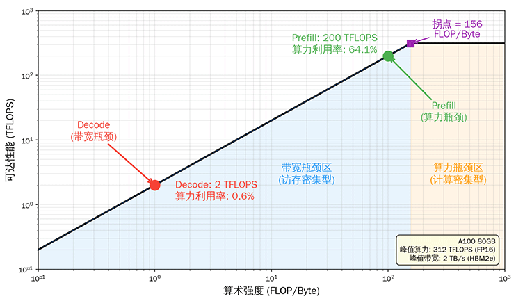

# GPU Resource Management

GPU is the most expensive and scarce resource in LLM inference serving. How to make full use of every megabyte of VRAM and every compute core on each GPU is key to controlling inference service costs. In [Inference Efficiency Optimization](../../language-models/reasoning/inference-efficiency.md), we analyzed inference bottlenecks and optimization techniques from an algorithmic perspective. In [Request Scheduling and Batching](./request-scheduling.md), we discussed how to organize the execution of multiple requests from a system perspective. This chapter starts from the GPU hardware itself, analyzing the characteristics and bottlenecks of the three major resources—memory, compute, and bandwidth—and discusses resource optimization techniques such as memory management, compute scheduling, multi-instance sharing, and quantization, helping readers understand the physical boundaries and engineering approaches of inference optimization.

## GPU Hardware Architecture and Resource Characteristics

A GPU is not a homogeneous compute unit, but a heterogeneous system composed of memory, compute cores, and interconnect buses. Think of a GPU's workflow like running a restaurant. The kitchen area determines how many dishes can be prepared simultaneously (memory capacity), the chef's cooking speed determines the number of dishes output per minute (compute throughput), and the speed at which servers bring ingredients from the cold storage to the kitchen determines whether the kitchen can operate at full capacity (bandwidth). A kitchen that is too small will leave even the fastest chef idle. Slow food running means even the largest kitchen cannot be kept busy. The resource relationship in a GPU is similar. The relationship among the three can be summarized in a simple logical chain: the utilization of compute depends on bandwidth, because data must be loaded from memory to the compute units before computation can occur. Memory capacity limits the amount of data that can be stored, constraining how many requests can share the compute resources. The hardware constraints of a GPU are the physical foundation for all subsequent optimization techniques:

- **Memory** is the high-speed storage on a GPU, used to store model weights and KV Cache. Taking the NVIDIA A100 as an example, its HBM2e memory capacity is 80 GB. Memory capacity is a hard constraint on whether a model can be deployed. If the KV Cache cannot fit, concurrency cannot be increased.

- **Compute** measures how many floating-point operations a GPU can execute per second. The A100's FP16 compute throughput is 312 TFLOPS (312 trillion operations per second). Compute determines how much data can be processed per second. The Prefill phase needs to process all tokens in the input prompt, making compute the primary bottleneck in the Prefill phase.

- **Bandwidth** is the data transfer rate between the GPU compute cores and memory. The A100's HBM2e bandwidth is 2 TB/s. Bandwidth determines how quickly the KV Cache can be read during the Decode phase. Every generated token requires reading all layers' KV Cache and model weights from memory—a massive amount of data but minimal computation. Therefore, Decode phase performance is determined by bandwidth and has little to do with compute throughput.

| Resource | RTX 5090 32GB | A100 80GB | H100 80GB | Role in Inference |
|:--------:|:------------:|:---------:|:---------:|:-----------------:|
| Memory Capacity | 32 GB | 80 GB | 80 GB | Determines model size and concurrency ceiling |
| FP16 Compute | 104.8 TFLOPS | 312 TFLOPS | 989 TFLOPS | Determines Prefill speed |
| Memory Bandwidth | 1.79 TB/s | 2 TB/s | 3.35 TB/s | Determines Decode speed |

*Table: Comparison of three key resource parameters across A100, H100, and RTX 5090*

### Arithmetic Intensity and the Roofline Model

For a specific computation task, how do you determine whether the bottleneck lies in compute or bandwidth? The answer depends on the task's **Arithmetic Intensity**. Arithmetic intensity is the number of floating-point operations per byte of memory access, measured in FLOP/Byte. Tasks with high arithmetic intensity perform a large amount of computation after loading a piece of data—these are **compute-bound**, with the bottleneck being compute throughput. Tasks with low arithmetic intensity perform only a small amount of computation after loading data from memory—these are **memory-bound**, with the bottleneck being bandwidth.

In 2009, computer scientist Samuel Williams and colleagues at the University of California, Berkeley proposed the Roofline model in their paper "[Roofline: An Insightful Visual Performance Model for Multicore Architectures](https://dl.acm.org/doi/10.1145/1498765.1498785)", using a simple curve to intuitively display the relationship between hardware performance ceilings and arithmetic intensity. This model plots arithmetic intensity on the x-axis and attainable performance (FLOPS) on the y-axis, drawing the hardware's performance ceiling curve. The curve has two segments: the rising left segment represents the bandwidth-bound region, where performance increases linearly with arithmetic intensity (performance = bandwidth x arithmetic intensity). The flat right segment represents the compute-bound region, where performance reaches the peak compute throughput and no longer increases. The intersection of the two segments is called the **ridge point**, whose arithmetic intensity equals peak compute / peak bandwidth—the critical value at which both compute and bandwidth are fully utilized. When arithmetic intensity is below the ridge point, compute is underutilized because data cannot be supplied fast enough, and performance is limited by bandwidth. When above the ridge point, bandwidth is underutilized because compute is insufficient, and performance is limited by compute.

*Figure: Roofline model of the A100*

The figure above uses the A100 as an example, with a ridge point arithmetic intensity of 312 TFLOPS / 2 TB/s = 156 FLOP/Byte. This means that if a task's arithmetic intensity is below 156 FLOP/Byte, it is memory-bound and its performance is determined by bandwidth. If above 156 FLOP/Byte, it is compute-bound and its performance is determined by compute throughput. By examining the Roofline curves of different hardware, one can intuitively assess which tasks they are best suited for. Conversely, the Roofline curve can also be used to quantify the differences in computational characteristics between the Prefill and Decode phases. During Prefill, matrix multiplication involves large amounts of computation, with arithmetic intensity typically exceeding 100 FLOP/Byte, approaching or exceeding the ridge point, making it compute-bound. During Decode, each step generates only a single token, requiring reading all KV Cache and weights from memory while performing only a minimal amount of computation. The arithmetic intensity is only about 1-2 FLOP/Byte, far below the ridge point, making it memory-bound.

### Impact of GPU Architecture Evolution on Inference

From 2020 to 2026, from Ampere to Blackwell Ultra, NVIDIA's five generations of data center GPUs exhibit a clear and intensifying trend: the growth of compute and bandwidth has been persistently imbalanced, with compute outpacing bandwidth by a wide margin. This is detailed in the table below.

| GPU | Architecture | FP16 Compute | Memory Bandwidth | Memory Capacity | NVLink |
|:---:|:------------:|:------------:|:----------------:|:---------------:|:------:|
| A100 (2020) | Ampere | 312 TFLOPS | 2 TB/s | 80 GB | 600 GB/s |
| H100 (2022) | Hopper | 989 TFLOPS | 3.35 TB/s | 80 GB | 900 GB/s |
| H200 (2024) | Hopper | 989 TFLOPS | 4.8 TB/s | 141 GB | 900 GB/s |
| B200 (2025) | Blackwell | 2,250 TFLOPS | 8 TB/s | 192 GB | 1,800 GB/s |
| B300 (2026) | Blackwell Ultra | 3,500 TFLOPS | 8 TB/s | 288 GB | 1,800 GB/s |

*Table: Evolution of three key resource parameters across five generations of NVIDIA data center GPUs (FP16 values are dense compute, NVLink is bidirectional aggregate bandwidth)*

From A100 to H100, compute increased by 3.17x (312 to 989 TFLOPS), while bandwidth increased by only 1.675x (2 to 3.35 TB/s), and memory capacity remained unchanged (both 80 GB). The transition from H100 to H200 is a notable turning point. H200 uses the same Hopper cores as H100, so compute is unchanged, but with HBM3e memory, bandwidth was pushed to 4.8 TB/s (a 43% increase) and capacity doubled to 141 GB. This was NVIDIA's targeted fix for the bandwidth and capacity shortcomings of the H100. However, from H200 to B200, the trend reverted: compute grew by 2.28x (989 to 2,250 TFLOPS), while bandwidth grew by only 1.67x (4.8 to 8 TB/s). By B300, compute continued to grow by 56% (2,250 to 3,500 TFLOPS), while bandwidth remained completely unchanged (also 8 TB/s). Over five generations, compute has increased by 11.2x, while bandwidth has increased by only 4x.

The consequences of this trend can be quantified using the ridge point arithmetic intensity of the Roofline model (peak compute / peak bandwidth). The ridge point for A100 is 156 FLOP/Byte, rising to 295 for H100, dropping back to 206 for H200 due to the bandwidth improvement, rising again to 281 for B200, and reaching 438 for B300. A higher ridge point means more computational tasks fall into the memory-bound region. Decode phase arithmetic intensity is only about 1-2 FLOP/Byte, far below the ridge point of any generation, so Decode performance is almost entirely determined by bandwidth. From A100 to B300, the theoretical speedup for Decode is only 4x (equal to the bandwidth growth ratio), while the theoretical speedup for Prefill is nearly 11.2x (equal to the compute growth ratio). This asymmetric acceleration continues to reinforce the necessity of the [PD Disaggregation Architecture](../../language-models/reasoning/inference-efficiency.md#prefill-decode-disaggregation-architecture). Deploying Prefill tasks on the latest generation of high-compute GPUs (such as B300) while keeping Decode tasks on GPUs with better bandwidth-to-cost ratios (such as B200, which offers the same 8 TB/s bandwidth at lower cost) makes it possible to fully leverage the strengths of each hardware generation.

The development of memory capacity is equally noteworthy. A100 and H100 both remained at 80 GB for four years, with a single GPU only capable of holding a 40B-parameter FP16 model. H200 broke this deadlock first (141 GB), followed by B200 (192 GB) and B300 (288 GB). A single B300 can hold a complete 70B model in FP16 (weights approximately 140 GB), leaving about 148 GB for KV Cache. This capacity growth directly changes the topology choices for inference deployment. Previously, a 70B model required at least two A100/H100 GPUs with tensor parallelism. Now a single B200 or B300 can run it independently, eliminating the communication overhead and cross-GPU load imbalance introduced by tensor parallelism.

Beyond single-GPU resource evolution, multi-GPU interconnect technology also profoundly affects inference architecture choices. NVLink is NVIDIA's high-speed GPU-to-GPU interconnect protocol. Across five generations, it has evolved from NVLink 3 (A100, 600 GB/s) to NVLink 4 (H100/H200, 900 GB/s) to NVLink 5 (B200/B300, 1,800 GB/s), with significant leaps each generation. In comparison, inter-node network bandwidth has also increased, from InfiniBand NDR400 (400 Gb/s, approximately 50 GB/s) in the H100 era to ConnectX-8 (800 Gb/s to 1.6 Tb/s, approximately 100-200 GB/s) in the B300 era. However, there remains a gap of nearly 10-20x compared to NVLink. This enormous bandwidth disparity determines the performance boundaries of parallelization strategies. [Tensor Parallelism](../../language-models/pretraining/distributed-training.md#tensor-parallelism) requires frequent AllReduce communication and is best deployed on GPUs interconnected via NVLink within a single node. [Pipeline Parallelism](../../language-models/pretraining/distributed-training.md#pipeline-parallelism), which has relatively low communication volume, can be deployed across nodes.

## Compute Scheduling and Utilization Optimization

In [Request Scheduling and Batching](./request-scheduling.md), we discussed how to improve GPU utilization through continuous batching from a system perspective. This section takes a lower-level view, analyzing how GPU utilization is measured and the techniques for improving compute utilization through kernel optimization and operator fusion.

### Measuring GPU Utilization

GPU utilization is an easily misunderstood metric. Seeing 100% GPU utilization in the task manager does not mean the GPU is running at full computational capacity. Understanding the correct way to measure utilization is essential for properly evaluating inference service efficiency. In different contexts, GPU utilization may refer to any of the following three metrics:

- **SM Occupancy** measures the proportion of active warps on a Streaming Multiprocessor (SM). Each SM can schedule up to 64 warps simultaneously (using A100/H100 as an example—the limit varies by architecture). If only 16 warps are active, SM occupancy is 25%. SM occupancy reflects the utilization of GPU compute units, but high occupancy does not mean high compute utilization. If all warps are waiting for data to return from memory, SM occupancy may be high while actual computation is low.

- **FLOPS Utilization** is a more intuitive efficiency metric, defined as the ratio of actual FLOPS to peak FLOPS. As mentioned several times earlier, the FLOPS utilization of the Decode phase is typically only 1-2%. Using the Roofline model, we can provide a theoretical explanation: since the arithmetic intensity of the Decode phase is only about 1-2 FLOP/Byte, far below the A100's ridge point of 156 FLOP/Byte, the theoretical upper limit of FLOPS utilization is between 1/156 ≈ 0.64% and 2/156 ≈ 1.28%. The actual utilization of 1-2% is already an optimistic estimate.

- **Bandwidth Utilization** is defined as actual bandwidth divided by peak bandwidth. Decode phase bandwidth utilization is typically 30-60%, indicating that even for memory-bound applications, bandwidth is not fully utilized. Part of the remaining bandwidth is consumed by kernel launch overhead, data alignment, cache misses, and other factors, and part is limited by the GPU's scheduling capacity (insufficient active warps to hide memory latency).

In summary, low utilization does not equal low efficiency. In some scenarios, low utilization is unavoidable. For example, in Decode with a batch size of 1, the theoretical upper limit of compute utilization is extremely low. The goal of optimization is not to pursue high utilization for its own sake, but to maximize utilization within given constraints—by increasing batch size, optimizing kernels, and reducing idle time, ensuring the GPU does useful work in every time slice.

### Kernel Optimization and Operator Fusion

A **GPU kernel** is a parallel computation function executed on the GPU. Unlike CPU functions, a kernel is called from CPU-side code (referred to as the host) but actually executed on the GPU side (referred to as the device) by a large number of threads in parallel. Kernels follow the SIMT (Single Instruction, Multiple Threads) execution model: the same kernel code is executed simultaneously by thousands of threads, each processing a different piece of data. The kernel is the core abstraction of the GPU programming model (such as CUDA). Developers write a kernel function to describe the computation logic of a single thread, and the GPU hardware schedules this logic across hundreds or thousands of compute cores for parallel execution.

LLM inference involves a large number of small kernels, such as LayerNorm, Attention, MLP, Activation, and so on. The launch overhead and data movement cost of each individual kernel may not be significant, but they accumulate to a non-negligible amount. The execution process of a kernel includes the CPU issuing a launch instruction (approximately 5-10 microseconds of launch latency), the GPU reading input data from memory, performing computation, and writing results back to memory. For compute-light kernels, the launch latency and data movement time can far exceed the actual computation time. **Operator Fusion** is one of the primary tools for addressing this problem. It combines multiple consecutive kernels into one, reducing intermediate results being written to and read from memory. Taking LayerNorm + Dropout + Residual as an example: without fusion, three kernels are needed, and intermediate results must be written back to memory before being read by the next kernel. After fusion, only one kernel is needed. Intermediate results remain in the GPU's registers or SRAM and are passed directly to the next computation step, saving two rounds of memory writes and reads.

FlashAttention is the most successful example of operator fusion. In [Inference Efficiency Optimization](../../language-models/reasoning/inference-efficiency.md), we learned that standard Attention requires computing and storing an $N \times N$ attention matrix, consuming significant memory and bandwidth. FlashAttention fuses the blocked computation of Attention with Softmax, leveraging the high bandwidth of GPU SRAM (on-chip storage, approximately 20 MB, bandwidth approximately 19 TB/s). It loads blocked Q, K, V into SRAM to complete attention computation, writing only the final result back to HBM, thus avoiding writing the $N \times N$ attention matrix to memory. This strategy of trading SRAM for HBM access reduces the memory access of Attention from $O(N^2)$ to $O(N)$, achieving a 2-4x performance improvement in long-sequence scenarios. TensorRT-LLM represents the pinnacle of vendor-level optimization. It specifically optimizes GEMM (General Matrix Multiply) kernels for NVIDIA GPU Tensor Cores, fuses operators such as LayerNorm, Activation, and Residual, and can achieve over 50% compute utilization on H100. This level of deep optimization requires manual tuning for specific hardware architectures, making it less general-purpose, but it delivers significant performance gains in production environments.

### CUDA Streams and Parallel Execution

A CUDA Stream is a task queue on the GPU. Operations within the same stream execute serially, while operations in different streams can execute in parallel. This is analogous to the concept of threads in multithreaded programming: operations within the same thread execute sequentially, while operations in different threads can run concurrently.

In LLM inference, a typical use of CUDA Streams is to place data transfer and computation on different streams. For example, KV Cache transfer from CPU memory to GPU memory (or from one GPU to another) is placed on a transfer stream, while Decode computation for the current batch is placed on a compute stream. This way, while the GPU is performing Decode computation, the PCIe bus or NVLink can simultaneously transfer the KV Cache needed for the next batch, achieving parallelism between computation and transfer.

The scheduling challenge of multiple streams lies in the design of synchronization points. The compute stream must wait for data transfer to complete before using the transferred data. If a synchronization point is set too early, the compute stream will idle-wait. If set too late, the transfer stream may have completed the transfer while the compute stream is not yet ready to receive. Too many synchronization points will negate the parallelism benefit, while too few may lead to data races. In production systems, a **Double Buffering** strategy is typically employed. Two buffers are prepared for alternating use. While one buffer is being used by the compute stream, the transfer stream fills the other buffer with data. The two alternate, maximizing overlap between computation and transfer.

## Multi-Instance GPU Sharing

We have discussed aggregating multiple GPUs to handle a single model (such as pipeline parallelism). Conversely, when a single GPU's compute capacity far exceeds the requirements of a single model, dedicating the entire GPU to one model wastes resources. For example, a 7B model may achieve only 5% compute utilization on an A100, leaving 95% of compute idle. By allowing multiple inference instances to share the same GPU, resource utilization can be improved. Sharing approaches fall into two categories—time-slicing and spatial partitioning—each with its own applicable scenarios.

- **Time-Slicing** allows multiple inference instances to take turns using the same GPU, with each instance receiving a fixed time slice. NVIDIA's MPS (Multi-Process Service) is a time-division multiplexing mechanism that allows multiple CUDA processes to share the compute resources of the same GPU. Time-slicing only switches compute state without swapping memory data. The model weights, KV Cache, and other data of all inference instances remain resident in memory. Context switching involves only compute resources such as registers, warp scheduling state, and SM execution context, without moving the large volumes of data in memory. This means the total memory footprint of all concurrent instances must be less than the total GPU memory. If each instance requires 20 GB on an 80 GB A100, time-slicing can accommodate at most 4 instances. MPS only performs time-division multiplexing of compute resources; there is no true isolation at the memory level. Multiple processes share the same physical memory space, differentiated only by address mapping. A memory leak in one process can affect other processes on the same GPU. Another issue with MPS is latency jitter. The context switching overhead between instances is approximately tens of microseconds, and different instances can interfere with each other—a long-running computation in one instance can delay the execution of others. For latency-sensitive online inference services, such jitter is unacceptable.

- **Spatial Partitioning** divides a GPU's compute units and memory into multiple independent partitions, each running an inference instance without interference. NVIDIA MIG (Multi-Instance GPU) is the hardware support for spatial partitioning, providing isolation at the hardware level. Each MIG instance has its own independent SMs, L2 cache, and memory bandwidth. The A100 supports up to 7 MIG instances (each with approximately 10 GB of memory), while the H100 supports more configuration options. The advantage of spatial partitioning is zero interference: computation in one instance does not affect the latency of other instances, making it suitable for scenarios requiring latency stability. A typical use case is partitioning a single GPU into multiple instances, each running models of different sizes. MIG is commonly used in scenarios such as concurrent inference of multiple small models (e.g., deploying a 7B and a 13B model simultaneously), multi-user isolation in development and testing environments (each developer gets an independent MIG instance), and A/B testing (different versions of the same model deployed on different MIG instances for performance comparison). For example, an A100 80GB can be partitioned into two 40 GB instances—one running a 7B model (weights approximately 14 GB, leaving 26 GB for KV Cache), and the other running a 13B model (weights approximately 26 GB, leaving 14 GB for KV Cache). This way, a single GPU can serve two models of different scales simultaneously, achieving far higher resource utilization than exclusive mode. However, the partitioned instances have proportionally reduced memory and compute capacity, making them unsuitable for large model inference. Additionally, MIG instances cannot communicate via NVLink and therefore cannot be used for tensor parallelism. This means MIG is only suitable for small models that can fit entirely within a single instance's memory.

There is also a class of multi-model sharing solutions that do not use MIG. These solutions deploy multiple models on the same GPU through the inference framework, controlling the execution order of each model via a scheduler. Unlike MIG's hardware isolation, these solutions rely on software scheduling for resource sharing—offering higher flexibility but weaker isolation. Taking dynamic batching under multi-model scenarios as an example: the framework batches requests for different models separately, but they still share the same GPU's execution time. The scheduler dynamically allocates GPU time slices based on the load of each model, with heavily loaded models receiving more execution opportunities. This approach is more flexible than MIG, allowing dynamic adjustment of resource allocation ratios, but it lacks hardware isolation—a long-running computation in one model can affect the latency of other models.

## Summary

This chapter started from the physical essence of GPU hardware, discussing three fundamental questions in inference service resource management: what goes into memory, how is compute used, and is bandwidth sufficient. These three questions are not independent of each other. Bandwidth determines whether compute can be kept fed. Memory capacity determines how many requests can be served simultaneously. Compute becomes the primary constraint in the Prefill phase. GPU hardware is the physical foundation and design prerequisite for software algorithms and engineering optimization measures. All such measures exist to bridge the gap between the computational characteristics of workloads and the physical reality of the hardware.

## Exercises

1. Using the Roofline model, analyze the theoretical performance of the LLM Decode phase (arithmetic intensity approximately 1 FLOP/Byte) on an H100 (peak compute 989 TFLOPS FP16, bandwidth 3.35 TB/s). How does it compare to the A100 (312 TFLOPS, 2 TB/s)? What does this tell us?

   

   
Reference Answer

   The arithmetic intensity of the Decode phase is 1 FLOP/Byte, far below the ridge point (A100 ridge point = 312/2 = 156 FLOP/Byte, H100 ridge point = 989/3.35 ≈ 295 FLOP/Byte). Therefore, Decode is bandwidth-bound on both GPUs.

   A100 Decode performance = 2 TB/s x 1 FLOP/Byte = 2 TFLOPS
   H100 Decode performance = 3.35 TB/s x 1 FLOP/Byte = 3.35 TFLOPS

   Speedup = 3.35 / 2 = 1.675x. However, H100's peak compute is 989/312 = 3.17x that of the A100.

   This shows that for the Decode phase (bandwidth-bound), upgrading from A100 to H100 provides a speedup far below the peak compute improvement ratio. Compute growth (3.17x) far outpaces bandwidth growth (1.675x), meaning the cost-effectiveness improvement of newer GPUs for Decode is limited. This is also an important reason why the PD Disaggregation Architecture is attractive—the Prefill phase can fully leverage the compute growth of newer GPUs.

   

2. A 13B model (FP16) is deployed on a single A100 80GB. Calculate:
    1. How much memory do the model weights occupy?
    2. How many concurrent KV Caches can the remaining memory support (assuming a maximum sequence length of 4096 and runtime overhead of 2 GB)?
    3. If INT4 weight quantization + KV Cache FP8 quantization is used, how much can concurrency be improved?

   

   
Reference Answer

   1. Model weights: 13B x 2 bytes = 26 GB

   2. Remaining memory: 80 - 26 - 2 = 52 GB
     KV Cache per request (13B model, 40 layers, 40 heads, 128 dimensions per head, float16):
     $2_{\text{K+V}} \times 40_{\text{layers}} \times 40_{\text{heads}} \times 128_{\text{dim/head}} \times 4096_{\text{sequence}} \times 2_{\text{FP16 bytes}}$ = $2 \times 40 \times 5120 \times 4096 \times 2$ ≈ 3.36 GB
     Concurrency = 52 / 3.33 ≈ 15 requests

   3. INT4 weight quantization: weights = 13B x 0.5 bytes = 6.5 GB
     KV Cache FP8: KV Cache per request ≈ 3.33 / 2 = 1.67 GB
     Remaining memory: 80 - 6.5 - 2 = 71.5 GB
     Concurrency = 71.5 / 1.67 ≈ 42 requests
     After quantization, concurrency increases from 15 to 42, approximately 2.8x improvement.

   

