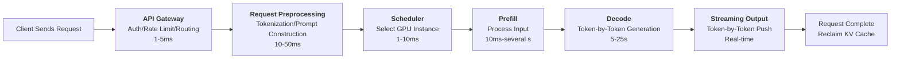
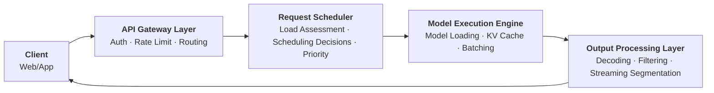

# Inference Service Architecture

In 2020, NVIDIA renamed its model inference service from TensorRT Inference Server to Triton Inference Server. What seemed like a routine name change actually marked a transition in inference services — moving from a rudimentary single-model, single-service approach toward a more generalized and platform-oriented paradigm. At that time, inference services primarily targeted traditional deep learning models in computer vision and recommendation systems, where request latency was predictable, resource consumption was controllable, and the architecture differed little from ordinary web services. Then came 2023, and the explosion of large language models completely reshaped the landscape. Hugging Face launched Text Generation Inference (TGI), the UC Berkeley team proposed PagedAttention and developed the vLLM framework, and a host of LLM-specific inference serving frameworks sprang up like mushrooms after rain. The core problem these frameworks needed to solve was the fundamental contradiction between the autoregressive generation characteristic of LLM inference and the request-response pattern of traditional web services.

Starting from the autoregressive nature of LLM inference, this article analyzes the differences between inference services and traditional web services in terms of latency models, resource consumption, and traffic patterns. It then discusses the complete lifecycle of an inference request, the core architectural components of an inference service, deployment patterns from single-machine to cloud-native setups, as well as high availability and fault tolerance design. These topics complement the underlying optimization techniques discussed in [Inference Efficiency Optimization](../../language-models/reasoning/inference-efficiency.md), such as PagedAttention and PD disaggregation architecture. The former focuses on how to make a single inference faster, while this article focuses on how to make inference services more reliable and efficient in serving external requests.

## Inference Service vs. Traditional Web Services

If you have ever developed a web application, you are surely familiar with this scenario: a user clicks "Submit Order," the backend queries the database, executes business logic, and returns the result — the entire request completes within 200 milliseconds. Nginx handles load balancing, Kubernetes manages elastic scaling, and during peak hours, adding a few more Pods is enough to handle the traffic. This well-established architectural practice, however, runs into obstacles everywhere when applied to LLM inference services. The reason is not that the engineering implementation is inadequate, but that the intrinsic characteristics of LLM inference fundamentally differ from traditional web requests. Understanding these differences is the starting point for designing inference service architecture.

### Differences in Latency Model

Suppose you operate the backend service of an e-commerce website. If you measure the latency of 1000 product detail queries, you would find that the response times of the vast majority of requests fall between 50 and 250 milliseconds. A few requests might reach 300 milliseconds due to cache misses or slow database queries, but it is almost unheard of for any request to exceed 10 seconds. The latency distribution approximates a normal distribution, with both the mean and variance being predictable. You can thus set a timeout threshold of 500 milliseconds, confidently expect 99.9% of requests to complete within that threshold, and define your service SLA accordingly.

Now switch the scenario to an LLM inference service. Two users send requests at the same time: one asks "Explain what machine learning is in one sentence," and the model generates about 30 tokens, taking less than one second. The other asks "Explain in detail the basic principles of quantum mechanics, including wave-particle duality and the uncertainty principle," and the model generates about 2000 tokens, taking over a minute. The latency gap between these two requests is 60-fold, and when the requests arrive, you have no way of knowing which is a short request and which is a long one, because the output length depends on the model's generation process, not the input length.

The root cause of this difference lies in the autoregressive nature of LLM inference. During the Decode phase, the LLM generates tokens one by one, with each token requiring a complete forward pass. Total latency is approximately equal to Prefill latency plus the per-token generation time multiplied by the number of output tokens, and the number of output tokens is unpredictable when the request arrives. This means the latency distribution of LLM inference is not a normal distribution but a long-tail distribution. Most requests may concentrate in the 1-5 second range, but a few requests can last 30 seconds or more. The impact of a long-tail distribution on engineering design is pervasive: if the timeout threshold is set too high, abnormal requests occupy resources for extended periods; if set too low, legitimate long requests are prematurely terminated. Capacity planning also becomes difficult — P99 latency can be 10 times higher than the median. Planning for P99 wastes a large amount of resources during normal operation, while planning for the median causes severe service quality degradation during peak hours. This uncertainty is like a fissure extending from the SLA, spreading from the latency model to resource consumption, traffic patterns, deployment strategies, and fault tolerance design, ultimately shaking almost all the architectural experience accumulated from traditional web services.

### Differences in Resource Consumption Patterns

Traditional web services are mostly I/O-bound. In a typical Spring Boot application, the CPU spends most of its time waiting for database query results, network transmissions to complete, and disk I/O to finish. Increasing the number of concurrent connections barely increases the CPU burden, because new requests also spend most of their time waiting for I/O. With a well-designed architecture, horizontal scaling is relatively straightforward — adding one more server handles a proportional number of additional concurrent requests, and the cost-to-capacity relationship is roughly linear.

LLM inference services are completely different. They are subject to dual constraints: compute intensity and memory intensity. Compute intensity manifests in the fact that every generated token requires a complete forward pass, involving matrix multiplications across billions of parameters. Memory intensity manifests in the massive GPU memory consumption of the KV Cache. As discussed in [Inference Bottleneck Analysis](../../language-models/reasoning/inference-efficiency.md#inference-bottleneck-analysis), a single request for a 70B model can consume approximately 10 GB of GPU memory for its KV Cache. Concurrency is limited by GPU memory capacity rather than CPU core count. A cluster composed of several A100 80GB GPUs running a 70B model may only be able to handle a single-digit number of concurrent requests.

This difference in resource constraints directly determines the different approaches to scaling. For a well-architected web service, adding more machines increases concurrency, and the annual rental cost of a basic 2-core 4 GB cloud server is only a few dozen dollars. Scaling LLM inference services, however, is constrained by GPU supply. A single A100 80GB GPU costs tens of thousands of dollars. More critically, the startup time of GPU nodes is far longer than that of CPU nodes — loading the weights of a 70B model into GPU memory takes tens of seconds to several minutes — meaning that the responsiveness of elastic scaling is far inferior to that of traditional services.

### Differences in Traffic Patterns

Traffic fluctuations in traditional web services are relatively gentle. Taking an e-commerce website as an example, peak daytime QPS may be 2-5 times the nighttime trough, and traffic changes are usually predictable (a small peak during lunch break, a large peak in the evening), allowing resources to be warmed up in advance. Even sudden traffic spikes (such as flash sales) can be mitigated in advance through caching, rate limiting, and degradation measures.

LLM inference service traffic, on the other hand, exhibits strong burstiness and unpredictability. A popular AI application may experience peak traffic 10-50 times its trough, far exceeding the peak-to-trough ratio of traditional services. What makes it even more challenging is that the request intervals of individual users are highly uneven — a user may initiate multiple rounds of conversation within a few minutes, each round incurring an inference request, and then go hours without any usage. This burst-and-silence traffic pattern renders capacity planning based on average QPS almost useless.

The burstiness of traffic creates a sharp contradiction with the sluggishness of GPU scaling. When a traditional service encounters a traffic surge, Kubernetes' HPA (Horizontal Pod Autoscaler) can spin up new Pods within seconds to share the load, and serverless architectures can reduce response time to hundreds of milliseconds. GPU nodes, however, take minutes from startup to readiness (loading model weights, warming up the GPU). By the time a new node is ready, the sudden traffic may have already overwhelmed the existing nodes. This dilemma of slow scaling is a major challenge in designing elastic scaling for inference services, and it is also a key issue to address when discussing cloud-native deployment and degradation strategies later in this article.

## Lifecycle of an Inference Request

To address the various challenges of LLM inference services, we must first understand exactly what stages an LLM inference request goes through — from the moment the user issues it to the moment they receive the complete response — what the time characteristics of each stage are, and which stages may become bottlenecks. Only by digging into the complete lifecycle of an inference request can we systematically answer these questions.

### End-to-End Request Processing

Now imagine you are using an AI assistant application. You type "Please explain what deep learning is" into the dialog box and press Enter. From this moment until the complete response appears on the screen, the request traverses a complex processing chain.


*Figure: Complete processing pipeline of an inference request*

- **Step 1: API Gateway Receives the Request.** The gateway authenticates your identity (API Key or OAuth Token), checks whether you are a legitimate user and whether you have exceeded the call frequency limit, and then forwards the request to the backend service. The latency of this step is typically 1-5 milliseconds.

- **Step 2: Request Preprocessing.** The backend service feeds your input text into a tokenizer, converting "Please explain what deep learning is" into a sequence of token IDs from the vocabulary. At the same time, the system concatenates your input with the [System Prompt](../../language-models/pretraining/supervised-finetuning.md#system-prompt-design) and conversation history to form the complete prompt. If the conversation history is long, this step also needs to handle context window constraints. Tokenization and prompt construction take approximately 10-50 milliseconds.

- **Step 3: Request Scheduling.** The scheduler decides which GPU instance to send the request to, based on the current load of each GPU instance (number of requests being processed, KV Cache usage, GPU utilization) and request attributes (input length, priority). Scheduling latency is approximately 1-10 milliseconds, but the quality of the scheduling decision directly affects the request's queuing time and overall throughput.

- **Step 4: [Prefill](../../language-models/reasoning/inference-efficiency.md#prefill-decode-disaggregation-architecture).** After the GPU instance receives the request, it performs a single parallel computation over all tokens of the input prompt, generating the initial KV Cache. Prefill latency depends on the input length. A short prompt takes about 10-50 milliseconds, while a long prompt (such as one containing extensive conversation history) may take hundreds of milliseconds or even seconds.

- **Step 5: [Decode](../../language-models/reasoning/inference-efficiency.md#prefill-decode-disaggregation-architecture).** The model generates output tokens one by one. Each generated token requires reading the entire KV Cache and performing one forward pass. Decode is a memory-bound operation, with per-step latency of about 10-50 milliseconds. Total latency equals per-step latency multiplied by the number of output tokens. For a request generating 500 tokens, the Decode phase may take 5-25 seconds, accounting for the majority of the entire request lifecycle.

- **Step 6: Streaming Output.** As each token is generated, the system immediately sends it to the client, rather than waiting for all tokens to be produced. This allows the user to see the first token within a few hundred milliseconds of issuing the request, greatly improving the interactive experience.

- **Step 7: Request Completion.** The request completes when the model generates an end-of-sequence (EOS) token or reaches the maximum generation length. The system decides whether to reclaim the KV Cache memory for this request based on the caching strategy, returning it to the free pool for use by subsequent requests.

From this flow, it is clear that Prefill and Decode are the two most time-consuming stages and also offer the greatest optimization opportunities. The optimization techniques discussed in [GPU Resource Management](gpu-resource-management.md) and [Request Scheduling and Batching](request-scheduling.md) are essentially all aimed at improving the efficiency of these two stages.

### Streaming Output and Server-Sent Events

Since LLM inference generates tokens one by one, if the system waited until all tokens were generated before returning the complete result to the client, the user would face a long period of blank waiting. Consider a request that generates 1000 tokens with a per-step Decode latency of 50 milliseconds — the total time would be approximately 50 seconds. If the user sees no output during these 50 seconds, they might easily assume the service has malfunctioned and repeatedly retry, further exacerbating system load.

**Streaming output** is the standard solution to this problem. As soon as the model generates a token, it is immediately sent to the client. The user sees the first token within a few hundred milliseconds of issuing the request, and subsequent tokens appear one by one, like typing. This design creates the character-by-character output effect seen in mainstream AI assistant products (such as Doubao, ChatGPT, etc.). **Server-Sent Events (SSE)** is the standard protocol for implementing streaming output. SSE is based on the HTTP protocol, allowing the server to push data unidirectionally to the client. Each event starts with `data:` and ends with two newline characters. Compared to WebSocket's bidirectional communication, SSE is simpler, more lightweight, natively supports automatic reconnection, and is based on standard HTTP without requiring an additional connection upgrade handshake. For scenarios like LLM inference where the server pushes tokens unidirectionally to the client, SSE is indeed the more suitable choice. In this project, when code is running, the SSE protocol is also used to stream log information from standard output (STDOUT, STDERR) to the web interface in real time.

The following code leverages DMLA's built-in SSE streaming push capability to simulate the character-by-character output effect of LLM inference. After clicking Run, you will see tokens appear one by one in the output area, just like real SSE streaming output. The code also simulates and measures key inference performance metrics, including Prefill time, Time to First Token (TTFT), and Time per Output Token (TPOT).

```python runnable
# Demonstrate the interactive process of SSE streaming output in LLM inference
# This code utilizes the SSE streaming push feature of runnable code blocks to simulate token-by-token output
import time

# Simulate the token sequence generated by an LLM
tokens = ["在", "大", "语", "言", "模", "型", "的", "推", "理", "服",
          "务", "中", "，", "流", "式", "输", "出", "至", "关", "重",
          "要", "。"]

# ---- Simulate Prefill Phase ----
prefill_start = time.time()
print("[Prefill] Processing input prompt...", flush=True)
time.sleep(0.1)  # Prefill takes approximately 100ms
prefill_time = time.time() - prefill_start

# ---- Simulate Decode Phase: Generate tokens one by one with real-time push ----
# Each print(token, flush=True) triggers a real-time SSE push to the frontend
# You will see tokens appear one by one in the output area, just like the typing effect of an AI assistant
print("\n[Decode] Generating tokens one by one:\n", flush=True)
print("AI: ", end='', flush=True)

decode_start = time.time()
first_token_time = None

for token in tokens:
    time.sleep(0.1)  # Simulate ~100ms per Decode step delay

    # Key: flush=True ensures the token is immediately pushed to the frontend via SSE
    # This is exactly how LLM inference services achieve character-by-character output
    print(token, end='', flush=True)

    if first_token_time is None:
        first_token_time = time.time()

decode_time = time.time() - decode_start

# ---- Output Performance Metrics ----
ttft = (first_token_time - decode_start) if first_token_time else 0
tpot = decode_time / len(tokens) if tokens else 0

print(f"\n\n{'='*50}", flush=True)
print(f"Performance Metrics:", flush=True)
print(f"  Prefill Time:     {prefill_time*1000:.0f}ms", flush=True)
print(f"  TTFT:             {ttft*1000:.0f}ms", flush=True)
print(f"  Generated Tokens: {len(tokens)}", flush=True)
print(f"  Total Decode Time:{decode_time*1000:.0f}ms", flush=True)
print(f"  TPOT:             {tpot*1000:.1f}ms", flush=True)
print(f"{'='*50}", flush=True)
```

Streaming output also introduces new engineering challenges. Traditional web application middleware typically has short default read timeouts — Nginx, for example, defaults to 60 seconds. But LLM inference requests may last several minutes, requiring timeouts of 300 seconds or longer. During this process, there is a risk of disconnection. When a network glitch causes the connection to drop, the client should be able to resume from the breakpoint rather than regenerate from scratch. When the push of a particular token fails mid-stream, the entire request should not fail as it would in a traditional web application — a selective retry mechanism is needed instead.

### Request Cancellation and Timeout Handling

When a user clicks the "Stop Generating" button in an AI assistant, the client actively disconnects. Traditional web services handle this situation easily — simply close the connection and release the request context, and CPU and memory resources are almost immediately reclaimed. Request cancellation in an LLM inference service is far more complex. The server must not only close the connection but also immediately reclaim the KV Cache memory allocated to that request. Otherwise, the number of concurrent requests the system can handle decreases, resulting in a silent resource leak. Request cancellation also involves race conditions. When a user cancels a request simultaneously with the model generating output, the scheduler may have already marked the request as cancelled while the Decode process for that request is still executing on the GPU. After execution completes, the KV Cache needs to be reclaimed. If the reclamation logic executes before the cancellation mark is applied, the KV Cache could be double-freed. If the reclamation logic never executes, a memory leak occurs. The key to resolving race conditions is to introduce a reference counting mechanism. Assign a reference count to each request's KV Cache. The scheduler decrements the count when cancelling the request, and the GPU also decrements the count when execution completes. Only when the count reaches zero is the memory actually freed. This design is analogous to the reference counting garbage collection mechanism found in earlier programming languages.

In the context of inference, timeout strategies also need to be rethought. Traditional services typically use an end-to-end global timeout for the entire request-response cycle: set a maximum execution time for the entire request, and forcibly terminate it if exceeded. If an LLM inference service uses a global timeout, it faces a dilemma. Setting the threshold too short (e.g., 10 seconds) will prematurely kill normal long-text generation requests. Setting it too long (e.g., 120 seconds) allows abnormal requests to occupy GPU resources for extended periods. Most LLM inference services adopt a more granular timeout strategy: rather than limiting total generation time, they limit the maximum wait time for a single token. If the wait time for a particular token exceeds a threshold (e.g., 5 seconds), it indicates that the system may be overloaded, and terminating the request is more reasonable than continuing to wait. This approach is called progressive timeout. Progressive timeout avoids the one-size-fits-all problem of global timeouts, but it is more complex to implement because it requires tracking the generation time of each individual token.

## Core Architecture Components of Inference Services

Based on the inference request lifecycle flow diagram, a production-grade LLM inference service involves four components: the API Gateway layer, the Request Scheduler, the Execution Engine, and the Output Processing Layer. The API Gateway layer handles request ingress and control. The Request Scheduler handles request distribution and orchestration. The Model Execution Engine handles the actual inference computation on the GPU. The Output Processing Layer transforms raw computation results into human-readable text. These four components each have their own responsibilities while working closely together, collectively determining the performance, reliability, and cost efficiency of the inference service.


*Figure: Four-layer architecture components and data flow of an inference service*

### API Gateway Layer

The API Gateway is the entry point for the inference service facing the outside world. It is responsible for three tasks: authentication and authorization, rate limiting, and request routing.

Authentication and authorization verify the caller's identity and permissions. The cost of invoking an LLM inference service is far higher than that of a traditional API (each call consumes several seconds of GPU time), so authentication is not just a security requirement but also a cost control measure. The most common authentication method is API Key verification. Each user or application is assigned a unique key. When a request arrives, the gateway verifies the key's validity and, based on the quota information associated with the key, decides whether to allow the request through.

Rate limiting prevents individual users or sudden traffic spikes from overwhelming the entire service. Traditional web services typically apply rate limiting based on QPS (Queries Per Second). For LLM inference services, in addition to QPS, rate limiting also needs to be applied based on token throughput, i.e., TPS (Tokens Per Second). A request generating 2000 tokens places more pressure on the GPU than ten requests generating 50 tokens each. If rate limiting is based solely on QPS, a small number of long requests could exhaust GPU resources. In production deployments, a dual rate limiting strategy combining QPS and TPS is commonly used: QPS limits request frequency, while TPS limits the total computational load.

Request routing distributes requests to different model serving instances. When the same service deploys multiple models (such as versions with different parameter sizes) or multiple instances, the gateway needs to route requests to the most suitable instance based on information such as the model name specified in the request, the request's priority, and the health status of each instance. Requests from paying users might be routed to dedicated high-priority instances, while requests from free users enter a shared instance's ordinary queue.

### Request Scheduler

The scheduler is the brain of the inference service, responsible for deciding which GPU instance handles each request, when it is handled, and which other requests it is batched with. The quality of scheduling decisions directly affects system throughput and latency.

The scheduler requires two types of input information to make decisions. The first type is the current state of each GPU instance — the number of requests being processed, KV Cache usage, GPU utilization, the number of queued requests, and so on. The second type is the attributes of the request itself — input length, expected output length (if the client provides a `max_tokens` parameter), priority, wait time, and so on. Based on this information, the scheduler seeks to balance three objectives: minimizing request latency (ensuring each request is responded to as quickly as possible), maximizing throughput (keeping the GPU as busy as possible), and ensuring fairness (preventing low-priority requests from waiting indefinitely).

The concrete implementation of scheduling policies is a deep topic. We will discuss scheduling techniques in detail — including continuous batching, preemption mechanisms, and prefix caching — in the [Request Scheduling and Batching](request-scheduling.md) section. Here, we only outline the core ideas. Different inference frameworks can have their own scheduling strategies. vLLM, for example, adopts an FCFS (First Come First Served) plus preemption approach. Requests are queued in arrival order. At the end of each Decode step, the scheduler checks whether new requests can be added to the batch. When GPU memory is insufficient to accommodate the KV Cache of a new request, the scheduler preempts low-priority requests, freeing their KV Cache memory for high-priority requests. Preempted requests are rescheduled later. This strategy ensures fairness while also preventing high-priority requests from being blocked for extended periods.

### Model Execution Engine

The Model Execution Engine is responsible for performing the actual inference computation on the GPU. It is the component closest to the hardware in the entire inference service. Its core capabilities include model loading and weight management, KV Cache management, and batch scheduling.

Model loading is the process of reading model weights from disk into GPU memory. The weight file of a 70B model is approximately 140 GB (calculated at FP16 precision). Loading it from an SSD into GPU memory takes tens of seconds. In production environments, weights are typically loaded once at service startup and then remain resident in GPU memory, never being unloaded. Weight management also involves sharding strategies in multi-GPU scenarios. With tensor parallelism, each GPU loads only a portion of the model's weights, and the GPUs work together to complete the computation.

Managing the KV Cache is one of the most critical responsibilities of the execution engine and also its greatest challenge. The [PagedAttention](../../language-models/reasoning/inference-efficiency.md#pagedattention) mechanism divides the KV Cache into fixed-size blocks and uses a block table to implement logical-to-physical mapping, eliminating the memory fragmentation problem inherent in traditional contiguous allocation. vLLM's PagedAttention engine is the classic implementation of this mechanism. It increases KV Cache memory utilization from approximately 40% in traditional approaches to nearly 100%, directly resulting in a 4-6x throughput improvement.

Batch scheduling is the key point of collaboration between the execution engine and the scheduler. The scheduler decides which requests to process together, and the execution engine decides how to compute them in parallel efficiently. Continuous batching requires the execution engine to be able to quickly remove completed requests from the batch and add new requests to the batch at the end of each Decode step. This process must be fast enough (typically within 1 millisecond), otherwise the scheduling overhead would negate the throughput benefits of batching.

### Output Processing Layer

The Output Processing Layer is responsible for converting the raw token sequence produced by the Model Execution Engine into human-readable text. It is the component closest to the user in the inference service.

Tokenizer decoding is the first step of output processing. The Model Execution Engine outputs token IDs (integers), which need to be mapped back to text through the tokenizer. For example, token ID 3824 might correspond to the Chinese character "学", and token ID 29871 might correspond to the punctuation mark "。". Tokenizer decoding is essentially a vocabulary lookup, and its latency is typically negligible (microsecond level), but it needs to handle some special cases. For instance, UTF-8 multi-byte characters may be split across multiple tokens and need to be correctly combined before decoding. Another example is that during generation, the LLM may output special tokens that should not be visible to the user, such as `<|im_end|>` (dialog end marker) or `<|eot_id|>` (turn end marker). The output processing layer needs to identify and filter out these markers, sending only valid text to the client.

The streaming segmentation component of the output layer splits the continuous token stream into semantic units before output. While token-by-token output offers the lowest latency, individual tokens often do not form complete semantic units (a single Chinese character might only be half of a word). Some application scenarios require output to be segmented by sentence or paragraph. This requires introducing a buffer in the output processing layer, accumulating tokens until a delimiter such as a period or newline is encountered, and then pushing the entire sentence at once. This strategy sacrifices some real-time responsiveness but produces more readable output.

Output filtering and safety components are another important responsibility of the output processing layer. Detecting sensitive content token by token in a streaming output is also an engineering challenge. Sensitive words may be split across multiple tokens (e.g., "危" and "险" might fall into two separate tokens), requiring a sliding window to detect cross-token sensitive patterns. Additionally, the latency of content safety detection must be low enough to avoid becoming a bottleneck for streaming output.

## Deployment Patterns and Architecture Selection

Having introduced the software and logical components of inference services, the next step is to deploy these components onto actual physical hardware. Differences in model scale, concurrency requirements, cost budgets, and reliability requirements lead to very different deployment decisions. From the simplest single-machine single-GPU setup to complex cloud-native elastic deployments, each pattern has its applicable scenarios, advantages, and disadvantages. Many of the technical strategies are entirely consistent with those used during the training phase discussed earlier.

- **Single-Machine Single-GPU Deployment:** The simplest deployment approach is one GPU running one model instance. Suppose you have an RTX 4090 with 24 GB of memory. Deploying a 7B parameter model (approximately 14 GB of GPU memory at FP16 precision) leaves about 10 GB of GPU memory for the KV Cache and runtime overhead, allowing it to handle 5-10 concurrent requests. The advantage of this approach is its simplicity — a single command is enough to start, making it suitable for development testing and small-scale internal tools. The disadvantage is that both model scale and concurrency are limited, making it difficult to use in production.

- **Single-Machine Multi-GPU Deployment:** When a model's parameter count exceeds the memory capacity of a single GPU, the model needs to be sharded across multiple GPUs. The most commonly used sharding approach is [Tensor Parallelism](../../language-models/pretraining/distributed-training.md#tensor-parallelism), where the weight matrices of each Transformer layer are split column-wise or row-wise and distributed across different GPUs for parallel computation.

    The main constraint of tensor parallelism is communication overhead. The forward pass through each Transformer layer requires one [AllReduce](../../language-models/pretraining/distributed-training.md#communication-optimization) operation. Each GPU independently computes the matrix multiplication for its assigned portion, and then the results are aggregated through summation. This means that intermediate results need to be exchanged between GPUs after every layer. If the GPUs communicate via the PCIe bus (bandwidth approximately 64 GB/s), the AllReduce communication time can account for 30-50% of the total computation time, significantly slowing down inference. With NVLink interconnects (bandwidth 300-900 GB/s), the communication overhead can be reduced to below 10%. Therefore, tensor parallelism typically requires GPUs to be interconnected via NVLink within the same node. Cross-node tensor parallelism is extremely inefficient due to insufficient network bandwidth.

    vLLM's tensor parallelism implementation serves as a reference. It uses NCCL (NVIDIA Collective Communications Library) to handle AllReduce communication across multiple GPUs. The user only needs to specify the `--tensor-parallel-size` parameter at startup, and the framework automatically handles model sharding and communication configuration. For a 70B model, using 4 x A100 80GB with tensor parallelism loads approximately 35 GB of model weights per GPU, leaving about 45 GB for the KV Cache, which can handle 30-50 concurrent requests — a qualitative leap over single-GPU deployment.

- **Multi-Machine Multi-GPU Deployment:** When the model size exceeds the total GPU memory of a single machine, or when higher concurrency is needed, cross-machine deployment becomes necessary. [Pipeline Parallelism](../../language-models/pretraining/distributed-training.md#pipeline-parallelism) distributes different layers of the model across different machines: machine 0 handles layers 1-20, machine 1 handles layers 21-40, and so on. Requests enter at machine 0, are passed forward layer by layer, and the final machine outputs the result.

    The main constraint of pipeline parallelism is the bubble problem. Each stage must wait for the output from the previous stage before it can start computation, leaving the GPU idle during the wait. Suppose the model is divided into 4 stages, each with a computation time of 10 milliseconds. A single request takes 40 milliseconds to complete. When four requests enter the pipeline sequentially, machine 0 has 20 milliseconds of idle waiting before the third request starts, and machine 3 has 30 milliseconds of idle waiting before the first request arrives. The bubble ratio is positively correlated with the degree of parallelism: a 4-stage pipeline has a theoretical bubble rate of approximately 75% for a single micro-batch, while an 8-stage pipeline has a bubble rate of approximately 87.5%. A common method for reducing bubbles is micro-batching, where a large request is split into multiple micro-batches, allowing stages to process different micro-batches in an interleaved fashion, thereby reducing idle time.

    For very large models, tensor parallelism and pipeline parallelism are typically used together. For a 405B parameter model, for example, 8 H100 GPUs might be needed for tensor parallelism (within a single node), and 2 nodes for pipeline parallelism (across nodes), totaling 16 H100 GPUs. High-speed communication within a node is handled by NVLink, while intermediate results are transferred between nodes via InfiniBand networks (bandwidth 400 Gb/s).

    Another important cross-machine deployment pattern is the [Prefill-Decode Disaggregation Architecture](../../language-models/reasoning/inference-efficiency.md#prefill-decode-disaggregation-architecture), where Prefill instances and Decode instances are deployed on different GPU clusters, each scaling independently. Prefill instances use high-compute-power GPUs, while Decode instances use high-memory-bandwidth GPUs, allowing each to be matched with the most suitable hardware based on its workload characteristics.

- **Cloud-Native Deployment:** Deploying LLM inference services on Kubernetes leverages the cloud platform's elastic scaling capabilities to handle traffic fluctuations. However, cloud-native deployment of GPU workloads faces the following engineering challenges, which is why current AI cloud services still struggle to manage GPU workloads using native Kubernetes directly — often requiring deep customization or in-house solutions (for example, as mentioned in the discussion of PD disaggregation architecture, Kimi uses its own Mooncake system to manage the KV Cache).

    - **GPU Node Pool Management:** A Kubernetes cluster typically has both CPU node pools and GPU node pools. When scheduling Pods, node selectors or taints and tolerations are needed to ensure that inference Pods are scheduled onto GPU nodes. GPU nodes are far more expensive than CPU nodes (as mentioned earlier, the cheapest cloud server costs only a few dozen dollars per year, while an A100 GPU costs tens of thousands of dollars), requiring careful planning of the node pool size to avoid waste from idle resources.

    - **Model Weight Persistence:** When an inference container restarts, it needs to reload model weights (tens of GB). If the weights are stored in the container image, the image size becomes very large (tens to hundreds of GB), leading to excessively long pull times. A better approach is to store the weights in a persistent volume (PVC) or object storage (such as S3), and load them from storage when the container starts. The initial loading may take tens of seconds to minutes, but subsequent loads can be accelerated through weight sharing mechanisms.

    - **Elastic Scaling:** This is the most challenging issue. Kubernetes' HPA can automatically scale based on metrics such as GPU utilization. However, a GPU Pod goes through several stages from creation to readiness: scheduling a GPU node (seconds), pulling the container image (tens of seconds to minutes), loading model weights (tens of seconds to minutes), and warming up the GPU (seconds) — totaling 3-5 minutes. Meanwhile, sudden traffic spikes often arrive within seconds or tens of seconds. By the time a new Pod is ready, the traffic peak may have already passed, or the existing nodes may have already been overwhelmed by the traffic. Graceful handling during scale-down is equally important. When traffic decreases and GPU instances need to be reduced, instances that are still processing requests cannot be terminated directly, or users will receive incomplete responses. Kubernetes' graceful shutdown mechanism allows a Pod to finish processing its current requests after receiving a termination signal, but it requires cooperation with the scheduler to route new requests to other instances.

## High Availability and Fault Tolerance Design

Deploying an inference service is not a one-time, set-and-forget task. GPU hardware failures, memory overflows, inference timeouts, and other issues can occur at any time. Moreover, the recovery methods for GPU failures differ significantly from those for traditional CPU-based services. A robust inference service architecture must be able to handle these failures automatically and achieve rapid recovery while maintaining service quality.

### Fault Mode Analysis

Common faults in GPU inference services can be categorized into three types: hardware faults, resource faults, and logical faults.

- **Hardware faults** are the most severe type. GPU ECC (Error Correcting Code) errors are common hardware fault signals. When a data bit in memory flips, the ECC mechanism can detect and correct single-bit errors, but multi-bit errors cannot be automatically corrected and render the GPU unavailable. Memory corruption is even more critical — the entire GPU may need to be replaced. Recovery from GPU hardware faults is more difficult than with traditional services. When a worker thread of a CPU service crashes due to an occasional hardware fault, simply restarting the thread is sufficient for recovery; the process itself is generally unaffected. However, when a GPU process crashes, the entire process typically needs to be restarted, and model weights may even need to be reloaded, extending recovery time from seconds to minutes.

- **Resource faults** primarily refer to Out of Memory (OOM) errors on the GPU. When the total KV Cache usage exceeds available GPU memory, new requests cannot be accepted, and running requests may be paused due to insufficient memory. OOM is not a random event — it is predictable. When the number of concurrent requests exceeds the memory capacity limit, OOM is inevitable. Therefore, the key to preventing OOM is accurate GPU memory budget management and reasonable concurrency control.

- **Logical faults** include inference timeouts and model weight corruption. Inference timeouts can be caused by excessively long request queuing times, overly long Prefill computation times due to lengthy inputs, or inefficient batching due to unreasonable scheduling policies. Model weight corruption occurs when weight files are accidentally modified or storage failures cause data loss, resulting in garbled or meaningless model outputs.

### Redundancy and Failover

The most fundamental strategy for handling faults is redundancy, and multi-replica deployment is the most direct form of redundancy. Multiple instances of the same model are deployed, requests are distributed through load balancing, and when one instance fails, other instances automatically take over. The number of replicas needs to be calculated based on the SLO (Service Level Objective) and peak QPS. If the SLO requires P99 latency below 2 seconds and peak QPS is 100, the minimum number of GPUs needed to meet the SLO must be estimated, and redundant replicas (typically at least one) should be added to guarantee service quality when a single instance fails.

Fault detection and automatic removal are essential for high availability. The traditional web service health check endpoint (`/health`) is a basic detection method that verifies whether the service process is alive. For inference services, a process being alive does not mean inference capability is functional. When model weights are corrupted, the process can still respond to health checks, but the output is no longer usable. Therefore, inference services also need an **inference probe** that periodically sends a test request with a known input to the service and verifies that the output matches expectations. If the output of the test request is abnormal, the probe determines that the instance's inference capability is impaired and automatically removes it from the load balancing pool.

Request retry strategies play an important role in failover. LLM inference is inherently idempotent: the same input with the same sampling parameters produces the same output distribution from the model (note: distribution, not the exact same output). This means that safe retries produce no side effects — users will not receive inconsistent results due to retries. However, similar to web services, retries carry the risk of a retry storm. If a large number of requests all retry against the same healthy instance simultaneously, they may overwhelm that instance. The protective measures are exponential backoff combined with random jitter. The first retry waits 1 second, the second waits 2 seconds, the third waits 4 seconds, and each wait time includes a random offset to prevent all requests from retrying at exactly the same moment.

### Degradation Strategies

When redundancy and failover are insufficient to maintain normal service quality, degradation strategies need to be activated. Degradation means sacrificing service quality in exchange for availability, ensuring that the service can still respond to user requests under extreme conditions, albeit with reduced quality. Traditional web services require specially designed degradation paths. For inference services, model degradation is the most direct approach. When a large model instance becomes unavailable, the system automatically switches to a smaller model instance to continue serving. For example, downgrading from a 70B model to a 7B model — the response quality will indeed decrease (less detailed responses, weaker reasoning ability), but at least the user is not faced with a service unavailable error page. Model degradation requires pre-deploying standby small model instances and configuring degradation routing rules in the load balancer. When the health ratio of large model instances falls below a threshold, traffic is automatically routed to small model instances.

Functional degradation is another approach, reducing resource consumption by curtailing service features. Examples include disabling streaming output (falling back to returning the complete result at once, reducing resource consumption from long-lived connections), reducing the maximum generation length (from 4096 tokens to 1024 tokens, reducing KV Cache consumption per request), and rejecting low-priority requests (free user requests are directly rejected during peak hours, serving only paying users). The impact scope of functional degradation is controllable, and recovery is fast — when system load returns to normal, all features can be immediately restored.

The trigger conditions for degradation need to be precisely defined to avoid frequent switching that causes service quality fluctuations. Common trigger conditions include GPU utilization exceeding a threshold continuously (e.g., 90% for 5 consecutive minutes), request queuing time exceeding a threshold (e.g., 10 seconds), and OOM frequency exceeding a threshold (e.g., more than 3 times per minute). Trigger conditions should be persistent rather than instantaneous, because transient fluctuations (such as a large Prefill request temporarily raising GPU utilization) should not trigger degradation.

## Chapter Summary

The architectural design of LLM inference services cannot simply copy the experience of traditional web services. The fundamental difference lies in the fact that traditional web services have predictable latency, controllable resource consumption, and flexible scaling, while LLM inference services have latency determined by unpredictable output lengths, concurrency limited by GPU memory capacity, and scaling constrained by GPU supply and startup speed. These differences act as a main thread running through every aspect of inference service architecture.

The architectural design discussed in this chapter focuses on how to make inference services reliably serve external requests. As for how to make a single inference faster and how to utilize GPU resources more efficiently, these are the topics of [Inference Efficiency Optimization](../../language-models/reasoning/inference-efficiency.md). It is the combination of both perspectives that enables the construction of inference services that are both fast and stable.

## Exercises

1. Suppose you are responsible for deploying a 7B parameter LLM inference service with an expected peak QPS of 10, and each request generates an average of 500 tokens. Estimate how many A100 80GB GPUs are needed (assume a single A100 running this model achieves a TPS of 30 per request) and design the deployment architecture.

   <details>
   <summary>Reference Answer</summary>

   First, calculate the throughput requirement: 10 QPS x 500 tokens = 5000 tokens/s. A single A100 has a TPS of 30 tokens/s. If calculated solely based on this number, 5000 / 30 ≈ 167 GPUs would theoretically be needed. However, this calculation ignores the throughput improvement from batching. In practice, frameworks like vLLM, with PagedAttention and continuous batching, can achieve a total throughput of 2000-3000 tokens/s on a single A100 running a 7B model (batch size approximately 50-100, under relatively ideal conditions at FP16 precision). Therefore, approximately 2-3 A100 GPUs are actually needed. Considering high availability (at least 2 replicas), 4-6 A100 GPUs are recommended, deployed in a single-machine multi-GPU configuration (2-4 GPUs per node), with load balancing and health checks for failover.

   </details>

2. An inference service experiences a large number of request timeouts during peak hours, and logs show GPU utilization at only 30%. Analyze the possible causes and propose solutions.

   <details>
   <summary>Reference Answer</summary>

   Low GPU utilization combined with request timeouts indicates that the GPU is not being fully utilized. The bottleneck lies not in computation itself but in scheduling or data flow. There are three possible causes:

   - First, unreasonable scheduling policy. Requests are not being effectively batched, with many requests executing at a batch size of 1, wasting GPU compute capacity. The solution is to use continuous batching (such as vLLM's iteration-level scheduling) to dynamically merge requests, allowing the GPU to process as many active requests as possible at each step.
   - Second, excessively large Prefill requests blocking the Decode queue. A long-prompt Prefill can take hundreds of milliseconds, during which Decode requests are forced to wait, causing perceived timeouts for users. The solution is to limit the maximum length of a single Prefill request, or adopt a PD disaggregation architecture to separate Prefill and Decode onto different instances for independent execution.
   - Third, severe KV Cache fragmentation, resulting in low GPU memory utilization and the inability to admit more requests into the batch, leaving the GPU in a state of "having compute capacity but no requests to process." The solution is to use PagedAttention to manage the KV Cache, eliminate fragmentation, improve GPU memory utilization, and thereby increase the number of requests that can be processed concurrently.

   </details>
