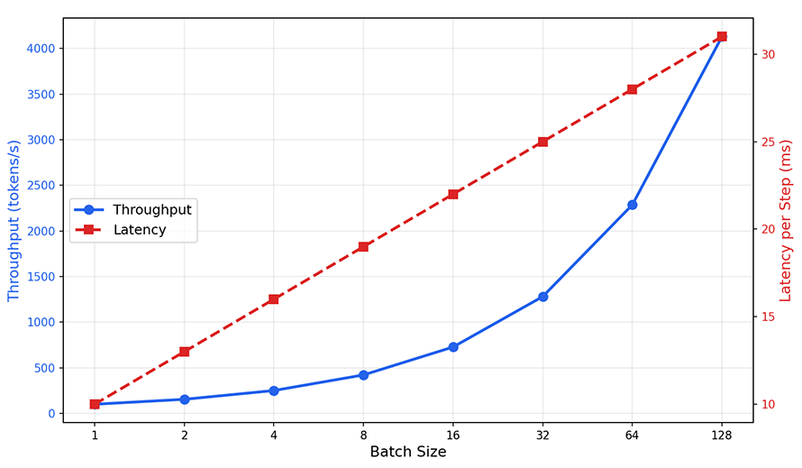
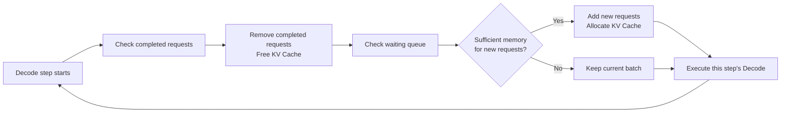
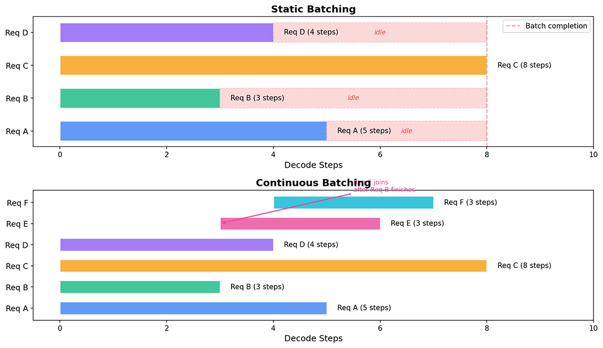

# Request Scheduling and Batching

In [Inference Efficiency Optimization](../../language-models/reasoning/inference-efficiency.md#inference-bottleneck-analysis), we learned how PagedAttention alleviates the memory wall by managing KV Cache in pages, allowing more requests to reside simultaneously on the GPU. However, as the number of requests grows, new problems arise: how do we decide which requests to process first and which later? When memory is insufficient, which request should be paused? When multiple requests share the same system prompt, how do we avoid redundant computation? These questions ultimately boil down to three aspects: **batching** (how to pack multiple requests into a single GPU computation), **request scheduling** (how to decide the processing order and resource allocation of requests), and **memory optimization** (how to reduce memory consumption and improve memory reuse).

## Principles of Batching

If you have experience with GPU programming, you are surely familiar with concepts like Single Instruction Multiple Threads (SIMT) and parallelism. In the CUDA programming model, the GPU organizes computation tasks into thread blocks, each containing hundreds of threads. All threads execute the same instructions but process different data. The GPU's compute units (CUDA Cores, Tensor Cores) are highly parallel by design, with the goal of processing large amounts of data simultaneously. When there are enough threads, the GPU's compute units are fully utilized and performance approaches its peak. When threads are too few, many compute units sit idle, resulting in resource waste and degraded performance.

The Decode phase of LLM inference falls into the latter category. Each Decode step generates only one token, with a computation scale roughly equivalent to a $(1 \times d) \times (d \times n)$ matrix multiplication, where computation is proportional to $d \cdot n$ (with $d$ being the hidden dimension). The Prefill phase, on the other hand, processes all $n$ input tokens at once, with a computation scale of $(n \times d) \times (d \times n)$ matrix multiplication proportional to $n^2 \cdot d$. The difference between the two is a factor of $n$. When the sequence length reaches thousands or even tens of thousands of tokens, the computation per Decode step becomes negligible compared to Prefill.

Batching refers to merging the same Decode step of multiple requests into a single matrix operation. Specifically, the Query vectors of $b$ requests are concatenated into a $b \times d$ matrix, and each request independently computes attention with its respective $d \times n$ Key matrix. The GPU's parallel compute units execute these computations simultaneously, effectively completing the attention computation for $b$ requests in parallel. The reason this merging yields significant performance gains lies in the computational characteristics of matrix multiplication. The computation of matrix multiplication $(b \times d) \times (d \times n)$ grows linearly with the batch size $b$, but the GPU execution time grows far less than linearly. The reason is that GPU compute units operate in parallel. When the batch size is small, compute units are not fully utilized, and increasing the batch size simply puts more units to work without increasing the burden on any individual unit. Only when the batch size is large enough and compute units are fully occupied does further increasing the batch size lead to linear growth in execution time. This phenomenon — where computation grows linearly but execution time grows sub-linearly — is called the **superlinear speedup effect** of batching. The following diagram simulates the trends in throughput and latency as batch size increases from 1 to 128.

*Figure: Throughput and latency curves as batch size varies in batching*

As shown in the graph, when the batch size grows from 1 to 32, throughput improves by approximately 20x, while per-step latency increases by only about 1.5x. This perfectly illustrates the superlinear speedup effect of batching. As the batch size continues to increase to 64 and 128, throughput still grows but at a slower rate, because the GPU's compute units are gradually being filled, and further increases in batch size begin to make execution time approach linear growth. This asymmetry between benefit and cost makes batching one of the primary optimization methods for inference services. However, the increase in latency cannot be completely ignored — longer response times per request can degrade the user experience. The choice of batch size is a trade-off between latency and throughput: real-time conversational scenarios favor smaller batches for low latency, while batch processing scenarios (such as document translation or data annotation) favor larger batches for high throughput. The inference service scheduler must find the right balance based on the scenario's requirements.

### Memory Constraints

In practice, the batch size is rarely limited by how many compute units can be filled; its upper bound is typically constrained by GPU memory capacity. Each additional request added to the batch requires allocating GPU memory for its KV Cache. In [Inference Efficiency Optimization](../../language-models/reasoning/inference-efficiency.md#inference-bottleneck-analysis), we already derived the GPU memory usage formula for KV Cache:

$$M_{\text{KV}} = 2 \times n_{\text{layer}} \times d_{\text{head}} \times n_{\text{head}} \times n_{\text{max}} \times b \times sizeof(\text{dtype})$$

The total GPU memory usage is the sum of the Key and Value caches across all layers, all tokens, and all requests. When the batch size $b$ increases, the GPU memory usage of the KV Cache also grows linearly. In [discussing Transformer architecture evolution](../../language-models/architecture-basics/architecture-evolution.md#kv-cache-optimization), we used LLaMA-2 70B on an A100 80GB as an example to calculate model weights and available KV Cache, finding that a single request's KV Cache is approximately 10 GB. This means that without PagedAttention, each GPU can only accommodate the KV Cache of one request, making it impossible to increase the batch size at all. [PagedAttention](../../language-models/reasoning/inference-efficiency.md#pagedattention) manages KV Cache in pages, improving GPU memory utilization from about 41% to nearly 100%, allowing each GPU to handle dozens of requests simultaneously. Nevertheless, GPU memory remains the upper bound constraint for batching. When the KV Cache of all active requests fills the available GPU memory, new requests must queue up.

Now, the design direction for batching is clear: within the limits of GPU memory, increase the batch size as much as possible to improve throughput. When GPU memory is insufficient, scheduling strategies determine which requests to process first, cache reuse reduces memory consumption, and preemption mechanisms free memory for more important requests. These are the topics to be discussed in the following sections.

### Static Batching

The most intuitive form of batching is **static batching**: collect a batch of requests, start Prefill for all of them simultaneously, then decode synchronously until all requests have finished generating, and return results together. This approach is simple to implement and logically clear — like a long-distance bus that departs only after all passengers have boarded and arrives at the destination where all passengers disembark together.

The drawback of static batching lies in the "disembark together" phase. In LLM inference, different requests have vastly different generation lengths. A request asking "What is 1+1?" might generate only 5 tokens, while a request asking "Explain in detail the basic principles of quantum mechanics" might generate 2000 tokens. In static batching, short requests cannot return results immediately after finishing generation; they must wait for the longest request in the batch to complete as well. Suppose a batch has 9 requests generating 50 tokens each and 1 request generating 500 tokens. The first 9 requests sit idle after finishing, wasting GPU resources. This phenomenon is called **tail padding**. The more uneven the request length distribution, the more severe the tail padding. In real-world conversational scenarios, request length distributions tend to exhibit a long-tail characteristic, where a few extremely long requests drag down overall efficiency.

### Continuous Batching

In 2022, a paper from Seoul National University titled *[Orca: A Distributed Serving System for Transformer-Based Generative Models](https://www.usenix.org/conference/osdi22/presentation/yu)* proposed continuous batching (also known as iteration-level scheduling), which fundamentally solves the tail padding problem of static batching. The scheduling granularity of continuous batching is refined from the entire request lifecycle to individual Decode steps (iteration-level refers to a single Decode step). Instead of waiting for all requests to complete before accepting new ones, after each Decode step, completed requests are removed from the batch and waiting new requests are added.

Continuous batching ensures that the GPU processes as many active requests as possible in each Decode step, eliminating the idle waste of static batching. Returning to the long-distance bus analogy, continuous batching is more like a bus route — passengers can board at any time and alight when they reach their stop, without waiting for others. The bus always has a full load of passengers, and capacity is fully utilized. The key to implementing continuous batching lies in iteration-level scheduling decisions. Before each Decode step, the scheduler needs to check which requests have completed, which waiting requests can be added, and whether current GPU memory is sufficient to accommodate the KV Cache of new requests. These three checks form the scheduling loop of continuous batching, as shown in the following diagram.

*Figure: Iteration-level scheduling flow of continuous batching*

vLLM is a representative framework implementing continuous batching. In vLLM, scheduling is performed before each Decode step: completed requests release KV Cache (blocks are reclaimed through PagedAttention's block allocator), and new requests are added when GPU memory permits, enabling uninterrupted batching. Experimental data from vLLM shows that on the ShareGPT dataset, continuous batching achieves 2-4x throughput improvement over static batching with lower latency, as illustrated below.

*Figure: Timing comparison between static batching and continuous batching*

Continuous batching does not come without cost. It requires executing scheduling logic at every Decode step, increasing the scheduling frequency by hundreds or thousands of times. Consequently, the scheduling overhead itself becomes a new concern. If scheduling takes 1ms and a single Decode step takes 10ms, the scheduling overhead accounts for 10%. This ratio becomes even more significant when the batch size is small and Decode steps are fast. There are two main engineering directions for reducing scheduling overhead. The first direction is **batch scheduling** — processing the addition and removal of multiple requests in a single scheduling pass rather than one by one. This is analogous to the batch processing of interrupts in operating systems, merging many small operations into one larger operation to amortize fixed costs. The second direction is **predictive scheduling** — predicting request completion times based on historical statistics and preparing to add new requests in advance. If the scheduler predicts that a request will complete in 3 steps, it can mark that request's KV Cache as about to be released ahead of time and pre-select a substitute request from the waiting queue.

Regardless of the optimization approach, scheduling costs will not disappear entirely, so scheduling frequency itself is an engineering decision. Scheduling every step certainly yields optimal resource utilization, but incurs the highest scheduling overhead. Scheduling every N steps reduces overhead, but completed requests may wait up to N-1 steps before being removed from the batch, and new requests may wait up to N steps before being added, resulting in lower resource utilization. In production systems, vLLM defaults to per-step scheduling because the memory efficiency gains from PagedAttention make the scheduling overhead relatively small compared to overall latency.

## Request Scheduling

Continuous batching solves the problem of when to add and remove requests, but it does not answer the question of "which request to add." When there are multiple requests in the waiting queue but only one slot available in the batch, the scheduler must make a choice. This kind of choice is easy in traditional web services but becomes particularly tricky in LLM inference. The reason lies in the conflict between the computational characteristics of Prefill and Decode. As mentioned several times in previous chapters, the Prefill phase processes all tokens of the input prompt, involves a large amount of computation, and is compute-intensive. The Decode phase generates only one token per step, involves little computation, and is memory-intensive. Yet these two phases must be logically bound together — when the scheduler decides to add a new request to the batch, it must first execute that request's Prefill to generate the initial KV Cache before it can begin Decode. A request with 2000 input tokens may take hundreds of milliseconds or even seconds for its Prefill, during which other requests in the batch that are decoding must wait, significantly increasing their latency.

This type of conflict does not exist in traditional CPU scheduling, because CPU time-slice switching costs are extremely low (microsecond level), whereas in LLM inference the cost of pausing Decode for Prefill is thousands of times higher (milliseconds to seconds). Therefore, the scheduling strategy for LLM inference cannot simply copy operating system algorithms; it must account for the differences in computational characteristics between Prefill and Decode. The scheduler's inputs include the waiting queue (queued requests and their attributes), the running set (requests currently being processed and their status), and resource status (GPU memory usage, KV Cache utilization of each GPU). The scheduling objective is to find a balance among latency (minimizing request queuing and execution times), throughput (maximizing token output per unit time), and fairness (avoiding indefinite postponement of certain requests). Common strategies include the following:

- **First Come First Served (FCFS)** orders requests by arrival time — first come, first served. Like a supermarket checkout queue, whoever comes first checks out first, with no queue-jumping allowed. The advantage of FCFS is natural fairness without starvation (a request never being indefinitely postponed). The disadvantage is that it completely ignores differences in request execution time. In LLM inference, a request with a long input executing Prefill temporarily blocks the Decode of the entire batch, forcing subsequent short requests to wait. Suppose there are 10 requests decoding in the batch, and the scheduler selects a new request with an input length of 2000 tokens to join the batch using FCFS. The Prefill of this new request takes about 500ms, during which all 10 decoding requests are paused, adding 500ms to each request's latency. If these are latency-sensitive real-time conversational users, this pause causes a perceptible degradation in experience.

- **Shortest Job First (SJF)** prioritizes requests with the shortest expected generation time, minimizing average waiting time. Imagine a supermarket checkout that lets customers with few items pay first — someone buying a bottle of water does not have to wait for someone with a full cart, and the overall waiting time is reduced. SJF is theoretically optimal (it gives the smallest average completion time when all job lengths are known), but in LLM inference, the generation length of a request is unknowable before execution. Two users asking the same question may receive responses of 50 tokens or 2000 tokens, which is completely unpredictable when the request arrives. To implement SJF, the inference service needs a generation length prediction mechanism. This could be based on historical statistics (using the average generation length of similar requests from the same API endpoint or user group as a predictor), or on signals in the user's prompt (a prompt containing "brief answer" suggests a shorter generation, while one containing "explain in detail" suggests a longer one). A relatively more accurate approach is to use a lightweight small model to predict generation length, which offers the highest accuracy but increases system complexity and scheduling latency.

- **Priority Scheduling** assigns priorities to requests, with higher-priority requests entering the batch first. Priority can be based on user tier, request type, SLA constraints, or various other factors. FCFS and SJF both assume all requests are equally important, which is not the case in reality. Paying users expect lower latency, internal services need more stable responses than external APIs, and real-time conversation has lower latency tolerance than batch processing. Priority scheduling also exists in operating systems, but in the inference service scenario, it is more complex and faces the issue of **priority inversion**. If a low-priority request is already occupying the GPU (its KV Cache has been allocated), and a high-priority request arrives but cannot immediately obtain resources, the low-priority request must be preempted and its resources released for the high-priority request. Specific strategies for resource preemption will be discussed in detail in [Preemption and Eviction Strategies](#preemption-and-eviction-strategies).

**Multi-Level Feedback Queue (MLFQ)** combines the fairness of FCFS, the efficiency of SJF, and the tiered handling of priority scheduling, making it a classic compromise among scheduling strategies. The idea is that new requests enter the highest-priority queue, and if a request's execution time exceeds the queue's time slice, it is demoted to the next queue level. This way, short requests complete quickly in the high-priority queue, while long requests are gradually demoted to lower-priority queues without occupying high-priority resources for extended periods. In traditional operating system scheduling, the time slice measures CPU time, but in LLM inference, a more natural metric is the number of tokens already generated. Requests that complete after generating few tokens (such as brief answers) finish quickly in the high-priority queue, while requests generating many tokens (such as long-form text generation) are gradually demoted. This adaptation allows MLFQ to automatically distinguish between short and long requests without relying on generation length prediction.

MLFQ requires consideration of the number of queue levels, the time slice size for each level, and the priority boost strategy. The number of queue levels determines how many tiers requests are divided into, typically 3-5 levels. Time slice sizes should be set based on the request length distribution, so that most short requests complete within the highest-priority queue. The priority boost strategy (periodically promoting all requests to the highest-priority queue) prevents starvation, ensuring that low-priority requests are not indefinitely delayed. In LLM inference, the interval for priority boosting is typically set to several tens of seconds, matching the average request lifecycle.

## Prefix Caching

Many inference requests share the same prefix, with the most typical example being [system prompts](../../language-models/pretraining/supervised-finetuning.md#system-prompt-design). A conversational service may use the same system prompt for all requests (e.g., "You are a helpful assistant. Please respond in Chinese."). A programming application may include unified tool descriptions, global project constraints, and so on for all requests. These prompts can be tens or hundreds of tokens long. Without optimization, each request independently computes and caches KV Cache for these identical prefixes, resulting in massive redundant computation and GPU memory waste.

**Prefix caching** ensures that the KV Cache for identical prefixes is computed only once, and subsequent requests directly reuse it. This has significant benefits in reducing Prefill computation (saving GPU compute), reducing KV Cache memory usage (saving GPU memory), and lowering time-to-first-token (TTFT) because the shared prefix Prefill is skipped. PagedAttention's block mechanism provides a natural implementation foundation for prefix caching. In [Inference Efficiency Optimization](../../language-models/reasoning/inference-efficiency.md#pagedattention), we learned that PagedAttention divides KV Cache into fixed-size blocks and maps logical addresses to physical addresses through a block table. Prefix caching simply requires requests sharing the same prefix to point to the same set of physical blocks. New requests only need to allocate blocks for new tokens, not for the prefix. PagedAttention's copy-on-write mechanism also provides safety guarantees for prefix caching. Although KV Cache is append-only and never modifies existing content — meaning copy-on-write is rarely triggered in prefix caching — the mechanism ensures that shared blocks are not corrupted even if a write need arises.

Unlike other caches, the objects of prefix caching are usually not explicitly specified by the caller. While it is possible to mark prefixes explicitly, doing so increases the caller's burden and cannot handle prefixes that are reusable but unmarked by the caller. In practice, **Automatic Prefix Caching (APC)** algorithms are generally used to determine cacheable prefixes, managed automatically by the server without explicit marking. vLLM's APC implementation manages prefix reuse through block-level reference counting. Each physical block maintains a reference count recording how many requests are using that block. When a new request's prefix block hash matches an existing block, the block is directly reused and its reference count is incremented. When a request completes, the reference count is decremented, and blocks with a reference count of zero are recycled. When a new inference request arrives, prefix caching determines whether the new request can share a prefix with existing requests by hashing the block content. Specifically, a hash is computed for the token sequence of each block, serving as an index for the KV Cache block. When a new request arrives, the hashes of its prefix blocks are computed. If the hashes of the first 10 blocks match, the KV Cache for these 160 tokens can be directly reused (assuming a block size of 16 tokens), and Prefill only needs to be performed for tokens starting from the 11th block onward.

Multi-turn conversation is the most typical application scenario for prefix caching. In a dialogue system, each turn's input includes the context from all previous turns (user messages and assistant responses), and the KV Cache for this context can be directly reused. Without prefix caching, the $k$-th turn requires Prefill of the entire context (system prompt + first $k-1$ turns of dialogue + the $k$-th turn user message), with Prefill time proportional to the total context length. With prefix caching, only the new user message needs Prefill — the KV Cache of existing tokens is directly reused — reducing Prefill time from $O(n_{\text{total}})$ to $O(n_{\text{new}})$.

DeepSeek V4, released in 2026, is a strong testament to the value of prefix caching. DeepSeek V4 is designed for million-token contexts and achieved a KV Cache hit rate of up to 98.7% in agentic workloads (multi-turn tool calls, multi-step reasoning chains), according to DeepSeek's official technical report. Such a high hit rate is determined by the characteristics of the scenario. For example, in coding scenarios, each turn appends only a few hundred tokens to a context that already contains tens of thousands or even hundreds of thousands of tokens, so over 98% of the KV Cache can be directly reused across turns without recomputation. Additionally, DeepSeek V4's [CSA/HCA hybrid attention](../../language-models/architecture-basics/architecture-evolution.md#hybrid-attention-architecture) architecture provides a more granular foundation for cache reuse. The KV Cache size of DeepSeek V4's context is significantly reduced compared to V3.2 — according to the official technical report, V4-Pro is about 1/9.5 of V3.2, and V4-Flash is about 1/13.7 of V3.2. This compression directly expands the capacity of reusable prefixes, allowing more requests to share the same set of physical blocks and further improving cache hit rates. To support larger concurrency, DeepSeek V4 also supports on-disk KV Cache storage, allowing CSA/HCA compressed KV Cache to be stored directly on SSD. When a new request hits a stored prefix, it reads and reuses it directly, only recomputing the uncompressed state of the trailing incomplete block.

The economic effect of cache reuse is directly reflected in API pricing. In DeepSeek V4 Flash's API pricing, cache-hit input is \$0.0028/1M tokens, while cache-miss input is \$0.14/1M tokens — input cost is reduced by about 50x when the cache is hit. This pricing structure amply demonstrates that a high cache hit rate is not just a technical metric but also a commercial competitive advantage.

Modern production inference services almost all rely on prefix caching. This design dictates that the KV Cache between dialogue turns must guarantee prefix consistency. If the generation result of an intermediate turn is modified — for example, in a coding scenario where the user edits tool listings, global prompts, or other information originally placed in the prefix cache (such as CLAUDE.md, AGENTS.md files) — the KV Cache of all subsequent turns is invalidated and must be recomputed from scratch during Prefill. This consistency requirement makes prefix cache management more complex than a simple LRU cache, requiring maintenance of dependency relationships between blocks. It also constrains the design space of agentic workloads — the prefix content should remain as stable as possible.

## Preemption and Eviction Strategies

Prefix caching reduces memory demand by reusing the KV Cache of shared prefixes. However, under high load, even with prefix caching, GPU memory may still be insufficient to simultaneously accommodate the KV Cache of all active requests. At this point, a choice must be made: pause certain requests to free memory for more important ones. This is the problem that **preemption** and **eviction** strategies aim to solve.

Preemption and eviction can be triggered by various situations: a new request arriving when memory is insufficient, a high-priority request requiring immediate execution, or GPU utilization being too low and requiring batch reorganization. **Preemption** copies the KV Cache of the preempted request from GPU memory to CPU memory, freeing GPU memory. When resuming, the KV Cache is copied back from CPU to GPU. In the previously mentioned DeepSeek V4 case, it can even be swapped to SSD storage. The advantage of this strategy is fast recovery — PCIe 4.0 x16 provides approximately 32 GB/s, PCIe 5.0 x16 provides approximately 64 GB/s, and copying a 1 GB KV Cache takes about 20ms. The disadvantage is that CPU memory space is required, and the copy process occupies PCIe bus bandwidth, potentially affecting data transfers for other requests. **Eviction** directly discards the KV Cache of the evicted request, re-executing Prefill when resuming. The advantage of this strategy is that no additional CPU memory is needed and implementation is simple. The disadvantage is high recovery cost — the computation of Prefill far exceeds the copy cost of the Swap operation in the preemption strategy. For a request with an input length of 2000 tokens, Prefill may take about 500ms, whereas swapping an equivalent KV Cache takes only about 20ms.

Which strategy to choose depends on the ratio between the preempted request's KV Cache size and its input length. When the KV Cache is large and the input is short, preemption is more cost-effective (copy cost is lower than recomputation cost). When the KV Cache is small and the input is long, direct eviction is more cost-effective (recomputation cost is lower than copy cost). Specifically, let $M_{\text{KV}}$ be the KV Cache size, $n_{\text{input}}$ be the input length, $S_{\text{prefill}}$ be the Prefill speed (token/s), and $B_{\text{PCIe}}$ be the PCIe bandwidth (GB/s). Then the recovery time for preemption is $M_{\text{KV}} / B_{\text{PCIe}}$, and the recovery time for eviction is $(n_{\text{input}} + n_{\text{generated}}) / S_{\text{prefill}}$. When $M_{\text{KV}} / B_{\text{PCIe}} < n_{\text{input}} / S_{\text{prefill}}$, preemption is superior; otherwise, eviction is superior.

The iteration-level scheduling of [continuous batching](#continuous-batching) provides numerous execution points for preemption and eviction strategies. After each Decode step, the scheduler can check whether preemption or eviction is needed without interrupting an executing Decode step. This design of switching only between steps prevents preemption and eviction operations from interfering with ongoing computations.

## Summary

Inference services do not face the optimization of individual requests in isolation, but rather the system engineering problem of how a massive number of concurrent requests share limited GPU resources. Batching leverages the parallel nature of matrix operations to complete multiple requests in a single GPU computation, trading a small amount of latency for several-fold or even dozens-fold improvement in throughput — this is the starting point for high-concurrency inference services. However, the tail padding problem of static batching exposes the heterogeneity among requests (different generation lengths, different input lengths, different priorities), and this heterogeneity means that a one-size-fits-all simple scheduling approach inevitably wastes resources. Continuous batching allows requests to enter and leave the batch freely at each iteration, fundamentally eliminating idle waiting. Prefix caching transforms redundant computation into direct hits by reusing the KV Cache of shared prefixes. Together, these technologies form a comprehensive resource management framework, enabling inference services to find a balance among latency, throughput, and fairness that matches the business scenario.

## Exercises

1. Suppose an inference service uses continuous batching, with a GPU Decode time of 15ms per step and a scheduling overhead of 0.5ms. If the scheduling frequency is changed from every step to every 5 steps, calculate the change in scheduling overhead ratio and the potential resource waste (estimated as the percentage increase in request completion latency).

   

   
Reference Answer

   With per-step scheduling, scheduling overhead ratio = 0.5 / 15 ≈ 3.3%. With scheduling every 5 steps, scheduling overhead ratio = 0.5 / (15 × 5) ≈ 0.67%, reduced to about 1/5 of the original.

   However, scheduling only once every 5 steps means that completed requests may wait up to 4 steps (about 60ms) before being removed from the batch, and new requests may wait up to 5 steps (about 75ms) before being added. Completed requests wait up to 4 extra steps (about 60ms) before being returned, which, relative to an average total latency of 500 tokens × 15ms = 7500ms, represents an increase of about 0.8%. For latency-sensitive scenarios, this increase is acceptable; for throughput-priority scenarios, reducing scheduling overhead is more valuable.

   

2. An inference service receives 10 requests simultaneously: 8 are expected to generate 100 tokens, and 2 are expected to generate 1000 tokens. Calculate the average completion time of the short requests under static batching and continuous batching, respectively (assuming per-step Decode time is independent of batch size and constant at 10ms).

   

   
Reference Answer

   Static batching: all requests start together and end together (determined by the longest request). Completion time = 1000 × 10ms = 10000ms. Average completion time of short requests = 10000ms (even though they actually finish generating in 1000ms, they must wait for the long requests).

   Continuous batching: short requests complete at 100 × 10ms = 1000ms and are removed from the batch. Average completion time of short requests = 1000ms. Long requests complete at 1000 × 10ms = 10000ms.

   Under continuous batching, the completion time of short requests is only 1/10 of that under static batching — this is the core advantage of continuous batching.

   

