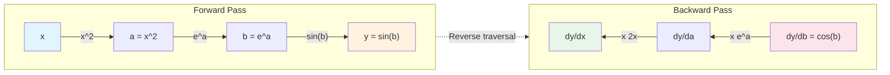

# Calculus Computation Practice

[Calculus Basics](../../maths/calculus/derivative.md) introduced the theoretical foundations from limits to differentiation, covering core concepts such as derivatives, gradients, and the chain rule. This chapter translates these theories into executable code, implementing numerical differentiation and gradient computation with NumPy, and introducing PyTorch's automatic differentiation mechanism. Hands-on practice not only deepens conceptual understanding but also cultivates the ability to solve real-world problems.

## Numerical Differentiation

**Numerical Differentiation** is a technique for approximating derivatives using numerical methods. Analytical differentiation yields exact derivative formulas, but in many practical scenarios, we can only obtain discrete sampled values of a function without its analytical expression—such as experimental measurements, black-box function outputs, complex simulation results, etc. In these cases, numerical differentiation becomes the only feasible approach.

The simplest numerical differentiation method is the **Forward Difference**. Based on the definition of the derivative: $f'(x) = \lim_{h \to 0} \frac{f(x + h) - f(x)}{h}$, if we take a very small $h$ (but not zero), we can approximate the derivative using the difference quotient: $f'(x) \approx \frac{f(x + h) - f(x)}{h}$, which is the forward difference formula. Here is the code implementation:

```python runnable
import numpy as np

def forward_difference(f, x, h=1e-5):
    """
    Compute numerical derivative using forward difference
    Parameters:
        f: function to differentiate
        x: point at which to evaluate the derivative
        h: step size (default 1e-5)
    Returns:
        approximate derivative value
    """
    return (f(x + h) - f(x)) / h

# Test: compute the derivative of f(x) = x^2 at x = 2
f = lambda x: x ** 2
x = 2

# Analytical derivative: f'(x) = 2x, at x = 2 it is 4
analytical = 2 * x

# Numerical derivative
numerical = forward_difference(f, x)

print(f"Function: f(x) = x^2")
print(f"Evaluation point: x = {x}")
print(f"Analytical derivative: {analytical}")
print(f"Numerical derivative (forward difference): {numerical:.6f}")
print(f"Absolute error: {abs(numerical - analytical):.2e}")
```

Although the forward difference is simple, its accuracy is limited. A more accurate method is the **Central Difference**, with the formula: $f'(x) \approx \frac{f(x + h) - f(x - h)}{2h}$. Unlike the forward difference, which uses only $x$ and $x + h$, the central difference centers on $x$, taking two symmetric points $x + h$ and $x - h$, and dividing their function value difference by $2h$. This symmetric sampling approach results in lower truncation error: the central difference has an error term of $O(h^2)$, while the forward difference has an error term of $\frac{h}{2}f''(x)$, i.e., $O(h)$ (derivation omitted). This means the central difference is one order of magnitude more accurate than the forward difference: when $h$ is reduced by a factor of 10, the forward difference error decreases by a factor of 10, while the central difference error decreases by a factor of 100. Here is the code implementation:

```python runnable
import numpy as np

def central_difference(f, x, h=1e-5):
    """
    Compute numerical derivative using central difference
    Parameters:
        f: function to differentiate
        x: point at which to evaluate the derivative
        h: step size (default 1e-5)
    Returns:
        approximate derivative value
    """
    return (f(x + h) - f(x - h)) / (2 * h)

def forward_difference(f, x, h=1e-5):
    return (f(x + h) - f(x)) / h

# Compare the accuracy of forward difference and central difference
f = lambda x: np.sin(x)
x = np.pi / 4  # 45 degrees

# Analytical derivative: f'(x) = cos(x)
analytical = np.cos(x)

# Numerical derivatives
forward = forward_difference(f, x)
central = central_difference(f, x)

print(f"Function: f(x) = sin(x)")
print(f"Evaluation point: x = pi/4 = {x:.4f}")
print(f"Analytical derivative: {analytical:.6f}")
print(f"Forward difference: {forward:.6f}, error: {abs(forward - analytical):.2e}")
print(f"Central difference: {central:.6f}, error: {abs(central - analytical):.2e}")
print(f"\nCentral difference error is approximately {abs(forward - analytical) / abs(central - analytical):.1f} times smaller than forward difference")
```

## Computing Gradients

The discussion of numerical differentiation serves as a foundation for computing gradients. A gradient is a vector composed of the partial derivatives of a multivariate function with respect to each of its variables. For numerical computation, we can still adopt the approach of "locking" other variables while differentiating with respect to only one variable, thereby transforming the problem of finding partial derivatives of a multivariate function into finding derivatives of a univariate function, applying either forward difference or central difference methods.

Consider a concrete example: let $f(x_1, x_2, \ldots, x_n)$ be an $n$-variate function, and we want to compute its gradient at the point $\mathbf{x} = (x_1, x_2, \ldots, x_n)$. The $i$-th component of the gradient is the partial derivative $\frac{\partial f}{\partial x_i}$. According to the central difference formula, we can approximate it as:

$$\frac{\partial f}{\partial x_i} \approx \frac{f(x_1, \ldots, x_i + h, \ldots, x_n) - f(x_1, \ldots, x_i - h, \ldots, x_n)}{2h}$$

For conciseness, we use the [standard basis vector $\mathbf{e}_i$](../../maths/linear/vectors.md#basis-orthogonal-basis-and-orthonormal-basis) to describe the operation of "changing only the $i$-th variable." Thus, $\mathbf{x} + h\mathbf{e}_i$ represents "add $h$ to the $i$-th component of $\mathbf{x}$ while keeping all other components unchanged," which is exactly the perturbation we need. The gradient formula can then be concisely written as:

$$\frac{\partial f}{\partial x_i} \approx \frac{f(\mathbf{x} + h \mathbf{e}_i) - f(\mathbf{x} - h \mathbf{e}_i)}{2h}$$

Applying this formula to all directions of the multivariate function, the entire gradient vector is obtained by computing each partial derivative in turn:

$$\nabla f(\mathbf{x}) = \left(\frac{\partial f}{\partial x_1}, \frac{\partial f}{\partial x_2}, \ldots, \frac{\partial f}{\partial x_n}\right)$$

The following code implements gradient computation. As can be seen from the code, computing an $n$-dimensional gradient requires $2n$ function calls (two function calls per partial derivative), making the computational cost significantly higher than for univariate functions. In fact, for both convenience and performance, in practical machine learning scenarios, people typically use [automatic differentiation](#automatic-differentiation) rather than numerical differentiation to compute gradients. Nevertheless, understanding the principle of numerical differentiation remains essential.

```python runnable
import numpy as np

def numerical_gradient(f, x, h=1e-5):
    """
    Compute the gradient of a multivariate function (central difference method)
    Parameters:
        f: multivariate function that accepts a numpy array as input
        x: point at which to evaluate the gradient (numpy array)
        h: step size
    Returns:
        gradient vector (numpy array)
    """
    grad = np.zeros_like(x, dtype=float)
    n = len(x)

    for i in range(n):
        # Create unit vector e_i
        e_i = np.zeros(n)
        e_i[i] = 1

        # Central difference to compute partial derivative
        grad[i] = (f(x + h * e_i) - f(x - h * e_i)) / (2 * h)
    return grad

# Test: compute the gradient of f(x,y) = x^2 + y^2 at (3, 4)
def f(xy):
    x, y = xy
    return x ** 2 + y ** 2

x = np.array([3.0, 4.0])

# Analytical gradient: grad f = (2x, 2y) = (6, 8)
analytical_grad = np.array([2 * x[0], 2 * x[1]])

# Numerical gradient
numerical_grad = numerical_gradient(f, x)

print(f"Function: f(x, y) = x^2 + y^2")
print(f"Evaluation point: ({x[0]}, {x[1]})")
print(f"Analytical gradient: {analytical_grad}")
print(f"Numerical gradient: {numerical_grad}")
print(f"Error: {np.linalg.norm(numerical_grad - analytical_grad):.2e}")
```

## Chain Rule Differentiation

In this section, we will use the chain rule to differentiate composite functions. For a univariate composite function $y = f(g(x))$, it can be decomposed into two layers: the inner function $u = g(x)$ maps the input $x$ to the intermediate variable $u$, and the outer function $y = f(u)$ maps the intermediate variable to the final output. When we need to compute $\frac{dy}{dx}$, we first compute the "local derivatives" of each layer, $\frac{dy}{du}$ and $\frac{du}{dx}$, and then "chain" them together:

$$\frac{dy}{dx} = \frac{dy}{du} \cdot \frac{du}{dx} = f'(u) \cdot g'(x)$$

A small change $\Delta x$ in $x$ is first amplified (or reduced) by $g$ to $\Delta u = g'(x) \Delta x$, then amplified (or reduced) by $f$ to $\Delta y = f'(u) \Delta u$, with the total amplification factor being the product of the two individual amplification factors. When implementing the chain rule in code, we need to provide the outer function, the inner function, and their respective derivatives, then sequentially compute the function values and derivative values.

```python runnable
import numpy as np

# Central difference method for numerical derivative
def central_difference(f, x, h=1e-5):
    return (f(x + h) - f(x - h)) / (2 * h)

# Compute the derivative of a composite function using the chain rule
def chain_rule_1d(outer_f, outer_df, inner_g, inner_dg, x):
    # Forward pass
    u = inner_g(x)  # Inner function value
    y = outer_f(u)  # Outer function value

    # Backward pass (chain rule)
    dy_du = outer_df(u)  # Derivative of outer function w.r.t. intermediate variable
    du_dx = inner_dg(x)  # Derivative of inner function w.r.t. input
    dy_dx = dy_du * du_dx  # Chain rule

    return y, dy_dx

# Example: y = sin(x^2)
outer_f = np.sin
outer_df = np.cos
inner_g = lambda x: x ** 2
inner_dg = lambda x: 2 * x

x = 1.5
y, dy_dx = chain_rule_1d(outer_f, outer_df, inner_g, inner_dg, x)

# Verification
numerical = central_difference(lambda x: np.sin(x ** 2), x)

print(f"Composite function: y = sin(x^2)")
print(f"x = {x}")
print(f"Function value: {y:.6f}")
print(f"Analytical derivative (chain rule): {dy_dx:.6f}")
print(f"Numerical derivative: {numerical:.6f}")
print(f"Error: {abs(dy_dx - numerical):.2e}")
```

## Automatic Differentiation

Whether using numerical differentiation to compute derivatives or manually implementing the chain rule, the process is tedious and error-prone. Numerical differentiation also requires calling the function twice per variable, which is computationally inefficient. The machine learning framework PyTorch provides **Automatic Differentiation** (autodiff), which enables automatic, accurate, and efficient gradient computation.

The idea behind automatic differentiation is entirely different from numerical differentiation and [symbolic differentiation](https://en.wikipedia.org/wiki/Computer_algebra) (which is not covered in this section due to space constraints). Numerical differentiation approximates derivatives using difference quotients, introducing truncation and rounding errors. Symbolic differentiation attempts to derive analytical derivative expressions but is prone to expression swell. Automatic differentiation, on the other hand, is based on a simple yet profound idea: any complex function is composed of basic operations (addition, subtraction, multiplication, division, sin, cos, exp, etc.), and the derivatives of these basic operations are all known. Automatic differentiation traces the computation process and applies the chain rule to compute derivatives layer by layer, ensuring numerical accuracy (identical to analytical derivatives) while avoiding expression swell.

Automatic differentiation has two main modes: **Forward Mode** and **Reverse Mode**. Forward mode propagates derivatives from input to output, suitable for scenarios with few input variables and many output variables. Reverse mode propagates derivatives from output to input, suitable for scenarios with many input variables and few output variables. In deep learning, the number of neural network parameters (input variables) is typically much larger than the number of loss functions (output variables), making reverse mode more efficient. PyTorch uses reverse-mode automatic differentiation.

PyTorch uses a **Dynamic Computational Graph** to automatically record computation processes. When we perform operations on tensors, PyTorch automatically constructs a directed acyclic graph, where nodes represent variables or operations, and edges represent data flow. Taking $y = \sin(e^{x^2})$ as an example, the computation graph starts from the input $x$, first applies squaring to obtain $a = x^2$, then exponentiation to obtain $b = e^a$, and finally the sine operation to obtain $y = \sin(b)$. During backpropagation, the computation graph is traversed in reverse, starting from $y$, sequentially computing $\frac{\partial y}{\partial b} = \cos(b)$, $\frac{\partial b}{\partial a} = e^a$, $\frac{\partial a}{\partial x} = 2x$, and finally multiplying them together according to the chain rule to obtain $\frac{\partial y}{\partial x} = \cos(b) \cdot e^a \cdot 2x$. The entire process is fully automated, requiring no manual derivative code from the user.


*Figure: Computational graph structure and backpropagation process for $y = \sin(e^{x^2})$*

The following code demonstrates the basic usage of PyTorch's automatic differentiation:

```python runnable
import torch
# Create a tensor that requires gradient tracking
x = torch.tensor([0.5], requires_grad=True)

# Define the computation process (automatically builds the computation graph)
a = x ** 2
b = torch.exp(a)
y = torch.sin(b)
# Backpropagation
y.backward()

print("=== PyTorch Automatic Differentiation ===")
print(f"x = {x.item():.6f}")
print(f"a = x^2 = {a.item():.6f}")
print(f"b = e^a = {b.item():.6f}")
print(f"y = sin(b) = {y.item():.6f}")
print(f"\nAutomatically computed gradient dy/dx = {x.grad.item():.6f}")

# Compare with NumPy numerical derivative
import numpy as np

# Central difference method for numerical derivative
def central_difference(f, x, h=1e-5):
    return (f(x + h) - f(x - h)) / (2 * h)

numerical = central_difference(lambda x: np.sin(np.exp(x ** 2)), 0.5)
print(f"Numerical derivative = {numerical:.6f}")
print(f"Error = {abs(x.grad.item() - numerical):.2e}")
```

The following experiment demonstrates using PyTorch to automatically differentiate the bivariate function $f(x,y) = x^2 + 2xy + y^2$. We will compute the function value at the point $(1, 2)$, then obtain the partial derivatives $\frac{\partial f}{\partial x}$ and $\frac{\partial f}{\partial y}$ via backpropagation, and verify against the analytical solution.

```python runnable
import torch

# Define a bivariate function: f(x,y) = x^2 + 2xy + y^2
x = torch.tensor([1.0], requires_grad=True)
y = torch.tensor([2.0], requires_grad=True)

# Forward pass
f = x ** 2 + 2 * x * y + y ** 2

print("Function: f(x,y) = x^2 + 2xy + y^2")
print(f"Evaluation point: (x={x.item()}, y={y.item()})")
print(f"Function value: {f.item():.6f}")

# Backpropagation
f.backward()

# Get gradients
print(f"\nPartial derivative df/dx = {x.grad.item():.6f} (analytical: {2*1 + 2*2:.6f})")
print(f"Partial derivative df/dy = {y.grad.item():.6f} (analytical: {2*1 + 2*2:.6f})")

# Analytical gradient: df/dx = 2x + 2y, df/dy = 2x + 2y
analytical_grad_x = 2 * 1 + 2 * 2
analytical_grad_y = 2 * 1 + 2 * 2

print(f"\nGradient verification:")
print(f"  df/dx error: {abs(x.grad.item() - analytical_grad_x):.2e}")
print(f"  df/dy error: {abs(y.grad.item() - analytical_grad_y):.2e}")
```

## Summary

This chapter translated calculus theories into executable code, building a bridge from mathematical concepts to program implementations.

- Numerical differentiation reveals that the computational essence of derivatives is approximating infinite limits with finite difference quotients. The central difference achieves higher accuracy than the forward difference because symmetric sampling reduces truncation error.
- Gradient computation extends univariate derivatives to multivariate functions, achieving numerical partial derivative computation by perturbing each component in sequence.
- The programmatic implementation of the chain rule demonstrates a structured approach to composite function differentiation: forward propagation computes function values, while backward propagation chains together the derivatives of each layer.
- Automatic differentiation fully automates these tedious operations. PyTorch tracks computation processes through a dynamic computational graph and automatically applies the chain rule during backpropagation, ensuring numerical accuracy while avoiding manual derivation errors.

These techniques form the computational foundation of machine learning. Understanding these underlying mechanisms not only aids in debugging and optimizing models but also provides a fundamental grasp of how deep learning works.

## Exercises

1. Implement a function that uses the central difference method to compute the derivative of $f(x) = x^3$ at 100 evenly spaced points over the interval $[-2, 2]$, and plot the function and its derivative.
    <details>
    <summary>Reference Answer</summary>

    ```python runnable
    import numpy as np
    import matplotlib.pyplot as plt

    def central_difference(f, x, h=1e-5):
        return (f(x + h) - f(x - h)) / (2 * h)

    # Define the function
    f = lambda x: x ** 3
    df_analytical = lambda x: 3 * x ** 2  # Analytical derivative

    # Evaluation points
    x = np.linspace(-2, 2, 100)
    y = f(x)
    dy_numerical = central_difference(f, x)
    dy_analytical = df_analytical(x)

    # Plotting
    fig, axes = plt.subplots(1, 2, figsize=(12, 4))

    axes[0].plot(x, y, 'b-', label='f(x) = x^3')
    axes[0].set_xlabel('x')
    axes[0].set_ylabel('f(x)')
    axes[0].set_title('Original Function')
    axes[0].legend()
    axes[0].grid(True)

    axes[1].plot(x, dy_numerical, 'r--', label='Numerical Derivative')
    axes[1].plot(x, dy_analytical, 'g-', label='Analytical Derivative')
    axes[1].set_xlabel('x')
    axes[1].set_ylabel("f'(x)")
    axes[1].set_title('Derivative Comparison')
    axes[1].legend()
    axes[1].grid(True)

    plt.tight_layout()
    plt.show()

    # Compute error
    error = np.max(np.abs(dy_numerical - dy_analytical))
    print(f"Maximum error: {error:.2e}")
    ```
    </details>

2. Write a general gradient check function that can verify whether the gradient computation of any multivariate function is correct.
    <details>
    <summary>Reference Answer</summary>

    ```python runnable
    import numpy as np

    def gradient_check(f, grad_f, x, h=1e-5, tol=1e-6):
        """
        Verify the correctness of gradient computation for a multivariate function

        Parameters:
            f: original function
            grad_f: gradient function
            x: test point (numpy array)
            h: step size for numerical differentiation
            tol: tolerance

        Returns:
            (passed, max_relative_error)
        """
        n = len(x)
        numerical_grad = np.zeros(n)

        # Compute numerical gradient
        for i in range(n):
            e_i = np.zeros(n)
            e_i[i] = 1
            numerical_grad[i] = (f(x + h * e_i) - f(x - h * e_i)) / (2 * h)

        # Compute analytical gradient
        analytical_grad = grad_f(x)

        # Compute relative error
        diff = np.abs(numerical_grad - analytical_grad)
        norm = np.maximum(np.abs(numerical_grad), np.abs(analytical_grad))
        relative_error = diff / (norm + 1e-10)  # Avoid division by zero

        max_error = np.max(relative_error)
        passed = max_error < tol

        return passed, max_error

    # Test
    def f(xy):
        x, y = xy
        return x ** 2 * y + x * y ** 2

    def grad_f(xy):
        x, y = xy
        return np.array([2 * x * y + y ** 2, x ** 2 + 2 * x * y])

    x = np.array([1.5, 2.0])
    passed, error = gradient_check(f, grad_f, x)
    print(f"Gradient check: {'Passed' if passed else 'Failed'}")
    print(f"Maximum relative error: {error:.2e}")
    ```
    </details>
