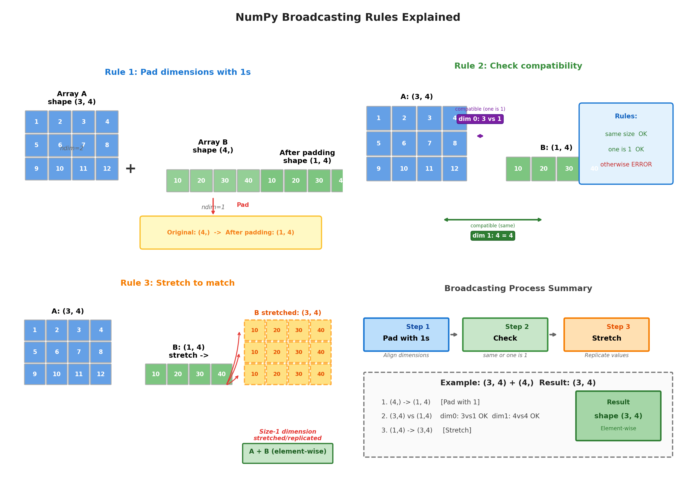

# Data Processing Practice

NumPy (Numerical Python) is the most popular library for scientific computing in Python, providing efficient multi-dimensional array objects and a rich set of mathematical functions. This chapter will walk through common NumPy operations through a series of hands-on examples, helping readers deepen their understanding of vectors, matrices, and tensors introduced earlier, while also building the programming foundation for subsequent machine learning algorithms and model training.

## NumPy Arrays

### Creating Arrays from Lists

The core of NumPy is the `ndarray` (N-Dimensional Array) object, i.e., multi-dimensional arrays. Its design intent is to solve the performance bottleneck of Python's native lists in scientific computing. Native lists store object pointers and require iteration for each operation, resulting in poor efficiency. `ndarray`, through homogeneous data types and contiguous memory layout, enables batch numerical operations to achieve execution efficiency close to that of C, while maintaining Python's concise syntax. The key design points of `ndarray` include:
- **Homogeneity**: All elements in an array must be of the same data type (e.g., all `float64` or all `int32`), which ensures each element occupies a fixed memory size, enabling direct element access via offset calculation.
- **Multi-dimensional indexing**: Supports arrays of arbitrary dimensions, with the `shape` attribute describing the size of each dimension and `ndim` indicating the number of dimensions.
- **Vectorized operations**: Mathematical operations on entire arrays require no explicit loops; the underlying implementation automatically leverages SIMD instructions for acceleration.
- **View mechanism**: Slicing returns a view of the original array rather than a copy, avoiding unnecessary data duplication.

The simplest way to create an array is from a Python list:

```python runnable
import numpy as np

# 1D array
arr1d = np.array([1, 2, 3, 4, 5])
print(f"1D array: {arr1d}")
print(f"Type: {type(arr1d)}")

# 2D array (matrix)
arr2d = np.array([
    [1, 2, 3],
    [4, 5, 6]
])
print(f"2D array:\n{arr2d}")

# 3D array
arr3d = np.array([
    [[1, 2], [3, 4]],
    [[5, 6], [7, 8]]
])
print(f"3D array shape: {arr3d.shape}")  # (2, 2, 2)
```

### Creating Special Arrays

In addition to creating arrays from lists, NumPy provides various functions for creating special arrays. Here are commonly used ones:

#### 1. `np.zeros()` - Zero-filled Array

Creates an array where all elements are 0, commonly used for pre-allocating result arrays or initializing weights.

```python runnable
import numpy as np

zeros = np.zeros((3, 4))  # 3x4 zero-filled matrix
print(f"zeros:\n{zeros}")
```

#### 2. `np.ones()` - One-filled Array

Creates an array where all elements are 1, commonly used in broadcast multiplication and statistical computations.

```python runnable
import numpy as np

ones = np.ones((2, 3))  # 2x3 one-filled matrix
print(f"ones:\n{ones}")
```

#### 3. `np.eye()` - Identity Matrix

Creates an identity matrix with 1s on the main diagonal and 0s elsewhere, serving as the multiplicative identity in matrix operations.

```python runnable
import numpy as np

eye = np.eye(4)  # 4x4 identity matrix
print(f"Identity matrix:\n{eye}")
```

#### 4. `np.empty()` - Uninitialized Array

Creates an uninitialized array — allocates memory without filling values, which is the fastest option. Suitable when the array will be immediately overwritten.

```python runnable
import numpy as np

empty = np.empty((2, 2))  # Content is uninitialized, values are arbitrary
print(f"Empty array:\n{empty}")
```

#### 5. `np.arange()` - Arithmetic Progression

Creates an arithmetic progression within a specified range (similar to Python's `range()`), suitable for integer indexing.

```python runnable
import numpy as np

arange_arr = np.arange(0, 10, 2)  # [0, 2, 4, 6, 8]
print(f"arange: {arange_arr}")
```

#### 6. `np.linspace()` - Evenly Spaced Sequence

Creates evenly spaced values over a specified interval, including endpoints, suitable for continuous sampling.

```python runnable
import numpy as np

linspace_arr = np.linspace(0, 1, 5)  # [0, 0.25, 0.5, 0.75, 1]
print(f"linspace: {linspace_arr}")
```

#### 7. `np.diag()` - Diagonal Matrix

Creates a diagonal matrix from a vector, or extracts the diagonal elements of a matrix.

```python runnable
import numpy as np

diag = np.diag([1, 2, 3])  # Diagonal elements are 1, 2, 3
print(f"Diagonal matrix:\n{diag}")
```

### Random Array Generation

Machine learning often requires generating random data. NumPy provides a rich set of random number generation functions, with the following commonly used ones:

#### 1. `np.random.rand()` - Uniform Distribution [0, 1)

Generates random arrays of a specified shape with elements uniformly distributed in [0, 1), commonly used for weight initialization and generating random samples.

```python runnable
import numpy as np

rand_arr = np.random.rand(2, 3)  # 2x3 random matrix
print(f"Uniform distribution:\n{rand_arr}")
```

#### 2. `np.random.randn()` - Standard Normal Distribution

Generates random arrays from a standard normal distribution (mean 0, variance 1), commonly used for generating Gaussian noise and weight initialization.

```python runnable
import numpy as np

randn_arr = np.random.randn(2, 3)  # Mean 0, variance 1
print(f"Normal distribution:\n{randn_arr}")
```

#### 3. `np.random.randint()` - Random Integers

Generates random integers within a specified range, suitable for generating discrete random indices and classification labels.

```python runnable
import numpy as np

randint_arr = np.random.randint(0, 10, (2, 3))  # Integers in [0, 10)
print(f"Random integers:\n{randint_arr}")
```

#### 4. `np.random.normal()` - Normal Distribution (Custom Parameters)

Generates random numbers from a normal distribution with specified mean and standard deviation, offering greater flexibility for custom parameter initialization.

```python runnable
import numpy as np

normal_arr = np.random.normal(loc=0, scale=1, size=(2, 3))
print(f"Custom normal distribution:\n{normal_arr}")
```

#### 5. `np.random.shuffle()` - Random Shuffle

Randomly shuffles array elements in-place, commonly used for random reordering of datasets. Modifies the original array directly without returning a new array.

```python runnable
import numpy as np

arr = np.array([1, 2, 3, 4, 5])
np.random.shuffle(arr)
print(f"After shuffle: {arr}")
```

#### 6. `np.random.choice()` - Random Selection

Randomly draws elements from a given array, with control over whether sampling is with or without replacement. Suitable for data sampling and batch selection.

```python runnable
import numpy as np

choices = np.random.choice([1, 2, 3, 4, 5], size=3, replace=False)
print(f"Random choice: {choices}")
```

### Basic Array Attributes

Every NumPy array has basic attributes that describe its structure and memory footprint. Understanding these attributes helps us accurately grasp how data is organized:

- **shape**: A tuple representing the size of the array in each dimension. For example, `(2, 2, 3)` indicates a 3D array with 2 elements in the first dimension, 2 in the second, and 3 in the third.
- **ndim**: The number of axes (dimensions) of the array, numerically equal to `len(shape)`.
- **dtype**: The data type of the array elements, such as `int64`, `float32`, etc. NumPy arrays require all elements to be of the same type, which is the foundation of their efficient computation.
- **size**: The total number of elements in the array, equal to the product of all components of `shape`.
- **itemsize**: The memory size (in bytes) of a single element, determined by `dtype`.
- **nbytes**: The total memory size (in bytes) occupied by the entire array, equal to `size x itemsize`.

```python runnable
import numpy as np

arr = np.array([
    [[1, 2, 3], [4, 5, 6]],
    [[7, 8, 9], [10, 11, 12]]
])

print(f"Array:\n{arr}")
print(f"Shape: {arr.shape}")    # (2, 2, 3)
print(f"ndim: {arr.ndim}")      # 3
print(f"dtype: {arr.dtype}")    # int64
print(f"Size: {arr.size}")      # 12
print(f"Itemsize: {arr.itemsize}")  # 8
print(f"nbytes: {arr.nbytes}")  # 96
```

### Data Type Conversion

NumPy provides rich data type support. Choosing an appropriate data type can optimize memory usage and computational performance while maintaining precision. Data type selection is an important trade-off in numerical computation.

**Specifying Data Types:**

- **At creation time**: Explicitly declare the type via the `dtype` parameter, e.g., `np.float32`, `np.int64`, etc.
- **Post-creation conversion**: Use the `astype()` method to convert the array to another type. Note that this may cause data truncation or precision loss.

**Common Data Type Categories:**

- **Integer types**: `int8`, `int16`, `int32`, `int64`, occupying 1, 2, 4, 8 bytes respectively, with increasing numeric ranges.
- **Unsigned integers**: `uint8` through `uint64`, representing only non-negative numbers, offering a larger positive range with the same byte count.
- **Floating-point types**: `float32` (single precision) and `float64` (double precision); the latter offers higher precision but uses twice the memory.
- **Boolean type**: `bool`, storing only True/False, the most memory-efficient type.

```python runnable
import numpy as np

# Specifying type at creation
arr_float = np.array([1, 2, 3], dtype=np.float32)
print(f"Float array: {arr_float}, dtype: {arr_float.dtype}")

# Type conversion
arr_int = arr_float.astype(np.int32)
print(f"Integer array: {arr_int}, dtype: {arr_int.dtype}")

# Common data types
print("\nCommon data types:")
print(f"bool: {np.array([True, False]).dtype}")
print(f"int8: {np.array([1], dtype=np.int8).dtype}")
print(f"int32: {np.array([1], dtype=np.int32).dtype}")
print(f"int64: {np.array([1], dtype=np.int64).dtype}")
print(f"float32: {np.array([1.0], dtype=np.float32).dtype}")
print(f"float64: {np.array([1.0], dtype=np.float64).dtype}")
```

## Indexing and Slicing

### 1D Array Indexing

Indexing and slicing are fundamental operations for accessing array elements. NumPy arrays support Python's list indexing syntax and extend it to multi-dimensional arrays.

- **Forward indexing**: Starting from 0, e.g., `arr[0]` accesses the first element
- **Backward indexing**: Starting from -1 for the last element, e.g., `arr[-1]`
- **Slicing**: Using the `[start:end:step]` syntax to specify start position, end position, and step size
- **Reversing arrays**: Use `[::-1]` to quickly reverse the array order

```python runnable
import numpy as np

arr = np.array([10, 20, 30, 40, 50])

print(f"Array: {arr}")
print(f"arr[0]: {arr[0]}")    # First element
print(f"arr[-1]: {arr[-1]}")  # Last element
print(f"arr[1:4]: {arr[1:4]}")  # Slice [20, 30, 40]
print(f"arr[::2]: {arr[::2]}")  # Step size 2 [10, 30, 50]
print(f"arr[::-1]: {arr[::-1]}")  # Reverse
```

### Multi-dimensional Array Indexing

Multi-dimensional arrays use comma-separated indices for each dimension, with the syntax `arr[row, col]`. This indexing approach is more efficient than nested list style `arr[row][col]` and supports accessing multiple dimensions simultaneously.

- **Full indexing**: `arr[i, j]` accesses a single element at row i, column j
- **Row slicing**: `arr[i]` accesses all elements of row i (omitting subsequent dimensions)
- **Column slicing**: `arr[:, j]` uses `:` to access all rows of column j
- **Sub-matrix**: `arr[row_start:row_end, col_start:col_end]` extracts a 2D slice

```python runnable
import numpy as np

arr = np.array([
    [1, 2, 3, 4],
    [5, 6, 7, 8],
    [9, 10, 11, 12]
])

print(f"Array shape: {arr.shape}")  # (3, 4)
print(f"arr[0, 1]: {arr[0, 1]}")    # Row 0, column 1: 2
print(f"arr[1]: {arr[1]}")          # Row 1: [5, 6, 7, 8]
print(f"arr[:, 0]: {arr[:, 0]}")    # Column 0: [1, 5, 9]
print(f"arr[0:2, 1:3]:\n{arr[0:2, 1:3]}")  # Sub-matrix
# [[2 3]
#  [6 7]]
```

### Slice Operations

Slicing is an important operation for obtaining subsets of an array. Unlike Python lists, NumPy slicing returns a **view** rather than a copy, meaning the slice and the original array share memory — modifying the view affects the original array. Slice operations have the following characteristics:

- **View mechanism**: Slicing does not copy data; it creates a new reference view, which is memory-efficient
- **Data sharing**: Modifying data through a view directly reflects in the original array
- **Explicit copy**: To obtain an independent copy, call the `.copy()` method

```python runnable
import numpy as np

arr = np.array([[1, 2, 3], [4, 5, 6], [7, 8, 9]])

# Obtain sub-matrix (view)
sub = arr[:2, 1:]
print(f"Sub-matrix:\n{sub}")

# Modifying the view affects the original array
sub[0, 0] = 100
print(f"Original array after modification:\n{arr}")
# [[  1 100   3]
#  [  4   5   6]
#  [  7   8   9]]

# To get a copy, use copy()
arr = np.array([[1, 2, 3], [4, 5, 6], [7, 8, 9]])
sub_copy = arr[:2, 1:].copy()
sub_copy[0, 0] = 100
print(f"Original array unchanged after using copy():\n{arr}")
```

### Boolean Indexing

Boolean indexing is a powerful conditional filtering mechanism that selects elements satisfying specific conditions through a boolean mask. This indexing approach avoids explicit loops and is an important part of vectorized programming. Boolean indexing supports the following usage patterns:

- **Creating a mask**: Generate a boolean array via a conditional expression (e.g., `arr > 5`)
- **Applying the index**: Use the boolean array as an index to return elements at positions where the value is `True`
- **Compound conditions**: Combine multiple conditions using `&` (and), `|` (or), `~` (not), noting that parentheses are required

```python runnable
import numpy as np

arr = np.array([1, 2, 3, 4, 5, 6, 7, 8, 9, 10])

# Create boolean mask
mask = arr > 5
print(f"Boolean mask: {mask}")

# Apply boolean indexing
print(f"Elements greater than 5: {arr[mask]}")

# Use condition directly in index
print(f"Even numbers: {arr[arr % 2 == 0]}")

# Compound conditions
print(f"Greater than 3 and less than 8: {arr[(arr > 3) & (arr < 8)]}")

# Boolean indexing on multi-dimensional arrays
matrix = np.array([[1, 2, 3], [4, 5, 6], [7, 8, 9]])
print(f"Elements greater than 5: {matrix[matrix > 5]}")
```

### Fancy Indexing

Fancy indexing uses integer arrays as indices, allowing flexible selection of elements at arbitrary positions. Unlike slicing, fancy indexing always returns a copy of the data, not a view. Fancy indexing includes the following common patterns:

- **1D indexing**: Use an index array to select elements at specific positions, e.g., `arr[[0, 2, 4]]` selects the 0th, 2nd, and 4th elements
- **Negative indexing**: Supports negative indices, e.g., `arr[[0, -1]]` selects the first and last elements
- **Multi-dimensional indexing**: Use two index arrays to specify rows and columns simultaneously, selecting elements at the intersection positions
- **np.ix_**: Creates an indexer for Cartesian product indexing, selecting a sub-matrix formed by specified rows and columns

```python runnable
import numpy as np

arr = np.array([10, 20, 30, 40, 50])

# Using an index array
indices = [0, 2, 4]
print(f"Elements at indices {indices}: {arr[indices]}")

# Using negative indices
print(f"arr[[0, -1]]: {arr[[0, -1]]}")  # First and last

# Multi-dimensional fancy indexing
matrix = np.array([
    [1, 2, 3],
    [4, 5, 6],
    [7, 8, 9]
])

# Select specific rows
print(f"Rows 0 and 2:\n{matrix[[0, 2]]}")

# Select elements at specific positions
rows = [0, 1, 2]
cols = [2, 1, 0]
print(f"Diagonal elements (reverse): {matrix[rows, cols]}")  # [3, 5, 7]

# Using np.ix_ to create an indexer
print(f"Select specific rows and columns:\n{matrix[np.ix_([0, 2], [0, 2])]}")
# [[1 3]
#  [7 9]]
```

## Broadcasting Mechanism

**Broadcasting** is NumPy's core mechanism for handling operations between arrays of different shapes. [Matrix operations](../../maths/linear/matrices.md#matrix-operations) mentioned earlier that matrix operations are constrained by specific prerequisites: two matrices must have the same dimensions (same number of rows and columns) for addition, and for multiplication, the number of columns in the first matrix must equal the number of rows in the second (inner dimensions must match). When two arrays involved in an operation have different shapes, NumPy automatically expands the dimensions of the smaller array to enable element-wise operations with the larger array, without explicitly copying data, providing great programming convenience.

```python runnable
import numpy as np

# Scalar and array
a = np.array([1, 2, 3])
b = 2
result = a + b
print(f"{a} + {b} = {result}")  # [3, 4, 5]

# Arrays of different shapes
A = np.array([[1, 2, 3], [4, 5, 6]])  # (2, 3)
v = np.array([10, 20, 30])            # (3,)
result = A + v
print(f"Broadcast result:\n{result}")
# [[11 22 33]
#  [14 25 36]]
```

### Broadcasting Rules

The broadcasting mechanism follows a strict set of rules to determine whether two arrays can be operated on together. Understanding these rules helps predict the shape of the result and avoid broadcasting errors.

**Broadcasting Rules:**

1. **Dimension alignment**: If the two arrays have different numbers of dimensions, prepend 1s to the shape of the smaller array until the dimensions match
2. **Compatibility check**: If two arrays have the same size in a dimension, or one of them has size 1, they are compatible in that dimension
3. **Expansion execution**: When all dimensions are compatible, dimensions of size 1 are "stretched" (copied) to match the other array



*Figure: Illustration of the three broadcasting rules*

```python runnable
import numpy as np

# Example: data matching the figure
A = np.array([[1, 2, 3, 4],
              [5, 6, 7, 8],
              [9, 10, 11, 12]])   # Shape (3, 4)

B = np.array([10, 20, 30, 40])      # Shape (4,)

print(f"Array A:\n{A}")
print(f"Shape of A: {A.shape}")
print(f"\nArray B: {B}")
print(f"Shape of B: {B.shape}")

# Broadcast addition
result = A + B
print(f"\nBroadcasting process:")
print(f"  Step 1: B from (4,) -> (1, 4) [prepend 1]")
print(f"  Step 2: (3,4) vs (1,4) compatible [dim0: 3vs1, dim1: 4vs4]")
print(f"  Step 3: (1,4) -> (3,4) [stretch copy]")
print(f"\nA + B result:\n{result}")
print(f"Result shape: {result.shape}")

# Verify broadcast shape
print(f"\nBroadcast shape: {np.broadcast_shapes(A.shape, B.shape)}")
```

### Applications of Broadcasting

Broadcasting has wide applications in practical data processing and scientific computing. Here are several typical scenarios:

**Data Standardization**: In machine learning, features often need to be standardized. Broadcasting allows data of shape `(num_samples, num_features)` to directly operate with means and standard deviations of shape `(num_features,)`.

```python runnable
import numpy as np

# Simulated dataset: 100 samples, 50 features
data = np.random.randn(100, 50)

# Compute mean and standard deviation for each feature
means = data.mean(axis=0)  # (50,)
stds = data.std(axis=0)    # (50,)

# Standardization: broadcasting enables (100, 50) to operate with (50,)
normalized = (data - means) / stds

print(f"Original data shape: {data.shape}")
print(f"Means shape: {means.shape}")
print(f"Standardized shape: {normalized.shape}")
print(f"Standardized mean (first 5): {normalized.mean(axis=0)[:5]}")  # Near 0
```

**Outer Product**: The outer product of two vectors can be computed via broadcasting. Reshape 1D vectors into column and row vectors, and the broadcasting mechanism generates the 2D outer product matrix.

```python runnable
import numpy as np

a = np.array([1, 2, 3])    # (3,)
b = np.array([10, 20])     # (2,)

# Method 1: Broadcasting
outer = a.reshape(3, 1) * b.reshape(1, 2)
print(f"Outer product (broadcasting):\n{outer}")

# Method 2: np.outer
outer2 = np.outer(a, b)
print(f"Outer product (np.outer):\n{outer2}")
```

**Distance Matrix Computation**: Broadcasting can efficiently compute distance matrices between two sets of points. By introducing a new dimension, the automatic expansion feature of broadcasting calculates the differences between all pairs of points.

```python runnable
import numpy as np

# Distance between two point sets
points1 = np.random.rand(5, 2)  # 5 points, 2 dimensions
points2 = np.random.rand(3, 2)  # 3 points, 2 dimensions

# Compute distance matrix using broadcasting
# (5, 1, 2) - (1, 3, 2) -> (5, 3, 2)
diff = points1[:, np.newaxis, :] - points2[np.newaxis, :, :]
distances = np.sqrt((diff ** 2).sum(axis=2))  # (5, 3)

print(f"Point set 1 shape: {points1.shape}")
print(f"Point set 2 shape: {points2.shape}")
print(f"Distance matrix shape: {distances.shape}")
```

### Avoiding Implicit Broadcasting Pitfalls

Although broadcasting is flexible and powerful, it can also lead to unexpected errors. When array shapes seem "close enough" but do not satisfy the broadcasting rules, hard-to-detect problems can occur, such as:

- **Dimension misalignment**: Intending row-wise or column-wise operations, but the array dimension alignment does not match expectations
- **Shape mismatch**: Missing necessary dimension expansion, causing broadcasting to fail
- **Solution**: Use `np.newaxis` to explicitly add dimensions, clearly specifying the broadcasting direction

```python runnable
import numpy as np

# Pitfall example: unexpected broadcasting
A = np.array([[1, 2], [3, 4], [5, 6]])  # (3, 2)
v = np.array([10, 20, 30])               # (3,)

try:
    result = A + v
except ValueError as e:
    print(f"Error: {e}")
    # Solution: explicitly specify dimensions
    result = A + v[:, np.newaxis]  # (3, 2) + (3, 1) -> (3, 2)
    print(f"Correct result:\n{result}")
```

## Vectorized Operations vs Traditional Loops

**Vectorization** refers to a programming approach that uses array operations instead of explicit Python loops. NumPy's underlying implementation is in C, combined with internally optimized data structures designed for vectorization. It leverages CPU SIMD (Single Instruction, Multiple Data) instructions to process data in parallel, achieving order-of-magnitude performance improvements (vectorized operations are typically 10-100x faster than Python loops). Vectorization also makes code more concise, allowing a single array expression to replace what would require many lines of traditional loop code. While this programming style may be less intuitive for programmers, it closely matches how mathematicians think, since the resulting algorithm more closely resembles the original mathematical expression.

The experiment below compares the performance difference between Python traditional loops and NumPy vectorized operations when processing ten million elements.

```python runnable
import numpy as np
import time

# Create large arrays
n = 10_000_000
a = np.random.rand(n)
b = np.random.rand(n)

# Method 1: Python loop
start = time.time()
result_loop = np.zeros(n)
for i in range(n):
    result_loop[i] = a[i] + b[i]
loop_time = time.time() - start
print(f"Loop time: {loop_time:.4f} seconds")

# Method 2: NumPy vectorization
start = time.time()
result_vec = a + b
vec_time = time.time() - start
print(f"Vectorized time: {vec_time:.4f} seconds")
print(f"Speedup: {loop_time/vec_time:.1f}x")

# Verify results match
print(f"Results match: {np.allclose(result_loop, result_vec)}")
```

NumPy provides a rich library of vectorized functions covering various scenarios such as mathematical operations and statistical computations. These functions perform element-wise or aggregate operations on entire arrays. These include:

- **Mathematical functions**: `np.exp`, `np.log`, `np.sqrt`, etc., computing on each array element
- **Trigonometric functions**: `np.sin`, `np.cos`, `np.tan`, etc., operating in radians
- **Aggregation functions**: `np.sum`, `np.mean`, `np.std`, etc., summarizing over the entire array or specified axes
- **Statistical functions**: `np.median`, `np.percentile`, `np.unique`, etc., for statistical analysis

Additionally, mastering vectorization techniques is key to writing efficient NumPy code. Here are several common vectorization patterns to replace inefficient Python loops.

- **Avoid Python loops**: For element-wise mathematical operations, directly use array expressions instead of writing loops to process elements one by one.

    ```python runnable
    import numpy as np

    # Bad practice
    def sigmoid_loop(arr):
        result = np.zeros_like(arr)
        for i in range(len(arr)):
            result[i] = 1 / (1 + np.exp(-arr[i]))
        return result

    # Good practice
    def sigmoid_vectorized(arr):
        return 1 / (1 + np.exp(-arr))

    arr = np.random.randn(100000)

    import time
    start = time.time()
    result1 = sigmoid_loop(arr)
    loop_time = time.time() - start

    start = time.time()
    result2 = sigmoid_vectorized(arr)
    vec_time = time.time() - start

    print(f"Loop time: {loop_time:.4f} seconds")
    print(f"Vectorized time: {vec_time:.4f} seconds")
    print(f"Speedup: {loop_time/vec_time:.1f}x")
    print(f"Results match: {np.allclose(result1, result2)}")
    ```

- **Use np.where instead of conditional loops**: `np.where` enables element-wise conditional selection, serving as the vectorized version of `if-else` logic.

    ```python runnable
    import numpy as np

    arr = np.random.randn(1000)

    # Bad practice
    result = np.zeros_like(arr)
    for i in range(len(arr)):
        if arr[i] > 0:
            result[i] = arr[i]
        else:
            result[i] = 0

    # Good practice
    result_vec = np.where(arr > 0, arr, 0)
    # Or
    result_relu = np.maximum(arr, 0)  # ReLU

    print(f"Results match: {np.allclose(result, result_vec)}")
    ```

- **Use np.einsum for complex operations**: `einsum` (Einstein summation convention) provides a flexible way to express matrix operations, especially suitable for complex tensor operations. It uses a concise string expression to specify the dimension indices of input arrays and the mapping to output dimensions, thereby uniformly expressing matrix multiplication, transposition, trace, diagonal extraction, and other operations.

    ```python runnable
    import numpy as np

    # Matrix multiplication
    A = np.random.rand(100, 50)
    B = np.random.rand(50, 80)

    # Conventional method
    C1 = A @ B

    # einsum method (more flexible)
    C2 = np.einsum('ij,jk->ik', A, B)

    print(f"Results match: {np.allclose(C1, C2)}")

    # More complex example: batched matrix multiplication
    batch_A = np.random.rand(10, 100, 50)
    batch_B = np.random.rand(10, 50, 80)
    batch_C = np.einsum('bij,bjk->bik', batch_A, batch_B)
    print(f"Batch matrix multiplication shape: {batch_C.shape}")
    ```

## Summary

The value of NumPy lies not only in its rich set of numerical computation functions but also in the efficient array-oriented computing paradigm it establishes. By replacing loops with vectorized operations, both code conciseness and execution efficiency are achieved; by using the broadcasting mechanism to handle data of different shapes, complex mathematical expressions can be presented in intuitive algebraic form. These designs allow operations that would otherwise require deeply nested loops and cumbersome indexing to be expressed in concise code close to mathematical language. For machine learning, NumPy serves as a bridge between theoretical derivation and practical implementation. Whether it is data preprocessing, feature engineering, or matrix operations in model training, all are built upon the foundational operations introduced in this chapter. Mastering the NumPy way of thinking means being able to express mathematical problems in a computationally optimal manner, an essential core competency for data science practitioners.

## Exercises

1. Use NumPy to create the following arrays, and print their shapes and data types:
   - A $3 \times 4$ zero-filled matrix
   - An arithmetic integer sequence from 0 to 9 (excluding 9)
   - A sequence of 5 evenly spaced points from 0 to 1
    <details>
    <summary>Reference Answer</summary>

    ```python runnable
    import numpy as np

    # 3x4 zero-filled matrix
    zeros = np.zeros((3, 4))
    print(f"Zero matrix shape: {zeros.shape}, dtype: {zeros.dtype}")
    # Shape: (3, 4), dtype: float64

    # Arithmetic sequence from 0 to 9
    arange_arr = np.arange(0, 9)
    print(f"Arithmetic sequence: {arange_arr}, shape: {arange_arr.shape}, dtype: {arange_arr.dtype}")
    # [0, 1, 2, 3, 4, 5, 6, 7, 8], shape: (9,), dtype: int64

    # 5 evenly spaced points from 0 to 1
    linspace_arr = np.linspace(0, 1, 5)
    print(f"Evenly spaced sequence: {linspace_arr}, shape: {linspace_arr.shape}, dtype: {linspace_arr.dtype}")
    # [0., 0.25, 0.5, 0.75, 1.], shape: (5,), dtype: float64
    ```
    </details>

2. Given the array `arr = np.array([[1, 2, 3, 4], [5, 6, 7, 8], [9, 10, 11, 12]])`, use indexing and slicing to obtain:
   - All elements of row 2
   - All elements of column 1
   - The sub-matrix from rows 1-2 and columns 2-3
    <details>
    <summary>Reference Answer</summary>

    ```python runnable
    import numpy as np

    arr = np.array([[1, 2, 3, 4], [5, 6, 7, 8], [9, 10, 11, 12]])

    # Row 2 (indexing starts from 0)
    row_2 = arr[1]
    print(f"Row 2: {row_2}")  # [5, 6, 7, 8]

    # Column 1
    col_1 = arr[:, 0]
    print(f"Column 1: {col_1}")  # [1, 5, 9]

    # Sub-matrix: rows 1-2, columns 2-3
    sub = arr[0:2, 1:3]
    print(f"Sub-matrix:\n{sub}")
    # [[2, 3],
    #  [6, 7]]
    ```
    </details>

3. Explain the design intent behind NumPy slicing returning a view rather than a copy, and write code to verify that modifying the view affects the original array.
    <details>
    <summary>Reference Answer</summary>

    Design intent: The view mechanism avoids unnecessary memory copying, significantly improving efficiency when processing large datasets. When only reading or modifying parts of the data, there is no need to copy the entire block of data.

    Verification code:

    ```python runnable
    import numpy as np

    arr = np.array([1, 2, 3, 4, 5])
    view = arr[1:4]  # Create a view

    print(f"Original array: {arr}")
    print(f"View: {view}")

    # Modify the view
    view[0] = 100
    print(f"After modifying view, original array: {arr}")  # [1, 100, 3, 4, 5]

    # Using copy() to create a copy; modifications do not affect the original
    arr = np.array([1, 2, 3, 4, 5])
    copy = arr[1:4].copy()
    copy[0] = 100
    print(f"Using a copy, original array unchanged: {arr}")  # [1, 2, 3, 4, 5]
    ```
    </details>

4. Use boolean indexing to filter out all positive numbers and all elements with absolute value greater than 5 from the array `arr = np.array([1, -2, 3, -4, 5, -6, 7, 8, -9, 10])`.
    <details>
    <summary>Reference Answer</summary>

    ```python runnable
    import numpy as np 

    arr = np.array([1, -2, 3, -4, 5, -6, 7, 8, -9, 10])

    # Filter positive numbers
    positive = arr[arr > 0]
    print(f"Positive numbers: {positive}")  # [1, 3, 5, 7, 8, 10]

    # Filter elements with absolute value > 5
    abs_greater_5 = arr[np.abs(arr) > 5]
    print(f"Absolute value > 5: {abs_greater_5}")  # [-6, 7, 8, -9, 10]
    ```
    </details>

5. Explain the shape matching process for the following broadcasting operation:
   ```python
   A = np.array([[1, 2, 3], [4, 5, 6]])  # (2, 3)
   v = np.array([10, 20, 30])            # (3,)
   result = A + v
   ```
    <details>
    <summary>Reference Answer</summary>

    Broadcasting process:
    1. **Dimension alignment**: The shape of $\mathbf{v}$ is $(3,)$ with 1 dimension, and the shape of $\mathbf{A}$ is $(2, 3)$ with 2 dimensions. Prepend 1 to $\mathbf{v}$, making it $(1, 3)$.

    2. **Compatibility check**: Compare dimensions: dimension 0: $2$ vs $1$ (compatible, since one is 1); dimension 1: $3$ vs $3$ (compatible, sizes are equal).

    3. **Expansion execution**: Expand $(1, 3)$ to $(2, 3)$, i.e., $\mathbf{v}$ is duplicated into two rows: the first row $(10, 20, 30)$, and the second row also $(10, 20, 30)$.

    Final result: `result = [[11, 22, 33], [14, 25, 36]]`

    Broadcasting allows each row to be added to the same vector without explicit loops or data copying.
    </details>

6. Given a matrix $\mathbf{A}$ of shape $(3, 2)$ and a vector $\mathbf{v}$ of shape $(3,)$, how can broadcasting be used correctly to add $\mathbf{v}$ to each column of $\mathbf{A}$?
    <details>
    <summary>Reference Answer</summary>

    Direct addition will result in an error because shapes $(3, 2)$ and $(3,)$ are incompatible (dimension 1: $2$ vs $3$ mismatch).

    Correct approach: Use `np.newaxis` to reshape $\mathbf{v}$ into a column vector $(3, 1)$:

    ```python runnable
    import numpy as np

    A = np.array([[1, 2], [3, 4], [5, 6]])  # (3, 2)
    v = np.array([10, 20, 30])              # (3,)

    # Wrong: A + v will raise ValueError

    # Correct: reshape v to (3, 1)
    result = A + v[:, np.newaxis]
    print(f"Result:\n{result}")
    # [[11, 12], [23, 24], [35, 36]]
    ```

    Key technique: `np.newaxis` explicitly specifies the broadcasting direction, avoiding errors from implicit broadcasting.
    </details>

7. Write vectorized code to replace the following loop implementation for computing the element-wise sigmoid function of two arrays:
   ```python 
   # Inefficient loop implementation
   def sigmoid_loop(arr):
       result = np.zeros_like(arr)
       for i in range(len(arr)):
           result[i] = 1 / (1 + np.exp(-arr[i]))
       return result
   ```
    <details>
    <summary>Reference Answer</summary>

    ```python runnable
    import numpy as np

    # Vectorized implementation
    def sigmoid_vectorized(arr):
        return 1 / (1 + np.exp(-arr))

    # Inefficient loop implementation
    def sigmoid_loop(arr):
        result = np.zeros_like(arr)
        for i in range(len(arr)):
            result[i] = 1 / (1 + np.exp(-arr[i]))
        return result

    # Performance comparison
    arr = np.random.randn(100000)

    import time

    # Loop version
    start = time.time()
    result_loop = sigmoid_loop(arr)
    loop_time = time.time() - start

    # Vectorized version
    start = time.time()
    result_vec = sigmoid_vectorized(arr)
    vec_time = time.time() - start

    print(f"Loop time: {loop_time:.4f} seconds")
    print(f"Vectorized time: {vec_time:.4f} seconds")
    print(f"Speedup: {loop_time/vec_time:.1f}x")
    print(f"Results match: {np.allclose(result_loop, result_vec)}")
    ```

    Vectorization leverages NumPy's underlying C implementation and SIMD instructions, avoiding the interpretation overhead of Python loops, typically achieving 10-100x performance improvement.
    </details>

8. Implement a vectorized ReLU function (setting negative values to zero) using `np.where`, and compare its performance with a loop implementation.
    <details>
    <summary>Reference Answer</summary>

    ```python runnable
    import numpy as np
    import time

    # Loop implementation
    def relu_loop(arr):
        result = np.zeros_like(arr)
        for i in range(len(arr)):
            if arr[i] > 0:
                result[i] = arr[i]
            else:
                result[i] = 0
        return result

    # Vectorized implementation
    def relu_vectorized(arr):
        return np.where(arr > 0, arr, 0)

    # Or use np.maximum
    def relu_maximum(arr):
        return np.maximum(arr, 0)

    arr = np.random.randn(100000)

    # Performance comparison
    start = time.time()
    result_loop = relu_loop(arr)
    loop_time = time.time() - start

    start = time.time()
    result_vec = relu_vectorized(arr)
    vec_time = time.time() - start

    print(f"Loop time: {loop_time:.4f} seconds")
    print(f"Vectorized time: {vec_time:.4f} seconds")
    print(f"Speedup: {loop_time/vec_time:.1f}x")
    ```

    ReLU is the most commonly used activation function in neural networks. Vectorized implementations form the foundation of deep learning frameworks.
    </details>

9. Use `np.einsum` to implement matrix multiplication and compare the result with the `@` operator.
    <details>
    <summary>Reference Answer</summary>

    ```python runnable
    import numpy as np

    A = np.random.rand(100, 50)
    B = np.random.rand(50, 80)

    # Conventional matrix multiplication
    C1 = A @ B

    # einsum implementation
    # 'ij,jk->ik' means: A's dimensions are labeled i,j; B's dimensions are labeled j,k
    # Repeated j indicates summation (contraction) over that dimension; output dimensions are i,k
    C2 = np.einsum('ij,jk->ik', A, B)

    print(f"Results match: {np.allclose(C1, C2)}")
    print(f"C1 shape: {C1.shape}, C2 shape: {C2.shape}")
    ```

    `einsum` (Einstein summation convention) provides a unified way to express matrix operations, especially suitable for complex tensor computations. The indexing rule in the string is: repeated indices are summed over, non-repeated indices remain in the output. For example, batched matrix multiplication can be expressed as `'bij,bjk->bik'`, and computing the trace as `'ii->'` (summation of diagonal elements).
    </details>

10. Use the broadcasting mechanism to compute the Euclidean distance matrix between two sets of points without using explicit loops.
    <details>
    <summary>Reference Answer</summary>

    ```python runnable
    import numpy as np

    # Two sets of points (2D coordinates)
    points1 = np.array([[0, 0], [1, 1], [2, 2]])  # 3 points
    points2 = np.array([[1, 0], [0, 1]])          # 2 points

    # Broadcasting to compute distance matrix
    # points1[:, np.newaxis, :] shape (3, 1, 2)
    # points2[np.newaxis, :, :] shape (1, 2, 2)
    # After subtraction, shape (3, 2, 2), representing coordinate differences for 3x2 pairs
    diff = points1[:, np.newaxis, :] - points2[np.newaxis, :, :]

    # Compute Euclidean distance: sqrt(dx^2 + dy^2)
    distances = np.sqrt((diff ** 2).sum(axis=2))  # Shape (3, 2)

    print(f"Distance matrix:\n{distances}")
    # [[1.    1.  ]
    #  [1.    1.  ]
    #  [2.236 2.236]]
    ```

    This technique is commonly used in machine learning for computing distances between samples, such as in KNN algorithms, clustering algorithms, etc. Broadcasting avoids explicit loops, greatly improving efficiency. `distances[i, j]` represents the Euclidean distance between points1[i] and points2[j].
    </details>
