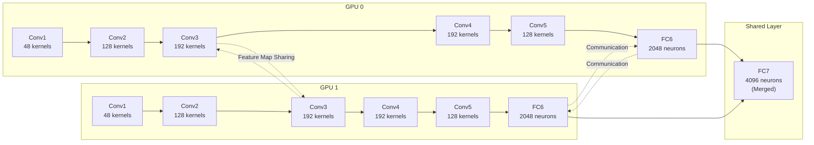

# AlexNet and the CNN Revival

Before AlexNet emerged in 2012, although CNNs had the advanced concept of automatically learning convolution kernels, they lacked convincing application cases in industry and their influence in computer vision fell short of traditional handcrafted feature extraction methods such as [SIFT](https://en.wikipedia.org/wiki/Scale-invariant_feature_transform) and [HOG](https://en.wikipedia.org/wiki/Histogram_of_oriented_gradients).

The breakthrough victory of AlexNet in the ImageNet Large Scale Visual Recognition Challenge (ILSVRC) in 2012 not only demonstrated the superior capability of deep convolutional neural networks on large-scale image recognition tasks, but also marked the official beginning of the deep learning era. This chapter revisits that historic moment, delving into AlexNet's architectural design and how it integrated previously learned deep learning concepts (ReLU, Dropout, GPU training) into a successful system.

## The ImageNet Challenge

In the history of computer vision, datasets have always played a crucial role. Early researchers faced a dilemma: algorithms were becoming increasingly sophisticated, but the datasets available for verifying their effectiveness were quite limited. The [MNIST](https://en.wikipedia.org/wiki/MNIST_database) handwritten digit dataset contained only 70,000 images across 10 categories, and [CIFAR-10](https://en.wikipedia.org/wiki/CIFAR-10) had only 60,000 images. These datasets were sufficient for validating basic algorithms, but they were clearly far too small for the grand goal of enabling machines to truly understand image content.

The birth of ImageNet changed this situation for the first time. In 2009, Professor Fei-Fei Li, a Chinese-American computer scientist, led a team at Princeton University to publish a paper titled "[ImageNet: A Large-Scale Hierarchical Image Database](https://ieeexplore.ieee.org/document/5206848)", proposing the idea of building the world's largest image database. Li's motivation at the time was quite straightforward: without a sufficiently large dataset, it is impossible to train a sufficiently powerful model, and therefore impossible to verify the true capabilities of computer vision algorithms. Today no one would challenge this idea, but at the time it was quite controversial — many believed that collecting such a massive amount of image data was an impossible task. Yet Li firmly believed that big data was the key lever for driving breakthroughs in computer vision.

The development history of ImageNet itself spans an academic marathon of nearly two decades. Starting in 2007, Li's team leveraged Amazon Mechanical Turk, a crowdsourcing platform, to mobilize tens of thousands of workers worldwide for image annotation. This crowdsourcing model was an innovative approach at the time, dramatically improving annotation efficiency. After two years of painstaking work, by the time the paper was published in 2009, ImageNet contained over 3.2 million annotated images covering approximately 5,247 categories — 200 times the size of MNIST and 230 times that of CIFAR-10. Not only was ImageNet unprecedented in scale, but it also adopted WordNet's hierarchical semantic structure to organize categories, so that the parent class of "cat" was "animal" and the parent class of "sports car" was "car", forming a complete semantic knowledge graph.

In 2010, ImageNet launched a competition called the "ImageNet Large Scale Visual Recognition Challenge" (ILSVRC). ILSVRC used a subset of ImageNet as the competition dataset, containing approximately 1.2 million training images, 50,000 validation images, and 100,000 test images. Models had to complete a classification task of approximately 1,000 categories based on this data.

After the competition launched, ILSVRC quickly became the benchmark for measuring image recognition capabilities, attracting top research teams from around the world. The champions of 2010 and 2011 primarily used traditional machine learning methods. Researchers carefully designed feature extraction algorithms (such as SIFT, HOG, GIST) and fed these handcrafted features into linear classifiers (such as SVMs). While effective, this approach had two fundamental flaws: first, feature design required extensive expert experience, and second, feature extraction and classifier training were separated, preventing end-to-end optimization. The 2010 champion achieved a Top-5 error rate of about 28%, and the 2011 champion about 26%. Although there was progress, the improvement was quite limited. By this point, the ceiling of traditional methods had become clear.

In 2012, Alex Krizhevsky and Ilya Sutskever from the University of Toronto, together with their advisor Geoffrey Hinton — known as the godfather of deep learning — submitted a convolutional neural network named [AlexNet](https://en.wikipedia.org/wiki/AlexNet) to the competition. Hinton's team had been researching neural networks for decades and had tried many times to apply CNNs to practical tasks, but had failed to achieve breakthrough results due to limitations in computing power and dataset scale. This time, they finally found the right way to make deep networks work.

AlexNet's performance shocked the entire computer vision community, slashing the Top-5 error rate from 26% the previous year down to 15.3%, while the second-place method based on handcrafted feature engineering still remained at about 26%. The gap between first and second place had suddenly opened up by a full 10 percentage points — an unprecedented margin of improvement in the ILSVRC competition and in the entire field of machine vision at the time. Even more remarkably, this was the first time a pure end-to-end learning method had defeated traditional approaches on such a large-scale vision task, proving the overwhelming advantage of deep convolutional neural networks on complex image understanding tasks.

AlexNet's success did not come from entirely new mathematical theory. Learnable convolutional neural networks based on backpropagation had been proposed by Yann LeCun as early as 1989, and both the ReLU activation function and Dropout technique already had research foundations. The real breakthrough lay in how Hinton's team integrated these existing techniques into an efficient system, training it to convergence with sufficiently large data (ImageNet) and sufficiently powerful computation (GPUs). This victory sent a clear signal to the research community: **large-scale data + deep networks + GPU computing = breakthrough performance**, and the deep learning wave that continues to this day was set in motion.

::: info Deep Learning History Stories
For practitioners in the AI field, all three members of the 2012 ILSVRC team are now well-known figures, each with extraordinary life stories. Due to the scope of this topic, we will not elaborate further here. Readers interested in the history of AI development and the stories of its pioneers are welcome to read the author's popular science book *[The Boundary of Wisdom](https://book.douban.com/subject/30379536/)* (in Chinese).
:::

## AlexNet Architecture Design

Now that we understand the historical background of AlexNet, let us delve into its architectural design. Although AlexNet's architecture was ambitious for its time, its design philosophy remains clearly traceable today. It inherited the classic paradigm of LeNet-5 (convolution → pooling → fully connected), but was greatly expanded in depth, width, and parameter count. More importantly, it introduced several key techniques to ensure that this "behemoth" could be successfully trained.

### Network Structure

From an architectural evolution perspective, AlexNet can be understood as a deep amplification of LeNet-5. LeNet-5 had only 5 learnable layers (2 convolutional + 3 fully connected), or 7 layers if pooling layers are counted (pooling layers have no learnable parameters and are generally not counted as separate layers), with about 60,000 parameters. AlexNet, by contrast, was designed with 8 layers (5 convolutional + 3 fully connected) and a parameter count that skyrocketed to approximately 62 million — 1,000 times that of LeNet-5. Such a dramatic expansion cannot be achieved by simply stacking layers; a carefully designed hierarchical structure is required, with each layer having a clear responsibility.

AlexNet's network structure is shown in the figure below. It accepts $224 \times 224 \times 3$ RGB image input, progressively extracts features through 5 convolutional layers, and finally outputs classification probabilities for 1,000 categories through 3 fully connected layers.

```nn-arch width=900
name: AlexNet Network Architecture (5 Conv Layers + 3 FC Layers)
layout: horizontal

sections:
  - name: Feature Extractor
    layers: [Input, Conv1, Pool1, Conv2, Pool2, Conv3, Conv4, Conv5, Pool5]
    row_label: "Flatten: 9216"
  - name: Classifier
    layers: [FC6, FC7, FC8, Output]

layers:
  - {name: Input, type: input, size: "227 x 227 x 3"}
  - {name: Conv1, type: conv, kernel: 11, stride: 4, channels: 96, out: "55 x 55 x 96", act: ReLU}
  - {name: Pool1, type: pool, kernel: 3, stride: 2, out: "27 x 27 x 96"}
  - {name: Conv2, type: conv, kernel: 5, stride: 1, channels: 256, out: "27 x 27 x 256", act: ReLU}
  - {name: Pool2, type: pool, kernel: 3, stride: 2, out: "13 x 13 x 256"}
  - {name: Conv3, type: conv, kernel: 3, stride: 1, channels: 384, out: "13 x 13 x 384", act: ReLU}
  - {name: Conv4, type: conv, kernel: 3, stride: 1, channels: 384, out: "13 x 13 x 384", act: ReLU}
  - {name: Conv5, type: conv, kernel: 3, stride: 1, channels: 256, out: "13 x 13 x 256", act: ReLU}
  - {name: Pool5, type: pool, kernel: 3, stride: 2, out: "6 x 6 x 256"}
  - {name: FC6, type: fc, size: "4096-d", act: ReLU, dropout: true}
  - {name: FC7, type: fc, size: "4096-d", act: ReLU, dropout: true}
  - {name: FC8, type: fc, size: "1000-d"}
  - {name: Output, type: output, size: "1000", act: Softmax}
```
*Figure: AlexNet Network Architecture Diagram*

The architecture diagram clearly reveals AlexNet's design logic: the first two layers use larger convolution kernels ($11 \times 11$ and $5 \times 5$) and larger strides (first layer stride $4$) to quickly reduce spatial resolution and extract coarse-grained features; the last three layers use $3 \times 3$ small convolution kernels for fine processing, keeping spatial dimensions unchanged while the channel count first increases then decreases to form a bottleneck structure. This coarse-to-fine feature extraction strategy later became a design paradigm imitated by many CNNs, enabling the network to capture both global structure and local details simultaneously. Below we analyze the author's design intent layer by layer, and verify through computation that each layer's spatial transformation meets expectations.

- **Conv1: Rapid Downsampling and Large Receptive Field**. Input $224 \times 224 \times 3$, kernel $11 \times 11$, stride 4, no padding. Note that the $227$ in the calculation is not a typo — AlexNet's original paper actually achieves $227 \times 227$ input through additional padding, and we compute according to the paper's standard:

    $$\text{Conv output} = \lfloor \frac{227 + 0 - 11}{4} \rfloor + 1 = 55$$

    Pooling window $3 \times 3$, stride 2:

    $$\text{Pool output} = \lfloor \frac{55 - 3}{2} \rfloor + 1 = 27$$

    After [convolution](./cnn-basics.md#convolution-principle), [ReLU activation](../neural-network-structure/activation-loss-functions.md#relu-and-its-variants), [pooling](./cnn-basics.md#pooling-operation), and [Local Response Normalization (LRN)](../neural-network-stability/batch-normalization.md#limitations-and-variants), Conv1 outputs $27 \times 27 \times 96$. The design goal of this layer is to use a very large convolution kernel $11 \times 11$ with a large stride $4$ to rapidly compress spatial resolution from $227 \times 227$ down to $55 \times 55$, achieving a compression ratio of over 4x. This aggressive downsampling has two considerations:

    1. **Computational efficiency first**: GPU computing power was limited in those days (using two GTX 580 cards with 3GB of memory each). Large kernels with large strides quickly reduce the computational load of subsequent layers. The feature maps processed by later layers are only about $\frac{1}{16}$ the size of the first layer's output, saving substantial memory and computation time.

    2. **Large receptive field for global information**: An $11 \times 11$ kernel covers $11 \times 11 = 121$ pixels on the input image each time. A stride of $4$ means adjacent convolution centers are 4 pixels apart, allowing the capture of relatively large local structures simultaneously. This is helpful for recognizing low-level features such as rough object contours and color distributions. The first layer does not need fine textures; it only needs to know information like "there is a long edge here" or "here is a red area."

    Setting the output channel count to 96 represents a tradeoff between features and capacity — too few would lose information, too many would increase computational burden. AlexNet chose 96 as a starting point, providing a sufficiently rich feature foundation for subsequent layers within the bounds of affordable hardware.

- **Conv2: Fine Extraction and Spatial Preservation**. Input $27 \times 27 \times 96$, kernel $5 \times 5$, padding 2, stride 1:

    $$\text{Conv output} = \lfloor \frac{27 + 4 - 5}{1} \rfloor + 1 = 27$$

    2 pixels of padding extend the input boundaries; combined with stride 1, the spatial dimensions remain unchanged after convolution. Pooling $3 \times 3$, stride 2:

    $$\text{Pool output} = \lfloor \frac{27 - 3}{2} \rfloor + 1 = 13$$

    Conv2 outputs $13 \times 13 \times 256$. This layer reduces the kernel size to $5 \times 5$, decreases the stride to 1, and introduces padding of $2$ to preserve spatial dimensions. This design reflects the hierarchical progression of feature extraction:

    1. **Coarse-to-fine strategy shift**: Conv1 completed coarse-grained spatial compression; Conv2 begins fine processing. The combination of stride $s=1$ with padding $p=2$ ensures each output pixel corresponds to a $5 \times 5$ neighborhood of the input without skipping any position. This guarantees that low-level features captured by the first layer (edges, color patches) can be fully combined and refined.

    2. **Size-preserving design technique**: When kernel $k=5$, padding $p=2$, and stride $s=1$, the output size exactly equals the input size ($\lfloor \frac{n + 4 - 5}{1} \rfloor + 1 = n$). This [Same Padding](cnn-basics.md#size-design) technique is widely used in CNN design, allowing designers to focus on adjusting channel counts (feature dimensions) without worrying about spatial dimension changes.

    3. **Significant channel growth**: Conv2's output channels increase from 96 to 256, meaning the network begins learning richer feature combinations. Each channel represents a specific feature pattern; increasing the channel count enhances feature representation capability. 256 channels are sufficient to encode various edge combinations, simple shapes, texture patterns, and other mid-level features. The pooling layer continues spatial compression ($27 \to 13$) while retaining 256 feature channels. This pattern of spatial compression and feature expansion runs throughout AlexNet's convolutional section.

- **Conv3-5: Deep Feature Refinement and Design Tradeoffs**. These three layers use a unified configuration (kernel $3 \times 3$, padding 1, stride 1). According to the formula:

    $$\text{Conv output} = \lfloor \frac{13 + 2 - 3}{1} \rfloor + 1 = 13$$

    This configuration is a classic CNN design technique: when kernel $k=3$, padding $p=1$, and stride $s=1$, the input size equals the output size. Conv3 and Conv4 are not followed by pooling layers, preserving the $13 \times 13$ size; Conv5 is followed by pooling, outputting $6 \times 6 \times 256$. The design of these last three layers reflects early exploration of the principle that "depth is better than width." Because of this, AlexNet is considered the beginning of deep learning's practical application. The depth design of these three layers is reflected in:

    1. **Deep stacking of small kernels**: Three consecutive layers use $3 \times 3$ small kernels without spatial compression. This may seem to waste the spatial dimension ($13 \times 13$ remains unchanged), but it actually embodies the philosophy that **depth is capability**. With each additional layer, the expressive power of feature combinations grows exponentially.

        Each pixel output by Conv3 is a combination of a $3 \times 3 \times 256$ region (2,304 input values); Conv4 combines further on top of Conv3, expanding the effective receptive field to $5 \times 5$; Conv5 continues stacking, reaching an effective receptive field of $7 \times 7$. Stacking three $3 \times 3$ layers is equivalent to one $7 \times 7$ kernel, but with fewer parameters ($3 \times 3^2 \times C^2$ vs. $7^2 \times C^2$) and more nonlinear activations (3 ReLU vs. 1). This design was later taken to its extreme by [VGGNet](vgg-inception.md).

    2. **Careful channel orchestration**: Conv3 (256 to 384 channels) → Conv4 (maintains 384 channels) → Conv5 (384 to 256 channels). The channel count first increases then decreases, forming a bottleneck structure. The feature space is first expanded, giving the network the capacity to encode more complex pattern combinations (object parts, spatial relationships). Once feature refinement is complete, the representation is compressed back to a more compact form in preparation for the fully connected layers. This "expansion-contraction" pattern became a standard design motif in later networks (e.g., ResNet's Bottleneck Block).

    3. **Delayed placement of pooling layers**: Conv3 and Conv4 have no pooling layers; only Conv5 is followed by pooling. This ensures that deep features have sufficient working space. Premature pooling would lose spatial detail, whereas Conv3-4 need to perform fine-grained feature combination on the $13 \times 13$ feature maps. Only after Conv5 completes refinement is pooling used to compress to $6 \times 6$, preparing a compact yet information-rich representation for the classification task in the fully connected layers.

- **Fully Connected Layers: From Features to Decisions**. After flattening Conv5's output, we obtain a $6 \times 6 \times 256 = 9,216$-dimensional vector, which passes through FC6 (4,096), FC7 (4,096), and FC8 (1,000) to finally output a probability distribution over 1,000 classes. The design of the fully connected layers reflects the classifier thinking of early CNNs:

    1. **Role division in information integration**: Convolutional layers focus on local feature extraction, with each neuron seeing only a local region. Fully connected layers allow every neuron to see all 9,216 features, achieving global information integration. This division is logically clear: convolutional layers build a dictionary of local features, and fully connected layers combine dictionary entries to form classification decisions.

    2. **Parameter allocation strategy**: Fully connected layers account for 94% of AlexNet's parameters (approximately 58.63 million), with Dropout used to mitigate overfitting risk. This massive parameter allocation seems like a "top-heavy" crude design by today's standards. But back in 2012, even Hinton — a leading scholar of neural networks — had little experience dealing with ImageNet's 1,000 categories and the complex relationships between them (different dog breeds, different car types), so a large number of parameters was needed to encode these decision boundaries. Later networks (GoogLeNet, ResNet) replaced fully connected layers with global average pooling, dramatically reducing parameter counts. Although subsequent improved models proved that AlexNet's FC layers were indeed redundant, the combination of large parameter count + Dropout was still a successful engineering solution at the time.

    3. **Dimension-decreasing decision path**: 9,216 → 4,096 → 4,096 → 1,000. Two intermediate representations of 4,096 dimensions form a "wider bottleneck": information is first compressed into a 4K-dimensional abstract concept space, then mapped to a 1K-dimensional category space. This two-stage design gives the network the opportunity to learn more abstract intermediate representations (concepts like "four-legged animal", "vehicle"), and then refine them into specific categories.

### Dual-GPU Design

After analyzing the network structure, another engineering detail worth exploring is AlexNet's dual-GPU design. This was not a purely academic innovation, but a pragmatic engineering solution forced by hardware limitations at the time. In 2012, the high-end NVIDIA GTX 580 graphics card had only 3GB of memory, while AlexNet needed to store multiple copies of data during training — parameters, gradients, activations, optimizer states — making single-card memory insufficient. Hinton's team therefore split the network into two parts, deploying them on two GPUs for parallel computation.

Specifically, AlexNet's convolution kernels were evenly distributed across two GPUs: Conv1-Conv2 each took half the kernels, with no communication between GPUs; Conv3 shared complete feature maps through inter-GPU communication; Conv4-Conv5 each GPU processed only its own card's output. The following diagram illustrates the communication pattern of the dual-GPU design:


*Figure: Communication pattern of the dual-GPU design*

As shown in the diagram, the difficulty of the dual-GPU design lies in communication timing. Conv1 and Conv2: each GPU independently processes half the kernels, with no communication between cards. Conv3: both GPUs share complete feature maps, requiring cross-card data concatenation. Conv4 and Conv5: each GPU processes only the previous layer's output from its own card, with no cross-GPU communication. FC6: each GPU processes half the neurons, then results are exchanged through communication. FC7: the outputs from both GPUs are merged into 4096 dimensions, and classification results are computed uniformly.

Although clever, this design also forced a significant increase in code complexity and communication overhead — a compromise driven by the memory constraints of the time. Modern implementations no longer need this dual-GPU approach specific to AlexNet, but the concept of multi-GPU parallel training has become important again in the large language model era. The NVIDIA A100 has 80GB of memory, and even consumer-grade 32GB RTX 5090 cards can fully accommodate all of AlexNet's training data on a single GPU. Modern deep learning framework implementations of AlexNet have merged all convolution kernels and can be trained efficiently on a single GPU. The experimental code in this book will also use the single-GPU version.

In the era when AlexNet was designed, there were no mature machine learning frameworks like PyTorch, nor the powerful GPU hardware systems of today. Hinton's team had to write efficient CUDA convolution computation code themselves and invest effort in GPU memory management. By stacking numerous optimization details together, they achieved GPU training speeds approximately 10 to 50 times faster than pure CPU implementations. Even so, a single training session still took 5-6 days — but without GPU acceleration, AlexNet's training time would have stretched to months, and the feasibility of deep learning would never have been established.

In the decade-plus since the AlexNet era, both GPU hardware and deep learning frameworks have undergone earth-shaking changes. The following table clearly illustrates several key dimensions of this hardware revolution:

| Comparison Dimension | AlexNet Era (2012) | Modern (2025) |
|:------|:-------------------|:-------------|
| GPU Model | GTX 580 (3GB memory) | A100/H100 (80GB memory) |
| Memory Bandwidth | 192 GB/s | 2+ TB/s |
| Training Time | 5-6 days (2 GPUs) | Tens of minutes (1 GPU) |
| Development Approach | Custom CUDA kernels | PyTorch / TensorFlow |
| Optimizer | SGD + Momentum | AdamW and adaptive optimizers |

The growth in memory capacity and bandwidth is particularly striking — from 192 GB/s to over 2 TB/s, a more than 10x bandwidth improvement means GPU cores no longer have to wait for data to slowly load from memory. This is a key foundation for modern models being able to train with tens of billions of parameters. On the software side, frameworks like PyTorch wrap convolution, pooling, optimizer operations, and more into a few API calls, freeing developers from needing to understand hardware details like GPU shared memory and texture memory. Today, an AlexNet implementation using PyTorch can be fully defined in just a few dozen lines of code, and training can be completed in tens of minutes on a single GPU. This efficiency improvement has not only changed researchers' workflows but has also profoundly influenced network architecture design — when training is no longer a bottleneck, researchers can more boldly experiment with deeper and wider network structures.

## Chapter Summary

This chapter introduced AlexNet, a landmark model in deep learning. AlexNet's success triggered a paradigm shift in computer vision:

1. **Research direction shift**: from handcrafted features (SIFT, HOG, BOW) to deep feature learning. After 2012, every ILSVRC champion used CNN methods.
2. **Industry adoption**: Google, Facebook, Microsoft, and other companies quickly followed, applying deep learning to image search, face recognition, autonomous driving, and other scenarios.
3. **Subsequent network emergence**: VGGNet (2014), GoogLeNet/Inception (2014), ResNet (2015), and others iteratively improved upon AlexNet, reducing the error rate from 15.3% to 3.57% (2015), ultimately surpassing human performance (human error rate approximately 5.1%).

AlexNet's emergence marked the rise of deep learning in the field of vision, ushering in the deep learning wave that has continued from 2012 to the present day. The next chapter will introduce VGGNet and GoogLeNet, demonstrating how network design was further improved upon the foundation of AlexNet, exploring the optimal balance between depth and width.

## Exercises

1. AlexNet's Conv3, Conv4, and Conv5 all use $3 \times 3$ kernels with stride $1$ and padding $1$, keeping the spatial size at $13 \times 13$ unchanged. Calculate the effective receptive field after stacking these three layers, and compare the parameter count with that of a single $7 \times 7$ convolution layer.
    <details>
    <summary>Answer</summary>

    **Receptive Field Calculation**:

    Using the receptive field recurrence formula $R_l = R_{l-1} + (k_l - 1) \times \prod_{i=1}^{l-1} s_i$.

    Conv3-5 receive input from Pool2's output ($13 \times 13 \times 256$). Before Pool2:
    - Conv1: $k=11$, $s=4$ → cumulative stride $= 4$
    - Pool1: $k=3$, $s=2$ → cumulative stride $= 4 \times 2 = 8$
    - Conv2: $k=5$, $s=1$ → cumulative stride $= 8 \times 1 = 8$
    - Pool2: $k=3$, $s=2$ → cumulative stride $= 8 \times 2 = 16$

    Computing receptive field layer by layer from the input:
    - Input layer: $R_0 = 1$
    - Conv1: $R_1 = 1 + (11-1) \times 1 = 11$, cumulative stride $= 4$
    - Pool1: $R_2 = 11 + (3-1) \times 4 = 19$, cumulative stride $= 8$
    - Conv2: $R_3 = 19 + (5-1) \times 8 = 51$, cumulative stride $= 8$
    - Pool2: $R_4 = 51 + (3-1) \times 8 = 67$, cumulative stride $= 16$
    - Conv3: $R_5 = 67 + (3-1) \times 16 = 99$, cumulative stride $= 16$
    - Conv4: $R_6 = 99 + (3-1) \times 16 = 131$, cumulative stride $= 16$
    - Conv5: $R_7 = 131 + (3-1) \times 16 = 163$

    The receptive field at Conv5's output position is $163 \times 163$.

    **Effective Receptive Field of Just the Conv3-5 Stack**:

    Considering only these three layers (assuming each layer's initial receptive field is $3$), the equivalent receptive field of three stacked $3 \times 3$ layers is $7 \times 7$:
    - First $3 \times 3$ layer: receptive field $3$
    - Second $3 \times 3$ layer: receptive field $3 + 2 = 5$
    - Third $3 \times 3$ layer: receptive field $5 + 2 = 7$

    **Parameter Count Comparison**:

    Let the input channel count be $C$, with the same output channel count:

    - **Three $3 \times 3$ convolutions**: parameters per layer $= C \times 3 \times 3 \times C + C = 9C^2 + C$
      $$\text{Total parameters} = 3 \times (9C^2) + 3C = 27C^2 + 3C$$

    - **Single $7 \times 7$ convolution**:
      $$\text{Parameters} = C \times 7 \times 7 \times C + C = 49C^2 + C$$

    Parameter comparison: $\frac{27C^2}{49C^2} \approx 55\%$, three small kernels save approximately 45% of parameters compared to a single large kernel.
    </details>

2. Explain why AlexNet uses an $11 \times 11$ kernel with stride $4$ in Conv1, while modern CNNs (such as ResNet) typically use only a $7 \times 7$ kernel with stride $2$ in the first layer. Analyze the reasons for this design evolution from the perspectives of computational efficiency and feature extraction.
    <details>
    <summary>Answer</summary>

    **Historical Reasons for AlexNet's Large Kernel Design**:

    1. **Computational efficiency first**: GPU computing power was limited in 2012 (GTX 580 with only 3GB memory). Large kernels with large strides rapidly compress spatial resolution. AlexNet's Conv1 reduces $227 \times 227$ directly to $55 \times 55$, a compression ratio of over 4x. Feature maps processed by subsequent layers are only about $\frac{1}{16}$ the size of the first layer's output, saving substantial memory and computation time.

    2. **Large receptive field for global information**: An $11 \times 11$ kernel covers $11 \times 11 = 121$ pixels each time. A stride of $4$ means adjacent window centers are $4$ pixels apart, allowing capture of large local structures (object contours, color distributions, and other low-level features). The first layer does not need fine textures; it only needs to recognize coarse-grained information like "long edges" or "large color regions."

    3. **Exploratory design due to inexperience**: AlexNet was the first deep network to succeed on large-scale image tasks. There was little prior experience in designing deep networks. Large kernels were common practice in traditional image processing (e.g., SIFT, HOG), and Hinton's team may have been influenced by this.

    **Reasons for Modern CNN's Small Kernel Design Evolution**:

    1. **Increased computing power**: Modern GPUs (A100/H100) have 80GB+ of memory, eliminating the need for aggressive downsampling to save computational resources. More refined layer-by-layer downsampling strategies can be used.

    2. **Deep stacking replaces large kernels**: Research has found that stacking multiple small kernels is equivalent to a single large kernel, but with fewer parameters and stronger nonlinearity. For example, three $3 \times 3$ layers are equivalent to one $7 \times 7$ layer, with approximately 55% fewer parameters and two additional ReLU activations for stronger representational power.

    3. **Preserving more spatial information**: Downsampling with stride $2$ is more gentle than stride $4$, preserving more edge detail. Modern networks typically maintain higher spatial resolution in the early layers, giving subsequent layers more "working space" for fine-grained feature combination.

    4. **Gradual receptive field expansion**: Modern networks like ResNet progressively expand the receptive field through multiple layers of small kernels, rather than establishing a very large receptive field in the first layer. This progressive design aligns with the hierarchical principle that "shallow layers extract low-level features, deep layers extract high-level features."

    **Design Evolution Summary**:

    | Comparison Dimension | AlexNet (2012) | ResNet (2015+) |
    |:--|:--|:--|
    | First Layer Kernel | $11 \times 11$ | $7 \times 7$ |
    | First Layer Stride | $4$ | $2$ |
    | Design Philosophy | Aggressive downsampling, rapid compression | Fine processing, progressive downsampling |
    | Hardware Context | GTX 580 (3GB) | A100 (80GB) |

    </details>
