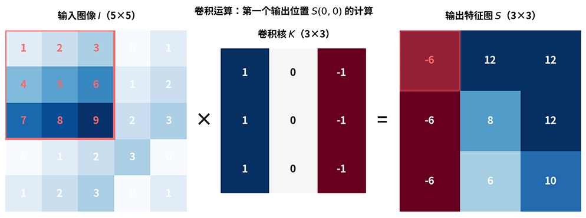
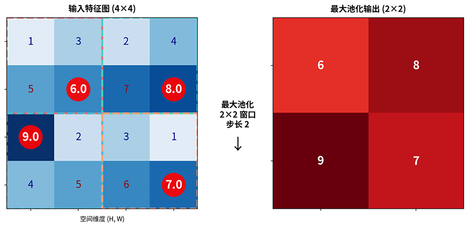
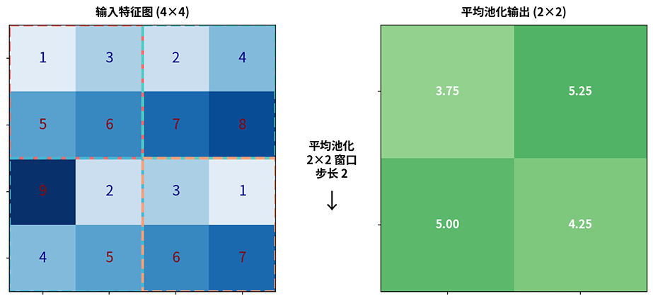
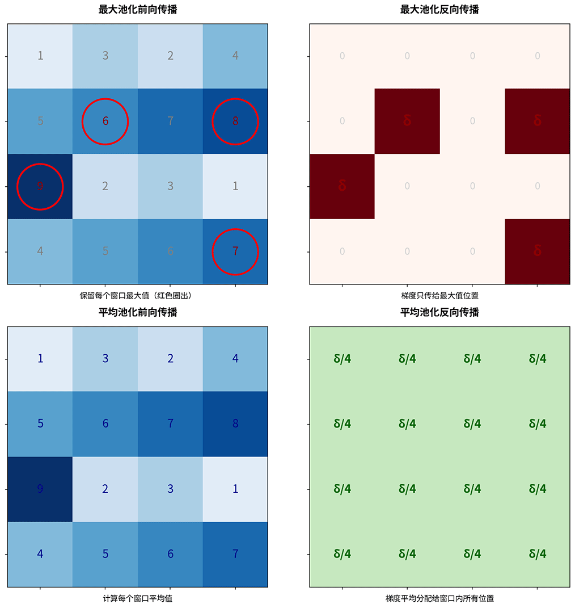
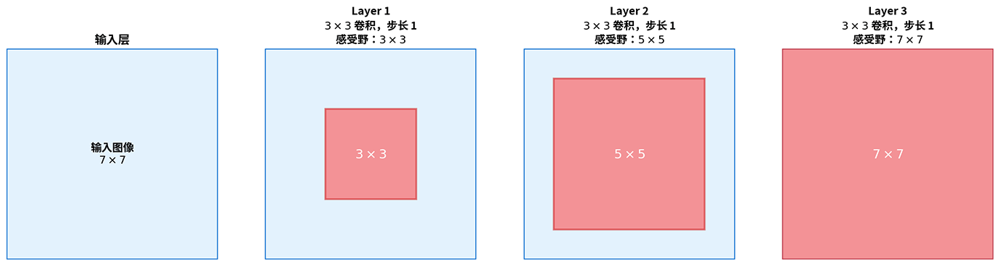
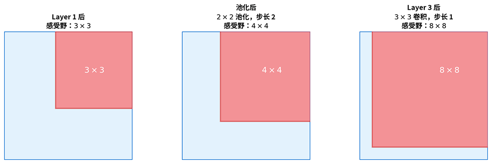
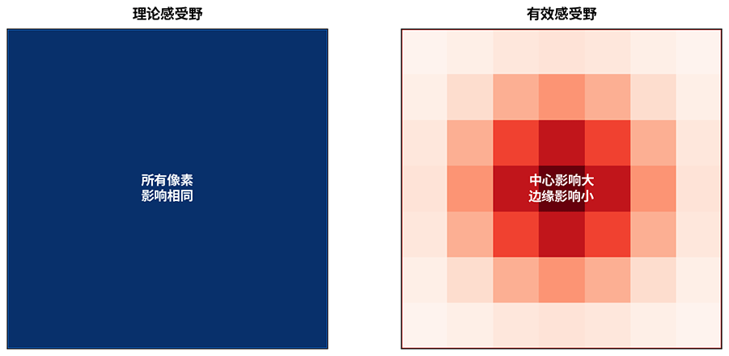
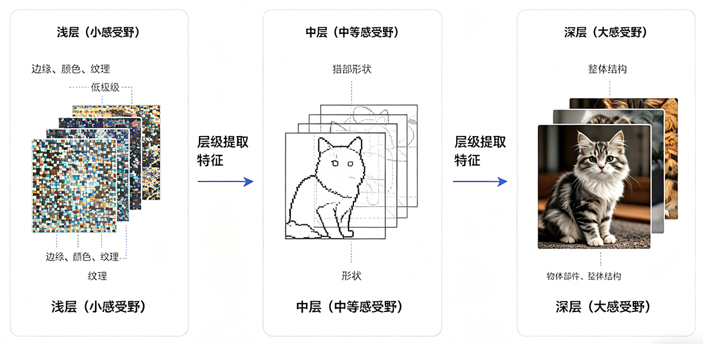
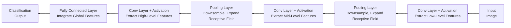

# CNN Basics

By this point, we have systematically studied the core principles of deep neural networks: forward propagation, backpropagation, activation functions, loss functions, gradient descent optimization, weight initialization, regularization techniques, and more. Together, these techniques form a complete methodology for training deep networks. When discussing these techniques, we have all been working under one implicit assumption — the network is a fully connected network, where each neuron in every layer connects to all neurons in the previous layer. However, when it comes to image-related tasks, fully connected networks frequently face two major challenges: **parameter explosion** and **loss of spatial structure**.

For example, consider a $224 \times 224 \times 3$ color image. Feeding it into a fully connected network requires $224 \times 224 \times 3 = 150,528$ input neurons. Even if the first hidden layer has only $1000$ neurons, the weights for this layer alone amount to $150,528 \times 1000 = 150$ million parameters. Such an enormous number of parameters not only incurs huge computational costs but also makes the network highly prone to overfitting. More importantly, fully connected layers flatten the image into a one-dimensional vector, completely discarding the spatial adjacency relationships between pixels. In images, adjacent pixels typically form meaningful local features (such as edges and textures), but fully connected layers have no way to exploit this structure.

**Convolutional Neural Networks** (CNNs) were designed precisely to address these two problems. In 1998, French computer scientist Yann LeCun (Turing Award laureate) proposed LeNet-5 in his landmark paper "[Gradient-Based Learning Applied to Document Recognition](http://yann.lecun.com/exdb/publis/pdf/lecun-98.pdf)", the first convolutional neural network to achieve large-scale industrial success. LeNet-5 was used for handwritten digit recognition and saw real-world deployment in check reading systems for American banks.

Yann LeCun's design was inspired by research on the biological visual system. In 1959, neuroscientists David Hubel and Torsten Wiesel discovered that the cat's visual cortex extracts features layer by layer through local receptive fields, progressing from simple features (edges, orientations) to complex features (shapes, objects). CNNs mimic this hierarchical feature extraction process: convolutional layers slide small filters over the image to extract local features, pooling layers downsample to expand the receptive field, and stacking multiple layers achieves a progression from local to global feature abstraction. This design philosophy remains the cornerstone of all modern vision networks, with classic models like AlexNet, VGG, and ResNet all inheriting LeNet's core architecture.

This chapter introduces the core concepts of CNNs: convolution operations, pooling operations, receptive fields, comparisons between convolutional and fully connected layers, and CNN architecture design principles. Understanding these fundamentals is a prerequisite for mastering classic models such as AlexNet, VGG, and ResNet.

## Convolution Principle

Imagine you are looking at your middle school graduation photo and trying to find yourself in the crowd. You wouldn't convert the photo into an array and scan it programmatically — instead, you would take a magnifying glass, sweep it across the photo, and match facial contours one by one until you find yourself. This is precisely the idea behind the convolution operation. **Convolution** slides a small filter across an image, computing the degree of match between the filter and each local region of the image, producing a new feature map. The filter's parameters determine what features it detects: some filters detect horizontal edges, others detect vertical edges, some detect textures, and others blur the image. In CNNs, these filter parameters are not manually designed — they are automatically learned through training, and the network discovers the feature detection approach that best suits the task.

A more concrete analogy is that convolution probes an image position by position. The probe head (convolution kernel) is a small matrix — for example, a $3 \times 3$ grid where each cell contains a numeric value. When you place the probe at a certain position on the image, the probe's values are multiplied with the corresponding pixel values of the image and then summed to produce a single output value. This output value indicates whether that position contains the feature the probe is searching for. After the probe slides across all positions, a complete feature response map is obtained, as shown in the figure above.

Below, we define the convolution operation mathematically. Let $I$ be the input image and $K$ the convolution kernel. $(i, j)$ denotes the position index in the output feature map, indicating that the kernel has slid to row $i$, column $j$. $(m, n)$ denotes the offset index within the kernel, iterating over every position in the kernel. $I(i+m, j+n)$ represents the pixel value in the input image corresponding to the current kernel position, and $K(m, n)$ represents the parameter value of the kernel at position $(m, n)$. The convolution operation is defined as:

$$[cnn_scc] S(i, j) = (I * K)(i, j) = \sum_m \sum_n I(i+m, j+n) K(m, n)$$

The $*$ symbol in the formula denotes the convolution operation. The overall formula can be interpreted as: at each output position, compute the matching score between the kernel and the local region of the image. This definition is not so easy to grasp, so let us walk through a concrete numerical example. Suppose the input image is a $5 \times 5$ matrix and the convolution kernel is a $3 \times 3$ matrix, as illustrated below.



*Figure: The complete process of the convolution operation*

To compute the value at output position $(0, 0)$, place the kernel over the top-left $3 \times 3$ region of the input image. Multiply the corresponding elements, sum the 9 products, and write the result into position $(0, 0)$ of the feature map. The computation proceeds as follows:

$$S(0, 0) = 1 \times 1 + 2 \times 0 + 3 \times (-1) + 4 \times 1 + 5 \times 0 + 6 \times (-1) + 7 \times 1 + 8 \times 0 + 9 \times (-1) = -6$$

The kernel then slides one position to the right to compute output position $(0, 1)$. After completing an entire row, it moves down to the next row, and so on until every position has been visited, producing the complete $3 \times 3$ feature map. Different kernel parameters extract different types of features, yielding different feature maps.

### Kernel Design

In traditional image processing, people had to manually design various convolution kernels for specific tasks. The following are several classic hand-crafted convolution kernels:

| Kernel | Description | Kernel Matrix |
|:--|:--|:--|
| **Edge Detection Kernel** (Laplacian) | Large center value (8) with negative surroundings (-1). When the center pixel differs significantly from its neighbors, the output is large, indicating the presence of an edge | $\begin{bmatrix} -1 & -1 & -1 \\ -1 & 8 & -1 \\ -1 & -1 & -1 \end{bmatrix}$ |
| **Horizontal Edge Kernel** (Prewitt Horizontal) | Top and bottom rows have opposite signs (1 on top, -1 on bottom), detecting brightness changes in the horizontal direction. When the upper part of a local region is bright and the lower part is dark (or vice versa), the output is large, indicating a horizontal edge | $\begin{bmatrix} 1 & 1 & 1 \\ 0 & 0 & 0 \\ -1 & -1 & -1 \end{bmatrix}$ |
| **Vertical Edge Kernel** (Prewitt Vertical) | Left and right columns have opposite signs, detecting brightness changes in the vertical direction | $\begin{bmatrix} 1 & 0 & -1 \\ 1 & 0 & -1 \\ 1 & 0 & -1 \end{bmatrix}$ |
| **Blur Kernel** (Mean Filter) | All values equal and sum to 1, computing the average of 9 pixels in the local region to produce a blurring/smoothing effect | $\begin{bmatrix} \frac{1}{9} & \frac{1}{9} & \frac{1}{9} \\ \frac{1}{9} & \frac{1}{9} & \frac{1}{9} \\ \frac{1}{9} & \frac{1}{9} & \frac{1}{9} \end{bmatrix}$ |

The following code applies these convolution kernels to a real image, giving you an intuitive feel for the feature maps produced by different kernels:

```python runnable
import numpy as np
from PIL import Image
import matplotlib.pyplot as plt
from scipy.signal import convolve2d
import requests
from io import BytesIO

# Load a real image
response = requests.get("http://ai.icyfenix.cn/logo_min_size.png")
image_pil = Image.open(BytesIO(response.content))

# Convert to grayscale (convolution kernels typically operate on single-channel images)
if image_pil.mode != 'L':
    image_gray = image_pil.convert('L')

# Convert to numpy array
image = np.array(image_gray, dtype=np.float32)
print(f"Grayscale image shape: {image.shape} (height, width)")
print(f"Pixel value range: [{image.min():.1f}, {image.max():.1f}]")

# Edge detection kernel (Laplacian)
# Emphasizes regions with rapid intensity changes, i.e., edge locations
edge_kernel = np.array([
    [-1, -1, -1],
    [-1,  8, -1],
    [-1, -1, -1]
])

# Blur kernel (mean filter)
# Smooths the image, suppressing noise and detail
blur_kernel = np.array([
    [1/9, 1/9, 1/9],
    [1/9, 1/9, 1/9],
    [1/9, 1/9, 1/9]
])

# Apply convolution operations
edge_result = convolve2d(image, edge_kernel, mode='same')
blur_result = convolve2d(image, blur_kernel, mode='same')

# Take absolute value and normalize edge detection result (for visualization)
edge_display = np.abs(edge_result)
edge_display = (edge_display / edge_display.max() * 255).astype(np.uint8)

# Display blur result directly
blur_display = blur_result.astype(np.uint8)

print(f"\nConvolution result shape: {edge_result.shape}")

# Display three images side by side: original, edge detection, blur
fig, axes = plt.subplots(1, 3, figsize=(14, 5))

axes[0].imshow(image, cmap='gray')
axes[0].set_title('Original Grayscale')
axes[0].axis('off')

axes[1].imshow(edge_display, cmap='gray')
axes[1].set_title('Edge Detection (Laplacian)')
axes[1].axis('off')

axes[2].imshow(blur_display, cmap='gray')
axes[2].set_title('Blur (Mean Filter)')
axes[2].axis('off')

plt.tight_layout()
plt.show()
plt.close()
```

Manually designing convolution kernels requires specialized knowledge and can only detect predefined feature types. The key breakthrough of CNNs is that they eliminate the need for manual kernel design — the kernel parameters are not predefined but are learned through backpropagation training. The network automatically learns the most suitable feature extraction kernels based on the task requirements. These might be edge detection kernels, more complex texture detection kernels, or even composite feature kernels that humans cannot easily interpret. This self-learning approach enables CNNs to extract a rich diversity of features, with an upper bound far exceeding what can be achieved through human manual design. However, human experience-based manual design does ensure a higher lower bound, which is one reason CNNs did not receive widespread industrial attention for more than a decade after their invention — a history we will explore in the next chapter on AlexNet.

### Channel Design

The discussion so far has focused on grayscale images. For color images, we need **multi-channel convolution**. Since a color image has three RGB color channels, the input is a three-dimensional array of size $H \times W \times 3$. The convolution kernel must also have three corresponding channels. Each channel is convolved independently, and the results are summed to produce a single output value:

$$[cnn_mcc] S(i, j) = \sum_c \sum_m \sum_n I(i+m, j+n, c) K(m, n, c)$$

Here, $c$ is the channel index that iterates over all input channels (for RGB three-channel input, $c=0,1,2$). The convolution result is obtained by summing the output values from each channel, where a single channel's output value is the sum of products between that channel and the corresponding kernel positions. One kernel produces one output channel (feature map). To produce multiple output channels, we need multiple kernels. In multi-channel convolution, each kernel covers not only spatial dimensions but also all input channels. Let $C_{in}$ be the number of input channels, $C_{out}$ the number of output channels, and $k \times k$ the spatial size of the kernel. Then:

- Number of kernels: $C_{out}$ (each produces one output channel)
- Size of each kernel: $k \times k \times C_{in}$ (covers all input channels)
- Total number of parameters: $C_{out} \times k \times k \times C_{in} + C_{out}$ (kernel parameters plus biases)

Each output channel is an independent feature detector. For example, $C_{out}=64$ means the layer can learn to detect 64 different feature patterns. Different kernels differentiate themselves through training, potentially learning:

- Edges in different orientations, such as horizontal, vertical, 45 degrees, 135 degrees, etc.
- Textures at different scales, such as fine-grained textures, coarse block textures, etc.
- Color combination patterns, such as red-green contrast, blue-yellow contrast, etc.
- More complex local structures, such as corners, arcs, intersections, etc.
- ...

There is no numerical constraint between $C_{in}$ and $C_{out}$. Multiple input features can be merged into a single new output feature, and one output feature can differentiate into multiple output features — that is, the number of output channels can be greater than, equal to, or less than the number of input channels. However, there is an operational binding: each kernel must cover all input channels. The spatial size of a single kernel is $k \times k$, but its complete size is actually $k \times k \times C_{in}$. This three-dimensional structure ensures that each output value integrates information from all input channels. For example, given an input of $224 \times 224 \times 3$ (RGB three channels), using 64 kernels with spatial size $3 \times 3$ (actual size $3 \times 3 \times 3$):

- Number of kernels: 64
- Size of each kernel: $3 \times 3 \times 3 = 27$ parameters
- Total number of parameters: $64 \times 27 + 64 = 1792$

In contrast, if a fully connected layer were to map from the same $224 \times 224 \times 3$ dimensional input to a 64-dimensional output, it would require $224 \times 224 \times 3 \times 64 = 9,633,792$ parameters. The convolutional layer uses only $0.02\%$ of the parameters of the fully connected layer.

### Size Design

Beyond the number of channels, convolutional layer design also requires careful attention to two hyperparameters: **stride** and **padding**, which together determine the output feature map size. **Stride** is the distance the kernel slides with each step. With stride $s=1$, the kernel slides position by position (the default). With stride $s=2$, the kernel skips one position at each step. Larger strides produce smaller outputs and more compressed feature maps. **Padding** involves adding extra pixels (typically zeros) around the edges of the input image. With no padding (valid padding), the output size is smaller than the input. With same padding, the output size equals the input size (when stride is 1). Padding helps preserve edge information — without it, edge pixels are covered by the kernel only once, while center pixels are covered many times, causing edge information to be easily overlooked. Given an input size $n \times n$, kernel size $k \times k$, stride $s$, and padding $p$, the output size is:

$$[cnn_out_size]\text{Output size} = \lfloor \frac{n + 2p - k}{s} \rfloor + 1$$


## CNN Inference and Training

For inference, the forward propagation of a convolutional layer can be broken down into three steps: first, compute the output feature map size based on the input size, kernel size, stride, and padding; second, slide each kernel position by position over the input feature map, performing the convolution operation at each position; third, add the bias and apply the activation function to obtain the output. Let the input image size be $H_{in} \times W_{in}$, the number of channels be $C_{in}$, the kernel spatial size be $k \times k$, and the number of output channels be $C_{out}$. The output feature map size is given by formula {{cnn_out_size}}:

$$H_{out} = \lfloor \frac{H_{in} + 2p - k}{s} \rfloor + 1, \quad W_{out} = \lfloor \frac{W_{in} + 2p - k}{s} \rfloor + 1$$

The overall output of the convolutional layer is $H_{out} \times W_{out} \times C_{out}$. The computation process for each output channel is exactly the same as the multi-channel convolution formula {{cnn_mcc}} discussed earlier. For clarity in the following derivations, we will discuss the process for a single channel. Let $I_{region}(i, j)$ denote the input region covered by the kernel at output position $(i, j)$ during forward propagation — that is, the input sub-block (of the same size as the kernel) that is element-wise multiplied with the kernel parameters when the kernel slides to position $(i, j)$. Let $W$ denote the kernel weights. According to formula {{cnn_scc}}, the outputs are computed layer by layer until the output layer, completing the forward propagation through the entire network:

$$[cnn_fp_w] S(i, j) = \sum I_{region}(i, j) \cdot W$$

For training, the core task of backpropagation in convolutional layers is the same as in fully connected networks: computing the gradient of the loss function with respect to the learnable parameters, which is then used to update the weights. The learnable parameters in a convolutional layer are the kernel weights and biases, so we need to compute $\frac{\partial l}{\partial W}$ and $\frac{\partial l}{\partial b}$. In addition, we also need to compute the gradient of the loss with respect to the input, $\frac{\partial l}{\partial I}$, and pass it to the previous layer.

- **Kernel weight gradient**: To differentiate the loss $l$ with respect to the weight $W$, we start from the chain rule. The weight $W$ affects the loss $l$ through its influence on the convolution output $S$:

    $$[cnn_bp_w] \frac{\partial l}{\partial W} = \sum_{i, j} \frac{\partial l}{\partial S(i, j)} \cdot \frac{\partial S(i, j)}{\partial W}$$

    From the forward formula {{cnn_fp_w}}, the partial derivative of $S(i, j)$ with respect to $W$ is the corresponding input value:

    $$\frac{\partial S(i, j)}{\partial W} = I_{region}(i, j)$$

    Substituting into formula {{cnn_bp_w}}, we obtain the kernel weight gradient formula. The kernel weight gradient arises from the product of the output gradient and the corresponding input region. Intuitively, the input at a given position participated in the forward computation, and its "responsibility" for the loss equals the input value at that position multiplied by the error signal at the output position:

    $$\frac{\partial l}{\partial W} = \sum_{i, j} \frac{\partial l}{\partial S(i, j)} \cdot I_{region}(i, j)$$

    Summing over all output positions yields the complete gradient for the kernel. This summation is mathematically equivalent to a convolution between the input feature map and the output gradient. In other words, the weight update for a convolutional layer is still fundamentally a set of convolution operations, where the output error signal probes the input feature map — wherever the response is strong, the weight needs a larger adjustment.

- **Input gradient**: Its form is the full convolution of the output gradient with the flipped kernel, and it is used to pass the error signal to the previous layer. Full convolution means the kernel center visits every position of the input signal one by one, retaining all overlapping regions in the output (including partially overlapping edge regions), resulting in an output larger than the input. The input gradient is:

    $$\frac{\partial l}{\partial I} = \frac{\partial l}{\partial S} *_{full} flip(W)$$

    Here, $flip(W)$ means flipping the kernel spatially (both horizontally and vertically), and $*_{full}$ denotes full convolution mode, which produces an output larger than the input. This flipping operation is analogous to the transpose of the weight matrix in fully connected networks: during backpropagation, the [weight matrix from forward propagation must be used in the reverse direction](../neural-network-structure/backpropagation.md#hidden-layer-gradient-propagation). The flipped kernel spreads the error signal from each output position back to all input regions that covered that position, completing the backward propagation of gradients.

Using batched input as an example, let the batch size be $N$, and each sample is computed independently before accumulation. The complete backpropagation process is as follows:

1. **Bias gradient** is the simplest. Since during forward propagation the bias is added to each sample on each output channel, backpropagation simply sums the output gradient along the batch and spatial dimensions to obtain the bias gradient for each output channel.

2. **Kernel weight gradient** requires iterating over each output position. For each sample, each output channel, and each spatial output position, retrieve the input region that was covered by the kernel during forward propagation, multiply it by the error signal at the corresponding output position, and accumulate the result into the gradient for that kernel. This process is equivalent to a convolution between the input feature map and the output gradient, where the output gradient acts as a probing signal sliding over the input feature map — regions with stronger responses contribute more to the weight gradient.

3. **Input gradient computation** also requires iterating over output positions, but in the opposite direction. For each output position, multiply the corresponding error signal by each weight value of the kernel and spread the result back to the corresponding region of the input gradient. Just as the error signal in a fully connected network must be multiplied by the transpose of the weight matrix, backpropagation in convolution requires flipping the kernel spatially and applying it to the output gradient in full convolution mode. In practice, implementations typically do not explicitly flip the kernel; instead, they access kernel parameters using symmetric indices when accumulating the input gradient, which yields a result equivalent to the flipped convolution operation.

4. **Handling stride and padding**: When the forward pass uses stride $s > 1$, the output gradient is spatially sparse in the input space — gradients are received only at every $s$-th position in the input gradient, with zero gradients elsewhere. When the forward pass applies zero-padding to the input, the backward pass first computes the input gradient for the padded input and then removes the gradient from the padding boundary to obtain a gradient matching the original input size.

It is worth noting that the per-position iteration described above is intended to fully illustrate the computational process of CNN backpropagation. In practice, deep learning frameworks use techniques such as im2col to convert convolutions into matrix multiplications, leveraging GPU parallelism for acceleration. However, regardless of how the implementation is optimized, the two core operations — local convolution in forward propagation and gradient accumulation in backpropagation — remain unchanged.

## Pooling Operation

After convolutional layers extract features, the feature maps are still relatively large. For example, with a $224 \times 224$ input image, after one layer of $3 \times 3$ convolution, the feature map size remains essentially unchanged. If additional convolutional layers are stacked on top, the computational cost and memory overhead continue to accumulate. **Pooling** layers are designed to address this issue. Pooling is a **downsampling** operation that divides the feature map into small regions and takes a representative value from each region, thereby reducing the feature map size.

The idea behind pooling comes from an empirical rule: features within a local region tend to be redundant, and response values at neighboring positions are usually similar. Taking a single representative value is sufficient to summarize the information in that region. This is analogous to block compression in image compression techniques, where a small amount of information represents a large amount of data, sacrificing some detail for greater efficiency. From a functional perspective, the pooling layer acts as a feature selector. It introduces no learnable parameters and simply compresses the feature map according to a fixed rule. This parameter-free design makes pooling one of the most computationally inexpensive components in CNNs, while also contributing to controlling model complexity and preventing overfitting. Max pooling and average pooling are the two most commonly used pooling operations.

- **Max Pooling** is the most widely used pooling method. Its rule is extremely simple: within each pooling window, take the maximum value as the output. Behind this simple operation lies an important assumption: the maximum response value represents the strongest and most salient feature signal in that region.

    

    *Figure: Max pooling operation. Red circles mark the maximum value in each window; these values are retained in the output feature map*

    In the example above, the input is a $4 \times 4$ feature map, with a pooling window of $2 \times 2$ and stride $2$. The pooling window starts from the top-left corner and moves across four non-overlapping regions. Only the maximum feature value within each region is retained. The final output is a $2 \times 2$ feature map, reducing the size to $1/4$ of the original.

    The key property of max pooling is **local translation invariance**. Suppose an edge feature in the input feature map shifts one pixel to the right — as long as it remains within the same pooling window, the max pooling output does not change. This property makes CNNs more robust to small shifts in object position. Classification tasks typically care about whether a feature is present, not about the exact pixel location of the feature.

- **Average Pooling** adopts a different strategy: within each pooling window, take the average value as the output. Whereas max pooling retains the most salient point, average pooling preserves the overall information of the region.

    

    *Figure: Average pooling operation. Each output value is the average of the 4 inputs in the window*

    Using the same input as above, take the average of each region — for example, the top-left region gives $(1+3+5+6)/4 = 3.75$. The output feature map is still $2 \times 2$, but the values are smoother, without extreme maximums.

    Average pooling is characterized by **smoothing features**, making it suitable for scenarios where preserving overall information is important. For example, when processing texture features or background information, the average value is a better representation of the region's overall properties than the maximum value. Another typical application of average pooling is **Global Average Pooling** (GAP), which compresses an entire feature map into a single value by averaging over all spatial positions for each channel. For instance, modern networks like ResNet use GAP at the end to replace traditional fully connected layers, directly outputting the average value of each channel for classification. This approach dramatically reduces the number of parameters while enhancing the model's invariance to spatial position. Nonetheless, in current CNN applications, max pooling remains the most commonly used pooling method. The reason, as mentioned earlier, is that classification tasks are generally more concerned with whether a particular feature exists rather than with average values or other statistics.

### Pooling Parameters

Pooling is controlled by two hyperparameters: **window size** and **stride**. The window size determines how many positions are covered each time, typically $2 \times 2$ or $3 \times 3$. The stride determines how far the window slides with each step, and is typically set equal to the window size to achieve non-overlapping pooling. Given an input feature map of size $n \times n$, a pooling window of $k \times k$, and stride $s$, the output size is:

$$\text{Output size} = \lfloor \frac{n - k}{s} \rfloor + 1$$

This formula resembles the convolution output size formula, but pooling typically does not use padding. Substituting typical values $n=4$, $k=2$, $s=2$ gives $\text{Output} = \lfloor \frac{4 - 2}{2} \rfloor + 1 = 2$, meaning the output size is $2 \times 2$, exactly $1/4$ of the input. This means that each pooling operation halves the spatial size of the feature map while keeping the number of channels unchanged.

### Pooling Layer Backpropagation

Although the pooling layer has no learnable parameters, it still needs to compute the input gradient during backpropagation in order to pass the error signal to the previous layer. The gradient propagation rules differ between the two types of pooling, but both follow one principle: gradient assignment corresponds to the selection rule used in forward propagation.

For max pooling, the forward pass records the position of the maximum value within each window. During backpropagation, the gradient is passed only to the position that produced the maximum value, with all other positions receiving zero gradient. This "selective transmission" exactly mirrors the "selective retention" of max pooling — since only the maximum value affected the output, gradients should flow only to that maximum position. Formally, let the maximum value position in a certain window during forward propagation be $(i^*, j^*)$ and the output gradient be $\delta$. Then the input gradient is:

$$
\frac{\partial l}{\partial I_{i,j}} = 
\begin{cases}
\delta, & \text{if } (i,j) = (i^*, j^*) \\
0, & \text{otherwise}
\end{cases}
$$

This sparse gradient propagation means that during backpropagation, the max pooling layer only updates positions that "contributed to the feature response," reinforcing feature locality.

For average pooling, forward propagation takes the average of all positions within the window, so during backpropagation, the gradient is distributed equally to all positions within the window. Let the window size be $k \times k$ and the output gradient be $\delta$. Then the gradient at each input position is:

$$\frac{\partial l}{\partial I_{i,j}} = \frac{\delta}{k \times k}$$

This uniform distribution is consistent with the "equal treatment" strategy of average pooling — since all positions contributed equally to the output, gradients should also be distributed equally to all positions. From an implementation perspective, backpropagation through pooling layers is simpler than through convolutional layers: no weights need to be stored; we only need to remember the maximum value positions from forward propagation (for max pooling) or simply divide the gradient by the window size (for average pooling), as illustrated below.



*Figure: Comparison of backpropagation mechanisms in pooling layers. Top: max pooling (gradient passed only to the maximum position). Bottom: average pooling (gradient distributed equally to all positions)*

## Receptive Field

The **Receptive Field** refers to the size of the region in the input image that corresponds to a single position in the output feature map. In simpler terms, after stacking multiple convolutional and pooling layers, how much of the input image does each deep-layer output position actually "see"? That range is its receptive field, and it determines how much contextual information the network can capture. The concept of the receptive field has the following three applications in CNN architecture design:

- **Feature scale matching**: Shallow layers have small receptive fields, making them suitable for capturing local features such as edges and textures. Deep layers have large receptive fields, enabling them to integrate global information. This hierarchical structure allows CNNs to process features at different scales simultaneously.
- **Network depth design**: For a given input image, the receptive field of the final layer should be large enough (at least covering the entire image) to make a global judgment. If the receptive field is insufficient, the network cannot obtain the full contextual information.
- **Multi-scale design in object detection**: Detecting large objects requires a large receptive field to capture global context, while detecting small objects requires a small receptive field to preserve fine details. This is exactly the design rationale behind multi-scale architectures such as the Feature Pyramid Network (FPN).

To give a concrete example: initially, each pixel in the input layer only corresponds to itself, so the receptive field is $1 \times 1$. After the first $3 \times 3$ convolution, the receptive field of each output position expands to $3 \times 3$, meaning it directly receives information from a $3 \times 3$ neighborhood of pixels. After stacking a second $3 \times 3$ convolution, each output position of the second layer connects to $3 \times 3$ positions of the first layer, and each of those first-layer positions corresponds to a $3 \times 3$ region in the input. These regions overlap, and when merged they form a $5 \times 5$ input region.



*Figure: Receptive field expansion when stacking three $3 \times 3$ convolutions. Red regions indicate the input image range corresponding to a deep-layer output position*

The expansion of the receptive field can be precisely calculated using a recurrence formula. Let $R_l$ be the receptive field at layer $l$, $k_l$ the kernel size, $s_l$ the stride, and $\prod_{i=1}^{l-1} s_i$ the cumulative stride of the first $l-1$ layers:

$$[rec_field_size] R_l = R_{l-1} + (k_l - 1) \times \prod_{i=1}^{l-1} s_i$$

In the formula, $\prod_{i=1}^{l-1} s_i$ is the cumulative stride of the first $l-1$ layers, representing the spacing between input positions at layer $l$. The larger the spacing, the faster the receptive field expands. Substituting three $3 \times 3$ convolutions (all with stride $1$) into the formula yields a receptive field of $7$ at the third layer, meaning each output position at the third layer corresponds to a $7 \times 7$ region in the input image. This result reveals an important insight in network design: three $3 \times 3$ convolutions have the same receptive field as a single $7 \times 7$ convolution, but with fewer parameters ($3 \times 3 \times 3 = 27$ compared to $7 \times 7 = 49$) and two additional nonlinear transformations, giving the model stronger representational power. This is exactly why classic networks like VGG use multiple small convolutional kernels instead of single large ones.

### Effect of Pooling Layers

In the previous example, all layers had a stride of $1$, and the receptive field grew linearly at a rate of $2$ pixels per layer. However, pooling operations in CNNs significantly accelerate this process. Pooling layers typically use a stride of $2$, halving the feature map size while doubling the cumulative stride, thereby doubling the rate of receptive field expansion for subsequent layers.

Consider a typical CNN structure: the first layer is $3 \times 3$ convolution (stride $1$), the second layer is $2 \times 2$ pooling (stride $2$), and the third layer is $3 \times 3$ convolution (stride $1$). Applying the recurrence formula {{rec_field_size}} layer by layer: after the first layer, the receptive field is $R_1 = 1 + (3-1) \times 1 = 3$; after pooling, $R_{pool} = 3 + (2-1) \times 1 = 4$; after the third layer, $R_3 = 4 + (3-1) \times 2 = 8$, as shown below.



*Figure: Pooling layers accelerate receptive field expansion by increasing the cumulative stride*

Note that in the third-layer calculation, the cumulative stride term becomes $2$ (the product of the previous pooling layer's stride $2$ and the first layer's stride $1$). Without the pooling layer, two directly connected $3 \times 3$ convolutions would leave the previous receptive field at $3$ (only the first convolution's contribution) with cumulative stride still $1$, yielding a receptive field of $3 + (3-1) \times 1 = 5$. By increasing the cumulative stride, the pooling layer allows subsequent layers to expand their receptive fields more rapidly. This is another reason pooling layers are widely used in early CNN architectures: they not only reduce dimensionality and computation, but also accelerate receptive field expansion, enabling deep neurons to capture more global information with fewer layers.

### Effective Receptive Field

So far, we have discussed the theoretical receptive field size — the coverage area. However, not all pixels within that area influence the output equally. Center pixels contribute to the output through many paths, while edge pixels contribute through only a few paths. The **Effective Receptive Field** refers to the region that actually has a significant impact on the output, typically smaller than the theoretical receptive field and approximating a Gaussian distribution.



*Figure: The theoretical receptive field assumes all pixels within the coverage area have equal influence (left), while the effective receptive field follows a Gaussian distribution, where the central region has the greatest influence, decaying toward the edges (right)*

The significance of the effective receptive field concept is this: even when the theoretical receptive field covers the entire input image, the network may actually focus only on the central region. This reminds us that when designing networks, we cannot rely solely on the theoretical receptive field formula; we must also consider the actual coverage of the effective receptive field.

## CNN Architecture Design Principles

Having learned about convolution, pooling, receptive fields, and other concepts, this section introduces general principles for CNN design, discussing how to combine these components to build effective CNN architectures. CNNs adopt a hierarchical structure that progressively extracts features from simple to complex. This design mimics the information processing of the biological visual system: shallow layers use small receptive fields to extract low-level features such as edges, colors, and textures — the basic building blocks of an image; middle layers use medium receptive fields to extract mid-level features such as shapes and local structures, combining low-level features into meaningful parts; deep layers use large receptive fields to extract high-level features such as object parts and overall structures, achieving abstraction from local to global. This is illustrated by the following example of a CNN recognizing whether an image contains a cat.



*Figure: CNN hierarchical feature extraction process, showing shallow, middle, and deep layer features from left to right*

The principle of hierarchical feature extraction outlined above translates into specific network structure designs through the way CNN components work together. A typical CNN structure follows a repeating "Convolution - Activation - Pooling" pattern, where each iteration completes a full cycle of "extract features, introduce non-linearity, reduce dimensionality and expand receptive field":



Within this process, several factors need to be considered, including the choice of kernel size, the progressive increase in the number of channels, and the selection of activation functions. The common decision-making rationale for each is listed below:

- **Kernel size selection**: Common kernel sizes include $3 \times 3$, $5 \times 5$, and $1 \times 1$. Among these, $3 \times 3$ is the most commonly used because it has low computational cost, and two $3 \times 3$ convolutions have the same receptive field as one $5 \times 5$ convolution. A $5 \times 5$ convolution provides a larger receptive field but is relatively more computationally expensive ($5 \times 5 = 25$ compared to $3 \times 3 \times 2 = 18$). The $1 \times 1$ convolution does not change the receptive field and generally serves three purposes: first, channel dimensionality reduction — input $H \times W \times C_{in}$ to output $H \times W \times C_{out}$, reducing the number of channels when $C_{out} < C_{in}$; second, increasing non-linearity — adding an activation function after the $1 \times 1$ convolution enhances the network's nonlinear expressiveness; third, cross-channel information fusion — each output position integrates information from all input channels.

- **Progressive channel increase**: CNNs are typically designed with fewer channels in shallow layers and more channels in deep layers. A typical design doubles the number of channels in the next convolution after each pooling operation.

    Using a typical five-layer CNN as an example: the input is a $224 \times 224 \times 3$ RGB image. The first convolutional layer outputs $224 \times 224 \times 64$. After the second-layer pooling, the spatial size halves to $112 \times 112 \times 64$. The third convolutional layer doubles the number of channels to $112 \times 112 \times 128$. After the fourth-layer pooling, the size becomes $56 \times 56 \times 128$. The fifth convolutional layer doubles the channels again to $56 \times 56 \times 256$.

    The rationale behind progressively increasing the number of channels is that shallow features are simple — basic features like edges and textures are limited in variety, so a small number of channels suffices. Deep features are complex — object parts combine in diverse ways, requiring more channels to capture different combination patterns. As spatial size decreases, pooling reduces the spatial dimensions, and increasing the number of channels compensates for information loss, maintaining the total information content.

- **Activation functions and normalization**: The choice of activation function in CNNs is similar to that in fully connected networks, but with a stronger emphasis on computational efficiency. ReLU is the most commonly used activation function — it is extremely fast to compute (only comparison operations), mitigates the vanishing gradient problem, and is well suited for deep networks. Normalization in CNNs primarily comes in two forms. [Batch Normalization](../neural-network-stability/batch-normalization.md) (BN) is the most common approach, typically placed after the convolutional layer. BN normalizes each channel independently using batch statistics, ensuring stable training and accelerating convergence. In small-batch training or sequence model scenarios, Layer Normalization (LN) may be used as an alternative to BN.

    A typical convolutional block follows the "Convolution → Batch Normalization → ReLU Activation" order. This is the standard configuration in modern CNNs, using BN to normalize before activation so that the activation function receives a stable input distribution.

- **Pooling layer design**: Pooling layers are typically placed after convolutional blocks for periodic downsampling. The downsampling frequency is generally one pooling operation after every 2-3 convolutional blocks, to avoid excessive compression. The pooling method can be either max pooling (retaining salient features) or stride-2 convolution (parameterized downsampling). Stride-2 convolution replaces pooling by using a convolution with stride $s=2$ instead of $2 \times 2$ pooling. The advantage of this approach is that the convolution kernel parameters are learnable, making the downsampling method more flexible; the disadvantage is the increased parameter count. Modern CNNs (such as ResNet) often use stride-2 convolution as a substitute for pooling.

- **Fully connected layer design**: CNNs typically use fully connected layers at the end to integrate global features for classification. The traditional pipeline is: flatten the multi-dimensional feature map → fully connected layer → [Dropout](../neural-network-stability/dropout.md) → [Softmax](../../statistical-learning/linear-models/logistic-regression.md#multinomial-logistic-regression). For image tasks, fully connected layers have a large number of parameters and can easily become a source of overfitting. Therefore, modern CNNs often adopt the following alternatives to reduce or eliminate fully connected layers.

    - **Global Average Pooling (GAP)**: Takes the average of each channel, outputting $C$ values that are fed directly into Softmax. GAP completely eliminates the parameters of fully connected layers and guides each channel to learn features for one class.
    - **$1 \times 1$ convolution for dimensionality reduction**: First use a $1 \times 1$ convolution to reduce the number of channels, then connect a smaller fully connected layer. For example, a feature map of $7 \times 7 \times 512$ can first be reduced to 64 channels using a $1 \times 1$ convolution, then flattened and connected to a fully connected layer, reducing the parameter count by a factor of 8.

## Convolution Practice

The following code experiments verify the effects of convolution and pooling operations, providing an intuitive demonstration of feature extraction by different kernels, the dimensionality reduction effect of pooling, and the layer-by-layer expansion of receptive fields. The experiment consists of four parts:

1. **Effects of different kernels**: Apply hand-crafted kernels (edge detection, blur, sharpen) to a test image and observe the feature extraction results
2. **Effects of pooling**: Apply max pooling and average pooling to the convolution results, observing dimensionality reduction and feature retention
3. **Receptive field verification**: Calculate the receptive field at each layer of a typical CNN structure, verifying the recurrence formula
4. **Parameter count comparison**: Compare the parameter counts of convolutional and fully connected layers, verifying the parameter efficiency of CNNs

```python runnable
import numpy as np
import matplotlib.pyplot as plt

# Create a sample image
def create_test_image():
    """Load an image from the web and convert to grayscale"""
    import urllib.request
    from PIL import Image
    from io import BytesIO

    url = "http://ai.icyfenix.cn/logo_min_size.png"
    with urllib.request.urlopen(url) as response:
        img = Image.open(BytesIO(response.read())).convert("L")
    img = img.resize((32, 32))
    return np.array(img, dtype=np.float32) / 255.0

# Convolution operation implementation
def conv2d(image, kernel, stride=1, padding=0):
    """
    2D convolution operation
    image: input image (H, W)
    kernel: convolution kernel (kH, kW)
    stride: stride
    padding: padding
    """
    # Padding
    if padding > 0:
        image_padded = np.pad(image, padding, mode='constant', constant_values=0)
    else:
        image_padded = image
    
    H, W = image_padded.shape
    kH, kW = kernel.shape
    
    # Output size
    H_out = (H - kH) // stride + 1
    W_out = (W - kW) // stride + 1
    
    output = np.zeros((H_out, W_out))
    
    # Convolution computation
    for i in range(H_out):
        for j in range(W_out):
            h_start = i * stride
            w_start = j * stride
            region = image_padded[h_start:h_start+kH, w_start:w_start+kW]
            output[i, j] = np.sum(region * kernel)
    
    return output

# Pooling operation implementation
def max_pool2d(image, pool_size=2, stride=2):
    """Max pooling"""
    H, W = image.shape
    H_out = (H - pool_size) // stride + 1
    W_out = (W - pool_size) // stride + 1
    
    output = np.zeros((H_out, W_out))
    
    for i in range(H_out):
        for j in range(W_out):
            h_start = i * stride
            w_start = j * stride
            region = image[h_start:h_start+pool_size, w_start:w_start+pool_size]
            output[i, j] = np.max(region)
    
    return output

def avg_pool2d(image, pool_size=2, stride=2):
    """Average pooling"""
    H, W = image.shape
    H_out = (H - pool_size) // stride + 1
    W_out = (W - pool_size) // stride + 1
    
    output = np.zeros((H_out, W_out))
    
    for i in range(H_out):
        for j in range(W_out):
            h_start = i * stride
            w_start = j * stride
            region = image[h_start:h_start+pool_size, w_start:w_start+pool_size]
            output[i, j] = np.mean(region)
    
    return output

# Create test image
test_image = create_test_image()

print("Experiment 1: Effects of Different Kernels")
print("-" * 40)

# Define different kernels
kernels = {
    'Horizontal Edge': np.array([[1, 1, 1], [0, 0, 0], [-1, -1, -1]], dtype=np.float32),
    'Vertical Edge': np.array([[1, 0, -1], [1, 0, -1], [1, 0, -1]], dtype=np.float32),
    'Edge Enhancement': np.array([[-1, -1, -1], [-1, 8, -1], [-1, -1, -1]], dtype=np.float32),
    'Blur': np.array([[1, 1, 1], [1, 1, 1], [1, 1, 1]], dtype=np.float32) / 9,
    'Sharpen': np.array([[0, -1, 0], [-1, 5, -1], [0, -1, 0]], dtype=np.float32)
}

# Apply different kernels
outputs = {}
for name, kernel in kernels.items():
    output = conv2d(test_image, kernel)
    outputs[name] = output
    print(f"{name}: input {test_image.shape} -> output {output.shape}")

# Visualize convolution results
fig, axes = plt.subplots(2, 3, figsize=(14, 10))

# Original image
axes[0, 0].imshow(test_image, cmap='gray', vmin=0, vmax=1)
axes[0, 0].set_title('Original Image', fontsize=12)
axes[0, 0].axis('off')

# Convolution results
positions = [(0, 1), (0, 2), (1, 0), (1, 1), (1, 2)]
kernel_names = list(kernels.keys())

for idx, (name, pos) in enumerate(zip(kernel_names, positions)):
    ax = axes[pos]
    output = outputs[name]
    
    # Adjust display based on output value range
    if name == 'Blur':
        ax.imshow(output, cmap='gray', vmin=0, vmax=1)
    else:
        ax.imshow(output, cmap='RdBu', vmin=-output.max(), vmax=output.max())
    
    ax.set_title(f'{name}\nOutput: {output.shape}', fontsize=11)
    ax.axis('off')

plt.tight_layout()
plt.show()
plt.close()

print("\n" + "=" * 60)
print("Experiment 2: Effects of Pooling")
print("-" * 40)

# Use edge detection result for pooling
edge_output = outputs['Edge Enhancement']

# Max pooling
max_pooled = max_pool2d(edge_output, pool_size=2, stride=2)
print(f"Max pooling: {edge_output.shape} -> {max_pooled.shape}")

# Average pooling
avg_pooled = avg_pool2d(edge_output, pool_size=2, stride=2)
print(f"Average pooling: {edge_output.shape} -> {avg_pooled.shape}")

# Multi-level pooling
max_pooled_2 = max_pool2d(max_pooled, pool_size=2, stride=2)
print(f"Second max pooling: {max_pooled.shape} -> {max_pooled_2.shape}")

# Visualize pooling results
fig, axes = plt.subplots(2, 2, figsize=(10, 10))

axes[0, 0].imshow(edge_output, cmap='RdBu', vmin=-edge_output.max(), vmax=edge_output.max())
axes[0, 0].set_title(f'Edge Detection Result\nSize: {edge_output.shape}', fontsize=12)
axes[0, 0].axis('off')

axes[0, 1].imshow(max_pooled, cmap='RdBu', vmin=-max_pooled.max(), vmax=max_pooled.max())
axes[0, 1].set_title(f'Max Pooling\nSize: {max_pooled.shape}', fontsize=11)
axes[0, 1].axis('off')

axes[1, 0].imshow(avg_pooled, cmap='RdBu', vmin=-avg_pooled.max(), vmax=avg_pooled.max())
axes[1, 0].set_title(f'Average Pooling\nSize: {avg_pooled.shape}', fontsize=11)
axes[1, 0].axis('off')

axes[1, 1].imshow(max_pooled_2, cmap='RdBu', vmin=-max_pooled_2.max(), vmax=max_pooled_2.max())
axes[1, 1].set_title(f'Second Max Pooling\nSize: {max_pooled_2.shape}', fontsize=11)
axes[1, 1].axis('off')

plt.tight_layout()
plt.show()
plt.close()

print("\n" + "=" * 60)
print("Experiment 3: Receptive Field Verification")
print("-" * 40)

# Build a multi-layer CNN and compute receptive fields
def compute_receptive_field(layers):
    """
    Compute receptive field
    layers: list of (kernel_size, stride) tuples for each layer
    """
    rf = 1  # Initial receptive field (input layer)
    jump = 1  # Cumulative stride
    
    print("\nReceptive field by layer:")
    print(f"Input layer: receptive field {rf}x{rf}")
    
    for i, (k, s) in enumerate(layers):
        rf = rf + (k - 1) * jump
        jump = jump * s
        print(f"Layer {i+1}: receptive field {rf}x{rf}, cumulative stride {jump}")
    
    return rf

# Compute receptive field for a typical CNN structure
print("\nTypical CNN structure (VGG-style):")
vgg_layers = [(3, 1), (3, 1), (2, 2),  # Conv-Conv-Pool
              (3, 1), (3, 1), (2, 2),  # Conv-Conv-Pool
              (3, 1), (3, 1), (3, 1), (2, 2)]  # Conv-Conv-Conv-Pool
rf = compute_receptive_field(vgg_layers)

# Comparison: ResNet-style (stride-2 convolution replaces pooling)
print("\nResNet-style (stride-2 convolution):")
resnet_layers = [(3, 1), (3, 1), (3, 2),  # Conv-Conv-Conv(stride 2)
                 (3, 1), (3, 1), (3, 2),  # Conv-Conv-Conv(stride 2)
                 (3, 1), (3, 1), (3, 2)]  # Conv-Conv-Conv(stride 2)
rf = compute_receptive_field(resnet_layers)

print("\n" + "=" * 60)
print("Experiment 4: Parameter Count Comparison")
print("-" * 40)

def count_conv_params(input_channels, output_channels, kernel_size):
    """Count parameters of a convolutional layer"""
    weights = output_channels * kernel_size * kernel_size * input_channels
    biases = output_channels
    return weights + biases

def count_fc_params(input_size, output_size):
    """Count parameters of a fully connected layer"""
    weights = input_size * output_size
    biases = output_size
    return weights + biases

# Input image dimensions
image_size = 224
input_channels = 3

print(f"\nInput image: {image_size}x{image_size}x{input_channels}")

# Fully connected layer (assuming output of 64 neurons)
fc_params = count_fc_params(image_size * image_size * input_channels, 64)
print(f"\nFully connected layer parameters:")
print(f"  Input neurons: {image_size * image_size * input_channels}")
print(f"  Output neurons: 64")
print(f"  Total parameters: {fc_params:,}")

# Convolutional layer (assuming 64 output channels, 3x3 kernel)
conv_params = count_conv_params(input_channels, 64, 3)
print(f"\nConvolutional layer parameters:")
print(f"  Input channels: {input_channels}")
print(f"  Output channels: 64")
print(f"  Kernel size: 3x3")
print(f"  Total parameters: {conv_params:,}")

# Parameter count comparison
ratio = conv_params / fc_params
print(f"\nParameter comparison: conv layer uses only {ratio:.4%} of the fc layer's parameters")
```

## Chapter Summary

The fundamental reason convolutional neural networks have become the dominant architecture in computer vision is that they embed prior knowledge directly into the model design: patterns in images exhibit locality (objects typically appear within limited regions) and translation invariance (the same object appearing at any position in the image belongs to the same category). The parameter sharing and local connectivity of convolutional layers are an explicit modeling of this inductive bias.

The core value of learning about CNNs lies in understanding a broader design philosophy: good models are not built by stacking parameters, but by making the right assumptions. Fully connected layers treat the image as a flat vector of pixels, discarding spatial structure from the outset — which means they must learn from scratch that "adjacent pixels are related," a fact that architecture should guarantee by design. Convolutional layers do the opposite: they assume spatial relationships are inherently important, and thus capture meaningful patterns with remarkably few parameters. This design philosophy recurs throughout deep learning — rather than forcing the model to start from zero, encode domain knowledge as structural constraints.

On another note, CNNs exemplify a hierarchical way of thinking, from low-level features such as edges and textures, to mid-level features such as parts and materials, to complete object concepts. This feature construction path from simple to complex closely mirrors the workings of the biological visual cortex and has inspired a great deal of subsequent deep learning architecture design. Even today, as new architectures like Transformers rise to prominence, the core ideas of CNNs — local connectivity, progressive receptive fields, multi-scale features — remain an essential foundation for understanding vision models.

The next chapter will introduce AlexNet, showcasing CNNs' breakthrough results in the ImageNet large-scale image recognition competition — a landmark event in the rise of deep learning and a moment that ushered in a new era for the entire field of artificial intelligence.

## Exercises

1. Given an input image of size $32 \times 32 \times 3$, using a $5 \times 5$ convolution kernel with stride $s=1$ and no padding (padding=0), calculate the output feature map size.
    <details>
    <summary>Answer</summary>

    **Formula calculation**:

    Using the output size formula $\lfloor \frac{n + 2p - k}{s} \rfloor + 1$, substitute the parameters:
    - Input size $n = 32$
    - Kernel size $k = 5$
    - Padding $p = 0$
    - Stride $s = 1$

    $$H_{out} = W_{out} = \lfloor \frac{32 + 0 - 5}{1} \rfloor + 1 = 27 + 1 = 28$$

    The output feature map size is $28 \times 28 \times C_{out}$ (where $C_{out}$ is the number of output channels).
    </details>

1. Design a three-layer convolutional network: first layer $3 \times 3$ convolution (stride $1$), second layer $2 \times 2$ max pooling (stride $2$), third layer $3 \times 3$ convolution (stride $1$). Calculate the receptive field size at the third layer and verify the receptive field recurrence formula.
    <details>
    <summary>Answer</summary>

    **Receptive field recurrence formula**:

    $$R_l = R_{l-1} + (k_l - 1) \times \prod_{i=1}^{l-1} s_i$$

    where $\prod_{i=1}^{l-1} s_i$ is the cumulative stride of the first $l-1$ layers.

    **Layer-by-layer calculation**:

    - Input layer: $R_0 = 1$ (initial receptive field)
    - First convolution: $R_1 = 1 + (3-1) \times 1 = 3$, cumulative stride $= 1$
    - Second pooling: $R_2 = 3 + (2-1) \times 1 = 4$, cumulative stride $= 1 \times 2 = 2$
    - Third convolution: $R_3 = 4 + (3-1) \times 2 = 8$, cumulative stride $= 2 \times 1 = 2$

    The receptive field at the third layer is $8 \times 8$.
    </details>

1. Explain the difference in gradient propagation rules between max pooling and average pooling during backpropagation, and explain why max pooling provides local translation invariance.
    <details>
    <summary>Answer</summary>

    **Gradient propagation rule comparison**:

    - **Max pooling**: Gradients are only passed to the position that produced the maximum value during forward propagation; all other positions receive zero gradient. Let the maximum value position in a window be $(i^*, j^*)$ and the output gradient be $\delta$. Then:
      $$\frac{\partial l}{\partial I_{i,j}} = \begin{cases} \delta, & (i,j) = (i^*, j^*) \\ 0, & \text{otherwise} \end{cases}$$

    - **Average pooling**: Gradients are distributed equally to all positions in the window. Let the window size be $k \times k$ and the output gradient be $\delta$. Then:
      $$\frac{\partial l}{\partial I_{i,j}} = \frac{\delta}{k \times k}$$

    **Local translation invariance explanation**:

    The key property of max pooling is local translation invariance. Suppose a feature (such as an edge) in the input feature map shifts one pixel to the right — as long as it remains within the same pooling window, the max pooling output does not change. For example:

    Input window $[1, 3, 5, 6]$, max value 6, output 6. If the input becomes $[3, 5, 6, 4]$ (feature shifted right), the max value is still 6, so the output remains unchanged.

    This property makes CNNs more robust to small shifts in object position. Classification tasks typically care about "whether this feature exists," not "exactly which pixel the feature is located at."

    ```python runnable
    import numpy as np
    
    print("=== Pooling Layer Backpropagation Demo ===")
    
    # Example: 2x2 pooling window
    input_region = np.array([[1, 3], [5, 6]])
    output_gradient = 1.0
    
    print("\nMax pooling:")
    max_pos = np.unravel_index(np.argmax(input_region), input_region.shape)
    max_val = input_region[max_pos]
    print(f"  Input window: {input_region.flatten()}")
    print(f"  Max position: {max_pos}, value: {max_val}")
    print(f"  Output gradient: {output_gradient}")
    
    # Gradient assignment
    max_grad = np.zeros_like(input_region)
    max_grad[max_pos] = output_gradient
    print(f"  Input gradient: {max_grad.flatten()}")
    print("  Explanation: gradient only passed to position 6 (the max)")
    
    print("\nAverage pooling:")
    avg_val = np.mean(input_region)
    print(f"  Input window: {input_region.flatten()}")
    print(f"  Average value: {avg_val}")
    print(f"  Output gradient: {output_gradient}")
    
    # Gradient assignment
    avg_grad = np.full(input_region.shape, output_gradient / input_region.size)
    print(f"  Input gradient: {avg_grad.flatten()}")
    print("  Explanation: gradient evenly distributed to all 4 positions")
    
    print("\n=== Local Translation Invariance Demo ===")
    original = np.array([[1, 3], [5, 6]])
    shifted = np.array([[3, 5], [6, 4]])  # Feature shifted down-right
    
    print(f"Original window: {original.flatten()}, max pooling output: {np.max(original)}")
    print(f"Shifted window: {shifted.flatten()}, max pooling output: {np.max(shifted)}")
    print("Conclusion: after feature shifting, max pooling output remains unchanged = local translation invariance")
    ```
    </details>

1. Design a CNN network for processing $32 \times 32 \times 3$ input images, containing 3 convolutional blocks (each block: convolution + ReLU + pooling). The final feature map size must not exceed $4 \times 4$, and the total parameter count must be kept within $50,000$. Provide the network structure and calculate the output size and parameter count for each layer.
    <details>
    <summary>Answer</summary>

    **Network design**:

    Following the design principle of increasing channels and decreasing spatial size, double the number of channels after each pooling operation:

    | Layer | Operation | Input Size | Output Size | Parameters |
    |:--|:--|:--|:--|:--|
    | Input | - | $32\times32\times3$ | - | 0 |
    | Conv1 | $3\times3$, 32 ch, stride=1, padding=1 | $32\times32\times3$ | $32\times32\times32$ | $3\times3\times3\times32+32=896$ |
    | Pool1 | $2\times2$ max pool, stride=2 | $32\times32\times32$ | $16\times16\times32$ | 0 |
    | Conv2 | $3\times3$, 64 ch, stride=1, padding=1 | $16\times16\times32$ | $16\times16\times64$ | $3\times3\times32\times64+64=18,496$ |
    | Pool2 | $2\times2$ max pool, stride=2 | $16\times16\times64$ | $8\times8\times64$ | 0 |
    | Conv3 | $3\times3$, 128 ch, stride=1, padding=1 | $8\times8\times64$ | $8\times8\times128$ | $3\times3\times64\times128+128=73,856$ |
    | Pool3 | $2\times2$ max pool, stride=2 | $8\times8\times128$ | $4\times4\times128$ | 0 |

    **Parameter limit exceeded**: The total parameter count for the above design is $93,248$, exceeding $50,000$. Adjustment: reduce Conv3 channels to 64.

    | Layer | Parameters |
    |:--|:--|
    | Conv1 | 896 |
    | Conv2 | 18,496 |
    | Conv3 | $3\times3\times64\times64+64=36,928$ |
    | **Total** | **56,320** |

    Still over the limit. Reduce Conv3 channels further to 48:

    | Layer | Parameters |
    |:--|:--|
    | Conv1 | 896 |
    | Conv2 | 18,496 |
    | Conv3 | $3\times3\times64\times48+48=27,696$ |
    | **Total** | **47,088** ✓ |

    ```python runnable
    def calc_output_size(in_size, kernel, stride, padding):
        """Calculate convolution/pooling output size"""
        return (in_size + 2 * padding - kernel) // stride + 1
    
    def calc_conv_params(in_ch, out_ch, kernel):
        """Calculate convolutional layer parameter count"""
        return out_ch * kernel * kernel * in_ch + out_ch
    
    print("=== CNN Network Design Verification ===")
    print("Goal: input 32x32x3 -> output <= 4x4, params <= 50,000")
    
    # Network configuration
    layers = [
        # (name, input_size, in_channels, op_type, kernel, stride, padding, out_channels)
        ("Conv1", 32, 3, "conv", 3, 1, 1, 32),
        ("Pool1", None, 32, "pool", 2, 2, 0, 32),
        ("Conv2", None, 32, "conv", 3, 1, 1, 64),
        ("Pool2", None, 64, "pool", 2, 2, 0, 64),
        ("Conv3", None, 64, "conv", 3, 1, 1, 48),
        ("Pool3", None, 48, "pool", 2, 2, 0, 48),
    ]
    
    current_size = 32
    total_params = 0
    
    print("\nLayer | Input Size | Output Size | Parameters")
    print("-" * 40)
    
    for name, in_size, in_ch, op_type, k, s, p, out_ch in layers:
        in_size = in_size if in_size else current_size
        
        if op_type == "conv":
            out_size = calc_output_size(in_size, k, s, p)
            params = calc_conv_params(in_ch, out_ch, k)
            total_params += params
        else:
            out_size = calc_output_size(in_size, k, s, p)
            params = 0
        
        print(f"{name} | {in_size}x{in_size}x{in_ch} | {out_size}x{out_size}x{out_ch} | {params}")
        current_size = out_size
    
    print("-" * 40)
    print(f"Final output: {current_size}x{current_size}x48")
    print(f"Total parameters: {total_params}")
    
    # Verify goals
    print("\nGoal verification:")
    print(f"  Output size {current_size}x{current_size} <= 4x4: {'OK' if current_size <= 4 else 'FAIL'}")
    print(f"  Parameters {total_params} <= 50,000: {'OK' if total_params <= 50000 else 'FAIL'}")
    ```
    </details>
