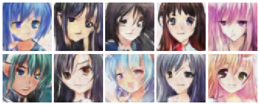

# DCGAN Image Generation Experiment

In this hands-on engineering training, we will use PyTorch to implement the complete DCGAN training pipeline, from data preprocessing to model definition, from adversarial training to image generation, ultimately training a generator model capable of producing cartoon avatar images.

## Experiment Preparation

Before starting the experiment, make sure you have [mounted the data directory](../../appendixes/sandbox.md#data-management) and downloaded the Cartoon Face dataset. You can automate this using the `DMLA-CLI` tool:

```bash
# Select "Download Dataset" -> Select "Cartoon Face"
dmla data
```

Verify that the dataset has been downloaded correctly and check its structure. The Cartoon Face dataset contains tens of thousands of cartoon avatar images, suitable for face generation tasks, covering a variety of styles and expressions of cartoon faces.

```python runnable gpu
import os

# Check if the data directory exists (DATA_DIR is automatically injected by the kernel)
data_dir = os.path.join(DATA_DIR, 'datasets', 'cartoon-face')

if os.path.exists(data_dir):
    print("Dataset directory already exists")
    
    # Recursively count the number of images
    image_count = 0
    image_extensions = ('.jpg', '.jpeg', '.png', '.bmp', '.webp')
    for root, dirs, files in os.walk(data_dir):
        for f in files:
            if f.lower().endswith(image_extensions) and not f.startswith('.'):
                image_count += 1
    
    print(f"Total images: {image_count}")
    
    # Check the dimensions of a few sample images
    from PIL import Image
    sample_images = []
    for root, dirs, files in os.walk(data_dir):
        for f in files:
            if f.lower().endswith(image_extensions) and not f.startswith('.'):
                sample_images.append(os.path.join(root, f))
                if len(sample_images) >= 3:
                    break
        if len(sample_images) >= 3:
            break
    
    if sample_images:
        for img_path in sample_images:
            img = Image.open(img_path)
            print(f"Sample image: {os.path.basename(img_path)}, Size: {img.size}, Format: {img.mode}")
else:
    print("Dataset not downloaded. Please run 'dmla data' to download the dataset")
```

## Phase 1: Data Preprocessing

The primary consideration in GAN training data preprocessing is normalizing images to a range consistent with the generator's output. Since the DCGAN generator's final layer uses $\tanh$ activation, whose output range is $[-1, 1]$, real images also need to be normalized to the same range; otherwise, the discriminator will not be able to effectively distinguish between real and generated images. The engineering decisions in this phase revolve around the following two points:

- **Normalization range**: Use `Normalize(mean=[0.5, 0.5, 0.5], std=[0.5, 0.5, 0.5])` to map image pixels from $[0, 1]$ to $[-1, 1]$. This is the standard normalization approach for GAN training, different from the ImageNet normalization commonly used in classification tasks. Classification tasks use per-channel mean and variance normalization to make feature distributions similar across channels; GAN uses fixed-value normalization to match the $\tanh$ output range. If ImageNet normalization (`mean=[0.485, 0.456, 0.406]`) were used, the numerical ranges of real and generated images would not match, and the discriminator would be unable to learn effective discriminative features.
- **Memory preloading**: The experiment preloads all images into memory during Dataset initialization. GAN training requires 100 epochs, and reading and decoding images from disk for each batch would make I/O overhead a training bottleneck. The preloading strategy performs PIL decoding, Resize, and Normalize operations all at once during initialization; the `__getitem__` method directly returns in-memory tensors during the training loop, and the DataLoader only needs to handle indexing and batch assembly. Converting 70,000 images to FP32 tensors takes approximately 3.2 GB of memory, which is affordable for modern systems.

Since there is no disk caching process in the preprocessing phase, the code in this phase does not need to be invoked manually and will be executed automatically during training.

```python runnable gpu
import torch
from torch.utils.data import Dataset, DataLoader
from torchvision import transforms
from PIL import Image
import os
import time

class CartoonFaceDataset(Dataset):
    """Cartoon Face Dataset (memory preloading version)

    Decodes, transforms, and caches all images as tensors during initialization.
    During training, __getitem__ directly returns in-memory tensors,
    eliminating per-batch file I/O and PIL decoding overhead.
    """
    def __init__(self, root_dir, base_transform, augment_transform=None):
        self.augment_transform = augment_transform
        self.data = []
        
        # Scan all image paths
        image_paths = []
        image_extensions = ('.jpg', '.jpeg', '.png', '.bmp', '.webp')
        for root, dirs, files in os.walk(root_dir):
            for f in files:
                if f.lower().endswith(image_extensions) and not f.startswith('.'):
                    image_paths.append(os.path.join(root, f))
        
        print(f"Found {len(image_paths)} images, starting preload to memory...")
        load_start = time.time()
        
        # Decode, transform, and store as tensors all at once
        for i, img_path in enumerate(image_paths):
            image = Image.open(img_path).convert('RGB')
            tensor = base_transform(image)  # Resize + ToTensor + Normalize
            self.data.append(tensor)
            if (i + 1) % 10000 == 0:
                print(f"  Loaded {i+1}/{len(image_paths)} images...")
        
        load_time = time.time() - load_start
        mem_mb = len(self.data) * self.data[0].nelement() * 4 / 1024 / 1024
        print(f"Preload complete: {len(self.data)} images, took {load_time:.1f}s, memory usage ~{mem_mb:.0f}MB")
    
    def __len__(self):
        return len(self.data)
    
    def __getitem__(self, idx):
        img = self.data[idx]
        # Only apply random augmentation (horizontal flip) during training
        if self.augment_transform:
            # Random flip for tensors: PIL's RandomHorizontalFlip does not work on tensors,
            # so we implement it manually with torch
            if torch.rand(1).item() < 0.5:
                img = torch.flip(img, dims=[2])  # horizontal flip (W dimension)
        return img
```

## Phase 2: Model Definition

DCGAN is a landmark improvement that systematically introduces convolutional neural networks into GANs, which we have already introduced in the [GAN theory chapter](./gan.md#gan-variants). The original GAN used MLP structures, which could not effectively capture the spatial structural features of images. The core improvement of DCGAN is replacing fully connected layers with convolutional layers: the generator uses transposed convolution for progressive upsampling, expanding from low-dimensional noise vectors to high-dimensional images; the discriminator uses standard convolution for progressive downsampling, compressing from high-dimensional images to real/fake judgments. The DCGAN paper provides a series of architecture design guidelines validated through extensive experiments, and this experiment follows these guidelines:

1. **Replace fully connected layers with convolutional layers**: Fully connected layers ignore the spatial structure of images, while convolutional layers are naturally suited for processing local features of 2D images.
2. **Generator uses transposed convolution for upsampling**: Avoids the combination of upsampling + convolution; transposed convolution directly learns the upsampling approach, yielding better generation quality.
3. **Discriminator uses strided convolution for downsampling**: Avoids pooling layers (MaxPool/AvgPool); strided convolution allows the network to learn its own downsampling approach, resulting in stronger discriminative ability.
4. **Batch normalization**: Applied everywhere in the generator except the output layer, and everywhere in the discriminator except the input layer. The generator's output layer does not use BN because BN would force the output distribution to be normalized, weakening the expressiveness of $\tanh$. The discriminator's input layer does not use BN because BN would destroy the original distribution characteristics of the input data, affecting the ability to discriminate real samples.
5. **Activation function selection**: The generator uses ReLU for intermediate layers and $\tanh$ for the output layer (output range $[-1, 1]$, matching normalized real images); the discriminator uses LeakyReLU (slope 0.2) for intermediate layers and Sigmoid for the output layer (output probability $[0, 1]$). LeakyReLU is more suitable than ReLU for the discriminator because it preserves small gradients ($\alpha = 0.2$) in the negative region, preventing complete gradient vanishing, which is crucial for the discriminator to learn "features of fake samples."
6. **Remove bias from convolutional layers**: Layers with BN do not need bias because BN itself has a shift parameter $\beta$, making the two functionally redundant.

```python runnable gpuonly extract-class="DCGANGenerator"
import torch
import torch.nn as nn

class DCGANGenerator(nn.Module):
    """
    DCGAN Generator
    
    Input: noise vector z (latent_dim dimensions)
    Output: 64x64x3 RGB image (value range [-1, 1])
    
    Architecture: transposed convolution for progressive upsampling
    1x1 -> 4x4 -> 8x8 -> 16x16 -> 32x32 -> 64x64
    """
    def __init__(self, latent_dim=100, img_channels=3):
        super(DCGANGenerator, self).__init__()
        self.latent_dim = latent_dim
        
        self.main = nn.Sequential(
            # Input: latent_dim x 1 x 1 -> 512 x 4 x 4
            nn.ConvTranspose2d(latent_dim, 512, kernel_size=4, stride=1, padding=0, bias=False),
            nn.BatchNorm2d(512),
            nn.ReLU(True),
            
            # 512 x 4 x 4 -> 256 x 8 x 8
            nn.ConvTranspose2d(512, 256, kernel_size=4, stride=2, padding=1, bias=False),
            nn.BatchNorm2d(256),
            nn.ReLU(True),
            
            # 256 x 8 x 8 -> 128 x 16 x 16
            nn.ConvTranspose2d(256, 128, kernel_size=4, stride=2, padding=1, bias=False),
            nn.BatchNorm2d(128),
            nn.ReLU(True),
            
            # 128 x 16 x 16 -> 64 x 32 x 32
            nn.ConvTranspose2d(128, 64, kernel_size=4, stride=2, padding=1, bias=False),
            nn.BatchNorm2d(64),
            nn.ReLU(True),
            
            # 64 x 32 x 32 -> 3 x 64 x 64
            nn.ConvTranspose2d(64, img_channels, kernel_size=4, stride=2, padding=1, bias=False),
            nn.Tanh()
        )
    
    def forward(self, z):
        # Reshape noise vector to 4D tensor: (batch, latent_dim, 1, 1)
        return self.main(z.view(z.size(0), z.size(1), 1, 1))

class DCGANDiscriminator(nn.Module):
    """
    DCGAN Discriminator
    
    Input: 64x64x3 RGB image (value range [-1, 1])
    Output: real/fake probability [0, 1]
    
    Architecture: convolution for progressive downsampling
    64x64 -> 32x32 -> 16x16 -> 8x8 -> 4x4 -> 1x1
    """
    def __init__(self, img_channels=3):
        super(DCGANDiscriminator, self).__init__()
        
        self.main = nn.Sequential(
            # 3 x 64 x 64 -> 64 x 32 x 32 (no BatchNorm)
            nn.Conv2d(img_channels, 64, kernel_size=4, stride=2, padding=1, bias=False),
            nn.LeakyReLU(0.2, inplace=True),
            
            # 64 x 32 x 32 -> 128 x 16 x 16
            nn.Conv2d(64, 128, kernel_size=4, stride=2, padding=1, bias=False),
            nn.BatchNorm2d(128),
            nn.LeakyReLU(0.2, inplace=True),
            
            # 128 x 16 x 16 -> 256 x 8 x 8
            nn.Conv2d(128, 256, kernel_size=4, stride=2, padding=1, bias=False),
            nn.BatchNorm2d(256),
            nn.LeakyReLU(0.2, inplace=True),
            
            # 256 x 8 x 8 -> 512 x 4 x 4
            nn.Conv2d(256, 512, kernel_size=4, stride=2, padding=1, bias=False),
            nn.BatchNorm2d(512),
            nn.LeakyReLU(0.2, inplace=True),
            
            # 512 x 4 x 4 -> 1 x 1 x 1
            nn.Conv2d(512, 1, kernel_size=4, stride=1, padding=0, bias=False),
            nn.Sigmoid()
        )
    
    def forward(self, img):
        return self.main(img).view(-1)

# Create generator instance
generator = DCGANGenerator(latent_dim=100)

# Print model structure
print("DCGAN Generator Structure:")
print(generator)

# Count parameters
total_params = sum(p.numel() for p in generator.parameters())
print(f"\nGenerator parameters: {total_params:,}")

# Test forward pass
noise = torch.randn(16, 100)
fake_images = generator(noise)
print(f"Input noise shape: {noise.shape}")
print(f"Generated image shape: {fake_images.shape}")
print(f"Output value range: [{fake_images.min():.2f}, {fake_images.max():.2f}]")

# Create discriminator instance
discriminator = DCGANDiscriminator()

# Print model structure
print("DCGAN Discriminator Structure:")
print(discriminator)

# Count parameters
total_params = sum(p.numel() for p in discriminator.parameters())
print(f"\nDiscriminator parameters: {total_params:,}")

# Test forward pass
fake_images = torch.randn(16, 3, 64, 64)
output = discriminator(fake_images)
print(f"Input image shape: {fake_images.shape}")
print(f"Discriminator output shape: {output.shape}")
print(f"Output value range: [{output.min():.4f}, {output.max():.4f}]")
```

Weight initialization in DCGAN requires special attention. The stability of GAN training is highly dependent on the initial weights; incorrect initialization can lead to vanishing gradients or mode collapse in the early stages of training. The weight initialization strategy recommended by the DCGAN paper samples weights for convolutional and transposed convolutional layers from a normal distribution $\mathcal{N}(0, 0.02)$. A standard deviation of 0.02 is slightly larger than the default 0.01, providing sufficient initial gradient signals without causing gradient explosion. The scaling parameter $\gamma$ of BN layers is initialized to 1 and the shift parameter $\beta$ to 0, which are PyTorch's default settings and require no additional modification.

```python runnable gpu
import torch.nn as nn

def weights_init_normal(m):
    """DCGAN weight initialization
    
    Conv/ConvTranspose layers: N(0, 0.02)
    BatchNorm layers: weight=1, bias=0
    """
    classname = m.__class__.__name__
    if classname.find('Conv') != -1:
        nn.init.normal_(m.weight.data, 0.0, 0.02)
    elif classname.find('BatchNorm') != -1:
        nn.init.normal_(m.weight.data, 1.0, 0.02)  # BatchNorm weight initialized to mean 1.0
        nn.init.constant_(m.bias.data, 0)

# Import models from shared module
from shared.gan.dcgan_generator import DCGANGenerator
from shared.gan.dcgan_discriminator import DCGANDiscriminator

generator = DCGANGenerator(latent_dim=100)
discriminator = DCGANDiscriminator()

generator.apply(weights_init_normal)
discriminator.apply(weights_init_normal)

# Verify initialization results
print("Weight initialization verification:")
for name, param in generator.named_parameters():
    if 'weight' in name and param.requires_grad:
        print(f"  {name}: mean={param.data.mean():.6f}, std={param.data.std():.6f}")
```

## Phase 3: Model Training

GAN training is the most critical and challenging part of this experiment. Compared to the models we have studied previously, there are two key differences. First, GANs need to simultaneously optimize two mutually adversarial networks. Second, the training objective is not to minimize some clear loss value but to achieve a dynamic equilibrium between the two networks through adversarial interaction. These two differences make GAN training far more difficult than classification network training — it is prone to non-convergence and training collapse, which is why GAN training is often referred to as "alchemy." Therefore, the engineering decisions in this phase primarily revolve around training stability:

- **Loss function selection**: Use [Binary Cross Entropy Loss](../../statistical-learning/linear-models/logistic-regression.md#cross-entropy-loss) (BCE Loss). This is the standard loss function for GAN training, treating the discriminator as a binary classifier with label 1 for real samples and label 0 for generated samples. The gradient properties of BCE Loss perfectly match GAN training requirements: when the discriminator output is close to the target, the gradient is small (stable); when far from the target, the gradient is large (fast learning).

- **Label smoothing**: Reduce the target label for real samples from 1.0 to 0.9, i.e., one-sided label smoothing. The intuition behind this engineering trick is that the discriminator outputting 1.0 for real samples indicates absolute certainty, and such extreme confidence leads to vanishing gradient signals (the discriminator is already perfect, so the generator cannot obtain learning signals from it) and overfitting to specific details of real samples. Lowering the target to 0.9 preserves some uncertainty in the discriminator, leaving gradient space for the generator. Note that only real labels are smoothed, not fake labels (still 0.0), because smoothing fake labels would make the discriminator think fake images are also somewhat real, weakening discriminative ability.

- **Optimizer parameters**: Use the [Adam optimizer](../../deep-learning/neural-network-optimization/adaptive-optimizers.md#adam), but with different parameters than classification tasks. Learning rate is 0.0002 (classification tasks commonly use 0.01), $\beta_1 = 0.5$ (classification tasks commonly use 0.9). Reducing $\beta_1$ is a key finding of the DCGAN paper. $\beta_1$ controls the decay rate of the momentum term; a higher $\beta_1$ (e.g., 0.9) causes the optimizer to remember too much historical gradient direction, leading to training oscillations. Reducing it to 0.5 decreases the influence of momentum, making each update more dependent on the current gradient, resulting in more stable training.

- **Training ratio**: Train the discriminator and generator for 1 step each (1:1 ratio). This is the simplest training strategy, without using the 5:1 ratio mentioned in [GAN Adversarial Training](gan.md#generator-discriminator-adversarial-training) (discriminator trains 5 steps, generator trains 1 step) that keeps the discriminator with a moderate advantage to provide better gradient signals. However, for DCGAN training on 64x64 images, the 1:1 ratio is usually stable enough and offers higher training efficiency.

::: info Estimated Training Time

70,000 cartoon avatar images, 100 epochs, approximately 8 GB of VRAM required. GPU training takes about 20 minutes.

:::

```python runnable gpuonly timeout=unlimited
import torch
import torch.nn as nn
import torch.optim as optim
import os
import time

# Import progress reporter module
from dmla_progress import ProgressReporter

# Import models from shared module
from shared.gan.dcgan_generator import DCGANGenerator
from shared.gan.dcgan_discriminator import DCGANDiscriminator

# Import dataset (DATA_DIR is automatically injected by the kernel)
from torchvision import transforms
from torch.utils.data import Dataset, DataLoader
from PIL import Image

class CartoonFaceDataset(Dataset):
    """Cartoon Face Dataset (memory preloading version)"""
    def __init__(self, root_dir, base_transform, augment_transform=None):
        self.augment_transform = augment_transform
        self.data = []
        image_extensions = ('.jpg', '.jpeg', '.png', '.bmp', '.webp')
        image_paths = []
        for root, dirs, files in os.walk(root_dir):
            for f in files:
                if f.lower().endswith(image_extensions) and not f.startswith('.'):
                    image_paths.append(os.path.join(root, f))
        
        print(f"Found {len(image_paths)} images, starting preload to memory...", flush=True)
        load_start = time.time()
        for i, img_path in enumerate(image_paths):
            image = Image.open(img_path).convert('RGB')
            tensor = base_transform(image)
            self.data.append(tensor)
            if (i + 1) % 10000 == 0:
                print(f"  Loaded {i+1}/{len(image_paths)} images...", flush=True)
        load_time = time.time() - load_start
        mem_mb = len(self.data) * self.data[0].nelement() * 4 / 1024 / 1024
        print(f"Preload complete: {len(self.data)} images, took {load_time:.1f}s, memory ~{mem_mb:.0f}MB", flush=True)
    
    def __len__(self):
        return len(self.data)
    
    def __getitem__(self, idx):
        img = self.data[idx]
        if self.augment_transform:
            if torch.rand(1).item() < 0.5:
                img = torch.flip(img, dims=[2])
        return img

# Weight initialization
def weights_init_normal(m):
    classname = m.__class__.__name__
    if classname.find('Conv') != -1:
        nn.init.normal_(m.weight.data, 0.0, 0.02)
    elif classname.find('BatchNorm') != -1:
        nn.init.normal_(m.weight.data, 1.0, 0.02)
        nn.init.constant_(m.bias.data, 0)

# === Training Configuration ===
latent_dim = 100
batch_size = 128
num_epochs = 100
lr = 0.0002
beta1 = 0.5
real_label_smooth = 0.9  # One-sided label smoothing

# === Create Models ===
device = torch.device('cuda' if torch.cuda.is_available() else 'cpu')
print(f"Using device: {device}", flush=True)
if device.type == 'cuda':
    print(f"GPU: {torch.cuda.get_device_name(0)}", flush=True)
    print(f"VRAM: {torch.cuda.get_device_properties(0).total_memory / 1024 / 1024:.0f} MB", flush=True)

generator = DCGANGenerator(latent_dim=latent_dim).to(device)
discriminator = DCGANDiscriminator().to(device)
generator.apply(weights_init_normal)
discriminator.apply(weights_init_normal)

print(f"Generator parameters: {sum(p.numel() for p in generator.parameters()):,}", flush=True)
print(f"Discriminator parameters: {sum(p.numel() for p in discriminator.parameters()):,}", flush=True)

# CUDA warmup: first execution triggers JIT compilation, completed early to avoid stuttering during training
print("Performing CUDA warmup...", flush=True)
with torch.no_grad():
    _warmup_noise = torch.randn(4, latent_dim, device=device)
    _warmup_fake = generator(_warmup_noise)
    _warmup_out = discriminator(_warmup_fake)
torch.cuda.synchronize()
print("CUDA warmup complete", flush=True)

# === Loss Function and Optimizers ===
criterion = nn.BCELoss()
optimizer_G = optim.Adam(generator.parameters(), lr=lr, betas=(beta1, 0.999))
optimizer_D = optim.Adam(discriminator.parameters(), lr=lr, betas=(beta1, 0.999))

# Create fixed noise for tracking training progress
fixed_noise = torch.randn(64, latent_dim, device=device)

# === Create DataLoader ===
base_transform = transforms.Compose([
    transforms.Resize((64, 64)),
    transforms.ToTensor(),
    transforms.Normalize(mean=[0.5, 0.5, 0.5], std=[0.5, 0.5, 0.5])
])

data_dir = os.path.join(DATA_DIR, 'datasets', 'cartoon-face')
if not os.path.exists(data_dir):
    print("Error: Dataset not downloaded. Please run 'dmla data' to download the dataset", flush=True)
else:
    dataset = CartoonFaceDataset(data_dir, base_transform=base_transform, augment_transform=True)
    dataloader = DataLoader(dataset, batch_size=batch_size, shuffle=True, num_workers=0, pin_memory=True)
    num_batches = len(dataloader)
    
    # Create output directories
    sample_dir = os.path.join(DATA_DIR, 'outputs', 'training_samples')
    os.makedirs(sample_dir, exist_ok=True)
    model_dir = os.path.join(DATA_DIR, 'models', 'gan', 'dcgan')
    checkpoints_dir = os.path.join(model_dir, 'checkpoints')
    os.makedirs(checkpoints_dir, exist_ok=True)
    final_dir = os.path.join(model_dir, 'final')
    os.makedirs(final_dir, exist_ok=True)
    
    # Training progress (tracked per batch for more frequent updates)
    total_batches = num_epochs * num_batches
    progress = ProgressReporter(total_steps=total_batches, description="Training DCGAN")
    
    # Training log
    log_path = os.path.join(model_dir, 'training_log.txt')
    log_entries = []
    
    print(f"Starting training: {num_epochs} epochs, {num_batches} batches/epoch", flush=True)
    print(f"Training config: lr={lr}, beta1={beta1}, batch_size={batch_size}, label_smooth={real_label_smooth}", flush=True)
    
    global_batch = 0
    for epoch in range(num_epochs):
        epoch_start = time.time()
        
        for i, real_images in enumerate(dataloader):
            real_images = real_images.to(device)
            batch_size_actual = real_images.size(0)
            
            # ========== Train Discriminator ==========
            optimizer_D.zero_grad()
            
            # Real samples: target label uses label smoothing (0.9 instead of 1.0)
            real_labels = torch.full((batch_size_actual,), real_label_smooth, device=device)
            real_output = discriminator(real_images)
            loss_D_real = criterion(real_output, real_labels)
            
            # Generated samples: target label is 0
            noise = torch.randn(batch_size_actual, latent_dim, device=device)
            fake_images = generator(noise)
            fake_labels = torch.zeros(batch_size_actual, device=device)
            # detach() prevents gradients from flowing to the generator; the discriminator only updates its own parameters
            fake_output = discriminator(fake_images.detach())
            loss_D_fake = criterion(fake_output, fake_labels)
            
            loss_D = loss_D_real + loss_D_fake
            loss_D.backward()
            optimizer_D.step()
            
            # ========== Train Generator ==========
            optimizer_G.zero_grad()
            
            # Recompute discriminator output on fake samples (using updated discriminator weights)
            # The generator wants the discriminator to classify fake samples as real (target label 1.0, no smoothing)
            fake_output_for_G = discriminator(fake_images)
            target_labels = torch.full((batch_size_actual,), 1.0, device=device)
            loss_G = criterion(fake_output_for_G, target_labels)
            loss_G.backward()
            optimizer_G.step()
            
            global_batch += 1
            
            # Update progress report every 50 batches (avoid frequent file writes to reduce performance impact)
            if global_batch % 50 == 0 or global_batch == 1:
                progress.update(
                    global_batch,
                    message=f"Epoch {epoch+1} Batch {i+1}/{num_batches}: G_loss={loss_G.item():.4f}, D_loss={loss_D.item():.4f}"
                )
        
        epoch_time = time.time() - epoch_start
        
        # Log this epoch's losses
        log_entries.append({
            'epoch': epoch + 1,
            'G_loss': loss_G.item(),
            'D_loss': loss_D.item(),
            'time': epoch_time
        })
        
        print(f"Epoch [{epoch+1}/{num_epochs}] G_loss: {loss_G.item():.4f} D_loss: {loss_D.item():.4f} Time: {epoch_time:.1f}s", flush=True)
        
        # Save training sample images every 10 epochs
        if (epoch + 1) % 10 == 0:
            with torch.no_grad():
                fake_samples = generator(fixed_noise)
            # Denormalize [-1, 1] -> [0, 1]
            fake_samples = (fake_samples + 1) / 2.0
            from torchvision.utils import save_image
            save_image(fake_samples, os.path.join(sample_dir, f'epoch_{epoch+1}.png'), nrow=8, padding=2)
            print(f"  -> Saved training samples: epoch_{epoch+1}.png", flush=True)
        
        # Save checkpoint every 20 epochs
        if (epoch + 1) % 20 == 0:
            torch.save({
                'epoch': epoch + 1,
                'generator_state_dict': generator.state_dict(),
                'discriminator_state_dict': discriminator.state_dict(),
                'optimizer_G_state_dict': optimizer_G.state_dict(),
                'optimizer_D_state_dict': optimizer_D.state_dict(),
                'G_loss': loss_G.item(),
                'D_loss': loss_D.item(),
            }, os.path.join(checkpoints_dir, f'epoch_{epoch+1}.pth'))
            print(f"  -> Saved checkpoint: epoch_{epoch+1}.pth", flush=True)
    
    # Save final model
    torch.save(generator.state_dict(), os.path.join(final_dir, 'dcgan_generator_cartoon_face.pth'))
    progress.complete(message=f"Training complete! G_loss: {loss_G.item():.4f}, D_loss: {loss_D.item():.4f}")
    
    # Save training log
    with open(log_path, 'w') as f:
        f.write("epoch,g_loss,d_loss,time\n")
        for entry in log_entries:
            f.write(f"{entry['epoch']},{entry['G_loss']:.4f},{entry['D_loss']:.4f},{entry['time']:.1f}\n")
    print(f"Training log saved: {log_path}", flush=True)
    print(f"Final model saved: {os.path.join(final_dir, 'dcgan_generator_cartoon_face.pth')}", flush=True)
```

## Phase 4: Inference and Evaluation

After training is complete, use the generator to produce cartoon avatar images from random noise. The inference phase of GANs is still very different from classification models. Classification models take a real image as input and output a class label, while the GAN generator only needs a random noise vector as input to generate entirely new images, requiring no real data input at all. This is the charm of generative models — the model learns not to predict but to create. The key engineering points for the inference phase are as follows:

1. **Model loading**: Prioritize loading the final model, then fall back to checkpoints. If neither is found, use an untrained model with random weights (for testing only; the generated results will be meaningless noise).
2. **Noise dimension**: Must match the `latent_dim` used during training (100 in this experiment); otherwise, the model cannot process the input correctly.
3. **Denormalization**: The generator output value range is $[-1, 1]$ ($\tanh$ activation function), so it needs to be denormalized to $[0, 1]$ for display and saving, i.e., $(x + 1) / 2$.
4. **Generation count**: Generate 10 cartoon avatars to demonstrate the model's generation diversity under different random inputs.

```python runnable gpu
import torch
import os
import matplotlib
matplotlib.use('Agg')
import matplotlib.pyplot as plt

# Import generator from shared module
from shared.gan.dcgan_generator import DCGANGenerator

# Load the trained model (DATA_DIR is automatically injected by the kernel)
latent_dim = 100
device = torch.device('cuda' if torch.cuda.is_available() else 'cpu')

generator = DCGANGenerator(latent_dim=latent_dim).to(device)

model_path = os.path.join(DATA_DIR, 'models', 'gan', 'dcgan', 'final', 'dcgan_generator_cartoon_face.pth')
checkpoint_dir = os.path.join(DATA_DIR, 'models', 'gan', 'dcgan', 'checkpoints')

if os.path.exists(model_path):
    generator.load_state_dict(torch.load(model_path, map_location=device, weights_only=True))
    print("Loaded final generator model")
elif os.path.exists(checkpoint_dir):
    import glob
    checkpoints = glob.glob(os.path.join(checkpoint_dir, '*.pth'))
    if checkpoints:
        latest = max(checkpoints, key=lambda x: int(x.split('_')[-1].split('.')[0]))
        ckpt = torch.load(latest, map_location=device, weights_only=True)
        generator.load_state_dict(ckpt['generator_state_dict'])
        print(f"Loaded checkpoint (Epoch {ckpt['epoch']})")
    else:
        print("No trained model found, using untrained model (results will be meaningless)")
else:
    print("No trained model found, using untrained model (results will be meaningless)")

generator.eval()

# Generate 10 cartoon avatars
num_images = 10
noise = torch.randn(num_images, latent_dim, device=device)

with torch.no_grad():
    generated_images = generator(noise)

# Denormalize: [-1, 1] -> [0, 1]
generated_images = (generated_images + 1) / 2.0

# Display generated results directly, maintaining 64x64 original resolution
fig, axes = plt.subplots(2, 5, figsize=(6.4, 2.56))
for i, ax in enumerate(axes.flat):
    if i < num_images:
        img = generated_images[i].permute(1, 2, 0).cpu().numpy().clip(0, 1)
        ax.imshow(img, interpolation='nearest')
    ax.axis('off')

plt.subplots_adjust(wspace=0.05, hspace=0.05)
from io import BytesIO
buf = BytesIO()
fig.savefig(buf, format='png', dpi=100, bbox_inches='tight', pad_inches=0.05)
buf.seek(0)
plt.close(fig)

from PIL import Image
display(Image.open(buf))
```

## Conclusion

The training results of DCGAN on the Cartoon Face dataset don't have a clear metric like accuracy that should be as high as possible in classification tasks. Instead, the goal is to achieve a dynamic balance between the generator and the discriminator. This peculiarity means that evaluating GAN training cannot simply rely on loss curves; it requires comprehensive judgment from multiple dimensions.

1. **Interpreting training losses**: The loss curves of GANs are completely different from those of classification networks. In classification networks, monotonically decreasing training and validation losses indicate successful training, while in GANs, G_loss and D_loss continuously oscillate throughout training, which is normal. This is due to the dynamic nature of adversarial games: the generator improves -> discriminator loss increases -> the discriminator improves -> generator loss increases -> and the cycle repeats. Loss oscillation does not mean training failure; only when one side's loss is persistently zero or continuously rising without convergence does it indicate failure. The most reliable way to judge whether GAN training is successful is to directly observe the quality of generated images, rather than analyzing the loss curves.

2. **Generation quality assessment**: 100 epochs of training (about 15-20 minutes of training time) typically produce images with some structure, but the quality is far from real data. This is similar to the 45% accuracy in the AlexNet experiment — a reasonable result under resource constraints. The "photorealistic quality" reported in GAN literature usually comes from hundreds or even thousands of epochs of training, combined with more complex architectures (such as Progressive GAN, StyleGAN) and more refined training techniques (such as gradient penalty, feature matching loss). The goal of this experiment is to understand the mechanism of adversarial training by fully implementing the DCGAN training pipeline, rather than pursuing competition-level generation quality.

3. **Engineering improvement directions**: If you wish to further improve generation quality, consider the following directions:

    - **Increase training epochs**: Raise the number of epochs from 100 to 200-500. This is the most direct improvement. GANs converge much more slowly than classification networks, and 100 epochs are often insufficient.
    - **Use more complex architectures**: DCGAN is a 2015 architecture; modern GANs have better designs. For example, WGAN-GP uses gradient penalty instead of weight clipping, PGGAN uses progressive training strategies, and StyleGAN uses style injection mechanisms. The goal of these architectural improvements is to address training stability issues.
    - **Adjust training ratio**: Try the strategy of training the discriminator for 5 steps and the generator for 1 step, allowing the discriminator to maintain a moderate advantage and provide more effective gradient signals.
    - **Use higher resolution**: Increase the image resolution from $64 \times 64$ to $128 \times 128$ or higher, combined with deeper network structures, to generate images with more detail, though training time will increase substantially.

## Results

This experiment fully demonstrates the DCGAN training pipeline. After training is complete, the following files will be saved to the data directory. The image below shows the training results on the author's machine:



*Figure: DCGAN training results* 

- **Model files**:
    - `<DATA_DIR>/models/gan/dcgan/checkpoints/epoch_20.pth` ~ `epoch_100.pth` - Checkpoint files every 20 epochs
    - `<DATA_DIR>/models/gan/dcgan/final/dcgan_generator_cartoon_face.pth` - Final generator weights
- **Training samples**:
    - `<DATA_DIR>/outputs/training_samples/epoch_10.png` ~ `epoch_100.png` - $8 \times 8$ sample grids every 10 epochs
- **Training log**:
    - `<DATA_DIR>/models/gan/dcgan/training_log.txt` - Per-epoch loss and time records