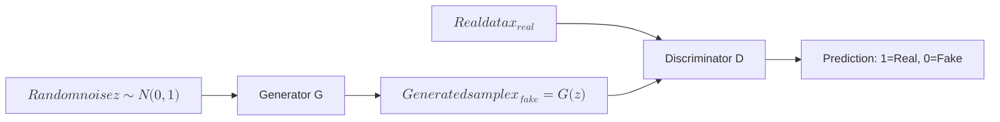
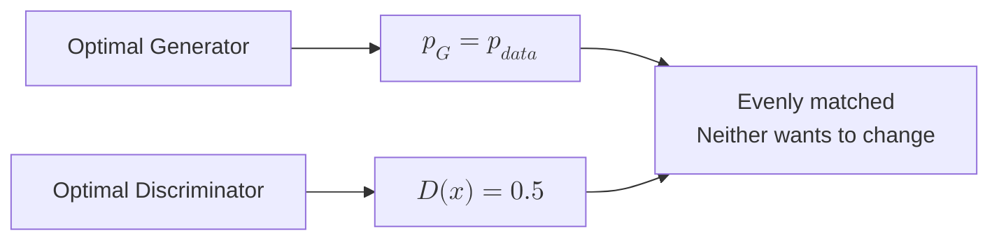
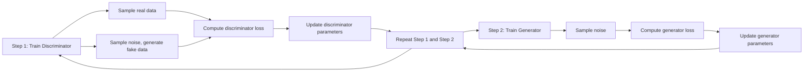
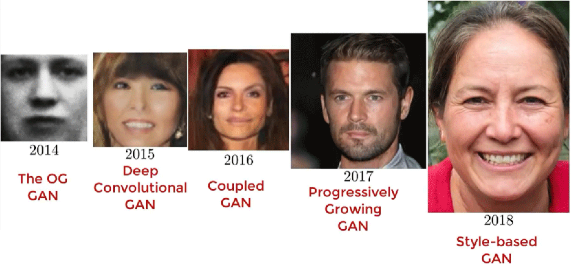

# Generative Adversarial Network

One evening in late spring of 2014, at Montreal's famous The Three Brewers bar, a group of top students from the University of Montreal were celebrating their senior colleague's PhD graduation. These young researchers were mostly students of Turing Award winner Yoshua Bengio. Like any other young men drinking at a bar, their conversations inevitably turned to attractive women. But these Bengio proteges were unlike other young men — that night, they were discussing whether it might be possible to use neural networks to make a machine generate beautiful women's photos to liven things up.

The students proposed using neural networks to learn image features, attempting to statistically analyze the geometric characteristics in images, build a probabilistic statistical model of human photos, and have the machine generate geometric shapes according to the model, from which human-like photos could be selected. This line of thinking perfectly aligned with the orthodox research approach to machine learning applications at the time and was widely endorsed by the discussion participants — except for Ian Goodfellow, who argued this approach would fundamentally not work. He bluntly stated that the best current machine learning could do was generate photos barely distinguishable as human, nothing close to high-quality images of beautiful women. At that moment, a thought struck him like lightning. Goodfellow couldn't wait to rush back to his dorm, fired up his computer while still buzzed, and started coding. In just over an hour, with only a single test, he successfully implemented a working image generation program. When he fed the MNIST dataset to the program, it successfully produced brand new handwritten digit images. Then he fed the [Toronto](https://www.cs.toronto.edu/~urtasun/courses/CSC411/hw3-411.pdf) face dataset to the program, and it truly generated facial photos that had never existed before. Despite the rudimentary nature of the software, hardware, and training data quality, this crude experiment concealed a completely new generative model that Goodfellow would later name the **Generative Adversarial Network (GAN)** — described by Yann LeCun as "the coolest idea in deep learning in the last twenty years" and by Andrew Ng as "a major and fundamental advance." It could even be said that this moment marked the birth of an entirely new research direction in artificial intelligence: Artificial Intelligence Generated Content (AIGC).

## GAN Architecture Design

The idea that flashed through Goodfellow's mind was roughly this: discriminative models and generative models might not be entirely independent, clearly distinct types. If humans cannot directly train a sufficiently performant generative model on their own, could a sufficiently accurate discriminative model replace humans in training an equally excellent generative model?

For ease of understanding, let's use a fictional story to explain Goodfellow's design approach. Readers who frequently print counterfeit money should know that their biggest competitor is not fellow counterfeiters — it's the police. If fake money is so sophisticated that even the police cannot distinguish it, you have achieved complete core competitiveness. On the other hand, as police, their duty is to continuously improve their equipment and professional skills to accurately distinguish real from fake. Within this adversarial game of counterfeiters and police lies the secret to breakthroughs in generative models.

First, play the role of the police, allowed to use any means to identify whether an image (like the one below) is genuine currency. Currently, the best method is naturally a discriminative model based on deep learning. How good can discrimination be? Referring to the ImageNet Large Scale Visual Recognition Challenge results, the average error rate of humans judging the ILSVRC dataset is 5.1%, while the 2015 champion [ResNet](../convolutional-neural-network/resnet.md) achieved an error rate of 3.57%, surpassing the human average. In other words, discriminative models have reached a level where computers can play the role of police with roughly human-average capability.


*Figure: A photo of counterfeit currency*

Next, play the role of the counterfeiter. Initially, your counterfeit currency skills are crude, generating images almost indistinguishable from random noise. The police can see through the forgery at a glance. However, as long as the police inform you of their judgment, you have a basis for reinforcement learning, knowing the direction for improvement. Receiving guidance feedback from the police, you learn from your mistakes, practice diligently, and gradually your techniques mature. Your generated results transform from random to organized, gradually producing high-quality images that can slip past the police's scrutiny.

As this process continues, the police devise increasingly sophisticated techniques to identify counterfeit currency, and the counterfeiter develops increasingly complex methods to forge currency. This is the fundamental concept of **adversarial** in generative adversarial networks. In this scenario, the police play the role of the **discriminator**, and the counterfeiter plays the role of the **generator**. Both are actually trained in the same process. The basic structure of the entire generative adversarial network is shown in the diagram below.


*Figure: Basic structure of generative adversarial network*

The diagram above shows the complete GAN architecture flow. Random noise enters the generator, outputting fake samples; real data and fake samples together enter the discriminator, which outputs a real/fake judgment.

- Generator input is a random noise vector $z$, typically sampled from a standard normal distribution $\mathcal{N}(0, 1)$, with dimensions of 100 or higher. Output is the generated sample $x_{fake} = G(z)$, with the same dimensions as real data (e.g., 784 dimensions for MNIST images). The goal is to make the discriminator misclassify generated samples as real, i.e., $D(G(z))$ close to 1. The generator is a neural network whose parameters are learned through training, and can be structured as an [MLP](../../deep-learning/neural-network-structure/mlp.md), [CNN](../../deep-learning/convolutional-neural-network/cnn-basics.md), or other more complex architectures.

- Discriminator input is the sample $x$, which can be real data $x_{real}$ or generated data $x_{fake}$. Output is the probability $D(x) \in [0, 1]$, indicating the discriminator's belief that the sample is real. A value close to 1 indicates judgment as real, close to 0 as fake. The discriminator's goal is to accurately distinguish real from fake: output close to 1 for real samples, close to 0 for generated samples. The discriminator is a binary classification neural network trained to maximize classification accuracy.

The adversarial relationship between generator and discriminator constitutes a zero-sum game. The generator wants $D(G(z))$ close to 1 (deceiving the discriminator), while the discriminator wants $D(x_{real})$ close to 1 and $D(G(z))$ close to 0 (accurate discrimination). One's success means the other's failure; their goals are completely opposed. The key insight of this adversarial design is that the generator does not need to explicitly learn the form of the data distribution — it only needs to learn how to deceive the discriminator. Meanwhile, the discriminator, in learning to distinguish real from fake, is essentially characterizing the features of real data. The generator indirectly learns these features by fooling the discriminator, eventually producing samples that approximate the real data distribution.

### Mathematical Representation

The training objective of GAN can be formally described in the language of game theory. The discriminator and generator each have their own optimization objectives, conflicting with each other, ultimately reaching some equilibrium state. The discriminator's goal is to maximize judgment accuracy. Specifically, the discriminator expects to output high probabilities for real samples (judged as real) and low probabilities for generated samples (judged as fake). Its mathematical expression is:

$$\max_D \mathbb{E}_{x \sim p_{data}}[\log D(x)] + \mathbb{E}_{z \sim p_z}[\log (1 - D(G(z)))]$$

$\mathbb{E}_{x \sim p_{data}}[\log D(x)]$ is the expected log-probability of real samples. When $D(x)$ is close to 1, $\log D(x)$ is close to 0 (maximum value) — the discriminator correctly identifies real samples. $\mathbb{E}_{z \sim p_z}[\log (1 - D(G(z)))]$ is the expected log-probability of generated samples (log-probability is used instead of raw probability to avoid numerical underflow from multiplying multiple probabilities, and also to obtain larger gradients for faster training). When $D(G(z))$ is close to 0, $\log(1-D(G(z)))$ is close to 0 (maximum value) — the discriminator correctly identifies generated samples. The two parts are summed; maximizing indicates the discriminator wants both types of judgments to be accurate. On the other hand, the generator's goal is to minimize the discriminator's judgment accuracy, or equivalently, to maximize the probability of fooling the discriminator. Mathematically expressed as:

$$\min_G \mathbb{E}_{z \sim p_z}[\log (1 - D(G(z)))]$$

The generator wants $D(G(z))$ close to 1, i.e., the discriminator believes generated samples are real. When $D(G(z))$ is close to 1, $\log(1-D(G(z)))$ approaches $-\infty$ (minimum value) — the generator successfully fools the discriminator. Combining the two objectives, GAN training can be formalized as a [Minimax game](https://en.wikipedia.org/wiki/Minimax):

$$\min_G \max_D V(D, G) = \mathbb{E}_{x \sim p_{data}}[\log D(x)] + \mathbb{E}_{z \sim p_z}[\log (1 - D(G(z)))]$$

The discriminator maximizes the value function $V$ by optimizing $D$, and the generator minimizes the value function $V$ by optimizing $G$. Both search for optimal strategies in this game. This Minimax formulation is the theoretical foundation of GAN training and the starting point for understanding Nash equilibrium.

### Nash Equilibrium

The ideal training endpoint of GAN is for the generator and discriminator to reach [Nash equilibrium](https://en.wikipedia.org/wiki/Nash_equilibrium), a game theory concept describing a stable state where each player's strategy is optimal given the other players' strategies, and no player can benefit by unilaterally changing their strategy. In plain terms, both players in a game have found their best strategies, and whoever changes strategy first will lose, so neither wants to change — reaching a stable state of evenly matched forces.

Nash equilibrium in GAN corresponds to two specific conditions. First, the generated sample distribution $p_G$ is identical to the real data distribution $p_{data}$ — the generator has learned all features of the real data, and generated samples are statistically indistinguishable from real samples. Second, the discriminator cannot distinguish between real and generated samples; for any input $x$, the discriminator outputs 0.5, equivalent to random guessing, as shown in the diagram below.


*Figure: Nash equilibrium state of GAN*

This equilibrium state can be verified through mathematical derivation. When $p_G = p_{data}$, $G(z)$ and $x$ follow the same distribution, and the value function $V$ becomes $V(D, G) = \mathbb{E}_{x \sim p_{data}}[\log D(x) + \log (1 - D(x))]$. The discriminator's optimal strategy needs to maximize this expression. Taking the derivative with respect to $D(x)$ and setting it to zero: $\frac{d}{dD(x)}[\log D(x) + \log (1 - D(x))] = \frac{1}{D(x)} - \frac{1}{1 - D(x)} = 0$, solving gives $D(x) = 0.5$. At this point, the value function is $V(D, G) = \log 0.5 + \log 0.5$, which is the global optimum.

In the GAN context, Nash equilibrium means the generator has learned the real data distribution, generated samples are identical to real samples, and the discriminator cannot distinguish between the two types of samples, outputting only 0.5 as a random guess. In this state, neither party can benefit by unilaterally changing strategy: the generator is already optimal and cannot improve further; the discriminator faces indistinguishable data, so improving discrimination ability is meaningless. This is the ideal endpoint of GAN training and the most difficult goal to achieve in practice.

## Generator-Discriminator Adversarial Training

Having understood GAN's architecture and underlying mathematical principles, we now need to translate this theory into an actual training process. GAN training differs from traditional neural network single-network training — it requires simultaneously optimizing two adversarial networks. GAN employs an alternating training strategy: first fix the generator to train the discriminator, then fix the discriminator to train the generator, alternating updates until convergence. This alternating strategy stems from the nature of the adversarial relationship. If both networks are trained simultaneously, the discriminator may quickly become strong in early training, causing the generator's gradient signal to rapidly vanish, making it unable to catch up with the discriminator's progress. Alternating training ensures both the generator and discriminator have opportunities to improve while their opponent is in a suitable state.


*Figure: GAN training loop*

The diagram above shows the two key steps of the GAN training loop. When training the discriminator, the generator parameters are fixed, and the discriminator learns to distinguish real from fake. When training the generator, the discriminator parameters are fixed, and the generator learns to fool the discriminator. The two steps iterate repeatedly, with the generator and discriminator co-evolving through confrontation. The specific training process can be broken down into the following six steps, of which steps 2 and 5 are critical:

1. Sample real data $x_{real}$ and random noise $z$, generate fake data $x_{fake} = G(z)$ through the generator.
2. Compute discriminator loss $L_D = -\mathbb{E}_{x \sim p_{data}}[\log D(x_{real})] - \mathbb{E}_{z \sim p_z}[\log (1 - D(x_{fake}))]$. The goal is for the discriminator to output probabilities close to 1 for real samples and close to 0 for fake samples. The discriminator is essentially a binary classification network:
    - The first term of the loss $-\mathbb{E}_{x \sim p_{data}}[\log D(x_{real})]$ corresponds to real samples. When $D(x_{real}) \to 1$ (correct discrimination), the loss approaches 0 (minimum); when $D(x_{real}) \to 0$ (incorrect discrimination), the loss approaches $+\infty$ (penalty).
    - The second term of the loss $-\mathbb{E}_{z \sim p_z}[\log (1 - D(x_{fake}))]$ corresponds to generated samples. When $D(x_{fake}) \to 0$ (correct discrimination), the loss approaches 0; when $D(x_{fake}) \to 1$ (incorrect discrimination), the loss approaches $+\infty$. Combined, the discriminator learns to simultaneously correctly identify both real and generated samples.
3. Update discriminator parameters; generator parameters remain fixed.
4. Re-sample noise $z$, generate fake data $x_{fake} = G(z)$.
5. Compute generator loss. The goal is to make the discriminator misclassify fake samples as real. The generator loss has two forms. Although they yield the same mathematical result at Nash equilibrium, their behavior differs significantly in early training, directly affecting convergence.

    - Form 1 directly corresponds to the Minimax game objective $L_G = \mathbb{E}_{z \sim p_z}[\log (1 - D(G(z)))]$. The generator minimizes $\log(1-D(G(z)))$, hoping $D(G(z))$ is close to 1, so the discriminator misclassifies fake samples as real. However, in early training, the generator is weak, $D(G(z))$ is very small, $\log(1-D(G(z)))$ is close to 0, the gradient approaches zero, and the generator struggles to learn.
    - Form 2 instead maximizes $\log D(G(z))$, i.e., $L_G = -\mathbb{E}_{z \sim p_z}[\log D(G(z))]$. This form has larger gradients in early training. Even when $D(G(z))$ is very small, $\log D(G(z))$ is a large negative number with significant gradient. Practical experience shows that Form 2 yields better training results and is the mainstream choice for GAN implementations.
6. Update generator parameters; discriminator parameters remain fixed. Repeat the above steps until convergence.

The theoretical design of GAN training is elegant and concise, but practical training faces severe stability challenges. The ideal endpoint of the adversarial game is Nash equilibrium, but the game between generator and discriminator often struggles to converge, frequently resulting in training collapse. The root cause of training instability lies in the dynamic nature of the adversarial game — the generator and discriminator need to improve synchronously; if either side becomes too strong or too weak, training balance is disrupted. Common problems include:

- **Mode collapse** is GAN's most troublesome problem. The generator should learn to cover all modes of the real data (e.g., all 10 digits of MNIST), but in practice it may only learn to generate a few types of samples, completely losing diversity. This is like a counterfeiter discovering that forging one particular denomination is easiest to fool the police, so they only forge that denomination, abandoning all others. While this might still work for counterfeiting, if a generator trained on MNIST is supposed to generate multiple digits but after collapse outputs the same digit regardless of input noise, such a generator is essentially useless. Mode collapse essentially occurs because the generator's optimization goal is only to fool the discriminator, not to cover the data distribution. If generating one type of sample can fool the discriminator, the generator has no incentive to learn other modes. This aligns with locally optimal strategies in game theory but violates the diversity objective of generative models.

- **Overpowered discriminator** is another serious problem. The discriminator may improve rapidly in early training, quickly reaching a state of perfect discrimination — outputting close to 1 for real samples and close to 0 for generated samples. This does not represent successful discriminator training; rather, it directly causes vanishing gradients for the generator. The generator's gradient depends on the discriminator's output probability. When $D(G(z)) \approx 0$, $\log D(G(z)) \approx -\infty$, and the gradient magnitude of the non-saturating loss is large, still capable of delivering effective learning signals. However, the discriminator's overconfidence can still lead to training instability.

- **Training oscillation** refers to the generator and discriminator alternately gaining the upper hand, unable to converge to Nash equilibrium, causing loss values to fluctuate violently, with training never completing. The ideal state is synchronized improvement leading to an evenly matched final state, but achieving synchronized improvement in practice is difficult.

Various solutions have been proposed for the challenge of GAN training instability, each with different focuses:

- **Adjusting training ratio** is the most intuitive solution. By increasing the number of discriminator training iterations, the discriminator maintains a moderate advantage, providing more effective gradient signals to the generator. A common ratio in practice is 5 discriminator training steps for every 1 generator training step. The rationale is that the discriminator needs to be slightly stronger to accurately characterize data features, allowing the generator to learn useful information from the discriminator. However, too high a ratio may cause the discriminator to become too strong, causing generator gradients to vanish; too low a ratio may result in a weak discriminator unable to provide effective signals. The ratio needs to be adjusted based on the specific task; there is no universally optimal ratio.

- **Label smoothing** prevents the discriminator from becoming "overconfident" by lowering the target value for real samples. In standard GAN training, the discriminator's target output for real samples is 1.0, which may cause the discriminator to quickly achieve perfect discrimination, causing generator gradients to vanish. Label smoothing changes the target to 0.9, forcing the discriminator to retain some uncertainty, leaving gradient space for the generator. The intuition behind this method is that the discriminator doesn't need to be perfect — it only needs to be good enough to provide effective signals. The pursuit of perfection actually cuts off gradient propagation.

- **Gradient penalty** maintains stable gradient signals by constraining the discriminator's gradient norm. A penalty term $L_{GP} = \lambda (\|\nabla_x D(x)\|_2 - 1)^2$ is added to the discriminator's loss function. This penalty term forces the discriminator's gradient norm to be close to 1, preventing gradients from being too large or too small. A gradient norm that is too small makes it difficult for the generator to learn; a gradient norm that is too large causes training instability. Constraining it around 1 maintains moderate gradients.

## GAN vs VAE

VAE and GAN represent two fundamentally different design philosophies for generative models. Understanding their differences helps in choosing the right architecture for practical applications or designing hybrid models that combine the strengths of both.

- VAE's generation principle is "learn distribution, then sample." The encoder maps data to a probability distribution in the latent space, and the decoder reconstructs data by sampling from the distribution. The training objective is to maximize ELBO, which includes reconstruction loss to ensure the decoder can reproduce inputs, and KL divergence loss to ensure the latent space has structure. This design gives VAE's latent codes clear semantic meaning — adjusting a dimension can change specific features of the generated result. However, the downside is that the reconstruction loss tends toward pixel-level accuracy, leading to blurry generated samples. VAE always learns the average representation of data rather than fine-grained details.

- GAN's generation principle is "adversarial game, learn to forge." The generator does not need to explicitly learn the distribution — it only needs to fool the discriminator. The discriminator, in learning to distinguish real from fake, indirectly characterizes features of the real data. The training objective is the Minimax game value function: the generator maximizes the probability of deception, the discriminator maximizes discrimination accuracy. This design makes GAN pursue "visual realism" rather than "pixel accuracy," producing generally clearer, more realistic samples. The cost is that GAN lacks explicit latent space structure, making it difficult to control generated features by adjusting encoding dimensions (later variants have somewhat overcome this limitation).

| Feature | VAE | GAN |
|:--------|:----|:----|
| Generation Principle | Learn data distribution, sample from it | Adversarial training, no explicit distribution |
| Training Objective | Reconstruction loss + KL divergence (ELBO) | Adversarial game loss (Minimax) |
| Generation Quality | Generally blurry but stable | Generally clear but unstable |
| Latent Space | Structured, interpretable, editable | No explicit structure, hard to control |
| Training Stability | Stable, easy to converge | Unstable, may collapse |
| Computational Cost | Lower (single network training) | Higher (two networks alternating training) |

From the table comparison, both VAE and GAN have their pros and cons. VAE excels at stable training and controllable generation, suitable for applications requiring interpretable latent spaces. GAN excels at generating high-quality images, suitable for scenarios pursuing visual effects. The two are not mutually exclusive; subsequent VAE-GAN hybrid models attempt to combine their strengths — using VAE's latent space structure to ensure controllable generation and GAN's adversarial training to enhance visual quality.

## GAN Variants

The proposal of GAN opened a new era of generative models. Although the original GAN was cleverly designed, it suffered from issues such as training instability and limited generation quality. Soon, numerous improved variants emerged, as shown in the diagram below. This section introduces the major milestone variants in chronological order.



*Figure: Development of GAN*

- **DCGAN** (Deep Convolutional GAN) was proposed by Alec Radford et al. in 2015, first systematically introducing convolutional neural network architectures into GAN. The original GAN used MLP structures; for image generation tasks, MLP cannot effectively capture spatial structure in images, limiting generation quality. DCGAN's improvement was replacing fully connected layers with convolutional layers — the generator uses transposed convolutions for upsampling, the discriminator uses convolutions for downsampling — fully leveraging CNN's advantages in image processing.

    DCGAN's generator uses transposed convolutions (also called deconvolutions) for progressive upsampling, expanding from low-dimensional noise to high-dimensional images. After projection through a fully connected layer, the DCGAN generator reshapes to a $4 \times 4 \times 1024$ feature map, then expands through multiple transposed convolutions to a $64 \times 64 \times 3$ image. The discriminator uses standard convolutions for progressive downsampling, compressing from high-dimensional images to a real/fake judgment. Both networks use [Batch Normalization](../../deep-learning/neural-network-stability/batch-normalization.md) to stabilize training, preventing gradient vanishing or explosion. The generator uses ReLU (hidden layers) and tanh (output layer) activation functions, while the discriminator uses Leaky ReLU (hidden layers) and Sigmoid (output layer), as shown in the diagram below. These designs, validated through extensive experiments, replaced the original GAN as the foundation for other image generation models. Subsequent models like StyleGAN and ProGAN all build upon DCGAN's improvements.

    ```nn-arch width=920
    name: DCGAN Network Architecture
    layout: horizontal

    sections:
    - name: Generator
      layers: [z_input, g_proj, g_conv1, g_conv2, g_conv3, g_conv4, g_output]
      row_direction: bidirectional
    - name: Discriminator
      layers: [d_input, d_conv1, d_conv2, d_conv3, d_conv4, d_output]

    layers:
    # === Generator ===
    - {id: z_input, name: Noise z, type: input, size: "100"}
    - {id: g_proj, name: Project+Reshape, type: fc, size: "4x4x1024", act: ReLU}
    - {id: g_conv1, name: DeConv1, type: conv, kernel: 4, stride: 2, channels: 512, out: "8x8x512", act: ReLU}
    - {id: g_conv2, name: DeConv2, type: conv, kernel: 4, stride: 2, channels: 256, out: "16x16x256", act: ReLU}
    - {id: g_conv3, name: DeConv3, type: conv, kernel: 4, stride: 2, channels: 128, out: "32x32x128", act: ReLU}
    - {id: g_conv4, name: DeConv4, type: conv, kernel: 4, stride: 2, channels: 64, out: "64x64x64", act: ReLU}
    - {id: g_output, name: Generated Image, type: output, size: "64x64x3", act: Tanh}
    # === Discriminator ===
    - {id: d_input, name: Real/Fake Image, type: input, size: "64x64x3"}
    - {id: d_conv1, name: Conv1, type: conv, kernel: 4, stride: 2, channels: 64, out: "32x32x64", act: LeakyReLU}
    - {id: d_conv2, name: Conv2, type: conv, kernel: 4, stride: 2, channels: 128, out: "16x16x128", act: LeakyReLU}
    - {id: d_conv3, name: Conv3, type: conv, kernel: 4, stride: 2, channels: 256, out: "8x8x256", act: LeakyReLU}
    - {id: d_conv4, name: Conv4, type: conv, kernel: 4, stride: 2, channels: 512, out: "4x4x512", act: LeakyReLU}
    - {id: d_output, name: Real/Fake, type: output, size: 1, act: Sigmoid}
    ```
*Figure: DCGAN network architecture*

- **Coupled GAN** (CoGAN) was proposed by Ming-Yu Liu in 2016, solving the challenge of joint cross-domain image generation. Traditional GAN can only learn a single data domain's distribution at a time. If you need to generate images from two related domains (such as infrared and visible light images of the same scene, different expressions of the same face, etc.), you must train two independent GANs separately, which cannot guarantee semantic consistency between domains. CoGAN's idea is that although images from different domains have different appearances, they share certain high-level semantics (such as object categories, poses, shapes). By establishing coupling in the noise space and having generators of different domains share some parameters, cross-domain synchronized generation can be achieved.

    CoGAN's architecture is clever and concise. It contains multiple generators and multiple discriminators, with each domain corresponding to a pair of generator and discriminator. The key innovation lies in weight-sharing constraints: generators from different domains share weights in the shallow layers (responsible for encoding high-level semantics), while the deep layers (responsible for domain-specific details) remain independent. The discriminator also adopts this partially shared design. During training, with the same noise vector $z$ as input, generators from different domains output images that are semantically consistent but stylistically different. For example, given random noise, CoGAN can simultaneously generate an MNIST digit and a corresponding SVHN street-view digit — the digit class is the same, but the visual styles are completely different.

    CoGAN has broad application scenarios. Cross-domain image generation is a typical application: given one noise input, simultaneously output multiple domain images such as infrared and visible light, sketch and photo, summer and winter, etc., with all outputs sharing the same content structure. Additionally, CoGAN provided important insights for subsequent research on multi-modal generation and domain adaptation.

- **Progressive GAN** (Progressive Growing of GANs) was proposed by NVIDIA researcher Tero Karras in 2017, using a progressive training strategy to solve the difficulty of high-resolution image generation. The main challenge of training high-resolution GAN is that both the generator and discriminator need to process a large number of pixels, making it difficult to stably converge in early training. Progressive GAN's approach is to start training from low resolution (4x4), gradually increasing resolution (8x8, 16x16, ..., 1024x1024) once stable. Each resolution increase only adds new convolutional layers, while existing layers continue training.

    Training a high-resolution GAN is like asking a novice painter to directly paint a large oil painting — extremely difficult. Progressive training is like having the painter practice small sketches first, mastering the basics before gradually expanding the canvas, progressively reducing difficulty. The low-resolution stage is easy to train, with the generator and discriminator quickly learning basic image structures; the high-resolution stage adds details on this foundation, making training more stable. Progressive GAN's progressive training strategy became the standard method for high-resolution GANs, and subsequent StyleGAN also adopted this strategy.

- **StyleGAN**, also proposed by NVIDIA's Tero Karras in 2019, achieved photorealistic high-quality face generation. StyleGAN's innovation is the style injection mechanism, which injects latent codes into different layers of the generator through AdaIN (Adaptive Instance Normalization), with each layer independently controlling features at different scales. This design gives StyleGAN precise control over generated image features. Adjusting low-level styles changes coarse-grained features (such as face shape, pose); adjusting high-level styles changes fine-grained features (such as hair color, skin details).

    A traditional GAN generator is like a black-box painter — after inputting noise, it directly outputs the painting, with no control over the internal creative process. StyleGAN decomposes the generation process into multiple stages, each capable of injecting different style instructions — like giving the painter step-by-step creative guidance: first determine the face outline, then add facial features, finally adjust hairstyle and skin tone. This layered control enables StyleGAN to generate high-quality, controllable face images.

    StyleGAN (including StyleGAN2 improved in 2020 and StyleGAN3 improved in 2021) generates face images with photographic quality. It can be considered the culmination of GANs — one of the most advanced face generation architectures currently available.

## Summary

Generative Adversarial Network (GAN) introduces game theory concepts into deep learning, pioneering a new paradigm for generative models. The key to understanding GAN lies in grasping the word "adversarial" — the generator and discriminator are both enemies and partners, co-evolving in a zero-sum game to ultimately reach the stable state of Nash equilibrium. This design avoids the difficulty of explicitly modeling data distributions, indirectly learning to generate real samples through adversarial training. GAN's architecture design is both elegant and profound. The generator creates fake samples from random noise, aiming to fool the discriminator; the discriminator judges whether samples are real or fake, aiming to see through the generator. Their adversarial relationship forms a Minimax game, with the ideal state eventually reaching Nash equilibrium — also the ideal endpoint of GAN training.

## Exercises

1. Suppose you need to select a generative model for a medical imaging system: the system needs to generate more training data from a small number of real lung CT slices to assist in training a disease detection model. The generated images must be both visually clear (doctors can identify anatomical structures) and semantically controllable (able to specify generation of slices containing specific lesion types). Based on the characteristics of GAN and VAE, analyze which model is more suitable, or whether a hybrid model is needed. Explain your reasoning.

    <details>
    <summary>Reference Answer</summary>

    **Scenario requirements analysis**:

    This scenario has two main requirements:
    - **Visual clarity**: The generated CT slices must be sufficiently realistic for doctors to identify lung anatomical structures. Blurry generated results cannot be used to train disease detection models.
    - **Semantic controllability**: The ability to specify generation of slices containing specific lesions (such as nodules, fibrosis) rather than random generation. This is key for data augmentation — only generating slices with lesions can improve the disease detection model's ability to recognize rare pathologies.

    **VAE suitability**: VAE's latent space has clear structure. The encoder's output consists of distribution parameters $(\mu, \sigma)$, allowing precise manipulation of each dimension. In theory, latent dimensions corresponding to nodule features can be found, and adjusting values along those dimensions can control whether the generated result contains nodules. This is VAE's strength: an interpretable, editable latent space.

    However, VAE's reconstruction loss pursues pixel-level accuracy, tending to generate the average representation of data, leading to blurry outputs. Lung CT slices require clear tissue boundaries and lesion contours. Blurry images cannot provide effective training signals, and doctors cannot identify anatomical structures. VAE's disadvantage in visual clarity is its critical shortcoming.

    **GAN suitability**: GAN pursues visual realism rather than pixel accuracy, and the generated images are typically clearer and more realistic. Adversarial training forces the generator to learn detailed features of real images. The generated CT slices may visually approach real scans, meeting doctors' identification requirements. However, GAN lacks explicit latent space structure and cannot control generated features by adjusting encoding dimensions like VAE. The original GAN can only generate randomly, unable to specify generation of a slice containing nodules. StyleGAN's style injection mechanism provides a degree of controllability, allowing adjustment of styles at different layers to change coarse and fine-grained features, but this control is less precise and interpretable than VAE's latent space.

    **Best solution: VAE-GAN hybrid model**: Comprehensive analysis shows that this scenario requires both VAE's controllability and GAN's clarity. Using either model alone cannot satisfy both requirements simultaneously. A VAE-GAN hybrid model combines the strengths of both:

    - VAE's encoder maps CT slices to a structured latent space, preserving semantic controllability. When generation of slices containing nodules is needed, a few real CT slices with nodules can be encoded first, extracting dimensions related to lesions from the latent code, then sampling adjusted along those dimensions.
    - GAN's discriminator replaces (or serves as an auxiliary) to VAE's reconstruction loss. Adversarial training forces the decoder to generate visually clear images, avoiding VAE's blurriness problem. The discriminator focuses on whether the image looks realistic rather than whether pixels are precisely reconstructed, encouraging the generation result to preserve tissue boundaries and lesion contour details.

    The loss function of the hybrid model is typically $L = L_{reconstruct} + L_{KL} + L_{GAN}$, where $L_{reconstruct}$ and $L_{KL}$ come from VAE to ensure latent space structure, and $L_{GAN}$ comes from adversarial training to ensure visual quality. The three weights need tuning, with $L_{GAN}$ typically weighted higher to ensure clarity.

    **Practical considerations**: Medical imaging demands extremely high accuracy. When generated data is used to train disease detection models, any false features (such as GAN-produced "phantom lesions") could mislead the model. Therefore, generated CT slices need to be reviewed by doctors to confirm correctness in medical semantics. Additionally, the small amount of real data means higher risk of training instability. The stable training of the VAE component in the VAE-GAN hybrid model can help mitigate this issue.
    </details>
