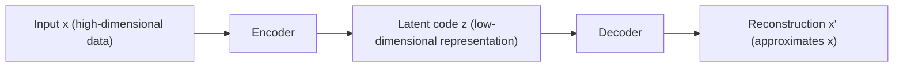
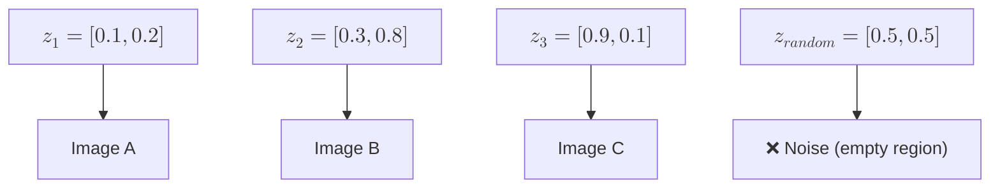
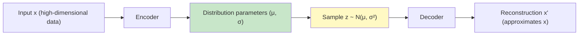
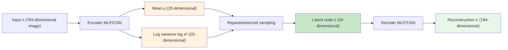
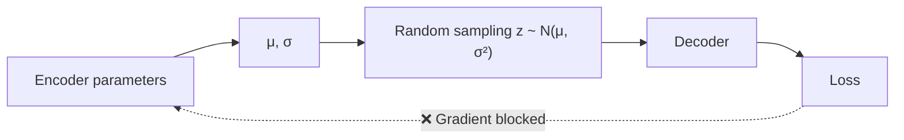
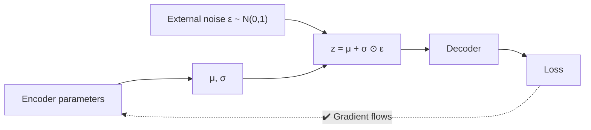

# Variational Autoencoder

For a long time, the mainstream applications of machine learning have been prediction (such as image classification) or decision-making (such as quantitative stock trading). Models used for these tasks are called **discriminative models**. Beyond these, there is another type of task: given existing data or known features, having the machine generate data with specific characteristics. Models that accomplish this type of task are called **generative models**.

Generative models are not a new concept; they actually appeared quite early. In 1957, American composer Lejaren Hiller used homogeneous Markov chains to generate finite-controlled random notes, then tested them through harmonic and contrapuntal rules, finally selecting compliant material to compose the string quartet "Illiac Suite" — the first computer-generated musical work in human history. In 1966, mathematician Leonard Baum proposed the Hidden Markov Model (HMM), the first widely used generative model in the industry (especially in speech processing). Despite their early emergence, generative models struggled to achieve significant practical results for a long time. This is hardly surprising — even discriminative models, which produce relatively well-defined outputs, only saw breakthrough applications after the rise of deep learning. Generative models, which produce much more complex outputs, naturally could not become mainstream in AI applications before that.

In 2013, Diederik Kingma, a PhD student at the University of Amsterdam, together with his advisor Max Welling, published a paper on visual generative models titled "[Auto-Encoding Variational Bayes](https://arxiv.org/abs/1312.6114)" at the International Conference on Learning Representations (ICLR). This work was the first to deeply integrate variational inference with neural networks, proposing the Variational Autoencoder (VAE). The paper originated from a long-standing problem: how to make neural networks learn probability distributions rather than mere point estimates. Traditional autoencoders could only compress and reconstruct data, unable to generate new samples. By introducing a probabilistic perspective, VAE endowed neural networks with the ability to create. This innovation solved the posterior inference problem in generative models and spawned a series of important subsequent works, such as $\beta$-VAE, VQ-VAE, and even variational inference techniques in modern large language models. The VAE concept can be considered the starting point of modern generative models. This section will cover its principles, mathematical derivation, architecture design, and generative capabilities.

## Autoencoder Fundamentals

To understand the innovation of VAE, we need to first review the design and limitations of traditional autoencoders. An autoencoder (AE) is an unsupervised learning model whose design goal is to learn compressed representations of data, not to generate new samples. Imagine you have a stack of photos, each containing millions of pixels, but the key information that truly distinguishes one photo from another may only have a dozen or so dimensions — such as the shape of objects, color distribution, or texture features in the image. The autoencoder's job is to identify these key pieces of information, compress high-dimensional data into a low-dimensional space, and then reconstruct the original data from the low-dimensional representation. The architecture of a traditional autoencoder follows a bidirectional "encoding-decoding" process, as shown in the diagram below:


*Figure: Autoencoder workflow*

The training objective of an autoencoder is to minimize the reconstruction error. Mathematically, this means minimizing the squared Euclidean distance between the original input $x$ and the reconstructed output $x'$: $L = \|x - x'\|^2$. During training, the network continuously adjusts the parameters of the encoder and decoder so that the reconstructed output is as close as possible to the original input. When the reconstruction error is sufficiently small, it indicates that the latent code $z$ has successfully captured the key features of the data. The latent code $z$ does not directly appear in the optimization objective function; it represents the key features that best reflect the essence of the data — such as facial expressions, object shapes, color distributions, and texture features in the photo example above. These dimensions are not manually designed but are automatically discovered by the neural network during training as key features that effectively distinguish different data samples. It is this automatic feature extraction capability that makes autoencoders a fundamental tool for feature learning in deep learning.

The encoder compresses high-dimensional input into a low-dimensional latent code, while the decoder expands the low-dimensional code back into a high-dimensional reconstruction. The architectural constraint of the entire network is that the dimensionality of the latent code must be much smaller than the input dimensionality. For example, a $28 \times 28$ [MNIST](https://en.wikipedia.org/wiki/MNIST_database) image has 784 pixels, and the latent code may be fewer than 20 dimensions. This constraint forces the encoder to extract key features of the data rather than simply memorizing all pixel values. As mentioned earlier, traditional autoencoders cannot be used to generate new data. If you try to randomly sample a code $z$ from the latent space and feed it to the decoder to generate an image, the result is typically blurry, meaningless noise. This phenomenon is counterintuitive — since the decoder can reconstruct the original image from a code, why can't it generate a new image from a random code? The answer lies in the structure of the traditional autoencoder's latent space.

Traditional autoencoders focus only on compression and reconstruction. The encoder outputs a fixed code point for each input data. These code points are discretely distributed in the latent space, with most regions being empty areas where the decoder has never seen any codes, making it impossible to generate meaningful results. Worse still, small changes in the input data can cause drastic jumps in the encoding. The codes of two similar faces might be far apart, while the codes of two completely different faces might accidentally be close together. This discontinuity prevents the latent space from supporting effective sampling for generation.


*Figure: Traditional AE latent space*

The diagram above illustrates the dilemma of the traditional autoencoder's latent space. Code points $z_1, z_2, z_3$ correspond to images A, B, and C respectively, but the randomly sampled $z_{random}$ falls into an empty region. The decoder has never seen such codes and can only output meaningless noise. The latent space lacks a clear probabilistic structure, so sampling cannot guarantee landing in meaningful regions. This is the fundamental reason why traditional autoencoders lack generative capability.

## Variational Autoencoder

Since the core problem of traditional autoencoders is that the latent space lacks a clear distribution structure, the direction of the solution is clear: transform the latent space into a structured probability distribution rather than a scattered set of discrete points. This is precisely the innovation of VAE. In terms of neural network architecture, VAE modifies the traditional autoencoder: instead of outputting a fixed code value $z$, the encoder outputs the parameters of a [probability distribution](../../maths/probability/probability-basics.md#characteristics-of-distributions) — specifically, the mean $\mu$ and log-variance $\log \sigma^2$. These two parameters define a Gaussian distribution $q(z|x) = \mathcal{N}(\mu, \sigma^2)$, from which the latent code $z$ is sampled.


*Figure: VAE workflow*

Comparing the VAE workflow above with the traditional AE, we see that the traditional AE encoder outputs a fixed code value, while the VAE encoder outputs distribution parameters (green), from which a code is sampled (yellow). This seemingly simple change fundamentally alters the nature of the latent space, which is manifested in three aspects:

- **Latent space becomes continuous**: The encoding of each data point is no longer an isolated point but a Gaussian distribution covering a certain range. These distributions overlap with each other, jointly covering the entire latent space.
- **Distribution has a clear structure**: VAE uses the KL divergence loss (introduced later) to force each encoding distribution to be close to the standard normal distribution $\mathcal{N}(0, 1)$. This means all distribution centers are clustered near the origin, and variances are close to 1.
- **Sampling for generation becomes effective**: When randomly sampling from the standard normal distribution $\mathcal{N}(0, 1)$, the resulting code is highly likely to fall within the coverage of some data point's encoding distribution. Since the decoder has seen such codes, it can generate meaningful samples.

VAE transforms discrete encodings into continuous distributions. This transformation endows the autoencoder with generative capability. The key difference is that traditional autoencoders learn a compressed representation of the data, while VAE learns the generative process of the data. The former can only reconstruct existing data, while the latter can create new data from the learned distribution. This shift in probabilistic perspective is precisely the value of VAE as a generative model.

## Variational Inference

Behind VAE's architectural innovation from fixed encodings to probability distributions lies a solid mathematical foundation. This section will re-examine generative models from a probabilistic perspective, derive VAE's training objective — the ELBO — and finally arrive at the specific loss function.

The assumption of generative models is that observed data $x$ is generated by some latent variable $z$. From a function mapping perspective, this assumption can be expressed by a simple equation $x = f(z)$, where $z$ is the latent variable representing key features of the data (such as semantic content of an image, shape attributes of an object), and $x$ is the observed data (such as image pixels, audio waveforms). The generative function $f$ maps low-dimensional latent variables to high-dimensional observed data. For example, the latent variable $z$ might contain information such as "this is the digit 7", "medium stroke thickness", "slightly tilted to the right", and the generative function $f$ draws the specific $28 \times 28$ pixel image based on this information.

Now, let's restate this assumption from a probabilistic perspective: the latent variable $z$ follows some prior distribution $p(z)$, typically assumed to be the standard normal distribution $\mathcal{N}(0, 1)$. Given $z$, the conditional distribution $p(x|z)$ defines a probability density over the space of all possible observed data. Sampling from this distribution yields a specific observed sample $x$, meaning the observed data $x$ is generated by the conditional distribution $p(x|z)$. For the same code $z$, sampling from $p(x|z)$ multiple times produces data samples with similar key features (determined by $z$) but different details. Taking MNIST as an example, when $z$ encodes "digit 7, medium stroke thickness, slightly tilted to the right", each sample from $p(x|z)$ will maintain consistent structural features of the digit 7, but pixel-level details (such as minor stroke fluctuations, noise patterns) will vary across samples. The advantage of using probability is that the generative process is modeled as a random process of sampling from distributions, rather than a deterministic function mapping. Sample a latent code from $p(z)$, then sample the generated data from $p(x|z)$ — this process can be repeated infinitely, continuously generating new samples.

From a probabilistic perspective, the learning objective of a generative model is to master the generative process $p(x|z)$ so that sampling from the prior distribution $p(z)$ can produce realistic observed data. However, training faces a challenge: we only have observed data $x$, but do not know the corresponding latent variables $z$. Fortunately, Bayes' theorem provides a theoretical framework for inferring the latent variable $z$. Given observed data $x$, the posterior distribution of the latent variable $z$ is:

$$p(z|x) = \frac{p(x|z) p(z)}{p(x)}$$

$p(z|x)$ is the likelihood of the latent variable $z$ after seeing the data $x$; $p(x|z)$ is the likelihood of generating data $x$ given the latent variable $z$; $p(z)$ is the prior distribution of the latent variable, expressing our initial assumptions about $z$; $p(x)$ is the [marginal probability](https://en.wikipedia.org/wiki/Marginal_distribution) of the data $x$, which requires integral computation. With the theorem in hand, we encounter computational difficulties in practice. The marginal probability $p(x) = \int p(x|z) p(z) dz$ is a high-dimensional integral. The latent variable may have dozens or even hundreds of dimensions, making the integration space extremely large and direct computation nearly impossible. This is where variational inference comes in. Since we cannot compute the posterior distribution $p(z|x)$ exactly, we approximate it with a tractable distribution. Specifically, we use a parameterized distribution $q(z|x)$ to approximate the true posterior distribution $p(z|x)$. This approximate distribution $q(z|x)$ is defined by a neural network (the encoder), and its parameters can be learned through optimization. The optimization goal is to make $q(z|x)$ as close as possible to $p(z|x)$:

$$q(z|x) \approx p(z|x)$$

To illustrate the approximation idea of variational inference with a real-life example: imagine you are building a 3D game scene. The real-world terrain — a complex, winding, bumpy mountain range — is the true posterior distribution $p(z|x)$. Precisely depicting it would require measuring every nook and cranny, which is nearly impossible to survey and then reproduce in a game. Variational inference chooses to cover this mountain range with a series of smooth planar patches (Gaussian distributions). Although there will certainly be deviations in detail, the overall contour of the terrain is captured, sufficient for game rendering. The advantage of using Gaussian distributions as "patches" is their concise parameterization (requiring only mean and variance), computational efficiency, and ease of rapid optimization.

### KL Divergence

The optimization goal of variational inference is to find the optimal approximate distribution $q(z|x)$ that is as close as possible to the true posterior distribution $p(z|x)$. The standard mathematical tool for measuring the similarity between two distributions is the KL divergence (Kullback-Leibler Divergence), proposed by Solomon Kullback and Richard Leibler in 1951. KL divergence measures the additional information required when encoding data from distribution $q$ using distribution $p$. It is defined as:

$$D_{KL}(q(z|x) || p(z|x)) = \int q(z|x) \log \frac{q(z|x)}{p(z|x)} dz$$

$\log \frac{q(z|x)}{p(z|x)}$ is the logarithm of the ratio of the two distribution probabilities. When the probabilities of $q$ and $p$ at the same position $z$ are similar, the ratio is close to 1 and the logarithm is close to 0. When $q$ assigns a high probability to a position while $p$ assigns a low probability, the ratio is greater than 1, and the logarithm is positive, indicating that encoding $q$'s distribution in that region using $p$ requires additional information (i.e., extra encoding cost). $q(z|x)$ acts as a weight, ensuring we focus on regions that $q$ considers important. The smaller the KL divergence, the more similar $q(z|x)$ is to $p(z|x)$. Starting from the KL divergence expression and applying a series of mathematical transformations (omitted here), we can derive an important relationship:

$$\log p(x) = D_{KL}(q(z|x) || p(z|x)) + \mathbb{E}_{q(z|x)}[\log p(x|z)] - D_{KL}(q(z|x) || p(z))$$

This equation reveals the relationship among four key quantities: $\log p(x)$ is the log-likelihood of the data (which we want to maximize); $D_{KL}(q(z|x) || p(z|x))$ is the gap between the approximate posterior and the true posterior (which we want to minimize); the remaining two terms are collectively called the **ELBO** (Evidence Lower Bound):

$$\text{ELBO} = \mathbb{E}_{q(z|x)}[\log p(x|z)] - D_{KL}(q(z|x) || p(z))$$

Since the KL divergence $D_{KL}(q(z|x) || p(z|x)) \geq 0$, it follows that $\log p(x) \geq \text{ELBO}$. In other words, the ELBO is a lower bound on the log-likelihood $\log p(x)$. Maximizing the ELBO simultaneously raises the lower bound of the log-likelihood and reduces the gap between the approximate posterior and the true posterior. The two terms composing the ELBO correspond to VAE's two training objectives. The first term $\mathbb{E}_{q(z|x)}[\log p(x|z)]$ is the expected log-likelihood, which can be understood as the likelihood that the decoder can reconstruct the original data from a code sampled from the approximate posterior. Maximizing this term means the decoder can reconstruct the input data with high quality from the sampled latent code — this is precisely the goal of the reconstruction loss. The second term $-D_{KL}(q(z|x) || p(z))$ is the negative KL divergence, which ensures the approximate posterior distribution is close to the prior distribution. Minimizing the KL divergence (maximizing the negative KL divergence) makes the encoder's output distribution $q(z|x)$ close to the standard normal distribution $p(z) = \mathcal{N}(0, 1)$ — this is precisely the goal of the KL divergence loss.

Although the derivation of the ELBO involves many mathematical symbols, and we have omitted the intermediate mathematical transformations, the core idea is not complicated to describe in words. First, since we cannot directly compute the posterior distribution, we replace it with an optimizable approximate distribution. Second, the KL divergence measures the quality of the approximation but involves an intractable marginal probability. Therefore, through mathematical transformations, we convert the intractable objective into the tractable ELBO.

### VAE Loss Function

Theoretical derivations must ultimately translate into computable loss functions. VAE's loss function directly comes from the two components of the ELBO, with a sign change from maximizing the ELBO to minimizing the negative ELBO:

- **Reconstruction loss**: The first term of the ELBO, $\mathbb{E}_{q(z|x)}[\log p(x|z)]$, represents the expected log-likelihood. Maximizing this term means improving the decoder's ability to reconstruct the input data. In practice, we are accustomed to minimizing loss rather than maximizing an objective, so we negate this term:

    $$L_{recon} = -\mathbb{E}_{q(z|x)}[\log p(x|z)]$$

    For image data, the conditional distribution $p(x|z)$ is typically assumed to be either a Bernoulli distribution (for binary black-and-white pixels) or a Gaussian distribution (for continuous grayscale values). Under the Bernoulli assumption, the reconstruction loss corresponds to binary cross-entropy; under the Gaussian assumption, it corresponds to mean squared error. Both assumptions can effectively train VAEs in practice; the choice depends on the data characteristics.

- **KL divergence loss**: The second term of the ELBO, $-D_{KL}(q(z|x) || p(z))$, represents the negative KL divergence. Maximizing this term means making the encoding distribution close to the prior distribution. Similarly, we convert it to a minimization form:

    $$L_{KL} = D_{KL}(q(z|x) || p(z))$$

Combining the two parts yields the total VAE loss function $L = L_{recon} + \beta \cdot L_{KL}$, where $\beta$ is a balancing coefficient. In the standard VAE, $\beta = 1$. $\beta$-VAE adjusts this coefficient to trade off between reconstruction quality and generative capability. Increasing $\beta$ strengthens the KL divergence constraint, making the encoding distribution closer to the standard normal distribution and the latent space more structured, but reconstruction quality may decrease. Decreasing $\beta$ relaxes the KL divergence constraint, improving reconstruction quality, but the latent space may become unstructured, weakening generative capability.

The balancing coefficient $\beta$ reflects the inherent tension between the two components of the loss function. The reconstruction loss requires the encoder to output sufficiently rich distribution parameters so that the decoder can accurately reconstruct the original data. The KL divergence loss requires the encoder to output simple distribution parameters close to the standard normal distribution. This tension can be imagined as the encoder being a translator: the reconstruction loss demands that the translator render the original text idiomatically, without losing any local flavor; the KL divergence loss demands that the translator use a standardized vocabulary, avoiding dialects or slang. The translator must find a balance between detailed accuracy and standardized norms — VAE training is precisely the process of finding this balance point.

## VAE Architecture Design

The mathematical theory provides the training objective: minimize the sum of reconstruction loss and KL divergence loss. Now we translate this theory into a neural network architecture, exploring how the encoder outputs distribution parameters, how the decoder reconstructs data from the latent code, and how the sampling process enables backpropagation. This section addresses each of these questions.

### Encoder-Decoder Structure

The overall architecture of VAE is similar to that of a traditional autoencoder, both consisting of two neural networks: an encoder and a decoder. The key difference lies in the encoder's output. The traditional autoencoder's encoder outputs a fixed code value, while VAE's encoder outputs two parameters: the mean $\mu$ and the log-variance $\log \sigma^2$ of a probability distribution.


*Figure: VAE complete data flow*

The diagram above shows the complete data flow of VAE. The input image passes through the encoder, which outputs two branches: mean and variance (orange). These two parameters define a Gaussian distribution, from which the latent code is sampled (dark green). The latent code then passes through the decoder to output the reconstructed image (light green). The core task of the encoder is to extract key features from the data and represent them as probability distribution parameters. Assuming the input is a $28 \times 28$ MNIST image (784-dimensional pixel vector), the encoder first compresses the high-dimensional input into an intermediate representation through multiple neural network layers, then outputs the mean $\mu$ and variance $\sigma^2$ from this intermediate representation. Mathematically, this can be expressed as:

$$\mu = f_\mu(x), \quad \log \sigma^2 = f_\sigma(x)$$

There is an engineering implementation detail worth noting: the encoder outputs $\log \sigma^2$ rather than $\sigma^2$. This is because $\sigma^2$ must be positive, and directly outputting $\sigma^2$ would require additional constraints (such as using ReLU on the output layer). In contrast, $\log \sigma^2$ can be any real number without additional constraints, allowing the neural network to freely output any value. During training, $\log \sigma^2$ can simply be converted back to $\sigma^2$ when computing the KL divergence and sampling. The decoder's role is the opposite of the encoder's — it expands the low-dimensional latent code into a high-dimensional reconstruction. The decoder can be expressed mathematically as:

$$x' = f_{dec}(z)$$

The decoder's output depends on the data type. For image data, if we assume the pixels follow a Bernoulli distribution (binary black-and-white images), the decoder outputs the probability of each pixel being 1, typically using a Sigmoid activation function to ensure outputs are in the $[0, 1]$ range. If we assume the pixels follow a Gaussian distribution (grayscale images), the decoder outputs the pixel values themselves, which can be achieved by using Sigmoid and multiplying by 255, or by directly outputting unconstrained values. Both designs can be trained effectively in practice; the choice depends on the specific task requirements.

### Reparameterization Trick

The sampling process of VAE also faces a technical challenge. Without additional processing, the operation of sampling the latent code $z$ from the Gaussian distribution $q(z|x) = \mathcal{N}(\mu, \sigma^2)$ cannot directly backpropagate through, which means the encoder's parameters cannot be optimized via gradient descent, and the entire network cannot be trained. The root of the problem lies in the nature of the sampling operation. When we write $z \sim \mathcal{N}(\mu, \sigma^2)$, mathematically it means randomly drawing a value from a distribution centered at $\mu$ with variance $\sigma^2$. This operation is inherently stochastic — even with the same $\mu$ and $\sigma$, each sampling yields a different $z$. Backpropagation relies on the chain rule to compute gradients, which requires knowing how $z$ changes with respect to $\mu$ and $\sigma$. The random sampling operation disrupts this deterministic relationship: a small change in $\mu$ may cause a drastic (or completely unrelated) change in $z$, preventing stable gradient propagation, as shown in the diagram below:


*Figure: Gradient blocking problem of naive sampling*

The solution to this problem is to rewrite the sampling operation as a deterministic computation plus external noise, moving the randomness out of the gradient path. The encoder parameters affect $z$ through deterministic operations, allowing gradients to propagate normally. This operation is called the **reparameterization trick**, expressed mathematically as:

$$z = \mu + \sigma \odot \epsilon$$

where $\epsilon \sim \mathcal{N}(0, 1)$ is noise sampled from the standard normal distribution, and $\odot$ denotes element-wise multiplication. The key to the reparameterization trick is that the randomness is assigned to $\epsilon$ — the generation of $\epsilon$ does not depend on the encoder parameters and does not participate in backpropagation. Meanwhile, $\mu$ and $\sigma$ affect $z$ through the deterministic operations of addition and multiplication, allowing gradients to be computed normally. It is easy to verify that this reformulation works. Let $\epsilon$ be a random variable from the standard normal distribution with mean 0 and variance 1. Then $z = \mu + \sigma \epsilon$ has mean $\mu$ and variance $\sigma^2$, which are exactly the distribution parameters we want. The reparameterization trick does not change the statistical properties of the sampling; it only changes the form of expression. The gradient propagation is expressed as:

$$\frac{\partial z}{\partial \mu} = 1, \quad \frac{\partial z}{\partial \sigma} = \epsilon$$

The influence of $\mu$ on $z$ is direct, with a gradient of constant 1. The influence of $\sigma$ on $z$ is mediated by the noise $\epsilon$, with the gradient depending on the current sampled noise value. In either case, gradients can flow from the loss function back through $z$ to $\mu$ and $\sigma$, allowing the encoder parameters to be updated normally.


*Figure: Gradient flow with reparameterization*

The reparameterization trick is what makes VAE training possible, and it is also a common technique in deep learning for working with random variables. This trick is not only applicable to VAE but has also been extended to other generative models (such as GANs and diffusion models) and probabilistic programming frameworks. Understanding the principle of reparameterization helps to understand how deep learning combines probabilistic inference with gradient-based optimization.

## VAE for MNIST Generation in Practice

Before starting the experiment, make sure you have [mounted the data directory](../../appendixes/sandbox.md#data-management) and downloaded the MNIST dataset. You can automate this using the `DMLA-CLI` tool:
```bash
# Select "Download dataset" -> Select "MNIST"
dmla data
```

The following experiment demonstrates the complete VAE generation pipeline. The code implements a VAE network (with two hidden layers each for the encoder and decoder), quickly trains it, and then generates images by sampling from the standard normal distribution. The experiment showcases VAE's capability to generate new images from random noise, with a structured latent space that makes the generated samples meaningful.

```python runnable extract-class="ImageVAE"
import torch
import torch.nn as nn
import torch.nn.functional as F
import matplotlib.pyplot as plt
import os
import numpy as np
from dmla_progress import ProgressReporter

class ImageVAE(nn.Module):
    """
    VAE for MNIST image generation

    Network structure:
    - Encoder: 784 -> 512 -> 256 -> (mu, sigma)
    - Decoder: z -> 256 -> 512 -> 784

    Latent space dimension: 20
    """
    def __init__(self, latent_dim=20):
        super().__init__()

        # Encoder (deeper network for richer feature extraction)
        self.encoder = nn.Sequential(
            nn.Linear(784, 512),
            nn.ReLU(),
            nn.Linear(512, 256),
            nn.ReLU()
        )
        self.fc_mu = nn.Linear(256, latent_dim)
        self.fc_logvar = nn.Linear(256, latent_dim)

        # Decoder (symmetric structure)
        self.decoder = nn.Sequential(
            nn.Linear(latent_dim, 256),
            nn.ReLU(),
            nn.Linear(256, 512),
            nn.ReLU(),
            nn.Linear(512, 784),
            nn.Sigmoid()  # Output pixel probabilities
        )

        self.latent_dim = latent_dim

    def encode(self, x):
        """Encoding process"""
        h = self.encoder(x)
        return self.fc_mu(h), self.fc_logvar(h)

    def reparameterize(self, mu, logvar):
        """Reparameterization trick"""
        std = torch.exp(logvar / 2)
        eps = torch.randn_like(std)
        return mu + std * eps

    def decode(self, z):
        """Decoding process"""
        return self.decoder(z)

    def forward(self, x):
        """Full forward pass"""
        mu, logvar = self.encode(x)
        z = self.reparameterize(mu, logvar)
        return self.decode(z), mu, logvar

    def generate(self, num_samples):
        """Generate new samples"""
        z = torch.randn(num_samples, self.latent_dim)
        return self.decode(z)

def load_mnist_images(filepath):
    """Read MNIST IDX format image file"""
    import struct
    import gzip

    with gzip.open(filepath, 'rb') as f:
        # Read header: magic number, num images, rows, cols
        magic, num, rows, cols = struct.unpack('>IIII', f.read(16))
        # Read image data
        data = np.frombuffer(f.read(), dtype=np.uint8)
        data = data.reshape(num, rows, cols)
    return data

def load_mnist_labels(filepath):
    """Read MNIST IDX format label file"""
    import struct
    import gzip

    with gzip.open(filepath, 'rb') as f:
        # Read header: magic number, num labels
        magic, num = struct.unpack('>II', f.read(8))
        # Read label data
        labels = np.frombuffer(f.read(), dtype=np.uint8)
    return labels

# Load MNIST dataset (must be downloaded first via the dmla data command)
data_dir = os.path.join(DATA_DIR, 'datasets', 'mnist')

# Check if dataset exists
train_images_path = os.path.join(data_dir, 'train-images-idx3-ubyte.gz')
train_labels_path = os.path.join(data_dir, 'train-labels-idx1-ubyte.gz')

if not os.path.exists(train_images_path):
    print("MNIST dataset not downloaded. Please run the following command:")
    print("  dmla data")
    print("  Select 'Download dataset' -> Select 'MNIST'")
else:
    # Load training data
    train_images = load_mnist_images(train_images_path)
    train_labels = load_mnist_labels(train_labels_path)

    print(f"Loaded MNIST dataset: {len(train_images)} training images")

    # Convert to PyTorch Tensor (use copy() to avoid numpy array non-writable warning)
    train_images_tensor = torch.from_numpy(train_images.copy()).float() / 255.0
    train_labels_tensor = torch.from_numpy(train_labels.copy()).long()

    # Create DataLoader
    train_dataset = torch.utils.data.TensorDataset(
        train_images_tensor.unsqueeze(1),  # Add channel dimension [N, 1, 28, 28]
        train_labels_tensor
    )
    train_loader = torch.utils.data.DataLoader(
        train_dataset,
        batch_size=128,
        shuffle=True
    )

    # Create VAE and train
    vae = ImageVAE(latent_dim=20)
    optimizer = torch.optim.Adam(vae.parameters(), lr=0.002)

    # Initialize progress reporter (the frontend parses this to display progress bars)
    num_epochs = 10
    progress = ProgressReporter(
        total_steps=num_epochs,
        description="Training VAE to generate MNIST digits"
    )
    vae.train()

    for epoch in range(num_epochs):
        total_loss = 0
        num_batches = 0

        for batch_idx, (images, labels) in enumerate(train_loader):
            # Flatten images: [B, 1, 28, 28] -> [B, 784]
            x = images.view(images.size(0), -1)

            # VAE forward pass
            x_recon, mu, logvar = vae(x)

            # Compute loss
            recon_loss = F.binary_cross_entropy(x_recon, x, reduction='sum')
            kl_loss = -0.5 * torch.sum(1 + logvar - mu.pow(2) - logvar.exp())
            loss = recon_loss + kl_loss

            # Backpropagation
            optimizer.zero_grad()
            loss.backward()
            optimizer.step()

            total_loss += loss.item()
            num_batches += 1

            # Only train on partial batches to speed up
            if num_batches >= 50:
                break

        avg_loss = total_loss / num_batches / 128

        # Update progress (frontend displays progress bar and message)
        progress.update(
            step=epoch + 1,
            message=f"Epoch {epoch+1}/{num_epochs} | Loss: {avg_loss:.4f}",
            extra_data={"loss": avg_loss}
        )

    # Mark training complete
    progress.complete(message="Training complete, starting digit generation 0-9")

    # Extract latent codes from real digit images, generate 0-9 images
    vae.eval()
    print("Start extracting samples for digits 0-9...")

    # Find one sample image for each digit (with progress logging)
    digit_samples = {}
    batch_count = 0
    for images, labels in train_loader:
        batch_count += 1
        for img, label in zip(images, labels):
            label_val = label.item()
            if label_val not in digit_samples:
                digit_samples[label_val] = img
            if len(digit_samples) == 10:  # Found all digits 0-9
                break
        if len(digit_samples) == 10:
            print(f"All digits found, traversed {batch_count} batches")
            break

    print("Starting encoding and generating images...")

    # Encode each digit and generate
    with torch.no_grad():
        fig, axes = plt.subplots(2, 10, figsize=(15, 3))
        fig.suptitle('VAE-generated digits 0-9 (based on latent codes of real samples)', fontsize=12)

        for digit in range(10):
            # Get a real image of this digit
            real_img = digit_samples[digit].view(1, -1)

            # Encode to latent space
            mu, logvar = vae.encode(real_img)

            # Sample near the latent code (add small perturbation)
            z = mu + 0.1 * torch.randn_like(mu)  # Small perturbation to preserve digit features
            generated = vae.decode(z).view(28, 28)

            # Display real image (first row)
            axes[0, digit].imshow(digit_samples[digit].squeeze().numpy(), cmap='gray')
            axes[0, digit].axis('off')
            axes[0, digit].set_title(f'{digit}', fontsize=12)

            # Display generated image (second row)
            axes[1, digit].imshow(generated.numpy(), cmap='gray')
            axes[1, digit].axis('off')

        # Add row labels
        axes[0, 0].set_ylabel('Real', fontsize=11, rotation=0, ha='right', va='center')
        axes[1, 0].set_ylabel('Generated', fontsize=11, rotation=0, ha='right', va='center')

        plt.tight_layout()
        plt.show()
```

## VAE Applications

VAE's generative capabilities have practical value in multiple domains. Compared to other generative models, VAE's advantages lie in its controllable latent space, stable generation process, and reliable training convergence.

| Application | Specific Use Case | VAE Advantage |
|:------------|:------------------|:--------------|
| **Image Generation** | Generate realistic images from noise for creative design | Structured latent space enables controllable generation |
| **Data Augmentation** | Generate new samples to expand training sets, addressing data scarcity | Generated samples match the true data distribution |
| **Anomaly Detection** | Detect anomalous data deviating from normal distribution | Both reconstruction error and KL divergence serve as anomaly indicators |
| **Data Compression** | Compress high-dimensional data via latent codes | High compression ratio with recoverable reconstruction |
| **Feature Editing** | Modify latent codes to alter specific features | Latent dimensions carry semantic meaning |

Two application scenarios deserve special attention: anomaly detection and data compression.

- For **anomaly detection**, after VAE training, the encoding distribution of normal data is close to the standard normal distribution. When anomalous data is input, the encoding distribution deviates from the prior, and the KL divergence increases abnormally. This principle can be applied to industrial equipment fault detection (stable encoding distribution during normal operation, abrupt changes during faults), financial fraud detection (concentrated encoding distribution for normal transactions, dispersed for anomalous ones), and other scenarios. Compared to traditional anomaly detection methods, VAE does not require predefined anomaly patterns and can automatically learn the distribution characteristics of normal data.

- The **data compression** scenario demonstrates VAE's dual value: the latent code dimensionality is much smaller than the input dimensionality (e.g., compressing a 784-dimensional image to a 20-dimensional code), achieving efficient compression; the decoder can reconstruct the original data from the code, ensuring recoverability. This compression differs from traditional image compression methods like JPEG — VAE learns semantic features of the data rather than pixel correlations, potentially achieving higher compression ratios.

## Chapter Summary

The Variational Autoencoder integrates probabilistic inference with deep learning, ushering in a new paradigm for neural network generative capability. The shift from "learning fixed encodings" to "learning encoding distributions" may seem simple, but it fundamentally changes the nature of the model. Traditional autoencoders can only compress and reconstruct existing data, while VAE can create new data from the learned distribution. VAE's technical contribution lies not only in solving the generation problem but also in demonstrating how deep learning can be combined with probability theory. Admittedly, VAE also has limitations. For instance, the reconstruction loss tends to output averaged results, making generated images appear blurry; the KL divergence constraint may oversimplify the encoding distribution, limiting the model's expressiveness. These issues have spurred subsequent improvements, such as $\beta$-VAE enhancing latent space disentanglement by adjusting loss weights, VQ-VAE using discrete encodings instead of continuous distributions to improve generation quality, and VAE-GAN combining adversarial training to enhance visual quality.

## Exercises

1. What is the fundamental difference between a traditional autoencoder (AE) and a variational autoencoder (VAE)? Why can't AE generate new images by sampling from the latent space, while VAE can? Explain from the perspective of latent space structure.
    <details>
    <summary>Answer</summary>

    **Fundamental Differences**:

    | Aspect | Traditional AE | VAE |
    |:-------|:---------------|:----|
    | Encoder output | Fixed code value $z$ | Distribution parameters $(\mu, \sigma)$ |
    | Latent space structure | Discrete set of points | Continuous probability distribution |
    | Training objective | Reconstruction error | Reconstruction loss + KL divergence loss |
    | Generative capability | No | Yes |

    **Why AE cannot generate**: AE's latent space is a discrete set of points.

    1. **Discrete distribution**: Each input corresponds to a fixed code point, with "empty regions" between code points.
    2. **No structural constraints**: Codes of similar data may be far apart, while codes of different data may accidentally be close together.
    3. **Sampling fails**: Randomly sampled codes almost certainly fall into empty regions where the decoder has never seen any codes, producing only noise.

    For example, the code $z_1 = [0.1, 0.2]$ corresponds to image A, and $z_2 = [0.3, 0.8]$ corresponds to image B, but a random sample $z = [0.5, 0.5]$ may fall into the empty region between them — the decoder cannot make sense of this meaningless code.

    **Why VAE can generate**: VAE transforms the latent space into a continuous probability distribution.

    1. **Distribution coverage**: Each input corresponds to a Gaussian distribution (rather than a fixed point), and the distributions overlap to cover the entire space.
    2. **Structural constraints**: The KL divergence loss forces all encoding distributions to be close to $\mathcal{N}(0, I)$, with distribution centers clustered near the origin.
    3. **Effective sampling**: Codes sampled from $\mathcal{N}(0, I)$ almost certainly fall within the coverage of some data point's distribution.

    For example, image A's encoding distribution $\mathcal{N}([0.1, 0.2], 0.5^2 I)$ covers the region around it, and image B's encoding distribution $\mathcal{N}([0.3, 0.8], 0.5^2 I)$ also covers its surrounding region. The two distributions overlap, and codes sampled from $\mathcal{N}(0, I)$ are highly likely to fall within the coverage of some distribution — the decoder has seen such codes.
    </details>
