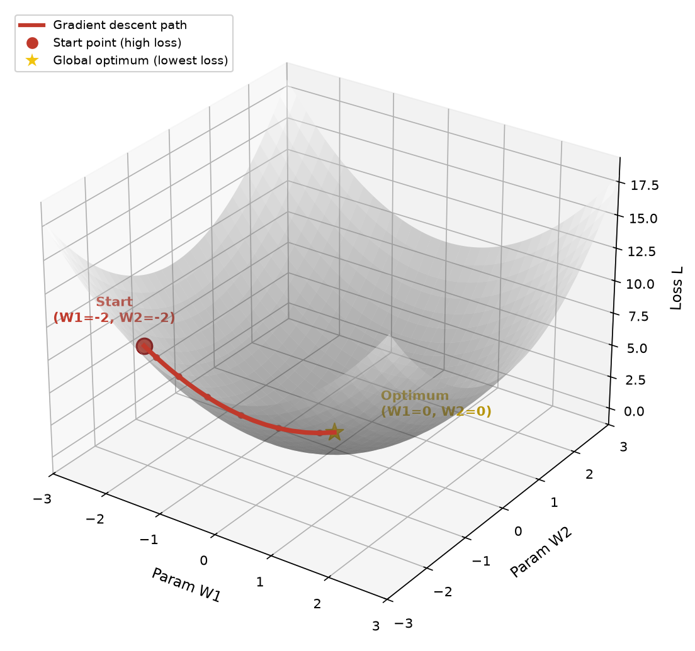
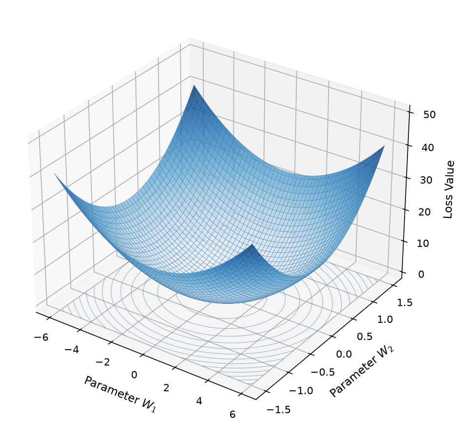
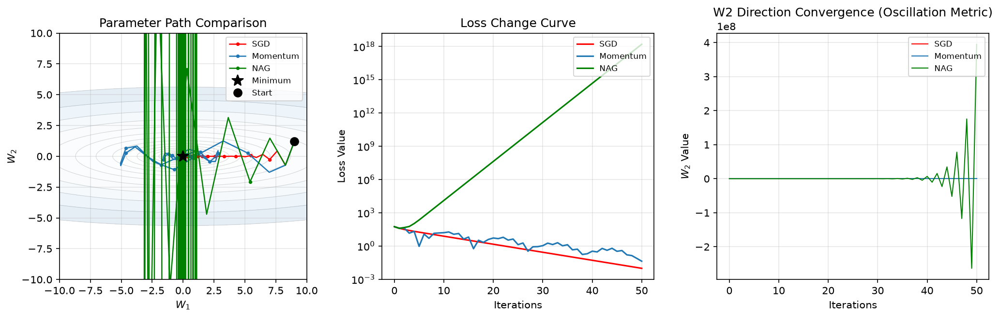

# Gradient Descent

In the first part of the neural network chapter, we learned about the iterative evolution of neural networks from neurons to linear perceptrons and then to multi-layer networks. We covered the four essential components of a neural network model: neurons as parameters and network structure, activation functions introducing nonlinearity, loss functions defining the optimization objective, and backpropagation computing gradients. At this point, we have all the theoretical foundations needed to statically describe a neural network model — what is commonly referred to as "how to model." Next, we shift to a dynamic perspective to answer how to efficiently update neural network parameters — what is commonly called "how to train." This is precisely the core task of **Optimization Algorithms**.

Optimization algorithms are the engine of neural network training, determining how parameters are updated along the gradient direction, directly affecting training efficiency, convergence speed, and final performance. **Gradient Descent** is one of the most classic and widely used optimization algorithms. Its idea is extremely simple: update parameters along the opposite direction of the gradient (the direction of steepest loss decrease). This seemingly simple algorithm has spawned many important variants and improvements, including stochastic gradient descent, momentum, Nesterov accelerated gradient, and others, which together form the foundation of modern deep learning optimization.

The conceptual origin of gradient descent can be traced back to the work of mathematician Augustin-Louis Cauchy in 1847. At that time, Cauchy was studying problems in celestial mechanics and optics when he proposed the idea of using iterative methods to solve systems of linear equations, which was essentially the prototype of gradient descent. However, it was the Soviet mathematician Yurii Nesterov and others in the 1980s who systematically applied gradient descent to numerical optimization. Nesterov proposed the theoretical framework of accelerated gradient methods in 1983, laying the foundation for what later became the Nesterov Accelerated Gradient algorithm. The stochastic gradient descent widely used in modern deep learning was proposed by Herbert Robbins and Sutton Monro in 1951, who proved the convergence of stochastic approximation methods under specific conditions. The many achievements of modern deep learning training stand on the shoulders of these mathematical contributions spanning nearly two centuries.

This chapter introduces the fundamental principles of gradient descent, the implementation of stochastic gradient descent, momentum and Nesterov accelerated gradient, convergence analysis, and learning rate selection strategies. This is our first step toward understanding deep learning optimization from a dynamic perspective.

## Fundamentals of Gradient Descent

In the backpropagation section, we derived the [formula for computing gradients](../../deep-learning/neural-network-structure/backpropagation.md#parameter-gradient-computation). Once we have the gradient, how should we update the parameters? Imagine a hiker on a foggy mountain, unable to see clearly, relying only on the feel of the slope beneath their feet. They can sense the steepness and must decide which direction to go and how far to step. Gradient descent answers both of these questions.

For the scenario described above, if we want to descend the mountain as quickly as possible, a natural intuition is to go in the steepest downhill direction. Choosing the steepest direction at each step should get us to the valley floor the fastest. This is the central idea of gradient descent. Let $L(\mathbf{W})$ be the loss function, where the parameters $\mathbf{W}$ represent the current position (a point in parameter space). The gradient $\nabla L = \frac{\partial L}{\partial \mathbf{W}}$ is a vector, with each component indicating the rate of change of the loss function in the corresponding parameter direction. The gradient itself points in the direction of the steepest increase in loss (the fastest uphill direction), while its opposite direction $-\nabla L$ points in the direction of the steepest decrease in loss (the fastest downhill direction). A rigorous proof that the opposite direction of the gradient is indeed the direction of steepest descent is given in the [Exercises](#exercises) section. Parameters should be updated along this direction, as shown in the figure below.



*Figure: Geometric intuition of gradient descent*

The next question is how far to step each time. If each step is too small, it may take thousands of steps to reach the valley. If each step is too large, we might overshoot the valley entirely, ending up on the opposite slope or even further away. The choice of step size is a trade-off between descent efficiency and stability. In gradient descent, this step size is controlled by the **Learning Rate** $\eta$, a hyperparameter that determines the magnitude of parameter updates. Based on the principle of steepest descent, the update rule of gradient descent is:

$$\mathbf{W} \leftarrow \mathbf{W} - \eta \nabla L(\mathbf{W})$$

Here, $\mathbf{W}$ is the current parameter value (the current position), $-\nabla L(\mathbf{W})$ is the opposite direction of the gradient (the downhill direction), and $\eta$ is the learning rate (the step size) that controls how far to move at each step. The overall formula means "new position = current position - step size × downhill direction." The entire gradient descent algorithm iterates around this formula:

- Step 1 **Compute the gradient**: Use backpropagation to compute $\nabla L(\mathbf{W})$ (this is exactly what [backpropagation](../neural-network-structure/backpropagation.md) derives)
- Step 2 **Update the parameters**: $\mathbf{W} \leftarrow \mathbf{W} - \eta \nabla L(\mathbf{W})$
- Step 3 **Repeat**: Until the loss converges or a preset number of iterations is reached

Beyond the learning rate, there is another critical factor affecting training efficiency and stability: the choice of gradient descent algorithm. Recalling the backpropagation process, the gradient is obtained by averaging the losses over samples. Depending on the number of samples used to compute the gradient, gradient descent has three variants:

- **Batch Gradient Descent (BGD)** uses all training samples to compute the gradient. True gradient = average of gradients over all samples: $\nabla L = \frac{1}{m} \sum_{i=1}^{m} \nabla L_i$
    
    Batch gradient descent computes the true gradient (exact direction). Because it uses information from all samples, the gradient direction is stable and reliable, and the convergence path is smooth. However, it comes at a high cost: each parameter update requires traversing the entire training dataset. When the number of samples reaches millions, a single parameter update can take seconds or even minutes, making training extremely inefficient. More importantly, batch gradient descent is prone to getting stuck in local minima because the gradient direction is precise and there is no randomness to help the parameters "escape" local optima. Thus, this theoretically most accurate method is rarely used in practice.

- **Stochastic Gradient Descent (SGD)** uses a single sample to compute the gradient at each step. Approximate gradient ≈ gradient of a randomly chosen sample: $\nabla L \approx \nabla L_i$
    
    Stochastic gradient descent has extremely low computational cost — it updates parameters after processing each sample, making it fast. However, the trade-off is that the gradient is unstable: a single sample's gradient can have large random fluctuations, causing the parameter update direction to oscillate wildly. Interestingly, in practice, this oscillation sometimes proves beneficial, as noise can help parameters escape local optima and find better global solutions.

- **Mini-batch Gradient Descent (MBGD)** falls between the two, using a small batch of samples to compute the gradient. Approximate gradient = average of gradients over a mini-batch: $\nabla L \approx \frac{1}{b} \sum_{i=1}^{b} \nabla L_i$
    
    Mini-batch gradient descent combines the stability of batch gradient descent with the efficiency of stochastic gradient descent. When the batch size is moderate, the gradient is sufficiently stable (controllable noise) while computation remains efficient (no need to traverse all data). Mini-batch gradient descent is the standard choice in modern deep learning. In practice, when people say "stochastic gradient descent," they usually refer to mini-batch gradient descent rather than the true single-sample SGD. In the following sections, when we mention SGD, we are also referring to MBGD, and this clarification applies throughout.

The comparison of the three methods is summarized in the table below:

| Feature | Batch Gradient Descent | Stochastic Gradient Descent | Mini-batch Gradient Descent |
|:--------|:---------------------|:--------------------------|:--------------------------|
| Samples per step | All samples $m$ | Single sample | Mini-batch $b$ |
| Gradient accuracy | Exact (true gradient) | Noisy (approximate gradient) | Moderate (controllable noise) |
| Computational efficiency | Low (traverses all data) | High (update per sample) | Relatively high (update per mini-batch) |
| Convergence stability | Stable (smooth path) | Oscillating (fluctuating path) | Relatively stable (moderate noise) |
| Ability to escape local optima | Weak (no noise) | Strong (noise aids exploration) | Moderate |

## Stochastic Gradient Descent Algorithm

We introduced three variants of gradient descent above. This section takes stochastic gradient descent as an example to analyze its main characteristics, algorithm implementation, noise sources, convergence behavior, and the impact of noise on training. The defining characteristic of SGD is that the gradient is an approximation of the true gradient — it contains noise, which arises from two sources:

1. **Sample randomness**: Different samples may have different gradient directions. For example, in a classification task, some samples point toward increasing parameter A while others point toward decreasing it. A single sample's gradient can deviate from the true gradient (the average direction over all samples).
2. **Data distribution**: Training data may contain noisy labels or anomalous samples. For instance, a mislabeled sample may have a completely opposite gradient direction, affecting the accuracy of gradient estimation.

The effect of noise can be described mathematically. Let $\nabla L$ be the true gradient (average gradient over all samples), $\tilde{\nabla L}$ be the SGD gradient (gradient of a single sample or mini-batch), and $\xi$ be the noise term representing the deviation of the actual gradient from the true gradient. Then:

$$\tilde{\nabla L} = \nabla L + \xi$$

The noise term $\xi$ has expectation $\mathbb{E}[\xi] = 0$, meaning that although individual gradient steps may be biased, the average direction over the long term still points toward the true gradient. This is like using a navigation app while walking: not every step lands exactly on the optimal path — there will always be random errors — but after many steps, the average direction remains correct. The impact of noise on training has both positive and negative aspects. On the positive side:

- **Escaping local optima**: When parameters become trapped in a local minimum, the exact gradient is zero, and batch gradient descent stops. However, SGD's noise can cause the parameters to randomly oscillate near the local minimum, offering a chance to escape and continue moving toward a global optimum.
- **Exploration ability**: Noise increases the randomness of the search, allowing parameters to explore a wider area, potentially discovering better solutions than those near the initial point.
- **Implicit regularization**: Studies have found that SGD's noise sometimes acts as a regularizer, preventing the model from overfitting the training data. This is because noise prevents the parameters from converging precisely to the minima of the training data, preserving some generalization ability.

On the negative side, noise has these effects:

- **Unstable convergence**: The parameter update path oscillates violently, and the loss curve shows significant fluctuations, making it difficult to determine whether convergence has truly been achieved.
- **Limited final accuracy**: When approaching a minimum, the gradient becomes very small, but noise persists. The noise prevents precise convergence to the minimum, causing the final loss to fluctuate within a small range.

The SGD algorithm is extremely simple at its core, consisting of just two steps: compute the gradient and update the parameters. Below is a pseudocode implementation of mini-batch gradient descent, illustrating a typical training loop structure.

```python
# SGD parameter update pseudocode
for epoch in range(n_epochs):
    for batch in get_batches(X, y, batch_size):
        # Compute mini-batch gradient using backpropagation
        gradient = compute_gradient(model, batch)

        # Update parameters along the opposite direction of the gradient
        W = W - learning_rate * gradient
```

Each part of the code has a clear meaning:
- `n_epochs` is the total number of training epochs, where one epoch means traversing all training data once.
- `get_batches` splits the data into mini-batches, each containing `batch_size` samples.
- `compute_gradient` uses backpropagation to compute the gradient for the current batch (this is what we learned in the previous chapter).
- `learning_rate` controls the step size of parameter updates and is the most critical hyperparameter.
- The parameter update formula `W = W - learning_rate * gradient` corresponds to the core formula of gradient descent.

## Momentum

SGD has an inherent problem known as "SGD oscillation," where convergence is slow in certain directions, especially when the loss function has significantly different gradients across different parameter directions. The root cause of this problem lies in the shape of the loss function. When the gradients vary greatly across different parameter directions, the parameter update path of SGD oscillates violently. Consider an extreme example: the loss function $L(W_1, W_2) = W_1^2 + 100W_2^2$. This is an elliptical loss surface where $W_1$ varies slowly (coefficient 1) and $W_2$ varies rapidly (coefficient 100). The gradient is $\nabla L = (2W_1, 200W_2)$, with the gradient in the $W_2$ direction being 100 times that of the $W_1$ direction. From the function graph, we can see the difference in surface steepness: along the $W_1$ direction, the surface is gentle; along the $W_2$ direction, the surface is steep; and the contour lines at the bottom are elliptical.



*Figure: 3D visualization of elliptical loss surface $L = W_1^2 + 100W_2^2$*

If we use SGD starting from $(10, 10)$, each parameter update will have a step size in the $W_2$ direction that is 100 times that of the $W_1$ direction (because the gradient differs by 100 times). The parameters jump violently in the $W_2$ direction, oscillating back and forth, while creeping slowly in the $W_1$ direction. A large number of iterations are wasted on the back-and-forth oscillations in the $W_2$ direction, resulting in poor overall convergence efficiency. The root cause of the oscillation problem is that SGD relies entirely on the gradient at the current position for each step, completely ignoring historical information. When gradients differ greatly across directions, the parameter update direction swings wildly between different directions, preventing convergence along a smooth path.

### Principle of Momentum

**Momentum** was proposed to address this problem. Its core idea is to introduce historical gradient information to smooth the parameter update direction, much like the concept of momentum in physics. A massive object in motion tends to maintain its inertia and will not change direction drastically due to a single force. Before presenting the mathematical formulation of momentum, let us first imagine two scenarios for an intuitive analogy:

- **Physical analogy**: The parameters are like a small ball rolling along the loss surface. The velocity vector is the ball's speed, and the momentum coefficient is the ball's inertia (mass). The ball accelerates in steep directions (due to gravity) and decelerates in flat directions, resulting in smoother overall motion. When the ball enters an oscillating region, inertia prevents it from swinging violently, allowing it to move in a relatively stable direction.
- **Gradient averaging analogy**: The velocity vector is an exponentially weighted average of historical gradients, with the current gradient weighted by $\eta$ and historical gradients weighted by $\gamma$. When gradient directions are consistent, the velocity increases (gradient accumulates), accelerating progress. When gradient directions oscillate (gradients alternate between positive and negative), the velocity decreases (gradients cancel out), suppressing oscillation.

Let $\mathbf{v}_t$ be the velocity vector representing the rate of change of the parameters, $\mathbf{v}_{t-1}$ be the velocity from the previous step (the historical inertia), $\gamma$ be the momentum coefficient controlling the influence of historical information, and $\nabla L(\mathbf{W}_t)$ be the gradient at the current position (the current driving force). The update rule for momentum is:

$$[eq:momentum-update] \mathbf{v}_t = \gamma \mathbf{v}_{t-1} + \eta \nabla L(\mathbf{W}_t)$$
$$\mathbf{W}_{t+1} = \mathbf{W}_t - \mathbf{v}_t$$

These two formulas define the new velocity and the new position, respectively:
- The first formula can be understood as "new velocity = retained inertia + current driving force."
- The second formula can be understood as "new position = current position - velocity (moving along the velocity direction)."

The key difference between momentum and SGD is that SGD directly uses the gradient to update parameters ($\mathbf{W} \leftarrow \mathbf{W} - \eta \nabla L$), while momentum introduces a velocity vector to accumulate historical gradients. The velocity vector acts as inertia: when gradient directions are consistent, the velocity accumulates and increases, accelerating progress; when gradient directions oscillate, the velocities cancel each other out, suppressing oscillation. The smoothness of momentum is controlled by the choice of momentum coefficient $\gamma$:

| $\gamma$ | Effect | Suitable Scenarios |
|:--------:|:-------|:-----------------|
| $0.5$ | Weak inertia, small influence of historical gradients | Late convergence, requires fine-tuning |
| $0.9$ | Strong inertia, good oscillation smoothing | Common choice, suitable for most scenarios |
| $0.99$ | Very strong inertia, may over-smooth | Extreme oscillation scenarios, may delay convergence |

### Effect Analysis of Momentum

Earlier, we explained how momentum works using physical and gradient-averaging analogies. Now, we use mathematical derivation to more precisely analyze why momentum accelerates in consistent directions and decelerates in oscillating directions. Let the gradient sequence be $\nabla L_1, \nabla L_2, \ldots, \nabla L_t$, with initial velocity $\mathbf{v}_0 = 0$, and $\gamma^i$ as the weight that decays exponentially with distance from the current step. Expanding the velocity recursively:

$$\mathbf{v}_t = \eta \sum_{i=0}^{t-1} \gamma^i \nabla L_{t-i}$$

The velocity vector is an exponentially weighted average of historical gradients, with weights from nearest to farthest being $\eta, \eta\gamma, \eta\gamma^2, \ldots$. When $\gamma = 0.9$, the weight of the most recent gradient is approximately $0.9^{10} \approx 0.35$ times that of the gradient from 10 steps ago. The influence of historical gradients gradually decays but retains a certain cumulative effect over the short term. We analyze two extreme cases:

- **Case 1: Gradients are completely consistent** (e.g., $\nabla L_i = \mathbf{g}$, all gradients point in the same direction):

    $$\mathbf{v}_t = \eta \mathbf{g} \sum_{i=0}^{t-1} \gamma^i = \eta \mathbf{g} \frac{1 - \gamma^t}{1 - \gamma} \approx \frac{\eta \mathbf{g}}{1 - \gamma}$$

    When $t$ is large, $\gamma^t \to 0$ (since $\gamma < 1$), and the velocity converges to $\frac{\eta \mathbf{g}}{1 - \gamma}$. Compared to SGD's step size $\eta \mathbf{g}$, momentum amplifies the step size by a factor of $\frac{1}{1-\gamma}$. When $\gamma = 0.9$, the amplification factor is approximately 10x. This is the acceleration effect of momentum in consistent directions.

- **Case 2: Gradients alternate in direction** (e.g., $\nabla L_i$ alternates between $\mathbf{g}$ and $-\mathbf{g}$, gradients alternate between positive and negative):

    $$\mathbf{v}_t = \eta (\mathbf{g} - \gamma \mathbf{g} + \gamma^2 \mathbf{g} - \cdots) = \eta \mathbf{g} \frac{1 - (-\gamma)^t}{1 + \gamma} \approx \frac{\eta \mathbf{g}}{1 + \gamma}$$

    When $t$ is large, $(-\gamma)^t \to 0$, and the velocity converges to $\frac{\eta \mathbf{g}}{1 + \gamma}$. Compared to SGD's step size $\eta \mathbf{g}$, momentum reduces the step size by a factor of $\frac{1}{1+\gamma}$. When $\gamma = 0.9$, the reduction factor is approximately 0.53x. This is the deceleration effect of momentum in oscillating directions.

Based on the analysis of these two extreme cases, we can conclude that the core mechanism of momentum is gradient accumulation. When gradient directions are consistent, historical gradients accumulate to amplify the current gradient, accelerating progress; when gradient directions oscillate, historical gradients of opposite signs cancel out, weakening the current gradient and suppressing oscillation. This results in smoother and more efficient overall convergence.

## Nesterov Accelerated Gradient

Momentum effectively alleviates SGD's oscillation problem by accumulating historical gradients. However, momentum has a shortcoming: it always computes the gradient at the current position, but the parameters may have already "overshot" due to the effect of momentum. Can we sense the terrain ahead before overshooting and adjust the direction in time? This is the idea behind **Nesterov Accelerated Gradient (NAG)**.

### NAG Principle

The Soviet mathematician Nesterov proposed the theoretical framework for accelerated gradient methods in 1983. NAG's improvement over momentum is computing the gradient at the predicted position rather than the current position. Recall the momentum update formula {{eq:momentum-update}}: momentum computes the gradient at the current position $\mathbf{W}_t$ and then accumulates it into the velocity vector. The problem is that the current position may not be where the parameters will actually end up. Due to momentum, the parameters will move to $\mathbf{W}_t - \gamma \mathbf{v}_{t-1}$ (considering only the effect of momentum) in the next step. If the gradient at this predicted position differs from the gradient at the current position, momentum's direction estimate will be inaccurate. NAG improves the velocity update rule by assuming $\gamma \mathbf{v}_{t-1}$ is the predicted displacement due to momentum, $\mathbf{W}_t - \gamma \mathbf{v}_{t-1}$ is the predicted position (where the parameters will arrive in the next step), and $\nabla L(\mathbf{W}_t - \gamma \mathbf{v}_{t-1})$ is the gradient computed at this predicted position. NAG's velocity update rule is:

$$\mathbf{v}_t = \gamma \mathbf{v}_{t-1} + \eta \nabla L(\mathbf{W}_t - \gamma \mathbf{v}_{t-1})$$
$$\mathbf{W}_{t+1} = \mathbf{W}_t - \mathbf{v}_t$$

Like momentum, these two formulas define the new velocity and the new position. The position update is the same for momentum and NAG; the difference lies in the velocity update rule. NAG effectively looks ahead one step, computing the gradient at the position where the parameters are about to arrive, to more accurately estimate the next direction:
- The first formula can be understood as "new velocity = retained inertia + driving force at the predicted position."
- The second formula can be understood as "new position = current position - velocity (same as momentum)."

### Comparison of NAG and Momentum

NAG changes the position at which the gradient is computed. This seemingly simple change can lead to significant improvements in convergence in certain situations. Imagine the parameters rapidly sliding down a steep slope (with large velocity $\mathbf{v}$) and approaching a minimum where the slope flattens. In this scenario:

- **Momentum behavior**: Computes the gradient at the current position $\mathbf{W}_t$, which is still before the minimum, so the gradient points toward the minimum.
    - Velocity accumulation: $\mathbf{v}_t = \gamma \mathbf{v}_{t-1} + \eta \nabla L(\mathbf{W}_t)$, the velocity remains large.
    - Parameter update: $\mathbf{W}_{t+1} = \mathbf{W}_t - \mathbf{v}_t$, the parameters shoot past the minimum.

- **NAG behavior**: Computes the gradient at the predicted position $\mathbf{W}_t - \gamma \mathbf{v}_{t-1}$, which has already passed the minimum. The gradient at the predicted position is reversed (pointing back toward the minimum, opposite to the momentum direction).
    - Velocity accumulation: $\mathbf{v}_t = \gamma \mathbf{v}_{t-1} + \eta \nabla L(\mathbf{W}_t - \gamma \mathbf{v}_{t-1})$, the gradient term and the momentum term point in opposite directions, reducing the velocity.
    - Parameter update: $\mathbf{W}_{t+1} = \mathbf{W}_t - \mathbf{v}_t$, the parameters decelerate in time, avoiding overshooting.

Momentum is like a person descending a mountain blindfolded, only feeling the slope beneath their feet. When the slope flattens, inertia keeps them moving forward, potentially causing them to shoot past the valley. NAG is like a person descending the mountain with eyes open, able to see a few steps ahead. When they notice the slope reversing (past the valley), they decelerate in advance, stopping more smoothly at the valley floor. In practice, NAG typically converges more smoothly and quickly than momentum, especially in scenarios with drastic gradient changes.

## Convergence Analysis

Earlier, we discussed how gradient descent and its variants iteratively converge to a minimum of the loss function. This section provides a theoretical analysis of whether SGD can guarantee convergence to a minimum, what conditions are required for convergence, and how fast convergence can be. The answers to these questions depend on the properties of the loss function and the choice of learning rate.

### Convergence Conditions of SGD

Intuitively, as long as the learning rate is sufficiently small, the parameters should gradually approach the minimum — the only question is the speed of convergence. However, in practice, data contains noise and loss functions come in many forms, all of which can impede convergence. In 1951, statisticians Herbert Robbins and Sutton Monro published a paper giving clear convergence conditions and rigorous proofs, laying the theoretical foundation for stochastic approximation methods.

::: info Robbins-Monro Convergence Theorem
Let the loss function $L$ be convex, bounded below, and have bounded gradients. Then the conditions for SGD to converge to the minimum are:

$$\sum_{t=1}^{\infty} \eta_t = \infty, \quad \sum_{t=1}^{\infty} \eta_t^2 < \infty$$
:::

In the Robbins-Monro convergence theorem, $\sum_{t=1}^{\infty} \eta_t = \infty$ means the sum of learning rates is infinite, ensuring that the parameters have enough steps to reach any position. If the learning rate decays too quickly (e.g., $\eta_t = \frac{1}{t^2}$), the sum of learning rates is finite, and the parameters may stop moving before reaching the minimum. $\sum_{t=1}^{\infty} \eta_t^2 < \infty$ means the sum of squared learning rates is finite, ensuring that the influence of noise gradually diminishes. The variance of SGD noise is proportional to the square of the learning rate. If the sum of squared learning rates is infinite, the accumulated noise may prevent convergence, making this condition necessary. The entire theorem can be expressed as a seemingly contradictory statement: the learning rate must be large enough to ensure reaching the destination, yet small enough to keep noise under control. $\eta_t = \frac{\eta_0}{\sqrt{t}}$ and $\eta_t = \frac{\eta_0}{t}$ are two typical learning rate schedules that satisfy these conditions. The former decays the learning rate by the square root of the iteration count, while the latter decays it linearly with the iteration count. In practice, learning rate decay is not constant, and widely used [Learning Rate Decay strategies](#learning-rate-selection-strategy) (step decay, cosine decay) generally satisfy the convergence conditions as well, because the learning rate eventually approaches a very small but non-zero value.

### Convergence for Non-convex Functions

The Robbins-Monro theorem assumes that the loss function is convex (having only one global minimum). However, the loss functions of neural networks are often **Non-convex Functions**, with multiple local minima, saddle points, and flat regions. In this case, the convergence analysis of SGD is more complex, and it is difficult to predict which point will be reached. Mathematically, non-convex optimization has no strict convergence guarantees, but some useful patterns have been observed in practice:

- **SGD typically converges to a local minimum, but this local minimum usually has sufficient generalization ability**: Studies have found that different local minima of neural networks often have similar test performance — not all local minima are bad.
- **Noise helps escape local optima**: SGD's noise causes parameters to randomly oscillate near local minima, offering a chance to escape and find better solutions. This is an advantage of SGD over batch gradient descent. Batch gradient descent has an exact gradient; once trapped in a local minimum (gradient of zero), it cannot escape.
- **Batch size affects convergence results**: Small batches have more noise, which may help escape local optima; large batches have less noise and are more easily trapped in local optima. Studies have found that small-batch training tends to produce models with better generalization performance.

These empirical observations reaffirm that in non-convex optimization, the noise of SGD is not a "drawback" but rather a "feature." The noise allows parameters to explore a larger area, potentially finding solutions with better generalization performance.

### Convergence Rate

The convergence rate is expressed as the reciprocal of the number of steps. For example, $O(1/t)$ means that after $t$ steps, the gap between the loss and the optimal value shrinks to $O(1/t)$, i.e., the gap is of the same order as $1/t$. The convergence rates of different optimization algorithms are shown in the table below:

| Algorithm | Convex Convergence Rate | Non-convex Performance |
|:----------|:-----------------------|:---------------------|
| Batch Gradient Descent | $O(1/t)$ | Stable but slow, prone to local optima |
| SGD | $O(1/\sqrt{t})$ | Faster, noise aids exploration |
| Momentum | $O(1/t)$ (theoretical acceleration) | Faster, smooths oscillations |
| NAG | $O(1/t^2)$ (theoretical rate on convex) | Faster than momentum in practice |

From the convergence rates of various algorithms, we can see:
- SGD ($O(1/\sqrt{t})$) is theoretically slower than batch gradient descent ($O(1/t)$) because noise affects convergence accuracy. However, SGD has lower computational cost per step, so its practical time efficiency is often higher.
- Momentum has a theoretical acceleration on convex functions, improving the convergence rate from $O(1/\sqrt{t})$ to $O(1/t)$.
- NAG has a stronger theoretical acceleration on convex functions ($O(1/t^2)$), but its effectiveness on non-convex functions varies by problem.

In practice, momentum is typically 2 to 3 times faster than SGD, and NAG is slightly faster than momentum. These acceleration effects are especially pronounced in problems with large gradient disparities across directions (such as the elliptical loss function example at the beginning of this chapter).

## Gradient Descent in Practice

So far, we have theoretically analyzed the principles and convergence characteristics of SGD, momentum, and NAG. Now, we will intuitively compare the actual performance of the three optimization algorithms through code experiments. The experiment uses an extreme elliptical loss function ($L = W_1^2 + 100W_2^2$), where gradients differ dramatically across directions, clearly demonstrating the differences in convergence behavior among the three algorithms. The setup has the gradient in the $W_2$ direction being 100 times that of the $W_1$ direction, with the starting point chosen at $(10, 10)$, far from the minimum. This configuration makes SGD's oscillation problem extremely evident, facilitating observation of how momentum and NAG provide improvements. The code implements the parameter update logic of the three optimizers and visualizes the parameter paths, loss curves, and oscillation in the $W_2$ direction.



*Figure: Convergence comparison of SGD, momentum, and NAG*

The code below implements a comparative experiment of the three optimizers, using the elliptical loss function to demonstrate their differing convergence behaviors.

1. **SGD oscillates significantly on problems with large gradient disparities**: When gradients differ greatly across parameter directions, SGD oscillates violently in the large-gradient direction, wasting many iterations on back-and-forth swings.
2. **Momentum effectively smooths oscillations**: Historical gradient accumulation allows parameters to accelerate in consistent directions and decelerate in oscillating directions, resulting in smoother and more efficient convergence.
3. **NAG senses direction changes in advance**: By computing gradients at the predicted position, it adjusts the parameter update direction more promptly, achieving the fastest and smoothest convergence.

The experiments validate the theoretical analysis of this chapter: momentum and NAG significantly outperform SGD on problems with large gradient disparities. This type of problem is common in practical neural network training, where the gradient magnitudes of different parameters can differ by several orders of magnitude. Therefore, momentum is the standard choice in modern deep learning.

```python runnable
import numpy as np
import matplotlib.pyplot as plt

# Define the loss function (elliptical function with significant gradient differences across directions)
def loss_function(W1, W2):
    """Loss function L = W1^2 + 100*W2^2 (elliptical)"""
    return W1**2 + 100 * W2**2

def gradient(W1, W2):
    """Gradient ∇L = (2W1, 200W2)"""
    return np.array([2 * W1, 200 * W2])

# SGD optimizer
class SGD:
    def __init__(self, learning_rate=0.01):
        self.lr = learning_rate
        self.path = []
    
    def step(self, W, grad):
        self.path.append(W.copy())  # Record current position (starting point before update)
        W_new = W - self.lr * grad
        return W_new

# Momentum optimizer
class Momentum:
    def __init__(self, learning_rate=0.01, momentum=0.9):
        self.lr = learning_rate
        self.momentum = momentum
        self.velocity = np.zeros(2)
        self.path = []
    
    def step(self, W, grad):
        self.path.append(W.copy())  # Record current position (starting point before update)
        self.velocity = self.momentum * self.velocity + self.lr * grad
        W_new = W - self.velocity
        return W_new

# NAG optimizer
class NAG:
    def __init__(self, learning_rate=0.01, momentum=0.9):
        self.lr = learning_rate
        self.momentum = momentum
        self.velocity = np.zeros(2)
        self.path = []
    
    def step(self, W, grad_func):
        self.path.append(W.copy())  # Record current position (starting point before update)
        # Compute gradient at the predicted position
        W_predict = W - self.momentum * self.velocity
        grad_predict = grad_func(W_predict[0], W_predict[1])
        
        self.velocity = self.momentum * self.velocity + self.lr * grad_predict
        W_new = W - self.velocity
        return W_new

# Initialize parameters (far from the minimum)
W_init = np.array([10.0, 10.0])  # Starting point
n_iterations = 50

# Run the three optimizers (tuned parameters for clear comparison)
optimizers = {
    'SGD': SGD(learning_rate=0.008),          # Small learning rate to avoid oscillation divergence
    'Momentum': Momentum(learning_rate=0.005, momentum=0.5),  # Small learning rate + small momentum, smooth convergence
    'NAG': NAG(learning_rate=0.005, momentum=0.5)             # Prediction mechanism, best convergence
}

results = {}
for name, opt in optimizers.items():
    W = W_init.copy()
    losses = []
    
    for t in range(n_iterations):
        loss = loss_function(W[0], W[1])
        losses.append(loss)
        
        if name == 'NAG':
            W = opt.step(W, gradient)
        else:
            grad = gradient(W[0], W[1])
            W = opt.step(W, grad)
    
    results[name] = {
        'path': np.array(opt.path),
        'losses': losses,
        'final_W': W
    }
    
    print(f"{name:10s}: final position ({W[0]:.4f}, {W[1]:.4f}), final loss {losses[-1]:.4f}")

print()

# Visualization
fig, axes = plt.subplots(1, 3, figsize=(15, 5))

# Plot 1: Parameter paths on the loss surface
ax1 = axes[0]

# Draw loss function contours
W1_range = np.linspace(-12, 12, 100)
W2_range = np.linspace(-12, 12, 100)
W1_grid, W2_grid = np.meshgrid(W1_range, W2_range)
L_grid = loss_function(W1_grid, W2_grid)

ax1.contour(W1_grid, W2_grid, L_grid, levels=[1, 10, 100, 500, 1000, 5000], 
           colors='gray', alpha=0.5, linewidths=0.5)
ax1.contourf(W1_grid, W2_grid, L_grid, levels=[0, 1, 10, 100, 500, 1000, 5000, 10000],
             cmap='Blues', alpha=0.3)

# Draw paths of each optimizer
colors = {'SGD': '#e74c3c', 'Momentum': '#3498db', 'NAG': '#2ecc71'}
for name, result in results.items():
    path = result['path']
    ax1.plot(path[:, 0], path[:, 1], 'o-', color=colors[name], 
             linewidth=2, markersize=3, alpha=0.7, label=name)

# Mark starting point and minimum
ax1.plot(W_init[0], W_init[1], 'ko', markersize=10, label='Starting point')
ax1.plot(0, 0, 'k*', markersize=15, label='Minimum')

ax1.set_xlabel('W1', fontsize=11)
ax1.set_ylabel('W2', fontsize=11)
ax1.set_title('Parameter path comparison', fontsize=12)
ax1.legend(loc='upper right')
ax1.grid(True, alpha=0.3)
ax1.set_xlim(-12, 12)
ax1.set_ylim(-12, 12)

# Plot 2: Loss curves
ax2 = axes[1]
for name, result in results.items():
    ax2.plot(result['losses'], color=colors[name], linewidth=2, label=name)

ax2.set_xlabel('Iteration', fontsize=11)
ax2.set_ylabel('Loss', fontsize=11)
ax2.set_title('Loss curves', fontsize=12)
ax2.legend()
ax2.grid(True, alpha=0.3)
ax2.set_yscale('log')

# Plot 3: W2 direction variation (oscillation comparison)
ax3 = axes[2]
for name, result in results.items():
    W2_path = result['path'][:, 1]
    ax3.plot(W2_path, color=colors[name], linewidth=2, label=name)

ax3.axhline(y=0, color='gray', linestyle='--', linewidth=1, alpha=0.5)
ax3.set_xlabel('Iteration', fontsize=11)
ax3.set_ylabel('W2 value', fontsize=11)
ax3.set_title('Convergence in W2 direction (oscillation indicator)', fontsize=12)
ax3.legend()
ax3.grid(True, alpha=0.3)

plt.tight_layout()
plt.show()
plt.close()
```

## Learning Rate Selection Strategy

As mentioned at the beginning, two factors affect training efficiency and stability: the choice of gradient descent algorithm (which we have discussed extensively) and the choice of learning rate. Now, let us analyze the impact of the learning rate in depth. In practical training, the optimal learning rate is not fixed — it often needs to be adjusted dynamically. In the early stages of training, parameters are far from the optimal values, so a larger learning rate can be used to approach quickly. In the later stages, parameters are near the optimal values, so a smaller learning rate is needed for fine-tuning. This is the **Learning Rate Decay** strategy. There are three commonly used decay methods:

- **Step Decay**: Every $N$ epochs, the learning rate is multiplied by a decay factor $\gamma$, i.e., $\eta_t = \eta_0 \cdot \gamma^{\lfloor t/N \rfloor}$
    
    Current learning rate = initial learning rate × (decay factor raised to the number of decays). For example, with $\eta_0 = 0.1$, $\gamma = 0.5$, $N = 10$, the learning rate changes as $0.1$ (epoch 0-9) → $0.05$ (epoch 10-19) → $0.025$ (epoch 20-29) → $0.0125$ (epoch 30-39) → ... Every 10 epochs, the learning rate is halved, producing a step-like decrease.

- **Exponential Decay**: The learning rate decays continuously and exponentially, $\eta_t = \eta_0 \cdot e^{-kt}$
    
    Current learning rate = initial learning rate × exponential decay factor ($e^{-kt}$). Exponential decay is smooth and continuous, with the learning rate decreasing slightly every epoch. However, the decay rate may be too fast: when $k$ is large, the learning rate quickly drops to a very small value, and parameters almost stop updating in later stages.

- **Cosine Decay**: The learning rate decays following a cosine curve. Let $\eta_0$ be the initial learning rate, $\eta_{min}$ be the minimum learning rate (decay will not go below this value), $T$ be the total number of iterations (or total epochs), and $t$ be the current iteration. Then $\eta_t = \eta_{min} + \frac{1}{2}(\eta_0 - \eta_{min})(1 + \cos(\frac{t\pi}{T}))$
    
    As $\cos(\frac{t\pi}{T})$ goes from $\cos(0) = 1$ to $\cos(\pi) = -1$, the current learning rate smoothly decreases from $\eta_0$ to $\eta_{min}$, following a cosine-shaped curve. The characteristic of cosine decay is slow initial decay (learning rate stays large, quickly approaching the optimum), accelerated decay in the middle, and slow final decay (learning rate approaches $\eta_{min}$, fine-tuning). This "slow-fast-slow" rhythm works well in practice and is a commonly used decay strategy in modern deep learning.

### Warmup and Adaptive Methods

Learning rate decay follows a "fast then slow" strategy. However, sometimes the "fast" at the beginning can also cause problems. At the very start of training, parameters are randomly initialized and may be in a very unfavorable position, such as at the boundary of activation functions (where gradients are very small or very large). If a large learning rate is used at this point, the parameters may suddenly jump to an even worse position, causing instability in early training. This is like starting a descent at the edge of a cliff, where the slope beneath your feet is extremely steep. If you take a large step forward, you might tumble down. A safer approach is to move cautiously for a few steps, find a relatively safe area, and then begin normal gradient descent.

**Learning Rate Warmup** is a "stable first, fast later" strategy. In the early stages of training, a smaller learning rate is used, gradually increasing to the target learning rate, after which normal training or decay begins. Let $\eta_0$ be the target learning rate (reached after warmup), $T_{warmup}$ be the total number of warmup iterations (typically a few thousand steps), and $\frac{t}{T_{warmup}}$ be the warmup progress, gradually increasing from 0 to 1. The learning rate at step $t$ is:

$$\eta_t = \eta_0 \cdot \frac{t}{T_{warmup}}$$

For example, with $\eta_0 = 0.1$ and $T_{warmup} = 1000$, the learning rate at step 0 is $0$ (a learning rate of $0$ means no parameter update; in practice, it usually starts from a very small value like $0.0001$), at step 100 it is $0.01$, at step 500 it is $0.05$, and at step 1000 it is $0.1$, at which point warmup ends and the target learning rate is reached. Warmup is especially important in large model training (such as Transformer architectures like BERT and GPT). These models have massive numbers of parameters and extremely complex parameter spaces. The random initialization at the beginning of training can easily trigger gradient explosion or vanishing gradients. Warmup gives the parameters time to "adapt" to the initial position and find a relatively stable region before formal training begins, effectively avoiding instability in the early stages.

The decay and warmup strategies described above are fixed schedules (decaying or increasing by time). In practice, the optimal learning rate is often closely related to training dynamics. Sometimes parameters become trapped in flat regions and need a larger learning rate to escape; sometimes they enter steep regions and need a smaller learning rate to stabilize. Therefore, there are more intelligent methods that automatically adjust the learning rate based on training dynamics, such as:

- **Validation loss monitoring**: When the validation loss stops decreasing (or even increases) for several consecutive epochs, it may indicate that the learning rate is too large or the parameters are near optimal. Reducing the learning rate allows training to continue converging. This is a commonly used strategy in practice, known as ReduceLROnPlateau.
- **Gradient monitoring**: When the gradient norm is large (parameters in a steep region), reduce the learning rate to prevent parameters from jumping too far. When the gradient norm is small (parameters in a flat region), increase the learning rate to accelerate movement.
- **Loss curve analysis**: Observe the trend of loss decrease. If the loss is decreasing slowly, the learning rate may need to be increased. If the loss is fluctuating violently, the learning rate may need to be decreased.

These strategies require more engineering implementation but can adapt to the training process more intelligently. The next chapter introduces adaptive optimizers (AdaGrad, RMSprop, Adam, etc.), which go a step further by automating learning rate adjustment. These methods automatically adjust the learning rate for each parameter based on its historical gradient information, eliminating the need to manually set decay strategies.

## Summary

Gradient descent and its variants are fundamental tools for deep learning training, used ubiquitously in practical applications. Examples include:

- **Image classification tasks**: When training convolutional neural networks (such as ResNet, VGG), momentum is the standard choice. Image data is large in volume, and models have many parameters (millions to hundreds of millions). Momentum effectively smooths gradient oscillations and accelerates convergence. A typical configuration is SGD + momentum ($\gamma = 0.9$) combined with cosine decay or step decay.
- **Natural language processing tasks**: Transformer models (such as BERT, GPT) typically use warmup during training. These models have massive numbers of parameters (BERT-base has 110 million parameters), and initial parameters are randomly initialized, making them prone to gradient explosion or vanishing gradients. Warmup uses a small learning rate in the first few thousand steps, allowing the model to stabilize before entering normal training, effectively avoiding early instability.
- **Transfer learning**: When fine-tuning a pre-trained model, a smaller learning rate (e.g., $0.001$ or smaller) and a smaller momentum coefficient (e.g., $0.5$) are typically used. The parameters of a pre-trained model are already close to a good solution, and fine-tuning only requires adjustments within a small range. A large learning rate may destroy the existing good parameter configuration.
- **Large-scale distributed training**: In distributed training scenarios (such as multi-GPU, multi-machine), increasing the batch size improves computational efficiency. However, a larger batch size reduces gradient noise, which may affect generalization ability. In practice, a linear scaling rule is commonly used: when the batch size increases by a factor of $k$, the learning rate is also increased by a factor of $k$ to maintain a consistent parameter update magnitude per step.

These application scenarios demonstrate the flexible use of learning rates and gradient descent algorithms across different tasks. Understanding the principles and then selecting the appropriate optimizer, learning rate, and momentum parameters based on the specific characteristics of the task is a fundamental principle of deep learning practice. At this point, we have mastered all the basics of gradient descent. However, SGD, momentum, and NAG all face a common limitation: they use the same learning rate for all parameters. In actual neural networks, different parameters may require different step sizes. Some parameters have large gradients and need small steps for fine-tuning; others have small gradients and need larger steps for rapid updates. The next chapter will introduce adaptive optimizers, which automatically adjust learning rates based on each parameter's historical gradient information, further improving optimization efficiency.

## Exercises

1. Prove that the opposite direction of the gradient is the direction of steepest descent. Let parameters $\mathbf{W}$ move by $\epsilon$ along unit direction $\mathbf{v}$, with loss change $\Delta L \approx \epsilon \nabla L \cdot \mathbf{v}$. Prove that $\Delta L$ is minimized when $\mathbf{v} = -\frac{\nabla L}{\|\nabla L\|}$.
    <details>
    <summary>Reference Answer</summary>
    
    **Proof**:
    
    Let the loss function be $L(\mathbf{W})$, parameters $\mathbf{W}$, moving a small step $\epsilon > 0$ along direction $\mathbf{v}$ ($\|\mathbf{v}\| = 1$). The new position is $\mathbf{W}' = \mathbf{W} + \epsilon \mathbf{v}$.
    
    By Taylor expansion (first-order approximation):
    
    $$L(\mathbf{W}') \approx L(\mathbf{W}) + \nabla L(\mathbf{W}) \cdot (\mathbf{W}' - \mathbf{W}) = L(\mathbf{W}) + \epsilon \nabla L \cdot \mathbf{v}$$
    
    The change in loss:
    
    $$\Delta L = L(\mathbf{W}') - L(\mathbf{W}) \approx \epsilon \nabla L \cdot \mathbf{v}$$
    
    Let $\theta$ be the angle between the gradient $\nabla L$ and direction $\mathbf{v}$, then:
    
    $$\nabla L \cdot \mathbf{v} = \|\nabla L\| \|\mathbf{v}\| \cos\theta = \|\nabla L\| \cos\theta$$
    
    Therefore:
    
    $$\Delta L = \epsilon \|\nabla L\| \cos\theta$$
    
    To minimize $\Delta L$ (maximize loss decrease), we need $\cos\theta$ to be minimized, i.e., $\cos\theta = -1$ ($\theta = 180°$).
    
    When $\theta = 180°$, $\mathbf{v}$ is opposite to $\nabla L$, i.e., $\mathbf{v} = -\frac{\nabla L}{\|\nabla L\|}$.
    
    At this point:
    
    $$\Delta L = \epsilon \|\nabla L\| \cdot (-1) = -\epsilon \|\nabla L\|$$
    
    The loss decreases the most.
    
    **Conclusion**: The opposite direction of the gradient $-\frac{\nabla L}{\|\nabla L\|}$ is the direction of steepest descent.
    
    **Practical significance**: The gradient descent algorithm updates parameters along the opposite direction of the gradient, ensuring the maximum loss decrease per step (in the sense of steepest descent).
    </details>

2. Analyze why momentum accelerates in consistent directions and decelerates in oscillating directions. Let the gradient sequence be $\mathbf{g}_i = \mathbf{g}$ (consistent) or $\mathbf{g}_i$ alternating between $\mathbf{g}$ and $-\mathbf{g}$ (oscillating), and derive the converged value of the velocity vector $\mathbf{v}_t$.
    <details>
    <summary>Reference Answer</summary>
    
    **Consistent direction** ($\mathbf{g}_i = \mathbf{g}$):
    
    Momentum update:
    
    $$\mathbf{v}_t = \gamma \mathbf{v}_{t-1} + \eta \mathbf{g}$$
    
    Let initial $\mathbf{v}_0 = 0$, expand recursively:
    
    $$\mathbf{v}_1 = \eta \mathbf{g}$$
    $$\mathbf{v}_2 = \gamma \eta \mathbf{g} + \eta \mathbf{g} = \eta \mathbf{g}(1 + \gamma)$$
    $$\mathbf{v}_3 = \gamma \eta \mathbf{g}(1 + \gamma) + \eta \mathbf{g} = \eta \mathbf{g}(1 + \gamma + \gamma^2)$$
    $$\mathbf{v}_t = \eta \mathbf{g} \sum_{i=0}^{t-1} \gamma^i$$
    
    When $t$ is large, sum of geometric series:
    
    $$\mathbf{v}_t = \eta \mathbf{g} \frac{1 - \gamma^t}{1 - \gamma} \approx \eta \mathbf{g} \frac{1}{1 - \gamma}$$
    
    (When $\gamma < 1$, $\gamma^t \to 0$)
    
    Parameter update step size:
    
    $$\|\mathbf{W}_{t+1} - \mathbf{W}_t\| = \|\mathbf{v}_t\| = \frac{\eta \|\mathbf{g}\|}{1 - \gamma}$$
    
    This is $\frac{1}{1-\gamma}$ times larger than SGD's step size $\eta \|\mathbf{g}\|$. When $\gamma = 0.9$, approximately 10x acceleration.
    
    **Oscillating direction** ($\mathbf{g}_i$ alternates between $\mathbf{g}$ and $-\mathbf{g}$):
    
    Let $\mathbf{g}_1 = \mathbf{g}$, $\mathbf{g}_2 = -\mathbf{g}$, $\mathbf{g}_3 = \mathbf{g}$, $\ldots$
    
    Expand recursively:
    
    $$\mathbf{v}_1 = \eta \mathbf{g}$$
    $$\mathbf{v}_2 = \gamma \eta \mathbf{g} - \eta \mathbf{g} = \eta \mathbf{g}(\gamma - 1)$$
    $$\mathbf{v}_3 = \gamma \eta \mathbf{g}(\gamma - 1) + \eta \mathbf{g} = \eta \mathbf{g}(\gamma^2 - \gamma + 1)$$
    $$\mathbf{v}_4 = \gamma \eta \mathbf{g}(\gamma^2 - \gamma + 1) - \eta \mathbf{g} = \eta \mathbf{g}(\gamma^3 - \gamma^2 + \gamma - 1)$$
    
    Let $t$ be even, expand:
    
    $$\mathbf{v}_t = \eta \mathbf{g} (1 - \gamma + \gamma^2 - \gamma^3 + \cdots + \gamma^{t-1}(-1)^{t-1})$$
    
    Sum of alternating geometric series:
    
    $$\mathbf{v}_t = \eta \mathbf{g} \frac{1 - (-\gamma)^t}{1 + \gamma} \approx \eta \mathbf{g} \frac{1}{1 + \gamma}$$
    
    (When $\gamma < 1$, $(-\gamma)^t \to 0$)
    
    Parameter update step size:
    
    $$\|\mathbf{v}_t\| = \frac{\eta \|\mathbf{g}\|}{1 + \gamma}$$
    
    This is $\frac{1}{1+\gamma}$ times smaller than SGD's step size $\eta \|\mathbf{g}\|$. When $\gamma = 0.9$, approximately 0.53x deceleration.
    
    **Summary**:
    
    | Gradient pattern | Converged velocity | Relative to SGD |
    |:-----------------|:-------------------|:----------------|
    | Consistent ($\mathbf{g}_i = \mathbf{g}$) | $\frac{\eta \mathbf{g}}{1 - \gamma}$ | Accelerated by $\frac{1}{1-\gamma}$x |
    | Oscillating (alternating $\mathbf{g}, -\mathbf{g}$) | $\frac{\eta \mathbf{g}}{1 + \gamma}$ | Decelerated by $\frac{1}{1+\gamma}$x |
    
    This explains why momentum accelerates progress in consistent directions and suppresses oscillation in oscillating directions.
    </details>

3. Explain why Nesterov Accelerated Gradient responds faster than momentum. Compare the behavioral differences between the two when approaching a minimum.
    <details>
    <summary>Reference Answer</summary>
    
    **Difference between NAG and Momentum**:
    
    Momentum gradient computation position:
    
    $$\mathbf{v}_t = \gamma \mathbf{v}_{t-1} + \eta \nabla L(\mathbf{W}_t)$$
    
    NAG gradient computation position:
    
    $$\mathbf{v}_t = \gamma \mathbf{v}_{t-1} + \eta \nabla L(\mathbf{W}_t - \gamma \mathbf{v}_{t-1})$$
    
    NAG computes the gradient at the "predicted position" $\mathbf{W}_t - \gamma \mathbf{v}_{t-1}$ rather than the current position $\mathbf{W}_t$.
    
    **Behavior when approaching a minimum**:
    
    Suppose the parameters are rapidly approaching a minimum (velocity $\mathbf{v}_{t-1}$ is large) and are about to overshoot.
    
    **Momentum**:
    - Computes gradient at the current position $\mathbf{W}_t$
    - $\mathbf{W}_t$ is still near the minimum, gradient still points toward the minimum
    - Velocity accumulation: $\mathbf{v}_t = \gamma \mathbf{v}_{t-1} + \eta \nabla L(\mathbf{W}_t)$
    - Velocity remains large, parameters overshoot the minimum
    
    **NAG**:
    - Computes gradient at the predicted position $\mathbf{W}_t - \gamma \mathbf{v}_{t-1}$ (assuming only momentum affects the position)
    - The predicted position has already passed the minimum, gradient direction is reversed (pointing back toward the minimum)
    - Velocity accumulation: $\mathbf{v}_t = \gamma \mathbf{v}_{t-1} + \eta \nabla L(\mathbf{W}_t - \gamma \mathbf{v}_{t-1})$
    - The gradient term and momentum term point in opposite directions, reducing velocity
    - Parameters decelerate in time, avoiding overshooting
    
    **Intuitive analogy**:
    
    - **Momentum**: Driving toward an intersection, only looking at the road beneath your feet; high inertia may cause you to overshoot
    - **NAG**: Driving toward an intersection, looking ahead (predicted position), seeing that a turn is needed, and decelerating in advance
    
    **Response speed difference**:
    
    NAG senses gradient direction changes one step ahead of momentum:
    - Momentum: Only decelerates in the next step after detecting the gradient reversal
    - NAG: Decelerates in the current step by detecting the gradient reversal at the predicted position
    
    This makes NAG more stable near the optimum, with fewer oscillations.
    
    **Summary**: NAG computes gradients at the predicted position, sensing direction changes in advance. It responds faster than momentum, decelerating in time when approaching a minimum to avoid overshooting, resulting in smoother convergence.
    </details>
