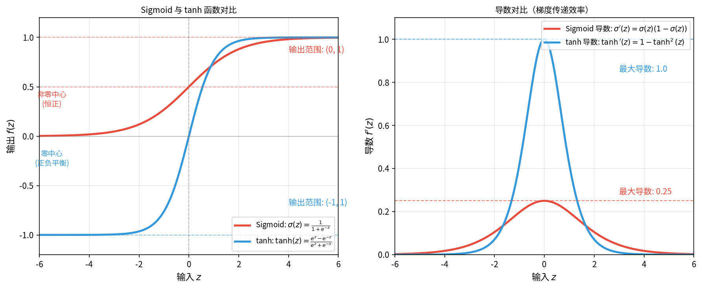
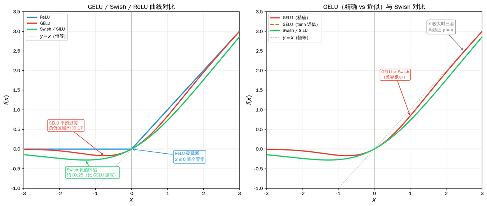

# Activation Functions and Loss Functions

In [backpropagation](backpropagation.md), we derived the core formula for gradient propagation: $\delta^l = (\mathbf{W}^{l+1})^T \delta^{l+1} \cdot f'(\mathbf{z}^l)$, where $f'(\mathbf{z}^l)$ is the derivative of the activation function. This derivative determines the degree to which the gradient decays or amplifies during propagation, directly affecting the training effectiveness of deep networks. On the other hand, the core of backpropagation is computing the gradient of the loss function with respect to the parameters, and the choice and design of the loss function itself also directly impact training effectiveness. These two issues point to two core components of neural network design: **Activation Functions** and **Loss Functions**. Activation functions introduce nonlinearity into neural networks, enabling the network to learn complex functional relationships; loss functions define the optimization objective of a neural network, measuring the gap between predicted and true values, and guiding the direction of parameter updates. Choosing appropriate activation and loss functions is a critical decision in neural network design that directly determines training efficiency, convergence speed, and final performance.

This chapter will cover the characteristics of commonly used activation and loss functions, their gradient properties and impact on training, discuss selection strategies, and visually demonstrate the performance differences of different functions through hands-on code experiments.

### Vanishing and Exploding Gradients

**Vanishing Gradient** refers to the phenomenon where the gradient decays layer by layer during backpropagation, becoming very close to $0$ by the time it reaches the early layers of the network, causing parameters to barely update. Vanishing gradients have long been a persistent challenge in training deep networks. Imagine the following scenario: you need to transmit a message from layer 10 to layer 1. If the message decays — for example, being compressed by $50\%$ (multiplied by a factor less than 1) with each layer — then after 10 layers, only $0.5^{10} \approx 0.001$ of the message remains, almost completely gone. In the gradient propagation formula $\delta^l = (\mathbf{W}^{l+1})^T \delta^{l+1} \cdot f'(\mathbf{z}^l)$, the activation function's derivative $f'(\mathbf{z}^l)$ is that compression factor, and the error signal $\delta$ is the letter. The farther the error signal travels toward the front, the smaller it becomes — this is the vanishing gradient problem.

There are two main causes of vanishing gradients. First, improper weight initialization: if the initial weights are too large, the activation values enter regions where the derivative is small (such as the saturation ends of Sigmoid), making the gradient even smaller. This can be addressed by choosing proper weight initialization methods such as [He initialization](../neural-network-stability/weight-initialization.md#he-initialization) or [Xavier initialization](../neural-network-stability/weight-initialization.md#xavier-initialization). Second, the maximum derivative of the activation function is less than 1. For instance, as derived in the backpropagation [exercises](backpropagation.md#exercises), the maximum derivative of Sigmoid is $0.25$. If the error signal passes through such layers repeatedly, each time being multiplied by a derivative that is necessarily less than 1, the gradient will vanish after just a few layers.

Once gradients vanish, weight updates become extremely small. The parameters in the early layers of the deep network barely change, causing the training process to converge very slowly or stall entirely. At the same time, since the early layers fail to learn effective features, test set performance is typically poor. Consider a concrete example: a 10-layer network where each layer uses the Sigmoid activation function, and every derivative is exactly at its maximum of $0.25$ (an idealized case). The gradient retention ratio is $(0.25)^{10} \approx 0.00000095$. After 10 layers, only about $0.000001$ (one millionth) of the gradient remains, meaning the gradients in the early layers are effectively $0$. In reality, the situation is worse, because the Sigmoid derivative is always less than $0.25$.

Since vanishing gradients are caused by repeatedly multiplying by a derivative less than 1, can we solve the problem by choosing activation functions whose derivatives are always greater than 1? Unfortunately, this triggers another problem: **Exploding Gradient**, where gradients amplify layer by layer during backpropagation. The early layers end up with extremely large gradients, causing parameter updates to be too large and training to become highly unstable.

Exploding gradients can be caused by initial weights that are too large, which excessively magnify the gradient during propagation ($\delta^l = (\mathbf{W}^{l+1})^T \delta^{l+1}$, larger weights amplify the gradient). Another fundamental cause is when the activation function's derivative is consistently greater than 1, causing continuous multiplication to lead to progressively larger parameter updates, wild loss fluctuations, model non-convergence, and even numerical overflow. Compared to vanishing gradients, exploding gradients are easier to detect and diagnose (wild loss fluctuations), but they are also more dangerous and can completely derail training.

Vanishing and exploding gradients reflect the stability issues of gradient propagation in deep networks. While they are difficult to fundamentally cure (i.e., completely solve vanishing gradients without incurring additional costs), there are many practically feasible mitigation strategies, which will be detailed in subsequent chapters:

1. **Use appropriate activation functions**: For example, ReLU-family activation functions have a constant derivative of $1$ in the positive region, avoiding gradient decay and amplification. This is the most direct solution and fundamentally changed the landscape of deep learning.
2. **Use appropriate weight initialization**:
   - He initialization (for ReLU): $W \sim N(0, \sqrt{2/n})$, proposed by Chinese computer scientist Kaiming He in 2015, specifically designed for ReLU.
   - Xavier initialization (for Sigmoid / tanh): $W \sim N(0, \sqrt{1/n})$, proposed by Xavier Glorot in 2010.
3. **Batch Normalization**: Stabilizes the distribution of activation values, preventing them from entering regions with small derivatives. Proposed by Sergey Ioffe and Christian Szegedy in 2015, now standard in deep networks.
4. **Residual Connection**: Provides a bypass path for gradient propagation. Even if gradients vanish in a certain layer, they can still propagate through the skip connection. Proposed by Kaiming He et al. in 2015 (ResNet), solving the training problem for networks hundreds of layers deep.
5. **Gradient Clipping**: Limits the gradient norm to prevent explosion. A threshold $\theta$ is set; if the gradient norm exceeds the threshold, the gradient is scaled down to within the threshold range.

## Activation Functions

A foundational insight when building neural networks is that if a network uses only linear transformations ($y = Wx + b$), no matter how many layers are stacked, the result is still a linear model. Linear models have limited representational power and cannot handle complex nonlinear problems such as image recognition or speech processing. Nonlinear activation functions break this limitation, endowing the network with much greater expressive power. The development of activation functions has itself been a gradual evolutionary process, from the [Sigmoid function](../../statistical-learning/linear-models/logistic-regression.md#sigmoid-function) we studied earlier in logistic regression to the widely popular ReLU family in modern machine learning. The evolution of activation functions bears witness to the key turning point in deep learning's journey from theoretical struggles to practical success. This chapter will systematically introduce and compare several commonly used activation functions.

### Hyperbolic Tangent Function

The **Hyperbolic Tangent** function (commonly abbreviated as tanh) is an improved version of Sigmoid. The hyperbolic function family (sinh, cosh, tanh) has a long history in mathematics, but its use as a neural network activation function was mainly promoted by Geoffrey Hinton and other researchers starting in the 1990s. Hinton's early research on multi-layer neural networks found that activation functions with zero-centered output significantly improve training efficiency, and tanh subsequently replaced Sigmoid as the standard choice for hidden layers. Zero-centered output means that the activation function's outputs are symmetrically distributed around zero, with roughly balanced positive and negative values (e.g., tanh's output range is $(-1, 1)$). In contrast, Sigmoid outputs are always positive ($(0, 1)$), which is a non-zero-centered output.

To explain, using a real-life scenario, why zero-centered output functions have an advantage in neural networks: imagine you are adjusting the room temperature with an air conditioner, and the target temperature is $25^\circ C$. But if the air conditioner can only adjust within a range of $30-40^\circ C$ (similar to Sigmoid's always-positive output), the information you can pass to the network during training is always "it's too hot." The network has no way of knowing exactly how much to cool down, and training oscillates like a sawtooth. If the air conditioner's range is $-10^\circ C$ to $50^\circ C$ (similar to tanh's balanced positive and negative output), you can precisely indicate how far the current temperature is from the target, making adjustments much smoother and more efficient.



*Figure: Comparison of Sigmoid and tanh function curves and their derivatives*

Mathematically, tanh is a linear transformation of Sigmoid. By scaling the input of Sigmoid (by $2z$) and shifting the output to be zero-centered (by $-1$), we obtain tanh. The function graphs of both are shown in the figure above. The mathematical expression of the tanh function is:

$$\tanh(z) = \frac{e^z - e^{-z}}{e^z + e^{-z}} = \frac{e^{2z} - 1}{e^{2z} + 1}$$

The numerator of tanh resembles a "positive-negative difference," reflecting the bias of the input $z$, while the denominator acts like a "sum," ensuring the denominator is positive. The overall formula maps any real number $z$ to the interval $(-1, 1)$: as $z \to +\infty$, $\tanh(z) \to 1$; as $z \to -\infty$, $\tanh(z) \to -1$; at $z = 0$, $\tanh(0) = 0$.

The derivative of the tanh function is $\tanh'(z) = 1 - \tanh^2(z)$, with a maximum value of $1$ (when $\tanh(z) = 0$), which is four times larger than Sigmoid's $0.25$. This means gradient propagation is more efficient. However, tanh only alleviates, rather than fundamentally solves, the vanishing gradient problem. When $z$ is very large or very small, the derivative also approaches $0$, and the vanishing gradient problem persists. The comparison between the Sigmoid and tanh functions is shown in the table below:

| Property | Sigmoid | tanh |
|:---------|:--------|:-----|
| Output range | $(0, 1)$ | $(-1, 1)$ |
| Output center | Non-zero-centered (always positive) | Zero-centered (positive-negative balance) |
| Maximum derivative | $0.25$ | $1$ |
| Vanishing gradient | Severe (derivative approaches 0 at both ends) | Present (derivative approaches 0 at both ends) |
| Suitable location | Output layer (binary classification) | Hidden layer (shallow networks) |

### ReLU and Its Variants

Neither the traditional Sigmoid function nor its improved version, tanh, successfully solved the vanishing gradient problem, leaving the early layers of deep networks with gradients that nearly vanished, making parameter updates extremely difficult. This problem plagued neural network research for years until an extremely simple design changed the landscape. This design — so simple it might almost seem crude — keeps the derivative constant at $1$ for positive inputs and outputs $0$ for negative inputs. The idea came in 2011 from French computer scientist Xavier Glorot (then at the University of Montreal, in the lab of Turing Award winner Yoshua Bengio), in the paper *[Deep Sparse Rectifier Neural Networks](https://proceedings.mlr.press/v15/glorot11a/glorot11a.pdf)*. He discovered that this activation function, called ReLU, could significantly improve the training efficiency of deep networks, thereby markedly enhancing the feasibility of building deeper networks, laying the foundation for the deep learning explosion.

The **ReLU function** (Rectified Linear Unit) is the most popular activation function in the deep learning era. Its expression seems somewhat out of place compared to traditional functions like Sigmoid and tanh that are filled with exponential operations. Its function and derivative are:

$$\text{ReLU}(z) = \max(0, z) = \begin{cases} z & z > 0 \\ 0 & z \leq 0 \end{cases}, \quad \text{ReLU}'(z) = \begin{cases} 1 & z > 0 \\ 0 & z \leq 0 \end{cases}$$

ReLU is extremely simple in design: it leaves positive values unchanged and sets negative values to zero, with even the left and right derivatives at zero being unequal. Who would have thought that this seemingly crude rule would solve the vanishing gradient problem that had plagued neural networks for years? The landmark deep learning works after the 2012 explosion that made ReLU famous — AlexNet, VGG, ResNet — all used ReLU. If we think of Sigmoid and ReLU as two water pipes: the Sigmoid pipe gradually narrows (derivative decays), the water flow slows down, and eventually nearly stops; the ReLU pipe closes the valve in the negative region but keeps the flow unobstructed in the positive region (derivative of 1). It neither narrows to slow the flow nor widens to cause a flood (exploding gradients), ensuring that even the early layers of deep networks receive sufficient water pressure.

Beyond enabling complete gradient propagation without decay, making deep network training feasible, ReLU also offers computational efficiency ($\max(0,z)$ requires only a single comparison, much faster than exponential operations), and because the positive region is linear, convergence is faster. On GPUs, ReLU is about 6 times faster to compute than Sigmoid. It also has lower memory overhead (negative values are zeroed out), which indirectly makes the network sparse, achieving a certain degree of automatic feature selection (since inactive neurons correspond to less important features).

However, there is no free lunch. The critical problem that accompanies ReLU is **Dead ReLU**. When the input is negative ($z \leq 0$), the output is always $0$ and the derivative is always $0$. Gradients cannot propagate, weights never update, and the neuron effectively dies, reducing the network's effective capacity.

Common causes of dead neurons include: improper initialization, where initial weights are too small, causing a large number of neurons to be in the negative region from the very start, essentially dying at birth. Another cause is a learning rate that is too large, causing parameter updates to overshoot and neurons to pass through the activation region and die. For example, a neuron originally at $z = 0.1$ (active) might, after one large update, become $z = -5$ (dead). With a gradient of $0$, there is no chance for revival in subsequent updates. Lastly, data distribution can also play a role: input data shifts can push previously active neurons into the negative region. In practice, about 10-20% of neurons dying is normal, but if the rate exceeds 50%, the initialization or learning rate should be examined.

To address the dead neuron problem of ReLU, the academic community proposed keeping a small slope in the negative region instead of completely zeroing it out, allowing gradients to still propagate. **Leaky ReLU** was proposed by American computer scientist Andrew L. Maas et al. in 2013. Its function and derivative are:

$$\text{LeakyReLU}(z) = \max(\alpha z, z) = \begin{cases} z & z > 0 \\ \alpha z & z \leq 0 \end{cases}, \quad \text{LeakyReLU}'(z) = \begin{cases} 1 & z > 0 \\ \alpha & z \leq 0 \end{cases}$$

where $\alpha$ is a small positive number (typically $0.01$). If ReLU's negative region is like a tightly closed valve that completely blocks the water flow, Leaky ReLU's negative region is like a valve with a small crack — the water flow is reduced (to $1\%$ when $\alpha = 0.01$), but it can still pass through. This means that even if a neuron enters the negative region, the gradient can still propagate. While the gradient may eventually vanish after passing through many layers, the neuron at least has a chance to recover. In practice, Leaky ReLU performs slightly better than ReLU on some tasks, especially when initialization is poor or the learning rate is large.

German computer scientist Djork-Arné Clevert et al. proposed the **ELU function** (Exponential Linear Unit) in 2015, further improving the handling of the negative region. Its function and derivative are:

$$\text{ELU}(z) = \begin{cases} z & z > 0 \\ \alpha(e^z - 1) & z \leq 0 \end{cases}, \quad \text{ELU}'(z) = \begin{cases} 1 & z > 0 \\ \alpha e^z & z \leq 0 \end{cases}$$

where $\alpha$ is a hyperparameter (typically $1.0$). ELU addresses the kink at $z = 0$ present in ReLU and Leaky ReLU (where the output transitions abruptly from $0$ to $z$ or from $\alpha z$ to $z$), which can affect the smoothness of optimization. ELU uses the exponential function $e^z - 1$ in the negative region to provide a smooth transition, avoiding the kink and helping to balance the input distribution for the next layer (similar to the zero-centered advantage of tanh).

Also in 2015, Kaiming He (then at Microsoft Research Asia, now a FAIR researcher) proposed the **PReLU function** (Parametric ReLU), which parameterizes the slope of Leaky ReLU. Its function and derivative are:

$$\text{PReLU}(z) = \begin{cases} z & z > 0 \\ \alpha_i z & z \leq 0 \end{cases}, \quad \text{PReLU}'(z) = \begin{cases} 1 & z > 0 \\ \alpha_i & z \leq 0 \end{cases}$$

where $\alpha_i$ is no longer a manually set hyperparameter but a learnable parameter of the network, with each neuron having its own independent slope. Kaiming He et al. used PReLU in ResNet (Deep Residual Network, the 2015 ImageNet champion) and found that the slopes can be learned through backpropagation, automatically adapting to the data distribution, offering greater flexibility than a fixed slope. Experiments showed that PReLU improves classification accuracy on ImageNet by about 1% over ReLU (do not be misled by the 1% figure — the error rate of the ImageNet classification champion that year was only 3.57%, so a 1% accuracy improvement is a huge leap).

In practice, ReLU remains the common choice for deep networks today — simple, efficient, and effective. Other ReLU-family activation functions can be used as needed: if concerned about dead neurons, use Leaky ReLU ($\alpha = 0.01$); if seeking zero-centered output, use ELU; if willing to increase the number of parameters, use PReLU. With the rise of large language models, newer generation activation functions such as Swish (proposed by Google in 2017, $\text{Swish}(z) = z \cdot \sigma(z)$) and GELU (widely used in Transformer/BERT/GPT series models) have come to center stage. The next section will detail their design philosophy and mathematical properties. The characteristics of the ReLU-family activation functions discussed in this section are compared in the table below:

| Property | ReLU | Leaky ReLU | ELU | PReLU |
|:---------|:-----|:-----------|:----|:------|
| Positive region | $z$ | $z$ | $z$ | $z$ |
| Negative region | $0$ | $\alpha z$ | $\alpha(e^z-1)$ | $\alpha_i z$ |
| Derivative (positive) | $1$ | $1$ | $1$ | $1$ |
| Derivative (negative) | $0$ | $\alpha$ | $\alpha e^z$ | $\alpha_i$ |
| Dead neurons | At risk | Avoided | Avoided | Avoided |
| Computational cost | Low | Low | Medium (exponential) | Low |
| Parameters | None | Fixed $\alpha$ | Fixed $\alpha$ | Learnable $\alpha_i$ |

### GELU and Swish

ReLU's hard truncation design (completely zeroing out the negative region) introduces the risk of dead neurons. Leaky ReLU and ELU patch the negative region with a small slope and exponential smoothing, respectively, alleviating this risk to some extent. However, dividing inputs into "pass" and "truncate" categories — this binary either-or approach — is fundamentally at odds with the continuity of information in the real world. In natural language, a word's contribution to semantic information is rarely purely "present" or "absent"; more often, it is a matter of degree. The rise of large language models has driven the demand for more refined activation functions, and GELU and Swish are products of this trend.

The **GELU function** (Gaussian Error Linear Unit) was proposed by American computer scientists Dan Hendrycks and Kevin Gimpel in 2016. It replaces ReLU's deterministic gating with probabilistic weighting. ReLU decides whether the output is $z$ or $0$ based on the sign of the input, while GELU weights the output based on the cumulative probability of the input under a standard normal distribution. ReLU is like a gate: if the water pressure is positive, the gate opens fully; if negative, it closes completely. GELU is like a valve that adjusts continuously based on water pressure: the higher the pressure, the wider it opens; when the pressure is near zero, it opens only halfway; and when the pressure is negative, it still retains a tiny gap. This smooth transition allows gradients to propagate effectively at any input value, without the derivative discontinuity problem of ReLU. The mathematical definition of GELU is the input multiplied by the cumulative distribution function of the standard normal distribution:

$$GELU(z) = z \cdot \Phi(z) = z \cdot \frac{1}{2}\left(1 + erf\left(\frac{z}{\sqrt{2}}\right)\right)$$

where $\Phi(z)$ is the [cumulative distribution function](../../maths/probability/probability-basics.md#cumulative-distribution-function) (CDF) of the standard normal distribution, and $erf$ is the [Gaussian error function](https://en.wikipedia.org/wiki/Error_function). When $z$ is large, $\Phi(z) \to 1$, and GELU approaches the identity function $y = z$ (similar to ReLU's positive region); when $z$ is very small, $\Phi(z) \to 0$, and GELU approaches $0$ (similar to ReLU's negative region, but without complete truncation); at $z = 0$, $\Phi(0) = 0.5$, so the output is $0$. The exact form of GELU involves the $erf$ function, which is computationally expensive. In practice, a fast tanh approximation is commonly used:

$$GELU(z) \approx 0.5z\left(1 + \tanh\left(\sqrt{\frac{2}{\pi}}\left(z + 0.044715z^3\right)\right)\right)$$

The error of this approximation relative to the exact formula is on the order of $10^{-6}$. PyTorch and other frameworks use this approximate version as the default GELU implementation. For most applications, there is no perceptible difference in practical results between the exact form and the tanh approximation. The left plot below shows a comparison of GELU, Swish, and ReLU curves, while the right plot compares the exact GELU form with the tanh approximation:



*Figure: Left — comparison of GELU, Swish, and ReLU curves; Right — comparison of exact GELU and the tanh approximation*

The **Swish function** was proposed by the Google Brain team in their 2017 paper *[Searching for Activation Functions](https://arxiv.org/abs/1710.05941)*. The paper's original intent was to discover better activation functions using automatic search techniques, and the optimal function found turned out to be the remarkably simple form $x \cdot \sigma(x)$, which Google named Swish. Interestingly, the same function had already appeared as a baseline in Hendrycks's 2016 GELU paper (where it was called SiLU, for Sigmoid Linear Unit) and was also independently proposed by Stefan Elfwing et al. in reinforcement learning research. The academic community now treats SiLU and Swish as two names for the same function. The mathematical expression of Swish is:

$$Swish(z) = z \cdot \sigma(z) = \frac{z}{1 + e^{-z}}$$

where $\sigma(z)$ is the familiar Sigmoid function. Swish can include a learnable parameter $\beta$ (the full form is $\text{Swish}_\beta(z) = z \cdot \sigma(\beta z)$), where $\beta$ controls the steepness of the gating. When $\beta = 0$, it degenerates to the linear function $z/2$; when $\beta = 1$, it is the standard SiLU; as $\beta \to \infty$, it approaches ReLU. Thus, the Swish function family can be seen as a smooth interpolation between purely linear and ReLU. In practice, the vast majority of models directly use the standard form with $\beta = 1$.

The curves of GELU and Swish are very similar in shape. Both are everywhere smooth, everywhere differentiable, non-monotonic functions with a slight dip in the negative region (Swish's dip is slightly deeper, reaching approximately $-0.28$ at $z \approx -1.28$), and both approach the identity function in the positive region. The subtle differences between the two arise from the different probability distributions used as the gating mechanism. GELU uses the CDF of the normal distribution, while Swish uses the Sigmoid (logistic distribution). The normal distribution has thinner tails, so GELU suppresses extreme negative values more thoroughly. The logistic distribution has thicker tails, so Swish's suppression in the moderately negative region is more moderate. In terms of computational efficiency, Swish requires one Sigmoid computation (exponential + division), while the exact form of GELU requires one erf computation (more expensive). However, GELU's tanh approximation reduces the cost to a level comparable to Swish, and the actual runtime difference between the two on modern GPUs is minimal.

### Activation Function Selection Strategy

We have introduced tanh, the ReLU family, and GELU/Swish activation functions, in addition to the previously covered [Sigmoid](../../statistical-learning/linear-models/logistic-regression.md#sigmoid-function) and [Softmax](../../statistical-learning/linear-models/logistic-regression.md#multinomial-logistic-regression). Each has its own advantages and disadvantages. The table below provides a practical activation function selection strategy, primarily based on two dimensions: network architecture type (CNN, Transformer, or shallow network) and task type (classification or regression).

| Scenario | Recommended Activation | Reason |
|:---------|:----------------------|:-------|
| Hidden layer (CNN / traditional deep networks) | ReLU / Leaky ReLU | Mitigates vanishing gradients, computationally efficient, stable with batch normalization |
| Hidden layer (Transformer encoder) | GELU | Smooth gradient flow, no dead neurons, compatible with residual connections and layer normalization |
| Hidden layer (Transformer decoder / LLM) | Swish (SwiGLU gated) | Gating mechanism selectively suppresses irrelevant features, lower perplexity |
| Hidden layer (shallow networks) | tanh / ReLU | Vanishing gradient problem is not severe in shallow networks |
| Output layer (binary classification) | Sigmoid | Outputs probability, aligns with binary classification semantics |
| Output layer (multi-class classification) | Softmax | Outputs probability distribution, aligns with multi-class classification semantics |
| Output layer (regression) | Linear (no activation) | Output has no range restrictions |

### Activation Function Practice

The theoretical analysis above repeatedly emphasizes that Sigmoid suffers from severe vanishing gradients, ReLU alleviates vanishing gradients but may cause dead neurons, and GELU and Swish replace hard truncation with probabilistic smooth gating. This section validates these claims through code experiments by constructing a 10-layer deep network with 64 neurons per layer, using the same input and output gradients, to compare the performance of Sigmoid, tanh, ReLU, Leaky ReLU, GELU, and Swish in terms of gradient propagation and neuron activation. Additionally, we compute the proportion of negative outputs at each layer to compare the suppression behavior of different activation functions.

```python runnable
import numpy as np
import matplotlib.pyplot as plt

class DeepNetwork:
    """
    Deep neural network for demonstrating the impact of activation functions
    """
    def __init__(self, n_layers, n_neurons, activation='relu'):
        self.n_layers = n_layers
        self.n_neurons = n_neurons
        self.activation = activation
        
        # Initialize weights
        np.random.seed(42)
        self.weights = []
        self.biases = []
        
        # Choose initialization strategy based on activation function
        if activation in ['relu', 'leaky_relu', 'gelu', 'swish']:
            scale_factor = np.sqrt(2.0)  # He initialization
        else:
            scale_factor = np.sqrt(1.0)  # Xavier initialization
        
        for i in range(n_layers):
            w = np.random.randn(n_neurons, n_neurons) * scale_factor / np.sqrt(n_neurons)
            b = np.zeros((n_neurons, 1))
            self.weights.append(w)
            self.biases.append(b)
    
    def _apply_activation(self, Z):
        """Apply activation function"""
        if self.activation == 'sigmoid':
            Z = np.clip(Z, -500, 500)
            return 1 / (1 + np.exp(-Z))
        elif self.activation == 'tanh':
            return np.tanh(Z)
        elif self.activation == 'relu':
            return np.maximum(0, Z)
        elif self.activation == 'leaky_relu':
            return np.where(Z > 0, Z, 0.01 * Z)
        elif self.activation == 'gelu':
            # GELU tanh approximation (consistent with PyTorch default behavior)
            alpha = np.sqrt(2.0 / np.pi)
            return 0.5 * Z * (1.0 + np.tanh(alpha * (Z + 0.044715 * Z**3)))
        elif self.activation == 'swish':
            # Swish / SiLU: z * sigmoid(z)
            return Z / (1.0 + np.exp(-Z))
        elif self.activation == 'linear':
            return Z
        else:
            raise ValueError(f"Unknown activation: {self.activation}")
    
    def _activation_derivative(self, Z, A):
        """Compute activation function derivative"""
        if self.activation == 'sigmoid':
            return A * (1 - A)
        elif self.activation == 'tanh':
            return 1 - A ** 2
        elif self.activation == 'relu':
            return (Z > 0).astype(float)
        elif self.activation == 'leaky_relu':
            return np.where(Z > 0, 1.0, 0.01)
        elif self.activation == 'gelu':
            # Derivative of GELU tanh approximation
            alpha = np.sqrt(2.0 / np.pi)
            inner = alpha * (Z + 0.044715 * Z**3)
            t = np.tanh(inner)
            sech2 = 1.0 - t ** 2
            return 0.5 * (1.0 + t) + 0.5 * Z * sech2 * alpha * (1.0 + 3.0 * 0.044715 * Z**2)
        elif self.activation == 'swish':
            # Swish derivative: sigma(z) * (1 + z * (1 - sigma(z)))
            sigma = 1.0 / (1.0 + np.exp(-Z))
            return sigma * (1.0 + Z * (1.0 - sigma))
        elif self.activation == 'linear':
            return np.ones_like(Z)
        else:
            raise ValueError(f"Derivative not implemented for: {self.activation}")
    
    def forward(self, X):
        """Forward propagation, store intermediate results"""
        self.activations = [X]
        self.pre_activations = []
        
        A = X
        for i in range(self.n_layers):
            Z = self.weights[i] @ A + self.biases[i]
            self.pre_activations.append(Z)
            A = self._apply_activation(Z)
            self.activations.append(A)
        
        return A
    
    def backward(self, grad_output):
        """Backward propagation, return gradient norms for each layer"""
        gradient_norms = []
        # Apply activation derivative to the output layer to obtain dL/dz^L
        delta = grad_output * self._activation_derivative(
            self.pre_activations[-1],
            self.activations[-1]
        )
        
        for i in range(self.n_layers - 1, -1, -1):
            # Compute gradient norm for the current layer
            grad_norm = np.linalg.norm(delta)
            gradient_norms.append(grad_norm)
            
            # Propagate to the previous layer
            if i > 0:
                delta = self.weights[i].T @ delta
                delta = delta * self._activation_derivative(
                    self.pre_activations[i-1], 
                    self.activations[i]
                )
        
        return gradient_norms[::-1]  # Reverse so order is from front to back


# Experiment: Gradient propagation with different activation functions in a deep network
print("=" * 60)
print("Experiment: Impact of Activation Functions on Gradient Propagation")
print("=" * 60)
print()

# Create a 10-layer deep network
n_layers = 10
n_neurons = 64

activations = ['sigmoid', 'tanh', 'relu', 'leaky_relu', 'gelu', 'swish']
activation_colors = ['#e74c3c', '#3498db', '#2ecc71', '#f39c12', '#9b59b6', '#1abc9c']
activation_labels = ['Sigmoid', 'tanh', 'ReLU', 'Leaky ReLU', 'GELU', 'Swish']

# Generate input and output gradients
X = np.random.randn(n_neurons, 100)  # 100 samples
grad_output = np.random.randn(n_neurons, 100)  # Output layer gradient

# Test each activation function
all_gradient_norms = []

for activation in activations:
    network = DeepNetwork(n_layers, n_neurons, activation)
    network.forward(X)
    gradient_norms = network.backward(grad_output)
    all_gradient_norms.append(gradient_norms)
    
    # Display full gradient information (note: backpropagation goes from output layer to input layer)
    print(f"{activation:12s}: Gradient norm variation during backpropagation")
    print(f"  Output layer start: {gradient_norms[-1]:.6f}")
    print(f"  Propagated to middle layer: {gradient_norms[4]:.6f}")
    print(f"  Propagated to input layer: {gradient_norms[0]:.6f}")
    print(f"  Gradient retention ratio: {gradient_norms[0]/gradient_norms[-1]:.6f} (smaller means more severe vanishing)")
    print()

print()

# Visualization
fig, axes = plt.subplots(1, 2, figsize=(14, 6))

# Figure 1: Gradient norm variation across layers (log scale)
ax1 = axes[0]
for i, (grads, color, label) in enumerate(zip(all_gradient_norms, activation_colors, activation_labels)):
    ax1.semilogy(range(1, n_layers + 1), grads, 'o-', color=color, 
                 linewidth=2, markersize=6, label=label)

ax1.set_xlabel('Layer index (from input layer to output layer)', fontsize=11)
ax1.set_ylabel('Gradient norm (log scale)', fontsize=11)
ax1.set_title('Gradient Propagation: Comparison of Activation Functions', fontsize=12)
ax1.legend(loc='upper right')
ax1.grid(True, alpha=0.3)

# Figure 2: Comparison of negative output proportion (suppression effect)
ax2 = axes[1]

# Re-run forward propagation to collect activation statistics
activation_stats = []
for activation in activations:
    network = DeepNetwork(n_layers, n_neurons, activation)
    network.forward(X)
    
    # Compute activation statistics per layer: negative output ratio, mean, standard deviation
    negative_ratios = []
    means = []
    stds = []
    
    for i, A in enumerate(network.activations[1:]):  # Skip input layer
        # Compute negative output ratio (reflects the degree of "suppression" by different activation functions)
        negative_ratio = np.mean(A < 0)
        negative_ratios.append(negative_ratio)
        means.append(np.mean(A))
        stds.append(np.std(A))
    
    activation_stats.append({
        'activation': activation,
        'negative_ratios': negative_ratios,
        'means': means,
        'stds': stds
    })

# Plot negative output ratio for ReLU, Leaky ReLU, GELU, Swish
# ReLU: all negative inputs set to zero, negative output ratio always 0 (no suppression, direct truncation)
# Leaky ReLU: negative inputs produce small negative outputs (alpha=0.01), negative output ratio ≈ negative input ratio
# GELU: only produces tiny negative values near z≈-0.17 (very weak suppression)
# Swish: produces deeper negative dip near z≈-1.28 (stronger suppression)
plot_activations = ['relu', 'leaky_relu', 'gelu', 'swish']
plot_colors = ['#2ecc71', '#f39c12', '#9b59b6', '#1abc9c']
plot_labels = ['ReLU', 'Leaky ReLU', 'GELU', 'Swish']

x_positions = np.arange(1, n_layers + 1)
n_bars = len(plot_activations)
bar_width = 0.2

for idx, (act_name, color, label) in enumerate(zip(plot_activations, plot_colors, plot_labels)):
    # Find the corresponding stats
    act_idx = activations.index(act_name)
    stats = activation_stats[act_idx]
    offset = (idx - (n_bars - 1) / 2) * bar_width
    ax2.bar(x_positions + offset, stats['negative_ratios'],
            width=bar_width, color=color, alpha=0.75, label=label)

ax2.set_xlabel('Layer index', fontsize=11)
ax2.set_ylabel('Negative output proportion', fontsize=11)
ax2.set_title('Comparison of Activation Function Suppression: Negative Output Proportion', fontsize=12)
ax2.legend(loc='upper right')
ax2.grid(True, alpha=0.3, axis='y')

plt.tight_layout()
plt.show()
plt.close()
```

## Loss Functions

While activation functions determine the nonlinear representational capacity of a network, loss functions determine the optimization objective. If training a neural network is compared to a cross-country march, activation functions are the curves in the road that determine whether complex destinations can be reached, while loss functions are the destination navigation that determines where to go. Loss functions measure the gap between predicted and true values, guiding the direction of parameter updates. Different task types (regression, classification) require different loss functions. Earlier, when studying linear regression, we introduced the least squares method and [mean squared error](../../statistical-learning/linear-models/linear-regression.md#ordinary-least-squares-criterion); in logistic regression, we introduced [cross-entropy loss](../../statistical-learning/linear-models/logistic-regression.md#cross-entropy-loss); and there is also the Hinge loss used in support vector machines. This section systematically summarizes and compares these common loss functions and analyzes their selection strategies and usage scenarios.

### Regression Loss

The goal of regression problems is to predict continuous numeric values, such as house price prediction, temperature prediction, or sales forecasting. When measuring loss for continuous values, the most straightforward idea is to compute the gap between the predicted and true values — the larger the gap, the greater the penalty. **Mean Squared Error (MSE)** follows this approach, squaring the gap and averaging:

$$L_{MSE} = \frac{1}{m} \sum_{i=1}^{m} (y_i - \hat{y}_i)^2$$

where $y_i$ is the true value and $\hat{y}_i$ is the predicted value. Squaring serves two purposes: ensuring the result is positive, and amplifying the impact of errors — when the error doubles, the penalty quadruples. MSE has good mathematical properties: it is a convex function, and gradient descent can converge to the global optimum without the trap of local minima. The gradient $L' = 2(\hat{y} - y)$ is proportional to the error: when the error is large, the gradient is large (parameters are quickly corrected); when the error is small, the gradient is small (fine adjustments). The property of amplifying penalties makes MSE sensitive to large errors, enabling rapid correction of obvious mistakes. However, on the flip side, a few extreme outliers can dominate the entire loss function, causing the model to cater to outliers and deviate from the pattern of the majority of normal data.

If the data contains some outliers, **Mean Absolute Error (MAE)** is an alternative choice. Its mathematical expression is:

$$L_{MAE} = \frac{1}{m} \sum_{i=1}^{m} |y_i - \hat{y}_i|$$

MAE uses absolute values instead of squares. An error of 10 incurs only 10 times the penalty of an error of 1 (linear), whereas in MSE, an error of 10 incurs 100 times the penalty of an error of 1 (quadratic). Thus, outliers have a relatively limited impact in MAE. The gradient of MAE is constantly $\pm 1$ (depending on the direction of the error) and does not change with the error magnitude. This has a side effect: when the error is small, the gradient is still relatively large, which can lead to oscillatory convergence, unlike MSE where the gradient automatically decreases with smaller errors for smooth convergence. Additionally, MAE is non-differentiable at $y = \hat{y}$ (the gradient jumps from $-1$ to $+1$), requiring subgradient methods for optimization.

MSE is sensitive to outliers, and MAE is non-differentiable at zero. Combining the advantages of both, Swiss statistician Peter Huber proposed the **Huber Loss** in 1964. It uses MSE (smooth, decreasing gradient) in the small-error region and MAE (linear, robust) in the large-error region. Its mathematical expression is:

$$L_{Huber} = \begin{cases} \frac{1}{2}(y - \hat{y})^2 & |y - \hat{y}| \leq \delta \\ \delta|y - \hat{y}| - \frac{1}{2}\delta^2 & |y - \hat{y}| > \delta \end{cases}$$

where $\delta$ is a threshold parameter (typically $1.0$). The two segments transition smoothly at $|y - \hat{y}| = \delta$ (equal function values and equal derivatives), making it differentiable everywhere and friendly for optimization.

The characteristics of the three regression loss functions are compared in the table below. In practice, use MSE when the data is clean without outliers; use MAE or Huber loss when outliers are present; and for a balanced approach, the Huber loss is the safest choice.

| Property | MSE | MAE | Huber |
|:---------|:----|:----|:-----------|
| Penalty type | Quadratic (squared) | Purely linear | Quadratic for small errors, linear for large errors |
| Outlier sensitivity | High (sensitive) | Low (robust) | Medium (balanced) |
| Gradient behavior | Proportional to error | Constant $\pm 1$ | Decreasing for small errors, constant for large errors |
| Optimization difficulty | Easy (convex function) | Medium (non-differentiable at zero) | Easy (differentiable everywhere) |

### Classification Loss

Regression problems predict numeric values; classification problems predict categories. Categories are discrete information (e.g., "cat, dog, bird") and require a specialized loss function: **Cross-Entropy Loss**. It is based on the information-theoretic principle that the less probable an event, the more information it carries when it occurs, and it measures the difference between two probability distributions. Its mathematical expression (see the derivation in [logistic regression](../../statistical-learning/linear-models/logistic-regression.md#cross-entropy-loss)) is:

$$H(P, Q) = -\sum_x P(x) \log Q(x)$$

where $P$ is the true distribution and $Q$ is the predicted distribution. When $P = Q$ (perfect prediction), the cross-entropy equals the entropy $H(P)$ and reaches its minimum; the more the prediction deviates from the true distribution, the larger the cross-entropy. In machine learning, the true distribution $P$ is given by the training data (typically as a [One-Hot encoding](../sequence-models/word-embedding.md#limitations-of-one-hot-encoding)), and the predicted distribution $Q$ is output by the model (via Softmax or Sigmoid). The training objective is to minimize the cross-entropy, making the predicted distribution approach the true distribution.

Binary classification involves only two classes (e.g., "is it spam or not"), outputting a single probability value $\hat{y} \in (0,1)$ (typically from a Sigmoid output). In this case, we use the **Binary Cross-Entropy Loss** (BCE):

$$L_{BCE} = -\frac{1}{m} \sum_{i=1}^{m} [y_i \log \hat{y}_i + (1-y_i) \log(1-\hat{y}_i)]$$

where $y_i \in \{0, 1\}$ is the true label and $\hat{y}_i \in (0, 1)$ is the predicted probability. The term $y_i \log \hat{y}_i$ is active when $y_i = 1$ (positive class): the closer the prediction is to 1, the smaller $-\log \hat{y}_i$ is. The term $(1-y_i) \log(1-\hat{y}_i)$ is active when $y_i = 0$ (negative class): the closer the prediction is to 0, the smaller the loss. The two terms are summed with weights, forming a switch-like mechanism that automatically selects the penalty term corresponding to the correct class. To illustrate with concrete values: when the prediction is correct (e.g., $y=1$, $\hat{y}=0.9$), the loss is approximately $0.105$; when the prediction is wrong (e.g., $y=1$, $\hat{y}=0.1$), the loss is approximately $2.303$. The penalty for a wrong prediction is about 20 times larger, which is exactly the desired behavior of the function: severely penalizing obvious errors and mildly rewarding correct predictions.

Multi-class classification involves multiple classes (e.g., 10 classes for handwritten digit recognition 0-9), outputting multiple probability values (Softmax outputs a probability distribution). In this case, the **Categorical Cross-Entropy Loss** (CE) is typically used:

$$L_{CE} = -\frac{1}{m} \sum_{i=1}^{m} \sum_{k=1}^{K} y_{ik} \log \hat{y}_{ik}$$

where $y_{ik}$ is the One-Hot encoding of the true label (only the true class has $y_{ik} = 1$), and $\hat{y}_{ik}$ is the predicted probability. Since the One-Hot encoding has only one entry where $y_{ik} = 1$, the formula simplifies to:

$$L_{CE} = -\frac{1}{m} \sum_{i=1}^{m} \log \hat{y}_{ic}$$

That is, the loss equals the negative logarithm of the predicted probability of the true class. The higher the predicted probability of the true class, the lower the loss. Using an exam analogy: categorical cross-entropy is like a multiple-choice question. Answering correctly (selecting the correct class) yields a high score (low loss), answering incorrectly (selecting a wrong class) yields a low score (high loss), and being partially correct (selecting the right class but with low confidence) yields a medium score. This is fundamentally different from MSE, which treats class labels as numeric values — it would interpret the "distance" between "choosing class 3" and "choosing class 5" as a numeric difference of 2, which is semantically ambiguous and unreasonable.

While cross-entropy loss is the objective function optimized during training, evaluating classification model performance also requires a threshold-independent metric to measure the overall ranking ability of the model. The **Area Under the Curve (AUC)** is one of the most commonly used classification evaluation metrics. The ROC curve plots the False Positive Rate ($FPR = \frac{FP}{FP + TN}$, the proportion of negative samples incorrectly classified as positive) on the x-axis and the True Positive Rate ($TPR = \frac{TP}{TP + FN}$, the proportion of positive samples correctly classified as positive) on the y-axis, depicting the trade-off between the two as the classification threshold varies from 0 to 1. The mathematical definition of AUC is:

$$AUC = \int_{0}^{1} TPR(FPR^{-1}(t)) \, dt$$

Intuitively, AUC equals the probability that a randomly chosen positive sample receives a higher score from the model than a randomly chosen negative sample:

$$AUC = P(\hat{y}_+ > \hat{y}_-)$$

AUC ranges from $[0, 1]$, where 0.5 indicates the model has no discriminative ability (equivalent to random guessing) and 1.0 indicates perfect ranking. Compared to BCE, the trend directions of both are entirely consistent. Models with low BCE usually have high AUC, as the gradient of cross-entropy pushes the model to widen the gap between predicted probabilities of positive and negative samples. However, their focus differs: BCE measures probability calibration, requiring the predicted probability values themselves to be accurate; AUC measures discrimination, caring only about whether the ranking of positive and negative samples is correct, not about the precision of the probability values. For instance, a model predicting positive samples as 0.6 and negative samples as 0.4 has an AUC of 1.0 (correct ranking), but if the true probabilities should be 0.9 and 0.1, the BCE would be relatively high (the probability values are not extreme enough). BCE is the training objective, AUC is the evaluation metric. In practice, both are often monitored simultaneously: train with BCE and evaluate ranking quality with AUC.

### Hinge Loss

The loss functions introduced above are used for neural network training. This section introduces a loss function used for support vector machines: **Hinge Loss**, which embodies the optimization philosophy of the [maximum margin principle](../../statistical-learning/support-vector-machines/svm-max-margin.md#support-vectors). The core idea of support vector machines is to find a classification boundary with maximum margin, requiring not only correct classification but also sufficient distance between the classification boundary and samples of both classes to improve generalization. Hinge loss (named for its shape resembling a door hinge) reflects this idea:

$$L_{Hinge} = \max(0, 1 - y \cdot \hat{y})$$

where $y \in \{-1, 1\}$ is the true label (note that SVM uses $\{-1, 1\}$ encoding rather than $\{0, 1\}$) and $\hat{y}$ is the predicted value. In the formula, $y \cdot \hat{y}$ is the product of the label and the prediction: when the prediction is correct and has the same sign, the product is positive; $1 - y \cdot \hat{y}$ requires $y \cdot \hat{y} \geq 1$ (not just correct classification, but sufficient confidence); $\max(0, \cdot)$ ensures the loss is non-negative. As usual, let us verify with concrete values: when $y=1$ and $\hat{y}=2.0$, $y \cdot \hat{y} = 2.0 \geq 1$, the loss is 0; when $y=1$ and $\hat{y}=0.5$, $y \cdot \hat{y} = 0.5 < 1$, the loss is $0.5$. Only when the prediction is correct and sufficiently confident is the loss zero; otherwise a loss is incurred, reflecting the function's encouragement for the model to learn larger classification margins.

Neural networks rarely use Hinge loss directly, as the gradient properties of Cross-Entropy are more suited to gradient descent optimization. However, the maximum margin idea of Hinge loss has influenced neural network design, giving rise to derived loss functions such as Large Margin Softmax Loss and Triplet Loss, which are applied in areas like face recognition and metric learning.

### Loss Function Selection Strategy

The above sections summarized regression losses (MSE, MAE, Huber) and classification losses (Cross-Entropy, Hinge). The table below provides a selection strategy based on task type and data characteristics:

| Task Type | Recommended Loss Function | Output Layer Activation | Reason |
|:---------|:--------------------------|:----------------------|:-------|
| Regression (no outliers) | MSE | Linear | Clean data, MSE converges quickly |
| Regression (with outliers) | MAE / Huber | Linear | Robust to outliers, does not over-accommodate |
| Binary classification | Binary Cross-Entropy | Sigmoid | Efficient gradient computation, avoids vanishing |
| Multi-class classification | Categorical Cross-Entropy | Softmax | Efficient gradient computation, clear probabilistic semantics |
| Multi-label classification | Binary Cross-Entropy (per class) | Sigmoid | Each label is an independent binary classification |

### Loss Function Practice

The theoretical analysis above yielded the characteristics of various loss functions: MSE is sensitive to outliers, MAE is robust to outliers, and Cross-Entropy is more suitable for classification than MSE. This section validates these claims through code experiments, comparing the performance of different loss functions on regression and classification tasks.

- Experiment 1: Compare the behavior of MSE, MAE, and Huber Loss on data with outliers. MSE should produce a fitted line that deviates from the ideal line due to its sensitivity to outliers; MAE should be robust to outliers, with a fitted line close to the ideal line; Huber Loss balances the two, producing moderate results.

    ```python runnable
    import numpy as np
    import matplotlib.pyplot as plt

    # Generate regression data (with outliers)
    n_samples = 50

    # Normal data
    X_normal = np.linspace(0, 10, n_samples)
    y_normal = 2 * X_normal + 1 + np.random.randn(n_samples) * 0.5

    # Add several outliers
    n_outliers = 5
    outlier_indices = np.random.choice(n_samples, n_outliers, replace=False)
    y_normal[outlier_indices] += np.random.randn(n_outliers) * 15  # Large deviation

    X = X_normal
    y_true = y_normal

    # Define loss functions
    def mse_loss(y_pred, y_true):
        return np.mean((y_pred - y_true) ** 2)

    def mae_loss(y_pred, y_true):
        return np.mean(np.abs(y_pred - y_true))

    def huber_loss(y_pred, y_true, delta=1.0):
        diff = np.abs(y_pred - y_true)
        return np.mean(np.where(diff <= delta, 
                                0.5 * diff ** 2, 
                                delta * diff - 0.5 * delta ** 2))

    # Simple linear regression (using gradient descent)
    class LinearRegression:
        def __init__(self, loss_type='mse', learning_rate=0.01, n_iterations=1000, delta=1.0):
            self.loss_type = loss_type
            self.lr = learning_rate
            self.n_iter = n_iterations
            self.delta = delta
            self.w = None
            self.b = None
            self.loss_history = []
        
        def fit(self, X, y):
            # Initialize parameters
            self.w = 0.0
            self.b = 0.0
            
            for i in range(self.n_iter):
                # Predict
                y_pred = self.w * X + self.b
                
                # Compute loss
                if self.loss_type == 'mse':
                    loss = mse_loss(y_pred, y)
                elif self.loss_type == 'mae':
                    loss = mae_loss(y_pred, y)
                elif self.loss_type == 'huber':
                    loss = huber_loss(y_pred, y, self.delta)
                
                self.loss_history.append(loss)
                
                # Compute gradients
                if self.loss_type == 'mse':
                    dw = 2 * np.mean((y_pred - y) * X)
                    db = 2 * np.mean(y_pred - y)
                elif self.loss_type == 'mae':
                    dw = np.mean(np.sign(y_pred - y) * X)
                    db = np.mean(np.sign(y_pred - y))
                elif self.loss_type == 'huber':
                    diff = y_pred - y
                    indicator = np.where(np.abs(diff) <= self.delta, diff, self.delta * np.sign(diff))
                    dw = np.mean(indicator * X)
                    db = np.mean(indicator)
                
                # Update parameters
                self.w -= self.lr * dw
                self.b -= self.lr * db
            
            return self
        
        def predict(self, X):
            return self.w * X + self.b

    # Train three models
    models = {
        'MSE': LinearRegression(loss_type='mse', learning_rate=0.01, n_iterations=500),
        'MAE': LinearRegression(loss_type='mae', learning_rate=0.01, n_iterations=500),
        'Huber': LinearRegression(loss_type='huber', learning_rate=0.01, n_iterations=500, delta=5.0)
    }

    for name, model in models.items():
        model.fit(X, y_true)
        print(f"{name}: w={model.w:.3f}, b={model.b:.3f}, final loss={model.loss_history[-1]:.3f}")

    # Visualization
    fig, axes = plt.subplots(1, 2, figsize=(14, 5))

    # Figure 1: Fitted results comparison
    ax1 = axes[0]
    ax1.scatter(X, y_true, c=['red' if i in outlier_indices else 'blue' for i in range(n_samples)],
            alpha=0.6, label='Data points (red = outliers)')

    for name, model in models.items():
        y_pred = model.predict(X)
        ax1.plot(X, y_pred, linewidth=2, label=f'{name}: y={model.w:.2f}x+{model.b:.2f}')

    # Ideal line (without outlier influence)
    y_ideal = 2 * X + 1
    ax1.plot(X, y_ideal, 'g--', linewidth=2, label='Ideal: y=2x+1')

    ax1.set_xlabel('X', fontsize=11)
    ax1.set_ylabel('y', fontsize=11)
    ax1.set_title('Regression Loss Comparison: Outlier Impact', fontsize=12)
    ax1.legend(loc='upper left')
    ax1.grid(True, alpha=0.3)

    # Figure 2: Loss curves
    ax2 = axes[1]
    for name, model in models.items():
        ax2.plot(model.loss_history, linewidth=2, label=name)

    ax2.set_xlabel('Iteration', fontsize=11)
    ax2.set_ylabel('Loss', fontsize=11)
    ax2.set_title('Training Loss Curves', fontsize=12)
    ax2.legend()
    ax2.grid(True, alpha=0.3)

    plt.tight_layout()
    plt.show()
    plt.close()
    ```

- Experiment 2: Compare the convergence efficiency of Cross-Entropy and MSE in binary classification. Cross-Entropy should converge faster and be more efficient; MSE should suffer from vanishing gradients in classification, leading to slow convergence.

    ```python runnable
    import numpy as np
    import matplotlib.pyplot as plt
    from matplotlib.lines import Line2D

    # Generate binary classification data
    n_class_samples = 100

    # Class 0
    X0 = np.random.randn(n_class_samples, 2) + np.array([-2, -2])
    y0 = np.zeros(n_class_samples)

    # Class 1
    X1 = np.random.randn(n_class_samples, 2) + np.array([2, 2])
    y1 = np.ones(n_class_samples)

    X_class = np.vstack([X0, X1])
    y_class = np.hstack([y0, y1])

    # Simple logistic regression
    class LogisticRegression:
        def __init__(self, loss_type='ce', learning_rate=0.1, n_iterations=1000):
            self.loss_type = loss_type
            self.lr = learning_rate
            self.n_iter = n_iterations
            self.w = None
            self.b = None
            self.loss_history = []
        
        def sigmoid(self, z):
            z = np.clip(z, -500, 500)
            return 1 / (1 + np.exp(-z))
        
        def fit(self, X, y):
            n_samples, n_features = X.shape
            self.w = np.zeros(n_features)
            self.b = 0.0
            
            for i in range(self.n_iter):
                # Predict
                z = X @ self.w + self.b
                y_pred = self.sigmoid(z)
                
                # Compute loss
                if self.loss_type == 'ce':
                    eps = 1e-15
                    y_pred = np.clip(y_pred, eps, 1 - eps)
                    loss = -np.mean(y * np.log(y_pred) + (1 - y) * np.log(1 - y_pred))
                elif self.loss_type == 'mse':
                    loss = np.mean((y - y_pred) ** 2)
                
                self.loss_history.append(loss)
                
                # Compute gradients
                if self.loss_type == 'ce':
                    # Simplified gradient for Cross-Entropy + Sigmoid
                    dz = y_pred - y
                elif self.loss_type == 'mse':
                    # Gradient for MSE + Sigmoid
                    dz = 2 * (y_pred - y) * y_pred * (1 - y_pred)
                
                dw = np.mean(dz.reshape(-1, 1) * X, axis=0)
                db = np.mean(dz)
                
                # Update parameters
                self.w -= self.lr * dw
                self.b -= self.lr * db
            
            return self
        
        def predict_proba(self, X):
            z = X @ self.w + self.b
            return self.sigmoid(z)
        
        def predict(self, X):
            return (self.predict_proba(X) > 0.5).astype(int)

    # Train two models
    model_ce = LogisticRegression(loss_type='ce', learning_rate=0.1, n_iterations=500)
    model_mse = LogisticRegression(loss_type='mse', learning_rate=0.1, n_iterations=500)

    model_ce.fit(X_class, y_class)
    model_mse.fit(X_class, y_class)

    print(f"Cross-Entropy: Accuracy {np.mean(model_ce.predict(X_class) == y_class):.2%}")
    print(f"MSE: Accuracy {np.mean(model_mse.predict(X_class) == y_class):.2%}")

    # Visualization
    fig, axes = plt.subplots(1, 2, figsize=(14, 5))

    # Figure 1: Decision boundary
    ax1 = axes[0]
    scatter0 = ax1.scatter(X0[:, 0], X0[:, 1], c='blue', alpha=0.6, label='Class 0')
    scatter1 = ax1.scatter(X1[:, 0], X1[:, 1], c='red', alpha=0.6, label='Class 1')

    # Plot decision boundaries
    x_min, x_max = X_class[:, 0].min() - 1, X_class[:, 0].max() + 1
    y_min, y_max = X_class[:, 1].min() - 1, X_class[:, 1].max() + 1
    xx, yy = np.meshgrid(np.linspace(x_min, x_max, 100), np.linspace(y_min, y_max, 100))
    grid = np.column_stack([xx.ravel(), yy.ravel()])

    Z_ce = model_ce.predict_proba(grid).reshape(xx.shape)
    Z_mse = model_mse.predict_proba(grid).reshape(xx.shape)

    # Plot decision boundaries
    ax1.contour(xx, yy, Z_ce, levels=[0.5], colors='green', linewidths=2, linestyles='-')
    ax1.contour(xx, yy, Z_mse, levels=[0.5], colors='orange', linewidths=2, linestyles='--')

    # Create proxy artists for legend
    ce_line = Line2D([0], [0], color='green', linewidth=2, linestyle='-', label='CE boundary')
    mse_line = Line2D([0], [0], color='orange', linewidth=2, linestyle='--', label='MSE boundary')
    ax1.legend(handles=[scatter0, scatter1, ce_line, mse_line], loc='upper left')

    ax1.set_xlabel('x1', fontsize=11)
    ax1.set_ylabel('x2', fontsize=11)
    ax1.set_title('Classification Loss Comparison: Decision Boundary', fontsize=12)
    ax1.grid(True, alpha=0.3)

    # Figure 2: Loss curves
    ax2 = axes[1]
    ax2.plot(model_ce.loss_history, linewidth=2, color='green', label='Cross-Entropy')
    ax2.plot(model_mse.loss_history, linewidth=2, color='orange', label='MSE')

    ax2.set_xlabel('Iteration', fontsize=11)
    ax2.set_ylabel('Loss', fontsize=11)
    ax2.set_title('Training Loss Curves', fontsize=12)
    ax2.legend()
    ax2.grid(True, alpha=0.3)

    plt.tight_layout()
    plt.show()
    plt.close()
    ```

## Chapter Summary

This chapter provided a detailed introduction to two core components of neural networks: activation functions and loss functions.

- **Activation functions** introduce nonlinearity into neural networks, breaking linear constraints and endowing the network with powerful representational capacity. For hidden layers, the ReLU family (ReLU, Leaky ReLU) is the preferred choice, alleviating the vanishing gradient problem while being computationally efficient. In Transformers and large language models, GELU and Swish replace hard truncation with probabilistic smooth gating, providing more stable gradient flow and built-in regularization effects for deep residual networks. The output layer is chosen based on the task type: Sigmoid for binary classification, Softmax for multi-class classification, and Linear (no activation) for regression.

- **Loss functions** define the optimization objective of neural networks, measuring the gap between predictions and ground truth. For regression problems, the choice depends on data characteristics: MSE for data without outliers, MAE or Huber loss for data with outliers. For classification problems, cross-entropy loss is used, paired with the corresponding activation function for efficient gradient computation.

The design of activation functions and loss functions directly impacts training efficiency, convergence speed, and final performance. Understanding the characteristics of each function and selecting the appropriate combination based on task type and network architecture is an essential skill for deep learning practitioners. The next chapter begins the second part, "Neural Network Optimization," introducing gradient descent algorithms and adaptive optimizers.

## Exercises

1. Suppose a deep network uses the Sigmoid activation function. Analyze the degree of gradient decay after $L$ layers. If ReLU is used instead, how does gradient propagation differ?
    <details>
    <summary>Reference Answer</summary>
     
    The derivative of Sigmoid is $f'(z) = \sigma(z)(1-\sigma(z))$, with a maximum value of $0.25$ (when $\sigma(z)=0.5$). During backpropagation, the gradient is multiplied by $f'(z)$ at each Sigmoid layer. Assuming the activation values at each layer are exactly at the point of maximum derivative (an idealized case), the gradient retention ratio after $L$ layers is: $\text{Retention ratio} = (0.25)^L$
    
    Gradient retention at different depths:
    
    | Layers $L$ | Gradient retention ratio | Practical implication |
    |:----------:|:------------------------:|:----------------------|
    | 1 | 25% | Trainable |
    | 2 | 6.25% | Slow |
    | 5 | 0.001% | Nearly vanished |
    | 10 | $10^{-6}$% | Completely vanished |
    
    In reality, the situation is worse, because not all activation values can be exactly at the point of maximum derivative; improper initialization may push activation values into regions where the derivative is close to 0; and the distribution of activation values may shift during training.
    
    **ReLU Gradient Propagation Analysis**:
    
    The derivative of ReLU is constantly $1$ in the positive region. During backpropagation, gradients pass through active neurons ($z>0$) completely without decay. Let the activation ratio per layer be $p$ (i.e., the proportion of neurons with $z>0$). After $L$ layers:
    
    - Gradients on activated paths are fully preserved
    - Gradients on inactive paths are $0$ (completely truncated)
    
    Gradient propagation formula:
    
    $$\delta^l = (\mathbf{W}^{l+1})^T \delta^{l+1} \cdot \text{ReLU}'(\mathbf{z}^l)$$
    
    where $\text{ReLU}'(\mathbf{z}^l)$ is a $0/1$ mask:
    - When $z_i^l > 0$, $f'(z_i^l) = 1$
    - When $z_i^l \leq 0$, $f'(z_i^l) = 0$
    
    **ReLU vs Sigmoid Comparison**:
    
    | Property | Sigmoid | ReLU |
    |:---------|:--------|:-----|
    | Derivative range | $(0, 0.25]$ | $\{0, 1\}$ |
    | Gradient decay | Exponential decay per layer | No decay on active paths |
    | Deep training | Nearly impossible | Feasible |
    | Problem | Vanishing gradient | Dead neurons |
    
    **Advantages of ReLU**:
    
    1. Gradients are fully preserved on active paths, so early layers of deep networks can still receive effective gradients.
    2. Sparse activation: gradients of inactive neurons are 0, effectively "automatically selecting" which paths propagate gradients.
    3. Deep network training becomes feasible.
    
    **Caveats for ReLU**:
    
    1. Dead neurons: inactive neurons never update.
    2. Requires appropriate initialization (He initialization) to ensure a sufficient activation ratio.
    3. Gradients are fully preserved on active paths, which may also lead to gradient explosion (when weights are too large).
    
    **Summary**: Sigmoid gradients decay exponentially per layer, making the early layers of deep networks nearly untrainable. ReLU preserves gradients on active paths without decay, making deep network training feasible. This is the core reason why ReLU became the mainstream activation function in deep learning.
    </details>

2. Prove that when using a Sigmoid output layer with Binary Cross-Entropy loss, the gradient is $\frac{\partial L}{\partial z} = \hat{y} - y$. What is the significance of this simplification?
    <details>
    <summary>Reference Answer</summary>
    
    **Gradient Derivation**:
    
    Let the Sigmoid output be $\hat{y} = \sigma(z) = \frac{1}{1+e^{-z}}$ and the Binary Cross-Entropy loss be $L = -[y\log\hat{y} + (1-y)\log(1-\hat{y})]$.
    
    Compute the gradient of the loss with respect to $z$:
    
    $$\frac{\partial L}{\partial z} = \frac{\partial L}{\partial \hat{y}} \cdot \frac{\partial \hat{y}}{\partial z}$$
    
    First, $\frac{\partial L}{\partial \hat{y}}$:
    
    $$\frac{\partial L}{\partial \hat{y}} = -\left[\frac{y}{\hat{y}} - \frac{1-y}{1-\hat{y}}\right] = -\frac{y(1-\hat{y}) - (1-y)\hat{y}}{\hat{y}(1-\hat{y})}$$
    
    $$= -\frac{y - y\hat{y} - \hat{y} + y\hat{y}}{\hat{y}(1-\hat{y})} = -\frac{y - \hat{y}}{\hat{y}(1-\hat{y})}$$
    
    Then, $\frac{\partial \hat{y}}{\partial z}$ (Sigmoid derivative):
    
    $$\frac{\partial \hat{y}}{\partial z} = \hat{y}(1-\hat{y})$$
    
    Substituting:
    
    $$\frac{\partial L}{\partial z} = -\frac{y - \hat{y}}{\hat{y}(1-\hat{y})} \cdot \hat{y}(1-\hat{y}) = \hat{y} - y$$
    
    **Significance of the Simplification**:
    
    1. **Computational efficiency**: No need to explicitly compute the Sigmoid derivative; directly take the difference between the predicted probability and the true label. This eliminates complex derivative calculations and improves training efficiency.
    
    2. **Numerical stability**: Avoids potential numerical issues from computing $\frac{1}{\hat{y}}$ and $\frac{1}{1-\hat{y}}$ separately (when $\hat{y}$ is close to 0 or 1).
    
    3. **Intuitive gradient**: The error signal $\hat{y} - y$ intuitively represents the "prediction error":
       - Correct prediction ($\hat{y} = y$): gradient is 0
       - Overestimation ($\hat{y} > y$): gradient is positive, parameters update to decrease the prediction
       - Underestimation ($\hat{y} < y$): gradient is negative, parameters update to increase the prediction
    
    4. **Avoids vanishing gradient**: Even when $\hat{y}$ is close to 0 or 1, the gradient remains proportional to the prediction error and does not vanish. This is different from MSE + Sigmoid (where the gradient vanishes when the prediction is close to the true value).
    
    5. **Unified form**: Consistent with the gradient form of Softmax + Cross-Entropy (both being $\hat{y} - y$), making it easy to understand and implement.
    
    **Summary**: The gradient simplification of Sigmoid + Binary Cross-Entropy is a key factor in deep learning training efficiency. It makes gradient computation concise and efficient while avoiding numerical problems and vanishing gradients. This is why Cross-Entropy is the standard loss function for classification problems.
    </details>

3. Analyze why MSE performs poorly on classification tasks. Using a Sigmoid output layer, derive the gradient of the MSE loss and explain its shortcomings.
    <details>
    <summary>Reference Answer</summary>
    
    **Shortcomings of MSE in Classification**:
    
    1. **Vanishing gradient problem**:
    
        When $y=1$ and the prediction is close to correct ($\hat{y} \approx 1$):
        - $\hat{y}(1-\hat{y}) \approx 1 \cdot 0 = 0$
        - Gradient $\frac{\partial L}{\partial z} \approx 0$
        
        Similarly, when $y=0$ and the prediction is close to correct ($\hat{y} \approx 0$):
        - $\hat{y}(1-\hat{y}) \approx 0 \cdot 1 = 0$
        - Gradient $\frac{\partial L}{\partial z} \approx 0$
    
        This means that when the prediction is close to correct, the gradient vanishes and parameters barely update. However, at this point the loss has not reached its minimum (the prediction can still improve), so the model cannot continue optimizing.
    
    2. **Unreasonable penalty**:
    
        MSE assumes that both predicted and true values are continuous numerical values and penalizes the squared difference. However, in classification problems, the true values are class labels (0 or 1), and MSE's squared penalty is semantically inappropriate.
    
    3. **No output range constraint**:
    
        MSE does not constrain the output range; theoretically, the optimization could cause $\hat{y}$ to exceed $(0,1)$ (although Sigmoid naturally constrains it, MSE's objective function does not respect the probabilistic semantics).
    
    4. **Slow convergence**:
    
        Due to the vanishing gradient problem, MSE converges more slowly than Cross-Entropy on classification tasks. Experiments show that Cross-Entropy typically achieves better accuracy with the same number of iterations.
    
    **Comparison with Cross-Entropy**: Cross-Entropy's gradient $\frac{\partial L}{\partial z} = \hat{y} - y$:
    - Proportional to the prediction error, does not vanish as the prediction approaches the true value
    - As long as the prediction is not perfectly correct, the gradient remains meaningful
    - Converges faster and is more efficient
    
    **Summary**: The shortcoming of MSE in classification tasks stems from its gradient including the Sigmoid derivative factor $\hat{y}(1-\hat{y})$, which approaches 0 when the prediction is close to the true value, causing vanishing gradients. Cross-Entropy cleverly cancels this factor through its design, avoiding gradient vanishing. This is the core reason why Cross-Entropy is the standard loss function for classification problems.
    </details>
