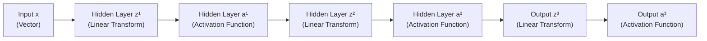
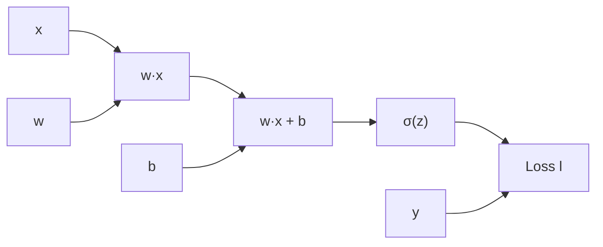
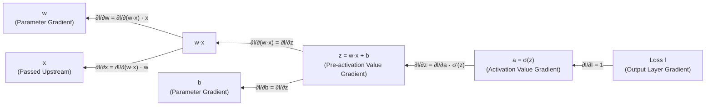

# Backpropagation

In the previous chapter, we deeply explored the forward propagation process where signals travel from the input layer through each layer of neurons layer by layer to the output layer. Forward propagation answers how a neural network computes inference results, but the problem of how the network learns through training remains unsolved — that is, how the network's parameters (weights and biases) are determined. The answer to this problem is the **Backpropagation Algorithm**, the core mechanism of neural network training, regarded as one of the most important algorithm inventions in the field of deep learning.

In 1986, Geoffrey Hinton proposed the backpropagation algorithm in his paper *[Learning representations by back-propagating errors](https://www.nature.com/articles/323533a0)* published in *Nature*, applying it to the training of multi-layer neural networks. After its introduction, this algorithm became a key milestone in the revival of neural networks. It was this breakthrough that made the training of multi-layer neural networks theoretically feasible, laying the foundation for the subsequent deep learning revolution.

Backpropagation solved a difficult problem then known as the **Credit Assignment Problem**: when the network produces an incorrect output, how do we determine which among hundreds or even thousands of parameters should be adjusted, and by how much? Backpropagation computes the gradient of the loss function with respect to the parameters of each layer, precisely transmitting the error signal from the output end backward to every layer and every parameter, telling the network whose contribution is large and who should be adjusted by how much.

This chapter will introduce the mathematical foundation of backpropagation (the chain rule), the backpropagation process through the lens of computation graphs, the detailed derivation of gradient computation, and computational complexity analysis. This chapter involves a significant amount of mathematical derivation and is one of the more challenging chapters in this book. However, understanding backpropagation is key to mastering the principles of neural network training and an essential step on the path to deep learning.

## Mathematical Foundation of Backpropagation

To understand backpropagation, one must first grasp two prerequisite concepts: the [chain rule](../../maths/calculus/gradient.md#chain-rule) from calculus, and the [signal flow process](forward-propagation.md#signal-flow-process) of forward propagation. Let us review the mathematical essence of a neural network: a neural network is essentially a nested composite function. Data begins at the input layer, passes through the linear transformation and activation function of each layer in sequence, and finally reaches the output layer. Therefore, if we want to adjust a certain parameter to reduce the prediction error, computing how much that parameter should be adjusted essentially requires tracing backward from the output value of this composite function to infer how the parameter should change — this is where the chain rule comes in.

Recall the mathematical expression of a [multi-layer network structure](mlp.md#model-complexity-limitations): $F(\mathbf{x}) = f^K \circ f^{K-1} \circ \cdots \circ f^1(\mathbf{x})$, a $K$-layer composite function where each layer function $f$ includes a linear transformation ($z = \mathbf{W} \mathbf{h} + \mathbf{b}$) and a nonlinear activation ($a = \sigma(z)$). Let us start with the simplest case, considering the relationship between the input value and the loss along a single path. Suppose a neuron has an input value $x$, a pre-activation value $z = wx + b$, an activation value $a = \sigma(z)$, and the gap (loss) between the sample label (true value) and the function output (predicted value) is $l$. According to the chain rule, the derivative of the loss with respect to the input value is:

$$\frac{\partial l}{\partial x} = \frac{\partial l}{\partial a} \cdot \frac{\partial a}{\partial z} \cdot \frac{\partial z}{\partial x}$$

Since the input and output of each layer in a neural network are not single values but vectors composed of multiple neurons, the chain rule must be extended to the multivariate case. Let the activation values of the $k-1$-th layer (i.e., the input values to the next $k$-th layer) be $\mathbf{a}^{k-1} \in \mathbb{R}^n$, the pre-activation values of the $k$-th layer be $\mathbf{z}^k \in \mathbb{R}^m$, the activation values be $\mathbf{a}^k \in \mathbb{R}^m$, and the loss be $l \in \mathbb{R}$. Then the partial derivative of the loss with respect to each input value of that layer is:

$$\frac{\partial l}{\partial a^{k-1}_i} = \sum_{j=1}^{m} \frac{\partial l}{\partial a^k_j} \cdot \frac{\partial a^k_j}{\partial z^k_j} \cdot \frac{\partial z^k_j}{\partial a^{k-1}_i}$$

The term $\sum_{j=1}^{m}$ in the formula sums up the contributions from all influence paths, because the $i$-th neuron of the $k-1$-th layer (with activation value $a^{k-1}_i$) simultaneously affects all $m$ neurons of the $k$-th layer. The overall formula can be understood as: the total rate of change of the loss with respect to a particular activation value equals the sum of the rates of change along all downstream paths. Since the vector $\mathbf{a}^{k-1}$ consists of multiple components, the combined influence of all neurons in a single layer can be expressed concisely in matrix form:

$$\frac{\partial l}{\partial \mathbf{a}^{k-1}} = \frac{\partial l}{\partial \mathbf{a}^k} \cdot \frac{\partial \mathbf{a}^k}{\partial \mathbf{z}^k} \cdot \frac{\partial \mathbf{z}^k}{\partial \mathbf{a}^{k-1}}$$

::: note Additional Note
To demonstrate the consistency of representation across three forms — scalar (single neuron), matrix (single layer), and matrix chain product (multi-layer) — the multiplication here uses [numerator layout](https://en.wikipedia.org/wiki/Matrix_calculus#Numerator-layout_notation) (Jacobian form), where gradients are row vectors. In practice, the common convention in machine learning uses [denominator layout](https://en.wikipedia.org/wiki/Matrix_calculus#Denominator-layout_notation) (Hessian form), where gradients are column vectors. In that case, a transpose is needed to ensure dimensional compatibility:
$$\frac{\partial l}{\partial \mathbf{a}^{k-1}} = \left(\frac{\partial \mathbf{z}^k}{\partial \mathbf{a}^{k-1}}\right)^T \left(\frac{\partial \mathbf{a}^k}{\partial \mathbf{z}^k}\right)^T \frac{\partial l}{\partial \mathbf{a}^k}$$
:::

Next, we extend the single-layer case to a multi-layer network and examine the derivative of the loss with respect to changes in the input $\mathbf{x}$. Using a three-layer network as an example, the forward information propagation path is as follows:



*Figure: Forward propagation signal flow in a three-layer neural network*

Suppose we want to compute the gradient of the loss function $l$ with respect to the input vector $\mathbf{x}$. From the perspective of forward propagation, a change in $\mathbf{x}$ affects $\mathbf{z}^1$, which in turn affects $\mathbf{a}^1$, then $\mathbf{z}^2$, $\mathbf{a}^2$, $\mathbf{z}^3$, $\mathbf{a}^3$, and finally the loss function $l$. This influence chain spans three complete network layers. Applying the multivariate chain rule, the gradient propagates layer by layer along this chain:

$$\frac{\partial l}{\partial \mathbf{x}} = \frac{\partial l}{\partial \mathbf{a}^3} \cdot \frac{\partial \mathbf{a}^3}{\partial \mathbf{z}^3} \cdot \frac{\partial \mathbf{z}^3}{\partial \mathbf{a}^2} \cdot \frac{\partial \mathbf{a}^2}{\partial \mathbf{z}^2} \cdot \frac{\partial \mathbf{z}^2}{\partial \mathbf{a}^1} \cdot \frac{\partial \mathbf{a}^1}{\partial \mathbf{z}^1} \cdot \frac{\partial \mathbf{z}^1}{\partial \mathbf{x}}$$

This formula indicates that the gradient transmitted to the first layer's input equals the chain product of the derivatives of all subsequent layers. This is the core of backpropagation: **the gradient propagates backward from the output layer to the input layer along the computation chain, and at each layer, the gradient is multiplied by the derivative of that layer's activation function and the derivative of its linear transformation**. This process runs in the opposite direction of forward propagation, hence the name backpropagation.

Imagine a water pipe extending from the mountaintop to the valley, with water flowing in the forward propagation direction (from mountaintop to valley). If we measure a pressure problem at the valley and want to find which section of the pipe on the mountaintop is faulty, we must trace backward along the pipe, measuring the changes in water pressure (partial derivatives) from the bottom up. Backpropagation is like this reverse tracing process: starting from the error signal at the output end, it traces backward along the computation chain to determine the responsibility (gradient) of each component (each layer's parameters).

## Backpropagation Through the Lens of Computation Graphs

The mathematical derivation above uses the chain rule, but in actual programming implementations, deep learning frameworks (such as TensorFlow, PyTorch) do not directly manipulate these complex formulas. Instead, just as they compute forward propagation, they use [computation graphs](forward-propagation.md#computation-graph) to carry out backpropagation. A computation graph decomposes the forward propagation process of a neural network into a series of basic operation nodes, where each node is responsible for a single simple operation (such as matrix multiplication, activation function, addition), and data flows from input to output along the edges. When handling backpropagation, the direction of information flow is reversed. This design allows gradient computation to be automated — the developer only needs to define the forward propagation computation process, and the framework automatically derives the backward gradient computation. This is the power and convenience of modern deep learning frameworks. Below, we illustrate this using the computation graph of information flowing through a single neuron:



*Figure: Computation graph of a simple neuron (forward propagation direction)*

During forward propagation, data flows from left to right: $x$ and $w$ are multiplied to obtain $w·x$, then $b$ is added to obtain $z$, passing through the activation function $\sigma$ to obtain $a$, which is compared with the true label $y$ to compute the loss $l$. During backpropagation, gradients flow from right to left along the same computation graph, but the traversal direction is opposite to forward propagation. This can be illustrated by the following diagram (in practice, it is the same computation graph as forward propagation, just traversed in reverse; here we split it into two diagrams for clarity):



*Figure: Computation graph of a simple neuron (backpropagation direction)*

1. **Output Layer Gradient**: The gradient of the loss $l$ with respect to the output $a$ is $\frac{\partial l}{\partial a}$. Using the squared error loss as an example, $loss = \frac{1}{2}(a - y)^2$, this gradient is $(a - y)$.
1. **Activation Function Backpropagation**: The gradient is multiplied by the derivative of the activation function $\sigma'(z)$ to obtain the gradient of the loss with respect to the pre-activation value $z$: $\frac{\partial l}{\partial z} = \frac{\partial l}{\partial a} \cdot \sigma'(z)$. This step also applies the chain rule, transmitting the gradient from the output end of the activation value to its input end.
1. **Linear Transformation Backpropagation**: The pre-activation value is $z = w \cdot x + b$, therefore:
   - Gradient of the loss with respect to the weight $w$: $\frac{\partial l}{\partial w} = \frac{\partial l}{\partial z} \cdot \frac{\partial z}{\partial w} = \frac{\partial l}{\partial z} \cdot x$
   - Gradient of the loss with respect to the bias $b$: $\frac{\partial l}{\partial b} = \frac{\partial l}{\partial z} \cdot \frac{\partial z}{\partial b} = \frac{\partial l}{\partial z} \cdot 1 = \frac{\partial l}{\partial z}$
   - Gradient of the loss with respect to the input $x$: $\frac{\partial l}{\partial x} = \frac{\partial l}{\partial z} \cdot \frac{\partial z}{\partial x} = \frac{\partial l}{\partial z} \cdot w$, this gradient is passed upstream to continue backpropagation.

The entire computation process is like tracing backward through the computation graph: starting from the final loss value, tracing in reverse along each edge, and distributing the gradient to each parameter node according to the chain rule. Each node only needs to know how to compute its own local gradient (the derivative of its output with respect to its input), then multiply the gradient received from upstream by the local gradient, and pass the result to downstream nodes. Once the neuron knows the gradients of its parameters (weight $w$ and bias $b$), it has the direction for parameter adjustment and can update the parameters via gradient descent: $w^{new} \leftarrow w - \eta \frac{\partial l}{\partial w}$, $b^{new} \leftarrow b - \eta \frac{\partial l}{\partial b}$.

## Gradient Computation

After analyzing the computation graph of a single neuron, we have a preliminary understanding of the gradient backpropagation process. Next, we will delve deeper into the details, deriving the gradient computation process for an entire multi-layer neural network using a specific example with a chosen loss function and activation function. Suppose the network has $K$ layers, the loss function is [cross-entropy loss](../../statistical-learning/linear-models/logistic-regression.md#cross-entropy-loss), the output layer uses the [Softmax](../../statistical-learning/linear-models/logistic-regression.md#multinomial-logistic-regression) activation function, and the hidden layers use the [Sigmoid](../../statistical-learning/linear-models/logistic-regression.md#sigmoid-function) activation function — the most common configuration for classification tasks. To facilitate the subsequent derivation, we first establish some notation:

- $\mathbf{z}^k = \mathbf{W}^k \mathbf{a}^{k-1} + \mathbf{b}^k$: Pre-activation value of the $k$-th layer, i.e., the result of the linear transformation.
- $\mathbf{a}^k = \sigma^k(\mathbf{z}^k)$: Activation value of the $k$-th layer, i.e., the output after passing through the activation function.
- $\delta^k = \frac{\partial l}{\partial \mathbf{z}^k}$: Error signal of the $k$-th layer, representing the gradient of the loss function with respect to the pre-activation values of that layer. The error signal $\delta^k$ is the core of backpropagation derivation; it tells us how much the pre-activation values of that layer should be adjusted to reduce the loss.

### Output Layer Gradient

Following the same approach as the single neuron derivation, we first compute the gradient of the output layer (the $K$-th layer). For the Softmax + Cross-Entropy combination, the gradient of the output layer has an elegantly simplified form — one of the most delightful mathematical coincidences in neural networks. Suppose the output layer has $I$ neurons (corresponding to $I$ classes), and the output of the Softmax function is:

$$a_i^K = \frac{e^{z_i^K}}{\sum_{j=1}^{I} e^{z_j^K}}$$

Here, $z_i^K$ is the pre-activation value (raw output of the linear transformation) of the $i$-th neuron in the output layer, and $a_i^K$ is the predicted probability of the $i$-th class after the Softmax transformation. The cross-entropy loss is:

$$l = -\sum_{i=1}^{I} y_i \log a_i^K$$

where $y_i$ is the [One-Hot encoding](../../deep-learning/sequence-models/word-embedding.md#one-hot-encoding) of the true label (the correct class is 1, all other classes are 0). $\log a_i^K$ is the logarithm of the predicted probability — the closer the probability is to 1, the closer the logarithm is to 0. The overall loss equals the negative logarithm of the predicted probability of the correct class: the lower the probability, the greater the loss. The partial derivative of $l$ with respect to $z_i^K$ is (see the derivation in the [Exercises](#exercises) section):

$$[eq:backprop-output-eq] \frac{\partial l}{\partial z_i^K} = a_i^K - y_i$$

Mathematically, the gradient of Softmax + Cross-Entropy is remarkably concise — it is simply the predicted probability minus the true label. This means the error signal of the output layer can be obtained through a simple subtraction without any differentiation computation: the error signal $\delta^K$ is $\mathbf{a}^K - \mathbf{y}$.

### Hidden Layer Gradient Propagation

Once the error signal of the output layer is computed, it needs to be transmitted layer by layer to the hidden layers. Let the error signal of the $k$-th hidden layer be $\delta^k$, and the gradient transmitted from the $k+1$-th layer be $\delta^{k+1}$. $\delta^k$ is the gradient of the loss function with respect to the pre-activation values of that layer. According to the chain rule, by multiplying by the derivative of the activation function $\sigma'(z)$, the gradient is transmitted from the output end of the activation value to its input end, yielding the error signal for each hidden layer:

$$[eq:backprop-error-sign] \delta^k = \frac{\partial l}{\partial \mathbf{z}^k} = \frac{\partial l}{\partial \mathbf{a}^k} \cdot \frac{\partial \mathbf{a}^k}{\partial \mathbf{z}^k}= \frac{\partial l}{\partial \mathbf{a}^k} \cdot \sigma'(\mathbf{z}^k)$$

The term $\frac{\partial l}{\partial \mathbf{a}^k}$ in the formula can be obtained from the error signal $\delta^{k+1}$ transmitted from the $k+1$-th layer:

$$\frac{\partial l}{\partial \mathbf{a}^k} = \frac{\partial l}{\partial \mathbf{z}^{k+1}} \cdot \frac{\partial \mathbf{z}^{k+1}}{\partial \mathbf{a}^k} = (\mathbf{W}^{k+1})^T \delta^{k+1}$$

Here, $\frac{\partial l}{\partial \mathbf{z}^{k+1}}$ is precisely the error signal $\delta^{k+1}$ of the previous layer, which, when iterated back to the output layer (see {{eq:backprop-output-eq}}), becomes $\mathbf{a}^K - \mathbf{y}$. $\frac{\partial \mathbf{z}^{k+1}}{\partial \mathbf{a}^k}$ is the derivative of the next layer's pre-activation values with respect to this layer's activation values. Since $\mathbf{z}^{k+1} = \mathbf{W}^{k+1} \mathbf{a}^k + \mathbf{b}^{k+1}$, its partial derivative with respect to $\mathbf{a}^k$ equals the weight matrix $\mathbf{W}^{k+1}$. As mentioned earlier, the common convention in machine learning uses denominator layout, where gradients are column vectors, requiring a transpose to ensure dimensional compatibility. To satisfy the [inner dimension matching](../../maths/linear/matrices.md#matrix-operations) requirement for matrix multiplication, the transpose of the weight matrix $(\mathbf{W}^{k+1})^T$ is multiplied with the error signal from the previous layer. From the perspective of signal propagation, this operation is analogous to signal scaling: forward propagation uses $\mathbf{W}^{k+1}$ to amplify the signal, while backpropagation uses the transpose $(\mathbf{W}^{k+1})^T$ to scale the gradient back down. Substituting this expression into the hidden layer error signal (see {{eq:backprop-error-sign}}) gives:

$$[eq:backprop-hidden] \delta^k = (\mathbf{W}^{k+1})^T \delta^{k+1} \cdot \sigma'(\mathbf{z}^k)$$

This is the propagation formula for the hidden layer error signal: the error signal of a hidden layer can be obtained by multiplying the error signal from the previous layer by the transpose of this layer's weight matrix, and then multiplying by the derivative of this layer's activation function. An analogy of signal attenuation can help understand this derivation: the error signal $\delta^{k+1}$ arrives from downstream, is scaled by the inverse mapping of the weight matrix ($(\mathbf{W}^{k+1})^T$), and then adjusted in strength by the activation function derivative ($\sigma'(\mathbf{z}^k)$), ultimately yielding this layer's error signal $\delta^k$. If the activation function derivative is very small (e.g., Sigmoid at its extremes), the error signal is significantly attenuated — this is the root cause of the vanishing gradient problem discussed later.

### Parameter Gradient Computation

With the error signal $\delta^k$ (see {{eq:backprop-hidden}}) in hand, we can compute the gradient of the parameters of the $k$-th layer. These gradients tell us how much the weights and biases should be adjusted to reduce the loss. According to the chain rule, the weight gradient is:

$$\frac{\partial l}{\partial \mathbf{W}^k} = \frac{\partial l}{\partial z^k} \cdot \frac{\partial z^k}{\partial \mathbf{W}^k} $$

Since $\frac{\partial l}{\partial z^k} = \delta^k$ and $\frac{\partial z^k}{\partial \mathbf{W}^k} = a^{k-1}$, we have:

$$\frac{\partial l}{\partial \mathbf{W}^k} = \frac{\partial l}{\partial z^k} \cdot \frac{\partial z^k}{\partial \mathbf{W}^k} = \delta^k (\mathbf{a}^{k-1})^T$$

In the formula, $\delta^k (\mathbf{a}^{k-1})^T$ is the outer product of two vectors, with dimensions $n_k \times n_{k-1}$, exactly matching the dimensions of the weight matrix. The conclusion of the overall formula is that **the weight gradient equals the outer product of the error signal and the input signal**. From a geometric perspective, the outer product $\delta^k (\mathbf{a}^{k-1})^T$ is a kind of correlation matrix. If a certain input signal $a_j^{k-1}$ is strong (large absolute value) and the corresponding neuron's error $\delta_i^k$ is also large, then the gradient of weight $W_{ij}^k$ is large — this weight contributes significantly to the error and needs a substantial adjustment. Conversely, if the input signal is weak or the error is small, the gradient is small, and the adjustment is correspondingly minor.

Similarly, we compute the bias gradient. According to the chain rule:

$$\frac{\partial l}{\partial b^k} = \frac{\partial l}{\partial z^k} \cdot \frac{\partial z^k}{\partial b^k} $$

Since $\frac{\partial l}{\partial z^k} = \delta^k$ and $\frac{\partial z^k}{\partial b^k} = 1$ (the derivative of the bias $b^k$ with respect to itself is 1, independent of other terms), we have:

$$\frac{\partial l}{\partial b^k} = \frac{\partial l}{\partial z^k} \cdot \frac{\partial z^k}{\partial b^k} = \delta^k$$

The conclusion is very clear and concise: **the bias gradient is directly equal to the error signal**. The bias acts independently on each neuron and does not depend on the input signal, so its gradient is simply the error signal $\delta_i^k$ of that neuron, without influence from other factors. This differs from the weight gradient, where the strength of the input signal must be considered (reflected through the outer product), whereas the bias gradient reflects only the magnitude of the error itself.

### Gradient Computation for Batched Samples

The above derivation applies to a single sample in a multi-layer network. In actual training, we do not compute gradients using just one sample; instead, we use [batch computation](./forward-propagation.md#batch-computation-and-efficiency-optimization). Batch computation not only leverages the parallel computing power of GPUs to significantly improve training efficiency, but also takes into account that single-sample gradients may have large random fluctuations, while the average gradient over an appropriately sized batch is more stable and better reflects the overall pattern of the data. Therefore, we finally extend the computation process to the case of batched samples. Let the batch size be $m$, the pre-activation matrix of the $k$-th layer be $\mathbf{Z}^k \in \mathbb{R}^{n_k \times m}$, and the activation matrix be $\mathbf{A}^k \in \mathbb{R}^{n_k \times m}$. Each column of the matrix corresponds to one sample. The batch error signal matrix is:

$$\Delta^k = \frac{\partial L}{\partial \mathbf{Z}^k} = \begin{bmatrix} \delta^k_1 & \delta^k_2 & \cdots & \delta^k_m \end{bmatrix} \in \mathbb{R}^{n_k \times m}$$

Here, $\Delta^k$ is the error signal matrix, with each column being the error signal vector $\delta^k_i \in \mathbb{R}^{n_k}$ of one sample. When computing parameter gradients, we average over the batch dimension:

$$\bar{\delta}^k = \frac{1}{m} \sum_{i=1}^{m} \delta^k_i \in \mathbb{R}^{n_k}$$

The weight gradient is $\frac{\partial L}{\partial \mathbf{W}^k} = \frac{1}{m} \Delta^k (\mathbf{A}^{k-1})^T$, and the bias gradient is $\frac{\partial L}{\partial \mathbf{b}^k} = \bar{\delta}^k$. The meaning of the entire formula is that **the batch gradient equals the average of the gradients of individual samples**.

## Computational Complexity Analysis

Understanding the computational complexity of backpropagation has significant practical value for estimating training time, designing network architectures, and optimizing hardware utilization. This section analyzes the complexity comparison between forward propagation and backpropagation, memory overhead, and numerical stability issues.

In terms of time complexity, the time complexity of backpropagation is of the same order as forward propagation — contrary to the intuitive expectation that backpropagation, which computes gradients for all parameters, should be more complex. This is an important and surprising conclusion, meaning that the computational cost of one training iteration (one forward pass and one backward pass) is roughly twice that of a forward pass alone, remaining within the same order of magnitude. This can be demonstrated through a simple derivation. Suppose the network has $K$ layers, the $k$-th layer has $n_k$ neurons, and the total number of parameters in the entire network is $P = \sum_{k=1}^{K} (n_k \cdot n_{k-1} + n_k)$.

- In forward propagation, the computation per layer primarily consists of the matrix multiplication $\mathbf{W}^k \mathbf{a}^{k-1}$, with time complexity $O(n_k \cdot n_{k-1})$, and the activation function computation, with time complexity $O(n_k)$. Thus, the total time complexity for a single sample in a single forward pass is $T_{forward} = O(P)$.
- In backpropagation, the computation per layer includes error signal propagation $(\mathbf{W}^{k+1})^T \delta^{k+1}$, with time complexity $O(n_{k+1} \cdot n_k)$, and parameter gradient computation $\delta^k (\mathbf{a}^{k-1})^T$, with time complexity $O(n_k \cdot n_{k-1})$. Thus, the total time complexity for a single sample in a single backward pass is also $T_{backward} = O(P)$.

From this, we conclude that the time complexity of backpropagation is comparable to that of forward propagation, both being $O(P)$.

In terms of space complexity, backpropagation requires storing intermediate results from forward propagation (pre-activation values $\mathbf{z}^k$ and activation values $\mathbf{a}^k$) for gradient computation. This incurs a certain memory overhead (hereafter, we collectively refer to CPU memory and GPU memory as memory). Let the batch size be $B$, and the total amount of intermediate results stored across all layers be $M = B \cdot \sum_{k=1}^{K} 2 n_k$, where the factor $2$ accounts for storing two values per neuron — the pre-activation value $z_i^k$ and the activation value $a_i^k$. The overall formula shows that memory usage equals the batch size times twice the sum of neurons in each layer.

For large networks and batch training, memory overhead can become a bottleneck. For example, a 10-layer network with 1000 neurons per layer and a batch size of 1000 requires storing approximately $1000 \times 10 \times 1000 \times 2 = 20$ million floating-point numbers. At FP32 precision, this amounts to about 80 MB of memory, and this is only the storage cost for intermediate training results, not accounting for the model parameters themselves. Modern machine learning frameworks employ various optimization strategies to reduce memory usage, such as:

- **Gradient Checkpointing**: Stores intermediate results for only a subset of layers, recomputing the rest when needed. This is a compute-for-memory strategy suitable for scenarios where memory is limited but compute resources are abundant.
- **Memory Reuse**: Releases intermediate result memory immediately after computing gradients, reducing peak memory usage.
- **Mixed Precision**: Stores intermediate results using lower precision (e.g., FP16), halving memory usage while maintaining basic computational accuracy.

## Backpropagation Algorithm in Practice

The following code implements the complete backpropagation process, verifies the correctness of gradient computation, and visualizes the transmission of error signals through the network. From the four visualization charts produced by the experiment, we can observe the trends of loss and gradients during training. If training proceeds smoothly, the loss should monotonically decrease and the gradients should attenuate layer by layer, indicating that the model loss gradually converges toward stability. However, in practice, training stability is a major engineering challenge that we will discuss separately later.

```python runnable
import numpy as np
import matplotlib.pyplot as plt

class NeuralNetworkBP:
    """
    Complete backpropagation implementation
    
    Supports multi-layer networks with multiple activation functions
    """
    def __init__(self, layer_sizes, activations, learning_rate=0.01):
        """
        Parameters:
        layer_sizes : list of int
            Number of neurons in each layer
        activations : list of str
            Activation function type for each layer
        learning_rate : float
            Learning rate
        """
        self.layer_sizes = layer_sizes
        self.activations = activations
        self.lr = learning_rate
        self.num_layers = len(layer_sizes) - 1
        
        # Initialize weights and biases
        np.random.seed(42)
        self.weights = []
        self.biases = []
        
        for i in range(self.num_layers):
            # He initialization (suitable for ReLU)
            if activations[i] == 'relu':
                scale = np.sqrt(2.0 / layer_sizes[i])
            else:
                scale = np.sqrt(1.0 / layer_sizes[i])
            
            w = np.random.randn(layer_sizes[i+1], layer_sizes[i]) * scale
            b = np.zeros((layer_sizes[i+1], 1))
            self.weights.append(w)
            self.biases.append(b)
        
        # Store intermediate results and gradient history
        self.activations_cache = []
        self.pre_activations_cache = []
        self.gradients_history = []
        self.loss_history = []
    
    def _apply_activation(self, Z, activation_name):
        """Apply activation function"""
        if activation_name == 'sigmoid':
            Z = np.clip(Z, -500, 500)
            return 1 / (1 + np.exp(-Z))
        elif activation_name == 'relu':
            return np.maximum(0, Z)
        elif activation_name == 'tanh':
            return np.tanh(Z)
        elif activation_name == 'softmax':
            Z_shifted = Z - np.max(Z, axis=0, keepdims=True)
            exp_Z = np.exp(Z_shifted)
            return exp_Z / np.sum(exp_Z, axis=0, keepdims=True)
        elif activation_name == 'linear':
            return Z
        else:
            raise ValueError(f"Unknown activation: {activation_name}")
    
    def _activation_derivative(self, Z, A, activation_name):
        """Compute activation function derivative"""
        if activation_name == 'sigmoid':
            return A * (1 - A)
        elif activation_name == 'relu':
            return (Z > 0).astype(float)
        elif activation_name == 'tanh':
            return 1 - A ** 2
        elif activation_name == 'linear':
            return np.ones_like(Z)
        else:
            raise ValueError(f"Derivative not implemented for: {activation_name}")
    
    def forward(self, X):
        """Forward propagation"""
        self.activations_cache = [X]
        self.pre_activations_cache = []
        
        A = X
        for i in range(self.num_layers):
            Z = self.weights[i] @ A + self.biases[i]
            self.pre_activations_cache.append(Z)
            A = self._apply_activation(Z, self.activations[i])
            self.activations_cache.append(A)
        
        return A
    
    def backward(self, Y):
        """Backpropagation"""
        m = Y.shape[1]  # Number of samples
        gradients = {'weights': [], 'biases': []}
        
        # Output layer error signal
        if self.activations[-1] == 'softmax':
            # Simplified gradient for Softmax + Cross-Entropy
            delta = self.activations_cache[-1] - Y
        else:
            # Other activation functions: cross-entropy loss gradient is -Y/A
            delta = (-Y / self.activations_cache[-1]) * \
                    self._activation_derivative(
                        self.pre_activations_cache[-1],
                        self.activations_cache[-1],
                        self.activations[-1]
                    )
        
        # Backward propagation layer by layer
        for i in range(self.num_layers - 1, -1, -1):
            # Compute parameter gradients
            dW = delta @ self.activations_cache[i].T / m
            db = np.sum(delta, axis=1, keepdims=True) / m
            
            gradients['weights'].insert(0, dW)
            gradients['biases'].insert(0, db)
            
            # Propagate to the previous layer (except the input layer)
            if i > 0:
                delta_prev = self.weights[i].T @ delta
                delta = delta_prev * self._activation_derivative(
                    self.pre_activations_cache[i-1],
                    self.activations_cache[i],
                    self.activations[i-1]
                )
        
        self.gradients_history.append(gradients)
        return gradients
    
    def compute_loss(self, Y_pred, Y_true):
        """Compute cross-entropy loss"""
        eps = 1e-15
        Y_pred = np.clip(Y_pred, eps, 1 - eps)
        return -np.mean(np.sum(Y_true * np.log(Y_pred), axis=0))
    
    def update_parameters(self, gradients):
        """Update parameters"""
        for i in range(self.num_layers):
            self.weights[i] -= self.lr * gradients['weights'][i]
            self.biases[i] -= self.lr * gradients['biases'][i]
    
    def train(self, X, Y, epochs=100):
        """Train the network"""
        for epoch in range(epochs):
            # Forward propagation
            Y_pred = self.forward(X)
            
            # Compute loss
            loss = self.compute_loss(Y_pred, Y)
            self.loss_history.append(loss)
            
            # Backpropagation
            gradients = self.backward(Y)
            
            # Update parameters
            self.update_parameters(gradients)
        
        return self
    
    def predict(self, X):
        """Predict"""
        Y_pred = self.forward(X)
        return np.argmax(Y_pred, axis=0)


# Experiment: Backpropagation process visualization
print("=" * 60)
print("Experiment: Backpropagation Process Visualization")
print("=" * 60)

# Create a three-layer network
layer_sizes = [2, 16, 8, 3]  # Input 2, two hidden layers, output 3 classes
activations = ['relu', 'relu', 'softmax']
nn = NeuralNetworkBP(layer_sizes, activations, learning_rate=0.5)

print(f"Network Structure: {' -> '.join(map(str, layer_sizes))}")
print(f"Activation Functions: {activations}")
print(f"Total Parameters: {sum(w.size + b.size for w, b in zip(nn.weights, nn.biases))}")
print()

# Generate training data
np.random.seed(123)
m = 100  # Number of samples
X = np.random.randn(2, m)

# Generate three-class labels
Y_indices = np.random.randint(0, 3, m)
Y = np.zeros((3, m))
for i, idx in enumerate(Y_indices):
    Y[idx, i] = 1

# Train the network
nn.train(X, Y, epochs=200)

print(f"Training Complete, Final Loss: {nn.loss_history[-1]:.4f}")
print()

# Visualize the backpropagation process
fig, axes = plt.subplots(2, 2, figsize=(12, 10))

# Chart 1: Loss curve
ax1 = axes[0, 0]
ax1.plot(nn.loss_history, color='#3498db', linewidth=2)
ax1.set_xlabel('Iteration', fontsize=11)
ax1.set_ylabel('Cross Entropy Loss', fontsize=11)
ax1.set_title('Loss During Training', fontsize=12)
ax1.grid(True, alpha=0.3)

# Chart 2: Gradient norm trend
ax2 = axes[0, 1]
gradient_norms = []
for grad in nn.gradients_history:
    total_norm = 0
    for w_grad in grad['weights']:
        total_norm += np.linalg.norm(w_grad)
    for b_grad in grad['biases']:
        total_norm += np.linalg.norm(b_grad)
    gradient_norms.append(total_norm)

ax2.plot(gradient_norms, color='#e74c3c', linewidth=2)
ax2.set_xlabel('Iteration', fontsize=11)
ax2.set_ylabel('Total Gradient Norm', fontsize=11)
ax2.set_title('Gradient Trend', fontsize=12)
ax2.grid(True, alpha=0.3)

# Chart 3: Gradient distribution per layer (last iteration)
ax3 = axes[1, 0]
last_gradients = nn.gradients_history[-1]
layer_names = ['Layer 1 Weights', 'Layer 1 Biases', 'Layer 2 Weights', 'Layer 2 Biases', 'Layer 3 Weights', 'Layer 3 Biases']
layer_values = []

for i in range(nn.num_layers):
    layer_values.append(np.abs(last_gradients['weights'][i]).mean())
    layer_values.append(np.abs(last_gradients['biases'][i]).mean())

colors = ['#3498db', '#e74c3c', '#2ecc71', '#f39c12', '#9b59b6', '#1abc9c']
bars = ax3.bar(range(len(layer_values)), layer_values, color=colors, alpha=0.7)
ax3.set_xticks(range(len(layer_values)))
ax3.set_xticklabels(layer_names, fontsize=9)
ax3.set_ylabel('Mean Absolute Gradient', fontsize=11)
ax3.set_title('Gradient Distribution per Layer (Last Iteration)', fontsize=12)
ax3.grid(True, alpha=0.3, axis='y')

# Chart 4: Error signal propagation visualization
ax4 = axes[1, 1]

# Simulate one pass of error signal propagation
nn.forward(X[:, :5])  # Use 5 samples
nn.backward(Y[:, :5])

# Plot the norm of error signals across layers
delta_norms = []
for i in range(nn.num_layers):
    if i == nn.num_layers - 1:
        # Output layer: directly compute error signal
        delta = nn.activations_cache[-1] - Y[:, :5]
        delta_norm = np.linalg.norm(delta)
        delta_norms.append(delta_norm)
    else:
        # Hidden layer: approximate error signal via gradient norm
        grad_norm = np.linalg.norm(nn.gradients_history[-1]['weights'][i])
        delta_norms.append(grad_norm)

# Since we didn't store intermediate deltas, we approximate with gradient norm
delta_approx = [np.linalg.norm(g) for g in nn.gradients_history[-1]['weights']]
ax4.plot(range(nn.num_layers), delta_approx[::-1], 'o-', color='#2ecc71',
         linewidth=2, markersize=8, label='Approximate Error Signal Norm')
ax4.set_xlabel('Layer Index (Output to Input)', fontsize=11)
ax4.set_ylabel('Error Signal Norm', fontsize=11)
ax4.set_title('Error Signal Backpropagation', fontsize=12)
ax4.invert_xaxis()  # Backpropagation direction: from right (output layer) to left (input layer)
ax4.legend()
ax4.grid(True, alpha=0.3)

plt.tight_layout()
plt.show()
plt.close()
```

## Summary

This chapter has provided a detailed introduction to the principles and implementation of the backpropagation algorithm, including the mathematical foundation of the chain rule, the backpropagation process through the lens of computation graphs, the detailed derivation of gradient computation, and computational complexity analysis. Backpropagation is the core algorithm of neural network training; it solves the credit assignment problem for multi-layer networks by transmitting the error signal from the output layer backward to each layer, computing the gradients for parameter updates. Understanding backpropagation lays a solid foundation for subsequent study of activation functions, loss functions, optimization algorithms, and more. The next chapter will introduce activation functions, exploring the characteristics of different activation functions and their impact on gradient propagation.

## Exercises

1. Suppose a neural network uses the Sigmoid activation function $f(z) = \frac{1}{1+e^{-z}}$. Prove that its derivative is $f'(z) = f(z)(1-f(z))$. Analyze the maximum value of the Sigmoid derivative and its impact on gradient propagation.
    <details>
    <summary>Reference Answer</summary>
    
    **Proof of Sigmoid derivative**:
    
    Let $f(z) = \frac{1}{1+e^{-z}} = \frac{e^z}{1+e^z}$
    
    Differentiate $f(z)$:
    
    $$f'(z) = \frac{d}{dz}\left(\frac{1}{1+e^{-z}}\right) = \frac{e^{-z}}{(1+e^{-z})^2}$$
    
    Note that $1 - f(z) = 1 - \frac{1}{1+e^{-z}} = \frac{e^{-z}}{1+e^{-z}}$
    
    Therefore:
    
    $$f'(z) = f(z) \cdot (1 - f(z)) = \frac{1}{1+e^{-z}} \cdot \frac{e^{-z}}{1+e^{-z}} = \frac{e^{-z}}{(1+e^{-z})^2}$$
    
    **Analysis of maximum derivative**:
    
    $f'(z) = f(z)(1-f(z))$. Let $f(z) = t$, then $f'(z) = t(1-t)$.
    
    When $t = 0.5$ (i.e., $z=0$), $f'(z) = 0.5 \times 0.5 = 0.25$, which is the maximum value of the derivative.
    
    When $z$ is very large ($f(z) \approx 1$) or very small ($f(z) \approx 0$), the derivative approaches 0.
    
    **Impact on gradient propagation**:
    
    In backpropagation, each time the gradient passes through a Sigmoid activation layer, it is multiplied by $f'(z)$ (maximum 0.25). This means the gradient decays layer by layer:
    
    - After 1 Sigmoid layer: at most 25% of the gradient remains
    - After 2 layers: at most $25\% \times 25\% = 6.25\%$ remains
    - After 10 layers: at most $(0.25)^{10} \approx 0.0001\%$ remains
    
    This is the root cause of the **vanishing gradient problem**. When deep networks use the Sigmoid activation function, the gradients of the earlier layers become nearly 0, and the parameters cannot be updated effectively.
    </details>

2. Explain why the gradient of Softmax + Cross-Entropy $\frac{\partial l}{\partial \mathbf{z}^L} = \mathbf{a}^L - \mathbf{y}$ is so concise. What is the practical significance of this simplification?
    <details>
    <summary>Reference Answer</summary>
    
    **Reason for simplification**:
    
    This simplification arises from the special combination of properties of Softmax and Cross-Entropy.
    
    Let the Softmax output be $a_k = \frac{e^{z_k}}{\sum_j e^{z_j}}$ and the Cross-Entropy loss be $l = -\sum_k y_k \log a_k$.
    
    Directly compute $\frac{\partial l}{\partial z_k}$:
    
    $$\frac{\partial l}{\partial z_k} = \sum_j \frac{\partial l}{\partial a_j} \cdot \frac{\partial a_j}{\partial z_k}$$
    
    Where:
    - $\frac{\partial l}{\partial a_j} = -\frac{y_j}{a_j}$
    - $\frac{\partial a_j}{\partial z_k} = a_j(\delta_{jk} - a_k)$ ($\delta_{jk}$ is the Kronecker delta)
    
    Substituting:
    
    $$\frac{\partial l}{\partial z_k} = \sum_j -\frac{y_j}{a_j} \cdot a_j(\delta_{jk} - a_k) = -\sum_j y_j(\delta_{jk} - a_k)$$
    
    $$= -\sum_j y_j \delta_{jk} + \sum_j y_j a_k = -y_k + a_k \sum_j y_j$$
    
    Since $\sum_j y_j = 1$ (One-Hot encoding), we obtain:
    
    $$\frac{\partial l}{\partial z_k} = a_k - y_k$$
    
    **Practical significance**:
    
    1. **Computationally efficient**: No need to explicitly compute the Jacobian matrix of Softmax (size $K \times K$); simply compute the difference between the predicted probability and the true label.
    2. **Numerically stable**: Computing the Jacobian matrix of Softmax involves $a_j(\delta_{jk} - a_k)$, which can cause numerical issues when $a_k$ is very small. The simplified formula avoids these complex computations.
    3. **Intuitive gradient**: The error signal $a_k - y_k$ intuitively represents the "prediction error." When the prediction is correct, $a_k \approx y_k$ and the gradient is near 0; when the prediction is wrong, the gradient points in the direction of correction.
    4. **Avoids vanishing gradients**: When Softmax is used alone, the output layer gradient can be very small. However, when combined with Cross-Entropy, the gradient is always proportional to the prediction error, avoiding vanishing gradients.
    
    This is why classification problems almost always use the Softmax + Cross-Entropy combination: the gradient computation is concise and efficient.
    </details>

3. The computational complexity of backpropagation is comparable to that of forward propagation. What implications does this have for hardware design?
    <details>
    <summary>Reference Answer</summary>
    The fact that backpropagation complexity is comparable to forward propagation means that hardware optimizations for matrix operations can simultaneously improve both training and inference efficiency. Modern AI hardware (GPUs, TPUs) is designed precisely around matrix multiplication.

    1. **Matrix operations are core**: The main computation in both forward and backward propagation is matrix multiplication. GPUs should optimize matrix computation capabilities.

    2. **Memory bandwidth matters**: Backpropagation requires reading intermediate results stored during forward propagation, making memory bandwidth a potential bottleneck. GPUs should have high-bandwidth memory (e.g., HBM).

    3. **Specialized accelerators**: Since forward and backward propagation have comparable complexity, dedicated hardware can be designed to optimize both. The matrix multiplication acceleration units in TPUs are designed precisely for this purpose.

    4. **Operator fusion**: Combine linear combination, activation function, and gradient computation into a single operation to reduce memory access. Modern GPUs and frameworks support operator fusion.

    5. **Memory optimization**: Backpropagation requires storing intermediate results for all layers. Memory reuse mechanisms or gradient checkpointing techniques can be designed to reduce memory usage.

    6. **Parallel computation**: Computations across different layers and different samples can be parallelized. In batch processing, the forward and backward passes of $m$ samples can be executed in parallel.
    </details>
