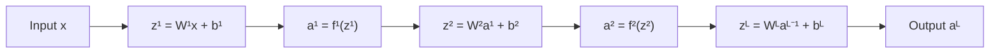
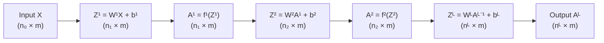
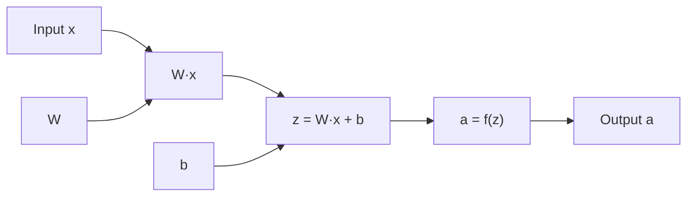
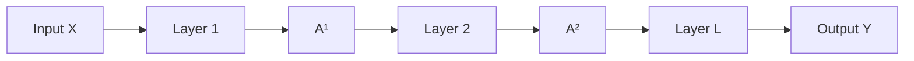

# Forward Propagation

In the previous three chapters, we gradually built the theoretical framework of neural networks. From biological neurons to the M-P model, from single-layer perceptrons to multi-layer perceptrons, from linear decision boundaries to nonlinear representation capabilities. Now, we will delve into the computational mechanism of neural networks — **Forward Propagation**. The concept of forward propagation can be traced back to 1943. When McCulloch and Pitts proposed the M-P model, the process they described of neurons receiving input signals, performing weighted summation, thresholding, and outputting signals was the prototype of forward propagation. Today, forward propagation specifically refers to the process in neural networks where signals are transmitted layer by layer from the input layer through each layer of neurons to the output layer. This chapter will introduce the signal flow process, matrix form derivation, the concept of computational graphs, batch computation and efficiency optimization, and experimentally compare the speed differences of forward propagation on CPU and GPU.

## Signal Flow Process

When introducing perceptrons and multi-layer perceptrons earlier, we examined signal flow from the perspective of a single neuron: a neuron receives multiple input signals $\mathbf{x} = (x_1, x_2, \ldots, x_n)^T$, multiplies each input signal by its corresponding weight and adds a bias to obtain the linear combination result $z = \sum_{i=1}^{n} w_i x_i + b = \mathbf{w}^T \mathbf{x} + b$, and then transforms it through an activation function $f$ to produce the neuron output $a = f(z)$. This three-step process of "**input → weighted sum → activation transformation**" constitutes the basic computation of a neuron.

When we organize multiple neurons into layers and connect them into a network, we must use matrix operations to describe the process of input signals passing through multiple neurons layer by layer from the perspective of the entire network. Suppose we have an $L$-layer neural network (including input layer, hidden layers, and output layer). The weight matrix of the $l$-th layer is denoted as $\mathbf{W}^l$, the bias vector as $\mathbf{b}^l$. It receives the output $\mathbf{a}^{l-1}$ of the $(l-1)$-th layer and performs a linear combination $\mathbf{z}^l = \mathbf{W}^l \mathbf{a}^{l-1} + \mathbf{b}^l$, where the dimension of the weight matrix $\mathbf{W}^l$ is $n_l \times n_{l-1}$ (the number of rows equals the number of neurons in the current layer, and the number of columns equals the number of neurons in the previous layer), and the dimension of the bias vector $\mathbf{b}^l$ is $n_l \times 1$. The result is then transformed through the activation function $f^l$ to obtain the output of this layer $\mathbf{a}^l = f^l(\mathbf{z}^l)$. This process is repeated for each layer until the output $\mathbf{a}^L$ of the last layer is the network's prediction for the input $\mathbf{x}$. If you understand the signal flow of a sample through a single neuron, then the signal flow through the entire network is simply a generalization where parameters become matrices. This process can be intuitively represented with a flowchart:



*Figure: Information flow process in a multi-layer neural network*

From the above diagram, we can see that signal flow is a relay process: the input signal enters the first layer, undergoes linear combination and activation transformation, and the output serves as the input for the second layer, and so on, until the output layer produces the final prediction. Each layer of the network processes the signal transmitted from the previous layer — some layers extract features, some combine features, and some make decisions.

Now we have generalized the signal flow from a single neuron to the entire network, but this is still only the computation process of a single sample entering the network. In practical applications, neural networks typically need to process thousands or tens of thousands of samples. Image recognition needs to process massive numbers of images, speech recognition needs to process large amounts of audio clips. If we compute forward propagation sample by sample, the efficiency would be far too low. So we need to go further and provide the matrix form for batch input, completing batch computations in one pass.

Suppose the input contains $m$ samples, each with $n_0$ features, the input matrix $\mathbf{X} \in \mathbb{R}^{n_0 \times m}$, where each column is a sample vector $\mathbf{X} = [\mathbf{x}_1, \mathbf{x}_2, \ldots, \mathbf{x}_m]$. The $l$-th layer of an $L$-layer network receives the batch output $\mathbf{A}^{l-1} \in \mathbb{R}^{n_{l-1} \times m}$ of the $(l-1)$-th layer, then performs a linear combination $\mathbf{Z}^l = \mathbf{W}^l \mathbf{A}^{l-1} + \mathbf{b}^l$, and then transforms it through the activation function $f^l$ to obtain the output matrix $\mathbf{A}^l = f^l(\mathbf{Z}^l)$ of the $l$-th layer. If you understand the signal flow of a single sample through the network, then the signal flow for batch samples is simply a generalization where variables become matrices. This process can also be intuitively represented with a flowchart:



*Figure: Information flow process of batch samples in a multi-layer neural network*

As can be seen from the diagram, the signal flow process during batch processing is exactly the same as for a single sample, except that variables are extended from vectors to matrices. Each column of the input matrix $\mathbf{X}$ represents one sample. After linear combination and activation transformation through each layer, each column of the output matrix $\mathbf{A}^L$ corresponds to the prediction result for that sample. The matrix operation completes the computation for all $m$ samples at once, fully leveraging the parallel computing capability of modern hardware.

However, there is a minor flaw in the computation that needs to be addressed. Attentive readers may notice a detail issue in the formula $\mathbf{Z}^l = \mathbf{W}^l \mathbf{A}^{l-1} + \mathbf{b}^l$: the result of $\mathbf{W}^l \mathbf{A}^{l-1}$ has size $n_l \times m$, while $\mathbf{b}^l$ has size $n_l \times 1$. The shapes do not match, so they cannot be added directly. This is resolved through the [Broadcasting Mechanism](../../appendixes/numpy/linear-numpy.md#broadcasting-mechanism). In frameworks like NumPy and PyTorch, the bias vector of shape $n_l \times 1$ is automatically expanded to $n_l \times m$, with each column being the same bias vector. This is equivalent to adding the same bias to all samples, because the bias is an inherent parameter of the neuron and does not vary with the sample.

At this point, we first expanded parameters into matrix form, generalizing from single-neuron computation to the entire network, and then expanded variables into matrix form, generalizing from single-sample computation to batch processing. The computation process expressed in terms of parameters and variables is represented as a combination of matrix multiplication and nonlinear transformations, which facilitates both the derivation of backpropagation formulas and the utilization of matrix operation optimization capabilities of hardware such as GPUs. The underlying implementations of modern deep learning frameworks (TensorFlow, PyTorch) are all based on matrix operations.

## Computational Graph

The matrix form expresses forward propagation as compact mathematical formulas. Now let us shift our focus from mathematical theory to engineering practice, exploring how deep learning frameworks manage complex computation flows. The key to modern deep learning frameworks efficiently handling the vast computational workload of neural networks is the **Computational Graph**. It is not only a powerful tool for understanding and debugging neural networks but also the foundation of [Automatic Differentiation](../../appendixes/numpy/calculus-numpy.md#automatic-differentiation), providing technical support for backpropagation.

A computational graph is a graphical method for representing computation processes. In the graph, nodes represent operations (such as addition, multiplication, activation functions), and edges represent data flow, decomposing complex computation processes into combinations of basic operations. The forward propagation of a neural network can be naturally represented as a computational graph. Each neuron contains two nodes: a linear combination node ($\mathbf{z} = \mathbf{W}\mathbf{x} + \mathbf{b}$) and an activation node ($\mathbf{a} = f(\mathbf{z})$). Multi-layer networks connect these nodes by layers to form a complete computational graph. Taking a single-layer perceptron as an example, the computational graph structure is as follows:


*Figure: Single-layer perceptron computational graph*

Each node in the diagram represents an operation: weight multiplication ($\mathbf{W}·\mathbf{x}$), bias addition ($z$), and activation transformation ($a$). Data flows along edges from input nodes to output nodes, forming a complete computation chain. For multi-layer networks, the computational graph is a series connection of multiple single-layer computational graphs, as shown in the following diagram:


*Figure: Multi-layer network computational graph*

In modern computing systems, computational graphs offer many conveniences and advantages, including:

1. **Visualizing the computation process**: Computational graphs intuitively show how data flows from input to output and what operations are performed at each step. When debugging neural networks, visualizing the computational graph can help locate computation errors and understand intermediate results.
2. **Supporting automatic differentiation**: This is the most important advantage of computational graphs. Backpropagation requires computing gradients, and manually deriving gradient formulas is tedious and error-prone. Computational graphs are the foundation of automatic differentiation — backpropagation traverses backward along the computational graph, automatically computing the gradient at each node. This is the underlying mechanism by which frameworks like TensorFlow and PyTorch can automatically compute gradients.
3. **Facilitating modular implementation**: Computational graphs decompose computation into basic operational units (addition, multiplication, activation functions, etc.), making modular implementation and combination easy. Each operational unit is an independent building block that can be freely combined to construct complex network structures. Current deep learning frameworks are all built on computational graphs and provide rich libraries of operational units.
4. **Supporting optimization**: The structure of computational graphs makes it easy to analyze computation dependencies and perform optimization. For example, operator fusion merges multiple consecutive operations into a single operation, reducing memory access times; parallel computation identifies computation nodes without dependencies and executes them in parallel to improve efficiency. These optimizations have been widely implemented in modern frameworks.

### Static Graph vs Dynamic Graph

In deep learning frameworks, there are two ways to build computational graphs: static graphs and dynamic graphs. Understanding the difference between the two helps in understanding the design philosophies of different frameworks (TensorFlow vs PyTorch).

- **Static Graph**: The complete computational graph structure is defined first, and then computation is executed. Early versions of TensorFlow (1.x) adopted this approach. Users first "draw" the blueprint of the computational graph, then the framework optimizes the blueprint (operator fusion, memory planning, etc.), and finally executes the optimized computational graph. The advantage is that the computational graph can be optimized in advance, resulting in high execution efficiency; the disadvantage is low flexibility, making it difficult to handle dynamic structures (such as conditional branches, variable-length sequences), and hard to inspect intermediate results in real-time during debugging.

- **Dynamic Graph**: The computational graph is built dynamically during execution. PyTorch adopts this approach. Each time forward propagation is executed, the framework builds the computational graph on the fly as it computes. The advantage is high flexibility — Python's conditional branches, loops, and other control flows can be freely used, making debugging easy (you can directly print intermediate values, set breakpoints); the disadvantage is that no pre-optimization is possible, and the graph must be rebuilt for each execution.

To use a real-world analogy, a static graph is like a "pre-made meal" — the factory designs the recipe and prepares the ingredients in advance, and the user just follows the procedure to execute; it is efficient but not customizable. A dynamic graph is like "cooking on the spot" — the chef adjusts in real-time according to the actual situation; it is flexible but relatively less computationally efficient. Modern frameworks are gradually incorporating the advantages of both approaches. TensorFlow 2.x supports dynamic graph mode (Eager Execution), but can convert to static graphs for optimization via `tf.function`; PyTorch defaults to dynamic graphs but supports JIT compilation to optimize dynamic graphs into static graphs. This fusion allows users to enjoy the flexibility of dynamic graphs during development and the efficiency of static graphs during production deployment.

## Batch Computation and Efficiency Optimization

The matrix form lays the foundation for **Batch Processing**. Batch processing is not just a mathematical technique — it is at the core of neural network training efficiency. Neural network training typically involves a large number of samples. For example, in image classification, the MNIST dataset has 60,000 samples, the CIFAR-10 dataset has 50,000 samples, and the ImageNet dataset has 1.28 million samples. In text classification for language models, the number of samples is measured in hundreds of millions. Thus, batch processing is an essential means of optimizing computational efficiency. It merges multiple samples into a single matrix and completes the computation in one pass. Let the batch size be $B$. Forward propagation processes $B$ samples at a time and outputs $B$ prediction results; backpropagation updates weights based on the average gradient of the $B$ samples. The value of batch processing can be understood from the following three perspectives:

1. **Computational Efficiency**: Matrix operations can leverage the parallel computing capability of hardware such as GPUs. Modern GPUs have thousands to tens of thousands of computing cores (e.g., the NVIDIA A100 has 6912 CUDA cores) and were designed from the outset for efficient matrix computation execution. Processing $B$ samples takes much less time than the sum of processing $B$ samples one by one — just as a truck transporting 1000 bricks at once is certainly much faster than a worker carrying 1000 bricks back and forth.
2. **Gradient Stability**: The average gradient based on multiple samples is more stable than the gradient from a single sample. The gradient of a single sample may be affected by noise, making the direction unstable; the batch gradient is the average over multiple samples, where noise is smoothed out, the gradient direction is more stable, and training is more steady. As an analogy, the gradient from a single sample is like blind men touching an elephant — each sample only reflects local information; the batch gradient is analogous to observing from multiple angles, synthesizing information from many samples, resulting in a more accurate direction.
3. **Memory Utilization**: Batch processing can better utilize memory bandwidth. GPUs compute very fast, but data transfer speed is relatively slow. Batch processing reduces the number of data transfers, keeping GPU compute cores continuously working rather than waiting for data transfer.

Therefore, the batch size $B$ is also an important hyperparameter of the neural network model, requiring a trade-off among efficiency, stability, and memory. The following table lists common batch size ranges and selection principles:

| Batch Size Range | Characteristics | Suitable Scenarios |
|:------------:|:-----|:---------|
| Small batch ($B=16$-$64$) | Large gradient noise, training fluctuations, but helps escape local optima; low memory usage | Memory-constrained scenarios, research experiments, pursuing generalization performance |
| Medium batch ($B=128$-$512$) | Balances efficiency and stability, moderate gradient noise | Common choice, most training scenarios |
| Large batch ($B=1024$+) | High computational efficiency, stable gradients, but may get stuck in local optima; high memory usage | Large-scale training, GPU/TPU high-performance hardware |

It is not true that larger batch sizes are always better, as long as memory (VRAM) allows. The large gradient noise of small batches is not entirely a bad thing — the noise is equivalent to adding random perturbations to the gradient direction, which can help escape local optima or saddle points and explore a wider area. Large batch gradients are smooth and stable but lack this random exploration capability, making them prone to converging stably along the gradient direction to local optima. Research has shown that models trained with large batches often perform better on the training set but worse on the test set (large generalization gap), possibly because the noise from small batches forces the model to learn more robust features.

Since the computational efficiency of forward propagation directly affects the speed of training and inference, modern deep learning frameworks have implemented various optimization strategies. Users generally do not need to optimize manually, but understanding these strategies helps in better utilizing the framework's capabilities. The main optimization strategies in modern deep learning frameworks include:

1. **Matrix Operation Optimization**: Leveraging GPU acceleration for matrix multiplication (e.g., CUDA, cuBLAS). Computing an $n \times n$ matrix multiplication on CPU takes $O(n^3)$ time; GPUs can utilize thousands of cores for parallel computation, achieving tens or even hundreds of times speedup.
2. **Operator Fusion**: Merging linear combination and activation transformation into a single operation, reducing the storage and transfer of intermediate results. The traditional implementation first computes $\mathbf{z}^l = \mathbf{W}^l \mathbf{a}^{l-1} + \mathbf{b}^l$, stores $\mathbf{z}^l$, and then computes $\mathbf{a}^l = f(\mathbf{z}^l)$. The fused implementation directly computes $\mathbf{a}^l = f(\mathbf{W}^l \mathbf{a}^{l-1} + \mathbf{b}^l)$, eliminating the step of storing $\mathbf{z}^l$ and reducing memory access. Going further, multiple consecutive operations can be merged into a single composite operation, reducing the number of computational graph nodes and lowering execution overhead. For example, merging the three nodes "matrix multiplication → bias addition → activation function" into a single node reduces the storage and transfer of intermediate results and reduces the number of function calls.
3. **Memory Reuse**: Reusing memory space for intermediate results to reduce memory allocation overhead. For example, after $\mathbf{Z}^l$ is computed, if $\mathbf{Z}^l$ is no longer needed later, $\mathbf{A}^l$ can reuse the memory of $\mathbf{Z}^l$. This reduces the number of memory allocations and improves execution efficiency.
4. **Mixed Precision Computation**: Using low-precision floating-point numbers (such as FP16, half-precision) for computation, reducing memory usage and computation time while maintaining sufficient numerical precision. FP16 uses half the memory of FP32 (single precision) and computes faster. Modern GPUs (such as NVIDIA V100, A100) have specialized optimizations for FP16 computation, achieving speeds several times that of FP32. Mixed precision computation can be used at different precision levels — for example, the main computation flow uses FP16, but gradient accumulation uses FP32 to avoid training instability caused by precision loss.

These optimization strategies have been widely implemented in modern deep learning frameworks (TensorFlow, PyTorch). Users only need to call the operators provided by the framework (such as `nn.Linear`, `nn.ReLU`), and the framework automatically applies the optimizations. However, this knowledge is still useful for understanding framework behavior, debugging performance issues, and customizing optimization solutions.

## Forward Propagation Algorithm Practice

Through the following code implementation, we can intuitively experience the process of matrix operations, verify the correctness of dimension checks, and understand how signals flow between layers. The experiment below implements forward propagation in a multi-layer neural network, demonstrating the computation process for both single-sample and batch processing scenarios, and visualizes the network structure and computation flow. The experiment first defines a general neural network class, then compares forward propagation speeds between CPU and GPU at different batch sizes, compares performance differences under different network scales, and finally visualizes the GPU acceleration effect through charts, providing an intuitive understanding of the value of GPU parallel computing in deep learning.

From the running results, it can be seen that due to startup costs such as memory-to-VRAM copying, GPU has no efficiency advantage in very small neural networks. However, as the network scale increases, the advantages of GPU quickly become apparent.

```python runnable gpu
import torch
import torch.nn as nn
import time
import matplotlib.pyplot as plt

# Check if GPU is available
device_gpu = torch.device('cuda' if torch.cuda.is_available() else 'cpu')
device_cpu = torch.device('cpu')

print("=" * 60)
print("PyTorch CPU vs GPU Forward Propagation Speed Comparison")
print("=" * 60)
print(f"CPU device: {device_cpu}")
print(f"GPU device: {device_gpu}")
print(f"GPU name: {torch.cuda.get_device_name(0) if torch.cuda.is_available() else 'N/A'}")
print()


class NeuralNetworkPyTorch(nn.Module):
    """
    Multi-layer neural network PyTorch implementation
    """
    def __init__(self, layer_sizes):
        """
        Parameters:
        layer_sizes : list of int
            Number of neurons in each layer, e.g. [784, 256, 128, 10]
        """
        super(NeuralNetworkPyTorch, self).__init__()
        self.layer_sizes = layer_sizes

        # Build network layers
        layers = []
        for i in range(len(layer_sizes) - 1):
            layers.append(nn.Linear(layer_sizes[i], layer_sizes[i+1]))
            if i < len(layer_sizes) - 2:  # Add ReLU except for the last layer
                layers.append(nn.ReLU())
            else:
                layers.append(nn.Sigmoid())  # Use Sigmoid for output layer

        self.network = nn.Sequential(*layers)

    def forward(self, x):
        return self.network(x)


def benchmark_forward(model, input_data, device, num_iterations=100):
    """
    Benchmark: measure forward propagation time
    """
    model = model.to(device)
    data = input_data.to(device)

    # Warmup
    for _ in range(10):
        _ = model(data)

    if device.type == 'cuda':
        torch.cuda.synchronize()

    # Formal timing
    start_time = time.perf_counter()
    for _ in range(num_iterations):
        _ = model(data)
        if device.type == 'cuda':
            torch.cuda.synchronize()
    end_time = time.perf_counter()

    avg_time = (end_time - start_time) / num_iterations
    return avg_time


# Experiment 1: Speed comparison across different batch sizes
print("Experiment 1: CPU vs GPU Speed Comparison Across Different Batch Sizes")
print("-" * 60)

# Network configuration: Simulating MNIST-scale network
layer_sizes = [784, 512, 256, 128, 10]  # Input 784 (28x28 image), 3 hidden layers, output 10 (classification)
model = NeuralNetworkPyTorch(layer_sizes)
model.eval()  # Evaluation mode

print(f"Network structure: {' -> '.join(map(str, layer_sizes))}")
print(f"Total parameters: {sum(p.numel() for p in model.parameters()):,}")
print()

# Test different batch sizes
batch_sizes = [16, 64, 256, 1024, 4096]
cpu_times = []
gpu_times = []
speedups = []

print(f"{'Batch Size':<12} {'CPU Time(ms)':<15} {'GPU Time(ms)':<15} {'Speedup':<10}")
print("-" * 60)

for bs in batch_sizes:
    # Generate random input data
    input_data = torch.randn(bs, layer_sizes[0])

    # CPU test
    cpu_time = benchmark_forward(model, input_data, device_cpu, num_iterations=50)
    cpu_times.append(cpu_time * 1000)  # Convert to milliseconds

    # GPU test
    if torch.cuda.is_available():
        gpu_time = benchmark_forward(model, input_data, device_gpu, num_iterations=100)
        gpu_times.append(gpu_time * 1000)
        speedup = cpu_time / gpu_time
        speedups.append(speedup)
        print(f"{bs:<12} {cpu_time*1000:<15.3f} {gpu_time*1000:<15.3f} {speedup:<10.1f}x")
    else:
        print(f"{bs:<12} {cpu_time*1000:<15.3f} {'N/A':<15} {'N/A':<10}")


# Experiment 2: Speed comparison across different network scales
print("\n\nExperiment 2: CPU vs GPU Speed Comparison Across Different Network Scales")
print("-" * 60)

# Fixed batch size
fixed_batch_size = 256

# Networks of different scales
network_configs = [
    ('Small network [256, 128, 64, 10]', [256, 128, 64, 10]),
    ('Medium network [784, 256, 128, 10]', [784, 256, 128, 10]),
    ('Large network [1024, 512, 256, 128, 10]', [1024, 512, 256, 128, 10]),
    ('Very large network [4096, 2048, 1024, 512, 10]', [4096, 2048, 1024, 512, 10]),
]

print(f"Fixed batch size: {fixed_batch_size}")
print()
print(f"{'Network Scale':<30} {'CPU Time(ms)':<15} {'GPU Time(ms)':<15} {'Speedup':<10}")
print("-" * 75)

network_speedups = []
network_labels = []

for name, layers in network_configs:
    net = NeuralNetworkPyTorch(layers)
    net.eval()
    input_data = torch.randn(fixed_batch_size, layers[0])

    cpu_time = benchmark_forward(net, input_data, device_cpu, num_iterations=30)

    if torch.cuda.is_available():
        gpu_time = benchmark_forward(net, input_data, device_gpu, num_iterations=100)
        speedup = cpu_time / gpu_time
        network_speedups.append(speedup)
        network_labels.append(name.split('[')[0].strip())
        print(f"{name:<30} {cpu_time*1000:<15.3f} {gpu_time*1000:<15.3f} {speedup:<10.1f}x")
    else:
        print(f"{name:<30} {cpu_time*1000:<15.3f} {'N/A':<15} {'N/A':<10}")


# Experiment 3: Visualize speed comparison results
print("\n\nExperiment 3: Visualize Speed Comparison")
print("-" * 60)

fig, axes = plt.subplots(1, 2, figsize=(14, 5))

# Figure 1: Speed comparison across different batch sizes
ax1 = axes[0]
x_pos = range(len(batch_sizes))

if gpu_times:
    # GPU available: show CPU vs GPU comparison
    width = 0.35
    bars1 = ax1.bar([p - width/2 for p in x_pos], cpu_times, width, label='CPU', color='#3498db', alpha=0.8)
    bars2 = ax1.bar([p + width/2 for p in x_pos], gpu_times, width, label='GPU', color='#e74c3c', alpha=0.8)
    ax1.set_title('Forward Propagation Time by Batch Size: CPU vs GPU', fontsize=12)

    # Annotate speedup on the bars
    for i, (cpu_t, gpu_t, sp) in enumerate(zip(cpu_times, gpu_times, speedups)):
        ax1.text(i, gpu_t * 0.5, f'{sp:.1f}x', ha='center', va='center',
                 fontsize=9, color='white')
else:
    # GPU not available: show only CPU data
    bars1 = ax1.bar(x_pos, cpu_times, color='#3498db', alpha=0.8)
    ax1.set_title('Forward Propagation Time by Batch Size: CPU (GPU not available)', fontsize=12)

    # Annotate time on the bars
    for i, cpu_t in enumerate(cpu_times):
        ax1.text(i, cpu_t * 0.5, f'{cpu_t:.1f}ms', ha='center', va='center',
                 fontsize=9, color='white')

ax1.set_xlabel('Batch Size', fontsize=11)
ax1.set_ylabel('Average Time (ms)', fontsize=11)
ax1.set_xticks(x_pos)
ax1.set_xticklabels(batch_sizes)
ax1.legend()
ax1.set_yscale('log')  # Use logarithmic scale
ax1.grid(True, alpha=0.3, axis='y')

# Figure 2: Speedup trend or CPU performance trend
ax2 = axes[1]

if speedups:
    # GPU available: show speedup trend
    ax2_twin = ax2.twinx()

    line1 = ax2.plot(batch_sizes, speedups, 'o-', color='#2ecc71', linewidth=2,
                     markersize=8, label='Batch Size vs Speedup')
    ax2.set_xlabel('Batch Size', fontsize=11)
    ax2.set_ylabel('Speedup (GPU/CPU)', fontsize=11, color='#2ecc71')
    ax2.tick_params(axis='y', labelcolor='#2ecc71')
    ax2.grid(True, alpha=0.3)

    if network_speedups:
        # Subplot 2b: Network scale vs speedup (using scatter points)
        x_pos_net = [i * max(batch_sizes) / 3 for i in range(len(network_speedups))]
        scatter = ax2_twin.scatter(x_pos_net, network_speedups, s=200, c='#f39c12',
                                   alpha=0.7, marker='s', label='Network Scale vs Speedup', zorder=5)
        ax2_twin.set_ylabel('Speedup (GPU/CPU)', fontsize=11, color='#f39c12')
        ax2_twin.tick_params(axis='y', labelcolor='#f39c12')

        # Add network scale labels
        for i, (x, y, label) in enumerate(zip(x_pos_net, network_speedups, network_labels)):
            ax2_twin.annotate(label, (x, y), xytext=(10, 10), textcoords='offset points',
                              fontsize=9, ha='left')

    ax2.set_title('GPU Speedup Trend Analysis', fontsize=12)

    # Add legend
    lines1, labels1 = ax2.get_legend_handles_labels()
    if network_speedups:
        lines2, labels2 = ax2_twin.get_legend_handles_labels()
        ax2.legend(lines1 + lines2, labels1 + labels2, loc='upper left')
    else:
        ax2.legend(loc='upper left')
else:
    # GPU not available: show CPU time vs batch size relationship
    ax2.plot(batch_sizes, cpu_times, 'o-', color='#3498db', linewidth=2,
             markersize=8, label='CPU Time')
    ax2.set_xlabel('Batch Size', fontsize=11)
    ax2.set_ylabel('Average Time (ms)', fontsize=11)
    ax2.set_title('CPU Forward Propagation Time Trend (GPU not available)', fontsize=12)
    ax2.grid(True, alpha=0.3)
    ax2.legend(loc='upper left')

plt.tight_layout()
plt.show()
plt.close()


# Output summary
print("\n" + "=" * 60)
print("Experiment Summary")
print("=" * 60)
print(f"1. Network configuration: {' -> '.join(map(str, layer_sizes))}")
print(f"2. Total parameters: {sum(p.numel() for p in model.parameters()):,}")
print(f"3. GPU available: {torch.cuda.is_available()}")
if torch.cuda.is_available():
    print(f"4. GPU device: {torch.cuda.get_device_name(0)}")
    print(f"5. Max speedup: {max(speedups):.1f}x (batch size {batch_sizes[speedups.index(max(speedups))]})")
    print(f"6. Average speedup: {sum(speedups)/len(speedups):.1f}x")
print("=" * 60)
```

## Chapter Summary

This chapter detailed the computational mechanism of forward propagation in neural networks, from the three-step process of a single neuron (input → weighted sum → activation transformation) to layer-by-layer transmission in multi-layer networks, from vector form to matrix form for batch processing, from mathematical formulas to the graphical representation of computational graphs. Forward propagation is the fundamental computational mechanism of neural networks, answering the question of how signals flow within the network — this is the inference process of neural networks. However, the problem of how network parameters (weights and biases) are determined remains unsolved, and this involves the training process of neural networks. The next chapter will introduce the backpropagation algorithm, revealing how neural networks learn to automatically adjust parameters, converting prediction errors into directions for parameter updates.

## Exercises

1. Given a three-layer neural network, input dimension $n_0=3$, hidden layer neuron counts $n_1=5$, $n_2=4$, output dimension $n_3=2$. Batch size $B=10$. Calculate the shapes of each layer's weight matrix and pre-activation matrix.
    <details>
    <summary>Reference Answer</summary>

    **Parameter shapes for each layer**:

    - Layer 1 weight matrix $\mathbf{W}^1$: $n_1 \times n_0 = 5 \times 3$
    - Layer 1 bias vector $\mathbf{b}^1$: $n_1 \times 1 = 5 \times 1$
    - Layer 2 weight matrix $\mathbf{W}^2$: $n_2 \times n_1 = 4 \times 5$
    - Layer 2 bias vector $\mathbf{b}^2$: $n_2 \times 1 = 4 \times 1$
    - Layer 3 weight matrix $\mathbf{W}^3$: $n_3 \times n_2 = 2 \times 4$
    - Layer 3 bias vector $\mathbf{b}^3$: $n_3 \times 1 = 2 \times 1$

    **Pre-activation matrix shapes for each layer** (batch size $B=10$):

    - Input matrix $\mathbf{X}$ (i.e., $\mathbf{A}^0$): $n_0 \times B = 3 \times 10$

    - Layer 1 pre-activation $\mathbf{Z}^1 = \mathbf{W}^1 \mathbf{A}^0 + \mathbf{b}^1$:
        - $\mathbf{W}^1$: $5 \times 3$
        - $\mathbf{A}^0$: $3 \times 10$
        - $\mathbf{W}^1 \mathbf{A}^0$: $5 \times 10$
        - $\mathbf{b}^1$ (broadcast): $5 \times 10$
        - $\mathbf{Z}^1$: $5 \times 10$

    - Layer 1 activation $\mathbf{A}^1$: $5 \times 10$

    - Layer 2 pre-activation $\mathbf{Z}^2 = \mathbf{W}^2 \mathbf{A}^1 + \mathbf{b}^2$:
        - $\mathbf{W}^2$: $4 \times 5$
        - $\mathbf{A}^1$: $5 \times 10$
        - $\mathbf{W}^2 \mathbf{A}^1$: $4 \times 10$
        - $\mathbf{Z}^2$: $4 \times 10$

    - Layer 2 activation $\mathbf{A}^2$: $4 \times 10$

    - Layer 3 pre-activation $\mathbf{Z}^3 = \mathbf{W}^3 \mathbf{A}^2 + \mathbf{b}^3$:
        - $\mathbf{W}^3$: $2 \times 4$
        - $\mathbf{A}^2$: $4 \times 10$
        - $\mathbf{W}^3 \mathbf{A}^2$: $2 \times 10$
        - $\mathbf{Z}^3$: $2 \times 10$

    - Layer 3 activation $\mathbf{A}^3$ (output): $2 \times 10$
    </details>
