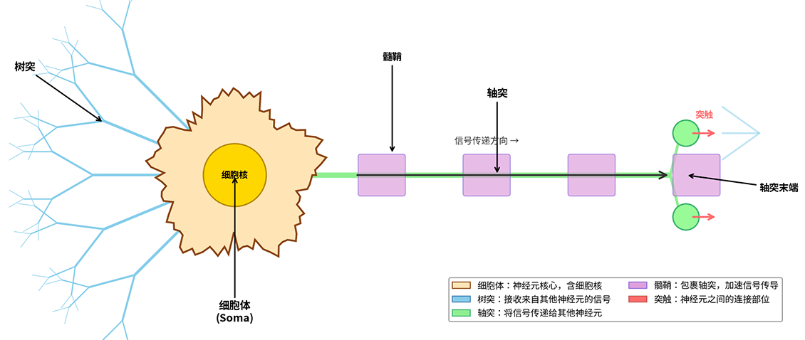

# Fundamentals of Neural Networks

The concept of **Neural Networks** originated from humanity's inquiry into the nature of intelligence. How does the brain think? How is memory stored? How does learning occur? The answers to these questions all point in the same direction: the **Neuron**. In the late 19th century, neuroanatomy, through detailed microscopic observation, first revealed the microscopic structure of the nervous system. The brain is composed of hundreds of millions of tiny units, interconnected to form a complex network. This discovery laid the foundation for modern neuroscience and also became the source of inspiration for artificial neural networks.

The development of artificial neural networks is an epic of exploration spanning eighty years. From the establishment of mathematical models in the 1940s, to hardware implementation in the 1950s, and algorithmic breakthroughs in the 1960s, each stage has advanced the dream of machine intelligence. This chapter starts from the structure of biological neurons, introduces the McCulloch-Pitts model, Hebbian learning rule, and the birth of the early perceptron, tracing the origin and evolution of neural network concepts.

::: tip The Boundary of Intelligence
Readers interested in the history of artificial intelligence development may refer to the author's popular science book on AI, *[The Boundary of Intelligence](https://book.douban.com/subject/30379536/)* (in Chinese).
:::

## Inspiration from Biological Neuron Structure

The brain is the most complex organ in nature. The adult human brain has approximately 86 billion neurons, each connected to thousands of other neurons, forming a vast network of about 100 trillion connections. This network is responsible for perception, thinking, memory, and decision-making, serving as the physical substrate of human intelligence. A typical neuron consists of three main parts: the **Cell Body** (Soma), **Dendrites**, and **Axon**, as shown in the figure below:

*Figure: Basic structure of a biological neuron*

The cell body is the core of the neuron, responsible for maintaining life activities and integrating information. Dendrites are short, branched protrusions extending from the cell body, shaped like tree branches, serving as the neuron's "receivers" that take in signals from other neurons. The axon is a long protrusion extending from the cell body (usually only one), serving as the neuron's "transmitter" that passes integrated signals to other neurons or muscle cells. Synaptic terminals are the connection points with downstream neurons' dendrites or cell bodies, functioning as the "interface" for signal transmission.

Neural signal transmission is an exquisite electrochemical process. When a neuron receives a sufficiently strong input signal, a brief electrical pulse is generated within the cell body. This pulse travels along the axon to the terminals, triggering the release of **Neurotransmitters** at the synapse. The neurotransmitters cross the synaptic gap and bind to receptors on the downstream neuron, causing changes in its electrical signal. This signal transmission mechanism has two key characteristics:

1. **Threshold Property**: A neuron generates an action potential only when the input signal reaches a certain intensity (threshold). When the input signal is insufficient, the neuron remains silent. This is remarkably similar to the switching behavior in digital circuits, where conduction only occurs when the voltage exceeds a threshold.
2. **All-or-None Property**: Once an action potential is generated, its amplitude and shape are largely fixed and do not vary with input intensity. Stronger input only increases the frequency of action potentials, not their amplitude. This property allows neural signals to be treated as discrete pulses rather than continuous waveforms.

The working mechanism of biological neurons inspired early researchers to consider: could a mathematical model be used to simulate this structure, thereby achieving machine intelligence? The key inspirations are threefold:

1. **Modular Structure**: The brain is not a homogeneous mass of matter but a network composed of numerous similar tiny units. This suggests that intelligence can be achieved by combining simple units, without needing to construct a single complex system.
2. **Signal Integration**: Each neuron receives multiple inputs, integrates them, and decides whether to output. This implies a weighted summation operation, where different inputs may have different importance (weights), and the neuron makes a decision after integrating all inputs.
3. **Threshold Decision**: A neuron only outputs when the integrated signal exceeds a threshold. This is a binary decision mechanism that can be used for logical operations and classification tasks.

It was these inspirations that gave birth to the world's first mathematical model of a neuron -- the McCulloch-Pitts model.

## The McCulloch-Pitts Model

In 1943, American psychologist Warren McCulloch and mathematician Walter Pitts proposed the first mathematical model of a neuron in their paper *[A Logical Calculus of Ideas Immanent in Nervous Activity](https://link.springer.com/article/10.1007/BF02478259)*, later known as the **McCulloch-Pitts Model** (abbreviated as the M-P model). This paper not only pioneered the field of artificial neural networks but also first demonstrated that neural networks can perform logical operations and possess computational capabilities.

The M-P model abstracts a biological neuron as a binary logic unit. Suppose the neuron receives $n$ inputs $x_1, x_2, \ldots, x_n$, each taking a value of 0 or 1 (corresponding to "no signal" or "signal present"). The neuron computes a weighted sum of these inputs, compares it with a threshold $\theta$, and produces an output $y$:

$$y = \begin{cases} 1 & \text{if } \sum_{i=1}^{n} w_i x_i \geq \theta \\ 0 & \text{if } \sum_{i=1}^{n} w_i x_i < \theta \end{cases}$$

where $w_i$ is the weight for the $i$-th input, taking integer values -- positive weights represent excitatory inputs, negative weights represent inhibitory inputs, and $\theta$ is the threshold. This model exactly corresponds to three core properties of biological neurons:

- **Weighted Summation**: $\sum w_i x_i$ corresponds to the integration of multiple input signals by the neuron.
- **Threshold Comparison**: $\geq \theta$ corresponds to the threshold property of the neuron.
- **Binary Output**: $y \in \{0, 1\}$ corresponds to the all-or-none property of the neuron.

The work of McCulloch and Pitts revealed a key conclusion: **with appropriate settings of weights and thresholds, the M-P model can implement all basic logical operations**. This means that a neural network is essentially a **logical computing system** that, through the connections of biological neurons, can perform the following operations just like the logic gate circuits of a computer:

- **Logical AND**: Set inputs $x_1, x_2$, weights $w_1 = w_2 = 1$, threshold $\theta = 2$. Only when both inputs are 1 does the weighted sum $w_1 x_1 + w_2 x_2 = 2 \geq \theta$, outputting $y = 1$; otherwise the output is 0. This is exactly the definition of the AND operation.
- **Logical OR**: Weights $w_1 = w_2 = 1$, threshold $\theta = 1$. As long as one input is 1, the weighted sum reaches 1, and the output is 1.
- **Logical NOT**: Only one input $x_1$, weight $w_1 = -1$, threshold $\theta = 0$. When $x_1 = 1$, the weighted sum $-1 < 0$, output 0; when $x_1 = 0$, the weighted sum $0 \geq 0$, output 1. This is exactly the NOT operation.

Furthermore, McCulloch and Pitts proved that a network composed of multiple M-P neurons can implement any finite logical expression, including complex functions such as memory storage and pattern recognition. This conclusion has profound implications -- it suggests that the brain may essentially be a vast logical computer, and the first step toward building an "artificial brain" is to construct a neural network capable of performing logical operations. The M-P model is therefore regarded as the starting point of artificial neural network research, and its significance lies in:

1. **First formalization of neural activity**: Before this, neuroscience relied mainly on experimental observation and lacked mathematical description. The M-P model abstracted neurons as mathematical objects, opening the new field of "computational neuroscience."
2. **Revealing the computational nature of neural networks**: Proving that neural networks can perform logical operations suggested that intelligence may be closely related to computation. This idea influenced subsequent research in cognitive science and artificial intelligence.
3. **Laying the foundation for computer science**: The M-P model was published in 1943, while Turing had proposed the concept of the Turing machine as early as 1936. Both emphasized the importance of "computation" as the foundation of intelligence, jointly establishing the theoretical basis of modern computer science. It is worth noting that the *[First Draft of a Report on the EDVAC](https://archive.org/details/firstdraftofrepo00vonn)*, which proposed the von Neumann architecture for modern computers, contained only one external reference -- the neural network paper by McCulloch and Pitts. The principle of memory in modern computers, where DRAM in cache and internal memory (RAM) uses cyclic electrical signal refreshing to produce memory effects, directly derives from their work.

However, the M-P model also had obvious limitations: the network weights and thresholds needed to be set manually, and the model itself had no learning ability. How could the network automatically adjust parameters to learn patterns from data? A few years later, psychologist Donald Hebb proposed a solution to this problem.

## Hebbian Learning Rule

In 1949, Canadian psychologist Donald Hebb proposed a neuroscientific theory of learning and memory in his book *[The Organization of Behavior](https://psycnet.apa.org/record/1950-03944-000)*. The most famous part of this work is known as **Hebb's Rule** (or the Hebbian learning rule), which explains how the connection strength between neurons changes during learning.

The core idea of Hebb's rule can be summarized in one sentence:

> "When two neurons activate together, their connection is strengthened."

A more formal statement is: if the axon of neuron A repeatedly or persistently participates in firing neuron B, then the synaptic transmission efficiency between A and B increases. This principle was later distilled into the famous slogan "**Cells that fire together, wire together**." In mathematical terms, let $w_{ij}$ be the connection weight from neuron $i$ to neuron $j$; the weight update rule is:

$$w_{ij}^{new} = w_{ij}^{old} + \alpha \cdot x_i \cdot y_j$$

where $x_i$ is the output of neuron $i$ (passed as input to neuron $j$), $y_j$ is the output of neuron $j$, and $\alpha$ is the learning rate (controlling the update magnitude). This rule is summarized in neural networks as **correlation learning**: if two neurons frequently activate together, they are likely processing the same information, so the connection weight should be strengthened to enable better future coordination. Conversely, if one activates while the other does not, the connection weight should not be strengthened.

Hebb's rule was initially a theoretical hypothesis, but it later received extensive support from neuroscientific experiments. **Synaptic plasticity** is a core concept in neuroscience, referring to the ability of synaptic connection strength to change based on neural activity. The most famous phenomenon among these is Long-Term Potentiation (LTP). In 1973, Norwegian neuroscientist Terje Lømo first observed LTP in experiments on the hippocampus. The experiments found that when two neurons activate simultaneously at a specific frequency, their synaptic connection is significantly strengthened, and this strengthening can last for hours or even days. This is precisely the phenomenon predicted by Hebb's rule -- repeated co-activation leads to connection strengthening.

LTP is considered the neural mechanism underlying learning and memory. When learning new knowledge, relevant neurons are repeatedly co-activated, strengthening synaptic connections. During recall, the strengthened connections make the related information easier to retrieve. This mechanism explains the neural essence of "practice makes perfect" -- repeated practice reinforces the relevant neural pathways.

Hebb's rule introduced the concept of "learning" to artificial neural networks. Before this, the weights of the M-P model had to be set manually. Hebb's rule suggested an automatic method for adjusting weights based on the correlation of neural activity, which inspired the development of various subsequent learning algorithms:

1. **Unsupervised Learning**: Hebb's rule requires no external label guidance; it adjusts connections based solely on the neuron's own activity. This is the origin of unsupervised learning.
2. **Associative Memory**: Hebb's rule is naturally suited for building associative memory networks. When two concepts (e.g., "apple" and "red") repeatedly appear together, the corresponding neural connections in the network are strengthened, forming an association. Later, seeing an apple naturally evokes the color red.
3. **Competitive Learning**: An extension of Hebb's rule that introduces a competition mechanism, where the strongest neuron receives the weight update while weaker ones are suppressed. This led to methods such as Self-Organizing Maps (SOM).

However, the original Hebb's rule also had limitations -- it only considered co-activation and ignored cases where neurons do not co-activate. If one neuron activates while another does not, should the connection between them be weakened? This question was addressed in subsequent research, leading to more complete models of synaptic plasticity.

## Early Development History of Neural Networks

From the M-P model to Hebb's rule, the embryonic period of neural network concepts had already laid the theoretical foundation. Over the next two decades, researchers put these ideas into practice, constructing the first operational neural network systems.

- **1940s: Laying the Theoretical Foundation**

    The publication of the M-P model in 1943 marked the starting point of neural network research. The significance of this paper lies in its first abstraction of neural activity as mathematical operations and its proof of the logical computational capability of neural networks. As early as 1936, Turing had published *[On Computable Numbers](https://doi.org/10.1112/plms/s2-42.1.230)*, introducing the concept of the Turing machine. Together, they launched the theoretical exploration of "computation and intelligence."

    The proposal of Hebb's rule in 1949 introduced a learning mechanism for neural networks. Although Hebb primarily focused on the learning principles of biological nervous systems, his ideas directly inspired the design of learning algorithms for artificial neural networks.

- **1950s: Hardware Implementation**

    In 1951, Marvin Minsky and Dean Edmonds built the first neural network computer, SNARC (Stochastic Neural Analog Reinforcement Calculator), at Harvard University. This machine used 3000 vacuum tubes and 40 "neurons" to simulate an automatic learning process. Although limited in functionality, it proved that neural networks could be implemented in hardware.

    In 1957, psychologist Frank Rosenblatt proposed the **Perceptron** model at the Cornell Aeronautical Laboratory. The perceptron was an extension of the M-P model, introducing a learning algorithm capable of automatically adjusting weights. In 1958, Rosenblatt built the Mark I Perceptron hardware, using 400 photoelectric sensors as inputs, capable of recognizing simple geometric shapes. This was the first neural network system capable of learning from data.

    The birth of the perceptron marked the transition of neural network research from theory to practical application. It could not only perform logical operations but also learn classification tasks, sparking the first wave of neural network research. *The New York Times* called it an "electronic brain," predicting it would eventually "walk, talk, see, write, reproduce itself, and be conscious of its existence." This near-science-fiction expectation reflected the public's optimistic imagination of artificial intelligence at the time.

- **1960s: Peak and Trough**

    In 1960, Bernard Widrow and Ted Hoff at Stanford University proposed the **ADALINE** (Adaptive Linear Neuron) model. ADALINE used a continuous linear output instead of binary output and introduced the Least Mean Squares (LMS) learning algorithm (later known as the Widrow-Hoff learning rule). This was an early form of the gradient descent learning algorithm, which later became the core method for neural network training.

    In 1962, Rosenblatt published *[Principles of Neurodynamics](https://apps.dtic.mil/sti/citations/AD0256582)*, systematically expounding the theory of perceptrons, including the perceptron learning algorithm and convergence theorem. The book proved that if two classes of data are linearly separable, the perceptron learning algorithm is guaranteed to converge to the correct solution within a finite number of steps. This was the first rigorous proof of a learning theory in the field of neural networks.

    A turning point came in 1969. Minsky and Seymour Papert published *[Perceptrons](https://mitpress.mit.edu/9780262631112/perceptrons/)*, which offered a sharp critique of the perceptron's capabilities. The book proved that the perceptron cannot solve the **XOR Problem** because XOR is not linearly separable. A simple two-layer neural network could solve the XOR problem, but the theory at the time could not effectively train multi-layer networks. The impact of this book was enormous, plunging neural network research into a decade-long trough.

Looking back at this history, the development of neural networks has not been a smooth path but rather an upward spiral. Each breakthrough exposed new limitations, and each trough gave birth to new opportunities. Although the "perceptron crisis" of 1969 temporarily dampened research enthusiasm, it also pointed the way forward: break through single-layer networks and explore learning methods for multi-layer networks. This direction was finally realized in the 1980s with the advent of the backpropagation algorithm.

## Chapter Summary

This chapter traces the origin of neural network concepts, starting from the structure of biological neurons and introducing the McCulloch-Pitts model, Hebbian learning rule, and the birth of the early perceptron. This history reveals the path of exploration from nature to artificial systems: observing brain structure, abstracting it into mathematical models, and ultimately implementing it as computational systems. The core contribution of the M-P model lies in abstracting neurons as binary logic units and proving that neural networks possess the capability to perform logical operations. Hebb's rule introduced the idea of correlation learning, demonstrating that weights can be automatically adjusted based on neural activity -- an insight that remains fundamental to deep learning today. The perceptron integrated these ideas, constructing the first learnable neural network system and establishing learning theory.

However, early neural networks also revealed limitations: single-layer networks could not solve nonlinear problems (such as XOR), and training methods for multi-layer networks had not yet been discovered. These limitations temporarily dampened research enthusiasm but also pointed the way forward. The next chapter will delve into the perceptron model, exploring its structure, learning algorithm, geometric interpretation, and that famous XOR problem.

## Exercises

1. Explain how the McCulloch-Pitts model implements logical operations. Design an M-P neuron for a "three-input AND gate" (outputs 1 only when all three inputs are 1), writing down the weight and threshold settings.
    

    
Answer

    A three-input AND gate requires: output $y=1$ only when $x_1=1, x_2=1, x_3=1$ are all satisfied; otherwise output $y=0$.

    Design:
    - Inputs: $x_1, x_2, x_3 \in \{0, 1\}$
    - Weights: $w_1 = w_2 = w_3 = 1$ (equal weights)
    - Threshold: $\theta = 3$

    Verification:
    - When $x_1=1, x_2=1, x_3=1$, weighted sum $\sum w_i x_i = 3 \geq \theta$, output $y=1$
    - When any input is 0, weighted sum $\sum w_i x_i \leq 2 < \theta$, output $y=0$

    This is exactly the definition of the AND operation. Setting the threshold $\theta=3$ ensures that only the case of "all three inputs are 1" satisfies the threshold condition.
    

2. The core idea of Hebbian learning is "cells that fire together, wire together." Explain the meaning and limitations of this rule from both a neuroscience and a machine learning perspective.
    

    
Answer

    **Neuroscience perspective**:

    Hebb's rule describes a form of synaptic plasticity. When a presynaptic neuron (A) repeatedly activates a postsynaptic neuron (B), the synaptic connection from A to B is strengthened. This corresponds to the "Long-Term Potentiation" (LTP) phenomenon observed in neuroscience. Hebb's rule explains the neural mechanism of learning and memory: repeated co-activity strengthens relevant neural pathways, forming memory traces.

    Limitations:
    - Hebb's rule only considers co-activation, ignoring scenarios where one neuron activates while the other does not. In reality, there is also Long-Term Depression (LTD), where connections may weaken when the presynaptic neuron activates but the postsynaptic neuron does not.
    - Hebb's rule lacks the concept of a time window. In practice, synaptic plasticity is sensitive to the temporal order of activity: if B activates within a few milliseconds after A (forward order), the connection strengthens; if A activates after B (reverse order), the connection may weaken. This is known as Spike-Timing-Dependent Plasticity (STDP).

    **Machine learning perspective**:

    Hebb's rule is the earliest unsupervised learning algorithm. The weight update formula $w_{ij}^{new} = w_{ij}^{old} + \alpha \cdot x_i \cdot y_j$ means: when both input $x_i$ and output $y_j$ are high, the weight increases. This captures correlation learning, where the network learns the statistical correlation between inputs and outputs.

    Limitations:
    - Hebb's rule leads to unbounded weight growth. Without mechanisms to limit or decay weights, weights may become too large after prolonged learning, causing network instability. Practical applications require weight decay or normalization.
    - Hebb's rule has no target signal and cannot perform supervised learning. For classification tasks, external label guidance is needed to direct learning. The perceptron algorithm introduced error signals, extending Hebb's rule to supervised learning.
    

3. Explain why the perceptron cannot solve the XOR problem. Analyze from both a geometric and a mathematical perspective, and explain how a multi-layer perceptron solves this problem.
    

    
Answer

    **Geometric perspective**:

    The data distribution for the XOR problem is as follows:
    - $(0, 0) \rightarrow 0$: point at origin, label 0
    - $(0, 1) \rightarrow 1$: point on y-axis, label 1
    - $(1, 0) \rightarrow 1$: point on x-axis, label 1
    - $(1, 1) \rightarrow 0$: point at (1,1), label 0

    On a two-dimensional plane, these four points form a "diagonal distribution": the two points labeled 1 lie on one diagonal, and the two points labeled 0 lie on the other diagonal.

    The decision boundary of a perceptron is a straight line. To separate the two classes in the plane with a single straight line, there must exist a line that can completely separate the two sets of points. However, looking at the data distribution, no such line exists: any straight line will either separate the two label-1 points or mix label-0 and label-1 points together. This is the geometric meaning of "not linearly separable."

    **Mathematical perspective**:

    The output equation of the perceptron is $y = \text{sign}(w_1 x_1 + w_2 x_2 + b)$, and the decision boundary is the straight line $w_1 x_1 + w_2 x_2 + b = 0$.

    Suppose there exist weights $(w_1, w_2, b)$ that correctly classify the XOR data:
    - For $(0,0)$ output 0, we require $b < 0$
    - For $(0,1)$ output 1, we require $w_2 + b > 0$, i.e., $w_2 > -b > 0$
    - For $(1,0)$ output 1, we require $w_1 + b > 0$, i.e., $w_1 > -b > 0$
    - For $(1,1)$ output 0, we require $w_1 + w_2 + b < 0$

    From the first three conditions, we get $w_1 + w_2 + b > -b - b + b = -b > 0$, but the fourth condition requires $w_1 + w_2 + b < 0$, a contradiction. Therefore, no weights exist that satisfy all conditions, proving that the perceptron cannot solve the XOR problem.

    **How a multi-layer perceptron solves it**:

    The decision boundary of a single-layer perceptron is a straight line, but a multi-layer perceptron can form nonlinear boundaries by combining multiple linear boundaries. A two-layer perceptron can solve XOR:

    The first layer has two neurons implementing:
    - Neuron 1: $y_1 = \text{sign}(x_1 + x_2 - 0.5)$ (detects "at least one is 1")
    - Neuron 2: $y_2 = \text{sign}(x_1 + x_2 - 1.5)$ (detects "both are 1")

    The second layer neuron implements:
    - Output: $y = \text{sign}(y_1 - y_2)$ (implements "at least one is 1" but "not both are 1")

    Verification:
    - $(0,0)$: $y_1=0, y_2=0$, output $\text{sign}(0-0)=0$ ✓
    - $(0,1)$: $y_1=1, y_2=0$, output $\text{sign}(1-0)=1$ ✓
    - $(1,0)$: $y_1=1, y_2=0$, output $\text{sign}(1-0)=1$ ✓
    - $(1,1)$: $y_1=1, y_2=1$, output $\text{sign}(1-1)=0$ ✓

    This proves that multi-layer networks have greater expressive power than single-layer networks and can solve nonlinear problems. The key insight: a multi-layer network constructs nonlinear boundaries by combining linear boundaries -- one layer extracts features, and another layer combines decisions.
    

