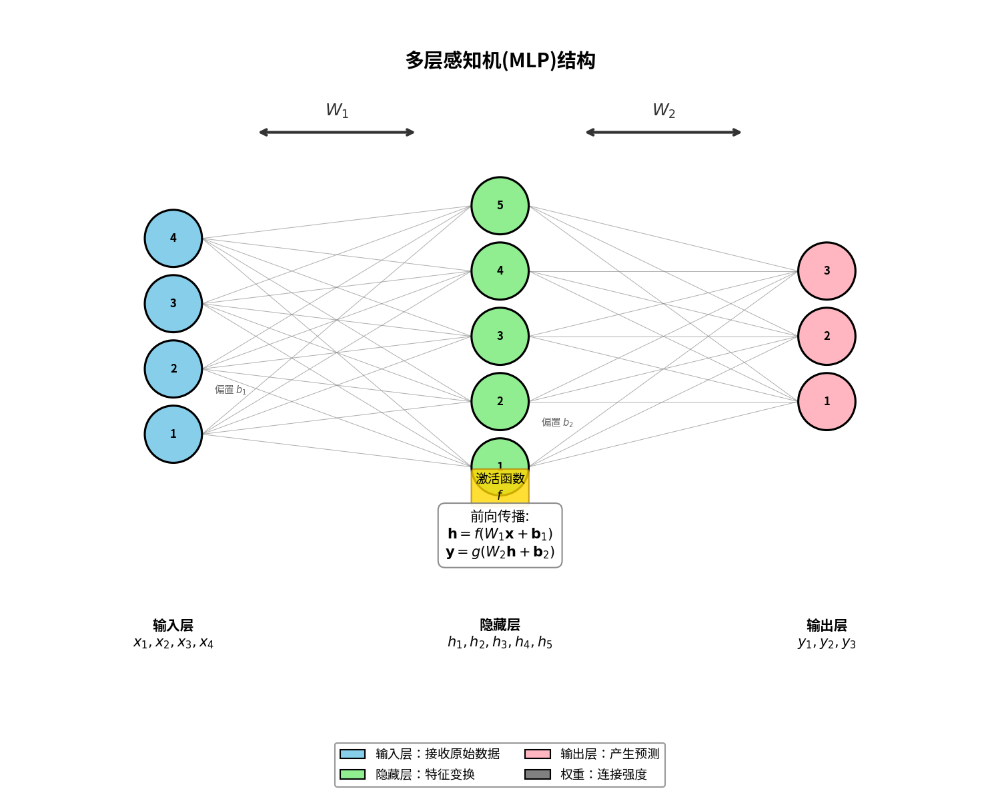
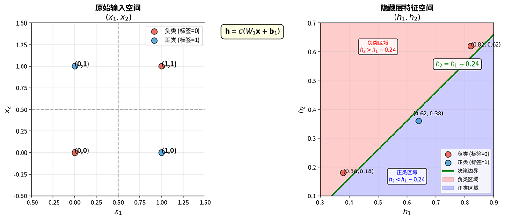
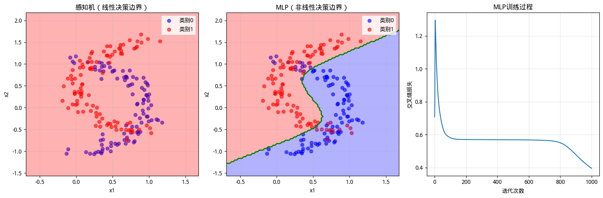

# Multi-Layer Perceptron

In the previous sections, we witnessed the birth and limitations of the perceptron. This simple model, proposed by Rosenblatt in 1957, could learn linear decision boundaries but was helpless against nonlinearly separable problems. In 1969, Marvin Minsky rigorously proved in his book *[Perceptrons](https://mitpress.mit.edu/9780262631112/perceptrons/)* that a single-layer perceptron cannot solve nonlinear problems. This "Minsky curse" directly plunged neural network research into a 17-year trough. At that time, neural network researchers pinned their hopes on the **Multi-Layer Perceptron** (MLP) to escape this predicament. By introducing hidden layers between the input and output layers, the MLP achieved a hierarchical feature extraction mechanism.

In 1989, American mathematician George Cybenko and Austrian statistician Kurt Hornik independently proved the famous **Universal Approximation Theorem**, which states that as long as there are enough neurons in the hidden layer, a single-hidden-layer MLP can approximate any continuous function to an arbitrarily small error. The significance of this result lies in proving theoretically that neural networks are universal learning machines capable of learning any continuous function.

This chapter traces the development of neural networks, introducing the structural design of the multi-layer perceptron, the principle of feature transformation in hidden layers, the core conclusions of the Universal Approximation Theorem, and experimentally verifying the MLP's ability to solve nonlinear problems.

## Multi-Layer Network Structure

Compared to the linear perceptron, the multi-layer perceptron adds a **hidden layer** between the input and output layers. The hidden layer applies a nonlinear transformation to the raw input, warping and mapping the original space into a new feature space. In this new space, data that was tangled and inseparable may become well-organized, allowing linear boundaries to perfectly separate it. The output layer performs linear classification in this new space, thereby solving nonlinear problems in the original space. In a multi-layer network structure, information flows through a hierarchical architecture: the input layer receives raw data, the hidden layer performs feature transformation, and the output layer makes the final decision. The structure is shown in the following figure:



*Figure: Hierarchical structure of a multi-layer perceptron (single hidden layer). Information flows from left to right, with each layer of neurons performing weighted summation and nonlinear activation on the input signal*

In a multi-layer network, another change is that the activation function $f$ transforms from an optional component into an indispensable one. This is because without an activation function, or by using only a linear function $f(z) = az$ ($a$ is a constant) as the activation function, the multi-layer network degenerates into a single-layer network. This is easy to prove. Let the activation function be the linear function $f(z) = az$. Then the hidden layer output is $\mathbf{h} = a(\mathbf{W}_1 \mathbf{x} + \mathbf{b}_1) = a\mathbf{W}_1 \mathbf{x} + a\mathbf{b}_1$. Continuing the linear transformation through the output layer gives $\mathbf{y} = \mathbf{W}_2 \mathbf{h} + \mathbf{b}_2 = \mathbf{W}_2 (a\mathbf{W}_1 \mathbf{x} + a\mathbf{b}_1) + \mathbf{b}_2 = a\mathbf{W}_2 \mathbf{W}_1 \mathbf{x} + a\mathbf{W}_2 \mathbf{b}_1 + \mathbf{b}_2$. By setting $\mathbf{W} = a\mathbf{W}_2 \mathbf{W}_1$ and $\mathbf{b} = a\mathbf{W}_2 \mathbf{b}_1 + \mathbf{b}_2$, the network returns to $\mathbf{y} = \mathbf{W} \mathbf{x} + \mathbf{b}$, which is precisely the linear form of a single-layer network. The above derivation reveals a fact: the superposition of multiple linear transformations is still a linear transformation. Only by introducing a nonlinear activation function can this linear trap be broken, enabling the network to gain expressive power beyond linear constraints.

Let us revisit the XOR problem example. Consider a single-hidden-layer MLP with 2 neurons in the hidden layer, using [Sigmoid](../../statistical-learning/linear-models/logistic-regression.md#sigmoid-function) as the activation function. Let the weights and biases from the input layer to the hidden layer be:

$$\mathbf{W}_1 = \begin{bmatrix} 1 & 1 \\ 1 & 1 \end{bmatrix}, \quad \mathbf{b}_1 = \begin{bmatrix} -0.5 \\ -1.5 \end{bmatrix}$$

The four sample points of the XOR problem have original coordinates $(0, 0)$, $(0, 1)$, $(1, 0)$, $(1, 1)$, where $(0, 1)$ and $(1, 0)$ are the positive class (label 1), and $(0, 0)$ and $(1, 1)$ are the negative class (label 0). The hidden layer performs a linear transformation $\mathbf{z} = \mathbf{W}_1 \mathbf{x} + \mathbf{b}_1$ on the input, followed by the Sigmoid activation to obtain the hidden layer output $\mathbf{h} = \sigma(\mathbf{z})$. The transformation results for each point are shown in the following table:

| Input $(x_1, x_2)$ | Linear Transform $\mathbf{z}$ | After Activation $(h_1, h_2)$ | Label |
|:---:|:---:|:---:|:---:|
| $(0, 0)$ | $(-0.5, -1.5)$ | $(0.38, 0.18)$ | 0 |
| $(0, 1)$ | $(0.5, -0.5)$ | $(0.62, 0.38)$ | 1 |
| $(1, 0)$ | $(0.5, -0.5)$ | $(0.62, 0.38)$ | 1 |
| $(1, 1)$ | $(1.5, 0.5)$ | $(0.82, 0.62)$ | 0 |

Observing the transformed feature space, the positive class samples $(0.62, 0.38)$ cluster in the middle region, while the negative class samples $(0.38, 0.18)$ and $(0.82, 0.62)$ are located in the lower-left and upper-right, respectively. In this new space, the positive and negative classes can be separated by a diagonal line. The output layer only needs to learn a simple linear combination of weights, such as the decision boundary $h_2 = h_1 - 0.24$, to perfectly distinguish the positive class (satisfying $h_2 < h_1 - 0.24$) from the negative class (satisfying $h_2 > h_1 - 0.24$), as shown in the following figure:



*Figure: Comparison of the XOR problem distribution in the original input space (left) and the hidden layer feature space (right)*

This example clearly demonstrates the role of the hidden layer: reorganizing the spatial distribution of data through nonlinear transformation. The originally intertwined XOR data in the $(x_1, x_2)$ space becomes well-organized after transformation into the $(h_1, h_2)$ space, with the positive class clustered together and the negative class separated to both sides, allowing a linear classifier to easily complete the classification task.

Deeper neural networks (with more hidden layers) can perform more complex multi-level transformations, progressively extracting high-level abstract features. For instance, the first layer may learn simple edge orientations, the second layer combines edges to form shapes, and the third layer combines shapes to form object parts. This hierarchical feature extraction mechanism is the fundamental source of deep learning's powerful capabilities.

## Universal Approximation Theorem

The capability of a single-layer perceptron is limited by linear constraints. Having understood the structure of multi-layer networks, what is the boundary of their capability? Can they solve all problems? In 1989, two mathematicians independently provided an inspiring answer. American mathematician George Cybenko, in his paper *[Approximation by Superpositions of a Sigmoidal Function](https://link.springer.com/article/10.1007/BF02551274)*, proved the following result for multi-layer networks using the Sigmoid activation function:

::: info Universal Approximation Theorem
Let $f$ be a bounded, non-constant, monotonically increasing continuous function (such as Sigmoid), and let $\varphi$ be an arbitrary continuous function defined on a compact set in $\mathbb{R}^n$. Then for any $\epsilon > 0$, there exist an integer $m$ and real numbers $\alpha_i$, vectors $\mathbf{w}_i$, real numbers $b_i$, and a real number $b_0$ such that:
$$\left| \varphi(\mathbf{x}) - \left[\sum_{i=1}^{m} \alpha_i f(\mathbf{w}_i^T \mathbf{x} + b_i) + b_0\right] \right| < \epsilon$$
holds for all $\mathbf{x}$.
:::

This mathematical formulation may seem obscure, but its meaning in plain language is striking: as long as there are enough neurons in the hidden layer, a single-hidden-layer MLP can approximate any continuous function to an arbitrarily small error. Today, this theorem is known as the **Universal Approximation Theorem**, and it is the most important theoretical cornerstone of multi-layer networks. In 1991, Austrian statistician Kurt Hornik, in his paper *[Approximation Capabilities of Multilayer Feedforward Networks](https://doi.org/10.1016/0893-6080(91)90009-T)*, extended the theorem to more general conditions: as long as the activation function is bounded and non-constant, the Universal Approximation Theorem holds. This means that commonly used activation functions such as ReLU, tanh, and Sigmoid all satisfy the condition, and the theorem's scope of application is far broader than when it was first proven.

The Universal Approximation Theorem provides a guarantee of the expressive power of multi-layer networks. It proves that an MLP can theoretically fit any "reasonable" functional relationship. "Reasonable" here means the function is continuous and defined within a bounded region, which covers the vast majority of practical problems, providing the theoretical basis for neural networks as universal learning machines and relieving concerns about absolute theoretical limitations. Second, the theorem shows that the number of layers is not the only critical factor — it demonstrates that a single-hidden-layer network is theoretically sufficient to represent any continuous function. This breaks the misconception that many layers must be stacked to achieve strong capability. In reality, "depth" (number of hidden layers) is not the sole source of expressive power; "width" (number of hidden layer neurons) can also enhance it.

The Universal Approximation Theorem sounds exciting, as if neural networks are omnipotent. However, a deeper understanding requires recognizing both its value and its limitations. This theorem is an existence proof, not a constructive one. It tells us that there **exists** an MLP that can approximate the target function, but it says nothing about how to find this MLP. Specifically, the limitations of the Universal Approximation Theorem include the following three points.

### Depth vs. Width Trade-off

First is the number of neurons. The Universal Approximation Theorem guarantees that "enough" neurons can achieve arbitrary approximation, but it does not specify how many "enough" is. From practice, we prefer deep networks (multiple hidden layers) over wide networks (a single, very large hidden layer), indicating that depth has higher parameter efficiency than width. For some complex functions, the efficiency gap between the two is astonishing. Consider a concrete example: suppose we want to represent the function $f(x_1, x_2, \ldots, x_n) = x_1 x_2 \cdots x_n$ (the product of $n$ variables):

- **Wide network (single hidden layer)**: To accurately represent this degree-$n$ product polynomial, a single hidden layer requires $O(2^n)$ neurons. This is because expanding $x_1 x_2 \cdots x_n$ as a combination of monomial basis functions requires an exponential number of basis functions to construct the product term. For example, when $n=10$, the wide network needs approximately $2^{10} \approx 1000$ neurons; when $n=20$, it needs approximately $2^{20} \approx 1$ million neurons. The number of parameters also grows exponentially, approximately $O(n \cdot 2^n)$.

- **Deep network ($\lceil \log_2 n \rceil$ layers)**: Each layer only needs $O(1)$ neurons to compute the product of two intermediate results. The construction is as follows: layer 1 computes $x_1 \cdot x_2$, $x_3 \cdot x_4$, etc.; layer 2 multiplies the results from the previous layer pairwise; and so on, until after $\lceil \log_2 n \rceil$ layers, the final product is obtained. Each layer requires only a constant number of neurons, with a total parameter count of $O(n)$. For example, when $n=20$, the deep network only needs about $5$ layers with a small number of neurons per layer, and the total number of parameters is approximately $O(20)$, in stark contrast to the tens of millions of parameters required by the wide network.

This example reveals that, compared to a wide network that tries to solve the entire problem within a single layer, the divide-and-conquer strategy of a deep network — decomposing a complex problem layer by layer into multiple simple subproblems, with each layer solving one subproblem — is far more successful. A deep network progresses layer by layer, with each layer handling a relatively simple transformation, resulting in much higher overall efficiency.

### Design of Learning Algorithms

Second, even if the correct weight parameters exist theoretically, learning algorithms such as gradient descent may not find them. The algorithm may get stuck in local optima, encounter vanishing gradients, or fail to converge due to numerical issues — the Universal Approximation Theorem is completely indifferent to these concerns. In the perceptron era (1957-1969), the single-layer perceptron had a clear convergence theorem: Rosenblatt proved that as long as the data is linearly separable, the [perceptron learning algorithm](perceptron.md#perceptron-learning-algorithm) would find the correct weights in a finite number of steps. But for multi-layer networks, the learning algorithm became a puzzle. How should the weights of the hidden layer be adjusted? How does the error signal from the output layer propagate back to the hidden layer? This problem was known at the time as the **Credit Assignment Problem**: when the network produces an incorrect output, which layer should be "blamed"? Which neuron? By how much should it be adjusted?

This problem plagued researchers for nearly two decades before a breakthrough came in 1986. That year, Canadian computer scientist Geoffrey Hinton formally published the **Backpropagation algorithm** in his paper *[Learning representations by back-propagating errors](https://www.nature.com/articles/323533a0)*. The core idea of backpropagation is to use the [chain rule](../../maths/calculus/gradient.md#composite-functions-and-the-chain-rule) from calculus. Since the network's output is a multi-layer composite function, the chain rule allows the gradient of the error with respect to the output layer weights to be propagated backward layer by layer to the hidden layers, computing the direction and magnitude of adjustment for the weights in each layer. This algorithm made multi-layer networks truly trainable — providing both a theoretical understanding of how to adjust weights and a practical computational method. We will delve into the detailed introduction and mathematical derivation of the backpropagation algorithm in subsequent chapters.

### Limitations of Model Complexity

Finally, fitting the training data is not equivalent to generalizing to new data. The [overfitting](../../statistical-learning/linear-models/regularization-glm.md#fitting-and-generalization) problem can cause a model to fit perfectly on the training set but perform terribly on the test set. The Universal Approximation Theorem focuses solely on approximation capability, completely ignoring generalization. The core idea for addressing overfitting is to constrain the network's expressive power, forcing the model to learn only simple patterns. Regularization, Dropout, and Early Stopping all run more or less counter to the goal of "approximation."

From the perspective of the Universal Approximation Theorem, a neural network is a parameterized function approximator: the network structure defines the "template" form of the function, and the weight parameters define the specific "shape" of the function. The learning process is one of continuously adjusting parameters so that the function curve output by the network approaches the target function we desire, with no constraint on model complexity. Mathematically, a neural network is essentially a nested composite function $F(\mathbf{x}) = f_L \circ f_{L-1} \circ \cdots \circ f_1(\mathbf{x})$, where each layer function $f_i(\mathbf{h}) = \sigma(\mathbf{W}_i \mathbf{h} + \mathbf{b}_i)$ performs one linear transformation plus nonlinear activation. In today's engineering practice, the number of layers and the number of hidden layer neurons are the most critical hyperparameters in multi-layer network design. Choosing appropriate values is an art of balance that requires considering the following factors:

- **Problem complexity** is the primary factor. The more complex the target function (highly nonlinear, drastic changes, frequent fluctuations), the more neurons are needed to capture these intricate curve trends. A simple linear relationship may require only a few neurons; a complex image classification problem may require hundreds or thousands.
- **Data dimensionality** also influences the choice. The higher the input dimension $n$, the more neurons the hidden layer typically needs to extract sufficiently rich feature combinations. Low-dimensional data (e.g., 2D coordinates) may suffice with $n$ to $2n$ neurons; high-dimensional data (e.g., image pixels) may require $n$ to $n^2$ or even more.
- **Data scale** provides important constraints. The more training data available, the more boldly one can use a large-capacity hidden layer, as sufficient data provides enough information to prevent overfitting. When data is scarce, a conservative approach is needed, using fewer neurons to avoid the model memorizing noise.

Additionally, the Universal Approximation Theorem only requires the activation function to be non-constant and non-polynomial, without specifying which activation function is better. For instance, in practice, ReLU often outperforms Sigmoid, but the theorem offers no guidance on choosing activation functions. The gap between ReLU and Sigmoid stems from optimization efficiency rather than expressive power — a distinction the theorem cannot explain.

## Perceptron Algorithm Practice

The following code implements a complete multi-layer perceptron and compares it with a single-layer perceptron on the same nonlinear dataset, intuitively demonstrating the impact of adding hidden layers. The experimental design uses the classic Moon Dataset, where two classes of data points form two overlapping crescent shapes. The curved boundary prevents any straight line from perfectly separating the classes — an ideal test scenario for verifying nonlinear classification capability.



*Figure: MLP code execution results*

After running the code, three visualization charts appear as shown above, clearly verifying the thesis of this chapter: hidden layers endow neural networks with nonlinear expressive power, which is the starting point of deep learning's powerful representational capabilities.

- The left chart shows the perceptron's decision boundary. The green straight line represents the decision boundary learned by the perceptron — a rigid straight line attempting to separate the two overlapping crescents. No matter how this line is adjusted, it cannot separate the blue and red data points, with many samples falling on the wrong side. This is the limitation of the perceptron's linear constraint.
- The middle chart shows the MLP's decision boundary. The green curved boundary winds gracefully, wrapping around the blue crescent while avoiding the red one. This curved boundary is the result of the hidden layer's nonlinear transformation: the MLP "warps" the original space, causing the curved boundary to appear as an elegant arc in the original space. Data points are correctly classified, with significantly improved accuracy.
- The right chart shows the loss function during training. The cross-entropy loss steadily decreases with iterations, demonstrating the convergence characteristics of the MLP learning process. In the early stages, the loss drops rapidly as the network quickly grasps the main patterns in the data; in later stages, the loss converges smoothly, indicating that the network is near the optimal solution.

```python runnable
import numpy as np
import matplotlib.pyplot as plt

class MLP:
    """
    Multi-Layer Perceptron Implementation (Single Hidden Layer)

    Uses Sigmoid activation function, Softmax output
    """
    def __init__(self, n_hidden=10, learning_rate=0.1, n_iterations=1000):
        self.n_hidden = n_hidden
        self.lr = learning_rate
        self.n_iter = n_iterations
        self.W1 = None  # Input to hidden layer weights
        self.b1 = None  # Hidden layer bias
        self.W2 = None  # Hidden to output layer weights
        self.b2 = None  # Output layer bias
        self.loss_history = []
    
    def sigmoid(self, z):
        """Sigmoid activation function"""
        z = np.clip(z, -500, 500)
        return 1 / (1 + np.exp(-z))
    
    def sigmoid_derivative(self, a):
        """Sigmoid derivative (given output a)"""
        return a * (1 - a)
    
    def softmax(self, z):
        """Softmax function"""
        z_shifted = z - np.max(z, axis=1, keepdims=True)
        exp_z = np.exp(z_shifted)
        return exp_z / np.sum(exp_z, axis=1, keepdims=True)
    
    def cross_entropy_loss(self, y_true, y_pred):
        """Cross-entropy loss"""
        eps = 1e-15
        y_pred = np.clip(y_pred, eps, 1 - eps)
        return -np.mean(np.sum(y_true * np.log(y_pred), axis=1))
    
    def fit(self, X, y):
        """
        Train the model

        Parameters:
        X : ndarray, shape (n_samples, n_features)
        y : ndarray, shape (n_samples,) - class labels (integers)
        """
        n_samples, n_features = X.shape
        n_classes = len(np.unique(y))
        
        # Convert labels to one-hot encoding
        y_onehot = np.zeros((n_samples, n_classes))
        for i, label in enumerate(y):
            y_onehot[i, int(label)] = 1
        
        # Initialize weights (small random values)
        np.random.seed(42)
        self.W1 = np.random.randn(n_features, self.n_hidden) * 0.1
        self.b1 = np.zeros(self.n_hidden)
        self.W2 = np.random.randn(self.n_hidden, n_classes) * 0.1
        self.b2 = np.zeros(n_classes)
        
        # Gradient descent training
        for iteration in range(self.n_iter):
            # Forward propagation
            z1 = X @ self.W1 + self.b1
            h = self.sigmoid(z1)  # Hidden layer output
            z2 = h @ self.W2 + self.b2
            y_pred = self.softmax(z2)  # Output layer prediction
            
            # Compute loss
            loss = self.cross_entropy_loss(y_onehot, y_pred)
            self.loss_history.append(loss)
            
            # Backpropagation
            # Output layer gradient
            dz2 = (y_pred - y_onehot) / n_samples  # Simplified Softmax + CrossEntropy gradient
            dW2 = h.T @ dz2
            db2 = np.sum(dz2, axis=0)
            
            # Hidden layer gradient
            dh = dz2 @ self.W2.T
            dz1 = dh * self.sigmoid_derivative(h)
            dW1 = X.T @ dz1
            db1 = np.sum(dz1, axis=0)
            
            # Update weights
            self.W2 -= self.lr * dW2
            self.b2 -= self.lr * db2
            self.W1 -= self.lr * dW1
            self.b1 -= self.lr * db1
        
        return self
    
    def predict_proba(self, X):
        """Predict probabilities"""
        z1 = X @ self.W1 + self.b1
        h = self.sigmoid(z1)
        z2 = h @ self.W2 + self.b2
        return self.softmax(z2)
    
    def predict(self, X):
        """Predict class"""
        proba = self.predict_proba(X)
        return np.argmax(proba, axis=1)
    
    def score(self, X, y):
        """Compute accuracy"""
        predictions = self.predict(X)
        return np.mean(predictions == y)

# Generate moon-shaped data (nonlinearly separable)
n_samples = 200

# Class 0: Upper half of the moon
theta0 = np.linspace(0, np.pi, n_samples // 2)
X0 = np.column_stack([
    np.sin(theta0) + np.random.randn(n_samples // 2) * 0.1,
    np.cos(theta0) + np.random.randn(n_samples // 2) * 0.1
])
y0 = np.zeros(n_samples // 2)

# Class 1: Lower half of the moon (shifted)
theta1 = np.linspace(0, np.pi, n_samples // 2)
X1 = np.column_stack([
    -np.sin(theta1) + 1 + np.random.randn(n_samples // 2) * 0.1,
    -np.cos(theta1) + np.random.randn(n_samples // 2) * 0.1 + 0.5
])
y1 = np.ones(n_samples // 2)

# Merge data
X = np.vstack([X0, X1])
y = np.hstack([y0, y1])

# Comparison experiment: Single-layer Perceptron vs Multi-layer Perceptron
from shared.neural.perceptron import Perceptron

# Training comparison
# Perceptron uses {1, -1} label format, needs conversion
y_perceptron = 2 * y - 1  # {0, 1} -> {1, -1}

perceptron = Perceptron(learning_rate=0.1, max_iterations=1000)
perceptron.fit(X, y_perceptron)

mlp = MLP(n_hidden=20, learning_rate=1.0, n_iterations=1000)
mlp.fit(X, y)

print(f"Perceptron accuracy: {np.mean((perceptron.predict(X) > 0).astype(int) == y):.2%}")
print(f"MLP accuracy: {mlp.score(X, y):.2%}")
print(f"MLP hidden layer neurons: {mlp.n_hidden}")

# Visualization
fig, axes = plt.subplots(1, 3, figsize=(15, 5))

# Plot data points
def plot_classification(ax, X, y, model, title, is_mlp=False):
    ax.scatter(X[y==0, 0], X[y==0, 1], c='blue', alpha=0.6, label='Class 0')
    ax.scatter(X[y==1, 0], X[y==1, 1], c='red', alpha=0.6, label='Class 1')
    
    # Plot decision boundary
    x_min, x_max = X[:, 0].min() - 0.5, X[:, 0].max() + 0.5
    y_min, y_max = X[:, 1].min() - 0.5, X[:, 1].max() + 0.5
    xx, yy = np.meshgrid(np.linspace(x_min, x_max, 100),
                         np.linspace(y_min, y_max, 100))
    grid = np.column_stack([xx.ravel(), yy.ravel()])
    
    if is_mlp:
        pred = model.predict(grid)
        Z = pred.reshape(xx.shape)
        print(f"\n=== {title} Debug ===")
        print(f"Prediction range: [{pred.min()}, {pred.max()}], unique values: {np.unique(pred)}")
    else:
        pred = model.predict(grid)
        Z = (pred > 0).astype(int).reshape(xx.shape)
        print(f"\n=== {title} Debug ===")
        print(f"Perceptron prediction range: [{pred.min()}, {pred.max()}], unique values: {np.unique(pred)}")
        print(f"Transformed Z range: [{Z.min()}, {Z.max()}], unique values: {np.unique(Z)}")
    
    ax.contourf(xx, yy, Z, alpha=0.3, levels=[-0.5, 0.5, 1.5], colors=['blue', 'red'])
    ax.contour(xx, yy, Z, levels=[0.5], colors='green', linewidths=2)
    
    ax.set_xlabel('x1')
    ax.set_ylabel('x2')
    ax.set_title(title)
    ax.legend()
    ax.grid(True, alpha=0.3)

plot_classification(axes[0], X, y, perceptron, 'Perceptron (Linear Decision Boundary)', is_mlp=False)
plot_classification(axes[1], X, y, mlp, 'MLP (Nonlinear Decision Boundary)', is_mlp=True)

# Chart 3: Training process
axes[2].plot(mlp.loss_history)
axes[2].set_xlabel('Iteration')
axes[2].set_ylabel('Cross-Entropy Loss')
axes[2].set_title('MLP Training Process')
axes[2].grid(True, alpha=0.3)

plt.tight_layout()
plt.show()
plt.close()
```

## Summary

This chapter traces the historical development of the multi-layer perceptron, covering its background, structural design, theoretical foundation, and practical verification. The multi-layer perceptron is a critical milestone in the history of neural network development. It demonstrates that adding a hidden layer of neurons can break through linear limitations, validates the powerful expressive capability of nonlinear transformations, and lays the foundation for subsequent deeper network architectures. The next chapter will delve into the computational details of the MLP, providing an in-depth introduction to how signals flow layer by layer in forward propagation, how matrix operations are efficiently implemented, and how computation graphs organize complex nested functions. Understanding these details is a necessary prerequisite for mastering the backpropagation algorithm.

## Exercises

1. Explain why the Universal Approximation Theorem is an "existence proof" rather than a "constructive proof." What impact does this have on practical applications?
    <details>
    <summary>Reference Answer</summary>
    
    **Existence proof vs. constructive proof**:
    
    An existence proof tells us that something exists, but does not provide a way to find it. A constructive proof not only proves existence but also provides a specific method for construction.
    
    The Universal Approximation Theorem is an existence proof:
    - What the theorem concludes: There exists an MLP (with specific parameters) that can approximate the target function
    - What the theorem does not provide: How many neurons does this MLP need? What exactly are the parameters? How are they constructed?
    
    **Impact on practical applications**:
    
    1. Difficulty in parameter selection: The theorem does not tell us how many hidden layer neurons are needed. In practice, we must rely on experimentation, rules of thumb, cross-validation, etc., which is time-consuming and labor-intensive.
    2. Learning algorithms may not succeed: Even if the correct parameters exist theoretically, learning algorithms such as gradient descent may not find them. The algorithm may get stuck in local optima or fail to converge due to numerical issues.
    3. Risk of overfitting: The theorem focuses only on approximating the training data, not on generalization. The model may fit the training data perfectly but perform poorly on new data. The theorem does not address overfitting.
    4. Activation function selection: The theorem only requires the activation function to be non-constant and non-polynomial, without specifying which is better. In practice, ReLU, Sigmoid, and tanh each have their strengths and weaknesses, requiring task-specific selection.
    5. Network structure design: The theorem only involves a single hidden layer and does not address whether deeper networks are better. In practice, deep networks perform better on certain tasks, but the theorem cannot explain this phenomenon.
    
    **Summary**: The Universal Approximation Theorem is a theoretical foundation, not a practical guide. It tells us that something is theoretically possible, but how to achieve it depends on experience, experimentation, and subsequent research. The value of the theorem lies in providing confidence: as long as the problem is reasonable, a neural network can theoretically solve it — the rest is an engineering problem.
    </details>

2. Consider a single-hidden-layer MLP with input dimension $n=2$, hidden layer neurons $m=4$, and output dimension $k=1$ (binary classification). Calculate the total number of parameters in the network. If the number of hidden layer neurons is increased to $m=100$, how does the parameter count change? Analyze the growth trend of the parameter count.
    <details>
    <summary>Reference Answer</summary>
    
    **Parameter calculation**:
    
    MLP parameters include:
    - $\mathbf{W}_1$: Input to hidden layer weight matrix, size $n \times m$
    - $\mathbf{b}_1$: Hidden layer bias vector, size $m$
    - $\mathbf{W}_2$: Hidden to output layer weight matrix, size $m \times k$
    - $\mathbf{b}_2$: Output layer bias vector, size $k$
    
    Total parameters = $n \times m + m + m \times k + k$
    
    **Specific calculation**:
    
    Original setting ($n=2, m=4, k=1$):
    - $\mathbf{W}_1$: $2 \times 4 = 8$
    - $\mathbf{b}_1$: $4$
    - $\mathbf{W}_2$: $4 \times 1 = 4$
    - $\mathbf{b}_2$: $1$
    - Total: $8 + 4 + 4 + 1 = 17$ parameters
    
    Increased neurons ($n=2, m=100, k=1$):
    - $\mathbf{W}_1$: $2 \times 100 = 200$
    - $\mathbf{b}_1$: $100$
    - $\mathbf{W}_2$: $100 \times 1 = 100$
    - $\mathbf{b}_2$: $1$
    - Total: $200 + 100 + 100 + 1 = 401$ parameters
    
    **Growth trend analysis**:
    
    The total parameter formula simplifies to $P = nm + m + mk + k = m(n + k + 1) + k$. For fixed input and output dimensions (constant $n, k$), the parameter count grows linearly with the number of hidden layer neurons $m$, i.e., $P \approx m(n + k + 1)$. When $m$ increases from $4$ to $100$ (25 times), the parameters increase from $17$ to $401$ (approximately 23.6 times). The growth rate is nearly linear.
    </details>
