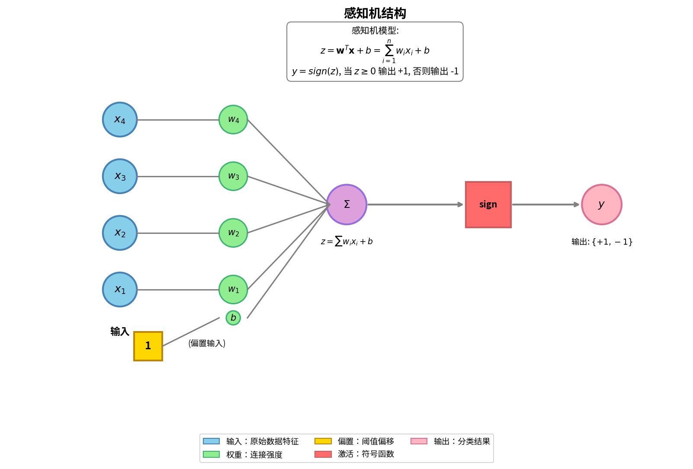
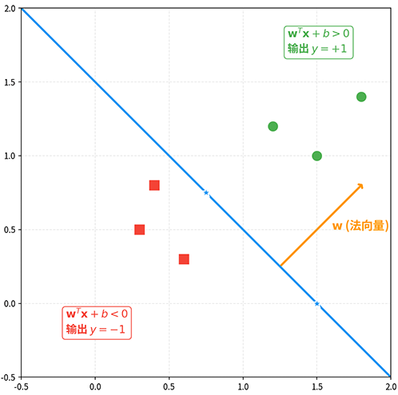
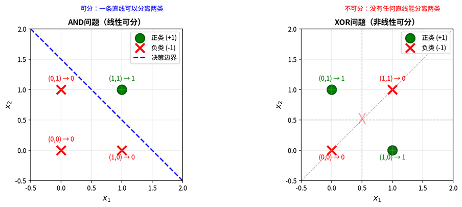

# Linear Perceptron

In the previous chapter, we mentioned that the 1969 book *[Perceptrons](https://mitpress.mit.edu/9780262631112/perceptrons/)* sharply criticized the perceptron, pointing out its inability to solve the XOR problem. This criticism plunged neural network research into a decade-long trough. However, the criticism itself precisely revealed the essential characteristic of the perceptron — **Linear Separability**. Understanding this property not only helps grasp how the perceptron works, but also provides readers with deep insight into the inner logic of the evolution from single-layer to multi-layer neural networks.

The **Perceptron**, proposed by psychologist Frank Rosenblatt in 1957, was the world's first neural network model capable of learning from data. It introduced a learning algorithm based on the M-P model, enabling automatic weight adjustment to perform pattern recognition and classification tasks. The advent of the perceptron marked the transition of neural network research from theoretical study to practical application, sparking the first wave of neural network research. This chapter will detail the model structure, geometric interpretation, learning algorithm, and convergence theorem of the perceptron, and experimentally verify its learning capabilities and limitations.

## Perceptron Model

The perceptron is a single-layer neural network consisting of an input layer and an output layer, with no hidden layers. The entire perceptron structure includes the input vector $\mathbf{x} = (x_1, x_2, \ldots, x_n)^T$, the weight vector $\mathbf{w} = (w_1, w_2, \ldots, w_n)^T$, and the bias $b$. The final output is a binary result $\{+1, -1\}$. The perceptron structure is illustrated in the following figure, and its output calculation proceeds in two steps:

- First step **Linear Combination**: Compute the weighted sum of inputs plus bias $z = \mathbf{w}^T \mathbf{x} + b = \sum_{i=1}^{n} w_i x_i + b$
- Second step **Activation Function**: Convert the linear output to a binary output via a threshold function (a simple sign function) $y = \begin{cases} 1 & \text{if } z \geq 0 \\ -1 & \text{if } z < 0 \end{cases}$



*Figure: Structure of the Perceptron*


The perceptron uses the sign function $\text{sign}(z)$ as its **activation function**, with output values $\{1, -1\}$. In this context, the activation function transforms the continuous linear output into discrete class labels, enabling classification decisions. The bias $b$ can be understood as the negative of the threshold $\theta$. In the [M-P model](idea-origin.md#the-mcculloch-pitts-model) from the previous chapter, the threshold condition was $\sum w_i x_i \geq \theta$. Moving the threshold to the left side gives $\sum w_i x_i - \theta \geq 0$, which yields $b = -\theta$. This form is mathematically more convenient because the decision boundary can be uniformly written as $\mathbf{w}^T \mathbf{x} + b = 0$.

For ease of derivation, it is customary to incorporate the bias $b$ into the weight vector. Define the augmented input vector $\tilde{\mathbf{x}} = (x_1, x_2, \ldots, x_n, 1)^T$ and the augmented weight vector $\tilde{\mathbf{w}} = (w_1, w_2, \ldots, w_n, b)^T$. The perceptron output can then be concisely expressed as $y = \text{sign}(\tilde{\mathbf{w}}^T \tilde{\mathbf{x}})$. This representation treats the bias as the weight corresponding to a constant input of 1, simplifying the mathematical formulation. In the following discussion, unless otherwise specified, we use the augmented vector form and omit the augmentation notation, simply writing $\mathbf{w}$ and $\mathbf{x}$.

The decision boundary of the perceptron is the hyperplane equation $\mathbf{w}^T \mathbf{x} = 0$. In two-dimensional space, the decision boundary is a straight line; in three or higher dimensions, it is a hyperplane. This hyperplane partitions the input space into two regions: $\mathbf{w}^T \mathbf{x} \geq 0$ outputs $y = 1$ (positive class), and $\mathbf{w}^T \mathbf{x} < 0$ outputs $y = -1$ (negative class). The position and orientation of the decision boundary are determined by the weight vector $\mathbf{w}$. The direction of the weight vector is perpendicular to the decision boundary, since $\mathbf{w}$ is the [normal vector](../../statistical-learning/support-vector-machines/svm-max-margin.md#hyperplane-distance-and-margin) of the hyperplane. The magnitude of the weight vector determines the "steepness" of the boundary, as shown in the figure below.



*Figure: Decision boundary (hyperplane) of the perceptron. The normal vector $\mathbf{w}$ is perpendicular to the decision boundary, partitioning the space into positive and negative regions*

In our earlier discussion of [linear models](../../statistical-learning/linear-models/linear-regression.md), we extensively used the concept of **Linearly Separable**, which refers to the existence of a hyperplane that can completely separate two classes of data points, with all positive samples on one side and all negative samples on the other. Given a training dataset $D = \{(\mathbf{x}_i, y_i)\}_{i=1}^{N}$, where $\mathbf{x}_i \in \mathbb{R}^n$ and $y_i \in \{1, -1\}$, dataset $D$ is linearly separable if there exists a weight vector $\mathbf{w}$ such that $y_i \cdot (\mathbf{w}^T \mathbf{x}_i) > 0$ for all samples.

A typical example of linear separability is the AND logical operation. The truth table for AND has four cases: $(0, 0) \rightarrow 0$ (negative class), $(0, 1) \rightarrow 0$ (negative class), $(1, 0) \rightarrow 0$ (negative class), $(1, 1) \rightarrow 1$ (positive class). On a two-dimensional plane, the three negative points $(0,0)$, $(0,1)$, $(1,0)$ and the one positive point $(1,1)$ can be separated by a straight line. The decision boundary $x_1 + x_2 = 1.5$ (or $x_1 + x_2 - 1.5 = 0$) separates the positive point from the others.

A typical example of linear non-separability is the XOR logical operation. The truth table for XOR is: $(0, 0) \rightarrow 0$ (negative class), $(0, 1) \rightarrow 1$ (positive class), $(1, 0) \rightarrow 1$ (positive class), $(1, 1) \rightarrow 0$ (negative class). On a two-dimensional plane, the four points exhibit a "diagonal distribution": positive points lie on the diagonal $(0,1) - (1,0)$, while negative points lie on the other diagonal $(0,0) - (1,1)$. Any straight line either passes through the positive points or passes through the negative points; it cannot separate them, as shown in the figure below.



*Figure: Comparison of linear separability (AND) and linear non-separability (XOR)*

## Perceptron Learning Algorithm

The perceptron directly inherits the design philosophy of the M-P model: weighted summation, threshold decision, and binary output. The key difference is that the perceptron possesses learning ability. While the M-P model requires manual setting of weights and thresholds, the perceptron introduces a learning algorithm that can automatically adjust weights and biases based on training data. This capability stems from the [Hebbian learning rule](idea-origin.md#hebbian-learning-rule), which states that weights can be adjusted according to neural activity. The perceptron evolved Hebbian **correlation learning** into **error-driven learning**: weights are updated only when a prediction is wrong, and the direction of the update moves the next prediction closer to the correct result. The algorithm steps are quite straightforward, with three steps:

- First step **Initialization**: The weight vector $\mathbf{w}$ is initialized to a zero vector or small random values.
- Second step **Iterative Training**: Iterate over the training data. For each sample $(\mathbf{x}_i, y_i)$, compute the predicted value $\hat{y}_i = \text{sign}(\mathbf{w}^T \mathbf{x}_i)$. If the prediction is wrong ($\hat{y}_i \neq y_i$), update the weights $\mathbf{w} \leftarrow \mathbf{w} + \eta \cdot y_i \cdot \mathbf{x}_i$, where $\eta > 0$ is the learning rate that controls the update step size. When updating weights:
    - If the true label $y_i = 1$ but the prediction is $-1$ ($\mathbf{w}^T \mathbf{x}_i < 0$), the sample $\mathbf{x}_i$ lies on the wrong side of the decision boundary. The update rule $\mathbf{w} \leftarrow \mathbf{w} + \eta \cdot \mathbf{x}_i$ moves the weight vector toward the sample, increasing $\mathbf{w}^T \mathbf{x}_i$ and making it more likely to become positive.
    - Similarly, if the true label $y_i = -1$ but the prediction is $1$ ($\mathbf{w}^T \mathbf{x}_i > 0$), the update rule $\mathbf{w} \leftarrow \mathbf{w} - \eta \cdot \mathbf{x}_i$ moves the weight vector away from the sample, decreasing $\mathbf{w}^T \mathbf{x}_i$ and making it more likely to become negative.
- Third step **Termination Condition**: Stop when all samples are correctly classified or the maximum number of iterations is reached.

Rosenblatt proved an important theorem: if the training dataset is linearly separable, the perceptron learning algorithm will converge in a finite number of steps, correctly classifying all samples. The proof also shows that if the data is non-linearly separable, the algorithm may fail to converge, with weights updating indefinitely and misclassified samples always present. This conclusion reveals the necessity of multi-layer networks: because the perceptron performs linear processing directly on raw inputs, it lacks the ability to combine features. Taking the XOR problem as an example, its essence is determining "whether exactly one input is 1." This requires the classifier to simultaneously detect the combined features of two inputs, rather than processing each input independently. The solution is to add a hidden layer: first extract combined features, then make decisions based on the extracted features — this enables solving the XOR problem. Rosenblatt himself was likely aware of this, but was constrained by the inability to train multi-layer networks, an issue that was not resolved until the backpropagation algorithm was proposed in the 1980s.

The following code provides a complete implementation of the perceptron learning algorithm and verifies its learning capability on both linearly separable (AND problem) and non-linearly separable (XOR problem) data.

```python runnable extract-class="Perceptron"
import numpy as np
import matplotlib.pyplot as plt

class Perceptron:
    """
    Perceptron Implementation
    
    Uses error-driven weight update rule:
    w = w + eta * y * x (when prediction is wrong)
    """
    def __init__(self, learning_rate=1.0, max_iterations=1000):
        self.lr = learning_rate
        self.max_iter = max_iterations
        self.w = None  # weight vector (including bias)
        self.errors_history = []  # error count per iteration
    
    def fit(self, X, y):
        """
        Train perceptron
        
        Parameters:
        X : ndarray, shape (n_samples, n_features)
            Input feature matrix
        y : ndarray, shape (n_samples,)
            Label vector, values in {1, -1}
        """
        n_samples, n_features = X.shape
        
        # Augmented vector: add constant 1 column (for bias)
        X_aug = np.column_stack([X, np.ones(n_samples)])
        
        # Initialize weights to zero vector
        self.w = np.zeros(n_features + 1)
        
        # Training loop
        for iteration in range(self.max_iter):
            errors = 0
            for i in range(n_samples):
                # Compute prediction
                prediction = np.sign(self.w @ X_aug[i])
                if prediction == 0:
                    prediction = 1  # sign function boundary case (z=0 outputs 1, consistent with the text)
                
                # If prediction is wrong, update weights
                if prediction != y[i]:
                    self.w += self.lr * y[i] * X_aug[i]
                    errors += 1
            
            self.errors_history.append(errors)
            
            # Early termination if all samples correctly classified
            if errors == 0:
                print(f"Converged after {iteration + 1} iterations")
                break
        
        return self
    
    def predict(self, X):
        """
        Predict
        
        Parameters:
        X : ndarray, shape (n_samples, n_features)
        
        Returns:
        predictions : ndarray, shape (n_samples,)
            Predicted labels {1, -1}
        """
        n_samples = X.shape[0]
        X_aug = np.column_stack([X, np.ones(n_samples)])
        predictions = np.sign(X_aug @ self.w)
        predictions[predictions == 0] = 1
        return predictions
    
    def score(self, X, y):
        """Calculate accuracy"""
        predictions = self.predict(X)
        return np.mean(predictions == y)


# Experiment 1: Linearly Separable Data
print("=" * 50)
print("Experiment 1: Linearly Separable Data (AND Logic)")
print("=" * 50)

# AND data: three negative samples, one positive sample
X_and = np.array([[0, 0], [0, 1], [1, 0], [1, 1]])
y_and = np.array([-1, -1, -1, 1])  # Use -1 for class 0

model_and = Perceptron(learning_rate=1.0, max_iterations=100)
model_and.fit(X_and, y_and)

print(f"Learned weights: w1={model_and.w[0]:.2f}, w2={model_and.w[1]:.2f}, b={model_and.w[2]:.2f}")
print(f"Decision boundary: {model_and.w[0]:.2f}*x1 + {model_and.w[1]:.2f}*x2 + {model_and.w[2]:.2f} = 0")
print(f"Training accuracy: {model_and.score(X_and, y_and):.2%}")

# Experiment 2: Non-linearly Separable Data (XOR Logic)
print("\n" + "=" * 50)
print("Experiment 2: Non-linearly Separable Data (XOR Logic)")
print("=" * 50)

# XOR data
X_xor = np.array([[0, 0], [0, 1], [1, 0], [1, 1]])
y_xor = np.array([-1, 1, 1, -1])  # XOR: outputs 0 when both are 0 or both are 1, otherwise outputs 1

model_xor = Perceptron(learning_rate=1.0, max_iterations=100)
model_xor.fit(X_xor, y_xor)

print(f"Training accuracy: {model_xor.score(X_xor, y_xor):.2%}")
print(f"Note: XOR is non-linearly separable, perceptron cannot converge to correct solution")

# Visualization
fig, axes = plt.subplots(1, 3, figsize=(15, 5))

# Figure 1: Decision boundary for AND problem
def plot_decision_boundary(ax, X, y, model, title):
    # Plot data points
    colors = ['blue' if label == 1 else 'red' for label in y]
    ax.scatter(X[:, 0], X[:, 1], c=colors, s=100, edgecolors='k', linewidth=2)
    
    # Plot decision boundary
    w1, w2, b = model.w
    if w2 != 0:
        x_line = np.linspace(-0.5, 1.5, 100)
        y_line = -(w1 * x_line + b) / w2
        ax.plot(x_line, y_line, 'g-', linewidth=2, label='Decision boundary')
    
    ax.set_xlim(-0.5, 1.5)
    ax.set_ylim(-0.5, 1.5)
    ax.set_xlabel('x1')
    ax.set_ylabel('x2')
    ax.set_title(title)
    # ax.legend()
    ax.grid(True, alpha=0.3)

plot_decision_boundary(axes[0], X_and, y_and, model_and, 'AND (Linearly Separable)')
plot_decision_boundary(axes[1], X_xor, y_xor, model_xor, 'XOR (Non-linearly Separable)')

# Figure 3: Convergence comparison
axes[2].plot(model_and.errors_history, 'b-', linewidth=2, label='AND (Converged)')
axes[2].plot(model_xor.errors_history, 'r-', linewidth=2, label='XOR (Not converged)')
axes[2].set_xlabel('Iteration')
axes[2].set_ylabel('Number of errors')
axes[2].set_title('Convergence Comparison')
axes[2].legend()
axes[2].grid(True, alpha=0.3)

plt.tight_layout()
plt.show()
plt.close()
```

## Summary

This chapter provides a detailed introduction to Rosenblatt's perceptron model, including its structure, geometric interpretation, learning algorithm, and convergence theorem. In 1958, Rosenblatt implemented the first learnable neural network on the Mark I perceptron at the Cornell Aeronautical Laboratory. Its core contribution is the error-driven learning mechanism: when a classification error occurs, the model automatically adjusts its weights until the correct decision boundary is found. The decision boundary of a perceptron is a linear hyperplane, which limits its expressive power to linearly separable classification problems and implies inevitable failure on non-linearly separable data. In 1969, the book *[Perceptrons](https://mitpress.mit.edu/9780262631112/perceptrons/)* rigorously proved the limitations of single-layer perceptrons, a conclusion that plunged neural network research into nearly a decade of winter. But the predicament also pointed the way forward: add hidden layers, build multi-layer networks, and let the model first extract combined features before making decisions. The key issue is how to train multi-layer networks, which will be discussed in the next chapter on [Multilayer Perceptrons](mlp.md) and resolved in the subsequent chapter on the backpropagation algorithm.

## Exercises

1. Prove that the perceptron weight update rule $\mathbf{w} \leftarrow \mathbf{w} + \eta \cdot y_i \cdot \mathbf{x}_i$ moves the predicted value of a misclassified sample in the correct direction. That is, prove that after the update, $y_i \cdot (\mathbf{w}_{new}^T \mathbf{x}_i) > y_i \cdot (\mathbf{w}_{old}^T \mathbf{x}_i)$.
    <details>
    <summary>Reference Answer</summary>
    
    Let the weight before the update be $\mathbf{w}$, and the sample $(\mathbf{x}_i, y_i)$ be misclassified, i.e., $y_i \cdot (\mathbf{w}^T \mathbf{x}_i) < 0$.
    
    The updated weight is $\mathbf{w}_{new} = \mathbf{w} + \eta \cdot y_i \cdot \mathbf{x}_i$.
    
    Compute the predicted value after the update:
    $$\mathbf{w}_{new}^T \mathbf{x}_i = (\mathbf{w} + \eta \cdot y_i \cdot \mathbf{x}_i)^T \mathbf{x}_i = \mathbf{w}^T \mathbf{x}_i + \eta \cdot y_i \cdot \mathbf{x}_i^T \mathbf{x}_i$$
    
    Note that $\mathbf{x}_i^T \mathbf{x}_i = \|\mathbf{x}_i\|^2 > 0$ (assuming the sample is not the zero vector), and $\eta > 0$.
    
    Therefore:
    $$y_i \cdot (\mathbf{w}_{new}^T \mathbf{x}_i) = y_i \cdot (\mathbf{w}^T \mathbf{x}_i) + \eta \cdot y_i^2 \cdot \|\mathbf{x}_i\|^2$$
    
    Since $y_i^2 = 1$ (labels are $\pm 1$), $\|\mathbf{x}_i\|^2 > 0$, and $\eta > 0$, we have:
    $$y_i \cdot (\mathbf{w}_{new}^T \mathbf{x}_i) = y_i \cdot (\mathbf{w}^T \mathbf{x}_i) + \eta \cdot \|\mathbf{x}_i\|^2 > y_i \cdot (\mathbf{w}^T \mathbf{x}_i)$$
    
    This proves that after the update, $y_i \cdot (\mathbf{w}_{new}^T \mathbf{x}_i)$ increases by $\eta \cdot \|\mathbf{x}_i\|^2$ compared to before the update. With enough updates, $y_i \cdot (\mathbf{w}^T \mathbf{x}_i)$ will eventually become positive, and the sample will be correctly classified.
    
    **Key Insight**: Each update moves the predicted value in the correct direction by a fixed step $\eta \cdot \|\mathbf{x}_i\|^2$. This is the essence of "error-driven learning": only correct errors, do not optimize correct predictions.
    </details>

2. Design a two-layer perceptron to solve the OR logical operation, write down the weight and threshold settings for each layer's neurons, and verify its correctness. OR operation definition: $(0,0)\rightarrow 0$, $(0,1)\rightarrow 1$, $(1,0)\rightarrow 1$, $(1,1)\rightarrow 1$.
    <details>
    <summary>Reference Answer</summary>
    Consider the perceptron model $y = \text{sign}(w_1 x_1 + w_2 x_2 + b)$. Choose weights $w_1 = 1, w_2 = 1, b = -0.5$.

    Verification:
    - $(0,0)$: $0 + 0 - 0.5 = -0.5 < 0$, output $-1$ (class 0) ✓
    - $(0,1)$: $0 + 1 - 0.5 = 0.5 > 0$, output $1$ ✓
    - $(1,0)$: $1 + 0 - 0.5 = 0.5 > 0$, output $1$ ✓
    - $(1,1)$: $1 + 1 - 0.5 = 1.5 > 0$, output $1$ ✓
    
    The decision boundary $x_1 + x_2 = 0.5$ is a straight line that separates the origin (class 0) from the other three points (class 1). OR data is linearly separable, so a single-layer perceptron is sufficient.
    </details>
