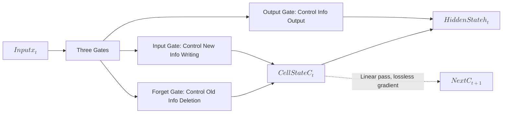
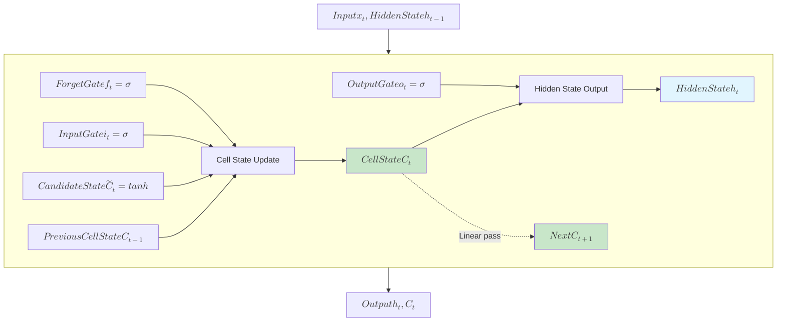
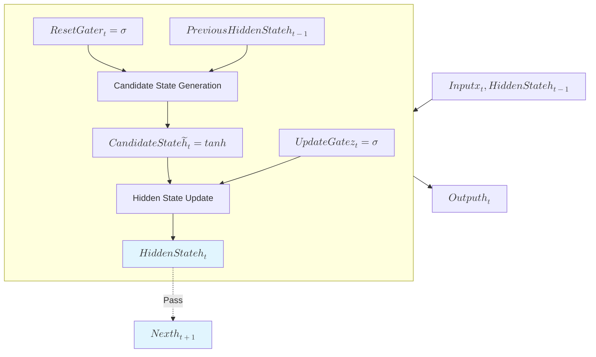

# LSTM and GRU Gating Mechanisms

The previous article introduced the basic principles of RNNs and the problems they fail to solve: vanishing gradients prevent learning long-term dependencies. When the sequence length exceeds 10-20 time steps, information from early time steps is almost completely lost by the time it reaches later steps, leaving the network unable to remember "long ago" content. The root of this problem lies in RNN's information transmission mechanism. At each time step, the hidden state $h_t$ is updated through a simple linear transformation and activation function:

$$h_t = \tanh(W_{hh} h_{t-1} + W_{xh} x_t)$$

This design has two inherent flaws. First, **forced compression**: regardless of whether historical information is important, it must be compressed into a fixed-dimensional $h_t$, where high information density makes it easy to lose details. Second, **lack of selectivity**: all historical information is passed with equal weight, making it impossible to distinguish between "key information worth remembering" and "irrelevant details worth forgetting", leading to both information redundancy and loss of critical information simultaneously.

When humans read an article, they do not remember every word in detail but instead retain key information (such as the protagonist's name, event highlights) and forget irrelevant details (such as adjectives, transition words). RNNs lack this selective memory capability, like a poor record-keeper forced to remember every trivial detail, ultimately remembering nothing clearly.

In 1997, German computer scientist Sepp Hochreiter and his advisor Jürgen Schmidhuber published the paper "[Long Short-Term Memory](https://doi.org/10.1162/neco.1997.9.8.1735)" in the journal *Neural Computation*, first proposing the **Long Short-Term Memory** network (LSTM). The central theme of this paper was how to enable neural networks to learn selective memory — remembering important information and forgetting irrelevant details. The key innovation was the introduction of **cell state** and **gating mechanisms**, allowing the network to learn which information needs long-term retention and which needs timely removal. LSTM can handle long-term dependencies spanning over 100 time steps, achieving breakthrough progress in tasks such as speech recognition, machine translation, and time series prediction, becoming a core tool for deep learning in processing sequential data — until the attention mechanism and Transformer architecture changed the landscape.

In 2014, South Korean computer scientist Cho Kyunghyun proposed the **Gated Recurrent Unit** (GRU) in the paper "[Learning Phrase Representations using RNN Encoder-Decoder for Statistical Machine Translation](https://arxiv.org/abs/1406.1078)", as a simplified version of LSTM. GRU merges LSTM's three gates into two, removes the independent cell state, reduces the number of parameters and computational cost, while maintaining comparable performance on most tasks. This article will detail the principles, structural design, training methods of LSTM and GRU, as well as comparison and selection strategies between the two.

## LSTM Structure and Gating Mechanisms

LSTM uses a **Cell State** ($C_t$) as its information transmission mechanism, from which the hidden state $h_t$ is derived. This fundamentally differs from RNNs, which process the hidden state $h_t$ through recurrent connections. The cell state $C_t$ can be understood as an information conveyor belt running through the entire sequence, passing from the start to the end without any non-linear activation function compression along the way, only updated through linear addition and element-wise multiplication. This design allows the cell state to preserve information over long periods without numerical decay or explosion caused by successive non-linear transformations. The cell state stores and transmits only the information that needs long-term retention, does not directly participate in external output, but serves as the information source for the hidden state $h_t$.

The cell state works in coordination with LSTM's three gating mechanisms: the forget gate clears old information from the cell state, the input gate writes new information into the cell state, and the output gate reads the information currently needed. The three gates work together, allowing the network to learn to distinguish between important and secondary information, deciding for itself which information to retain, which to forget, and which to output, alleviating the RNN's inability to handle long-term dependencies.


*Figure: LSTM Information Flow Model*

The figure above illustrates LSTM's information flow model. Input data passes through three gates before influencing the cell state and hidden state. The cell state is transmitted linearly to the next time step (dashed arrow). Consider an analogy to a notebook for intuitively understanding the role of each component. The cell state $C_t$ is the notebook's content, storing long-term information without interference from non-linear transformations between time steps. The forget gate decides which old content to erase from the notebook, freeing up space. The input gate decides which new content to write into the notebook, updating the memory. The output gate decides which content to read from the notebook as the current answer. This design gives LSTM the ability for selective retention (important information is stored long-term in $C_t$), selective forgetting (irrelevant information is cleared by the forget gate), and selective output (relevant information is read based on current task needs).

### Mathematical Representation

Each gate in LSTM has a clear mathematical representation. Understanding these formulas does not require a deep mathematical background because every symbol has a practical meaning that aligns with physical intuition.

- **Forget Gate**: Before performing computations at each time step, LSTM first decides through the forget gate how much information to forget from the previous cell state. The mathematical expression for the forget gate is:

    $$f_t = \sigma(W_f \cdot [h_{t-1}, x_t] + b_f)$$

    In the formula, $W_f$ is the weight matrix of the forget gate, controlling how input information influences the forgetting decision; $[h_{t-1}, x_t]$ is the concatenation of the previous hidden state and current input, containing all available information for making the judgment; $b_f$ is the bias term, adjusting the baseline output of the forget gate; $\sigma$ is the Sigmoid activation function, compressing the output to the $[0, 1]$ range. $f_t$ is the forget vector, with each element in the $[0, 1]$ range. $f_t^i = 0$ means completely forgetting the $i$-th dimension of the cell state, $f_t^i = 1$ means completely retaining it.

- **Input Gate**: Decides which new information needs to be written into the cell state. The mathematical expression for the input gate is:

    $$i_t = \sigma(W_i \cdot [h_{t-1}, x_t] + b_i)$$

    The formula structure appears identical to the forget gate, but the weight matrix $W_i$ and bias term $b_i$ have different values. The input gate output $i_t$ is also in the $[0, 1]$ range, controlling the extent to which new information is written. $i_t^i = 0$ means not writing to the $i$-th dimension, $i_t^i = 1$ means fully writing the candidate content. The candidate cell state generates new information that may need to be stored at the current time step:

    $$\tilde{C}_t = \tanh(W_C \cdot [h_{t-1}, x_t] + b_C)$$

    In the formula, $W_C$ is the weight matrix of the candidate state, $b_C$ is the bias term; tanh outputs in the $[-1, 1]$ range, allowing new information to be "positive" or "negative". $\tilde{C}_t$ is the candidate write content, containing the new information at the current time step, waiting to be filtered by the input gate before being written into the cell state.

- **Cell State Update**: LSTM uses the forget gate and input gate to complete the cell state update, fusing old and new information:

    $$C_t = f_t \odot C_{t-1} + i_t \odot \tilde{C}_t$$

    In the formula, $f_t \odot C_{t-1}$ is the retained old information ($\odot$ denotes element-wise multiplication), where the forget gate controls the retention degree of each cell state element dimension-wise; $i_t \odot \tilde{C}_t$ is the new information written, where the input gate controls the writing degree of the candidate content dimension-wise. The formula shows that the cell state is a weighted fusion of old and new information, with weights dynamically determined by the forget gate and input gate. No non-linear transformation appears in this formula, so the cell state $C_t$ update is linear addition, and the gradient does not pass through an activation function during propagation. The derivative of $C_t$ with respect to the previous cell state $C_{t-1}$ is $f_t$ ($\frac{\partial C_t}{\partial C_{t-1}} = f_t$). If the forget gate chooses to retain information ($f_t \approx 1$), the gradient can be transmitted almost losslessly. This is the mathematical basis for LSTM's ability to mitigate vanishing gradients and handle long-term dependencies spanning over 100 time steps.

- **Output Gate**: Decides how much information to read from the cell state as the current output. The mathematical expression for the output gate is:

    $$o_t = \sigma(W_o \cdot [h_{t-1}, x_t] + b_o)$$

    The structure of the output gate formula is also the same as the forget gate and input gate, only the weight matrix $W_o$ and bias term $b_o$ have different values. The output gate output $o_t$ is in the $[0, 1]$ range, controlling the extent to which cell state information is output externally. The hidden state is LSTM's external output, used for passing to the next time step and computing the final prediction:

    $$h_t = o_t \odot \tanh(C_t)$$

    In the formula, $o_t \odot \tanh(C_t)$ is the content read controlled by the output gate. $\tanh(C_t)$ compresses the cell state to the $[-1, 1]$ range, and the output gate controls the output degree dimension-wise. The hidden state $h_t$ is the result of the cell state after tanh compression and output gate filtering, rather than directly outputting $C_t$. The cell state is for long-term storage, and the hidden state is for external output — the two have separate responsibilities.

Combining the above mathematical formulas, the complete structure of LSTM can be clearly seen in the following figure. The figure shows three gates, a candidate state generator, cell state update, and hidden state output, with clear information flow paths.


*Figure: LSTM Unit Internal Structure*

The figure above shows the complete structure of the LSTM unit. The forget gate, input gate, and output gate respectively control the erasing, writing, and reading of information. The cell state (green) passes linearly to the next time step — this is the core design for solving the vanishing gradient problem. The hidden state (blue) is the external output, used for prediction and computation at the next time step.

LSTM has two information flow paths, each with different responsibilities. One is the **long-term path** (cell state $C_t$), which passes linearly with no significant gradient decay, used for storing long-term information. The other is the **short-term path** (hidden state $h_t$), which undergoes non-linear transformation (tanh) and is used for current output and gate computation. The hidden state goes through output gate filtering and tanh compression, causing gradient decay — this is expected behavior, as short-term information should naturally fade over time. The dual-path design is a distinctive feature of LSTM and the origin of its name: long-term information is stably transmitted through the cell state, while short-term information is quickly processed through the hidden state, with clear division of labor.

Now let us return to the [long-distance dependency example](rnn-basics.md#gradient-propagation-and-limitations) that RNNs could not solve, and re-evaluate it through the lens of LSTM's gating mechanism and cell state to see what changes. Still using the sentence "The cat, which already ate a fish, was hungry":

- The **forget gate** controls which old information needs to be cleared. When reading "ate", the network needs to judge which historical information is still needed later. The forget gate clears "which" (a connector that does not affect subsequent understanding), retains "cat" (the subject, needed by the subsequent verb), and retains "ate" (the verb, needed to explain why "hungry"). The learning objective of the forget gate is to identify which historical information forms the key skeleton and which is filler detail, clearing the details and retaining the skeleton.

- The **input gate** controls which new information needs to be written. When reading "fish", the network needs to judge whether to write "fish" into the cell state. The input gate writes "fish" (new information that may be needed later), while suppressing "already" (a modifier that does not affect core semantics even if not written). The learning objective of the input gate is to identify which parts of the current input are key new information and which are irrelevant noise, writing only the key information to avoid redundancy.

- The **output gate** controls which information needs to be output externally. When reading "hungry", the network needs to generate the hidden state for the current time step, used for prediction or transmission. The output gate reads "cat" (the subject, needed to output to the prediction layer), reads "ate" (the context, explaining why "hungry"), while suppressing the details of "fish" (though stored in the cell state, not needed for output at the current time step). The learning objective of the output gate is to identify which information is needed for the current task, outputting only relevant content to avoid interference.

The coordinated work of the three gates achieves a complete cycle of selective memory. LSTM is like an efficient notebook manager, regularly clearing outdated content to free up space, promptly recording important new information to update notes, and accurately retrieving relevant information based on task needs. The value of gating lies in enabling the network to learn when to remember, when to forget, and when to output, rather than indiscriminately passing all information like an RNN.

## GRU Simplified Design

Although LSTM's three-gate design is effective, its structure is complex with a large number of parameters and high computational cost. The design intent of GRU (Gated Recurrent Unit) is to simplify LSTM's gating mechanism as much as possible. Analyzing LSTM's gating design reveals that the forget gate controls old information retention, while the input gate controls new information writing — the two are complementary. Retaining more old information typically means writing less new information, and vice versa. This complementarity suggests that a single gate could balance old and new information, rather than setting up two separate gates.

GRU merges the forget gate and input gate into a single **Update Gate** ($z_t$), using one gating parameter to simultaneously control old information retention and new information writing. When the update gate output $z_t$ is close to 0, it retains old information and writes less new information; when $z_t$ is close to 1, it writes new information and retains less old information. This replaces LSTM's two gates with one parameter, simplifying the network structure.

Additionally, GRU removes the cell state $C_t$ and directly uses the hidden state $h_t$ as the information storage unit, further simplifying the structure. LSTM needs to maintain two information paths — the cell state and the hidden state — while GRU needs only one. The cost is sacrificing LSTM's linear information transmission design. GRU's gradient propagation still passes through non-linear transformations (tanh), making it inferior to LSTM in handling ultra-long-term dependencies. However, for medium-length dependencies (such as 20-50 time steps), GRU's simplified design does not compromise performance, and with fewer parameters and faster computation, it has become a mainstream choice in practice. With the removal of the cell state, a dedicated output gate to control external information output is no longer needed. Instead, GRU introduces a unique design — the **Reset Gate** ($r_t$), which controls the degree to which old information is relied upon when computing the candidate hidden state.

### Mathematical Representation

GRU's design philosophy is translated into specific mathematical formulas, resulting in a more concise structure compared to LSTM. GRU includes two gates:

- **Update Gate**: At each time step, the update gate first decides the balance between old and new information. The mathematical expression for the update gate is:

    $$z_t = \sigma(W_z \cdot [h_{t-1}, x_t] + b_z)$$

    This formula maintains the same structure as LSTM's three gates, with $W_z$ being the weight matrix of the update gate, controlling how input information influences the balance decision between old and new information. $z_t^i \approx 0$ means the $i$-th dimension retains old information and writes less new information; $z_t^i \approx 1$ means writing new information and retaining less old information, using one parameter to replace LSTM's two parameters (forget gate and input gate).

- **Reset Gate**: Decides how much old information to retain when computing the candidate hidden state. The mathematical expression for the reset gate is:

    $$r_t = \sigma(W_r \cdot [h_{t-1}, x_t] + b_r)$$

    This formula maintains the same structure, with the reset gate output $r_t$ in the $[0, 1]$ range. $r_t^i \approx 0$ means ignoring the old information in the $i$-th dimension, with the candidate state determined entirely by the current input, suitable for history-independent scenarios. $r_t^i \approx 1$ means the candidate state fuses old information with the current input, suitable for history-dependent scenarios. The mathematical expression for the candidate hidden state is:

    $$[gru_rest]\tilde{h}_t = \tanh(W \cdot [r_t \odot h_{t-1}, x_t] + b)$$

    In the formula, $r_t \odot h_{t-1}$ is the old information controlled by the reset gate, describing the participation degree of old information dimension-wise; $[r_t \odot h_{t-1}, x_t]$ is the concatenation of the reset old information and the current input. $\tilde{h}_t$ is the candidate write content, containing the history information controlled by the reset gate and the new information at the current time step, waiting to be filtered by the update gate before being written into the hidden state.

- **Hidden State Update**: GRU fuses old and new information through the hidden state update:

    $$[gru_ht]h_t = (1 - z_t) \odot h_{t-1} + z_t \odot \tilde{h}_t$$

    In the formula, $(1 - z_t) \odot h_{t-1}$ represents the extent of retained old information, controlling the retention of each hidden state element dimension-wise; $z_t \odot \tilde{h}_t$ represents the extent of written new information, controlling the writing of candidate content dimension-wise. The hidden state is a weighted fusion of old and new information, with weights dynamically determined by the update gate. $(1 - z_t)$ and $z_t$ are complementary, summing to 1, ensuring automatic balance between old and new information weights — retaining more old information necessarily means writing less new information, and vice versa. This design achieves the functionality of LSTM's two gates with a single gating parameter, simplifying the structure without sacrificing selective memory capability.

Combining the above mathematical formulas, the complete structure of GRU can be clearly seen in the following figure. The figure shows two gates, a candidate state generator, and hidden state update, with information flow paths simplified compared to LSTM.


*Figure: GRU Unit Internal Structure*

The figure above shows the complete structure of the GRU unit. Compared to LSTM, GRU's information flow is more concise. LSTM needs two paths — the cell state for long-term storage and the hidden state for external output. GRU has only one path, where the hidden state directly stores information while simultaneously serving both long-term storage and external output. This simplification sacrifices LSTM's linear information transmission design but still alleviates the vanishing gradient problem compared to RNNs, achieving comparable performance to LSTM on medium-length dependency tasks.

### Gradient Flow

GRU's gradient propagation still passes through non-linear transformations. Analyzing the gradient propagation characteristics of this path helps understand how GRU mitigates the vanishing gradient problem. According to GRU's hidden state update formula {{gru_ht}} and candidate hidden state formula {{gru_rest}}, the derivative of the gradient with respect to the previous hidden state is (assuming a simplified analysis where $z_t$ does not depend on $h_{t-1}$):

$$\frac{\partial h_t}{\partial h_{t-1}} = (1 - z_t) + z_t \odot \frac{\partial \tilde{h}_t}{\partial h_{t-1}}$$

If the update gate $z_t \approx 0$, the first term approaches 1, and the gradient can be transmitted losslessly — this corresponds to the linear path when retaining old information. The second term is $z_t \odot \frac{\partial \tilde{h}_t}{\partial h_{t-1}}$, which passes through the derivative of tanh (maximum value 1, typical value around 0.5) and will still decay, causing vanishing gradients. GRU's gradient transmission can be viewed as a weighted combination of a "linear part" and a "non-linear part", with weights dynamically determined by the update gate. For dependencies requiring long-term memory, the network learns to make the update gate output close to 0, retaining as much old information as possible and allowing gradients to pass through almost losslessly. However, compared to LSTM, GRU's gradient propagation still requires passing through non-linear transformations ($\tilde{h}_t$ goes through tanh), making it inferior to LSTM on ultra-long-term dependencies (such as 100+ time steps). This is the cost of GRU's simplified design, traded for fewer parameters and faster computation.

## Training Tips and Best Practices

Although LSTM and GRU theoretically alleviate RNN's vanishing gradient problem to some extent, training these models in practice still faces many challenges. These include inconsistent sequence lengths, parameter sharing characteristics after temporal unfolding, and gradient accumulation effects along the temporal dimension, making these models more dependent on training techniques than feedforward networks. Without proper sequence processing, regularization, and hyperparameter configuration, models are prone to training instability, overfitting, or low computational efficiency. This section introduces some proven training techniques:

- **Sequence Processing**: In real-world data, sequence lengths are often inconsistent. Efficiently handling variable-length sequences is a key training technique for LSTM/GRU. Common approaches include truncation (truncating overly long sequences to a fixed length), padding (padding short sequences with zeros to a fixed length), and packing (using `pack_padded_sequence` to avoid wasted computation on padded portions). Packing is the most efficient method, as it skips LSTM computation on padded portions, saving computational resources and ensuring that the hidden state at the last time step is a genuinely valid state. The following code demonstrates how to use `pack_padded_sequence`.

    ```python runnable
    import torch
    import torch.nn as nn

    # Handling variable-length sequences
    from torch.nn.utils.rnn import pack_padded_sequence, pad_packed_sequence

    # Assume three sequences of different lengths
    sequences = [
        torch.randn(5, 10),   # length 5
        torch.randn(3, 10),   # length 3
        torch.randn(7, 10),   # length 7
    ]

    # Pad to the same length
    max_len = max(len(seq) for seq in sequences)
    padded = torch.zeros(len(sequences), max_len, 10)

    for i, seq in enumerate(sequences):
        padded[i, :len(seq)] = seq

    print(f"Padded sequence shape: {padded.shape}")

    # Use pack_padded_sequence to optimize computation
    lstm = nn.LSTM(input_size=10, hidden_size=16, batch_first=True)
    # Record the actual length of each sequence
    lengths = torch.tensor([len(seq) for seq in sequences])
    # Pack (ignore padded portions)
    packed = pack_padded_sequence(padded, lengths.cpu(), batch_first=True, enforce_sorted=False)
    # LSTM processes the packed sequence
    packed_out, (h_n, c_n) = lstm(packed)
    # Unpack (restore to padded shape)
    out, _ = pad_packed_sequence(packed_out, batch_first=True)

    print(f"Output shape after processing: {out.shape}")
    print(f"Hidden state shape at the last time step: {h_n.shape}")
    ```

- **Regularization Techniques**: Regularization for LSTM and GRU requires special care, as applying traditional [Dropout](../neural-network-stability/dropout.md) after unfolding the recurrent structure along the temporal dimension may cause information discontinuity. Dropout can be applied in two ways. One is **inter-layer Dropout** (set via the `nn.LSTM(dropout=0.1)` parameter), applied between layers in a multi-layer network, where the output of the first layer randomly drops some units before being passed to the second layer. The other is **temporal Dropout**, which randomly drops input at certain time steps to prevent the network from over-relying on information at specific time steps. Inter-layer Dropout is built into PyTorch, easy to use, and produces stable results, while temporal Dropout requires manual implementation and is suitable for scenarios particularly prone to overfitting along the temporal dimension.

    Gradient clipping is another regularization technique for LSTM/GRU training. Although the gating mechanism mitigates vanishing gradients to some extent, gradient explosion can still occur — when gate outputs are unusually large, gradients can spike instantly, causing excessively large parameter updates and training instability. Gradient clipping limits the maximum norm of the gradient, preventing overly drastic parameter updates, and is a standard technique for training recurrent networks. The following code demonstrates how to implement gradient clipping.

    ```python
    # Add gradient clipping during training
    optimizer = torch.optim.Adam(model.parameters(), lr=0.01)

    for epoch in range(epochs):
        optimizer.zero_grad()
        loss = compute_loss(model, X, Y)
        loss.backward()
        
        # Gradient clipping (prevent gradient explosion)
        torch.nn.utils.clip_grad_norm_(model.parameters(), max_norm=1.0)
        
        optimizer.step()
    ```

- **Hyperparameter Tuning**: Hyperparameter tuning for LSTM and GRU follows a progressive strategy, prioritizing parameters with the greatest impact.

    | Hyperparameter | Recommended Range | Notes |
    |:-------|:---------|:-----|
    | hidden_size | 32-256 | Choose based on task complexity |
    | num_layers | 1-2 | 1-2 layers sufficient for most tasks |
    | dropout | 0-0.3 | Higher values for small datasets |
    | learning_rate | 0.001-0.01 | Adam typically 0.001-0.005 |
    | batch_size | 32-128 | Adjust based on memory |

    The tuning strategy follows a progressive principle, prioritized by impact. First adjust `hidden_size` (most impactful), which determines the model's memory capacity and representational power — too small loses information, too large increases computational cost and overfitting risk. Next adjust `num_layers` (increase layers for complex tasks) — 1-2 layers suffice for most tasks, while complex tasks may try 3 layers. Finally adjust `dropout` (prevent overfitting) — use higher values (0.2-0.3) for small datasets and lower values (0-0.1) for large datasets. This progressive strategy avoids the confusion of adjusting multiple parameters simultaneously, changing only one variable at a time and clearly tracking the effect of each change.

## Summary

This article introduced two gated recurrent neural networks — LSTM and GRU — both of which alleviate RNN's vanishing gradient problem to some extent, endowing networks with selective memory capability. Their mechanisms for addressing the gradient problem have distinct characteristics. LSTM uses linear transmission through the cell state, where gradients experience no significant decay, making it suitable for ultra-long-term dependencies. GRU uses the update gate to control information retention — when the update gate output is close to 0, gradient transmission is nearly linear, mitigating vanishing gradients and making it suitable for medium-length dependencies. Both achieve selective memory through gating mechanisms, enabling the network to learn when to retain and when to forget, rather than indiscriminately passing all information like an RNN.

The choice between them depends on task characteristics and resource constraints. For ultra-long-term dependency tasks, LSTM is preferred. For scenarios with limited computational resources or medium-length dependencies, GRU is preferred. In practice, a hybrid strategy is often used: first verify ideas quickly with GRU, and if results are unsatisfactory, then try LSTM. This "fast-first, slow-second" approach is more efficient when resources are limited. After the Transformer architecture was proposed in 2017, it achieved far superior performance to RNN series models in NLP through self-attention mechanisms, subsequently expanding into computer vision, multimodal, and other fields. The explosion of large language models in 2023 further pushed Transformer to absolute mainstream status. However, LSTM and GRU still play irreplaceable roles in several areas:

- **Resource-constrained scenarios**: Transformer's self-attention mechanism has a computational complexity of $O(n^2)$ — doubling the sequence length quadruples the computation. LSTM/GRU have a complexity of $O(n)$, growing linearly. On edge devices, embedded systems, or mobile applications, LSTM/GRU's parameter size and computational cost are far lower than Transformer's, making them more practical choices. For instance, a single-layer GRU with both input and hidden state dimensions of 128 has approximately 99K parameters, while a comparable lightweight Transformer typically has hundreds of times more parameters.

- **Streaming processing and real-time inference**: Transformer needs to see the complete sequence to compute global attention and cannot output progressively as data arrives. LSTM/GRU are inherently autoregressive models, where each time step depends only on the current input and the previous state, making them more suitable for real-time speech transcription, online sensor data monitoring, continuous stock price prediction, and similar scenarios.

- **Time series forecasting**: On tasks such as univariate time series (e.g., sales forecasting, temperature prediction, equipment fault warning), extensive benchmark tests show that LSTM/GRU often perform comparably to or even better than Transformer. This is because the core of these tasks lies in capturing short-term trends and periodic patterns rather than long-distance semantic associations, and LSTM/GRU's temporal modeling capability is sufficient.

- **Education and learning**: LSTM's gating mechanism is an important foundation for understanding modern deep learning architectures. Transformer's residual connections, normalization layers, gated feedforward networks, and other designs can all be traced back to the information control ideas in LSTM. Understanding LSTM's selective memory mechanism first, then learning Transformer's attention mechanism, is a widely validated progressive learning path.

## Exercises

1. Explain why LSTM's cell state can alleviate the vanishing gradient problem, from both mathematical derivation and information flow perspectives, and compare it with RNN's gradient propagation path.
    <details>
    <summary>Reference Answer</summary>

    **Mathematical Derivation Perspective**:

    LSTM's cell state update formula is $C_t = f_t \odot C_{t-1} + i_t \odot \tilde{C}_t$. Taking the derivative with respect to $C_{t-1}$ yields $\frac{\partial C_t}{\partial C_{t-1}} = f_t$. When the gradient propagates back through time, the total gradient is the product of the derivatives at each time step:

    $$\frac{\partial C_t}{\partial C_1} = f_t \odot f_{t-1} \odot \cdots \odot f_2$$

    The key is that the forget gate $f_t$ is output by the Sigmoid function, in the range $[0, 1]$, and the network can learn to make $f_t \approx 1$. When long-term memory is needed, the network learns to keep the forget gate close to 1, so the product of gradients is close to 1, transmitting almost losslessly. In contrast, the gradient of RNN is $\frac{\partial h_t}{\partial h_{t-1}} = W_{hh}^T \cdot \text{diag}(\tanh'(...))$, where the maximum derivative of tanh is only 1, with typical values around 0.5, so the product rapidly decays to 0.

    **Information Flow Perspective**:

    LSTM has two information paths. The long-term path (cell state $C_t$) uses linear addition and element-wise multiplication for updates, without passing through non-linear activation function compression. Information flows smoothly as if on a conveyor belt, with no numerical decay due to successive non-linear transformations. The short-term path (hidden state $h_t$) goes through tanh and output gate filtering, where non-linear transformations cause gradient decay — but this is expected behavior, as short-term information should naturally fade over time. RNN has only one path, where all information must pass through tanh compression, and both long-term and short-term information decay together, with no way to treat them differently.

    **Comparison Summary**:

    | Feature | RNN | LSTM |
    |:-----|:----|:-----|
    | Information path | Single path ($h_t$) | Dual path ($C_t$ and $h_t$) |
    | Gradient transmission | Continuous non-linear transformation | Linear pass through cell state |
    | Gradient decay speed | Fast (tanh derivative ~0.5) | Controllable (forget gate can learn ~1) |
    | Selective memory | No | Yes (gating mechanism) |

    LSTM's core innovation is making gradient propagation "controllable" rather than "fixed decay". The network learns the values of the forget gate to determine the retention degree of gradients — when long-term memory is needed, gradients are transmitted almost losslessly; when not needed, they decay naturally. This adaptive mechanism is something RNN cannot achieve.
    </details>

2. Based on GRU's hidden state update formula $h_t = (1 - z_t) \odot h_{t-1} + z_t \odot \tilde{h}_t$ and the candidate hidden state formula $\tilde{h}_t = \tanh(W \cdot [r_t \odot h_{t-1}, x_t] + b)$ given in this chapter, derive the expression for $\frac{\partial h_t}{\partial h_{t-1}}$ and explain under what conditions the gradient can be transmitted approximately losslessly.
    <details>
    <summary>Reference Answer</summary>

    Based on the hidden state update formula, taking the derivative with respect to $h_{t-1}$ requires considering the contributions of both terms separately.

    The derivative of the first term $(1 - z_t) \odot h_{t-1}$ with respect to $h_{t-1}$ is $(1 - z_t)$ (assuming a simplified case where $z_t$ does not depend on $h_{t-1}$; in practice $z_t$ also depends on $h_{t-1}$, but when analyzing the main gradient flow path, $(1 - z_t)$ represents the gradient contribution of the linear part).

    In the second term $z_t \odot \tilde{h}_t$, the derivative of $\tilde{h}_t = \tanh(W \cdot [r_t \odot h_{t-1}, x_t] + b)$ with respect to $h_{t-1}$ passes through the derivative of tanh (maximum value 1, typical value around 0.5) and multiplication by the reset gate $r_t$. Therefore, the gradient contribution of the second term is $z_t \odot \frac{\partial \tilde{h}_t}{\partial h_{t-1}}$, which includes decay caused by non-linear transformations.

    Combining the two terms gives:

    $$\frac{\partial h_t}{\partial h_{t-1}} = (1 - z_t) + z_t \odot \frac{\partial \tilde{h}_t}{\partial h_{t-1}}$$

    **Conditions for Approximately Lossless Gradient Transmission**:

    When the update gate $z_t \approx 0$, then $(1 - z_t) \approx 1$ and the second term $z_t \odot \frac{\partial \tilde{h}_t}{\partial h_{t-1}} \approx 0$, resulting in $\frac{\partial h_t}{\partial h_{t-1}} \approx 1$, allowing approximately lossless gradient transmission. This corresponds to the situation where the network needs long-term memory: the update gate output close to 0 means retaining old information and writing less new information, with the gradient passing almost losslessly through the linear path $(1 - z_t) \odot h_{t-1}$.

    However, note that compared to LSTM's $\frac{\partial C_t}{\partial C_{t-1}} = f_t$, GRU's gradient transmission is a weighted combination of a "linear part" and a "non-linear part". Even when $z_t \approx 0$, the non-linear part still exists when $z_t$ is not exactly 0, and $z_t$ itself also depends on $h_{t-1}$. Therefore, GRU is inferior to LSTM's purely linear path on ultra-long-term dependencies (such as 100+ time steps) — this is the cost of its simplified design.
    </details>

3. Analyze the following four task scenarios and choose the more suitable model (LSTM, GRU, or Transformer), explaining the rationale:
    - Real-time speech transcription system requiring word-by-word output;
    - Long document summarization where the source text exceeds 5000 words;
    - Heart rate anomaly detection on an embedded device, with data sampled once per second;
    - Sentiment classification for medium-length text, with sentence lengths of about 20-50 words.
    <details>
    <summary>Reference Answer</summary>

    - **Real-time speech transcription system** → Choose **LSTM/GRU**. Speech transcription requires streaming processing, with data arriving gradually over time. The model must output results at each time step based on the current input and existing state. Transformer needs to see the complete sequence to compute global attention and cannot meet real-time requirements. LSTM and GRU are inherently autoregressive models, depending only on the current input and the previous state at each time step, making them naturally suited for streaming scenarios. Since this scenario primarily involves medium-length dependencies, GRU with fewer parameters and faster inference is the more practical choice.

    - **Long document summarization** → Choose **Transformer**. Long documents exceeding 5000 words require capturing semantic associations across the full text, such as a question raised at the beginning being answered only at the end. This type of ultra-long-distance dependency is exactly where Transformer's self-attention mechanism excels. Self-attention allows each position to directly attend to any other position, without the need for step-by-step information propagation like RNNs. Although LSTM can theoretically handle long-term dependencies, its actual performance degrades significantly beyond 1000 time steps, and its inference speed is far slower than Transformer. GRU is even more limited on very long sequences.

    - **Embedded device heart rate detection** → Choose **GRU**. Embedded devices have severely limited computational resources (small memory, no GPU), requiring lightweight and efficient models. GRU has about 3/4 of LSTM's parameters (two gates vs. three gates, no cell state) and faster inference speed. Heart rate detection is a short-to-medium length dependency task (current heart rate correlates with data from the past few tens of seconds) and does not require LSTM's ultra-long-term memory capability. Transformer typically has far more parameters than GRU and is difficult to deploy on embedded devices. A single-layer GRU with both input and hidden state dimensions of 128 has approximately 99K parameters, making it suitable for resource-constrained scenarios.

    - **Medium-length text sentiment classification** → Choose **GRU or Transformer** (both viable, depending on resources). Sentence lengths of 20-50 words are well within the capability of LSTM and GRU. GRU has fewer parameters and faster training, offering the best cost-performance ratio. If computational resources are abundant, Transformer can also handle the task and typically achieves higher accuracy, as self-attention can process all positions in parallel with higher training efficiency. However, for quickly verifying ideas or when resources are limited, GRU is the more pragmatic choice — the "fast-first" strategy is more efficient.

    **Summary of Selection Principles**:

    | Decision Factor | LSTM | GRU | Transformer |
    |:---------|:-----|:----|:------------|
    | Ultra-long dependencies (100+ steps) | Preferred | Weak | Preferred |
    | Medium dependencies (20-50 steps) | Usable | Preferred | Preferred |
    | Limited computation resources | Heavy | Preferred | Unsuitable |
    | Streaming/real-time processing | Suitable | Suitable | Unsuitable |
    | Parallel training efficiency | Low | Low | High |

    Hybrid strategy in practice: first quickly verify ideas and establish a baseline with GRU; if results are unsatisfactory, try LSTM for long-term dependencies; upgrade to Transformer when resources are sufficient. This "fast-first, slow-second" strategy is more efficient when resources are limited.
    </details>
