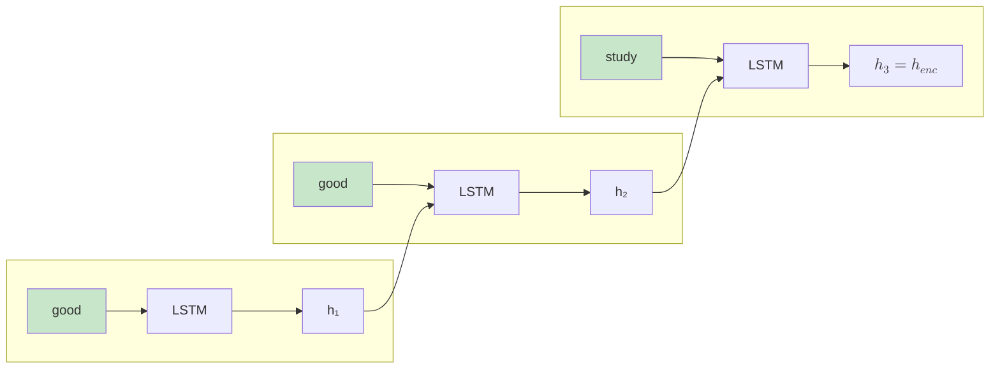
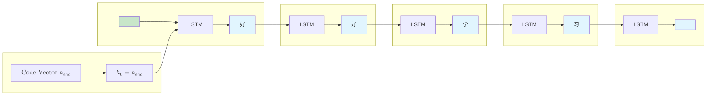

# Seq2Seq Sequence Mapping

2014 was a memorable year in the history of machine learning. That year, Google researcher Ilya Sutskever proposed in his paper "[Sequence to Sequence Learning with Neural Networks](https://arxiv.org/abs/1409.3215)" the idea of using two recurrent neural networks to complete machine translation — one responsible for reading the input sentence, and the other for writing the translation. This architecture, known today as **Seq2Seq** (Sequence-to-Sequence), had an impact that went far beyond enabling neural machine translation to surpass traditional statistical translation methods for the first time. More importantly, it opened up infinite possibilities for language models. The first half of the deep learning era began its legendary journey with computer vision; the second half is undoubtedly the golden age centered on language models.

Before this, researchers attempted to use single RNNs for sequence tasks. However, because RNNs are designed to produce one output for each input at each time step, they struggled to handle cases where input and output lengths differed. Seq2Seq's innovation lies in its **Encoder-Decoder** structure, which divides sequence mapping into two independent stages. The encoder first reads the input sequence word by word, compressing it into a fixed-dimensional vector representation. The decoder then starts from this vector and gradually generates the output sequence, producing one word at each time step until it encounters an end token. This design cleverly decouples the sequence length constraint, allowing the model to handle input and output of arbitrary length.

The previous two articles introduced RNN, LSTM, and GRU — models capable of processing sequential data and using historical information to make current decisions. Seq2Seq builds on these foundations, extending the power of recurrent networks to the domain of sequence generation. This article will introduce Seq2Seq's core architecture, working principles, and training techniques, helping readers understand this leap from understanding sequences to generating sequences.

## Encoder-Decoder Architecture

The problem Seq2Seq aims to solve is mapping variable-length input sequences to variable-length output sequences. Situations where input and output sequence lengths differ are very common in practice. For example, translating "Good good study" has only three English words, but the corresponding Chinese "好好学习" is four characters. A five-hundred-word news article might be summarized in just fifty words. A user might ask a short question, but the answer may require explaining a lengthy background. Previously, RNNs had to [forcibly align](lstm-gru.md#training-tips) sequences (e.g., padding short sequences to the same length) to satisfy the constraint that input and output sequences must be equal in length, resulting in outputs containing many meaningless blank positions or losing key content that should have been generated.

Since input and output lengths cannot be aligned in advance, it is better to divide the problem into two independent stages. The first stage focuses on understanding the input, absorbing all information. The second stage focuses on generating the output, expanding word by word based on the understood content. Each stage uses a different network, each with its own number of time steps — the length constraint is naturally broken. For example, the input sequence `['good', 'good', 'study']` is processed by the encoder and compressed into a vector $h_{enc}$; the decoder starts from this vector and gradually generates the output sequence `['好', '好', '学', '习']`. The encoder processes $T$ time steps, and the decoder generates $T'$ time steps — the two numbers can be completely different.

The encoder that compresses the input sequence into a vector representation is the first stage of Seq2Seq. It typically uses LSTM or GRU as its base structure, processing each word in the input sequence step by step. The following diagram shows the encoder's processing flow. At the first time step, the word "good" is input, and the LSTM produces hidden state $h_1$. At the second time step, "good" is input again, and the LSTM simultaneously receives $h_1$ as the previous hidden state, combining them to produce $h_2$. At the third time step, "study" is input, and the LSTM receives $h_2$ to produce the final hidden state $h_3$. The output encoding vector is this final state $h_{enc} = h_3$.


*Figure: Encoder Processing Flow*

The encoding vector $h_{enc}$ is the LSTM's hidden state at the final time step. In theory, it should contain all the information from the input sequence — not just the content of the last word "study", but also the information from the first two "good" words preserved through LSTM's memory mechanism. This vector is a semantic compressed representation of the entire input sentence, much like the overall impression left in one's mind after reading a book. Some implementations also use the cell state $C_T$ as the encoding vector, or combine $h_T$ and $C_T$. All of these approaches are viable with little difference in effectiveness.

The decoder is the second stage of Seq2Seq, tasked with gradually generating the output sequence from the encoding vector. It also uses LSTM or GRU as its base structure, but its initial state is not randomly initialized — it is provided by the encoder's output vector. Continuing with the "good good study" translated to "好好学习" example to illustrate the decoder's generation process, as shown in the following diagram:


*Figure: Decoder Generation Flow*

At the initial time step of the decoder's generation process, the hidden state is set to the encoding vector $h_{enc}$, which effectively passes the content read by the encoder to the decoder as the starting point for generation. At the first time step, the special `<START>` token is input (indicating the start of generation), and the LSTM produces the first output word. At the second time step, the previously generated word is input, producing a new output, and so on, until the `<END>` token is output to signal the end of generation. Combining the encoder and decoder gives the complete workflow of Seq2Seq, as shown in the following diagram:

```nn-arch width=720
name: Seq2Seq (Encoder-Decoder Architecture)
layout: horizontal

sections:
  - name: Encoder
    layers: [enc_input, enc_h1, enc_h2, enc_h3]
    row_label: "Code Vector (h₃)"
    row_direction: down
  - name: Decoder
    layers: [dec_h1, dec_h2, dec_h3, dec_h4, dec_output]

layers:
  - {id: enc_input, name: "Input Sequence", type: input, size: "good good study"}
  - {id: enc_h1, name: "LSTM", type: rnn, size: h₁}
  - {id: enc_h2, name: "LSTM", type: rnn, size: h₂}
  - {id: enc_h3, name: "LSTM", type: rnn, size: h₃}
  - {id: dec_h1, name: "LSTM", type: rnn, size: "好"}
  - {id: dec_h2, name: "LSTM", type: rnn, size: "好"}
  - {id: dec_h3, name: "LSTM", type: rnn, size: "学"}
  - {id: dec_h4, name: "LSTM", type: rnn, size: "习"}
  - {id: dec_output, name: "Output Sequence", type: output, size: "好好学习"}
```
*Figure: Seq2Seq Workflow*

From the perspective of information flow, the encoding vector is the bridge connecting the two stages. The encoding phase is an information compression process, squeezing a complete sequence into a fixed-dimensional vector. The decoding phase is an information expansion process, starting from this vector to release the compressed information and generate a new sequence. The quality of compression and expansion determines translation accuracy, and this quality is directly limited by the capacity of the encoding vector — specifically, how well the encoding vector can handle long-range dependencies. This is precisely the core problem that the attention mechanism later aims to solve.

## Seq2Seq Training

Training a Seq2Seq model begins with finding an appropriate loss function to measure the gap between the model's predictions and the ground truth. Since the decoder outputs a probability distribution over the vocabulary at each time step, this is essentially a classification problem — the decoder is finding the class (word) with the highest probability in the vocabulary. Thus, [cross-entropy loss](../../statistical-learning/linear-models/logistic-regression.md#cross-entropy-loss) is used as the foundation. Let $target_t$ be the ground truth target word at time step $t$, and $L_t$ be the individual cross-entropy loss at time step $t$. The cross-entropy loss at each time step is defined as:

$$L_t = -\log P(target_t | y_{t-1}, ..., y_1, h_{enc})$$

This formula states that, given the encoding vector $h_{enc}$ and all previously generated words $y_1, ..., y_{t-1}$, the higher the model's predicted probability for the ground truth target word $target_t$, the smaller the loss. If the model predicts perfectly (probability of 1), the loss is 0. If it predicts completely incorrectly (probability near 0), the loss approaches infinity. The following example demonstrates the loss calculation. Assume the ground truth target sequence is `["好", "好", "学", "习", "<END>"]`, with corresponding vocabulary indices `[50, 50, 51, 52, 1]`. The decoder's predicted probability distribution is as follows:

| Time Step | Predicted Probability Distribution | Ground Truth Word | Ground Truth Probability | Per-Step Loss $L_t$ |
|:---------:|:-----------------------------------|:-----------------:|:------------------------:|:-------------------:|
| 1 | {"好": 0.8, "天": 0.1, ...} | 好 | 0.8 | $-\log(0.8) = 0.22$ |
| 2 | {"好": 0.9, "天": 0.05, ...} | 好 | 0.9 | $-\log(0.9) = 0.11$ |
| 3 | {"学": 0.85, "向": 0.1, ...} | 学 | 0.85 | $-\log(0.85) = 0.16$ |
| 4 | {"习": 0.80, "上": 0.05, ...} | 习 | 0.8 | $-\log(0.8) = 0.22$ |
| 5 | {"`<END>`": 0.95, ...} | `<END>` | 0.95 | $-\log(0.95) = 0.05$ |

Building on the individual losses, the total loss is defined as the sum of the cross-entropy losses at each time step of the decoder:

$$L = \sum_{t=1}^{T'} L_t(y_t, target_t)$$

Based on the data in the table above, the total loss is the sum of the losses at each time step: $L = 0.22 + 0.11 + 0.16 + 0.22 + 0.05 = 0.76$. The training objective of the Seq2Seq model is to adjust all parameters of both the encoder and decoder through backpropagation, making the decoder's predicted probability distribution increasingly close to the ground truth, thereby minimizing the total loss. When the loss is sufficiently low, the model can translate accurately. During training, in addition to the basic backpropagation algorithm, there are several useful techniques that can significantly improve model performance and training efficiency. These techniques address issues such as the inconsistency between training and inference, and quality control of generated sequences.

### Scheduled Sampling

The decoder has two generation modes: teacher forcing and free running. **Teacher Forcing** uses ground truth target words as the decoder's input, rather than the words predicted by the model itself. **Free Running** uses the words predicted by the model at the previous time step as the input at each time step, rather than ground truth target words. The key difference between these two approaches lies in the source of the decoder's input.

When training Seq2Seq, teacher forcing is typically used at the beginning. The advantage is faster training convergence: the model always receives correct context, and the gradient signal is stable, so early prediction errors do not affect subsequent learning. This is similar to learning to write with a teacher who always provides the correct previous sentence, allowing you to focus on writing the next sentence correctly — this speeds up the learning process. However, teacher forcing has a drawback: inconsistency between training and inference. During inference, the model always uses free running — the input at each time step is the word predicted at the previous time step, not the ground truth. If the model never encounters its own prediction errors during training, then when an early prediction error occurs during inference, all subsequent generations will be based on incorrect content, and errors will accumulate and amplify. This phenomenon is called **error accumulation**. It is like taking an exam where you are used to the teacher prompting you on the side — when you take the exam on your own, you will naturally struggle, affecting your performance.

**Scheduled Sampling** is a classic strategy to alleviate this problem. During training, the process gradually transitions from teacher forcing to free running, allowing the model to progressively adapt to using its own predictions as input. At the beginning of training, 100% teacher forcing is used, allowing the model to first learn basic sequence generation capabilities. In the middle of training, 50% teacher forcing and 50% free running are used, and the model begins to encounter its own predictions. At the later stage of training, 10% teacher forcing and 90% free running are used, and the model almost fully adapts to the inference mode. This gradual transition makes training and inference more consistent, alleviating the error accumulation problem.

### Beam Search

During inference, the decoder's task is to produce output words. At each time step, the model outputs a probability distribution over the vocabulary. How the word is selected from this distribution affects the quality of the final generated sequence. The most straightforward method is **Greedy Search**, which selects the word with the highest probability at each time step. This method is fast but has a problem: a local optimum is not necessarily the global optimum. Selecting the highest-probability word at a particular time step may lead to lower quality in subsequent generation. The following example illustrates this issue. Suppose we are translating "good study", and the vocabulary contains only three words: "好", "学", "习". At time step 1, the model predicts the probability distribution {"好": 0.6, "学": 0.3, "习": 0.1}, and greedy search selects "好". At time step 2, based on "好" as input, the model predicts {"学": 0.4, "习": 0.3, "好": 0.2}, and greedy search selects "学", resulting in the output "好学习". However, if at time step 1 the slightly lower-probability "学" (0.3) had been selected, subsequent generation might yield "学习好". From a Chinese semantic perspective, "学习好" (study well) sounds more natural than "好学习" (like to study). This demonstrates that local optimality (selecting the highest-probability word at each step) does not necessarily produce the global optimum (the most semantically reasonable sequence).

**Beam Search** is an improved strategy for this type of problem. Instead of keeping only one candidate sequence, it retains multiple candidate sequences. At each time step, it keeps the $k$ most probable candidates ($k$ is called the beam width), continues expanding these candidates, and ultimately selects the complete sequence with the highest probability. The advantage of beam search lies in the multiple candidates avoiding the local optimum trap. Even if a word has a low probability early on, it can still be selected as long as the combined probability of subsequent words is sufficiently high. This is like considering multiple possible paths in a game rather than just the next move, ultimately choosing the path most likely to lead to victory.

The choice of beam width involves a trade-off between quality and speed. A beam width of 1 is equivalent to greedy search, which is fastest but may produce lower quality. A beam width of 5-10 is a common choice, balancing quality and speed. When the beam width exceeds 20, quality improvement is limited while computational cost increases significantly. In practice, the appropriate beam width should be chosen based on the task characteristics and computational resources.

### Temperature Sampling

Both greedy search and beam search select the word or sequence with the highest probability. This approach produces results with high determinism and stability but lacks diversity. In some scenarios, we want more creative and diverse outputs rather than always choosing the safest answer. **Temperature Sampling** is a technique for controlling generation diversity by adjusting the model's output probability distribution to control the randomness of sampling.

At each time step, the model outputs logits (unnormalized scores) over the vocabulary, which are converted to a probability distribution via Softmax. Temperature Sampling introduces a temperature parameter $T$ into the Softmax:

$$p_i = \frac{\exp(z_i / T)}{\sum_{j=1}^{V} \exp(z_j / T)}$$

where $z_i$ is the logit for the $i$-th word, $V$ is the vocabulary size, and $T$ is the temperature parameter. The effect of the temperature parameter on the probability distribution can be discussed in three cases:

- **$T = 1$**: Standard Softmax, preserving the model's original predicted probability distribution.
- **$T < 1$** (low temperature): The probability distribution becomes sharper, further increasing the probability of high-probability words and further decreasing the probability of low-probability words. In the extreme case $T \to 0$, the probability distribution degenerates into a [One-Hot encoding](word-embedding.md#one-hot-encoding-and-bag-of-words), where only the highest-probability word has probability 1, equivalent to greedy search.
- **$T > 1$** (high temperature): The probability distribution becomes flatter, narrowing the gap between word probabilities and giving low-probability words more opportunities. In the extreme case $T \to \infty$, all words tend toward equal probability, and sampling degenerates into uniform random selection.

A concrete example illustrates the effect of temperature. Assume the vocabulary has only 4 words, and the model outputs logits of `[2.0, 1.0, 0.5, 0.1]`. The probability distributions at different temperatures are as follows:

| Temperature $T$ | Probability Distribution | Sampling Characteristics |
|:---------------:|:------------------------|:------------------------|
| 0.5 | [0.83, 0.11, 0.04, 0.02] | High-probability words dominate, conservative and stable generation |
| 1.0 | [0.57, 0.21, 0.13, 0.09] | Maintains original distribution, balances stability and diversity |
| 2.0 | [0.41, 0.25, 0.19, 0.16] | Probability gap narrows, low-probability words get more chances |

As shown in the table, low temperature (0.5) raises the probability of the highest-probability word from 57% to 83%, making generation almost always select the most frequent word. High temperature (2.0) reduces the highest-probability word's probability to 41%, giving other words more opportunities and making generation more diverse. The choice of temperature parameter should be weighed based on task characteristics:

- **Low temperature (0.3-0.7)**: Suitable for tasks requiring accurate, stable output, such as machine translation and code generation. Generated results are close to common expressions in the training data, with low error rates, but may lack creativity.
- **Medium temperature (0.8-1.0)**: Suitable for tasks requiring a balance of accuracy and diversity, such as dialogue generation and text continuation. This is the most common default setting.
- **High temperature (1.0-1.5)**: Suitable for tasks requiring creativity and diversity, such as poetry generation and story creation. Generated results are more creative but may contain disfluencies or errors.

In practice, temperature sampling is usually combined with Top-k sampling or Top-p sampling (nucleus sampling). Candidate words are first filtered through Top-k or Top-p, and then temperature sampling is applied to the filtered set. This combined strategy limits interference from low-probability words while preserving the diversity controlled by temperature, making it the mainstream approach for text generation in modern language models.

### Handling Variable-Length Sequences

Seq2Seq's advantage is that input and output lengths can differ, but implementation still requires addressing two issues: when to stop generation and how to handle overly long outputs. **Dynamic End Detection** is the most basic mechanism. When the decoder generates the `<END>` token, it stops the generation process, and the output sequence length is determined by the model itself. This is more natural than fixed-length output — simple sentences produce short outputs, and complex sentences produce long outputs. However, this freedom also introduces risk: the model may fall into an "infinite generation" state, continuously outputting words without producing the `<END>` token. To prevent this, a maximum length limit should be set. For example, if the maximum length is set to 50 and the `<END>` token has not been generated by time step 50, generation is forced to stop and the current sequence is output. This mechanism ensures the generation process does not continue indefinitely while giving the model sufficient freedom to determine output length.

**Length Penalty** is a technique used in beam search. When beam search evaluates candidate sequences, it uses the combined probability (the product of individual word probabilities) as the score. However, this approach has a natural flaw: the product of probabilities for more words is inherently smaller, meaning longer sequences naturally have lower probabilities. This causes beam search to favor shorter sequences, even when longer sequences are of higher quality. Length penalty mitigates this issue by adjusting the score, dividing the original probability by a length-related factor to reduce the influence of length on scoring.

The effect of length penalty is to make scoring fairer between long and short sequences. Suppose a 5-word sequence has a combined probability of 0.5, while a 10-word sequence has a combined probability of 0.3. Under the original scoring, the short sequence wins, but with length penalty applied, the long sequence might reverse the outcome because it contains more meaningful content — its probability product is only naturally lower due to length.

## Summary

From RNN to LSTM, GRU, and then to Seq2Seq, the core objective of this technological evolution has remained consistent: how to enable neural networks to effectively process dependencies in sequential data. RNN pioneered the introduction of recurrent connections, giving networks the ability to remember historical information, but the vanishing gradient problem prevented it from learning long-term dependencies beyond 10-20 time steps. LSTM extended effective memory length to over a hundred time steps through gating mechanisms and linear cell state propagation. GRU achieved comparable performance on medium-length sequences with a more streamlined structure. Seq2Seq went further, using the encoder-decoder architecture to break the constraint that input and output lengths must be equal, making sequence-to-sequence mapping possible.

The value of these models lies not only in solving specific technical problems but also in establishing the fundamental paradigm of sequence modeling: information needs to be compressed, transmitted, and selectively retained. LSTM's gating philosophy (learning when to remember and when to forget) has become a universal design principle in modern deep learning architectures. Seq2Seq's encoder-decoder structure laid the architectural foundation for subsequent tasks such as text generation, image captioning, and speech recognition.

However, this technological path has always faced a fundamental bottleneck: the encoder must compress an entire input sequence into a fixed-dimensional vector, regardless of whether the input has ten words or a thousand words. The decoder can only extract information from this single vector. When sequences become long, the information density carried by the encoding vector becomes too high, and details are inevitably lost. A deeper problem is that when the decoder generates each word, it pays the same degree of attention to all positions in the input sequence. It cannot distinguish that when generating "cat", it should focus on "cat" in the input rather than irrelevant words. This lack of attention — or rather, uniform allocation of attention — makes it difficult to further improve the quality of tasks such as long-sequence translation and long document summarization.

This bottleneck points toward a new solution: enabling the decoder to dynamically and selectively attend to different positions in the input sequence when generating each word. This is the core idea of the attention mechanism and the starting point of the future Transformer architecture.

## Exercises

1. In the Seq2Seq architecture, the encoder ultimately outputs a hidden state $h_{enc}$. Explain why this vector can contain information about the entire input sequence, and not just information about the last word. If the input sequence is very long, what problems might this representation face?
    <details>
    <summary>Reference Answer</summary>

    **Information Transmission Mechanism**:

    The encoder uses LSTM or GRU as its base structure. These models achieve selective information transmission through gating mechanisms. Taking LSTM as an example, the cell state $C_t$ at each time step is transmitted linearly (through addition), avoiding the vanishing gradient problem in RNNs. When the encoder processes the input sequence `[good, good, study]`:

    - Time step 1: LSTM processes "good", producing $h_1$ and $C_1$
    - Time step 2: LSTM processes "good", simultaneously receiving $C_1$, and produces $h_2$ and $C_2$ after fusion
    - Time step 3: LSTM processes "study", simultaneously receiving $C_2$, and produces the final $h_{enc} = h_3$

    Due to the linear transmission characteristic of the cell state, information from early time steps (the first "good") can be preserved in the final state.

    **Problems with Long Sequences**:

    When the input sequence is very long (e.g., sentences with over 100 words), the encoding vector faces an "information bottleneck" problem:

    1. **Capacity limitation**: A fixed-dimensional vector (e.g., 256 or 512 dimensions) struggles to store all detailed information precisely
    2. **Information compression loss**: Detail information in long sequences is inevitably lost during compression
    3. **Uniform attention**: The decoder pays the same degree of attention to all positions in the input sequence when generating each word, making it unable to distinguish key information

    This is precisely the problem that the attention mechanism later addresses: enabling the decoder to dynamically and selectively attend to different positions in the input sequence.
    </details>

2. Suppose the decoder's predicted probability distribution at time step $t$ is $P(y_t | y_{<t}, h_{enc})$, and the index of the ground truth target word in the vocabulary is $k$. Write the cross-entropy loss formula for time step $t$, and calculate the loss value for the following case: vocabulary size is 5, ground truth target word index is 2, and the model's predicted probability distribution is $[0.1, 0.2, 0.4, 0.2, 0.1]$.
    <details>
    <summary>Reference Answer</summary>

    **Cross-Entropy Loss Formula**:

    $$L_t = -\log P(target_t | y_{t-1}, ..., y_1, h_{enc})$$

    For a classification problem over the vocabulary, this is equivalent to:

    $$L_t = -\log P(y_t = target_t) = -\log p_{target_t}$$

    where $p_{target_t}$ is the model's predicted probability for the ground truth target word.

    **Calculation Process**:

    Given:
    - Ground truth target word index $k = 2$ (note: indices start from 0)
    - Predicted probability distribution $P = [0.1, 0.2, 0.4, 0.2, 0.1]$
    - Predicted probability corresponding to the ground truth target word: $p_2 = 0.4$

    Substituting into the formula:

    $$L_t = -\log(0.4) \approx -(-0.916) = 0.916$$

    **Explanation**: The loss value is approximately 0.916. If the model's predicted probability for the ground truth target word were 1 (perfect prediction), the loss would be 0. If the predicted probability approaches 0, the loss approaches infinity.
    </details>
