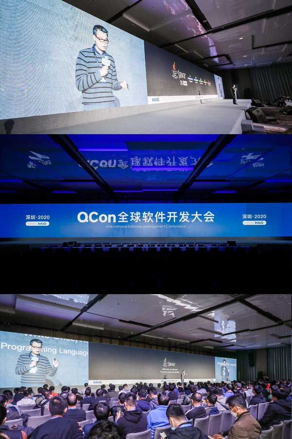

# About the Author

Zhiming Zhou

Ph.D, Full Stack Programmer, Computer Book Writer, Technical Evangelist, Cloud Native Architect, Most Valuable Professional, HLLVM/PLDI Enthusiast

- Programmer
  Huawei Grade 7 Expert, a programmer who also takes on some management and research responsibilities. Primarily engaged in the architecture and development of large-scale enterprise software. As chief architect, participated in major transformation projects such as [MetaERP](https://www.huawei.com/cn/news/2023/4/metaerp-press-release) and MetaCRM. In his spare time, he continuously follows developments across multiple domains related to computer science.

- Researcher
  Ph.D in Science, Director of the Enterprise Application Teaching and Research Office at Huawei. Former Dean of the YGSoft Research Institute, and Director of the Macau University of Science and Technology - YGSoft Joint Artificial Intelligence Laboratory. Research interests include machine learning, feature engineering, and automated feature selection.

- Computer Book Author
  Author of nine published computer books and three open-source technical documents, all well received by both readers and the industry. Among them, "[The Fenix Project](https://icyfenix.cn)" was starred over 10,000 times on [GitHub](https://github.com/), six books have received ratings of 9.0 or higher on [Douban](https://www.douban.com/), and the "Understanding the Java Virtual Machine" series has been reprinted over 45 times, with sales exceeding 400,000 copies.
  - 2026 *[Designing Machine Learning Applications](https://ai.icyfenix.cn)* (open-source document, in progress)
  - 2025 *[The Boundary of Intelligence: From Turing Machines to Artificial Intelligence (Second Edition)](https://book.douban.com/subject/37357392/)* (Douban 9.1)
  - 2021 *[The Phoenix Project: Building Reliable Large-Scale Distributed Systems](https://icyfenix.cn/introduction/about-book.html)* (Douban 9.4)
  - 2020 *[Exploring Software Architecture: The Fenix Project](https://icyfenix.cn/)* (open-source document)
  - 2019 *[Understanding the Java Virtual Machine: JVM Advanced Features and Best Practices (Third Edition)](https://book.douban.com/subject/34907497/)* (Douban 9.5)
  - 2018 *[The Boundary of Intelligence: From Turing Machines to Artificial Intelligence](https://book.douban.com/subject/30379536/)* (Douban 9.4)
  - 2016 *[Understanding the Java Virtual Machine: JVM Advanced Features and Best Practices (Second Edition)](https://book.douban.com/subject/24722612/)* (Douban 9.1)
  - 2015 *[The Java Virtual Machine Specification (Java SE 8 Chinese Edition)](https://book.douban.com/subject/26418340/)* (Official Licensed Translation, Douban 8.4)
  - 2014 *[The Java Virtual Machine Specification (Java SE 7 Chinese Edition)](https://book.douban.com/subject/25792515/)* (Official Licensed Translation, Douban 9.0)
  - 2013 *[Understanding OSGi: Equinox Principles, Applications, and Best Practices](https://book.douban.com/subject/21324330/)* (Douban 7.7)
  - 2011 *[Understanding the Java Virtual Machine: JVM Advanced Features and Best Practices (First Edition)](https://book.douban.com/subject/6522893/)* (Douban 8.6)
  - 2011 *[The Java Virtual Machine Specification (Java SE 7 Chinese Edition)](https://www.iteye.com/topic/1117824)* (open-source document)

- Technical Evangelist
  An active advocate and promoter of open-source technologies, Most Valuable Professional of major domestic cloud computing vendors, media contributor, and conference speaker.
  - [Alibaba Cloud Most Valuable Professional (MVP)](https://mvp.aliyun.com/mvp/detail/487)
  - [Tencent Cloud Most Valuable Professional (TVP)](https://cloud.tencent.com/tvp/132)
  - [Huawei Cloud Most Valuable Professional (MVP)](https://developer.huaweicloud.com/mvp/member)
  - [Contributor to IBM DeveloperWorks](https://developer.ibm.com/), [Columnist for InfoQ.CN](https://www.infoq.cn/profile/CD59DD20F93F11/publish)
  - [Chair of the Java Core Technology Conference](https://ke.segmentfault.com/course/1650000041954414), [Evangelist at GeekTime](https://time.geekbang.org/opencourse/intro/100064201), [Lecturer at Huazhang Courses](https://xie.infoq.cn/article/36ec9efa0697377af0d043b1e)
  - [Featured Speaker at QCon Global Software Development Conference](https://qcon.infoq.cn/2020/shenzhen/), [Keynote Speaker at ArchSummit Global Architects Summit](https://archsummit.infoq.cn/2021/shenzhen/presentation/4104), [Featured Lecturer at Huawei Connect](https://www.huawei.com/cn/events/huaweiconnect/agenda?type=%E4%B8%93%E9%A2%98%E6%BC%94%E8%AE%B2)

<Swiper :autoPlay='false'  :showIndicator='true' >
<Slide></Slide>
<Slide></Slide>
<Slide></Slide>
<Slide></Slide>
</Swiper>
