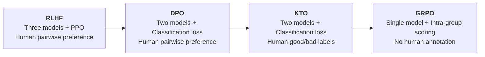
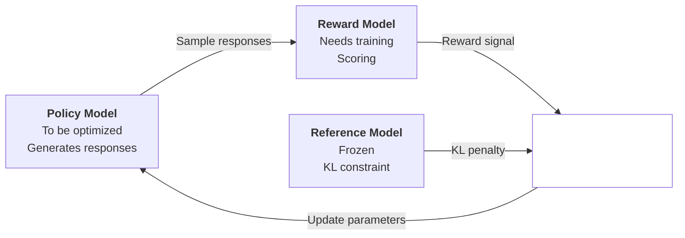
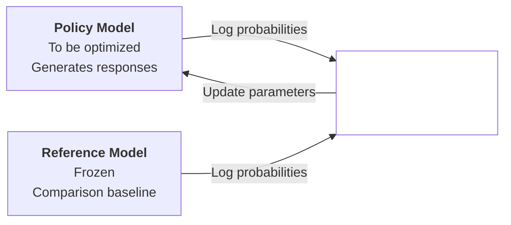
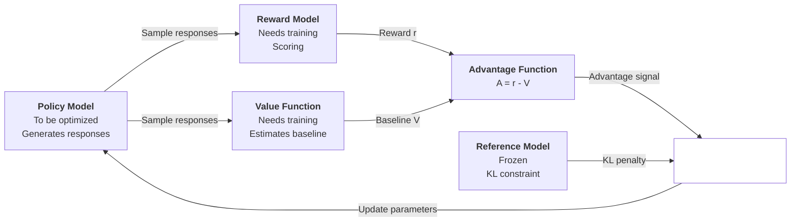
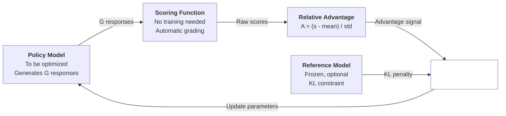

# Evolution of Alignment Methods

[RLHF](rlhf.md) uses a reward model and the PPO algorithm to learn from human preferences, significantly improving model helpfulness, truthfulness, and harmlessness. The success of GPT models demonstrated the value of RLHF to the world. On the other hand, the engineering cost of RLHF is equally non-negligible. Training requires simultaneously deploying and coordinating three models (policy model, reward model, reference model), PPO hyperparameter tuning is like walking a tightrope, and the shadow of reward hacking is ever-present. These pain points are not minor details — they directly determine whether RLHF can be deployed at scale in engineering practice.

In May 2023, Rafael Rafailov et al. from Stanford University published the paper "[Direct Preference Optimization: Your Language Model is Secretly a Reward Model](https://arxiv.org/abs/2305.18290)", revealing that in the three-model architecture of RLHF, the information of the reward model is already implicitly contained in the log probabilities of the policy model. Based on this discovery, they proposed **Direct Preference Optimization** (DPO). DPO bypasses explicit reward model training and directly optimizes the policy model using preference data, transforming a complex reinforcement learning problem into a simple classification problem, ushering in a new paradigm for alignment.

In February 2024, Kawin Ethayarajh et al. from Contextual AI drew inspiration from the Prospect Theory of Nobel laureates Daniel Kahneman and Amos Tversky, proposing the **KTO** (Kahneman-Tversky Optimization) method. KTO optimization only requires simple "good/bad" labels for responses, without the need for pairwise comparison preference data. This means model training can directly leverage naturally occurring internet feedback mechanisms like upvotes and downvotes, without relying on dedicated annotation teams.

In January 2025, DeepSeek released DeepSeek-R1, whose **Group Relative Policy Optimization** (GRPO) pushed alignment methods in a more fundamental new direction. GRPO targets tasks with clear correct answers, such as reasoning, mathematics, and code. The model can generate multiple candidate responses and learn by comparing their correctness, requiring no human preference data at all. DeepSeek-R1-Zero, trained from a base model using only GRPO, autonomously exhibited reasoning capabilities such as self-verification and backtracking correction, demonstrating the possibility of self-directed model learning.

*Figure: Evolution of alignment methods*

From RLHF to DPO, KTO, and GRPO, alignment methods have followed a path from vague to clear, from cumbersome to simplified. Each step along this evolutionary path answers the question of how to achieve alignment with fewer models, simpler data, and more stable training.

## Direct Preference Optimization

RLHF trains the policy model indirectly. First, a reward model $r_\phi$ is trained from preference comparison data $(x, y_w, y_l)$, then the PPO algorithm is used to maximize the reward model's score under a KL divergence constraint, producing the policy model $\pi_\theta$, as shown in the figure below. We want the policy model to learn how to distinguish good responses from bad ones, so we first create a ruler to measure quality (the reward model), then have the policy model repeatedly measure its own responses against it. The problem here is that the ruler itself may have errors, and the model may learn to align with the ruler's markings rather than becoming genuinely accurate.

*Figure: PPO optimization process*

Let's reconsider: is the reward model (that ruler) truly necessary? Since we already have preference data telling us "response A is better than response B," why not learn directly from these comparisons instead of first building a ruler and then going the long way around? In 2023, Rafael Rafailov proved that in the RLHF mathematical framework, the reward maximization under KL divergence constraint has a closed-form solution, where the optimal policy can be expressed as the reference model reweighted by reward values. Taking the logarithm of this closed-form solution allows us to solve for the reward function in reverse. With this one-to-one correspondence between the reward function and the optimal policy, there is no need to train a separate reward model to translate preference signals.

*Figure: DPO optimization process*

DPO is much simpler to implement than PPO, but understanding the mathematical motivation behind each step of the DPO algorithm still requires relatively complex formula derivation. Next, we will start from the derivation of implicit rewards, gradually derive DPO's loss function, and then implement the DPO training pipeline. The content in this section can be understood in contrast with the PPO algorithm. DPO is not an approximation of PPO; under the assumption that preference data satisfies the [Bradley-Terry model](./rlhf.md#bradley-terry-model) and the policy model has sufficient capacity to express the optimal policy, DPO is theoretically equivalent to PPO — just a different parameterization. Both optimize the same objective, only with different parameterization approaches. PPO explicitly learns a reward function $r_\phi$ and then uses reinforcement learning to optimize the policy model $\pi_\theta$, while DPO encodes the reward function implicitly in the policy model and directly optimizes $\pi_\theta$. DPO's optimization path is more direct, transforming a reinforcement learning problem into a classification problem, avoiding the instability of reinforcement learning, and reducing the three-model architecture to two models, significantly lowering the engineering cost of RLHF.

### Implicit Reward

The starting point of DPO is exactly the same as PPO: maximizing expected reward under a KL divergence constraint. The optimization objective can be formally expressed as:

$$\max_{\pi_\theta} \mathbb{E}_{x \sim \mathcal{D}, y \sim \pi_\theta(\cdot|x)} \left[ r(x, y) \right] - \beta \cdot \mathbb{D}_{KL} \left[ \pi_\theta(\cdot|x) \| \pi_{ref}(\cdot|x) \right]$$

This formula is essentially the same as the [PPO objective function](rlhf.md#proximal-policy-optimization) explained in the previous chapter. Here, $r(x, y)$ is the reward function, $\pi_{ref}$ is the reference model, and $\beta$ controls the strength of the KL constraint. The first term encourages the policy model to generate high-reward responses, while the second term penalizes the policy model for deviating too far from the reference model. The larger $\beta$ is, the stronger the constraint and the more conservative the policy model. The smaller $\beta$ is, the more freedom the policy model has, but the more likely it is to deviate from human intent. Expanding the [KL divergence penalty term](rlhf.md#kl-divergence-penalty) and substituting it in, the objective function becomes:

$$\max_{\pi_\theta} \mathbb{E}_{x, y} \left[ r(x, y) - \beta \log \frac{\pi_\theta(y|x)}{\pi_{ref}(y|x)} \right]$$

This optimization problem has been proven to have a closed-form solution, where the optimal policy can be computed directly without iterative search. The derivation uses variational calculus: for each instruction $x$, the objective function is varied with respect to $\pi_\theta(\cdot|x)$, and applying the Lagrange multiplier method under the probability normalization constraint $\sum_y \pi_\theta(y|x) = 1$ yields the closed-form solution for the optimal policy:

$$\pi^*(y|x) = \frac{1}{Z(x)} \pi_{ref}(y|x) \exp\left(\frac{1}{\beta} r^*(x, y)\right)$$

where $Z(x) = \sum_y \pi_{ref}(y|x) \exp\left(\frac{1}{\beta} r^*(x, y)\right)$ is called the partition function, ensuring probability normalization. The closed-form solution shows that the optimal policy is the reference model reweighted exponentially by the reward value: the higher the reward, the greater the amplification factor for that response, with $\beta$ controlling the degree of amplification. When $\beta \to \infty$, $\exp(r/\beta) \to 1$, and the optimal policy degenerates to the reference model. When $\beta \to 0$, the optimal policy degenerates to concentrating all probability on the highest-reward response.

From this point, PPO and DPO diverge. PPO uses policy gradient methods to iteratively improve the policy, approaching the optimal solution through actual sampled reward signals and gradient updates. DPO works backward directly from the closed-form solution: since the optimal policy can be expressed using the reward function, conversely, the reward function can also be expressed using the policy. Taking the logarithm of both sides of the closed-form solution and rearranging terms, we can solve for the reward function:

$$r^*(x, y) = \beta \log \frac{\pi^*(y|x)}{\pi_{ref}(y|x)} + \beta \log Z(x)$$

This inversion reveals that the reward function $r^*$ can be described by the log probability ratio of the policy model to the reference model. The partition function $Z(x)$ depends only on the instruction $x$, not on the response $y$. In preference comparison, we only care about the relative reward difference $r(x, y_w) - r(x, y_l)$, and $Z(x)$ cancels out when taking the difference, yielding the implicit reward formula:

$$[dpo_eq] r(x, y_w) - r(x, y_l) = \beta \log \frac{\pi^*(y_w|x)}{\pi_{ref}(y_w|x)} - \beta \log \frac{\pi^*(y_l|x)}{\pi_{ref}(y_l|x)}$$

### Loss Function

Deriving the expression for the implicit reward is the first step toward substituting it into the [Bradley-Terry model](./rlhf.md#bradley-terry-model). In the RLHF context, the Bradley-Terry model assumes that each response $(x, y)$ has a scalar reward value $r(x, y)$, and the probability that a human chooses the good response $y_w$ over the bad response $y_l$ depends on the difference between their reward values. The larger the reward gap, the higher the probability of choosing correctly; when rewards are close, the choice becomes uncertain. Formally, this maps the reward difference through a Sigmoid function to a probability:

$$P(y_w \succ y_l | x) = \sigma\left(r(x, y_w) - r(x, y_l)\right)$$

Substituting the implicit reward formula {{dpo_eq}} yields the preference probability:

$$P(y_w \succ y_l | x) = \sigma\left(\beta \log \frac{\pi_\theta(y_w|x)}{\pi_{ref}(y_w|x)} - \beta \log \frac{\pi_\theta(y_l|x)}{\pi_{ref}(y_l|x)}\right)$$

After substituting the implicit reward into the Bradley-Terry model, the preference probability is expressed entirely by the log probability ratio of the policy model and the reference model, without relying on any external reward model. The subsequent optimization simply needs to match the model's predicted preference probability with actual human preferences. Applying maximum likelihood estimation to the preference data, i.e., maximizing $\log P(y_w \succ y_l | x)$, which is equivalent to minimizing its negative value, gives DPO's loss function:

$$\mathcal{L}_{DPO} = -\mathbb{E}_{(x, y_w, y_l)} \left[ \log \sigma\left(\beta \log \frac{\pi_\theta(y_w|x)}{\pi_{ref}(y_w|x)} - \beta \log \frac{\pi_\theta(y_l|x)}{\pi_{ref}(y_l|x)}\right) \right]$$

For brevity, define the implicit reward $r_\theta(x, y) = \beta \log \frac{\pi_\theta(y|x)}{\pi_{ref}(y|x)}$, and the loss function can be succinctly written as:

$$\mathcal{L}_{DPO} = -\mathbb{E}_{(x, y_w, y_l)} \left[ \log \sigma\left(r_\theta(x, y_w) - r_\theta(x, y_l)\right) \right]$$

Looking at this loss function, attentive readers may notice it looks exactly like the [loss function for training the reward model](./rlhf.md#bradley-terry-model). The reward model loss is $-\log \sigma(r_\phi(x, y_w) - r_\phi(x, y_l))$, and DPO's loss is $-\log \sigma(r_\theta(x, y_w) - r_\theta(x, y_l))$ — the forms are identical, differing only in the source of the reward. PPO's reward model uses a separately trained $r_\phi$ to score, while DPO uses the log probability ratio $r_\theta$ between the policy model and the reference model to score. DPO updates the policy model parameters directly through this loss, all in one step. Below is a brief explanation of each term in the DPO loss function:

- **Implicit reward difference** ($r_\theta(x, y_w) - r_\theta(x, y_l)$): Measures the degree to which the model prefers the good response over the bad response. A positive difference indicates a higher implicit reward for the good response; the larger the difference, the stronger the preference. Similar to the advantage function $A(x, y)$ in PPO, it provides direction for policy updates. Good responses should receive a positive signal, bad responses a negative signal. The difference is that PPO's advantage function comes from the reward model score minus the value function baseline, while DPO's implicit reward difference comes directly from the log probability ratio of two models.

- **Sigmoid function** ($\sigma(\cdot)$): Maps the difference to the $(0, 1)$ interval, representing preference probability. When the difference is 0, the preference probability is 0.5 (random choice); when the difference is positive and large, the preference probability approaches 1 (almost certainly choosing the good response); when the difference is negative, the preference probability is below 0.5 (more likely to choose the bad response, indicating the model hasn't learned well yet).

- **Negative log-likelihood** ($-\log \sigma(\cdot)$): Standard binary cross-entropy loss. When the difference is positive and large, $\sigma$ output is close to 1, $-\log \sigma$ is close to 0, and the loss is low. When the difference is negative, $\sigma$ output is below 0.5, $-\log \sigma$ rises sharply, and the loss increases steeply. This asymmetry in penalty is important: the model giving a bad response a higher implicit reward is far more serious than giving a good response a slightly higher implicit reward, much like the consequences of a doctor's misdiagnosis being far more severe than being overly cautious.

- **KL constraint coefficient** ($\beta$): Controls the scale of the implicit reward. The larger $\beta$ is, the stronger the KL constraint, and the less the policy model deviates from the reference model. In PPO, the KL constraint is implemented through an explicit penalty term $\beta \cdot KL[\pi_\theta \| \pi_{ref}]$ and can be dynamically adjusted. In DPO, the KL constraint is implicitly encoded in the $\beta$ parameter, which is fixed during training — less flexible than PPO, but simpler to implement.

From an optimization perspective, the DPO loss drives model parameter updates in two directions simultaneously: increasing the implicit reward for good responses (making $\pi_\theta$ more likely to generate good responses) and decreasing the implicit reward for bad responses (making $\pi_\theta$ less likely to generate bad responses). However, these two directions are not symmetric. The implicit reward is defined as $r_\theta(x,y) = \beta(\log \pi_\theta(y|x) - \log \pi_{ref}(y|x))$, where the reference model $\pi_{ref}$ is frozen and does not participate in gradient computation. Therefore, although both $\log \pi_\theta$ and $\log \pi_{ref}$ appear in the formula, gradients only propagate through the $\log \pi_\theta$ path. Increasing the implicit reward for good responses can only be achieved by increasing $\log \pi_\theta(y_w|x)$, and decreasing the implicit reward for bad responses can only be achieved by decreasing $\log \pi_\theta(y_l|x)$. $\log \pi_{ref}$ is treated as a constant during backpropagation and receives no gradient signal.

### Training Pipeline

DPO's training data consists of preference comparison triples $(x, y_w, y_l)$, where $x$ is the instruction, $y_w$ is the chosen good response, and $y_l$ is the rejected bad response. The training pipeline can be broken down into the following four steps:

- **Step 1 Initialization**: The policy model $\pi_\theta$ is initialized from the SFT fine-tuned model, and the reference model $\pi_{ref}$ copies the same parameters and is frozen. Both start from the same point, and only $\pi_\theta$'s parameters are updated during training. This step is identical to the initialization in PPO.

- **Step 2 Compute log probabilities**: For each training sample $(x, y_w, y_l)$, the policy model computes the log probabilities of the good and bad responses, $\log \pi_\theta(y_w|x)$ and $\log \pi_\theta(y_l|x)$, respectively. The reference model computes $\log \pi_{ref}(y_w|x)$ and $\log \pi_{ref}(y_l|x)$ in `no_grad` mode. The difference from PPO is that in PPO, the policy model needs to autoregressively generate responses before computing probabilities, which can only be done sequentially. In DPO, probabilities are computed directly from the responses in the labeled data without requiring a generation step, allowing for full parallelization.

- **Step 3 Compute implicit rewards**: The implicit reward for the good response is $r_\theta(x, y_w) = \beta(\log \pi_\theta(y_w|x) - \log \pi_{ref}(y_w|x))$, and for the bad response is $r_\theta(x, y_l) = \beta(\log \pi_\theta(y_l|x) - \log \pi_{ref}(y_l|x))$. In PPO, rewards come from a separately trained reward model $r_\phi(x, y)$; in DPO, rewards come from the log probability ratio of the policy model and the reference model, requiring no reward model. This is the most fundamental difference between the two.

- **Step 4 Compute loss and backpropagate**: Substitute the implicit rewards into the DPO loss $\mathcal{L}_{DPO} = -\log \sigma(r_\theta(x, y_w) - r_\theta(x, y_l))$, compute gradients, and update the policy model parameters. The reference model remains frozen throughout training, serving as a baseline. PPO updates require a clipping mechanism to constrain update magnitude, a value function to estimate advantages, and a KL divergence penalty to prevent cumulative drift. DPO requires none of these — the classification loss is inherently well-behaved, the optimization process is naturally stable, and the policy collapse problems seen in PPO are essentially absent.

At the beginning of training, since the policy model and reference model share the same parameters ($\log \pi_\theta = \log \pi_{ref}$), the implicit reward difference is 0, and the initial loss is approximately $-\log \sigma(0) = -\log 0.5 \approx 0.693$. This initial value can serve as a diagnostic signal: if the loss at the start of training is significantly lower than 0.693, it indicates that the parameters of the policy model and reference model may not be consistent, and something went wrong during initialization. As training progresses, the policy model gradually learns to assign higher implicit rewards to good responses and lower implicit rewards to bad responses, and the loss decreases accordingly.

### Advantages and Limitations

Theoretically, DPO optimizes the same objective as RLHF and can find the same optimal solution under ideal conditions. However, DPO is fundamentally a binary cross-entropy loss, not reinforcement learning, and naturally avoids the instability and crash issues of the PPO optimization process. In engineering practice, DPO requires no reward model training, greatly simplifying hyperparameter tuning and the training pipeline, eliminating the cost of the reward model, significantly reducing memory requirements, and offering notable advantages in both simplicity and cost.

Compared to PPO, DPO has two main drawbacks. First, DPO loses the explicit KL constraint, using only the $\beta$ parameter to control the KL penalty, which is less flexible than PPO's explicit KL penalty term. In PPO, the KL penalty coefficient can be dynamically adjusted, while DPO's $\beta$ is fixed during training. Second, DPO's computation of log probabilities for long sequences can be unstable. Since the log probability of a sequence is the sum of log probabilities of individual tokens ($\log \pi(y|x) = \sum_t \log \pi(y_t | x, y_{<t})$), the longer the sequence, the more terms accumulate, the larger the absolute value of the log probability, causing the numerical range of the implicit reward $r_\theta = \beta(\log \pi_\theta - \log \pi_{ref})$ to expand accordingly, potentially leading to gradient explosion or numerical overflow.

## Kahneman-Tversky Optimization

DPO's training data consists of pairwise preference comparison triples $(x, y_w, y_l)$, where $x$ is the instruction, $y_w$ is the chosen good response, and $y_l$ is the rejected bad response. The collection cost for this data format is not low: for the same instruction, two candidate responses must first be generated, and then human annotators compare which one is better. Moreover, different annotators may have inconsistent judgment standards, and the relative information of "how much better" is difficult to quantify.

In February 2024, Contextual AI drew inspiration from the Prospect Theory of Nobel laureates Daniel Kahneman and Amos Tversky, proposing the KTO (Kahneman-Tversky Optimization) method. Prospect Theory is a foundational achievement in behavioral economics, describing human decision-making behavior under risk. One of Prospect Theory's core findings is **Loss Aversion**, which refers to people's sensitivity to losses being far greater than their sensitivity to equivalent gains. The pain of losing $100 is about twice the pleasure of finding $100. This asymmetry profoundly influences human value judgments.

KTO draws inspiration from Prospect Theory in two aspects. On one hand, the concept of loss aversion is incorporated into the design of the loss function. In alignment scenarios, the contribution of "good responses" and "bad responses" to model optimization should be asymmetric: generating a bad response should incur a greater penalty than the "benefit" of generating a good response. This differs from DPO's symmetric treatment of good/bad responses and is more aligned with how humans perceive quality — the consequences of "doing something wrong" deserve more attention than the benefits of "doing something right." On the other hand, Prospect Theory's description of human decision-making also reveals that human judgments of responses tend to be absolute rather than relative. When you click "like" or "dislike" on an online shopping review, you don't need to first look at another alternative response before making a comparison. Similar feedback mechanisms are ubiquitous on the internet today, and KTO leverages this absolute judgment to simplify training data requirements, allowing model training to directly utilize existing feedback data from the internet.

### Loss Function

KTO adopts DPO's definition of implicit reward $r_\theta(x, y) = \beta \log \frac{\pi_\theta(y|x)}{\pi_{ref}(y|x)}$, but changes the loss function from "pairwise comparison" to "single-point evaluation." For good responses (`label = desirable`), the loss function encourages increasing the implicit reward $\mathcal{L}_{+} = 1 - \sigma(r_\theta(x, y) - z)$; for bad responses (`label = undesirable`), the loss function encourages decreasing the implicit reward $\mathcal{L}_{-} = 1 - \sigma(z - r_\theta(x, y))$. The total KTO loss is a weighted sum of the good and bad components:

$$\mathcal{L}_{KTO} = \lambda_+ \cdot \mathbb{E}_{(x, y) \sim \mathcal{D}_+} [\mathcal{L}_{+}] + \lambda_- \cdot \mathbb{E}_{(x, y) \sim \mathcal{D}_-} [\mathcal{L}_{-}]$$

Let's unpack each term in this formula to understand their design intent:

- **Implicit reward** ($r_\theta(x, y)$): Exactly the same definition as in DPO, the log probability ratio between the policy model and the reference model. This value measures the degree to which the policy model "wants to generate" this response compared to the reference model.

- **Reference point** ($z$): Corresponds to the "status quo reference point" in Prospect Theory, serving as the baseline against which the model judges whether a response is good or bad. Typically set to 0, meaning on par with the reference model. Responses with implicit rewards above the reference point are good, and those below are bad.

- **Good response loss** ($\mathcal{L}_{+}$): $1 - \sigma(r_\theta - z)$ encourages the implicit reward to be above the reference point. When $r_\theta \gg z$, $\sigma(r_\theta - z) \approx 1$, and the loss is close to 0; when $r_\theta < z$, the loss is close to 1. This drives the model to assign higher generation probability to good responses.

- **Bad response loss** ($\mathcal{L}_{-}$): $1 - \sigma(z - r_\theta)$ encourages the implicit reward to be below the reference point. Note that the positions of $z$ and $r_\theta$ are swapped here. When $r_\theta \ll z$, $\sigma(z - r_\theta) \approx 1$, and the loss is close to 0; when $r_\theta > z$, the loss is close to 1. This drives the model to assign lower generation probability to bad responses.

- **Asymmetric weights** ($\lambda_+$ and $\lambda_-$): Correspond to the concept of loss aversion in Prospect Theory. Typically, $\lambda_- > \lambda_+$ is set, meaning bad responses incur a heavier penalty than the reward received by good responses. This is consistent with human decision-making behavior: avoiding mistakes has higher priority than pursuing correctness.

From an optimization perspective, the KTO loss, like DPO, simultaneously drives model parameter updates in two directions: increasing the implicit reward for good responses (making $\pi_\theta$ more likely to generate good responses) and decreasing the implicit reward for bad responses (making $\pi_\theta$ less likely to generate bad responses). The difference from DPO is that these two directions are optimized independently — good and bad responses do not need to come from the same instruction or even be paired in the same batch. This provides tremendous flexibility in data collection.

### Training Pipeline

KTO's training data consists of single-point label pairs $(x, y, \text{label})$, where $x$ is the instruction, $y$ is the response, and $\text{label} \in \{$ `desirable` $, $`undesirable` $\}$ represents the "good/bad" label. The training pipeline can be broken down into the following four steps:

- **Step 1 Initialization**: The policy model $\pi_\theta$ is initialized from the SFT fine-tuned model, and the reference model $\pi_{ref}$ copies the same parameters and is frozen. This step is identical to PPO and DPO.

- **Step 2 Compute log probabilities**: For each training sample $(x, y, \text{label})$, the policy model computes the log probability $\log \pi_\theta(y|x)$ of the response, and the reference model computes $\log \pi_{ref}(y|x)$ in `no_grad` mode. The difference from DPO is that DPO needs to compute log probabilities for both good and bad responses simultaneously, while KTO only needs to compute the log probability for one response.

- **Step 3 Compute implicit reward**: $r_\theta(x, y) = \beta(\log \pi_\theta(y|x) - \log \pi_{ref}(y|x))$. This step is identical to DPO.

- **Step 4 Compute loss and backpropagate**: Select the loss function based on the label. For good responses, compute $\mathcal{L}_{+} = 1 - \sigma(r_\theta - z)$; for bad responses, compute $\mathcal{L}_{-} = 1 - \sigma(z - r_\theta)$. Compute the weighted sum, calculate gradients, and update the policy model parameters. The difference from DPO is that DPO's loss depends on paired good/bad responses for the same instruction, while KTO's loss computes independently for each sample without requiring pairing.

At the beginning of training, since the policy model and reference model share the same parameters ($\log \pi_\theta = \log \pi_{ref}$), the implicit reward is 0. For both good and bad responses, the loss is approximately $1 - \sigma(0) = 0.5$. As training progresses, the policy model gradually learns to assign higher implicit rewards to good responses and lower implicit rewards to bad responses, and both parts of the loss decrease simultaneously.

### Advantages and Limitations

KTO's biggest advantage is the significantly reduced data requirements. Only "good/bad" labels are needed, no pairwise comparisons required. This means we can directly leverage naturally occurring large-scale feedback data such as user upvotes/downvotes, without the need to organize dedicated annotation teams for pairwise comparisons, and can easily scale to millions of data points. Additionally, the two weight parameters $\lambda_+$ and $\lambda_-$ provide greater flexibility, allowing adjustment of the emphasis on good versus bad responses based on the specific scenario. KTO can also be combined with DPO: using DPO loss for paired data and KTO loss for single-point data, maximizing the utilization of different data formats.

KTO's limitations are also worth noting. First, in terms of information content, "good/bad" labels lose relative information compared to pairwise comparisons. The signal of "how much better the good response is than the bad response" in DPO cannot be expressed in KTO. Second, in practice, there is the issue of data imbalance: real-world user feedback data is often severely skewed (e.g., 90% of responses are labeled "good"), requiring careful adjustment of weights and sampling strategies to address.

Theoretically, DPO has the Bradley-Terry model providing theoretical guarantees, while KTO is a heuristic design based on Prospect Theory, belonging to the category of rules of thumb. Although production practice has shown it aligns with human actual preference perception, it must be acknowledged that KTO is less theoretically rigorous than DPO.

## Group Relative Policy Optimization

DPO bypassed the reward model, KTO simplified the data format — both reduced the barrier to RLHF from different angles. However, neither has escaped the need for human-annotated preference data. Whether pairwise comparisons or good/bad labels, someone still has to tell the model what is correct. This is not merely a consideration of data collection cost; it also implies the question of whether models can evolve independently without human involvement.

In January 2025, DeepSeek released the DeepSeek-R1 model, whose **Group Relative Policy Optimization** (GRPO) broke through the limitation of relying on human preference data. For tasks with clear correct answers, such as reasoning, mathematics, and code, GRPO allows the model to generate multiple candidate responses and learn by comparing their correctness, requiring no human preference data at all.

### From PPO to GRPO

Reviewing the PPO training process, it simultaneously maintains three models: a policy model, a reward model, and a reference model. The policy model is responsible for generating responses, the reward model is responsible for scoring, and the reference model is responsible for the KL constraint. PPO uses an advantage function $A(x, y) = r(x, y) - V_\phi(x)$ to determine how much better a given response is than average, and then uses the clipped probability ratio to constrain the update magnitude. The value function $V_\phi$ itself is also a model that needs separate training; its role is to estimate, for a given instruction $x$, the approximate average quality of responses, serving as a baseline to measure the quality of any specific response. Therefore, in some materials, PPO's three-model architecture is described as a four-model architecture.

*Figure: PPO optimization process under the four-model architecture*

PPO uses a value function (the baseline estimating average quality) to compute advantages, essentially asking how much better this response is than average. We can obtain this information differently: have the model generate multiple responses to the same question, and then directly compare among these responses. If these comparisons have clear judgment criteria, then there is no need for a value function to estimate the average level. The scores of other responses within the group serve as a natural baseline. GRPO leverages this intra-group scoring relative ranking to replace the value function. The meaning of **Group Relative** is precisely that the advantage is not relative to the estimate of a value function, but relative to the actual performance of other responses within the same group.

*Figure: GRPO optimization process (core is the policy model, reference model is optional)*

Another difference between GRPO and PPO lies in the source of the reward signal. PPO's reward signal comes from a reward model $r_\phi$ that requires separate training, which learns human preferences to score responses. GRPO's reward signal comes from the task itself. For tasks where correctness can be objectively judged — such as whether a math answer is right or whether code passes tests — these judgments can be automated without human involvement. This means GRPO requires no human-annotated data and no reward model. Note that GRPO eliminates the reward model in a different way from DPO. DPO encodes the reward function implicitly in the policy model, using the log probability ratio of the policy model and reference model to replace the reward model. GRPO fundamentally eliminates the reward model altogether — it does not need any model to score responses.

Finally, although GRPO's algorithm framework includes an optional reference model $\pi_{\text{ref}}$ for the KL constraint, DeepSeek-R1's practice chose not to enable the KL penalty, in which case even the reference model does not need to be loaded, and the policy model is the only model that needs training.

### Relative Advantage

GRPO training begins with group generation. For a given instruction $x$, the policy model generates $G$ candidate responses $\{y_1, y_2, \ldots, y_G\}$, and then computes a score $s_i$ for each response using a rule function. The definition of the rule function depends on the task type — for reasoning tasks, it determines whether the final answer is correct; for code tasks, it checks whether the test cases pass; for math tasks, it checks whether the result matches the standard answer. The advantage score for each response is not its absolute score, but its performance relative to the group average:

$$A_i = \frac{s_i - mean(\{s_1, \ldots, s_G\})}{std(\{s_1, \ldots, s_G\})}$$

This normalization process is logically consistent with the computation of the advantage function in PPO. Subtracting the mean eliminates the effect of absolute level, and dividing by the standard deviation normalizes the advantage into a dimensionless relative value. The difference between the two lies in the source of the baseline. PPO's baseline is the estimate from the value function $V_\phi(x)$, which is a model requiring separate training, providing a prediction of average quality. GRPO's baseline is $mean(\{s_1, \ldots, s_G\})$, the actual average score within the group — a statistic that requires no training. The denominator $std$ ensures that advantages are comparable across different instructions and problems of varying difficulty. A positive advantage means the response is better than the group average; a negative advantage means it is worse.

A noteworthy detail is when all responses in the group have the same score, $std = 0$, making the denominator of the normalization formula zero. This means all advantages are undefined. This scenario is common in early training. If the base model is still weak, it may generate equally wrong responses to the same question, resulting in identical scores across the group — like a class of elementary school students taking a college exam, all scoring zero. This is known as GRPO's cold start problem, referring to the situation where the model is too weak to obtain effective learning signals from intra-group comparisons. DeepSeek mitigated the cold start problem in practice by increasing the sampling temperature to enhance intra-group diversity.

### Loss Function

With the relative advantage, GRPO can use policy gradient methods to update the policy model. The loss function derivation starts from the basic [policy gradient method](./rlhf.md#policy-gradient-method), where the goal of policy gradient is to maximize the expected reward, equivalent to minimizing the negative policy gradient loss:

$$[pg_loss]\mathcal{L} = -\mathbb{E}_{x, y \sim \pi_\theta} \left[ A \cdot \log \pi_\theta(y|x) \right]$$

Here $A$ is the advantage function. In PPO, $A$ is estimated by the value function, and an importance sampling ratio $\frac{\pi_\theta(y|x)}{\pi_{old}(y|x)}$ is used to correct distribution shift. GRPO makes two substitutions: first, it replaces the value function estimate with the relative advantage $A_i$. $A_i = (s_i - \hat{\mu}) / \hat{\sigma}$ is computed directly from the same group's samples, requiring no value function training. Second, it retains the importance sampling ratio $\frac{\pi_\theta(y|x)}{\pi_{\text{old}}(y|x)}$ to correct distribution shift, consistent with PPO's approach. The reference model $\pi_{\text{ref}}$ only appears in the subsequent KL penalty term and does not participate in the policy gradient term substitution. Mathematically, $\log \frac{\pi_\theta}{\pi_{\text{ref}}} = \log \pi_\theta - \log \pi_{\text{ref}}$, which is equivalent to subtracting a constant term $\log \pi_{\text{ref}}$ unrelated to policy parameters from the original policy gradient. This does not change the gradient direction but provides an anchor against policy drift. When $\pi_{\text{ref}}$ is the policy model at the start of training, this log probability ratio measures the degree of policy shift from the starting point. Substituting these two replacements into the policy gradient loss formula {{pg_loss}}, averaging over $G$ responses within the group, and adding a clipping mechanism consistent with PPO's form, we obtain GRPO's policy gradient loss:

$$[grpo_loss]\mathcal{L}_{GRPO} = -\mathbb{E} \left[ \frac{1}{G} \sum_{i=1}^{G} \min\left(A_i \cdot \frac{\pi_\theta(y_i|x)}{\pi_{\text{old}}(y_i|x)}, clip\left(\frac{\pi_\theta(y_i|x)}{\pi_{\text{old}}(y_i|x)}, 1-\epsilon, 1+\epsilon\right) \cdot A_i\right) \right] + \beta \cdot \mathbb{D}_{\text{KL}}[\pi_\theta \| \pi_{\text{ref}}]$$

The KL constraint penalty term in the loss function uses John Schulman's approximation method:

$$\mathbb{D}_{\text{KL}}[\pi_\theta \| \pi_{\text{ref}}] \approx \frac{\pi_{\text{ref}}(o)}{\pi_\theta(o)} - \log \frac{\pi_{\text{ref}}(o)}{\pi_\theta(o)} - 1$$

The exact KL divergence requires summing over all tokens to compute the expectation $\mathbb{E}_{x \sim \pi_\theta}[\log \frac{\pi_\theta(x)}{\pi_{\text{ref}}(x)}]$, which is computationally expensive. Schulman's approximation method uses a single-sample estimate instead, directly taking the currently sampled token, computing its log probability ratio $\log \frac{\pi_{\text{ref}}(o)}{\pi_\theta(o)}$, and obtaining a non-negative approximation through the formula above. This approximation is actually a single-sample unbiased estimate of $\mathbb{D}_{KL}[\pi_\theta \| \pi_{\text{ref}}]$, and since $f(x) = x - \log x - 1$ is always non-negative for $x > 0$, the approximation never becomes negative, making it more stable than directly using $\log \frac{\pi_\theta}{\pi_{\text{ref}}}$ as the KL estimate. This method comes from Schulman's internal OpenAI technical report from 2020, "[Approximating KL Divergence](http://joschu.net/blog/kl-approx.html)", which, although not formally published as a paper, has been widely adopted in RLHF practice for products like InstructGPT and ChatGPT.

GRPO's loss function is similar in form to PPO's policy gradient objective, though its reliance on the KL constraint is reduced. PPO must rely on the KL penalty to prevent the policy from deviating too far from the reference model, because the absolute scores given by the reward model make it easy for the model to find exploitative strategies, generating responses with high reward model scores but no practical meaning. GRPO's rewards come from the task's own rule functions (e.g., whether the answer is correct), which are difficult to exploit, so the need for the KL constraint is weaker than in PPO. In the practice of DeepSeek-R1 and [DAPO](https://arxiv.org/abs/2503.14476), $\beta = 0$ is set, meaning no KL penalty is used at all, and the reference model does not need to be loaded. However, in other scenarios (such as tasks with higher openness), a KL constraint with $\beta > 0$ remains an important safeguard for stable training.

From an optimization perspective, the policy gradient term of the GRPO loss drives the policy model in two directions: increasing the generation probability of responses with positive advantage (since when $A_i > 0$, reducing the loss is equivalent to increasing $\log \frac{\pi_\theta(y_i|x)}{\pi_{\text{ref}}(y_i|x)}$, i.e., steering the policy toward these responses), and decreasing the generation probability of responses with negative advantage (since when $A_i < 0$, reducing the loss is equivalent to decreasing this ratio, i.e., steering the policy away from these responses). The strength of these two directions is determined by the magnitude of $|A_i|$. The larger the absolute value of the advantage, the stronger the influence of that response on the policy update. The KL penalty term serves as an anchor: no matter how the policy gradient term drives updates, the KL term pulls the policy back toward the reference model, preventing excessive drift.

### Training Pipeline

GRPO's training data consists of instruction sets $\{x\}$, requiring no human-annotated preference data or good/bad labels. The training pipeline can be broken down into the following steps:

- **Step 1 Initialization**: The policy model $\pi_\theta$ is initialized from a pretrained or SFT-fine-tuned model. If the KL constraint is enabled ($\beta > 0$), a frozen copy of the policy model is created as the reference model $\pi_{\text{ref}}$. If $\beta = 0$, no reference model is needed, and no additional training of a reward model or value function is required.

- **Step 2 Group generation**: For each training instruction $x$, the policy model generates $G$ candidate responses $\{y_1, y_2, \ldots, y_G\}$ through multiple sampling. A higher temperature is used during sampling to ensure intra-group diversity, preventing all candidate responses from being identical or too similar, which would result in low discrimination in intra-group scoring and weaken the relative advantage signal. The difference from PPO is that PPO generates only one response per update, while GRPO generates multiple responses for intra-group comparison.

- **Step 3 Intra-group scoring**: For each response, a score $s_i$ is computed using a rule function. The rule function is defined according to the task type, such as determining whether the final answer is correct in math tasks (correct = 1 point, incorrect = 0 points). The difference from PPO is that PPO's scoring comes from a separately trained reward model $r_\phi$, while GRPO's scoring comes from the task's own rule functions, requiring no scoring model training.

- **Step 4 Compute relative advantage**: Normalize the scores to relative advantages $A_i = (s_i - mean) / std$. The difference from PPO is that PPO's advantage function $A = r - V_\phi$ depends on value function estimates, while GRPO's relative advantage depends only on intra-group statistics, requiring no value function.

- **Step 5 Policy update**: Substitute the relative advantages into the GRPO loss function {{grpo_loss}}, compute gradients, and update the policy model parameters. The difference from PPO is that PPO requires a clipping mechanism to constrain update magnitude, a value function to estimate advantages, and must use a KL divergence penalty to prevent policy drift. GRPO uses the normalization of relative advantage to replace the clipping mechanism and baseline estimation, and uses rule-based rewards to reduce dependence on the KL constraint ($\beta$ can be 0).

At the beginning of training, if the base model is weak, the candidate responses within a group may all be incorrect, resulting in identical scores across the board. In this case, $std = 0$, the relative advantage is undefined, and the model cannot learn anything from that instruction. As training progresses, the model gradually learns to generate correct responses, the cold start problem of GRPO training is alleviated, score differences begin to appear within groups, the relative advantage signal becomes effective, and training proceeds on track.

### Emergence of Reasoning Ability

DeepSeek-R1 achieved self-evolution of reasoning ability using GRPO, with the most striking finding being the **emergence** of reasoning capability. DeepSeek-R1-Zero was trained directly from a base model using only GRPO, without any SFT data. During training, the model evolved from initially generating only short, direct responses to gradually developing three advanced reasoning behaviors:
- **Self-Verification**: After giving an answer, the model automatically goes back to check whether there are errors in the reasoning process.
- **Self-Reflection**: When the model finds that a reasoning path is not working, it proactively abandons it and tries other paths.
- **Multi-path Exploration**: The model attempts multiple different solution strategies for the same problem and then selects the best one.

These behaviors were never explicitly programmed or trained — they emerged purely from GRPO's reward signals. The mechanism of emergence can be understood from GRPO's training process. GRPO generates multiple candidate responses for each problem: correct responses receive positive advantages, incorrect responses receive negative advantages. This means the model learns not only which reasoning paths lead to correct answers, but also which reasoning patterns lead to errors. As the model accumulates sufficient experience, it begins to develop metacognitive abilities: proactively checking whether the current path is reliable during reasoning, promptly pivoting when a path proves unviable, and trying multiple solution approaches for the same problem to find the optimal solution. These abilities were never present in the training objective, but they are a natural consequence of efficient exploration and exploitation of correct reasoning paths.

DeepSeek-R1's training comes in two versions. The DeepSeek-R1-Zero version demonstrated the emergence of reasoning ability, but its output format and readability were not ideal. DeepSeek-R1 added a small amount of SFT data (about 8,000 examples) on top of R1-Zero to standardize the output format and improve readability, while fully maintaining the reasoning ability.

### Advantages and Limitations

GRPO's primary advantage is its self-evolution capability: the model can autonomously improve its reasoning ability without human preference data. The reward signal comes from the correctness of the task itself, not from human subjective judgment, allowing training data to be generated infinitely. The emergence of reasoning ability demonstrated by DeepSeek-R1 further proves that GRPO can not only optimize existing capabilities but also give rise to new reasoning behaviors. In terms of model architecture, GRPO completely eliminates the reward model and value function, and the reference model becomes optional — in practice, training often requires only a single policy model.

However, GRPO also has clear limitations. It is not a universal alignment method. Compared to PPO, DPO, KTO, and other methods, GRPO's applicability is restricted: its reward signal depends on tasks having clear correct answers, and for open-ended dialogue, creative writing, and other tasks without objective standards, GRPO cannot provide effective reward signals. Another drawback of GRPO is the significant sampling overhead. GRPO requires generating multiple candidate responses for each instruction (typically $G = 4 \sim 16$), making inference costs $G$ times that of ordinary training.

## Chapter Summary

This article starts from the limitations of RLHF and systematically introduces three alignment methods: DPO, KTO, and GRPO. The development trend of alignment methods can be summarized as simpler, more autonomous, and more efficient. From RLHF's three-model architecture (policy model, reward model, reference model) to DPO's two models, and then to GRPO's single-model self-evolution, the barrier to alignment training continues to decrease. However, each method has its limitations. DPO still relies on paired data, KTO's theoretical guarantees are weaker, and GRPO is only applicable to tasks with objective standards. How to maintain simplicity while covering a wider range of task types is the main direction for the next phase of alignment method research.

## Exercises

1. Starting from RLHF's optimal policy expression $\pi^*(y|x) = \frac{1}{Z(x)} \pi_{ref}(y|x) \exp\left(\frac{1}{\beta} r^*(x, y)\right)$, derive DPO's implicit reward expression $r^*(x, y) = \beta \log \frac{\pi^*(y|x)}{\pi_{ref}(y|x)} + \beta \log Z(x)$, and explain why the partition function $Z(x)$ can be ignored in preference comparison.

   

   
Reference Answer

   Take the logarithm of both sides of the closed-form solution:

   $$\log \pi^*(y|x) = \log \pi_{ref}(y|x) + \frac{1}{\beta} r^*(x, y) - \log Z(x)$$

   Rearranging terms:

   $$\frac{1}{\beta} r^*(x, y) = \log \pi^*(y|x) - \log \pi_{ref}(y|x) + \log Z(x)$$

   Multiply both sides by $\beta$:

   $$r^*(x, y) = \beta \log \frac{\pi^*(y|x)}{\pi_{ref}(y|x)} + \beta \log Z(x)$$

   $Z(x)$ can be ignored because it depends only on the instruction $x$, not on the response $y$. In preference comparison, we only care about the relative reward difference $r(x, y_w) - r(x, y_l)$:

   $$r(x, y_w) - r(x, y_l) = \beta \log \frac{\pi^*(y_w|x)}{\pi_{ref}(y_w|x)} + \beta \log Z(x) - \beta \log \frac{\pi^*(y_l|x)}{\pi_{ref}(y_l|x)} - \beta \log Z(x)$$

   $\beta \log Z(x)$ cancels out when taking the difference, so there is no need to know the specific value of $Z(x)$.

   

2. Analyze the main differences between DPO and KTO: What are the differences in data format? What is the essential difference in the loss function? What scenarios is each suited for?

   

   
Reference Answer

   **Data format difference**: DPO requires pairwise preference comparison data $(x, y_w, y_l)$, i.e., paired good and bad responses for the same instruction; KTO only requires single-point label data $(x, y, \text{label})$, i.e., an instruction-response pair with a "good/bad" label. KTO's data is easier to obtain (e.g., user upvotes/downvotes), but loses the relative information of "how much better the good response is than the bad response" present in DPO.

   **Essential difference in loss function**: DPO's loss function $-\log \sigma(r_\theta(y_w) - r_\theta(y_l))$ focuses on the **difference** in implicit rewards between good and bad responses, a binary cross-entropy loss; KTO's loss function $\lambda_+ \cdot (1 - \sigma(r_\theta - z)) + \lambda_- \cdot (1 - \sigma(z - r_\theta))$ computes losses independently for good and bad responses, with asymmetric weights ($\lambda_- > \lambda_+$), reflecting the loss aversion of Prospect Theory.

   **Applicable scenarios**: DPO is suitable for scenarios with dedicated annotation teams capable of organizing pairwise comparisons; KTO is suitable for scenarios with existing large-scale user feedback data (e.g., upvotes/downvotes) where data collection cost is a concern.

   

3. Analyze which alignment method should be chosen for the following scenarios, and explain the reasoning.

   

   
Reference Answer

   - **Math competition problem solving (with standard answers)**: GRPO. Math problems have clear correct answers, GRPO can automatically obtain reward signals through intra-group scoring without human preference data, and the emergence of reasoning ability helps the model develop multi-step reasoning strategies.

   - **Customer service dialogue system (with user satisfaction feedback)**: KTO. User satisfaction feedback is naturally in the form of "good/bad" labels (satisfied/unsatisfied), directly applicable to KTO's single-point label mode. The data volume is large and collection cost is low, and KTO can fully leverage this feedback.

   - **Code assistant (verifiable through unit tests)**: GRPO or a combination with DPO. Code can be automatically verified for correctness through unit tests, and GRPO can use test results as reward signals; meanwhile, code style preferences (such as readability, comment quality) require human judgment, which can be handled by DPO.

   - **Creative writing (subjective preferences)**: DPO or RLHF. Creative writing has no objective correctness standards, so GRPO cannot provide effective reward signals. DPO is suitable for scenarios with dedicated annotation teams for pairwise comparisons; if finer control and dynamic adjustment are needed, RLHF is more appropriate.

   

