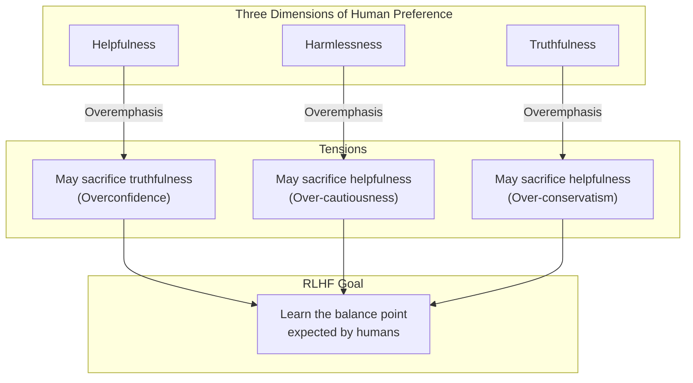
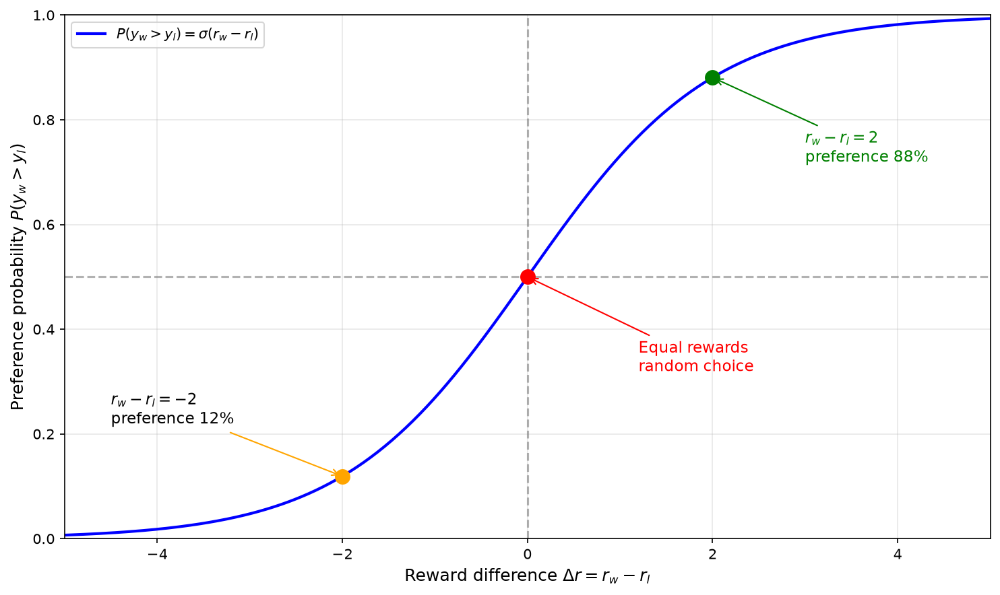
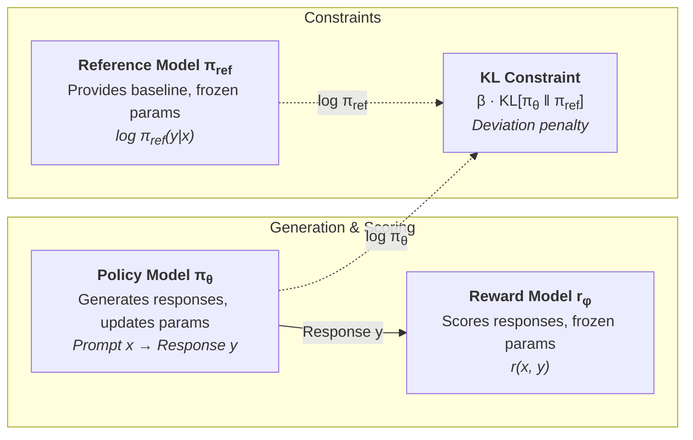
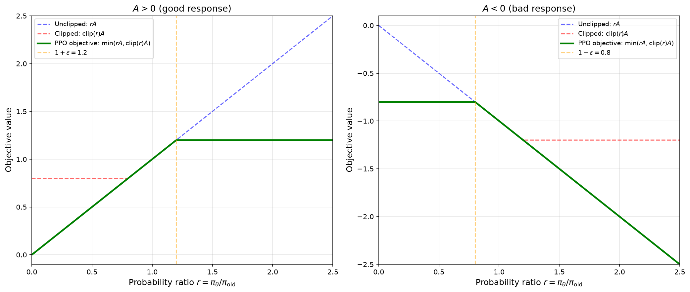

# Reinforcement Learning from Human Feedback

In [supervised fine-tuning](../pretraining/supervised-finetuning.md), we explored how to transform a pretrained model into a usable AI assistant through supervised learning. SFT enables models to learn how to answer questions, but does the model truly understand what it is answering? The answer is no. A model can learn to generate grammatically correct and informationally accurate responses, yet may deviate significantly from human expectations in terms of style, safety, helpfulness, and other dimensions. Human preference is complex and multi-dimensional, and it is difficult to fully capture it with limited SFT data alone.

**Reinforcement Learning from Human Feedback** (RLHF) was designed precisely to address this issue. It allows models to learn from human preference feedback rather than merely imitating human responses. In 2022, OpenAI's paper "[Training Language Models to Follow Instructions with Human Feedback](https://arxiv.org/abs/2203.02155)" systematically described the three-stage framework of RLHF for aligning models with human needs: supervised fine-tuning, reward modeling, and proximal policy optimization. This subsequently became the standard training paradigm for almost all instruction-following models.

## Limits of SFT Capabilities

To understand the value of RLHF, we must first clearly explain the limitations of SFT. Imagine a newly hired customer service representative who is given a standard script that says "for refund issues, reply..." and "for delivery delays, reply...". The new employee memorizes the script thoroughly and handles common questions with ease. But one day, an agitated customer starts yelling at them, and following the standard script only makes the customer angrier. In this story, the new employee merely imitates the scripted responses without understanding what the customer truly cares about.

SFT is essentially a form of behavior cloning, where the model learns patterns of behavior from human experts. This approach struggles to capture implicit preferences. Many aspects of human preference are "only felt, not expressed" — what kind of response is more helpful, what tone is friendlier — these preferences are difficult to convey through limited examples. SFT also cannot endow the model with exploration capability; it is supervised learning, where the model can only learn response patterns present in the training data and cannot autonomously explore better response strategies not seen in the training data.

Human demands on models certainly go beyond simply mimicking correct standard answers. The InstructGPT paper categorizes human needs into three core dimensions: **Helpfulness**, **Truthfulness**, and **Harmlessness**. Helpfulness requires that responses directly address the user's question, provide valuable information, and avoid redundancy. Truthfulness requires factual accuracy and avoidance of fabricated information (hallucinations). Harmlessness requires avoiding harmful content, rejecting inappropriate requests, and avoiding bias and discrimination.

There is inherent tension among these three dimensions. An overly cautious model may score high on harmlessness but low on helpfulness, refusing to answer any question that carries even a slight risk, which naturally dissatisfies users. An overly confident model may score high on helpfulness but compromise truthfulness, fabricating uncertain information to appear "knowledgeable" — such models are also not favored by users. RLHF aims to teach the model to find a balance point among these dimensions that aligns with human preferences, avoiding extremes in any single dimension.

*Figure: RLHF aims to balance the tension among three dimensions*

## Reward Model

Now we have clarified the motivation for RLHF: moving from imitation to preference learning. However, "preference" is an abstract concept, and computers cannot directly understand which response humans prefer. We need to transform human preference judgments into a computable signal — this is the role of the reward model. The reward model acts as a judge: it receives an instruction and a response, and outputs a score. The higher the score, the more likely humans would prefer that response. This score will serve as the reward signal for subsequent reinforcement learning.

### Preference Comparison Data

The first step in training a reward model is collecting preference comparison data. Unlike SFT data, which takes the form of instruction-response pairs, preference comparison data presents the same instruction with several different responses generated by the model, and human annotators indicate which one is better — without needing to write responses themselves. This data collection approach involves several noteworthy design decisions:

- **Sampling diversity**: Although each comparison involves choosing between two responses, the model should generate multiple candidate responses per instruction (e.g., 4-9), then annotators rank them or perform pairwise comparisons. Generating only two candidates yields limited information per preference data point.
- **Annotator consistency**: Different annotators may give different judgments for the same comparison. In practice, multiple annotators independently label the data, and majority voting or consistency scoring is used.
- **Instruction diversity**: Coverage should span various task types such as Q&A, creative writing, code, and reasoning, to ensure the reward model is not only proficient at evaluating one type of response.

InstructGPT used approximately 33K preference comparison data points to train the reward model. This quantity is far smaller than the trillions of tokens used in pretraining, yet it is sufficient for the model to learn human preferences. The reason is that preference comparison data has very high information density — each comparison not only tells the model "which one is better" but also implicitly indicates "in what aspect it is better" and "how much better."

### Bradley-Terry Model

With preference comparison data indicating "response A is better than response B," we can derive a continuous function that predicts preference probabilities for new data. In 1952, statisticians Ralph A. Bradley and Milton E. Terry proposed an elegant solution in their paper "[Rank Analysis of Incomplete Block Designs: I. The Method of Paired Comparisons](https://doi.org/10.1093/biomet/39.3-4.324)" — the **Bradley-Terry model**. Originally designed for analyzing win/loss probabilities in sports competitions, given the historical records of two teams, the model can predict the probability of one beating the other in a future match. Seven decades later, this model found a new application in RLHF: given a preference comparison between two responses, predict the probability that a human would choose one over the other. The Bradley-Terry model assumes that each response $y$ has an underlying true reward value $r^*(x, y)$, and that the probability of a human preferring $y_w$ over $y_l$ increases with the difference between their rewards. Mathematically, this probability is expressed as:

$$P(y_w \succ y_l | x) = \frac{\exp(r^*(x, y_w))}{\exp(r^*(x, y_w)) + \exp(r^*(x, y_l))}$$

In this formula, the numerator $\exp(r^*(x, y_w))$ is the exponentiated reward of response $y_w$ (ensuring positivity and amplifying higher rewards), while the denominator is the sum of exponentiated rewards of both responses. The overall formula can be interpreted as the probability of $y_w$ being chosen equals its "degree of preference" divided by the "total degree of preference," analogous to a candidate's vote share in an election. Dividing both numerator and denominator by $\exp(r^*(x, y_l))$ simplifies the formula into a more compact Sigmoid form:

$$P(y_w \succ y_l | x) = \sigma(r^*(x, y_w) - r^*(x, y_l))$$

where $\sigma(\cdot)$ is the [Sigmoid function](../../statistical-learning/linear-models/logistic-regression.md#sigmoid-function), which converts the reward difference into a probability. If $y_w$ has a much higher reward than $y_l$, the difference is large and positive, and the Sigmoid output approaches 1, indicating that a human would almost certainly choose $y_w$. If the rewards are similar, the difference is close to 0, and the Sigmoid output is near 0.5, indicating a random choice. If $y_w$ actually has a lower reward than $y_l$, the difference is negative, and the Sigmoid output is below 0.5, indicating that humans would more likely choose $y_l$. The figure below shows the relationship between reward difference and preference probability in the Bradley-Terry model: when two responses have equal rewards (difference of 0), the preference probability is 0.5 (random choice); when the chosen response's reward is 2 units higher, the preference probability rises to 88%; when the chosen response's reward is 2 units lower, the preference probability drops to 12%.

*Figure: Relationship between reward difference and preference probability in the Bradley-Terry model*

With a method for computing preference probabilities, the training objective for the reward model naturally follows. We want to train a model $r_\theta(x, y)$ such that its predicted preference probabilities are as consistent as possible with human annotations. As discussed in statistical inference, for parameter estimation problems that aim to maximize probability, we can use [maximum likelihood estimation](../../maths/probability/statistical-inference.md#maximum-likelihood-estimation). The corresponding loss function is:

$$\mathcal{L}_{RM} = -\mathbb{E}_{(x, y_w, y_l) \sim \mathcal{D}} \left[ \log \sigma(r_\theta(x, y_w) - r_\theta(x, y_l)) \right]$$

where $r_\theta(x, y_w)$ is the reward model's score for the chosen response, $r_\theta(x, y_l)$ is the score for the rejected response, and their difference $r_\theta(x, y_w) - r_\theta(x, y_l)$ represents how much better the chosen response is than the rejected one. $\sigma(\cdot)$ converts this difference into a preference probability, which is then transformed into a log-likelihood. This loss drives the reward model to assign scores as high as possible to chosen responses relative to rejected ones, maximizing the gap.

### Design and Training

The design and training process for the reward model is not fundamentally different from the language model design, pretraining, and fine-tuning discussed in previous sections.

- **Design**: The reward model is typically not built from scratch but is based on a pretrained language model, with only the output layer replaced at the very end to output a scalar reward value. The reward model is not a generative model; it does not need to generate text, only to evaluate it. Therefore, it retains all the Transformer layers of the pretrained LLM as its comprehension engine, and simply replaces the language model's output layer with a linear layer that maps the output token probability distribution to a scalar score.

- **Training**: The reward model takes the concatenation of the instruction $x$ and response $y$ as input. After the Transformer layers extract semantic features, the hidden state of the last token is mapped through a linear layer to a reward value. This linear layer can be learned by fine-tuning all parameters of the pretrained model, or by training only the last few layers (since the earlier semantic understanding process remains largely unchanged) to save computational resources.

## Reinforcement Learning

At the beginning of this section, we mentioned that SFT can only teach the model to imitate response patterns present in the training data, and cannot explore better responses that have never appeared. The reward model provides the foundation for solving this problem — if the model can adjust its generation strategy based on reward scores, it may discover better ways of responding than those in the SFT data. The key difference between reinforcement learning and supervised fine-tuning lies in the learning signal: the learning signal in supervised learning is the correct answer, with the goal of imitating it as closely as possible; the learning signal in reinforcement learning is the reward score, with the goal of maximizing it. The former is imitation, the latter is exploration and optimization.

### Three-Model Architecture

With the reward model, we now have a judge for evaluating preferences. But the judge cannot play the game itself — we need a mechanism that allows the language model to adjust its behavior based on the judge's scores. This is where reinforcement learning comes in. The RLHF training process involves three independent models: the policy model, the reference model, and the reward model. Before diving into details, let us take a macroscopic view of what each model does, which will help us understand the motivation behind each technical design:

- **Policy Model** (Actor / Policy Model): This is the language model we ultimately want to optimize, denoted as $\pi_\theta$. It receives an instruction $x$ and generates a response $y$. It is the primary model whose parameters are updated during training (the value function model also updates parameters, as discussed in the advantage function section). The language model should be optimized toward higher rewards, but with certain constraints. Language models generate autoregressively, with each response involving sequential decisions over hundreds of tokens. Without any constraints, the model might drastically change its generation strategy in a single update to chase higher scores, transforming from generating fluent, coherent responses to producing garbled text. This is because the reward model is only an approximation and cannot perfectly reflect human understanding and preferences. A model that deviates significantly might happen to exploit blind spots in the reward model, obtaining inflated scores while outputting content incomprehensible to humans. Therefore, a reference model is needed to constrain it, ensuring the policy model achieves high rewards without straying too far from the reference model.

- **Reference Model** (Reference Model): This is a snapshot of the policy model taken before RLHF training begins (typically the model produced by SFT), denoted as $\pi_{ref}$. During RLHF, the reference model's parameters are frozen, providing a behavioral baseline for the policy model. It constrains the policy from deviating too far by measuring the KL divergence $\text{KL}[\pi_\theta \| \pi_{ref}]$ between the current policy and the reference policy. Think of the reference model as an elastic band, with one end fixed to the reference model and the other end attached to the policy model. The policy model can move freely, but the elastic band pulls it back — the farther it moves, the stronger the pull.

- **Reward Model** (Reward Model): This is the judge trained in the previous section, denoted as $r_\phi$, with its parameters also frozen. It provides a reward score $r(x, y)$ for responses generated by the policy model, offering directional guidance for updating the policy model's parameters.

*Figure: PPO three-model architecture*

The three models collaborate during training: the policy model receives instructions and generates responses, the reward model scores the responses providing a "where to go" directional signal, and the reference model provides a measure of policy deviation, imposing a "do not go too far" constraint. The directional signal and the constraint together constitute the training objective of RLHF. RLHF first uses policy gradient methods to solve "how to update the policy from reward signals," then introduces a value function as a baseline to reduce the variance of gradient estimates, and finally uses a clipping mechanism and KL divergence penalty to address "how to constrain the update magnitude."

### Policy Gradient Method

The optimization objective of the policy model is to maximize the expected reward score of the responses it generates. The objective is clear, but in practice it cannot be directly optimized. This is because the response $y$ is [sampled from the distribution](../../appendixes/numpy/probability-numpy.md#distribution-sampling) of $\pi_\theta$ — sampling is a discrete operation that is non-differentiable, and gradients cannot be directly backpropagated through the sampling process to the model parameters. We need a method to compute gradients with respect to the policy (probability distribution) to solve this problem.

Since we cannot directly compute gradients of the sampling operation, we bypass it by optimizing not "which response to generate" but "the probability of generating good responses." This is the **policy gradient** method. Specifically, for each sampled response $y$, if its reward $r(x, y)$ is positive, we update the parameters in the direction of increasing $\pi_\theta(y|x)$, making the model more likely to generate this response; if its reward is negative, we update in the direction of decreasing $\pi_\theta(y|x)$, making the model less likely to generate this response. The magnitude of the gradient is determined by the reward score — the higher the reward, the larger the update.

Formalizing the above idea mathematically, the original objective is to maximize the expected reward $\mathbb{E}_{y \sim \pi_\theta}[r(x, y)]$, whose gradient is $\nabla_\theta \mathbb{E}_{y \sim \pi_\theta}[r(x, y)]$. Policy gradient methods rewrite this gradient into an equivalent form (the derivation is omitted here; interested readers can refer to the [Exercises](#exercises) section), transforming the "gradient of the expectation" into the "expectation of the gradient," allowing the gradient to be estimated through sampling. This technique is mathematically known as the Log-likelihood Trick (also often called the REINFORCE Trick):

$$\nabla_\theta \mathbb{E}_{y \sim \pi_\theta}[r(x, y)] = \mathbb{E}_{y \sim \pi_\theta} \left[ r(x, y) \cdot \nabla_\theta \log \pi_\theta(y|x) \right]$$

Although elegant in theory, policy gradient methods suffer from high variance in practice. Policy gradient methods allow parameter updates of arbitrary magnitude. Since responses are randomly sampled from the policy, the reward differences between samples can be very large, leading to high variance in gradient estimates. If a single update step is too large, the policy can change drastically. For instance, one moment the model tends to generate polite, concise responses, and after one large update, it might start producing verbose, off-topic responses. Under the new policy, the reward distribution is completely different from the old one, making previously accumulated experience inapplicable and causing training to collapse. Therefore, we also need a mechanism to limit the magnitude of each update, ensuring the new policy does not deviate too far from the old one.

### Proximal Policy Optimization

**Proximal Policy Optimization** (PPO) was proposed by John Schulman in his 2017 paper "[Proximal Policy Optimization Algorithms](https://arxiv.org/abs/1707.06347)." The term **Proximal** in PPO means "nearby" — each parameter update can only move the policy near the old policy, not jump far away in a single step. Before PPO, Schulman proposed Trust Region Policy Optimization (TRPO), which constrained the update magnitude by limiting the KL divergence between old and new policies. TRPO's idea was correct, but its implementation was cumbersome — it required solving a constrained optimization problem involving second-order derivative computations, which was complex and computationally expensive. PPO's contribution lies in replacing TRPO's complex constraint with a relatively simple clipping mechanism, achieving comparable results with much simpler implementation. The PPO training objective function is:

$$\max_\theta \mathbb{E}_{x \sim \mathcal{D}, y \sim \pi_{old}} \left[ \min\left( \frac{\pi_\theta(y|x)}{\pi_{old}(y|x)} \cdot A(x,y), \; clip\left(\frac{\pi_\theta(y|x)}{\pi_{old}(y|x)}, 1-\epsilon, 1+\epsilon\right) \cdot A(x,y) \right) - \beta \cdot KL[\pi_\theta \| \pi_{ref}] \right]$$

Upon seeing this objective function, you may be silently questioning our earlier characterization of PPO as "relatively simple." However, the design logic of the PPO objective function is actually quite clear. We can break it down into four components and interpret each independently, first understanding what each term in the formula does, and then understanding why they are combined this way:

- **Probability Ratio** ($\frac{\pi_\theta(y|x)}{\pi_{old}(y|x)}$): This is the measure of change in the entire formula, indicating how many times more likely the new policy is to generate this response compared to the old policy. A ratio of 1 means the policy has not changed; greater than 1 means the new policy is more inclined to generate this response; less than 1 means the opposite. For example, if the old policy assigns a probability of 0.3 to generating a certain response, and the updated new policy assigns a probability of 0.45 to the same response, then the probability ratio is $0.45 / 0.3 = 1.5$, indicating the new policy has increased the generation probability of this response by 50%.

- **Clipping Function** ($clip(r, 1-\epsilon, 1+\epsilon)$): Limits the probability ratio to the range $[1-\epsilon, 1+\epsilon]$, typically with $\epsilon = 0.2$, meaning the ratio can change by at most 20%. The clipping function places a ceiling on policy updates. $\min(\cdot, \cdot)$ compares the "unclipped objective" and the "clipped objective" and takes the smaller value. This means clipping only intervenes when it is truly needed (when the probability ratio deviates too far from 1), truncating gradients to prevent drastic policy changes.

- **Advantage Function** ($A(x,y)$): Measures how much better the current response is compared to the average. A positive value indicates above-average quality (good response), while a negative value indicates below-average quality (bad response). The advantage function provides direction for policy updates — good responses should have their probability increased, and bad responses should have their probability decreased.

- **KL Divergence Penalty** ($\beta \cdot KL[\pi_\theta \| \pi_{ref}]$): Here $\pi_{ref}$ is the reference model and $\beta$ is the penalty coefficient. They prevent the policy from straying too far from the reference model. The clipping mechanism only prevents a single update step from going too far, but if each step shifts slightly in the same direction, the cumulative effect can still result in significant deviation. The KL divergence penalty is designed to prevent this cumulative drift. It measures the distributional difference between the current policy and the reference model — the larger the difference, the heavier the penalty, forcing the policy to remain in the vicinity of the reference model.

#### Probability Ratio

The reason PPO introduces structures like the probability ratio, clipping function, and KL divergence penalty is that policy gradients estimate gradients based on "samples from the current policy," but once parameters are updated, the policy changes, and previously sampled data no longer accurately reflects the new policy's behavior. This mismatch between data and policy is called **distribution shift** in reinforcement learning. Old sampled data is no longer accurate under the new policy, so corrections are necessary. The probability ratio serves this correction purpose. It tells us, for a response sampled by the old policy, how much the new policy's "emphasis" on it has changed. If the probability ratio is 1.5, the new policy values this response more than the old one, so it should be given more weight. If the ratio is 0.7, the new policy values it less, so it should be given less weight. This is the design motivation behind "probability ratio x advantage function" — using the probability ratio to correct the weights of old data, making them still valid under the new policy.

However, the probability ratio correction introduces a new problem. If a parameter update makes the probability ratio extremely large (say 10, meaning the new policy is 10 times more likely to generate this response), then this response will dominate the training objective, causing the model to over-update in that direction. The next update may make the ratio even more extreme, creating a vicious cycle. The clipping mechanism and $\min$ operation are designed to prevent this. Even if the probability ratio becomes very large, the clipped objective will not exceed a fixed upper bound, gradients are truncated, and the update magnitude is limited. In other words, the probability ratio is responsible for "correcting the weights of old data," while clipping is responsible for "not over-correcting." Together, they achieve the goal of "safely updating the policy using old data."

#### Clipping Function

The **clipping function** constrains a variable within a specified range, truncating values outside the bounds to the boundary value: $clip(x, a, b) = \min(\max(x, a), b)$. The combination of the clipping function and the advantage function produces four different scenarios. Analyzing each one provides a more intuitive understanding of how it works. For brevity, let $r$ denote the probability ratio and $[1-\epsilon, 1+\epsilon]$ denote the clipping range.

- Case 1 **Good response, ratio within clipping range** ($A > 0$, $1-\epsilon \leq r \leq 1+\epsilon$): Clipping has no effect, $\min(r \cdot A, \text{clip}(r) \cdot A) = r \cdot A$, and the training objective normally encourages increasing the probability of this response. This is the most common case — the policy adjusts within a safe range.

- Case 2 **Good response, ratio exceeds upper bound** ($A > 0$, $r > 1+\epsilon$): The policy has already significantly increased the probability of this good response, but by too much. Clipping truncates $r$ to $1+\epsilon$, giving $\min(r \cdot A, (1+\epsilon) \cdot A) = (1+\epsilon) \cdot A$. The upper bound of the training objective is fixed, the gradient is zero, and the policy will not continue increasing the probability of this response. This is like telling the model: "This response is indeed good, but you have already given it enough emphasis; no need to increase it further."

- Case 3 **Bad response, ratio within clipping range** ($A < 0$, $1-\epsilon \leq r \leq 1+\epsilon$): Symmetric to Case 1, clipping has no effect, and the training objective normally encourages decreasing the probability of this response.

- Case 4 **Bad response, ratio below lower bound** ($A < 0$, $r < 1-\epsilon$): The policy has already significantly decreased the probability of this bad response, but by too much. Clipping truncates $r$ to $1-\epsilon$, giving $\min(r \cdot A, (1-\epsilon) \cdot A) = (1-\epsilon) \cdot A$ (note that when $A < 0$, multiplying by a negative number reverses the inequality direction, making $(1-\epsilon) \cdot A$ smaller). The gradient of $r$ is truncated, and the model has no incentive to further decrease the probability of this response. This is like telling the model: "This response is indeed bad, but you have already disfavored it enough; no need to suppress it further."

As shown in the figure below, when A > 0 (good response), the solid green line flattens at r > 1+ε, indicating the policy will not infinitely increase the probability of good responses; when A < 0 (bad response), the solid green line flattens at r < 1-ε, indicating the policy will not infinitely decrease the probability of bad responses. The clipping mechanism effectively limits the magnitude of single-step updates. These four cases can be summarized by one principle: as long as the probability ratio stays within the safe range, the policy can adjust freely. Once the ratio goes out of bounds, regardless of whether the adjustment direction is correct, the gradient is truncated. This conservative adjustment strategy that limits update magnitude is precisely what "Proximal" in PPO embodies.

*Figure: Visualization of the PPO clipping mechanism*

#### Advantage Function

Next is the **advantage function**, $A(x,y)$, which measures how much better the current response is compared to the average. Using the raw reward score $r(x,y)$ directly as the signal for "good or bad" is also feasible: high reward means good, low reward means bad. But this is not optimal. Suppose the reward model scores all candidate responses for a given instruction between 8 and 10. Is a response scoring 9 good or bad? An absolute score of 9 looks decent, but relative to other responses, it is only average. Conversely, if all responses score between 1 and 3, a response scoring 2.5, while not high in absolute terms, is better than most other responses relatively speaking. This shows that judging whether a response is good or bad should not rely solely on the absolute reward value, but rather on how much it exceeds some **baseline**. The advantage function is defined precisely as this difference:

$$A(x,y) = r(x,y) - V(x)$$

where $V(x)$ is the **value function** (Critic / Value Function), representing the expected average reward of responses generated by the policy model given instruction $x$. The value function serves as the baseline, representing the average level. With this baseline, $A > 0$ means the current response is above average, so its generation probability should be increased; $A < 0$ means it is below average, so its generation probability should be decreased. Introducing a baseline also centers the numerical values, significantly reducing the variance of gradient estimates. If $r(x,y)$ were used directly as the weight for policy gradients, differences in rewards across samples would cause large gradient fluctuations. Subtracting the baseline $V(x)$ centers the advantage function around zero, where positive and negative values indicate direction and magnitude indicates strength, making gradient estimates more stable.

In concrete implementations, estimating the advantage function must accommodate the language model's working style. Language model responses are generated token by token, and the reward model typically provides only a single overall score at the end of the response. This means hundreds of tokens in the response sequence share the same reward signal, even though different token positions contribute differently to the final score. Simply assigning the same advantage value to every token would give update signals of equal strength even to tokens whose choices are irrelevant. **Generalized Advantage Estimation** (GAE), proposed by Schulman in 2016, was designed to solve this problem. GAE uses the value function to make local predictions of expected reward at each step, then combines multi-step predictions to estimate the advantage value at each token position. Specifically, GAE defines the temporal difference error at each step as $\delta_t = r_t + \gamma V(s_{t+1}) - V(s_t)$, which measures "how much more reward was actually obtained at this step than expected." Multi-step errors are then aggregated through exponential weighting to obtain the current advantage:

$$A_t^{GAE} = \sum_{l=0}^{T-t} (\gamma \lambda)^l \delta_{t+l}$$

where $\gamma$ is the discount factor (future rewards are weighted less) and $\lambda$ controls the bias-variance trade-off: $\lambda = 0$ considers only single-step errors (low variance but high bias), while $\lambda = 1$ degenerates to Monte Carlo returns (low bias but high variance). The value of GAE is not in the formula itself, but in providing each token position with a reasonably estimated advantage, rather than crudely distributing the entire response's reward equally across every token.

However, the value function is not computed by formula; it is itself an independent neural network model, typically denoted as $V_\phi$, whose parameters are also updated during training. The three-model architecture of PPO divides roles among three independent models. The value function is an auxiliary structure serving the policy model's updates and does not directly participate in the "generate-score-constrain" loop. But the value function still requires forward and backward propagation, consuming both memory and computation. Hence, some literature describes PPO training as involving four models simultaneously. Methods like GRPO, which will be introduced in the next chapter, estimate advantages by normalizing rewards within a group of responses for the same prompt, replacing the value function and eliminating this extra network, thereby reducing training costs.

#### KL Divergence Penalty

Finally, the KL divergence penalty. The [clipping function](#clipping-function) limits the magnitude of single-step updates, preventing the model from moving too far in one step, but it cannot prevent the cumulative effect of persistent small-step drift. The [KL divergence](../../deep-learning/generative-models/vae.md#kl-divergence) constraint is the mechanism in PPO that handles long-term drift. It measures the overall deviation between the policy model and the reference model, ensuring the model does not drift too far during optimization.

Without the KL constraint, RLHF training can exhibit a phenomenon called **reward hacking**, where the policy model "cracks" the reward model, obtaining high scores without genuinely improving response quality. The reward model is only an approximation of reality, a mathematical model that cannot perfectly reflect human preferences. The policy model may find blind spots in the reward model, generating responses that score extremely high according to the reward model but are meaningless or even harmful by human standards. Imagine an essay exam where good essays typically feature beautiful language, neat handwriting, and rich content. If a student writes only according to these rules, they might produce lengthy, verbose essays full of flowery language but lacking substance, just to score high marks.

Typical manifestations of reward hacking include responses that are excessively long and repetitive, padding with seemingly relevant but meaningless keywords at the beginning or end, strong formatting tendencies (overusing lists, headings, etc.), and avoiding direct answers with vague wording. These strategies may achieve higher scores in the reward model. Humans might not notice after reading one or two such responses, but reading more makes the problem obvious. In plain terms, humans feel that the model's output has an "AI smell." From this understanding, the purpose of designing the KL divergence penalty is to align the policy model with human standards. Under the three-model architecture, the standard is embodied by the reference model. Therefore, in the RLHF context, the KL divergence controls the deviation of the policy model $\pi_\theta$ relative to the reference model $\pi_{ref}$. Its mathematical expression is:

$$KL[\pi_\theta \| \pi_{ref}] = \mathbb{E}_{y \sim \pi_\theta} \left[ \log \frac{\pi_\theta(y|x)}{\pi_{ref}(y|x)} \right]$$

where $\frac{\pi_\theta(y|x)}{\pi_{ref}(y|x)}$ represents, for a specific response $y$, how many times more likely the policy model is to generate it compared to the reference model. When the ratio exceeds 1, the logarithm is positive, indicating the policy model is more inclined to generate this response than the reference model. When the ratio is below 1, the logarithm is negative, indicating the policy model is more inclined to avoid this response. The expectation is then taken over the policy model's distribution, weighting by the probability that the policy model actually generates each response. This represents the average "surprise" of the policy model relative to the reference model. If the two are completely identical, the KL divergence is 0; the larger the deviation, the larger the KL divergence.

The KL penalty coefficient $\beta$ controls the trade-off between "pursuing high rewards" and "maintaining consistency." A larger $\beta$ makes the policy model less likely to deviate from the reference model, leading to more stable training, but with more limited reward improvement. A smaller $\beta$ gives the policy model more freedom to pursue high rewards, but may lead to reward hacking and training instability. In practice, $\beta$ is typically not fixed but dynamically adjusted. InstructGPT adopted an adaptive strategy that sets a target KL divergence value $d_{target}$. When the actual KL divergence exceeds the target, $\beta$ is increased (tightening the constraint); when it falls below the target, $\beta$ is decreased (loosening the constraint). This strategy ensures that the KL divergence remains within a reasonable range throughout training.

## PPO Engineering Challenges

Having covered the theoretical framework of PPO in full, we now discuss several engineering challenges that commonly arise when translating theory into practice, along with their solutions.

### Training Instability

The primary challenge in PPO training is instability. The policy space of language models is enormous, with each generation involving sequential decisions over hundreds of tokens — far more complex than continuous control problems in traditional reinforcement learning. The root cause of instability is that the reward signal is sparse and has high variance. The reward model provides only a single scalar score after the complete response is generated, and this score must be distributed across hundreds of token decisions, causing enormous noise in the advantage estimate for each token. By analogy, this is like a teacher who can only assign a total score for an entire exam paper without marking which questions were answered correctly and which were wrong — the student would struggle to infer what specifically needs improvement from the total score alone.

Engineering measures can mitigate PPO training instability to some extent, such as lowering the learning rate to make each update more conservative, increasing batch size to reduce variance through averaging over more samples, and so on. But truly solving this problem requires more fundamental theoretical innovations, such as DPO/KTO, which replace policy optimization with classification losses, or GRPO, which still performs policy optimization but generates multiple responses for the same prompt within a group and uses the normalized rewards within the group to estimate advantages, replacing the value function and eliminating the need for a separate value function network.

### Reward Model Overfitting

Reward models are typically trained on only tens of thousands of preference comparisons. Given that the model may have tens of billions of parameters, this disparity between data volume and parameter count easily leads to overfitting. An overfitted reward model provides unreliable reward signals, which in turn mislead the PPO optimization direction.

Three levels of measures are employed in engineering practice to mitigate overfitting. At the data level, ensure preference data covers as many task types and response styles as possible, preventing the reward model from being accurate only within a narrow domain. At the model level, only the last few layers of the pretrained model are fine-tuned rather than all parameters, preserving the semantic understanding capability acquired during pretraining as a common-sense foundation, and learning only the scoring rules for preference judgments at the top layer. At the training level, early stopping is used: preference prediction accuracy is monitored on a validation set, and training is halted once accuracy begins to decline, preventing the model from overfitting to noise in the training data.

### Cost of Joint Optimization of Three Models

RLHF requires simultaneously loading the policy model, reference model, and reward model. If each model has 7B parameters, the total parameter count is at least 21B (the reward model does not need to be the same scale as the policy model — for instance, InstructGPT used a 6B reward model to guide training of a 175B policy model, but in production practice, they are often based on the same foundation model). This places extremely high demands on GPU memory and also makes training speed constrained by the autoregressive generation of the policy model, since each generation step requires sequential token-by-token computation that cannot be fully parallelized like matrix multiplication.

Optimization strategies in engineering practice can be divided into two categories: memory optimization and speed optimization. For memory, quantization and model parallelism, introduced in [distributed training infrastructure](../pretraining/distributed-training.md), remain the primary approaches. For speed, responses generated by the policy model can be cached and reused across multiple subsequent training steps, avoiding regeneration at each step — this technique is called response caching.

## Summary

SFT teaches the model how to answer, but cannot teach it how to answer better. RLHF trains a reward model using preference comparison data, transforming human judgments of which response is better into computable reward scores. The PPO framework then guides the policy model to explore along the reward direction, while the clipping mechanism and KL divergence constraint prevent exploration from straying too far. This technical pathway from imitation to preference learning enables the model to go beyond merely reproducing human-written responses and discover better response strategies in the human preference space that have never been covered by examples. This represents the key leap from "being able to speak" to "speaking like a human" for large language models.

While RLHF opens the door to preference learning, it also introduces new problems, spurring a series of new research directions. The most notable among these is DPO (Direct Preference Optimization), which bypasses the reward model and PPO, optimizing the policy directly from preference data. We will explore DPO and other new alignment paradigms in the [next chapter](alignment-new-paradigms.md).

## Exercises

1. Given two responses with reward values $r_w = 3.2$ and $r_l = 1.5$, calculate the preference probability that a human would choose $y_w$ under the Bradley-Terry model.

   

   
Reference Answer

   According to the Sigmoid form of the Bradley-Terry model:

   $$P(y_w \succ y_l) = \sigma(r_w - r_l) = \sigma(3.2 - 1.5) = \sigma(1.7) = \frac{1}{1 + e^{-1.7}} \approx 0.846$$

   When the reward of the chosen response is 1.7 units higher than that of the rejected response, the probability of a human choosing the selected response is approximately 84.6%.

   

2. Derive the log-likelihood trick in policy gradients, proving:

   $$\nabla_\theta \mathbb{E}_{y \sim \pi_\theta}[r(x, y)] = \mathbb{E}_{y \sim \pi_\theta} \left[ r(x, y) \cdot \nabla_\theta \log \pi_\theta(y|x) \right]$$

   Hint: First expand the expectation as a summation (or integral), then compute the gradient with respect to $\theta$, and use $\nabla_\theta \log f(\theta) = \frac{\nabla_\theta f(\theta)}{f(\theta)}$ to move the gradient inside the expectation.
   

   
Reference Answer

   Expand the expectation by definition:

   $$\mathbb{E}_{y \sim \pi_\theta}[r(x, y)] = \sum_y \pi_\theta(y|x) \cdot r(x, y)$$

   Compute the gradient with respect to $\theta$, noting that $r(x, y)$ does not depend on $\theta$:

   $$\nabla_\theta \mathbb{E}_{y \sim \pi_\theta}[r(x, y)] = \sum_y r(x, y) \cdot \nabla_\theta \pi_\theta(y|x)$$

   Using the identity $\nabla_\theta \pi_\theta(y|x) = \pi_\theta(y|x) \cdot \nabla_\theta \log \pi_\theta(y|x)$ (obtained by taking the logarithm of both sides and differentiating with respect to $\theta$), substitute into the above:

   $$= \sum_y r(x, y) \cdot \pi_\theta(y|x) \cdot \nabla_\theta \log \pi_\theta(y|x)$$

   Placing $\pi_\theta(y|x)$ back into the expectation notation yields:

   $$= \mathbb{E}_{y \sim \pi_\theta} \left[ r(x, y) \cdot \nabla_\theta \log \pi_\theta(y|x) \right]$$

   The significance of this equality is that the left side $\nabla_\theta \mathbb{E}[\cdot]$ contains a gradient of a summation, which cannot be directly estimated by sampling; the right side $\mathbb{E}[\nabla_\theta \log \pi_\theta \cdot r]$ moves the gradient inside the expectation, allowing the gradient to be estimated by sampling $y$ from $\pi_\theta$.

   

