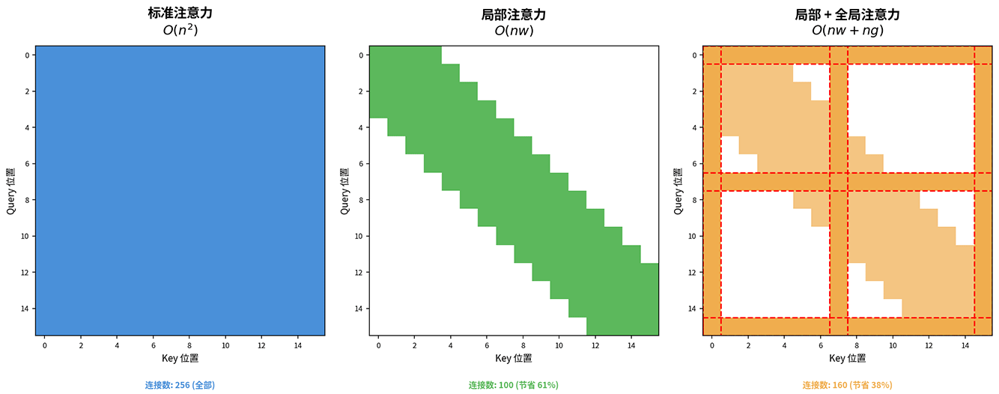
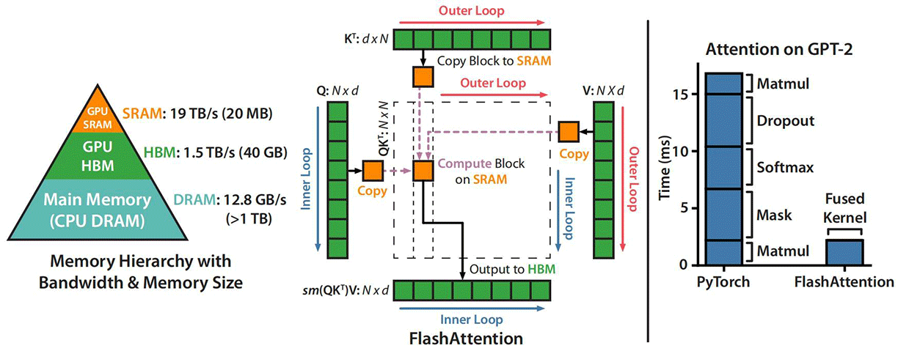
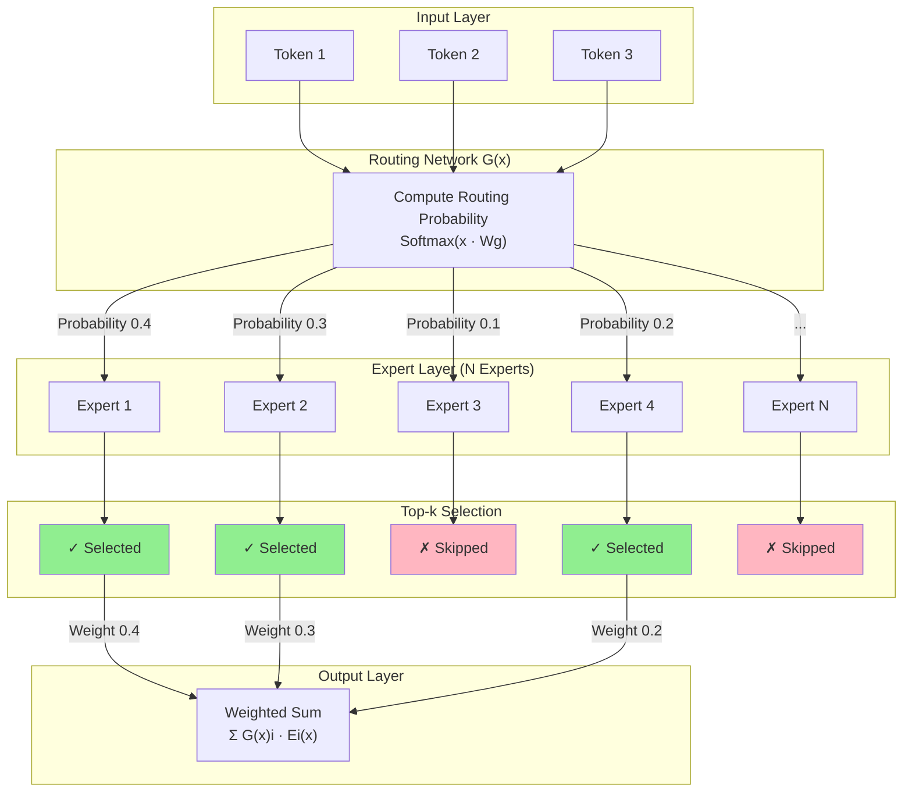

# Transformer Evolution and Variants

The previous chapter introduced the birth of the Transformer architecture, where the self-attention mechanism replaced the sequential dependency of RNNs, enabling true parallel computation. Even so, the original Transformer from the paper was far from perfect — issues like the $O(n^2)$ attention complexity being prohibitively expensive on long sequences, low parameter efficiency causing massive waste at hundred-billion scale, and a fixed context window limiting the model's ability to process long texts all left significant room for improvement.

In the nearly decade since the Transformer's inception, both academia and industry have refined the original architecture from multiple directions. This chapter surveys the major technical variants resulting from these improvements, covering hybrid attention architectures, Flash Attention's I/O optimizations, MoE's sparse activation, KV cache optimizations (MQA/GQA/TPA), RoPE's positional encoding extrapolation, and component replacements like RMSNorm and SwiGLU. Together, these advances form the technical foundation of modern LLM architectures.

## Attention Efficiency

The self-attention mechanism is the proud innovation of the Transformer, but its computational and spatial complexity on long sequences is also the bottleneck limiting Transformer applications. It is no exaggeration to say that half of the subsequent technical optimizations for the Transformer have focused on improving the computational and memory efficiency of attention.

Let us first analyze the computational complexity of self-attention. Let $n$ be the sequence length and $d$ the model dimension. In the matrix multiplication of dot-product attention $QK^T$, $Q$ is an $n \times d$ matrix and $K^T$ is a $d \times n$ matrix; multiplying them yields an $n \times n$ attention score matrix $S$. Computing this matrix requires $n^2 \times d$ operations. The essence of self-attention is to compute the correlation between every pair of positions in the sequence. For each position $i$ in the sequence, it must compute attention scores with all $n$ positions, and there are $n$ positions in total, so the computational complexity of the attention mechanism is $O(n^2)$. Self-attention is like a social network — if everyone needs to know everyone else, the total number of relationships is the square of the number of people.

In terms of spatial complexity, both the attention score matrix $S$ and the attention weight matrix $A$ are $n \times n$ matrices that must be stored in memory. Suppose the sequence length $n = 8192$ (about 8K tokens, roughly the length of an article) and the model dimension $d = 4096$; then both $S$ and $A$ have $8192 \times 8192 = 67,108,864$ elements, giving a spatial complexity of $O(n^2)$. With FP16 precision (2 bytes per element), a single attention layer requires $2 \times 67,108,864 \times 2 = 268$ MB of memory. The original Transformer's 6 attention layers would need $268 \times 6 \times 2 = 3.2$ GB (Encoder-Decoder structure). For GPT-3 with 96 layers, this amounts to $268 \times 96 = 25.1$ GB (Decoder-Only structure). This calculation covers only the attention matrices — nearly 25 GB — and does not include fixed space consumption for model parameters, gradients, and other items that do not vary with input length.

Under the dual pressure of computation and memory, without targeted optimization, whether it is the constraint of limited sequence length or the bottleneck of inference efficiency, the practical value of the Transformer would be greatly diminished.

### Sparse Attention

Reducing the sequence length involved in computation is the most intuitive and direct way to cut computational cost. Let us first consider: does self-attention really require every position to attend to all other positions? Using the social network analogy again, you do not need to know everyone to obtain information — you only need to know a few friends, and those friends know other friends, and information propagates through the entire community via the network. Similarly, in a language model, a word may only need to attend to a few nearby words (capturing local syntactic structure) and a few key words (capturing global semantic associations) to obtain sufficient information for understanding context. The idea here is that the attention matrix is likely highly sparse — the correlations between most position pairs are near zero, and only a small fraction of connections are truly meaningful.

Based on this hypothesis, researchers have proposed various sparse attention schemes, the most direct being local attention. **Sliding Window Attention** (SWA) is the most widely used implementation of local attention, where each position only attends to neighboring positions within a fixed window size $w$. For example, with a window size $w=3$, position 5 can only attend to positions 2 through 8, forming a sliding window of width $2w+1$. This means each position computes attention with at most $2w+1$ positions, reducing the complexity from $O(n^2)$ to $O(nw)$. With $n=8192, w=512$, the computation is reduced by about 16 times and storage by about 8 times. Local attention excels at capturing local dependencies, such as the modifier-head relationship in "red apple" where "red" modifies "apple," or the verb-object relationship in "he opened the door" where "opened" relates to "door" — these syntactic associations typically occur between adjacent words.

In 2023, Mistral AI's Mistral 7B model used sliding window attention with a window size of 4096. Combined with a 32-layer Transformer structure, the effective receptive field at layer 32 reaches $32 \times 4096 = 131072$ tokens (theoretical value; in practice the gap between actual and theoretical values is very large), enough to cover most long documents. It surpassed LLaMA-2 13B on multiple benchmarks, demonstrating that sliding window attention with multi-layer stacking is a viable approach.

However, local attention alone cannot directly capture long-range dependencies. Consider the sentence: "**Xiao Ming**, that mischievous student who is always late, often forgets to bring his homework, and occasionally dozes off in class, surprisingly was **the first** to arrive at the classroom today." With a window size $w=8$, "Xiao Ming" (beginning of the sentence) and "the first" (end of the sentence) are more than twenty words apart — local attention cannot establish a direct connection between them. To understand who "the first" refers to, the model needs to find the subject "Xiao Ming," and information must propagate layer by layer. The first layer's "the first" attends to "student," the second layer's "student" attends to "dozes off," then to "forgets homework," then to "late," and finally to "Xiao Ming." Through layer-by-layer stacking, information about "Xiao Ming" can indirectly reach "the first." This indirect information transfer reduces attention's information efficiency and risks losing details along the way — for instance, the "mischievous" attribute of "Xiao Ming" might be forgotten during propagation, preventing the model from understanding the drama of this unusual behavior (being the first to arrive).

To address this, researchers added **global attention** on top of local attention, selecting a few global tokens (such as section titles or keywords) that can attend to all positions while also being attended to by all positions. Global tokens act like opinion leaders or information hubs in a social network, aggregating global information and broadcasting it to other nodes. This way, long-distance information transfer between ordinary tokens often requires only two steps: first to a global token, then from the global token to the target position, greatly reducing the number of information hops. The figure below shows a visual comparison of the matrix structures of three attention patterns. Standard attention (left) has all positions fully connected, complexity $O(n^2)$. Local-only attention (center) has each position attending only to its window neighbors, complexity $O(nw)$. Local + global attention (right) uses local windows for ordinary tokens, while global tokens (marked with red dashed lines) can connect to all positions, complexity $O(nw + ng)$.

*Figure: Comparison of Sparse Attention Patterns*

Longformer, proposed in 2020, is a representative scheme combining local and global attention. For ordinary tokens, it uses sliding window attention (default window size 512) to capture local syntactic structure. For global tokens, it uses global attention to aggregate global semantic information. Suppose we are processing a technical document of 8192 tokens with window size $w=512$, and global tokens include the document title (position 0) and three section headings (positions 1000, 3000, 6000). Position 5000 is an ordinary token "optimization" — through local attention, it attends to words in positions 4488–5512, capturing the syntactic relationship between "optimization" and nearby words (such as "optimization algorithm," "performance optimization"). Simultaneously, through global attention, it attends to the four headings to obtain the document's and current section's topic information. Conversely, the section heading at position 3000, through global attention, attends to all positions to summarize the entire section. Thus, the word "optimization" understands both the local context (what type of optimization it is) and the global context (what topic this document discusses), achieving much better information efficiency than pure local attention.

Experiments show that Longformer performs well on long-document tasks, handling sequences up to 16K tokens — a 10-30x increase in context capacity compared to the original Transformer's 512-1024 token limit. On tasks such as document classification, question answering, and summarization, Longformer's performance is comparable to or even better than standard Transformer (for readers with a development background, note that "performance" here refers to prediction accuracy, not processing speed), while computational cost is significantly reduced.

Sparse attention is not a perfect solution; it still has two limitations. First, it requires careful design of the sparsity pattern — which tokens use global attention, how to choose the window size, etc. — which increases model design complexity. Second, it may miss some important long-range dependencies: if two key words are neither global tokens and are far apart, no direct connection can be established between them, and information must still rely on indirect multi-layer stacking paths. These limitations drove subsequent research into other attention efficiency optimizations.

### Flash Attention

Sparse attention reduces complexity by decreasing the amount of computation, but it requires careful sparsity pattern design and may lose certain important long-range dependencies. As mentioned earlier, the bottleneck of attention lies in both computation and memory. In addition to reducing computation, optimization of memory and I/O efficiency has also been advancing in parallel. In 2022, Stanford University's paper "[Flash Attention: Fast and Memory-Efficient Exact Attention with IO-Awareness](https://arxiv.org/abs/2205.14135)" proposed a new perspective on improving attention efficiency, arguing that the bottleneck of attention computation lies not primarily in the computation itself but in memory access.

To understand the I/O bottleneck of attention memory access, we first need to understand the GPU memory hierarchy. GPUs have two main types of memory: **HBM** (High Bandwidth Memory) and **SRAM** (Static Random Access Memory). HBM is characterized by large capacity but slower access — for example, the A100 GPU has 40 GB or 80 GB of HBM with a bandwidth of about 1.5 TB/s. SRAM is characterized by small capacity but extremely fast access — each Streaming Multiprocessor (SM) on the A100 has only 192 KB of SRAM, totaling 20.25 MB across 108 SMs, but bandwidth can reach tens of TB/s with latency an order of magnitude lower than HBM. The memory access process for attention computation consists of the following three steps:
- Step 1: Read $Q$ and $K$ from HBM, compute the score matrix $S = QK^T$, and write this $n \times n$ matrix back to HBM;
- Step 2: Read $S$ from HBM, compute Softmax to obtain the weight matrix $P$, and write this $n \times n$ matrix back to HBM;
- Step 3: Read $P$ and $V$ from HBM, compute the output $O = PV$, and write this $n \times d_v$ matrix back to HBM.

These three steps are illustrated in the middle part of the figure below. The entire process requires multiple reads and writes of $n \times n$ matrices, while the final output is an $n \times d_v$ matrix. When the sequence length $n = 8192$, each attention score matrix and attention weight matrix requires reading and writing 67M elements — about 134 MB per matrix at FP16 precision. For GPT-3 with 96 layers, the attention matrix reads and writes alone consume about 26 GB of HBM bandwidth. Although HBM bandwidth reaches 1.5 TB/s, reads and writes always incur fixed latency, and frequent I/O interactions severely slow down computation.

*Figure: Q, K, V, O Matrix Memory Read/Write (Image from Flash Attention paper)*

To address this problem, Flash Attention's solution is to minimize the number of HBM memory accesses. Even if the total amount of computation remains the same, reducing access frequency improves overall efficiency. Toward this goal, Flash Attention makes the following three improvements:

- **Tiling**: Partition the $Q, K, V$ matrices into smaller blocks (tiles) along the sequence dimension, with each block sized to fit exactly into SRAM. On the A100, a single SM has 192 KB of SRAM, enough to hold several $128 \times 64$ tiles (about 16 KB each; accounting for one tile each for Q, K, V, each SM can still run 6-8 threads in parallel).

    The computation uses a nested loop strategy. The outer loop iterates over tiles of $Q$, and the inner loop iterates over tiles of $K$ and $V$. For each $Q$ tile, the corresponding $K$ and $V$ tiles are read into SRAM one by one, and attention is computed between this $Q$ tile and the current $K$ and $V$ tiles, with results accumulated. This way, SRAM only needs to hold one $Q$ tile and the $K$ and $V$ tiles involved in the current computation, reducing memory usage from $O(n^2)$ to $O(n)$.
    
    With $n=4096, d=64$, the traditional method requires reading and writing $n \times n = 16.8M$ elements of the attention matrix. Flash Attention only reads and writes the input $Q, K, V$ and output $O$, totaling about $4 \times n \times d = 1M$ elements — a reduction in I/O of about 16 times.

- **Online Softmax**: The traditional Softmax computation $Softmax(x_i) = \frac{e^{x_i}}{\sum_j e^{x_j}}$ requires first traversing all elements to compute the denominator sum, which means the complete $n \times n$ score matrix must be stored. The online Softmax method introduces an incremental update mechanism, retaining only two scalar values per block: the current maximum $m$ (for numerical stability, preventing overflow; see [Relative Nature of Softmax](../../../statistical-learning/linear-models/logistic-regression.md#多项逻辑回归)) and the exponential sum $l = \sum e^{x_i - m}$.

    When processing a new block, the global statistics are updated using the new block's statistics: $m_{new} = \max(m_{old}, m_{block})$, $l_{new} = l_{old} \cdot e^{m_{old} - m_{new}} + l_{block} \cdot e^{m_{block} - m_{new}}$. After all blocks have been updated, the final exponential sum statistic $l$ is the Softmax denominator. This avoids storing the complete matrix — normalization is accomplished by simply iterating through all blocks — reducing memory usage from $O(n^2)$ to $O(1)$.

- **Kernel Fusion**: This combines multiple steps of attention computation into a single CUDA kernel. Traditional implementations split the computation across multiple independent CUDA kernels: matrix multiplication kernel ($QK^T$) $\rightarrow$ HBM write $\rightarrow$ Softmax kernel $\rightarrow$ HBM write $\rightarrow$ matrix multiplication kernel ($PV$). Each kernel switch requires passing data through HBM, incurring significant I/O overhead. The goal of kernel fusion is to keep data flowing within SRAM throughout. After $Q, K$ are read into SRAM, the operations $QK^T$, Softmax normalization, and $PV$ are completed sequentially, and only the final output $O$ is written back to HBM. This eliminates HBM reads and writes for intermediate results, reducing HBM access from $O(n^2)$ to $O(n)$.

On the A100 GPU, Flash Attention achieves approximately 72% of theoretical peak FLOPS, far exceeding the 30-40% of traditional implementations. When training models with 4K context, Flash Attention is 2-4 times faster than standard implementations and reduces memory usage by 5-20 times. Most importantly, Flash Attention is exact attention — there is no approximation or loss, and the mathematical results are identical to standard attention; it simply uses a more advanced computation method. This allows Flash Attention to seamlessly replace standard attention without modifying the model architecture or training pipeline, and it has become a standard component in modern LLM training.

In July 2024, Flash Attention-3 introduced optimizations for the new H100 GPU's hardware features, adding two improvements — asynchronous computation and low-precision support — pushing attention computation efficiency to new heights. Compared to the A100, the H100 GPU has two important hardware advantages: asynchronous execution and FP8 low-precision format support.

- Asynchronous execution allows computations using different hardware units within an SM to run in parallel. Matrix multiplication is primarily performed on Tensor Cores, while Softmax computation runs on CUDA Cores. With asynchronous execution, these two computations for different attention layers can run in parallel on the two types of cores, keeping both computation units on the GPU almost constantly active.

- FP8 low-precision format support not only reduces memory usage but also improves computational efficiency. The H100's FP8 format (E4M3 or E5M2) achieves a theoretical peak throughput of approximately 4.0 PFLOPS (compared to about 2.0 PFLOPS for BF16/FP16), twice that of BF16. Flash Attention-3 provides specialized case-by-case optimizations for FP8, such as using FP8 for matrix operations to ensure speed, while using BF16/FP32 for Softmax and accumulation to maintain numerical stability.

Flash Attention-3 demonstrates the power of software-hardware co-optimization: even without changing the algorithm itself, reorganizing the computation flow according to hardware characteristics can significantly improve efficiency. This approach provides valuable insights for future GPU architecture optimization.

### Linear Attention

Sparse attention reduces computation by decreasing the sequence length involved in computation, while Flash Attention improves attention efficiency through I/O optimization. However, both optimization algorithms still have $O(n^2)$ complexity. Another line of research attempts to fundamentally resolve the efficiency bottleneck of self-attention by reducing complexity to $O(n)$ at the mathematical level — this is **Linear Attention**.

Observing the standard self-attention formula $Attention(Q, K, V) = Softmax\left(\frac{QK^T}{\sqrt{d_k}}\right) V$, the efficiency bottleneck stems from both the $QK^T$ matrix multiplication and the Softmax normalization, both of which depend on an $n \times n$ attention matrix, resulting in $O(n^2)$ computational and spatial complexity. Linear attention is designed to address both issues directly: first, it uses a [kernel function replacement trick](../../../statistical-learning/support-vector-machines/kernel-methods.md#隐式内积计算) to replace Softmax's non-negativity and normalization roles; second, it leverages the associative property of matrix multiplication to change the computation order, bypassing the $n \times n$ attention score matrix.

Standard attention first computes $QK^T$ to obtain an $n \times n$ attention score matrix, then multiplies by $V$. Linear attention instead computes $K^T V$ first, then multiplies by $Q$. The advantage of this rearrangement is that $K^TV$ is a $d \times d$ matrix, independent of the input sequence length $n$, reducing complexity from $O(n^2)$ ($n \times n \times d$) to $O(n)$ ($d \times d \times n$). When $d \ll n$, the complexity is approximately linear — hence the name "linear attention." Its formula is:

$$LinearAttention(Q, K, V) = \phi(Q) \cdot \left(\phi(K)^T V\right)$$

Compared to the original self-attention formula, the mathematical changes, aside from altering the matrix multiplication order, most notably involve the removal of the Softmax function and the introduction of a new function $\phi$ (the scaling by $\sqrt{d_k}$ does not affect the mathematical result and is considered an engineering optimization technique). Softmax serves two roles in standard attention:
- **Non-negativity**: $e^{x_i} > 0$ ensures all attention weights are positive, giving weights a probabilistic interpretation.
- **Normalization**: $\sum_j \frac{e^{x_j}}{\sum_k e^{x_k}} = 1$ ensures the weights sum to 1, forming a valid weighted average.

Linear attention must replace these with other methods that do not depend on $n \times n$ matrices to approximately simulate these two properties — this is where the kernel trick comes in. The kernel function $\phi$ introduced in the formula replaces Softmax's nonlinear activation function. Below, we use specific activation functions and numerical values to illustrate the working process of linear attention. First, set up the following assumptions:

 - Assume $\phi(x) = ReLU(x) = \max(0, x)$ as the kernel function. ReLU truncates negative values to 0 and leaves positive values unchanged, naturally satisfying the non-negativity requirement. Compared to Softmax's exponential operation, ReLU is simple to compute and requires no intermediate storage.
 - Assume Query is $q = [1, 2, 1]$.
 - Assume Keys are $k_1 = [2, 1, 0]$, $k_2 = [1, 1, 2]$, $k_3 = [0, 1, 1]$.
 - Assume the scaling factor $\sqrt{d_k} = 1$.

First, following standard Softmax normalization, the attention scores of $q$ to $k_1$, $k_2$, $k_3$ are approximately $0.245$, $0.665$, and $0.090$, with the ranking $k_2 > k_1 > k_3$ — $k_2$ obtains the highest weight. After applying the kernel trick (without normalization), the scores are $4$, $5$, and $3$. The ranking is consistent with standard attention: $k_2$ still receives the highest weight.

In this example, since all vectors are non-negative, the ReLU kernel function does not change any values, and the ranking of the two attention mechanisms is the same. However, it should be noted that linear attention does not always produce the same results as standard attention. When vectors contain negative values, ReLU truncates them, which can alter the ranking. If $q = [2, -1, 3]$, $k_1 = [1, 2, -1]$, $k_2 = [-2, 1, 3]$, $k_3 = [0, -1, 2]$, standard attention ranks them as $k_3 > k_2 > k_1$, while linear attention after kernelization ranks them as $k_2 > k_3 > k_1$. Sacrificing attention precision is one of the costs linear attention pays for $O(n)$ complexity.

For normalization, we can follow the Softmax normalization approach of standard attention. Softmax's denominator is the sum of all attention scores $\sum_j e^{q \cdot k_j}$. Similarly, linear attention replaces the exponential function $e^x$ with the kernel function $\phi$, yielding the corresponding normalized form $\frac{\phi(q) \cdot \phi(k_i)}{\sum_j \phi(q) \cdot \phi(k_j)}$. Applying this normalized weight to the weighted sum of Values gives:

$$Attention(q, k, v) = \frac{\phi(q) \cdot \sum_i \phi(k_i) v_i}{\phi(q) \cdot \sum_i \phi(k_i)}$$

This is the linear attention formula with explicit normalization. Note that $\sum_i \phi(k_i) v_i$ is an accumulation of outer products, resulting in a $d \times d_v$ matrix, while $\sum_i \phi(k_i)$ is a $d$-dimensional vector. Both can be accumulated position by position without storing intermediate matrices. Generalizing the above process to matrix form, let $Q, K, V$ be $n \times d$ matrices:

$$Attention(Q, K, V) = \frac{\phi(Q) \cdot (\phi(K)^T V)}{\phi(Q) \cdot \phi(K)^T \cdot \mathbf{1}}$$

where $\phi(K)^T V$ is a $d \times d$ matrix, independent of the sequence length $n$, and $\phi(K)^T \cdot \mathbf{1}$ is a $d$-dimensional vector. The entire linear attention computation consists of three steps:
- Compute $K^T V$, complexity $O(nd^2)$.
- Compute $Q \cdot (K^T V)$, complexity $O(nd^2)$.
- Compute the normalization denominator, complexity $O(nd)$.

The total complexity of the three steps above is $O(nd^2)$. Since $d$ is fixed once the model is designed, the overall complexity of linear attention is approximately $O(n)$. Compared to standard attention's $O(n^2)$, when $n \gg d$, both computational and memory efficiency are significantly improved.

Linear attention successfully reduces complexity, but at a considerable cost. In addition to the attention precision issue mentioned earlier, it has long been limited in practical applications by the **Low-Rank Dilemma**. The root of the low-rank dilemma lies in the fact that the $K^T V$ matrix is a $d \times d$ matrix whose rank is at most $\min(d, n)$. When the sequence length $n$ is much larger than $d$, this matrix lacks sufficient capacity to capture all semantic information. Specifically, Softmax attention's $n \times n$ score matrix can express arbitrary inter-position relationships, with each position's attention weights learned independently. In contrast, linear attention's $K^T V$ matrix compresses information from all positions into a $d$-dimensional space, inevitably losing some inter-position difference information. This is like compressing a 4K HD movie into a 1080P version for online streaming — the main content is preserved, but details are inevitably lost depending on the trade-off between quality and playback speed.

### Hybrid Attention Architecture

As of mid-2026 when this is being written, in terms of average practical performance, linear attention models still significantly lag behind full attention models. For example, Mamba-2 (2024), whose core mechanism is not linear attention but structured state space models, lags 3-5 percentage points behind LLaMA of comparable size on language modeling tasks, with an even larger gap on long-context understanding tasks. This cost of trading efficiency for performance puts researchers and engineers in a dilemma. Choosing full attention means being constrained by computational cost and memory usage; choosing linear attention means accepting degraded model performance. To balance the advantages and drawbacks of linear attention, a compromise solution is **Hybrid Attention**, which uses standard Softmax attention for critical layers and more efficient linear attention for the rest.

Moonshot AI's publicly disclosed Kimi Linear model in 2025 (a technology reserve model developed in parallel with Kimi 2.5) is the industry's first hybrid linear attention model to match mainstream full attention models in fair comparisons. Kimi Linear's innovation lies in using a linear attention module called Kimi Delta Attention (KDA), improved from Gated DeltaNet. To explain KDA, we first briefly introduce the basic principles of DeltaNet.

In 2021, Imanol Schlag from ETH Zurich and Jürgen Schmidhuber, the father of LSTM, proposed the concept of DeltaNet in their paper "[Linear Transformers Are Secretly Fast Weight Programmers](https://arxiv.org/abs/2102.11174)." They reinterpreted the attention mechanism as an online learning process, where the memory state $S_t$ at each position can be viewed as a knowledge base, updated through a process akin to gradient descent when new information $(k_t, v_t)$ arrives. From this perspective, the essence of attention is incremental learning, rather than a simple weighted average of Value vectors.

In 2025, Songlin Yang from MIT proposed Gated DeltaNet, adding a gated delta rule and a forget gate $\alpha_t$ on top of DeltaNet to control the degree of historical information retention. In addition to Kimi Linear, Qwen 3.5 (2026) also uses Gated DeltaNet. However, the original Gated DeltaNet has its limitations: each attention head has only a single scalar forget rate $\alpha_t$, meaning all channel dimensions within the same head share the same forgetting strategy. This is like organizing files on your computer where you can only choose to keep everything or discard everything — clearly not flexible enough. Similarly, different channels of an attention head may carry different types of information: some channels encode syntactic structures that need long-term retention, while others encode temporary context that can be quickly forgotten. A uniform forget rate cannot accommodate these differentiated needs.

KDA's improvement over Gated DeltaNet is the introduction of fine-grained gating, where each channel dimension has its own independent forget rate $\alpha_t[i]$. This allows the model to precisely control which information to retain and which to discard. Syntax-related channels can be set with high retention rates, while temporary information channels can be set with low retention rates. This fine-grained memory management significantly enhances the expressive power of linear attention, allowing it to rival standard full attention for the first time.

Kimi Linear adopts a hybrid attention architecture with a 3:1 inter-layer alternating pattern: every three layers of KDA linear attention are paired with one layer of full attention. The periodically inserted full attention layers act as information hubs, enabling direct interaction between all positions and ensuring global information flow. This addresses the limitation of pure linear attention where each position can only access historical information indirectly through compressed memory states, which restricts information propagation. It also balances model performance and efficiency: the 3:1 ratio means 75% of attention layers enjoy the advantage of $O(n)$ complexity, while the remaining 25% of full attention layers take on the role of information integration. This allocation finds the optimal balance between efficiency and performance.

Kimi Linear's success marks the transition of linear attention from theoretically efficient to practically usable. It demonstrates that hybrid linear attention architectures can not only match but potentially surpass full attention, achieving higher performance and lower resource consumption while maintaining linear complexity. This breakthrough opens a new path for practical long-context large models. The development of hybrid attention architectures shows that simply reducing complexity is not enough — a balance between efficiency and expressiveness must be found. Current research on techniques such as rank enhancement and zero-sum constraints continues to work toward this goal.

It is worth noting that hybrid attention architectures are not limited to mixing linear attention and full attention. For example, the DeepSeek V4 model released in 2026 uses a mix of Compressed Sparse Attention (CSA) and Heavily Compressed Attention (HCA), offering yet another new approach to long-context processing. CSA's strategy is moderate compression plus precise selection, while HCA's strategy is heavy compression plus efficient operation. The model uses CSA for relatively fresh, detail-intensive information requiring precise extraction (such as variable names currently being written in code or recently read logic), and HCA for information spanning very long distances (such as the outline of a book's first chapter). Under the CSA + HCA hybrid attention architecture, DeepSeek V4 extends the context from V3's 128K to 1M while maintaining good inference efficiency.

## KV Cache Optimization

Autoregressive generation is the general inference paradigm for Transformer-based language models. Each time a new token is generated, the model needs to compute its attention to all previous tokens. According to the attention formula, the Query at the current position needs to compute similarity with the Keys of all historical positions and then take a weighted sum of the corresponding Values. This means that whenever a new token is generated, the Keys and Values of all previous tokens are reused. To avoid redundant computation, the model caches the Keys and Values of all previous positions — this mechanism is now called the **KV Cache**. As the context grows, the memory usage of the KV cache becomes one of the primary bottlenecks for inference efficiency.

Let us quantify the memory usage of the KV cache to intuitively understand how severe this bottleneck is. Taking the LLaMA-2 70B model as an example, each attention sublayer has $h = 64$ attention heads, each with dimension $d_k = 128$, supporting a sequence length of $n = 4096$, with data stored in FP16 precision (2 bytes per element). The KV cache size for a single token is $2 \times h \times d_k \times 2$ bytes (the first 2 accounts for both Key and Value, the second 2 accounts for FP16's 2 bytes per element). For a sequence of length $n$, the KV cache size is:

$$\text{KV Cache} = \underbrace{2}_{\text{K+V}} \times n \times h \times d_k \times \underbrace{2}_{\text{FP16}} \text{ bytes} = 2 \times 4096 \times 64 \times 128 \times 2 = 128 \text{ MB}$$

LLaMA-2 70B has 80 attention sublayers, so a single conversation requires $128 \times 80 \approx 10$ GB of KV cache. And this is only the KV cache — it does not include the model parameters themselves (about 140 GB of FP16 weights). The model needs 10 GB of memory just to remember what was said before, which puts immense pressure on inference deployment. If the context is extended to 32K, the KV cache balloons to 80 GB; at 128K context, it would require 320 GB of memory dedicated solely to caching.

The memory pressure of the KV cache not only affects deployment cost but also directly limits concurrent processing capacity. On a server with 2 A100 80 GB GPUs running LLaMA-2 70B, the model weights occupy 140 GB, leaving only enough memory to support about two concurrent requests at 4K context. Without targeted optimization, the practicality of Transformer models under current hardware levels would be severely limited.

Faced with the memory pressure of the KV cache, the optimization approach in academia and industry has followed a clear evolutionary path: from fully independent standard Multi-Head Attention (MHA) to fully shared Multi-Query Attention (MQA), then to the flexible compromise of Grouped Query Attention (GQA), followed by low-rank compressed Multi-Head Latent Attention (MLA), then Tensor Product Attention (TPA), and finally the unified attention framework (T6). This evolutionary journey, from reducing group count (MQA/GQA) to compressing representations (MLA/TPA), has the core trade-off always being between memory efficiency and expressiveness.

### MHA: Multi-Head Attention

**Multi-Head Attention** (MHA) is the attention mechanism proposed in the original 2017 Transformer paper, laying the foundation of the Transformer architecture. Before this, attention mechanisms primarily existed in single-head form, such as [Bahdanau Attention](transformer-architecture.md#bahdanau-attention) (2014) and Luong Attention (2015), mainly used for encoder-decoder alignment in machine translation. The introduction of MHA marked the upgrade of the attention mechanism from an auxiliary component to the core architecture of the model.

We have already introduced MHA's design in detail in [Transformer Architecture Basics](./transformer-architecture.md#multi-head-attention). In a nutshell, its characteristic is decomposing attention computation into multiple parallel heads, with each head independently learning a different representation subspace, and each head having complete, independent Query, Key, and Value representations. Experimental and visualization studies show that different heads indeed exhibit specialization tendencies. Some heads focus on capturing syntactic relationships (such as subject-verb agreement, tense matching), some focus on semantic relationships (such as the hyponymy relationship between "apple" and "fruit"), and others focus on positional relationships (such as dependencies between adjacent words). This specialization allows the model to understand the input sequence from multiple perspectives simultaneously. Although multi-head attention appears to increase computation, all heads' computations are completely independent and can be executed in parallel. On modern GPUs, the computation time for $h$ heads is nearly identical to that of a single large head. This design cleverly trades space for time — increasing parameter count without increasing computation time. Additionally, the multi-head structure provides multiple propagation paths for gradients: even if one head's gradient is blocked (e.g., by Softmax saturation regions), other heads can still learn normally, increasing training robustness.

However, MHA's cost is equally significant. During inference, $h$ complete sets of Keys and Values must be stored. Earlier, using LLaMA-2 70B ($h=64, d_k=128, n=4096$, FP16 precision) as an example, we calculated MHA's memory consumption — the enormous memory pressure severely limits long-context applications and concurrent inference.

MHA was widely used in the original Transformer paper and early models. The original Transformer (2017) had 8 attention heads each in the encoder and decoder by default, with $d_{model}=512, d_k=64$. BERT (2018) used 12 encoder layers with 12 heads each. GPT-1/2 (2018-2019) used a Decoder-only structure, with GPT-2 Small having 12 layers and 12 heads, and GPT-2 Medium having 24 layers and 16 heads. GPT-3 (2020) further scaled to 96 layers with 96 heads per layer, $d_{model}=12288, d_k=128$.

As model scale increased and the demand for long context grew, MHA's KV cache bottleneck became increasingly prominent. After 2023, mainstream large language models (such as LLaMA-2, Mistral, Qwen, DeepSeek, etc.) have generally shifted to optimization schemes like GQA or MLA, retaining MHA only in training phases or short-sequence scenarios. As standard multi-head attention, MHA's design philosophy (allowing different heads to learn different representations) remains the theoretical foundation of modern attention architectures, with subsequent MQA, GQA, and TPA all being optimizations of KV sharing degrees within the MHA framework.

### MQA: Multi-Query Attention

**Multi-Query Attention** (MQA) was proposed by Noam Shazeer, a Google researcher and co-author of the original Transformer paper, in 2019 in "[Fast Transformer Decoding: One Write-Head is All You Need](https://arxiv.org/abs/1911.02150)." It represents the first aggressive optimization targeting the KV cache bottleneck. Shazeer observed an interesting phenomenon: in multi-head attention, although different heads learn different representations, there may be substantial redundancy in their Key and Value content. Based on the information redundancy hypothesis, MQA adopts an extreme sharing strategy: all heads share the same set of Keys and Values. The storage space for $K$ and $V$ matrices does not increase with the number of heads $h$ ($K, V \in \mathbb{R}^{1 \times n \times d_k}$), and only the Query remains independent per head ($Q \in \mathbb{R}^{h \times n \times d_k}$).

MQA's design can be likened to a team meeting. MHA is like everyone taking their own meeting minutes — although each person focuses on different content, there is substantial overlap in what is recorded. MQA is like everyone sharing a single set of meeting minutes, with each person only marking the parts they care about. The advantage of shared minutes is saving paper, but the cost is that no one can retain their unique perspective.

The memory advantage of MQA is obvious. Continuing with the LLaMA-2 70B example, MHA with 64 attention heads requires storing 64 sets of KV caches, while MQA needs only 1 set. The KV cache drops precipitously from 10 GB to about 160 MB — a reduction to 1/64 of the original. A dual A100 80 GB GPU server that could only support two concurrent requests with MHA can now handle dozens or even hundreds of concurrent requests. For online services requiring high throughput, this memory efficiency directly translates to cost reduction and improved service capacity.

However, MQA's cost is equally apparent. Shared KV cache means all heads must use the same Key/Value representation, severely limiting the model's expressiveness. In MHA, different heads can learn different representation subspaces — some heads focus on syntactic relationships, others on semantic associations. But in MQA, all heads are forced to use the same set of Keys/Values. This one-size-fits-all strategy inevitably loses information. Experiments show that MQA can suffer a 1-3% performance degradation on certain tasks (do not assume that a 1-3% loss is always worth a dozens-fold improvement in cache efficiency — every model generation competes for percentage points), especially in scenarios requiring fine-grained semantic differentiation.

MQA has been adopted by some models pursuing extreme inference efficiency. Google's PaLM, released in 2022, used MQA to achieve efficient inference at 540B parameters. However, MQA's performance loss has deterred many model designers, forcing them to make difficult choices between memory efficiency and model performance. This dilemma drove the subsequent emergence of GQA, which attempts to find a better balance between MHA and MQA.

### GQA: Grouped Query Attention

**Grouped Query Attention** (GQA) was proposed in the 2023 paper "[GQA: Training-Generalized Multi-Query Transformer Models from Checkpoints](https://arxiv.org/abs/2305.13245)" as a compromise between MHA and MQA. Researchers observed that while MQA offers extremely high memory efficiency, its performance loss on certain tasks is unacceptable. MHA, while the most expressive, suffers from excessive memory pressure. GQA's idea is to have multiple heads share the same KV cache group — but not all heads share the same cache; instead, heads are divided into groups, with sharing within groups and independence between groups.

GQA's design can be understood through a library management analogy. MHA is like every reader having their own set of books — personalized annotations are possible, but books take up a lot of space. MQA is like all readers sharing a single set of books — space-efficient but lacking personalization. GQA groups readers by interest: readers in the same group (e.g., the literature group shares literature books, the technology group shares technology books) share one set of books, while different groups have independent books. This saves space while preserving inter-group diversity to some extent.

GQA reduces the number of $K$ and $V$ matrices from the number of attention heads $h$ to the number of groups $g$ ($K, V \in \mathbb{R}^{g \times n \times d_k}$). When $g=1$, all heads share one set of KV, degenerating to MQA; when $g=h$, each head has independent KV, degenerating to standard MHA. By adjusting $g$, GQA can flexibly trade off between memory efficiency and expressiveness.

Continuing with the LLaMA-2 70B example, with $h=64$ attention heads and GQA choosing $g=8$, the 64 heads are divided into 8 groups of 8 heads each, with each group sharing one set of KV. The KV cache drops from MHA's 10 GB to 1.25 GB — an 8-fold reduction. Compared to MQA's 64-fold compression, GQA's 8-fold compression appears less aggressive, but the resulting performance loss is about 0.5%, far lower than MQA's 1-3%. This configuration finds the optimal balance between memory efficiency and expressiveness and has become the standard choice for current mainstream LLMs.

GQA has been widely adopted since 2023. LLaMA-2 was the first model to apply GQA at scale, and its 70B version's $g=8$ configuration became an industry reference standard. The Qwen-3 series also uses GQA with consistent grouping configurations across different scales (7B, 14B, 72B). DeepSeek models further explored more flexible grouping strategies. GQA's success demonstrates that compromise does not mean mediocrity — there exists a superior design space between the extremes of MHA and MQA.

### MLA: Multi-Head Latent Attention

MQA and GQA reduce memory usage by decreasing the number of KV groups, but the group count can only be a discrete integer. Reducing the group count means increasing the degree of sharing, which in turn decreases expressiveness. These design approaches are essentially making trade-offs among a few discrete options like heads and groups. In 2024, the DeepSeek team proposed **Multi-Head Latent Attention** (MLA) in the paper "[DeepSeek-V2: A Strong, Economical, and Efficient Mixture-of-Experts Language Model](https://arxiv.org/abs/2405.04434)," taking a completely different path — instead of reducing the number of KV groups, MLA compresses the representation dimension of each KV group.

MLA's design can be likened to file compression. In MHA, each attention head's KV vectors are like a complete, uncompressed file — rich in detail but occupying significant space. MQA/GQA reduce the number of files by having everyone keep only one or a few shared files. MLA takes a different approach: it compresses the complete file into a compact archive (a latent vector), storing only the archive normally and decompressing it when the full content is needed. The archive is much smaller than the original file, yet each attention head still has its own restoration method (different up-projection paths), ensuring that expressiveness is not lost due to compression.

MLA's compression mechanism is called Low-Rank Key-Value Joint Compression. In standard MHA, each token produces $h$ independent sets of Key and Value vectors per attention layer, each of dimension $d_k$, totaling $2 \times h \times d_k$ values. MLA does not generate these complete KV vectors directly. Instead, it projects the input through a down-projection matrix $W_{DKV}$ to a low-dimensional latent vector $c_{KV} = W_{DKV} \cdot h_t$, where $h_t$ is the current layer's hidden state vector, $W_{DKV} \in \mathbb{R}^{d_c \times d_{model}}$ is the down-projection matrix, and $d_c$ is the compressed dimension, much smaller than $h \times d_k$. During inference, only this compressed latent vector $c_{KV}$ needs to be cached. When the attention computation requires Key and Value, they are restored from the latent vector via up-projection matrices $W_{UK}$ and $W_{UV}$:

$$k_t = W_{UK} \cdot c_{KV}, \quad v_t = W_{UV} \cdot c_{KV}$$

Taking DeepSeek-V2 as an example, it has 128 attention heads with dimension $d_k = 128$ each. Standard MHA requires storing KV of $2 \times 128 \times 128 = 32,768$ values per token, approximately 64 KB at FP16 precision. MLA's compression dimension is $d_c = 512$, requiring only the latent vector $c_{KV}$ (512 values, about 1 KB) — achieving a KV cache compression ratio of 64x.

However, if the complete Key and Value had to be restored from the latent vector every time during inference, the computational overhead of decompression would offset a significant portion of the storage efficiency gained from compression. MLA cleverly avoids this problem using the **Weight Absorption** technique. Consider the attention computation $q_t^T \cdot k_t$; substituting the up-projection formula:

$$q_t^T \cdot k_t = (W_{UQ} \cdot c_Q)^T \cdot (W_{UK} \cdot c_{KV}) = c_Q^T \cdot (W_{UQ}^T \cdot W_{UK}) \cdot c_{KV}$$

The matrix $W_{UQ}^T \cdot W_{UK}$ can be pre-computed and merged, allowing attention scores to be computed directly in the latent space without restoring the complete Key and Value. Similarly, the weighted sum of Values can also be performed in the latent space. Weight absorption enables MLA to save KV cache memory during inference while avoiding the computational overhead of restoration.

MLA also faces the compatibility issue between [RoPE](transformer-architecture.md#rope-rotary-position-embedding) and low-rank compression. RoPE applies positional information to Keys and Queries through rotation matrices, where the rotation operation depends on each position's absolute position index. If RoPE is applied after compression, the compressed latent vector's dimension $d_c$ is much smaller than the Key's original dimension, making the rotation operation impossible in the low-dimensional space. If RoPE is applied before restoration, the complete Key must be restored during inference, defeating the purpose of efficient compression. MLA resolves this conflict through the **Decoupled RoPE** strategy. Specifically, the Key and Query information is separated into a content part and a position part. The content part is stored in the latent vector via low-rank compression, and only the latent vector is cached. The position part independently carries RoPE information through an additional small-dimensional vector. In attention computation, the main body uses the compressed latent vector (responsible for semantic content), while positional information is provided by this decoupled RoPE vector. Concatenated together, this perfectly preserves long-text Position Encoding properties without adding extra inference burden.

MLA's advantages go beyond memory savings — it also maintains expressiveness comparable to MHA in model performance. MQA/GQA compress the KV cache by reducing group count, inevitably losing inter-head diversity. Although MLA's latent vector is shared, the up-projection matrices $W_{UK}$ and $W_{UV}$ provide different restoration paths for different heads, so the restored Keys and Values remain multi-head independent. MLA's effectiveness has been fully validated in the DeepSeek model series. DeepSeek-V2, released in May 2024, was the first to adopt MLA, achieving inference efficiency far exceeding models of comparable scale with 236B total parameters (21B activated parameters). DeepSeek-V3 (December 2024) and DeepSeek-R1 (January 2025) continued using MLA, and the KV cache compression remained effective at the even larger scale of 671B total parameters (37B activated parameters). Compared to an MHA model of similar parameter scale, DeepSeek-V3's KV cache usage is only about 1/57, making 128K long-context inference practically feasible.

MLA demonstrates that compressing the representation dimension of KV rather than reducing group count is a feasible and efficient optimization path. However, it still has limitations. MLA's compression relies on the low-rank assumption — that KV vectors have an effective low-dimensional approximation. If certain layers' KV vectors are close to full rank, compression will lose more information. Additionally, decoupled RoPE adds an extra computation path; although weight absorption eliminates most restoration overhead, the extra computation for positional attention remains. These limitations drove the development of subsequent approaches, with TPA achieving more flexible compression through tensor decomposition, further extending MLA's low-rank idea.

### TPA: Tensor Product Attention

MLA demonstrated the feasibility of extreme compression, but its reliance on the low-rank assumption and the need to handle RoPE decoupling make it deeply tied to DeepSeek-specific model widths, head counts, and engineering implementations — making it difficult for other model architectures to adopt directly. In 2025, the team led by Andrew Chi-Chih Yao proposed **Tensor Product Attention** (TPA), aiming to solve the same problem with cleaner mathematical language in a way that could directly replace standard MHA in mainstream open-source models without modification. TPA compresses each KV representation through tensor decomposition. In traditional methods, $Q$, $K$, and $V$ are complete $h \times n \times d_k$ tensors requiring all elements to be stored. TPA decomposes these tensors into the tensor product of low-rank factors:

$$Q_t = \sum_{r=1}^{R} a_r^{Q}(t) \otimes b_r^{Q}(t)$$

where $\otimes$ is the tensor product and $R$ is the decomposition rank. Instead of storing the complete Q, K, V matrices, only the decomposed low-rank factors need to be stored. Without going into mathematical derivations here, you can think of tensor decomposition as analogous to the [SVD decomposition](../../../statistical-learning/unsupervised-learning/dimensionality-reduction.md#奇异值分解) used in image compression, which we covered in dimensionality reduction. A $1000 \times 1000$ image requires storing 1 million independent pixel values, but if it can be decomposed into the product of two $1000 \times 10$ matrices, only 20,000 values need to be stored — a 50x compression that still preserves most of the image's information.

A key innovation of TPA is that the decomposition is context-dependent rather than fixed — the decomposition coefficients for each position are dynamically determined by the input. This means the same word can have different decompositions in different contexts, fully preserving the model's expressive flexibility. TPA can be understood as a dynamic LoRA, where each position's Q, K, V has its own low-rank decomposition, compressing storage while maintaining adaptability.

Another advantage of TPA is its compatibility with [RoPE](transformer-architecture.md#rope-rotary-position-embedding). RoPE encodes positional information through rotation matrices, and TPA's tensor decomposition can seamlessly integrate rotation operations without damaging positional information. This allows TPA to directly replace attention layers in existing models without redesigning the positional encoding scheme.

Experiments show that TPA achieves approximately 90% memory savings while maintaining expressiveness comparable to MHA. On language modeling tasks, TPA's performance matches or exceeds traditional MHA and GQA while significantly reducing inference memory usage. This represents the latest direction in KV cache optimization: from reducing head/group counts to compressing representations, and from discrete choices to continuous adjustment.

The T6 framework (**T**ensor Produc**T** A**TT**en**T**ion **T**ransformer) built by Andrew Chi-Chih Yao's team based on TPA is a unified attention framework that integrates the above evolutionary path into a complete system. It provides a unifying perspective where MHA, MQA, and GQA can all be viewed as special cases or approximations of TPA. By adjusting the decomposition rank $R$, TPA can continuously adjust between memory efficiency and expressiveness, rather than being limited to a few discrete options. When $R$ is large, TPA approaches MHA's expressiveness. When $R$ is small, TPA approaches MQA's memory efficiency. This continuous adjustment capability allows model designers to flexibly configure architectures based on specific application scenarios (such as short conversations vs. long documents), rather than being locked into a fixed architectural choice.

The evolution of KV cache optimization illustrates a general pattern in deep learning architecture design: starting from simple, straightforward solutions (MHA), moving to aggressive optimization (MQA), then to balanced compromise (GQA), and finally to fundamental rethinking (TPA). Each breakthrough emerged from directly addressing the limitations of the previous step.

## Feed-Forward Network Efficiency

In [Assembling the Transformer Model](transformer-architecture.md#assembling-the-transformer-model), we analyzed the components of the Transformer in detail: each layer consists of an attention sublayer and a feed-forward network sublayer. The previous sections focused on the efficiency bottlenecks and optimization of the attention sublayer; this section turns to the FFN sublayer. The role of the FFN in the Transformer is feature transformation — projecting the representation output by the attention sublayer into a higher-dimensional space, applying a nonlinear activation, and then projecting back to the original dimension, achieving feature extraction and transformation.

Structurally, the original Transformer's FFN is $ReLU(xW_1 + b_1)W_2 + b_2$, where $W_1 \in \mathbb{R}^{d_{model} \times d_{ff}}$ and $W_2 \in \mathbb{R}^{d_{ff} \times d_{model}}$. In terms of parameter share, FFN accounts for the majority of model parameters, typically more than twice that of the attention sublayer. Taking GPT-3 175B as an example, $d_{model} = 12288$, $d_{ff} = 49152$ ($d_{ff} = 4 \times d_{model}$); a single FFN layer has $2 \times 12288 \times 49152 \approx 1.2B$ parameters. GPT-3 has 96 layers, so total FFN parameters are about $96 \times 1.2B \approx 115B$, about 66% of the model's total parameters. The attention sublayer accounts for only about 34%. This means that if you want to compress model parameters, compressing FFN yields the greatest benefit.

Now consider the computational complexity of FFN. FFN's two matrix multiplications require $n \times d_{model} \times d_{ff}$ and $n \times d_{ff} \times d_{model}$ operations respectively, totaling about $2 \times n \times d_{model} \times d_{ff}$ multiply-accumulate operations. For GPT-3 processing a sequence of 2048 tokens, a single FFN layer requires $2 \times 2048 \times 12288 \times 49152 \approx 2.5 \times 10^{12}$ FLOPs, and 96 FFN layers total about $2.4 \times 10^{14}$ FLOPs. In comparison, the attention sublayer's computation consists of four parts: QKV projection ($3 \times n \times d_{model}^2$), attention score computation ($n^2 \times d_{model}$), attention output ($n^2 \times d_{model}$), and output projection ($n \times d_{model}^2$), totaling $4 \times n \times d_{model}^2 + 2 \times n^2 \times d_{model}$. Assuming sequence length $n=2048$, a single attention layer requires about $1.34 \times 10^{12}$ FLOPs, and 96 layers about $1.2 \times 10^{14}$ FLOPs. FFN computation accounts for about 67% of the model's total computation, consistent with its parameter share.

Under the dual pressure of parameters and computation, FFN efficiency optimization has become a key focus in modern LLM architecture design. To address these bottlenecks, the industry has proposed solutions such as quantization and compression for parameter redundancy, parameter compression and sharing for structural redundancy, and sparse architectures for computational redundancy.

### Model Quantization

Beyond the KV cache optimization discussed earlier, the storage and computational efficiency of model parameters themselves also faces severe challenges. Taking LLaMA-2 70B as an example, at FP16 precision, the model weights are about 140 GB. Even without considering inference overhead like KV cache, deployment alone requires a large amount of memory, creating a very high hardware barrier. **Quantization** is a technique that compresses models by reducing the numerical precision of parameters, thereby reducing parameter storage. It is a common technique for deploying large language models on current hardware, especially consumer-grade GPUs. FFN layers are typically the primary target of quantization because they account for a high proportion of parameters — quantizing FFN yields the greatest benefit. Additionally, FFN structure is regular, primarily matrix multiplication, making quantization error propagation relatively controllable. In contrast, attention layers involve nonlinear operations like Softmax and LayerNorm; Softmax's exponential operations are sensitive to numerical range, and LayerNorm requires precise mean and variance calculations, so quantizing these operations can easily introduce large errors.

Quantization is a trade-off between precision and efficiency. Neural network parameters are typically FP32 or FP16 floating-point numbers, each occupying 4 or 2 bytes. Quantization maps these high-precision values to lower-precision representations, such as BF8 and INT8 (1 byte), INT4 (half a byte), or even binary (1 bit). For LLaMA-2 70B, quantizing from FP16 to INT4 reduces the model weights from 140 GB to about 35 GB — a 4x compression — making it feasible to deploy on consumer-level platforms with unified memory, such as AMD AI Max+ 395 or Apple Mac M5 Max.

The challenge of model quantization is how to maintain model performance as much as possible while reducing precision. Floating-point numbers can represent a continuous range of values, while integers can only represent discrete values. The quantization process needs to address how to map floating-point numbers to integer values (quantization mapping) and how to compensate for the performance degradation caused by precision loss (quantization compensation). Quantization mapping finds the correspondence between the floating-point range and the integer range, mapping floating-point numbers to integer ranges and using discrete integer ticks to approximate continuous floating-point values. Let the original floating-point range be $[x_{min}, x_{max}]$ and the target integer range be $[0, 2^b-1]$ ($b$ is the quantization bit width, e.g., 4 for INT4). The quantization formula is:

$$x_q = round\left(\frac{x - x_{min}}{x_{max} - x_{min}} \cdot (2^b - 1)\right)$$

The dequantization formula for restoring integers to floating-point numbers is:

$$x_{deq} = x_{min} + \frac{x_q}{2^b - 1} \cdot (x_{max} - x_{min})$$

The key to quantization mapping is determining $x_{min}$ and $x_{max}$. Symmetric quantization assumes the parameter distribution is centered at zero, with $x_{max} = -x_{min} = \max(|x|)$, simplifying computation but potentially wasting quantization range. Asymmetric quantization computes the minimum and maximum independently, which is more precise but requires storing an additional offset. The range is typically determined through calibration using a dataset — feeding sample data through the model, statistically analyzing the actual distribution of activations or weights per layer, and using distribution extremes or a certain percentile (e.g., 99.9%) as boundaries to prevent outliers from overstretching the quantization range.

Quantization inevitably introduces errors because continuous floating-point values are squeezed onto a finite set of integer ticks. The magnitude of the error depends on quantization precision and parameter distribution. Precision loss leads to model performance degradation, which requires quantization compensation strategies to mitigate. The simplest compensation strategy is Post-Training Quantization (PTQ), which directly quantizes a pre-trained model without retraining. PTQ is very low-cost, completing in minutes, but the trade-off is significant precision loss, especially at low bit widths (e.g., INT4), where certain layers can lose more than 10% of their precision. When PTQ's precision loss is unacceptable, Quantization-Aware Training (QAT) can be used, which simulates quantization error during training, allowing the model to adapt to low-precision representations. QAT uses quantized parameters for forward propagation but still updates gradients using the original floating-point parameters during backpropagation, so the model learns to cope with quantization errors during training. QAT can keep precision loss within a very small range but requires retraining the entire model at high cost. LLaMA-QAT is a representative method that introduces quantization simulation during the fine-tuning phase, requiring only a small amount of training data for adaptation.

A more refined strategy is mixed-precision quantization, which uses different quantization precisions for different layers. Different layers have different sensitivities to quantization error: critical layers (such as Softmax and LayerNorm in attention) typically maintain high precision (FP16 or INT8), while other layers (such as FFN) can use low precision (INT4). In PTQ, a typical configuration is QKV projection at INT8, Softmax at FP16, FFN at INT4, and LayerNorm at FP16. On LLaMA-2 70B, this configuration achieves about 4x compression with performance loss limited to about 1-2%.

In 2022, Elias Frantar and colleagues at Graz University of Technology in Austria proposed the GPTQ method in their paper "[GPTQ: Accurate Post-Training Quantization for Generative Pre-trained Transformers](https://arxiv.org/abs/2210.17323)." GPTQ, based on approximate second-order information, quantizes weight matrices layer by layer and compensates for quantization error using the Hessian matrix. When a certain weight's quantization introduces error, GPTQ uses Hessian matrix information to adjust the values of neighboring weights, minimizing the overall error. This method preserves about 99% of the original model's performance under INT4 quantization, but the drawback is that the quantization process is slower because it requires computing the Hessian matrix row by row — quantizing a 70B model may take several hours.

In 2023, Ji Lin at MIT and colleagues proposed the AWQ method in their paper "[AWQ: Activation-aware Weight Quantization for LLM Compression and Acceleration](https://arxiv.org/abs/2306.00978)," approaching weight quantization from a different angle. AWQ discovered that only about 1% of weight channels are sensitive to activations — quantization errors in these important channels greatly impact model performance, while the remaining 99% of channels can be aggressively quantized without significantly affecting performance. AWQ maintains higher precision for important channels (by scaling them up before quantization) and aggressively quantizes the rest. This method is faster than GPTQ (no need for row-by-row Hessian computation) with comparable precision, and has become one of the commonly used weight quantization schemes in production environments.

In recent years, beyond quantization algorithms pursuing lower precision loss, quantization technology has also seen progress in two other directions: storage format optimization for practical model deployment, and numerical precision exploration for new quantization bit widths. These three directions are advancing in parallel, continuously lowering the cost and barrier to model deployment.

- For quantization algorithms, QuIP# (Quantization with Improved Projections) breaks through the limitations of uniform quantization. Traditional quantization uniformly maps floating-point numbers to an integer grid, but weight distributions often concentrate in certain regions, and a uniform grid cannot fully exploit this distributional characteristic. QuIP# introduces a non-uniform quantization codebook based on the E8 lattice, utilizing the optimal 8-dimensional sphere-packing structure from lattice theory to map weight vectors to optimal code points in the codebook. This non-uniform mapping reduces the performance loss of INT4 quantization to about 0.1%, approaching lossless levels.

- For storage formats, GGUF (GGML Unified Format) has become the mainstream carrier for quantization in the open-source community. GGUF itself is not a quantization algorithm but a model storage format introduced by llama.cpp, defining how quantized models are organized, stored, loaded, and inferred. GGUF internally uses block-wise uniform quantization, dividing weights into small blocks (e.g., 32 parameters per block), each block independently storing its scale factor and offset. GGUF supports various quantization configurations, such as Q4_0 (4-bit symmetric quantization), Q4_K_S (4-bit K-Quant block quantization, S for aggressive compression), and Q8_0 (8-bit symmetric quantization), allowing users to flexibly choose based on hardware conditions and precision requirements. GGUF's popularity stems from its optimization for CPU inference, enabling ordinary consumers to experience large language models on personal computers without large-capacity GPUs.

- For numerical precision, FP8 (8-bit floating point) opens up a new option between INT8 and FP16. Unlike integer quantization, FP8 retains the structure of floating-point numbers (sign, exponent, mantissa bits) but with fewer bits. The H100 GPU natively supports two FP8 formats: E4M3 (4 exponent bits + 3 mantissa bits) emphasizes numerical precision, suitable for forward propagation; E5M2 (5 exponent bits + 2 mantissa bits) emphasizes dynamic range, suitable for gradient computation. The advantage of FP8 lies in hardware acceleration: the H100's FP8 Tensor Core can perform more computation in a single operation, and unlike INT8 quantization, it does not require a dequantization step, significantly improving inference efficiency.

Quantization and compression are not just deployment techniques — they also influence model design. Modern LLMs consider quantization-friendliness during design, such as using quantization-robust activation functions and avoiding extreme parameter distributions. This reflects the idea of software-hardware co-design, where model architecture and deployment technology adapt to each other for joint optimization.

### Parameter Compression and Sharing

While quantization compresses models by reducing numerical precision, there is also room for compression in the structure of parameters themselves. Parameter compression and sharing techniques improve efficiency by reducing redundant parameters and sharing parameter representations. These techniques include weight sharing, low-rank decomposition, structural pruning, etc., forming a complementary compression system with quantization.

- **Weight Sharing** is the most direct parameter compression method, where multiple layers or multiple positions share the same set of parameters. Inter-layer weight sharing in Transformers is a typical application. ALBERT (A Lite BERT) proposed cross-layer parameter sharing in 2019, where all Transformer layers share the same parameters, reducing parameter count by about 70% with a performance loss of about 2-3%. This design stems from observing experimental data: there is substantial redundancy in the representations learned by different Transformer layers, and sharing parameters can reduce this redundancy.

    The cost of weight sharing is limited model expressiveness. Each layer is forced to use the same transformation, unable to learn layer-specific features. Experiments show that ALBERT's performance degrades significantly on deep networks, because different layers in deep networks need to learn different levels of abstraction. Weight sharing is more suitable for shallow networks or scenarios prioritizing parameter efficiency.

- **Low-Rank Decomposition** uses matrix rank structure to compress parameters, with an approach similar to [TPA Tensor Decomposition](#tpa-tensor-product-attention) in the attention layer. FFN weight matrices often have low-rank structure — most parameters are redundant and can be represented as combinations of a small number of basis vectors. Decomposing an FFN weight matrix $W \in \mathbb{R}^{m \times n}$ into two low-rank matrices $W \approx UV$, where $U \in \mathbb{R}^{m \times r}$, $V \in \mathbb{R}^{r \times n}$, and $r \ll \min(m, n)$, reduces parameters from $mn$ to $r(m+n)$ with a compression ratio of approximately $\frac{mn}{r(m+n)}$.

    The cost of low-rank decomposition is also limited expressiveness. The smaller the rank $r$, the higher the compression ratio, but the weaker the expressiveness. Experiments show that when $r < 8$, LLM performance degrades significantly. Additionally, low-rank decomposition assumes weight matrices have low-rank structure, but some layers (such as attention's QKV projection) may have near full-rank weight matrices, where low-rank decomposition is of limited effectiveness.

- **Structural Pruning** compresses models by removing unimportant parameters. Pruning is divided into two categories: unstructured pruning and structural pruning. Unstructured pruning removes parameters at arbitrary positions, producing sparse matrices with high compression ratios but requiring specialized hardware support. Structural pruning removes complete neurons, attention heads, or layers, producing regular compression structures that do not require specialized hardware.

    The key to structural pruning is defining parameter importance. Neuron importance can be measured by the contribution of its output to model performance; attention head importance can be measured by its impact on attention scores. The pruning process first trains a complete model, then evaluates the importance of each component and removes low-importance components, and finally fine-tunes the remaining model to restore performance.

    Attention head pruning is a typical application of Transformer compression. Research has found that Transformer attention heads have substantial redundancy — some heads contribute very little to model performance. The 2019 paper "[Are Sixteen Heads Really Better than One?](https://arxiv.org/abs/1905.10650)" showed that removing 30-40% of attention heads leaves model performance nearly unchanged. LLaMA-2 70B has 64 attention heads; pruning to 40 heads results in about 1% performance loss while improving inference speed by about 30%.

Parameter compression and sharing techniques form a complete compression system. Quantization reduces numerical precision, weight sharing reduces inter-layer redundancy, low-rank decomposition exploits matrix structure, and structural pruning removes unimportant components. These techniques can be combined — such as quantization + low-rank decomposition, or pruning + quantization. Modern LLM deployment often uses multi-level compression: first pruning to remove redundant components, then low-rank decomposition to compress weight matrices, and finally quantization to reduce numerical precision. On LLaMA-2 70B, this combined strategy achieves about 10x compression with 2-3% performance loss, enabling large models to run on consumer-grade hardware.

### Sparse Architecture

Quantization reduces storage requirements by lowering parameter precision, and parameter sharing improves efficiency by reducing redundant parameters — but these methods all assume that all parameters are activated during inference. Modern large language models are trained on general language data, and many of the parameters contain knowledge that is not useful when processing unrelated tasks. **Mixture of Experts** (MoE) is a solution designed to improve inference efficiency in exactly these scenarios.

MoE is a conditional computation paradigm where only a portion of the network's parameters are activated for each input token. It is like a general hospital where patients are triaged to different departments based on their symptoms; each department only handles cases within its expertise, rather than all doctors seeing all patients. This specialization allows the model to significantly increase total parameters while keeping inference costs manageable — achieving the knowledge capacity of a large model with the inference cost of a small model.

In 2021, the paper "[Switch Transformers: Scaling to Trillion Parameter Models with Simple and Efficient Sparsity](https://arxiv.org/abs/2101.03961)" proposed the Switch Transformer architecture, introducing MoE to Transformers for the first time. Its design replaces the Transformer's FFN layers with multiple expert FFNs, routing each token to only one expert (Top-1 routing) through a routing network that learns the token-to-expert mapping. Switch Transformer demonstrated scalability from 7B to 1.6T parameters, but the extreme Top-1 routing strategy — choosing only one expert FFN — triggered issues with load balancing and expert utilization.

In late 2023, Mistral AI's Mixtral 8x7B model truly demonstrated the practical value of MoE in LLMs. Mixtral has 8 experts, each with 7B parameters, and each token is routed to the Top-2 experts. The model has about 46.7B total parameters, but MoE only replaces the FFN layers — the attention and embedding layers are shared across all experts (about 2B), and each expert has only its independent FFN parameters (about 5B). With Top-2 routing, each token activates about 13B parameters (2B shared + 2x5B expert FFNs). On multiple benchmarks, Mixtral 8x7B's performance is comparable to LLaMA-2 70B, while its inference cost is close to a 7B model. This success marked MoE's transition from research exploration to practical engineering deployment.

A year later, DeepSeek from China released the DeepSeek V3/R1 model, with a staggering 671B total parameters distributed across 257 experts (256 routed experts and 1 shared expert), each with about 2.55B parameters. Each token activates 9 experts (8 routed experts and 1 shared expert). Combined with embedding and attention layers, about 37B parameters are activated per token. DeepSeek V3/R1 not only achieved performance comparable to the most advanced closed-source models of the time (GPT-4o and Claude-3.5-Sonnet) on multiple benchmarks, but through its exceptional cost-effectiveness and efficiency, it ignited global technical attention toward Chinese large models in early 2025.

The core mechanism of MoE is the routing function $G(x)$, which determines which experts should process each token. Let $x$ be the input token's embedding vector and $W_g$ be the routing weight matrix of shape $(d_{model}, N)$, where $N$ is the number of experts. The routing process first computes the matching score between the input vector and each expert ($x \cdot W_g$) — higher scores indicate the expert is more suitable for processing this token — and then normalizes to obtain the probability of each expert being selected. The formula for the routing function is:

$$G(x) = Softmax(x \cdot W_g)$$

With routing probabilities determined, the actual expert output uses a Top-k routing strategy. Only the selected $k$ experts participate in computation; the rest are skipped. The outputs of the selected experts are weighted by their routing probabilities and summed to form the final result, as shown in the figure below.

*Figure: MoE Routing Process*

The MoE architecture does not come without costs. Compared to dense models, MoE models require additional handling of the load balancing problem during training. The routing network may tend to select certain popular experts, causing them to be overloaded while less popular experts remain idle — receiving insufficient training data because they are rarely chosen for computation. During inference, popular experts become computational bottlenecks while other experts' resources are wasted. To address the MoE load balancing problem, additional auxiliary loss functions, noise routing, and other measures are needed to increase the exploration probability of less popular experts. Furthermore, model deployment requires inference frameworks that support sparse activation, and coordination and communication between experts may introduce additional overhead. However, these costs have proven worthwhile in long-context, large-scale model scenarios.

## Position Encoding Extrapolation

Beyond the $O(n^2)$ complexity and KV cache constraints discussed in detail earlier, the third most significant factor limiting Transformer context length is the extrapolation capability of position encoding. The position encoding design of the original Transformer has inherent extrapolation limitations: the sequence length seen during training determines the maximum length that can be stably processed during inference. When the model needs to work with longer contexts, inference precision is difficult to maintain stably. Therefore, the extrapolation capability of position encoding is an important consideration for model performance, especially in application scenarios requiring long documents, long conversations, and long code.

Both the [Sinusoidal](transformer-architecture.md#sinusoidal-positional-encoding) and [RoPE](transformer-architecture.md#rope-rotary-position-embedding) position encodings introduced in the previous chapter have some extrapolation capability, but whether through Sinusoidal's continuous value computation or RoPE's interpolation, when the inference context length exceeds the training length, the model's perplexity tends to rise rapidly and generation quality degrades noticeably.

- For Sinusoidal encoding, the frequency $10000^{2i/d_{model}}$ is a pre-determined constant. During training, the model only sees position values within a specific range, and the corresponding sine/cosine value distribution is fixed. When inference encounters positions beyond the training range, the sine/cosine functions enter value ranges the model has never seen. Due to the periodicity of trigonometric functions, these new position encodings may confuse or conflict with encodings seen during training.

- For RoPE encoding, the rotation angle is $\theta_i = 10000^{-2i/d}$, and the rotation angle for position $m$ is $m\theta_i$. When the model has only seen a maximum length $L_{train}$ during training, encountering position $m > L_{train}$ during inference means the rotation angle $m\theta_i$ exceeds the range the model has learned. Although methods like interpolation can extend position encoding, they may lead to distortion of positional information.

### NTK-aware Position Encoding

**NTK-aware** extension, proposed in 2023, is a method for extending context length without retraining. Its design is to adjust the base frequency of RoPE to make the rotation angle change more gradually, thereby enhancing extrapolation capability. Increasing the base frequency lowers all frequencies, keeping the rotation angles of high-frequency components within the familiar range even on extended sequences. It is like slowing down a fast-paced song — notes that were originally out of range become recognizable. The original RoPE base frequency is $\beta = 10000$, with frequency $\theta_i = \beta^{-2i/d}$. NTK-aware extension adjusts the base frequency to:

$$\beta' = \beta \cdot \alpha^{d/(d-2)}$$

In the formula, $\beta$ is the original base frequency, $\alpha = L_{target} / L_{train}$ is the extension ratio (the ratio of target length to training length), and $\alpha^{d/(d-2)}$ is a dimension-dependent scaling factor that ensures high-frequency components do not exceed the training range. When the sequence length is extended by a factor of $\alpha$, increasing the base frequency lowers all frequencies, so the extended rotation angles remain within the range familiar to the model.

The problem with NTK-aware extension is that it is a very coarse base frequency scaling method, with limited effectiveness at extreme extension ratios. Modern LLMs have begun using more refined methods, such as YaRN (introduced below), which combines NTK-aware scaling with temperature scaling for better results.

### YaRN Position Encoding

While NTK-aware extension is more reasonable than naive linear interpolation, it applies a one-size-fits-all scaling to all frequency components of RoPE, ignoring the fact that different frequency components carry fundamentally different types of positional information. **YaRN** (Yet another RoPE extensioN method), proposed in the 2023 paper "[YaRN: Efficient Context Window Extension of Large Language Models](https://arxiv.org/abs/2309.00071)," improves upon this approach. Its idea is to apply different scaling strategies to different dimensions based on the relationship between each frequency component's wavelength and the context length, rather than uniformly adjusting the base frequency.

Each dimension $m$ of RoPE corresponds to a frequency $\theta_m$, with wavelength $\lambda_m = 2\pi / \theta_m$. Dimensions with shorter wavelengths correspond to higher frequencies, encoding local positional relationships between tokens. Dimensions with longer wavelengths correspond to lower frequencies, encoding global positional relationships. YaRN divides all dimensions into three regions based on the ratio $r(m) = L / \lambda_m$ of the wavelength $\lambda_m$ to the training context length $L$, applying different scaling strategies to each region:

- **Low-frequency region** ($r(m) < \alpha$): The wavelength is much larger than the context length. The global positional information encoded by these dimensions remains valid after extension, so the original frequency $\theta_m$ is retained without scaling.
- **High-frequency region** ($r(m) > \beta$): The wavelength is much smaller than the context length. These dimensions encode local positional relationships that are very sensitive to relative distances. Compressing them would damage the model's ability to distinguish nearby tokens, so the original frequency $\theta_m$ is also retained without interpolation.
- **Transition region** ($\alpha \leq r(m) \leq \beta$): Between low and high frequencies. Linear interpolation is applied to these dimensions, providing a smooth transition between retaining the original frequency and proportional compression.

Here $\alpha$ and $\beta$ are tunable parameters. The YaRN authors found through experiments on LLaMA series models that $\alpha = 1$ and $\beta = 32$ work well. In addition to piecewise frequency scaling, YaRN also observed that after context length extension, the attention distribution becomes sharper (more concentrated), leading to insufficient attention to distant tokens. This occurs because the minimum cosine similarity between tokens increases after extension, reducing the discriminability of attention scores. YaRN mitigates this issue by introducing temperature scaling, adjusting the Softmax temperature in attention computation from 1 to:

$$t = \sqrt{\frac{1}{s} \cdot \alpha_t + 1}$$

where $\alpha_t$ is an empirical coefficient controlling the magnitude of temperature adjustment. Higher temperature makes the attention distribution smoother, allowing the model to better attend to distant tokens. YaRN's experimental results show that with only about 400 steps of fine-tuning (less than 0.1% of the original pre-training data), the context window of LLaMA can be extended from 4K to 64K or even 128K, outperforming position interpolation and NTK-aware methods on both perplexity and downstream benchmarks. Furthermore, YaRN has stronger extrapolation capability: a model fine-tuned on 64K context can directly infer on 128K context without additional training. YaRN's implementation only requires replacing the frequency computation logic of RoPE and is fully compatible with inference optimizations like Flash Attention, making it one of the mainstream RoPE extrapolation methods today.

### Attention with Linear Biases

Another approach to solving position encoding extrapolation is to fundamentally eliminate position encoding. **Attention with Linear Biases** (ALiBi) does not use explicit position encoding. Instead, it directly adds position-dependent bias to the attention computation, applying a distance penalty to the standard attention score so that the model naturally pays more attention to nearby tokens than distant ones. ALiBi's formula is:

$$Attention(q, k) = Softmax(qk^T - m \cdot |i-j|)$$

In the formula, $qk^T$ is the standard attention score, still representing the similarity between Query and Key. $|i-j|$ is the distance between positions $i$ and $j$, and $m$ is a learnable slope parameter. Each attention head has a different $m$ value, allowing different heads to learn different levels of position sensitivity. The "linear bias" refers to $-m \cdot |i-j|$: the greater the distance, the larger the bias (negative), and the lower the attention score.

The advantage of ALiBi is its nearly unlimited extrapolation capability. Since the bias only depends on relative distance rather than absolute position, the model can naturally handle sequences of arbitrary length. It does not need to know the specific position of each token — it only needs the rule that closer tokens are more important — to process sentences of any length.

The limitation of ALiBi is that its performance on short sequences is slightly inferior to RoPE, and its compatibility with other modern LLM optimizations (such as Flash Attention) requires some additional handling. Currently, mainstream LLMs still predominantly use RoPE, but ALiBi has its value in scenarios requiring extremely long contexts.

## Layer Normalization and Activation Functions

Progress in Transformers comes not only from major structural reorganizations but also from the fine-tuning of individual components. The evolution of layer normalization and activation functions are typical examples. These components may seem small, but they affect the computational efficiency and training stability of every layer in the model. This section introduces the evolution from LayerNorm to RMSNorm in layer normalization, and from ReLU to GELU/Swish in activation functions.

### Layer Normalization

Normalization plays the role of stabilizing and calibrating data at each layer of the Transformer. As layers deepen, the distribution of activation values gradually shifts (see [Internal Covariate Shift](../../../deep-learning/neural-network-stability/batch-normalization.md#内部协变量偏移)). Without management, gradient vanishing or explosion will soon occur. Normalization layers make deep network training possible by pulling the activation values of each layer back to a stable distribution range. The original Transformer uses LayerNorm to perform mean centering and variance normalization on the feature vector at each position:

$$LayerNorm(x) = \frac{x - \mu}{\sigma} \cdot \gamma + \beta$$

In the formula, subtracting the mean $\mu$ performs centering, dividing by the standard deviation $\sigma$ performs normalization, and then learnable parameters $\gamma$ and $\beta$ restore expressiveness. Among these, mean centering ($x - \mu$) is the most computationally intensive step, requiring one summation and one element-wise subtraction for each position's feature vector, and also introduces the restoration offset parameter $\beta$.

With the support of residual connections, each layer's output is $x + Sublayer(x)$. Even if the sublayer's output has a non-zero mean, the residual path directly passes the original signal through, greatly mitigating the cumulative effect of mean shift. Both theoretical analysis and experiments show that mean centering contributes very little to the Transformer's final performance — removing it has almost no impact on training stability. On the other hand, the floating-point subtraction $x - \mu$ for centering can easily introduce precision loss when input values are very large or very small. Since mean centering is both computationally expensive and unnecessary, a natural improvement is to retain only scale normalization while removing mean centering. The design that achieves this is **Root Mean Square Normalization** (RMSNorm):

$$RMSNorm(x) = \frac{x}{\sqrt{\frac{1}{d}\sum_{i=1}^d x_i^2 + \epsilon}} \cdot \gamma$$

The denominator $\sqrt{\frac{1}{d}\sum_{i=1}^d x_i^2 + \epsilon}$ is the Root Mean Square (RMS), which measures the overall energy of the input vector, with $\epsilon$ a small constant to prevent division by zero. After dividing the input by its RMS, the normalized RMS is always 1, regardless of the original input's absolute magnitude. $\gamma$ gives the model the freedom to restore the original scale. Compared to LayerNorm, RMSNorm eliminates mean computation and the offset parameter $\beta$, resulting in a simpler formula that still maintains activation values across different layers within a similar numerical range.

The direct benefit of removing mean centering is a reduction in normalization computation of about 10-15%. A more subtle benefit, based on actual data evaluation, is that numerical stability actually improves. This suggests that the negative impact of numerical errors introduced by floating-point subtraction in LayerNorm's centering operation outweighed the stabilizing effect of centering. RMSNorm only involves squaring and square root, naturally avoiding such problems. Modern LLMs such as LLaMA, GPT-NeoX, and PaLM have generally adopted RMSNorm to replace LayerNorm.

### Activation Functions

The original 2017 Transformer paper used ReLU as its activation function. However, by 2018, Google and OpenAI independently switched the FFN layer's activation function to GELU for BERT and GPT-2. Since then, GELU became the de facto standard for Transformer encoder models, adopted by subsequent models including GPT-3, T5, and ViT. The reasons GELU outperforms ReLU in Transformers are multi-faceted:

From a numerical stability perspective, Transformers do not use batch normalization, which changes the operating environment for activation functions. In CNNs, batch normalization stabilizes activation values within a reasonable range, so even ReLU's derivative discontinuity at $z=0$ does not cause serious problems. But Transformers rely on layer normalization, where the distribution of activation values fluctuates more between layers. ReLU's hard truncation is more prone to statistical distribution drift in this environment — some layers' activation values may systematically shift toward negative regions, causing widespread neuron death. GELU's smooth design buffers this problem: even negative activation values produce small outputs and gradients, preventing permanent neuron death.

From an activation function perspective, the residual connections in Transformers place higher demands on the identity-preserving capability of the activation function. The residual connection output is $\mathbf{x} + \text{FFN}(\mathbf{x})$, meaning the FFN sublayer's role is to correct the identity mapping. When a feature does not need correction, the FFN output should be as close to $0$ as possible (rather than a large negative value); otherwise, the residual stream would be disrupted. GELU's near-zero output for negative inputs aligns perfectly with this requirement: when suppressing a feature, the output is close to zero rather than a large negative value, keeping the residual stream $\mathbf{x} + 0 \approx \mathbf{x}$ stable.

A deeper reason lies in the nature of language modeling. Feature combinations in natural language are probabilistic and compositional. The contribution of a feature encoded by a neuron (such as "passive voice of a verb") to the final prediction (such as "the next word is an adjective") is rarely a simple yes or no, but rather a probabilistic degree of relevance. GELU's design — weighting the input by the cumulative probability of a normal distribution — naturally simulates this probabilistic relationship. GELU's formula has a formal connection to Dropout's stochastic regularization. Dropout randomly multiplies neuron outputs by $0$ or $1$ with a certain probability (from a Bernoulli distribution), while GELU smooths this probability using a normal distribution, functioning as a soft Dropout. Current language models are gradually reducing their use of Dropout to prevent overfitting, and GELU's built-in regularization makes it naturally suitable for language tasks.

By around 2023, a new generation of large language models represented by LLaMA began using SwiGLU (Swish-Gated Linear Unit) to replace GELU. SwiGLU does not simply replace GELU with Swish; rather, it introduces a gating mechanism into the FFN. The input is projected into two vectors: one passes through a Swish activation as the gating signal, while the other remains linear as the value signal. The two are multiplied element-wise and then projected back to the original dimension. This gated design allows the network to selectively suppress irrelevant features. Experiments show that with the same parameter count, SwiGLU reduces perplexity by about 0.5-1%. To be precise, SwiGLU's success is not entirely due to Swish itself (GeGLU, which uses GELU gating, achieves similar results), but rather to the additional expressive flexibility provided by the gating mechanism.

## Summary

After nearly a decade of evolution, modern LLM architectures have formed a relatively stable set of standard components. These improvements to the Transformer are not isolated — the components work together to form the efficient, stable, and scalable architectural foundation of modern LLMs. The following table summarizes the component choices of modern LLMs compared to the original Transformer and the reasons for each improvement.

| Component | Original Transformer | Modern LLM | Reason for Improvement |
|:----------|:--------------------|:-----------|:-----------------------|
| Residual Order | Post-Norm | Pre-Norm | More stable training, better gradient propagation |
| Normalization | LayerNorm | RMSNorm | Faster computation, comparable performance |
| Activation Function | ReLU | SwiGLU | Gated mechanism increases expressiveness |
| Position Encoding | Sinusoidal | RoPE | Relative position property, better extrapolation |
| Attention | MHA | GQA/TPA | Reduced KV cache, faster inference |
| FFN | Standard FFN | MoE | Parameter efficiency, conditional computation |

## Exercises

1. Prove the relative position property of RoPE: $(R_m q) \cdot (R_n k) = q \cdot R_{n-m} k$.

    

    
Reference Answer

    For the two-dimensional case, the rotation matrix is:

    $R_m = \begin{bmatrix} \cos m\theta & -\sin m\theta \\ \sin m\theta & \cos m\theta \end{bmatrix}$

    $(R_m q) \cdot (R_n k) = (R_m q)^T (R_n k) = q^T R_m^T R_n k$

    Since the rotation matrix is orthogonal, $R_m^T R_n = R_{n-m}$ (composition property of rotations)

    Therefore: $(R_m q) \cdot (R_n k) = q^T R_{n-m} k = q \cdot R_{n-m} k$

    QED.

    

2. Compare the memory access patterns of Flash Attention and standard attention, explaining why Flash Attention reduces HBM read/write operations.
    

    
Reference Answer

    **Memory Access Pattern of Standard Attention**:

    1. Read $Q, K$ from HBM, compute $S = QK^T$, write to HBM ($O(n^2)$ data)
    2. Read $S$ from HBM, compute $P = \text{softmax}(S)$, write to HBM ($O(n^2)$ data)
    3. Read $P, V$ from HBM, compute $O = PV$, write to HBM

    Total: multiple $O(n^2)$-scale HBM reads and writes.

    **Flash Attention Optimization**:

    - Partition $Q, K, V$ into blocks small enough to fit in SRAM
    - Complete all steps of attention computation within SRAM
    - Only write back the final result, avoiding HBM reads/writes for intermediate results

    The key insight: although SRAM is small, it is fast (about 20x faster than HBM). Through tiled computation, memory access is reduced from $O(n^2)$ to $O(n)$.

    

3. Analyze the pros and cons of Top-1 routing and Top-2 routing: computational cost, expert utilization, and model performance.
    

    
Reference Answer

    **Computational Cost**:

    - Top-1: Each token activates only 1 expert, lowest computational cost
    - Top-2: Each token activates 2 experts, computational cost approximately 2x that of Top-1

    **Expert Utilization**:

    - Top-1: Load balancing is more difficult; certain experts are prone to overload
    - Top-2: Load is more balanced because each token has 2 allocation opportunities

    **Model Performance**:

    - Top-1: Slightly lower performance because each token only gets information from one expert
    - Top-2: Better performance, merging knowledge from two experts

    **Practical Choice**: Mixtral 8x7B uses Top-2 routing, achieving a good balance between performance and efficiency. Switch Transformer uses Top-1 routing, pursuing extreme parameter efficiency.

    

4. Explain how linear attention reduces complexity from $O(n^2)$ to $O(n)$, and what is the low-rank dilemma it faces?
    

    
Reference Answer

    **Complexity Reduction Principle**:

    Standard attention computes $QK^T$ to produce an $n \times n$ matrix, complexity $O(n^2)$.

    Linear attention leverages the associative property of matrix multiplication to change the computation order:
    $$\text{LinearAttention}(Q, K, V) = \phi(Q) \cdot (\phi(K)^T V)$$

    First compute $K^T V$ (a $d \times d$ matrix), then multiply by $Q$. When $d \ll n$, complexity approaches $O(nd^2) \approx O(n)$.

    **Low-Rank Dilemma**:

    The rank of the $K^T V$ matrix is at most $d$, which is insufficient to capture adequate semantic information. While Softmax attention can generate rich, diverse feature channels, linear attention tends to produce redundant features, unable to capture sufficient semantic variation.

    **Solutions**:

    - RALA: Rank enhancement mechanism to improve expressiveness
    - ZeroS: Zero-sum constraints to address numerical stability
    - Hybrid architecture: Softmax for critical layers, linear attention for other layers

    

5. Compare the KV cache efficiency and expressiveness trade-offs of MHA, MQA, GQA, and TPA.
    

    
Reference Answer

    | Mechanism | KV Groups | Memory Efficiency | Expressiveness | Use Case |
    |:----------|:----------|:-----------------|:---------------|:---------|
    | MHA | $h$ groups | Lowest | Strongest | Training, short sequences |
    | MQA | 1 group | Highest | Weak | Extreme memory optimization |
    | GQA | $g$ groups | Moderate | Moderate | Mainstream LLM inference |
    | TPA | Tensor decomposition | ~90% savings | Strong | Long-context inference |

    **Evolutionary Logic**:

    1. MHA: Independent KV per head, strongest expressiveness but highest memory usage
    2. MQA: All heads share KV, smallest memory but limited expressiveness
    3. GQA: Compromise, balancing memory and expressiveness
    4. TPA: Through tensor compression rather than reducing group count, achieves both memory efficiency and expressiveness

    **TPA's Unique Advantage**: Decomposition rank $R$ can be continuously adjusted, rather than limited to a few discrete options.

    

