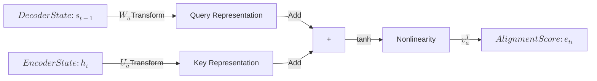
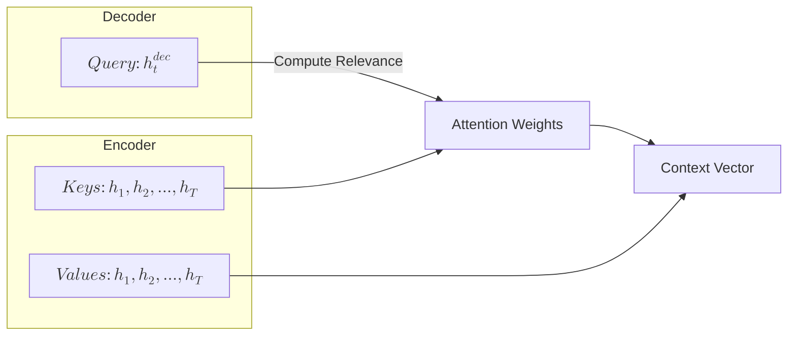
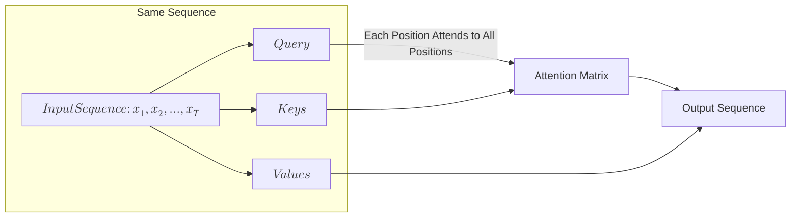
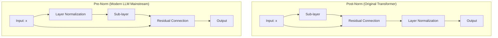
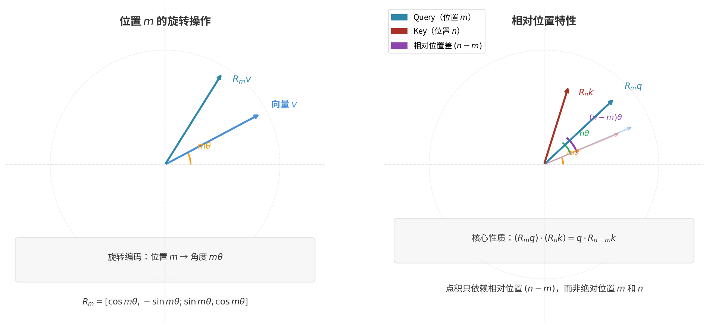
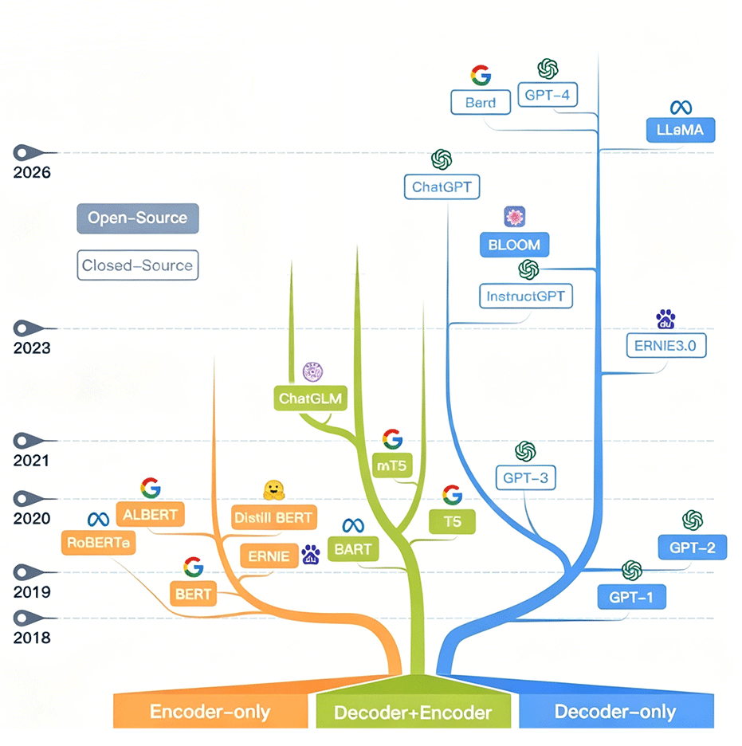

# Transformer Fundamentals

In the history of machine learning, 2017 was a watershed year. That year, Google published the famous paper "[Attention is All You Need](https://arxiv.org/abs/1706.03762)", proposing the astonishing idea of completely abandoning recurrent neural networks and using only attention mechanisms to solve memory and dependency problems. The technical architecture carrying this vision is the **Transformer**, whose historical mission was to break the parallel shackles imposed by RNNs on language models. Because RNNs require the output at each time step to take the hidden state of the previous time step as input, no matter how powerful the hardware's parallel capabilities are, computation must be serial. The slogan "Attention is All You Need" reads like a manifesto declaring war on RNNs, conveying a radical message: no need for LSTM! No need for GRU! No need for any recurrent structure! A powerful sequence model can be built using only the attention mechanism. This assertion sparked considerable controversy at the time, but subsequent practice proved it entirely correct. BERT, GPT, LLaMA, Claude, DeepSeek — these shining names are all achievements built upon the Transformer architecture.

This article will start from the predicament of RNNs, gradually build the intuition and mathematical formulation of Self-Attention, and finally assemble the complete Transformer architecture, exploring how it gave rise to two completely different technical paths: BERT and GPT.

## From Recurrent Dependency to Attention

To understand the Transformer architecture, one must first understand the problem it aims to solve. The 2014 [Seq2Seq](../../deep-learning/sequence-models/seq2seq.md) architecture resolved the information bottleneck, but it was still based on [LSTM/GRU](../../deep-learning/sequence-models/lstm-gru.md). The root of the recurrent neural network's limitations lies in **sequential recurrent dependency**: the computation at time step $t$ must wait for time step $t-1$ to complete, because the input at the current time step must include the hidden state from the previous time step. This relay-race style of information transfer means each position in the sequence cannot be processed independently. Modern GPUs have thousands of computing cores and excel at large-scale parallel computation. But the sequential dependency design of RNNs inherently prevents parallel computation, forcing GPUs to execute serially and severely wasting computational resources — this is the problem Transformer sets out to solve.

Another drawback of sequential dependency is long-distance information decay. When information propagates through LSTM's state chain, each time step undergoes a linear transformation and nonlinear activation. Even well-designed gating mechanisms can only alleviate but cannot completely prevent gradual information loss. Suppose the sequence length is 100; for information at time step 1 to reach time step 100, it must go through 99 LSTM transformations. Each transformation compresses and filters the information, so information from early time steps becomes increasingly diluted during propagation. This is like playing the telephone game: the first person says "Meeting at 3 PM in the library," the tenth person might hear "Meeting in the afternoon," and by the hundredth person, only "Meeting" remains.

### Bahdanau Attention

Initially, researchers attempted to use the Bahdanau attention mechanism to address the above problems. Bahdanau attention (also known as additive attention) was proposed by Dzmitry Bahdanau in 2014 as an improvement to the Seq2Seq architecture. Unlike the original Seq2Seq, the decoder, when generating each word, no longer relies solely on a single fixed encoding vector, but dynamically selects relevant information from all the encoder's hidden states. Specifically, the encoder remains unchanged, still encoding the input sequence into a series of hidden states $(h_1, h_2, ..., h_T)$. The decoder's hidden state $s_t$ at time step $t$ computes alignment scores with each previous encoder hidden state, then normalizes them via Softmax to obtain attention weights, and finally computes a weighted sum to produce the context vector $c_t$:

$$c_t = \sum_{i=1}^{T} \alpha_{ti} h_i$$

$\alpha_{ti}$ is called the **attention weight**, which determines how much the decoder at time step $t$ attends to the encoder hidden state $h_i$. This is analogous to how words in human language have anaphoric and syntactic relationships with preceding text. For example, in the sentence "The cat, which already ate a fish, **was** hungry," the word "was" should attend to "cat" rather than "fish." Attention weights act like a spotlight aimed at the encoder's hidden states from all previous time steps, casting different intensities of light on different positions of the encoder. The higher the weight, the more clearly information from that position is extracted, while other positions remain relatively dim. The attention weights in Bahdanau attention are obtained by computing alignment scores through a feedforward neural network, followed by Softmax normalization:

$$\alpha_{ti} = \frac{\exp(e_{ti})}{\sum_{j=1}^{T} \exp(e_{tj})}, \quad e_{ti} = v_a^T \tanh(W_a s_{t-1} + U_a h_i)$$

where $e_{ti}$ (the logits for Softmax) is the **Alignment Score**, which measures how much the decoder at time step $t$ attends to the encoder position $i$. In the earlier example, when processing "was," the alignment score for "cat" should be higher than for other words. The two parameter matrices ($W_a$, $U_a$) and one vector ($v_a$) in the $e_{ti}$ formula are all learned during neural network training. Their roles are:

- **$W_a$ (Query Transformation Matrix)**: Maps the decoder's hidden state $s_{t-1}$ into the attention space. $s_{t-1}$ represents "what the decoder is currently looking for," and $W_a$ transforms this intention into a form suitable for matching with encoder states. Its shape is typically $(d_{att}, d_{dec})$, where $d_{att}$ is the attention hidden dimension and $d_{dec}$ is the decoder hidden state dimension.

- **$U_a$ (Key Transformation Matrix)**: Maps the encoder's hidden state $h_i$ into the attention space. $h_i$ represents "what information is available" at encoder position $i$, and $U_a$ transforms this information into a form suitable for matching with queries. Its shape is typically $(d_{att}, d_{enc})$, where $d_{enc}$ is the encoder hidden state dimension.

- **$v_a$ (Score Vector)**: Projects the attention hidden layer output into a scalar score. The role of $v_a$ is to extract a single numerical value from the mixed representation as the alignment score. Its shape is $(d_{att}, 1)$, which can be understood as a weighted sum of the attention hidden layer.

The query transformation matrix $W_a$, key transformation matrix $U_a$, and score vector $v_a$ above inspired the design of Query, Key, and Value in the subsequent self-attention mechanism. The entire computation process of Bahdanau attention weights can be illustrated by the following diagram:


*Figure: Bahdanau Attention Computation*

Compared to the pre-improvement Seq2Seq architecture, the Bahdanau attention mechanism brings three significant advantages. First, **dimensional flexibility**: $W_a$ and $U_a$ can have different input dimensions, allowing the encoder and decoder to use different hidden state sizes. This is particularly useful when the encoder and decoder have different network structures. Second, **nonlinear modeling capability**: the tanh activation function allows the model to learn more complex alignment patterns beyond simple similarity computation. Third, **learnable matching mechanism**: all three parameter matrices are learnable, allowing the model to automatically discover the optimal alignment strategy through training without manual design of alignment functions.

Under the Bahdanau attention mechanism, the decoder can directly see all time steps of the encoder, without relying on a single encoding vector. However, Bahdanau attention is a type of **Cross-Attention**, connecting two different sequences — the encoder and the decoder. Within the encoder and decoder, LSTM/GRU are still used to handle sequential dependencies. The encoding process remains serial, and the long-distance dependency problem persists when processing input sequences. In the design of the Bahdanau attention mechanism, attention was merely an auxiliary tool, with LSTM/GRU serving as the core engine. It is like equipping a horse-drawn carriage with satellite navigation — it can see farther, but the power system remains horses. This design means the serial computation problem is not fundamentally solved.

The Transformer architecture proposes a more radical improvement over the Bahdanau attention mechanism, elevating attention from "assistant" to "core," abandoning LSTM and GRU entirely, and using only the attention mechanism to handle dependencies in sequences. This change finally breaks the shackles of sequential dependency, allowing the attention mechanism to process all positions in a sequence simultaneously in a single computation, achieving true parallelization.

### Self-Attention

The transition from Bahdanau attention to **Self-Attention** in the Transformer architecture is not merely a change in technical details but a shift in design philosophy. Understanding this transition is essential to truly mastering the Transformer. This section will provide a detailed comparison between cross-attention and self-attention, and explain how self-attention breaks the sequential chain.

The reason Bahdanau attention is called cross-attention is that its Query comes from the decoder, while its Key and Value come from the encoder. When generating each word, the decoder must first ask the encoder: which part of the input sequence should I attend to?


*Figure: Cross-Attention*

The diagram above shows the information flow of cross-attention: the decoder provides the query, the encoder provides the keys and values, and during the attention computation, the two cross-correlate. The output context vector is the result of a dialogue between two sequences. **Self-Attention** is different: the query, key, and value all come from the same input sequence, without relying on an encoder or decoder. Each position in the sequence can see all other positions, establishing direct associations between any two positions.


*Figure: Self-Attention*

The diagram above shows the information flow of self-attention: the same input sequence generates three representations — query, key, and value — and each position can simultaneously attend to all positions. Each token can introspect within the sequence itself. Suppose the input sequence is "cat sits on mat," containing four tokens. Self-attention allows each token to simultaneously see all other tokens and compute their degree of relevance. When processing the token "cat," it simultaneously attends to all tokens in the sequence: attending to "cat" itself to understand what the subject is, attending to "sits" to understand the subject's action, attending to "mat" to understand the object related to the action, with lower attention to "on" since prepositions contribute less to understanding the subject. Similarly, when processing the token "mat," it simultaneously attends to all tokens: attending to "mat" itself to understand what the object is, attending to "sits" to understand the relationship with the action, attending to "cat" to understand who is on the mat, with lower attention to "on."

In this design, tokens no longer have computational constraints based on sequential order. Each position can independently compute its attention weights, and all positions are processed simultaneously — there is no longer a serial dependency where time step 1 processes "cat," time step 2 processes "sits," and so on. With this, the two major drawbacks of the Seq2Seq architecture are finally and completely resolved:

- **Parallel computation**: All positions can be computed simultaneously, fully leveraging the GPU's parallel capabilities. When the sequence length is $T$, an RNN requires $T$ serial computations, while self-attention requires only 1 (ignoring internal matrix operation details) parallel computation. It is precisely because of this breakthrough that "language models" could evolve into "large language models" with tens of billions of parameters.
- **Distance decay**: Each position can directly see all other positions, with no distance decay in information propagation. The relationship between position 1 and position 100 is computed in exactly the same way as the relationship between position 1 and position 2 — there is no "telephone game" information loss. It is precisely because of this breakthrough that sequence models could advance from processing short texts of a few sentences to handling large documents with tens of thousands or even hundreds of thousands of tokens.

## Mathematical Formulation of Self-Attention

Now that we understand the background of self-attention's development, let us rigorously construct its mathematical formulation. The key to self-attention lies in the three vectors — Query, Key, Value — and the computation between them. This section first builds an intuitive understanding through an analogy, then gradually derives the complete mathematical formula.

The terms Query, Key, and Value are borrowed from the field of information retrieval. Imagine you are looking for a book on a library shelf. The retrieval process would be:

- **Query**: Your information need, such as "I want a beginner's book on machine learning," "I want books by author Zhou Zhiming," or "I want the book _[Deep Understanding of the Java Virtual Machine](https://book.douban.com/subject/24722612/)." This is what you use to query the system.
- **Key**: The inherent label attributes of each book, such as title, author, and classification number. This is what the system uses to match your need.
- **Value**: The content of the book itself. When you find the book through matching, what you want to obtain is naturally the book's content.

The self-attention mechanism compares your Query with the Key of each book, computing a relevance score that represents the degree of match. Books with higher matching scores contribute more to your output through their Values, while books with lower matching scores contribute less. Ultimately, you obtain a weighted combination of the Values of all books. The above is a human-intuition-based understanding of the attention mechanism. Let us now express the complete computation process of the attention mechanism in mathematical language:

Let $X = [x_1, x_2, ..., x_T]$ be the input matrix formed by the input sequence, with shape $(T, d_{model})$, representing $T$ positions, each being a $d_{model}$-dimensional embedding vector. The self-attention mechanism projects the input vector into three different semantic spaces: the Query space for asking, the Key space for matching, and the Value space for outputting information. Stacking these three vectors for each position $i$ in the sequence yields three matrices:

$$Q = [query_1, query_2, ..., query_T]^T, \quad K = [key_1, key_2, ..., key_T]^T, \quad V = [value_1, value_2, ..., value_T]^T$$

As discussed in [Geometric Intuition of Linear Transformations](../../maths/linear/matrices.md#geometric-intuition-of-linear-transformations), the essence of a matrix is a converter for linear transformations of data. Transformer uses three learnable parameter matrices $W^Q, W^K, W^V$ to accomplish the transformation between the three semantic spaces:

$$Q = XW^Q, \quad K = XW^K, \quad V = XW^V$$

These three parameter matrices allow the model to flexibly learn three different capabilities: "how to ask," "how to be matched," and "how to provide information." They are the only learnable parameters within the self-attention layer. In terms of their position and function in the neural network, they can be regarded as the "weights" of the self-attention layer, similar to the weight matrices of a fully connected layer. The difference is that they are not independent neural network layers but parameters within a single self-attention module. In code implementation, they are typically defined as three independent `nn.Linear` layers without bias. Initially, these matrices are randomly initialized; after extensive backpropagation training on large amounts of data, they learn to project input vectors into the appropriate semantic spaces.

### Scaled Dot-Product Attention

After obtaining $Q$, $K$, and $V$, the next step is to compute the attention weights and output. The weight computation method used by Transformer is called **Scaled Dot-Product Attention**, with the formula:

$$[att_eq]Attention(Q, K, V) = Softmax\left(\frac{QK^T}{\sqrt{d_k}}\right)V$$

This formula is now widely known. Whether or not the audience understands its content, it has become synonymous with attention computation in many promotional contexts. It consists of four steps: relevance score computation, attention scaling, normalization, and weighted summation:

- **Step 1: Compute Relevance Scores**: $QK^T$ represents the relevance scores between each pair of positions in the sequence. Specifically, it measures the degree of attention that position $i$ pays to position $j$ through the [dot product](../../maths/linear/vectors.md#inner-product-and-projection) of the Query vector $query_i$ at position $i$ and the Key vector $key_j$ at position $j$. As discussed in [Vector Basics](../../maths/linear/vectors.md), the larger the dot product, the more similar the two vectors, and the higher the degree of attention.

- **Step 2: Scale**: Multiply the relevance scores by the scaling factor $\frac{1}{\sqrt{d_k}}$. This is an engineering innovation in the Transformer paper.

    The $d_k$ in the scaling factor is the dimension of the Key vector (which is also the dimension of the Query vector). In Transformer's design, the projection dimensions of Query and Key are the same, collectively denoted as $d_k$, while the projection dimension of Value is denoted as $d_v$. The original paper sets $d_k = d_v = d_{model} / h$, where $h$ is the number of attention heads (multi-head attention will be introduced later).

    Softmax computes the proportion of each logit, so mathematically, scaling does not affect the result. However, it affects training efficiency in practice. Assuming each element of $query_i$ and $key_j$ is an independent and identically distributed random variable with mean 0 and variance 1, then the dot product $query_i \cdot key_j = \sum_{l=1}^{d_k} query_{il} \cdot key_{jl}$ still has mean 0, but the variance becomes $d_k$ (because it is the sum of $d_k$ independent random variables). When $d_k$ is large, the dot product values become very large, causing the Softmax function to enter its saturation region. In the saturation region, the gradient of Softmax approaches 0, making training difficult. The scaling factor $\frac{1}{\sqrt{d_k}}$ normalizes the variance of the dot product to 1, keeping Softmax in the non-saturated region and improving training efficiency.

- **Step 3: Softmax Normalization**: Apply Softmax to the scaled score matrix, converting the scores into a probability distribution. $\alpha_{ij}$ represents the attention weight of position $i$ to position $j$, satisfying $\sum_{j=1}^{T} \alpha_{ij} = 1$. This means the sum of attention weights from each position to all positions is 1, forming a valid probability distribution.

    $$\alpha_{ij} = \frac{\exp(q_i \cdot k_j / \sqrt{d_k})}{\sum_{l=1}^{T} \exp(q_i \cdot k_l / \sqrt{d_k})}$$   

- **Step 4: Weighted Summation**: Use the attention weights to compute a weighted sum of the Values:

    $$output_i = \sum_{j=1}^{T} \alpha_{ij} v_j$$

    The output at position $i$ is the weighted sum of Values at all positions. The overall formula can be understood as each position dynamically deciding which positions to extract information from based on its similarity to other positions. The final output is a vector that fuses global information.

### Computation Walkthrough

Below is a concrete example demonstrating the complete computation flow of the self-attention mechanism. Suppose the input sequence is "cat sits on mat," with 4 tokens, each having an embedding dimension $d_{model} = 4$, and projection dimensions $d_k = d_v = 3$. The following code shows the complete process of linear transformation to generate Q/K/V, scaled dot-product attention computation, and the final weighted summation output.

```python runnable
import torch
import torch.nn.functional as F

# Input sequence: 4 tokens, each with 4-dimensional embedding
# Assume it has already been processed by the embedding layer
X = torch.tensor([
    [0.1, 0.2, 0.3, 0.4],  # cat
    [0.5, 0.6, 0.7, 0.8],  # sits
    [0.2, 0.1, 0.4, 0.3],  # on
    [0.3, 0.4, 0.1, 0.2],  # mat
])

print(f"Input matrix X shape: {X.shape} (sequence length x embedding dimension)")

# Learnable projection matrices (randomly initialized)
d_model = 4
d_k = 3
torch.manual_seed(42)

W_Q = torch.randn(d_model, d_k)
W_K = torch.randn(d_model, d_k)
W_V = torch.randn(d_model, d_k)

# Linear transformation to generate Q, K, V
Q = X @ W_Q  # (4, 3)
K = X @ W_K  # (4, 3)
V = X @ W_V  # (4, 3)

print(f"Q shape: {Q.shape} (sequence length x projection dimension)")
print(f"K shape: {K.shape}")
print(f"V shape: {V.shape}")

# Compute attention scores
scores = Q @ K.T  # (4, 4)
print(f"\nAttention score matrix (before scaling):\n{scores}")

# Scale
scores_scaled = scores / (d_k ** 0.5)
print(f"\nAttention score matrix (after scaling):\n{scores_scaled}")

# Softmax normalization
attention_weights = F.softmax(scores_scaled, dim=-1)
print(f"\nAttention weight matrix:\n{attention_weights}")
print(f"Each row sums to 1: {attention_weights.sum(dim=-1)}")

# Weighted summation
output = attention_weights @ V
print(f"\nOutput matrix shape: {output.shape}")
print(f"Output matrix:\n{output}")
```

## Transformer Components

The self-attention mechanism is the core of the Transformer architecture, but a complete Transformer requires the coordination of other components. This section prepares for assembling the complete model by introducing key components: multi-head attention, feed-forward networks, residual connections, and layer normalization.

### Multi-Head Attention

In natural language, relationships between words are diverse: syntactic relations (subject-verb agreement), attribute relations (adjective-noun modification), anaphoric relations (pronoun-antecedent associations)... A single attention mode struggles to capture these different types of relationships simultaneously. Consider the sentence "那只猫坐在垫子上，它看起来很舒服" ("The cat sat on the mat, it looks very comfortable"). The token "它" (it) needs to establish multiple types of relationships with other tokens:
- Anaphoric relation: pointing to "猫" (cat) rather than "垫子" (mat).
- Syntactic relation: forming a subject-predicate structure with "看起来" (looks).
- Semantic relation: forming a semantic collocation with "舒服" (comfortable).
- ...

Single-head attention at each position produces only one set of attention weight distributions. Through attention, we can know that "它" (it) is related to "垫子" (mat), "看起来" (looks), and "舒服" (comfortable), but we cannot clearly describe the differences between these relationships. All positions share the same set of projection parameter matrices $W^Q, W^K, W^V$, meaning the model must compress various relational patterns — anaphoric, attributive, syntactic, semantic, causal, etc. — into a single abstract Query-Key matching pattern. Single-head attention outputs only one attention distribution, which must simultaneously account for all relationships, diluting the information for each relationship and causing interference between different relations.

To solve the information dilution problem, the most straightforward idea is to increase the dimension of the projection matrices, expanding information capacity. For example, increasing $d_k$ from 64 to 512 increases the parameter count of $W^Q, W^K, W^V$ by a factor of 8, which indeed enhances the model's representational power. However, this approach still has two problems:

1. **Reduced parameter efficiency**: Larger projection matrices mean more parameters, which are not easily utilized efficiently. Experiments show that single-head attention with large dimensions has lower parameter efficiency than the multi-head attention introduced next.
2. **Lack of structured representation**: Regardless of the dimension, what is learned is still a mixed relational representation, making it difficult to explicitly distinguish different types of relationships. The model must implicitly learn how to encode different relationships into the same vector space from data, increasing learning difficulty.

Thus, the **Multi-Head Attention** solution naturally emerges: running multiple independent single-head attentions in parallel, with each **Head** learning a different attention pattern. Finally, the outputs of all heads are concatenated, allowing the model to observe the sequence from multiple perspectives simultaneously. For a concrete example, consider replacing a single-head attention with dimension $d_{model} = 512$ with 8 multi-head attentions each of dimension 64. The total parameter count is the same for both designs, as shown in the table below:

| Design | Heads | Dim per Head | Projection Matrix Shape | Parameter Count |
|:-------|:------|:-------------|:------------------------|:----------------|
| Single-Head | 1 | 512 | $W^Q, W^K, W^V \in \mathbb{R}^{512 \times 512}$ | $3 \times 512 \times 512 = 786,432$ |
| Multi-Head | 8 | 64 | $W_i^Q, W_i^K, W_i^V \in \mathbb{R}^{512 \times 64}$ | $8 \times 3 \times 512 \times 64 = 786,432$ |

Multi-head attention does not incur additional learning costs. With the same parameter count, it accommodates relational diversity. There is no longer a need for a single "big head" to implicitly blend all relational patterns; each head can learn a different attention pattern. Head 1 might focus on syntactic relations, head 2 on semantic relations, and so on.

Multi-head attention naturally tends to capture different relationships. As long as each head is assigned different random initial values, gradient descent will optimize along different paths, causing natural differentiation among heads. Even in the rare case where two heads happen to have very close initial values and similar optimization paths, learning similar relationships, the regularization penalty mechanisms (such as L2 regularization, Dropout) will force them to differentiate and learn different relationships, since they share the same loss function (the gradients of each head during optimization are independent, but the optimization target is the same loss function). This ensures that the model can efficiently capture diverse attention patterns. This divide-and-conquer strategy makes each head's learning objective clearer and training more effective.

### Feed-Forward Network

When reading the sentence "Apple released a new phone," the attention mechanism helps us discover the associations between "Apple," "released," and "phone." However, understanding that "Apple" here refers to the tech company rather than the fruit, that "released" means product launch rather than a throwing action, and that the entire sentence describes a business event — all of these require semantic processing. Attention is responsible for "where to look," while semantic processing is responsible for "understanding what is seen."

Transformer adds a **Feed-Forward Network (FFN)** after each attention layer to perform semantic processing, understanding, refining, and transforming the collected information. FFN is a network concept contrasted with RNN, emphasizing forward information flow without feedback connections. In the general multi-layer network context, FFN and MLP can be considered the same type of network (one emphasizing information flow, the other emphasizing structure). However, in the Transformer context, FFN is specifically defined as a fully connected network with only two layers, where the hidden layer dimension is typically 4 times the input/output layer dimension. Its mathematical representation is:

$$FFN(x) = ReLU(xW_1 + b_1)W_2 + b_2$$

The first layer of FFN expands the dimension from $d_{model}$ to $d_{ff}$ (typically $4 \times d_{model}$), applies the ReLU activation function to introduce nonlinearity, and the second layer compresses the dimension from $d_{ff}$ back to $d_{model}$.

Semantic processing is essentially a [pattern matching](https://en.wikipedia.org/wiki/Pattern_matching) process. Certain feature combinations in the input vector correspond to a concept and need to be recognized and activated. A two-layer feedforward network is perfectly suited for this type of task. The first layer projects the input into a high-dimensional space, where each hidden neuron can learn to recognize a feature combination (such as the semantic features of "Apple the tech company"), and ReLU activates the matching patterns. The second layer combines the activated patterns back into the output space.

Using deeper networks for semantic processing is also possible, but research shows that two layers are sufficient. Semantic processing is different from complex function approximation; it is a sparse pattern activation process. According to experiments, the FFN in language models actually performs operations similar to key-value memory retrieval: the first layer weights act as "keys" to match input patterns, and the second layer weights act as "values" to output corresponding knowledge. The two-layer structure exactly corresponds to this "match-retrieve" process.

### Residual Connections

When Transformer stacks multiple layers, information must undergo dozens or even hundreds of transformations to propagate from the input layer to the output layer. Taking GPT-3 as an example, it has 96 Transformer layers, each containing an attention sub-layer and a feedforward sub-layer, meaning information undergoes nearly 200 transformations. Each transformation processes the information but also carries the risk of vanishing or exploding gradients, making it difficult to effectively update parameters in deep layers.

The solution of residual connections is very straightforward: directly add the sub-layer's input to its output, allowing the network to learn residual relationships rather than complete mappings. This design is clearly derived from the idea of [ResNet](../../deep-learning/convolutional-neural-network/resnet.md). If the ideal transformation of a certain layer is the identity mapping (output equals input), it is much easier for the network to learn $F(x) = 0$ than to learn $F(x) = x$. Gradients can be directly propagated through the residual path without going through the sub-layer's complex transformations.

Another benefit of residual connections is information preservation. The output of each layer contains information from the original input. Even after multiple layers of transformation, early information is not completely lost. This is particularly useful for language models: the subject of a sentence may appear at the beginning while the predicate appears at the end, and the model certainly needs to remember what the subject is when processing the predicate.

### Layer Normalization

Transformer uses residual connections to solve the gradient propagation problem, and uses layer normalization to solve the numerical stability problem. **Layer Normalization (LN)** is a variant of [Batch Normalization](../../deep-learning/neural-network-stability/batch-normalization.md). Its function is the same as batch normalization: normalizing the features of each position to a similar numerical distribution range. For deep networks, the numerical range of each layer's output can vary widely — some layers have outputs concentrated around 0, while others may have outputs reaching hundreds or even thousands. This inconsistency in numerical distribution leads to training instability and difficulty in adjusting the learning rate.

The difference between layer normalization and batch normalization lies in the normalization dimension. Batch normalization computes mean and variance along the batch dimension, while layer normalization computes statistics along the feature dimension. This makes layer normalization independent of batch size, with statistics coming entirely from within a single sample. Layer normalization is naturally suitable for RNNs and Transformers: the hidden state at each time step can be independently normalized, and training and inference behavior remain consistent.

Let $\mu_L$ and $\sigma_L^2$ be the mean and variance of all features of a sample, $x$ be the input vector, and $d$ be the feature dimension (i.e., the vector length). Their formulas are:

$$\sigma_L^2 = \frac{1}{d}\sum_{j=1}^{d} (x_j - \mu_L)^2, \quad \mu_L = \frac{1}{d}\sum_{j=1}^{d} x_j$$

Then, together with two learnable scaling and shifting parameters $\gamma$ and $\beta$ (which serve the same function as the two correction factors in BN), the model can restore the original distribution characteristics:

$$LayerNorm(x) = \frac{x - \mu}{\sigma} \cdot \gamma + \beta$$

There are two design choices for the combination order of residual connections and layer normalization. The original Transformer uses **Post-Norm**: first compute the sub-layer (attention layer or FFN layer), then add the residual, and finally normalize. This design is prone to gradient vanishing when training deep networks, requiring carefully designed learning rate warmup strategies. Consider a 12-layer Post-Norm model: gradients traveling from layer 12 to layer 1 must pass through 12 layer normalizations, each of which scales the gradient, with the cumulative effect causing very small gradients in the shallower layers.

Modern LLMs (such as GPT, DeepSeek) generally use **Pre-Norm**: first normalize, then compute the sub-layer, and finally add the residual. This design allows gradients to propagate directly through the residual path to any deep layer, since there is no layer normalization on the residual path. Training is more stable and allows for larger learning rates. Experiments show that Pre-Norm significantly outperforms Post-Norm in deep networks (more than 12 layers), which is one of the key technologies enabling modern large language models to stack hundreds of layers.


*Figure: Post-Norm vs Pre-Norm*

## Positional Encoding

The self-attention mechanism solves the two major problems of sequential dependency and long-distance information decay, but it also introduces a new problem: it is unaware of the order of positions in the sequence. If the input sequence "the cat sits on the mat" is shuffled to "mat the on sits cat," the self-attention computation process and results remain exactly the same — only the row and column order of the attention matrix changes. For natural language, meaning is not only contained in tokens; a significant portion of semantics is embedded in position. For example, "dog bites man" and "man bites dog" have completely different meanings. Transformer uses **Positional Encoding** to inject position information, allowing the model to know each token's position in the sequence. The design of positional encoding must satisfy the following requirements:

- **Uniqueness**: Each position should have a unique encoding, and encodings at different positions should be distinguishable.
- **Determinism**: The encoding should be deterministic and not require learning from data.
- **Extrapolation capability**: It should be able to handle sequence lengths not seen during training.
- **Relative position awareness**: The model should be able to learn relative position relationships, not just memorize absolute positions.

### Sinusoidal Positional Encoding

The original Transformer paper uses **Sinusoidal Positional Encoding**, a fixed (non-learnable) encoding method that uses a set of sine and cosine functions at different frequencies to encode position information, forming a positional fingerprint. The positional encoding is a matrix of shape $(\text{sequence length}, d_{model})$. Let $pos$ be the position index $(0, 1, 2, ...)$, representing the token's position in the sequence; $i$ be the dimension index $(0, 1, 2, ..., d_{model}/2 - 1)$, where even dimensions use sin and odd dimensions use cos. Each element in the positional encoding matrix is computed as:

$$PE_{pos, 2i} = \sin\left(\frac{pos}{10000^{2i/d_{model}}}\right)$$

$$PE_{pos, 2i+1} = \cos\left(\frac{pos}{10000^{2i/d_{model}}}\right)$$

The design of Sinusoidal positional encoding is quite clever, as can be seen from the following three aspects:

- **Multi-frequency representation**. The positional encoding uses a set of sine and cosine functions at different frequencies. The term $10000^{2i/d_{model}}$ in the formula determines the period of different dimensions. Low dimensions use high-frequency signals (short periods), capable of distinguishing adjacent positions; high dimensions use low-frequency signals (long periods), capable of capturing global positional relationships. This is analogous to multi-resolution analysis in audio processing, where different frequencies capture information at different scales.

- **Relative position encoding capability**. This is the most critical property of Sinusoidal encoding. For a fixed offset $k$, $PE_{pos+k}$ can be expressed as a linear function of $PE_{pos}$. Using trigonometric identities:

    $$\sin(a + b) = \sin a \cos b + \cos a \sin b$$
    $$\cos(a + b) = \cos a \cos b - \sin a \sin b$$

    We can derive:

    $$PE_{pos+k, 2i} = PE_{pos, 2i} \cdot \cos\left(\frac{k}{10000^{2i/d_{model}}}\right) + PE_{pos, 2i+1} \cdot \sin\left(\frac{k}{10000^{2i/d_{model}}}\right)$$

    This means the model can learn the concept of relative position — that "how far apart are position $i$ and position $j$" is more important than "what is position $i$." In natural language, the relationship between "cat" and "sits" depends mainly on how far apart they are, not on their absolute positions.

- **Basic extrapolation capability**. Sinusoidal encoding is a continuous function, not a discrete lookup table. This means it can handle position lengths not seen during training. If the maximum sequence length during training is 512, the encoding formula can still compute reasonable values when encountering position 600 during inference. This extrapolation capability is very important for processing long texts.

In use, the positional encoding is directly added to the input word embedding vector: $input = Embedding(x) + PE$. Each token's representation contains both semantic information (the word embedding vector) and position information (the positional encoding). The design of addition rather than concatenation keeps the model dimension clean, and position information and semantic information are automatically separated and fused in subsequent transformations.

### RoPE (Rotary Position Embedding)

Sinusoidal encoding is a type of absolute positional encoding. "Absolute" means it directly encodes "this is the $pos$-th position." Although it has the ability to express relative position encoding, the positional encoding itself takes the form of absolute positions. Modern LLMs generally use **Rotary Position Embedding (RoPE)**, proposed by Su Jianlin in 2021. This is a type of relative positional encoding that records "the relative distance between position $i$ and position $j$." The idea of RoPE is to encode position information as a rotation operation in vector space. For a 2D vector $x = [x_1, x_2]^T$ at position $m$, apply the rotation matrix $R_m$:

$$R_m = \begin{bmatrix} \cos m\theta & -\sin m\theta \\ \sin m\theta & \cos m\theta \end{bmatrix}$$

The rotated vector $R_m x$ contains both the original vector information and the position $m$ information. For high-dimensional vectors, they can be divided into several 2D subspaces, each independently applying rotation with a different frequency $\theta_i$:

$$\theta_i = 10000^{-2i/d} = \frac{1}{10000^{2i/d}}$$

where $i$ is the dimension index, ranging $[0, d/2-1]$, and $d$ is the embedding dimension. Clearly, this design inherits the frequency design from Sinusoidal encoding. The denominator $10000^{2i/d}$ is the key controlling the periods of different dimensions. RoPE transforms the frequency concept from additive encoding into rotational encoding, forming a multi-scale positional representation from high to low frequencies:

| Dimension $i$ | $\theta_i$ Value | Wavelength | Role |
|:--------------|:-----------------|:-----------|:-----|
| $i=0$ (low dim) | $1.0$ | Short | Captures local/fine-grained positional relationships |
| $i=d/2-1$ (high dim) | $\approx 0.0001$ | Long | Captures global/long-distance positional relationships |

High-frequency dimensions (small $i$) are sensitive to position differences between adjacent tokens, with each step having a large rotation angle, capable of distinguishing fine-grained differences like "position 1" and "position 2." Low-frequency dimensions (large $i$) have extremely small rotation angles per step, with significant cumulative phase changes only over long distances, making them suitable for capturing global relationships like "100 positions apart." This multi-scale design allows the model to simultaneously possess fine-grained local position perception and stable global position perception. When processing a long sentence like "那只昨天在公园里被主人遗弃的猫看起来很伤心" ("The cat that was abandoned by its owner in the park yesterday looks very sad"), the model needs to know both that "猫" (cat) and "遗弃" (abandoned) are adjacent (local relationship) and that "猫" (cat) and "伤心" (sad) are far apart (global relationship). Multi-scale frequencies precisely meet this requirement.



*Figure: Left shows the rotation matrix at position $m$ rotating the vector by angle $m\theta$; right shows that after rotating the Query and Key at two positions, their dot product depends only on the relative position difference $(n-m)$*

When dealing with relative relationships, RoPE has a nice property: the dot product of Query and Key at two positions depends only on their relative position difference (as shown on the right side of the figure above):

$$(R_m q) \cdot (R_n k) = q \cdot R_{n-m} k$$

The proof of this property leverages the orthogonality of rotation matrices. The product of two rotation matrices $R_m^T R_n = R_{n-m}$, therefore:

$$(R_m q) \cdot (R_n k) = (R_m q)^T (R_n k) = q^T R_m^T R_n k = q^T R_{n-m} k$$

This means the attention score depends only on the relative position $(n-m)$, not on the absolute positions $m$ and $n$, which is more aligned with linguistic intuition: in "the cat sits on the mat," the relationship between "cat" and "sits" depends on how far apart they are, not on what positions they occupy.

RoPE and Sinusoidal positional encoding each have their advantages. Sinusoidal's advantage is its encoding simplicity and intuitiveness, making it easy to understand and implement. RoPE is slightly more complex, and its advantages are mainly reflected in the following three aspects:

- **Superior long-distance extrapolation capability**. RoPE's relative position property makes it easier for the model to generalize to sequence lengths not seen during training. When the sequence length exceeds the maximum length seen during training, RoPE can extend positional encoding through methods like interpolation, while Sinusoidal encoding's extrapolation capability is relatively more limited.
- **Natural integration with the attention mechanism**. RoPE directly acts on the dot product computation between Query and Key, rather than being added as an additional input to the embedding. This design allows position information to directly participate in the computation of attention weights, making it more natural and efficient.
- **Standard choice for modern LLMs**. LLaMA, GPT-NeoX, PaLM, DeepSeek, and other mainstream models all use RoPE, which has become the de facto standard for modern large language models. The widespread adoption by the community also means better tool support and practical experience.

## Assembling the Transformer Model

Having covered multi-head attention, feed-forward networks, residual connections, layer normalization, and positional encoding — the four core components of Transformer — we now have all the prerequisites for assembling the Transformer model. This section presents the complete Transformer model structure.

### Encoder Layer Structure

The four components of Transformer are not simply stacked; they have a clear division of labor and collaborative relationships. Together, they form an information cycle of "collect - process - transmit - stabilize," with each encoder layer executing this cycle once.

- **Multi-Head Self-Attention** is responsible for information collection, extracting global dependency relationships from the sequence, deciding "where to look."
- **Feed-Forward Network** is responsible for information processing, performing semantic understanding and transformation of the collected information, deciding "what is seen."
- **Residual Connection** is responsible for information transmission, ensuring smooth gradient flow and avoiding training difficulties in deep networks, deciding "how deep we can build."
- **Layer Normalization** is responsible for numerical stability, controlling the output distribution of each layer and preventing training collapse, deciding "whether convergence is successful."

We now combine these components into a complete encoder architecture. The original Transformer paper organizes these four components into two sub-layers: the "self-attention sub-layer" and the "feed-forward sub-layer." The following architecture diagram shows a complete Transformer encoder layer.

```nn-arch width=500
name: Transformer Encoder Layer
layout: horizontal
align: center

sections:
  - name: Input
    layers: [input]
  - name: Self-Attention Sub-layer
    layers: [mha, add1, ln1]
  - name: Feed-Forward Sub-layer
    layers: [ffn, add2, ln2]
  - name: Output
    layers: [output]

layers:
  - {id: input, name: "input", type: input, size: "(T, d_model)"}
  - {id: mha, name: "Attention", type: attention, size: "Multi-Head Attention"}
  - {id: add1, name: "+", type: residual, size: "Residual Connection"}
  - {id: ln1, name: "Post-Norm", type: norm, size: "Layer Normalization"}
  - {id: ffn, name: "FFN", type: dense, size: "Two-Layer FFN"}
  - {id: add2, name: "+", type: residual, size: "Residual Connection"}
  - {id: ln2, name: "Post-Norm", type: norm, size: "Layer Normalization"}
  - {id: output, name: "output", type: output, size: "(T, d_model)"}
```
*Figure: Transformer Encoder Layer*

The input vector $(T, d_{model})$ first enters the attention sub-layer, where multi-head self-attention collects global information from the sequence. It then enters the feed-forward sub-layer, where the FFN performs semantic processing of the information. Residual connections preserve the original representation. The final output has the same shape as the input, ensuring that multiple such encoder layers can be stacked.

This dual sub-layer design of "attention + feed-forward" has its rationale. The attention mechanism excels at establishing associations within a sequence, but its computation is linear — the output is a weighted sum of inputs, lacking nonlinear transformation capability. If multiple attention layers are stacked consecutively, the model's representational power would be limited. The addition of the feed-forward network breaks this linear structure, introducing more expressive nonlinear transformations and allowing each layer to perform deep processing of information.

The placement of residual connections and layer normalization also has its considerations. This section still uses the structure from the original Transformer paper, i.e., the Post-Norm form, which suffers from relatively severe gradient attenuation in deeper networks. As already explained in [Layer Normalization](#layer-normalization), modern LLMs generally adopt the Pre-Norm form, where the sub-layer computation is not affected by numerical fluctuations in the previous layer's output, and the residual connection directly adds the original input (unnormalized) to the output, allowing lossless gradient propagation.

The Transformer encoder consists of $N$ such encoder layers stacked together. The original paper uses $N=6$, with $d_{model}=512$ per layer, 8 attention heads, and a feed-forward network hidden dimension of $d_{ff}=2048$. Modern large language models far exceed this scale — GPT-3 has 96 layers, LLaMA-65B has 80 layers. The increase in layers means information undergoes more cycles of "collection and processing," with each layer further refining and integrating on top of the previous layer's representation, ultimately forming high-quality semantic representations.

Readers may wonder: theoretically, a single attention layer can already see all positions and should capture all dependencies. Why is high-quality semantics related to the number of stacked layers? In reality, the complexity of human language far exceeds the capacity of a single-layer model. Consider the sentence "那只昨天在公园里被主人遗弃的猫看起来很伤心" ("The cat that was abandoned by its owner in the park yesterday looks very sad"). Understanding that "伤心" (sad) modifies "猫" (cat) requires multi-layer reasoning:

- Layer 1: Establish basic word associations — "猫" (cat) makes preliminary connections with "遗弃" (abandoned) and "伤心" (sad).
- Layers 2-3: Identify modifying structures — "昨天在公园里" (yesterday in the park) modifies "遗弃" (abandoned), "被主人遗弃" (abandoned by owner) modifies "猫" (cat).
- Layers 4-5: Integrate semantic information — understand the causal relationship where "遗弃" (abandoned) leads to "伤心" (sad).
- Layer 6 and beyond: Form complete semantic representation — "猫" (cat) is the subject of "伤心" (sad), caused by "被遗弃" (being abandoned).
- ...

Each layer processes different levels of semantic information, from lexical associations to syntactic structures to semantic reasoning. This layered processing, layer-by-layer stacking modular design capability is the fundamental reason why the Transformer encoder has become the foundational architecture for modern NLP.

### Decoder Layer Structure

The encoder solves the problem of understanding the input sequence. But understanding alone is not enough; many tasks require generating new output sequences, such as machine translation, text summarization, dialogue systems, etc. These all need a component capable of generating output word by word — this is the decoder's responsibility. The original Transformer paper follows the Seq2Seq [Encoder-Decoder Architecture](../../deep-learning/sequence-models/seq2seq.md#encoder-decoder-architecture), where the decoder receives the encoder's output and generates the target sequence token by token.

The decoder shares a similar structural framework with the encoder. Both contain multi-head attention and feed-forward networks, and both use residual connections and layer normalization. However, the decoder also has two design differences: its self-attention layer is replaced by **Causal Self-Attention** and **Encoder-Decoder Cross-Attention**.

- **Causal Self-Attention**: The design intention is to constrain the decoder to only look at past positions in the sequence. Networks based on recurrent connections naturally satisfy this constraint, but in the Transformer architecture, the self-attention mechanism allows each position to see all positions in the entire sequence, including future positions beyond the current time step. This is reasonable for understanding tasks — when reading for comprehension, we can certainly read the entire text back and forth. But it is unreasonable for generation tasks: when the model generates the $t$-th word, it should not see the content at positions $t+1$ and beyond; otherwise, it would be copying rather than predicting.

    This constraint of only being able to see the past, not the future, is called the **Causality Constraint**. The method for implementing this constraint is the **Causal Mask**. The mathematical form of the causal mask is a matrix with the same shape as the attention score matrix. Let the attention score matrix be $S = QK^T / \sqrt{d_k}$, with shape $(T, T)$. The causal mask matrix $M$ is defined as:

    $$M_{ij} = \begin{cases} 0 & \text{if } j \leq i \\ -\infty & \text{if } j > i \end{cases}$$

    After applying the mask, the attention score matrix becomes $S' = S + M$. The score at position $i$ for position $j > i$ (future positions in the sequence) is adjusted to negative infinity, and after Softmax, the weight becomes 0:

    $$\alpha_{ij} = \frac{\exp(S'_{ij})}{\sum_{k=1}^{T} \exp(S'_{ik})} = \frac{\exp(-\infty)}{\sum_{k=1}^{T} \exp(S'_{ik})} = 0$$

    During training, the model is started in [Teacher Forcing](../../deep-learning/sequence-models/seq2seq.md#seq2seq-training) mode. Since the mask turns the attention matrix into a lower triangular matrix, each position can only attend to itself and previous positions. This design ensures that the decoder does not "peek" at future information during training, keeping training and inference behavior consistent.

- **Encoder-Decoder Cross-Attention**: The design intention is to solve the problem of "how the decoder sees the encoder." For example, in machine translation, when generating each word in the target language, it is necessary to refer to relevant information from the source language sentence. This is like the decoder asking questions and the encoder answering. The decoder says, "I need to generate a verb now; where is the relevant information in the source sentence?" (Query). The encoder compares the query with labels (Key), finds the most relevant information (Value), and tells the decoder. The structure of cross-attention is consistent with self-attention, except that the sources of Query, Key, and Value are different. The Query comes from the decoder's representation at the current position, while the Key and Value come from the encoder's outputs at all positions. Therefore, it is a type of Cross-Attention. Its mathematical expression is as follows, and can be compared with the self-attention formula {{att_eq}}:

    $$CrossAttention(Q, K, V) = Softmax\left(\frac{QK^T}{\sqrt{d_k}}\right)V$$

    where $Q \in \mathbb{R}^{T_{dec} \times d_k}$ comes from the decoder, and $K, V \in \mathbb{R}^{T_{enc} \times d_k}$ come from the encoder. The result is an attention weight matrix of shape $(T_{dec}, T_{enc})$, representing the degree of attention from each decoder position to each encoder position.

    Taking English-to-Chinese translation as an example, suppose the source sentence is "I love Beijing" and the target sentence is "我 爱 北京." When generating "北京," the decoder's Query computes relevance with the Keys at the three encoder positions, finds the highest relevance with "Beijing," and then extracts information from the Value corresponding to "Beijing" to help generate the correct translation. The information flow is shown in the following diagram.

    ```mermaid compact
    graph LR
        subgraph Decoder
            Q["Query: Decoder State"]
        end

        subgraph Encoder
            K["Keys: All Encoder Positions"]
            V["Values: All Encoder Positions"]
        end

        Q -->|"Compute Relevance"| ATT["Attention Weights"]
        K --> ATT
        ATT --> CTX["Context Vector"]
        V --> CTX
        CTX --> OUT["Fuse Encoder Information"]
    ```
    *Figure: Cross-Attention Information Flow*

With an understanding of the design of causal self-attention and encoder-decoder cross-attention, we can now construct the complete structure of the decoder layer. A complete Transformer decoder layer contains three sub-layers. The input vector first enters the causal self-attention sub-layer. After layer normalization, the causal self-attention collects information from the already-generated sequence, and the residual connection preserves the original representation. It then enters the cross-attention sub-layer, where the Query comes from the decoder, the Key and Value come from the encoder's output, and the cross-attention helps the decoder reference information from the source sequence. Finally, it enters the feed-forward sub-layer for semantic processing of the fused information. This is illustrated in the following diagram:

```nn-arch width=500
name: Transformer Decoder Layer
layout: horizontal
align: center

sections:
  - name: Input
    layers: [input]
  - name: Causal Self-Attention Sub-layer
    layers: [self_attn, add1, ln1]
  - name: Cross-Attention Sub-layer
    layers: [cross_attn, add2, ln2]
  - name: Feed-Forward Sub-layer
    layers: [ffn, add3, ln3]
  - name: Output
    layers: [output]

layers:
  - {id: input, name: "input", type: input, size: "(T_dec, d_model)"}
  - {id: ln1, name: "Post-Norm", type: norm, size: "Layer Normalization"}
  - {id: self_attn, name: "Self-Attn", type: attention, size: "Causal Self-Attention"}
  - {id: add1, name: "+", type: residual, size: "Residual Connection"}
  - {id: ln2, name: "Post-Norm", type: norm, size: "Layer Normalization"}
  - {id: cross_attn, name: "Cross-Attn", type: attention, size: "Cross-Attention"}
  - {id: add2, name: "+", type: residual, size: "Residual Connection"}
  - {id: ln3, name: "Post-Norm", type: norm, size: "Layer Normalization"}
  - {id: ffn, name: "FFN", type: dense, size: "Two-Layer FFN"}
  - {id: add3, name: "+", type: residual, size: "Residual Connection"}
  - {id: output, name: "output", type: output, size: "(T_dec, d_model)"}
```
*Figure: Transformer Decoder Layer*

The Transformer architecture's decoder and encoder layers share the same structural framework, each with their own characteristics in their attention sub-layers. The following table summarizes the comparison:

| Feature | Encoder Layer | Decoder Layer |
|:--------|:--------------|:--------------|
| Self-Attention Type | Bidirectional Self-Attention | Causal Self-Attention |
| Additional Attention | None | Encoder-Decoder Cross-Attention |
| Number of Sub-layers | 2 (Self-Attention + FFN) | 3 (Causal Self-Attention + Cross-Attention + FFN) |
| Information Source | Input sequence only | Input sequence + Encoder output |
| Typical Tasks | Understanding tasks (BERT) | Generation tasks (GPT) |
| Representative Model | BERT | GPT |

### Complete Encoder-Decoder Architecture

Combining the encoder and decoder gives the complete architecture of the original Transformer. The encoder is responsible for understanding the input sequence, encoding the semantic information of the source language sentence into a series of contextual representations. The decoder is responsible for generating the target sequence, predicting word by word based on the encoder's output. The two are connected through cross-attention, forming a collaborative "understand-generate" system. The forward computation flow during inference can be divided into two stages: encoding and decoding.

- **Encoding Stage**: From source sequence to contextual representation.

    The encoding stage transforms the input sequence into high-quality semantic representations. The encoder splits the input into a token sequence and converts it into vector representations through the word embedding layer. Each token corresponds to a $d_{model}$-dimensional vector, forming the input matrix $X_{enc} \in \mathbb{R}^{T_{enc} \times d_{model}}$, where $T_{enc}$ is the input sequence length. Positional encoding is then added to the word embeddings, injecting position information into the model.

    Next comes the stacked processing of encoder layers. The original Transformer uses $N=6$ encoder layers, each executing the same "collect-process" cycle. In the self-attention sub-layer, the multi-head attention mechanism allows each position to see the entire sequence. Residual connections pass the original input directly to the output, ensuring that early information is not lost in deep networks. Layer normalization stabilizes the numerical distribution, preventing gradient explosion or vanishing. In the feed-forward sub-layer, a two-layer fully connected network performs semantic processing of the collected information, identifying feature combinations and refining semantic concepts. After 6 layers of such processing, the encoder outputs a series of contextual representations $H_{enc} = [h_1, h_2, ..., h_{T_{enc}}]$, where each position $h_i$ has fused information from the entire input sequence.

- **Decoding Stage**: From contextual representation to target sequence.

    The decoding stage generates the target sequence word by word based on the encoder's output. During training, the Teacher Forcing method is used, taking the ground truth target sequence as the decoder's input. During inference, the partially generated sequence is used as input to autoregressively predict the next word.

    The target sequence first passes through the embedding layer and positional encoding, forming the input matrix $X_{dec} \in \mathbb{R}^{T_{dec} \times d_{model}}$. It then enters the stacked processing of decoder layers, each containing three sub-layers. The causal self-attention sub-layer allows the decoder to collect information from the already-generated sequence, with the causal mask ensuring each position can only see itself and previous positions. The cross-attention sub-layer is the dialogue window between the decoder and encoder, computing the degree of attention from each decoder position to each encoder position, helping the decoder find relevant information in the source sequence. The feed-forward sub-layer performs semantic processing of the fused information, serving the same function as the feed-forward network in the encoder.

    The output of the last decoder layer passes through layer normalization, then enters a linear layer that maps the dimension from $d_{model}$ to the vocabulary size $|V|$, followed by Softmax to obtain the probability distribution for the next word. The model selects the word with the highest probability (or samples according to [Temperature Sampling](../../deep-learning/sequence-models/seq2seq.md#temperature-sampling)) as the output, appends it to the already-generated sequence, and continues predicting the next word until an end-of-sequence token is generated or the maximum length is reached.

```nn-arch width=500
name: Complete Transformer Architecture
layout: parallel-columns

columns:
  - name: Encoder
    layers:
      - {id: enc_input, name: Input Embedding, type: embedding, size: "+ Positional Encoding"}
    blocks:
      - name: Encoder Block
        type: stack
        repeat: 6
        expand: false
        show_title: false
        layers:
          - {id: enc_mha, name: Attention, type: attention, size: "Multi-Head Attention"}
          - {id: enc_add1, name: Add & Norm, type: norm, size: "Add & Norm"}
          - {id: enc_ffn, name: FFN, type: dense, size: "Feed-Forward Network"}
          - {id: enc_add2, name: Add & Norm, type: norm, size: "Add & Norm"}

  - name: Decoder
    layers:
      - {id: dec_input, name: Output Embedding, type: embedding, size: "+ Positional Encoding"}
    blocks:
      - name: Decoder Block
        type: stack
        repeat: 6
        expand: false
        show_title: false
        layers:
          - {id: dec_masked_mha, name: Attention, type: attention, size: "Masked Causal Attention"}
          - {id: dec_add1, name: Add & Norm, type: norm, size: "Add & Norm"}
          - {id: dec_cross_attn, name: Attention, type: attention, size: "Cross-Attention"}
          - {id: dec_add2, name: Add & Norm, type: norm, size: "Add & Norm"}
          - {id: dec_ffn, name: FFN, type: dense, size: "Feed-Forward Network"}
          - {id: dec_add3, name: Add & Norm, type: norm, size: "Add & Norm"}
    layers_after_blocks:
      - {id: linear, name: Linear, type: dense, size: "Vocabulary Linear Mapping"}
      - {id: softmax, name: Softmax, type: activation, size: "Normalization"}

cross_connections:
  - {from: enc_add2, to: [dec_cross_attn, dec_cross_attn], labels: [K, V], label_position: "encoder"}

fork_connections:
  - {from: enc_input, to: enc_mha, labels: [Q, K, V]}
  - {from: dec_input, to: dec_masked_mha, labels: [Q, K, V]}
```

*Figure: Complete Transformer Architecture*

Below is a concrete example illustrating the autoregressive generation of the target sequence during inference. Taking English-to-Chinese translation, suppose the source sentence is "I love cats" and the target sentence is "我爱猫." The source sentence is fed to the encoder to obtain $H_{enc}$, then:

- Step 1: The decoder input is the start token `<s>`. After embedding, positional encoding, and 6 layers of decoder processing, it outputs the probability distribution over the vocabulary $P(w | <s>)$. Cross-attention helps the decoder focus on information in the encoder output related to the first word, finding that "I" is highly correlated with the first word. The model selects the highest probability word "我" as the output.

- Step 2: The decoder input becomes `<s> 我`. It outputs the probability distribution $P(w | <s>, \text{我})$. Cross-attention may find that "love" is highly correlated with the word to be generated, helping the model select "爱."

- Step 3: The decoder input becomes `<s> 我 爱`. It outputs the probability distribution $P(w | <s>, \text{我}, \text{爱})$. Cross-attention may find that "cats" is highly correlated with the word to be generated, helping the model select "猫."

This cycle continues until the end token `</s>` is generated or the maximum length is reached. Each generation step requires a complete execution of the decoder's 6 layers of processing, but the encoder's output $H_{enc}$ only needs to be computed once and can be reused in the cross-attention of each step.

## Evolution Paths

The influence of Transformer extends far beyond the encoder-decoder architecture for machine translation described in the paper. It directly gave rise to two completely different technical paths for language models today, represented by BERT and GPT. This section compares the design philosophies and application scenarios of these two paths, and explores why the GPT path became mainstream for large language models.

### Encoder-Only Path: BERT

**BERT** (Bidirectional Encoder Representations from Transformers), proposed by Google in 2018, implements only the encoder part of the Transformer architecture. The self-attention mechanism in the encoder allows each position to see all other positions, including context from both past and future time steps. Like a reading comprehension expert, it can simultaneously see the beginning and end of an article, establishing a global understanding. This bidirectional attention design allows the model to refer to complete contextual information when understanding each word. Take the English word "bank" as an example: in the sentence "He went to the bank to deposit money," the model can simultaneously see the key information "deposit money" and thus correctly understand that "He went to the bank" refers to a financial institution rather than a river bank. This capability makes BERT particularly suitable for "understanding" tasks such as reading comprehension, text classification, and named entity recognition.

BERT's pre-training objective is the **Masked Language Model (MLM)**. For example, randomly masking 15% of the words in the input sequence with the `[MASK]` token and having the model predict the masked words. For example:

- Input: "I [MASK] Beijing"
- Target: predict [MASK] = "love"

MLM forces the model to use bidirectional context to understand the meaning of each word. To correctly predict "love," the model needs to simultaneously understand "I" (subject) and "Beijing" (object), inferring that the middle should be a verb expressing a relationship. This training approach allows BERT to learn deep semantic understanding capabilities.

BERT also adds a special `[CLS]` token (Classification Token) at the beginning of each input sequence. After multiple layers of encoding, the final hidden vector corresponding to `[CLS]` aggregates the semantic information of the entire sequence and can serve as the representation of the whole sentence. For downstream classification tasks (such as sentiment analysis, text entailment), simply adding a simple classification head on top of the `[CLS]` vector suffices, without introducing additional structure.

Currently, representative models on the BERT path include BERT, RoBERTa, ALBERT, ELECTRA, DeBERTa, etc. These models have long held leading positions on various understanding tasks.

### Decoder-Only Path: GPT

**GPT** (Generative Pre-trained Transformer), proposed by OpenAI in 2018 (the same year as BERT), uses only the decoder part of the Transformer. It is like a master of the sentence completion game, seeing only the content already written and then predicting what should come next.

The self-attention mechanism in the decoder is modified to be only causal self-attention. The cross-attention layer of the original Transformer decoder is removed, so it no longer relies on the encoder to provide hidden states. It can only see the current position and previous positions, but not future words. This design aligns with the essence of text generation: when writing the next word, we can only reference what has already been written, not peek at what hasn't been written yet. This constraint makes GPT particularly suitable for generation tasks such as text generation, dialogue, and code completion.

GPT's pre-training objective is the **Causal Language Model (CLM)**. Given the preceding words, predict the next word. For example:

- Input: "I love"
- Target: predict the next word = "Beijing"

CLM forces the model to learn how to generate subsequent content based on existing content. To correctly predict "Beijing," the model needs to understand the context "I love" and infer that a location noun likely follows. This training approach allows GPT to learn fluent text generation capabilities. Representative models on the GPT path include the GPT series, LLaMA, Claude, DeepSeek, etc. These models demonstrate powerful capabilities on generation tasks, and as model scale increases, they have exhibited astonishing emergent abilities.

### Encoder-Decoder Path: T5

**T5** (Text-to-Text Transfer Transformer), proposed by Google in 2019, fully implements the encoder-decoder architecture of the original Transformer. It is like a translation expert, first thoroughly reading and understanding the source text, then generating the translation word by word. Understanding and generation each have their own responsibilities. The encoder is responsible for understanding the input sequence, establishing a global semantic representation through bidirectional self-attention. The decoder is responsible for generating the output sequence, generating words one by one on the basis of understanding through causal self-attention and cross-attention. Input and output can be of different lengths, different languages, or even different modalities. The model encodes the input into a semantic representation through the encoder, then decodes it into the target output through the decoder.

T5's pre-training objective is **Span Corruption**, a variant of MLM. Unlike BERT's random masking of individual tokens, T5 masks continuous spans of tokens and has the decoder generate the masked content. For example:

- Encoder input: "I <extra_id_0> Beijing"
- Decoder input: "<extra_id_0>"
- Decoder target: "<extra_id_0> love <extra_id_1>"

This training approach allows the model to learn both understanding and generation capabilities simultaneously. The encoder needs to understand the semantic relationship between "I" and "Beijing," while the decoder needs to generate content that is grammatically and semantically appropriate for filling in the blanks. Representative models on the T5 path include T5, mT5, Flan-T5, BART, mBART, etc. These models excel at sequence-to-sequence tasks such as translation and summarization, especially in scenarios requiring both understanding of the input and generation of the output.

T5's encoder-decoder architecture aims to integrate the advantages of the two preceding paths, also aligning with the original intent of the Transformer paper. However, in practice, the cost of this decision has outweighed the benefits. The encoder and decoder each have their own set of independent parameters, making the total number of model parameters nearly twice that of a same-scale encoder-only or decoder-only model. When model scale expands to hundreds of billions of parameters, the training and deployment costs of this parameter redundancy become prohibitive.

### Route Comparison

The differences between the three paths are essentially trade-offs among "understanding," "generation," and "transformation." The following table compares the core characteristics of the three paths:

| Feature | BERT (Encoder Path) | GPT (Decoder Path) | T5 (Encoder-Decoder Path) |
|:--------|:--------------------|:-------------------|:--------------------------|
| Attention Type | Bidirectional (looks both sides) | Unidirectional (looks only left) | Encoder bidirectional + Decoder unidirectional |
| Pre-training Objective | MLM (fill in blanks) | CLM (continue writing) | Span Corruption |
| Core Capability | Understanding | Generation | Understanding + Generation |
| Typical Tasks | Classification, labeling, QA | Text generation, dialogue | Translation, summarization, QA |
| Representative Models | BERT, RoBERTa | GPT, LLaMA, Claude | T5, mT5, BART |



*Figure: LLM Evolution Path*

During 2018-2020, the BERT path held a dominant position across various NLP tasks, topping leaderboards such as GLUE and SQuAD with BERT and its variants. However, starting with GPT-3 in 2020, the GPT path gradually became mainstream for large language models. From the LLM evolution path in the figure above, it can be seen that the blue "Decoder-Only" branch is significantly more robust. This shift is not accidental; it is driven by three underlying reasons:

- **Generality of generation capability**. Generation is a more general capability than understanding. A powerful generative model can accomplish understanding tasks through prompts — generating answers to answer questions, generating summaries to understand articles. But an understanding model struggles to complete generation tasks. BERT can determine whether "cat" refers to an animal or a brand, but cannot continue writing a story about a cat. GPT-3 demonstrated the possibility of "generation as understanding": answering questions by generating answers, understanding articles by generating summaries, and handling multilingual tasks by generating translations. This generality allows a single model to handle multiple scenarios, reducing deployment and maintenance costs.

- **Scale effect**. The pre-training objective of the GPT path (predicting the next word) is natural and unsupervised, capable of learning from massive amounts of text. Every article, conversation, and line of code on the internet can become training data without manual annotation. The MLM objectives of BERT and T5 require constructing masked samples. Although they can also learn from massive text, the design of masking strategies and the choice of masking ratios add to training complexity. As model scale increases, the GPT path's advantages become more apparent — larger models can learn from more data, forming a positive cycle.

- **Emergent abilities**. When model scale exceeds a certain threshold (e.g., 10 billion parameters), models on the GPT path exhibit astonishing emergent abilities, such as Few-Shot Learning, Chain of Thought, code generation, etc. These abilities are difficult to observe in models on the BERT or T5 paths. The emergence of these abilities completely changed the game: the original paradigm of training specialized models for each task transformed into a paradigm of using one large model to solve all tasks through prompts. This paradigm shift made the GPT path the first choice for large language models.

Of course, the encoder-only path has not disappeared. In tasks requiring deep understanding (such as information extraction, text classification), BERT and its variants remain highly competitive. Similarly, the encoder-decoder path has not completely exited the stage. In typical sequence-to-sequence tasks such as translation and summarization — especially in scenarios where input and output lengths differ significantly and deep understanding of the input is required before generation — T5 still has certain advantages. However, in the field of large language models, the decoder-only path has become the dominant paradigm, leading the direction of technological development.

## Chapter Summary

The birth of Transformer was a pivotal turning point in the history of deep learning. Before it, sequence modeling was constrained by the serial computation of recurrent neural networks, and model capabilities were limited by distance decay in information propagation. After it, the attention mechanism replaced recurrent structures, allowing every position in a sequence to directly communicate with every other, opening the door to parallel computation. This change not only solved engineering efficiency problems but also touched the essence of language understanding: semantics is not a relay baton passed step by step along a timeline, but an intricate network of associations between words.

The significance of Transformer goes far beyond a single technical invention. It changed the way we think about sequence modeling — from how to transmit information to how to establish associations. It changed the paradigm for building models — from training specialized models for specific tasks to using one large model for multiple scenarios. It also changed the trajectory of artificial intelligence development, evolving language models from academic concepts into real products affecting billions of people. It is no exaggeration to say that Transformer is the driving engine for understanding the current development of artificial intelligence.

## Exercises

1. Compare the similarities and differences between Self-Attention and Bahdanau attention, including the sources of Query, Key, and Value, computational complexity, and parallelism.
    <details>
    <summary>Reference Answer</summary>

    **Sources of Query, Key, and Value**:
    - Self-Attention: Q, K, V all come from the same input sequence
    - Bahdanau: Q comes from the decoder, K and V come from the encoder

    **Computational Complexity**:
    - Self-Attention: $O(T^2 \cdot d)$, where $T$ is the sequence length and $d$ is the dimension
    - Bahdanau: $O(T_{enc} \cdot T_{dec} \cdot d)$, encoder length times decoder length

    **Parallelism**:
    - Self-Attention: Fully parallel, all positions can be computed simultaneously
    - Bahdanau: Decoder part is serial (depends on previous time step output), encoder part can be parallel

    </details>

2. Analyze the relative position property of Sinusoidal positional encoding: prove that $PE_{pos+k}$ can be expressed as a linear function of $PE_{pos}$.
    <details>
    <summary>Reference Answer</summary>

    Using trigonometric identities:

    $\sin(a + b) = \sin a \cos b + \cos a \sin b$
    $\cos(a + b) = \cos a \cos b - \sin a \sin b$

    For even dimension $2i$:

    $PE_{pos+k, 2i} = \sin\left(\frac{pos+k}{10000^{2i/d}}\right) = \sin\left(\frac{pos}{10000^{2i/d}}\right)\cos\left(\frac{k}{10000^{2i/d}}\right) + \cos\left(\frac{pos}{10000^{2i/d}}\right)\sin\left(\frac{k}{10000^{2i/d}}\right)$

    $= PE_{pos, 2i} \cdot \cos\left(\frac{k}{10000^{2i/d}}\right) + PE_{pos, 2i+1} \cdot \sin\left(\frac{k}{10000^{2i/d}}\right)$

    Similarly, for odd dimension $2i+1$:

    $PE_{pos+k, 2i+1} = PE_{pos, 2i+1} \cdot \cos\left(\frac{k}{10000^{2i/d}}\right) - PE_{pos, 2i} \cdot \sin\left(\frac{k}{10000^{2i/d}}\right)$

    This shows that $PE_{pos+k}$ can be obtained through a linear transformation of $PE_{pos}$, where the transformation matrix depends only on the offset $k$.

    </details>
