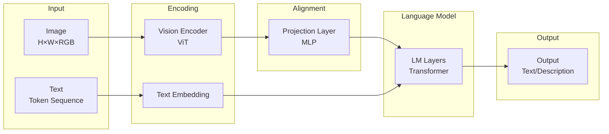
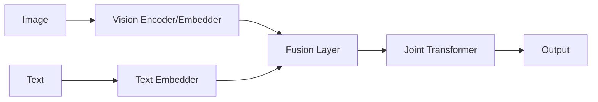
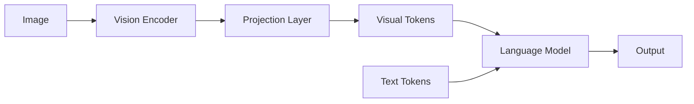
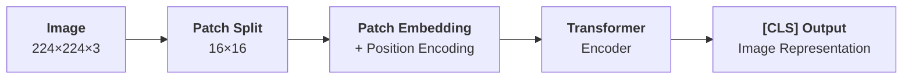
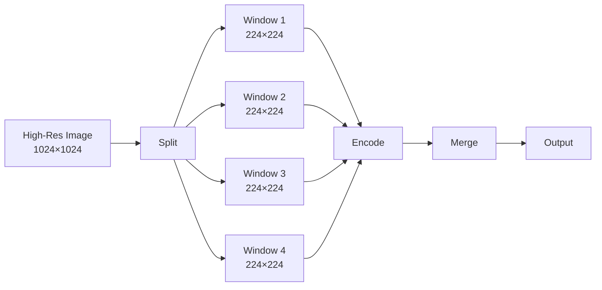

# Multimodal Large Language Models

Language models process sequences of text, but human perception of the world extends far beyond text -- we use our eyes to see images, our ears to hear sounds, and multiple senses working together to understand the world. If a language model can only "read" without being able to "see," its capabilities in many real-world scenarios will inevitably be limited. This chapter explores how language models break through the boundaries of pure text and learn to understand images and video.

The idea of enabling computers to simultaneously understand images and text has a long history. In 2015, the paper "[Show, Attend and Tell: Neural Image Caption Generation with Visual Attention](https://arxiv.org/abs/1502.03044)" from Yoshua Bengio's lab at the University of Montreal introduced the attention mechanism: when generating each word, the model's text decoder hidden state queries different regions of the image's convolutional feature maps, enabling cross-modal information retrieval. However, what truly brought vision/language fusion into practical use was the later **Vision Transformer** (ViT) and **Contrastive Language-Image Pre-training** (CLIP). ViT solved the problem of how to turn images into sequences, while CLIP solved the problem of how to align images and text within a shared semantic space.

## Vision-Language Fusion Architecture

For language models to learn to "see," two fundamental challenges must be addressed: "how to convert an image into a representation the model can understand" and "how to align visual information with linguistic information." The input to a language model is a sequence of tokens, each corresponding to an index in the vocabulary (see [Tokenization](../architecture-basics/language-model-tokenization.md) for details). Images, on the other hand, are continuous pixel matrices whose resolution, color channels, and spatial structure are entirely different from text. ViT's solution is to slice images into small patches, treating each patch as a visual token, thereby converting the continuous 2D signal of an image into the discrete representations that language models can process. However, even if visual tokens and text tokens share the same form, their semantics still belong to different spaces. Language models are pre-trained on text and learn the semantic space of language. Visual concepts such as color, shape, and spatial relationships have their own natural representations in the visual domain, along with their own independent semantic space. CLIP's solution is to use contrastive learning to bring "the picture of a cat" and "the word cat" closer together in the same vector space. Only after alignment can visual information be truly understood by a language model.

Modern multimodal LLMs generally adopt a fusion architecture of "image encoder + language decoder," consisting of three components: a **Vision Encoder**, a **Projector**, and a **Language Model**. The vision encoder encodes images into a sequence of vectors, the projector maps these visual vectors into the language model's embedding space, and the language model processes the combined visual and text tokens to generate responses. The vision encoder acts like an interpreter, translating the image into a language the model can understand. The projector is like the interpreter's accent adjustment, ensuring that the translated expression aligns with the language model's native idiom. The advantage of the vision-language fusion architecture is its modularity: the vision encoder and language model can be pre-trained separately and then connected through the projector, significantly reducing training cost and allowing flexible combinations of different vision encoders and language models.

*Figure: Image Encoder + Language Decoder*

The timing of when the vision encoder and language model are fused leads to different architectural decisions. **Early Fusion** considers both visual and linguistic information from the design stage, allowing the two modalities to interact deeply at every layer of the Transformer, as illustrated below.

*Figure: Early Fusion Approach*

The early fusion approach was first used in DeepMind's Flamingo, released in 2022. Flamingo inserts cross-attention at every layer of the language model, allowing text tokens to query visual information. The intuition behind this design is that the language model should be able to see the full image when generating each word, just as humans look at a picture while speaking, with each sentence potentially referencing different regions of the image. The trade-off, however, is a significant increase in architectural complexity: every layer of the language model requires an additional cross-attention module, and training requires updating more parameters simultaneously.

The 2026 Gemma 4 Unified model improved upon the early fusion approach. Gemma 4 claims an encoder-free architecture, but in practice it uses a very small vision embedder to convert images to tokens. Raw $48 \times 48$ pixel blocks are projected to the LLM's hidden dimension through a single matrix multiplication, then spatial position information is added via decomposed coordinate lookup. Both text and image inputs enter the same decoder-only Transformer model, relying on self-attention for cross-modal fusion. There is no separate vision tower, no cross-attention -- just one model, one sequence, one forward pass from input to output.

**Late Fusion** takes a different strategy: visual information is fully processed by a dedicated vision encoder model before entering the language model. The language model only sees the projected visual tokens, which are fundamentally no different from text tokens, as illustrated below.

*Figure: Late Fusion Approach*

Typical representatives of late fusion include LLaVA, released by the University of Wisconsin-Madison in 2023, and OpenAI's GPT-4V. Visual information is transformed into visual tokens through the projection layer, concatenated with text tokens, and fed into the language model. From the language model's perspective, visual tokens and text tokens are no different in form -- both are elements of the input sequence that interact through the self-attention mechanism. The advantage of this design is that the language model's structure remains completely unchanged, allowing reuse of pre-trained weights and achieving much higher training efficiency.

Although early fusion theoretically offers deeper cross-modal interaction capabilities, the majority of modern multimodal LLMs still adopt the late fusion approach. The reason is that late fusion is simpler, more flexible, and its actual performance is not significantly inferior. This suggests that deep interaction between vision and language does not necessarily require architectural-level cross-attention -- a sufficiently powerful language model, relying solely on self-attention, can establish adequate connections between visual and text tokens.

## Vision Encoder and Cross-Modal Alignment

The vision encoder serves as the "eyes" of a multimodal model, responsible for converting images into vector representations. Before 2020, image understanding was almost exclusively dominated by [Convolutional Neural Networks](../../deep-learning/convolutional-neural-network/cnn-basics.md) (CNNs). The underlying assumption of CNNs is that images exhibit **locality** -- adjacent pixels in an image tend to be highly correlated, making it reasonable to extract local features hierarchically using small convolutional kernels. However, CNNs also have clear limitations: the receptive field of convolutional kernels is always limited, requiring deep features to capture global information, and convolution operations themselves are translation equivariant, unable to directly encode absolute positional information such as "this region is in the upper-left corner of the image."

In 2020, Alexey Dosovitskiy from Google Research proposed an alternative approach: treating images like text. Specifically, the image is divided into fixed-size patches, each patch is flattened and linearly projected into a vector, much like each word in text is embedded into a vector. In this way, the image becomes a sequence of vectors that can be directly processed by a Transformer encoder. This architecture is called Vision Transformer (ViT). Modern multimodal LLMs have widely adopted ViT or its variants for the vision encoder. ViT's processing pipeline consists of the following four steps:

1. **Image Patching**: Split an $H \times W \times 3$ image into $N$ patches of size $P \times P \times 3$, where $N = (H/P) \times (W/P)$. For example, a $224 \times 224$ image with $16 \times 16$ patches yields $14 \times 14 = 196$ patches.

2. **Patch Embedding**: Flatten each patch and apply a linear projection to obtain $N$ $d$-dimensional vectors. This step is equivalent to a convolutional layer with stride equal to kernel size.

3. **Position Encoding**: Add learnable position encodings to each patch. Since the Transformer itself is insensitive to the order of tokens in the input sequence, position encoding tells the model "which part of the image this patch comes from," just like word position information in text.

4. **Transformer Encoding**: Process the entire patch sequence through multiple Transformer encoder layers, each containing multi-head self-attention and feed-forward networks. A special `[CLS]` token is prepended to the sequence; its final representation aggregates information from the entire image and can be used for tasks such as image classification.

*Figure: ViT Processing Pipeline*

Patch size and hidden dimension are two key parameters that balance model scale and capability in ViT. Patch size is typically $16 \times 16$ or $14 \times 14$ -- smaller patches produce longer sequences, allowing the model to capture more detailed information but at higher computational cost. Sequence length is determined jointly by image resolution and patch size: a $224 \times 224$ image with $16 \times 16$ patches yields 196 patches. Hidden dimension refers to the dimensionality of each patch vector -- larger dimensions provide stronger representational power at higher computational cost. In different ViT scales, these are 768 (ViT-Base), 1024 (ViT-Large), and 1280 (ViT-Huge). Subsequent work introduced even larger variants such as ViT-Giant (1408 dimensions), adopted by models like DINOv2 and BEiT-3.

ViT solved the problem of how to turn images into sequences, but at this point the vectors in the sequence still reside in the visual semantic space -- they encode visual features like color, texture, and shape, leaving a gap between them and the semantic concepts that a language model understands, such as "cat," "running," and "cute." CLIP was created precisely to bridge this gap. CLIP trains both a vision encoder and a text encoder simultaneously, using contrastive learning to map their outputs into the same embedding space. In this space, the embedding vectors of a picture of a cat and the word "cat" are close together, farther from "dog," and farther still from "car." This means that visual features and linguistic concepts have a correspondence within the same coordinate system, providing high-quality visual representations for subsequent multimodal LLMs. Almost all modern multimodal models (LLaVA, GPT-4V, Gemini) either directly use or draw inspiration from CLIP's pre-trained weights for their vision encoders.

CLIP achieves semantic alignment between the vision encoder and the text encoder, but the language model has its own independent embedding space, so one final translation step is still needed. The projection layer serves as this translator, mapping the vision encoder's output to the language model so that visual tokens and text tokens reside within the same semantic space. In practice, the simplest translation method is to use a linear layer to project visual embeddings into the language model's text embedding dimension. Experiments have shown that as long as the vision encoder and language model themselves are sufficiently capable, a simple linear projection is adequate. This is because CLIP has already completed the vision-to-language alignment during pre-training; the projection layer only needs to handle dimensional matching and fine-tuning, without learning alignment relationships from scratch. For more complex scenarios, especially when the semantic spaces of the vision encoder and language model differ substantially (e.g., when using a non-CLIP vision encoder), the linear projection can be upgraded to a two-layer MLP, adding non-linear transformation capacity to better handle the complex patterns in visual information.

## Training Multimodal Models

The training of modern multimodal LLMs typically proceeds in three stages, each with different training objectives and trainable parameters. Stage one provides visual perception capability, stage two builds the vision-language bridge, and stage three teaches the model to follow instructions. This progressive training design facilitates modular training, saves computational resources, and helps avoid catastrophic forgetting:

- **Stage 1 -- Vision Encoder Pre-training**: This step usually does not require training from scratch; instead, a pre-trained CLIP vision encoder is used directly. These models have been trained on massive image-text pairs and have already learned high-quality visual representations. During subsequent training, the vision encoder's parameters are typically frozen, as its representations are already sufficiently good and unfreezing would be extremely costly.

- **Stage 2 -- Projection Layer Pre-training**: This step trains only the projection layer, with the goal of aligning the frozen vision encoder's output to the language model's embedding space. The training data typically consists of **Image-Caption Pairs**, and the objective is to teach the model to generate descriptive text based on images. Since only the projection layer is trained -- usually a single linear transformation or a two-layer MLP -- the parameter count is very small (tens of MB), and this stage completes quickly.

- **Stage 3 -- Multimodal Instruction Fine-Tuning**: This stage unfreezes the projection layer and the language model (or only part of the language model's layers) and performs SFT fine-tuning on multimodal instruction data. The instruction data follows the format "image + instruction → response," for example: `<Image> How many cats are in this picture? → 3`. This step teaches the model to perform tasks such as reasoning, description, and question answering about images based on user instructions -- it is the critical step where the model goes from being able to see to being able to understand and respond. In stage three instruction fine-tuning, the training data typically uses **Interleaved Image-Text Data**, where images and text appear alternately, and the model learns to understand their relationships. For example:

    > 
    > **Question**: What are the animals in the first and second pictures doing respectively?
    > **Answer**: The cat is sleeping. The dog is running.

    The training objectives typically cover three types of tasks: **Image Captioning** (given an image, generate a descriptive text), **Visual Question Answering** (given an image and a question, generate an answer), and **Interleaved Understanding** (understand the relationship between multiple images and text). These three types of tasks progress from simple to complex, gradually improving the model's multimodal understanding capability.

In the [Vision-Language Model Training Experiment](vlm-training-experiment.md) section, we will practice stages two and three of the training process (stage one does not require training as pre-trained encoders can be downloaded directly), corroborating the theoretical descriptions in this chapter.

## Long-Context Multimodal

So far, our discussion has focused on single images, but real-world scenarios are certainly more complex: video understanding requires processing temporal information, multi-image reasoning requires simultaneously understanding relationships between multiple images, and high-resolution image processing requires controlling computational costs without losing detail. These scenarios impose higher demands and challenges on the model's long-context capabilities.

### Video Understanding and Multi-Image Reasoning

The biggest difference between video and images is the temporal dimension. A video is a time series composed of image frames. Understanding a video requires not only recognizing objects and scenes in each frame but also capturing the dynamic changes between frames. The action "cat jumps off the table" cannot be fully expressed by any single frame -- it can only be understood through the changes across consecutive frames. Understanding video requires the model to possess capabilities at three levels: single-frame understanding (recognizing objects, scenes, and actions in each frame), temporal modeling (understanding relationships between frames and capturing dynamic changes), and information integration (extracting key information from the entire video and answering questions about it). The most straightforward video processing strategy is uniform sampling: uniformly sample $K$ frames from the video, encode each frame independently, and then concatenate all the visual tokens.

$$\text{Video Tokens} = Concat([\text{Frame}_1, \text{Frame}_2, \ldots, \text{Frame}_K])$$

This approach is simple to implement but not robust enough. Uniform sampling may miss key frames. Imagine a 30-second video where a person sits still for the first 27 seconds and suddenly stands up in the last 3 seconds. If we sample 8 frames, they could all fall within the sitting phase, completely missing the standing-up action. A more refined strategy is keyframe extraction, which uses a visual model to identify key frames in the video (e.g., scenes with significant changes or action occurrences) and encodes only these key frames. Keyframe sampling is more efficient than uniform sampling, but detecting keyframes requires additional computation, and the definition of a keyframe is not always clear.

Regardless of which sampling strategy is used, temporal position encoding must be added to each frame to help the model understand the temporal order of frames. Without temporal position encoding, the model cannot distinguish between "cat jumps onto the table" and "cat jumps off the table" -- the frame content might be identical, differing only in temporal order.

Video understanding also involves multi-image reasoning, where the model needs to understand multiple images simultaneously and answer questions about their relationships. For example, Figure 1 shows a product from the front and Figure 2 shows it from the side -- what does the difference between these two angles reveal? Such questions require the model not only to understand the content of each image but also to establish connections between images.

The number of tokens involved in video and multi-image processing grows linearly with the number of images. With 196 tokens per image, 10 images yield 1960 tokens, which can easily approach the language model's context window limit. The relationships the model needs to understand also multiply: it must understand relationships between images and also know which image to focus on when answering different questions, involving how attention is allocated. To address these challenges, common practical solutions include compressing each image into fewer tokens (e.g., from 196 down to 32), adding different position encoding prefixes to distinguish between different images, and allowing text tokens to selectively attend to different images through the self-attention mechanism.

### High-Resolution Image Processing

Standard ViT divides images into $16 \times 16$ patches. For a $224 \times 224$ image, this yields $14 \times 14 = 196$ patches, a number typically within a language model's processing capacity. However, many real-world applications require processing high-resolution images: medical images are typically $1024 \times 1024$, 16-megapixel phone photos are $4096 \times 4096$, and satellite images and engineering drawings have even higher resolutions. For a $1024 \times 1024$ image, dividing into $16 \times 16$ patches produces $64 \times 64 = 4096$ patches -- 20 times the standard token count -- and phone photos expand this by 320 times, causing computational costs to skyrocket.

High-resolution image processing generally employs dynamic resolution, adjusting the patch size based on image resolution to keep the token count relatively stable. For instance, low-resolution images use $14 \times 14$ patches while high-resolution images use $28 \times 28$ patches. A sliding window then divides the large image into multiple smaller windows (e.g., $224 \times 224$), encodes each separately, and finally merges the results, similar to how a CNN slides a convolutional kernel across the entire image, as shown below.

*Figure: High-Resolution Image Processing*

## Summary

The significance of multimodal models lies in granting AI the ability to perceive the world through channels beyond text, enabling it to process the vast amounts of information that exist in visual form in the real world -- from medical image diagnosis to autonomous driving scene understanding, where the input is inherently visual rather than textual.

Enabling language models to see images essentially answers two questions: how to turn images into tokens that language models can process, and how to make these visual tokens reside in the same semantic space as language tokens. ViT segments images into patch sequences, solving the first problem. CLIP uses contrastive learning to align vision and language into the same embedding space, solving the second problem. With these two foundations, the projection layer only needs to perform a dimensional mapping, and visual tokens can be understood by the language model just like text tokens.

## Exercises

1. How many patches are obtained when ViT divides a $224 \times 224$ image into $16 \times 16$ patches? If the patch size is changed to $14 \times 14$, how many patches are there? What is the impact on the model's computational cost?
   

   
Reference Answer

   $16 \times 16$ patches: $(224/16) \times (224/16) = 14 \times 14 = 196$ patches.

   $14 \times 14$ patches: $(224/14) \times (224/14) = 16 \times 16 = 256$ patches.

   With smaller patches, the number of patches increases from 196 to 256 (an increase of about 30%). Since the computational cost of Transformer self-attention is proportional to the square of the sequence length, the computational cost increases by approximately $(256/196)^2 \approx 1.7$ times. At the same time, smaller patches mean each patch covers a smaller image region, allowing the model to capture more fine-grained visual details.

   

2. In CLIP's contrastive loss function, what is the role of the temperature parameter $\tau$? How does the model behave when $\tau$ is very large versus when $\tau$ is very small?
   

   
Reference Answer

   The temperature parameter $\tau$ controls the "sharpness" of the similarity scores. When $\tau$ is very large, the values of $\text{sim}(v_i, t_j) / \tau$ become small, the Softmax output approaches a uniform distribution, the model's discrimination between positive and negative samples is low, and the training signal is weak, but training is more stable. When $\tau$ is very small, the similarity scores are amplified, the Softmax output approaches one-hot, the model becomes highly focused on the most similar candidates, the training signal is strong, but it is prone to overfitting and training instability. In the original CLIP paper, $\tau$ is a learnable parameter with an initial value of approximately 0.07, leaning toward the "sharp" side.

   

3. In video understanding, why is temporal position encoding necessary? What problems would the model encounter without temporal position encoding?
   

   
Reference Answer

   Without temporal position encoding, the model cannot distinguish the temporal order of frames. Consider two videos: Video A shows "cat jumps onto the table," and Video B shows "cat jumps off the table." If the frame content of both videos is identical (only the order is reversed), without temporal position encoding, the model's encoding of each frame is exactly the same (since the frame encoder is shared), and the concatenated token sequences differ only in permutation. However, the Transformer's self-attention mechanism is permutation equivariant -- without special handling of positional information, the model produces the same output for "frame 1 first, frame 8 last" and "frame 8 first, frame 1 last," making it unable to distinguish between "jump onto" and "jump off."

   

