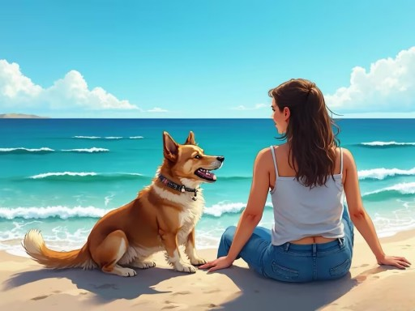
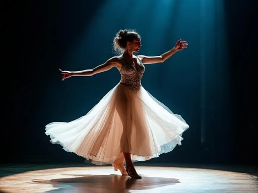

# Vision-Language Model Training Experiment

In the [Pretraining Experiment](../architecture-basics/llm-pretrain-experiment.md), we trained a pure language model capable of understanding and generating text. But human perception of the world extends far beyond text -- vision is the most direct way we acquire information. In this experiment, we will equip the pretrained language model with a pair of eyes -- a vision encoder -- enabling it to simultaneously understand images and text, and to perform multimodal tasks such as image captioning and visual question answering. This experiment's code is based on [MiniMind-V](https://github.com/jingyaogong/minimind-v) (the model architecture is consistent with MiniMind-V; the training code has been rewritten to fit the DMLA web-based training environment), and the dataset comes from [ALLaVA-4V](https://huggingface.co/datasets/FreedomIntelligence/ALLaVA-4V).

## Experiment Preparation

Before starting, please ensure you have completed the [Pretraining Experiment](../architecture-basics/llm-pretrain-experiment.md) and downloaded the vision training data. Use the `DMLA-CLI` tool to download the data:

```bash
# Select "Download Dataset" -> Select "MiniMind Vision (VLM Vision Training Data)"
dmla data
```

The dataset consists of three parts:

| File | Description | Size |
|------|------|------|
| `pretrain_i2t.parquet` | Vision pretraining data (image-caption pairs, ~250K) | ~1.4 GB |
| `sft_i2t.parquet` | Vision instruction fine-tuning data (multi-turn conversations, ~580K) | ~2.4 GB |
| `siglip2-base-p32-256-ve` | SigLIP vision encoder pretrained weights | ~181 MB |

> **Data Note**: For a 64M-parameter VLM experiment, the original data scale is somewhat large. This experiment randomly samples 20% of the original ALLaVA-4V dataset. Since random sampling breaks the compression locality of adjacent images in the original files, the file sizes are not strictly reduced by 20%. If you need the full dataset (originally 4.17 million samples), you can obtain it from the [MiniMind-V official repository](https://github.com/jingyaogong/minimind-v).

After downloading, verify data integrity:

```python runnable
import os

data_dir = os.path.join(DATA_DIR, 'datasets', 'minimind-vision')

if os.path.exists(data_dir):
    print("Data directory exists")

    # Check pretraining data
    pretrain_path = os.path.join(data_dir, 'pretrain_i2t.parquet')
    if os.path.exists(pretrain_path):
        size_gb = os.path.getsize(pretrain_path) / (1024 ** 3)
        print(f"Pretraining data: {size_gb:.2f} GB")
    else:
        print("Pretraining data not found")

    # Check SFT data
    sft_path = os.path.join(data_dir, 'sft_i2t.parquet')
    if os.path.exists(sft_path):
        size_gb = os.path.getsize(sft_path) / (1024 ** 3)
        print(f"SFT data: {size_gb:.2f} GB")
    else:
        print("SFT data not found")

    # Check vision encoder
    clip_dir = os.path.join(data_dir, 'siglip2-base-p32-256-ve')
    if os.path.exists(clip_dir):
        model_file = os.path.join(clip_dir, 'model.safetensors')
        config_file = os.path.join(clip_dir, 'config.json')
        print(f"SigLIP model: {'Found' if os.path.exists(model_file) else 'Not found'}")
        print(f"SigLIP config: {'Found' if os.path.exists(config_file) else 'Not found'}")
    else:
        print("SigLIP vision encoder not found")

    # Check pretrained LLM weights (from pretraining experiment)
    llm_path = os.path.join(DATA_DIR, 'models', 'minimind', 'pretrain', 'pretrain_768.pth')
    print(f"\nPretrained LLM weights: {'Found' if os.path.exists(llm_path) else 'Not found (please complete the pretraining experiment first)'}")
else:
    print("Data directory does not exist. Please run 'dmla data' to download the MiniMind Vision dataset")
```

## Stage 1: Vision Encoder and Projection Layer

A vision-language model converts images into visual tokens that the language model can understand, and then processes these visual tokens just like text tokens. This requires two new components: a **Vision Encoder** that encodes input images into a sequence of visual feature vectors, and a **Projection Layer** (Vision Projector) that maps the vision encoder's output into the language model's embedding space. The overall architecture of the VLM is shown below:

```nn-arch width=780
name: MiniMind-VLM Architecture
layout: horizontal

sections:
  - name: Vision Encoding Branch
    layers: [img_input, vision_enc, projector]
  - name: Text Processing Branch
    layers: [text_input, embedding, transformer, lm_head, output]

layers:
  - {id: img_input, name: "Input Image", type: input, size: "256×256"}
  - {id: vision_enc, name: "Vision Encoder", type: rnn, size: "SigLIP"}
  - {id: projector, name: "Projection Layer", type: fc, size: "Two-layer MLP"}
  - {id: text_input, name: "Text Input", type: input, size: "tokens"}
  - {id: embedding, name: "Embedding Layer", type: fc, size: "Vocab=6400\ndim=768"}
  - {id: transformer, name: "Transformer", type: rnn, size: "8-layer GQA\ndim=768"}
  - {id: lm_head, name: "LM Head", type: fc, size: "lm_head"}
  - {id: output, name: "Output", type: output, size: "Token Probabilities"}
```
*Figure: MiniMind-VLM Architecture*

> The code in stages 1 and 2 of this experiment is purely for pedagogical explanation; all other code is called during stage 3 pretraining and stage 4 supervised fine-tuning, and neither needs to be run manually.

### Vision Encoder

SigLIP (Sigmoid Loss for Language-Image Pre-training) is a member of the CLIP family introduced in the [Multimodal LLMs](./multimodal-llm.md) chapter. Unlike the original CLIP, which uses a Softmax contrastive loss, SigLIP uses a Sigmoid loss for training on image-text pairs, achieving better performance than CLIP models of equivalent size on ImageNet zero-shot classification and cross-modal retrieval tasks. This experiment uses [SigLIP2-Base-P32/256](https://huggingface.co/google/siglip2-base-patch32-256) as the vision encoder, with the following configuration:

| Config | Value | Description |
|--------|------|------|
| `image_size` | 256 | Input image resolution |
| `patch_size` | 32 | Patch size |
| `num_hidden_layers` | 12 | Number of Transformer layers |
| `hidden_size` | 768 | Hidden layer dimension |
| `num_attention_heads` | 12 | Number of attention heads |
| `intermediate_size` | 3072 | FFN intermediate dimension |

The SigLIP encoder takes a $256 \times 256$ image with a patch size of $32 \times 32$, producing $8 \times 8 = 64$ patch tokens per image, where each token is a 768-dimensional vector -- exactly matching the language model's hidden dimension. This is no coincidence; matching dimensions simplifies the implementation of the projection layer.

```python runnable gpu
import torch
import os
from transformers import SiglipVisionModel, SiglipImageProcessor
from PIL import Image

# Load the vision encoder
vision_dir = os.path.join(DATA_DIR, 'datasets', 'minimind-vision', 'siglip2-base-p32-256-ve')
vision_model = SiglipVisionModel.from_pretrained(vision_dir)
processor = SiglipImageProcessor.from_pretrained(vision_dir)

# Count vision encoder parameters
total_params = sum(p.numel() for p in vision_model.parameters())
print(f"SigLIP vision encoder parameters: {total_params:,} ({total_params/1e6:.2f}M)")

# Demonstrate encoding with a random image
dummy_image = Image.fromarray(torch.randint(0, 255, (256, 256, 3), dtype=torch.uint8).numpy())
inputs = processor(images=dummy_image, return_tensors="pt")

with torch.no_grad():
    outputs = vision_model(**inputs)

print(f"Input image: {dummy_image.size}")
print(f"Visual feature shape: {outputs.last_hidden_state.shape}")
print(f"  batch_size={outputs.last_hidden_state.shape[0]}")
print(f"  patch_tokens={outputs.last_hidden_state.shape[1]}")
print(f"  hidden_dim={outputs.last_hidden_state.shape[2]}")
```

### Projection Layer

The vision encoder outputs 64 patch tokens with 768 dimensions each, which reside in SigLIP's feature space. The language model's word embeddings also produce 768-dimensional vectors, but these exist in the language model's semantic space. Although the dimensions are the same, the distribution and meaning of the vectors are completely different. The projection layer acts as a translator between the two spaces, using a two-layer MLP structure (LayerNorm → Linear → GELU → Linear). LayerNorm first normalizes the visual features, two linear transformations gradually map the visual features from SigLIP's feature space into the language model's semantic space, and the GELU activation introduces non-linearity in between, allowing the projection layer to learn the complex mapping relationship between the two spaces.

```python runnable gpuonly extract-class="MMVisionProjector"
import torch.nn as nn

class MMVisionProjector(nn.Module):
    """Vision-language projection layer: maps the vision encoder's output into the language model's embedding space"""
    def __init__(self, in_dim=768, out_dim=768):
        super().__init__()
        self.mlp = nn.Sequential(
            nn.LayerNorm(in_dim),
            nn.Linear(in_dim, out_dim),
            nn.GELU(),
            nn.Linear(out_dim, out_dim),
        )

    def forward(self, x):
        return self.mlp(x)

# Create projection layer and count parameters
proj = MMVisionProjector(768, 768)
total_params = sum(p.numel() for p in proj.parameters())
print(f"Projection layer parameters: {total_params:,} ({total_params/1e6:.2f}M)")
```

### Injection Mechanism

The projected visual tokens need to be inserted into the text token sequence before being processed by the Transformer layers. The token injection mechanism works by reserving a special token `<|image_pad|>` in the vocabulary. During dataset construction, the `<image>` tag corresponding to each image is replaced by 64 consecutive `<|image_pad|>` tokens. After word embedding but before passing through the Transformer layers, the model locates the `<|image_pad|>` positions in the sequence and replaces the word embeddings at those positions with the projected visual features.

```python runnable gpuonly extract-class="VLMConfig,MiniMindVLM"
import os
import torch
import torch.nn as nn
import warnings
from transformers import SiglipVisionModel, SiglipImageProcessor
from transformers.modeling_outputs import MoeCausalLMOutputWithPast
from shared.llm.mini_mind_config import MiniMindForCausalLM, MiniMindConfig, precompute_freqs_cis, F
from shared.vlm.mmvision_projector import MMVisionProjector

warnings.filterwarnings('ignore')

class VLMConfig(MiniMindConfig):
    """Vision-language model configuration, inherits from language model config with added vision-related parameters"""
    model_type = "minimind-v"
    def __init__(self, image_special_token='<|image_pad|>', image_ids=[12], **kwargs):
        self.image_special_token = image_special_token
        self.image_ids = image_ids
        self.image_hidden_size = kwargs.get("image_hidden_size", 768)
        self.image_token_len = kwargs.get("image_token_len", 64)
        super().__init__(**kwargs)

class MiniMindVLM(MiniMindForCausalLM):
    """Vision-language model: adds a vision encoder and projection layer on top of the language model"""
    config_class = VLMConfig

    def __init__(self, config=None, vision_model_path=None):
        self.config = config or VLMConfig()
        super().__init__(self.config)
        # Load vision encoder and processor
        self.vision_encoder = None
        self.processor = None
        if vision_model_path and os.path.exists(vision_model_path):
            self.vision_encoder = SiglipVisionModel.from_pretrained(vision_model_path)
            self.processor = SiglipImageProcessor.from_pretrained(vision_model_path)
            # Freeze vision encoder parameters
            for param in self.vision_encoder.parameters():
                param.requires_grad = False
            self.vision_encoder = self.vision_encoder.eval()
        self.vision_proj = MMVisionProjector(self.config.image_hidden_size, self.config.hidden_size)

    @staticmethod
    def image2tensor(image, processor):
        """Convert a PIL image into the input tensor for the vision encoder"""
        if image.mode in ['RGBA', 'LA']:
            image = image.convert('RGB')
        return processor(images=image, return_tensors="pt")

    @staticmethod
    def get_image_embeddings(image_inputs, vision_model):
        """Extract image features through the vision encoder"""
        if hasattr(image_inputs, 'keys'):
            image_inputs = {k: v.squeeze(1) if v.ndim > 2 and v.shape[1] == 1 else v
                           for k, v in image_inputs.items()}
        with torch.no_grad():
            outputs = vision_model(**image_inputs)
        return outputs.last_hidden_state

    def inject_vision_tokens(self, tokens, h, vision_tensors=None, seqlen=512):
        """Inject projected visual features into the <|image_pad|> positions of the embedding sequence"""
        if vision_tensors is None or not self.config.image_ids:
            return h
        marker = self.config.image_ids[0]
        vf = vision_tensors
        if vf.dim() == 3:
            vf = vf.unsqueeze(1)
        out = []
        for b in range(h.size(0)):
            hb, seq, k, i = h[b], tokens[b].tolist(), 0, 0
            while i < len(seq):
                if seq[i] == marker:
                    start = i
                    while i < len(seq) and seq[i] == marker:
                        i += 1
                    if k < vf.size(1):
                        hb = torch.cat((hb[:start], vf[b][k][:i - start], hb[i:]), dim=0)[:seqlen]
                        k += 1
                else:
                    i += 1
            out.append(hb)
        return torch.stack(out)

    def forward(self, input_ids=None, attention_mask=None, past_key_values=None,
                use_cache=False, logits_to_keep=0, labels=None, pixel_values=None, **args):
        batch_size, seq_length = input_ids.shape
        if hasattr(past_key_values, 'layers'):
            past_key_values = None
        past_key_values = past_key_values or [None] * len(self.model.layers)
        start_pos = past_key_values[0][0].shape[1] if past_key_values[0] is not None else 0

        # Text word embeddings
        hidden_states = self.model.dropout(self.model.embed_tokens(input_ids))

        # Visual feature injection (only during the first inference step)
        if pixel_values is not None and start_pos == 0:
            if hasattr(pixel_values, 'keys'):
                sample_val = next(iter(pixel_values.values()))
                if sample_val.ndim == 5:
                    bs, num = sample_val.shape[:2]
                    vision_tensors = self.vision_proj(
                        self.get_image_embeddings(
                            {k: v.flatten(0, 1) for k, v in pixel_values.items()},
                            self.vision_encoder
                        )
                    ).view(bs, num, self.config.image_token_len, -1)
                else:
                    vision_tensors = self.vision_proj(
                        self.get_image_embeddings(pixel_values, self.vision_encoder)
                    )
            else:
                vision_tensors = self.vision_proj(
                    self.get_image_embeddings(pixel_values, self.vision_encoder)
                )
            hidden_states = self.inject_vision_tokens(
                tokens=input_ids, h=hidden_states,
                vision_tensors=vision_tensors, seqlen=input_ids.shape[1]
            )

        # Recompute RoPE buffers if needed
        if self.model.freqs_cos[0, 0] == 0:
            freqs_cos, freqs_sin = precompute_freqs_cis(
                dim=self.config.head_dim, end=self.config.max_position_embeddings,
                rope_base=self.config.rope_theta, rope_scaling=self.config.rope_scaling
            )
            self.model.freqs_cos = freqs_cos.to(hidden_states.device)
            self.model.freqs_sin = freqs_sin.to(hidden_states.device)
        position_embeddings = (
            self.model.freqs_cos[start_pos:start_pos + seq_length],
            self.model.freqs_sin[start_pos:start_pos + seq_length]
        )

        # Transformer layer processing
        presents = []
        for layer, past_key_value in zip(self.model.layers, past_key_values):
            hidden_states, present = layer(
                hidden_states, position_embeddings,
                past_key_value=past_key_value, use_cache=use_cache,
                attention_mask=attention_mask
            )
            presents.append(present)
        hidden_states = self.model.norm(hidden_states)

        slice_indices = slice(-logits_to_keep, None) if isinstance(logits_to_keep, int) else logits_to_keep
        logits = self.lm_head(hidden_states[:, slice_indices, :])

        loss = None
        if labels is not None:
            shift_logits = logits[..., :-1, :].contiguous()
            shift_labels = labels[..., 1:].contiguous()
            loss = F.cross_entropy(
                shift_logits.view(-1, shift_logits.size(-1)),
                shift_labels.view(-1), ignore_index=-100
            )

        return MoeCausalLMOutputWithPast(
            loss=loss, logits=logits, past_key_values=presents,
            hidden_states=hidden_states
        )

# Create model instance and count parameters
vision_dir = os.path.join(DATA_DIR, 'datasets', 'minimind-vision', 'siglip2-base-p32-256-ve')
vlm_config = VLMConfig(hidden_size=768, num_hidden_layers=8)
vlm_model = MiniMindVLM(vlm_config, vision_model_path=vision_dir)

total_params = sum(p.numel() for p in vlm_model.parameters())
trainable_params = sum(p.numel() for p in vlm_model.parameters() if p.requires_grad)
vision_params = sum(p.numel() for p in vlm_model.vision_encoder.parameters())
proj_params = sum(p.numel() for p in vlm_model.vision_proj.parameters())
llm_params = total_params - vision_params - proj_params

print(f"Total VLM parameters: {total_params:,} ({total_params/1e6:.2f}M)")
print(f"  Vision encoder (frozen): {vision_params:,} ({vision_params/1e6:.2f}M)")
print(f"  Projection layer: {proj_params:,} ({proj_params/1e6:.2f}M)")
print(f"  Language model: {llm_params:,} ({llm_params/1e6:.2f}M)")
print(f"  Trainable parameters: {trainable_params:,} ({trainable_params/1e6:.2f}M)")
```

## Stage 2: Data Loading

Compared to pure language models, training samples for vision-language models include not only text but also one or more images. This experiment stores data in Parquet format, with each record containing two fields: `conversations` (dialogue content) and `image_bytes` (raw image bytes). Training proceeds in two stages, each with a different data format:

- **Vision Pretraining** (`pretrain_i2t.parquet`): Approximately 250K image-caption pairs, with the goal of teaching the model to align visual information with language descriptions. The conversation format is simple, typically with a user requesting an image description and the model providing one.
- **Vision Instruction Fine-Tuning** (`sft_i2t.parquet`): Approximately 580K multi-turn conversations, with the goal of teaching the model to answer various questions based on images. The conversation format is diverse, covering tasks such as visual question answering, image analysis, and reasoning judgment.

```python runnable gpuonly extract-class="VLMDataset"
import json
import io
import torch
from PIL import Image
from torch.utils.data import Dataset
import pyarrow as pa
import pyarrow.parquet as pq
from shared.vlm.vlmconfig import MiniMindVLM

class VLMDataset(Dataset):
    """Vision-language model dataset: loads image-conversation pairs from Parquet files"""
    def __init__(self, parquet_path, tokenizer, preprocess=None,
                 max_length=512, image_special_token='<|image_pad|>', image_token_len=64):
        super().__init__()
        self.table = pa.Table.from_batches(pq.ParquetFile(parquet_path).iter_batches())
        self.tokenizer = tokenizer
        self.max_length = max_length
        self.preprocess = preprocess
        self.image_special_token = image_special_token * image_token_len
        self.bos_id = tokenizer(f'{tokenizer.bos_token}assistant\n', add_special_tokens=False).input_ids
        self.eos_id = tokenizer(f'{tokenizer.eos_token}\n', add_special_tokens=False).input_ids

    def __len__(self):
        return len(self.table)

    def create_chat_prompt(self, conversations):
        """Convert a conversation list into the model's input text, replacing <image> tags with visual special tokens"""
        text = ""
        for turn in conversations:
            content = turn['content'].replace('<image>', self.image_special_token) \
                if turn.get('role') != 'system' else turn['content']
            text += f"{self.tokenizer.bos_token}{turn['role']}\n{content}{self.tokenizer.eos_token}\n"
        return text

    def generate_labels(self, input_ids):
        """Generate training labels: only compute the loss for the assistant's response portion"""
        labels = [-100] * len(input_ids)
        i = 0
        while i < len(input_ids):
            if input_ids[i:i + len(self.bos_id)] == self.bos_id:
                start = i + len(self.bos_id)
                end = start
                while end < len(input_ids):
                    if input_ids[end:end + len(self.eos_id)] == self.eos_id:
                        break
                    end += 1
                for j in range(start, min(end + len(self.eos_id), self.max_length)):
                    labels[j] = input_ids[j]
                i = end + len(self.eos_id) if end < len(input_ids) else len(input_ids)
            else:
                i += 1
        return labels

    def __getitem__(self, index):
        conversations = json.loads(self.table['conversations'][index].as_py())
        image_bytes = self.table['image_bytes'][index].as_py()
        if not isinstance(image_bytes, list):
            image_bytes = [image_bytes]

        prompt = self.create_chat_prompt(conversations)
        input_ids = self.tokenizer(prompt).input_ids[:self.max_length]
        input_ids += [self.tokenizer.pad_token_id] * (self.max_length - len(input_ids))
        labels = self.generate_labels(input_ids)

        image_inputs_list = [
            MiniMindVLM.image2tensor(Image.open(io.BytesIO(img)), self.preprocess)
            for img in image_bytes
        ]
        if hasattr(image_inputs_list[0], 'keys'):
            image_data = {k: torch.cat([inp[k] for inp in image_inputs_list], dim=0)
                         for k in image_inputs_list[0].keys()}
        else:
            image_data = torch.stack(image_inputs_list)

        return torch.tensor(input_ids, dtype=torch.long), \
               torch.tensor(labels, dtype=torch.long), image_data
```

In pure language model pretraining, the prediction target is the next token of the input, so the labels differ from the input by only one position. But in vision instruction fine-tuning, we only want the model to learn to generate the AI's responses, not to predict the user's questions. The `generate_labels()` method locates tokens between `bos_token` + `assistant\n` and `eos_token` + `\n`, exposing only the token IDs at those positions while masking the rest with the value that cross-entropy loss automatically ignores (PyTorch default is -100).

```python runnable gpu
import os
import json
import io
from PIL import Image
from transformers import AutoTokenizer
import pyarrow.parquet as pq

# Load tokenizer and vision processor
tokenizer_dir = os.path.join(DATA_DIR, 'datasets', 'minimind-pretrain')
tokenizer = AutoTokenizer.from_pretrained(tokenizer_dir)

# View pretraining data samples
pretrain_path = os.path.join(DATA_DIR, 'datasets', 'minimind-vision', 'pretrain_i2t.parquet')
pf = pq.ParquetFile(pretrain_path)
print(f"Pretraining data: {pf.metadata.num_rows:,} samples")

table = pf.read_row_group(0).slice(0, 2)
for i in range(2):
    conv = json.loads(table['conversations'][i].as_py())
    print(f"\n--- Pretraining Sample {i} ---")
    for turn in conv:
        content = turn['content'][:80].replace('\n', ' ')
        print(f"  {turn['role']}: {content}...")

# View SFT data samples
sft_path = os.path.join(DATA_DIR, 'datasets', 'minimind-vision', 'sft_i2t.parquet')
pf2 = pq.ParquetFile(sft_path)
print(f"\nSFT data: {pf2.metadata.num_rows:,} samples")

table2 = pf2.read_row_group(0).slice(0, 2)
for i in range(2):
    conv = json.loads(table2['conversations'][i].as_py())
    print(f"\n--- SFT Sample {i} ---")
    for turn in conv:
        content = turn['content'][:80].replace('\n', ' ')
        print(f"  {turn['role']}: {content}...")

# View image info
img_bytes = table['image_bytes'][0].as_py()
if isinstance(img_bytes, list):
    img_bytes = img_bytes[0]
img = Image.open(io.BytesIO(img_bytes))
print(f"\nImage resolution: {img.size}, mode: {img.mode}")
```

## Stage 3: Vision Pretraining

The goal of vision pretraining is to teach the projection layer to translate visual features into vectors that the language model can understand. Given an image, the model must learn to describe its content in language.

As discussed in [Training Multimodal Models](multimodal-llm.md#training-multimodal-models), the vision encoder has already been pretrained on billions of image-text pairs and possesses visual feature extraction capabilities. The language model has also learned the basic rules of language through text pretraining. Neither needs to be retrained. The task of the vision pretraining stage is to train the projection layer, allowing it to establish a mapping between the two already-fixed spaces. Therefore, in this stage, both the vision encoder and the language model parameters are frozen; only the projection layer parameters are updated. This not only dramatically reduces the number of trainable parameters (from 64M down to approximately 1.2M), making training faster and reducing memory usage, but also prevents the unstable projections early in training from disrupting the knowledge already learned by the language model. After the pretraining stage, the projection layer can produce reasonable visual tokens. In the subsequent SFT stage, the first and last layers of the language model are unfrozen, allowing fine-tuning on a stable foundation.

```python runnable gpuonly timeout=unlimited
import os
import time
import math
import torch
import torch.nn as nn
import torch.optim as optim
from torch.utils.data import DataLoader
from contextlib import nullcontext
from transformers import AutoTokenizer

from dmla_progress import ProgressReporter
from shared.llm.mini_mind_config import MiniMindForCausalLM, MiniMindConfig
from shared.vlm.vlmconfig import VLMConfig, MiniMindVLM
from shared.vlm.mmvision_projector import MMVisionProjector
from shared.vlm.vlmdataset import VLMDataset

# ========== Path Configuration ==========
DATA_DIR_DATASETS = os.path.join(DATA_DIR, 'datasets')
VISION_DATA_DIR = os.path.join(DATA_DIR_DATASETS, 'minimind-vision')
TOKENIZER_PATH = os.path.join(DATA_DIR_DATASETS, 'minimind-pretrain')
VISION_MODEL_PATH = os.path.join(VISION_DATA_DIR, 'siglip2-base-p32-256-ve')
PRETRAIN_DATA = os.path.join(VISION_DATA_DIR, 'pretrain_i2t.parquet')
LLM_WEIGHT = os.path.join(DATA_DIR, 'models', 'minimind', 'pretrain', 'pretrain_768.pth')
SAVE_DIR = os.path.join(DATA_DIR, 'models', 'minimind-vlm', 'pretrain')

# ========== Training Hyperparameters ==========
hidden_size = 768
num_hidden_layers = 8
max_seq_len = 450
batch_size = 16
learning_rate = 4e-4
num_epochs = 1
accumulation_steps = 1
grad_clip = 1.0
log_interval = 100
save_interval = 2000

# ========== 1. Initialize Environment ==========
progress = ProgressReporter(total_steps=10, description="Preparing vision pretraining environment")
progress.update(0, message="Checking runtime environment...")

device = torch.device('cuda' if torch.cuda.is_available() else 'cpu')
if device.type == 'cuda':
    print(f"GPU: {torch.cuda.get_device_name(0)}")
    print(f"Memory: {torch.cuda.get_device_properties(0).total_memory / 1024**3:.1f} GB")
else:
    print("Warning: GPU not detected, training will be very slow")

torch.manual_seed(42)
if device.type == 'cuda':
    torch.cuda.manual_seed(42)

# ========== 2. Load Tokenizer and Data ==========
progress.update(2, message="Loading tokenizer and training data...")
tokenizer = AutoTokenizer.from_pretrained(TOKENIZER_PATH)

# ========== 3. Create Model ==========
progress.update(4, message="Creating vision-language model...")
vlm_config = VLMConfig(hidden_size=hidden_size, num_hidden_layers=num_hidden_layers)
model = MiniMindVLM(vlm_config, vision_model_path=VISION_MODEL_PATH)

# Load pretrained language model weights
if os.path.exists(LLM_WEIGHT):
    weights = torch.load(LLM_WEIGHT, map_location=device)
    model.load_state_dict(weights, strict=False)
    print(f"Loaded pretrained LLM weights: {LLM_WEIGHT}")
else:
    print("Warning: Pretrained LLM weights not found, using random initialization (training quality will be significantly degraded)")

# Freeze strategy: completely freeze vision encoder and language model, train only the projection layer
for name, param in model.named_parameters():
    if 'vision_proj' not in name:
        param.requires_grad = False

model = model.to(device)

total_params = sum(p.numel() for p in model.parameters())
trainable_params = sum(p.numel() for p in model.parameters() if p.requires_grad)
print(f"Total model parameters: {total_params:,} ({total_params/1e6:.2f}M)")
print(f"Trainable parameters: {trainable_params:,} ({trainable_params/1e6:.2f}M)")

# ========== 4. Load Dataset ==========
progress.update(6, message="Loading vision training data...")
train_ds = VLMDataset(
    PRETRAIN_DATA, tokenizer, preprocess=model.processor,
    max_length=max_seq_len, image_token_len=vlm_config.image_token_len
)
print(f"Training samples: {len(train_ds):,}")

def vlm_collate_fn(batch):
    input_ids = torch.stack([b[0] for b in batch])
    labels = torch.stack([b[1] for b in batch])
    pixel_data = [b[2] for b in batch]
    if hasattr(pixel_data[0], 'keys'):
        pixel_values = {k: torch.stack([d[k] for d in pixel_data]) for k in pixel_data[0].keys()}
    else:
        pixel_values = torch.stack(pixel_data)
    return input_ids, labels, pixel_values

train_loader = DataLoader(
    train_ds, batch_size=batch_size, shuffle=True,
    num_workers=2, pin_memory=True, drop_last=True,
    collate_fn=vlm_collate_fn
)
total_steps = num_epochs * len(train_loader)
print(f"Steps per epoch: {len(train_loader):,}")
print(f"Total training steps: {total_steps:,}")

# ========== 5. Configure Training Components ==========
progress.update(8, message="Configuring optimizer...")
device_type = "cuda" if device.type == "cuda" else "cpu"
autocast_ctx = nullcontext() if device_type == "cpu" else torch.amp.autocast(device_type, dtype=torch.bfloat16)

optimizer = optim.AdamW(filter(lambda p: p.requires_grad, model.parameters()), lr=learning_rate)

def get_lr(current_step, total_steps, lr):
    return lr * (0.1 + 0.45 * (1 + math.cos(math.pi * current_step / total_steps)))

os.makedirs(SAVE_DIR, exist_ok=True)
progress.update(10, message="Training environment ready")

# ========== 6. Start Training ==========
progress.reset(total_steps=total_steps, description="Vision pretraining VLM model")

global_step = 0
for epoch in range(num_epochs):
    model.train()
    # Ensure vision encoder stays in eval mode
    if model.vision_encoder is not None:
        model.vision_encoder.eval()
    epoch_start = time.time()
    running_loss = 0.0
    log_step_count = 0

    for step, (input_ids, labels, pixel_values) in enumerate(train_loader):
        input_ids = input_ids.to(device)
        labels = labels.to(device)
        if isinstance(pixel_values, dict):
            pixel_values = {k: v.to(device) for k, v in pixel_values.items()}
        else:
            pixel_values = pixel_values.to(device)

        lr = get_lr(global_step, total_steps, learning_rate)
        for param_group in optimizer.param_groups:
            param_group['lr'] = lr

        with autocast_ctx:
            res = model(input_ids, labels=labels, pixel_values=pixel_values)
            loss = res.loss / accumulation_steps

        loss.backward()

        if (step + 1) % accumulation_steps == 0:
            torch.nn.utils.clip_grad_norm_(model.parameters(), grad_clip)
            optimizer.step()
            optimizer.zero_grad(set_to_none=True)

        current_loss = loss.item() * accumulation_steps
        running_loss += current_loss
        log_step_count += 1
        global_step += 1

        if global_step % log_interval == 0:
            avg_loss = running_loss / log_step_count
            elapsed = time.time() - epoch_start
            eta_min = elapsed / max(global_step - epoch * len(train_loader), 1) * (total_steps - global_step) / 60
            print(f"Epoch[{epoch+1}/{num_epochs}] Step[{step+1}/{len(train_loader)}], "
                  f"loss: {avg_loss:.4f}, lr: {lr:.8f}, eta: {eta_min:.1f}min")
            progress.update(
                global_step,
                message=f"Epoch {epoch+1}, Step {step+1}, Loss={avg_loss:.4f}",
                extra_data={"loss": avg_loss, "lr": lr, "epoch": epoch + 1}
            )
            running_loss = 0.0
            log_step_count = 0

        if global_step % save_interval == 0:
            model.eval()
            state_dict = {k: v.half().cpu() for k, v in model.state_dict().items()
                         if not k.startswith('vision_encoder.')}
            save_path = os.path.join(SAVE_DIR, f'pretrain_vlm_step{global_step}.pth')
            torch.save(state_dict, save_path)
            print(f"  -> Saved model: step={global_step}, loss={current_loss:.4f}")
            model.train()
            if model.vision_encoder is not None:
                model.vision_encoder.eval()
            del state_dict

        del input_ids, labels, pixel_values, res, loss

    epoch_time = time.time() - epoch_start
    model.eval()
    state_dict = {k: v.half().cpu() for k, v in model.state_dict().items()
                 if not k.startswith('vision_encoder.')}
    epoch_save_path = os.path.join(SAVE_DIR, f'pretrain_vlm_epoch{epoch+1}.pth')
    torch.save(state_dict, epoch_save_path)
    print(f"\nEpoch {epoch+1} completed, duration {epoch_time/60:.1f}min, model saved")
    model.train()
    if model.vision_encoder is not None:
        model.vision_encoder.eval()
    del state_dict

# Save final model
final_path = os.path.join(SAVE_DIR, 'pretrain_vlm_768.pth')
state_dict = {k: v.half().cpu() for k, v in model.state_dict().items()
             if not k.startswith('vision_encoder.')}
torch.save(state_dict, final_path)
progress.complete(message=f"Vision pretraining complete! Model saved to {final_path}")
print(f"\nFinal model saved: {final_path}")
```

::: info Training Estimate

The vision pretraining stage has approximately 250K samples with a sequence length of 450 and batch size of 16. Since only the projection layer (approximately 1.2M parameters) is trained, the memory usage per step is much lower than pure language model pretraining, with peak memory consumption around 3-5 GB. A GPU with 8 GB of memory is sufficient. One epoch takes approximately 20 minutes on an RTX 5080.

:::

## Stage 4: Visual Instruction Fine-Tuning

Vision pretraining gives the model the basic ability to describe images, but the pretraining data has a single conversation format (primarily image captioning), and the model cannot yet handle diverse visual question answering scenarios. The visual instruction fine-tuning (SFT) stage uses multi-turn conversation data covering multiple task types, teaching the model to answer various questions based on images. The SFT stage differs from the pretraining stage in two ways:

1. **Different freeze strategy**: The SFT stage adopts a layered strategy. In addition to training the projection layer, the first and last layers of the language model are unfrozen, while the embedding layer (`embed_tokens`), final normalization layer (`norm`), and intermediate layers are frozen. The first layer is the first to process the mixed visual and text features and needs to adapt to the representation distribution changes after visual token injection. The last layer is responsible for generating more accurate responses. Only unfreezing the first and last layers is because the language backbone has only 64M parameters -- if all parameters were unfrozen, the LLM's general language capabilities would easily be diluted by the image-text tasks.
2. **Different learning rate**: The pretraining stage uses a higher learning rate (4e-4) because the projection layer starts training from scratch and needs a larger learning rate to converge quickly. The SFT stage uses a lower learning rate (1e-5) because the model already has basic capabilities and only needs minor parameter adjustments to adapt to the new conversation format.

```python runnable gpuonly timeout=unlimited
import os
import time
import math
import torch
import torch.nn as nn
import torch.optim as optim
from torch.utils.data import DataLoader
from contextlib import nullcontext
from transformers import AutoTokenizer

from dmla_progress import ProgressReporter
from shared.llm.mini_mind_config import MiniMindForCausalLM, MiniMindConfig
from shared.vlm.vlmconfig import VLMConfig, MiniMindVLM
from shared.vlm.mmvision_projector import MMVisionProjector
from shared.vlm.vlmdataset import VLMDataset

# ========== Path Configuration ==========
DATA_DIR_DATASETS = os.path.join(DATA_DIR, 'datasets')
VISION_DATA_DIR = os.path.join(DATA_DIR_DATASETS, 'minimind-vision')
TOKENIZER_PATH = os.path.join(DATA_DIR_DATASETS, 'minimind-pretrain')
VISION_MODEL_PATH = os.path.join(VISION_DATA_DIR, 'siglip2-base-p32-256-ve')
SFT_DATA = os.path.join(VISION_DATA_DIR, 'sft_i2t.parquet')
PRETRAIN_VLM_WEIGHT = os.path.join(DATA_DIR, 'models', 'minimind-vlm', 'pretrain', 'pretrain_vlm_768.pth')
SAVE_DIR = os.path.join(DATA_DIR, 'models', 'minimind-vlm', 'sft')

# ========== Training Hyperparameters ==========
hidden_size = 768
num_hidden_layers = 8
max_seq_len = 768
batch_size = 16
learning_rate = 1e-5
num_epochs = 1
accumulation_steps = 1
grad_clip = 1.0
log_interval = 100
save_interval = 2000

# ========== 1. Initialize Environment ==========
progress = ProgressReporter(total_steps=10, description="Preparing vision SFT environment")
progress.update(0, message="Checking runtime environment...")

device = torch.device('cuda' if torch.cuda.is_available() else 'cpu')
if device.type == 'cuda':
    print(f"GPU: {torch.cuda.get_device_name(0)}")
    print(f"Memory: {torch.cuda.get_device_properties(0).total_memory / 1024**3:.1f} GB")

torch.manual_seed(42)
if device.type == 'cuda':
    torch.cuda.manual_seed(42)

# ========== 2. Create Model and Load Pretrained Weights ==========
progress.update(3, message="Creating model and loading pretrained weights...")
vlm_config = VLMConfig(hidden_size=hidden_size, num_hidden_layers=num_hidden_layers)
model = MiniMindVLM(vlm_config, vision_model_path=VISION_MODEL_PATH)

# Load vision pretraining weights
weight_found = False
for weight_path in [PRETRAIN_VLM_WEIGHT]:
    if os.path.exists(weight_path):
        weights = torch.load(weight_path, map_location=device)
        model.load_state_dict(weights, strict=False)
        print(f"Loaded vision pretraining weights: {weight_path}")
        weight_found = True
        break

if not weight_found:
    # Try loading epoch checkpoint
    for epoch in [1]:
        ckp_path = os.path.join(DATA_DIR, 'models', 'minimind-vlm', 'pretrain', f'pretrain_vlm_epoch{epoch}.pth')
        if os.path.exists(ckp_path):
            weights = torch.load(ckp_path, map_location=device)
            model.load_state_dict(weights, strict=False)
            print(f"Loaded epoch {epoch} weights: {ckp_path}")
            weight_found = True
            break
    if not weight_found:
        print("Warning: Vision pretraining weights not found, using untrained model")

# SFT freeze strategy: freeze vision encoder, unfreeze projection layer + first and last layers
for name, param in model.named_parameters():
    if 'vision_encoder' in name:
        param.requires_grad = False
    else:
        param.requires_grad = True

# Freeze intermediate layers of the language model, keep only first and last layers trainable
last_idx = vlm_config.num_hidden_layers - 1
for name, param in model.model.named_parameters():
    if 'layers.0.' not in name and f'layers.{last_idx}.' not in name:
        param.requires_grad = False

model = model.to(device)

total_params = sum(p.numel() for p in model.parameters())
trainable_params = sum(p.numel() for p in model.parameters() if p.requires_grad)
print(f"Total model parameters: {total_params:,} ({total_params/1e6:.2f}M)")
print(f"Trainable parameters: {trainable_params:,} ({trainable_params/1e6:.2f}M)")

# ========== 3. Load Data ==========
progress.update(6, message="Loading SFT training data...")
tokenizer = AutoTokenizer.from_pretrained(TOKENIZER_PATH)
train_ds = VLMDataset(
    SFT_DATA, tokenizer, preprocess=model.processor,
    max_length=max_seq_len, image_token_len=vlm_config.image_token_len
)
print(f"Training samples: {len(train_ds):,}")

def vlm_collate_fn(batch):
    input_ids = torch.stack([b[0] for b in batch])
    labels = torch.stack([b[1] for b in batch])
    pixel_data = [b[2] for b in batch]
    if hasattr(pixel_data[0], 'keys'):
        pixel_values = {k: torch.stack([d[k] for d in pixel_data]) for k in pixel_data[0].keys()}
    else:
        pixel_values = torch.stack(pixel_data)
    return input_ids, labels, pixel_values

train_loader = DataLoader(
    train_ds, batch_size=batch_size, shuffle=True,
    num_workers=2, pin_memory=True, drop_last=True,
    collate_fn=vlm_collate_fn
)
total_steps = num_epochs * len(train_loader)
print(f"Steps per epoch: {len(train_loader):,}")
print(f"Total training steps: {total_steps:,}")

# ========== 4. Configure Training Components ==========
progress.update(8, message="Configuring optimizer...")
device_type = "cuda" if device.type == "cuda" else "cpu"
autocast_ctx = nullcontext() if device_type == "cpu" else torch.amp.autocast(device_type, dtype=torch.bfloat16)

optimizer = optim.AdamW(filter(lambda p: p.requires_grad, model.parameters()), lr=learning_rate)

def get_lr(current_step, total_steps, lr):
    return lr * (0.1 + 0.45 * (1 + math.cos(math.pi * current_step / total_steps)))

os.makedirs(SAVE_DIR, exist_ok=True)
progress.update(10, message="SFT environment ready")

# ========== 5. Start Training ==========
progress.reset(total_steps=total_steps, description="Vision SFT fine-tuning VLM model")

global_step = 0
for epoch in range(num_epochs):
    model.train()
    if model.vision_encoder is not None:
        model.vision_encoder.eval()
    epoch_start = time.time()
    running_loss = 0.0
    log_step_count = 0

    for step, (input_ids, labels, pixel_values) in enumerate(train_loader):
        input_ids = input_ids.to(device)
        labels = labels.to(device)
        if isinstance(pixel_values, dict):
            pixel_values = {k: v.to(device) for k, v in pixel_values.items()}
        else:
            pixel_values = pixel_values.to(device)

        lr = get_lr(global_step, total_steps, learning_rate)
        for param_group in optimizer.param_groups:
            param_group['lr'] = lr

        with autocast_ctx:
            res = model(input_ids, labels=labels, pixel_values=pixel_values)
            loss = res.loss / accumulation_steps

        loss.backward()

        if (step + 1) % accumulation_steps == 0:
            torch.nn.utils.clip_grad_norm_(model.parameters(), grad_clip)
            optimizer.step()
            optimizer.zero_grad(set_to_none=True)

        current_loss = loss.item() * accumulation_steps
        running_loss += current_loss
        log_step_count += 1
        global_step += 1

        if global_step % log_interval == 0:
            avg_loss = running_loss / log_step_count
            elapsed = time.time() - epoch_start
            eta_min = elapsed / max(global_step - epoch * len(train_loader), 1) * (total_steps - global_step) / 60
            print(f"Epoch[{epoch+1}/{num_epochs}] Step[{step+1}/{len(train_loader)}], "
                  f"loss: {avg_loss:.4f}, lr: {lr:.8f}, eta: {eta_min:.1f}min")
            progress.update(
                global_step,
                message=f"Epoch {epoch+1}, Step {step+1}, Loss={avg_loss:.4f}",
                extra_data={"loss": avg_loss, "lr": lr, "epoch": epoch + 1}
            )
            running_loss = 0.0
            log_step_count = 0

        if global_step % save_interval == 0:
            model.eval()
            state_dict = {k: v.half().cpu() for k, v in model.state_dict().items()
                         if not k.startswith('vision_encoder.')}
            save_path = os.path.join(SAVE_DIR, f'sft_vlm_step{global_step}.pth')
            torch.save(state_dict, save_path)
            print(f"  -> Saved model: step={global_step}, loss={current_loss:.4f}")
            model.train()
            if model.vision_encoder is not None:
                model.vision_encoder.eval()
            del state_dict

        del input_ids, labels, pixel_values, res, loss

    epoch_time = time.time() - epoch_start
    model.eval()
    state_dict = {k: v.half().cpu() for k, v in model.state_dict().items()
                 if not k.startswith('vision_encoder.')}
    epoch_save_path = os.path.join(SAVE_DIR, f'sft_vlm_epoch{epoch+1}.pth')
    torch.save(state_dict, epoch_save_path)
    print(f"\nEpoch {epoch+1} completed, duration {epoch_time/60:.1f}min, model saved")
    model.train()
    if model.vision_encoder is not None:
        model.vision_encoder.eval()
    del state_dict

# Save final model
final_path = os.path.join(SAVE_DIR, 'sft_vlm_768.pth')
state_dict = {k: v.half().cpu() for k, v in model.state_dict().items()
             if not k.startswith('vision_encoder.')}
torch.save(state_dict, final_path)
progress.complete(message=f"Vision SFT complete! Model saved to {final_path}")
print(f"\nFinal model saved: {final_path}")
```

::: info Training Estimate

The SFT stage has approximately 580K samples with a sequence length of 768 and batch size of 16. One epoch takes approximately 1 hour on an RTX 5080.

Peak memory usage is approximately 4-6 GB (BF16 mixed precision). A GPU with 8 GB or more of memory can train stably. If memory is insufficient, reduce `batch_size` and correspondingly increase `accumulation_steps`.

The SFT stage uses a lower learning rate (1e-5), so the loss does not decrease as noticeably as during pretraining, but the improvement in dialogue quality is significant.

:::

## Stage 5: Inference and Visual Dialogue

After training, the model can simultaneously understand images and text. During inference, the user inputs an image along with a text prompt. The model first extracts image features through the vision encoder, then converts them into visual tokens via the projection layer, and feeds them together with text tokens into the Transformer layers for autoregressive response generation.

```python runnable gpuonly
import os
import glob
import torch
from PIL import Image
from transformers import AutoTokenizer

from shared.llm.mini_mind_config import MiniMindForCausalLM, MiniMindConfig
from shared.vlm.vlmconfig import VLMConfig, MiniMindVLM
from shared.vlm.mmvision_projector import MMVisionProjector

# ========== Load Model ==========
tokenizer_path = os.path.join(DATA_DIR, 'datasets', 'minimind-pretrain')
vision_model_path = os.path.join(DATA_DIR, 'datasets', 'minimind-vision', 'siglip2-base-p32-256-ve')

device = torch.device('cuda' if torch.cuda.is_available() else 'cpu')
vlm_config = VLMConfig(hidden_size=768, num_hidden_layers=8)
model = MiniMindVLM(vlm_config, vision_model_path=vision_model_path)

# Load SFT weights (preferred) or pretraining weights
weight_loaded = False
for weight_name in ['sft_vlm_768', 'pretrain_vlm_768']:
    weight_path = os.path.join(DATA_DIR, 'models', 'minimind-vlm',
                               'sft' if 'sft' in weight_name else 'pretrain',
                               f'{weight_name}.pth')
    if os.path.exists(weight_path):
        weights = torch.load(weight_path, map_location=device)
        model.load_state_dict(weights, strict=False)
        print(f"Loaded weights: {weight_path}")
        weight_loaded = True
        break

if not weight_loaded:
    # Try loading epoch checkpoint
    for stage in ['sft', 'pretrain']:
        for epoch in [2, 1]:
            ckp_path = os.path.join(DATA_DIR, 'models', 'minimind-vlm', stage, f'{stage}_vlm_epoch{epoch}.pth')
            if os.path.exists(ckp_path):
                weights = torch.load(ckp_path, map_location=device)
                model.load_state_dict(weights, strict=False)
                print(f"Loaded epoch {epoch} weights: {ckp_path}")
                weight_loaded = True
                break
        if weight_loaded:
            break
    if not weight_loaded:
        print("No trained model found, using untrained model (generation results will be meaningless)")

model = model.half().to(device).eval()
tokenizer = AutoTokenizer.from_pretrained(tokenizer_path)
# MiniMind tokenizer does not have a preset chat_template; set ChatML format manually
tokenizer.chat_template = (
    ""
    "{{ bos_token }}{{ message['role'] }}\n{{ message['content'] }}{{ eos_token }}\n"
    ""
    "{{ bos_token }}assistant\n"
)
print(f"Model parameters: {sum(p.numel() for p in model.parameters()) / 1e6:.2f}M")

# ========== Visual Dialogue Inference ==========
eval_dir = os.path.join(DATA_DIR, 'datasets', 'minimind-vision', 'eval_images')
image_files = sorted(glob.glob(os.path.join(eval_dir, '*.jpg')) + glob.glob(os.path.join(eval_dir, '*.png')))

if not image_files:
    print(f"No evaluation images found. Please check that {eval_dir} exists and contains images.")
else:
    print(f"Found {len(image_files)} evaluation images\n")

    image_special_tokens = model.config.image_special_token * model.config.image_token_len
    question = "Please describe the content of this image."

    for img_path in image_files:
        img_name = os.path.basename(img_path)
        image = Image.open(img_path).convert('RGB')

        # Display the image
        print(f"{'='*60}")
        print(f"📷 Image: {img_name}")
        display(image.resize((256, 256), Image.LANCZOS))
        print(f"❓ Question: {question}")

        # Build input
        prompt_text = f"{image_special_tokens}\n{question}"
        messages = [{"role": "user", "content": prompt_text}]
        input_text = tokenizer.apply_chat_template(messages, tokenize=False, add_generation_prompt=True)
        inputs = tokenizer(input_text, return_tensors="pt", truncation=True).to(device)

        # Vision encoding
        pixel_values = {k: v.to(device) for k, v in MiniMindVLM.image2tensor(image, model.processor).items()}

        # Autoregressive generation
        with torch.no_grad():
            generated_ids = model.generate(
                inputs=inputs["input_ids"],
                attention_mask=inputs["attention_mask"],
                pixel_values=pixel_values,
                max_new_tokens=128,
                temperature=0.7,
                top_p=0.85,
                do_sample=True,
                pad_token_id=tokenizer.pad_token_id,
                eos_token_id=tokenizer.eos_token_id,
                repetition_penalty=1.2
            )

        response = tokenizer.decode(
            generated_ids[0][len(inputs["input_ids"][0]):],
            skip_special_tokens=True
        )
        print(f"💬 Model: {response}\n")
```

## Experiment Conclusions

In this experiment, we built upon a pretrained language model by adding a vision encoder and a projection layer, constructing a vision-language model capable of simultaneously understanding images and text. After training, the following files are saved to the data directory:

- **Vision Pretrained Model**:
    - `<DATA_DIR>/models/minimind-vlm/pretrain/pretrain_vlm_768.pth` - Final vision pretraining weights
    - `<DATA_DIR>/models/minimind-vlm/pretrain/pretrain_vlm_epoch*.pth` - Per-epoch checkpoints
    - `<DATA_DIR>/models/minimind-vlm/pretrain/pretrain_vlm_step*.pth` - Intermediate training checkpoints

- **Vision Instruction Fine-Tuned Model**:
    - `<DATA_DIR>/models/minimind-vlm/sft/sft_vlm_768.pth` - Final SFT weights
    - `<DATA_DIR>/models/minimind-vlm/sft/sft_vlm_epoch*.pth` - Per-epoch checkpoints

The experiment demonstrates several design decisions for building vision-language models:

1. **Modular architecture**: The VLM architecture can be decomposed into three independent modules -- vision encoder, projection layer, and language model -- each with a clear responsibility boundary. The vision encoder handles feature extraction, the projection layer handles spatial alignment, and the language model handles understanding and generation. This modular design allows us to independently select and replace each component, such as swapping SigLIP for another vision encoder or replacing the language model with a larger one.

2. **Staged training**: Vision pretraining first teaches the projection layer to translate visual features into the language space, and then SFT fine-tunes overall capabilities on a stable foundation. This approach of alignment-before-fine-tuning prevents the unstable projection layer outputs early in training from disrupting the language model, and is a proven effective strategy for small-scale VLM training.

3. **Selective freezing**: The vision encoder remains frozen throughout the entire training process because it has already been pretrained on massive data for visual feature extraction. Retraining it would not only waste computation but could also lead to overfitting on limited data. The language model's freeze strategy adjusts dynamically according to the training stage: completely frozen during pretraining, with the first and last layers unfrozen during SFT. This strategy strikes a balance between the number of trainable parameters and model capability.

The combination of a 64M-parameter language model and a 94.6M-parameter vision encoder is extremely small scale in the VLM domain. For reference, LLaVA-1.5 uses a 13B Vicuna (fine-tuned from LLaMA) and a 304M CLIP ViT-L/14, while GPT-4V's vision encoder is even larger. The gap in parameter count determines the upper bound of model capability. The model in this experiment can complete simple image captioning and basic question answering, but cannot perform complex visual reasoning, OCR recognition, or fine-grained image analysis. Like the pure language model pretraining experiment, the focus here is on architectural completeness and process reproducibility -- experiencing the leap from text-only processing to understanding images on a single GPU, a learning experience that billion-parameter models can hardly provide.

## Run Results

Using the trained model to perform image captioning inference on 8 images from the `eval_images` directory, with the unified question "Please describe the content of this image," the model's responses are shown below:

| Image | Model Response |
|------|---------|
|  | 这幅图片描绘了一个充满机械和复杂机械的宇宙场景，可能是一架现代飞船正在进行一项任务或维修工作。它似乎被设计成能够在高速运行中提供稳定性和控制能力的装置，有六个大灯和一个带有红色标记的标志来指示其位置。这些符号可能是表示方向或安全机制的指令或提示，如"我正在执行"。背景是蓝天、云朵和星星构成了黑暗且反射光线的混合物。在前景中有一个大型火 |
|  | 这幅图片描绘了一个室外的场景，有两个车厢和一个浴缸区域。左边的人是一辆白色的汽车，里面摆放着各种颜色的花朵，包括红色、粉色、黄色和绿色等。这个人正在享受一部新上映的电影或电视节目。右边的人是一个木制的马桶，有一根圆形的油漆刷，可以看到前方的水龙头或镜子。它看起来是由金属制成的，可能是玻璃或 |
|  | 这幅图片描绘了一个男人坐在一块木板上，头发梳理得像一个笔记本电脑或文件夹。他穿着深色西装、白衬衣和黑色外套。背景是一片郁绿的草地，暗示这是一个公园或度假胜地。窗户是柔软的木质表面，可以看到部分水滴，可能是由于云层所导致的水蒸气。天空多云，表明天气晴朗。画面中没有人物。 |
|  | 这幅图片描绘了一个宁静的海滩场景，天空晴朗蓝天，海浪轻轻拍打着岸边。它是一个阳光明媚的日子，带有白色和棕色调的渐变，沙滩上散落着各种大小的白色贝壳。在前景中，有一个坐在一个木制结构上的人站立，头顶是一面浅色的墙，与周围的植被形成鲜明对比。这个人穿着一件宽松的短袖T恤，短 |
|  | 这幅图片展示了一只小型的、类似于狗和羊群的陆地生物，它们的毛皮呈现出黑色，带有灰褐色斑点图案。这只狗有着明显的棕色头部和圆形的脸部，直立着。它的眼睛是深棕色的，眼周处可见一条粉红色细线，可能是由树叶或其他植物制成，表明了一种自然而可能性的栖息地。背景简单朴素，没有任何阴影 |
|  | 这幅图片展示了一片宁静的自然风景，从岩石上俯瞰着一座冰山。雪地呈现出深蓝色调，形成了温暖的光晕，表明光线进入其中。天空多云，暗示着晨曦或傍晚的天气条件。在远处，可以看到一群人站在一个高耸的湖泊中，水面平静无声。湖边有几艘船只，为整个场景增添了戏剧性的氛围。背景是一个模糊而 |
|  | 这幅图片描绘了一座繁华的城市街道，天空晴朗，暗示着多云的天气条件。在前景中，一辆汽车停在一个大光环上，照亮了道路和车库区域。车辆两侧是红色的摩托车和蓝色的电动车，配备了一个带有闪烁效果的灯泡，为驾驶者提供了一个独特而引人注目的视图。建筑物周围散布着各种建筑元素，包括高楼大厦、行李架和其他物品。远处 |
|  | 这幅图片展示了一位女性舞者在表演中，她站立着，双手合十。她穿着一件花裙子，肩上挂满了各种色彩鲜艳的花朵和彩色蝴蝶结。她的手臂伸出身体向前倾斜，头顶朝下看去，并面带微笑。她的姿势轻盈而流畅，双腿交叉放在身体两侧。她用右膝盖支撑自己的左脚，另外一只 |

As can be seen from the results, the 64M-parameter VLM model can already identify some elements within images (such as beaches, city streets, dancers, etc.) and generate structurally complete Chinese descriptions. However, limited by the parameter scale, the model's understanding of image details has clear biases -- for instance, identifying a panda as a "dog and sheep" or describing a bicycle-and-flowers scene as a "car and bathtub." These biases stem from the model's limited parameter count and would be significantly improved in larger-scale VLMs such as LLaVA-1.5 or Qwen-VL.
