# Distributed Training Infrastructure

In the [Previous Chapter](scaling-laws.md), we saw the pattern revealed by scaling laws: when model parameters increase by 10x, the loss consistently drops to about 0.84 of its original value. This power-law curve offers a deterministic promise — as long as we are willing to invest more compute, model performance will continue to improve at a predictable rate. But behind the optimistic curve lies an engineering challenge: to train a model with hundreds of billions or even trillions of parameters, a single GPU cannot even hold the model, let alone complete training in an acceptable amount of time.

This challenge is not theoretically unsolvable; it is simply extremely complex from an engineering standpoint. In 2019, NVIDIA researcher Mohammad Shoeybi demonstrated for the first time in the paper "[Megatron-LM: Training Multi-Billion Parameter Language Models Using Model Parallelism](https://arxiv.org/abs/1909.08053)" how to efficiently train an 8.3-billion-parameter model across multiple GPUs. Subsequently, the Microsoft DeepSpeed team proposed the ZeRO optimization technique in 2020, and the DeepSeek team presented a ten-thousand-card-scale 3D parallel training scheme in their 2024 V3 technical report. These works have progressively pushed distributed training from laboratory exploration to industrial-grade practice.

Taking GPT-4 as an example, it is estimated that its training used approximately 25,000 A100 GPUs over several months — equivalent to running an entire data center at full capacity for over half a year just to train a single model. How to partition a model across thousands of GPUs, how to enable efficient communication between them, and how to handle inevitable hardware failures — these engineering problems constitute the substantive issues of distributed training.

## Parallel Strategies

Before discussing various parallel training strategies, let us first clarify the goal of parallelism: the memory required to train a model goes far beyond the model parameters themselves — it also includes gradients, optimizer states, and activations. When all of these together far exceed the capacity of a single GPU, the only way forward is to split them across multiple GPUs, making it possible to complete training within the limited memory budget in a reasonable time.

During model training, GPU memory must simultaneously hold four categories of data. The first is the model parameters themselves. Under mixed precision training, computation is done in FP16, with each parameter occupying 2 bytes — a 7-billion-parameter model requires about 14 GB. The second is gradients, where each parameter's gradient computed during backpropagation is also in FP16, matching the parameter size. The third is optimizer states; the [AdamW Optimizer](../../deep-learning/neural-network-optimization/adaptive-optimizers.md#adamw) maintains three FP32 variables per parameter — the master weight copy, momentum, and variance — totaling 12 bytes per parameter. The fourth is activations, the intermediate results saved during the forward pass, whose size depends on the batch size and sequence length.

Adding these up, let $N$ be the number of model parameters. Training requires at least $2N + 2N + 12N = 16N$ bytes of memory to store parameters, gradients, and optimizer states. For a 70B model, substituting $N = 70 \times 10^9$ yields 140 GB for parameters, 140 GB for gradients, and 840 GB for optimizer states, totaling approximately 1120 GB. A single A100 GPU has a maximum of 80 GB of memory, meaning at least 14 A100 GPUs are needed just to store the model-related data. And this does not yet account for the additional memory consumed by activations, intermediate results from the forward pass, various libraries, and fragmentation overhead (see the "Training Memory Estimation" section in [Transformer Model Training Experiment](../architecture-basics/llm-pretrain-experiment.md#phase-3-pretraining)). The figure below shows the memory requirement breakdown for models of different scales under FP16 training, with the orange and red dashed lines representing the A100 40GB and 80GB memory ceilings, respectively.

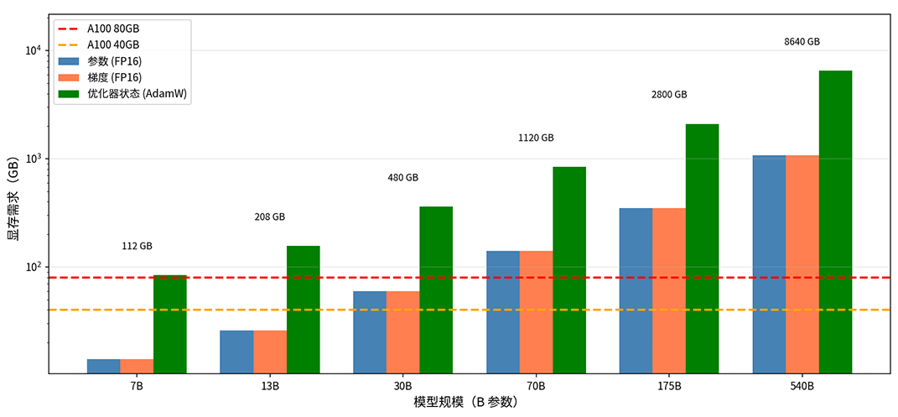

*Figure: Memory requirements for models of different scales*

### Data Parallelism

If a single GPU cannot hold all the data, can we use multiple GPUs to share the load? The earliest approach, **Data Parallelism** (DP), supports multi-GPU parallel training. Data parallelism requires each GPU to hold a complete copy of the model parameters. A large batch is split into smaller sub-batches and distributed across different GPUs, each independently performing forward and backward propagation. Finally, the GPUs aggregate their computed gradients, obtain the average gradient, and update their parameters to keep all replicas synchronized.

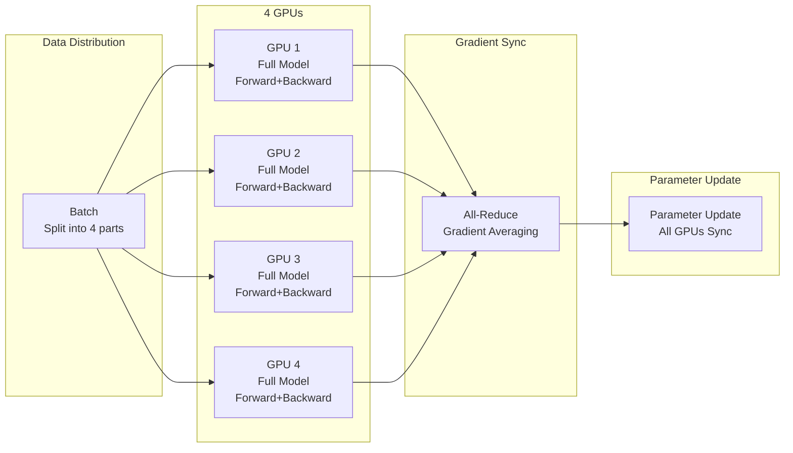
*Figure: Data Parallelism workflow*

Data parallelism is very simple to implement — it requires almost no modification to the model code and can be done using PyTorch's native `DistributedDataParallel` (DDP). But its limitation is immediately apparent: data parallelism does nothing to alleviate the memory bottleneck for large models. It only solves the problem of "training being too slow," not the problem of "the model not fitting in memory." During training, each GPU must hold the complete model, including parameters, gradients, and optimizer states. As the following formula shows, the $2N + 2N + 12N$ portion does not decrease as the number of GPUs increases — only $A$ can be reduced by using smaller sub-batches. As computed earlier, a 70B model requires approximately 1120 GB for parameters and optimizer states alone, which no single GPU can accommodate.

$$\text{Memory per GPU} = \underbrace{2N + 2N + 12N}_{\text{params + gradients + optimizer}} + \underbrace{A}_{\text{activations}}$$

### Model Parallelism

What truly breaks through the single-GPU memory limit is **Model Parallelism** (MP), which does not replicate the entire model but instead places different parts of the model on different GPUs. Model parallelism comes in two main forms: **Pipeline Parallelism** and **Tensor Parallelism**, which partition the model at the "inter-layer" and "intra-layer" granularity, respectively.

#### Pipeline Parallelism

**Pipeline Parallelism** (PP) splits the model by layers, placing different layers on different GPUs, and data flows through the GPUs sequentially like an assembly line. In 2019, Google's paper "[GPipe: Efficient Training of Giant Neural Networks using Pipeline Parallelism](https://arxiv.org/abs/1811.06965)" presented a systematic implementation of this approach, and Carnegie Mellon University later introduced more efficient scheduling strategies in PipeDream.

Consider a 48-layer Transformer model. During training, layers 1-12 are placed on GPU 1, layers 13-24 on GPU 2, and so on. In a forward pass, data first passes through 12 layers of computation on GPU 1, then the output activations are sent to GPU 2. GPU 2 processes them through its 12 layers and passes the result to GPU 3, continuing until GPU 4 produces the final output. The backward pass works in reverse, with gradients flowing from GPU 4 back to GPU 1.

This naive pipeline design means only one GPU is active at any given time. When GPU 1 is computing the first 12 layers, GPUs 2, 3, and 4 are idle. After GPU 1 finishes and passes the activations to GPU 2, GPU 2 starts computing while GPUs 1, 3, and 4 are idle. The resource utilization of the entire pipeline is only about 25%. The timeline below shows the idle periods when 4 GPUs process a single batch. These idle periods are called **Pipeline Bubbles**.

```mermaid
gantt
    title Naive Pipeline: Only 1 GPU Active at a Time
    dateFormat X
    axisFormat %s

    section GPU 1
    F1 :f1, 0, 1s
    Idle :done, i1, after f1, 3s
    B1 :b1, after i1, 1s

    section GPU 2
    Idle :done, w2, 0, 1s
    F2 :f2, after w2, 1s
    Idle :done, i2, after f2, 2s
    B2 :b2, after i2, 1s

    section GPU 3
    Idle :done, w3, 0, 2s
    F3 :f3, after w3, 1s
    Idle :done, i3, after f3, 1s
    B3 :b3, after i3, 1s

    section GPU 4
    Idle :done, w4, 0, 3s
    F4 :f4, after w4, 1s
    B4 :after f4, 1s
```
*Figure: Naive Pipeline timeline*

Micro-batch pipelining was proposed to reduce these bubbles. Since a GPU must wait a long time after completing a batch's forward pass before receiving the backward pass gradients, it might as well use that waiting time to process the forward pass of the next batch. The idea is to split a large training batch into several micro-batches and feed them into the pipeline sequentially. Using the 4-GPU scenario above as an example, splitting a batch into 4 micro-batches ($m_1, m_2, m_3, m_4$) yields the following timeline.

```mermaid
gantt
    title Micro-batch Pipeline Timeline (4 Micro-batches)
    dateFormat X
    axisFormat %s

    section GPU 1
    F₁-m₁ :f1m1, 0, 1s
    F₁-m₂ :f1m2, after f1m1, 1s
    F₁-m₃ :f1m3, after f1m2, 1s
    F₁-m₄ :f1m4, after f1m3, 1s

    section GPU 2
    Idle :done, w2, 0, 1s
    F₂-m₁ :f2m1, after w2, 1s
    F₂-m₂ :f2m2, after f2m1, 1s
    F₂-m₃ :f2m3, after f2m2, 1s
    F₂-m₄ :f2m4, after f2m3, 1s

    section GPU 3
    Idle :done, w3, 0, 2s
    F₃-m₁ :f3m1, after w3, 1s
    F₃-m₂ :f3m2, after f3m1, 1s
    F₃-m₃ :f3m3, after f3m2, 1s
    F₃-m₄ :f3m4, after f3m3, 1s

    section GPU 4
    Idle :done, w4, 0, 3s
    F₄-m₁ :f4m1, after w4, 1s
    F₄-m₂ :f4m2, after f4m1, 1s
    F₄-m₃ :f4m3, after f4m2, 1s
    F₄-m₄ :after f4m3, 1s
```
*Figure: Micro-batch timeline*

- **Time 1**: Only GPU 1 processes the forward pass of $m_1$; the rest remain idle.
- **Time 2**: GPU 1 starts processing the forward pass of $m_2$, while the activations of $m_1$ computed by GPU 1 are passed to GPU 2, which begins processing the forward pass of $m_1$.
- **Time 3**: GPU 1 processes $m_3$, GPU 2 processes $m_2$, GPU 3 processes $m_1$ — three GPUs are now working simultaneously.
- **Time 4**: All 4 GPUs are fully utilized, each processing different stages of different micro-batches, with utilization approaching 100%. This works exactly like a factory assembly line: every product must pass through all stations sequentially, but different products can be processed at different stations simultaneously. Once the pipeline is filled, all stations are running.

The timeline above only shows the forward pass, omitting the backward pass. A complete training cycle alternates between forward and backward passes. How the forward and backward passes are interleaved involves two different scheduling strategies: GPipe and PipeDream.

- GPipe uses synchronous scheduling: all micro-batches complete their forward passes sequentially first, then complete their backward passes sequentially. Using the example of 4 micro-batches, $m_1$ through $m_4$ sequentially pass through 4 GPUs for forward propagation, then $m_4$ through $m_1$ sequentially complete backward propagation. The advantage of this approach is simple implementation — gradients are synchronized uniformly after all micro-batches complete, which is mathematically equivalent to using a full batch. The downside is high memory usage: since backward propagation does not start until all micro-batches have finished their forward passes, GPUs must simultaneously hold the activations of all micro-batches. Additionally, the transition between forward and backward passes creates large pipeline bubbles.

- PipeDream uses 1F1B (One Forward One Backward) scheduling, where the forward and backward passes of the same micro-batch are not contiguous. GPUs interleave the forward and backward computation of different micro-batches. After $m_1$ completes forward propagation, it immediately starts $m_1$ backward propagation without waiting for other micro-batches. This means the GPU only needs to hold the activations of the currently processed micro-batch, which can be released immediately after backward propagation completes, significantly reducing memory usage. However, 1F1B is more complex to implement: different micro-batches may use different versions of model parameters (the backward pass of one micro-batch may have already updated parameters, while the forward pass of a later micro-batch uses the updated parameters), requiring additional handling of parameter version consistency.

| Strategy | GPipe | PipeDream |
|:---------|:------|:----------|
| Scheduling | Synchronous (sync after all micro-batches) | Asynchronous (1F1B scheduling) |
| Memory efficiency | Stores activations for all micro-batches | Stores only partial activations |
| Implementation complexity | Simple | Complex (requires version consistency handling) |
| Use case | Determinism preferred | High throughput preferred |

Pipeline parallelism requires far less communication than tensor parallelism, because GPUs only pass inter-layer activations between each other, without synchronizing model parameters. However, it still has limitations: first, pipeline bubbles — GPUs still have idle time during micro-batch transitions; second, uneven inter-layer load — if different layers have different computational demands, certain GPUs may become bottlenecks.

#### Tensor Parallelism

Pipeline parallelism splits the model by layers, but if a single layer itself is very large and cannot fit on a single GPU, further splitting within the layer is needed. **Tensor Parallelism** (TP) partitions the computation of a single layer across multiple GPUs. In their 2019 Megatron-LM paper, NVIDIA presented an efficient partitioning scheme for both the FFN and Attention layers in the Transformer architecture. The FFN layer ($Y = ReLU(XW_1)W_2$) contains two linear layers $W_1$ and $W_2$. $W_1$ can be split column-wise, and $W_2$ row-wise:

$$W_1 = [W_1^{(1)}, W_1^{(2)}], \quad W_2 = \begin{bmatrix} W_2^{(1)} \\ W_2^{(2)} \end{bmatrix}$$

Column-wise splitting of $W_1$ means the two GPUs each hold half the columns of the weight matrix and independently compute a portion of the intermediate results. Row-wise splitting of $W_2$ allows each GPU to compute a portion of the output from its own intermediate results, and the final output is obtained by adding them together. Specifically, GPU 1 computes $Y^{(1)} = ReLU(XW_1^{(1)})W_2^{(1)}$, GPU 2 computes $Y^{(2)} = ReLU(XW_1^{(2)})W_2^{(2)}$, and then $Y = Y^{(1)} + Y^{(2)}$. This is like two people each computing half of an addition and then combining the results.

Splitting the Attention layer is more natural. In multi-head attention, each attention head is inherently an independent computational unit; we simply need to assign different heads to different GPUs. However, similar to the FFN layer, the QKV projection matrices must be split column-wise, and the output projection matrix must be split row-wise, so that each GPU can independently compute its own attention heads, requiring only a single All-Reduce to merge the output.

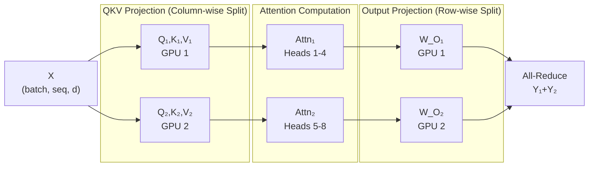
*Figure: Attention layer partitioning*

The advantage of tensor parallelism is its fine-grained splitting, resulting in balanced GPU workloads, making it suitable for very large single layers (e.g., the FFN in a 175B model). Its cost is very frequent inter-GPU communication — each layer's forward and backward pass requires an [All-Reduce](#all-reduce) operation to aggregate results. Therefore, it is highly sensitive to inter-GPU communication bandwidth and typically requires high-bandwidth interconnects like NVIDIA NVLink or Ascend HCCS to be effective.

### 3D Parallelism

In practice, using a single parallelization strategy is often insufficient when training large models. Modern large model training typically combines Data Parallelism (DP), Pipeline Parallelism (PP), and Tensor Parallelism (TP) — a strategy known as 3D Parallelism.

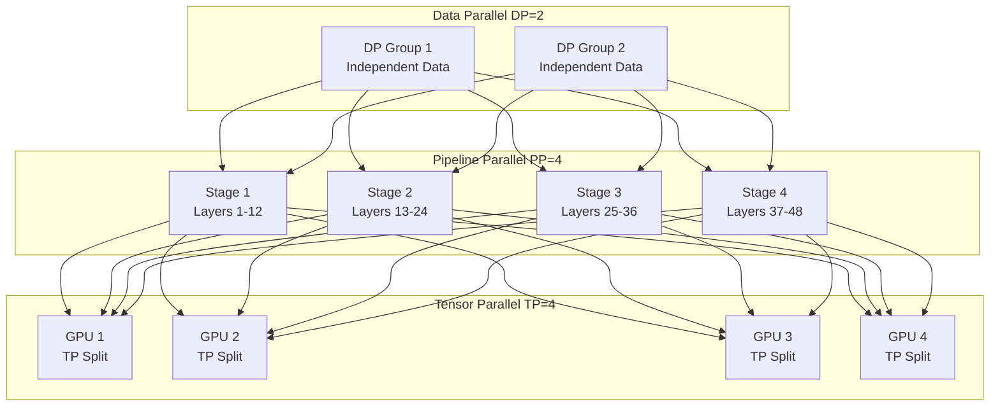
*Figure: 3D Parallelism training strategy*

Taking GPT-3 175B as an example, if training uses 1024 GPUs, a typical configuration might be TP = 8 (8 GPUs per tensor parallelism group, leveraging NVLink high-bandwidth communication), PP = 4 (4 pipeline stages, each with approximately 24 layers), and DP = 32 (32 data parallel replicas processing different data). Total GPUs = TP x PP x DP = $8 \times 4 \times 32 = 1024$.

The configuration of 3D parallelism is not chosen arbitrarily; several constraints must be considered: tensor parallelism degree should match the number of GPUs within a single node (since TP requires All-Reduce at every layer and is extremely sensitive to communication bandwidth, it must use high-bandwidth intra-node interconnects — cross-node latency is unacceptable), pipeline parallelism degree is limited by the number of model layers (PP=4 requires at least 4 evenly divisible groups of layers), and data parallelism degree depends on the total available GPUs (DP = total GPUs / (TP x PP)). Recommended parallel strategies by model scale are as follows:

| Model Scale | Recommended Strategy | Reason |
|:------------|:---------------------|:-------|
| < 1B | DP | Fits in single GPU, DP is simplest |
| 1B - 10B | DP + PP | Needs multiple GPUs, but communication overhead is manageable |
| 10B - 100B | DP + PP + TP | Requires fine-grained splitting |
| > 100B | DP + PP + TP + ZeRO | Requires extreme memory optimization |

## ZeRO Optimization

In standard data parallelism, every GPU stores the complete set of model parameters, gradients, and optimizer states. This data is identical across all GPUs, resulting in significant redundancy. Using a 4-GPU training setup for a 70B model as an example, the optimizer states total 840 GB, but each GPU stores the full copy — 3/4 of which is redundant. To address this issue, the Microsoft DeepSpeed team proposed ZeRO (Zero Redundancy Optimizer) in their 2020 paper "[ZeRO: Memory Optimizations Toward Training Trillion Parameter Models](https://arxiv.org/abs/1910.02054)." ZeRO distributes these redundant data across different GPUs, greatly reducing memory usage by eliminating redundant storage in data parallelism. Based on the degree of optimization, ZeRO is divided into the following stages:

- **ZeRO-1: Optimizer State Sharding**

    ZeRO-1 shards the optimizer states across different GPUs, reducing per-GPU memory from $2N + 2N + 12N = 16N$ to $2N + 2N + 12N/N_{gpu}$, where $N_{gpu}$ is the number of GPUs. For a 70B model with 64 GPUs, the optimizer state drops from 840 GB to approximately 13 GB, and per-GPU memory drops from 1120 GB to about 293.1 GB (140 GB + 140 GB + 13.1 GB). The cost is that an [All-Gather](#all-reduce) operation is needed to collect the complete optimizer states during parameter updates, increasing communication by about 50%.

- **ZeRO-2: Gradient Sharding**

    ZeRO-2 further shards gradients on top of ZeRO-1 — each GPU only stores the gradients corresponding to its portion of the optimizer states. Since each GPU is only responsible for updating $1/N$ of the parameters, it only needs the gradients for that portion; the remaining gradients can be released after backpropagation completes. This further reduces per-GPU memory to $2N + 2N/N_{gpu} + 12N/N_{gpu}$. For a 70B model with 64 GPUs, this drops to approximately 155.3 GB (140 GB + 2.2 GB + 13.1 GB). The cost is that a Reduce-Scatter operation is needed after backpropagation to shard gradients across GPUs, increasing communication further compared to ZeRO-1 (by about 50%-100%), though still far less than the overhead of ZeRO-3.

- **ZeRO-3: Parameter Sharding**

    ZeRO-3 also shards the parameters — each GPU stores only $1/N$ of the parameters. During forward and backward propagation, an All-Gather operation temporarily fetches the needed parameters, which are released immediately after computation. The workflow is: during forward propagation, All-Gather the current layer's parameters, compute, then release. During backward propagation, All-Gather the current layer's parameters and gradients, compute, then release. During parameter updates, only the local shard is updated.

    ZeRO-3 reduces per-GPU memory to $16N/N_{gpu}$. In theory, the more GPUs available, the less memory per GPU. For a 70B model with 64 GPUs, each GPU requires only about 17.5 GB (2.2 GB + 2.2 GB + 13.1 GB), comfortably fitting in a single A100 80GB. The cost is that communication is about 1.5 times that of standard data parallelism, because every layer in both forward and backward passes requires All-Gather for parameters. The figure below shows per-GPU memory comparison between standard DP and ZeRO-1/2/3, with the red dashed line representing the A100 80GB ceiling.

    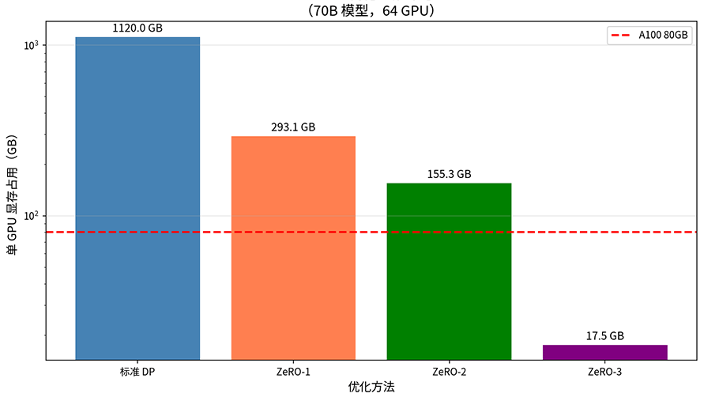

    *Figure: ZeRO optimization memory comparison*

- **ZeRO-Offload: CPU Offloading**

    When GPU memory is still insufficient, ZeRO-Offload offloads optimizer states and gradients to CPU memory. The GPU retains only the FP16 model parameters and activations, while FP32 optimizer states and gradients are kept on the CPU side and transferred via PCIe when needed. The cost of this approach is that CPU-GPU data transfer becomes a bottleneck, significantly slowing down training. It is not an industrial-grade model training solution and is only suitable for scenarios with severely constrained memory where slower training is acceptable, such as training large models on a small number of consumer-grade GPUs.

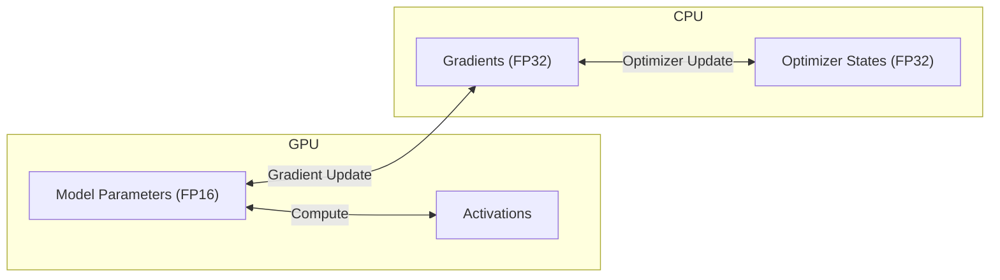
*Figure: ZeRO-Offload scheme*

- **ZeRO-Infinity: NVMe Offloading**

    ZeRO-Infinity further offloads data to NVMe SSDs, leveraging high-speed storage to expand available capacity. When CPU memory is also insufficient, NVMe offloading provides a last line of defense, making it possible to train extremely large models on limited hardware.

## Mixed Precision Training

Besides splitting the model across multiple GPUs, reducing the storage precision of each numerical value is another way to save memory overhead. FP32 occupies 4 bytes per number, while FP16 occupies only 2 bytes — switching to FP16 immediately halves memory and bandwidth usage. In 2017, NVIDIA systematically proposed the mixed precision training method in their paper "[Mixed Precision Training](https://arxiv.org/abs/1710.03740)," which quickly became the standard practice for large model training.

While FP16 saves memory, it is important to recognize that the representable range of FP16 is quite limited: the maximum normal value is about 65504, the minimum normal value is about $6 \times 10^{-5}$, and precision is approximately 3 decimal digits. Training with FP16 leads to two direct consequences. The first is gradient underflow: gradients in deep learning are typically very small, on the order of $10^{-5}$ to $10^{-8}$, and FP16 cannot accurately represent these tiny values — they are truncated to zero, causing vanishing gradients. The second is weight update error: FP16 has limited precision. When the update $\epsilon \cdot g$ (learning rate times gradient) is very small, the result of $W + \epsilon \cdot g$ may be exactly the same as $W$, meaning the parameters are not actually updated.

For the weight update error problem, the solution in mixed precision training is to maintain two sets of weights simultaneously: a set of FP32 master weights $W_{master}$ for parameter updates, and a set of FP16 working weights $W$ for forward and backward propagation. At the beginning of each iteration, $W_{master}$ is converted to FP16 to obtain $W$, which is used for forward and backward propagation. The gradients are then converted back to FP32 to update $W_{master}$.

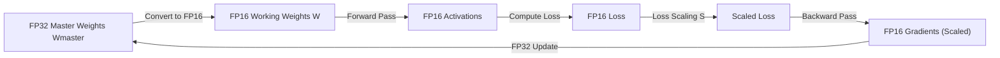
*Figure: Mixed Precision Training*

The advantage is that forward and backward passes use FP16, which is fast and memory-efficient, while parameter updates use FP32, which is precise and avoids losing small updates. Compared to pure FP16 training, mixed precision training only adds the overhead of one additional copy of FP32 master weights. Compared to full FP32 training, both activations and gradients are reduced to FP16, saving a significant amount of memory — total memory is still far lower than full FP32 training.

For the gradient underflow problem, loss scaling can be used. The minimum normal value of FP16 is about $6 \times 10^{-5}$, but many gradient values are even smaller. Before backpropagation, loss scaling multiplies the loss value by a scaling factor $S$. By the chain rule, all gradients are also magnified by $S$, bringing them into the representable range of FP16:

$$scaled\_loss = loss \times S$$

$$scaled\_grad = \frac{\partial(scaled\_loss)}{\partial W} = grad \times S$$

After backpropagation completes, the gradients are divided by $S$ to restore the original values:

$$grad = scaled\_grad / S$$

$S$ must be large enough to bring gradients into the FP16 representable range, but not so large that it causes gradient overflow (producing inf). In practice, dynamic loss scaling is used. If gradient overflow is detected, $S$ is halved. If no overflow occurs for several consecutive steps, $S$ is doubled. The figure below compares the gradient distribution before and after scaling (S=1024). The red dashed line represents the FP16 minimum normal value, and scaling significantly reduces the proportion of underflow.

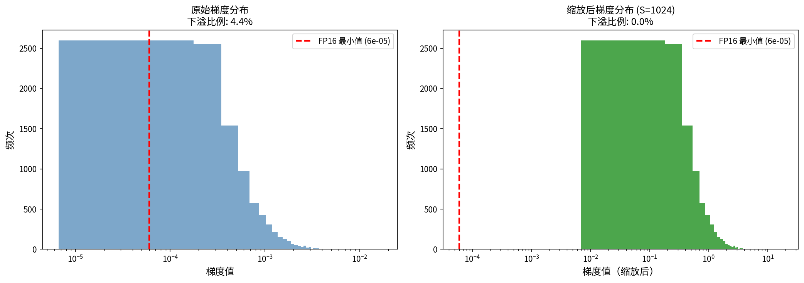

*Figure: Loss scaling effect comparison*

Compared to performing loss scaling every backward pass, BF16 offers an entirely different perspective. BF16 (Brain Float 16) is a floating-point format designed by Google for deep learning, whose effectiveness was systematically demonstrated in the 2019 paper "[A Study of BFLOAT16 for Deep Learning Training](https://arxiv.org/abs/1905.12322)." Its design philosophy differs from FP16: FP16 uses 5 exponent bits and 10 mantissa bits, sacrificing range for precision. BF16 uses 8 exponent bits and 7 mantissa bits, sacrificing precision to achieve the same representable range as FP32.

| Format | Sign | Exponent | Mantissa | Representable Range |
|:-------|:-----|:---------|:---------|:--------------------|
| FP16   | 1    | 5        | 10       | ±65504              |
| BF16   | 1    | 8        | 7        | ±3.4e38             |
| FP32   | 1    | 8        | 23       | ±3.4e38             |

BF16 uses the same 8-bit exponent as FP32, so its representable range is identical (maximum approximately $3.4 \times 10^{38}$), avoiding the gradient underflow problem of FP16. This means BF16 training does not require loss scaling, making the training process simpler and numerically more stable. The figure below compares the representable ranges of FP16, BF16, and FP32. BF16 and FP32 share the same range, at the cost of lower precision (only 7 mantissa bits versus FP16's 10), which may affect certain precision-sensitive computations. Additionally, hardware support for BF16 requires Ampere architecture GPUs and later.

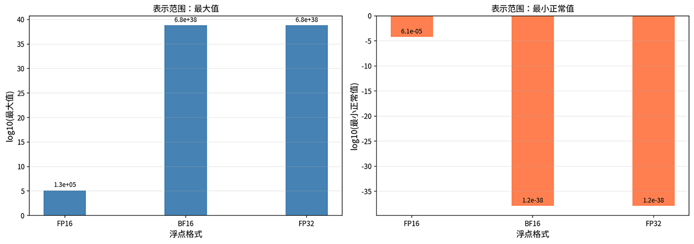

*Figure: Floating-point format representation range comparison*

## Gradient Accumulation and Checkpointing

Even with ZeRO optimization and mixed precision, memory may still be insufficient to support large batch size training. In such cases, two complementary techniques can be considered: gradient accumulation and gradient checkpointing. Gradient accumulation trades time for space, simulating large batch training without increasing memory usage. Gradient checkpointing trades computation for memory, reducing activation storage through recomputation.

- **Gradient Accumulation**: Suppose the optimal batch size is 64, but memory can only accommodate a batch size of 4. Gradient accumulation performs 16 consecutive forward and backward passes (each with batch size = 4), accumulating the gradients, and updating parameters once at the end. Mathematically, this is equivalent to a single update using batch size = 64. In terms of engineering, the total computation (FLOPs) is the same as using the full batch size.

- **Gradient Checkpointing** (also known as Activation Recomputation): In standard training, the forward pass saves activations for all layers, which are later used during backpropagation. These activations consume a large amount of memory, especially when the sequence length is long. Gradient checkpointing works by saving activations only for a subset of layers (checkpoints) during the forward pass, and recomputing the activations for the remaining layers during backpropagation.

    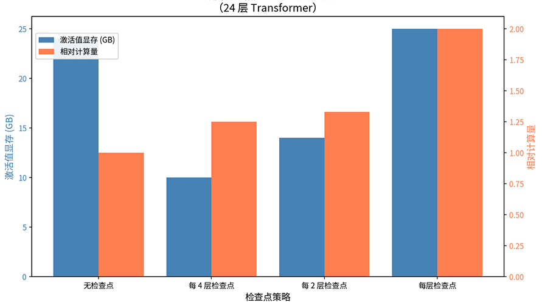

    *Figure: Gradient Checkpointing*

    Suppose the model has $L$ layers, with each layer's activations requiring $A$ bytes. Standard training needs $L \times A$ of activation memory. If a checkpoint is saved every $k$ layers, activation memory is reduced to $(L/k + k) \times A$, because we only need to store activations for $L/k$ checkpoints plus the temporary activations of at most $k$ layers between any two checkpoints. The cost is the need for additional forward pass computation, increasing training time by approximately 20-30%. The figure above shows activation memory and relative computation for a 24-layer Transformer under different checkpointing strategies: blue represents memory and orange represents computation.

## Communication Optimization

In distributed training, GPUs need to communicate frequently to synchronize gradients, parameters, and activations. When the number of GPUs reaches the thousands, communication overhead can account for a significant portion of total training time. This section introduces several techniques for reducing communication overhead.

### All-Reduce

All-Reduce is the most commonly used communication primitive in distributed training. It means each node contributes a piece of data, and ultimately all nodes receive the aggregated result (such as summed or averaged gradients). The simplest implementation is to designate a master node: all nodes send their data to it, it aggregates, and then broadcasts the result to everyone. However, the master node can become a communication bottleneck — its bandwidth determines the speed of the entire operation. Therefore, in practice, the Ring All-Reduce scheme is more commonly used.

Ring All-Reduce organizes nodes into a ring topology, with data passing around the ring in two phases: Scatter-Reduce and All-Gather. In the Scatter-Reduce phase, each node processes only $1/N$ of the data, passing it around the ring with progressive accumulation. In the All-Gather phase, the aggregated result is broadcast around the ring to all nodes. The advantage of Ring All-Reduce is higher bandwidth utilization: each node sends and receives data simultaneously, the communication load is evenly distributed, and there is no single point of bottleneck. The communication volume per node is $2(N-1) \times \text{data size} / N$, which approximates $2 \times \text{data size}$ when $N$ is large — independent of the number of nodes.

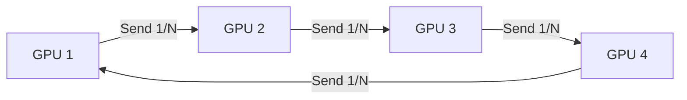
*Figure: Ring All-Reduce*

### Gradient Compression

When communication bandwidth becomes a bottleneck, the amount of data transferred can be reduced by compressing gradients. For example, quantization compression converts FP32 gradients to lower-precision formats (such as INT8), reducing communication to 1/4 of the original. Let $g$ be the original gradient and $\Delta$ be the quantization step size (determined by the gradient range and quantization bit-width). The gradient can then be mapped to the nearest integer scale using the following formula:

$$g_{quantized} = round(g / \Delta) \times \Delta$$

Quantization inevitably introduces errors, but errors at INT8 and above are typically within an acceptable range. Another approach is to keep numerical precision unchanged but reduce the number of gradients transmitted per communication step. This is called sparsification compression. The idea is to only send the gradients with the largest absolute values at each step, ignoring small gradients. Top-K sparsification retains only the K components with the largest absolute values, reducing communication to K/N (where N is the total gradient dimension). To compensate for the information loss from discarded gradients, the unsent gradients are accumulated locally until they enter the top K components and are sent out, preventing permanent information loss. The figure below compares the gradient distributions for the original gradients, Top-10 sparsification (retaining 10%), and INT8 quantization. Sparsification reduces communication by 90%, and quantization reduces it by 75%.

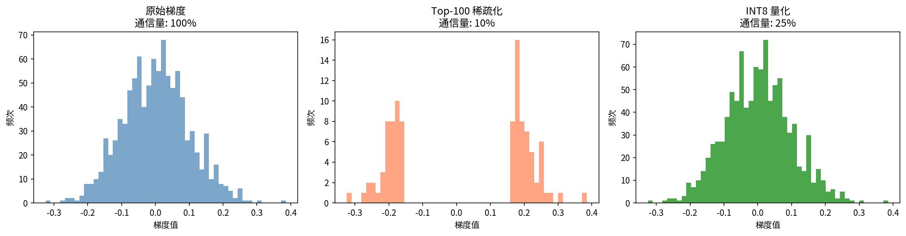

*Figure: Gradient compression effect comparison*

### Computation-Communication Overlap

Computation-communication overlap is another way to improve efficiency. The typical training process completes all computation on the GPU first, then performs communication, leaving the GPU idle during communication. The overlapping approach starts synchronizing a layer's gradients as soon as its gradient computation is complete during backpropagation, while continuing to compute gradients for the next layer. This way, computation and communication execute in parallel, hiding communication time within computation time.

DualPipe, proposed by DeepSeek-V3, is a more aggressive overlapping strategy. It achieves complete overlap of forward propagation, backward propagation, and communication through a dual-pipeline schedule, further reducing GPU idle time, as shown in the figure below.

```mermaid
gantt
    title Computation-Communication Overlap
    dateFormat X
    axisFormat %s

    section GPU 1
    Forward-1 :fw1, 0, 2s
    Backward-1 :bw1, after fw1, 2s

    section GPU 2
    Forward-2 :fw2, after fw1, 2s
    Backward-2 :bw2, after fw2, 2s

    section GPU 3
    Forward-3 :fw3, after fw2, 2s
    Backward-3 :bw3, after fw3, 2s

    section Communication
    Comm-1 :crit, c1, after fw1, 2s
    Comm-2 :crit, c2, after fw2, 2s
    Comm-3 :crit, c3, after fw3, 2s
```
*Figure: DualPipe*

## Summary

Scaling laws promise that as long as we invest more compute power, model performance will continue to improve. Distributed training infrastructure is the engineering foundation for delivering on that promise. As models have grown from billions to hundreds of billions and trillions of parameters, the memory and compute power of a single GPU have long since been insufficient. Data parallelism, pipeline parallelism, tensor parallelism, and ZeRO optimization dismantle the memory bottleneck from different dimensions. 3D parallelism combines them into a scalable training solution, while mixed precision training and gradient accumulation strike a practical balance between precision and efficiency. Communication optimization further ensures that when thousands of GPUs work together, communication overhead does not eat away the benefits of increased compute power. It is precisely this infrastructure that transforms the scaling laws from a power-law curve on paper into a practical engineering reality.

## Exercises

1. Calculate the per-GPU memory requirements for a 70B model under different parallel strategies: data parallelism only (assuming 8 GPUs), DP + PP (4 pipeline stages), DP + PP + TP (PP=4, TP=8), and ZeRO-3 (64 GPUs).

   

   
Reference Answer

   - DP only: 1120 GB per GPU (does not fit in a single GPU)
   - DP + PP (4 stages): Parameters and gradients each split by 1/4, optimizer states also split by 1/4, approximately $140/4 + 140/4 + 840/4 = 280$ GB
   - DP + PP + TP (PP=4, TP=8): Parameters, gradients, and optimizer states each split by 1/(4x8)=1/32, approximately $140/32 + 140/32 + 840/32 = 35$ GB
   - ZeRO-3 (64 GPUs): $1120/64 \approx 17.5$ GB, fits in a single A100 80GB

   

2. Analyze the numerical characteristics of FP16 and BF16: determine the conditions under which $a + b$ may incur precision loss in each format, and explain why BF16 does not require loss scaling.

   

   
Reference Answer

   In FP16, when $|a|$ and $|b|$ differ by more than $2^{10} = 1024$ times, the smaller number is truncated (because FP16 has only 10 mantissa bits). In BF16, this threshold drops to $2^7 = 128$ times — it has worse precision. However, BF16 does not require loss scaling because its exponent bits are the same as FP32 (8 bits), giving it a representable range of ±3.4e38, far exceeding FP16's ±65504, thus avoiding the gradient underflow problem entirely.

   

