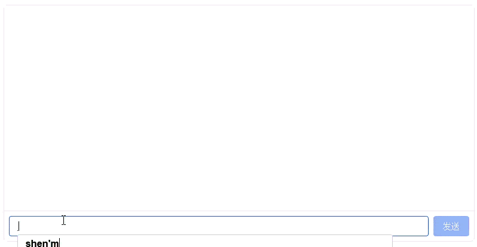

# SFT Model Chat Experiment

In the [Transformer Model Pretraining Experiment](../architecture-basics/llm-pretrain-experiment.md), we trained a language model with approximately 64M parameters capable of generating grammatically fluent and semantically coherent continuations. This experiment uses supervised fine-tuning to teach the model the "user question → model answer" interaction format through manually written instruction-response pairs, achieving the transition from text continuation to dialogue.

## Experiment Preparation

Before starting the experiment, please ensure you have completed the following preparations:

1. Completed the [Transformer Model Pretraining Experiment](../architecture-basics/llm-pretrain-experiment.md), with the model weight file `pretrain_768.pth` properly generated in the data directory.
2. [Mounted the data directory](../../appendixes/sandbox.md#data-management) and downloaded the SFT training corpus. Same as the pretraining experiment, the dataset comes from the open-source project [MiniMind](https://github.com/jingyaogong/minimind).

```bash
# Select "Download Dataset" -> Select "MiniMind SFT (LLM supervised fine-tuning corpus)"
dmla data
```

The SFT corpus text from the MiniMind project (`sft_t2t_mini.jsonl`) contains over 900,000 training samples, including not only conversations but also tool calls, chain-of-thought reasoning, and more, totaling approximately 1.7 GB. If the goal is simply to align the model's language response capabilities, the number of SFT samples can easily be 1-2 orders of magnitude smaller (a few thousand to tens of thousands). Therefore, this experiment randomly selects 50,000 samples (about 90 MB) to generate `sft_t2t_tiny.jsonl` for training. After downloading the dataset, the following code verifies that the pretrained model and SFT corpus are complete:

```python runnable gpu
import os

# Check pretrained model (generated by the previous chapter's experiment)
pretrain_path = os.path.join(DATA_DIR, 'models', 'minimind', 'pretrain', 'pretrain_768.pth')
if os.path.exists(pretrain_path):
    size_mb = os.path.getsize(pretrain_path) / (1024 ** 2)
    print(f"Pretrained model: exists ({size_mb:.1f} MB)")
else:
    # Try checkpoint
    for epoch in [2, 1]:
        ckp = os.path.join(DATA_DIR, 'models', 'minimind', 'pretrain', f'pretrain_epoch{epoch}.pth')
        if os.path.exists(ckp):
            size_mb = os.path.getsize(ckp) / (1024 ** 2)
            print(f"Pretrained model: using epoch {epoch} checkpoint ({size_mb:.1f} MB)")
            break
    else:
        print("Pretrained model: not found! Please complete the pretraining experiment first")

# Check SFT corpus
sft_dir = os.path.join(DATA_DIR, 'datasets', 'minimind-sft')
if os.path.exists(sft_dir):
    print(f"SFT corpus directory: exists")
    for f in os.listdir(sft_dir):
        fpath = os.path.join(sft_dir, f)
        if os.path.isfile(fpath):
            size_mb = os.path.getsize(fpath) / (1024 ** 2)
            print(f"  {f}: {size_mb:.1f} MB")
else:
    print("SFT corpus: not downloaded. Please run 'dmla data' to download the MiniMind SFT dataset")

# Check tokenizer (reusing pretrained one)
tokenizer_dir = os.path.join(DATA_DIR, 'datasets', 'minimind-pretrain')
tokenizer_json = os.path.join(tokenizer_dir, 'tokenizer.json')
tokenizer_config = os.path.join(tokenizer_dir, 'tokenizer_config.json')
print(f"Tokenizer: {'exists' if os.path.exists(tokenizer_json) else 'not found'}")
```

## Stage 1: Supervised Fine-tuning Dataset

The SFT corpus format is also JSONL (one JSON object per line), but unlike the pretraining corpus, each sample no longer contains a `text` field. Instead, it includes a `conversations` array that stores the complete record of a multi-turn dialogue. Each message in `conversations` contains `role` (`user`, `assistant`, or `system`) and `content` (the message body). In addition, some samples in the original corpus also include `tools` and `tool_calls` fields for tool-call training. Although this experiment focuses on basic dialogue alignment, the code retains full tool-call support — simply switch the dataset from `sft_t2t_tiny.jsonl` back to `sft_t2t_mini.jsonl` to enable it.

The objectives of supervised fine-tuning and pretraining are fundamentally different. Pretraining only requires the model to learn to predict the next token, so the labels are simply the input_ids shifted right by one position. SFT, on the other hand, requires selective learning: the user's questions and system prompts should not participate in the loss computation; only the assistant's responses need to be fitted by the model. `SFTDataset` first calls the `pre_processing_chat` function, which randomly inserts a system prompt at the beginning of the conversation with 20% probability (from a pool of 6 prompts in both Chinese and English, such as "你是一个知识丰富的AI，尽力为用户提供准确的信息。" and "You are a helpful AI assistant."). This exposes the model to diverse role configurations during training, preventing overfitting to a single system prompt. The conversation is then converted into uniformly formatted text using the ChatML template, where each message is wrapped as `<|im_start|>role\ncontent<|im_end|>\n` — the dialogue format adopted by the DeepSeek series of models. After tokenization, the result is passed to the `generate_labels` method for mask generation.

`generate_labels` is the key difference between the SFT dataset and the pretraining dataset. It scans the entire token sequence, locates the position of the special token sequence `<|im_start|>assistant\n`, and sets the content immediately following it (up to the corresponding `<|im_end|>` marker) as valid labels (retaining the original token IDs). All other tokens — including user questions, system prompts, and format control markers — are set to -100. PyTorch's `CrossEntropyLoss` ignores positions with label value -100 by default, so only the tokens in the assistant's responses participate in loss computation and gradient backpropagation. This approach teaches the model a behavioral pattern: "what the user says is irrelevant (no need to predict it); just focus on generating a quality response at the designated position."

Like the pretraining dataset, `SFTDataset` reads directly from the JSONL file line by line and tokenizes on the fly. The tokenization operation itself is essentially table lookups and string matching on the CPU, with negligible overhead, so preprocessing optimizations such as LMDB caching are unnecessary. Therefore, the following dataset code is called during training and does not need to be executed manually.

```python runnable gpuonly extract-class="SFTDataset, pre_processing_chat"
import os
import torch
from torch.utils.data import Dataset
import json
import random
from datasets import load_dataset, Features, Value
from datasets import logging as datasets_logging

def pre_processing_chat(conversations, add_system_ratio=0.2):
    """Preprocess conversation data: probabilistically add system prompts"""
    # Tool use data is kept intact without modification
    if any(conv.get('tools') for conv in conversations):
        return conversations

    SYSTEM_PROMPTS = [
        "You are a knowledgeable AI, trying your best to provide accurate information.",
        "You are a professional AI assistant, please provide valuable responses.",
        "You are a reliable AI, please give accurate responses.",
        "You are a helpful AI assistant.",
        "You are a friendly chatbot. Please answer the user's questions carefully.",
        "You are a knowledgeable AI. Try your best to provide accurate information.",
    ]
    # Probabilistically add system prompt
    if conversations[0].get('role') != 'system':
        if random.random() < add_system_ratio:
            return [{'role': 'system', 'content': random.choice(SYSTEM_PROMPTS)}] + conversations
    return conversations


class SFTDataset(Dataset):
    """
    SFT Dataset: tokenizes conversation data into ChatML format

    Key differences from PretrainDataset:
    - Data format changes from {"text": "..."} to {"conversations": [...]}
    - Label masking: only the assistant's response contributes to loss, the rest are marked as -100 (PyTorch CrossEntropyLoss ignores positions with -100 by default)
    - Uses apply_chat_template to convert conversations to ChatML format
    - SFT dataset still supports tool call training by switching from sft_t2t_tiny.jsonl back to sft_t2t_mini.jsonl which includes tool call examples
    """
    # ChatML format: <|im_start|>role\ncontent<|im_end|>\n
    # The tokenizer itself doesn't have a built-in chat_template, needs manual setup
    CHATML_TEMPLATE = (
        "<|im_start|>{{ message.role }}\n"
        "{{ message.content }}<|im_end|>\n"
        ""
        "<|im_start|>assistant\n"
    )

    def __init__(self, jsonl_path, tokenizer, max_length=768):
        super().__init__()
        os.environ["TOKENIZERS_PARALLELISM"] = "false"
        self.tokenizer = tokenizer
        # Tokenizer doesn't have built-in chat_template, needs manual ChatML format setup
        if not tokenizer.chat_template:
            tokenizer.chat_template = self.CHATML_TEMPLATE
        self.max_length = max_length
        features = Features({
            'conversations': [{'role': Value('string'), 'content': Value('string'),
                              'reasoning_content': Value('string'), 'tools': Value('string'),
                              'tool_calls': Value('string')}]
        })
        # Suppress load_dataset's "Generating train split" progress output
        datasets_logging.set_verbosity_error()
        self.samples = load_dataset('json', data_files=jsonl_path, split='train', features=features)
        datasets_logging.set_verbosity_warning()
        # Precompute the start and end token IDs of assistant responses
        # i.e., the token ID sequence corresponding to <|im_start|>assistant\n, used to locate the start of assistant responses
        self.bos_id = tokenizer(f'{tokenizer.bos_token}assistant\n', add_special_tokens=False).input_ids  
        # i.e., the token ID sequence corresponding to <|im_end|>\n, used to locate the end of assistant responses
        self.eos_id = tokenizer(f'{tokenizer.eos_token}\n', add_special_tokens=False).input_ids  

    def __len__(self):
        return len(self.samples)

    def create_chat_prompt(self, conversations):
        """Apply chat template to the conversation list and convert to text"""
        messages = []
        tools = None
        for message in conversations:
            message = dict(message)
            if message.get("role") == "system" and message.get("tools"):
                tools = json.loads(message["tools"]) if isinstance(message["tools"], str) else message["tools"]
            if message.get("tool_calls") and isinstance(message["tool_calls"], str):
                message["tool_calls"] = json.loads(message["tool_calls"])
            messages.append(message)
        return self.tokenizer.apply_chat_template(
            messages, tokenize=False, add_generation_prompt=False, tools=tools
        )

    def generate_labels(self, input_ids):
        """Generate labels: keep original IDs for assistant responses, set the rest to -100"""
        labels = [-100] * len(input_ids)
        i = 0
        while i < len(input_ids):
            # Detect the position of <|im_start|>assistant\n
            if input_ids[i:i + len(self.bos_id)] == self.bos_id:
                start = i + len(self.bos_id)
                end = start
                # Find the corresponding <|im_end|>\n
                while end < len(input_ids):
                    if input_ids[end:end + len(self.eos_id)] == self.eos_id:
                        break
                    end += 1
                # Mark the response interval (including eos)
                for j in range(start, min(end + len(self.eos_id), self.max_length)):
                    labels[j] = input_ids[j]
                i = end + len(self.eos_id) if end < len(input_ids) else len(input_ids)
            else:
                i += 1
        return labels

    def __getitem__(self, index):
        sample = self.samples[index]
        conversations = pre_processing_chat(sample['conversations'])
        prompt = self.create_chat_prompt(conversations)
        input_ids = self.tokenizer(prompt).input_ids[:self.max_length]
        # Pad to fixed length
        # Right-pad to fixed length; padded positions are already set to -100 by generate_labels, so they don't contribute to loss
        input_ids += [self.tokenizer.pad_token_id] * (self.max_length - len(input_ids))  
        labels = self.generate_labels(input_ids)
        return torch.tensor(input_ids, dtype=torch.long), torch.tensor(labels, dtype=torch.long)
```

## Stage 2: Supervised Fine-tuning Training

This experiment is supervised fine-tuning, and the engineering decisions differ from the [pretraining experiment](../architecture-basics/llm-pretrain-experiment.md). The main differences are learning rate and sequence length:

- **Smaller learning rate** (5e-5): The pretraining phase uses a learning rate of 5e-4 to learn language knowledge from random initialization, while SFT fine-tunes behavior patterns based on the pretrained model. A learning rate that is too large would destroy already acquired language abilities, causing catastrophic forgetting.
- **Fewer training steps** (about 3000/epoch): The SFT data volume is much smaller than pretraining data (tens of thousands vs millions). Training for too long easily leads to overfitting, where the model memorizes training data rather than learning general response capabilities.
- **Longer sequence length** (768): Conversation data is typically longer than pretraining text, requiring a larger sequence length to accommodate multi-turn dialogue context.

The engineering decisions in this experiment also differ significantly from the original MiniMind. The original MiniMind's SFT training runs on the full dataset (over 900,000 conversations) in a multi-GPU environment, while this experiment targets a teaching scenario running on a single consumer-grade GPU, so targeted adjustments have been made to the training strategy. The table below lists the key differences and the reasons for each adjustment:

| Training Decision | MiniMind | This Experiment | Reason for Adjustment |
|---------|-------------|-------|---------|
| Training data | Full 900K samples (`sft_t2t_mini.jsonl`) | 50K filtered pure dialogue samples (`sft_t2t_tiny.jsonl`) | MiniMind data includes a large number of `tool_calls` and reasoning chain samples, while this experiment only performs basic dialogue alignment. Reducing the data volume cuts training time from several hours to about 15 minutes, suitable for teaching demonstrations |
| Learning rate | 1e-5 | 5e-5 | MiniMind trains on the full dataset for about 110K steps, with cosine scheduling having enough steps to decay slowly. This experiment has only about 3,000 steps/epoch; with a 1e-5 learning rate, the cosine scheduler would need thousands of steps to push the learning rate down to the 1e-6 range, effectively stopping learning. Increasing by 5x ensures sufficient update magnitude within the limited number of steps |
| Learning rate schedule | Pure cosine decay | Linear warmup (first 10%) + cosine decay | Pure cosine scheduling starts decaying from step 1, causing the learning rate to drop too quickly when steps are few. Adding a warmup stage allows the model to fully explore the parameter space with gradually increasing learning rates at the beginning, preventing the learning rate from dropping to ineffective levels too early |
| Gradient accumulation | 1 (`batch_size = 16`) | 2 (`batch_size = 16`, effective 32) | MiniMind directly uses `batch_size = 16` with per-step updates. SFT's sequence length of 768 is longer than pretraining's 512, consuming more GPU memory; `batch_size = 32` would cause OOM on 8 GB VRAM. Using `batch_size = 16 + accumulation_steps = 2` maintains an effective batch size of 32 with approximately 6.7 GB VRAM, runnable on 8 GB |
| Training epochs | 2 | 2 | Consistent with MiniMind. SFT data volume is small; training for too long easily leads to overfitting |

These adjustments are trade-offs made based on purpose (experiment, research, production, etc.), data volume, and resource conditions. There is no one-size-fits-all engineering decision (otherwise it would be called a best practice), and one cannot evaluate which decision is better outside of a specific context.

::: info Training Estimate

`sft_t2t_tiny.jsonl` contains about 50,000 dialogue samples, totaling only 90 MB. With sequence length 768, batch size 16 (gradient accumulation x 2, effective batch size 32), 2 epochs, approximately 8 GB VRAM is required. Training time on an RTX 5080 GPU is about 15 minutes.

:::

```python runnable gpuonly timeout=unlimited
import os
import time
import math
import torch
import torch.nn as nn
import torch.optim as optim
from torch.utils.data import DataLoader
from contextlib import nullcontext
from transformers import AutoTokenizer

# Import progress reporting module
from dmla_progress import ProgressReporter

# Import shared modules
from shared.llm.mini_mind_config import MiniMindForCausalLM, MiniMindConfig
from shared.llm.sftdataset import SFTDataset

# ========== Path Configuration ==========
TOKENIZER_PATH = os.path.join(DATA_DIR, 'datasets', 'minimind-pretrain')
SFT_DATA_PATH = os.path.join(DATA_DIR, 'datasets', 'minimind-sft', 'sft_t2t_tiny.jsonl')
PRETRAIN_PATH = os.path.join(DATA_DIR, 'models', 'minimind', 'pretrain', 'pretrain_768.pth')
SAVE_DIR = os.path.join(DATA_DIR, 'models', 'minimind', 'sft')

# ========== Training Hyperparameters ==========
hidden_size = 768
num_hidden_layers = 8
max_seq_len = 768
batch_size = 16            # 8G VRAM adaptation (lower batch_size to avoid OOM)
learning_rate = 5e-5       # SFT learning rate (one order of magnitude lower than pretrain's 5e-4, but not too small)
num_epochs = 2
accumulation_steps = 2     # Gradient accumulation (effective batch_size = 16 x 2 = 32)
grad_clip = 1.0
log_interval = 50
save_interval = 500

# ========== 1. Initialize Environment ==========
progress = ProgressReporter(total_steps=10, description="Preparing SFT training environment")
progress.update(0, message="Detecting runtime environment...")

device = torch.device('cuda' if torch.cuda.is_available() else 'cpu')
if device.type == 'cuda':
    print(f"GPU: {torch.cuda.get_device_name(0)}")
    print(f"VRAM: {torch.cuda.get_device_properties(0).total_memory / 1024**3:.1f} GB")
else:
    print("Warning: No GPU detected, training will be very slow")

torch.manual_seed(42)
if device.type == 'cuda':
    torch.cuda.manual_seed(42)

# ========== 2. Load Tokenizer and Data ==========
progress.update(2, message="Loading tokenizer and SFT training data...")
tokenizer = AutoTokenizer.from_pretrained(TOKENIZER_PATH)
train_ds = SFTDataset(SFT_DATA_PATH, tokenizer, max_length=max_seq_len)
print(f"Training samples: {len(train_ds):,}")

train_loader = DataLoader(
    train_ds, batch_size=batch_size, shuffle=True,
    num_workers=2, pin_memory=True, drop_last=True
)
total_steps_per_epoch = len(train_loader)
total_steps = num_epochs * total_steps_per_epoch
print(f"Steps per epoch: {total_steps_per_epoch:,}")
print(f"Total training steps: {total_steps:,}")

# ========== 3. Create Model and Load Pretrained Weights ==========
progress.update(4, message="Creating model and loading pretrained weights...")
lm_config = MiniMindConfig(hidden_size=hidden_size, num_hidden_layers=num_hidden_layers)
model = MiniMindForCausalLM(lm_config)

# Load pretrained weights (starting point for SFT)
weight_path = None
if os.path.exists(PRETRAIN_PATH):
    weight_path = PRETRAIN_PATH
else:
    for epoch in [2, 1]:
        ckp = os.path.join(DATA_DIR, 'models', 'minimind', 'pretrain', f'pretrain_epoch{epoch}.pth')
        if os.path.exists(ckp):
            weight_path = ckp
            break

if weight_path:
    weights = torch.load(weight_path, map_location=device)
    model.load_state_dict(weights, strict=False)
    print(f"Loaded pretrained weights: {weight_path}")
else:
    print("Pretrained weights not found, using random initialization")

model = model.to(device)
total_params = sum(p.numel() for p in model.parameters())
print(f"Model parameters: {total_params:,} ({total_params/1e6:.2f}M)")

# ========== 4. Configure Training Components ==========
progress.update(6, message="Configuring optimizer and learning rate scheduler...")

device_type = "cuda" if device.type == "cuda" else "cpu"
autocast_ctx = nullcontext() if device_type == "cpu" else torch.amp.autocast(device_type, dtype=torch.bfloat16)

optimizer = optim.AdamW(model.parameters(), lr=learning_rate)

def get_lr(current_step, total_steps, lr):
    """Linear warmup + cosine decay: first 10% of steps linearly warm up, then cosine decay to 10% of initial lr"""
    warmup_steps = int(0.1 * total_steps)
    if current_step < warmup_steps:
        return lr * current_step / warmup_steps
    progress = (current_step - warmup_steps) / (total_steps - warmup_steps)
    return lr * (0.1 + 0.45 * (1 + math.cos(math.pi * progress)))

os.makedirs(SAVE_DIR, exist_ok=True)
progress.update(8, message="SFT training environment ready")

# ========== 5. Start Training ==========
progress.reset(total_steps=total_steps, description="SFT supervised fine-tuning")

global_step = 0
best_loss = float('inf')

for epoch in range(num_epochs):
    model.train()
    epoch_start = time.time()
    running_loss = 0.0
    running_logits_loss = 0.0
    log_step_count = 0

    for step, (input_ids, labels) in enumerate(train_loader):
        input_ids = input_ids.to(device)
        labels = labels.to(device)

        # Cosine learning rate scheduling
        lr = get_lr(global_step, total_steps, learning_rate)
        for param_group in optimizer.param_groups:
            param_group['lr'] = lr

        # Forward pass (mixed precision)
        with autocast_ctx:
            res = model(input_ids, labels=labels)
            # Divide by accumulation steps so that the gradient mean after accumulation is equivalent to a single step
            loss = res.loss / accumulation_steps  

        # Backward pass
        loss.backward()

        # Gradient accumulation + parameter update
        if (step + 1) % accumulation_steps == 0:
            torch.nn.utils.clip_grad_norm_(model.parameters(), grad_clip)
            optimizer.step()
            optimizer.zero_grad(set_to_none=True)

        # Record loss (restore original value before accumulation)
        # Restore to the single-step original loss for logging and comparison
        current_loss = loss.item() * accumulation_steps  
        current_aux = res.aux_loss.item() if res.aux_loss is not None else 0.0
        running_loss += current_loss
        running_logits_loss += (current_loss - current_aux)
        log_step_count += 1
        global_step += 1

        # Logging
        if global_step % log_interval == 0:
            avg_loss = running_loss / log_step_count
            avg_logits = running_logits_loss / log_step_count
            elapsed = time.time() - epoch_start
            eta_min = elapsed / max(global_step - epoch * total_steps_per_epoch, 1) * (total_steps - global_step) / 60
            print(f"Epoch[{epoch+1}/{num_epochs}] Step[{step+1}/{total_steps_per_epoch}], "
                  f"loss: {avg_loss:.4f}, logits_loss: {avg_logits:.4f}, "
                  f"lr: {lr:.8f}, eta: {eta_min:.1f}min")
            progress.update(
                global_step,
                message=f"Epoch {epoch+1}/{num_epochs}, Step {step+1}/{total_steps_per_epoch}, Loss={avg_loss:.4f}",
                extra_data={"loss": avg_loss, "lr": lr, "epoch": epoch + 1}
            )
            running_loss = 0.0
            running_logits_loss = 0.0
            log_step_count = 0

        # Periodic model saving
        if global_step % save_interval == 0:
            model.eval()
            save_path = os.path.join(SAVE_DIR, f'sft_step{global_step}.pth')
            # Convert to FP16 and move to CPU for saving, reducing disk and VRAM usage
            state_dict = {k: v.half().cpu() for k, v in model.state_dict().items()}  
            torch.save(state_dict, save_path)
            print(f"  -> Model saved: step={global_step}, loss={current_loss:.4f}")
            model.train()
            del state_dict

        del input_ids, labels, res, loss

    # Save at the end of each epoch
    epoch_time = time.time() - epoch_start
    model.eval()
    epoch_save_path = os.path.join(SAVE_DIR, f'sft_epoch{epoch+1}.pth')
    state_dict = {k: v.half().cpu() for k, v in model.state_dict().items()}
    torch.save(state_dict, epoch_save_path)
    print(f"\nEpoch {epoch+1} completed, time: {epoch_time/60:.1f}min, model saved")
    model.train()
    del state_dict

# Save final model
final_path = os.path.join(SAVE_DIR, 'full_sft_768.pth')
state_dict = {k: v.half().cpu() for k, v in model.state_dict().items()}
torch.save(state_dict, final_path)
progress.complete(message=f"SFT completed! Model saved to {final_path}")
print(f"\nFinal model saved: {final_path}")
```

## Stage 3: Chat Inference

After SFT training, the model has learned to follow the dialogue format, understand user instructions, and provide targeted responses. Unlike the pretrained model which can only continue text, the SFT model can recognize `<|im_start|>user` and `<|im_start|>assistant` tokens, knows it is an AI assistant, and gives appropriate responses after user questions.

After running the code block below, the model will be loaded into the sandbox. Once loaded, you can chat with the fine-tuned model in the dialog box below. When done, click the Stop button to terminate the inference process.

```python runnable gpuonly mode=chat
import torch
import os
from transformers import AutoTokenizer
from shared.llm.mini_mind_config import MiniMindForCausalLM, MiniMindConfig

# Load tokenizer
tokenizer_path = os.path.join(DATA_DIR, 'datasets', 'minimind-pretrain')
tokenizer = AutoTokenizer.from_pretrained(tokenizer_path)
# MiniMind tokenizer doesn't have built-in chat_template, needs manual ChatML format setup
if not tokenizer.chat_template:
    tokenizer.chat_template = (
        "<|im_start|>{{ message.role }}\n"
        "{{ message.content }}<|im_end|>\n"
        ""
        "<|im_start|>assistant\n"
    )

# Load SFT model
device = torch.device('cuda' if torch.cuda.is_available() else 'cpu')
config = MiniMindConfig(hidden_size=768, num_hidden_layers=8)
model = MiniMindForCausalLM(config)

# Find available SFT weights
sft_model_path = os.path.join(DATA_DIR, 'models', 'minimind', 'sft', 'full_sft_768.pth')
weight_path = None
if os.path.exists(sft_model_path):
    weight_path = sft_model_path
else:
    for epoch in [3, 2, 1]:
        ckp = os.path.join(DATA_DIR, 'models', 'minimind', 'sft', f'sft_epoch{epoch}.pth')
        if os.path.exists(ckp):
            weight_path = ckp
            break

if weight_path:
    weights = torch.load(weight_path, map_location=device)
    model.load_state_dict(weights, strict=False)
    print(f"Loaded SFT weights: {weight_path}")
else:
    print("SFT model not found, using random initialization weights")

model = model.half().to(device).eval()
print(f"Model parameters: {sum(p.numel() for p in model.parameters()) / 1e6:.2f}M")
print("Chat service ready")

# Define chat function
def chat(user_message, history=None):
    if history is None:
        history = []
    messages = [{"role": "system", "content": "You are a helpful AI assistant."}]
    for h in history:
        messages.append(h)
    messages.append({"role": "user", "content": user_message})

    chat_input = tokenizer.apply_chat_template(
        messages, tokenize=False, add_generation_prompt=True
    )
    inputs = tokenizer(chat_input, return_tensors="pt", truncation=True).to(device)

    with torch.no_grad():
        generated_ids = model.generate(
            inputs=inputs["input_ids"],
            attention_mask=inputs["attention_mask"],
            max_new_tokens=512,
            temperature=0.85,
            top_p=0.85,
            top_k=50,
            do_sample=True,
            pad_token_id=tokenizer.pad_token_id,
            eos_token_id=tokenizer.eos_token_id,
            repetition_penalty=1.2
        )

    response = tokenizer.decode(
        generated_ids[0][len(inputs["input_ids"][0]):],
        skip_special_tokens=True
    )
    return response.strip()
```

::: details After running the code above, click here to start a conversation
<ChatDemo />
:::

## Experiment Conclusions

This experiment completed supervised fine-tuning based on the pretrained model. After training, the following files are saved to the data directory:

- **Model files**:
    - `<DATA_DIR>/models/minimind/sft/full_sft_768.pth` - Final SFT weights (FP16 precision)
    - `<DATA_DIR>/models/minimind/sft/sft_epoch*.pth` - Checkpoint at the end of each epoch
    - `<DATA_DIR>/models/minimind/sft/sft_step*.pth` - Intermediate training checkpoint

SFT training brings a qualitative change to the model's behavior, endowing it with conversational ability, but does not significantly increase its knowledge or reasoning capabilities. A 64M parameter model has limited world knowledge, and its responses may contain factual errors or lack rigorous logic. Pretraining and supervised fine-tuning together form the foundational stage of language model training. In the three-stage InstructGPT framework, SFT is the first stage, providing a starting point for subsequent reward model training and PPO reinforcement learning. Future experiments will further improve the model's alignment through reinforcement learning from human feedback.

## Running Results

After SFT training, using the model for chat inference. Actual runtime example:


