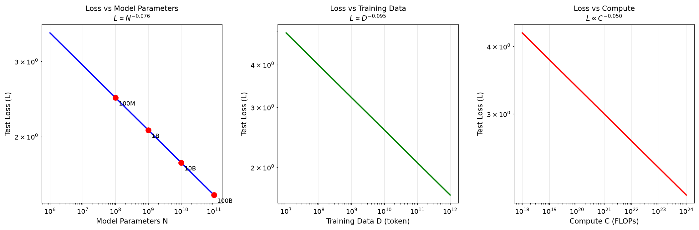
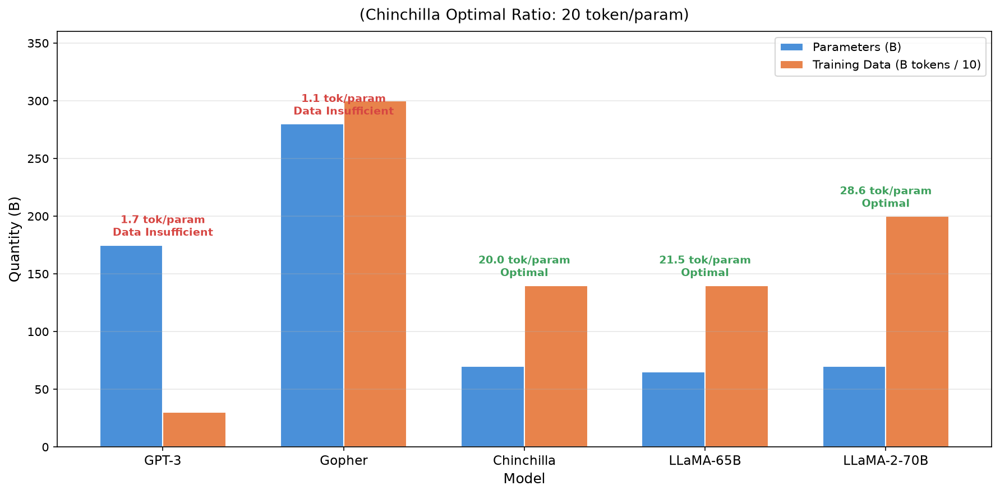
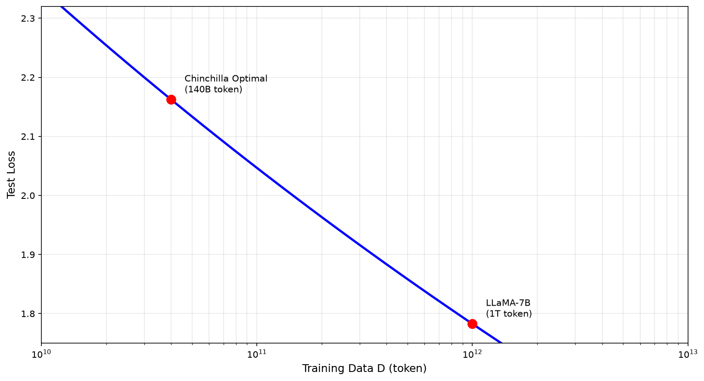
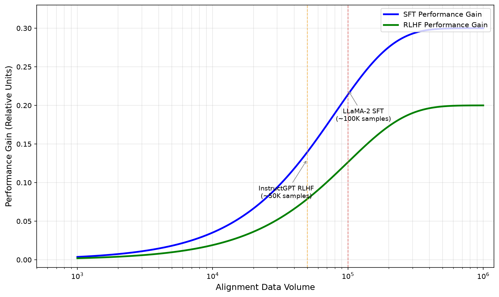
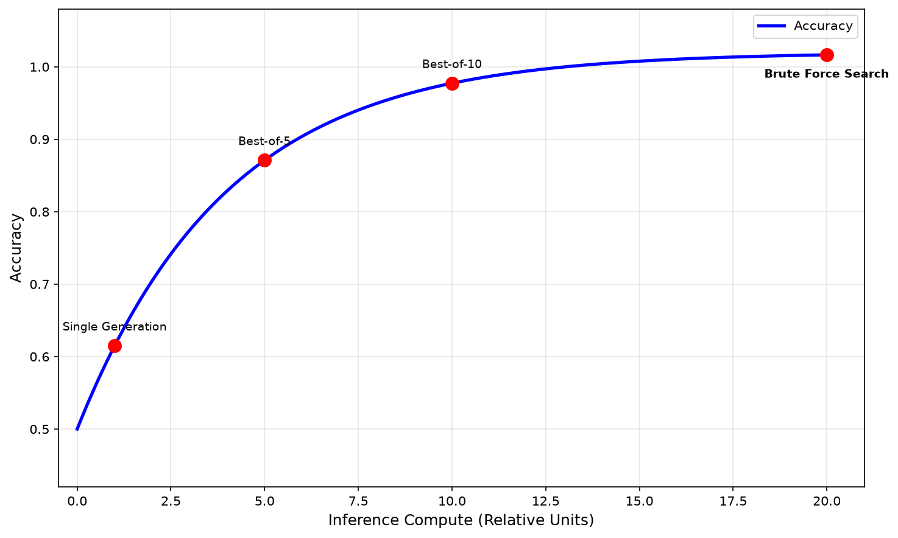

# Scaling Laws

If you have a fixed compute budget, should you spend it on scaling up parameters or feeding more data to get the greatest benefit? This question may sound like an empirical investment decision, but in reality, there is precise mathematical law behind it.

In January 2020, physicist Jared Kaplan, while at OpenAI, co-authored with Dario Amodei (who later founded Anthropic) and others the paper "[Scaling Laws for Neural Language Models](https://arxiv.org/abs/2001.08361)". They discovered that the test loss of language models follows a power-law relationship with model parameter count, training data size, and computational cost. Scale up by a factor of 10, and the loss decreases by a fixed factor. This finding later became known as the Kaplan Scaling Laws, transforming large language model training from the empirical judgment of "more investment always helps a bit" into a predictable engineering problem.

Two years later, Jordan Hoffmann and others at DeepMind overturned Kaplan's conclusions in their paper "[Training Compute-Optimal Large Language Models](https://arxiv.org/abs/2203.15556)". After training over 400 models, they found that model parameters and training data should grow proportionally, rather than parameters being more important than data as Kaplan had argued. To verify this, they trained a 7-billion-parameter model called Chinchilla on 1.4 trillion tokens, which, under the same compute budget, outperformed Gopher, a model with four times as many parameters. This discovery explained why early models like GPT-3 were undertrained and revealed the mathematical principle behind the LLaMA strategy of pairing small models with large data.

## Kaplan Scaling Laws

Kaplan's paper attracted attention because it answered a question that plagued the entire industry: is there a predictable pattern to model performance improvement? Before this, people knew that larger models performed better, but "how much better" was a complete black box. Kaplan's findings opened that black box halfway, demonstrating that performance improvements are not random but follow a precise curve.

Mathematically, a power law describes a relationship between two quantities satisfying $y = a \cdot x^b$, where $a$ is the base coefficient and $b$ is the power-law exponent. When $b < 0$, larger $x$ yields smaller $y$. Power laws have a mathematical property: taking the logarithm of both sides ($\log y = \log a + b \cdot \log x$) transforms the curve into a straight line with slope $b$. Therefore, by plotting scatter points on a log-log coordinate system and checking whether the graph forms a straight line, one can identify a power-law relationship at a glance.

Kaplan discovered precisely such a set of straight lines. Let $N$ represent the number of model parameters (more parameters mean stronger memory and expressiveness), $D$ represent the amount of training data in tokens (more data means richer language patterns seen by the model), and $C$ represent the total computational cost in FLOPs. The test loss of language models follows a power-law relationship with all three:

$$L(N) \propto N^{-\alpha_N}$$

$$L(D) \propto D^{-\alpha_D}$$

$$L(C) \propto C^{-\alpha_C}$$

The $\alpha$ in each formula is the power-law exponent, which differs across dimensions. The power-law exponent reflects how effectively each dimension compresses the loss, with specific values $\alpha_N \approx 0.076$, $\alpha_D \approx 0.095$, $\alpha_C \approx 0.050$. Taking parameter count as an example, plugging in the formula shows that increasing model parameters by 10 times reduces the loss to $10^{-0.076} \approx 0.84$ of the original (a reduction factor of about $1.19$), and this ratio is fixed. Whether growing from 1M parameters to 10M or from 10B to 100B, the loss reduction factor remains the same. The other two metrics follow the same pattern, as shown in the figure below.

*Figure: Three power-law relationship curves of Kaplan Scaling Laws*

The power-law relationship reveals how model performance changes as parameter scale increases. Now let us revisit the question posed at the beginning: if you have a fixed compute budget, where should you spend it? Should you invest in model parameters or training data? Kaplan's experiments provided a very clear answer -- one that was later overturned. Under a fixed compute budget $C$, the optimal model parameter count $N_{opt}$ and training data size $D_{opt}$ satisfy:

$$N_{opt} \propto C^{0.73}$$

$$D_{opt} \propto C^{0.27}$$

Substituting specific numbers into this formula makes it intuitive: when the compute budget increases by 10 times, the model parameters should increase by about 5.4 times, while the training data only needs to increase by about 1.9 times. In other words, Kaplan believed that compute should be prioritized on scaling up parameters -- training a larger model to convergence on relatively less data.

Two other findings from Kaplan also provided practical guidance. The model shape (the specific configuration of width, depth, and number of attention heads) has far less impact on performance than the total parameter count. A 10B-parameter model, whether wide and shallow or narrow and deep, shows little performance difference. This reduces the importance of model architecture design, allowing one to focus on the total parameter count alone. Another finding was the predictability of training curves: the power-law relationship means that the early loss curve can be extrapolated to predict final performance. If the curve deviates from expectations, training can be terminated early to save resources, rather than waiting until the end to discover poor results.

Kaplan's scaling laws advanced model training from empirical judgment to quantitative prediction, but the experiments behind these conclusions were conducted on relatively small models. Kaplan's team trained models up to only about 1.5 billion parameters and then extrapolated to larger scales using power laws. This extrapolation implicitly assumed that the power-law exponent $\alpha$ remains constant across all scales. Whether the exponent stays constant once model size crosses a certain inflection point was something no one could confirm at the time.

A greater controversy was Kaplan's assertion that "parameters matter more than data," which directly influenced GPT-3's training strategy. OpenAI designed GPT-3 with 175B parameters but fed it only 300B tokens of training data. DeepMind later discovered that this engineering decision was incorrect: with the same compute budget, using fewer parameters with more data actually yields better results.

## Chinchilla Scaling Laws

Kaplan's "large model, small data" strategy influenced the design direction of early models like GPT-3. By 2022, this conclusion had been disproven. The researchers who overturned it were Jordan Hoffmann at DeepMind, who proposed a fundamentally different answer in the paper "[Training Compute-Optimal Large Language Models](https://arxiv.org/abs/2203.15556)". This paper revisited the question of how to allocate compute between model size and training data to achieve optimal performance under a fixed compute budget.

DeepMind's internal codename for this paper was Chinchilla. Chinchilla's approach was more thorough: they trained over 400 models, ranging from 70 million to 16 billion parameters, covering a broader parameter range than Kaplan. Based on this more comprehensive set of experiments, they found that the number of model parameters $N$ and the amount of training data $D$ should grow proportionally:

$$N_{opt} \propto C^{0.50}$$

$$D_{opt} \propto C^{0.50}$$

This stands in stark contrast to Kaplan's conclusion of $N_{opt} \propto C^{0.73}, D_{opt} \propto C^{0.27}$. Kaplan believed compute should be prioritized on parameters, while Chinchilla argues parameters and data should share the budget equally. The figure below compares the ratio of parameter count to training data across several well-known models. GPT-3's ratio is only 1.7 tokens/parameter, far below the 20 tokens/parameter recommended by Chinchilla. The LLaMA series approaches or even exceeds this optimal ratio.

*Figure: Parameter count vs. training data size comparison for five well-known models*

To validate the compute-optimal ratio, DeepMind specifically trained two models named Gopher and Chinchilla for comparison. They were allocated exactly the same compute budget but distributed differently. Gopher used 280B parameters trained on 300B tokens, while Chinchilla used 70B parameters trained on 1.4T tokens. The parameter count was only a quarter of Gopher's, but the training data was nearly five times larger.

The result was that Chinchilla outperformed Gopher across all benchmarks. This experiment directly demonstrated that, under the same compute budget, "small model with large data" is more effective than "large model with small data." The problem with GPT-3 and Gopher was too many parameters and too little data, giving the model enough memory capacity but insufficient knowledge to fill it.

Compared to Kaplan's rule of thumb, Chinchilla's conclusion that "models and data should grow proportionally" rests on a much firmer theoretical foundation. It was not derived from intuition but from the mathematical form of the loss function. The Chinchilla paper assumes that the loss function can be decomposed into three terms:

$$L(N, D) = L_{irr} + \frac{A}{N^\alpha} + \frac{B}{D^\beta}$$

- $L_{irr}$ is the irreducible loss, representing the entropy inherent in the data itself. No matter how large the model or how much data, this portion of the loss cannot be eliminated. It is akin to the fact that even the most capable student cannot perfectly predict an article they have never seen.
- $A/N^\alpha$ is the loss due to insufficient model capacity. The more parameters, the smaller this term, indicating that the model has greater capacity to capture linguistic patterns.
- $B/D^\beta$ is the loss due to insufficient data. The more training data, the smaller this term, meaning the model has encountered a richer set of linguistic phenomena.

The sum of these three terms gives the total loss of the model: one part is unavoidable, one part is addressed by increasing parameters, and one part is addressed by adding data. With this loss function, optimization can be performed under a fixed compute budget. The computational cost of a language model is approximately $C \approx 6ND$ (each parameter consumes about 6 FLOPs per token), which ties $N$ and $D$ together -- a model with many parameters and little data can cost the same compute as one with few parameters and much data. The problem then becomes how to choose $N$ and $D$ to minimize $L(N, D)$ under the constraint $ND = C/6$.

This type of constrained optimization problem is one we have encountered before in [dimensionality reduction](../../statistical-learning/unsupervised-learning/dimensionality-reduction.md#pca-mathematical-principles) and the [dual transformation of SVM](../../statistical-learning/support-vector-machines/svm-max-margin.md#lagrangian-dual-transformation). The solution uses the Lagrange multiplier method for optimization (the derivation is omitted here; interested readers can refer to the [exercises](#exercises) section), yielding the optimal proportional relationship:

$$N_{opt} \propto C^{\frac{\beta}{\alpha+\beta}}, \quad D_{opt} \propto C^{\frac{\alpha}{\alpha+\beta}}$$

From Chinchilla's experiments, $\alpha \approx \beta$ was estimated, giving each exponent roughly half. This is the theoretical basis for the final conclusion $N_{opt} \propto C^{0.5}, D_{opt} \propto C^{0.5}$.

## Over-training

The Chinchilla law provides the theoretically optimal allocation of compute budget. However, in practice, many models choose to train a relatively small model with far more data than the Chinchilla optimal ratio. This strategy is called **over-training** (the "over-" prefix may sound excessive, but this is a neutral technical term). Over-training may seem to violate Chinchilla's conclusions, but a closer look reveals it is quite reasonable. Chinchilla optimizes for the lowest loss under a given training budget, whereas in practice, one must consider not only training cost but also inference cost.

LLaMA is a typical example of the over-training strategy. Take LLaMA-7B: it trained a 7B-parameter model on 1T tokens, achieving a ratio of 143 tokens/parameter -- seven times the Chinchilla optimal ratio. The reasoning behind LLaMA's decision lies in the cost structure. Model training happens once, but inference happens countless times. A widely deployed model may handle hundreds of millions of requests per day, and inference costs far exceed training costs. An over-trained small model saves computation on every inference because fewer parameters mean less computation per forward pass. Although more computation is spent during training, this extra cost is recouped thousands of times over during the inference phase.

Beyond inference cost, the over-training strategy also offers advantages in general applicability. Small models are easier to deploy in resource-constrained environments, such as consumer-grade GPUs, edge devices, and mobile platforms. In these scenarios, an over-trained small model can deliver performance close to that of a large model. At the same time, small models have lower inference latency, making them suitable for applications with real-time requirements.

However, over-training is not always better. When the amount of training data far exceeds the Chinchilla optimal ratio, the marginal benefit of performance improvement diminishes. The rate at which the loss function decreases slows down, with each additional 100B tokens yielding progressively smaller loss reductions. This means there is a sweet spot for over-training: exceeding the Chinchilla optimal ratio during training is worthwhile when considering inference costs, but going too far becomes wasteful. The annotated points in the figure below correspond to the Chinchilla optimal ratio (140B tokens), LLaMA-7B (1T tokens), and LLaMA-2 7B (2T tokens). The loss reduction from the Chinchilla optimum to LLaMA-7B is significant, but the reduction from 1T to 2T is notably slower, illustrating the law of diminishing marginal returns.

*Figure: Loss vs. training data size for a fixed 7B model*

## Post-Training Scaling Laws

Pre-training scaling laws reveal the relationship between model scale and pre-training performance. However, modern LLM training does not stop at pre-training. The [supervised fine-tuning](../../../language-models/pretraining/supervised-finetuning.md) (SFT) and [reinforcement learning from human feedback](../../../language-models/alignment/rlhf.md) (RLHF) stages that follow pre-training also require data investment.

The goal of post-training is to transform a pre-trained model that possesses knowledge but lacks any practical skills beyond text continuation (including conversation) into an assistant that can understand instructions and provide useful answers. This process requires two types of data. SFT data consists of "instruction-response" pairs, teaching the model to follow instructions. RLHF data consists of human preference comparisons, teaching the model to generate responses more aligned with human expectations.

Research has found that post-training also exhibits scaling laws, but unlike the power law of pre-training, post-training saturates much earlier. LLaMA-2's practice shows that approximately 100,000 high-quality SFT examples are sufficient to significantly improve capability. The InstructGPT paper also demonstrates that about 50,000 to 100,000 human preference data points are enough to train an effective reward model, with additional data yielding rapidly diminishing marginal returns. This suggests that the scaling law for post-training is closer to logarithmic growth: a small amount of high-quality data early on yields substantial improvement, but it quickly requires exponentially more data to achieve linear gains.

*Figure: Performance improvement of SFT and RLHF with increasing alignment data*

Discussions of scaling laws are often accompanied by emergent abilities. When model scale exceeds a certain threshold, certain abilities appear to emerge suddenly. For example, few-shot capability significantly improves at around 10B parameters, chain-of-thought reasoning emerges at about 100B parameters, and code generation capability also sees qualitative improvement around the 10B mark. Therefore, when considering model parameter count, these emergent thresholds must be taken into account.

However, the 2023 paper "[Are Emergent Abilities of Large Language Models a Mirage?](https://arxiv.org/abs/2304.15004)" questioned this notion of emergence. The authors point out that emergent abilities may be an illusion created by the choice of evaluation metric. If a discontinuous metric like exact match is used, capability improvements appear as abrupt jumps from 0 to 1. But if a smooth metric like token edit distance (the minimum number of edit operations required to transform one sequence into another) is used instead, the same capability improvement becomes a smooth curve. This controversy reminds us that observations about scaling laws depend on the evaluation method, and different metrics may reveal different patterns.

## Test-Time Scaling

The scaling laws discussed so far all occur during the training phase: investing more parameters, more data, and more compute in exchange for lower model loss. However, research from 2024 to 2025 discovered that scaling laws also exist during the inference phase. Investing more computation at inference time can yield better outputs. This principle is called **test-time scaling** (also referred to as inference-time scaling), while the earlier scaling in pre-training and post-training is collectively called **training-time scaling**.

Test-time scaling means that if the model does not answer well on the first try, let it try multiple times and select the best answer from among them. There are several specific implementation methods. The most straightforward is the Best-of-N sampling strategy, which generates N candidate answers and selects the best one using a reward model or verifier. A more refined approach is self-consistency, where the model generates multiple reasoning paths and determines which path's conclusion is supported by the majority. The most complex is the tree search strategy, which uses [beam search](../../deep-learning/sequence-models/seq2seq.md#beam-search) or [Monte Carlo tree search](../../../appendixes/numpy/probability-numpy.md#蒙特卡洛方法) (MCTS) to plan within the reasoning space, evaluating multiple candidate directions at each step. The self-verification strategy asks the model to check its own reasoning process, going back to correct any contradictions found. The common thread among these methods is spending more compute at inference time to explore more possibilities, thereby increasing the probability of a correct answer. The figure below shows the accuracy growth curves for four strategies -- single generation, Best-of-5, Best-of-10, and tree search -- demonstrating that investing more inference compute yields more accurate answers, though the improvement gradually saturates.

*Figure: Accuracy vs. inference compute at test time*

Test-time scaling and pre-training scaling are not replacements for each other but are complementary. Pre-training scaling invests compute during the training phase to build the model's general capabilities -- a one-time fixed cost. Inference scaling invests additional compute on each inference to obtain better answers for specific problems -- a variable marginal cost. The model spends more time thinking during inference, explores more reasoning paths, and thereby obtains better answers. This adds another dimension for performance improvement on top of pre-training scaling. Later, in the section on reasoning, we will dedicate a full chapter to the details of [test-time scaling](../../../language-models/reasoning/test-time-compute.md).

## Summary

The journey of discovering scaling laws is essentially a process of correcting misconceptions. In 2020, Kaplan discovered power-law relationships, transforming model training from empirical judgment to quantitative prediction. However, his conclusion that parameters matter more than data was later proven wrong. In 2022, Chinchilla corrected this error, showing that parameters and data should grow proportionally, and provided direct evidence through the Chinchilla versus Gopher experiment. Subsequently, LLaMA pushed Chinchilla's conclusions into practice, demonstrating through the over-training strategy that "theoretical optimum" and "practical optimum" are not the same thing.

Together, these findings paint an increasingly complete picture: performance improvement in language models is not linear but follows power-law patterns. Each stage -- pre-training, post-training, and inference -- has its own scaling characteristics, and the definition of optimality depends on the goal. If the goal is minimum training cost, Chinchilla has already provided the answer. If the goal is minimum inference cost, over-training provides the answer. If the goal is the best single-inference result, test-time scaling provides the answer.

## Exercises

1. Starting from the Chinchilla loss function $L(N, D) = L_{irr} + A/N^\alpha + B/D^\beta$, derive the compute-optimal ratios $N_{opt} \propto C^{\beta/(\alpha+\beta)}$ and $D_{opt} \propto C^{\alpha/(\alpha+\beta)}$.
   

   
Reference Answer

   Given a fixed compute budget $C$, the constraint is $C \approx 6ND$. Using the Lagrange multiplier method:

   Define the Lagrangian function $\Lambda = L(N, D) + \lambda(6ND - C)$. Taking partial derivatives with respect to $N$ and $D$ and setting them to zero gives $\alpha A / N^{\alpha+1} = 6\lambda D$ and $\beta B / D^{\beta+1} = 6\lambda N$. Dividing the two equations yields $N^{\alpha+1}/D^{\beta+1} = \alpha A / (\beta B) \cdot N/D$, from which the optimal ratio relationship can be derived.

   

2. Given a compute budget $C = 10^{21}$ FLOPs, using the Chinchilla loss function parameters ($A=406.4, B=410.7, \alpha=0.336, \beta=0.283$), calculate the optimal number of model parameters and amount of training data.
   

   
Reference Answer

   $C/6 = 1.67 \times 10^{20}$. Starting from the optimality condition $\alpha A N^{-\alpha} = \beta B D^{-\beta}$ (derived by dividing the two partial derivative equations), substitute the parameters to calculate the ratio: $\frac{\alpha A}{\beta B} = \frac{0.336 \times 406.4}{0.283 \times 410.7} \approx 1.175$. From $N^\alpha / D^\beta = \alpha A / (\beta B)$ and $C = 6ND$, solve to get $N = (\frac{\alpha A}{\beta B})^{1/(\alpha+\beta)} \cdot (\frac{C}{6})^{\beta/(\alpha+\beta)}$. Substituting $\beta/(\alpha+\beta) \approx 0.457$, $1/(\alpha+\beta) \approx 1.615$, yields $N \approx 2.3 \times 10^{9}$ (approximately 2.3B parameters), $D = C/(6N) \approx 7.3 \times 10^{10}$ (approximately 73B tokens), $D/N \approx 32$.

   

