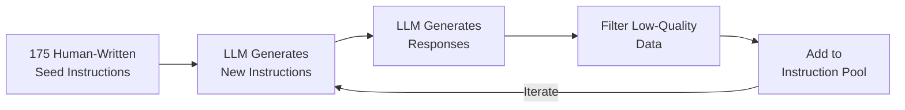
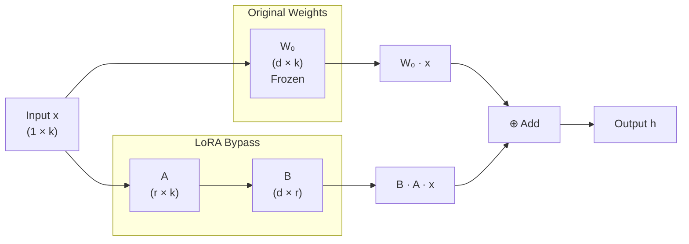

# Supervised Fine-Tuning

The pre-training objective of [autoregressive language models](../architecture-basics/language-model-tokenization.md#autoregressive-language-models) is continuation -- given a piece of text, predict the next token. In practice, what users expect from a language model is typically question answering: ask a question, get a useful response. There is a fundamental gap between these two behavioral patterns. To transform a pre-trained language model into an AI assistant capable of tasks such as chat, translation, and code writing, a step called **supervised fine-tuning** (SFT) is needed to bridge this gap.

In 2022, OpenAI's paper "[Training Language Models to Follow Instructions with Human Feedback](https://arxiv.org/abs/2203.02155)" systematically laid out a three-stage training framework for aligning pre-trained models with human intent. The InstructGPT model proposed in this paper, with only 1.3B parameters, surpassed the 175B original GPT-3 in human preference evaluations, revealing that alignment is more decisive than scale. The paper laid the technical foundation for ChatGPT and established pre-training, supervised fine-tuning, and reinforcement learning from human feedback as the standard training paradigm for virtually all subsequent instruction-following models.

## Foundation Models and Instruct Models

After pre-training, what we get is not a directly user-facing product, but a **foundation model** (also called a base model). It may possess rich knowledge and powerful language abilities, but there is a gap between its behavior and what users expect from an AI assistant. The most intuitive illustration of this gap is that, given the same input, the foundation model and the instruct model produce completely different outputs. Suppose a user inputs "What is the capital of France?" The foundation model's output might look like this:

> User: What is the capital of France?
>
> Model: What is the capital of France? This is a question about geography. France is a country in Western Europe...

After supervised fine-tuning, the **instruct model** output should look like this:

> User: What is the capital of France?
>
> Model: The capital of France is Paris.

After SFT training, the model understands the conversational intent and role division. The user is responsible for asking questions, and the model is responsible for answering. The model knows that when faced with a question, it should provide direct, useful information rather than continuing the text. The foundation model learns the probability distribution of text, while the instruct model learns the behavioral pattern of following instructions. The role of SFT in instruction-following training is reflected in the following three aspects:

- **Establishing behavioral patterns**: SFT helps the model understand the interaction pattern of "user asks, assistant answers," shifting from "continuation" to "answering." This is the most fundamental change and the most critical one. Without this shift, subsequent RLHF would be impossible, because the reward model evaluates the quality of "answers," not "continuations."

- **Injecting domain knowledge and skills**: Through carefully designed instruction data, the model can be guided to learn knowledge and skills in specific domains. For example, if the SFT data contains a large number of programming Q&A pairs, the model will perform better on programming tasks.

- **Providing a good initialization for RLHF**: The SFT model provides a basic starting point for subsequent reinforcement learning. If RLHF were started directly from the foundation model, the output distribution gap between the reward model and the policy model would be too large, making training difficult to stabilize. SFT first brings the model to a level where it can answer questions, and RLHF further polishes it from there.

## Constructing Fine-Tuning Data

The effectiveness of SFT depends largely on data quality rather than data quantity. The basic unit of SFT data is the **instruction-response pair**. Each piece of data contains a user instruction and a corresponding high-quality response. The model learns the behavioral pattern of "how to answer" by studying these paired examples. Here is an example of an instruction-response pair:

```json
{
  "instruction": "Translate the following sentence into English: 今天天气真好",
  "response": "The weather is really nice today."
}
```

This data has a clear format, a specific instruction, and a concise and accurate response. However, not all instruction-response pairs are this simple. In real-world scenarios, user questions can be complex and may involve multi-turn conversational context. Therefore, SFT data design needs to consider more dimensions. In 2023, Tsinghua University and Zhipu AI's paper "[Instruction Tuning for Large Language Models: A Survey](https://arxiv.org/abs/2308.10792)" systematically reviewed SFT data design and summarized three principles:

- **Quality over Quantity**: This is the most important principle in SFT data construction. The LIMA (Less Is More for Alignment) experiment convincingly demonstrated this. Fine-tuning LLaMA-65B with only 1000 carefully crafted, high-quality instruction-response pairs produced output quality close to GPT-4. In contrast, training with tens of thousands of low-quality data points can actually degrade model performance, because noisy data interferes with the knowledge the model has already acquired during pre-training.

- **Diversity**: Instructions should cover as many task types and topic domains as possible. If the training data consists entirely of translation tasks, the model will only know how to translate. If it is all programming Q&A, the model will only know how to write code. Good SFT data should include a variety of task types such as Q&A, translation, summarization, programming, reasoning, and creative writing, equipping the model with general instruction-following ability.

- **Complexity Gradation**: Training data should gradually progress from simple tasks to complex tasks. Simple instructions help the model establish basic behavioral patterns, while complex instructions cultivate reasoning and combinatorial abilities. If the model is given complex reasoning tasks from the very beginning, it might not even learn basic Q&A patterns properly.

Obtaining high-quality instruction data is a bottleneck. Manual annotation is costly, inefficient, and struggles to achieve sufficient diversity. In 2023, the paper "[Self-Instruct: Aligning Language Models with Self-Generated Instructions](https://arxiv.org/abs/2212.10560)" proposed an ingenious solution -- having the language model generate its own instruction data. Self-Instruct uses an existing strong model (such as GPT-3.5) to generate training data, and then uses this data to fine-tune the target model. The entire process requires no human annotation, only a small set of seed data as a starting point. The Self-Instruct workflow consists of four steps:

- **Step 1: Seed Instruction Set**: Manually write about 175 instructions as seeds, covering different task types. This number is very small, only needing to ensure basic diversity.
- **Step 2: Instruction Generation**: Randomly sample several instructions from the seed set as examples and feed them to the LLM to generate new instructions. Since the LLM has seen a vast number of tasks during pre-training, it can generate far more diverse instructions than the seed set.
- **Step 3: Response Generation**: Feed the newly generated instructions back to the LLM to generate corresponding responses. This step can also determine whether the instruction is feasible. If the LLM cannot generate a reasonable response, it indicates that the instruction itself is problematic and should be filtered out.
- **Step 4: Filtering and Iteration**: Use a rule-based filter to remove duplicate, low-quality, or non-conforming instruction-response pairs, and add the filtered data to the instruction pool. Then repeat steps 2 through 4 for multiple iterations until the instruction pool reaches the desired size.


*Figure: Self-Instruct workflow*

The introduction of Self-Instruct quickly spawned a landmark project -- Stanford Alpaca. In 2023, Rohan Taori and others at Stanford University, based on LLaMA-7B and the Self-Instruct method, trained a model that approached GPT-3.5 on several benchmarks for less than $600, sparking a wave of open-source model fine-tuning. Alpaca simplified Self-Instruct by directly using GPT-3.5 to generate all instructions and responses in one pass, which was more efficient. Since GPT-3.5 itself is of high quality, the overall quality of the generated data was also better. In the end, Alpaca collected approximately 52,000 instruction-response pairs to fine-tune LLaMA-7B.

The cases of Self-Instruct and Alpaca prompted the community to reconsider the scale of SFT data -- it seems that more SFT data is not necessarily better. The LIMA (Less Is More for Alignment) experiment published in 2023 is the most convincing. Researchers fine-tuned LLaMA-65B with only 1000 carefully crafted, high-quality data points, and in human evaluations, its output quality was close to GPT-4. For comparison, Alpaca used 52,000 data points but did not achieve results as good as LIMA. This does not mean that 1000 data points are sufficient, but rather that improvements in data quality contribute far more to effectiveness than increases in data quantity.

Low-quality fine-tuning data is like poorly written code from a programmer. If a codebase is contaminated with large amounts of low-quality code (confusing naming, logical errors), new developers will be misled into thinking that is how the project has always been written. Similarly, low-quality instruction-response pairs can interfere with the language abilities the model has already acquired during pre-training, leading to degraded output quality -- a phenomenon known as **catastrophic forgetting**.

## SFT Training Details

The SFT training process involves many design decisions, such as how the loss function is constructed, how the conversation format is designed, and how the learning rate and number of training epochs are chosen. These seemingly minor details actually have a significant impact on training effectiveness.

### Loss Design

The training objective of SFT is formally the same as that of pre-training -- both use the standard autoregressive loss of language models. The difference is that SFT only computes the loss on the response portion, ignoring the instruction portion. Consider an SFT data point:

> \<User\> What is the capital of France?
>
> \<Model\> The capital of France is Paris.

If loss is computed on the entire text, the model would be required to learn how to ask questions while also learning how to answer -- but this is meaningless, since the user's input is already given and the model does not need to predict what the user will say. Moreover, the gradient signal from the instruction portion would dilute the learning signal from the response portion, reducing training efficiency. Suppose the instruction accounts for 40% of the entire data point; computing loss on the full text means 40% of the gradient updates are teaching the model what the user will say, while only 60% of the gradient updates are teaching the model how to respond -- clearly not what we want. The standard approach is to apply a **loss mask** (also called instruction mask) to the tokens in the instruction portion, selecting the set of tokens $R$ from the response portion. Let $x_{<t}$ be the tokens of the instruction portion (used as conditional input but not participating in loss computation), $y_{<t}$ be the tokens of the response portion before position $t$, and $p_\theta(y_t \mid \cdot)$ be the model's predicted probability for each token at position $t$. The SFT loss is then:

$$\mathcal{Loss}_{SFT} = -\frac{1}{|R|}\sum_{t \in R} \log p_\theta(y_t \mid x_{<t}, y_{<t})$$

This formula looks identical in form to the cross-entropy loss used in pre-training, with the only difference being the summation range. The overall meaning of the formula is: given the instruction and the preceding context of the response, take the logarithm of the model's predicted probability for each token in the response, average them, and then negate the result. The higher the probability, the lower the loss, and the better the training effectiveness. The only difference from the pre-training loss is that the summation range is narrowed from "all tokens" to "tokens in the response portion."

In implementation, the loss mask is achieved by the training framework assigning a label to each token: tokens in the instruction portion are labeled as -100 (the default ignore value in PyTorch's `CrossEntropyLoss`), while tokens in the response portion retain their original labels. The loss function automatically skips positions with label -100 during computation.

### Conversation Format and Tokens

SFT data is not just plain text of "instruction + response"; it requires a machine-parseable structured format to distinguish content from different roles. The format design determines whether the model can accurately distinguish between user input and assistant output, and whether the loss mask can be correctly applied during training. The current mainstream conversation format is **ChatML** (Chat Markup Language), proposed by OpenAI around 2023 and widely used in its API services. The basic idea of ChatML is to use special tokens to mark the structural boundaries of a conversation. A typical ChatML-formatted conversation looks like this:

``` ChatML 
<|im_start|>system
You are a helpful AI assistant.
<|im_end|>
<|im_start|>user
What is the capital of France?
<|im_end|>
<|im_start|>assistant
The capital of France is Paris.
<|im_end|>
```

The ChatML format includes three special tokens: `<|im_start|>ROLE`, `<|im_end|>`, and `\n`. These tokens do not appear in normal text, preventing confusion between text content and format markers. Otherwise, if user input happens to contain "system" or "assistant," a plain text format would introduce ambiguity. The training framework can precisely identify the range of the response portion based on `<|im_start|>assistant` and `<|im_end|>`, ensuring that loss is only applied to the correct positions. Specifically, tokens between `<|im_start|>assistant` and `<|im_end|>` are marked as the response portion and participate in loss computation, while all other tokens are ignored.

| Special Token | Purpose | Description |
|:-------:|:----:|:-----|
| `<\|im_start\|>` | Role Start | Marks the beginning of a new role's utterance, followed by the role name |
| `<\|im_end\|>` | Role End | Marks the end of the current role's utterance |
| `\n` | Separator | Newline between the role name and the content |

### System Prompt Design

The ChatML format includes a special role called system. The system prompt appears at the very beginning of the conversation and defines the assistant's behavioral framework, such as its identity, capability scope, and answering style. The role of the system prompt can be understood through an analogy: if user instructions are like a customer placing an order, then the system prompt is the chef's work guidelines. The chef does not need to be reminded to ensure food safety before every dish, because the guidelines already define the basic principles of the job. Similarly, the system prompt sets persistent behavioral constraints for the model, eliminating the need to repeat them in every conversation. Several practical guidelines for designing system prompts are:

- **Define the role clearly**. Tell the model "who you are" and who you are not. For instance, "You are a professional programming assistant skilled in Python and JavaScript" is more specific than "You are an AI assistant," enabling the model to perform better in specific domains while reducing irrelevant content generation.
- **Set behavioral boundaries**. Clearly tell the model what it should and should not do. For example, "Only answer questions you are sure about; if unsure, say so" can reduce hallucinations and help the model confidently say "I don't know."
- **Keep it concise**. Longer system prompts are not necessarily better. Overly long system prompts may be ignored by the model (due to the dilution effect of the attention mechanism) and also increase computational cost during inference. Practical experience suggests that system prompts of 100-300 characters are a reasonable range.

System prompts vary significantly across different scenarios. A general AI assistant needs broad capability coverage, while a specialized AI assistant (such as a programming assistant or legal advisor) requires a more precise role definition. Here are two comparative examples:

``` ChatML
# General Assistant
<|im_start|>system
You are a helpful AI assistant. Please answer user questions accurately and clearly.
If you are unsure, honestly say so.
<|im_end|>

# Programming Assistant
<|im_start|>system
You are a professional programming assistant proficient in Python, JavaScript, Go,
and other mainstream programming languages. When answering, provide runnable code
examples and explain key design decisions. If the user's code has bugs, point out
the issues and provide fixes.
<|im_end|>
```

### Hyperparameter Selection

The hyperparameter choices for SFT training differ significantly from those of pre-training, primarily in learning rate and number of training epochs.

- **Learning Rate**: The learning rate for SFT is typically much smaller than for pre-training. Pre-training uses learning rates on the order of $10^{-4}$, while SFT usually uses $10^{-5}$ to $10^{-6}$. This is because the goal of SFT is not to learn new knowledge, but to adjust the way existing knowledge is expressed. A learning rate that is too large can disrupt the language abilities learned during pre-training, leading to catastrophic forgetting. An analogy: someone who already knows English and is learning a British accent needs to fine-tune their pronunciation habits, not re-learn English from scratch. In practice, SFT typically adopts a **cosine annealing** strategy (smooth decay following a cosine curve), where the learning rate gradually decreases from the initial value to near zero. This is similar to the learning rate schedule used in pre-training, but with a much smaller overall magnitude.

- **Number of Epochs**: The number of training epochs for SFT is usually only 1-3, far fewer than the multiple passes over the massive pre-training dataset. This is to prevent overfitting. The SFT dataset is relatively small (thousands to tens of thousands of data points), and the model can easily memorize rather than generalize from a small amount of data. Empirically, 1 epoch is usually a good starting point. If the model's performance on the validation set is still improving, 2-3 epochs can be tried, but overfitting should be closely monitored.

- **Global Batch Size**: SFT typically uses a relatively small batch size (32-128). Because the dataset is limited in size, a batch size that is too large would result in too few update steps per epoch, leading to insufficient training.

## LoRA and QLoRA

Fine-tuning a model with a large number of parameters has the same memory requirements as pre-training: gradients, optimizer states, and activation values must be maintained for every parameter. For researchers and developers with only consumer-grade GPUs, full-parameter fine-tuning is nearly impossible. To address this, parameter-efficient fine-tuning (PEFT) methods have emerged. These methods update only a very small fraction of the model's parameters while achieving results close to full-parameter fine-tuning. The most representative of these are LoRA and its improved version QLoRA.

### LoRA: Low-Rank Adaptation

LoRA (Low-Rank Adaptation) is a fine-tuning method proposed by Microsoft Research in 2021 in the paper "[LoRA: Low-Rank Adaptation of Large Language Models](https://arxiv.org/abs/2106.09685)." The insight of this paper is delightful: although pre-trained models have a massive number of parameters, when fine-tuned on a specific task, the parameter changes are actually low-rank. Low-rank means that large adjustments are not needed across all dimensions; only fine adjustments in a few key directions are sufficient. Suppose a weight matrix in the model is $W_0 \in \mathbb{R}^{d \times k}$. Full-parameter fine-tuning would update it to $W_0 + \Delta W$. LoRA, instead of learning $\Delta W$ directly, decomposes $\Delta W$ into the product of two smaller matrices:

$$\Delta W = BA$$

where $B \in \mathbb{R}^{d \times r}$, $A \in \mathbb{R}^{r \times k}$, and $r \ll \min(d, k)$. These two small matrices are all the parameters LoRA needs to learn. The idea of decomposing a large matrix into the product of smaller matrices is familiar -- it appears in [SVD decomposition](../../statistical-learning/unsupervised-learning/dimensionality-reduction.md#singular-value-decomposition) for dimensionality reduction and in [TPA tensor product attention](../architecture-basics/architecture-evolution.md#tpa-tensor-product-attention) in Transformers.

The forward propagation computation in LoRA fine-tuning is the sum of the original path $h = W_0 x$ and the LoRA bypass $h' = BAx$, yielding the final output $h + h'$. During training, $W_0$ is completely frozen, and only the parameters of $A$ and $B$ are updated, as shown in the following diagram.


*Figure: LoRA fine-tuning computation process*

The rationality of this decomposition stems from the concept of [rank](../../maths/linear/vectors.md#linear-dependence-and-independence). The rank of a matrix measures the number of independent directions in the matrix. Although $\Delta W$ in full-parameter fine-tuning is a large $d \times k$ matrix, the actual effective directions of change may only be a few -- that is, the effective rank of $\Delta W$ is much smaller than $\min(d, k)$. By directly approximating $\Delta W$ with a low-rank matrix of rank $r$, LoRA not only avoids losing too much information but also achieves better regularization due to the significantly reduced number of parameters. Let us use some concrete numbers to appreciate the parameter compression effect of LoRA. Suppose the weight matrix of an attention layer in the model has dimensions $4096 \times 4096$ (typical of LLaMA-7B), and take $r = 8$. Then:

- Full-parameter fine-tuning requires updating: $4096 \times 4096 = 16,777,216$ parameters
- LoRA requires updating: $(4096 \times 8) + (8 \times 4096) = 65,536$ parameters
- Parameter ratio: $65,536 / 16,777,216 \approx 0.39\%$

By updating only 0.39% of the parameters, LoRA can achieve results close to full-parameter fine-tuning. This remarkable efficiency is precisely why LoRA quickly became an industry standard. LoRA also has two practical design details:

- **Initialization Strategy**. $A$ is initialized with a random Gaussian distribution, and $B$ is initialized as a zero matrix. This means that at the start of training, $BA = 0$, the output of the LoRA bypass is zero, and the model's behavior is exactly the same as the original pre-trained model. This design ensures training stability -- fine-tuning starts from the capabilities already acquired by the pre-trained model, rather than from a random state.

- **Scaling Factor**. LoRA multiplies the bypass output by a scaling factor $\alpha / r$ to control the magnitude of the LoRA update. $\alpha$ is a hyperparameter, typically set to 1-2 times $r$. When $\alpha = r$, the scaling factor is 1, equivalent to no scaling; when $\alpha = 2r$, the bypass output magnitude is doubled, equivalent to increasing the fine-tuning learning rate.

### QLoRA: Quantized LoRA

QLoRA (Quantized LoRA) was proposed by the University of Washington in 2023 in the paper "[QLoRA: Efficient Finetuning of Quantized Language Models](https://arxiv.org/abs/2305.14314)." If LoRA solved the problem of how many parameters need to be updated, QLoRA solves the problem of how much memory is needed to store these parameters. QLoRA aims to quantize pre-trained weights to 4-bit precision to save memory, while dynamically dequantizing them to higher precision during computation to ensure training quality. This makes it possible to fine-tune a 65B parameter model on a single 48 GB GPU, whereas full-parameter fine-tuning would require over 700 GB of memory. QLoRA introduces three key technical innovations:

- **NF4 Quantization** (4-bit NormalFloat Quantization): This is a data format specifically designed for normally distributed weights. The weights of pre-trained models generally approximately follow a normal distribution. NF4 allocates quantization levels based on the quantiles of the normal distribution, making the probability density of each quantization level equal. Compared to uniform quantization, NF4 can represent the true distribution of weights more accurately at the same bit width, resulting in smaller quantization errors.

- **Double Quantization**: The quantization process itself produces quantization constants (a set of quantization parameters shared by every 64 weights), and these constants also consume memory. Double quantization applies another round of quantization to these quantization constants, compressing the storage of each constant from 32 bits to 8 bits, further saving approximately 0.37 bits per parameter of memory.

- **Paged Optimizer**: During training, the optimizer states (such as momentum and variance in Adam) are stored according to the number of parameters, occupying fixed memory that does not change with sequence length. The paged optimizer leverages NVIDIA's Unified Memory feature. When GPU memory is insufficient, it automatically swaps optimizer states out to CPU memory, and swaps them back in when needed, preventing training interruptions due to out-of-memory errors. This is similar to the operating system's mechanism of swapping memory pages out to disk.

Below, we analyze the memory usage of three fine-tuning methods using a 65B parameter model (similar to LLaMA-65B, with hidden dimension 8192 and 80 Transformer layers) as an example. During training, memory is mainly composed of four parts: model weights, gradients, optimizer states, and activation values. The first three are deterministic values related to the model's parameter count. Activation values depend on sequence length and batch size, but can be significantly compressed using gradient checkpointing, estimated based on empirical values.

- **Full-parameter fine-tuning** requires maintaining weights, gradients, and optimizer states for all 65B parameters, approximately 986 GB of memory, requiring at least 13 A100 80GB GPUs to fit:

    | Component | Calculation | Memory |
    |:-------:|:----:|:----:|
    | Weights (FP16) | 65B × 2 bytes | 121 GB |
    | Gradients (FP16) | 65B × 2 bytes | 121 GB |
    | Optimizer (Adam FP32) | 65B × 12 bytes | 726 GB |
    | Activations ([Gradient Checkpointing](../../deep-learning/neural-network-structure/backpropagation.md#computational-complexity-analysis)) | Empirical estimate | ~18 GB |
    | **Total** | | **~986 GB** |

- **LoRA** freezes the original weights and only trains the low-rank bypass. Assuming LoRA bypasses with rank $r=16$ are added to the Q and V projections of each attention layer, the parameter count per layer is $4 \times 8192 \times 16 = 524{,}288$, totaling approximately 41.9M parameters across 80 layers, only 0.06% of the total model parameters. Memory requirements drop from 986 GB to about 140 GB, a savings of approximately 86%, requiring only 2 A100 80GB GPUs to train. The specific memory usage is as follows:

    | Component | Calculation | Memory |
    |:-------:|:----:|:----:|
    | Frozen Weights (FP16) | 65B × 2 bytes | 121 GB |
    | LoRA Weights (FP16) | 41.9M × 2 bytes | 0.08 GB |
    | LoRA Gradients (FP16) | 41.9M × 2 bytes | 0.08 GB |
    | LoRA Optimizer (Adam FP32) | 41.9M × 8 bytes | 0.31 GB |
    | Activations (Gradient Checkpointing) | Empirical estimate | ~18 GB |
    | **Total** | | **~140 GB** |

- **QLoRA** builds on LoRA by quantizing the frozen weights from FP16 to NF4 (4 bits), further compressing the frozen weight memory footprint. Double quantization compresses the quantization constants from 32 bits to 8 bits, amounting to approximately 0.37 bits per parameter. The LoRA bypass portion is still trained in FP16 to maintain gradient computation precision. A single A100 48GB GPU with the paged optimizer can complete fine-tuning of the 65B model:

    | Component | Calculation | Memory |
    |:-------:|:----:|:----:|
    | Frozen Weights (NF4) | 65B × 0.5 bytes | 30.3 GB |
    | Quantization Constants (Double Quantization) | 65B × 0.37 bits ≈ 0.046 bytes | 2.8 GB |
    | LoRA Weights (FP16) | 41.9M × 2 bytes | 0.08 GB |
    | LoRA Gradients (FP16) | 41.9M × 2 bytes | 0.08 GB |
    | LoRA Optimizer (Adam FP32) | 41.9M × 8 bytes | 0.31 GB |
    | Activations (Gradient Checkpointing) | Empirical estimate | ~18 GB |
    | **Total** | | **~52 GB** |

## Chapter Summary

Pre-training endows the model with language ability, but not with the willingness to serve humans. A foundation model that can fluently continue text, when faced with a user's question, will still on its own fabricate the continuation rather than providing a useful answer. Supervised fine-tuning addresses this leap from "being able to speak" to "being able to converse," playing a connecting role in the entire alignment training pipeline. It inherits the language capabilities of pre-training, transforms them into usable conversational behavior, and provides a stable starting point for subsequent reinforcement learning alignment. Without SFT, there would be no object for the reward model to evaluate. Built on SFT, RLHF can further refine a model that already knows how to respond, making it respond even better.

## Exercises

1. Suppose an attention weight matrix $W_0$ has dimensions $5120 \times 5120$, and the LoRA rank is $r = 16$. Calculate how many parameters need to be updated in full-parameter fine-tuning and in LoRA, respectively. What is the parameter ratio of LoRA?

   <details>
   <summary>Reference Answer</summary>

   Full-parameter fine-tuning: $5120 \times 5120 = 26,214,400$ parameters

   LoRA: matrices $A \in \mathbb{R}^{16 \times 5120}$ and $B \in \mathbb{R}^{5120 \times 16}$, parameter count is $(16 \times 5120) + (5120 \times 16) = 81,920 + 81,920 = 163,840$

   Parameter ratio: $163,840 / 26,214,400 \approx 0.625\%$

   Updating less than 1% of the parameters -- this is the source of LoRA's efficiency.

   </details>
