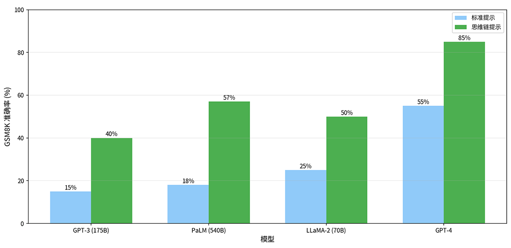
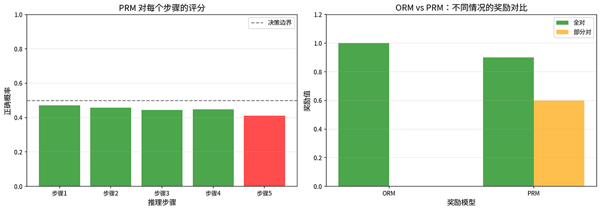
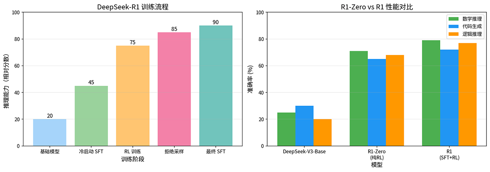

# Chain of Thought and Reasoning Models

In 2022, Google Brain's paper "[Chain-of-Thought Prompting Elicits Reasoning in Large Language Models](https://arxiv.org/abs/2201.11903)" discovered that when models are asked to show their reasoning process and think step by step, their reasoning ability significantly improves. This phenomenon sparked industry interest in **Chain of Thought** (CoT) research and ultimately led to the development of reasoning models (such as GPT-o1/o3, DeepSeek-R1), which not only learn to answer questions but also learn to think in a structured and deep manner.

## Chain of Thought

In 2022, Google Brain researcher Jason Wei and colleagues proposed the concept of Chain of Thought, pointing out that including demonstrations of the reasoning process in prompts (i.e., providing question-answer examples with step-by-step reasoning) can significantly improve model performance on tasks such as mathematical reasoning and commonsense reasoning. If you ask the model the following question:

> Xiao Ming has 23 apples, gives 5 to Xiao Hong, and buys 8 more. How many apples does Xiao Ming have now?

With **Standard Prompting**, the model would directly respond "26 apples." With **Chain-of-Thought Prompting**, the model's response might look like this:

> 1. Xiao Ming initially has 23 apples
> 2. Gives 5 to Xiao Hong, leaving 23 - 5 = 18
> 3. Buys 8 more, now has 18 + 8 = 26
>
> Answer: 26 apples

Directly answering is like guessing the answer, while chain-of-thought reasoning is like calculating the answer. For simple problems, both approaches may yield correct results. But when problems become more complex and require multi-step reasoning, chain of thought significantly improves model reasoning accuracy. On the [GSM8K](https://huggingface.co/datasets/openai/gsm8k) mathematical reasoning benchmark, PaLM 540B's accuracy improved from 17.9% to 56.9% using CoT prompting, with similar improvements across other models, and the effect is more pronounced with larger models, as shown in the figure below.

*Figure: GSM8K accuracy comparison between Standard Prompting and Chain-of-Thought Prompting across different models*

Chain of thought improves model reasoning ability through the combined effect of three interrelated mechanisms:

- **Decomposing complex problems**: Complex problems often require multiple reasoning steps. Chain of thought decomposes complex problems into multiple simple steps, where each step only needs to process local information, significantly reducing cognitive load. For a complex math problem, direct answering requires the model to handle all numbers and operations simultaneously, while chain of thought lets the model process step by step, focusing only on the current computation at each step.

- **Activating relevant knowledge**: Language models learn a vast amount of knowledge during pretraining, which exists in the model's parameters but is not automatically invoked. Chain of thought, through explicit reasoning steps, acts like a key unlocking relevant knowledge within the model. When solving physics problems, chain of thought activates the model's knowledge about physical formulas, unit conversions, etc., which may remain dormant during direct answering because the model does not realize they are relevant to the current problem.

- **Providing opportunities for correction**: The intermediate steps in chain of thought provide the model with opportunities for self-checking. If a noticeable error occurs in one step, the model may correct it in subsequent steps, much like crossing out and rewriting on scratch paper. In contrast, direct answering leaves no room for correction once an error is made, as the answer has already been given.

Google Brain's research used **Few-Shot CoT**, which requires providing several examples with chain-of-thought reasoning in the prompt so the model learns how to reason. In 2022, Yusuke Kojima from Nara Institute of Science and Technology proposed in the paper "[Large Language Models are Zero-Shot Reasoners](https://arxiv.org/abs/2205.11916)" that even without providing examples, **Zero-Shot CoT** can guide models to make accurate reasoning. Simply adding a specific prompt after the question, such as "Let's think step by step," enables the model to automatically generate a chain of thought and self-guide through analytical reasoning.

Zero-shot CoT means that without carefully designed examples, a simple prompt can activate the model's reasoning ability. This suggests that the model's reasoning capability already exists during pretraining and simply needs to be awakened externally. Chain of thought is not merely a linguistic trick but rather unlocks the latent reasoning ability embedded in large language models.

Chain of thought brings improvements in reasoning ability, but it should not be used in all situations, primarily due to computational cost considerations. Chain of thought requires generating far more tokens than standard prompting, increasing both inference time and computational cost. For simple problems, having the model think step by step is overkill and wastes computational resources. On the other hand, chain of thought depends on model scale. Research shows that CoT's effectiveness is positively correlated with model size. Small models (e.g., below 7B parameters) see limited improvement from CoT and may even experience "more thinking, more errors," where the model generates seemingly reasonable but actually incorrect reasoning steps that are more misleading. These limitations indicate that while chain of thought allows the model to display its reasoning process, it cannot guarantee the correctness of that process. To address this issue, researchers proposed the Process Reward Model (PRM), which evaluates and guides each step of reasoning.

## Process Reward Model

Traditional model training methods only look at the final result, rewarding the model only when the answer is correct while completely ignoring the quality of intermediate steps. This training approach is called the **Outcome Reward Model** (ORM). ORM is inconsistent with the human learning experience: when a student solves a problem, if the first four reasoning steps are correct and only the final step contains a calculation error, any experienced teacher would give partial credit, but ORM would still give the student zero points. Conversely, a student might have all the early reasoning steps wrong but happen to guess the correct answer at the end, and ORM would give full credit. This evaluation method that only looks at results while ignoring the process not only fails to teach human students effectively but also cannot effectively guide models to learn correct reasoning methods. The **Process Reward Model** (PRM) was proposed precisely to score each step of the reasoning process. In 2023, Hunter Lightman proposed PRM in the paper "[Let's Verify Step by Step](https://arxiv.org/abs/2305.20050)" and demonstrated that it is far superior to ORM for training reasoning models.

Training a PRM requires annotating reasoning steps, with annotation data in the form of $(x, \{s_1, ..., s_n\}, \{y_1, ..., y_n\})$, where $x$ is the question, $s_i$ is the $i$-th step, and $y_i$ is the result label. Step-level annotation is much more expensive than result-level annotation. For example, given a mathematical problem and a reference reasoning process, human annotators must judge each step, classifying steps as "correct" (the step's logic is sound and error-free) or "incorrect" (the step contains logical or computational errors). In Lightman's original annotation, there was also a "neutral" label (steps that are neither correct nor incorrect, such as repetitive statements or transitional text), but neutral labels are treated as incorrect when training PRM, so PRM is effectively modeled as a binary classification problem. Lightman's paper introduced the [PRM800K](https://github.com/openai/prm800k) dataset, containing 800,000 reasoning processes with step-level result labels. An example of annotated reasoning is shown below:

> Question: Find the solutions to the equation $x^2 - 5x + 6 = 0$
>
> - Step 1: This is a quadratic equation, which can be solved using the quadratic formula.
>   - Label: correct ✓
>
> - Step 2: The quadratic formula is $x = \dfrac{-b \pm \sqrt{b^2-4ac}}{2a}$
>   - Label: correct ✓
>
> - Step 3: Substituting $a=1, b=-5, c=6$, we get $x = \dfrac{5 \pm \sqrt{25-24}}{2}$
>   - Label: correct ✓
>
> - Step 4: Computing gives $x = \dfrac{5 \pm 1}{2}$, so $x_1 = 3, x_2 = 2$
>   - Label: correct ✓
>
> Final answer: $x = 2$ or $x = 3$

Although step-level annotation is extremely costly, it provides fine-grained learning signals for model training. The model can learn not only whether the final answer is correct but also which steps are correct and where problems arise. PRM learns a scoring function $r_\phi(s_i)$ from the annotations, assigning scores to reasoning steps $s_i$, where higher scores indicate that the model considers the step more likely to be correct. PRM models step scoring as a binary classification problem (treating neutral labels as incorrect), with the loss function defined as follows:

$$\mathcal{L}_{PRM} = -\sum_{i=1}^{n} \left[ y_i \log \sigma(r_\phi(s_i)) + (1 - y_i) \log (1 - \sigma(r_\phi(s_i))) \right]$$

In the formula, the $y_i \log \sigma(r_\phi(s_i))$ term is the loss for correct steps. The Sigmoid function maps the raw score to the $[0, 1]$ interval, yielding the probability of being correct. The higher the probability PRM assigns, the smaller the loss. Similarly, $(1 - y_i) \log (1 - \sigma(r_\phi(s_i)))$ is the loss for incorrect steps: the lower the probability PRM assigns, the smaller the loss. Thus, PRM is essentially a multi-step version of [binary cross-entropy loss](../../statistical-learning/linear-models/logistic-regression.md).

*Figure: PRM step scoring compared with ORM*

The above figure simulates a scenario in five-step reasoning where the first four steps are correct and the last step is wrong. PRM assigns high probabilities to the first four correct steps and a low probability to the fifth incorrect step. The right side intuitively shows the difference between ORM and PRM. When all reasoning steps are correct, both give high rewards. However, when reasoning is only partially correct, ORM gives zero reward, while PRM still gives a partial reward of 0.6. This mechanism is precisely the value of PRM: it clearly tells the model which steps were done correctly and which need correction.

## Training Reasoning Models

Between 2024 and 2025, OpenAI's o1 model and DeepSeek's R1 model both broke through the limitations of requiring human demonstrations of reasoning or requiring humans to label the correctness of each step, allowing models to learn reasoning on their own without step-by-step human guidance. This demonstrates a new level of model reasoning capability and reveals an entirely new approach to training reasoning models.

In the evolution of alignment methods, we previously mentioned that DeepSeek-R1 used GRPO to achieve [self-evolution of reasoning ability](../alignment/alignment-new-paradigms.md#emergence-of-reasoning-ability). The quality of SFT data determines the upper bound of model performance. If the reasoning processes in SFT data contain errors, the model learns incorrect reasoning patterns. High-quality reasoning data is extremely scarce, there is a limited number of math problems that can be annotated step by step by human experts, and the annotation cost is prohibitively high. To address this, DeepSeek proposed skipping the SFT phase and training directly with reinforcement learning. The feasibility of this idea stems from the fact that when doing reasoning, the correct answer itself serves as a reward signal, without requiring humans to annotate the reasoning process. The answers to math problems can be automatically verified for correctness, and code can be checked against test cases. This means that reward signals can be "free" — the model only needs to generate its own solutions, verify its own answers, and learn from them.

In January 2025, the DeepSeek team released DeepSeek-R1 Zero, an experimental reasoning model that starts directly from a base model and is trained solely with GRPO, without relying on any SFT data. The base model generates multiple candidate solutions for the same problem, the system automatically verifies the correctness of each solution, and then GRPO calculates each solution's relative advantage over the group average, updating model parameters accordingly. After sufficient RL training, the model autonomously exhibits **Self-Verification** (actively checking correctness after obtaining an answer), **Self-Reflection** (actively backtracking to correct errors when contradictions are detected in reasoning), and **Multi-path Exploration** (trying multiple approaches to solve a problem). These behaviors were not taught to the model through SFT demonstrations; they were discovered by the model itself during reinforcement learning.

DeepSeek-R1 Zero demonstrated the potential of pure RL, but due to some practical issues (primarily instability in early-stage training), DeepSeek-R1 ultimately adopted a more robust approach of small-scale SFT plus large-scale RL. In this approach, SFT only serves as initialization, guiding the model into reasoning mode to avoid instability in the early training process and helping the model quickly break free from repetitive output or format confusion. The R1 training process consists of four stages:

- Stage 1: Cold-start SFT with approximately 8,000 high-quality reasoning data samples, teaching the model the basic reasoning format.
- Stage 2: Large-scale RL training focused on reasoning using GRPO, allowing the model to autonomously explore reasoning strategies.
- Stage 3: Using rejection sampling from the RL model to generate high-quality data for SFT training, improving the model's overall performance on both reasoning and non-reasoning tasks.
- Stage 4: Full-scenario RL training on top of SFT, jointly optimizing reasoning accuracy, helpfulness, and harmlessness to obtain the final model.

The left figure shows that during DeepSeek-R1's training, the RL phase contributed the largest capability improvement (jumping from 45 to 75), far exceeding the effect of cold-start SFT. The right figure compares the performance of three models, showing that R1-Zero (pure RL) already significantly surpasses the base model, while R1 (SFT+RL) leads further across all metrics, particularly improving from 71% to 79% in mathematical reasoning. This indicates that while a small amount of SFT data is not the source of reasoning ability, it does help guide the model to more effectively unleash its potential.

*Figure: DeepSeek-R1 training pipeline and performance comparison*

## Analysis of Reasoning Behaviors

In the previous section, we saw that DeepSeek-R1 Zero, through pure RL training, exhibited reasoning behaviors such as self-verification, self-reflection (backtracking and correction), and multi-path exploration. These behaviors are not accidental — when the reasoning chain is sufficiently long, they emerge almost inevitably as common characteristics of reasoning models. Below, we analyze their specific manifestations and mechanisms one by one, helping us understand what actually happens when reasoning models think.

### Self-Verification

Self-verification is one of the most core capabilities of reasoning models. After obtaining an answer, the model actively checks its correctness, much like a student double-checking their work after completing a problem. The typical behavioral pattern of self-verification is: reasoning → obtain answer → verify answer → confirm/correct. Here is an example:

> Question: Calculate $17 \times 23$
>
> - Model reasoning:
>   - $17 \times 23 = 17 \times (20 + 3) = 340 + 51 = 391$
>
> - Verification:
>   - $391 \div 17 = 23$ ✓
>   - $391 \div 23 = 17$ ✓
>
> The answer is 391

After computing the result of 391, the model does not stop immediately but uses division to inversely verify the multiplication result. This behavior of reverse verification is highly consistent with human problem-solving habits. Research shows that models with self-verification capability improve accuracy by 10-20% on complex reasoning tasks, at the cost of approximately 20% more inference time — a worthwhile trade-off in most scenarios, exchanging a small amount of additional time for significantly higher accuracy.

### Self-Reflection (Backtracking and Correction)

Self-reflection goes a step further than self-verification. The model not only checks after obtaining the answer but also, when encountering contradictions during the reasoning process, proactively returns to previous steps to rethink. The typical behavioral pattern of self-reflection is: reasoning step A → reasoning step B → contradiction detected → backtrack to A → correct reasoning. Here is an example:

> Question: Xiao Ming is 3 years older than Xiao Hong. In 5 years, Xiao Ming's age will be twice Xiao Hong's age. Find Xiao Ming's current age.
>
> - Model reasoning:
>   - Let Xiao Hong's current age be $x$, then Xiao Ming's age is $x + 3$
>   - In 5 years: Xiao Hong will be $x + 5$, Xiao Ming will be $x + 8$
>   - According to the condition: $x + 8 = 2(x + 5)$
>   - Solving: $x + 8 = 2x + 10$, $x = -2$
>
> - Wait, age cannot be negative, which means my assumption is wrong. Let me re-read the problem...
>
> - Re-analysis:
>   - "In 5 years, Xiao Ming's age will be twice Xiao Hong's age"
>   - Let Xiao Hong's age in 5 years be $y$, then Xiao Ming's age is $2y$
>   - Currently: Xiao Hong is $y - 5$, Xiao Ming is $2y - 5$
>   - Age difference: $2y - 5 - (y - 5) = y$
>   - But the problem states the age difference is 3, so $y = 3$
>
> - This is still not right, let me check again...
>
> (The model continues exploring until it finds the correct solution)

Self-reflection demonstrates the model's [metacognition](https://en.wikipedia.org/wiki/Metacognition) ability — it can not only reason but also monitor its own reasoning process, proactively backtracking when it detects something unreasonable. Statistics from DeepSeek-R1 Zero indicate that approximately 65% of problems involve at least one backtracking instance, with more complex problems exhibiting more backtracking. This behavior emerged spontaneously during pure RL training — no one taught the model to backtrack when it encounters contradictions.

### Multi-path Exploration

Multi-path exploration refers to the model trying multiple methods to solve a problem, then comparing and verifying the results across different paths. The behavioral pattern is: problem → method A → result A / method B → result B / method C → result C → compare/verify → final answer. Here is an example:

> Question: Find all real roots of the equation $x^3 - 6x^2 + 11x - 6 = 0$.
>
> - Method 1: Factorization
>   - Check coefficient sum: $1 - 6 + 11 - 6 = 0$, so $x = 1$ is a root
>   - Polynomial division: $(x^3 - 6x^2 + 11x - 6) \div (x - 1) = x^2 - 5x + 6$
>   - Continue factoring: $x^2 - 5x + 6 = (x - 2)(x - 3)$
>   - Therefore $x = 1, 2, 3$
>
> - Method 2: Substitution verification
>   - $f(1) = 1 - 6 + 11 - 6 = 0$ ✓
>   - $f(2) = 8 - 24 + 22 - 6 = 0$ ✓
>   - $f(3) = 27 - 54 + 33 - 6 = 0$ ✓
>
> Both methods yield the same result — the answer is $x = 1, 2, 3$

The value of multi-path exploration lies in cross-validation: when different methods produce the same result, the credibility of the answer is greatly increased. Of course, exploring multiple paths means more time and computational cost. For high-value problems (such as mathematical proofs, critical decisions), this investment is worthwhile. For simple problems, the model typically automatically chooses a single path for fast solving.

## Chapter Summary

Reasoning is not a single leap to the answer but a journey that requires pausing, looking back, and even retracing steps. The significance of chain of thought lies in transforming the model from intuitively guessing answers to methodically deriving them step by step. The process reward model further tells the model whether each step is correct, ensuring that learning signals no longer focus only on the destination while ignoring the journey. Reasoning ability is an inherent potential of language models that grows naturally at sufficient scale — chain of thought merely awakens it, and reinforcement learning simply unleashes this potential. This is precisely the significance of reasoning models: they not only perform better at answering questions but also, for the first time, enable machines to exhibit a way of thinking that resembles human reasoning.

## Practice Questions

1. Analyze why chain-of-thought prompting improves model reasoning ability from the three perspectives of cognitive load, knowledge activation, and error correction opportunities.

   

   
Reference Answer

   From the perspective of cognitive load, chain of thought decomposes complex multi-step reasoning into multiple single-step reasoning processes, with each step only needing to process local information, reducing the reasoning load that the model must handle in a single forward pass. From the perspective of knowledge activation, explicit reasoning steps act like a key, activating relevant knowledge that the model learned during pretraining but which remains in a "dormant" state. From the perspective of error correction opportunities, the intermediate steps in chain of thought provide the model with opportunities for self-checking, whereas direct answering leaves no room for correction once an error is made, and subsequent steps cannot remedy the mistake.

   

