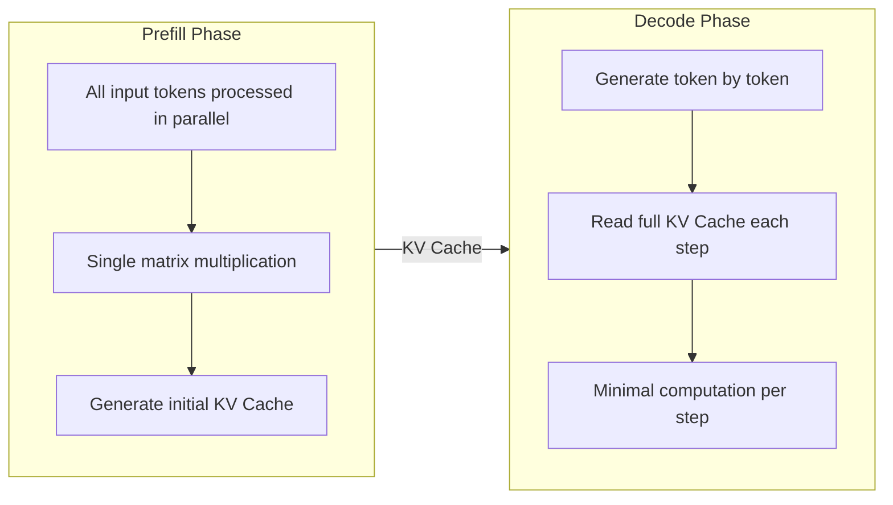
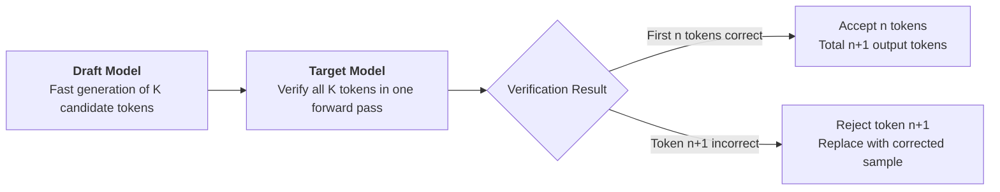

# Inference Efficiency Optimization

Through the [three scaling laws](test-time-compute.md#a-unified-view-of-three-scaling-laws), we have seen that investing more computation in training and inference can yield better model performance. In the real world, models face not only theoretical performance considerations but also practical engineering constraints -- primarily speed and cost. A model that takes 60 seconds to think before answering would be heavily criticized in real-time conversation scenarios. An inference service that requires 8 H100s to run would have deployment costs prohibitive for most teams. Inference efficiency optimization is about finding the balance between "answering well" and "answering fast."

The inference efficiency problem of large language models is essentially a resource mismatch. The inference process consists of two phases: the **Prefill** phase processes the input prompt sequence, and the **Decode** phase generates output tokens one by one. In the Prefill phase, all input tokens can be processed in parallel, fully utilizing GPU compute capacity. The Decode phase is the opposite -- each step generates only one token but must read the entire KV Cache, with compute utilization typically below 3%. More challenging is that the memory is already occupied by the KV Cache, making it difficult to increase utilization by increasing batch size. This Memory Wall problem is the biggest obstacle to improving model inference efficiency -- there is sufficient compute power, but it is constrained by memory bandwidth and capacity.

Researchers have pursued breakthroughs in two directions around this bottleneck. The first direction is "change the system, not the model," squeezing more performance out of existing hardware through smarter engineering. The second direction is "shrink the model directly," compressing the inference capability of large models into smaller parameter spaces or lower numerical precision through quantization, knowledge distillation, pruning, and sparsification. These two directions are not mutually exclusive -- in practice, they are often used in combination. A distilled small model, combined with PagedAttention and speculative decoding, can achieve efficiency gains far exceeding any single technique. This chapter systematically reviews the core techniques and ideas along both paths.

## Inference Bottleneck Analysis

The efficiency bottleneck of large model inference is not simply about raw speed or cost. Rather, it arises because the Prefill and Decode phases have vastly different resource requirements, and placing them on the same GPU inevitably wastes resources for one phase. Understanding the computational characteristics of these two phases is a prerequisite for understanding all subsequent optimization techniques.

Under the Transformer architecture, language model inference is autoregressive -- each time a token is generated, the Key and Value vectors of all previous tokens must be cached for use in subsequent attention computations. This cache is called the KV Cache. The inference process is thus naturally divided into two phases:

- **Prefill phase**: Processes the user input. Assuming the input sequence length is $n$ and the model dimension is $d$, the attention computation requires multiplying an $n \times n$ attention matrix, with each step involving dot products of $d$-dimensional vectors. Since the $n$ input tokens are known in advance, they can be computed in parallel in one shot. The GPU's matrix computation units are fully utilized, making this a **compute-bound** application. This means Prefill speed mainly depends on the GPU's compute capacity and has little relation to memory bandwidth.

- **Decode phase**: Generates output tokens one by one. Each time a token is generated, attention computation must be performed over all previously generated tokens. However, each step only has one new token's Query that needs dot products with all cached Keys, with computation of only $n \times d$ (where $n$ is the number of cached tokens), far less than Prefill's $n \times n \times d$. Each step requires reading the full KV Cache from memory while using only a tiny fraction of the compute units. Decode is a **memory-bound** application, where speed is mainly limited by memory bandwidth, and a large portion of the GPU's compute units remain idle.

*Figure: The two-phase flow of inference*

We can use a concrete example to intuitively feel this difference. Consider the LLaMA-2 70B model running on an A100 (80GB) with batch size 1. During the Prefill phase processing 1024 input tokens, GPU compute utilization can reach over 60%. During the Decode phase generating each token, GPU compute utilization is only about 0.5%. On the same GPU, the utilization difference between the two phases exceeds 100x. Such drastically different hardware requirements between Prefill and Decode are the main contradiction in inference efficiency optimization.

Since GPU compute is largely idle during the Decode phase, the intuitive solution would be to increase batch size and process more requests simultaneously, putting the idle compute to use. However, this path is largely blocked by the enormous memory consumption of the KV Cache. Let $n_{\text{layer}}$ be the number of Transformer layers (each layer has its own KV Cache); $d_{\text{head}} \times n_{\text{head}}$ be the hidden dimension size per token; $n_{\text{max}}$ be the maximum sequence length; $b$ be the batch size. The memory consumption of the KV Cache can be estimated with the following formula:

$$M_{\text{KV}} = 2 \times n_{\text{layer}} \times d_{\text{head}} \times n_{\text{head}} \times n_{\text{max}} \times b \times sizeof(\text{float16})$$

Each token needs to cache both Key and Value vectors at each layer. Summing across all layers, all tokens, and all requests gives the total memory consumption. Plugging in LLaMA-2 70B's specific parameters: 80 layers, 64 attention heads, 128 dimensions per head, maximum sequence length 4096, float16 precision. For a single request, the KV Cache memory is $M_{\text{KV}} = 2 \times 80 \times 128 \times 128 \times 4096 \times 1 \times 2 \approx 10.7 \text{ GB}$. An A100 has only 80 GB of total memory, and the model parameters themselves take about 140 GB, requiring tensor parallelism across multiple GPUs. With 2-GPU tensor parallelism, each GPU holds about 70 GB of model parameters, leaving about 10 GB for KV Cache -- barely enough for one request, making it impossible to increase batch size.

This is known as the **Memory Wall** problem in LLM inference. The large memory footprint of the KV Cache limits batch size and concurrency, preventing effective use of GPU compute. The low compute utilization in the Decode phase is not due to a lack of computation tasks, but because there is insufficient memory to accommodate more requests for parallel processing.

Having analyzed the bottlenecks of inference efficiency, we can now define specific optimization targets. Inference services typically focus on the following key metrics:

- **Time to First Token (TTFT)** is the time from when a user sends a request to when the model outputs the first token, mainly determined by the Prefill phase. TTFT is the first thing users perceive in conversation scenarios, and excessive waiting makes the system feel sluggish.
- **Time Per Output Token (TPOT)** is the average time to generate each token during the Decode phase, which is the reciprocal of **Tokens Per Second (TPS)**. TPS directly affects the user's reading experience -- if the generation speed falls below the human reading speed (about 10-15 tokens per second), users will feel the response is slowly "dripping out."
- **Throughput** is the total number of tokens processed by the system per unit time, equal to the sum of TPS across all concurrent requests. Throughput measures the overall processing capacity of the system and is most critical for batch processing scenarios (e.g., document translation, data annotation).
- **Concurrency** is the number of requests the system processes simultaneously. Concurrency is limited by the system's weakest link (currently mainly the memory capacity occupied by KV Cache), and throughput equals concurrency multiplied by the TPS of each request.

There is inherent tension among these metrics, with trade-offs between them. Increasing batch size can improve throughput, but each request gets fewer compute resources, decreasing TPS. Optimizing TTFT requires allocating more compute to Prefill, which may crowd out Decode resources, slowing down requests currently being generated. Different application scenarios prioritize different metrics: real-time conversation scenarios prioritize TTFT and TPS, while batch processing scenarios prioritize maximizing throughput. All subsequent optimization techniques are essentially about finding better trade-off points among these metrics.

## PagedAttention

The root cause of the Memory Wall is how the KV Cache is allocated and managed. Suppose an inference service handles 3 requests simultaneously, with a maximum sequence length of 2048 tokens. The traditional approach allocates contiguous space for 2048 tokens per request, but actual request lengths vary: request A finishes after only 200 tokens, request B uses 800 tokens, and request C is still generating, having used 1500 tokens so far. The three requests occupy a total of 3 × 2048 = 6144 tokens of memory space, but actually use only 200 + 800 + 1500 = 2500 tokens -- a utilization of just 41%. Allocating by maximum sequence length every time is wasteful because in traditional schemes, KV Cache memory is contiguous, meaning released space can only accommodate tokens no longer than the original length. If memory is not reserved by maximum sequence length, multiple reallocations fragment the space, making it unusable. While this "grab it all at once" allocation approach is convenient to implement, it comes at the cost of resource waste. In fact, for large memory allocation management, operating systems have long had a mature solution: memory paging.

Early operating systems also allocated contiguous memory for each program, leading to severe memory fragmentation. The solution was virtual memory paging: divide physical memory into fixed-size pages, partition the program's address space into pages of the same size, and map virtual pages to physical pages through page tables. This way, programs do not need to occupy contiguous physical memory -- as long as the page table correctly maps them. Free pages can be used by any program, perfectly solving the memory fragmentation problem.

In 2023, Woosuk Kwon from UC Berkeley proposed the PagedAttention mechanism in the paper "[Efficient Memory Management for Large Language Model Serving with PagedAttention](https://arxiv.org/abs/2309.06180)," borrowing the paging concept from operating system virtual memory to manage KV Cache. The KV Cache is no longer a contiguous block of memory but is divided into fixed-size Blocks (analogous to memory pages), each storing Key and Value vectors for 16 tokens. A request's KV Cache does not need to occupy contiguous Blocks -- instead, a Block Table (similar to a page table) maps logically contiguous KV Cache to physically scattered Blocks. During attention computation, the Block Table finds the physical address corresponding to each token, allowing normal computation. This work was published at SOSP 2023, a top conference in operating systems, and gave rise to vLLM, a widely used inference framework. PagedAttention consists of the following three components:

- **Block Table**: Records the physical location of each block of a request's KV Cache. A request's logical Block 0 might map to physical Block 7, and logical Block 1 to physical Block 23, with no contiguity required. During attention computation, the GPU kernel finds the physical addresses to read via the Block Table, then reads the Key and Value vectors from those addresses.

- **Block Allocator**: Centrally manages the allocation and recycling of all physical Blocks. When a new token is generated, the allocator takes a Block from the free Block pool and assigns it to the current request. When the request finishes, the allocator returns all Blocks belonging to that request to the free pool. Since Block sizes are fixed, any recycled Block can be used by any request, eliminating fragmentation.

- **Copy-on-Write mechanism**: Handles parallel sampling scenarios. When the model generates multiple candidate responses for the same prompt, these responses share identical KV Cache at the beginning. PagedAttention lets them share the same set of physical Blocks, only allocating new Blocks at the divergence point (where candidates start generating different tokens). This again borrows from the operating system's Copy-on-Write mechanism, where multiple processes share the same memory page, and a copy is made only when a process attempts to modify it.

The improvement from PagedAttention can be quantified using the earlier example. Assume a Block size of 16 tokens. Request A actually uses 200 tokens, occupying 13 Blocks. Request B uses 800 tokens, occupying 50 Blocks. Request C uses 1500 tokens, occupying 94 Blocks. The three requests use a total of 13 + 50 + 94 = 157 Blocks. In the traditional approach, each request is pre-allocated by maximum length, with utilization around 41%. With PagedAttention, each request occupies only the Blocks it actually needs, totaling 157 Blocks, with utilization close to 100%. This advantage directly translates to throughput and concurrency. Taking an A100 with 80 GB memory as an example, each GPU might handle only 10 concurrent requests in the traditional approach, while PagedAttention can handle 50-60 requests simultaneously, improving throughput by 4-6x.

PagedAttention also brings an additional benefit: the KV Cache for the [System Prompt](../pretraining/supervised-finetuning.md#system-prompt-design) is naturally shareable across requests. In a dialogue system, every request includes the same system prompt (e.g., "You are a helpful assistant"). In the traditional approach, each request computes and caches the KV Cache for this prompt independently, resulting in massive duplication. PagedAttention lets all requests share the same set of physical Blocks for storing the system prompt's KV Cache -- a new request only needs to compute the portion after the system prompt, saving both memory and Prefill computation.

Experimental data from vLLM demonstrates the combined effects of these optimizations. On the ShareGPT dataset, vLLM achieves 2-4x higher throughput than traditional frameworks (e.g., FasterTransformer) with lower latency. When system prompt sharing is enabled, throughput further improves in scenarios with long system prompts.

## Prefill-Decode Disaggregation Architecture

PagedAttention solved the memory management problem of KV Cache, allowing more requests to occupy the GPU simultaneously. However, it did not change the fact that Prefill and Decode run on the same GPU. During the Decode phase, compute utilization is extremely low, with most GPU compute units idle, suggesting there should be ample capacity to process other requests' Prefill tasks in parallel. But Prefill is a compute-intensive burst task -- a single Prefill typically takes hundreds of milliseconds to complete, during which the GPU is fully occupied. Meanwhile, Decode is extremely latency-sensitive -- each token must be generated within milliseconds, or users perceive stuttering. When the GPU is processing a large Prefill request, Decode requests must queue up and wait for Prefill to finish. This waiting time is the source of latency amplification. Experimental data shows a single Prefill request can amplify the latency of ongoing Decode requests by 2-30x. Conversely, when the GPU is fully engaged in Prefill tasks, the Decode tasks already in memory occupy the KV Cache, which can neither be offloaded nor utilized, wasting precious memory space.

The solution to this contradiction is to separate the two phases -- do not run them on the same GPU. The Prefill-Decode Disaggregation architecture splits the inference service into two independent groups of GPU instances: Prefill instances dedicated to processing input prompts, and Decode instances dedicated to generating output tokens. A request's full lifecycle goes through Prefill on a Prefill instance, then the generated KV Cache is transferred over a high-speed network to a Decode instance, which then generates tokens one by one until the request completes, as shown in the diagram below.

*Figure: Basic flow of PD Disaggregation*

The two groups of instances can choose different hardware configurations based on their respective needs. Prefill instances need high compute capacity, making them well-suited for high-compute GPUs like H100s. Decode instances need high memory bandwidth, where the HBM2e bandwidth of A100s is actually a better match. Huawei's Ascend 950 series chips are even directly named 950 PR and 950 DT, where P and D refer to Prefill and Decode respectively, indicating that the 950 PR is designed with compute and throughput as priorities, while the 950 DT prioritizes memory bandwidth and capacity.

In 2024, a paper from UC San Diego titled "[DistServe: Disaggregating Prefill and Decoding for Goodput-Optimized Large Language Model Serving](https://arxiv.org/abs/2401.09670)" validated the advantages of this separation. With the same total hardware, the disaggregated architecture improved throughput by 1.4-2.4x compared to traditional hybrid deployment, while meeting tighter latency constraints. After separation, Prefill instances are no longer slowed down by Decode requests, making TTFT more stable. Decode instances are no longer disturbed by Prefill requests, making TPS more consistent.

However, PD Disaggregation introduces a new engineering challenge: how to quickly transfer the KV Cache from Prefill instances to Decode instances? We previously calculated with LLaMA-2 70B that a single request's KV Cache requires about 10.7 GB of memory. Under a traditional PCIe 4.0 bus connection (bandwidth of about 31.5 GB/s), transferring 10 GB takes about 317 ms. With NVLink (bandwidth 300 GB/s), the transfer takes only about 33 ms -- a significant improvement in latency. Therefore, PD Disaggregation typically requires high-speed interconnects between Prefill and Decode instances, supported by technologies that bypass PCIe such as NVLink, HCCS, and InfiniBand.

Additionally, scheduling strategy is a key issue, determining which Decode instance a new request should be assigned to. The most intuitive scheduling strategy is Round-Robin, where instances take turns receiving requests -- simple but not fine-grained enough. A more reasonable strategy considers two factors: first, the current load of each Decode instance (how many requests it already handles, how much memory remains), and second, the expected generation length of the request (short requests assigned to lightly loaded instances to avoid being slowed down, long requests assigned to heavily loaded instances). This load-aware scheduling can better balance the workload across Decode instances and reduce interference between requests.

The Mooncake system developed by Moonshot AI goes a step further, constructing a KV Cache pool using idle GPUs, representing a more extreme form of PD Disaggregation. Moonshot AI operates Kimi, a dialogue service serving millions of users, with massive daily request volumes and significant fluctuation -- peak daytime traffic is several times higher than the late-night trough. Traditional deployment either provisions resources for peak hours (with many idle GPUs during troughs) or for trough hours (degrading service quality during peaks). Mooncake's innovation is the introduction of a KV Cache pool. This pool is not a fixed GPU cluster but consists of a group of elastically scalable instances. After Prefill instances complete computation, the KV Cache is not directly sent to a specific Decode instance but is first placed into the pool, and the scheduler then assigns the request to the most suitable Decode instance for continued generation based on current load.

This design offers several benefits. First is elastic scheduling -- more Decode instances can be temporarily started during peak hours to handle requests, and scaled down during troughs to save costs. Second is prefix reuse -- KV Cache already in the pool (such as cached system prompts) can be directly reused by new requests, skipping redundant Prefill computation. Finally, online rebalancing -- the scheduler can migrate running requests from one Decode instance to another to optimize overall load distribution, which is difficult to achieve in traditional hybrid deployments. In Kimi's actual production environment, Mooncake improved GPU utilization from about 20% in traditional deployment to about 60%, and increased service throughput by more than 3x with the same hardware configuration. This work won the Best Paper Award at FAST 2025, marking the transition of PD Disaggregation from academic research to large-scale industrial practice.

## Speculative Decoding

In 2023, Yaniv Leviathan from Google proposed speculative decoding in the paper "[Fast Inference from Transformers via Speculative Decoding](https://arxiv.org/abs/2211.17192)." This is a more creative efficiency improvement strategy that changes how language models generate tokens -- from "generate one by one" to "guess first, verify later" -- allowing GPU compute resources to be fully utilized even during the Decode phase.

Let us return to the problem of low resource utilization in the Decode phase. Its essence is that the GPU generates only one token per step with minimal computation, wasting massive compute capacity. Finding a way for the GPU to compute more tokens at once is the true cure. The idea behind speculative decoding can be likened to a scenario where "a student guesses answers, and the teacher grades in batch." Imagine a multiple-choice question where the student (Draft Model), while not as accurate or authoritative as the teacher (Target Model), can quickly produce several potentially correct answers. The teacher does not need to recompute each one individually -- instead, the teacher verifies all the student's candidate answers at once, keeping the correct ones, discarding the wrong ones, and providing the standard answer at the position of the first wrong answer. The specific workflow of speculative decoding is illustrated below:

*Figure: Workflow of speculative decoding*

The Draft Model quickly generates K candidate tokens (the speculation length, typically 4-8). This process is also autoregressive, but because the Draft Model is much smaller than the Target Model, generation is fast. The Target Model then performs one forward pass on these K tokens, simultaneously computing attention for all K tokens, effectively obtaining the Target Model's probability distribution at each position in a single pass. By comparing the probability distributions of the Draft Model and the Target Model at each position, each candidate token is judged on whether it is accepted by the Target Model. If a token chosen by the Draft Model also has a high probability in the Target Model's distribution, it is accepted; otherwise, it is rejected, and a replacement is sampled from the Target Model's probability distribution.

Assume a speculation length of K=5 and an acceptance rate of $\alpha=0.8$ (meaning on average 80% of candidate tokens are accepted). The average number of tokens accepted per speculation is $\frac{1-\alpha^{K+1}}{1-\alpha} \approx 3.69$, plus the 1 token generated by the Target Model for correction, yielding about 3.69 tokens per speculation on average. In the traditional autoregressive approach, 5 forward passes would be needed to generate 5 tokens. Since the Draft Model's forward pass is much faster than the Target Model's, and the Target Model only performs one forward pass instead of five, the overall speed is significantly improved.

Despite the word "speculative" in its name, speculative decoding has rigorous theoretical guarantees that the output distribution is exactly the same as the original autoregressive sampling. It is not approximate acceleration but exact acceleration. With the same model and the same sampling strategy, speculative decoding and step-by-step generation produce token sequences with exactly the same probability distribution. This guarantee is achieved through **Modified Rejection Sampling**. For the candidate token $x_t$ at position $t$ (sampled by the Draft Model with probability $q(x_t)$), the Target Model's probability at that position is $p(x_t)$. The acceptance rules are as follows:

- If $p(x_t) \geq q(x_t)$, directly accept $x_t$ (the Target Model agrees with this token more than the Draft Model)
- If $p(x_t) < q(x_t)$, accept $x_t$ with probability $\frac{p(x_t)}{q(x_t)}$, reject with probability $1 - \frac{p(x_t)}{q(x_t)}$, and sample a replacement token from the corrected distribution $\max(0, p(x) - q(x))$

The mathematical essence of this modified rejection sampling mechanism is as follows: the Draft Model tends to choose tokens it considers high-probability ($q(x_t)$ is large), but if the Target Model also considers this token high-probability ($p(x_t)$ is also large), it should be accepted. When the Draft Model chooses a token it likes but the Target Model does not ($p(x_t) < q(x_t)$), the decision to accept is made according to the probability ratio, ensuring that the final probability distribution is exactly $p(x)$ and not skewed by $q(x)$. The corrected distribution $\max(0, p(x) - q(x))$ ensures that replacement tokens sampled upon rejection come from tokens preferred more by the Target Model than the Draft Model, maintaining the target distribution after correction.

This theoretical guarantee is a key advantage of speculative decoding over approximate acceleration methods such as model quantization and pruning. Quantization and pruning change the model itself, altering the output distribution, and the acceleration comes at the cost of output quality. Speculative decoding does not change the model or the distribution -- the acceleration comes purely from optimizing the generation approach, introducing no quality loss.

### Draft Model Selection and Training

The acceleration effect of speculative decoding depends on two factors: the generation speed of the Draft Model and the acceptance rate of candidate tokens. Generation speed is determined by the parameter count of the Draft Model -- fewer parameters means faster generation. The acceptance rate is determined by how well the Draft Model's distribution matches the Target Model's -- the closer the match, the more candidates the Target Model accepts, and the higher the acceptance rate. These two factors are somewhat contradictory: if the Draft Model is too small, generation is fast but it deviates significantly from the Target Model, leading to low acceptance. If the Draft Model is too large, the acceptance rate is high but generation is slow, defeating the purpose of speculation.

In practice, the Draft Model is typically a smaller version of the Target Model. For instance, if the Target Model is LLaMA-2 70B, the Draft Model might be LLaMA-2 7B, with only one-tenth the parameters and about 10x faster generation. Since both use the same training data and vocabulary, their distributions are relatively well-matched, and the acceptance rate is typically between 70% and 85%.

Besides using an existing small model as the Draft Model, one can also train a small model using the Target Model's training data to make its distribution as close as possible to the Target Model. Alternatively, the Target Model's outputs can be used as distillation data, letting the Draft Model learn the Target Model's probability distribution -- this is essentially [Knowledge Distillation](#knowledge-distillation) applied in the context of speculative decoding.

There is also an additional framework called Medusa (named after the figure from Greek mythology whose hair consisted of snakes), which cleverly avoids the need for an independent Draft Model. Medusa does not use a separate small model but instead adds multiple Prediction Heads directly on top of the Target Model's last hidden layer through fine-tuning. Each head predicts the $k$-th future token (the 1st head predicts the next token, the 2nd head predicts the token after that, and so on). These prediction heads are very lightweight -- typically just a single linear layer -- with extremely low training cost. During inference, they execute together with the Target Model's forward pass, requiring no additional model calls. The advantage of Medusa is that it does not increase system complexity or require maintaining an independent Draft Model. However, the accuracy of prediction heads is typically lower than that of a dedicated Draft Model, resulting in a correspondingly lower acceptance rate. Many modern LLMs are already designed with built-in MTP Heads (Multi-Token Prediction Heads), eliminating the need to add Medusa for speculative decoding support -- examples include DeepSeek-V3/R1, GLM 4.5, and others.

### Inference Speedup Ratio

Let $K$ be the speculation length, $\alpha$ be the acceptance rate, $T_d$ be the single-step generation time of the Draft Model, and $T_t$ be the single-step generation time of the Target Model. The theoretical speedup ratio of speculative decoding = output / time, where the numerator is the average number of valid tokens produced per speculation, and the denominator is the time consumed per speculation.

For the numerator: in one speculation, the Draft Model generates $K$ candidate tokens, and the Target Model verifies them. When the $t$-th candidate token is accepted and the $(t+1)$-th is rejected (probability $\alpha^t (1-\alpha)$), the total output is $t+1$ valid tokens ($t$ accepted candidates plus 1 corrected token generated by the Target Model at position $t+1$). If all $K$ candidates are accepted (probability $\alpha^K$), the total output is $K+1$ valid tokens ($K$ candidates plus 1 additional token generated by the Target Model at position $K+1$). Therefore, the expected number of valid tokens output per speculation is:

$$E[\text{tokens}] = \sum_{t=0}^{K-1} \alpha^t (1-\alpha) (t+1) + \alpha^K (K+1) = \frac{1-\alpha^{K+1}}{1-\alpha}$$

For the denominator, generating $K$ tokens with the Draft Model takes $K \cdot T_d$, and the Target Model's single forward pass for verification takes $T_t$. Using $T_t$ as the time unit, the total time is $K \cdot \frac{T_d}{T_t} + 1$. The speedup ratio is thus the efficiency ratio of the speculative approach relative to the traditional approach:

$$S = \frac{\frac{1-\alpha^{K+1}}{1-\alpha}}{K \cdot \frac{T_d}{T_t} + 1}$$

The meaning of this formula is that the speedup ratio depends on the average number of valid tokens produced per speculation relative to the efficiency difference with the traditional approach. Intuitively, the higher the acceptance rate $\alpha$, the more tokens are produced per speculation on average. The faster the Draft Model (smaller $T_d/T_t$), the lower the time overhead of speculation itself. Both factors together determine the speedup ratio.

In practice, acceptance rates vary by task type. Code generation tasks typically have high acceptance rates (80%-90%) because code follows fixed syntactic structures, making it easy for the Draft Model to guess correctly. Mathematical reasoning tasks also have relatively high acceptance rates (75%-85%), as reasoning steps tend to follow strong patterns. Open-ended dialogue has a relatively lower acceptance rate (60%-70%) because dialogue content is diverse and unpredictable, making it difficult for the Draft Model to accurately guess what the Target Model will say.

In real-world systems, speculative decoding typically achieves 2-3x speedup. In Google's 2023 experiments, using T5-XXL as the Target Model and testing T5-small, T5-base, and T5-Large as Draft Models, they achieved an overall 2-3x speedup. Microsoft's DeepSpeed-FastGen, released in 2024, integrated speculative decoding and improved inference throughput by approximately 2.5x.

## Model Lightweighting

The techniques discussed so far -- PagedAttention, PD Disaggregation, and speculative decoding -- all optimize inference efficiency at the system level, leaving the model itself unchanged. Another route to improving efficiency is to directly make the model smaller. If the model has fewer parameters, the KV Cache is naturally smaller, computation is naturally lower, and the bottleneck is naturally alleviated. Model lightweighting is the core technique along this route, primarily including knowledge distillation, pruning, and sparsification.

### Knowledge Distillation

The idea of knowledge distillation can be traced back to 2006, when Cristian Buciluă and others proposed the concept of training a small model under the guidance of an ensemble model in their paper "[Model Compression](https://dl.acm.org/doi/10.1145/1150402.1150464)." In 2015, Geoffrey Hinton formally proposed the knowledge distillation framework in his paper "[Distilling the Knowledge in a Neural Network](https://arxiv.org/abs/1503.02531)," using the "Teacher-Student" metaphor to describe the process of a large model guiding the training of a small model.

The intuition behind knowledge distillation comes from an everyday observation: the learning outcome is vastly different when a novice learns from scratch versus when an experienced teacher provides hands-on guidance. A large model (Teacher), trained on massive amounts of data, knows far more than just the final answer it outputs. For example, when asked "What is the capital of France?", the Teacher model outputs "Paris" with 90% probability, but also assigns 5% probability to "Lyon" and 2% to "Marseille." This probability distribution contains the Teacher model's knowledge about the question, not just the final answer. The goal of knowledge distillation is to let the small model (Student) learn not only the correct answer but also the Teacher model's probability judgments about incorrect answers. Specifically, during knowledge distillation training, the student's loss function consists of two parts:

$$\mathcal{L} = \alpha \cdot KL(p_\tau \| q_\tau) + (1 - \alpha) \cdot \mathcal{L}_{\text{CE}}$$

The first term $KL(p_\tau \| q_\tau)$ is the [KL Divergence](../../deep-learning/generative-models/vae.md#kl-divergence) between the Teacher model's distribution $p_\tau$ and the Student model's distribution $q_\tau$, measuring the difference between the two distributions. The subscript $\tau$ is the [Temperature](../../deep-learning/sequence-models/seq2seq.md#temperature-sampling) parameter, used to soften the probability distribution. Standard Softmax at temperature 1 produces a sharp probability distribution where the highest-probability token dominates. Higher temperatures produce smoother distributions, making the Teacher model's knowledge about each token more visible. Distillation typically uses $\tau = 4$ or $\tau = 8$. The training objective of the first term is to minimize the KL divergence, making the Student model's distribution as close to the Teacher's as possible. The second term $\mathcal{L}_{\text{CE}}$ is the standard cross-entropy loss, ensuring the Student model still outputs the correct final answer. $\alpha$ controls the weight of the two loss terms, typically set to 0.5-0.9. The overall loss function means the student must learn both the teacher's understanding (distribution similarity) and the correct answer (classification accuracy).

One of the most successful examples of knowledge distillation in large model inference is Distilled Whisper. OpenAI's Whisper is a powerful speech recognition model, with the largest version having 1.55 billion parameters, but it suffers from slow inference speed and high memory requirements. The Distil-Whisper series released by HuggingFace includes Distil-Large-v3 with 756 million parameters -- a reduction of about 50% in parameter count, achieving 6x speedup while retaining over 90% of the original model's accuracy on most English speech recognition tasks. Another notable example is the DeepSeek-R1-Distill series released by the DeepSeek team in January 2025, which distilled DeepSeek-R1's reasoning capabilities into small models ranging from 1.5B to 32B parameters. Even the smallest 1.5B model demonstrates significant chain-of-thought reasoning capability on mathematical reasoning tasks.

### Pruning and Sparsification

If knowledge distillation is about retraining a small model to imitate a large model, then pruning is about directly removing less important parameters from the large model. The basic idea of pruning dates back to the OBD algorithm (Optimal Brain Damage) proposed by Yann LeCun in 1990 and the OBS algorithm (Optimal Brain Surgeon) proposed by Babak Hassibi and others in 1992. However, the widespread application of pruning in neural networks largely stems from the approach proposed by Song Han in his 2015 paper "[Learning both Weights and Connections for Efficient Neural Networks](https://arxiv.org/abs/1506.02626)," which zeros out parameters with small absolute values in the weight matrix and then fine-tunes the remaining parameters to recover accuracy. Zeroed-out parameters require no computation or storage during inference, reducing both computational and storage requirements.

Pruning a model is not easy. LLMs have enormous numbers of parameters (tens of billions), and different layers have vastly different sensitivity to pruning. Simple global threshold pruning (e.g., zeroing out the smallest 50% of parameters by absolute value across all layers) can cause severe accuracy loss because some layers' critical parameters may happen to have small absolute values but cannot be removed. SparseGPT and Wanda, proposed in 2023, are two representative pruning methods for large models. SparseGPT determines the optimal pruning scheme for each weight matrix in a single forward pass through approximate sparse regression, requiring no retraining, and can retain about 97% of the original model's performance at 50% sparsity. Wanda determines pruning by computing the product of each weight's absolute value and the norm of the corresponding input activation, also requiring no retraining, and can achieve less than 1% performance loss at 50% sparsity.

[MoE models](../architecture-basics/architecture-evolution.md#sparse-architecture) (Mixture of Experts) can also be considered a form of sparsification. Although MoE models have a large total parameter count, each inference activates only a few experts (e.g., Mixtral 8x7B activates only 2 of its 8 experts), so the actual computation is far less than that of a dense model. Inference efficiency optimization for MoE mainly focuses on reducing memory access overhead when switching between experts and improving the batch processing efficiency of multiple tokens activating the same expert in a single inference. This goes beyond traditional pruning and is closer to structured conditional computation, but the goal is the same: achieving output quality close to a dense model with less computation.

It is important to note that the speedup from pruning is not as straightforward as the parameter reduction ratio might suggest. 50% sparsity does not mean 50% speedup, because the efficiency of sparse matrix multiplication on a GPU depends on whether the sparsity pattern is regular. Unstructured sparsity (zeroing out random positions) is difficult to achieve actual speedup on GPUs because zero elements are scattered throughout the matrix, and the GPU still needs to traverse the entire matrix. Structured sparsity (zeroing out entire rows or blocks) more readily achieves actual speedup but typically incurs greater accuracy loss. This gap is one of the main reasons pruning is less widely adopted in practice than knowledge distillation.

## Chapter Summary

The essence of inference efficiency optimization is finding a practically achievable balance between "answering well" and "answering fast." The difficulty of this balance stems from the structural contradiction inherent in Transformer autoregressive inference: Prefill is a compute-intensive burst task, while Decode is a memory-intensive sustained task. Running them on the same GPU easily leads to resource contention. This is not a problem that can be solved by tuning a single parameter -- it is a resource mismatch at the architectural level.

The techniques covered in this chapter each respond to this contradiction in their own way. PagedAttention does not change the computation itself but reorganizes memory management by borrowing the paging concept from operating systems, so that the KV Cache no longer occupies unnecessary space, directly improving concurrency by several times. The Prefill-Decode Disaggregation architecture goes further, splitting the two phases onto separate GPUs to run independently, allowing each type of hardware to do what it does best -- at the cost of requiring high-speed interconnects to transport the KV Cache. Speculative decoding takes a different approach, letting a small model guess first and a large model verify in batch, trading redundant computation for parallel efficiency, with no theoretical loss in output quality. Knowledge distillation and pruning start from the model itself -- one compresses a large model's capability into a smaller parameter space through Teacher-Student training, and the other reduces computation and storage overhead by removing redundant parameters or structures.

These techniques are not isolated -- in practice, they are often used in combination. A distilled small model, combined with PagedAttention for memory management and speculative decoding for accelerated generation, achieves efficiency improvements far exceeding any single technique. More importantly, inference efficiency optimization is not merely an engineering trick to make models run faster -- it determines whether large models can truly step out of the laboratory and into the hands of millions of users. A model requiring 8 H100s to run and a distilled small model that can converse smoothly on a single consumer-grade GPU offer vastly different value to users. Every improvement in inference efficiency lowers the cost barrier of large model services, enabling more people to access and use this technology.

## Exercises

1. Calculate the total KV Cache memory usage for the LLaMA-2 7B model with batch size 16, maximum sequence length 2048, and float16 precision. Model parameters: 32 layers, 32 attention heads, 128 dimensions per head. If the available memory is 40 GB (after accounting for model parameters), how many more requests can be added?

   

   
Reference Answer

   Using the KV Cache memory formula:

   $$M_{\text{KV}} = 2 \times 32 \times 128 \times 32 \times 2048 \times 16 \times 2 = 2 \times 32 \times 4096 \times 2048 \times 16 \times 2$$

   Step by step: $2 \times 32 = 64$, $64 \times 128 = 8192$, $8192 \times 32 = 262144$, $262144 \times 2048 = 536870912$, $536870912 \times 16 = 8589934592$, $8589934592 \times 2 = 17179869184$ bytes ≈ 16 GB.

   The KV Cache for a single request is $16 \text{ GB} / 16 = 1 \text{ GB}$. If the available memory is 40 GB, the current 16 requests consume 16 GB, leaving 24 GB to accommodate about 24 more requests, for a total concurrency of 40 requests.

   

2. Analyze the following three application scenarios and recommend the most suitable combination of inference efficiency optimization strategies for each, explaining your reasoning:

   - Scenario A: A real-time chatbot serving millions of users, with strict latency requirements (TTFT < 0.5s, TPS > 20)
   - Scenario B: An enterprise batch document translation service, latency-insensitive, requiring maximum throughput
   - Scenario C: A code assistance tool for researchers, with a small user base but requiring high-quality output

   

   
Reference Answer

   **Scenario A**: Distilled small model + PagedAttention + Speculative Decoding. Real-time chat is extremely latency-sensitive. A distilled small model (e.g., 7B) inherently generates faster, combined with PagedAttention to improve concurrency and speculative decoding to further accelerate generation. PD Disaggregation could also be used here, but serving millions of users means high request volume, and a single cluster's Prefill instances could become a bottleneck -- separation should be decided based on load testing.

   **Scenario B**: Large model + PagedAttention + PD Disaggregation. Batch processing does not require low latency, so a large model can be used to ensure output quality. PagedAttention maximizes concurrency to boost throughput, while PD Disaggregation lets Prefill and Decode each run efficiently. Speculative decoding offers limited benefits in batch scenarios, as batch size is already large and Decode phase compute utilization is already high.

   **Scenario C**: Large model + Speculative Decoding. Code assistance has a small user base with low concurrency pressure, so the advantages of PagedAttention and PD Disaggregation are limited. However, code generation demands high quality and must use a large model. Speculative decoding is particularly well-suited for code generation (with acceptance rates as high as 80%-90%), providing significant speedup without compromising quality.

   

