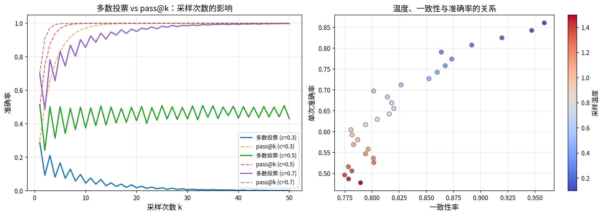

# Reasoning Reliability

In 1950, Alan Turing proposed the famous Turing Test in his paper "[Computing Machinery and Intelligence](https://doi.org/10.1093/mind/LIX.236.433)": if a machine can carry on a conversation with a human to the point where the human cannot tell whether they are talking to a person or a machine, then that machine can be considered intelligent. This test implies a foundational assumption — that reasoning ability is a core feature of intelligence. More than seventy years later, the reasoning abilities exhibited by large language models in dialogue seem to be approaching Turing's vision.

However, there is a fundamental difference between machine reasoning and human reasoning. In 2022, researchers at OpenAI discovered a troubling phenomenon while studying ChatGPT's reasoning behavior: the model fabricates seemingly plausible intermediate steps when solving math problems. For instance, when asked what 123 × 456 equals, the model might produce a reasoning chain like: "First compute 123 × 400 = 49,200, then 123 × 50 = 6,150, and finally 123 × 6 = 738, adding them together gives 56,088." The reasoning process appears well-structured and the answer is completely correct, seemingly indicating reliable reasoning. But the problem is that the model itself is a computer, yet it resorts to simulating human computation through statistical pattern matching to find the answer — which precisely demonstrates that the model does not truly understand the problem; it is merely imitating. When the problem is simple enough and similar examples are abundant in the training data, this imitation often yields correct results. But when the problem falls outside the training distribution or requires multi-step precise reasoning, the model's reasoning chain can go wrong step by step, and it may even fabricate nonexistent facts to support its erroneous conclusions. This phenomenon, which researchers call Hallucination, reveals the inherent limitations of reasoning under the statistical learning paradigm.

Understanding these limitations is not about denying the value of reasoning models, but about using them more accurately — knowing when to trust them and when verification is necessary. This chapter will analyze the boundaries of model reasoning from three dimensions: the vulnerability of reasoning chains, reasoning consistency issues, and the fundamental difference between statistical fitting and symbolic reasoning, and will introduce practical methods for improving reasoning reliability.

## Vulnerability of Reasoning Chains

In the previous chapter, we discussed Test-Time Compute Scaling and saw how increasing the number of reasoning steps statistically improves accuracy. However, this statistical improvement masks a troubling fact: **within a single reasoning process, the longer the reasoning chain, the higher the probability of error**. This is like a chain — if any single link breaks, the entire chain fails. The vulnerability of reasoning chains is the first dimension for understanding the limits of model reasoning.

### Error Accumulation: One Wrong Step Leads to All Wrong Steps

Imagine you are solving a multi-step math problem: first compute $a = 3 \times 7 = 21$, then compute $b = a + 5 = 26$, and finally compute $c = b \times 2 = 52$. If you make an error in the first step, getting $a = 22$, then all subsequent steps will build on this incorrect value: $b = 22 + 5 = 27$, $c = 27 \times 2 = 54$. Even if the subsequent addition and multiplication are perfectly correct, the final answer is wrong. This is **Error Accumulation** — an error in an early step snowballs, persistently affecting all subsequent reasoning.

When humans encounter this situation, we have a natural "error-correction instinct." If you suddenly realize in the third step that "wait, 3 × 7 should be 21, not 22," you can go back and correct the first step, then recompute the rest. But the reasoning mechanism of large language models makes this kind of backtracking and correction extremely difficult. The model's reasoning is essentially **autoregressive generation**: the output at each step is based on the context of all preceding steps. Once the first step generates an incorrect $a = 22$, this error is "hard-coded" into the context window, becoming a "factual premise" for subsequent reasoning. The model cannot "forget" previous erroneous steps like humans can, because the self-attention mechanism treats every token in the context as equivalent input information.

This difference can be characterized with a simple probabilistic model. Suppose the reasoning chain has $n$ steps, and each step has an independent probability $p$ of being wrong. Then the probability of the entire reasoning chain being completely correct is:

$$P(\text{All Correct}) = (1 - p)^n$$

This formula is simple but its implications are intuitive: $(1 - p)$ is the probability of a single step being correct, and multiplying $n$ times means every step must be correct for the chain to avoid errors. As $n$ increases, this probability decays exponentially. Plugging in some numbers: suppose the per-step error rate is $p = 0.01$ (i.e., 99% per-step accuracy), then the probability of a 10-step chain being completely correct is $0.99^{10} \approx 0.904$, for 50 steps it is $0.99^{50} \approx 0.605$, and for 100 steps it drops to $0.99^{100} \approx 0.366$. In other words, even with 99% per-step accuracy, only about one-third of 100-step reasoning chains will be entirely error-free.

Of course, in reality, model errors are not completely independent — an error in an earlier step may make later steps more prone to errors (positive correlation), or logical constraints may make errors more easily detected (negative correlation). But the exponential decay model under the independence assumption reveals a fundamental truth: **under the autoregressive generation paradigm, the reliability of a reasoning chain decreases exponentially with its length, posing a fundamental challenge for long-chain reasoning**.

In 2023, a research team at Google DeepMind quantified this phenomenon in a systematic study. They found that on the GSM8K math reasoning dataset, when the reasoning chain exceeded 15 steps, the error rate of GPT-4 increased significantly; and when the chain exceeded 30 steps, even for models specifically trained for reasoning, the probability of being completely correct dropped substantially. More notably, the study also found that after making an error in the reasoning chain, the model had about a 70% probability of continuing to reason from the incorrect premise in subsequent steps, rather than self-correcting. This stands in stark contrast to human reasoners — humans typically backtrack and check when they discover a contradiction, but models tend to "press on with the mistake."

### Hallucination in Intermediate Steps

Error accumulation concerns cases where "reasoning steps are executed correctly but the premise is wrong." However, there is a more insidious problem in model reasoning: **the model may fabricate seemingly plausible but factually incorrect intermediate facts during the reasoning process**. This phenomenon is called "Reasoning Hallucination," and it is more dangerous than hallucination in direct answers because it is wrapped in the guise of logical reasoning, making it more deceptive.

Consider this scenario: the model is asked "Who won the Nobel Prize in Physics in 2023?" If the model gives a direct wrong answer, the user can easily recognize it as hallucination. But if the model produces a reasoning chain like this: "The 2023 Nobel Prize in Physics was awarded for contributions to attosecond pulse spectroscopy. The laureates include Pierre Agostini, Ferenc Krausz, and Anne L'Huillier. Notably, Anne L'Huillier is the fifth woman to win the Nobel Prize in Physics." This reasoning appears information-rich and logically coherent, but the specific number "fifth woman" may be fabricated by the model — it might vaguely know that "very few women have won the Nobel Prize in Physics" and then "reasoned" its way to a seemingly plausible specific number.

This kind of reasoning hallucination is also common in mathematical derivations. The model might "forge" an invalid equality during reasoning, such as directly replacing $\sqrt{a^2 + b^2}$ with $a + b$, and then continue deriving from this false equality. Since the logical chain of subsequent steps is self-consistent (only the premise is wrong), the entire reasoning process appears "reasonable," but the conclusion is incorrect. In 2024, OpenAI acknowledged in its technical report on the o1 model that the model exhibits this tendency to "rationalize incorrect premises" in mathematical reasoning, listing it as a key issue to address in reasoning models.

The root cause of reasoning hallucination lies in the model's training objective: **language models are trained to generate the "statistically most likely" next token, not the "logically most correct" next token**. When the model encounters uncertain information during reasoning, it does not stop to admit "I don't know"; instead, it tends to generate the statistically most likely "reasonable" content to fill the gap. This tendency is amplified in reasoning chains: each step's generated "reasonable" content becomes the context for the next step, progressively building a reasoning structure that "looks reasonable but is factually wrong."

### Relationship Between Reasoning Chain Length and Reliability

The analysis in the previous two sections points to a common pattern: the longer the reasoning chain, the lower the reliability. This pattern can be understood from two perspectives. From the error accumulation perspective, more steps mean more opportunities for error, and the probability of being completely correct decays exponentially. From the reasoning hallucination perspective, longer reasoning chains require more intermediate facts and computational steps, each of which can be a trigger point for hallucination.

However, this pattern seems to conflict with the conclusion from [Test-Time Compute Scaling](test-time-compute.md) that "more steps = higher accuracy." The key to understanding this apparent contradiction lies in distinguishing between the **statistical level** and the **single-instance level**. At the statistical level, performing multiple samplings for the same problem, where strategies with more reasoning steps can cover more possible reasoning paths, indeed increases the probability of "being correct at least once." But at the single-instance level, the longer a specific reasoning chain is, the lower the probability that it is entirely error-free. These two findings are not contradictory: Test-Time Compute Scaling relies on the statistical advantage of "trying multiple times and selecting the best," not on the reliability of a single reasoning chain.

This distinction has important practical implications for using reasoning models. If you only run inference once, the longer the reasoning chain, the less reliable the result. But if you can sample multiple times and select the best result (i.e., the majority voting strategy, which we will detail in Section 4), longer reasoning chains can become advantageous. This is analogous to the difference between "casting a wide net" and "intensive cultivation": a single long reasoning chain is like intensive cultivation, prone to failure at some point; multiple sampling is like casting a wide net — although individual attempts may fail, eventually one path will hit upon the correct answer.

Closely related to reasoning chain length is **Length Generalization**: models perform well on reasoning chains of lengths seen during training, but performance drops sharply when encountering longer chains at test time. This is like a student who has only practiced math problems with up to 5 steps suddenly facing a 10-step problem and becoming flustered. Length generalization is related to the extrapolation capability of positional encodings (such as RoPE) and the model's ability to generalize reasoning structures. Currently, through strategies such as positional encoding interpolation (e.g., YaRN) and length-incremental training, the long-chain reasoning ability of models is gradually improving, but fully solving the length generalization problem remains an open research question.

## Reasoning Consistency Issues

The vulnerability of reasoning chains focuses on errors within a single reasoning process, but there is another form of unreliability in model reasoning: **the same question, with different samplings, can yield completely different answers**. Reasoning consistency issues reveal the "non-reproducibility" of model reasoning — if the model's reasoning were reliable, multiple inferences on the same question should yield consistent answers. But in reality, this consistency is much lower than we would expect.

### Same Question, Different Answers

In 2023, a research team at Stanford University conducted a simple yet powerful experiment: they performed 10 independent samplings of GPT-4's performance on the MATH dataset and found that for about 15% of the problems, the model gave both correct and incorrect answers across the 10 samplings. In other words, the model's answers to these problems depended on "luck" — if a particular sampling happened to follow the correct reasoning path, it got the right answer; otherwise, it got it wrong.

The root cause of this phenomenon lies in the sampling mechanism of language models. The model does not directly output a "correct answer"; instead, it computes a probability distribution at each position and then samples from it. Different random seeds produce different sampling paths, much like the same person might approach the same problem with different lines of thought on different occasions. When the model is "uncertain" about a reasoning step, differences in sampling paths can lead to different final answers.

To quantify this consistency, researchers proposed the **pass@k** metric: the probability of getting the correct answer at least once in $k$ samplings. Formally, assuming the problem's accuracy rate is $c$ (the probability of a single sampling being correct):

$$\text{pass@k} = 1 - (1 - c)^k$$

The intuition behind this formula is straightforward: $(1 - c)$ is the probability of a single sampling being wrong, $(1 - c)^k$ is the probability of being wrong $k$ consecutive times, and subtracting from 1 gives the probability of "being correct at least once." Plugging in some numbers: assuming a single-sampling accuracy $c = 0.3$, then $\text{pass@1} = 0.3$, $\text{pass@5} = 1 - 0.7^5 \approx 0.832$, and $\text{pass@10} = 1 - 0.7^{10} \approx 0.972$. As we can see, even with a single-sampling accuracy of only 30%, 10 samplings can boost the probability of "being correct at least once" to over 97%. This is the theoretical foundation of the majority voting strategy.

Complementing pass@k is another metric called **Consistency Rate** (CR), which measures the proportion of multiple samplings that yield the same answer:

$$\text{CR} = \frac{\max_a \text{count}(a)}{k}$$

where $\max_a \text{count}(a)$ is the count of the most frequent answer $a$, and $k$ is the total number of samplings. A high consistency rate indicates that the model's reasoning is stable and reproducible; a low consistency rate indicates highly uncertain reasoning. Ideally, if the model "truly understands" the problem, it should give a consistent correct answer under any sampling conditions — just like a student who has truly mastered mathematics would arrive at the same answer regardless of when they solve the same problem. But in reality, the model's consistency rate tends to be negatively correlated with problem difficulty: simple problems have high consistency, while difficult problems have low consistency.

### Temperature and Reasoning Stability

Sampling temperature is a key parameter for controlling reasoning consistency. The temperature parameter $T$ affects sampling randomness by adjusting the logits distribution: each logit is divided by $T$ before applying softmax. As $T \to 0$, the distribution approaches argmax (almost deterministically selecting the highest-probability token), making the reasoning result nearly deterministic but potentially trapped in an incorrect path with no way to "escape." When $T$ is higher, the distribution becomes flatter, encouraging the model to "explore" different reasoning paths, but consistency decreases.

Reasoning models typically use higher temperatures (e.g., $T = 0.6 \sim 1.0$), and there is a deeper reason for this: reasoning problems often have multiple possible paths, some of which seem reasonable in early steps but ultimately lead nowhere, while others may seem "non-mainstream" early on but eventually reach the correct answer. Higher temperature allows the model to explore different choices at key branching points, increasing the probability that "at least one path is correct." But this naturally sacrifices the consistency of individual samplings.

The temperature trade-off can be illustrated with a simple experiment. On the GSM8K dataset, gradually increase the temperature of o1-mini from 0.1 to 1.0 and observe two metrics: pass@1 (single-sampling accuracy) decreases as temperature rises, because higher temperature increases the probability of "taking a wrong turn"; but pass@10 (at least one correct in 10 samplings) first rises then falls — reaching an optimum at moderate temperatures, because moderate exploration increases path diversity, but excessively high temperatures make sampling too random, reducing the probability of effective paths. This "sweet spot" temperature range is the optimal choice for reasoning scenarios.

### Self-Calibration: Does the Model Know What It Doesn't Know

The ultimate question regarding reasoning consistency is: **can the model judge whether its own reasoning is reliable?** If the model could assess its confidence while providing an answer, then even if the reasoning is not necessarily correct, it could at least warn the user that "I'm not very sure about this answer, please verify." This ability is called **Self-Calibration**.

The ideal state of self-calibration is: the model's confidence perfectly matches its actual accuracy. For instance, when the model says "I am 80% confident," the actual accuracy of such answers should indeed be around 80%. This is analogous to the reliability of weather forecasts — if the forecast says "30% chance of rain," then on days with a 30% forecast, it should indeed rain about 30% of the time. If a weather forecasting system satisfies this property, we say it is "well-calibrated."

Unfortunately, research shows that large language models generally exhibit **Overconfidence**: answers that the model claims to be "very certain" about have error rates far higher than what the confidence level suggests. In 2022, researchers at UC Berkeley found in their paper "[Teaching Models to Express Their Uncertainty in Words](https://arxiv.org/abs/2205.14334)" that for answers where GPT-4 claimed "99% certainty," the actual error rate was over 20%. This means the model's confidence judgment is far from being well-calibrated.

The root cause of overconfidence is related to the model's training method. Language models are trained using maximum likelihood estimation, with the goal of making the probability of the correct answer as high as possible. But this training objective does not require the model to assign low confidence to incorrect answers — the model can assign high confidence to both correct and incorrect answers simultaneously, as long as the correct answer's probability is slightly higher. Furthermore, preference data in RLHF training typically favors "confident" response styles, further exacerbating the overconfidence tendency. Currently, through methods such as calibration fine-tuning (e.g., having the model generate confidence estimates and then aligning them with actual accuracy) and consistency checking (e.g., inferring confidence by checking answer consistency across multiple samplings), the self-calibration ability of models is gradually improving, but it still has a considerable distance to go before reaching the ideal state.

## Fundamental Difference Between Statistical Fitting and Symbolic Reasoning

The previous two sections analyzed the vulnerability of reasoning chains and consistency issues from concrete phenomena. This section takes a higher-level perspective to ask a fundamental question: **are the model's "reasoning" and human reasoning essentially the same thing?** Understanding this difference is the theoretical foundation for grasping the capability boundaries of reasoning models.

### Probabilistic Reasoning vs. Deterministic Deduction

To understand the essential difference between model reasoning and human reasoning, consider a thought experiment. Imagine two students taking a math exam: Student A is an "intuition-based" player who has studied a large number of math problems and answers, using pattern recognition to "guess" answers. Most of the time they guess correctly, but occasionally they trip up on seemingly simple problems. Student B is a "rigorous" player who understands mathematical axioms and rules of derivation, following logic strictly at every step — the process may be cumbersome, but the conclusion is reliable. Student A is the language model; Student B is the formal reasoning system.

Language model reasoning is **probabilistic**: based on statistical patterns in training data, it predicts the most likely reasonable next step. This reasoning is often statistically correct but lacks formal correctness guarantees. In contrast, traditional symbolic reasoning systems (such as theorem provers, logic programming languages) are **deterministic**: each step of derivation strictly follows predefined rules, and if the premise is correct, the conclusion is guaranteed to be correct. The fundamental differences between these two reasoning paradigms can be summarized in the following table:

| Property | Statistical Reasoning (Language Model) | Symbolic Reasoning (Formal System) |
|:----:|:---------------------:|:-------------------:|
| Reasoning Method | Sampling based on probability distributions | Rule-based symbolic transformation |
| Correctness Guarantee | No formal guarantee, statistically likely correct | Strict guarantee, correct premises imply correct conclusions |
| Flexibility | High, can handle fuzzy and incomplete information | Low, requires complete formal input |
| Error Patterns | Hallucination, inconsistency, overconfidence | Cannot proceed when rules are insufficient |
| Applicable Scenarios | Open-ended questions, natural language reasoning | Mathematical proofs, logical verification |

This difference has profound implications in practical applications. In mathematical proof, a proof is either correct or incorrect — there is no "approximately correct" middle ground. A model may generate text that "looks like a proof," but each step of derivation may be statistically "most likely" rather than logically "necessary." In 2024, Google DeepMind's AlphaProof system achieved a breakthrough in mathematical competitions, and its key innovation was precisely combining the language model's "intuitive guesses" with the formal proof system Lean's "rigorous verification": the model proposes possible proof approaches, and Lean verifies the correctness of each derivation step. This "statistical intuition + symbolic verification" hybrid architecture may be a viable path toward truly reliable reasoning in reasoning models.

In logical reasoning, the model's probabilistic reasoning also faces challenges. The rules of inference in classical logic (such as syllogism, modus ponens) are deterministic: from "all humans are mortal" and "Socrates is human," it necessarily follows that "Socrates is mortal." But the language model does not execute this inference rule; rather, it learns a strong association between the word "mortal" and "Socrates" from the training data. When faced with logical problems outside the training distribution, this "associative reasoning" can fail. For example, if the premises are replaced with "all glorp are blorp" and "Glim is glorp," the model may fail to correctly infer that "Glim is blorp" because it has never seen "glorp" and "blorp" before, even though the logical structure of this inference is identical to the earlier syllogism.

### Is the Emergence of Reasoning Abilities Real?

When discussing the boundaries of reasoning ability, an unavoidable topic is "emergence": does reasoning ability, like other abilities, suddenly appear when the model scale reaches a certain threshold?

In 2022, a Google research team reported a striking phenomenon in their paper "[Emergent Abilities of Large Language Models](https://arxiv.org/abs/2206.07682)": on tasks such as multi-step arithmetic and chain-of-thought reasoning, small models (e.g., 8B parameters) performed near random, but when the model scale exceeded a certain threshold (e.g., 60B parameters), performance suddenly jumped dramatically. This phenomenon was interpreted as "the emergence of reasoning ability" — as if the model "suddenly understood" how to reason at a certain scale point.

However, in 2023, researchers at Stanford University proposed a different view: emergence may not be a genuine cognitive leap but rather an artifact of the measurement method. Their core argument is: when **Exact Match** is used as the evaluation metric, the model's gradual improvement from "completely wrong" to "completely correct" appears as a sudden jump. But if **continuous metrics** (such as BLEU score, token-level accuracy) are used to measure performance, this "jump" becomes a smooth improvement curve.

To understand this argument with an analogy: suppose a student's math ability gradually improves from 0 to 100, but the exam only has two grades: "full score" and "zero." Then, during the student's gradual improvement, their scores would remain at zero for a long time, and then suddenly jump to full marks at some point. This looks like "emergence," but is actually just a discretization effect of the measurement method. Similarly, the exact match metric in reasoning tasks classifies partially correct reasoning chains as completely wrong, masking the gradual improvement of model capabilities.

This debate has important implications for understanding reasoning reliability. Even if emergence is an artifact of the measurement method, it reveals a fact: **in the sense of exact match, reasoning tasks have a "threshold effect"** — the model either completes the entire reasoning chain or it does not. A partially correct reasoning chain is just as useless as a completely wrong one at the level of the final answer. This echoes the error accumulation problem discussed earlier: any single error in the reasoning chain can lead to an incorrect final answer, so the transition from "most steps correct" to "all steps correct" indeed requires a qualitative improvement, whether that improvement is "emergent" or "gradual."

## Methods to Improve Reasoning Reliability

The previous three sections have analyzed various limitations of reasoning models, but limitations do not mean there are no solutions. The research community has developed a range of methods to improve reasoning reliability, and the main ideas can be summarized as: using statistical advantages to compensate for the fragility of single-instance reasoning, and using external tools to compensate for the uncertainty of model reasoning. This section introduces four main reliability improvement methods.

### Majority Voting and Consistency Filtering

Majority Voting is the simplest and most effective method for improving reasoning reliability. Its idea is straightforward yet powerful: perform multiple independent samplings for the same question and select the answer that appears most frequently as the final answer. The intuition behind this is: there may be multiple correct reasoning paths, but they all ultimately lead to the same correct answer; while incorrect reasoning paths may vary widely, leading to scattered wrong answers. Therefore, when correct answers converge and incorrect answers are scattered, majority voting can effectively "filter out" occasional errors

The theoretical foundation of majority voting is precisely the pass@k metric discussed earlier. Assuming a single-sampling accuracy of $c$ and sampling $k$ times, the accuracy of majority voting (denoted $\text{MV@k}$) satisfies:

$$\text{MV@k} \geq \text{pass@k} = 1 - (1 - c)^k$$

The accuracy of majority voting is at least not lower than pass@k, because even if the correct answer is not the most frequent, it has appeared at least once in $k$ samplings. In practice, when the correct answer is more concentrated than incorrect answers, the accuracy of majority voting often far exceeds pass@k.

The following code demonstrates how majority voting and consistency filtering work. We simulate the process of multiple samplings by a reasoning model on a math problem, observing how majority voting improves final accuracy as we vary the single-sampling accuracy and the number of samples.



*Figure: Left panel shows majority voting and pass@k accuracy as a function of the number of samples; right panel shows the effect of sampling temperature on consistency and accuracy*

The left panel clearly shows: when single-sampling accuracy $c = 0.5$, majority voting with $k = 5$ improves accuracy from 50% to about 75%, and with $k = 20$ it approaches 90%. When $c = 0.7$, majority voting accuracy with $k = 10$ already exceeds 95%. The majority voting curve is always at or above the pass@k curve, validating the theoretical analysis. The right panel shows the temperature trade-off between consistency and accuracy: low temperature yields high consistency and accuracy but lacks exploration; high temperature reduces consistency but may discover new reasoning paths.

Majority voting is not a panacea. When the correct answer itself is not unique (such as in open-ended generation tasks), or when incorrect answers are more "popular" than the correct answer (such as common misconceptions), majority voting may actually amplify errors. For these scenarios, researchers have proposed **Universal Self-Consistency**: instead of simply counting answer frequencies, the model itself judges which of the multiple reasoning results is most reasonable. This method performs better on open-ended tasks but comes with higher computational cost.

### Formal Verification and Tool Assistance

Majority voting improves reliability through statistical advantage, but it essentially remains an "internal self-correction" mechanism within the model. Another more fundamental approach is: **hand over the parts of reasoning that require precision to deterministic tools**, letting the model focus only on what it excels at — understanding the problem, planning steps, and integrating results.

The most direct example is **code execution verification**. When the model needs to compute $37 \times 43$, rather than having the model "reason" its way to the result, it is better to have the model generate a piece of Python code `print(37 * 43)` and execute it, directly obtaining the deterministic answer 1591. This approach completely eliminates the vulnerability of arithmetic operations — the result of code execution is deterministic, with no issues of "hallucination" or "error accumulation." OpenAI's o1 model employs a similar strategy in its internal reasoning: when encountering scenarios that require precise computation, the model automatically generates code to verify the reasoning steps.

In mathematical proof, **formal proof checkers** (such as Lean, Coq, Isabelle) provide even stricter verification tools. These systems are based on type theory and constructive logic, and can mechanically verify the correctness of each derivation step. In 2024, Google DeepMind's AlphaProof system combined a language model with the Lean proof checker: the model proposes possible proof strategies and intermediate steps, while Lean verifies whether each step strictly follows logical rules. If a step fails verification, the model receives feedback and attempts to correct it. This "model proposes + system verifies" loop combines the flexibility of language models with the reliability of formal systems, achieving results approaching those of human gold medalists in mathematical competitions.

The scope of tool-assisted reasoning is rapidly expanding. Beyond calculators and proof checkers, models can call upon search engines to obtain real-time information (avoiding factual hallucinations), query databases for precise data (avoiding fabricated numbers), and invoke physics simulators to verify reasoning results (avoiding violations of physical laws). These external tools are like equipping the model with a "fact-checking team," grounding the model's reasoning on reliable external knowledge rather than solely on statistical patterns from training data.

### Process Supervision and Step-Level Correction

Majority voting and tool assistance are both forms of "post-hoc correction" after reasoning is complete, while **Process Supervision** monitors the quality of each step in real time during the reasoning process, promptly detecting and correcting errors.

The core tool of process supervision is the **Process Reward Model** (PRM), whose training method we introduced in the [RLHF](../alignment/rlhf.md) chapter. Unlike Outcome Reward Models (ORMs) that only evaluate the final result, PRMs provide a score for each step in the reasoning chain. This means that if the model makes an error at step three, the PRM can give a low score at step three, without having to wait until the final answer is found to be wrong.

The role of PRMs in improving reasoning reliability can be understood from two dimensions. During the training phase, PRMs provide more fine-grained reward signals, guiding the model to learn the correct reasoning process rather than merely memorizing the correct answer. During the inference phase, PRMs can be used for **step-level correction**: detecting low-scoring steps in real time during the reasoning process, triggering re-reasoning or path switching. This online process supervision approach is like "checking as you go" — examining whether the direction is correct at every step, adjusting course immediately if deviation is detected, rather than waiting until reaching the destination to discover you took the wrong path.

In 2024, OpenAI hinted at using process supervision in the technical report for the o1 model. Although specific implementation details were not disclosed, the model's behavior pattern suggests that o1 "reflects" on previous steps during reasoning, backtracking and trying new paths when contradictions are found. This behavior is highly consistent with PRM-guided step-level correction. The challenge of process supervision lies in: the PRM itself can also make errors (giving incorrect step scores), and real-time scoring increases reasoning latency. Achieving a balance between scoring accuracy and reasoning efficiency is a key issue for the practical adoption of process supervision.

### Hybrid Reasoning Architectures

The three methods discussed above are all improvements within the existing "pure neural network reasoning" framework, while **hybrid reasoning architectures** propose a more fundamental approach: combining neural network reasoning with symbolic reasoning systems, letting each play to its strengths.

The inspiration for hybrid architectures comes from the "Dual Process Theory" in cognitive science: human thinking is accomplished through the collaboration of two systems — System 1 is fast, intuitive pattern recognition, and System 2 is slow, rigorous logical reasoning. Language models excel at System 1's work: quickly recognizing patterns, generating reasonable intuitive judgments, and processing fuzzy information. Symbolic systems excel at System 2's work: strictly executing logical rules, guaranteeing correctness of derivations, and handling precise computation. The goal of hybrid architectures is to make the two work together: the neural network is responsible for "thinking of possible reasoning directions," and the symbolic system is responsible for "verifying whether the reasoning is correct."

This **Neuro-symbolic Reasoning** architecture has demonstrated its potential in several domains. In mathematical reasoning, AlphaProof's "model proposes + Lean verifies" model is a typical neuro-symbolic architecture. In program synthesis, the model generates code drafts, the formal verifier checks whether the code satisfies the specification, and if not, provides feedback to the model for revision. In knowledge reasoning, the model extracts facts from natural language, the knowledge graph engine performs logical reasoning, and the two combine to achieve reliable question answering.

The main challenge currently facing neuro-symbolic reasoning is **interface design**: the neural network outputs continuous probability distributions, while symbolic systems require discrete formal inputs. The "translation" process between the two may lose information or introduce errors. For instance, translating the model's natural language reasoning steps into Lean's formal statements is itself a difficult task — translation errors would cause the symbolic system to verify "the wrong translation" rather than "the original reasoning." Designing efficient and reliable neuro-symbolic interfaces is a core research problem for the practical application of hybrid reasoning architectures.

## Summary

This chapter has analyzed the capability boundaries of reasoning models from three dimensions. The vulnerability of reasoning chains reveals the inherent challenges of error accumulation and reasoning hallucination under the autoregressive generation paradigm. Reasoning consistency issues demonstrate the non-reproducibility and overconfidence tendency of model reasoning. The fundamental difference between statistical fitting and symbolic reasoning explains the deep-seated causes of these phenomena from a theoretical perspective.

Understanding these limitations is not about denying the value of reasoning models, but about using them more accurately. Majority voting and consistency filtering use statistical advantages to compensate for the fragility of single-instance reasoning. Formal verification and tool assistance use deterministic systems to compensate for the uncertainty of model reasoning. Process supervision corrects errors in real time during the reasoning process. Hybrid reasoning architectures attempt to combine the flexibility of neural networks with the reliability of symbolic systems.

These methods are gradually narrowing the gap between "model reasoning" and "reliable reasoning," but fundamental challenges remain: **as long as the reasoning process is probabilistic rather than deterministic, absolutely reliable reasoning does not exist**. Future breakthroughs may come from the maturation of hybrid reasoning architectures, or from fundamental changes in training paradigms. Until then, using reasoning models judiciously — verifying critical results and maintaining skepticism toward answers with low confidence — is the best strategy in practice.

## Exercises

1. Suppose a reasoning model has a per-step accuracy of 95%. Calculate the probability that the entire reasoning chain is completely correct for chain lengths of 10 steps, 20 steps, and 50 steps. If the per-step accuracy improves to 99%, how do the results change? What does this calculation reveal about the relationship between reasoning chain length and reliability?

   <details>
   <summary>Reference Answer</summary>

   With 95% per-step accuracy:
   - 10 steps: $0.95^{10} \approx 0.599$ (about 60%)
   - 20 steps: $0.95^{20} \approx 0.358$ (about 36%)
   - 50 steps: $0.95^{50} \approx 0.077$ (about 8%)

   With 99% per-step accuracy:
   - 10 steps: $0.99^{10} \approx 0.904$ (about 90%)
   - 20 steps: $0.99^{20} \approx 0.818$ (about 82%)
   - 50 steps: $0.99^{50} \approx 0.605$ (about 61%)

   Insight: Even though per-step accuracy improves from 95% to 99% (only 4 percentage points), the probability of a 50-step chain being completely correct jumps from 8% to 61%. This demonstrates that in long-chain reasoning, small improvements in per-step accuracy lead to dramatic improvements in overall reliability, which is precisely the value of step-level optimization methods such as process supervision.

   </details>

2. In the pass@k metric, assuming a single-sampling accuracy of $c = 0.4$, what is the minimum number of samplings needed to achieve at least 95% probability of "being correct at least once"? What if $c = 0.2$?

   <details>
   <summary>Reference Answer</summary>

   From $\text{pass@k} = 1 - (1 - c)^k \geq 0.95$, we get $(1 - c)^k \leq 0.05$, i.e., $k \geq \frac{\ln 0.05}{\ln(1 - c)}$.

   When $c = 0.4$: $k \geq \frac{\ln 0.05}{\ln 0.6} \approx \frac{-2.996}{-0.511} \approx 5.86$, requiring at least 6 samplings.

   When $c = 0.2$: $k \geq \frac{\ln 0.05}{\ln 0.8} \approx \frac{-2.996}{-0.223} \approx 13.43$, requiring at least 14 samplings.

   As we can see, the lower the single-sampling accuracy, the faster the number of samplings required to achieve the same reliability grows, and this growth is nonlinear.

   </details>

3. Write code to simulate the consistency of a reasoning model under different sampling temperatures. Assume the model has a single-sampling accuracy of 0.85 at low temperature ($T = 0.1$) and 0.5 at high temperature ($T = 1.0$). Perform 100 samplings at each temperature, calculate the consistency rate (the proportion of the most frequent answer), and compare the accuracy after majority voting.

   <details>
   <summary>Reference Answer</summary>

   ```python runnable
   import numpy as np

   def simulate_temperature_effect(correct_rate, num_samples=100, num_trials=1000):
       """
       Simulate reasoning consistency and majority voting accuracy under different temperatures

       Parameters:
       correct_rate : float, single sampling accuracy at this temperature
       num_samples : int, number of samples
       num_trials : int, number of simulation trials
       """
       # Simulate sampling results: 1=correct, 0=incorrect
       samples = np.random.binomial(1, correct_rate, size=(num_trials, num_samples))

       # Calculate consistency rate: in each trial, the proportion of the most frequent result
       consistency_rates = []
       for trial in samples:
           correct_count = trial.sum()
           wrong_count = num_samples - correct_count
           majority_count = max(correct_count, wrong_count)
           consistency_rates.append(majority_count / num_samples)

       avg_consistency = np.mean(consistency_rates)

       # Majority voting accuracy
       mv_correct = (samples.sum(axis=1) > num_samples / 2).mean()

       return avg_consistency, mv_correct

   # Low temperature scenario
   low_T_consistency, low_T_mv = simulate_temperature_effect(0.85)
   print(f"Low Temperature (T=0.1, c=0.85):")
   print(f"  Consistency Rate: {low_T_consistency:.3f}")
   print(f"  Majority Voting Accuracy: {low_T_mv:.3f}")
   print(f"  Single Sampling Accuracy: 0.850")

   # High temperature scenario
   high_T_consistency, high_T_mv = simulate_temperature_effect(0.5)
   print(f"\nHigh Temperature (T=1.0, c=0.50):")
   print(f"  Consistency Rate: {high_T_consistency:.3f}")
   print(f"  Majority Voting Accuracy: {high_T_mv:.3f}")
   print(f"  Single Sampling Accuracy: 0.500")

   # Analysis
   print(f"\nAnalysis:")
   print(f"  Low Temp: Majority voting improves accuracy from 0.850 to {low_T_mv:.3f} (gain of {low_T_mv - 0.85:.3f})")
   print(f"  High Temp: Majority voting improves accuracy from 0.500 to {high_T_mv:.3f} (gain of {high_T_mv - 0.5:.3f})")
   ```

   The output will show: in the low-temperature scenario, consistency is high, and majority voting provides only a marginal improvement (because single-sampling accuracy is already high); in the high-temperature scenario, consistency is low, but majority voting still significantly improves accuracy (from 50% to near 100%), validating the theoretical predictions of pass@k.

   </details>
