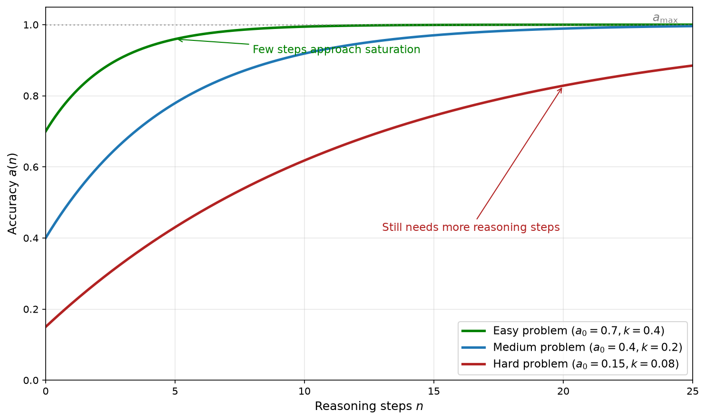
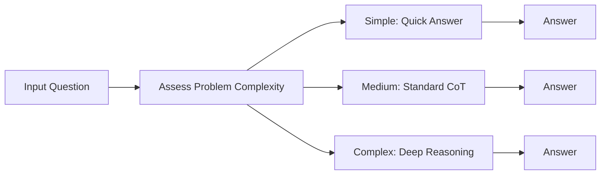
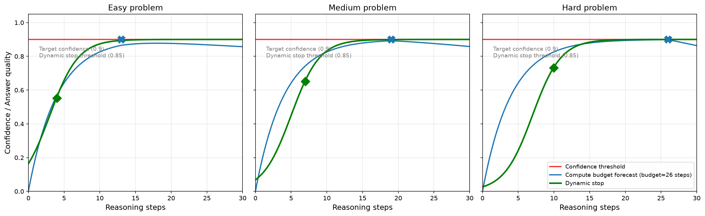
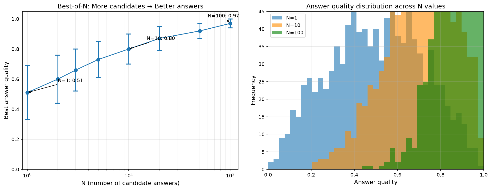
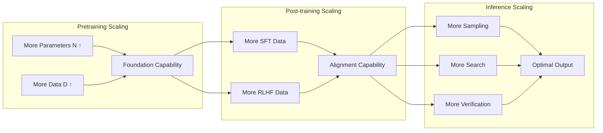

# Test-Time Compute Scaling

[Pretraining scaling laws](../pretraining/scaling-laws.md) have revealed that larger models and more data lead to stronger capabilities. In August 2024, Charlie Snell from UC Berkeley published a paper titled [Scaling LLM Test-Time Compute Optimally can be More Effective than Scaling Model Parameters](https://arxiv.org/abs/2408.03314), discovering that investing more computation at inference time -- whether by generating more candidate answers, searching more reasoning paths, or conducting deeper verification -- can also systematically improve model performance. A smaller model with sufficient inference computation can surpass a larger model that is 14 times bigger but has insufficient inference computation on certain tasks. This research quantitatively presents the relationship between computation invested at inference time and model performance, referred to as **Test-Time Compute Scaling**.

As early as 2022, a Google Research paper titled [Self-Consistency Improves Chain of Thought Reasoning in Language Models](https://arxiv.org/abs/2203.11171) discovered that generating multiple reasoning paths for the same problem and taking a majority vote can significantly improve accuracy, which was the prototype of the multi-sampling strategy for inference computation. In 2023, Shunyu Yao from Princeton University introduced search algorithms into the reasoning process in the paper [Tree of Thoughts: Deliberate Problem Solving with Large Language Models](https://arxiv.org/abs/2305.10601), allowing models to explore the reasoning space like playing chess, further expanding the ways inference computation can be utilized.

In September 2024, OpenAI released the o1 model, the first commercial model to adopt inference compute scaling as a core design principle. o1 automatically adjusts its thinking time based on problem difficulty -- simple questions get quick answers, while complex problems may require tens of seconds of thought. The o3 model, released three months later, went a step further, achieving 87.5% accuracy on the [ARC-AGI](https://arcprize.org/arc-agi) benchmark, very close to human level. The success of these models has announced that LLM capability improvement has entered a new phase, shifting from "pretraining is king" to "training and inference are equally important."

## Reasoning Decay Model

Pretraining scaling laws reveal the relationship between model scale and capability: when the parameter count increases by 10 times, the loss decreases by a fixed factor. But once training is complete, the model's capabilities are not necessarily fixed. Investing more computation at inference time can also improve model performance. [Chain of thought](chain-of-thought.md#chain-of-thought) is the best example of performance improvement at inference time -- on complex problems, chain of thought significantly improves model accuracy. Snell's research quantified this improvement, demonstrating a positive correlation between reasoning steps and accuracy, with the growth curve following the law of diminishing marginal returns. Let the number of reasoning steps be $n$, the baseline accuracy be $a_0$ (the accuracy when the model answers directly without any additional reasoning), the maximum achievable accuracy be $a_{\max}$, and the reasoning efficiency coefficient be $k$ (reflecting how much each reasoning step contributes to accuracy; larger $k$ means each step brings more significant improvement). Then the accuracy as a function of reasoning steps can be modeled as:

$$a(n) = a_0 + (a_{\max} - a_0) \cdot (1 - e^{-kn})$$

The core of the accuracy growth curve is $1 - e^{-kn}$, which indicates that the proportion of remaining improvement utilized tends to saturate as the number of steps increases. The exponential decay model shows that the accuracy improvement from reasoning steps is fast initially and then slows down -- the first few steps are most effective, and the contribution of subsequent steps gradually diminishes. This bears similarity to the "practice effect" in cognitive science. When humans learn a new skill, progress is fastest in the early stages, and as proficiency increases, the marginal benefit of continued practice becomes smaller. For language models, the first few reasoning steps help the model transform implicit knowledge into explicit reasoning, producing the most significant effect. Subsequent steps are more about confirmation and refinement, with increasingly limited improvement.



*Figure: Reasoning scaling curves under different problem difficulties*

As shown in the figure above, problems of different difficulty levels have different curve parameters. For simple problems, $a_0$ is higher and $k$ is larger, requiring only a few reasoning steps to reach saturation. For difficult problems, $a_0$ is lower and $k$ is smaller, requiring more reasoning steps to achieve substantial improvement. This means that the inference budget should be dynamically adjusted based on problem difficulty -- simple problems should be allocated fewer inference computation resources, while difficult problems should receive more.

## Inference Scaling vs. Pretraining Scaling

Inference computation can improve accuracy, but it is subject to diminishing marginal returns. So, when comparing increasing computation at inference time versus investing the same resources into pretraining to scale up the model, which strategy is more cost-effective? The answer is that inference scaling and pretraining scaling are not opposing or substitutable -- they are complementary. The complementarity is reflected in three aspects.

Pretraining determines the capability ceiling. The model's pretraining capability sets the upper bound for inference scaling. A 1B model, no matter how much computation is invested, would struggle to match the performance of a 100B model on complex reasoning tasks, because its "knowledge reserve" and "reasoning potential" are inherently limited. This is like someone who has only learned basic arithmetic -- no matter how much time they are given to think, they would struggle to solve calculus problems. Within the ceiling set by pretraining, the value of inference scaling lies in helping the model fully realize its existing potential. A powerful model that only answers directly is like a student who writes only the final answer without showing the work on an exam -- even if they have mastered the knowledge, they might answer incorrectly due to carelessness or insufficient reasoning budget. Inference scaling is like giving the model a scratch paper, allowing it to demonstrate its full capability under favorable conditions. As for whether resources should be invested more in pretraining or more in inference, the answer depends on the cost structure of the task. Pretraining is a one-time fixed cost -- train once, benefit long-term. Inference is a variable marginal cost -- you pay each time you use it. For high-frequency, low-value tasks (such as customer service conversations), investing more in pretraining and less in inference is more economical. For low-frequency, high-value tasks (such as mathematical proofs, code audits), investing more in inference may be more cost-effective.

Snell et al.'s 2024 experiments provided quantitative evidence for this complementarity. They compared the performance of models with different parameter counts under different amounts of inference computation and discovered a key equivalence: increasing inference computation by 4 times can, on certain tasks, compensate for a 14x gap in model parameter count. This means that, given sufficient inference budget, a smaller model with adequate inference computation can outperform a larger model with insufficient inference computation. Of course, this equivalence has boundaries -- when the gap in base model capability is too large, inference computation cannot compensate.

## Dynamic Inference Depth

The next question is: since inference computation can improve performance, how much inference computation should be invested? The answer is certainly not "the more the better." A reasonable answer should be to adjust dynamically based on problem difficulty. Different problems vary enormously in difficulty -- a question like "1+1=?" does not require deep reasoning, while "prove Fermat's Last Theorem" requires extensive thought. A mechanism that adaptively allocates inference computation resources based on problem complexity is called **Dynamic Inference Depth**.


*Figure: Dynamic Inference Depth*

There are three challenges to implementing dynamic inference depth: how to determine problem difficulty before reasoning (complexity assessment), how to allocate inference computation based on complexity (compute allocation), and when to stop reasoning and output the answer (termination condition). These three issues are interrelated and form the technical core of dynamic inference.

### Complexity Assessment

Assessing problem difficulty is the first step in dynamic inference depth. Only by accurately judging the complexity of a problem can reasonable compute allocation be made. There are currently three main categories of assessment methods:

- **Heuristic assessment based on problem features**: Roughly judging difficulty by surface features such as problem length, domain involved, and whether constraints are present. This is the most traditional and basic method, easy to implement but not precise enough. A short mathematical proof may be more difficult than a lengthy calculation problem -- the correlation between surface features and true difficulty is not strong. This approach is more suitable as a coarse-grained initial filter, providing basic difficulty classification when more refined assessment methods are unavailable.

- **Difficulty classification based on model accuracy**: Snell's research adopted a model-centric definition of difficulty: generate multiple candidate answers for the same problem and count the proportion of correct answers as the difficulty metric. The advantage of this definition is that difficulty is relative to a specific model rather than absolute. The same problem may be difficult for PaLM-2-S but easy for GPT-4, which is entirely consistent with the inference scaling laws we are discussing -- different models have different curve parameters, and difficulty perception should vary by model.

- **Difficulty prediction based on model internal signals**: In 2024, Rohin Manvi from Stanford University published a paper titled [Adaptive Inference-Time Compute: LLMs Can Predict if They Can Do Better, Even Mid-Generation](https://arxiv.org/abs/2410.02725), discovering that models can infer during the generation process whether regenerating would yield a better answer. The specific approach is to append a predefined self-evaluation prompt after the partially generated text, then generate one token whose probability value represents the assessment of the current answer quality. This method does not require an external reward model and has extremely low computational cost (requiring only one additional token generation), yet it allows the model to judge for itself whether it can do better. Manvi et al.'s experiments showed that using this self-assessment signal for adaptive sampling required only 1.2 samples on average to capture 74% of the performance improvement of 16-sample Best-of-N.

### Compute Allocation Strategy

Once the difficulty of a problem is known, the next step is to allocate inference computation resources based on difficulty. Depending on the applicable scenario, there are three main allocation strategies:

The simplest approach is **fixed budget allocation**. Divide problems into several difficulty levels, with each level assigned a fixed amount of computation -- simple problems get 1 sample, medium problems get 4, difficult problems get 16. This only requires a few if-else statements to implement, but different problems within the same difficulty level may require vastly different amounts of computation, and the fixed allocation either wastes resources or falls short.

A more refined strategy is Snell's **compute-optimal scaling**, which chooses entirely different reasoning approaches based on the difficulty characteristics of each problem. For simple problems where the model has a high pass rate, the initial answer is usually already close to correct, and sequential revision -- having the model review and fine-tune its own response -- is most efficient. For difficult problems where the model has a low pass rate, the initial answer is likely wrong, and the model needs to explore from multiple directions in parallel, generating multiple independent candidates and then selecting the best one using a scoring function -- [tree search](#tree-search) and [Best-of-N](#best-of-n-sampling) are designed precisely for this.

An even more practical and effective approach is **progressive allocation**. Start with a small amount of computation to generate an initial answer as a probe, evaluate the quality of the current answer based on this preliminary result, and gradually increase computation if it is not good enough. This strategy is similar to an exam tactic -- quickly skim the questions to gauge difficulty, then allocate time accordingly. It complements the dynamic stopping strategy for adaptive computation discussed later: progressive allocation determines when to increase computation, while dynamic stopping determines when to stop reasoning.

### Adaptive Computation

**Adaptive Computation** refers to the model flexibly adjusting the amount of inference computation during the reasoning process based on problem difficulty, rather than pre-setting a fixed number of reasoning steps. It is the technical framework for implementing dynamic inference depth. There are three main approaches to achieving adaptive computation, each addressing the question of when to stop reasoning from a different angle:

The most intuitive approach is the **confidence threshold**. The model evaluates its confidence in the current answer after each reasoning step. If the confidence is sufficiently high, output the answer; otherwise, continue reasoning. Setting the threshold is itself a trade-off decision: a higher threshold typically yields higher accuracy but longer inference time, while a lower threshold speeds up inference but may sacrifice accuracy. In practice, the threshold is usually adjusted dynamically based on task type and performance requirements rather than being held constant.

Another approach moves the decision ahead of time to before reasoning even begins: **compute budget prediction**. The model predicts the amount of computation required to complete the task before starting to reason, then allocates the corresponding compute budget all at once, much like a project manager estimating workload before a project starts. Its advantage lies in avoiding repeated judgments during the reasoning process about whether to continue. However, the difficulty is equally clear: the prediction itself may be inaccurate, and this is precisely the problem that [complexity assessment](#complexity-assessment) aims to solve. Assessments based on model pass rates or internal signals can directly provide input for budget prediction.

The most flexible approach is **dynamic stopping**. Rather than relying on a predetermined budget, the model dynamically decides whether to stop during the reasoning process in real time. Unlike confidence thresholds, dynamic stopping considers not only whether the quality of the current answer meets the standard, but also whether the expected benefit of continued reasoning justifies the additional computational cost. This requires a dedicated stopping judge that performs, essentially, a cost-benefit analysis at every moment, evaluating whether one more step of reasoning is likely to yield a better result.



*Figure: Behavioral comparison of three adaptive reasoning strategies on problems of different difficulty*

From the figure above, it is clear that the three strategies behave quite differently on problems of varying difficulty. For simple problems, all three strategies quickly reach high confidence with little difference. For complex problems, compute budget prediction may fail to reach the threshold due to insufficient budget, while the confidence threshold and dynamic stopping strategies will continue reasoning until conditions are met. The dynamic stopping strategy terminates early when confidence is already high enough and the expected benefit of continued reasoning is very small, making it more efficient than the confidence threshold strategy.

## Search Strategies

Chain of thought teaches the model to "think step by step," but this anthropomorphic description is somewhat misleading, because reasoning paths are usually not serial -- each step may have multiple choices. When facing a fork such as "compute A first or compute B first," the model usually can only pick one path and follow it to the end. If the choice turns out to be wrong, it has to rely on backtracking and error correction to recover. Backtracking is, after all, a passive strategy. A more proactive approach is to explore multiple paths simultaneously and then choose the best one. This is why search strategies are considered in model reasoning.

### Best-of-N Sampling

Best-of-N sampling is the simplest search strategy. Generate N candidate answers at once and select the best one. The academic foundation of this strategy can be traced back to Google's 2022 Self-Consistency research. They found that generating multiple reasoning paths for the same problem and taking a majority vote produced results that were more accurate than any single path. Best-of-N generalizes this idea -- majority voting is not required; any reliable scoring function can be used to select the best answer.

The average optimal quality of Best-of-N improves as N increases, but the growth follows diminishing marginal returns and gradually slows down. When N=1, the answer quality distribution is wide, with both good and bad outcomes possible. When N=100, the distribution is concentrated in the high-quality region, making it nearly impossible to select a poor answer, as shown in the figure below. The cost is that increasing N from 1 to 100 also increases the computational cost by 100 times. Whether this is worthwhile in real-world deployment depends on the value of the task.



*Figure: Quality improvement and distribution change of Best-of-N sampling*

The prerequisite for Best-of-N to be effective is the existence of a reliable scoring function. For math problems, the correctness of the answer can be verified. For code, test cases can be run. But for open-ended problems (such as writing, creative generation), scoring functions are difficult to define, and Best-of-N's effectiveness is greatly diminished. Additionally, Best-of-N is a parallel exploration strategy -- the N candidate answers have no interaction with each other, and each answer is generated independently. When there are strong dependencies between reasoning steps, this independent exploration approach is quite limited.

### Tree Search

Best-of-N cannot handle scenarios where there are dependencies between steps in complex reasoning tasks (e.g., the choice of one step affects the direction of subsequent steps). Take mathematical proof as an example: choosing factorization or the quadratic formula as the first step completely determines the direction of subsequent reasoning. In such cases, tree search strategies are needed to systematically explore different paths in the reasoning space. Commonly used tree search methods include [Beam Search](../../deep-learning/sequence-models/seq2seq.md#beam-search) and [Monte Carlo Tree Search](../../appendixes/numpy/probability-numpy.md#monte-carlo-method) (MCTS).

- **Beam Search** is a breadth-first search with limited width. At each step, keep the K highest-scoring candidates (Beam Width = K) and continue expanding from these candidates. It is a greedy strategy that only retains the K best paths at each step, pruning all others. Beam Search's advantage lies in computational efficiency -- only K paths are expanded at each step, keeping computation manageable. But its drawback is equally clear: greedy pruning may miss the globally optimal solution. If a path has low scores in the early steps but improves significantly later, beam search will prune it early.

- **Monte Carlo Tree Search** is a more complex search strategy that combines exploration and exploitation. It first gained prominence in the Go AI AlphaGo, and in 2023, Shunyu Yao introduced this idea into LLM reasoning in the paper [Tree of Thoughts](https://arxiv.org/abs/2305.10601), proposing a tree search + language model reasoning framework. MCTS uses the Upper Confidence Bound (UCB) to balance two strategies: "select nodes with high historical scores" and "select nodes with few visits." The sum of these two ensures that the search does not get trapped in local optima. The UCB formula is:

    $$UCB(i) = \bar{V}_i + c\sqrt{\frac{\ln N}{n_i}}$$

    Where $\bar{V}_i$ is the historical average score of node $i$, $n_i$ is the number of visits to node $i$, $N$ is the number of visits to the parent node, and $c$ is a constant controlling the exploration intensity. The first term $\bar{V}_i$ represents the historical average value of the node, and the second term $\sqrt{\frac{\ln N}{n_i}}$ represents the weight for selecting nodes with few visits (because fewer visits means greater uncertainty and more potential). The execution flow of MCTS is a four-step loop:

    1. **Selection**: Starting from the root node, select the most promising child node based on the UCB formula.
    2. **Expansion**: Generate new reasoning steps on the selected node, creating child nodes.
    3. **Simulation**: Starting from the new node, quickly complete reasoning to the endpoint and evaluate the quality of this path.
    4. **Backpropagation**: Propagate the simulation result backward, updating the value estimates of all nodes along the path.

    ```mermaid compact
    graph LR
        S1["<b>Selection</b><br/>UCB Balances<br/>Exploration & Exploitation"] --> S2["<b>Expansion</b><br/>Generate New<br/>Reasoning Steps"]
        S2 --> S3["<b>Simulation</b><br/>Fast Rollout to<br/>Endpoint Evaluation"]
        S3 --> S4["<b>Backpropagation</b><br/>Update Node<br/>Values Along Path"]
        S4 --> S1
    ```
    *Figure: MCTS execution flow*

    The fundamental difference between Monte Carlo Tree Search and Beam Search lies in their exploration mechanisms. Beam Search is purely greedy, considering only current scores and ignoring what might lie in unexplored regions. MCTS, through the UCB formula, actively explores paths that may not seem promising but have not been fully evaluated, avoiding local optima. This is like an experienced chess player who knows the most likely moves but also spends some time trying less common variations, because unexpected gains can sometimes emerge.

## Verification and Self-Correction

Search strategies allow the model to explore multiple reasoning paths, but ultimately the best one must be selected from among them. Best-of-N uses a scoring function to select the best answer, and MCTS uses simulation results to evaluate path quality. The mechanisms for judging whether reasoning is correct are collectively referred to as **verification**. Verification occurs not only during the search process but also after reasoning is complete -- the model needs to review its own reasoning process, discover and correct errors.

In 2022, Google Research proposed a simple yet effective verification method in the paper [Self-Consistency Improves Chain of Thought Reasoning in Language Models](https://arxiv.org/abs/2203.11171): generate multiple reasoning paths for the same problem and take the majority vote as the final answer. The premise of self-consistency is that correct reasoning paths are more likely to reach a consensus. If 7 out of 10 reasoning paths arrive at the same answer, this answer is likely correct, because different reasoning paths have independently reached the same conclusion. Conversely, if 10 paths give 10 different answers, it indicates that the model does not have stable reasoning ability for this problem, and any answer is unreliable.

Self-consistency is essentially a special case of Best-of-N sampling, where the scoring function is not an external reward model but answer consistency. Its advantage is that it does not require an additional scoring model -- it relies entirely on the model's own reasoning ability. The disadvantage is its relatively high computational cost, requiring the generation of multiple complete reasoning paths, and it is only applicable to tasks where answers can be precisely matched (such as math problems), with limited effectiveness for open-ended generation tasks (such as creative writing).

When the model's understanding of a concept is inherently biased, all reasoning paths may arrive at the same wrong answer, and majority voting cannot solve the problem. In such cases, an external verifier is needed to provide independent judgment. In the [previous chapter](chain-of-thought.md), we already encountered two types of external verifiers. The Outcome Reward Model (ORM) only looks at whether the final answer is correct, providing a binary reward (0 or 1). The Process Reward Model (PRM) scores each reasoning step, providing a continuous reward value. At inference time, these two verifiers have different application scenarios:

- ORM is typically used for Best-of-N selection: generate N candidate answers, use ORM to score the correctness of each answer, and select the one with the highest score. This approach is simple and direct, but it can only distinguish between correct and incorrect answers, without evaluating the quality of the reasoning process. An answer reached through entirely wrong reasoning but correct by coincidence would still receive full marks.

- PRM is typically used for finer-grained search guidance: during the simulation and backpropagation phases of MCTS, PRM scores each reasoning step, providing a more precise value estimate than ORM. The total PRM score of a reasoning path is the product of all step scores -- any single error lowers the total score, even if the final answer happens to be correct. This makes the search process favor paths with solid reasoning processes rather than lucky paths.

The limitation of external verifiers lies in their dependence on additional models or labeled data. In contrast, the self-verification ability that emerges in reasoning models during reinforcement learning training does not require any external assistance. The model checks its own reasoning process, discovers contradictions, and actively corrects them. Self-verification can be understood as an internal scoring function. During the reasoning process, the model plays two roles simultaneously: "problem solver" and "checker." It is responsible for both generating reasoning steps and examining whether the generated steps are reasonable. When the checker finds a problem, the solver backtracks to the point of error and tries a different reasoning direction. This "solve -- check -- correct" cycle is highly similar to the process humans use when solving problems on scratch paper.

However, self-verification cannot replace external verifiers. The model may "verify" a reasoning process that is actually incorrect, because the checker and the solver share the same flawed knowledge, compounding errors. This is why external verifiers (such as PRM) remain indispensable in critical scenarios -- they provide an independent pair of eyes that are not influenced by the model's own biases.

## A Unified View of Three Scaling Laws

At this point, we have fully discussed three approaches to improving LLM capabilities: [pretraining scaling](../pretraining/scaling-laws.md), [post-training scaling](../pretraining/scaling-laws.md#post-training-scaling-laws), and test-time scaling. Together, they are known as the three scaling laws of LLMs, forming a complete framework for LLM capability enhancement, each playing a role at different stages. The relationship among the three scaling laws can be summarized in one formula:

$$\text{Model Final Capability} = f(\underbrace{N, D}_{\text{Pretraining}}, \underbrace{D_{\text{SFT}}, D_{\text{RLHF}}}_{\text{Post-training}}, \underbrace{C_{\text{TEST}}}_{\text{Inference}})$$

The final capability of a model is jointly determined by the investment across three stages. A shortfall in any one stage constrains the overall performance. The above formula includes all the factors affecting model performance:

- $N$ is the number of model parameters, and $D$ is the amount of pretraining data. Together, they determine the model's foundational capability -- how much the model can know and how deeply it can understand.
- $D_{\text{SFT}}$ is the quantity and quality of SFT data, and $D_{\text{RLHF}}$ is the quantity and quality of RLHF preference data. Together, they determine how well the model's foundational capability is aligned for human use -- whether the model can follow instructions and meet human preferences.
- $C_{\text{TEST}}$ is the computational investment at inference time (number of samples, search depth, verification rounds), determining the probability that the model produces the optimal output within its available capability range -- whether the model can fully realize its potential.


*Figure: Three scaling laws*

There are synergistic effects among the three scaling laws (investment in one stage amplifies the benefits of others), as well as cost trade-offs. The synergistic effects are reflected in the following: the stronger the pretraining capability, the higher the ceiling for inference scaling; the better the post-training alignment, the more efficient the inference search (the model is more inclined to generate useful reasoning paths rather than off-topic speculation); the more abundant the inference computation, the more fully the value of pretraining and post-training investment can be realized. Cost trade-offs are reflected in three aspects:

The first layer of cost trade-off is the difference in the nature of investment. Pretraining is a one-time fixed cost -- train once, benefit long-term. Inference, by contrast, is a variable marginal cost paid each time the model is used. For a model serving millions of users, investing more in pretraining to amortize the cost across many calls is more economical. For a model used only in a small number of high-value scenarios, investing more in inference may be the wiser choice.

The second layer is the trade-off in capability coverage. Pretraining improves general capability -- knowledge breadth, language understanding, commonsense reasoning, and so on -- enabling the model to perform reasonably well across a wide range of tasks. Inference computation, on the other hand, improves deep performance on specific tasks. If what is needed is a well-rounded generalist, pretraining investment takes priority. If extreme performance is only required on a particular task, the leverage effect of inference investment is more pronounced.

The third and most quantitative layer is the intersection of marginal returns. Snell et al.'s experiments provide a concrete reference point: increasing inference computation by 4 times can, on certain tasks, compensate for a 14x gap in parameter count. When the inference budget is sufficient and the task boundaries are clearly defined, "small model + strong inference" may be more economical than "large model + weak inference." This is not a vague intuition but an equivalence backed by experimental data.

The three scaling laws also provide clear guidance for LLM development. During the model development phase, first determine the pretraining scale based on budget, following the [Chinchilla optimal ratio](../pretraining/scaling-laws.md#chinchilla-scaling-laws) (parameters and data grow synchronously); then invest in high-quality alignment data to transform foundational capability into usable capability; finally, design the inference strategy to dynamically adjust inference computation based on task characteristics during deployment. During the application deployment phase, for high-frequency, low-value tasks (such as customer service conversations, simple Q&A), use a small model with fast inference to control costs. For low-frequency, high-value tasks (such as mathematical proofs, code audits), use a large model with deep inference to pursue quality. For medium-frequency tasks, find a balance between model scale and inference depth based on task characteristics.

## Summary

The significance of test-time compute scaling does not lie in the intuition that "computing a few more times gets the right answer," but in redefining the boundaries of model capability. Before this, once a model was trained, its capabilities were fixed -- what it could and could not do was determined before inference even began. Inference scaling breaks this limitation, transforming model capability from a static number into a range that dynamically improves with computational investment. The lower bound of this range is the model's accuracy when answering directly, and the upper bound is the best performance supported by the knowledge reserve endowed by pretraining. The role of inference computation is to move the model from the lower bound toward the upper bound.

This shift from fixed capability to elastic capability brings two substantive changes. First, at the economic level, when inference computation can substitute for some parameter scale, we no longer need to blindly pursue larger models. Instead, we can choose between "large model with weak inference" and "small model with strong inference" based on task characteristics. Use a small model for fast response in high-frequency, low-value scenarios, and a medium model for deep reasoning in low-frequency, high-value scenarios. This tiered strategy is more reasonable than a one-size-fits-all approach using the largest model. Second, at the technical level, dynamic inference depth allows the model to act within its means -- not wasting computation on simple problems and not giving up easily on complex problems. This is closer to the way humans actually solve problems compared to fixed-depth reasoning.

But inference scaling also has boundaries it cannot cross. It can only approach the upper bound set by pretraining, not exceed it. A model that has never studied calculus cannot prove the Fundamental Theorem of Calculus no matter how much inference time it is given. Inference computation buys realization, not transcendence. This is precisely why the three scaling laws form a complete system: pretraining determines the ceiling, post-training makes capabilities usable, and inference scaling realizes the potential. Without any one of the three, the model's performance will be compromised. Understanding this, we will not treat inference scaling as a panacea, nor will we slack off on pretraining and hope inference will compensate. Instead, we will make reasonable resource allocations across the three stages based on the actual scenario.

## Exercises

1. In the inference scaling law formula $a(n) = a_0 + (a_{\max} - a_0) \cdot (1 - e^{-kn})$, what is the physical meaning of $k$? If two models have different $k$ values ($k_1 = 0.1$, $k_2 = 0.3$), which model benefits more from additional reasoning steps? Why?

   <details>
   <summary>Reference Answer</summary>

   $k$ is the reasoning efficiency coefficient, reflecting how much each reasoning step contributes to accuracy. The larger $k$ is, the more significant the improvement from each step, and the faster the accuracy curve saturates.

   The model with $k_2 = 0.3$ benefits more from additional reasoning steps. Plugging into the formula: for $k = 0.1$, the improvement ratio at step 5 is $(1 - e^{-0.1 \times 5}) - (1 - e^{-0.1 \times 4}) \approx 0.39 - 0.33 = 0.06$; for $k = 0.3$, the improvement ratio at step 5 is $(1 - e^{-0.3 \times 5}) - (1 - e^{-0.3 \times 4}) \approx 0.78 - 0.70 = 0.08$. The model with larger $k$ is more "efficient" per reasoning step, but also saturates faster, achieving larger gains in the first few steps.

   </details>

2. Compare the applicability of Best-of-N and MCTS on the following three tasks, and explain the reasons:
   - Mathematical reasoning (with verifiable answers)
   - Code generation (with test cases)
   - Open-ended writing (no clear scoring criteria)

   <details>
   <summary>Reference Answer</summary>

   **Mathematical reasoning**: Both Best-of-N and MCTS are applicable. Best-of-N can select the optimal solution through answer verification; MCTS can search at the reasoning step level for the optimal path. For simple problems, Best-of-N is more economical; for complex problems requiring multi-step reasoning, MCTS is more effective because there are strong dependencies between steps.

   **Code generation**: Best-of-N is more suitable. Code has test cases as a natural scoring function that can precisely verify each candidate answer. MCTS can also be used, but code reasoning steps have strong dependencies and are difficult to evaluate independently, making MCTS's step-level search advantage difficult to realize.

   **Open-ended writing**: Both have limited effectiveness. Open-ended writing lacks a reliable scoring function -- there is no "correct answer" to verify and no test cases to run. Best-of-N's scoring function would have to rely on human preference models or LLM-as-judge, whose reliability is questionable. MCTS's problem is even more pronounced: the "quality" of reasoning steps is difficult to quantify, and the value assessment of the search tree is unreliable. For such tasks, longer chain-of-thought rather than search strategies may be more appropriate.

   </details>

3. Analyze which type of scaling (pretraining / post-training / inference) should be prioritized in the following scenarios, and explain the reasoning:

   - Scenario A: A math tutoring assistant for students, needing to accurately solve math problems from elementary to high school level.
   - Scenario B: A social media chatbot that needs to engage in natural and fluid conversations with users.
   - Scenario C: A code security audit tool that needs to precisely identify security vulnerabilities in code.

   <details>
   <summary>Reference Answer</summary>

   **Scenario A**: Inference first. Math problems have clearly verifiable correct answers, and increasing inference computation (multi-path search, self-verification) can effectively improve accuracy. A medium-sized model with sufficient inference computation may be more economical than a large model with insufficient inference computation. Additionally, reasoning strategies for math tasks (verification, cross-validation with multiple methods) are easy to internalize, and the benefits of reasoning reinforcement learning are significant.

   **Scenario B**: Post-training first. There is no clear scoring criteria for the "quality" of conversation, and inference search struggles to provide effective guidance. More importantly, conversation needs to be natural and fluent, aligned with human preferences, which is precisely the strength of RLHF alignment training. Pretraining and post-training ensure the model can understand and generate natural conversation. The inference phase does not need and should not invest too much computation -- users expect quick responses rather than lengthy thinking.

   **Scenario C**: Pretraining + inference equally important. Code security audit requires deep code understanding (relying on code knowledge from pretraining) and precise reasoning to trace data flow and identify vulnerability patterns (relying on inference computation). Post-training alignment also has value -- ensuring the model outputs structured audit reports rather than casual comments. However, since the accuracy of vulnerability detection is critical (the cost of false negatives is extremely high), multi-path search and cross-validation during the inference phase are particularly crucial.

   </details>

4. Suppose you have the following resource constraints: a pretraining budget of 1 million GPU hours, 100,000 alignment data samples, and an inference budget of 10 seconds of GPU time per problem. Design a resource allocation plan for an LLM application, explaining how you would allocate resources across these three stages and why.

   <details>
   <summary>Reference Answer</summary>

   The resource allocation plan depends on the application scenario. The following takes a "mathematical reasoning assistant" as an example:

   **Pretraining phase**: Follow the Chinchilla optimal ratio, using 1 million GPU hours to train a medium-sized model (approximately 30B parameters, with 600B tokens of training data). Choose a medium scale rather than a larger model because, with sufficient inference budget, a small model with strong inference can outperform a large model on specific tasks.

   **Post-training phase**: Allocate 60,000 of the 100,000 data samples for SFT (demonstrations of mathematical reasoning processes) and 40,000 for RLHF (preference comparisons of reasoning quality). The SFT data focuses on demonstrating multi-step reasoning formats and self-verification habits. The RLHF data emphasizes the preference that "answers with solid reasoning processes are better than answers with correct results but flawed reasoning," guiding the model to value process quality.

   **Inference phase**: A 10-second GPU time inference budget is quite generous. Deployment strategy: use confidence thresholds to quickly handle simple problems (1-2 seconds), leaving the remaining time for complex problems. For complex problems, use Best-of-4 sampling with PRM scoring to select the optimal answer, triggering multi-path exploration and cross-validation when necessary.

   **Core trade-off**: Pretraining investment ensures the capability foundation, post-training investment ensures the standardization of reasoning format, and inference investment ensures the full realization of potential. The characteristic of this plan is inference-first, trusting that a medium-sized model with sufficient inference computation and carefully designed strategies can achieve cost-effective performance on specific tasks.

   </details>
