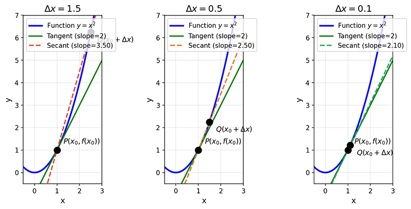

# Limits, Derivatives, and Differentials

If linear algebra is the "data language" of machine learning, telling computers how to represent and organize data, then calculus is the "optimization behavior" of machine learning, telling computers how to learn and improve from data. From gradient descent in deep learning to motion simulation in physics engines, calculus is ubiquitous in modern computing technology and serves as a key bridge connecting traditional software development with artificial intelligence.

## From Practical Problems to Mathematical Theory

The birth of calculus is one of the most exciting chapters in the history of mathematics. In the 17th century, the wave of the Scientific Revolution swept across Europe. The development of physics and astronomy raised numerous questions about motion and change: How do planets move around the sun? What trajectory does a cannonball follow? How do we define the instantaneous velocity of a moving object at a given moment? These questions troubled the greatest scientists of the time, because traditional mathematical tools could only handle "static" quantities and could not precisely describe "dynamic" changes.

In the 1660s, the English scientist Isaac Newton, while studying the motion of objects and planetary orbits, developed a mathematical method called the Method of Fluxions. Using this method, he successfully calculated instantaneous velocities of non-uniform motion, the slopes of tangent lines to curves, and the curvature of planetary orbits. Almost simultaneously, the German mathematician Gottfried Leibniz, while studying tangent lines and area problems for curves, independently developed a similar system of notation and methods.

The contribution of Newton and Leibniz lies in their unification of two seemingly unrelated types of problems -- finding tangents (differential problems) and finding areas (integral problems) -- under a single framework, and discovering the inverse relationship between them. This is the famous [Fundamental Theorem of Calculus](gradient.md#fundamental-theorem-of-calculus). This theorem reveals that differentiation and integration are inverse operations, much like the relationship between multiplication and division, or exponentiation and logarithms.

Although calculus was quickly applied to physics, astronomy, engineering, and other fields with great success after its birth, its theoretical foundation had long-standing gaps. The expositions of Newton and Leibniz were filled with the concept of infinitesimals -- quantities that are not zero yet close to zero. This concept was logically self-contradictory: if it is not zero, it can be further divided; if it is zero, it cannot serve as a denominator. This ambiguity drew sharp criticism. In 1734, *The Analyst* satirized that such reasoning was "neither correct mathematics nor reliable logic."

The rigorous formalization of calculus took nearly two hundred years of effort. In the early 19th century, the French mathematician Augustin-Louis Cauchy gave a rigorous definition of limits, placing calculus on the foundation of limits rather than vague infinitesimals. In the late 19th century, the German mathematician Karl Weierstrass further refined the definition of limits using the $\varepsilon-\delta$ language, ultimately placing calculus on a solid logical foundation. Interestingly, in the 1960s, the American mathematician Abraham Robinson, through Non-standard Analysis, re-endowed infinitesimals with rigorous mathematical meaning -- but that is another story.

## Calculus in Machine Learning

For software developers accustomed to object-oriented programming, design patterns, and microservice architectures, calculus may seem like a somewhat "out-of-place" abstract discipline. After all, in most software development work, we are more accustomed to discrete ways of thinking: data is discrete (integers, strings, booleans), operations are discrete (assignment, conditionals, loops), and state spaces are discrete (finite or countably infinite sets of states). This reflects the nature of computers -- a Turing Machine is a discrete state machine, and digital computers represent everything with finite bits. However, when software development enters the field of machine learning and artificial intelligence, the situation is entirely different. A key problem in machine learning is [optimization](../../ai-infra-engineering/mlops/hyperparameter-optimization.md) -- finding optimal model parameters from vast amounts of data. This problem is continuous: the parameter space is continuous (the real numbers), the loss function is a continuous function, and the optimization process involves finding extrema in a continuous space. In this context, writing machine learning code requires the language of calculus to describe and solve problems. The core concept of calculus is the rate of change. The derivative captures how sensitively one quantity changes with respect to another -- when the input changes by a tiny amount, how much does the output change? This concept is ubiquitous in machine learning:

- The derivative of the loss function with respect to a parameter tells us: if we increase the parameter slightly, will the loss increase or decrease? By how much? This guides how we adjust parameters.
- The derivative of the activation function determines how gradients flow during backpropagation, affecting the training effectiveness of the network.
- The learning rate is essentially a step-size parameter that controls the magnitude of each parameter update -- too large and we may overshoot the optimum, too small and convergence is too slow.
- ...

Understanding these concepts not only helps us correctly use machine learning frameworks (such as PyTorch, TensorFlow) but also enables us to diagnose training problems, design better model architectures, and choose appropriate optimization strategies.

## Rigorous Definition of Limits and Continuity

Before formally approaching derivatives, let us first understand the concept of **limits** through the intuitive approach used in high school curricula. Limits are the prelude to calculus theory, describing the trend of a function's value as the independent variable approaches some value. Consider the simple function $f(x) = \frac{x^2 - 1}{x - 1}$. When $x = 1$, the denominator is zero and the function value is undefined. However, if we observe how the function values change as $x$ approaches 1:

| $x$ | $f(x)$ |
|-----|--------|
| 0.9 | 1.9 |
| 0.99 | 1.99 |
| 0.999 | 1.999 |
| 1.001 | 2.001 |
| 1.01 | 2.01 |
| 1.1 | 2.1 |

We can see that as $x$ approaches 1 from both sides, $f(x)$ approaches 2. This is the intuitive meaning of a limit: as $x$ gets arbitrarily close to some value $a$, the function value $f(x)$ gets arbitrarily close to some value $L$, denoted as $\lim_{x \to a} f(x) = L$. Note that the limit concerns the process of $x$ "approaching" $a$, not the function value when $x$ equals $a$. In the example above, $f(1)$ does not even exist, but $\lim_{x \to 1} f(x) = 2$ is fully determined.

While the intuitive understanding of limits in high school curricula helps build conceptual understanding, mathematics requires rigor. In the 19th century, the German mathematician Karl Weierstrass gave the rigorous definition of limits: Let a function $f$ be defined on some punctured [neighborhood](https://en.wikipedia.org/wiki/Neighbourhood_(mathematics)) of a point $a$ (a neighborhood that does not include the point $a$ itself). If there exists a constant $L$ such that for any arbitrarily small positive number $\varepsilon$, there exists a positive number $\delta$ such that whenever $0 < |x - a| < \delta$, we have $|f(x) - L| < \varepsilon$, then $L$ is called the limit of the function $f(x)$ as $x \to a$. This is what is now called the $\varepsilon-\delta$ language, which uses two inequalities to precisely characterize what "arbitrarily close" means mathematically:
- $|x - a| < \delta$ means the distance between $x$ and $a$ is less than $\delta$ ($x$ is sufficiently close to $a$)
- $|f(x) - L| < \varepsilon$ means the distance between $f(x)$ and $L$ is less than $\varepsilon$ ($f(x)$ is sufficiently close to $L$)

The picture described by the $\varepsilon-\delta$ language is: no matter how close you want $f(x)$ to be to $L$ (given $\varepsilon$), I can find a range where $x$ is sufficiently close to $a$ (determine $\delta$) such that within this range $f(x)$ achieves the desired closeness. For readers not specializing in mathematics, understanding the logical structure depicted by $\varepsilon-\delta$ is more important than memorizing specific proofs. In practical applications, we mainly rely on intuitive understanding of limits and operational rules to solve problems.

Yes, limits also have operational rules. These rules tell us that limit operations can "penetrate" addition, subtraction, multiplication, and division -- we can take the limit of each part separately and then perform the corresponding operation. Let $\lim_{x \to a} f(x) = A$, $\lim_{x \to a} g(x) = B$, then the following operational rules hold:

- **Addition**: $\lim_{x \to a} [f(x) + g(x)] = A + B$
- **Subtraction**: $\lim_{x \to a} [f(x) - g(x)] = A - B$
- **Multiplication**: $\lim_{x \to a} [f(x) \cdot g(x)] = A \cdot B$
- **Division**: $\lim_{x \to a} \frac{f(x)}{g(x)} = \frac{A}{B}$ (when $B \neq 0$)

Intuitively, "continuity" means the graph of a function can be drawn without lifting the pen. But only after rigorously clarifying limits can we precisely define **continuity**. Continuity is a mathematical concept describing that a function has "no breaks." Its mathematical definition states that a function $f$ is continuous at point $a$ if and only if the following three conditions are satisfied:

1. $f(a)$ is defined
2. $\lim_{x \to a} f(x)$ exists
3. $\lim_{x \to a} f(x) = f(a)$

The third condition unifies the limit value with the function value: "the limit equals the function value" is precisely what "continuity" truly means. Continuous functions have many useful properties. For example, the [Intermediate Value Theorem](https://en.wikipedia.org/wiki/Intermediate_value_theorem) tells us: if a continuous function $f$ takes values $f(a)$ and $f(b)$ on the interval $[a, b]$, then for any value $c$ between $f(a)$ and $f(b)$, there exists $x \in (a, b)$ such that $f(x) = c$. This theorem is often used in numerical computation for finding roots of equations (such as the bisection method).

## Definition and Geometric Meaning of Derivatives

We begin with the physical problem that Newton considered to introduce derivatives. Suppose an object moves along a straight line, and its position $s$ is a function of time $t$, $s = s(t)$. Over the time interval $[t_0, t_0 + \Delta t]$, the distance traveled by the object is $s(t_0 + \Delta t) - s(t_0)$. The average velocity can then be expressed as:

$$\bar{v} = \frac{s(t_0 + \Delta t) - s(t_0)}{\Delta t}$$

This is the concept of the **average rate of change**: the change in the function value divided by the change in the independent variable. But how should we define the **instantaneous velocity** of the object at a specific instant $t_0$? Intuitively, if we let the time interval $\Delta t$ become smaller and smaller, the average velocity gets closer and closer to the instantaneous velocity. As $\Delta t$ approaches zero, the limit of the average velocity is the instantaneous velocity:

$$v(t_0) = \lim_{\Delta t \to 0} \frac{s(t_0 + \Delta t) - s(t_0)}{\Delta t}$$

More generally, suppose a function $y = f(x)$ is defined on some neighborhood of a point $x_0$. If the limit $\lim_{\Delta x \to 0} \frac{f(x_0 + \Delta x) - f(x_0)}{\Delta x}$ exists, then the function $f$ is said to be **differentiable** at $x_0$, and this limit value is called the **derivative** of $f$ at $x_0$, denoted by $f'(x_0)$ or $\frac{df}{dx}\bigg|_{x=x_0}$ (the former is Lagrange's notation, the latter is Leibniz's notation; both are still widely used today). The fraction $\frac{f(x_0 + \Delta x) - f(x_0)}{\Delta x}$ in this definition is called the **difference quotient**, representing the average rate of change of the function over the interval $[x_0, x_0 + \Delta x]$. The derivative is the limit of the difference quotient as $\Delta x \to 0$, i.e., the **instantaneous rate of change**. Another equivalent definition of the derivative is:

$$f'(x_0) = \lim_{x \to x_0} \frac{f(x) - f(x_0)}{x - x_0}$$

These two definitions are equivalent; simply let $x = x_0 + \Delta x$ to convert between them.

The derivative has a very intuitive geometric meaning: the slope of the tangent line. Consider the graph of the function $y = f(x)$. At the point $(x_0, f(x_0))$, draw a [tangent line](https://en.wikipedia.org/wiki/Tangent_(geometry)). The slope of this tangent line is $f'(x_0)$. First, consider a [secant line](https://en.wikipedia.org/wiki/Secant_line) passing through the two points $(x_0, f(x_0))$ and $(x_0 + \Delta x, f(x_0 + \Delta x))$. The slope of the secant line is:

$$\text{Secant slope} = \frac{f(x_0 + \Delta x) - f(x_0)}{\Delta x}$$

This is exactly the difference quotient. As $\Delta x \to 0$, the point $(x_0 + \Delta x, f(x_0 + \Delta x))$ approaches $(x_0, f(x_0))$ along the curve. Observe the figure below: as the two points through which the secant passes gradually get closer, the secant approaches the tangent, eventually coinciding with it. Therefore, the derivative $f'(x_0)$ is the slope of the tangent line.

*Figure: The process of a secant line gradually approaching a tangent line*

## Derivatives of Common Functions

Mastering the derivative formulas of basic functions is the foundation of differential calculus. Just as learning arithmetic requires memorizing the multiplication table first, being proficient in basic formulas greatly simplifies the differentiation process. This section introduces the derivative formulas for power functions, exponential functions, logarithmic functions, and trigonometric functions, as well as the rules for differentiating sums, differences, products, and quotients of functions. These formulas, combined with the operational rules, enable us to handle differentiation problems for most common functions. It is particularly noteworthy that these formulas appear frequently in machine learning. For instance, the property that the derivative of $e^x$ equals itself makes it central to probability distributions (such as Softmax), while the derivative of $\ln x$ is indispensable in maximum likelihood estimation.

- **Power Functions**

    For the power function $f(x) = x^n$ (where $n$ is a positive integer), its derivative is: $\frac{d}{dx} x^n = nx^{n-1}$. This formula can be generalized to any real number $n$, for example:
    - $f(x) = x^{1/2} = \sqrt{x}$, then $f'(x) = \frac{1}{2}x^{-1/2} = \frac{1}{2\sqrt{x}}$
    - $f(x) = x^{-1} = \frac{1}{x}$, then $f'(x) = -x^{-2} = -\frac{1}{x^2}$

- **Exponential and Logarithmic Functions**

    For the natural exponential function $f(x) = e^x$: $\frac{d}{dx} e^x = e^x$. This is a very special property: the derivative of $e^x$ is itself. This property gives $e^x$ a central role in differential equations, probability theory, and other fields.
    
    For the general exponential function $f(x) = a^x$ (where $a > 0, a \neq 1$): $\frac{d}{dx} a^x = a^x \ln a$

    For the natural logarithmic function $f(x) = \ln x$: $\frac{d}{dx} \ln x = \frac{1}{x}$

    For the general logarithmic function $f(x) = \log_a x$ (where $a > 0, a \neq 1$): $\frac{d}{dx} \log_a x = \frac{1}{x \ln a}$

- **Trigonometric Functions**

    Derivatives of basic trigonometric functions:

    | Function | Derivative |
    |------|------|
    | $\sin x$ | $\cos x$ |
    | $\cos x$ | $-\sin x$ |
    | $\tan x$ | $\sec^2 x = \frac{1}{\cos^2 x}$ |

    Note that the derivatives of sine and cosine form a cycle: $(\sin x)' = \cos x$, $(\cos x)' = -\sin x$, and differentiating twice more returns to $\sin x$. This property is very useful when solving differential equations.

Similar to the operational rules for limits, there are corresponding derivative rules for addition, subtraction, multiplication, and division of functions:

- **Sum Rule**: $(f + g)' = f' + g'$

- **Difference Rule**: $(f - g)' = f' - g'$

- **Product Rule**: $(f \cdot g)' = f' \cdot g + f \cdot g'$

- **Quotient Rule**: $\left(\frac{f}{g}\right)' = \frac{f' \cdot g - f \cdot g'}{g^2}$

## Differentials and Linear Approximation

A **differential** can be understood as another way of expressing the derivative. Suppose a function $y = f(x)$ is differentiable at a point $x$. Then $dy = f'(x) dx$ is called the differential of the function $y = f(x)$ at $x$. Here, $dx$ is the increment of the independent variable (an independent quantity), and $dy$ is the differential of the dependent variable. The difference between the differential and the derivative is that the derivative is a ratio $\frac{dy}{dx}$, while the differential $dy$ and $dx$ are independent quantities. If the derivative of a function at $x$ is 12, then its differential at $x$ is $dy = 12 \, dx$, meaning that if the independent variable has a small increment $dx$, the increment in the function value is approximately 12 times $dx$.

An important application of differentials is **linear approximation**, which aims to transform complex function calculations into relatively simple differential calculations. When $|\Delta x|$ is small, the function increment $\Delta y = f(x + \Delta x) - f(x)$ can be approximated by the differential $dy = f'(x) \Delta x$:

$$f(x + \Delta x) \approx f(x) + f'(x) \Delta x$$

Geometrically, this formula means: near the point $(x, f(x))$, we use the tangent line (a straight line) to approximate the curve. Linear approximation is very useful in engineering calculations. For example, to compute $\sqrt{4.01}$, let $f(x) = \sqrt{x}$, take $x = 4$, $\Delta x = 0.01$, then:

$$\sqrt{4.01} \approx \sqrt{4} + \frac{1}{2\sqrt{4}} \times 0.01 = 2 + \frac{1}{4} \times 0.01 = 2.0025$$

This result differs from the exact value $\sqrt{4.01} \approx 2.002498$ by only about $2 \times 10^{-6}$. The geometric significance of linear approximation is that on a tiny scale, we can use a straight line segment to approximately represent curves of various shapes -- as long as the scale is small enough, the two are approximately equal in length.

## Higher-Order Derivatives

If the derivative $f'$ of a function $f$ is itself differentiable, we can differentiate $f'$ again to obtain the **second derivative**:

$$f''(x) = \frac{d}{dx}\left(\frac{df}{dx}\right) = \frac{d^2 f}{dx^2}$$

The second derivative has many valuable physical and geometric meanings. For example, in physics, if $f(t)$ represents position as a function of time, then $f'(t)$ is velocity, and the second derivative $f''(t)$ represents acceleration. Geometrically, the second derivative reflects the concavity of a function:

- If $f''(x) > 0$, the function is **convex** at $x$ (bowl-shaped, opening upward)
- If $f''(x) < 0$, the function is **concave** at $x$ (bowl-shaped, opening downward)
- If $f''(x) = 0$, then $x$ may be an **inflection point**

In machine learning, the loss functions we typically wish to minimize are convex functions, where the second derivative is non-negative and the function graph is "bowl-shaped upward," meaning there is a unique global minimum. Determining the convexity or concavity of a function is very important for assessing whether optimization algorithms (such as gradient descent) can converge stably.

Continuing the generalization, for some functions we can compute third-order, fourth-order, and even higher-order derivatives. For example:

- $f(x) = e^x$, then $f^{(n)}(x) = e^x$ (every order of derivative is itself)
- $f(x) = \sin x$, then $f'(x) = \cos x$, $f''(x) = -\sin x$, $f'''(x) = -\cos x$, $f^{(4)}(x) = \sin x$ (cycles every four orders)

## Chapter Summary

Derivatives reveal a simple yet profound idea: any continuously changing quantity can be characterized by its trend of change at a given point. Starting from the instantaneous velocity problem that Newton pondered, derivatives push the average rate of change to its limit, yielding a precise expression for the instantaneous rate of change. This leap from a static ratio to a dynamic limit is not only a mathematical advancement but also a shift in way of thinking -- we can now use a single number to describe the tendency of a function to change at a particular point. Geometrically, the derivative is the slope of the tangent line, providing us with a way to understand curves (nonlinear) through straight lines (linear).

Differentials transform the abstract "rate of change" into a concrete "amount of change," allowing us to simplify complex function calculations through linear approximation. This idea is particularly evident in machine learning: Taylor expansions decompose complex functions into a series of polynomials, gradient descent relies on first-order derivatives to guide the optimization direction, and the convexity or concavity of loss functions is revealed by second-order derivatives -- all of these are direct applications of differential calculus in modern artificial intelligence. The concepts of limits, derivatives, differentials, and higher-order derivatives build progressively upon each other, forming a mathematical framework for understanding the continuously changing world and laying a solid foundation for the next chapter on multivariate differential calculus.

## Exercises

1. Must a differentiable function always be continuous? Is a continuous function always differentiable?
    

    
Reference Answer

    If a function $f$ is differentiable at a point $x_0$, then $f$ is continuous at $x_0$.

    **Proof Sketch**: Differentiability implies that $\lim_{\Delta x \to 0} \frac{f(x_0 + \Delta x) - f(x_0)}{\Delta x}$ exists. To prove continuity, we need to show $\lim_{\Delta x \to 0} [f(x_0 + \Delta x) - f(x_0)] = 0$.

    $$f(x_0 + \Delta x) - f(x_0) = \frac{f(x_0 + \Delta x) - f(x_0)}{\Delta x} \cdot \Delta x$$

    As $\Delta x \to 0$, the first term approaches $f'(x_0)$ (the derivative exists), and the second term approaches 0, so the product approaches 0.

    However, **continuity does not imply differentiability**. A classic counterexample is $f(x) = |x|$ at $x = 0$: the function is continuous, but it has a "corner" at this point where the left and right derivatives are not equal, and therefore it is not differentiable.
    

1. Using the definition of a limit, prove that $\lim_{x \to 2} (3x + 1) = 7$.
    

    
Reference Answer

    To prove $\lim_{x \to 2} (3x + 1) = 7$, we need to show that for any $\varepsilon > 0$, there exists $\delta > 0$ such that whenever $0 < |x - 2| < \delta$, we have $|(3x + 1) - 7| < \varepsilon$.

    Compute: $|(3x + 1) - 7| = |3x - 6| = 3|x - 2|$

    To ensure $3|x - 2| < \varepsilon$, we only need $|x - 2| < \frac{\varepsilon}{3}$.

    Therefore, take $\delta = \frac{\varepsilon}{3}$. When $0 < |x - 2| < \delta$, we have $|(3x + 1) - 7| = 3|x - 2| < 3 \cdot \frac{\varepsilon}{3} = \varepsilon$.

    This proves $\lim_{x \to 2} (3x + 1) = 7$.
    

1. Using the definition of the derivative, find $f'(1)$ for $f(x) = x^3$.
    

    
Reference Answer

    By the definition of the derivative: $f'(1) = \lim_{\Delta x \to 0} \frac{f(1 + \Delta x) - f(1)}{\Delta x}$

    Compute:
    - $f(1) = 1^3 = 1$
    - $f(1 + \Delta x) = (1 + \Delta x)^3 = 1 + 3\Delta x + 3(\Delta x)^2 + (\Delta x)^3$

    Therefore:
    $$f'(1) = \lim_{\Delta x \to 0} \frac{(1 + 3\Delta x + 3(\Delta x)^2 + (\Delta x)^3) - 1}{\Delta x} = \lim_{\Delta x \to 0} \frac{3\Delta x + 3(\Delta x)^2 + (\Delta x)^3}{\Delta x}$$

    $$= \lim_{\Delta x \to 0} [3 + 3\Delta x + (\Delta x)^2] = 3$$

    Or directly verify using the power rule: $f'(x) = 3x^2$, so $f'(1) = 3$.
    

1. Find the derivatives of the following functions:
   - $f(x) = x^4 - 3x^2 + 2x - 5$
   - $g(x) = e^x \sin x$
   - $h(x) = \frac{\ln x}{x}$
    

    
Reference Answer

    - Apply the power rule and sum/difference rules:
    $$f'(x) = 4x^3 - 6x + 2$$

    - Apply the product rule $(f \cdot g)' = f' \cdot g + f \cdot g'$:
    $$g'(x) = \frac{d}{dx}(e^x) \cdot \sin x + e^x \cdot \frac{d}{dx}(\sin x) = e^x \sin x + e^x \cos x = e^x(\sin x + \cos x)$$

    - Apply the quotient rule $\left(\frac{f}{g}\right)' = \frac{f' \cdot g - f \cdot g'}{g^2}$:
    $$h'(x) = \frac{\frac{1}{x} \cdot x - \ln x \cdot 1}{x^2} = \frac{1 - \ln x}{x^2}$$
    

1. Let $f(x) = x^3 - 3x$. Find:
   - The intervals where the function is increasing and decreasing
   - The intervals of concavity and inflection points
    

    
Reference Answer

    First, find the first derivative: $f'(x) = 3x^2 - 3 = 3(x^2 - 1)$

    Set $f'(x) = 0$, obtaining $x = \pm 1$.
    - When $x < -1$ or $x > 1$, $f'(x) > 0$, the function is increasing
    - When $-1 < x < 1$, $f'(x) < 0$, the function is decreasing

    Find the second derivative: $f''(x) = 6x$

    Set $f''(x) = 0$, obtaining $x = 0$.
    - When $x < 0$, $f''(x) < 0$, the function is concave
    - When $x > 0$, $f''(x) > 0$, the function is convex

    Therefore, $x = 0$ is an inflection point, with coordinates $(0, 0)$.
    

1. Use linear approximation to estimate $\sin(0.1)$ (in radians), and compare the error with the exact value.
    

    
Reference Answer

    Let $f(x) = \sin x$, take $x_0 = 0$, $\Delta x = 0.1$.

    Linear approximation formula: $f(x_0 + \Delta x) \approx f(x_0) + f'(x_0) \cdot \Delta x$

    Compute:
    - $f(0) = \sin 0 = 0$
    - $f'(x) = \cos x$, so $f'(0) = \cos 0 = 1$

    Therefore: $\sin(0.1) \approx 0 + 1 \times 0.1 = 0.1$

    Exact value: $\sin(0.1) \approx 0.099833$

    Error: $|0.1 - 0.099833| \approx 0.000167 \approx 1.67 \times 10^{-4}$

    Relative error: $\frac{0.000167}{0.099833} \approx 0.17\%$

    We can see that for small angles, $\sin x \approx x$ is a very good approximation.
    

