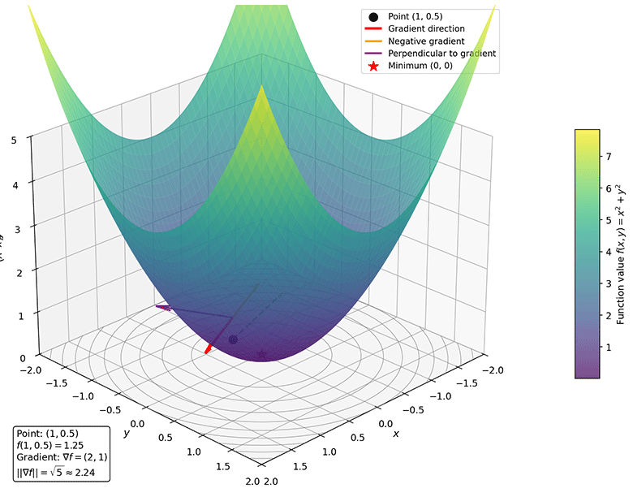

# Multivariate Functions and Composite Function Differentiation

In the previous chapter, we learned about derivatives and differentials of single-variable functions, establishing the fundamental concept of the rate of change. However, most problems in machine learning involve multiple variables. For example, the parameters of a neural network may number in the millions or even billions, and the loss function is a multivariate function of these parameters. This chapter extends the concept of derivatives to multivariate functions, introducing core concepts such as partial derivatives, gradients, the chain rule, directional derivatives, and the Hessian matrix, laying the theoretical foundation for understanding optimization algorithms in machine learning.

## Partial Derivatives

A **Multivariate Function** is a natural extension of a single-variable function. An $n$-variable function $f$ maps $n$ inputs $(x_1, x_2, \ldots, x_n)$ to a single output value. In the real world, multivariate functions are more common than univariate functions. For instance, in a neural network, the output of each layer is a multivariate function of multiple inputs; during neural network optimization, the loss function $L(\theta_1, \theta_2, \ldots, \theta_n)$ is a multivariate function of the model parameters; the predicted value $f(x_1, x_2, \ldots, x_n)$ corresponding to a feature vector $(x_1, x_2, \ldots, x_n)$, and so on.

When dealing with multivariate functions, a natural first thought is to simplify the problem by fixing variables -- considering how the function value changes if we vary only one variable while keeping all others constant. This is precisely the idea behind **partial derivatives**. Let $z = f(x, y)$ be a function of two variables. The partial derivative of $f$ with respect to $x$ at the point $(x_0, y_0)$ is defined as the limit of the rate of change of the function value when $y$ is held fixed and $x$ undergoes a small change $\Delta x$:

$$\frac{\partial f}{\partial x} = \lim_{\Delta x \to 0} \frac{f(x_0 + \Delta x, y_0) - f(x_0, y_0)}{\Delta x}$$

Similarly, the partial derivative with respect to $y$ is defined as:

$$\frac{\partial f}{\partial y} = \lim_{\Delta y \to 0} \frac{f(x_0, y_0 + \Delta y) - f(x_0, y_0)}{\Delta y}$$

When computing the partial derivative of $f(x, y)$ with respect to $x$, we treat $y$ as a constant and differentiate with respect to $x$ using ordinary derivative rules -- the computation is exactly the same as for single-variable derivatives. Therefore, the [derivative rules](derivative.md#derivatives-of-common-functions) introduced in the previous chapter still apply. Let $f(x, y) = x^2 y + 3xy^2$. To find $\frac{\partial f}{\partial x}$, treat $y$ as a constant: $\frac{\partial f}{\partial x} = 2xy + 3y^2$. To find $\frac{\partial f}{\partial y}$, treat $x$ as a constant: $\frac{\partial f}{\partial y} = x^2 + 6xy$.

Geometrically, the derivative is interpreted as the slope of the tangent line, and partial derivatives have an equally intuitive geometric interpretation. For a function of two variables $z = f(x, y)$, its graph is a surface in three-dimensional space. $\frac{\partial f}{\partial x}$ represents the "tangent slope" along the $x$ direction on the surface, while $\frac{\partial f}{\partial y}$ represents the "tangent slope" along the $y$ direction. More specifically, $\frac{\partial f}{\partial x}(x_0, y_0)$ is the slope of the tangent line at the point $(x_0, y_0, f(x_0, y_0))$ to the curve formed by the intersection of the surface and the plane $y = y_0$. This is equivalent to the tangent slope when we "fix $y$ and let only $x$ vary." In short, a partial derivative represents the rate of change of a function along a coordinate axis direction.

But what if we do not want to restrict ourselves to fixed coordinate axes and instead want to know the rate of change along an arbitrary direction? This is where the **directional derivative** comes in. Let $f(x, y)$ be a function of two variables, and let $\mathbf{u} = (u_1, u_2)$ be a unit vector ($\|\mathbf{u}\| = 1$). The directional derivative of $f$ at the point $(x_0, y_0)$ in the direction $\mathbf{u}$ is defined as:

$$D_{\mathbf{u}} f(x_0, y_0) = \lim_{h \to 0} \frac{f(x_0 + h u_1, y_0 + h u_2) - f(x_0, y_0)}{h}$$

Geometrically, the directional derivative represents the limit of the average rate of change of the function value when moving a small step $h$ from the point $(x_0, y_0)$ in the direction $\mathbf{u}$.

## Gradients

Partial derivatives tell us the rate of change of a function along each coordinate axis direction. Combining the partial derivative information from all coordinate directions yields a vector called the **gradient**: let $f(x_1, x_2, \ldots, x_n)$ be a multivariate function. Its gradient is defined as:

$$\nabla f = \left(\frac{\partial f}{\partial x_1}, \frac{\partial f}{\partial x_2}, \ldots, \frac{\partial f}{\partial x_n}\right)$$

where $\nabla$ is called the **gradient operator**. With the gradient, we can view the directional derivative from another perspective -- the directional derivative is the dot product of the gradient and the direction vector:

$$D_{\mathbf{u}} f = \nabla f \cdot \mathbf{u}$$

This formula (which can be shown to be equivalent to the earlier definition after studying the [Chain Rule](#composite-functions-and-the-chain-rule)) reveals an extremely important geometric property of the gradient: **the gradient points in the direction of the steepest increase of the function**. Recalling the [definition and geometric properties of the dot product](../linear/vectors.md#inner-product-and-projection), let $\theta$ be the angle between the gradient $\nabla f$ and the direction vector $\mathbf{u}$. Then $D_{\mathbf{u}} f = \|\nabla f\| \|\mathbf{u}\| \cos\theta$, and since $\|\mathbf{u}\| = 1$, we have $D_{\mathbf{u}} f = \|\nabla f\| \cos\theta$. Because $\cos\theta$ attains its maximum value of $1$ when $\theta = 0$, the directional derivative reaches its maximum value $\|\nabla f\|$ when the direction vector $\mathbf{u}$ is **aligned with** the gradient $\nabla f$. In other words, the gradient direction is the direction in which the function value increases most rapidly.

As a concrete example, consider the function $f(x, y) = x^2 + y^2$, which resembles a bowl-shaped surface (or an inverted hill), as shown in the figure below. At the point $(1, 0.5)$, the gradient is $\nabla f = (2x, 2y) = (2, 1)$, and the magnitude of the gradient is $||\nabla f|| = \sqrt{2^2 + 1^2} = \sqrt{5} \approx 2.24$.

*Figure: Gradient Example*

The calculation shows that moving in the gradient direction $(2, 1)$ increases the function value by approximately $2.24$ per unit distance (the largest among all directions). Moving in the negative gradient direction $(-2, -1)$ decreases the function value by approximately $2.24$ per unit distance (the "steepest descent" among all directions). Moving in a direction perpendicular to the gradient (e.g., $(1, -2)$) leaves the function value unchanged, as this is precisely the tangent direction of the contour line. Correspondingly, the negative gradient direction is the direction of steepest descent. This leads to the core idea of gradient descent in machine learning: moving in the negative gradient direction allows us to find the minimum of a function most quickly.

This geometric property of the gradient is very important for our subsequent study. In the context of machine learning, the optimization objective is typically to **minimize the loss function**. Let the loss function be $L(\theta)$, where $\theta = (\theta_1, \theta_2, \ldots, \theta_n)$ are the model parameters. The update rule of the gradient descent algorithm is:

$$\theta_{t+1} = \theta_t - \eta \nabla L(\theta_t)$$

Here, $\eta$ is the learning rate, which controls the step size; $\nabla L(\theta_t)$ is the gradient of the loss function at the current parameter values, indicating the direction of steepest increase; the negative sign means moving in the negative gradient direction, i.e., progressing along the direction of steepest decrease of the loss function. Understanding the geometric meaning of the gradient is the theoretical foundation for understanding the convergence behavior of gradient descent in machine learning, choosing appropriate learning rates, and diagnosing training issues.

## Composite Functions and the Chain Rule

When introducing partial derivatives and gradients earlier, we skipped the explanation of the dot product relationship between the gradient and the direction vector, because doing so requires the concept of a path composite function (see [Exercise 1](#exercises) for the detailed derivation). In practice, functions are often not as simple as $f(x)$; they are frequently the result of nesting multiple functions. For instance, consider an airplane climbing upward: its position $x(t)$ changes over time, while the temperature $T(x)$ varies with altitude. The temperature around the airplane $T(t) = T(x(t))$ is a composite function: time $t$ first affects the position $x$, which in turn affects the temperature $T$. If we want to know the "rate of change of temperature with respect to time" $\frac{dT}{dt}$, we cannot differentiate $T(t)$ directly -- we must decompose it layer by layer: first, how temperature changes with position $\frac{dT}{dx}$, then how position changes with time $\frac{dx}{dt}$. This requires the chain rule.

A **composite function** is a function whose output serves as the input to another function. Let $u = g(x)$ and $y = f(u)$. Then $y = f(g(x))$ is called the composite function of $f$ and $g$, denoted $f \circ g$. Composite functions "chain together" multiple simple functions to form complex functional relationships. For example, $y = \sin(x^2)$ is composed of $u = x^2$ and $y = \sin(u)$; $y = e^{x^2 + 1}$ is composed of $u = x^2 + 1$ and $y = e^u$. In neural network models, input data undergoes a series of transformations layer by layer, ultimately producing predictions and a loss value. Each layer is a function, and the entire network is a deeply composite function.

The **Chain Rule** is the powerful tool for differentiating composite functions. It tells us that the derivative of a composite function equals the product of the derivatives of each layer: the rate of change of $y$ with respect to $x$ equals the rate of change of $y$ with respect to the intermediate variable $u$, multiplied by the rate of change of $u$ with respect to $x$. This is like a chain reaction: a change in $x$ first affects $u$, which then affects $y$ through $u$. For example, let $y = f(u)$ and $u = g(x)$; then $y = f(g(x))$ is a composite function of $x$, and its derivative is: $\frac{dy}{dx} = \frac{dy}{du} \cdot \frac{du}{dx}$. In function notation: $(f \circ g)'(x) = f'(g(x)) \cdot g'(x)$.

As a concrete example, suppose $y = \sin(x^2)$ and we want to find $\frac{dy}{dx}$. First, let $u = x^2$, so $y = \sin u$. By the chain rule: $$\frac{dy}{dx} = \frac{dy}{du} \cdot \frac{du}{dx} = \cos u \cdot 2x = 2x \cos(x^2)$$

Combining multivariate functions with composite functions yields a more general form of the chain rule. Let $z = f(x, y)$, where $x = x(t)$ and $y = y(t)$. Then $z$ becomes a function of $t$ through $x$ and $y$: $z = f(x(t), y(t))$. In this case, $\frac{dz}{dt} = \frac{\partial f}{\partial x} \cdot \frac{dx}{dt} + \frac{\partial f}{\partial y} \cdot \frac{dy}{dt}$. The meaning of this expression is that the total rate of change equals the sum of the contributions from each path.

## Integration

In machine learning, the primary focus is on optimization problems, so differentiation takes center stage. However, integration, as another important concept in calculus, also has widespread applications in probability theory, information theory, and other fields. Differentiation studies the "local rate of change" -- how fast a function value changes at a given point. Integration studies the "global accumulation" -- the overall effect of a function over an interval. These two seemingly opposite problems are closely connected through the [Fundamental Theorem of Calculus](#fundamental-theorem-of-calculus).

The concept of integration originated from an ancient and practical problem: how to calculate the area under a curve. For example, computing the cross-sectional area of a river to estimate flow rate, or calculating the area of irregular land. For shapes bounded by straight lines (triangles, rectangles), area formulas have long been known. But for regions bounded by curves, traditional geometric methods are inadequate. The key idea behind integration is **partition, approximate, and take the limit**: divide the irregular region into many small pieces, approximate each piece with a regular shape (such as a rectangle), then sum them up. As the partition becomes infinitely fine, the approximation approaches the exact value. This idea not only solves area problems but also extends to a broader class of "accumulation" problems: accumulating distance (from velocity to displacement), accumulating mass (from density to total mass), accumulating probability (from probability density to probability), and so on.

Integration is divided into two main categories: **Definite Integral** and **Indefinite Integral**:

- The definite integral calculates the cumulative effect of a function over a specific interval. It yields a numerical value, not a function. The definite integral answers the question: "How much does the function accumulate over the interval $[a, b]$?"

- The indefinite integral is the inverse operation of differentiation. Given a function $f(x)$, we seek its antiderivative $F(x)$ such that $F'(x) = f(x)$. For example, given $f(x) = 2x$, its indefinite integral is $F(x) = x^2 + C$ (where $C$ is an arbitrary constant), because $(x^2 + C)' = 2x$. The indefinite integral answers the question: "Which function has this function as its derivative?"

With this background, we now give the rigorous definition of the definite integral. Let $f(x)$ be bounded on the interval $[a, b]$. Partition the interval into $n$ subintervals. On each subinterval $[x_{i-1}, x_i]$, choose an arbitrary point $\xi_i$ and form the sum: $\sum_{i=1}^{n} f(\xi_i) \Delta x_i$. As the partition becomes infinitely fine (all $\Delta x_i \to 0$), if this sum approaches a definite limit, then this limit is called the definite integral of $f(x)$ over $[a, b]$, denoted:

$$\int_a^b f(x) \, dx$$

Here, $a$ is called the lower limit of integration, $b$ the upper limit of integration, $f(x)$ the integrand, and $dx$ indicates the variable of integration. This definition beautifully captures the central idea of integration: "partition, approximate, and take the limit." It also intuitively explains the geometric meaning of the definite integral: the definite integral represents the signed area between the function curve and the $x$-axis (signed area means that when $f(x) > 0$, the area is positive, and when $f(x) < 0$, the area is negative). The definite integral is the algebraic sum of these signed areas.

## Fundamental Theorem of Calculus

Differentiation and integration are closely linked through the **Fundamental Theorem of Calculus**. This theorem serves as the bridge between two important parts of calculus theory, demonstrating that differentiation and integration are inverse operations: differentiation finds rates of change, while integration finds accumulated quantities. One is "breaking apart," the other is "putting together" -- they are two sides of the same coin. This laid the foundation for subsequent developments such as differential equations and the calculus of variations. At the same time, the Fundamental Theorem greatly simplifies the computation of definite integrals, transforming them from a complex limiting process into simply finding an antiderivative and evaluating it at the endpoints. The entire Fundamental Theorem of Calculus consists of two parts:

- **First Fundamental Theorem** (Relationship between differentiation and integration)

    Let $f(x)$ be continuous on $[a, b]$, and define the "integral function" $F(x) = \int_a^x f(t) \, dt$. Then $F(x)$ is differentiable on $[a, b]$, and its derivative is the integrand itself: $F'(x) = f(x)$.

    This theorem tells us: the derivative of an integral is the integrand. In other words, integration is the inverse operation of differentiation. If we integrate $f$ to obtain $F$, and then differentiate $F$, we return to $f$. The geometric intuition makes it easy to understand why this theorem holds: $F(x) = \int_a^x f(t) \, dt$ represents the area under the curve $y = f(t)$ from $a$ to $x$. When $x$ increases by a small amount $\Delta x$, the area increases by approximately $f(x) \cdot \Delta x$ (approximated as a rectangle of width $\Delta x$ and height $f(x)$). Therefore, the rate of change of the area (i.e., the derivative) is precisely the height $f(x)$.

- **Second Fundamental Theorem** (Newton-Leibniz formula)

    Let $f(x)$ be continuous on $[a, b]$, and let $G(x)$ be any antiderivative of $f(x)$ (i.e., $G'(x) = f(x)$). Then: $\int_a^b f(x) \, dx = G(b) - G(a)$.

    This formula, also known as the Newton-Leibniz formula, is one of the most famous formulas in calculus. It tells us: to compute a definite integral, we only need to find an antiderivative of the integrand and evaluate it at the endpoints. This dramatically simplifies the computation of integrals -- what originally required the complex process of "partition, approximate, and take the limit" now only requires finding an antiderivative and computing the difference.

Let us demonstrate how the Newton-Leibniz formula simplifies integral calculation with a concrete example. Suppose we want to compute $\int_0^1 2x \, dx$. We can use either of the following two methods:

- Method 1 (partition and take the limit): Divide the interval into $n$ equal parts, each of width $\Delta x = 1/n$. Take the right endpoints and form the sum. As $n \to \infty$, the limit is $1$:
$$\sum_{i=1}^{n} f(x_i) \Delta x = \sum_{i=1}^{n} \frac{2i}{n} \cdot \frac{1}{n} = \frac{2}{n^2} \sum_{i=1}^{n} i = \frac{2}{n^2} \cdot \frac{n(n+1)}{2} = \frac{n+1}{n}$$

- Method 2 (Newton-Leibniz formula): The antiderivative of $f(x) = 2x$ is $G(x) = x^2$ (verification: $(x^2)' = 2x$). Therefore:
$$\int_0^1 2x \, dx = G(1) - G(0) = 1^2 - 0^2 = 1$$

## Chapter Summary

When mathematics moves from studying "how one variable affects a result" to "how multiple variables working together determine an outcome," partial derivatives provide a natural entry point: fix all other variables and observe the effect of only one variable. This dimension-reduction strategy decomposes complex multivariate problems into familiar univariate problems, embodying the scientific wisdom of simplifying complexity. Partial derivatives characterize the rate of change along coordinate axes, while the gradient assembles these scattered pieces of information into a single vector, revealing a "panoramic view" of how the function changes in all directions. The gradient points in the direction of steepest increase of the function -- this geometric property, seemingly simple, is the soul of the gradient descent algorithm in machine learning. Multivariate functions introduce another dimension of nested multivariate relationships, and the chain rule provides us with a tool for disentangling this complexity. The total rate of change equals the sum of contributions from each path -- this is a divide-and-conquer approach that machine learning has fully adopted. Neural networks are quintessential examples of deeply composite functions, and the backpropagation algorithm is essentially a systematic application of the chain rule.

## Exercises

1. Prove that the definition of the directional derivative $D_{\mathbf{u}} f(x_0, y_0) = \lim_{h \to 0} \frac{f(x_0 + h u_1, y_0 + h u_2) - f(x_0, y_0)}{h}$ is equivalent to $D_{\mathbf{u}} f = \nabla f \cdot \mathbf{u}$.
    

    
Solution

    This is essentially a problem of differentiating a composite function: let $g(h) = f(x_0 + h u_1, y_0 + h u_2)$. The directional derivative is $g'(0)$. Define the path functions $x(h) = x_0 + h u_1$ and $y(h) = y_0 + h u_2$. By the multivariate chain rule:

    $$\frac{dg}{dh} = \frac{\partial f}{\partial x} \cdot \frac{dx}{dh} + \frac{\partial f}{\partial y} \cdot \frac{dy}{dh}$$

    Compute the path derivatives: $\frac{dx}{dh} = u_1$, $\frac{dy}{dh} = u_2$. Substituting gives:

    $$D_{\mathbf{u}} f = \frac{\partial f}{\partial x} \cdot u_1 + \frac{\partial f}{\partial y} \cdot u_2$$

    The right-hand side is precisely the dot product of the vector $(\frac{\partial f}{\partial x}, \frac{\partial f}{\partial y})$ with the vector $(u_1, u_2)$. The former is the gradient $\nabla f$, and the latter is the direction vector $\mathbf{u}$. Therefore:

    $$D_{\mathbf{u}} f = \nabla f \cdot \mathbf{u}$$
    

1. Let $f(x, y) = x^2 y + y^3$. Find $\frac{\partial f}{\partial x}$, $\frac{\partial f}{\partial y}$, and $\nabla f$.
    

    
Solution

    To find $\frac{\partial f}{\partial x}$: treat $y$ as a constant, $\frac{\partial f}{\partial x} = 2xy$

    To find $\frac{\partial f}{\partial y}$: treat $x$ as a constant, $\frac{\partial f}{\partial y} = x^2 + 3y^2$

    Gradient: $\nabla f = (2xy, x^2 + 3y^2)$

    At the point $(1, 2)$: $\nabla f(1, 2) = (4, 13)$
    

1. Let $z = x^2 + y^2$, $x = t + 1$, $y = t^2$. Use the chain rule to find $\frac{dz}{dt}$.
    

    
Solution

    Method 1 (chain rule):
    $$\frac{dz}{dt} = \frac{\partial z}{\partial x} \cdot \frac{dx}{dt} + \frac{\partial z}{\partial y} \cdot \frac{dy}{dt}$$

    Compute:
    - $\frac{\partial z}{\partial x} = 2x$
    - $\frac{\partial z}{\partial y} = 2y$
    - $\frac{dx}{dt} = 1$
    - $\frac{dy}{dt} = 2t$

    Therefore: $\frac{dz}{dt} = 2x \cdot 1 + 2y \cdot 2t = 2(t+1) + 2t^2 \cdot 2t = 2t + 2 + 4t^3$

    Method 2 (direct substitution for verification):
    $z = (t+1)^2 + t^4 = t^2 + 2t + 1 + t^4$
    $\frac{dz}{dt} = 2t + 2 + 4t^3$

    Both methods yield the same result.
    

1. Let $f(x, y) = x^2 - y^2$. Compute the directional derivative of $f$ at the point $(1, 1)$ in the direction $\mathbf{u} = (\frac{1}{\sqrt{2}}, \frac{1}{\sqrt{2}})$.
    

    
Solution

    First compute the gradient: $\nabla f = (2x, -2y)$

    At the point $(1, 1)$: $\nabla f(1, 1) = (2, -2)$

    Directional derivative: $D_{\mathbf{u}} f = \nabla f \cdot \mathbf{u} = (2, -2) \cdot (\frac{1}{\sqrt{2}}, \frac{1}{\sqrt{2}}) = \frac{2}{\sqrt{2}} - \frac{2}{\sqrt{2}} = 0$

    Explanation: The direction $\mathbf{u}$ is perpendicular to the gradient, so the function value does not change along this direction. This is precisely the tangent direction of the contour line.
    

1. Determine the convexity of the function $f(x, y) = x^2 + 2y^2 + 2xy$.
    

    
Solution

    Compute the first-order partial derivatives:
    - $\frac{\partial f}{\partial x} = 2x + 2y$
    - $\frac{\partial f}{\partial y} = 4y + 2x$

    Compute the second-order partial derivatives:
    - $\frac{\partial^2 f}{\partial x^2} = 2$
    - $\frac{\partial^2 f}{\partial y^2} = 4$
    - $\frac{\partial^2 f}{\partial x \partial y} = 2$
    - $\frac{\partial^2 f}{\partial y \partial x} = 2$

    Hessian matrix: $\mathbf{H} = \begin{bmatrix} 2 & 2 \\ 2 & 4 \end{bmatrix}$

    Compute the eigenvalues:
    $\det(\mathbf{H} - \lambda \mathbf{I}) = \begin{vmatrix} 2-\lambda & 2 \\ 2 & 4-\lambda \end{vmatrix} = (2-\lambda)(4-\lambda) - 4 = \lambda^2 - 6\lambda + 4 = 0$

    Solving yields: $\lambda = 3 \pm \sqrt{5}$, both positive.

    Conclusion: The Hessian matrix is positive definite, so the function is strictly convex.
    

1. Let $f(x) = e^{-x^2}$. Compute $\int_{-\infty}^{\infty} f(x) \, dx$ and explain its significance in probability theory.
    

    
Solution

    This integral is the famous Gaussian integral: $\int_{-\infty}^{\infty} e^{-x^2} \, dx = \sqrt{\pi}$

    Significance in probability theory:
    The probability density function of the standard normal distribution is $\phi(x) = \frac{1}{\sqrt{2\pi}} e^{-x^2/2}$

    Since $\int_{-\infty}^{\infty} \phi(x) \, dx = 1$, the total area under the probability density function is 1, ensuring the normalization of probability.

    The Gaussian integral appears widely in machine learning, for example:
    - Gaussian kernel functions (RBF kernel)
    - KL divergence calculations in variational inference
    - Parameter estimation for Gaussian distributions
    

1. Prove: If $\nabla f(\mathbf{x}^*) = \mathbf{0}$ and the Hessian matrix $\mathbf{H}$ is positive definite at $\mathbf{x}^*$, then $\mathbf{x}^*$ is a local minimum of $f$.
    

    
Solution

    This is a key conclusion of the second-order sufficient condition.

    Proof sketch:
    1. $\nabla f(\mathbf{x}^*) = \mathbf{0}$ means $\mathbf{x}^*$ is a critical point
    2. Positive definiteness of the Hessian matrix implies that near $\mathbf{x}^*$, the function can be approximated by a quadratic function: $f(\mathbf{x}^* + \mathbf{h}) \approx f(\mathbf{x}^*) + \frac{1}{2}\mathbf{h}^T \mathbf{H} \mathbf{h}$
    3. Since $\mathbf{H}$ is positive definite, for any nonzero $\mathbf{h}$, we have $\mathbf{h}^T \mathbf{H} \mathbf{h} > 0$
    4. Therefore $f(\mathbf{x}^* + \mathbf{h}) > f(\mathbf{x}^*)$ holds for sufficiently small $\mathbf{h}$
    5. This shows $\mathbf{x}^*$ is a local minimum

    This conclusion has important applications in optimization algorithms: after finding a point where the gradient is zero, checking the positive definiteness of the Hessian matrix allows us to determine whether it is a local minimum, a local maximum, or a saddle point.
    

