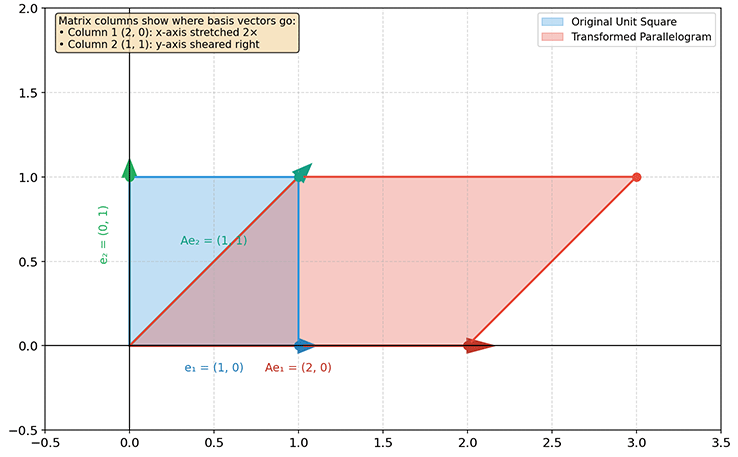
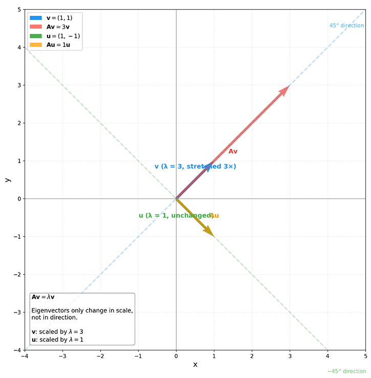

# Matrix Basics

Matrices are a natural extension of vectors and the core object of study in linear algebra. If vectors represent individual data points, then matrices represent datasets or transformation rules. This chapter systematically introduces the definition of matrices, their operations, and their geometric meaning -- linear transformations.

## Matrix Concepts and Applications

A **Matrix** is a rectangular array of scalars arranged in rows and columns. Just as vectors extend scalars from order zero to order one, matrices extend vectors from order one to order two. By convention, matrices are typically denoted by bold, uppercase letters. An $m \times n$ matrix $\mathbf{A}$ contains $m$ rows and $n$ columns of elements. The dimensions of a matrix are denoted as $m \times n$, where $m$ is the number of rows and $n$ is the number of columns. A matrix with an equal number of rows and columns is called a **Square Matrix**, having a square shape.

$$ \mathbf{A} = \begin{bmatrix}
a_{11} & a_{12} & \cdots & a_{1n} \\
a_{21} & a_{22} & \cdots & a_{2n} \\
\vdots & \vdots & \ddots & \vdots \\
a_{m1} & a_{m2} & \cdots & a_{mn}
\end{bmatrix} $$

The element in the $i$-th row and $j$-th column of matrix $\mathbf{A}$ is denoted as $a_{ij}$ or $(\mathbf{A})_{ij}$. In NumPy, matrices can be represented as two-dimensional arrays. For example, a $2 \times 3$ matrix has 2 rows and 3 columns:

```python runnable
import numpy as np

# Create a 2x3 matrix
A = np.array([
    [1, 2, 3],
    [4, 5, 6]
])

print(f"Matrix shape: {A.shape}")     # (2, 3)
print(f"Number of rows: {A.shape[0]}")      # 2
print(f"Number of columns: {A.shape[1]}")      # 3
print(f"Element a[0,1]: {A[0, 1]}")  # 2 (row 0, column 1, 0-indexed)
```

Matrices are a fundamental tool in machine learning and data science. Think of a matrix as a data table in Excel -- you can locate data by row and column parameters, but it can do far more than just store data. Here are some application scenarios for matrices:

- **Data Representation**: Matrices are the "raw material" of machine learning. Think of a matrix as a data table: each row is a sample (e.g., a user, an image), and each column is a feature (e.g., age, price, pixel value). This structure allows computers to efficiently process thousands of data points.

- **Linear Transformations**: Matrices serve as "data transformers." Think of a matrix as a tool for manipulating and deforming data, converting data from one form to another. For example, rotating a point on a 2D plane by 45 degrees, or projecting a 3D object onto a 2D screen -- these operations can all be expressed as matrix multiplication. An $m \times n$ matrix can "compress" or "expand" $n$-dimensional data into $m$ dimensions. This is particularly useful in dimensionality reduction, turning high-dimensional complex data into low-dimensional compact representations.

- **Weight Matrices**: Matrices are the "memory" of neural networks. Weight matrices lie at the heart of neural networks. When people talk about large models with 8B, 32B, 671B (tens or hundreds of billions of parameters), they are actually referring to the total number of parameters across all weight matrices. Imagine the connections between neurons in the brain: some connections are strong, others weak. Weight matrices record the strength of these connections, where each element $w_{ij}$ represents "how much the $i$-th neuron influences the $j$-th neuron." The process of neural network learning is essentially adjusting the values in these weight matrices.

- **Covariance Matrix**: Matrices capture the "coordination" between variables. A covariance matrix answers how a set of variables vary together. Positive values indicate positive correlation (they "move together," like temperature and ice cream sales); negative values indicate negative correlation (they "move in opposite directions," like altitude and temperature); values near zero indicate no correlation (they "act independently," like IQ and shoe size).

- **Adjacency Matrix**: Matrices serve as "maps" of relationships. Social networks, transportation routes, web page links -- all can be represented using adjacency matrices. The element $a_{ij}$ in a matrix indicates "whether there is a connection from node $i$ to node $j$." This representation enables graph algorithms (such as PageRank, recommendation systems) to compute efficiently.

## Matrix Operations

Like vectors, matrices support addition, scalar multiplication, and multiplication, but with certain prerequisites: two matrices must have the same dimensions (same number of rows and columns) to be added, and for multiplication, the number of columns in the first matrix must equal the number of rows in the second matrix (inner dimensions must match).

- **Matrix Addition**: Matrix addition is performed element-wise: $(\mathbf{A} + \mathbf{B})_{ij} = a_{ij} + b_{ij}$. Matrix addition satisfies:
    - Commutativity: $\mathbf{A} + \mathbf{B} = \mathbf{B} + \mathbf{A}$
    - Associativity: $(\mathbf{A} + \mathbf{B}) + \mathbf{C} = \mathbf{A} + (\mathbf{B} + \mathbf{C})$

- **Scalar Multiplication**: Multiplying a scalar by a matrix multiplies every element of the original matrix by that scalar: $(c\mathbf{A})_{ij} = c \cdot a_{ij}$

- **Matrix Multiplication**: Matrix multiplication is the core operation on matrices. Let $\mathbf{A}$ be an $m \times p$ matrix and $\mathbf{B}$ be a $p \times n$ matrix. Their product $\mathbf{C} = \mathbf{AB}$ is an $m \times n$ matrix: $c_{ij} = \sum_{k=1}^{p} a_{ik} b_{kj} = a_{i1}b_{1j} + a_{i2}b_{2j} + \cdots + a_{ip}b_{pj}$. That is, the element in the $i$-th row and $j$-th column of $\mathbf{C}$ equals the inner product of the $i$-th row of $\mathbf{A}$ and the $j$-th column of $\mathbf{B}$. Matrix multiplication satisfies:

    - Associativity: $(\mathbf{AB})\mathbf{C} = \mathbf{A}(\mathbf{BC})$
    - Scalar multiplication associativity: $c(\mathbf{AB}) = (c\mathbf{A})\mathbf{B} = \mathbf{A}(c\mathbf{B})$
    - Distributivity: $\mathbf{A}(\mathbf{B} + \mathbf{C}) = \mathbf{AB} + \mathbf{AC}$

    However, matrix multiplication is not commutative; in general, $\mathbf{AB} \neq \mathbf{BA}$. In fact, $\mathbf{BA}$ may not even be a valid operation, as the inner dimension condition may not be satisfied. Here is a concrete example of multiplying a $3 \times 2$ matrix by a $2 \times 3$ matrix, yielding a $3 \times 3$ result:

$$\mathbf{A} = \begin{bmatrix}
1 & 2 \\
3 & 4 \\
5 & 6
\end{bmatrix}, \quad
\mathbf{B} = \begin{bmatrix}
1 & 2 & 3 \\
4 & 5 & 6
\end{bmatrix}, \quad
\mathbf{AB} = \begin{bmatrix}
1 \cdot 1 + 2 \cdot 4 & 1 \cdot 2 + 2 \cdot 5 & 1 \cdot 3 + 2 \cdot 6 \\
3 \cdot 1 + 4 \cdot 4 & 3 \cdot 2 + 4 \cdot 5 & 3 \cdot 3 + 4 \cdot 6 \\
5 \cdot 1 + 6 \cdot 4 & 5 \cdot 2 + 6 \cdot 5 & 5 \cdot 3 + 6 \cdot 6
\end{bmatrix}
= \begin{bmatrix}
9 & 12 & 15 \\
19 & 26 & 33 \\
29 & 40 & 51
\end{bmatrix}$$

- **Outer Product**: The vector outer product is a special case of matrix multiplication. It multiplies a column vector by a row vector to produce a matrix. Let $\mathbf{u}$ be an $m$-dimensional column vector and $\mathbf{v}$ be an $n$-dimensional column vector. Their outer product $\mathbf{u} \mathbf{v}^T$ is an $m \times n$ matrix: $(\mathbf{u} \mathbf{v}^T)_{ij} = u_i \cdot v_j$. Each row of the outer product is a scalar multiple of the vector $\mathbf{v}^T$, so the rank of an outer product matrix is 1 when both vectors are nonzero. The outer product has widespread applications in machine learning, such as covariance matrix computation, principal component analysis, and low-rank matrix approximation. Here is a concrete example of the outer product between a $3 \times 1$ column vector and a $1 \times 2$ row vector, yielding a $3 \times 2$ matrix:

$$\mathbf{u} = \begin{bmatrix}
1 \\
2 \\
3
\end{bmatrix}, \quad
\mathbf{v}^T = \begin{bmatrix}
4 & 5
\end{bmatrix}, \quad
\mathbf{u} \mathbf{v}^T = \begin{bmatrix}
1 \cdot 4 & 1 \cdot 5 \\
2 \cdot 4 & 2 \cdot 5 \\
3 \cdot 4 & 3 \cdot 5
\end{bmatrix}
= \begin{bmatrix}
4 & 5 \\
8 & 10 \\
12 & 15
\end{bmatrix}$$

From an algebraic perspective, matrix multiplication involves a tedious series of additions and multiplications. Yet its geometric meaning is remarkably simple: it is the composition of two successive linear transformations $\mathbf{A}$ and $\mathbf{B}$ (see the [Linear Transformations](#geometric-intuition-of-linear-transformations) section in this chapter). This is the shortcut for humans to understand matrix multiplication -- the algebra is what computers are for.

Additionally, as mentioned in the discussion of the [dot product](vectors.md#inner-product-and-projection), the term "multiplication" for vectors and matrices can carry different meanings depending on context, so it is important to distinguish them through notational conventions. Matrix multiplication is written simply as "$\mathbf{AB}$" -- this is not like elementary algebra where a multiplication sign is implied between adjacent symbols. If you see $\mathbf{A} * \mathbf{B}$ or $\mathbf{A} \odot \mathbf{B}$ in the literature, those refer to the Hadamard product (element-wise product), where two matrices of exactly the same dimensions have their corresponding elements multiplied one by one, producing another matrix of the same dimensions: $(\mathbf{A} \odot \mathbf{B})_{ij} = a_{ij} \cdot b_{ij} \quad (1 \leq i \leq m,\ 1 \leq j \leq n)$

## Matrix Transpose and Inverse

Beyond the binary operations of addition, scalar multiplication, and matrix multiplication, matrices also support two common unary operations: **transpose** and **inversion**.

- **Matrix Transpose**: Transpose is an operation that swaps the rows and columns of a matrix. Let $\mathbf{A}$ be an $m \times n$ matrix. Its transpose $\mathbf{A}^T$ is an $n \times m$ matrix: $(\mathbf{A}^T)_{ij} = a_{ji}$. The transpose has the following properties:

    - $(\mathbf{A}^T)^T = \mathbf{A}$ (the transpose of a transpose is the original matrix -- like looking at a table sideways and then back again)
    - $(\mathbf{A} + \mathbf{B})^T = \mathbf{A}^T + \mathbf{B}^T$
    - $(c\mathbf{A})^T = c\mathbf{A}^T$
    - $(\mathbf{AB})^T = \mathbf{B}^T \mathbf{A}^T$ (the transpose of a product equals the reverse product of the transposes)

    The fourth property, in particular, provides the mathematical guarantee for dimensional consistency in error backpropagation. $(\mathbf{AB})^T = \mathbf{B}^T\mathbf{A}^T$ ensures that gradients can correctly "flow backward" through each layer while maintaining dimensional alignment. This is the mathematical foundation that enables automatic differentiation and deep learning frameworks (PyTorch, TensorFlow) to compute gradients efficiently.

    Here is a concrete example of a $3 \times 3$ matrix and its transpose. Notice that the first row $(1, 2, 3)$ of the original matrix becomes the first column of the transpose, the second row $(4, 5, 6)$ becomes the second column, and the third row $(7, 8, 9)$ becomes the third column -- rows and columns are swapped.

    $$\mathbf{A} = \begin{bmatrix}
    1 & 2 & 3 \\
    4 & 5 & 6 \\
    7 & 8 & 9
    \end{bmatrix}, \quad
    \mathbf{A}^T = \begin{bmatrix}
    1 & 4 & 7 \\
    2 & 5 & 8 \\
    3 & 6 & 9
    \end{bmatrix}$$

- **Matrix Inverse**: The inverse is an operation that "undoes" the linear transformation of a matrix, returning to the original state. For a square matrix $\mathbf{A}$, if there exists a matrix $\mathbf{B}$ such that $\mathbf{AB} = \mathbf{BA} = \mathbf{I}$, then $\mathbf{A}$ is said to be **invertible**, and $\mathbf{B}$ is called the inverse of $\mathbf{A}$, denoted $\mathbf{A}^{-1}$. The inverse has the following properties:

    - $(\mathbf{A}^{-1})^{-1} = \mathbf{A}$ (undoing the undo brings you back to the original)
    - $(\mathbf{AB})^{-1} = \mathbf{B}^{-1} \mathbf{A}^{-1}$ (put on socks first, then shoes; to take them off, reverse the order -- shoes off first, then socks)
    - $(\mathbf{A}^T)^{-1} = (\mathbf{A}^{-1})^T$ (transpose and inverse can be interchanged)
    - $(c\mathbf{A})^{-1} = \frac{1}{c}\mathbf{A}^{-1}, c \neq 0$ (the inverse of scaling by $c$ is scaling by $\frac{1}{c}$)

    Here is a concrete example of a $2 \times 2$ matrix and its inverse:

    $$\mathbf{A} = \begin{bmatrix}
    2 & 1 \\
    5 & 3
    \end{bmatrix}, \quad
    \mathbf{A}^{-1} = \begin{bmatrix}
    3 & -1 \\
    -5 & 2
    \end{bmatrix}, \quad
    \mathbf{A} \mathbf{A}^{-1} = \begin{bmatrix}
    2 \cdot 3 + 1 \cdot (-5) & 2 \cdot (-1) + 1 \cdot 2 \\
    5 \cdot 3 + 3 \cdot (-5) & 5 \cdot (-1) + 3 \cdot 2
    \end{bmatrix}
    = \begin{bmatrix}
    1 & 0 \\
    0 & 1
    \end{bmatrix} = \mathbf{I}_2$$

    Not all operations can be undone, and not all square matrices are invertible. The condition for a matrix to be invertible can be checked using any of three equivalent statements: a nonzero determinant ($\det(\mathbf{A}) \neq 0$), full rank ($\text{rank}(\mathbf{A}) = n$ for an $n \times n$ matrix), or all eigenvalues nonzero. A square matrix satisfying any one of these conditions is invertible. When a matrix is not invertible or is not even square, the **Pseudoinverse** can be used to obtain the closest approximate solution. The pseudoinverse is denoted $\mathbf{A}^+ = (\mathbf{A}^T \mathbf{A})^{-1} \mathbf{A}^T$ (when $\mathbf{A}^T \mathbf{A}$ is invertible). The intuition behind this formula is: first, $\mathbf{A}^T \mathbf{A}$ "trims" the $m \times n$ matrix into an $n \times n$ square matrix, filtering out redundant information while preserving the core structure. Then, the closest approximate inverse is found on this reduced space, and finally, multiplying by $\mathbf{A}^T$ maps the result back to the original space. The pseudoinverse satisfies the following properties:

    - $\mathbf{A}\mathbf{A}^+\mathbf{A} = \mathbf{A}$
    - $\mathbf{A}^+\mathbf{A}\mathbf{A}^+ = \mathbf{A}^+$
    - $(\mathbf{A}\mathbf{A}^+)^T = \mathbf{A}\mathbf{A}^+$
    - $(\mathbf{A}^+\mathbf{A})^T = \mathbf{A}^+\mathbf{A}$

    Rather than memorizing algebraic formulas to understand matrix inverses, it is better to grasp the intention behind the inverse (notice the comments after each inverse property in the list above). For instance, think of a matrix transformation as an image editing operation on a photo. Wanting to perfectly restore the original image is equivalent to finding the inverse matrix $\mathbf{A}^{-1}$. The prerequisite for perfect restoration is that the transformation did not lose any useful information: a zero determinant means the image was completely flattened in one dimension (length or width compressed to zero), losing useful information; rank deficiency means some information is redundant, like certain regions of the image being pasted over by identical patches from elsewhere, losing useful information; a zero eigenvalue means information completely "collapses" in some direction -- the original color image with RGB channels becomes a grayscale image because the blue and red channels drop to zero, losing useful information. In any case, once useful information is lost, perfect data recovery is no longer possible.

    Similarly, the pseudoinverse can be intuitively understood as an operation that "restores information as much as possible." Imagine using a camera ($\mathbf{A}$) to photograph a 3D object. Only a professional 3D scanning camera would guarantee no information loss, perfectly reconstructing the 3D object. With an ordinary camera, you only get a flat 2D photograph -- this is where the pseudoinverse finds a 3D reconstruction that "most resembles the original object": imperfect, but the optimal solution in the least-squares sense. $\mathbf{A}^+$ is the operation that "infers the most likely original object from the photograph."

## Special Matrices

Among all matrices, certain types possess special algebraic properties due to their simple structures. These are like "standard components" in the world of numbers -- though simple in form, they simplify complex computations, reveal the essence of problems, and play key roles in solving linear systems, coordinate transformations, and other scenarios. Here are several of the most important special matrices:

- **Identity Matrix**: $\mathbf{I}$ is a square matrix with 1s on the main diagonal and 0s elsewhere. The identity matrix is the "identity element" for matrix multiplication, satisfying $\mathbf{AI} = \mathbf{IA} = \mathbf{A}$.

    $$\mathbf{I}_n = \begin{bmatrix}
    1 & 0 & \cdots & 0 \\
    0 & 1 & \cdots & 0 \\
    \vdots & \vdots & \ddots & \vdots \\
    0 & 0 & \cdots & 1
    \end{bmatrix}$$

- **Diagonal Matrix**: A diagonal matrix is a square matrix with zeros everywhere except on the main diagonal. Left-multiplying a vector by a diagonal matrix scales each component of the vector independently.

    $$\mathbf{D} = \begin{bmatrix}
    d_1 & 0 & 0 \\
    0 & d_2 & 0 \\
    0 & 0 & d_3
    \end{bmatrix}$$

- **Symmetric Matrix**: A symmetric matrix satisfies $\mathbf{A} = \mathbf{A}^T$, i.e., $a_{ij} = a_{ji}$. The eigenvectors of a symmetric matrix can form an orthogonal basis. Many useful matrices, such as covariance matrices and Hessian matrices, are symmetric. The adjacency matrix of an undirected graph is also symmetric.

- **Orthogonal Matrix**: An orthogonal matrix satisfies $\mathbf{Q}^T \mathbf{Q} = \mathbf{I}$, meaning its transpose equals its inverse: $\mathbf{Q}^{-1} = \mathbf{Q}^T$. Orthogonal matrices preserve the length and angle of vectors, only performing rotations or reflections.

## Geometric Intuition of Linear Transformations

Imagine you have a photo printed on a rubber sheet. You perform various operations on it: stretching, rotating, shearing, flipping. As long as you do not wrinkle the sheet (straight lines remain straight) or tear it (adjacent points remain adjacent), these operations are essentially linear transformations. From an algebraic perspective, a linear transformation is "a matrix multiplied by a vector to produce another vector." While the algebraic formula gives accurate numerical results, it does not make it easy to understand what the numbers in a matrix actually represent, or what the operation of each number with the vector components means. So let us approach this from a geometric intuition.

Imagine standing at the origin, facing a coordinate system with many vectors around you. Each vector $\mathbf{v}$ is like an arrow starting from the origin, pointing to some location in space. Now, you want to "deform" all the vectors in this entire space -- for example, stretch along the x-axis, compress along the y-axis, and then rotate the whole thing by 30 degrees. How would you describe this deformation? A valuable insight is that you do not need to describe a separate set of operations for each vector individually. You only need to know what happens to the basis vectors (stretching, rotation, etc.) to determine the deformation pattern for all vectors in the entire space, because the coordinate axes define the space, and all vectors change together with them. Starting from the simplest 2D plane, the original basis vectors are $\mathbf{e}_1 = \begin{bmatrix} 1 \\ 0 \end{bmatrix}$ (the unit vector along the x-axis) and $\mathbf{e}_2 = \begin{bmatrix} 0 \\ 1 \end{bmatrix}$ (the unit vector along the y-axis).

If after deformation, $\mathbf{e}_1$ is moved to $\begin{bmatrix} a \\ c \end{bmatrix}$ and $\mathbf{e}_2$ is moved to $\begin{bmatrix} b \\ d \end{bmatrix}$, then where is any vector $\mathbf{v} = \begin{bmatrix} x \\ y \end{bmatrix} = x\mathbf{e}_1 + y\mathbf{e}_2$ moved to? Since linear transformations preserve linear combinations -- once the basis vectors (the coordinate axes of the space) are moved, their linear combinations are moved in the same proportion -- we have:

$$\mathbf{v}' = x\begin{bmatrix} a \\ c \end{bmatrix} + y\begin{bmatrix} b \\ d \end{bmatrix} = \begin{bmatrix} ax + by \\ cx + dy \end{bmatrix}$$

This exactly matches the result of matrix multiplication:

$$\begin{bmatrix} a & b \\ c & d \end{bmatrix} \begin{bmatrix} x \\ y \end{bmatrix} = \begin{bmatrix} ax + by \\ cx + dy \end{bmatrix}$$

Therefore, from a geometric perspective, each column of a matrix records where the corresponding basis vector is moved to. The first column is the new position of the x-axis unit vector, the second column is the new position of the y-axis unit vector, and so on. Multiplying a matrix by a vector is essentially "reassembling the vector using the new basis." To put this into a concrete example, consider the matrix $\mathbf{A} = \begin{bmatrix} 2 & 1 \\ 0 & 1 \end{bmatrix}$. Its geometric meaning is:

  - First column $\begin{bmatrix} 2 \\ 0 \end{bmatrix}$: the x-axis is stretched to 2 times its original length (moved from $(1,0)$ to $(2,0)$)
  - Second column $\begin{bmatrix} 1 \\ 1 \end{bmatrix}$: the y-axis is "sheared" (moved from $(0,1)$ to $(1,1)$)

This is like taking a square grid, first stretching it along the x-direction, then shearing it toward the upper right. If there was originally a unit square (bounded by $(0,0), (1,0), (1,1), (0,1)$) in the plane, it now becomes a parallelogram.



*Figure: Linear transformation example - square to parallelogram*

To summarize the connection between algebraic formulas and geometric intuition: each element $a_{ij}$ in a matrix describes "the contribution of the $j$-th basis vector to the $i$-th coordinate axis." The first row $a, b$ controls which basis vector components contribute to the x-coordinate of the new vector; the second row $c, d$ controls the y-coordinate. In this way, geometric operations like "stretching, rotating, shearing" are translated into algebraic "multiplications and additions." Each column of a matrix represents the new position of a basis vector after transformation, and the entire space is like a rubber sheet being stretched, rotated, or sheared, with the matrix recording "where each coordinate axis has moved to."

## Matrix-Vector Product

The **Matrix-Vector Product** is the most common operation in machine learning and a direct application of [linear transformations](#geometric-intuition-of-linear-transformations). Let $\mathbf{A}$ be an $m \times n$ matrix and $\mathbf{v}$ be an $n$-dimensional column vector (which can be viewed as an $n \times 1$ matrix). The matrix-vector product $\mathbf{Av}$ is an $m$-dimensional vector. Each element is computed as:

$$ (\mathbf{Av})_i = \sum_{j=1}^{n} a_{ij} v_j = a_{i1}v_1 + a_{i2}v_2 + \cdots + a_{in}v_n $$

That is, the $i$-th element of the result vector equals the inner product of the $i$-th row of the matrix with the vector. From a dimensional matching perspective, the number of columns in the matrix must equal the dimension of the vector (inner dimensions must match). This is the only prerequisite for the matrix-vector product. Here is a concrete example of a $2 \times 3$ matrix multiplied by a 3-dimensional vector:

$$\mathbf{A} = \begin{bmatrix}
1 & 2 & 3 \\
4 & 5 & 6
\end{bmatrix}, \quad
\mathbf{v} = \begin{bmatrix}
1 \\
2 \\
3
\end{bmatrix}, \quad
\mathbf{Av} = \begin{bmatrix}
1 \cdot 1 + 2 \cdot 2 + 3 \cdot 3 \\
4 \cdot 1 + 5 \cdot 2 + 6 \cdot 3
\end{bmatrix}
= \begin{bmatrix}
14 \\
32
\end{bmatrix}$$

```python runnable
import numpy as np

A = np.array([
    [1, 2, 3],
    [4, 5, 6]
])
v = np.array([1, 2, 3])

# Method 1: np.dot
result1 = np.dot(A, v)
print(f"np.dot result: {result1}")  # [14 32]

# Method 2: @ operator (recommended)
result2 = A @ v
print(f"@ operator result: {result2}")  # [14 32]

# Verify dimension change
print(f"Matrix shape: {A.shape}, vector shape: {v.shape}, result shape: {result2.shape}")
# (2, 3), (3,), (2,)
```

The geometric meaning of the matrix-vector product is applying a linear transformation to a specific vector. Recall from the [Geometric Intuition of Linear Transformations](#geometric-intuition-of-linear-transformations) section: each column of a matrix records where the corresponding basis vector has moved to. When a matrix multiplies a vector $\mathbf{v} = (v_1, v_2, \ldots, v_n)^T$, it essentially reassembles the vector $\mathbf{v}$ using the new basis vectors. Each component $v_j$ represents "the original weight of the $j$-th basis vector," and the $j$-th column of the matrix tells us "where this basis vector has been moved to."

For example, in the forward pass of a neural network, the core computation of each layer is a matrix-vector product:

$$ \mathbf{h} = \mathbf{W}\mathbf{x} + \mathbf{b} $$

where $\mathbf{x}$ is the input vector (output of the previous layer), $\mathbf{W}$ is the weight matrix, $\mathbf{b}$ is the bias vector, and $\mathbf{h}$ is the output of this layer. The weight matrix $\mathbf{W}$ "maps" the input from an $n$-dimensional space to an $m$-dimensional space ($\mathbf{W}$ is an $m \times n$ matrix). This mapping process is a linear transformation.

## Eigenvectors and Eigenvalues

There is a widely quoted saying in machine learning: "Data determines the upper bound of a model's performance; algorithms merely approximate this bound." This was the conclusion of Andrew Ng, a Google researcher, during a machine learning lecture in 2009, emphasizing the decisive role of data quality in model performance. Feature engineering is the primary means of improving data quality, transforming raw data into feature representations that better capture the essence of a problem, making it easier for models to learn patterns in the data.

The concepts of eigenvalues and eigenvectors have a long history. In the 18th century, Euler, while studying the equations of motion for rotating rigid bodies, discovered mathematical structures related to eigenvalues -- the direction of a rigid body's rotation axis remains unchanged under transformation. This discovery did not attract widespread attention at the time, but it later reappeared repeatedly in fields such as differential equations and vibration analysis. In 1904, the German mathematician David Hilbert formally introduced the term "Eigen" (German for "own" or "inherent"), emphasizing that these values and vectors are inherent properties of a matrix, not coincidental numerical artifacts. In Chinese, it was translated as "特征" (tèzhēng), meaning "distinctive characteristic."

From a mathematical definition, for an $n \times n$ square matrix $\mathbf{A}$, if there exists a nonzero vector $\mathbf{v}$ and a scalar $\lambda$ such that $\mathbf{A}\mathbf{v} = \lambda\mathbf{v}$, then $\mathbf{v}$ is called an **eigenvector** of $\mathbf{A}$, and $\lambda$ is the corresponding **eigenvalue**. Let us understand this definition with a concrete example. Consider matrix $\mathbf{A} = \begin{bmatrix} 2 & 1 \\ 1 & 2 \end{bmatrix}$ and take vector $\mathbf{v} = \begin{bmatrix} 1 \\ 1 \end{bmatrix}$. Compute $\mathbf{A}\mathbf{v}$:

$$\mathbf{A}\mathbf{v} = \begin{bmatrix} 2 & 1 \\ 1 & 2 \end{bmatrix} \begin{bmatrix} 1 \\ 1 \end{bmatrix} = \begin{bmatrix} 2 \cdot 1 + 1 \cdot 1 \\ 1 \cdot 1 + 2 \cdot 1 \end{bmatrix} = \begin{bmatrix} 3 \\ 3 \end{bmatrix} = 3 \begin{bmatrix} 1 \\ 1 \end{bmatrix} = 3\mathbf{v}$$

The result $\mathbf{A}\mathbf{v} = 3\mathbf{v}$ exactly matches the definition! This shows that $\mathbf{v} = \begin{bmatrix} 1 \\ 1 \end{bmatrix}$ is an eigenvector of $\mathbf{A}$ with corresponding eigenvalue $\lambda = 3$. Geometrically, $\mathbf{v}$ points in the $45^\circ$ direction in the first quadrant, and the matrix $\mathbf{A}$ only "stretches" the vector by a factor of 3 along this direction, leaving its direction unchanged. Now consider another vector $\mathbf{u} = \begin{bmatrix} 1 \\ -1 \end{bmatrix}$:

$$\mathbf{A}\mathbf{u} = \begin{bmatrix} 2 & 1 \\ 1 & 2 \end{bmatrix} \begin{bmatrix} 1 \\ -1 \end{bmatrix} = \begin{bmatrix} 2 \cdot 1 + 1 \cdot (-1) \\ 1 \cdot 1 + 2 \cdot (-1) \end{bmatrix} = \begin{bmatrix} 1 \\ -1 \end{bmatrix} = 1\mathbf{u}$$

Again, $\mathbf{A}\mathbf{u} = 1\mathbf{u}$! $\mathbf{u}$ is also an eigenvector, with eigenvalue $\lambda = 1$. Geometrically, $\mathbf{u}$ points in the $-45^\circ$ direction in the fourth quadrant, and the matrix $\mathbf{A}$ leaves the length of the vector unchanged along this direction. This $2 \times 2$ matrix has exactly two orthogonal eigen-directions: stretching by a factor of 3 along the $45^\circ$ direction and leaving the $-45^\circ$ direction unchanged.



*Figure: Geometric visualization of eigenvectors*

In the figure, the blue vector $\mathbf{v}$ points in the $45^\circ$ direction. After transformation by matrix $\mathbf{A}$ (red), it is stretched by a factor of 3 while its direction remains unchanged. The green vector $\mathbf{u}$ points in the $-45^\circ$ direction, and after transformation (orange), its length remains unchanged. This is the core property of eigenvectors: along eigen-directions, a matrix transformation reduces to simple scaling. The example above reveals a profound fact: in general, a matrix acting on a vector produces complex changes, altering both direction and length. However, along the special directions indicated by eigenvectors, the matrix transformation simplifies to its most basic form: scaling only, with direction preserved. The scaling factor is precisely the eigenvalue $\lambda$: if $\lambda > 1$, the vector is magnified; if $0 < \lambda < 1$, the vector is compressed; if $\lambda < 0$, the direction is reversed before scaling.

This geometric intuition has rich analogues in physics and engineering: in vibration systems, eigenvectors point to the directions of "natural vibration modes," and eigenvalues determine the vibration frequencies; in quantum mechanics, the eigenvalues of measurement operators are the possible values of observable physical quantities, with eigenvectors corresponding to quantum states; in control theory, the distribution of eigenvalues of the system matrix determines whether the system is stable -- all eigenvalues inside the unit circle mean the system converges, while any one outside leads to divergence. It is this ability to "capture the essential behavior of a system" that makes eigenvalue decomposition the mathematical core of tasks such as dimensionality reduction, compression, and stability analysis.

## Tensors

Just as vectors extend scalars from order zero to order one, and matrices extend vectors from order one to order two, **Tensors** generalize this to order $n$. Tensors are the natural generalization of scalars, vectors, and matrices to higher-dimensional spaces, capable of describing data and their transformation relationships in any number of dimensions. An $n$th-order tensor has $n$ indices, each corresponding to one dimension.

| Order | Name | Dimension Description | NumPy Representation |
|:----:|:-----|:------------|:--------------------|
| 0 | Scalar | No direction, magnitude only | `x` (scalar value) |
| 1 | Vector | One row or one column | `shape = (n,)` |
| 2 | Matrix | Rows x columns | `shape = (m, n)` |
| 3 | 3rd-order tensor | Rows x columns x channels / depth | `shape = (h, w, c)` |
| $n$ | $n$th-order tensor | Dimension 1 x Dimension 2 x ... x Dimension $n$ | `shape = (d₁, d₂, ..., dₙ)` |

A matrix is a special case of a tensor (a 2nd-order tensor). Therefore, tensors inherit the basic operational properties of matrices, supporting addition, scalar multiplication, and tensor contraction (generalized matrix multiplication). Each element of a tensor is also located by indices; for instance, the element of a 3rd-order tensor $\mathcal{T}$ is denoted $\mathcal{T}_{ijk}$.

Of course, tensors also extend matrices in several ways:

- **Multi-dimensional Indexing**: A matrix requires two indices to locate an element (row and column), while an $n$th-order tensor requires $n$ indices. This extension allows tensors to represent more complex data structures. For example, a color image (height x width x three color channels) requires a 3rd-order tensor, and a video sequence (frames x height x width x channels) requires a 4th-order tensor.

- **Multilinear Maps**: If matrix multiplication represents "one linear transformation followed by another," then tensor contraction represents "multiple linear transformations acting simultaneously." For instance, a 3rd-order tensor can contract with three vectors of different dimensions simultaneously, describing complex transformations involving multiple interacting factors.

- **Coordinate Independence**: The essence of a tensor is a physical or geometric quantity that remains invariant under changes of coordinate system. The same tensor has different component representations under different bases, but the tensor itself (as a geometric object) is invariant. This is precisely the origin of the name "tensor" -- "tension" stretches out different component representations under different coordinate systems, while the "quantity" itself remains unchanged.

In NumPy, tensors are simply multi-dimensional arrays (ndarrays), whose number of dimensions can be any positive integer:

```python runnable
import numpy as np

# 0th-order tensor (scalar)
scalar = np.array(5.0)
print(f"Scalar shape: {scalar.shape}")  # ()

# 1st-order tensor (vector)
vector = np.array([1, 2, 3, 4])
print(f"Vector shape: {vector.shape}")  # (4,)

# 2nd-order tensor (matrix)
matrix = np.array([[1, 2, 3], [4, 5, 6]])
print(f"Matrix shape: {matrix.shape}")  # (2, 3)

# 3rd-order tensor (e.g., 2 images of size 3x4)
tensor_3d = np.random.rand(2, 3, 4)
print(f"3rd-order tensor shape: {tensor_3d.shape}")  # (2, 3, 4)

# 4th-order tensor (e.g., batch of image data)
tensor_4d = np.random.rand(10, 28, 28, 3)  # 10 images of 28x28 with 3 channels
print(f"4th-order tensor shape: {tensor_4d.shape}")  # (10, 28, 28, 3)
```

In deep learning, virtually all data is represented using tensors: input images are 3rd-order or 4th-order tensors, neural network weights are matrices (2nd-order tensors), and batched data adds a batch dimension to form higher-order tensors. Understanding the extension of tensor orders helps maintain clear awareness of data dimensions in more complex model architectures such as convolutional neural networks and Transformers.

## Chapter Summary

This chapter started with matrices as the natural extension of vectors and explored matrix algebra, geometric meaning, and the conceptual extension to tensors. Matrix operations are the tools for manipulation, the inverse matrix is the tool for restoration, special matrices are the tools for simplification, linear transformations are the geometric essence, and tensors are the generalization to higher dimensions. Mastering both the algebraic operations and geometric intuition of matrices will lay a solid foundation for subsequently learning about eigendecomposition, singular value decomposition, and neural network optimization algorithms.

## Exercises

1. Why does matrix multiplication not satisfy commutativity? How can this be understood from the perspective of linear transformations?
    <details>
    <summary>Answer</summary>
    Matrix multiplication represents the composition of linear transformations. $\mathbf{AB}$ means applying transformation $\mathbf{B}$ first, then transformation $\mathbf{A}$; while $\mathbf{BA}$ means applying $\mathbf{A}$ first, then $\mathbf{B}$.

    For example, let $\mathbf{A}$ be a rotation by 90 degrees and $\mathbf{B}$ be a stretch by a factor of 2 along the x-axis. Rotating first then stretching yields a different result than stretching first then rotating. The order of transformations matters, and this is the geometric explanation for the non-commutativity of matrix multiplication.
    </details>

1. Compute the transpose $\mathbf{A}^T$ of matrix $\mathbf{A} = \begin{bmatrix} 1 & 2 & 3 \\ 4 & 5 & 6 \end{bmatrix}$, and verify $(\mathbf{A}^T)^T = \mathbf{A}$.
    <details>
    <summary>Answer</summary>
    Transpose:
    $\mathbf{A}^T = \begin{bmatrix} 1 & 4 \\ 2 & 5 \\ 3 & 6 \end{bmatrix}$

    Verification:
    $(\mathbf{A}^T)^T = \begin{bmatrix} 1 & 2 & 3 \\ 4 & 5 & 6 \end{bmatrix} = \mathbf{A}$

    The transpose operation swaps rows and columns of the original matrix. The original $2 \times 3$ matrix becomes $3 \times 2$, and transposing it once more returns it to $2 \times 3$. This demonstrates the property that "the transpose of a transpose equals the original matrix."
    </details>

1. Compute the inverse $\mathbf{A}^{-1}$ of matrix $\mathbf{A} = \begin{bmatrix} 4 & 7 \\ 2 & 6 \end{bmatrix}$, and verify $\mathbf{A}\mathbf{A}^{-1} = \mathbf{I}$.
    <details>
    <summary>Answer</summary>
    For a $2 \times 2$ matrix $\begin{bmatrix} a & b \\ c & d \end{bmatrix}$, the inverse formula is $\frac{1}{ad-bc}\begin{bmatrix} d & -b \\ -c & a \end{bmatrix}$.

    Compute the determinant: $\det(\mathbf{A}) = 4 \times 6 - 7 \times 2 = 24 - 14 = 10$

    Since the determinant is nonzero, the matrix is invertible:
    $\mathbf{A}^{-1} = \frac{1}{10}\begin{bmatrix} 6 & -7 \\ -2 & 4 \end{bmatrix} = \begin{bmatrix} 0.6 & -0.7 \\ -0.2 & 0.4 \end{bmatrix}$

    Verification:
    $\mathbf{A}\mathbf{A}^{-1} = \begin{bmatrix} 4 & 7 \\ 2 & 6 \end{bmatrix}\begin{bmatrix} 0.6 & -0.7 \\ -0.2 & 0.4 \end{bmatrix} = \begin{bmatrix} 2.4-1.4 & -2.8+2.8 \\ 1.2-1.2 & -1.4+2.4 \end{bmatrix} = \begin{bmatrix} 1 & 0 \\ 0 & 1 \end{bmatrix}$
    </details>

1. Explain why matrix $\mathbf{A} = \begin{bmatrix} 1 & 2 \\ 2 & 4 \end{bmatrix}$ is not invertible, and discuss its geometric meaning.
    <details>
    <summary>Answer</summary>
    Algebraic perspective: The determinant $\det(\mathbf{A}) = 1 \times 4 - 2 \times 2 = 0$; a zero determinant means the matrix is not invertible.

    Geometric perspective: Observing that the second row is twice the first row, this linear transformation "flattens" the 2D plane into a 1D line. Specifically, any vector $(x, y)$ after this transformation lies on the same line $y' = 2x'$.

    Intuitive understanding of information loss: It is like completely flattening a 2D photo into a 1D line -- all information perpendicular to that line is lost, making it impossible to recover the original 2D information through any inverse operation.
    </details>

1. Compute the pseudoinverse $\mathbf{A}^+$ of matrix $\mathbf{A} = \begin{bmatrix} 1 & 2 \\ 3 & 6 \end{bmatrix}$, and explain the role of the pseudoinverse.
    <details>
    <summary>Answer</summary>
    Using the pseudoinverse formula $\mathbf{A}^+ = (\mathbf{A}^T \mathbf{A})^{-1} \mathbf{A}^T$:

    $\mathbf{A}^T \mathbf{A} = \begin{bmatrix} 1 & 3 \\ 2 & 6 \end{bmatrix}\begin{bmatrix} 1 & 2 \\ 3 & 6 \end{bmatrix} = \begin{bmatrix} 10 & 20 \\ 20 & 40 \end{bmatrix}$

    Note that $\mathbf{A}^T \mathbf{A}$ also has a zero determinant, so other methods (such as SVD) are needed to compute the pseudoinverse. The actual computation yields:
    $\mathbf{A}^+ = \frac{1}{50}\begin{bmatrix} 1 & 3 \\ 2 & 6 \end{bmatrix}$

    Role of the pseudoinverse: When a matrix is not invertible, the pseudoinverse provides the optimal approximate solution in the least-squares sense. In practice, the pseudoinverse can be used to find optimal solutions to overdetermined systems (more equations than variables), such as in linear regression problems.
    </details>

1. Verify that matrix $\mathbf{Q} = \begin{bmatrix} \frac{1}{\sqrt{2}} & -\frac{1}{\sqrt{2}} \\ \frac{1}{\sqrt{2}} & \frac{1}{\sqrt{2}} \end{bmatrix}$ is an orthogonal matrix, and explain its geometric meaning.
    <details>
    <summary>Answer</summary>
    An orthogonal matrix must satisfy $\mathbf{Q}^T \mathbf{Q} = \mathbf{I}$:

    $\mathbf{Q}^T = \begin{bmatrix} \frac{1}{\sqrt{2}} & \frac{1}{\sqrt{2}} \\ -\frac{1}{\sqrt{2}} & \frac{1}{\sqrt{2}} \end{bmatrix}$

    $\mathbf{Q}^T \mathbf{Q} = \begin{bmatrix} \frac{1}{2}+\frac{1}{2} & -\frac{1}{2}+\frac{1}{2} \\ -\frac{1}{2}+\frac{1}{2} & \frac{1}{2}+\frac{1}{2} \end{bmatrix} = \begin{bmatrix} 1 & 0 \\ 0 & 1 \end{bmatrix} = \mathbf{I}$

    Geometric meaning: This is a rotation matrix of 45 degrees. The special property of orthogonal matrices is that they preserve vector lengths and angles -- after rotation, the magnitude of a vector remains unchanged, as do its angles with other vectors. This is why orthogonal matrices are so important in coordinate transformations, signal processing, and other fields.
    </details>

1. Given the linear transformation matrix $\mathbf{A} = \begin{bmatrix} 2 & 0 \\ 0 & 0.5 \end{bmatrix}$, describe how this transformation acts on the 2D plane, and compute the transformed position of vector $(1, 1)$.
    <details>
    <summary>Answer</summary>
    Transformation description: This is a diagonal matrix, representing independent scaling along the coordinate axes. The first column $(2, 0)$ indicates that the x-axis unit vector is stretched to 2 times its original length; the second column $(0, 0.5)$ indicates that the y-axis unit vector is compressed to half its original length.

    Transformed plane: The original unit square $[0,1] \times [0,1]$ becomes the rectangle $[0,2] \times [0,0.5]$.

    Compute the transformation:
    $\mathbf{A}\begin{bmatrix} 1 \\ 1 \end{bmatrix} = \begin{bmatrix} 2 & 0 \\ 0 & 0.5 \end{bmatrix}\begin{bmatrix} 1 \\ 1 \end{bmatrix} = \begin{bmatrix} 2 \times 1 + 0 \times 1 \\ 0 \times 1 + 0.5 \times 1 \end{bmatrix} = \begin{bmatrix} 2 \\ 0.5 \end{bmatrix}$

    The vector $(1, 1)$ is transformed to $(2, 0.5)$, with the x-coordinate doubled and the y-coordinate halved.
    </details>

1. Explain why weight matrices in neural networks are typically rectangular (non-square) rather than square, and provide an example.
    <details>
    <summary>Answer</summary>
    Weight matrices in neural networks typically connect layers of different dimensions: if the input layer has $n$ neurons and the output layer has $m$ neurons, the weight matrix is $m \times n$ (non-square).

    For example: an input layer of 784 dimensions (28x28 pixel image), a hidden layer of 128 dimensions, the weight matrix is $128 \times 784$. This matrix "compresses" the 784-dimensional input to 128 dimensions.

    Significance of non-square matrices:
    - **Dimensionality reduction**: When $m < n$, the matrix compresses information (as in encoders)
    - **Dimensionality expansion**: When $m > n$, the matrix expands the feature space (as in decoders)
    - **Information reconstruction**: Transformations between dimensions of different sizes allow the network to learn richer feature representations

    This is why neural networks are capable of feature extraction and dimensionality transformation -- through non-square weight matrices, they achieve compression, reconstruction, and abstraction of information.
    </details>

1. Compute the total number of elements and the number of dimensions of a 3rd-order tensor with shape $(2, 3, 4)$, and explain what kind of data it might represent in image processing.
    <details>
    <summary>Answer</summary>
    Total number of elements: $2 \times 3 \times 4 = 24$

    Number of dimensions: 3 (3rd-order tensor)

    Meaning in image processing: This tensor could represent 2 grayscale images of size $3 \times 4$, or 1 image of size $3 \times 4$ with 2 channels (such as two spectral bands in satellite remote sensing data).

    More common cases:
    - Shape $(H, W, C)$: a color image, where $H$ is height, $W$ is width, and $C=3$ for RGB channels
    - Shape $(N, H, W, C)$: batched image data, where $N$ is the batch size (e.g., processing 32 images at once during training)

    The multi-dimensional structure of tensors enables deep learning frameworks to efficiently handle complex structures such as batched data and multi-channel features.
    </details>
