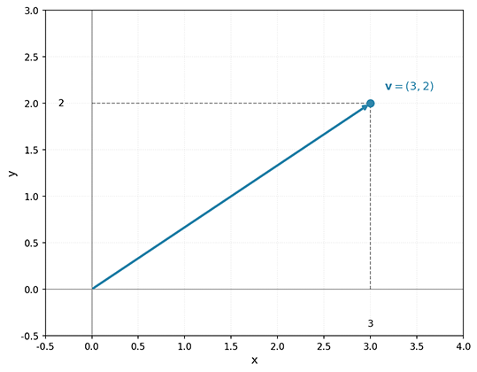
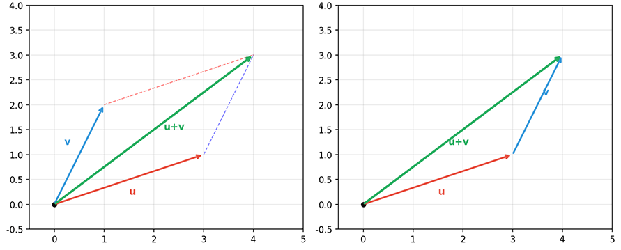
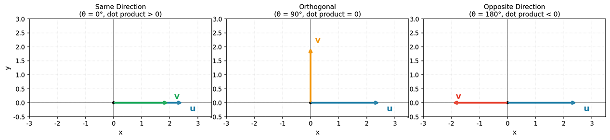
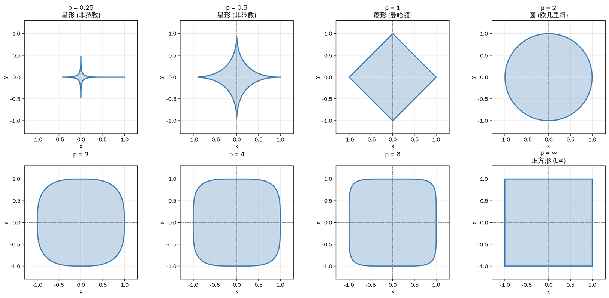

# Vector Basics

When we talk about machine learning, we often focus on complex algorithm models and impressive application scenarios, such as AlphaGo defeating a Go world champion, ChatGPT generating fluent and natural conversations, or autonomous driving cars navigating through busy city streets. We all know this is driven by artificial intelligence. However, if we dig deeper into the essence of AI, the underlying language that supports all of this is mathematics and logic, or more specifically, **Linear Algebra**.

Understanding concepts like [Vectors](vectors.md), [Matrices](matrices.md), and [Tensors](matrices.md#tensors) in linear algebra is not only an exploration of mathematical theory but also the key to unlocking the door to machine learning. This chapter will explain why linear algebra serves as the language of machine learning from two perspectives: algebraic definition and geometric intuition.

## Machine Learning Data

The core task of machine learning is to enable computers to learn patterns from historical data and then apply these patterns to new data. So, what is data? In the world of machine learning, data is vectors. Regardless of the original form of the data -- images, text, audio, tabular records, or other formats -- it is ultimately converted into numerical vectors before it can be processed by various machine learning algorithms.

Consider a simple example of house price prediction. If you want to predict the price of a house, what factors would you consider? These might include the house's area, number of bedrooms, number of bathrooms, age, distance to the nearest subway station, and so on. Each of these factors is called a **Feature**. Combining all features together gives us a feature vector (not to be confused with [eigenvectors](../linear/matrices.md#eigenvectors-and-eigenvalues) in matrices):

$$\mathbf{x} = (\text{area}, \text{bedrooms}, \text{bathrooms}, \text{age}, \text{distance to subway})$$

For a house with 90 m², 2 bedrooms, 1 bathroom, 5 years old, and 500 meters from the subway station, its feature vector can be expressed as:

$$\mathbf{x} = (90, 2, 1, 5, 500)$$

This is a five-dimensional vector. When you hear someone say "we need to build a machine learning model to predict house prices," what they really mean is finding patterns in this five-dimensional space and establishing a mapping from the feature vector $\mathbf{x}$ to the house price $\mathbf{y}$.

## Scalars and Vectors

A **Scalar** is a quantity that has only magnitude, no direction, and in pure mathematics, no unit. Scalars can be real or complex numbers, such as $3$, $-5.7$, $\pi$, etc. Scalars represent size or quantity and are the fundamental building blocks for more complex mathematical objects like vectors, [matrices](matrices.md), and [tensors](matrices.md#tensors).

A **Vector** is an ordered sequence of scalars. Mathematically, an $n$-dimensional vector $\mathbf{v}$ is defined as $\mathbf{v} = (v_1, v_2, \ldots, v_n)$. In a 2D plane, a vector can be understood as a directed arrow starting from the origin. For example, the vector $(3, 2)$ represents an arrow from the origin $(0, 0)$ to the point $(3, 2)$.



*Figure: A vector in 2D space*

Here $v_i$ is called the $i$-th **Component** of the vector, and $n$ is called the **Dimension** of the vector. An $n$-dimensional vector only exists in $n$-dimensional space, meaning it requires $n$ coordinate axes to be fully described. For example, $\mathbf{v} = (3, -1, 2)$ is a three-dimensional vector with components $v_1 = 3$, $v_2 = -1$, $v_3 = 2$. From a data science perspective, the dimension of a feature vector corresponds to the number of features. For instance, describing a house using three features -- "area, number of bedrooms, age" -- requires a three-dimensional vector. The names "[Dimension Table](https://zh.wikipedia.org/wiki/%E6%98%9F%E5%9E%8B%E6%A8%A1%E5%BC%8F#%E7%BB%B4%E8%A1%A8)" in big data systems and "[MDD Multi-Dimensional Database](https://scholar.google.com/scholar?q=Multi+Dimensional+Database)" in DBMS all originate from this concept.

A commonly confused concept related to dimension is the number of elements in a vector, often referred to as **Size** or **Length** in programming contexts. Dimension is a concept from the geometric perspective, meaning how many coordinate axes are needed to describe the vector; while the number of elements is a concept from the programming perspective, referring to the count of components in the vector. In pure mathematics, the length of a vector usually refers to its [magnitude/norm](#norms), not the number of components -- this differs from the programming context. For an $n$-dimensional vector $\mathbf{v} = (v_1, v_2, \ldots, v_n)$, its length is also $n$, which is numerically equal to its dimension. However, when we get to matrices and tensors, things differ. A $3 \times 4$ matrix has a shape of $3 \times 4$ (2D structure) but a length of 12 (total number of elements). A four-dimensional tensor in model training $(batch, channel, height, width)$ has a dimension of 4, and its length is $batch \times channel \times height \times width$.

The length of vectors and matrices determines the storage space required, while dimension is an important basis for checking compatibility in vector and matrix operations. For example, two matrices can be added only if they have the same dimensions, not necessarily the same length. For instance, a $2 \times 6$ matrix and a $3 \times 4$ matrix both have a length of 12, but they cannot be added together.

Another concept not frequently mentioned in mathematics but widely used in programming and machine learning frameworks (such as NumPy, PyTorch, TensorFlow) is **Shape**. Shape describes the storage structure of a vector in memory. It is represented as a tuple, indicating the size of the array in each dimension. For example:

| Representation | Shape | Mathematical Notation | Description |
|----------|------|------|------|
| 1D array | `(n,)` | $\begin{bmatrix} v_1 & v_2 & \cdots & v_n \end{bmatrix}$ | Only length, no row/column distinction |
| Row vector | `(1, n)` | $\mathbf{v} = \begin{bmatrix} v_1 & v_2 & \cdots & v_n \end{bmatrix}$ | 2D array with 1 row and $n$ columns |
| Column vector | `(n, 1)` | $\mathbf{v} = \begin{bmatrix} v_1 \\ v_2 \\ \vdots \\ v_n \end{bmatrix}$ | 2D array with $n$ rows and 1 column |

Unless otherwise specified, most linear algebra literature defaults to **column vectors**. In deep learning frameworks (such as PyTorch, TensorFlow), since data is typically stored in row-major order, the default tends to favor the row vector representation. In Python's NumPy framework, a 1D array can represent either a row vector or a column vector:

```python runnable
import numpy as np

# 1D array (default representation of a vector)
v = np.array([3, -1, 2])
print(f"Shape: {v.shape}")  # (3,) - 1D array

# Explicit row vector (2D array)
row_vector = v.reshape(1, -1)
print(f"Row vector shape: {row_vector.shape}")  # (1, 3)

# Explicit column vector (2D array)
col_vector = v.reshape(-1, 1)
print(f"Column vector shape: {col_vector.shape}")  # (3, 1)
```
::: tip Reading Note
Next, we will start from the definition of vectors and gradually discuss a series of concepts and principles related to vectors, calculus, and probability. These topics typically take an entire semester or more in university courses, so it is perfectly fine if you cannot understand or memorize everything at once. When these concepts are needed in later chapters, there will be **hyperlink** navigation back to the relevant content, allowing you to revisit them with specific application scenarios in mind.
:::

## Vector Space

A **Vector Space** is a more abstract mathematical concept. Let $V$ be a non-empty set and $\mathbb{F}$ be a field (usually the real field $\mathbb{R}$). If $V$ is closed under two operations -- vector addition and scalar multiplication -- and satisfies the following eight axioms, then $V$ is called a vector space over $\mathbb{F}$:

| Addition Axioms (4) | Scalar Multiplication Axioms (4) |
|----------------|---------------|
| 1. Commutativity: $\mathbf{u} + \mathbf{v} = \mathbf{v} + \mathbf{u}$ | 5. Distributivity of scalar multiplication over vector addition: $c(\mathbf{u} + \mathbf{v}) = c\mathbf{u} + c\mathbf{v}$ |
| 2. Associativity: $(\mathbf{u} + \mathbf{v}) + \mathbf{w} = \mathbf{u} + (\mathbf{v} + \mathbf{w})$ | 6. Distributivity of scalar multiplication over scalar addition: $(c + d)\mathbf{v} = c\mathbf{v} + d\mathbf{v}$ |
| 3. Zero vector exists: there exists $\mathbf{0}$ such that $\mathbf{v} + \mathbf{0} = \mathbf{v}$ | 7. Associativity of scalar multiplication: $c(d\mathbf{v}) = (cd)\mathbf{v}$ |
| 4. Inverse exists: for every $\mathbf{v}$, there exists $-\mathbf{v}$ such that $\mathbf{v} + (-\mathbf{v}) = \mathbf{0}$ | 8. Unit element: $1 \cdot \mathbf{v} = \mathbf{v}$ |

The above eight axioms rigorously guarantee the fundamental properties of vector operations. However, for non-mathematics readers, they may already seem quite verbose. Here, I suggest you use a bit of imagination and think of a vector space as an infinite blank sheet of paper, where every point can undergo two actions: "addition" and "scalar multiplication":

- **Addition**: Starting from the origin, first walk along vector $\mathbf{a}$, then along vector $\mathbf{b}$, which is equivalent to walking directly along $\mathbf{a} + \mathbf{b}$.
- **Scalar Multiplication**: You can stretch vector $\mathbf{a}$ by a factor of 2 to get $2\mathbf{a}$, or reverse its direction to get $-\mathbf{a}$.

Clearly, no matter how much we "add" or "scalar multiply," the result will still be on this infinite blank sheet of paper (closed under these operations), and these operations satisfy arithmetic rules like associativity and distributivity. In this case, the blank sheet of paper is called a vector space. Whether it is the rigorous eight axioms or the intuitive explanation of interpreting addition and scalar multiplication as point movements on a blank sheet of paper, both describe the same thing: elements within a vector space can "increase," "decrease," and "scale" each other, and no matter how operations are performed, the results never leave this set. In machine learning, we primarily focus on **Euclidean Space** $\mathbb{R}^n$, the set of all $n$-dimensional real vectors.

## Linear Dependence and Independence

Given a set of vectors $\mathbf{v}_1, \mathbf{v}_2, \ldots, \mathbf{v}_k$, if there exist scalars $c_1, c_2, \ldots, c_k$, not all zero, such that $c_1\mathbf{v}_1 + c_2\mathbf{v}_2 + \cdots + c_k\mathbf{v}_k = \mathbf{0}$, then the set of vectors is said to be **Linearly Dependent**. Otherwise, if the only solution is $c_1 = c_2 = \cdots = c_k = 0$, the set of vectors is said to be **Linearly Independent**.

The intuitive explanation of these two definitions is: linear independence means that no vector can be expressed by other vectors, much like a team composed of a programmer, a designer, and a product manager -- each member has unique skills and no one can replace another. Linear dependence means that at least one vector can be expressed as a linear combination of the others, analogous to having a "redundant" team member whose work can be done by others. From the perspective that data is vectors, linear dependence implies the presence of "redundant data" in the dataset.

The concept of **Rank** is frequently used in data science to measure the correlation among data. The definition of rank directly stems from measuring the degree of linear independence of a set of vectors -- it is the maximum number of linearly independent vectors in the set. A matrix is said to have **full rank**, meaning every piece of data has its significance. **Rank deficiency** can be understood as the presence of removable redundancy in the data. Once you understand the definition of rank, even without reading the later chapters on linear algebra applications, you can likely infer what the following common machine learning applications are doing:

- **Feature Selection**: If the rank of the feature matrix is less than the number of features, redundant features exist.
- **Data Compression**: Rank decomposition enables low-rank approximation, approximating the original matrix with fewer parameters, reducing dimensionality and storage space.
- **Singular Value Decomposition**: The rank equals the number of non-zero singular values, determining "how much is worth keeping."
- **Model LoRA Fine-Tuning**: Only the "low-rank adapter" is trained while the original model remains unchanged, achieving efficient fine-tuning with very few parameters.
- ... ...

According to the definition of rank, for a matrix, its rank equals the rank of its row vectors, which also equals the rank of its column vectors. Therefore, we can use the following code to determine whether a set of vectors is linearly dependent:

```python runnable
import numpy as np
from numpy.linalg import matrix_rank

# Determine whether a set of vectors is linearly independent
def is_linearly_independent(vectors):
    """
    Determine linear independence of a vector set using matrix rank
    If the rank equals the number of vectors, they are linearly independent
    """
    A = np.column_stack(vectors)  # Stack vectors into a matrix
    rank = matrix_rank(A)
    return rank == len(vectors)

# Example: three vectors in 3D space
v1 = np.array([1, 0, 0])
v2 = np.array([0, 1, 0])
v3 = np.array([0, 0, 1])  # Linearly independent with v1, v2

v4 = np.array([1, 1, 0])  # v4 = v1 + v2, linearly dependent with v1, v2

print(f"v1, v2, v3 linearly independent: {is_linearly_independent([v1, v2, v3])}")  # True
print(f"v1, v2, v4 linearly independent: {is_linearly_independent([v1, v2, v4])}")  # False
```

## Vector Addition and Scalar Multiplication

Earlier in the discussion of vector spaces, we introduced addition and scalar multiplication in an intuitive way. Vector addition and scalar multiplication are the two most fundamental operations in vector spaces, together forming the foundation of linear algebra. **Vector Addition** is defined as: for two vectors $\mathbf{u} = (u_1, \ldots, u_n)$ and $\mathbf{v} = (v_1, \ldots, v_n)$ of the same dimension, their sum is $\mathbf{u} + \mathbf{v} = (u_1 + v_1, u_2 + v_2, \ldots, u_n + v_n)$. There are two equivalent geometric interpretations of vector addition: the "parallelogram law" and the "triangle law":

- **Parallelogram Law**: Place the tails of vectors $\mathbf{u}$ and $\mathbf{v}$ at the same point, construct a parallelogram with them as adjacent sides, and the diagonal from the common starting point is $\mathbf{u} + \mathbf{v}$.

- **Triangle Law**: Place the tail of $\mathbf{v}$ at the head of $\mathbf{u}$, and the vector from the tail of $\mathbf{u}$ to the head of $\mathbf{v}$ is $\mathbf{u} + \mathbf{v}$.



*Figure: Parallelogram law and triangle law*

**Scalar Multiplication** is defined as the product of a scalar and a vector: $c\mathbf{v} = (cv_1, cv_2, \ldots, cv_n)$. The geometric meaning of scalar multiplication is more intuitive than addition -- it is simply scaling the vector by a factor of $c$:

- When $c > 0$: the vector's length is scaled by $|c|$, direction unchanged
- When $c < 0$: the vector's length is scaled by $|c|$, direction reversed
- When $c = 0$: the result is the zero vector $\mathbf{0}$

Almost all vector operations are composed of these two basic operations. A **Linear Combination** is a composite operation of vector addition and scalar multiplication. Given vectors $\mathbf{v}_1, \mathbf{v}_2, \ldots, \mathbf{v}_k$ and scalars $c_1, c_2, \ldots, c_k$, their linear combination is $c_1\mathbf{v}_1 + c_2\mathbf{v}_2 + \cdots + c_k\mathbf{v}_k$.

## Subspace

A **Subspace** is a subset $W$ of a vector space $V$ that satisfies the following properties:
1. Contains the zero vector: $\mathbf{0} \in W$
2. Closed under addition: $\mathbf{u}, \mathbf{v} \in W \Rightarrow \mathbf{u} + \mathbf{v} \in W$
3. Closed under scalar multiplication: $\mathbf{v} \in W, c \in \mathbb{R} \Rightarrow c\mathbf{v} \in W$

Let me give an intuitive explanation. Imagine you are standing on an outdoor playground (a 3D space) under the sun. With the tips of your toes as the origin, your shadow is cast on the ground by sunlight. This shadow on the ground is a 2D subspace of your 3D body. Any point on the shadow can be described using two directions -- "east-west" and "north-south" -- but no longer needs the "up-down" (height) dimension. To describe this scenario in the mathematical language of subspaces: in three-dimensional space $\mathbb{R}^3$, all vectors of the form $(x, y, 0)$ constitute a subspace -- the $xy$-plane. This plane satisfies three rules: "contains the origin $(0,0,0)$," "the sum of two points on the plane is still on the plane," and "any point on the plane, after scaling, remains on the plane." Similarly, in the 2D plane $\mathbb{R}^2$, any line passing through the origin is a subspace. All points of the form $(t, 2t)$ (the line $y=2x$) form a one-dimensional subspace. This line passes through the origin, the sum of two points on the line is still on the line, and any point on the line, after scaling, remains on the line.

The concept of subspaces is widely applied in dimensionality reduction, feature engineering, and other machine learning tasks. For example, the principal component directions found by [PCA](../../statistical-learning/unsupervised-learning/dimensionality-reduction.md#pca-mathematical-principles) form a low-dimensional subspace.

## Inner Product and Projection

When the concept of numbers is extended from scalars to vectors, the multiple scalars that constitute a vector can be multiplied in different ways, yielding different results. Therefore, "multiplication" for vectors (and subsequently for matrices and tensors) becomes a term that must be carefully distinguished based on context or mathematical notation. For example, multiplying corresponding elements of two vectors of the same dimension yields a vector of the same dimension -- this is called the [Hadamard Product](https://en.wikipedia.org/wiki/Hadamard_product). Multiplying the elements of an $m$-dimensional column vector with those of an $n$-dimensional row vector produces an $m \times n$ matrix -- this is called the [Outer Product](https://en.wikipedia.org/wiki/Outer_product). There is also the [Kronecker Product](https://en.wikipedia.org/wiki/Kronecker_product), which is the generalization of the outer product to higher-dimensional tensors. Another example is the [Cross Product](https://en.wikipedia.org/wiki/Cross_product), which is limited to 3D space but is common in computer graphics (computing surface normals) and physics (torque, angular momentum), among others.

Since our discussion has not yet covered matrices and tensors, we will focus here on the **Inner Product** of vectors and its applications. The inner product, also called the **Dot Product**, is defined algebraically as $\mathbf{u} \cdot \mathbf{v} = \sum_{i=1}^{n} u_i v_i = u_1v_1 + u_2v_2 + \cdots + u_nv_n$. The inner product satisfies the following properties:
1. Commutativity: $\mathbf{u} \cdot \mathbf{v} = \mathbf{v} \cdot \mathbf{u}$
2. Distributivity: $\mathbf{u} \cdot (\mathbf{v} + \mathbf{w}) = \mathbf{u} \cdot \mathbf{v} + \mathbf{u} \cdot \mathbf{w}$
3. Scalar multiplication associativity: $(c\mathbf{u}) \cdot \mathbf{v} = c(\mathbf{u} \cdot \mathbf{v})$
4. Non-negativity: $\mathbf{v} \cdot \mathbf{v} \geq 0$, equality holds if and only if $\mathbf{v} = \mathbf{0}$

The geometric definition of the inner product is more intuitive than the algebraic one. It is expressed as $\mathbf{u} \cdot \mathbf{v} = \|\mathbf{u}\| \|\mathbf{v}\| \cos\theta$, where $\theta$ is the angle between the two vectors and $\|\cdot\|$ denotes the magnitude (the [L2 norm](#norms)). The inner product captures the angular relationship between two vectors geometrically. When the inner product is zero, the two vectors are orthogonal (perpendicular); when positive, the angle is acute; when negative, the angle is obtuse. These different angles essentially measure the "degree of alignment" between the directions of the two vectors. When two vectors point in the same direction ($\theta = 0^\circ$), the cosine is 1 ($\cos\theta = 1$), the inner product reaches its maximum, indicating high correlation. When two vectors are perpendicular ($\theta = 90^\circ$), the cosine is 0 ($\cos\theta = 0$), the inner product is zero, indicating they are independent and uncorrelated. When two vectors point in opposite directions ($\theta = 180^\circ$), the cosine is $-1$ ($\cos\theta = -1$), the inner product is at its negative maximum, indicating a negative correlation.



*Figure: Geometric meaning of the dot product, from left to right: same direction (positive dot product), orthogonal (zero dot product), opposite direction (negative dot product)*

Machine learning extensively uses **Cosine Similarity**, derived from the inner product, to measure the similarity of text, images, and other data. The definition of cosine similarity follows directly from the geometric definition of the inner product: $cosine\_similarity(\mathbf{u}, \mathbf{v}) = \frac{\mathbf{u} \cdot \mathbf{v}}{\|\mathbf{u}\| \|\mathbf{v}\|}$. As can be seen, it is the inner product with the magnitude removed (dividing both sides of $\mathbf{u} \cdot \mathbf{v} = \|\mathbf{u}\| \|\mathbf{v}\| \cos\theta$ by $\|\mathbf{u}\| \|\mathbf{v}\|$). This indicates that cosine similarity only cares about the direction of vectors, not their length. This property makes it very useful in text similarity tasks, reflecting the real-world scenario that "a short passage and a long article can very well describe the same meaning."

The inner product builds a bridge between algebra and geometry. Through algebraic computation, we can obtain geometric quantities such as the angle between vectors ($\cos\theta = \frac{\mathbf{u} \cdot \mathbf{v}}{\|\mathbf{u}\| \|\mathbf{v}\|}$) and vector length ($\|\mathbf{v}\| = \sqrt{\mathbf{v} \cdot \mathbf{v}}$). We can also precisely describe geometric concepts like orthogonality ($\mathbf{u} \cdot \mathbf{v} = 0$) and projection ($\text{proj}_u(v) = \frac{v \cdot u}{u \cdot u} u$) using algebraic expressions. It is no exaggeration to say that the inner product completely unifies the "computation" and "visualization" of vectors.

**Projection** is a geometric operation closely related to the inner product. The projection of vector $\mathbf{u}$ onto vector $\mathbf{v}$ can be expressed as $\text{proj}_{\mathbf{v}} \mathbf{u} = \frac{\mathbf{u} \cdot \mathbf{v}}{\mathbf{v} \cdot \mathbf{v}} \mathbf{v} = \frac{\mathbf{u} \cdot \mathbf{v}}{\|\mathbf{v}\|^2} \mathbf{v}$, with its length (scalar) being $\frac{\mathbf{u} \cdot \mathbf{v}}{\|\mathbf{v}\|}$. Geometrically, projection describes the "shadow" of vector $\mathbf{u}$ in the direction of $\mathbf{v}$ -- it is the component of $\mathbf{u}$ along $\mathbf{v}$. You can think of it as the shadow cast by $\mathbf{u}$ on the line of $\mathbf{v}$ when a beam of light is shining perpendicular to $\mathbf{v}$. The result $\text{proj}_{\mathbf{v}} \mathbf{u}$ is a vector pointing in the same (or opposite) direction as $\mathbf{v}$, with its magnitude reflecting the "influence" of $\mathbf{u}$ in the direction of $\mathbf{v}$. Projection has a wide range of applications in various scientific fields, including:

- **Data Dimensionality Reduction**: In Principal Component Analysis (PCA), the projection of data points onto principal component directions determines their coordinate values along that dimension. Dimensionality reduction is achieved by retaining high-variance projection dimensions.
- **Signal Processing**: Projecting signals onto specific basis functions is used for filtering, noise removal, or feature extraction. For example, the Fourier Transform is essentially projecting a signal onto sine waves of different frequencies.
- **Machine Learning**: The solution process of least squares linear regression essentially involves projecting the response vector onto the column space of the design matrix to find the best-fit hyperplane.
- **Computer Graphics**: Displaying 3D objects on a 2D screen requires projection transformations, including orthogonal projection and perspective projection.
- **Physics and Mechanics**: Decomposing forces into components along a certain direction (such as decomposing gravity on an inclined plane into sliding force and normal force).
- ... ...

Through the geometric explanations of vector representation, addition, inner product, and projection, we reveal the perfect correspondence between geometry and algebra in linear algebra. This correspondence allows us to use geometric intuition to understand the conceptual meaning of data while using algebraic methods to precisely compute the relationships between data. Within the limited space available, my primary approach to explaining these linear algebra concepts has been to use relatively intuitive geometric interpretations to clarify otherwise abstract and obscure algebraic principles. The following table lists more such examples:

| Geometric Concept | Algebraic Representation | Real-World Meaning |
|---------|---------|---------|
| Addition | $\mathbf{u} + \mathbf{v} = (u_1+v_1, \ldots, u_n+v_n)$ | The combined effect of data, such as the resultant force from two directions or the comprehensive impact of multiple features |
| Length | $\|\|\mathbf{v}\|\|_2 = \sqrt{v_1^2 + \cdots + v_n^2}$ | The "scale" or "intensity" of data, such as signal energy or vector magnitude |
| Angle | $\cos\theta = \frac{\mathbf{u} \cdot \mathbf{v}}{\|\|\mathbf{u}\|\| \|\|\mathbf{v}\|\|}$ | Correlation between data -- smaller angle means greater similarity, used in recommendation systems and semantic search |
| Orthogonality | $\mathbf{u} \cdot \mathbf{v} = 0$ | Data are independent and uncorrelated, such as orthogonal principal components in [PCA](../../statistical-learning/unsupervised-learning/dimensionality-reduction.md) representing uncorrelated features |
| Projection | $\text{proj}_{\mathbf{v}} \mathbf{u} = \frac{\mathbf{u} \cdot \mathbf{v}}{\|\|\mathbf{v}\|\|^2} \mathbf{v}$ | The "shadow" of data in a particular direction, used in dimensionality reduction and feature extraction |
| [Linear Transformation](matrices.md#geometric-intuition-of-linear-transformations) | Matrix multiplication $\mathbf{Ax}$ | Data transformation, rotation, or scaling, such as weight transformations in neural networks |

When faced with higher-dimensional scenarios, although we cannot directly visualize 4D, 5D, or even higher-dimensional spaces, the operational rules of linear algebra hold in any dimension. This abstracting ability is precisely what makes mathematics such a powerful tool. When working on machine learning problems, we often deal with high-dimensional vectors. For example, [GloVe](../../deep-learning/sequence-models/word-embedding.md#pretrained-word-vectors) word vectors are typically 300-dimensional, and [BERT](../../language-models/architecture-basics/transformer-architecture.md#encoder-only-bert) sentence vectors can reach 768 dimensions or more. Although we cannot visualize them, we can still apply operations such as inner products, transformations, and projections to find relationships between vectors. Of course, high-dimensional spaces also have some counter-intuitive properties. For instance, in high-dimensional spaces, most points are distributed near the "edges" rather than the central region, which has important implications for understanding the behavior of certain machine learning algorithms.

## Basis, Orthogonal Basis and Orthonormal Basis

A **Basis** is a set of linearly independent vectors in a vector space such that any vector in the space can be expressed as a linear combination of these basis vectors. Just as we commonly use the $x$, $y$, and $z$ axes to describe any position in 3D space, a basis provides a language for describing all vectors in a vector space. For example, consider the basis vectors $\mathbf{e}_1 = (1, 0)$ and $\mathbf{e}_2 = (0, 1)$ for the 2D plane $\mathbb{R}^2$. The vector $(3, 2)$ can be expressed as $(3, 2) = 3\cdot\mathbf{e}_1 + 2\cdot\mathbf{e}_2 = 3\cdot(1,0) + 2\cdot(0,1)$. Here, 3 and 2 are the coordinates of this vector in this basis.

Just like the relationship between a square and a parallelogram, or between a Cartesian coordinate system and a general coordinate system, among all basis vectors, there is a special subset where each pair of vectors is orthogonal, called an **Orthogonal Basis**. The example above, $\mathbf{e}_1 = (1, 0)$ and $\mathbf{e}_2 = (0, 1)$, is an orthogonal basis. Furthermore, if every vector in an orthogonal basis is a unit vector (magnitude 1), we call it an **Orthonormal Basis**. Based on the definitions of orthogonality and unit magnitude, an orthonormal basis $\{\mathbf{e}_1, \mathbf{e}_2, \ldots, \mathbf{e}_n\}$ satisfies: $\mathbf{e}_i \cdot \mathbf{e}_j = \begin{cases} 1, & i = j \\ 0, & i \neq j \end{cases}$. The most commonly used orthonormal basis is the **Standard Basis**:

- $\mathbf{e}_1 = (1, 0, 0, \ldots, 0)$
- $\mathbf{e}_2 = (0, 1, 0, \ldots, 0)$
- ...

An orthonormal basis makes coordinate computation simple. The $i$-th coordinate of a vector $\mathbf{v}$ under an orthonormal basis is $\mathbf{v} \cdot \mathbf{e}_i$. For a non-orthogonal basis, you would need to solve a system of linear equations to find the coordinates -- while still achievable, it is considerably more cumbersome.

## Norms

A **Norm** functions like a ruler, serving as a measure of the "size" of a vector -- think of it as computing the length of a vector. The **Magnitude** mentioned earlier is one type of norm (specifically the L2 norm). The rigorous definition of this concept -- colloquially described as "finding the length of a vector" -- is a function $\|\cdot\|: V \to \mathbb{R}$. The symbol "$\|$" looks like an "enhanced" version of the absolute value symbol "|", and it is the norm symbol, representing the generalization of absolute value to higher-dimensional spaces. "$\cdot$" is a placeholder meaning "place a vector here." $V \to \mathbb{R}$ indicates a mapping from vector space $V$ (the set of all vectors) to the real numbers $\mathbb{R}$, meaning the norm turns a vector into an ordinary number (a scalar measuring length/size). A norm satisfies the following properties:

1. Non-negativity: $\|\mathbf{v}\| \geq 0$, equality holds if and only if $\mathbf{v} = \mathbf{0}$ (meaning: only the zero vector has a norm of 0).
2. Homogeneity: $\|c\mathbf{v}\| = |c| \|\mathbf{v}\|$ (meaning: after scalar multiplication, the length scales proportionally).
3. Triangle inequality: $\|\mathbf{u} + \mathbf{v}\| \leq \|\mathbf{u}\| + \|\mathbf{v}\|$ (meaning: the sum of two sides of a triangle is greater than the third side).

That covers the mathematical content. As usual, let me provide an intuitive explanation. By now, some readers might wonder: what does it mean that magnitude is "one type" of norm? Since length is already a scalar, how can there be different types? And what is the L2 norm -- are there L1, L3 norms too?

Let us first consider a real-world scenario: a user checks the distance from Shenzhen to Zhuhai using a navigation app. The search results show a distance of approximately 67 km. When the user clicks the navigation button, the planned route length is 112 km. Obviously, the difference arises because the two distances have different meanings. The former is the straight-line distance in space, but the user cannot fly directly across; the latter is the "taxicab distance" that accounts for actual travel routes.

Analogizing this real-world scenario to norms: finding the straight-line distance between two points (for convenience, we translate one point to the origin of the vector space, as translation does not change the distance) is the **L2 norm** (Euclidean norm). From the name, it is easy to recall the Euclidean distance formula in elementary plane analytic geometry: $d = \sqrt{(x_1-x_2)^2+(y_1-y_2)^2}$. When one point is the origin, the formula for the distance from the other point to the origin simplifies to $d = \sqrt{x_1^2+y_1^2}$.

More generally, extending from the 2D plane to higher-dimensional spaces, the L2 norm computes the straight-line distance from vector $\mathbf{v}$ to the origin, with the formula $\|\mathbf{v}\|_2 = \sqrt{v_1^2 + v_2^2 + \cdots + v_n^2}$. By the same analogy, if we want the total distance traveled only along coordinate axes between two points -- similar to a navigation route that can only follow roads -- this is called the **L1 norm** (Manhattan norm). It is computed by summing the absolute distances of the vector's components along each axis, with the formula $\|\mathbf{v}\|_1 = \sum_{i=1}^{n} |v_i| = |v_1| + |v_2| + \cdots + |v_n|$.

Building on the L1 and L2 norms, mathematicians further generalized to the **$L_p$ norm**, defined as $\|\mathbf{v}\|_p = \left( \sum_{i=1}^{n} |v_i|^p \right)^{1/p}$. Compare this with the earlier formulas for the L1 and L2 norms -- it is easy to see that those are special cases of the $L_p$ norm when $p=1$ and $p=2$, respectively. Similarly, if we substitute $p=0$, we obtain the L0 norm ($\|\mathbf{v}\|_0 = \sum_{i=1}^{n} \mathbf{1}_{v_i \neq 0}$). From the formula, this is essentially counting the number of non-zero elements in the vector. Strictly speaking, the "L0 norm" is not a true norm (it does not satisfy homogeneity: $|\alpha \mathbf{x}|_0 \neq |\alpha| \cdot |\mathbf{x}|_0$), but due to its formal similarity to the $L_p$ norm family, it is still conventionally referred to as such. As a thought exercise, consider what the formula for the $\|\mathbf{v}\|_\infty$ norm would be when $p=\infty$, and what meaning it should have based on the formula.

The most intuitive way to understand $L_p$ norms from a geometric perspective is to observe the shape of the **Unit Ball**. The unit ball is the set of all vectors satisfying $\|\mathbf{v}\|_p = 1$ -- the boundary of all points that are "exactly at distance 1 from the origin" under a given norm definition. In a 2D plane, the unit ball is actually a closed curve, called the **unit ball boundary**.



*Figure: Unit ball shapes for different $p$ values. From left to right: $p=0.25, 0.5, 1, 2, 3, 4, 6, \infty$, showing the transition from star → diamond → circle → square*

Observing the figure above, several key features can be identified:

| $p$ value | Unit ball shape | Geometric characteristics |
|-------|-----------|---------|
| $p = \infty$ | Square | Boundary parallel to coordinate axes, $\|\mathbf{v}\|_\infty = \max(|v_1|, |v_2|, \ldots, |v_n|)$ |
| $p = 2$ | Circle | Classic Euclidean distance, uniform measurement in all directions -- this is the familiar distance from elementary plane analytic geometry |
| $p = 1$ | Diamond | Manhattan distance, four vertices on the coordinate axes |
| $p < 1$ | Star / concave toward origin | Shape "indents" toward the origin; at this point $\|\cdot\|_p$ is no longer a true norm (does not satisfy the triangle inequality) |

The shape of the unit ball reveals the essence of the $L_p$ norm: the larger the $p$ value, the more "square-like" the unit ball, emphasizing the maximum component. The smaller the $p$ value, the more "pointed" the unit ball, favoring sparser vectors. From a mathematical perspective, when $p \geq 1$, the unit ball is a [convex set](https://en.wikipedia.org/wiki/Convex_set), which ensures the triangle inequality holds for the norm. When $p < 1$, the unit ball is concave toward the origin and is no longer convex, so strictly speaking, it cannot be called a norm.

In machine learning, norms permeate the entire process of model design, training, and optimization. Take their role in [Regularization](../../statistical-learning/linear-models/regularization-glm.md#regularization-principles) as an example: one important type of risk in model training is overfitting. Suppose we train a student test-taking model using a large number of college entrance exam questions. We hope the model can understand the problem-solving strategies and methods, so that it can score well on the next actual exam. We do not want the model to simply memorize the answers to all past exam questions -- getting perfect scores on historical questions but being clueless about new ones. This phenomenon of merely memorizing training data while lacking generalization ability is called overfitting. Regularization is essentially a technique to prevent the model from "rote memorizing" training data, encouraging it to learn "general patterns" rather than "memorizing answers." In machine learning, regularization adds a penalty for model complexity to the loss function, forcing the model to learn simpler, more generalizable patterns. Since we have not yet covered model training, we cannot further elaborate on this topic here -- it will be discussed in later chapters on regularization in model training.

## Summary

This chapter started with vectors -- the most fundamental object of study in linear algebra -- and systematically built the mathematical foundation needed to understand machine learning algorithms.

- **The nature and representation of vectors**. A vector is an ordered sequence of scalars and serves as a structured representation of data. Understanding concepts such as dimension, length, and shape is a prerequisite for correctly using machine learning frameworks (such as NumPy, PyTorch) for data manipulation. The column vector, as the default representation, is used throughout subsequent matrix operations.

- **The algebraic structure of vector spaces**. A vector space rigorously defines the closure of addition and scalar multiplication through eight axioms. The concepts of linear dependence and independence directly lead to the core measure of **rank**. Rank not only measures data redundancy but also serves as the theoretical foundation for techniques such as feature selection, data compression, and LoRA fine-tuning.

- **The inner product: a bridge between algebra and geometry**. The algebraic definition of the inner product (sum of pairwise products of corresponding components) is equivalent to its geometric definition (product of magnitudes and cosine of the included angle). This property allows us to obtain geometric features of vectors through purely algebraic computation. Cosine similarity, derived from the inner product, is widely used in text similarity computation and recommendation systems, while projection is the mathematical foundation of [PCA dimensionality reduction](../../statistical-learning/unsupervised-learning/dimensionality-reduction.md), signal processing, and least squares regression.

- **Basis selection and coordinate representation**. A basis provides a "language" for describing a vector space. Orthogonal bases and orthonormal bases are widely used due to their favorable geometric properties. An orthonormal basis simplifies coordinate computation to inner product operations, avoiding the cumbersome process of solving systems of linear equations.

- **Norms: multi-faceted measurement tools**. From the "Manhattan distance" of the L1 norm to the "Euclidean distance" of the L2 norm, different norms reflect different measurement perspectives. Norms are not only tools for measuring vector magnitude but also the core of regularization techniques. By introducing norm penalties into the loss function, we can effectively prevent model overfitting and improve generalization ability.

These concepts are interconnected and build upon each other: vector space defines the stage for operations, linear dependence characterizes the redundancy structure of data, the inner product establishes the connection between algebra and geometry, orthogonal bases provide an optimal coordinate system, and norms equip us with multi-faceted tools for measuring data. Mastering these fundamentals will lay a solid foundation for subsequently learning about matrices, linear transformations, and more complex machine learning algorithms.

The next chapter introduces matrices -- the natural extension of vectors -- and the geometric meaning of linear transformations.

## Exercises

1. Determine whether the following set of vectors is linearly dependent. Provide your reasoning: $\mathbf{v}_1 = (1, 2, 3)$, $\mathbf{v}_2 = (2, 4, 6)$, $\mathbf{v}_3 = (1, 1, 1)$.
    <details>
    <summary>Reference Answer</summary>

    This set of vectors is linearly dependent.

    Observe that $\mathbf{v}_2 = 2\mathbf{v}_1$, meaning $\mathbf{v}_2$ can be expressed linearly in terms of $\mathbf{v}_1$. Therefore, there exist coefficients not all zero, $c_1 = 2, c_2 = -1, c_3 = 0$, such that $2\mathbf{v}_1 - \mathbf{v}_2 + 0\mathbf{v}_3 = \mathbf{0}$.

    Using rank to determine: stacking these three vectors into a matrix, its rank is 2 (less than the number of vectors, 3), hence they are linearly dependent. This means there is redundancy in the dataset -- the information provided by $\mathbf{v}_2$ is entirely contained in $\mathbf{v}_1$.
    </details>

1. Compute the dot product of vectors $\mathbf{u} = (1, 1)$ and $\mathbf{v} = (1, 0)$, their magnitudes, and the angle $\theta$ between them.
    <details>
    <summary>Reference Answer</summary>

    Dot product: $\mathbf{u} \cdot \mathbf{v} = 1 \times 1 + 1 \times 0 = 1$

    Magnitudes: $\|\mathbf{u}\| = \sqrt{1^2 + 1^2} = \sqrt{2}$, $\|\mathbf{v}\| = \sqrt{1^2 + 0^2} = 1$

    Angle: $\cos\theta = \frac{\mathbf{u} \cdot \mathbf{v}}{\|\mathbf{u}\| \|\mathbf{v}\|} = \frac{1}{\sqrt{2} \times 1} = \frac{1}{\sqrt{2}}$

    Therefore $\theta = 45^\circ$ (or $\frac{\pi}{4}$ radians).

    This result is geometrically intuitive: the vector $(1, 1)$ lies on the diagonal in the first quadrant, and its angle with the x-axis direction $(1, 0)$ is indeed 45$^\circ$.
    </details>

1. In text analysis, the term frequency vectors of two documents are $\mathbf{d}_1 = (3, 0, 1, 2)$ and $\mathbf{d}_2 = (1, 2, 0, 1)$. Compute their cosine similarity and explain its meaning.
    <details>
    <summary>Reference Answer</summary>

    Dot product: $\mathbf{d}_1 \cdot \mathbf{d}_2 = 3 \times 1 + 0 \times 2 + 1 \times 0 + 2 \times 1 = 5$

    Magnitudes: $\|\mathbf{d}_1\| = \sqrt{9 + 0 + 1 + 4} = \sqrt{14}$, $\|\mathbf{d}_2\| = \sqrt{1 + 4 + 0 + 1} = \sqrt{6}$

    Cosine similarity: $\cos\theta = \frac{5}{\sqrt{14} \times \sqrt{6}} = \frac{5}{\sqrt{84}} \approx 0.545$

    This indicates that the two documents have some similarity in content, but they are not highly similar. Cosine similarity only cares about direction (the relative proportions of term frequencies) and ignores length (total word count), so documents of different lengths can still be compared for similarity.
    </details>

1. Compute the projection of vector $\mathbf{u} = (3, 4)$ onto vector $\mathbf{v} = (1, 0)$. What is the geometric meaning of the projection result?
    <details>
    <summary>Reference Answer</summary>

    Projection formula: $\text{proj}_{\mathbf{v}} \mathbf{u} = \frac{\mathbf{u} \cdot \mathbf{v}}{\mathbf{v} \cdot \mathbf{v}} \mathbf{v}$

    Compute: $\mathbf{u} \cdot \mathbf{v} = 3 \times 1 + 4 \times 0 = 3$

    $\mathbf{v} \cdot \mathbf{v} = 1^2 + 0^2 = 1$

    Therefore the projection is: $\text{proj}_{\mathbf{v}} \mathbf{u} = \frac{3}{1} \times (1, 0) = (3, 0)$

    Geometric meaning: the projection $(3, 0)$ is the "shadow" of the vector $(3, 4)$ on the x-axis. This is equivalent to decomposing the vector into an x-direction component $(3, 0)$ and a y-direction component $(0, 4)$. In dimensionality reduction applications, projection retains the information of the vector in the target direction while discarding information in other directions.
    </details>

1. Determine whether the set of all vectors of the form $(x, y, x+y)$ in $\mathbb{R}^3$ forms a subspace. Which conditions need to be verified?
    <details>
    <summary>Reference Answer</summary>

    Three conditions must be verified:

    1. **Contains the zero vector**: When $x = 0, y = 0$, $(0, 0, 0)$ belongs to the set. ✓

    2. **Closed under addition**: Let $\mathbf{u} = (a, b, a+b)$ and $\mathbf{v} = (c, d, c+d)$. Then $\mathbf{u} + \mathbf{v} = (a+c, b+d, a+b+c+d) = (a+c, b+d, (a+c)+(b+d))$, which still satisfies the form $z = x+y$. ✓

    3. **Closed under scalar multiplication**: Let $\mathbf{v} = (x, y, x+y)$. Then $k\mathbf{v} = (kx, ky, k(x+y)) = (kx, ky, kx+ky)$, which still satisfies the form. ✓

    Therefore, this set constitutes a subspace. Geometrically, this is a plane passing through the origin, with equation $z = x + y$ (or $x + y - z = 0$).
    </details>

1. Verify whether the set of vectors $\mathbf{e}_1 = (1, 0, 0)$, $\mathbf{e}_2 = (0, 1, 0)$, $\mathbf{e}_3 = (0, 0, 1)$ forms an orthonormal basis, and write the coordinate representation of vector $\mathbf{v} = (2, -3, 5)$ under this basis.
    <details>
    <summary>Reference Answer</summary>

    Verify orthogonality:
    $\mathbf{e}_1 \cdot \mathbf{e}_2 = 0$, $\mathbf{e}_1 \cdot \mathbf{e}_3 = 0$, $\mathbf{e}_2 \cdot \mathbf{e}_3 = 0$

    Verify unit length:
    $\|\mathbf{e}_1\| = \|\mathbf{e}_2\| = \|\mathbf{e}_3\| = 1$

    Therefore, this is an orthonormal basis.

    The coordinates of vector $\mathbf{v}$ under this basis are:
    $v_1 = \mathbf{v} \cdot \mathbf{e}_1 = 2$, $v_2 = \mathbf{v} \cdot \mathbf{e}_2 = -3$, $v_3 = \mathbf{v} \cdot \mathbf{e}_3 = 5$

    That is, $\mathbf{v} = 2\mathbf{e}_1 - 3\mathbf{e}_2 + 5\mathbf{e}_3$.

    The advantage of an orthonormal basis is that coordinates can be directly obtained through inner products, without needing to solve a system of linear equations.
    </details>

1. In a neural network, the input vector of a certain layer is $\mathbf{x} = (1, 2)$, the weight matrix is $\mathbf{W} = \begin{bmatrix} 0.5 & 0.3 \\ 0.2 & 0.4 \end{bmatrix}$, and the bias vector is $\mathbf{b} = (0.1, 0.2)$. Compute the output of this layer $\mathbf{y} = \mathbf{Wx} + \mathbf{b}$, and explain the computation process from the perspective of linear combination.
    <details>
    <summary>Reference Answer</summary>

    Compute $\mathbf{Wx}$:
    $\mathbf{Wx} = \begin{bmatrix} 0.5 & 0.3 \\ 0.2 & 0.4 \end{bmatrix} \begin{bmatrix} 1 \\ 2 \end{bmatrix} = \begin{bmatrix} 0.5 \times 1 + 0.3 \times 2 \\ 0.2 \times 1 + 0.4 \times 2 \end{bmatrix} = \begin{bmatrix} 1.1 \\ 1.0 \end{bmatrix}$

    Add bias: $\mathbf{y} = \mathbf{Wx} + \mathbf{b} = (1.1, 1.0) + (0.1, 0.2) = (1.2, 1.2)$

    Linear combination explanation:
    Each row of the weight matrix defines a linear combination. The first component of the output vector $y_1 = 0.5x_1 + 0.3x_2 + 0.1$ is a linear combination of the input vector (plus bias); similarly, $y_2 = 0.2x_1 + 0.4x_2 + 0.2$.

    The essence of a neural network is to process data layer by layer through a large number of such linear transformations (plus non-linear activation functions). Each layer recombines the output of the previous layer to extract new feature representations.
    </details>
