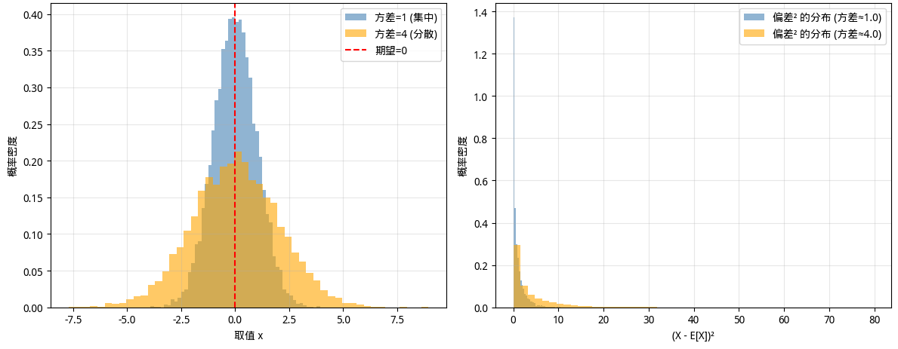
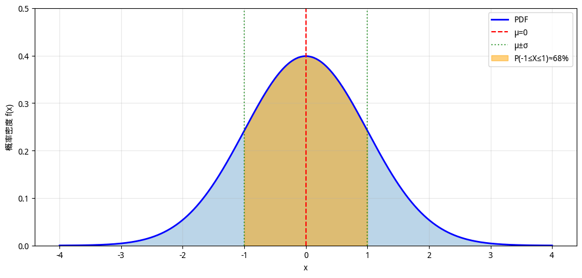

# Probability Basics

If linear algebra is the "data language" of machine learning -- it tells computers how to represent and organize data -- and calculus is the "optimization behavior" of machine learning -- it tells computers how to learn and improve from data -- then **Statistics and Probability Theory** is the "decision-making philosophy" of machine learning, which tells computers how to make rational judgments and predictions in an uncertain world.

Statistics and probability theory form the final part of the prerequisite mathematical foundations for machine learning. Before discussing the relevant knowledge, let us first review the positions of linear algebra, calculus, and probability and statistics within the entire machine learning framework. These three pillars support machine learning as its mathematical foundation, and although their main application directions and roles differ, they are closely intertwined and interdependent.

- **Linear algebra** provides the representation of data. Whether the raw data is images, text, or tables, it must ultimately be transformed into vectors or matrices. Without this representation, subsequent computation is impossible.
- **Calculus** provides the optimization method for models. Through gradient descent and backpropagation algorithms, models can adjust parameters from data and gradually approach the optimal solution. Without this method, models cannot improve themselves.
- **Probability and statistics** provide the decision-making framework for prediction. When a model encounters new, unseen data, it does not give a definitive answer but instead offers a probabilistic judgment, such as "there is an 85% chance it is a cat" or "the confidence interval for the predicted house price between 300 and 350 million is 90%." This probabilistic thinking is the key characteristic that distinguishes machine learning from traditional programming.

## Probabilistic Thinking

For those accustomed to traditional software development, the greatest challenge in learning probability and statistics may not be the mathematical formulas themselves, but rather the shift in mindset. The consistent mindset of traditional software development is **determinism**. Programmers are accustomed to the same input always producing the same output; they are accustomed to code logic being clear and predictable; they are accustomed to errors being precisely locatable and fixable. A programmer's job is to design a set of rules and logic that covers all possible input scenarios and gives deterministic output responses. However, the core idea of machine learning is to learn patterns from data rather than having humans design rules. Because data inherently contains noise, sample sizes are limited, and models are simplifications of the real world, the predictions and processes of machine learning are inherently **probabilistic**. This probabilistic thinking requires programmers entering the era of machine learning to become accustomed to:

- **Accepting uncertainty**: Model predictions are not "correct answers" but "the most likely answers." We need to understand this uncertainty rather than try to eliminate it.
- **Quantifying confidence**: When making decisions, we need to look not only at the prediction result but also at the confidence level. "85% confidence it is a cat" and "55% confidence it is a cat" lead to completely different decision logic.
- **Managing risk**: In fields such as medical diagnosis and financial forecasting, the cost of errors varies. Probabilistic thinking allows us to weigh risks and rewards and make optimal decisions.
- ...

Why can't machine learning give deterministic answers like traditional programming? The fundamental reason is that machine learning models are simulations of the real world and are inherently incomplete in information. Therefore, the following problems are unavoidable:

- **Data noise**: Real-world data is full of noise. A photo of the same cat, due to differences in lighting, angle, and occlusion, may be judged by the model with different probabilities. This is not a defect of the model but an inherent characteristic of the data.
- **Limited samples**: We can only learn from a limited number of samples but must make predictions about an infinite amount of unseen data. Inferring the infinite from the finite is inherently a probabilistic process. Statistics is precisely the science of dealing with "inferring the population from samples."
- **Model simplification**: Any model is a simplification of reality. Linear models assume relationships are linear; naive Bayes assumes features are independent. These simplifications introduce uncertainty, forcing us to acknowledge that models cannot perfectly capture the complexity of the real world.
- **Inherent randomness**: Some problems inherently contain randomness: stock prices, weather forecasts, user behavior, and so on. These phenomena have inherent randomness or exhibit chaotic behavior and cannot be predicted precisely.
- ...

Having understood the sources of uncertainty, we need a set of mathematical tools that can quantify and manage uncertainty, and probability and statistics are precisely the tools for these problems. A core task of probability and statistics is [statistical inference](statistical-inference.md), which refers to inferring population patterns from limited sample data. When we train a model, we use the training set (samples). When we deploy the model, it faces all possible new data (generalization). Whether a model performs well on unseen data directly depends on the quality of statistical inference.

## Random Variables

In traditional programming, a variable is a deterministic container. For example, `x = 5` assigns the value 5 to the variable `x`, its value is definitively 5, and every call returns 5 until it is reassigned. However, in probability theory, a **random variable** is a variable that can take multiple values, each with a certain probability. From a programmer's perspective, a random variable is like a "function" or "data generator" that may return a different value each time it is called, like `dice_roll()` in the following code.

```python runnable
import numpy as np

# Random variable: result of a dice roll
def dice_roll():
    return np.random.randint(1, 7)  # Returns an integer from 1 to 6

# Each call may return a different value
print(dice_roll())  # Could be 3
print(dice_roll())  # Could be 5
print(dice_roll())  # Could be 1
```

More rigorously, a random variable is a mapping from the sample space to real numbers. Suppose we observe the uncertain event "tomorrow's weather." The sample space is all possible outcomes $\Omega = \{\text{sunny}, \text{rainy}, \text{cloudy}\}$. The random variable $X$ maps these outcomes to real numbers, e.g., $X(\text{sunny}) = 1$, $X(\text{rainy}) = 2$, $X(\text{cloudy}) = 3$. In this way, the originally abstract concept of "weather" becomes numbers that can undergo mathematical operations. We can compute its expectation, variance, or establish mathematical relationships with other variables. A random variable encapsulates the entire structure of uncertainty, including all possible outcomes and their probability distribution. When we say $X$ is "the result of a dice roll," $X$ is not a specific number (like 3 or 5) but contains the entire set of information: "it could be any one of 1 through 6, and the probability of each outcome is 1/6." This is the core distinction between probability theory and deterministic mathematics. Probability theory deals with what might be, not with what definitely is. Based on the nature of their values, random variables are divided into two types. A **discrete random variable** takes a finite or countably infinite number of values, such as the result of a dice roll $\{1, 2, 3, 4, 5, 6\}$, daily website visits $\{0, 1, 2, 3, ...\}$, or classification task categories $\{\text{cat}, \text{dog}, \text{bird}\}$. A **continuous random variable** takes values that fill an interval, such as human height $[0, 300]$ cm or web page load time $[0, +\infty)$ seconds. These two types of random variables are handled differently mathematically, using the probability mass function and the probability density function, respectively.

### Probability Mass Function

For a discrete random variable, the **probability mass function (PMF)** gives the probability of each value $P(X = x) = p$, where $X$ is the random variable, $x$ is a possible value, and $p$ is the probability of that value. The PMF satisfies two basic constraints: non-negativity, meaning probabilities cannot be negative, i.e., $P(X = x) \geq 0$ for all $x$; and normalization, meaning the sum of probabilities over all possible values must equal 1, i.e., $\sum_x P(X = x) = 1$, which ensures the logical consistency that some outcome must occur.

### Probability Density Function

For a continuous random variable, we cannot simply state the probability of taking a specific value, because the probability of a continuous variable taking any particular value is 0. For example, if you randomly pick a number on the real number line, the probability of picking exactly the number 1 is 0. Mathematically, the **probability density function (PDF)** is used to describe continuous random variables. The PDF $f(x)$ means that the probability of the random variable $X$ falling in the interval $[a, b]$ is the area under the PDF curve over that interval: $P(a \leq X \leq b) = \int_a^b f(x) \, dx$.

Similar to the PMF, the PDF also satisfies two constraints: non-negativity $f(x) \geq 0$ for all $x$, and normalization $\int_{-\infty}^{+\infty} f(x) \, dx = 1$, meaning the total area under the entire curve equals 1. Taking the [normal distribution](#normal-distribution) as an example, this is the most common non-uniform distribution in nature. For now, we do not need to worry about the formula or meaning of the normal distribution; just know that its probability density takes a bell-shaped curve, highest at the center and gradually decreasing toward the sides. Variable values are concentrated around the mean, and the probability density decreases the further they are from the mean.

The following code plots the PDF of the standard normal distribution $N(0, 1)$ and computes the probability that the variable falls within the interval $[-1, 1]$ (approximately 68%, the first term of the famous ["68-95-99.7" empirical rule](https://en.wikipedia.org/wiki/68%E2%80%9395%E2%80%9399.7_rule)):

```python runnable
import numpy as np
import matplotlib.pyplot as plt
from math import erf, sqrt

# Implementation of the standard normal PDF
def normal_pdf(x, mu=0, sigma=1):
    """Normal distribution probability density function"""
    return 1 / (sigma * sqrt(2 * np.pi)) * np.exp(-0.5 * ((x - mu) / sigma) ** 2)

x = np.linspace(-4, 4, 1000)
pdf = normal_pdf(x)

# Visualize the PDF
plt.figure(figsize=(10, 5))
plt.plot(x, pdf, 'b-', linewidth=2, label='PDF')
plt.fill_between(x, pdf, alpha=0.3)

# Mark mean and standard deviation intervals
plt.axvline(0, color='r', linestyle='--', label='$\mu=0$')
plt.axvline(-1, color='g', linestyle=':', alpha=0.7, label='$\mu\pm\sigma$')
plt.axvline(1, color='g', linestyle=':', alpha=0.7)

# Fill the [-1, 1] interval (approximately 68% probability)
x_fill = np.linspace(-1, 1, 100)
plt.fill_between(x_fill, normal_pdf(x_fill), color='orange', alpha=0.5, label='$P(-1\leq X\leq 1)\approx 68\%$')

plt.xlabel('x')
plt.ylabel('Probability density f(x)')
plt.title('Probability Density Function (PDF) of the Standard Normal Distribution N(0, 1)')
plt.legend()
plt.grid(alpha=0.3)
plt.ylim(0, 0.5)
plt.tight_layout()
plt.show()
plt.close()

# Compute P(-1 ≤ X ≤ 1) using the error function
def normal_cdf(x, mu=0, sigma=1):
    """Normal distribution cumulative distribution function"""
    return 0.5 * (1 + erf((x - mu) / (sigma * sqrt(2))))

prob = normal_cdf(1) - normal_cdf(-1)
print(f"P(-1 ≤ X ≤ 1) = {prob:.4f} ≈ {prob*100:.1f}%")
```

Note: The PDF itself is not a probability; it can be greater than 1. Only its integral (the area under the curve) is a probability, and only the integral is constrained by the normalization property of the PDF.

### Cumulative Distribution Function

The PMF and PDF described above respectively characterize the probability distributions of discrete and continuous random variables by calculating the probability "around a specific value." However, in practical problems, we often need to answer questions about the probability of "not exceeding a certain threshold," such as "what is the probability that a customer's waiting time does not exceed 5 minutes?" or "what is the probability that the model's prediction error does not exceed 10%?" These types of problems require a cumulative concept, which is the **cumulative distribution function (CDF)**: $F(x) = P(X \leq x)$. The intuitive meaning of the CDF is that it starts from the minimum value and accumulates probability step by step up to the point $x$. For discrete variables, the CDF is the pointwise accumulation of the PMF; for continuous variables, the CDF is the integral area under the PDF curve from negative infinity to $x$.

The CDF has three basic properties. First, it is monotonically non-decreasing; $F(x)$ grows from 0 to 1 because as $x$ moves to the right, the accumulated probability increases. Second, it has bounded limits: $\lim_{x \to -\infty} F(x) = 0$ and $\lim_{x \to +\infty} F(x) = 1$, corresponding to the logic that "no value is smaller than negative infinity" and "all values do not exceed positive infinity." Finally, the CDF is right-continuous; for discrete variables, the CDF has a "jump" at each value point, because each possible value corresponds to a "chunk" of probability, and when the accumulation reaches that point, the probability suddenly increases by that amount.

There is a direct mathematical relationship between the CDF and the PMF/PDF. For discrete variables, $F(x) = \sum_{t \leq x} P(X = t)$, i.e., pointwise accumulation of the PMF. For continuous variables, $F(x) = \int_{-\infty}^x f(t) \, dt$, and conversely, the PDF is the derivative of the CDF: $f(x) = \frac{dF(x)}{dx}$. The CDF unifies the description of discrete and continuous random variables: regardless of the type, the CDF directly gives a probability value (not a density) and is always in the range $[0, 1]$. This makes the CDF particularly convenient for computing interval probabilities: $P(a < X \leq b) = F(b) - F(a)$.

The following code plots the CDF curve of the standard normal distribution $N(0, 1)$, showing its S-shaped characteristic as it smoothly grows from 0 to 1:

```python runnable
import numpy as np
import matplotlib.pyplot as plt

# CDF of the standard normal distribution
x = np.linspace(-4, 4, 1000)

# NumPy does not have a built-in normal CDF, so we approximate it using the error function
from math import erf
def norm_cdf(x):
    return 0.5 * (1 + erf(x / np.sqrt(2)))

cdf = np.array([norm_cdf(xi) for xi in x])

plt.figure(figsize=(10, 5))
plt.plot(x, cdf, 'b-', linewidth=2)
plt.xlabel('x')
plt.ylabel('F(x) = P(X ≤ x)')
plt.title('Cumulative Distribution Function (CDF) of the Standard Normal Distribution')
plt.grid(alpha=0.3)

# Mark several key points
key_points = [-2, 0, 2]
for kp in key_points:
    plt.axvline(kp, color='r', linestyle='--', alpha=0.5)
    plt.axhline(norm_cdf(kp), color='r', linestyle='--', alpha=0.5)
    plt.text(kp + 0.1, norm_cdf(kp) + 0.05, f'({kp}, {norm_cdf(kp):.2f})', fontsize=9)

plt.tight_layout()
plt.show()
plt.close()

print(f"P(X ≤ 0) = {norm_cdf(0):.4f}")   # Should be approximately 0.5
print(f"P(X ≤ 1.96) ≈ {norm_cdf(1.96):.4f}")  # Approximately 0.975
```

## Characteristics of Distributions

PMF, PDF, and CDF tell us the "shape" of a probability distribution, i.e., the probability of each value (or interval). But in practice, we often need more concise numbers to summarize the core characteristics of a distribution. For example, "how large is the model's prediction error on average?" or "what is the average waiting time for users?" This requires introducing several new concepts: **expectation**, **bias**, and **variance**.

### Expectation

The **expected value** can be intuitively understood as the central location of a probability distribution, i.e., the average of the random variable's values. However, it is not simply the sum of all possible values divided by their count; rather, it takes into account the probability of each value. For a discrete random variable, the expectation is $E[X] = \sum_x x \cdot P(X = x)$. For a continuous random variable, the expectation is $E[X] = \int_{-\infty}^{+\infty} x \cdot f(x) \, dx$. The essence of expectation is that if the experiment is repeated infinitely many times, the average of the results will approach the expectation -- this is an intuitive interpretation of the law of large numbers. Expectation has several useful properties:

- **Linearity**: $E[aX + bY] = aE[X] + bE[Y]$, meaning expectation decomposes over linear combinations, allowing the computation of expectations of multivariate problems to be broken down into linear operations of univariate expectations.
- **Expectation of a constant**: $E[c] = c$, the expectation of a constant is the constant itself.
- **Non-negativity preservation**: if $X \geq 0$, then $E[X] \geq 0$.

From a programmer's perspective, expectation is like a weighted average: suppose you have an array, and each element has a "weight" (probability); expectation is the weighted sum. The following code simulates the expectation calculation for a dice roll:

```python runnable
import numpy as np

# Expected value of a dice roll
# Theoretical calculation: each face 1-6, probability 1/6 each
faces = np.arange(1, 7)  # [1, 2, 3, 4, 5, 6]
prob = 1/6

# Expectation = Σ x × P(x)
expected_value = np.sum(faces * prob)
print(f"Theoretical expectation of a dice roll: E[X] = {expected_value}")

# Verify with a large number of samples
samples = np.random.randint(1, 7, size=1000000)
sample_mean = samples.mean()
print(f"Mean of 1,000,000 samples: {sample_mean:.4f}")
print(f"Difference: {abs(expected_value - sample_mean):.4f}")
```

### Bias and Variance

**Bias** measures the gap between the expected value of predictions and the true value. Mathematically, $\text{Bias}[\hat{Y}] = E[\hat{Y}] - Y_{\text{true}}$, where $\hat{Y}$ is the predicted value and $Y_{\text{true}}$ is the true value. The intuition behind bias is: if you train the same model on countless different training sets and then average the predictions of all those models, how far is this "average prediction" from the true value? Bias reflects the systematic error of a model -- error caused not by random fluctuations but by the assumptions of the model itself. The larger the bias, the more the model's predictions tend to deviate systematically from the true value; the smaller the bias, the more accurately the model captures the true patterns in the data. When bias is zero, we say the model is **unbiased**. In practice, bias is generally difficult to observe during training because we only have one training set and cannot obtain the "average prediction over countless training sets." Therefore, bias is typically estimated through theoretical analysis or indirect inference.

In practical problems, what is usually more actionable is **variance**, which measures the dispersion of a probability distribution. Expectation tells us where the center of the distribution is, but it does not tell us whether the data is tightly clustered around the center or spread far apart. This information is provided by variance. Variance is defined as $\text{Var}[X] = E[(X - E[X])^2]$. The intuition behind this formula is that variance is the expected value of the squared deviation of each value from the expectation, or more simply, the average of the squared deviations. "Squaring" ensures that both positive and negative deviations become positive (otherwise they would cancel each other out) and also amplifies larger deviations. The larger the variance, the more dispersed the data distribution; the smaller the variance, the more concentrated the data is around the expectation. There is a more convenient formula for computation: $\text{Var}[X] = E[X^2] - (E[X])^2$. The advantage of this formula is that you do not need to compute the expectation first and then calculate pointwise deviations; you only need the expectation of $X^2$ and the expectation of $X$. Variance has the following properties:

1. **Variance and scaling**: $\text{Var}[aX] = a^2 \text{Var}[X]$ (note it is $a^2$, not $a$)
2. **Variance and translation**: $\text{Var}[X + c] = \text{Var}[X]$ (translation does not change dispersion)
3. **Variance of the sum of independent variables**: $\text{Var}[X + Y] = \text{Var}[X] + \text{Var}[Y]$ (only holds when $X, Y$ are independent)
4. **Variance of the product of independent variables**: $\text{Var}(XY) = \text{Var}(X) \cdot \text{Var}(Y) + \text{Var}(X) \cdot E[Y]^2 + \text{Var}(Y) \cdot E[X]^2$ (only holds when $X, Y$ are independent)

In mathematical statistics, bias and variance are both measures of the magnitude and sources of error (a third source of error is noise). Using a shooting competition as an analogy for the effects of bias and variance on results: suppose a shooter aiming at a 10-point target only hits 7 points. The gap of 3 points is the difference between the expected outcome and the actual target -- that is, the error. This error could occur because the shooter did not aim well in the first place, deliberately aiming at 7 points, or because the shooter did aim at the center of the 10-point target, but their hand was not steady enough, and the shot landed at 7 points. In this case, "aiming poorly but having a steady hand" corresponds to error composed of high bias and low variance, while "aiming well but having an unsteady hand" corresponds to error composed of low bias and high variance. The impact of bias and variance on results in this example can be intuitively seen in the following figure.


*Figure: Intuitive understanding of bias and variance*

The following code provides an intuitive demonstration of the meaning of variance by comparing two normal distributions. Both distributions have the same expectation (0) but different variances (1 and 4, respectively). The code generates two sets of sample data, compares their distribution patterns using histograms, and visualizes the mathematical definition of variance: it is the average of the squared deviations.



*Figure: Variance visualization*

The figure above is the visualization result of this code, from which we can gain several intuitive insights. Both distributions have a theoretical expectation of 0, but distribution A has a variance of 1 while distribution B has a variance of 4. This means the two distributions share the same "center position" but differ significantly in their "degree of dispersion." Distribution A, with its smaller variance (blue), is concentrated around the expectation, exhibiting a tall, narrow shape. Distribution B, with its larger variance (orange), is more spread out, exhibiting a flat, wide shape. The histogram comparison on the left clearly shows this difference. The right panel illustrates the mathematical definition of variance: variance is the average of the squared deviations. The distribution of squared deviations for distribution B is significantly more spread out than that of distribution A, indicating that its data points deviate more from the expectation. This is precisely the mathematical meaning of "the larger the variance, the greater the range of data fluctuation."

```python runnable
import numpy as np
import matplotlib.pyplot as plt

# Compare expectation and variance of two distributions
# Distribution A: standard normal distribution N(0, 1)
samples_a = np.random.normal(0, 1, 10000)
# Distribution B: normal distribution with larger variance N(0, 4)
samples_b = np.random.normal(0, 2, 10000)  # σ=2, variance=4

# Compute expectation and variance
print("Distribution A (N(0, 1)):")
print(f"  Expectation: E[X] = {samples_a.mean():.4f} (theoretical: 0)")
print(f"  Variance: Var[X] = {samples_a.var():.4f} (theoretical: 1)")

print("\nDistribution B (N(0, 4)):")
print(f"  Expectation: E[X] = {samples_b.mean():.4f} (theoretical: 0)")
print(f"  Variance: Var[X] = {samples_b.var():.4f} (theoretical: 4)")

# Visualization comparison
fig, axes = plt.subplots(1, 2, figsize=(12, 5))

# Left: histogram comparison
axes[0].hist(samples_a, bins=50, alpha=0.6, label='Variance=1 (concentrated)', color='steelblue', density=True)
axes[0].hist(samples_b, bins=50, alpha=0.6, label='Variance=4 (dispersed)', color='orange', density=True)
axes[0].axvline(0, color='r', linestyle='--', label='Expectation=0')
axes[0].set_xlabel('Value x')
axes[0].set_ylabel('Probability density')
axes[0].set_title('Variance comparison: same expectation, different dispersion')
axes[0].legend()
axes[0].grid(alpha=0.3)

# Right: intuitive explanation of the variance formula
# Shows the average of (X - E[X])^2
deviations_a = (samples_a - samples_a.mean()) ** 2
deviations_b = (samples_b - samples_b.mean()) ** 2

axes[1].hist(deviations_a, bins=50, alpha=0.6, label=f'Distribution of squared deviations (variance≈{samples_a.var():.1f})',
             color='steelblue', density=True)
axes[1].hist(deviations_b, bins=50, alpha=0.6, label=f'Distribution of squared deviations (variance≈{samples_b.var():.1f})',
             color='orange', density=True)
axes[1].set_xlabel('(X - E[X])^2')
axes[1].set_ylabel('Probability density')
axes[1].set_title('Variance = E[(X - E[X])^2] = average of squared deviations')
axes[1].legend()
axes[1].grid(alpha=0.3)

plt.tight_layout()
plt.show()
plt.close()
```

There is also the concept of **standard deviation**, which is the "human-friendly version" of variance. Although variance has mathematical convenience, its unit is the square of the original unit. For example, the unit of "height variance" is cm^2, which is very unintuitive for interpretation. Therefore, people often use standard deviation instead of variance to measure the dispersion of a probability distribution. The mathematical expression for standard deviation is $\sigma = \sqrt{\text{Var}[X]}$. After taking the square root, its unit is the same as the original data, making it easier to interpret. For example, "a height standard deviation of 5 cm" is more practically meaningful than "a height variance of 25 cm^2." The $\sigma$ parameter in the normal distribution is the standard deviation.

## Common Probability Distributions

Earlier, we learned about the mathematical tools for describing probability distributions: PMF, PDF, and CDF. These tools describe the "form" of a probability distribution, while the "content" of a specific probability distribution -- i.e., how probability is allocated across different values -- depends on the type of distribution. Different probability distributions characterize different types of uncertainty: some describe simple scenarios with "only two outcomes," while others describe complex phenomena involving the "superposition of many small factors." Understanding these common probability distributions not only helps us model data but also guides model design. This section introduces the most commonly used distributions in machine learning and their application scenarios.

### Bernoulli Distribution

The **Bernoulli distribution** describes the simplest random experiment, with only two possible outcomes: success (1) or failure (0). Although simple, the Bernoulli distribution is the starting point for all more complex distributions. Its mathematical representation is $P(X = 1) = p, \quad P(X = 0) = 1 - p$, where $p$ is the probability of success. The expectation of $X$ is $E[X] = p$, and the variance is $\text{Var}[X] = p(1-p)$.

The Bernoulli distribution is the mathematical foundation of binary classification problems. Taking spam detection as an example: when an email system determines whether an email is spam, the model's output is essentially estimating the parameter $p$ of the Bernoulli distribution -- the probability that this email is spam. The logistic regression model uses the sigmoid function to map input features to the $[0, 1]$ interval, and the output value is precisely this $p$ value. During training, the binary cross-entropy loss function, whose mathematical form is $-\sum(y\log(p) + (1-y)\log(1-p))$, is actually maximizing the likelihood function of the Bernoulli distribution. When the true label $y=1$ (spam), we want $p$ to be as large as possible; when $y=0$ (normal email), we want $1-p$ to be as large as possible. From this perspective, the entire design, training, and prediction of a binary classification model revolves around the Bernoulli distribution.

```python runnable
import numpy as np
import matplotlib.pyplot as plt

# Bernoulli distribution
p = 0.7  # Probability of success

# PMF
outcomes = [0, 1]
probs = [1 - p, p]

# Sampling
samples = np.random.binomial(1, p, size=1000)

# Visualization
fig, axes = plt.subplots(1, 2, figsize=(12, 4))

# Left: PMF
axes[0].bar(outcomes, probs, color=['lightcoral', 'steelblue'], edgecolor='black')
axes[0].set_xlabel('Outcome')
axes[0].set_ylabel('Probability')
axes[0].set_title(f'Bernoulli Distribution PMF (p={p})')
axes[0].set_xticks([0, 1])
axes[0].set_xticklabels(['Failure (0)', 'Success (1)'])

# Right: sampling results
axes[1].hist(samples, bins=[-0.5, 0.5, 1.5], rwidth=0.8,
            color='steelblue', edgecolor='black', density=True)
axes[1].set_xlabel('Outcome')
axes[1].set_ylabel('Frequency')
axes[1].set_title(f'Results of 1000 samples (actual success rate: {samples.mean():.2f})')
axes[1].set_xticks([0, 1])

plt.tight_layout()
plt.show()
plt.close()

print(f"Theoretical expectation: E[X] = p = {p}")
print(f"Sample mean: {samples.mean():.4f}")
print(f"Theoretical variance: Var[X] = p(1-p) = {p * (1 - p):.4f}")
print(f"Sample variance: {samples.var():.4f}")
```

### Normal Distribution

The **normal distribution**, also called the Gaussian distribution, is the most important distribution in probability theory. Its probability density function takes the classic bell-shaped curve, highest at the center and symmetrically decreasing toward both sides:

$$f(x) = \frac{1}{\sqrt{2\pi\sigma^2}} \exp\left(-\frac{(x-\mu)^2}{2\sigma^2}\right)$$

where $\mu$ is the mean (determining the center position of the curve) and $\sigma$ is the standard deviation (determining the width of the curve). It is denoted as $X \sim N(\mu, \sigma^2)$. This formula may look complex at first glance, but its structure is actually quite clear. The coefficient $\frac{1}{\sqrt{2\pi\sigma^2}}$ is a constant that ensures the total area under the curve equals 1 (the normalization property of probability). The core part is the exponential term $\exp\left(-\frac{(x-\mu)^2}{2\sigma^2}\right)$, which determines the "bell" shape of the curve. The numerator $(x-\mu)^2$ in the exponential term measures the deviation of $x$ from the mean $\mu$: when $x = \mu$, the deviation is zero, the exponential term takes its maximum value of 1, and the probability density is highest; as $x$ moves away from $\mu$, $(x-\mu)^2$ increases, and the negative exponent causes the probability density to decrease rapidly. The denominator $2\sigma^2$ in the exponential term controls the rate of this decrease: the larger $\sigma$ is, the larger the denominator, the slower the decrease, and the flatter and wider the curve; the smaller $\sigma$ is, the faster the decrease, and the taller and narrower the curve. This is like a mountain peak: the mean $\mu$ is the position of the summit, and the standard deviation $\sigma$ is the steepness of the slope.



*Figure: Probability density function of the normal distribution*

The normal distribution is so important because, on the one hand, many natural phenomena approximately follow a normal distribution -- human height, exam scores, measurement errors, and so on. On the other hand, the [central limit theorem](https://en.wikipedia.org/wiki/Central_limit_theorem) states that the sum of many independent random variables tends toward a normal distribution, making the normal distribution a core tool for [statistical inference](statistical-inference.md).

The most direct application of the normal distribution in deep learning is **neural network weight initialization**. Consider a simple fully connected layer $y = Wx + b$. If the weights $W$ are all initialized to the same value (e.g., all zeros), then all neurons produce the same output, and during backpropagation, the gradients are also the same, preventing the network from learning meaningful features. If the weights are initialized too large, activations may saturate during forward propagation (e.g., sigmoid outputs close to 0 or 1), leading to vanishing gradients. If initialized too small, signals gradually attenuate as they pass through network layers, also causing learning difficulties. Normal distribution initialization provides a "middle ground" solution: most weights are concentrated near 0 (not too large), yet there is enough dispersion (not all identical) for each neuron to learn different features.

In practice, the specific parameters of initialization need to consider the number of network layers and the type of activation function. The classic [Xavier initialization](../../deep-learning/neural-network-stability/weight-initialization.md#xavier-initialization) uses a uniform or normal distribution with a standard deviation of $\sqrt{2/(n_{\text{in}} + n_{\text{out}})}$, where $n_{\text{in}}$ and $n_{\text{out}}$ are the numbers of input and output neurons in the layer, respectively. The goal is to keep the variance of signals consistent between forward and backward propagation. For the ReLU activation function, since it only retains the positive half-axis, the signal variance is halved. Therefore, [He initialization](../../deep-learning/neural-network-stability/weight-initialization.md#he-initialization) adjusts the standard deviation to $\sqrt{2/n_{\text{in}}}$. The following code demonstrates the impact of different initialization strategies on network training:

```python runnable
import numpy as np
import matplotlib.pyplot as plt

# Simulate forward propagation through a multi-layer neural network
# Observe: the distribution of activations across layers under different initialization strategies
def relu(x):
    """ReLU activation function"""
    return np.maximum(0, x)

def forward_pass(x, weights, activation='relu'):
    """Simulate forward propagation through a multi-layer network"""
    activations = [x]
    for W in weights:
        x = x @ W
        if activation == 'relu':
            x = relu(x)
        activations.append(x)
    return activations

# Input data: 100 samples, each with 100 dimensions
n_samples = 100
n_features = 100
x = np.random.randn(n_samples, n_features) * 0.1  # Normalized input

# Three initialization strategies
n_layers = 10
layer_sizes = [100] * (n_layers + 1)  # All layers have the same size

# 1. Large initialization (standard deviation=1)
weights_large = [np.random.randn(layer_sizes[i], layer_sizes[i+1]) * 1.0
                 for i in range(n_layers)]

# 2. Small initialization (standard deviation=0.01)
weights_small = [np.random.randn(layer_sizes[i], layer_sizes[i+1]) * 0.01
                 for i in range(n_layers)]

# 3. He initialization (standard deviation=sqrt(2/n_in))
weights_he = [np.random.randn(layer_sizes[i], layer_sizes[i+1]) * np.sqrt(2 / layer_sizes[i])
              for i in range(n_layers)]

# Perform forward propagation with each strategy
acts_large = forward_pass(x, weights_large)
acts_small = forward_pass(x, weights_small)
acts_he = forward_pass(x, weights_he)

# Plot the standard deviation of activations across layers
fig, axes = plt.subplots(1, 3, figsize=(14, 4))

layer_indices = range(n_layers + 1)

# Large initialization: activation explosion
stds_large = [a.std() for a in acts_large]
axes[0].plot(layer_indices, stds_large, 'ro-', linewidth=2, markersize=8)
axes[0].set_xlabel('Network layer')
axes[0].set_ylabel('Activation standard deviation')
axes[0].set_title('Large initialization (sigma=1.0)\nActivation explosion')
axes[0].grid(alpha=0.3)
axes[0].set_yscale('log')

# Small initialization: activation vanishing
stds_small = [a.std() for a in acts_small]
axes[1].plot(layer_indices, stds_small, 'bo-', linewidth=2, markersize=8)
axes[1].set_xlabel('Network layer')
axes[1].set_ylabel('Activation standard deviation')
axes[1].set_title('Small initialization (sigma=0.01)\nActivation vanishing')
axes[1].grid(alpha=0.3)

# He initialization: stable activations
stds_he = [a.std() for a in acts_he]
axes[2].plot(layer_indices, stds_he, 'go-', linewidth=2, markersize=8)
axes[2].set_xlabel('Network layer')
axes[2].set_ylabel('Activation standard deviation')
axes[2].set_title('He initialization (sigma=sqrt(2/n_in))\nStable activations')
axes[2].grid(alpha=0.3)
axes[2].set_ylim(0, max(stds_he) * 1.5)

plt.suptitle('Impact of Normal Distribution Initialization on Neural Network Training', fontsize=14)
plt.tight_layout()
plt.show()
plt.close()

print("Key insights:")
print(f"  Large initialization: layer 10 std = {stds_large[-1]:.2e} (risk of exploding gradients)")
print(f"  Small initialization: layer 10 std = {stds_small[-1]:.2e} (risk of vanishing gradients)")
print(f"  He initialization: layer 10 std = {stds_he[-1]:.4f} (stable signal propagation)")
```

### Binomial Distribution

The **binomial distribution** describes the number of successes in $n$ independent Bernoulli trials and is a natural extension of the Bernoulli distribution. While a single Bernoulli trial only concerns "whether this trial succeeds," the binomial distribution focuses on "after repeating $n$ times, how many successes occurred in total." Its probability mass function is:

$$P(X = k) = \binom{n}{k} p^k (1-p)^{n-k}$$

where $\binom{n}{k} = \frac{n!}{k!(n-k)!}$ is the binomial coefficient, representing the number of ways to choose $k$ successes out of $n$ trials; $p^k$ is the probability of $k$ successes; and $(1-p)^{n-k}$ is the probability of $n-k$ failures. The entire formula can be understood as: number of ways to pick which trials succeed (binomial coefficient) times the probability of success times the probability of failure. The expectation of the binomial distribution is $E[X] = np$, and the variance is $\text{Var}[X] = np(1-p)$. The expectation is $n$ times the single-trial success probability, and the variance is also amplified by a factor of $n$ compared to the Bernoulli distribution.

The most common application of the binomial distribution in machine learning is **model accuracy evaluation**. Suppose a classification model has a true accuracy of $p=0.85$ on the test set, and we evaluate it on $n=100$ test samples. Then the number of correct predictions $X$ follows $B(100, 0.85)$. Even if the model's true accuracy is indeed 85%, due to the randomness of the test set, the observed accuracy could be 82%, 88%, or some other value. The binomial distribution allows us to quantify this uncertainty -- for example, what is the probability that the observed accuracy is below 80%? This is crucial for determining whether the model's performance is significantly better than a baseline. In software development A/B testing, the binomial distribution also plays an important role. If the click-through rate for version B is $p_B$ and that for version A is $p_A$, we need to determine whether $p_B > p_A$ is statistically significant based on a limited user sample, which involves comparing two binomial distributions. The following code shows the probability distribution of the binomial distribution and compares the theoretical expectation with sampling results:

```python runnable
import numpy as np
import matplotlib.pyplot as plt

# Binomial distribution
n, p = 20, 0.3  # 20 trials, success probability 0.3

# Compute probabilities
def binomial_pmf(k, n, p):
    """Binomial distribution PMF"""
    from math import comb
    return comb(n, k) * (p ** k) * ((1 - p) ** (n - k))

k_values = np.arange(0, n + 1)
pmf = [binomial_pmf(k, n, p) for k in k_values]

# Sampling
samples = np.random.binomial(n, p, size=10000)

# Visualization
fig, axes = plt.subplots(1, 2, figsize=(12, 4))

# Left: PMF
axes[0].bar(k_values, pmf, color='steelblue', edgecolor='black')
axes[0].axvline(n * p, color='r', linestyle='--', label=f'Expectation E[X]={n*p}')
axes[0].set_xlabel('Number of successes k')
axes[0].set_ylabel('Probability P(X=k)')
axes[0].set_title(f'Binomial Distribution PMF (n={n}, p={p})')
axes[0].legend()

# Right: sampling distribution
axes[1].hist(samples, bins=np.arange(-0.5, n + 1.5, 1), density=True,
             color='steelblue', edgecolor='black', alpha=0.7, label='Sampling distribution')
axes[1].bar(k_values, pmf, color='orange', edgecolor='black', alpha=0.5, label='Theoretical PMF')
axes[1].set_xlabel('Number of successes k')
axes[1].set_ylabel('Probability / Frequency')
axes[1].set_title('Theory vs Sampling (10000 trials)')
axes[1].legend()

plt.tight_layout()
plt.show()
plt.close()

print(f"Theoretical expectation: E[X] = np = {n * p}")
print(f"Sample mean: {samples.mean():.2f}")
print(f"Theoretical variance: Var[X] = np(1-p) = {n * p * (1 - p):.2f}")
print(f"Sample variance: {samples.var():.2f}")
```

### Exponential Distribution and Poisson Distribution

The **Poisson distribution** and the **exponential distribution** form a complementary pair, describing the same type of random phenomenon from different angles -- the temporal distribution of sparse events. The Poisson distribution focuses on "how many times an event occurs in a fixed time period" and is discrete; the exponential distribution focuses on "how long the interval between two events is" and is continuous. They share a common parameter $\lambda$, which represents the event rate (the average number of occurrences per unit time). The probability mass function of the Poisson distribution is:

$$P(X = k) = \frac{\lambda^k e^{-\lambda}}{k!}$$

where $\lambda$ is the average number of events per unit time, $k$ is the actual observed count, $e^{-\lambda}$ is the baseline probability of "no events occurring," and $\lambda^k/k!$ adjusts the probability allocation across different values of $k$. The intuition behind this formula is that if events occur randomly at a constant rate $\lambda$, then the probability of exactly $k$ events occurring in a unit of time is balanced by two factors: $\lambda^k$ gives higher event counts a higher probability basis, but $k!$ suppresses the probability of excessively high counts (because the number of combinations for consecutive events decreases dramatically). The expectation of the Poisson distribution is $E[X] = \lambda$, and the variance is $\text{Var}[X] = \lambda$. The equality of expectation and variance is a unique characteristic of the Poisson distribution. The probability density function of the exponential distribution is:

$$f(x) = \lambda e^{-\lambda x}, \quad x \geq 0$$

where $\lambda$ is the event rate and $x$ is the time interval. The key part of this formula is the negative exponential term $e^{-\lambda x}$: when $x=0$ (an event has just occurred), the probability density is at its maximum of $\lambda$; as $x$ increases (the time interval grows), the probability density decreases rapidly. This reflects the nature of "sparse events": short intervals are common, long intervals are rare. The expectation of the exponential distribution is $E[X] = 1/\lambda$, and the variance is $\text{Var}[X] = 1/\lambda^2$. The expectation being $1/\lambda$ has an intuitive meaning: if events occur at an average rate of $\lambda=2$ per hour, then the average interval between two events is $1/2 = 0.5$ hours.

This pair of distributions has wide applications in user behavior modeling. Taking website traffic analysis as an example: suppose a website receives an average of $\lambda=10$ requests per minute. The Poisson distribution can answer "how many requests will arrive in the next minute," which is crucial for capacity planning and load prediction. The exponential distribution can answer "when will the next request arrive," which is meaningful for connection timeout settings and cache strategy optimization. In fault prediction scenarios, the Poisson distribution describes "how many faults occur in a week," while the exponential distribution describes "the time interval between two faults." Although the answers to these two questions take different mathematical forms, they essentially describe a random process controlled by the same parameter $\lambda$. Therefore, the Poisson distribution and exponential distribution are often referred to as two perspectives of the "Poisson process." The following code demonstrates the probability shapes of the Poisson and exponential distributions, along with their correspondence through the shared parameter $\lambda$:

```python runnable
import numpy as np
import matplotlib.pyplot as plt

lambda_param = 2  # Average of 2 events per hour

# Exponential distribution
x = np.linspace(0, 5, 1000)
exp_pdf = lambda_param * np.exp(-lambda_param * x)

# Poisson distribution
from math import exp, factorial
def poisson_pmf(k, lam):
    return (lam ** k) * exp(-lam) / factorial(k)

k_values = np.arange(0, 15)
poi_pmf = [poisson_pmf(k, lambda_param) for k in k_values]

fig, axes = plt.subplots(1, 2, figsize=(12, 4))

# Left: exponential distribution (time interval)
axes[0].plot(x, exp_pdf, 'b-', linewidth=2)
axes[0].fill_between(x, exp_pdf, alpha=0.3)
axes[0].set_xlabel('Time interval x')
axes[0].set_ylabel('Probability density f(x)')
axes[0].set_title(f'Exponential Distribution (lambda={lambda_param})')
axes[0].axvline(1/lambda_param, color='r', linestyle='--', label=f'Mean E[X]={1/lambda_param}')
axes[0].legend()
axes[0].grid(alpha=0.3)

# Right: Poisson distribution (event count)
axes[1].bar(k_values, poi_pmf, color='steelblue', edgecolor='black')
axes[1].axvline(lambda_param, color='r', linestyle='--', label=f'Mean E[X]={lambda_param}')
axes[1].set_xlabel('Number of events k')
axes[1].set_ylabel('Probability P(X=k)')
axes[1].set_title(f'Poisson Distribution (lambda={lambda_param})')
axes[1].legend()
axes[1].grid(axis='y', alpha=0.3)

plt.tight_layout()
plt.show()
plt.close()

print(f"Exponential distribution:")
print(f"  Theoretical mean: E[X] = 1/lambda = {1/lambda_param}")
print(f"Poisson distribution:")
print(f"  Theoretical mean: E[X] = lambda = {lambda_param}")
print(f"  Theoretical variance: Var[X] = lambda = {lambda_param}")
```

## Conditional Probability and Joint Probability

**Conditional probability** describes the probability of one event occurring given that another event has already occurred. Its mathematical definition is:

$$P(A|B) = \frac{P(A \cap B)}{P(B)}, \quad P(B) > 0$$

Read as "the probability of A given B." In this formula, the numerator $P(A \cap B)$ is the probability of both events occurring simultaneously (the joint probability, introduced below), and the denominator $P(B)$ is the probability of the conditioning event. The entire expression can be understood as "among all cases where B occurs, the proportion in which A also occurs." From a programmer's perspective, conditional probability is like a multi-query with a filter: first filter for records satisfying condition B, then compute the proportion satisfying A among those records.

**Joint probability** describes the probability of two or more events occurring simultaneously, denoted $P(A \cap B)$ or more concisely $P(A, B)$. Its mathematical definition is:

$$P(A \cap B) = P(A) \cdot P(B|A) = P(B) \cdot P(A|B)$$

This formula can be derived directly from the definition of conditional probability: multiply both sides of $P(A|B) = P(A \cap B) / P(B)$ by $P(B)$. Joint probability measures the likelihood of "both events happening" and is the foundation of multi-event probability analysis. From a programmer's perspective, joint probability is the match rate of a multi-condition query: the proportion of records that simultaneously satisfy both condition A and condition B among all records.

Beyond conditional probability and joint probability, there is a third type of relationship between two events: **independence**. Two events are independent if the occurrence of one event does not affect the probability of the other. Mathematically, independence has two equivalent definitions:

$$P(A|B) = P(A)$$

or

$$P(A \cap B) = P(A) \cdot P(B)$$

The first form is understood from the perspective of conditional probability: knowing that B has occurred does not change the probability of A, indicating that B provides no information about A. The second form is understood from the perspective of joint probability: the probability of both events occurring simultaneously equals the product of their individual probabilities, which is the mathematical characterization of "mutual non-interference." For example, flipping a coin and rolling a die are independent: the result of the previous coin flip or die roll does not affect the next outcome.

Conditional probability can be extended to multiple events, yielding the **chain rule** of probability, which decomposes a joint probability into a product of conditional probabilities:

$$P(A_1 \cap A_2 \cap \cdots \cap A_n) = P(A_1) \cdot P(A_2|A_1) \cdot P(A_3|A_1, A_2) \cdots P(A_n|A_1, \ldots, A_{n-1})$$

This formula can be derived recursively from the definition of conditional probability. Taking three events as an example:

$$P(A_1 \cap A_2 \cap A_3) = P(A_1 \cap A_2) \cdot P(A_3|A_1 \cap A_2) = P(A_1) \cdot P(A_2|A_1) \cdot P(A_3|A_1, A_2)$$

The essence of the chain rule is to introduce conditioning step by step: first consider the probability of $A_1$, then consider $A_2$ given that $A_1$ has occurred, then consider $A_3$ given that both $A_1$ and $A_2$ have occurred, and so on. The following code demonstrates the application of the chain rule in a three-event scenario of "visit, register, purchase":

```python runnable
import numpy as np

# Chain rule verification: three-event scenario
# Simulate a simple user conversion pipeline: visit -> register -> purchase
n = 10000

# Generate simulated data (with dependencies)
# P(visit) = 0.3
# P(register|visit) = 0.2
# P(buy|visit, register) = 0.1

visit = np.random.random(n) < 0.3
register = visit & (np.random.random(n) < 0.2)
buy = register & (np.random.random(n) < 0.1)

# Count each event
p_visit = visit.sum() / n
p_register_given_visit = register.sum() / visit.sum() if visit.sum() > 0 else 0
p_buy_given_visit_register = buy.sum() / register.sum() if register.sum() > 0 else 0

# Joint probability: P(visit ∩ register ∩ buy)
p_all = buy.sum() / n

# Chain rule computation
p_all_chain = p_visit * p_register_given_visit * p_buy_given_visit_register

print("=== Chain Rule Verification ===")
print(f"P(visit) = {p_visit:.4f}")
print(f"P(register|visit) = {p_register_given_visit:.4f}")
print(f"P(buy|visit, register) = {p_buy_given_visit_register:.4f}")
print()
print(f"P(visit ∩ register ∩ buy) direct computation = {p_all:.6f}")
print(f"P(visit) × P(register|visit) × P(buy|visit, register) = {p_all_chain:.6f}")
print(f"Difference = {abs(p_all - p_all_chain):.8f}")
```

## Bayes' Theorem

The conditional probability we discussed earlier tells us how to compute the probability of A given that B has occurred. But in practical problems, we often face the reverse challenge: we know "the probability of B occurring if A occurs" (which can typically be estimated from historical data), but what we need to answer is "if B is observed, what is the probability that A occurred?" For example, in medical testing, we know that "if a patient has a certain disease, the probability of testing positive is 99%" (this can be determined through clinical trials), but what the patient truly cares about is "if I test positive, what is the probability that I actually have the disease?" This reverse inference is precisely the problem that **Bayes' theorem** solves. The mathematical definition of Bayes' theorem is:

$$P(A|B) = \frac{P(B|A) \cdot P(A)}{P(B)}$$

The idea behind this formula is profound, but its derivation is very simple: substitute the joint probability formula $P(A \cap B) = P(B|A) \cdot P(A)$ into the conditional probability formula $P(A|B) = P(A \cap B) / P(B)$ to obtain Bayes' theorem. The entire expression decomposes the probability of A given observed B into the product and quotient of three obtainable pieces of information, which can be read as "the posterior equals the likelihood times the prior divided by the marginal likelihood." This interpretation uses several key terms of Bayes' theorem. **Belief** is a judgment about the likelihood of a proposition being true under the Bayesian framework, quantified as a probability value. For example, the belief "I believe it will rain tomorrow" can be expressed as a probability: $P(\text{rain}) = 0.7$, meaning I think there is a 70% chance of rain. Belief is not a blind guess but a judgment formed based on existing knowledge and experience -- for instance, the weather forecast says humidity is high and cloud cover is thick, leading to the belief that "it will likely rain." $P(A)$ is called the **prior** (or prior probability), which refers to the belief about A before seeing evidence B. For example, in a disease testing scenario, the disease prevalence rate is the prior probability -- the probability of any person having the disease before any testing is done. $P(B|A)$ is called the **likelihood**, which refers to the probability of observing evidence B if A is true -- for example, "the probability of testing positive given that the patient has the disease," which can be estimated through clinical trials. $P(B)$ is called the **marginal likelihood** (or evidence), which is the total probability of observing B, used for normalization to ensure the posterior probability falls within the $[0, 1]$ range. $P(A|B)$ is called the **posterior** (or posterior probability), which refers to the updated belief about A after seeing evidence B -- this is the final question we want to answer: "the probability of actually having the disease after testing positive."

The idea expressed by Bayes' theorem is a process of "updating beliefs based on new evidence." The prior probability is the initial belief; after observing new evidence, the posterior probability is computed through Bayes' formula, yielding an updated new belief. This "updating" process embodies the essence of rational inference: not stubbornly clinging to original judgments, nor blindly accepting new information, but organically combining both.

The following classic "coin flip inference" problem demonstrates the dynamic process of Bayesian belief updating. Suppose we have a coin and we do not know whether it is fair -- that is, we do not know the true probability of heads. The goal is to gradually infer the probability of heads by repeatedly flipping the coin and observing the outcomes. In this process, we start with a "uniform prior" (i.e., initially believing that the probability of heads could be any value between 0.01 and 0.99, with all values equally likely). Then, with each coin flip, we update our belief about the probability of heads based on the result (heads or tails). If the result is heads, a higher probability of heads becomes more likely, and the posterior distribution shifts to the right. If the result is tails, a lower probability of heads becomes more likely, and the posterior distribution shifts to the left. As the number of flips increases, the posterior distribution gradually narrows and eventually concentrates around the true value -- this is the mathematical essence of "the more evidence, the more certain the belief."

```python runnable
import numpy as np
import matplotlib.pyplot as plt

# Bayesian update demonstration: coin flip inference
# Problem: We have a coin and do not know if it is fair.
# We infer the probability of heads by flipping the coin.

# Prior: assume the probability of heads is a uniform distribution between 0.01 and 0.99
p_values = np.linspace(0.01, 0.99, 100)
prior = np.ones_like(p_values) / len(p_values)  # Uniform prior

def bayesian_update(prior, p_values, data):
    """
    Bayesian update
    data: observed data, 1 for heads, 0 for tails
    """
    likelihood = np.where(data == 1, p_values, 1 - p_values)
    posterior = prior * likelihood
    posterior = posterior / posterior.sum()  # Normalize
    return posterior

# Simulate coin flips
true_p = 0.7  # True probability of heads
n_flips = 50
flips = np.random.binomial(1, true_p, n_flips)

# Update step by step
posteriors = [prior.copy()]
current_posterior = prior.copy()

for i, flip in enumerate(flips):
    current_posterior = bayesian_update(current_posterior, p_values, flip)
    posteriors.append(current_posterior.copy())

# Visualization
fig, axes = plt.subplots(2, 3, figsize=(14, 8))
axes = axes.flatten()

steps = [0, 5, 10, 20, 35, 50]  # Steps to display

for i, step in enumerate(steps):
    ax = axes[i]
    ax.plot(p_values, posteriors[step], 'b-', linewidth=2)
    ax.axvline(true_p, color='r', linestyle='--', label=f'True value p={true_p}')
    ax.axvline(p_values[np.argmax(posteriors[step])], color='g', linestyle=':',
               label=f'MAP estimate={p_values[np.argmax(posteriors[step])]:.2f}')
    ax.set_xlabel('Probability of heads p')
    ax.set_ylabel('Posterior probability density')
    ax.set_title(f'After {step} flips')
    ax.legend(fontsize=8)
    ax.set_xlim(0, 1)
    ax.grid(alpha=0.3)

plt.suptitle('Bayesian Inference: Learning the Probability of Heads by Flipping a Coin', fontsize=14)
plt.tight_layout()
plt.show()
plt.close()

# Final estimates
final_map = p_values[np.argmax(posteriors[-1])]
final_mean = np.sum(p_values * posteriors[-1])
print(f"True probability of heads: {true_p}")
print(f"MAP estimate: {final_map:.3f}")
print(f"Posterior mean: {final_mean:.3f}")
print(f"Observed proportion of heads: {flips.sum() / len(flips):.3f}")
```

## Summary

The essence of probability theory is to establish a mathematical language for describing and handling uncertainty. In the world of deterministic mathematics, variables have fixed values, functions have definite outputs, and equations have unique solutions. This is precisely the programming world that developers are familiar with, where the outcome of each line of code is predictable. But the real world is far more complex than this, and uncertainty is everywhere. Probability theory emerged precisely to answer a fundamental question: when we cannot know exactly "what it is," how can we rigorously describe "what it might be" and make rational decisions based on that description?

The thread of this chapter unfolds around this fundamental question. Random variables encapsulate the complete structure of uncertainty -- not just a single possible outcome, but the entirety of all possible outcomes and their probability distribution. PMF, PDF, and CDF provide the mathematical tools for describing these distributions, allowing us to precisely characterize "how probability is allocated across different values." Expectation and variance extract key features from the distribution: the former locates the center, and the latter measures the degree of dispersion. Together, these two numbers summarize "roughly where it is" and "how spread out it is," compressing complex distribution shapes into actionable statistics. Common probability distributions reveal recurring probability patterns in nature and machine learning, with each distribution corresponding to a typical type of uncertainty scenario.

Probability is one of the three pillars of machine learning because machine learning itself is a continuous game with uncertainty. Models learn from imperfect data, make predictions about the future, and face uncertainty at every step: training data may contain noise or bias, model assumptions may not fully capture the true patterns in the data, and prediction results may deviate from reality. Probability theory provides the weapons for this game: using random variables to model the data generation process, using probability distributions to quantify prediction uncertainty, using expectation and variance to evaluate model performance, and using Bayes' theorem to find balance between prior knowledge and observed data. Without probabilistic thinking, machine learning degenerates into blind trial and error -- "guess an answer and check if it is correct." With the tools provided by probability theory, we can establish rational inference paths in the fog of uncertainty, quantify risk, optimize decisions, and ultimately make the machine's "learning" process controllable and interpretable.

In the next chapter, we will learn how to estimate the parameters of a distribution from data (statistical inference), and in subsequent chapters, we will learn how to evaluate and select models.

## Exercises

1. Explain the difference between PMF and PDF, and why the probability of a continuous random variable taking any specific value is 0.
   <details>
   <summary>Reference Answer</summary>

   PMF (probability mass function) is used for discrete random variables and gives the probability of each specific value -- it is a probability value. PDF (probability density function) is used for continuous random variables and gives the probability density, not the probability itself.

   The probability of a continuous random variable taking any specific value is 0 because a continuous variable has infinitely many possible values. If each value had a positive probability, the total probability would be infinite. Only the probability over an interval (the integral of the PDF over that interval) is meaningful.

   </details>

2. Using Bayes' theorem: if P(A) = 0.3, P(B|A) = 0.8, P(B|not A) = 0.2, find P(A|B).
   <details>
   <summary>Reference Answer</summary>

   According to Bayes' theorem:
   - P(A) = 0.3
   - P(not A) = 0.7
   - P(B) = P(B|A)P(A) + P(B|not A)P(not A) = 0.8 x 0.3 + 0.2 x 0.7 = 0.24 + 0.14 = 0.38
   - P(A|B) = P(B|A)P(A) / P(B) = 0.8 x 0.3 / 0.38 = 0.24 / 0.38 ≈ 0.632

   </details>
