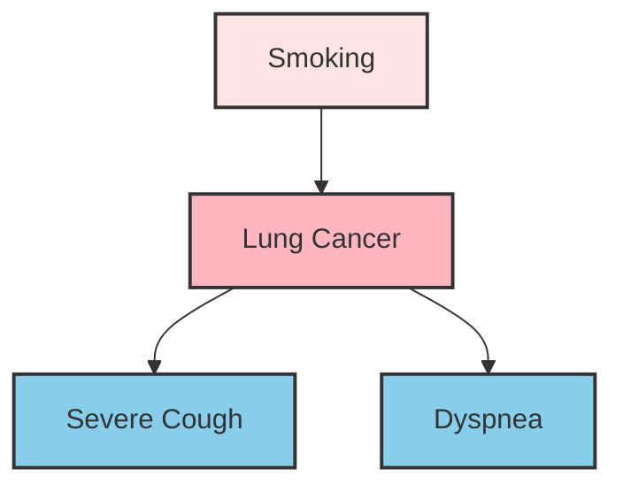
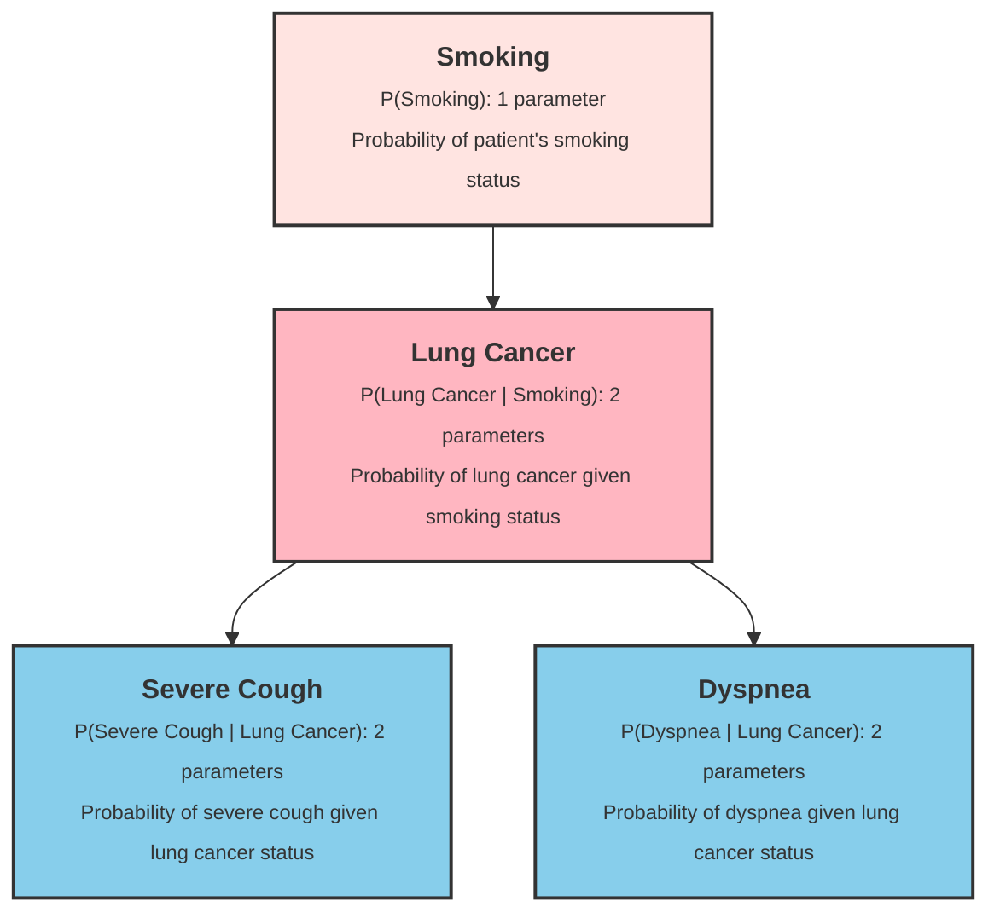

# Bayesian Network

In 1988, AI pioneer Judea Pearl published [Probabilistic Reasoning in Intelligent Systems](https://dl.acm.org/doi/book/10.5555/534975), which first systematically introduced the concept of **Bayesian Networks**, combining probability theory with graph theory to solve the long-standing problem of reasoning under uncertainty in artificial intelligence. Pearl received the 2011 Turing Award for this work, and Bayesian Networks have since become one of the most important probabilistic graphical models, widely applied in medical diagnosis, fault detection, risk assessment, and more.

In the [Naive Bayes](naive-bayes.md) chapter, we learned how the "naive" assumption (feature independence) simplifies Bayesian computation. However, variables in the real world often have complex dependencies. For example, fever and cough are both related to a cold, but they may also influence each other; income and education level jointly affect loan approval, yet income and education are also correlated. Bayesian Networks are designed precisely for such problems, providing a systematic way to model dependencies between variables — capable of expressing complex probabilistic relationships while enabling efficient probabilistic inference.

## Graph Structure

The success of Naive Bayes stems from its bold assumption that features are mutually independent, decomposing the joint probability directly into a product of conditional probabilities and greatly reducing computational complexity. However, this comes at the cost of accuracy, losing the correlation information between features. How can we retain feature correlations while keeping joint probability computation feasible? Bayesian Networks solve this by using a graph structure to explicitly represent dependencies between variables, modeling only direct dependencies and deriving indirect ones through the graph structure. This strategy avoids the complexity of modeling all correlations while preserving the essential dependency information.

The graph structure of a Bayesian Network is a **Directed Acyclic Graph (DAG)**, where **nodes** represent random variables, **directed edges** (e.g., $A \rightarrow B$) indicate "A directly influences B," and **acyclic** means there are no cyclic paths, ensuring causal relationships are sound and preventing circular causality. Suppose we want to model the relationships between smoking, lung cancer, severe cough, and shortness of breath. The resulting DAG would look like the following:


*Figure: DAG of a medical diagnosis network*

"Smoking → Lung Cancer" expresses that smoking, as a risk factor, increases the probability of developing lung cancer; "Lung Cancer → Severe Cough" expresses that cancer can cause severe coughing; "Lung Cancer → Dyspnea" expresses that cancer can lead to symptoms of shortness of breath. In a DAG, each node has a clear family relationship. A **parent** is a node that points to another node, representing a direct influencer; a **child** is a node pointed to by another node, representing the one being influenced. In the diagram above, "Lung Cancer" has "Smoking" as its parent and "Severe Cough" and "Dyspnea" as its children; "Smoking," as the parent of "Lung Cancer," is also an ancestor of "Severe Cough" and "Dyspnea."

## Conditional Independence

In a Bayesian Network, each node follows a fundamental rule called **Conditional Independence**: given its parents, a node is conditionally independent of all its non-descendants. In reality, every feature may depend on any other feature, forming a network of relationships. Naive Bayes's unconditional independence assumption simply ignores dependencies, turning the network into a set of isolated points. The conditional independence rule, on the other hand, transforms the network of dependencies into tree-like (or forest-like) dependencies. Continuing with the medical diagnosis network:

- **From "Lung Cancer"'s perspective**: Given the state of "Lung Cancer," "Severe Cough" and "Dyspnea" are conditionally independent. If we know a patient indeed has lung cancer, whether they cough and whether they have shortness of breath provide no additional information about each other — both are symptoms caused by lung cancer, with no direct causal relationship between them.

- **From "Smoking"'s perspective**: Given the state of "Lung Cancer," "Smoking" is conditionally independent of both "Dyspnea" and "Severe Cough." This is intuitive: if we already know whether the patient has lung cancer, the smoking risk factor no longer influences symptom prediction. Lung cancer acts as a mediator between smoking and symptoms, blocking the flow of information.

Thus, each node in a DAG only needs to handle its relationship with its parents. Bayesian Networks leverage conditional independence to greatly simplify probability calculations, making joint probability computation feasible even after abandoning the naive assumption. Without the DAG structure, the joint probability distribution of four binary variables (Smoking, Lung Cancer, Dyspnea, Severe Cough) would have a search space of $2^4 - 1 = 15$ possibilities, requiring the model to store 15 parameters. In a Bayesian Network, however, we only need to build a **Conditional Probability Table (CPT)** for each node, as shown below:


*Figure: CPT of a medical diagnosis network*

Each node has a CPT that stores its probability distribution given the values of its parents. The model requires only 7 parameters in total, and this saving grows exponentially with the number of variables. The graph structure tells us "who influences whom," while the conditional probability tables tell us "how strong the influence is." Using the CPTs, the joint probability can be decomposed into a product of simple conditional probabilities.

For the medical diagnosis network, the joint probability of four interrelated features — Smoking, Lung Cancer, Dyspnea, and Severe Cough — is transformed into the product of four conditional probabilities:

$$P(\text{Smoking}, \text{Lung Cancer}, \text{Dyspnea}, \text{Severe Cough}) = P(\text{Smoking}) \cdot P(\text{Lung Cancer} | \text{Smoking}) \cdot P(\text{Dyspnea} | \text{Lung Cancer}) \cdot P(\text{Severe Cough} | \text{Lung Cancer})$$

More generally, in a Bayesian Network, the joint probability of $X$ is the product of each node's conditional probability given its parents:

$$P(X_1, X_2, \ldots, X_n) = \prod_{i=1}^{n} P(X_i | \text{Parents}(X_i))$$

## Inference in Bayesian Networks

Given the structure and parameters (CPT) of a Bayesian Network, we can perform [Statistical Inference](../../maths/probability/statistical-inference.md) to compute the posterior probability of unknown variables based on known evidence. This is analogous to a doctor inferring the probability of a disease based on a patient's symptoms and test results. In Bayesian Networks, inference tasks fall into three main categories, listed here in increasing order of complexity:

1. **Posterior Probability Query**: This is the most basic form of inference. Given observed values $e$ for a set of evidence variables $E$, compute the posterior probability distribution $P(Q | E=e)$ of a query variable $Q$. Using the medical diagnosis network as an example:
    - **Evidence**: The patient exhibits severe cough symptoms, i.e., $E = \{\text{Severe Cough} = \text{Yes}\}$
    - **Query Variable**: Whether the patient has lung cancer, i.e., $Q = \{\text{Lung Cancer}\}$
    - **Inference Goal**: Compute $P(\text{Lung Cancer} = \text{Yes} | \text{Severe Cough} = \text{Yes})$ and $P(\text{Lung Cancer} = \text{No} | \text{Severe Cough} = \text{Yes})$

    According to Bayes' theorem, this posterior probability can be computed using the CPTs and the graph structure. The presence of severe cough increases the posterior probability of lung cancer because the CPT tells us that $P(\text{Severe Cough} = \text{Yes} | \text{Lung Cancer} = \text{Yes})$ is much higher than $P(\text{Severe Cough} = \text{Yes} | \text{Lung Cancer} = \text{No})$.

2. **Maximum A Posteriori (MAP) Query**: MAP query extends probability query. Given evidence, find the most likely value combination of the query variables, i.e., solve $q^* = \arg\max_{q} P(Q=q | E=e)$. Unlike probability queries which return the full distribution, MAP returns only the single most likely value. Continuing with the diagnosis example:
    - **Evidence**: Severe cough and dyspnea, i.e., $E = \{\text{Severe Cough} = \text{Yes}, \text{Dyspnea} = \text{Yes}\}$
    - **Query Variable**: Lung cancer status, i.e., $Q = \{\text{Lung Cancer}\}$
    - **Inference Goal**: Compare $P(\text{Lung Cancer} = \text{Yes} | \text{Severe Cough} = \text{Yes}, \text{Dyspnea} = \text{Yes})$ with $P(\text{Lung Cancer} = \text{No} | \text{Severe Cough} = \text{Yes}, \text{Dyspnea} = \text{Yes})$, returning the more likely state

    The simultaneous presence of both symptoms provides stronger evidence, and the MAP query synthesizes this information to give the most probable diagnosis. Note the difference between MAP and probability queries: MAP answers "what is the most likely diagnosis," while a probability query answers "what are the probabilities of each diagnosis."

3. **Most Probable Explanation (MPE)**: MPE is the highest level of inference. Given evidence, find the most likely joint assignment of all non-evidence variables, i.e., solve $x^* = \arg\max_{x} P(X=x | E=e)$, where $X$ includes all non-evidence variables in the network. Unlike MAP, which only focuses on query variables, MPE finds the most probable configuration for all hidden variables simultaneously. For example:
    - **Evidence**: The patient exhibits severe cough symptoms
    - **Hidden Variables**: Smoking, Lung Cancer, Dyspnea
    - **Inference Goal**: Find the most likely joint state of $\{\text{Smoking}, \text{Lung Cancer}, \text{Dyspnea}\}$

    Possible candidate explanations include "Smoking = Yes, Lung Cancer = Yes, Dyspnea = Yes," "Smoking = No, Lung Cancer = Yes, Dyspnea = No," and so on. MPE computes the posterior probability of each complete configuration and returns the one with the highest probability. This is equivalent to answering: "What is the complete scenario that best explains the observed evidence?"

The relationship between the three types of inference can be summarized as: probability queries answer "what is the probability distribution," MAP answers "what is the best value combination of the query variables," and MPE answers "what is the best overall state configuration of the entire network." The most commonly used inference method for Bayesian Networks is **Enumeration Inference**. Its core idea is to leverage the factorization property of Bayesian Networks by enumerating all hidden variable assignments consistent with the evidence to compute the posterior distribution of the query variable. The specific steps are as follows:

1. **Identify variable categories**. Categorize variables in the network into three types:
    - **Evidence variables** $E$: variables with observed values (e.g., Severe Cough = Yes)
    - **Query variables** $Q$: variables to be inferred (e.g., Lung Cancer)
    - **Hidden variables** $H$: variables that are neither evidence nor query (e.g., Smoking, Dyspnea)

2. **Enumerate hidden variables**. Enumerate all possible value combinations for each hidden variable. For example, with two binary hidden variables $H_1, H_2$, we enumerate four cases: $(H_1=\text{Yes}, H_2=\text{Yes})$, $(H_1=\text{Yes}, H_2=\text{No})$, $(H_1=\text{No}, H_2=\text{Yes})$, $(H_1=\text{No}, H_2=\text{No})$.

3. **Compute joint probability**. For each hidden variable assignment, combined with known evidence and assumed query variable values, compute the joint probability using the chain rule:
$$P(Q=q, E=e, H=h) = \prod_{i=1}^{n} P(X_i | \text{Parents}(X_i))$$

4. **Marginalize and normalize**. Sum over all hidden variable assignments to obtain the unnormalized probability of the query variable, then normalize by dividing by the total sum:
$$P(Q=q | E=e) = \frac{\sum_{h} P(Q=q, E=e, H=h)}{\sum_{q'} \sum_{h} P(Q=q', E=e, H=h)}$$

Enumeration inference has the advantage of being conceptually clear, simple to implement, and capable of producing exact inference results. Its drawback is that computational complexity grows exponentially with the number of hidden variables ($O(2^{|H|})$), making it suitable only for small networks. For large networks, more efficient inference algorithms such as variable elimination and belief propagation are needed. The following code implements inference for the diagnosis network using enumeration:

```python runnable extract-class="SimpleBayesianNetwork"
import numpy as np
import matplotlib.pyplot as plt

class SimpleBayesianNetwork:
    """
    A simple Bayesian Network implementation
    supporting discrete variables and exact inference (enumeration)
    """
    def __init__(self):
        self.nodes = {}  # node info: {name: {'parents': [], 'values': []}}
        self.cpts = {}   # CPT: {name: {parent_values: {value: prob}}}
        self.topo_order = []  # topological order
    
    def add_node(self, name, values, parents=None):
        """Add a node"""
        if parents is None:
            parents = []
        self.nodes[name] = {'parents': parents, 'values': values}
        self._update_topo_order()
    
    def set_cpt(self, name, cpt):
        """
        Set conditional probability table
        
        cpt format: {parent_value_tuple: {value: prob}}
        For root nodes (no parents): {(): {value: prob}}
        """
        self.cpts[name] = cpt
    
    def _update_topo_order(self):
        """Compute topological order"""
        visited = set()
        order = []
        
        def visit(node):
            if node in visited:
                return
            visited.add(node)
            for parent in self.nodes[node]['parents']:
                visit(parent)
            order.append(node)
        
        for node in self.nodes:
            visit(node)
        
        self.topo_order = order
    
    def get_prob(self, name, value, parent_values):
        """Get conditional probability P(name=value | parent_values)"""
        parent_key = tuple(parent_values) if parent_values else ()
        return self.cpts[name].get(parent_key, {}).get(value, 0)
    
    def joint_prob(self, assignment):
        """Compute joint probability P(X1, X2, ...)"""
        prob = 1.0
        for node in self.topo_order:
            parents = self.nodes[node]['parents']
            parent_values = [assignment[p] for p in parents]
            value = assignment[node]
            prob *= self.get_prob(node, value, parent_values)
        return prob
    
    def enumerate_inference(self, query, evidence):
        """
        Enumeration inference: compute P(query | evidence)
        
        query: {node: '?'} returns a distribution
        evidence: {node: value}
        """
        query_nodes = list(query.keys())
        hidden = [n for n in self.nodes if n not in query_nodes and n not in evidence]
        
        def enumerate_assignments(variables, current):
            if not variables:
                yield current.copy()
                return
            var = variables[0]
            for value in self.nodes[var]['values']:
                current[var] = value
                yield from enumerate_assignments(variables[1:], current)
            del current[var]
        
        query_values = {}
        total = 0.0
        
        query_node = query_nodes[0]
        for qv in self.nodes[query_node]['values']:
            prob_sum = 0.0
            for assignment in enumerate_assignments(hidden, {}):
                assignment.update(evidence)
                assignment[query_node] = qv
                prob_sum += self.joint_prob(assignment)
            query_values[qv] = prob_sum
            total += prob_sum
        
        # Normalize
        for k in query_values:
            query_values[k] /= total
        return query_values


# Build the medical diagnosis network
bn = SimpleBayesianNetwork()

bn.add_node('Smoking', ['Yes', 'No'])
bn.add_node('LungCancer', ['Yes', 'No'], parents=['Smoking'])
bn.add_node('Dyspnea', ['Yes', 'No'], parents=['LungCancer'])
bn.add_node('SevereCough', ['Yes', 'No'], parents=['LungCancer'])

bn.set_cpt('Smoking', {(): {'Yes': 0.3, 'No': 0.7}})
bn.set_cpt('LungCancer', {
    ('Yes',): {'Yes': 0.1, 'No': 0.9},
    ('No',): {'Yes': 0.01, 'No': 0.99}
})
bn.set_cpt('Dyspnea', {
    ('Yes',): {'Yes': 0.65, 'No': 0.35},
    ('No',): {'Yes': 0.1, 'No': 0.9}
})
bn.set_cpt('SevereCough', {
    ('Yes',): {'Yes': 0.9, 'No': 0.1},
    ('No',): {'Yes': 0.05, 'No': 0.95}
})

print("=" * 60)
print("Bayesian Network Inference Demo")
print("=" * 60)

# 1. Unconditional probability
print("\n1. Unconditional Probability P(Lung Cancer):")
result1 = bn.enumerate_inference({'LungCancer': '?'}, {})
print(f"   P(LungCancer=Yes) = {result1['Yes']:.4f}")
print(f"   P(LungCancer=No) = {result1['No']:.4f}")

# 2. Single evidence inference
print("\n2. P(Lung Cancer | Severe Cough=Yes):")
result2 = bn.enumerate_inference({'LungCancer': '?'}, {'SevereCough': 'Yes'})
print(f"   P(LungCancer=Yes | Severe Cough) = {result2['Yes']:.4f}")
print(f"   P(LungCancer=No | Severe Cough) = {result2['No']:.4f}")

# 3. Multiple evidence inference
print("\n3. P(Lung Cancer | Smoking=Yes, Severe Cough=Yes):")
result3 = bn.enumerate_inference({'LungCancer': '?'}, {'Smoking': 'Yes', 'SevereCough': 'Yes'})
print(f"   P(LungCancer=Yes | Smoking, Severe Cough) = {result3['Yes']:.4f}")
print(f"   P(LungCancer=No | Smoking, Severe Cough) = {result3['No']:.4f}")

# 4. Reverse inference (diagnostic inference)
print("\n4. P(Smoking | Lung Cancer=Yes):")
result4 = bn.enumerate_inference({'Smoking': '?'}, {'LungCancer': 'Yes'})
print(f"   P(Smoking=Yes | Lung Cancer) = {result4['Yes']:.4f}")
print(f"   P(Smoking=No | Lung Cancer) = {result4['No']:.4f}")

# Visualize inference results
fig, ax = plt.subplots(figsize=(12, 6))

scenarios = ['No Evidence', 'Cough Only', 'Smoking+Cough', 'Reverse Diag.\n(Ca.→Smoke)']
p_cancer_yes = [result1['Yes'], result2['Yes'], result3['Yes'], result4['Yes']]
p_cancer_no = [result1['No'], result2['No'], result3['No'], result4['No']]

x = np.arange(len(scenarios))
width = 0.35

bars1 = ax.bar(x - width/2, p_cancer_yes, width, label='Yes', color='#FF6B6B', edgecolor='#333', lw=2)
bars2 = ax.bar(x + width/2, p_cancer_no, width, label='No', color='#90EE90', edgecolor='#333', lw=2)

ax.set_ylabel('Probability', fontsize=12)
ax.set_title('Inference Results Under Differing Evidence', fontsize=14)
ax.set_xticks(x)
ax.set_xticklabels(scenarios)
ax.legend(title='Yes/No', fontsize=11)
ax.set_ylim(0, 1)
ax.grid(True, alpha=0.3, axis='y')

for bar, prob in zip(bars1, p_cancer_yes):
    ax.text(bar.get_x() + bar.get_width()/2, bar.get_height() + 0.02, f'{prob:.2%}', ha='center', fontsize=11)

plt.tight_layout()
plt.show()
plt.close()
```

Key inference characteristics can be observed from the visualization results:

- **Unconditional Probability**: The probability of lung cancer is only 3.7%, reflecting the population's overall prevalence rate.
- **Single Evidence Inference**: After observing severe cough, the probability of lung cancer jumps to 40.88%, demonstrating the significant impact of evidence.
- **Multiple Evidence Inference**: Under the combined evidence of smoking and severe cough, the probability of lung cancer reaches 66.67%.
- **Reverse Inference**: Given lung cancer, the probability of smoking rises from 30% to 81.08%, showcasing the "reverse reasoning" capability of Bayesian methods.

This is the essence of Bayesian Networks: information can flow bidirectionally along directed edges. Forward inference (prediction) reasons from cause to effect; reverse inference (diagnosis) reasons from effect back to cause.

## Summary

Bayesian Networks combine probability theory with graph theory, using directed acyclic graphs to explicitly model dependencies between variables. They establish a paradigm for structured probabilistic modeling: first determine the dependency structure between variables (qualitative), then quantify the strength of dependencies (quantitative), and finally use probabilistic rules for inference. This paradigm runs throughout the entire field of probabilistic graphical models — from Hidden Markov Models to Markov Random Fields, their core ideas all trace back to Bayesian Networks. However, Bayesian Networks also have limitations: when variables have complex dependencies or when there are **latent variables** (unobservable variables), network learning and inference become difficult. In the next chapter, we will study the [EM Algorithm](em-algorithm.md) for handling problems with latent variables.

## Exercises

Given the following Bayesian Network structure, analyze the conditional independence relationships between each node:

   ```mermaid compact
   graph TD
       %% Edge definitions
       W[Weather] --> U[Umbrella]
       F[Forecast] --> U[Umbrella]
       W[Weather] --> M[Mood]
   ```

   - When `Weather = Rainy` is known, are `Mood` and `Forecast` conditionally independent? Why?
   - When `Umbrella = Yes` is known, are `Weather` and `Forecast` independent?
   - To infer `Mood`, which variables are relevant evidence variables?

   <details>
   <summary>Answer Key</summary>

   **Conditional Independence Analysis**:

   When `Weather = Rainy` is known, `Mood` and `Forecast` are conditionally independent.

   Reason: The parent of `Mood` is `Weather`. According to the conditional independence property of Bayesian Networks, given its parents, a node is independent of all its non-descendants. Since `Weather` is the parent of `Mood`, and `Forecast` is not a descendant of `Mood`, `Mood` and `Forecast` are conditionally independent given `Weather`.

   **Head-to-Head Structure (V-Structure)**:

   When `Umbrella = Yes` is known, `Weather` and `Forecast` are not independent — they become correlated.

   This is a classic **head-to-head structure (V-structure)**: `Weather → Umbrella ← Forecast`. In a head-to-head structure, when the child node (`Umbrella`) or any of its descendants is observed, an **explaining away** effect occurs between the two parents (`Weather` and `Forecast`), making them correlated.

   For example: if we observe that an umbrella is being carried, but the forecast says sunny (low probability of carrying umbrella), then the inferred probability of rain increases. The forecast information influences the judgment about the weather.

   **Relevant Evidence Variables**:

   When inferring `Mood`, the only directly relevant evidence variable is `Weather`.

   Reason: The only parent of `Mood` is `Weather`. According to conditional independence, given `Weather`, `Mood` is independent of all other variables in the network. Therefore, neither `Forecast` nor `Umbrella` can provide additional information about `Mood` — they can only influence `Mood` indirectly through `Weather`.
   </details>
